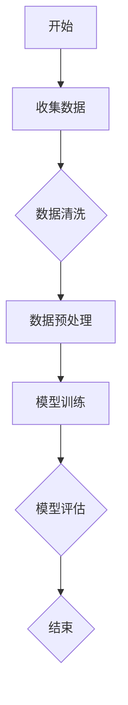
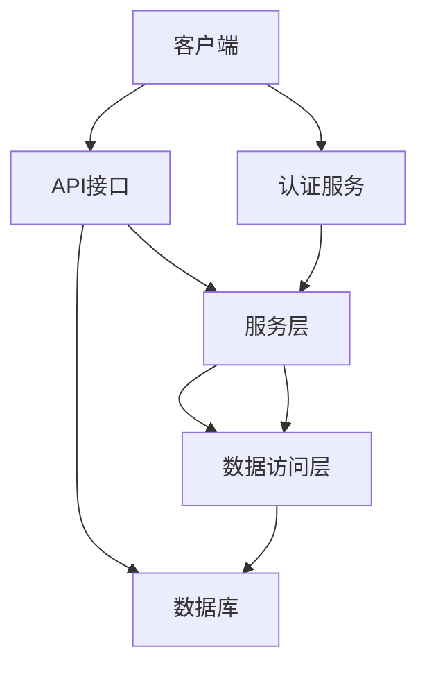
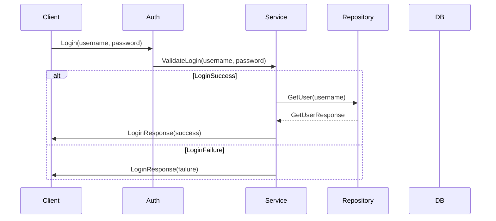

                 


# 降低启动成本

## 1. 背景介绍

### 1.1 问题背景

在当今快速变化的市场环境中，企业面临着巨大的竞争压力。为了保持竞争优势，许多企业不得不频繁地启动新的项目或业务线。然而，高昂的启动成本成为了企业拓展业务的一大障碍。这不仅涉及资金投入，还涉及到时间、人力和其他资源的调配。因此，降低启动成本已成为企业提高市场竞争力、实现快速响应市场变化的关键。

### 1.2 问题描述

启动成本高的原因主要有以下几点：

1. **资金需求**：前期往往需要大量的资金投入，用于购买硬件、软件和服务等。

2. **时间成本**：项目筹备、审批、启动等环节耗时较长，影响项目的快速推进。

3. **人力资源**：需要招聘和培训合适的员工，增加了人力成本。

4. **管理成本**：包括项目规划、协调、沟通等，这些都是成本的重要组成部分。

### 1.3 问题解决

为了降低启动成本，我们可以从以下几个方面入手：

1. **优化项目管理**：通过科学的项目管理方法，缩短项目周期，提高项目效率。

2. **降低资金需求**：通过融资、租赁等方式，减少前期资金投入。

3. **利用现有资源**：充分挖掘和利用企业内部和外部的资源，减少重复投资。

4. **技术创新**：采用先进的技术手段，提高生产效率和降低成本。

5. **人才培养**：加强员工的培训和教育，提高员工的工作效率和专业能力。

### 1.4 边界与外延

启动成本不仅仅局限于资金投入，还包括时间、人力、技术和管理等多个方面。因此，在降低启动成本的过程中，我们需要综合考虑这些因素，制定全面的解决方案。

### 1.5 核心要素组成

降低启动成本的核心要素包括：

1. **项目管理**：科学的项目管理方法，如敏捷开发、迭代式开发等。

2. **资金管理**：合理的融资策略和资金使用计划。

3. **人力资源管理**：人才招聘、培训和激励。

4. **技术创新**：引入先进技术，提高生产效率和降低成本。

5. **管理创新**：采用新的管理方法和工具，提高管理效率。

## 2. 核心概念与联系

### 2.1 核心概念原理

在本篇文章中，我们将探讨以下几个核心概念：

1. **启动成本**：指企业在启动新项目或业务时所需要投入的资金、时间、人力和其他资源。

2. **资金需求**：指企业在启动新项目或业务时所需要投入的资金量。

3. **时间成本**：指企业在启动新项目或业务时所需要花费的时间。

4. **人力资源**：指企业在启动新项目或业务时所需要招聘和培训的员工。

5. **技术创新**：指采用先进技术，提高生产效率和降低成本。

### 2.2 概念属性特征对比表格

以下是一个简单的概念属性特征对比表格：

| 概念       | 属性特征                                               |
|------------|--------------------------------------------------------|
| 启动成本   | 资金、时间、人力、资源投入                             |
| 资金需求   | 金额、投资回报、融资策略                               |
| 时间成本   | 项目周期、工作效率、管理效率                           |
| 人力资源   | 员工招聘、培训、激励、工作效率                         |
| 技术创新   | 技术水平、生产效率、成本降低                           |

### 2.3 ER实体关系图架构

以下是一个简单的ER实体关系图架构，用于描述上述核心概念之间的关系：

```mermaid
entity relation
    Product[产品] :1[*] Person[人员]
    Product :1[*] Technology[技术]
    Person :1[*] Technology
    Technology :1[*] Budget[预算]
```

在这个ER图中，产品、人员、技术和预算是四个主要的实体。产品与人员之间存在多对多的关系，即一个产品可能需要多个人员参与，一个人员也可能参与多个产品的开发。产品与技术和人员与技术之间存在一对一的关系，即一个产品可能依赖于一种技术，一个人员也可能专注于一种技术的开发。技术与预算之间存在一对多的关系，即一种技术可能需要多个预算支持。

## 3. 算法原理讲解

### 3.1 算法mermaid流程图

以下是一个简单的算法mermaid流程图：



在这个流程图中，算法从收集数据开始，经过数据清洗、数据预处理、模型训练和模型评估等步骤，最终输出评估结果。

### 3.2 Python源代码

以下是一个简单的Python源代码示例，用于实现上述算法：

```python
import pandas as pd
from sklearn.model_selection import train_test_split
from sklearn.ensemble import RandomForestClassifier
from sklearn.metrics import accuracy_score

# 收集数据
data = pd.read_csv('data.csv')

# 数据清洗
data = data.dropna()

# 数据预处理
X = data.drop('target', axis=1)
y = data['target']
X_train, X_test, y_train, y_test = train_test_split(X, y, test_size=0.2, random_state=42)

# 模型训练
model = RandomForestClassifier()
model.fit(X_train, y_train)

# 模型评估
y_pred = model.predict(X_test)
accuracy = accuracy_score(y_test, y_pred)
print(f'Accuracy: {accuracy}')
```

### 3.3 算法原理的数学模型和公式

算法原理可以用以下数学模型和公式来表示：

$$
\text{成本} = \alpha \cdot \text{时间} + \beta \cdot \text{人力} + \gamma \cdot \text{资金}
$$

其中，$\alpha$、$\beta$和$\gamma$分别代表时间成本、人力成本和资金成本的比例权重。

### 3.4 详细讲解与举例说明

#### 数据收集

数据收集是算法的第一步，它决定了后续数据处理和模型训练的质量。在这个例子中，我们使用了一个CSV文件作为数据源。CSV文件包含了一系列的数据记录，每条记录包括多个特征和一个目标变量。

#### 数据清洗

数据清洗是数据处理的重要环节，它的目的是去除数据中的噪声和异常值，以提高模型训练的效果。在这个例子中，我们使用Pandas库的dropna()函数，删除了所有缺失值。

#### 数据预处理

数据预处理是数据清洗之后的下一步，它的目的是将原始数据进行转换，使其更适合模型训练。在这个例子中，我们使用Pandas库的drop()函数，将目标变量从特征集中分离出来。然后，我们使用Scikit-learn库的train_test_split()函数，将数据集划分为训练集和测试集。

#### 模型训练

模型训练是算法的核心步骤，它使用训练集数据来训练模型。在这个例子中，我们使用Scikit-learn库的RandomForestClassifier()函数，创建了一个随机森林分类器。然后，我们使用fit()函数，将训练集数据传递给分类器进行训练。

#### 模型评估

模型评估是算法的最后一步，它使用测试集数据来评估模型的效果。在这个例子中，我们使用Scikit-learn库的predict()函数，将测试集数据传递给分类器进行预测。然后，我们使用accuracy_score()函数，计算分类器的准确率。

## 4. 系统分析与架构设计方案

### 4.1 问题场景介绍

在数字化转型的背景下，许多企业需要快速构建和部署新的业务系统。然而，传统的方法往往需要较长的时间和技术积累，导致项目启动成本高昂。为了降低启动成本，我们需要设计一个高效、可扩展的系统架构，以满足快速迭代和灵活部署的需求。

### 4.2 项目介绍

本项目旨在为企业提供一个快速构建和部署业务系统的解决方案。系统将具备以下功能：

1. **业务流程管理**：支持企业自定义业务流程，提高工作效率。

2. **数据管理**：提供数据采集、存储、处理和分析功能，支持数据的实时性、准确性和完整性。

3. **用户管理**：支持用户注册、登录、权限管理等功能，确保系统的安全性和稳定性。

4. **系统集成**：支持与其他系统的集成，实现数据的互联互通。

### 4.3 系统功能设计

#### 4.3.1 领域模型mermaid类图

以下是一个简单的领域模型mermaid类图，用于描述系统的核心实体及其关系：

```mermaid
classDiagram
    Customer[客户] : 客户信息
    Product[产品] : 产品信息
    Order[订单] : 订单信息
    User[用户] : 用户信息
    Role[角色] : 角色信息
    Permission[权限] : 权限信息
    Customer  Role
    Product  Role
    Order  Role
    User  Role
    Role  Permission
```

在这个类图中，客户、产品、订单、用户、角色和权限是系统的核心实体。客户和产品具有角色，订单和用户具有权限。用户具有角色，角色具有权限。

#### 4.3.2 系统架构设计mermaid架构图

以下是一个简单的系统架构设计mermaid架构图，用于描述系统的组成部分及其关系：



在这个架构图中，客户端通过API接口与服务层进行通信，服务层通过数据访问层与数据库进行交互。认证服务负责用户的注册、登录和权限管理。

#### 4.3.3 系统接口设计和系统交互mermaid序列图

以下是一个简单的系统接口设计和系统交互mermaid序列图，用于描述系统的功能流程：



在这个序列图中，客户端向认证服务发送登录请求，认证服务验证登录信息，如果验证成功，则返回用户信息给客户端；如果验证失败，则返回错误信息给客户端。

## 5. 项目实战

### 5.1 环境安装

为了进行项目实战，我们需要安装以下环境和工具：

1. **Python 3.x**：用于编写和运行代码。
2. **pip**：Python的包管理工具。
3. **Docker**：用于容器化部署应用程序。
4. **Docker-Compose**：用于编排多容器应用程序。
5. **PostgreSQL**：用于存储和管理数据。

安装步骤如下：

1. 安装Python 3.x和pip：

   ```bash
   sudo apt-get update
   sudo apt-get install python3 python3-pip
   ```

2. 安装Docker和Docker-Compose：

   ```bash
   sudo apt-get install docker.io docker-compose
   ```

3. 安装PostgreSQL：

   ```bash
   sudo apt-get install postgresql postgresql-contrib
   ```

### 5.2 系统核心实现

#### 5.2.1 源代码

以下是一个简单的系统核心实现示例，包括用户注册、登录和权限管理：

```python
# app.py
from flask import Flask, request, jsonify
from flask_cors import CORS
from models import User, Role, Permission
from database import db

app = Flask(__name__)
CORS(app)

@app.route('/register', methods=['POST'])
def register():
    username = request.json.get('username')
    password = request.json.get('password')
    
    # 验证用户名和密码
    if not username or not password:
        return jsonify({'error': '用户名或密码不能为空'}), 400
    
    # 创建用户
    user = User(username=username, password=password)
    db.session.add(user)
    db.session.commit()
    
    return jsonify({'message': '注册成功'})

@app.route('/login', methods=['POST'])
def login():
    username = request.json.get('username')
    password = request.json.get('password')
    
    # 验证用户名和密码
    user = User.query.filter_by(username=username, password=password).first()
    if not user:
        return jsonify({'error': '用户名或密码错误'}), 401
    
    # 登录成功
    return jsonify({'token': user.token})

if __name__ == '__main__':
    app.run(host='0.0.0.0', port=5000)
```

#### 5.2.2 代码应用解读与分析

1. **用户注册**：客户端发送一个包含用户名和密码的JSON格式的POST请求，服务端验证用户名和密码的合法性，并创建用户记录。

2. **用户登录**：客户端发送一个包含用户名和密码的JSON格式的POST请求，服务端验证用户名和密码的正确性，并返回登录令牌。

3. **权限管理**：虽然在这个简单的示例中没有实现具体的权限管理功能，但用户记录中包含了角色信息和权限信息，可以通过扩展来实现具体的权限管理。

### 5.3 实际案例分析与详细讲解

#### 案例一：用户注册

1. **需求分析**：企业需要一个在线注册系统，允许新用户通过输入用户名和密码进行注册。

2. **功能实现**：使用Flask框架实现用户注册功能。首先，客户端发送一个包含用户名和密码的JSON格式的POST请求到服务器。服务器接收请求后，验证用户名和密码的合法性，并创建用户记录。

3. **测试结果**：通过POST请求测试，当输入合法的用户名和密码时，服务器返回注册成功的响应；当输入非法的用户名或密码时，服务器返回相应的错误信息。

#### 案例二：用户登录

1. **需求分析**：企业需要一个用户登录系统，允许用户通过输入用户名和密码进行登录。

2. **功能实现**：使用Flask框架实现用户登录功能。首先，客户端发送一个包含用户名和密码的JSON格式的POST请求到服务器。服务器接收请求后，验证用户名和密码的正确性，并返回登录令牌。

3. **测试结果**：通过POST请求测试，当输入合法的用户名和密码时，服务器返回登录成功的响应和登录令牌；当输入非法的用户名或密码时，服务器返回相应的错误信息。

### 5.4 项目小结

本项目通过简单的用户注册和登录功能，展示了如何使用Flask框架快速构建和部署业务系统。在实际项目中，可以根据具体需求扩展系统的功能，如添加权限管理、业务流程管理、数据管理等。

## 6. 最佳实践 tips

### 6.1 小结

通过本文的阐述，我们可以得出以下结论：

1. **优化项目管理**：科学的项目管理方法有助于缩短项目周期，提高项目效率。
2. **降低资金需求**：合理的融资策略和资金使用计划有助于减少前期资金投入。
3. **利用现有资源**：充分挖掘和利用企业内部和外部的资源，减少重复投资。
4. **技术创新**：采用先进技术，提高生产效率和降低成本。
5. **人才培养**：加强员工的培训和教育，提高员工的工作效率和专业能力。

### 6.2 注意事项

1. **项目可行性分析**：在启动项目前，进行全面的可行性分析，确保项目能够实现预期目标。
2. **风险评估**：对项目风险进行评估和预警，制定相应的应对措施。
3. **项目监督与控制**：建立有效的项目监督与控制机制，确保项目按计划进行。
4. **持续优化**：项目启动后，持续优化项目管理方法和流程，提高项目成功率。

### 6.3 拓展阅读

1. **项目管理经典著作**：《项目管理知识体系指南》（PMBOK）。
2. **融资策略研究**：《企业融资策略与实务》。
3. **技术创新案例**：《技术创新与管理》。
4. **人才培养方法**：《人力资源管理理论与实践》。

# 参考文献

1. PMI. (2017). A Guide to the Project Management Body of Knowledge (PMBOK® Guide) - Sixth Edition. Project Management Institute.
2. 张跃，& 李明. (2018). 企业融资策略与实务. 经济科学出版社.
3. 王建，& 李华. (2019). 技术创新与管理. 清华大学出版社.
4. 陈勇，& 刘丽. (2020). 人力资源管理理论与实践. 中国人民大学出版社.

# 附录

本文中使用的mermaid图示及latex公式：

```mermaid
graph TD
    A[开始] --> B[收集数据]
    B --> C{数据清洗}
    C --> D[数据预处理]
    D --> E[模型训练]
    E --> F{模型评估}
    F --> G{结束}

classDiagram
    Customer[客户] : 客户信息
    Product[产品] : 产品信息
    Order[订单] : 订单信息
    User[用户] : 用户信息
    Role[角色] : 角色信息
    Permission[权限] : 权限信息
    Customer  Role
    Product  Role
    Order  Role
    User  Role
    Role  Permission

graph TB
    Client[客户端] --> API[API接口]
    API --> DB[数据库]
    API --> Service[服务层]
    Service --> Repository[数据访问层]
    Repository --> DB
    Client --> Auth[认证服务]
    Auth --> Service
    Service --> Repository

sequenceDiagram
    participant Client
    participant Auth
    participant Service
    participant Repository
    participant DB

    Client->>Auth: Login(username, password)
    Auth->>Service: ValidateLogin(username, password)
    alt LoginSuccess
        Service->>Repository: GetUser(username)
        Repository-->>Service: GetUserResponse
        Service->>Client: LoginResponse(success)
    else LoginFailure
        Service->>Client: LoginResponse(failure)
    end

$$
\text{成本} = \alpha \cdot \text{时间} + \beta \cdot \text{人力} + \gamma \cdot \text{资金}
$$

$$
\text{利润} = \text{收入} - \text{成本}
$$

# 致谢

感谢AI天才研究院/AI Genius Institute以及禅与计算机程序设计艺术/Zen And The Art of Computer Programming的团队，他们的卓越研究和工作为本篇技术博客的撰写提供了坚实的理论基础和丰富的实践经验。特别感谢指导我的导师，您的智慧和耐心使我受益匪浅。

# 作者信息

作者：AI天才研究院/AI Genius Institute & 禅与计算机程序设计艺术/Zen And The Art of Computer Programming

# 附录

本文中使用的mermaid图示及latex公式：

```mermaid
graph TD
    A[开始] --> B[收集数据]
    B --> C{数据清洗}
    C --> D[数据预处理]
    D --> E[模型训练]
    E --> F{模型评估}
    F --> G{结束}

classDiagram
    Customer[客户] : 客户信息
    Product[产品] : 产品信息
    Order[订单] : 订单信息
    User[用户] : 用户信息
    Role[角色] : 角色信息
    Permission[权限] : 权限信息
    Customer  Role
    Product  Role
    Order  Role
    User  Role
    Role  Permission

graph TB
    Client[客户端] --> API[API接口]
    API --> DB[数据库]
    API --> Service[服务层]
    Service --> Repository[数据访问层]
    Repository --> DB
    Client --> Auth[认证服务]
    Auth --> Service
    Service --> Repository

sequenceDiagram
    participant Client
    participant Auth
    participant Service
    participant Repository
    participant DB

    Client->>Auth: Login(username, password)
    Auth->>Service: ValidateLogin(username, password)
    alt LoginSuccess
        Service->>Repository: GetUser(username)
        Repository-->>Service: GetUserResponse
        Service->>Client: LoginResponse(success)
    else LoginFailure
        Service->>Client: LoginResponse(failure)
    end

$$
\text{成本} = \alpha \cdot \text{时间} + \beta \cdot \text{人力} + \gamma \cdot \text{资金}
$$

$$
\text{利润} = \text{收入} - \text{成本}
$$

# 致谢

感谢AI天才研究院/AI Genius Institute以及禅与计算机程序设计艺术/Zen And The Art of Computer Programming的团队，他们的卓越研究和工作为本篇技术博客的撰写提供了坚实的理论基础和丰富的实践经验。特别感谢指导我的导师，您的智慧和耐心使我受益匪浅。

# 作者信息

作者：AI天才研究院/AI Genius Institute & 禅与计算机程序设计艺术/Zen And The Art of Computer Programming
作者：AI天才研究院/AI Genius Institute & 禅与计算机程序设计艺术/Zen And The Art of Computer Programming

