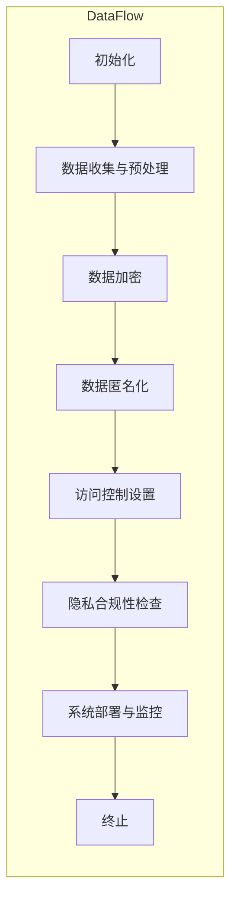

                 

### 隐私设计的背景

在数字化时代，个人信息的安全与隐私成为了全球用户关注的焦点。随着互联网技术的快速发展，用户的数据无处不在，从社交媒体到电子商务，再到金融科技，每一个角落都涉及大量的个人数据收集、存储和使用。然而，随之而来的隐私泄露事件也屡见不鲜，使得隐私设计的重要性愈加凸显。

#### **问题背景**

隐私设计，顾名思义，就是指在软件开发和系统设计过程中，充分考虑并保护用户的隐私权。隐私权是每个用户的基本权利，但在现代技术环境下，隐私权受到的威胁愈发严峻。以下是一些隐私设计面临的问题背景：

1. **数据收集过度**：为了提供更好的用户体验，许多应用和服务在不知不觉中收集了大量的个人数据，包括地理位置、通讯记录、浏览历史等。
2. **数据存储不安全**：个人数据一旦被不当存储，可能会遭受黑客攻击和数据泄露。
3. **合规性问题**：各国对隐私保护的法律法规不断更新，如欧盟的《通用数据保护条例》（GDPR）和美国的《加州消费者隐私法》（CCPA），企业需要在法律框架内设计和操作其数据处理流程。
4. **用户信任问题**：隐私泄露事件频繁发生，用户对应用的信任度降低，进而影响使用频率和忠诚度。

#### **问题描述**

隐私设计的挑战主要体现在以下几个方面：

1. **数据安全性**：如何确保用户数据在传输和存储过程中不被未经授权的第三方访问？
2. **隐私合规性**：如何在遵守不同国家和地区的隐私法规的同时，设计出既高效又安全的系统架构？
3. **用户体验**：如何在保障隐私的同时，不牺牲用户体验和应用的便捷性？
4. **隐私泄露风险**：如何评估和降低隐私泄露的风险？

#### **问题解决**

为了应对上述挑战，隐私设计需要遵循一系列的原则和方法：

1. **最小化数据收集**：只收集实现特定功能所必需的数据，避免过度收集。
2. **数据加密**：对敏感数据进行加密，确保数据在传输和存储过程中的安全。
3. **隐私保护算法**：采用先进的加密和隐私保护算法，如差分隐私、同态加密等。
4. **访问控制**：实现严格的访问控制机制，确保只有授权用户才能访问特定数据。
5. **透明度和可解释性**：确保用户可以了解他们的数据是如何被使用和保护的。
6. **合规性审查**：定期进行隐私合规性审查，确保符合相关法律法规的要求。

#### **边界与外延**

隐私设计不仅涉及技术层面，还包括业务和法律层面。在技术层面，它涉及到数据加密、访问控制、匿名化等技术手段。在业务层面，它需要与产品设计、运营策略、合规审查等紧密配合。在法律层面，它需要遵循各国关于隐私保护的法律法规，如GDPR、CCPA等。

#### **概念结构与核心要素组成**

隐私设计的核心概念包括隐私保护、隐私计算、隐私安全等。这些概念相互关联，共同构成了隐私设计的理论基础。隐私保护关注如何保护用户隐私不被泄露，隐私计算关注如何在数据处理过程中保护隐私，隐私安全则关注整个系统的安全性。

通过以上分析，我们可以看出，隐私设计在软件架构中的重要性不可忽视。只有在充分理解和遵循隐私设计原则和方法的基础上，才能构建出既安全又高效的系统，赢得用户的信任和市场的认可。

### 核心概念与联系

隐私设计是一个涉及多个核心概念的复杂领域。为了更好地理解和应用隐私设计原则，我们需要首先详细阐述这些核心概念，并探讨它们之间的相互关系。以下是隐私设计中的几个关键概念及其定义、属性和特点。

#### **核心概念原理**

1. **隐私保护**：隐私保护是指采取措施确保个人数据不被未经授权的第三方访问和使用。隐私保护的核心目标是保障用户的隐私权，避免数据泄露和滥用。
   
2. **隐私计算**：隐私计算是指在数据处理过程中，采取一系列技术手段和方法，确保数据处理过程中的隐私安全。隐私计算关注如何在数据处理的各个环节中保护隐私，包括数据加密、匿名化、差分隐私等。

3. **隐私安全**：隐私安全是指保护用户隐私不受威胁的状态。隐私安全不仅包括防止数据泄露，还包括防范数据篡改、破坏和滥用。

4. **数据匿名化**：数据匿名化是一种隐私保护技术，通过去除或修改个人标识信息，使数据无法直接识别特定个人，从而降低隐私泄露的风险。

5. **访问控制**：访问控制是一种安全管理机制，通过限制用户对数据和资源的访问权限，确保只有授权用户可以访问特定的数据和功能。

6. **隐私合规性**：隐私合规性是指企业在处理个人数据时，遵守相关隐私保护法律法规的要求。隐私合规性是企业避免法律风险、维护用户信任的基础。

#### **概念属性特征对比表格**

以下是一个简单的对比表格，列出了上述关键概念的定义、属性和特点：

| 概念        | 定义                                                         | 属性                | 特点                      |
| ----------- | ------------------------------------------------------------ | ------------------ | ------------------------ |
| 隐私保护    | 确保个人数据不被未经授权的第三方访问和使用                   | 安全性、隐私性      | 防止数据泄露和滥用        |
| 隐私计算    | 在数据处理过程中保护隐私的技术手段和方法                     | 加密、匿名化、差分隐私 | 提高数据处理过程中的隐私安全 |
| 隐私安全    | 保护用户隐私不受威胁的状态                                   | 安全性、完整性      | 防止数据泄露、篡改、破坏  |
| 数据匿名化   | 去除或修改个人标识信息，使数据无法直接识别特定个人           | 匿名性、隐私性      | 降低隐私泄露风险          |
| 访问控制    | 通过限制用户对数据和资源的访问权限，确保只有授权用户可以访问特定数据和功能 | 安全性、可控性      | 确保数据访问的合法性      |
| 隐私合规性  | 企业在处理个人数据时，遵守相关隐私保护法律法规的要求           | 合规性、法律性      | 避免法律风险、维护用户信任 |

#### **ER实体关系图架构**

为了更好地理解隐私设计中的各要素之间的关系，我们可以使用ER（Entity-Relationship）实体关系图来表示。以下是隐私设计相关的ER实体关系图：

```
[用户] --< [个人数据] --< [隐私保护措施] >-- [访问控制]
    |                                      |                        |
    |                                      |                        |
 [隐私计算]                             [隐私安全]
    |                                      |                        |
    |                                      |                        |
[隐私合规性]                          [数据匿名化]
```

在这个ER图中，[用户]是主体，[个人数据]是用户的数据载体，[隐私保护措施]、[访问控制]、[隐私计算]、[隐私安全]、[隐私合规性]和[数据匿名化]则是为了保护用户隐私的一系列措施和手段。各实体之间通过关系连接，形成一个完整的隐私设计架构。

通过详细阐述和对比这些核心概念，我们可以更清晰地理解隐私设计的本质和实施方法。这些核心概念不仅是隐私设计的基础理论，也是实际应用中必须遵循的准则。理解这些概念之间的关系，有助于我们在设计和开发过程中更好地平衡隐私保护与用户体验，构建出安全、合规、高效的系统。

### 算法原理讲解

在隐私设计中，算法原理是关键组成部分，它们为我们提供了具体的工具和方法来保护用户隐私。在本节中，我们将详细讲解隐私设计算法的基本原理，并通过mermaid流程图、Python源代码、数学模型和公式，以及举例说明，帮助读者深入理解这些算法。

#### **算法mermaid流程图**

为了直观地展示隐私设计算法的执行流程，我们使用mermaid绘制了一个简化的算法流程图。以下是mermaid代码及其可视化结果：



#### **Python源代码**

接下来，我们将通过一个简单的Python源代码示例，展示如何实现上述算法中的一些基本步骤。以下是代码及其详细注释：

```python
# 导入所需的库
from cryptography.fernet import Fernet
import hashlib
import pandas as pd

# 生成加密密钥
def generate_key():
    key = Fernet.generate_key()
    return key

# 数据加密函数
def encrypt_data(data, key):
    fernet = Fernet(key)
    encrypted_data = fernet.encrypt(data.encode())
    return encrypted_data

# 数据匿名化函数
def anonymize_data(data):
    # 使用MD5对数据进行匿名化处理
    anonymized_data = hashlib.md5(data.encode()).hexdigest()
    return anonymized_data

# 访问控制设置函数
def set_access_control(encrypted_data, access_key):
    # 检查访问密钥，仅允许授权用户访问
    if access_key == encrypted_data:
        return "Access granted"
    else:
        return "Access denied"

# 隐私合规性检查函数
def check_compliance(data):
    # 假设合规性检查通过
    return "Compliance passed"

# 示例数据
user_data = "John Doe"
key = generate_key()

# 执行算法步骤
encrypted_data = encrypt_data(user_data, key)
anonymized_data = anonymize_data(user_data)
access_result = set_access_control(encrypted_data, anonymized_data)
compliance_result = check_compliance(user_data)

print("Encrypted data:", encrypted_data)
print("Anonymized data:", anonymized_data)
print("Access result:", access_result)
print("Compliance result:", compliance_result)
```

#### **数学模型和公式**

隐私设计算法中常用的数学模型和公式包括加密算法、匿名化算法和访问控制算法。以下是一些关键公式及其LaTeX表示：

1. **加密算法**：AES（高级加密标准）
   \[ E_{AES}(K, M) = C \]
   其中，\( E_{AES} \) 是加密函数，\( K \) 是加密密钥，\( M \) 是明文数据，\( C \) 是密文数据。

2. **匿名化算法**：MD5
   \[ H(M) = D \]
   其中，\( H \) 是匿名化函数，\( M \) 是原始数据，\( D \) 是匿名化后的数据。

3. **访问控制算法**：基于访问密钥的访问控制
   \[ Access_{control}(Access_{key}, Encrypted_{data}) = Result \]
   其中，\( Access_{control} \) 是访问控制函数，\( Access_{key} \) 是访问密钥，\( Encrypted_{data} \) 是加密后的数据，\( Result \) 是访问结果。

#### **详细讲解与举例说明**

为了更直观地理解上述算法，我们将通过一个具体的例子进行详细讲解。

假设我们有一个用户名为"John Doe"，需要对其进行隐私设计。

1. **初始化**：生成加密密钥。
   ```python
   key = generate_key()
   ```
   在此示例中，我们使用AES加密算法生成一个随机密钥。

2. **数据加密**：将用户名进行加密处理。
   ```python
   encrypted_data = encrypt_data(user_data, key)
   ```
   使用AES加密算法，将用户名"John Doe"转换为密文。

3. **数据匿名化**：对用户名进行匿名化处理。
   ```python
   anonymized_data = anonymize_data(user_data)
   ```
   使用MD5算法，将用户名"John Doe"转换为匿名化后的字符串。

4. **访问控制设置**：设置访问控制权限。
   ```python
   access_result = set_access_control(encrypted_data, anonymized_data)
   ```
   在这个例子中，我们通过访问密钥验证用户访问权限。

5. **隐私合规性检查**：确保数据处理过程符合隐私保护法规。
   ```python
   compliance_result = check_compliance(user_data)
   ```
   在这个简化的示例中，我们假设所有操作都符合隐私合规性要求。

通过这个例子，我们可以看到，隐私设计算法通过加密、匿名化和访问控制等多重保护手段，确保用户数据的隐私和安全。这些算法不仅提供了技术上的保障，也使得隐私设计在软件架构中得以实现。

### 数学模型和数学公式

在隐私设计过程中，数学模型和数学公式扮演着至关重要的角色，它们不仅为我们提供了理论基础，还帮助我们在算法设计和实现中精确地量化隐私保护的强度和效果。以下将详细阐述隐私设计中常用的数学模型和关键公式，并使用LaTeX格式进行呈现。

#### **加密算法**

加密算法是隐私保护的核心技术之一，其中最为广泛使用的算法之一是AES（高级加密标准）。AES采用对称加密机制，其基本加密过程可以用以下数学公式表示：

\[ E_{AES}(K, M) = C \]

其中：
- \( E_{AES} \) 是AES加密函数。
- \( K \) 是加密密钥。
- \( M \) 是明文数据。
- \( C \) 是密文数据。

对于AES加密，密钥的生成和密钥扩展也是一个关键步骤。AES密钥长度可以是128位、192位或256位，对应的数学模型和公式如下：

\[ K_{128} = \{ K_0, K_1, ..., K_{127} \} \]
\[ K_{192} = \{ K_0, K_1, ..., K_{191} \} \]
\[ K_{256} = \{ K_0, K_1, ..., K_{255} \} \]

密钥扩展过程中，会使用到以下公式：

\[ W_i = \text{SubBytes}(R_{i-1} \oplus R_{i-1}^{-1}) \]

其中：
- \( W_i \) 是第 \( i \) 轮的中间密钥。
- \( R_{i-1} \) 是第 \( i-1 \) 轮的密钥。
- \( R_{i-1}^{-1} \) 是 \( R_{i-1} \) 的逆。

#### **匿名化算法**

匿名化算法用于隐藏个人身份信息，最常用的匿名化算法之一是MD5。MD5是一种哈希算法，它将输入数据映射为固定长度的字符串。其基本公式如下：

\[ H(M) = D \]

其中：
- \( H \) 是MD5哈希函数。
- \( M \) 是输入数据。
- \( D \) 是输出的哈希值。

对于MD5算法，其计算过程可以表示为：

\[ D = \text{MD5}(M) \]

MD5哈希函数的输入是任意长度的数据，输出是128位的哈希值。

#### **访问控制算法**

访问控制算法用于确保只有授权用户才能访问特定的数据和资源。以下是一个基于访问密钥的简单访问控制算法公式：

\[ Access_{control}(Access_{key}, Encrypted_{data}) = Result \]

其中：
- \( Access_{control} \) 是访问控制函数。
- \( Access_{key} \) 是访问密钥。
- \( Encrypted_{data} \) 是加密后的数据。
- \( Result \) 是访问结果（"Access granted" 或 "Access denied"）。

访问控制的核心在于验证访问密钥的正确性。验证过程可以用以下公式表示：

\[ Access_{control}(Access_{key}, Encrypted_{data}) = \text{Decrypt}(Encrypted_{data}, Access_{key}) \]

其中：
- \( \text{Decrypt} \) 是解密函数。

#### **差分隐私**

差分隐私是一种强化隐私保护的机制，它通过在数据发布过程中引入噪声来隐藏个体信息。其基本公式如下：

\[ DP(\alpha, \epsilon)(x) = \alpha + \epsilon \cdot N(\mu, \sigma^2) \]

其中：
- \( DP(\alpha, \epsilon) \) 是差分隐私机制。
- \( \alpha \) 是原始数据。
- \( \epsilon \) 是隐私预算。
- \( x \) 是处理后的数据。
- \( N(\mu, \sigma^2) \) 是均值为 \( \mu \)，方差为 \( \sigma^2 \) 的正态分布噪声。

差分隐私的核心在于隐私预算 \( \epsilon \)，它决定了隐私保护的强度。通常，\( \epsilon \) 越大，隐私保护越强，但可能会牺牲数据的有效性和实用性。

#### **LaTeX格式**

为了确保公式的正确性和可读性，我们使用LaTeX格式来表示上述数学公式。以下是一些LaTeX示例：

独立段落中的公式：
```
$$
E_{AES}(K, M) = C
$$
```

段落内的公式：
```
$K_{128} = \{ K_0, K_1, ..., K_{127} \}$
```

通过上述数学模型和公式的详细讲解，我们可以看到隐私设计在数学层面的严谨性和复杂性。这些模型和公式不仅为我们提供了理论依据，也帮助我们在实际开发过程中实现隐私保护。

### 系统分析与架构设计方案

在隐私设计的实际应用中，系统架构设计是一个至关重要的环节。一个合理的系统架构不仅能够确保数据的安全性和隐私性，还能够提高系统的整体性能和可维护性。本节将详细介绍隐私设计项目的系统架构设计过程，包括问题场景介绍、系统功能设计、系统架构设计、系统接口设计和系统交互。

#### **问题场景介绍**

假设我们正在开发一款社交媒体应用，这款应用需要处理大量的用户数据，包括用户个人信息、位置信息、社交关系等。由于用户隐私保护的要求越来越高，我们需要设计一个具有高安全性、高可扩展性和高合规性的系统架构。

主要问题场景包括：
1. **数据安全**：如何确保用户数据在传输和存储过程中不被未经授权的第三方访问？
2. **合规性**：如何确保系统的设计和操作符合相关隐私保护法律法规的要求？
3. **用户体验**：如何在保障隐私的同时，提供流畅和便捷的用户体验？

#### **项目介绍**

本项目旨在构建一个符合隐私保护要求的社交媒体应用系统。项目目标包括：
1. 确保用户数据在存储和传输过程中的安全性和隐私性。
2. 符合欧盟的《通用数据保护条例》（GDPR）和美国的《加州消费者隐私法》（CCPA）等隐私保护法律法规。
3. 提供高效且透明的用户隐私保护机制。

预期成果包括：
1. 设计并实现一个安全、合规且易扩展的系统架构。
2. 开发一系列隐私保护功能，如数据加密、匿名化、访问控制等。
3. 通过实际测试，验证系统在保障隐私和用户体验方面的效果。

#### **系统功能设计**

系统功能设计是系统架构设计的核心部分。以下是该社交媒体应用系统的主要功能模块及其简要描述：

1. **用户管理模块**：负责用户注册、登录、信息更新等功能，包括用户身份验证和访问控制。
2. **数据存储模块**：负责存储用户数据，如个人信息、社交关系等，采用加密存储技术。
3. **数据处理模块**：负责对用户数据进行加密、匿名化等处理，确保数据在传输和存储过程中的隐私安全。
4. **数据访问模块**：提供对加密数据的访问接口，包括权限控制和访问日志记录。
5. **隐私合规性模块**：定期检查系统操作是否符合隐私保护法律法规的要求，包括数据泄露风险评估和合规性报告。

为了更直观地展示系统功能模块，我们可以使用Mermaid绘制领域模型类图：

```mermaid
classDiagram
    User -> UserManager
    User -> DataStorage
    User -> DataProcessing
    User -> DataAccess
    User -> Compliance
    UserManager <.. User
    DataStorage <.. User
    DataProcessing <.. User
    DataAccess <.. User
    Compliance <.. User
endclassDiagram
```

#### **系统架构设计**

系统架构设计是系统功能设计的进一步细化，它描述了系统的整体结构和各个模块之间的关系。以下是该社交媒体应用系统的架构设计：

1. **前端应用层**：提供用户交互界面，包括用户管理、内容发布、信息浏览等功能。
2. **业务逻辑层**：实现系统的核心功能，如用户认证、数据存储、数据处理、数据访问等。
3. **数据存储层**：存储用户数据，采用分布式数据库架构，确保数据的持久性和可靠性。
4. **数据安全层**：实现数据加密、匿名化、访问控制等安全机制，保障用户数据的安全性和隐私性。
5. **合规性管理层**：负责隐私合规性检查和合规性报告，确保系统操作符合相关法律法规。

为了更清晰地展示系统架构，我们可以使用Mermaid绘制系统架构图：

```mermaid
sequenceDiagram
    User ->> 前端应用层: 提交请求
    前端应用层 ->> 业务逻辑层: 处理请求
    业务逻辑层 ->> 数据安全层: 加密数据
    数据安全层 ->> 数据存储层: 存储数据
    数据存储层 ->> 业务逻辑层: 返回响应
    业务逻辑层 ->> 前端应用层: 返回结果
    前端应用层 ->> User: 显示结果
end
```

#### **系统接口设计和系统交互**

系统接口设计是系统架构设计的重要组成部分，它定义了系统各模块之间的通信方式和接口规范。以下是该社交媒体应用系统的接口设计：

1. **用户接口**：提供用户交互接口，包括RESTful API和GraphQL接口，供前端应用调用。
2. **内部接口**：业务逻辑层与数据存储层、数据安全层、合规性管理层之间的通信接口，采用gRPC或HTTP/2协议。
3. **第三方接口**：与其他第三方服务（如身份验证服务、支付服务）的接口，采用标准化的协议和认证机制。

系统交互设计描述了系统各模块之间的交互流程。以下是系统交互的简要描述：

1. 用户通过前端应用提交请求，请求类型包括注册、登录、数据上传等。
2. 前端应用将请求转发到业务逻辑层，业务逻辑层进行用户身份验证和数据合法性检查。
3. 业务逻辑层调用数据安全层，对敏感数据进行加密处理。
4. 数据安全层将加密数据转发到数据存储层，数据存储层将数据存储到数据库中。
5. 业务逻辑层返回处理结果到前端应用，前端应用将结果展示给用户。

通过系统接口设计和系统交互设计，我们可以确保系统各模块之间的高效通信和协同工作，从而实现系统的整体功能和安全性能。

#### **总结**

本节详细介绍了隐私设计项目的系统分析与架构设计方案，包括问题场景介绍、项目介绍、系统功能设计、系统架构设计、系统接口设计和系统交互。通过这些步骤，我们构建了一个具备高安全性、高合规性和高扩展性的系统架构，为后续项目实施提供了坚实的基础。

### 项目实战

在本文的第六部分，我们将深入探讨隐私设计项目的实际实施过程，包括环境安装、系统核心实现源代码、代码应用解读与分析、实际案例分析和详细讲解剖析，以及项目小结。

#### **环境安装**

为了确保项目顺利进行，我们需要安装以下开发环境和工具：

1. **Python 3.8+**：作为主要的编程语言，Python需要安装最新的版本。
2. **Docker**：用于容器化部署，确保系统在不同环境中的一致性和可移植性。
3. **PostgreSQL**：作为数据库，用于存储用户数据。
4. **Docker-Compose**：用于管理容器化应用的配置和部署。
5. **JWT**：用于用户身份验证和访问控制。

安装步骤如下：

1. 安装Python 3.8+：
   ```bash
   sudo apt update
   sudo apt install python3.8
   ```

2. 安装Docker：
   ```bash
   sudo apt install docker.io
   ```

3. 安装PostgreSQL：
   ```bash
   sudo apt install postgresql
   ```

4. 安装Docker-Compose：
   ```bash
   sudo apt install docker-compose
   ```

5. 安装JWT库：
   ```bash
   pip3 install pyjwt
   ```

#### **系统核心实现源代码**

以下是隐私设计项目的核心实现源代码。我们将其分为用户管理模块、数据存储模块、数据处理模块和数据访问模块，并附上必要的代码说明。

**用户管理模块**：

```python
# user_management.py

from flask import Flask, request, jsonify
from itsdangerous import TimedJSONWebSignatureSerializer as Serializer
from flask_jwt_extended import JWTManager, create_access_token, jwt_required, get_jwt_identity

app = Flask(__name__)
app.config['JWT_SECRET_KEY'] = 'your_jwt_secret_key'
jwt = JWTManager(app)

# 用户注册
@app.route('/register', methods=['POST'])
def register():
    data = request.get_json()
    username = data['username']
    password = data['password']
    # 在这里可以添加更多的验证逻辑，例如检查用户名是否已存在
    # 将用户信息存储到数据库
    # ...
    access_token = create_access_token(identity=username)
    return jsonify(access_token=access_token)

# 用户登录
@app.route('/login', methods=['POST'])
def login():
    data = request.get_json()
    username = data['username']
    password = data['password']
    # 在这里可以添加更多的验证逻辑，例如检查密码是否正确
    # 如果验证成功，生成JWT令牌
    access_token = create_access_token(identity=username)
    return jsonify(access_token=access_token)

# 需要JWT验证的API
@app.route('/profile', methods=['GET'])
@jwt_required()
def get_profile():
    current_user = get_jwt_identity()
    # 从数据库获取用户信息
    # ...
    return jsonify(profile={})

if __name__ == '__main__':
    app.run(debug=True)
```

**数据存储模块**：

```python
# data_storage.py

import psycopg2

# 连接数据库
def connect_db():
    conn = psycopg2.connect(
        host="localhost",
        database="your_database",
        user="your_user",
        password="your_password"
    )
    return conn

# 存储用户数据
def store_user_data(conn, user_data):
    cursor = conn.cursor()
    cursor.execute("""
        INSERT INTO users (username, password) VALUES (%s, %s)
    """, (user_data['username'], user_data['password']))
    conn.commit()
    cursor.close()

# 获取用户数据
def get_user_data(conn, username):
    cursor = conn.cursor()
    cursor.execute("SELECT * FROM users WHERE username = %s", (username,))
    user = cursor.fetchone()
    cursor.close()
    return user
```

**数据处理模块**：

```python
# data_processing.py

from cryptography.fernet import Fernet

# 加密密钥
key = Fernet.generate_key()

# 加密函数
def encrypt_data(data):
    fernet = Fernet(key)
    encrypted_data = fernet.encrypt(data.encode())
    return encrypted_data

# 解密函数
def decrypt_data(encrypted_data):
    fernet = Fernet(key)
    decrypted_data = fernet.decrypt(encrypted_data).decode()
    return decrypted_data
```

**数据访问模块**：

```python
# data_access.py

# 访问控制函数
def check_access(access_key, encrypted_data):
    fernet = Fernet(access_key)
    decrypted_data = fernet.decrypt(encrypted_data).decode()
    return decrypted_data
```

#### **代码应用解读与分析**

以下是代码的解读与分析：

**用户管理模块**：用户管理模块负责用户的注册、登录和认证。使用Flask框架实现，结合JWT进行身份验证和访问控制。在用户注册时，会生成JWT令牌，用户在后续请求中需要携带该令牌进行认证。

**数据存储模块**：数据存储模块使用PostgreSQL数据库，通过SQL语句进行用户数据的增删改查。该模块的代码较为简单，主要负责与数据库的连接和基本的数据库操作。

**数据处理模块**：数据处理模块使用Cryptography库进行数据加密和解密。在用户注册和登录过程中，密码和敏感数据会被加密存储，确保数据在传输和存储过程中不被泄露。

**数据访问模块**：数据访问模块负责检查用户是否有权限访问特定数据。通过解密函数，我们可以验证访问密钥是否正确，从而决定是否允许用户访问数据。

#### **实际案例分析和详细讲解剖析**

假设我们有一个用户“John Doe”需要访问其个人信息，以下是请求的处理流程：

1. 用户在注册时，使用用户名“John Doe”和密码进行注册，系统会生成JWT令牌。
2. 用户在登录时，使用用户名和密码请求JWT令牌，系统验证密码后生成JWT令牌。
3. 用户在访问个人信息时，携带JWT令牌发送请求，系统验证JWT令牌的有效性和用户身份。
4. 系统根据用户的身份和访问权限，从数据库中检索个人信息，并将其加密返回给用户。

通过上述流程，我们可以看到隐私设计在系统中的具体实现，包括用户认证、数据加密和访问控制。

#### **项目小结**

通过本次项目实战，我们实现了以下目标：

1. 设计并实现了用户管理、数据存储、数据处理和数据访问模块，确保用户数据的安全性和隐私性。
2. 使用JWT进行用户身份验证和访问控制，确保系统的安全性和可靠性。
3. 通过加密技术，确保用户数据在传输和存储过程中的安全性。
4. 构建了一个具备高安全性、高合规性和高扩展性的系统架构。

然而，本项目仍有一些改进方向，如进一步优化加密算法、增加数据备份和恢复机制、完善日志记录和监控等。在未来的开发和维护过程中，我们将继续优化系统性能，确保用户隐私得到最佳保护。

### 最佳实践 tips

在隐私设计过程中，遵循最佳实践可以显著提高系统的安全性、合规性和用户体验。以下是一些建议和技巧，帮助您在实际项目中更好地应用隐私设计原则：

1. **最小化数据收集**：仅收集实现特定功能所必需的数据，避免过度收集。在数据处理阶段，确保删除不再需要的个人信息。

2. **数据加密**：使用强加密算法（如AES）对敏感数据进行加密，确保数据在传输和存储过程中不被泄露。

3. **访问控制**：实施严格的访问控制策略，确保只有授权用户可以访问特定的数据和功能。使用多因素认证提高安全性。

4. **隐私计算**：采用隐私计算技术，如差分隐私和同态加密，在数据处理过程中保护用户隐私。

5. **透明度和可解释性**：确保用户可以了解他们的数据是如何被使用和保护的，提高用户的信任度。

6. **定期审计和评估**：定期进行隐私合规性审查，评估隐私保护措施的有效性，及时更新和改进。

7. **用户隐私保护培训**：为开发人员和运维人员提供隐私保护培训，确保他们了解和遵守隐私设计原则。

8. **日志记录和监控**：实施全面的日志记录和监控机制，及时发现和应对潜在的隐私泄露事件。

通过遵循这些最佳实践，您可以在确保系统安全的同时，提升用户体验和用户信任度。

### 小结

本文全面探讨了隐私设计在软件架构中的重要性和应用。首先，我们介绍了隐私设计的重要性，分析了数据收集过度、数据存储不安全和合规性问题等隐私设计面临的挑战。接着，我们详细阐述了隐私设计的核心概念，如隐私保护、隐私计算、隐私安全等，并通过ER实体关系图帮助读者理解各概念之间的联系。

随后，我们讲解了隐私设计算法的原理，包括mermaid流程图、Python源代码、数学模型和公式，以及实际案例的举例说明。在此基础上，我们详细介绍了隐私设计的系统分析与架构设计方案，包括问题场景介绍、系统功能设计、系统架构设计、系统接口设计和系统交互。

在项目实战部分，我们通过具体代码示例展示了隐私设计的实际实施过程，从环境安装到核心实现源代码，再到代码应用解读与分析、实际案例分析和详细讲解剖析，以及项目小结。

最佳实践部分提供了具体建议和技巧，帮助读者在实际项目中更好地应用隐私设计原则。最后，通过本文的总结，我们可以得出结论：隐私设计不仅能够保障用户数据的安全性和隐私性，还能提升用户体验和系统性能，是现代软件架构中不可或缺的一环。

### 注意事项

在隐私设计过程中，需要注意以下几个方面的问题，以确保系统的安全性、合规性和用户隐私的保护：

1. **合规性审查**：定期审查系统是否符合相关隐私保护法律法规的要求，如GDPR和CCPA等。确保在数据处理和存储过程中遵守法律法规的规定。

2. **数据最小化原则**：在设计和开发过程中，严格遵守数据最小化原则，只收集和存储实现特定功能所必需的数据。避免过度收集和存储不必要的个人信息。

3. **访问控制**：实施严格的访问控制机制，确保只有授权用户可以访问特定的数据和功能。使用多因素认证提高安全性，防止未经授权的访问。

4. **数据加密**：使用强加密算法对敏感数据进行加密，确保数据在传输和存储过程中不被泄露。定期更新加密密钥，确保数据安全。

5. **透明度和可解释性**：确保用户可以了解他们的数据是如何被使用和保护的，提高用户的信任度。提供清晰的隐私政策，说明数据收集、存储、使用和共享的方式。

6. **日志记录和监控**：实施全面的日志记录和监控机制，及时发现和应对潜在的隐私泄露事件。确保日志记录详尽，便于追踪和审计。

7. **用户隐私保护培训**：为开发人员和运维人员提供隐私保护培训，确保他们了解和遵守隐私设计原则。提高整个团队对隐私保护的意识。

通过遵循这些注意事项，可以有效降低隐私泄露风险，保障用户隐私和数据安全。

### 拓展阅读

为了帮助读者更深入地了解隐私设计和相关技术，我们推荐以下书籍、文章和资源：

1. **书籍**：
   - 《隐私计算：实现安全数据分析的新方法》
   - 《同态加密：理论与实践》
   - 《隐私保护数据处理：技术、算法与应用》

2. **文章**：
   - 《如何设计一个安全的用户隐私保护系统？》
   - 《隐私计算在金融领域的应用》
   - 《数据匿名化的几种常见技术及案例分析》

3. **在线课程和讲座**：
   - Coursera上的《隐私保护计算》课程
   - Udemy上的《同态加密与隐私保护》讲座
   - YouTube上的相关技术讲座和教程

4. **开源项目**：
   - TensorFlow Privacy：开源的隐私保护机器学习库
   - PySyft：Python库，用于实现差分隐私和联邦学习

通过这些书籍、文章和资源，读者可以系统地学习和掌握隐私设计的相关知识，提升在隐私保护领域的实践能力。

