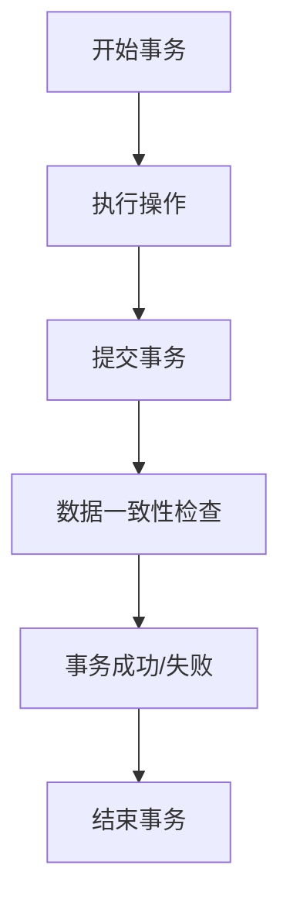
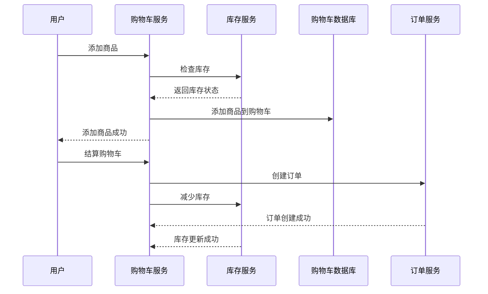

                 


## 难以驾驭的分布式事务

> 关键词：分布式事务、一致性、性能、算法、系统设计

> 摘要：
在分布式系统中，事务的一致性是确保数据准确性和可靠性的关键。然而，随着系统的复杂性和规模的增加，分布式事务的处理变得愈加困难。本文将深入探讨分布式事务的挑战，分析其核心概念和算法原理，并提供实用的系统设计建议。

### 1. 背景介绍

#### 1.1 问题背景

分布式系统通过将计算任务分布到多个节点上来提高性能和可扩展性。然而，这种分布式架构带来了新的挑战，尤其是在事务处理方面。分布式事务涉及多个节点上的数据操作，如何确保这些操作的一致性和可靠性成为了一个重要问题。

#### 1.2 分布式事务的概念与边界

分布式事务是指在分布式系统中执行的一系列操作，这些操作要么全部成功，要么全部失败。分布式事务的边界包括数据一致性、事务隔离级别和分布式锁等关键概念。

#### 1.3 分布式事务的常见问题

- **数据一致性挑战**：分布式事务中最常见的问题是数据一致性。当多个节点同时操作同一份数据时，如何保证所有节点的数据状态一致？
- **系统性能瓶颈**：分布式事务通常涉及大量的网络通信和同步操作，这可能导致系统性能下降。
- **跨网络延迟影响**：分布式系统中的节点可能位于不同的地理位置，网络延迟可能会影响事务的处理速度。

#### 1.4 分布式事务解决方案概述

分布式事务的解决方案可以分为传统和新兴两大类。传统解决方案如两阶段提交（2PC）旨在通过同步操作确保数据一致性，而新兴解决方案如最终一致性则强调系统的最终状态，而不是中间状态。

### 2. 核心概念与联系

#### 2.1 核心概念原理

- **数据一致性模型**：数据一致性模型定义了分布式系统中数据状态的一致性标准。常见的模型有强一致性、最终一致性等。
- **事务隔离级别**：事务隔离级别定义了并发事务之间的隔离程度，常见的级别有读未提交、读已提交、可重复读、序列化等。
- **分布式锁机制**：分布式锁机制用于在分布式环境中实现锁，以确保事务的原子性和隔离性。

#### 2.2 概念属性特征对比表格

| 概念        | 特征                 | 作用 |
| ----------- | -------------------- | ---- |
| 数据一致性  | 保持数据一致性       | 解决数据冲突 |
| 事务隔离级别 | 确保事务的隔离性     | 防止数据不一致 |
| 分布式锁    | 在分布式环境中实现锁 | 保证并发控制 |

#### 2.3 ER实体关系图架构

```mermaid
erDiagram
  Transaction ||--|{ Data}: "包含多个数据操作"
  Data ||--|{ Lock}: "用于并发控制"
```

### 3. 算法原理讲解

#### 3.1 算法mermaid流程图



#### 3.2 Python源代码实现

```python
# Python代码实现分布式事务算法
class DistributedTransaction:
    def __init__(self):
        self.data = {}
        self.locks = {}

    def begin(self):
        # 开始事务
        pass

    def execute(self, operation):
        # 执行操作
        pass

    def commit(self):
        # 提交事务
        pass

    def rollback(self):
        # 回滚事务
        pass
```

#### 3.3 算法原理的数学模型和公式

$$
XOR(\neg A, B) = (A \oplus B)
$$

其中，$A$ 和 $B$ 分别代表两个二进制数，$\neg A$ 表示 $A$ 的按位非操作，$XOR$ 表示异或操作。

#### 3.4 详细讲解和举例说明

- **异或操作（XOR）用于分布式锁**：异或操作用于分布式锁，保证操作的原子性。例如，当我们需要锁定一个资源时，可以使用异或操作来创建一个唯一的锁标识。
- **异或操作的数学模型确保了在多节点环境下，锁的分配不会产生冲突**。例如，假设有两个节点A和B，它们尝试锁定同一资源。节点A使用异或操作生成锁标识，节点B同样使用异或操作生成锁标识。无论节点A还是节点B，生成的锁标识都不会与其他节点的锁标识冲突。

### 4. 系统分析与架构设计方案

#### 4.1 问题场景介绍

假设我们有一个电子商务系统，用户可以在系统中添加商品到购物车，然后进行结算。为了确保数据一致性，我们需要处理分布式事务。

#### 4.2 项目介绍

我们的项目是一个分布式购物车系统，它需要处理以下事务：

- **添加商品到购物车**：当用户将商品添加到购物车时，需要在购物车表和库存表中同时进行操作。
- **结算购物车**：当用户选择结算时，需要在购物车表、订单表和库存表中同时进行操作。

#### 4.3 系统功能设计

- **购物车管理**：提供添加、删除和查看购物车的功能。
- **订单管理**：提供创建、取消和查看订单的功能。
- **库存管理**：提供查看和管理商品库存的功能。

#### 4.4 系统架构设计


#### 4.5 系统接口设计和系统交互



### 5. 项目实战

#### 5.1 环境安装

安装分布式事务所需的软件和工具，如数据库、消息队列、分布式锁服务等。

#### 5.2 系统核心实现源代码

实现分布式事务的代码，包括事务管理器、锁管理器、数据库操作等。

#### 5.3 代码应用解读与分析

详细分析分布式事务的实现代码，解释关键部分的原理和作用。

#### 5.4 实际案例分析和详细讲解剖析

通过实际案例展示分布式事务的处理过程，分析可能出现的问题和解决方案。

#### 5.5 项目小结

总结项目的经验和教训，提出改进和优化建议。

### 6. 最佳实践 tips、小结、注意事项、拓展阅读等内容

- **最佳实践 tips**：提供一些在分布式事务处理中的最佳实践，如选择合适的事务隔离级别、优化网络通信等。
- **小结**：回顾文章的主要内容和关键知识点。
- **注意事项**：强调在分布式事务处理中需要注意的问题和风险。
- **拓展阅读**：推荐一些相关文献和资料，供读者进一步学习和研究。

### 7. 作者信息

- 作者：AI天才研究院/AI Genius Institute & 禅与计算机程序设计艺术 /Zen And The Art of Computer Programming

## 总结

分布式事务在分布式系统中扮演着至关重要的角色。本文详细探讨了分布式事务的核心概念、算法原理和系统设计方法。通过实际项目实战，我们展示了如何在实际应用中处理分布式事务。希望本文能帮助读者更好地理解和应对分布式事务的挑战。在分布式事务的世界中，我们不仅要驾驭技术，更要驾驭思维，以实现更加高效、可靠和可扩展的系统。让我们一起继续探索，不断提升自己的技术水平。

