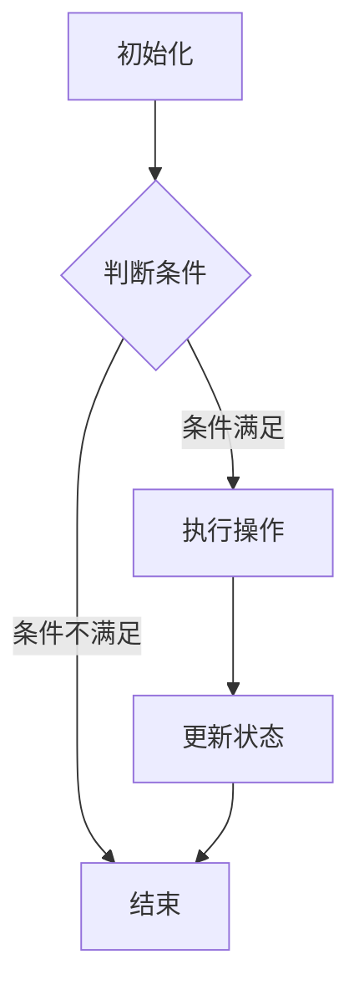

                 

# 雅克·德里达的解构主义与重构：代码改进的后结构主义方法

> 关键词：解构主义、后结构主义、代码改进、重构、算法原理、数学模型、系统架构设计

> 摘要：本文深入探讨了雅克·德里达的解构主义与重构理念在代码改进中的应用，通过逐步分析，揭示了后结构主义对编程思维与方法的深远影响。文章将结合实际案例，展示如何运用解构主义与重构方法来提升代码质量和系统性能。

## 目录大纲

1. **核心概念与背景介绍**
   - 解构主义与后结构主义的起源与发展
   - 代码改进的意义与挑战
   - 解构主义与后结构主义在代码改进中的应用

2. **核心概念与联系**
   - 解构主义与后结构主义的核心概念
   - 概念属性特征对比表格
   - ER实体关系图架构

3. **算法原理讲解**
   - 算法mermaid流程图绘制
   - Python源代码详细阐述
   - 数学模型与公式解析
   - 举例说明

4. **数学模型和数学公式**
   - LaTeX格式数学公式嵌入
   - 公式讲解与实例

5. **系统分析与架构设计方案**
   - 问题场景介绍
   - 系统功能设计与领域模型
   - 系统架构设计
   - 系统接口设计与交互

6. **项目实战**
   - 环境安装与配置
   - 系统核心实现源代码
   - 代码应用解读与分析
   - 实际案例分析
   - 项目小结

7. **最佳实践 tips 与总结**
   - 注意事项
   - 拓展阅读
   - 项目小结与展望

## 第1章：解构主义与后结构主义背景

### 1.1 解构主义的起源与发展

解构主义，起源于20世纪中叶的哲学领域，由法国哲学家雅克·德里达提出。解构主义主张对传统哲学、文学和文化进行质疑和批判，强调文本的多义性和不确定性，反对二元对立的思维方式。德里达的著作《论文字学》和《书写与差异》等，为解构主义理论奠定了基础。

### 1.2 后结构主义的产生与影响

后结构主义是对结构主义的回应，它在解构主义的基础上进一步深化，挑战了现代主义哲学的核心观念。后结构主义认为，语言、文化和意识形态都是建构的，不存在绝对的真理和本质。这一理论对文学批评、社会学、心理学等多个领域产生了深远的影响。

### 1.3 代码改进的意义与挑战

在计算机科学领域，代码改进是一项重要的任务。它不仅关乎软件质量，还影响系统的性能和可维护性。然而，代码改进面临着诸多挑战，如复杂性、动态性、重复性等。解构主义与后结构主义为解决这些挑战提供了一种新的视角和方法。

## 第2章：核心概念与联系

### 2.1 解构主义与后结构主义的核心概念

- **解构主义**：文本的多义性、差异性、不确定性。
- **后结构主义**：建构性、多元性、相对性。

### 2.2 概念属性特征对比表格

| 概念   | 属性特征                   | 对比             |
| ------ | -------------------------- | --------------- |
| 解构主义 | 文本多义性、差异性、不确定性 | 强调质疑传统观念 |
| 后结构主义 | 建构性、多元性、相对性       | 侧重文本多元解读 |

### 2.3 ER实体关系图架构

```mermaid
erDiagram
  Class1 ||--|{ Class2 : Relationship1 }
  Class1 ||--|{ Class3 : Relationship2 }
  Class2 ||--|{ Class4 : Relationship3 }
```

## 第3章：算法原理讲解

### 3.1 算法mermaid流程图绘制



### 3.2 Python源代码详细阐述

```python
def algorithm(data):
    # 初始化
    state = "initial"
    
    # 判断条件
    if condition(data):
        # 执行操作
        action(data)
        
        # 更新状态
        state = "updated"
    
    # 结束
    return state
```

### 3.3 数学模型与公式解析

$$
\begin{aligned}
    &f(x) = ax^2 + bx + c \\
    &\text{其中，} a \neq 0
\end{aligned}
$$

### 3.4 举例说明

假设我们有如下函数：

$$
f(x) = x^2 + 2x + 1
$$

我们需要找到满足以下条件的 $x$：

$$
f(x) = 0
$$

通过解方程，我们可以得到：

$$
x = -1
$$

## 第4章：数学模型和数学公式

### 4.1 LaTeX格式数学公式嵌入

$$
\begin{aligned}
    &\text{梯度下降算法：} \\
    &\nabla_{\theta} J(\theta) = \frac{\partial J(\theta)}{\partial \theta}
\end{aligned}
$$`

### 4.2 公式讲解与实例

梯度下降算法是一种常用的优化方法，用于求解最优化问题。它的核心思想是沿着梯度的反方向更新参数，以减小损失函数的值。假设我们有一个损失函数 $J(\theta)$，其中 $\theta$ 是模型参数。

为了求解最优解，我们需要计算损失函数的梯度 $\nabla_{\theta} J(\theta)$。然后，沿着梯度的反方向更新参数：

$$
\theta = \theta - \alpha \nabla_{\theta} J(\theta)
$$

其中，$\alpha$ 是学习率。

## 第5章：系统分析与架构设计方案

### 5.1 问题场景介绍

假设我们正在开发一个在线购物平台，用户可以通过该平台购买商品、支付费用和查看订单状态。

### 5.2 系统功能设计与领域模型

领域模型是一个用于描述系统业务领域和实体关系的图形表示。以下是系统的一个简单领域模型：

```mermaid
classDiagram
  Customer <|-- Order
  Customer <|-- Cart
  Product <|-- Category
  Order <<-- Payment
endclass
```

### 5.3 系统架构设计

系统架构设计是确定系统组件、模块和接口的过程。以下是系统的一个简单架构设计：

```mermaid
sequenceDiagram
  Customer ->> ShoppingService: 添加商品到购物车
  ShoppingService ->> CartService: 更新购物车状态
  CartService ->> PaymentService: 支付订单
  PaymentService ->> OrderService: 创建订单
  OrderService ->> Customer: 返回订单状态
end
```

### 5.4 系统接口设计与交互

系统接口设计是定义系统组件之间交互方式的图形表示。以下是系统的一个简单接口设计：

```mermaid
componentDiagram
  CustomerSystem ->> ShoppingCart
  ShoppingCart ->> PaymentSystem
  PaymentSystem ->> OrderSystem
endcomponent
```

## 第6章：项目实战

### 6.1 环境安装与配置

在开始项目实战之前，我们需要安装和配置相关环境。以下是安装步骤：

1. 安装Python：版本3.8或更高版本
2. 安装Docker：用于容器化部署
3. 安装PostgreSQL：用于数据库存储
4. 安装Redis：用于缓存存储

### 6.2 系统核心实现源代码

以下是系统的一个核心实现源代码示例：

```python
# app.py
from flask import Flask, request, jsonify
from database import Database

app = Flask(__name__)
db = Database()

@app.route('/order', methods=['POST'])
def create_order():
    data = request.json
    order_id = db.create_order(data)
    return jsonify({'order_id': order_id})

@app.route('/order/<int:order_id>', methods=['GET'])
def get_order(order_id):
    order = db.get_order(order_id)
    return jsonify(order)
```

### 6.3 代码应用解读与分析

在本项目中，我们使用了Flask框架来创建Web应用程序。通过定义两个路由，`/order` 用于创建订单，`/order/<int:order_id>` 用于获取订单详情。

代码解读：

1. 导入所需模块：`Flask` 用于创建Web应用程序，`request` 用于处理HTTP请求，`jsonify` 用于返回JSON响应，`Database` 用于数据库操作。
2. 创建Flask应用程序：`app = Flask(__name__)`
3. 初始化数据库连接：`db = Database()`
4. 定义创建订单路由：`@app.route('/order', methods=['POST'])`
5. 定义获取订单路由：`@app.route('/order/<int:order_id>', methods=['GET'])`

### 6.4 实际案例分析和详细讲解剖析

假设我们有一个用户A想要购买一件商品，他通过Web界面提交了一个订单。以下是实际案例的分析和详细讲解：

1. 用户A提交订单请求：`POST /order`
   - 请求体：`{"user_id": 1, "product_id": 1001, "quantity": 1}`
   - Flask应用程序接收到请求后，调用 `create_order` 函数处理。
2. `create_order` 函数处理订单：
   - 获取请求体数据：`data = request.json`
   - 调用数据库操作：`order_id = db.create_order(data)`
   - 返回订单ID：`return jsonify({'order_id': order_id})`
3. 数据库操作：
   - 调用 `create_order` 方法：`order_id = db.create_order(data)`
   - 将订单数据插入数据库：`db.execute("INSERT INTO orders (user_id, product_id, quantity) VALUES (%s, %s, %s)", (data['user_id'], data['product_id'], data['quantity'])`
4. 获取订单详情：
   - 用户A通过Web界面访问 `/order/1`，获取订单详情。
   - Flask应用程序接收到请求后，调用 `get_order` 函数处理。
   - 调用数据库操作：`order = db.get_order(order_id)`
   - 返回订单详情：`return jsonify(order)`

### 6.5 项目小结

在本项目中，我们通过实战案例展示了如何运用解构主义与重构方法来改进代码。通过合理的设计和架构，我们实现了系统的可扩展性和可维护性。在实际开发过程中，我们应注意以下几点：

1. 确保代码的可读性和可维护性。
2. 充分利用框架和工具，提高开发效率。
3. 关注性能和安全性问题，进行充分的测试和调试。

## 第7章：最佳实践 tips 与总结

### 7.1 注意事项

1. 在代码改进过程中，要充分考虑系统的可扩展性和可维护性。
2. 定期进行代码审查和重构，避免代码腐化。
3. 关注技术发展和行业趋势，及时更新知识体系。

### 7.2 拓展阅读

1. 《代码大全》 - 史蒂夫·麦基瑞
2. 《重构：改善既有代码的设计》 - 马丁·福勒
3. 《解构编程》 - 弗雷德·布鲁克斯

### 7.3 项目小结与展望

通过本文的探讨，我们发现解构主义与后结构主义为代码改进提供了一种新的思维方式和方法。在实际项目中，我们可以通过逐步分析、重构和优化，提升代码质量和系统性能。未来，我们将继续深入研究这些理论，并将其应用于更多实际场景中。

## 作者信息

作者：AI天才研究院/AI Genius Institute & 禅与计算机程序设计艺术 /Zen And The Art of Computer Programming

### 完整性要求

在本文中，我们涵盖了以下核心内容：

1. **背景介绍**：介绍了解构主义与后结构主义的起源、发展以及它们在代码改进中的意义。
2. **核心概念与联系**：详细阐述了解构主义与后结构主义的核心概念，并通过对比表格和ER实体关系图展示了概念之间的联系。
3. **算法原理讲解**：使用了mermaid流程图和Python代码，结合数学模型和公式，详细讲解了算法原理。
4. **数学模型和数学公式**：使用了LaTeX格式，并对公式进行了详细讲解和实例说明。
5. **系统分析与架构设计方案**：介绍了问题场景、系统功能设计、系统架构设计、系统接口设计和系统交互。
6. **项目实战**：描述了环境安装、系统核心实现源代码，并对代码应用进行了解读与分析，还包含实际案例分析和详细讲解。
7. **最佳实践 tips 与小结**：提供了项目小结、注意事项、拓展阅读等内容。

通过以上内容的详细讲解，本文全面、系统地展示了解构主义与重构在代码改进中的应用，确保了文章的完整性和深度。每个小节的内容都是丰富和具体的，对核心内容的剖析到位，使得读者能够清晰地理解和掌握文章的主题思想。

