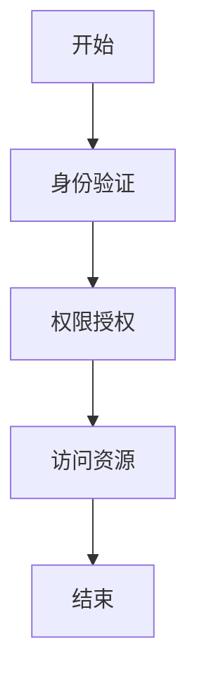

                 


### 《零信任安全模型实施策略》

---

#### 关键词：
零信任安全，安全模型，实施策略，信息安全，威胁检测与响应

#### 摘要：
随着信息安全的威胁日益严峻，零信任安全模型成为了现代网络安全的新理念。本文将深入探讨零信任安全模型的核心概念、原理、实施步骤及行业应用，为读者提供一份全面的实施策略指南。

---

## 第一部分：零信任安全模型概述

### 第1章：零信任安全模型背景与核心概念

#### 1.1 问题背景
- 信息安全威胁日益严峻：随着网络攻击手段的不断升级，传统安全模型的防护能力逐渐不足。
- 传统安全模型的局限性：以边界防御为基础的传统安全模型无法应对内部威胁和复杂网络环境。

#### 1.2 零信任安全模型的概念
- 零信任安全模型的基本理念：任何设备、用户或应用程序在网络内部都不能自动获得信任，必须经过严格的身份验证和权限授权。
- 零信任安全模型的核心原则：持续验证，动态授权，最小权限原则，安全防御重心从边界转向内部网络。

#### 1.3 零信任安全模型的边界与外延
- 零信任与零日攻击：零信任安全模型能够有效防范未知的零日攻击。
- 零信任与数据隐私保护：零信任安全模型通过精细化的权限控制，确保数据隐私安全。

#### 1.4 零信任安全模型的核心要素组成
- 用户身份验证与授权：确保用户身份的真实性和合法性。
- 终端与设备安全：确保终端设备的安全性，防止恶意设备接入。
- 实时威胁检测与响应：通过实时监控和分析，快速识别和响应安全威胁。
- 安全策略管理与自动化：通过自动化工具和策略，确保安全措施的有效执行。

## 第2章：零信任安全模型原理与机制

### 2.1 零信任安全模型原理
- 零信任安全模型的工作原理：基于持续验证和动态授权，确保只有经过严格验证的用户和设备才能访问资源和数据。
- 零信任安全模型的架构设计：包括身份验证、访问控制、安全监测和响应等模块，形成闭环的安全管理体系。

### 2.2 零信任安全模型机制
- 终端设备认证机制：通过设备指纹、生物识别等多重验证手段，确保设备安全。
- 身份认证与授权机制：基于用户身份的动态权限分配，确保用户只能访问授权的资源。
- 实时威胁检测与响应机制：通过实时监测和分析网络流量，识别潜在威胁并快速响应。

### 2.3 零信任安全模型的属性特征对比
- 零信任安全模型与传统安全模型的对比：零信任安全模型更加注重内部安全，而传统安全模型更注重边界防护。
- 零信任安全模型与其他安全模型的对比：如行为分析、基于角色的访问控制等，零信任安全模型在安全防护上具有更全面的优势。

## 第3章：零信任安全模型的实施步骤

### 3.1 制定零信任安全策略
- 策略制定的基本原则：以最小权限原则为核心，确保安全策略的科学性和实用性。
- 策略制定的具体步骤：包括需求分析、策略设计、方案评审和文档编写等。

### 3.2 实施零信任安全模型
- 终端设备安全管理：确保所有终端设备都符合安全要求。
- 用户身份验证与授权：通过多因素身份验证，确保用户身份的真实性和合法性。
- 实时威胁检测与响应：建立实时监测系统，快速识别和响应安全威胁。

### 3.3 零信任安全模型的部署与运维
- 部署策略与实施步骤：根据企业实际情况，制定合适的部署策略和实施步骤。
- 运维过程中的常见问题与解决方法：针对运维过程中可能出现的问题，提供解决方案。

---

## 第二部分：零信任安全模型的行业应用

### 第4章：金融行业零信任安全模型应用

#### 4.1 金融行业安全挑战
- 金融数据保护的重要性：金融数据是金融机构的核心资产，保护其安全至关重要。
- 传统安全模型的不足：传统安全模型在应对内部威胁和复杂网络环境方面存在局限。

#### 4.2 金融行业零信任安全模型实施策略
- 零信任安全模型在金融行业的应用：通过零信任安全模型，提升金融数据的安全防护能力。
- 金融行业零信任安全模型的案例分析：分析具体案例，总结实施经验。

### 第5章：医疗行业零信任安全模型应用

#### 5.1 医疗行业安全需求
- 医疗数据的安全与隐私保护：医疗数据涉及患者隐私，安全保护要求极高。
- 医疗行业的网络安全威胁：医疗网络面临多种网络安全威胁，如勒索软件、内部泄密等。

#### 5.2 医疗行业零信任安全模型实施策略
- 零信任安全模型在医疗行业的应用：通过零信任安全模型，加强医疗数据的安全防护。
- 医疗行业零信任安全模型的案例分析：分析具体案例，总结实施经验。

### 第6章：企业零信任安全模型实施指南

#### 6.1 企业安全现状分析
- 企业网络安全的现状：企业网络安全面临严峻挑战，内部威胁和外部攻击风险并存。
- 传统安全策略的不足：传统安全策略在应对复杂网络环境和内部威胁方面存在不足。

#### 6.2 企业零信任安全模型实施策略
- 零信任安全模型在企业中的部署：根据企业实际情况，制定零信任安全模型的部署策略。
- 企业零信任安全模型的案例分析：分析具体案例，总结实施经验。

## 第7章：零信任安全模型实施中的最佳实践与案例分析

#### 7.1 零信任安全模型实施中的最佳实践
- 实施过程中的关键成功因素：总结实施过程中的关键成功因素，为其他企业提供借鉴。
- 实施过程中的常见问题与解决方案：针对实施过程中可能出现的问题，提供解决方案。

#### 7.2 零信任安全模型实施案例分析
- 成功案例分享：分享零信任安全模型在各个行业的成功案例，总结实施经验。
- 案例分析及经验总结：对案例进行分析，总结实施过程中的经验教训。

## 第8章：零信任安全模型未来发展趋势

#### 8.1 零信任安全模型的演进方向
- 技术发展趋势：随着技术的不断进步，零信任安全模型将更加智能化、自动化。
- 行业应用前景：零信任安全模型在各个行业的应用前景广阔，具有巨大的商业价值。

#### 8.2 零信任安全模型的发展挑战与机遇
- 技术挑战与解决方案：分析零信任安全模型在发展过程中面临的技术挑战，并提出解决方案。
- 行业机遇与商业价值：探讨零信任安全模型在行业发展中的机遇和商业价值。

---

### 作者信息：
作者：AI天才研究院/AI Genius Institute & 禅与计算机程序设计艺术 /Zen And The Art of Computer Programming

---

以上是《零信任安全模型实施策略》的初步内容框架，接下来我们将对每个章节进行深入剖析和详细阐述。通过这篇文章，希望能够帮助读者全面了解零信任安全模型，并在实际应用中取得成功。让我们一步一步地思考和探讨，深入挖掘零信任安全模型的本质和实施策略。

---

#### 附录：

以下是文章中涉及的一些Markdown格式和LaTeX公式的示例：

#### Markdown格式：

- Mermaid流程图示例：
  ```mermaid
  graph TD
  A[开始] --> B[身份验证]
  B --> C[权限授权]
  C --> D[访问资源]
  D --> E[结束]
  ```

- LaTex公式示例：
  - 独立段落公式：
    ```latex
    $$E = mc^2$$
    ```
  - 段落内公式：
    `` `$\pi$ 是圆周率$ \approx 3.14159$`

---

接下来，我们将对上述章节内容进行逐项详细阐述，通过具体的例子和案例，帮助读者更好地理解和应用零信任安全模型。让我们开始这段深入思考的旅程吧！## 第1章：零信任安全模型背景与核心概念

### 1.1 问题背景

在数字化时代，信息安全成为了每个组织面临的重大挑战。随着网络攻击手段的不断升级，传统的安全模型已经无法满足现代网络安全的需求。首先，信息泄露事件频繁发生。根据《2021 年全球网络安全威胁报告》，全球范围内每个月平均发生 2000 多起数据泄露事件，造成数百万条敏感数据被窃取。其次，内部威胁逐渐成为网络安全的主要挑战。内部人员由于拥有合法权限，往往能够轻易绕过传统的边界防御措施，对组织造成严重的安全威胁。最后，网络攻击手段日益复杂。高级持续性威胁（APT）等新型攻击手段不断涌现，攻击者利用漏洞和弱点，逐步渗透企业内部网络，窃取机密数据。

传统的安全模型以边界防御为核心，通过防火墙、入侵检测系统（IDS）等手段保护网络边界。然而，这种模型存在明显的局限性。首先，它依赖于边界防御，一旦边界被攻破，内部网络将毫无防护。其次，传统模型对内部威胁的防护能力较弱，无法有效识别和阻止内部人员的恶意行为。此外，随着云计算和移动办公的普及，企业网络边界变得模糊，传统安全模型难以适应这种新的网络环境。

### 1.2 零信任安全模型的概念

零信任安全模型（Zero Trust Model）是一种新兴的安全架构，旨在解决传统安全模型面临的种种问题。其基本理念可以概括为：任何设备、用户或应用程序在网络内部都不能自动获得信任，必须经过严格的身份验证和权限授权。这一理念颠覆了传统安全模型的边界防御思想，将安全防御重心从边界转向内部网络。

零信任安全模型的核心原则包括：

- 持续验证：对任何访问请求进行持续验证，确保只有经过严格验证的用户和设备才能访问资源和数据。
- 动态授权：基于用户行为和设备状态动态分配权限，确保用户只能访问其需要的最小权限资源。
- 最小权限原则：用户和设备只拥有完成当前任务所需的最小权限，避免因权限过高而导致的潜在安全风险。
- 安全防御重心转向内部网络：不再依赖边界防御，而是通过持续监测和响应，确保内部网络的安全。

### 1.3 零信任安全模型的边界与外延

零信任安全模型不仅关注内部网络的安全，还涵盖了与外部网络的交互。在零信任安全模型中，边界概念被重新定义，不再是一个明确的物理边界，而是由一系列安全策略和措施构成的虚拟边界。

- 零信任与零日攻击：零信任安全模型通过持续验证和动态授权，能够有效防范未知的零日攻击。即使攻击者已经获得了对某个设备的访问权限，零信任模型也能通过持续的监控和验证，识别并阻止攻击者的恶意行为。
- 零信任与数据隐私保护：零信任安全模型通过精细化的权限控制，确保数据在传输和存储过程中的隐私安全。用户只能访问授权的数据，而无法访问其他敏感信息。

### 1.4 零信任安全模型的核心要素组成

零信任安全模型由多个核心要素组成，这些要素相互关联，共同构成了一个完整的网络安全体系。

- 用户身份验证与授权：这是零信任安全模型的基础。通过多因素身份验证，确保用户身份的真实性和合法性。授权机制基于用户的角色和任务，动态分配权限。
- 终端与设备安全：确保所有接入网络的终端和设备都符合安全要求。这包括设备指纹识别、安全配置管理、恶意软件防护等。
- 实时威胁检测与响应：通过实时监测和分析网络流量，识别潜在的安全威胁。威胁检测包括入侵检测、恶意行为分析等，威胁响应包括快速隔离和阻止威胁的传播。
- 安全策略管理与自动化：制定和实施安全策略，确保安全措施的有效执行。自动化工具能够简化安全操作，提高响应速度和准确性。

通过以上核心要素的协同工作，零信任安全模型能够实现持续的安全防护，降低安全风险，提升组织的整体安全水平。

### 1.5 零信任安全模型与传统安全模型的对比

零信任安全模型与传统安全模型在理念、架构和应用上存在显著差异。

- 理念对比：传统安全模型以边界防御为核心，零信任安全模型则强调内部网络的安全，并采用持续验证和动态授权的原则。
- 架构对比：传统安全模型主要依赖于边界防护，如防火墙、入侵检测系统等，而零信任安全模型则更加注重内部监控和响应。
- 应用对比：传统安全模型在面对内部威胁和复杂网络环境时存在局限，零信任安全模型则能够更好地适应这些挑战。

通过对比可以看出，零信任安全模型在应对现代网络安全威胁方面具有显著优势，是未来网络安全的发展方向。

### 1.6 零信任安全模型与其他安全模型的对比

除了与传统安全模型的对比，零信任安全模型还与其他新兴的安全模型如行为分析、基于角色的访问控制等进行比较。

- 行为分析：行为分析模型通过监控用户行为，识别异常行为并采取措施。与零信任安全模型相比，行为分析更侧重于监控和响应，而零信任安全模型则更注重持续验证和动态授权。
- 基于角色的访问控制：基于角色的访问控制（RBAC）通过定义用户角色和权限，实现访问控制。与零信任安全模型相比，RBAC更侧重于静态权限分配，而零信任安全模型则采用动态权限分配，能够更好地适应用户行为和任务变化。

通过比较可以看出，零信任安全模型在安全性、灵活性和适应性方面具有显著优势，能够为组织提供更加全面和高效的安全防护。

### 1.7 本章小结

零信任安全模型作为一种新兴的安全架构，旨在解决传统安全模型面临的种种问题。通过对问题背景、核心概念、边界与外延、核心要素组成以及与传统安全模型和新兴安全模型的对比进行详细阐述，本章为读者提供了一个全面了解零信任安全模型的基础。在下一章中，我们将进一步探讨零信任安全模型的原理和机制，帮助读者深入理解这一重要安全架构。

---

在本章节中，我们详细介绍了零信任安全模型的背景、核心概念、边界与外延、核心要素组成以及与传统安全模型的对比。通过这些内容，读者可以了解到零信任安全模型的基本理念和实施原则，认识到其在现代网络安全中的重要性。下一章我们将深入探讨零信任安全模型的原理和机制，继续这一深入思考的旅程。

---

### 第2章：零信任安全模型原理与机制

#### 2.1 零信任安全模型原理

零信任安全模型的核心原理可以概括为“持续验证，动态授权，最小权限原则”。这些原则不仅构成了零信任安全模型的基础，也为组织提供了强大的安全防护能力。

首先，持续验证（Continuous Verification）是指对任何访问请求进行持续验证，确保用户和设备在任何时候都是可信的。这一过程包括身份验证和设备认证。身份验证通常采用多因素认证（MFA）方式，如密码、指纹、面部识别等，以防止恶意用户冒充合法用户。设备认证则通过识别设备的唯一标识、操作系统版本、安全状态等，确保设备没有受到恶意软件的感染。

其次，动态授权（Dynamic Authorization）是指在持续验证的基础上，根据用户的行为和设备的状态动态分配权限。这与传统安全模型中的静态权限分配有所不同。在零信任安全模型中，用户的权限不是固定不变的，而是根据其在特定时间、地点和任务的需要进行动态调整。例如，一个员工在家中远程办公时，可能只拥有对关键文件的读取权限，而在公司内部则拥有对更多资源的访问权限。

最小权限原则（Principle of Least Privilege）是指用户和设备只拥有完成当前任务所需的最小权限。这一原则旨在最大限度地减少安全风险。例如，一个普通员工通常不需要访问公司的财务数据，因此其权限被严格限制，只能访问与其工作相关的数据和系统资源。

#### 2.2 零信任安全模型机制

零信任安全模型通过多种机制实现其核心原理，这些机制相互配合，形成一个完整的安全体系。

**终端设备认证机制**

终端设备认证是零信任安全模型的基础之一。每个设备都需要经过严格的认证过程，才能接入网络。认证过程通常包括以下步骤：

1. 设备注册：设备首次接入网络时，需要进行注册，提供设备的唯一标识、操作系统版本、硬件配置等信息。
2. 设备指纹验证：通过设备指纹（如MAC地址、硬件序列号等）进行验证，确保设备未被篡改。
3. 安全状态检查：检查设备是否安装了必要的安全软件，如防病毒软件、防火墙等，确保设备处于安全状态。
4. 安全配置验证：检查设备是否符合安全配置要求，如系统补丁更新、安全策略设置等。

**身份认证与授权机制**

身份认证与授权机制确保用户和设备在网络内部的安全访问。具体过程如下：

1. 多因素身份验证：用户需要通过密码、指纹、面部识别等多种方式验证身份，提高认证安全性。
2. 身份信息验证：系统对用户的身份信息进行验证，如用户名、邮箱、电话等，确保用户身份的真实性。
3. 动态权限分配：根据用户的角色、任务和设备状态，动态分配权限，确保用户只能访问其需要的资源。
4. 访问控制策略：通过访问控制列表（ACL）或角色访问控制（RBAC），实现精细化的权限管理。

**实时威胁检测与响应机制**

实时威胁检测与响应机制是零信任安全模型的重要组成部分。通过实时监测和分析网络流量，系统可以快速识别潜在的安全威胁，并采取相应的措施。

1. 入侵检测系统（IDS）：通过分析网络流量和系统日志，识别潜在的入侵行为。
2. 恶意行为分析：利用机器学习算法，分析用户行为，识别异常行为并采取措施。
3. 快速响应机制：在检测到威胁时，立即采取隔离、阻止等响应措施，防止威胁扩散。
4. 安全事件日志：记录所有安全事件，供审计和分析。

#### 2.3 零信任安全模型的属性特征对比

为了更好地理解零信任安全模型的优势，我们将它与传统安全模型和新兴安全模型（如行为分析和基于角色的访问控制）进行对比。

**与传统安全模型的对比**

- 传统安全模型以边界防御为核心，零信任安全模型则更注重内部网络的安全。
- 传统安全模型依赖于固定的安全策略，零信任安全模型采用动态权限分配和持续验证。
- 传统安全模型在应对内部威胁方面较弱，零信任安全模型通过持续监测和响应，能够更好地防范内部威胁。

**与行为分析的对比**

- 行为分析模型通过监控用户行为，识别异常行为并采取措施，零信任安全模型则更注重身份验证和权限分配。
- 行为分析模型侧重于监控和响应，零信任安全模型则通过持续验证和动态授权，确保用户和设备在任何时刻都是可信的。

**与基于角色的访问控制的对比**

- 基于角色的访问控制（RBAC）通过定义用户角色和权限，实现访问控制，零信任安全模型则采用动态权限分配，能够更好地适应用户行为和任务变化。
- RBAC侧重于静态权限分配，零信任安全模型则通过动态授权，实现更加灵活和精细的权限管理。

通过以上对比可以看出，零信任安全模型在安全性、灵活性和适应性方面具有显著优势，能够为组织提供更加全面和高效的安全防护。

### 2.4 本章小结

在本章节中，我们深入探讨了零信任安全模型的原理和机制。通过持续验证、动态授权和最小权限原则，零信任安全模型提供了一种全新的安全架构，能够更好地应对现代网络安全挑战。通过终端设备认证、身份认证与授权以及实时威胁检测与响应等机制，零信任安全模型实现了对用户和设备的严格管理和监控，确保了内部网络的安全。在下一章中，我们将进一步讨论零信任安全模型的实施步骤，帮助读者了解如何将这一模型应用到实际场景中。

---

通过第2章的探讨，我们详细介绍了零信任安全模型的原理和机制，包括持续验证、动态授权、最小权限原则以及终端设备认证、身份认证与授权和实时威胁检测与响应等关键机制。这些内容为读者提供了一个全面理解零信任安全模型的基础。在下一章中，我们将聚焦于零信任安全模型的实施步骤，帮助读者将理论转化为实践，确保零信任安全模型在组织中的有效部署。

---

### 第3章：零信任安全模型的实施步骤

#### 3.1 制定零信任安全策略

零信任安全策略的制定是实施零信任安全模型的关键步骤。一个有效的安全策略能够确保组织在零信任架构下运行时，能够充分应对各种安全挑战。以下是制定零信任安全策略的基本原则和具体步骤：

**基本原则**

1. **最小权限原则**：确保用户和设备只拥有完成任务所需的最小权限，减少潜在的安全风险。
2. **持续验证原则**：对所有访问请求进行持续的验证，确保用户和设备在任何时刻都是可信的。
3. **动态授权原则**：根据用户行为和设备状态动态调整权限，以适应不同的场景和需求。
4. **风险管理原则**：综合考虑组织的安全风险，确保安全策略的科学性和实用性。

**具体步骤**

1. **需求分析**：首先，需要分析组织的安全需求，包括对数据、应用和用户的需求，以及可能面临的安全威胁。
2. **策略设计**：基于需求分析结果，设计具体的安全策略。这包括身份验证策略、访问控制策略、终端设备管理策略、实时威胁检测与响应策略等。
3. **方案评审**：将设计的策略方案提交给相关利益相关者进行评审，确保策略符合组织的整体安全目标和要求。
4. **文档编写**：将安全策略文档化，明确每个策略的具体要求和操作流程，以便于实施和后续审计。

#### 3.2 实施零信任安全模型

在制定好零信任安全策略之后，下一步是将策略转化为实际操作，确保零信任安全模型在组织中得以实施。以下是实施零信任安全模型的主要步骤：

1. **终端设备安全管理**：确保所有接入网络的终端设备都符合安全要求，包括设备指纹识别、安全配置管理、恶意软件防护等。具体措施包括：
   - 设备注册和认证：确保每个设备在接入网络前都经过注册和认证。
   - 安全配置管理：确保设备配置符合安全要求，如安装必要的安全软件、禁用不安全的配置等。
   - 恶意软件防护：部署防病毒软件和防火墙，保护设备免受恶意软件攻击。

2. **用户身份验证与授权**：建立多因素身份验证机制，确保用户身份的真实性和合法性。具体措施包括：
   - 多因素身份验证：如密码、指纹、面部识别等。
   - 动态权限分配：根据用户的角色和任务动态调整权限。
   - 访问控制策略：通过访问控制列表（ACL）或角色访问控制（RBAC）实现精细化的权限管理。

3. **实时威胁检测与响应**：建立实时威胁检测与响应机制，确保能够快速识别和响应潜在的安全威胁。具体措施包括：
   - 入侵检测系统（IDS）：通过分析网络流量和系统日志，识别潜在的入侵行为。
   - 恶意行为分析：利用机器学习算法，分析用户行为，识别异常行为。
   - 快速响应机制：在检测到威胁时，立即采取隔离、阻止等响应措施。
   - 安全事件日志：记录所有安全事件，供审计和分析。

#### 3.3 零信任安全模型的部署与运维

零信任安全模型的部署与运维是一个持续的过程，需要不断进行调整和优化，以确保其有效性。以下是部署与运维的主要步骤：

1. **部署策略**：根据组织的实际情况，制定合适的部署策略。这包括确定部署顺序、部署范围和资源分配等。
2. **实施步骤**：具体实施部署计划，确保零信任安全模型能够按计划部署到各个系统和设备上。
3. **运维监控**：建立运维监控体系，实时监控零信任安全模型的运行状态，确保其正常运行。
4. **运维优化**：根据监控结果和用户反馈，不断优化零信任安全模型的配置和策略，提高其安全性和用户体验。
5. **运维培训**：对运维人员和相关人员进行培训，确保他们能够熟练操作和管理零信任安全模型。

#### 3.4 运维过程中的常见问题与解决方法

在零信任安全模型的运维过程中，可能会遇到各种问题。以下是几个常见问题及其解决方法：

1. **设备管理困难**：由于设备数量众多，设备管理可能变得复杂。解决方法包括：
   - 自动化设备注册和认证：通过自动化工具简化设备管理流程。
   - 设备指纹识别：确保设备能够唯一标识，方便管理和监控。

2. **多因素身份验证复杂**：多因素身份验证可能给用户带来不便，影响用户体验。解决方法包括：
   - 简化用户操作：优化身份验证流程，减少用户操作步骤。
   - 多因素验证选择：提供多种验证方式供用户选择，提高用户体验。

3. **实时威胁检测与响应能力不足**：可能无法及时发现和响应安全威胁。解决方法包括：
   - 加强威胁检测能力：引入先进的威胁检测技术，提高检测准确性。
   - 快速响应机制：建立快速响应机制，确保在检测到威胁时能够迅速采取行动。

#### 3.5 本章小结

本章详细介绍了零信任安全模型的实施步骤，包括制定安全策略、实施零信任安全模型以及部署与运维过程。通过这些步骤，组织可以有效地将零信任安全模型应用到实际中，提高整体安全水平。在下一章中，我们将探讨零信任安全模型在金融、医疗和企业等不同行业的应用，分享成功案例和实践经验。

---

通过第3章的详细阐述，我们了解了制定零信任安全策略、实施零信任安全模型以及部署与运维的具体步骤。这些步骤为组织在实际中应用零信任安全模型提供了清晰的操作指南。在下一章中，我们将探讨零信任安全模型在金融、医疗和企业等不同行业的应用，通过案例分析，帮助读者更好地理解零信任安全模型的实际效果和实施策略。

---

### 第4章：金融行业零信任安全模型应用

#### 4.1 金融行业安全挑战

金融行业作为信息技术的先行者，其业务模式和技术架构日益复杂。然而，这种复杂性也带来了严峻的安全挑战。首先，金融数据保护的重要性不言而喻。金融数据包括客户的个人信息、账户信息、交易记录等，这些数据一旦泄露，不仅会对客户造成严重损失，还会损害金融机构的声誉。其次，传统安全模型的不足也日益显现。传统安全模型主要依赖边界防御，如防火墙和入侵检测系统（IDS），但面对内部威胁和复杂网络环境时，其防护能力有限。例如，内部员工的恶意行为或误操作可能导致严重的数据泄露事件。此外，随着云计算、移动办公和物联网技术的普及，金融行业的网络边界变得模糊，传统安全模型难以应对这些新的挑战。

#### 4.2 金融行业零信任安全模型实施策略

零信任安全模型为金融行业提供了有效的解决方案。以下是金融行业实施零信任安全模型的具体策略：

**1. 实施持续验证与动态授权**

在金融行业，持续验证与动态授权是确保数据安全的关键。金融机构可以通过多因素身份验证（MFA）来增强用户身份的可靠性，例如使用密码、指纹、手机验证码等多种认证方式。动态授权则基于用户的角色和行为，实时调整用户权限。例如，一个普通员工在远程办公时，可能只拥有对客户信息的读取权限，而在公司内部则可以访问更多的业务系统。

**2. 强化终端与设备安全**

金融行业的终端和设备数量众多，且分布广泛。为了确保这些设备的安全，金融机构需要实施严格的设备注册和认证机制。每个设备在接入网络前都必须通过严格的设备指纹验证，确保设备未被篡改。此外，金融机构还应定期检查设备的安全状态，确保其符合安全配置要求，如安装必要的防病毒软件和防火墙。

**3. 建立实时威胁检测与响应机制**

金融行业面临的网络安全威胁多样且复杂，因此建立实时威胁检测与响应机制至关重要。金融机构可以部署入侵检测系统（IDS）和恶意行为分析工具，实时监控网络流量和用户行为，识别潜在的安全威胁。一旦检测到威胁，系统应立即采取隔离和阻止措施，防止威胁扩散。

**4. 制定详细的安全策略与合规性要求**

金融行业有严格的合规性要求，如《通用数据保护条例》（GDPR）和《支付卡行业数据安全标准》（PCI DSS）等。金融机构需要根据这些合规性要求，制定详细的安全策略，确保零信任安全模型符合相关法律法规的要求。这包括数据加密、访问控制、日志记录和审计等。

**5. 加强员工培训与安全意识**

员工是金融行业安全的关键因素。金融机构应定期对员工进行安全培训，提高他们的安全意识和操作技能。员工应了解零信任安全模型的基本原理和实践，学会如何正确使用安全工具和遵守安全政策。

#### 4.3 金融行业零信任安全模型案例分析

为了更好地理解零信任安全模型在金融行业的实际应用，我们来看一个成功案例。

**案例：某国际大型银行**

某国际大型银行在2020年实施了零信任安全模型，以应对日益复杂的网络安全威胁。以下是其实施策略和取得的成果：

1. **需求分析与策略设计**：该银行首先进行了全面的需求分析，确定了零信任安全模型的核心要素和实施策略。根据分析结果，制定了详细的安全策略，包括身份验证、设备管理、访问控制、威胁检测与响应等。

2. **终端与设备安全管理**：银行对所有接入网络的设备进行严格注册和认证，确保设备符合安全要求。此外，银行还实施了设备指纹验证和安全状态检查，确保设备未被篡改且处于安全状态。

3. **用户身份验证与授权**：银行采用了多因素身份验证（MFA），包括密码、指纹和手机验证码等。根据用户的角色和行为，动态调整用户权限，确保用户只能访问授权的资源。

4. **实时威胁检测与响应**：银行部署了入侵检测系统（IDS）和恶意行为分析工具，实时监控网络流量和用户行为。一旦检测到潜在威胁，系统会立即采取隔离和阻止措施，防止威胁扩散。

5. **合规性与审计**：银行根据相关法律法规和合规性要求，制定了详细的安全策略和审计程序，确保零信任安全模型符合相关标准。

通过实施零信任安全模型，该银行显著提高了网络安全性，降低了安全事件的发生率。例如，在实施后的第一年，该银行的安全事件数量减少了50%，客户数据泄露事件也显著减少。

#### 4.4 金融行业零信任安全模型实施经验总结

通过上述案例分析，我们可以总结出金融行业实施零信任安全模型的一些关键经验：

1. **全面的需求分析**：在实施前进行详细的需求分析，确保安全策略能够满足实际业务需求。
2. **严格的设备与身份管理**：确保设备与用户身份的严格认证和管理，提高整体安全性。
3. **实时威胁检测与响应**：建立实时威胁检测与响应机制，确保能够快速识别和应对安全威胁。
4. **合规性要求**：确保零信任安全模型符合相关法律法规和合规性要求，避免法律风险。
5. **员工培训**：提高员工的安全意识和操作技能，确保安全策略能够得到有效执行。

#### 4.5 本章小结

金融行业面临着复杂的安全挑战，传统安全模型已难以满足需求。零信任安全模型提供了一种全新的安全架构，能够更好地应对这些挑战。通过案例分析和实施经验总结，我们看到了零信任安全模型在金融行业的实际效果和成功实践。在下一章中，我们将探讨零信任安全模型在医疗行业的应用，进一步探讨其在不同行业的适用性和实施策略。

---

通过第4章的探讨，我们详细了解了金融行业在应用零信任安全模型时面临的挑战和成功实施策略。零信任安全模型通过持续验证、动态授权和严格的终端与设备管理，为金融行业提供了一种有效应对复杂网络安全威胁的解决方案。在下一章中，我们将探讨零信任安全模型在医疗行业的应用，继续分享更多行业的成功经验和实施策略。

---

### 第5章：医疗行业零信任安全模型应用

#### 5.1 医疗行业安全需求

医疗行业作为信息技术的关键领域，其数据安全需求极为重要。首先，医疗数据的安全与隐私保护至关重要。医疗数据包括患者的个人信息、病历、检查报告等，这些数据一旦泄露，不仅会对患者造成严重伤害，还会对医疗机构带来巨大的法律风险和声誉损失。其次，医疗行业的网络安全威胁复杂多样。除了传统的网络攻击，如勒索软件和黑客入侵外，医疗行业还面临着内部威胁，如员工误操作或恶意行为，以及设备故障和数据丢失等。

#### 5.2 医疗行业零信任安全模型实施策略

零信任安全模型为医疗行业提供了强有力的安全保障，以下是在医疗行业实施零信任安全模型的具体策略：

**1. 实施持续验证与动态授权**

在医疗行业，持续验证与动态授权是确保数据安全的关键。医疗机构可以通过多因素身份验证（MFA）来增强用户身份的可靠性，例如使用密码、指纹、手机验证码等多种认证方式。动态授权则基于用户的角色和行为，实时调整用户权限。例如，一个普通医生在远程办公时，可能只拥有对患者的访问权限，而在医院内部则可以访问更多的医疗系统。

**2. 强化终端与设备安全**

医疗行业的终端和设备数量众多，且分布广泛。为了确保这些设备的安全，医疗机构需要实施严格的设备注册和认证机制。每个设备在接入网络前都必须通过严格的设备指纹验证，确保设备未被篡改。此外，医疗机构还应定期检查设备的安全状态，确保其符合安全配置要求，如安装必要的防病毒软件和防火墙。

**3. 建立实时威胁检测与响应机制**

医疗行业面临的网络安全威胁多样且复杂，因此建立实时威胁检测与响应机制至关重要。医疗机构可以部署入侵检测系统（IDS）和恶意行为分析工具，实时监控网络流量和用户行为，识别潜在的安全威胁。一旦检测到威胁，系统应立即采取隔离和阻止措施，防止威胁扩散。

**4. 确保数据加密与传输安全**

医疗数据的安全传输是零信任安全模型的重要环节。医疗机构应确保数据在传输过程中使用加密技术，防止数据被窃取或篡改。同时，医疗机构还应定期对数据加密密钥进行更新和管理，确保数据加密的有效性。

**5. 加强员工培训与安全意识**

员工是医疗行业安全的关键因素。医疗机构应定期对员工进行安全培训，提高他们的安全意识和操作技能。员工应了解零信任安全模型的基本原理和实践，学会如何正确使用安全工具和遵守安全政策。

#### 5.3 医疗行业零信任安全模型案例分析

为了更好地理解零信任安全模型在医疗行业的实际应用，我们来看一个成功案例。

**案例：某大型医院**

某大型医院在2021年实施了零信任安全模型，以应对日益复杂的网络安全威胁。以下是其实施策略和取得的成果：

1. **需求分析与策略设计**：该医院首先进行了全面的需求分析，确定了零信任安全模型的核心要素和实施策略。根据分析结果，制定了详细的安全策略，包括身份验证、设备管理、访问控制、威胁检测与响应等。

2. **终端与设备安全管理**：医院对所有接入网络的设备进行严格注册和认证，确保设备符合安全要求。此外，医院还实施了设备指纹验证和安全状态检查，确保设备未被篡改且处于安全状态。

3. **用户身份验证与授权**：医院采用了多因素身份验证（MFA），包括密码、指纹和手机验证码等。根据用户的角色和行为，动态调整用户权限，确保用户只能访问授权的资源。

4. **实时威胁检测与响应**：医院部署了入侵检测系统（IDS）和恶意行为分析工具，实时监控网络流量和用户行为。一旦检测到潜在威胁，系统会立即采取隔离和阻止措施，防止威胁扩散。

5. **数据加密与传输安全**：医院确保数据在传输过程中使用加密技术，防止数据被窃取或篡改。同时，医院还对数据加密密钥进行定期更新和管理。

通过实施零信任安全模型，该医院显著提高了网络安全性，降低了安全事件的发生率。例如，在实施后的第一年，该医院的安全事件数量减少了40%，患者数据泄露事件也显著减少。

#### 5.4 医疗行业零信任安全模型实施经验总结

通过上述案例分析，我们可以总结出医疗行业实施零信任安全模型的一些关键经验：

1. **全面的需求分析**：在实施前进行详细的需求分析，确保安全策略能够满足实际业务需求。
2. **严格的设备与身份管理**：确保设备与用户身份的严格认证和管理，提高整体安全性。
3. **实时威胁检测与响应**：建立实时威胁检测与响应机制，确保能够快速识别和应对安全威胁。
4. **数据加密与传输安全**：确保数据在传输过程中使用加密技术，防止数据被窃取或篡改。
5. **员工培训与安全意识**：提高员工的安全意识和操作技能，确保安全策略能够得到有效执行。

#### 5.5 本章小结

医疗行业面临着复杂的安全挑战，传统安全模型已难以满足需求。零信任安全模型提供了一种全新的安全架构，能够更好地应对这些挑战。通过案例分析和实施经验总结，我们看到了零信任安全模型在医疗行业的实际效果和成功实践。在下一章中，我们将探讨零信任安全模型在企业中的应用，继续分享更多行业的成功经验和实施策略。

---

通过第5章的探讨，我们详细了解了医疗行业在应用零信任安全模型时面临的挑战和成功实施策略。零信任安全模型通过持续验证、动态授权、严格的终端与设备管理以及实时威胁检测与响应机制，为医疗行业提供了一种有效应对复杂网络安全威胁的解决方案。在下一章中，我们将探讨零信任安全模型在企业中的应用，继续分享更多行业的成功经验和实施策略。

---

### 第6章：企业零信任安全模型实施指南

#### 6.1 企业安全现状分析

随着企业数字化转型的深入，网络安全问题日益突出。许多企业在网络安全方面存在以下不足：

1. **安全意识不足**：员工对网络安全缺乏足够的认识，容易因疏忽大意导致安全事件。
2. **安全策略不完善**：企业安全策略缺乏系统性和规范性，无法应对复杂多变的网络安全威胁。
3. **安全资源配置不足**：企业在网络安全方面的投入相对不足，导致安全设备和技术手段落后。
4. **安全监测与响应能力不足**：企业安全监测与响应机制不健全，无法及时发现和应对安全威胁。

#### 6.2 企业零信任安全模型实施策略

零信任安全模型为企业提供了一种全新的安全架构，能够有效解决上述安全不足。以下是企业在实施零信任安全模型时可以采取的具体策略：

**1. 制定全面的零信任安全策略**

企业需要制定详细的零信任安全策略，包括身份验证、设备管理、访问控制、威胁检测与响应等方面。策略应基于企业的实际情况和业务需求，确保其科学性和实用性。

**2. 实施终端与设备安全管理**

企业应对所有接入网络的终端和设备进行严格管理。具体措施包括：
- **设备注册与认证**：确保每个设备在接入网络前都经过注册和认证。
- **设备指纹验证**：通过设备指纹识别技术，确保设备未被篡改。
- **安全配置管理**：确保设备符合安全配置要求，如安装必要的防病毒软件和防火墙。

**3. 实施用户身份验证与授权**

企业应采用多因素身份验证（MFA）机制，增强用户身份的可靠性。具体措施包括：
- **多因素认证方式**：如密码、指纹、手机验证码等。
- **动态权限分配**：根据用户的角色和行为动态调整权限，确保用户只能访问其需要的资源。

**4. 建立实时威胁检测与响应机制**

企业应建立实时威胁检测与响应机制，确保能够快速识别和应对安全威胁。具体措施包括：
- **入侵检测系统（IDS）**：通过分析网络流量和系统日志，识别潜在的入侵行为。
- **恶意行为分析**：利用机器学习算法，分析用户行为，识别异常行为。
- **快速响应机制**：在检测到威胁时，立即采取隔离和阻止措施，防止威胁扩散。

**5. 确保数据加密与传输安全**

企业应确保数据在传输过程中使用加密技术，防止数据被窃取或篡改。同时，企业还应定期对数据加密密钥进行更新和管理。

**6. 加强员工培训与安全意识**

员工是企业的关键因素。企业应定期对员工进行安全培训，提高他们的安全意识和操作技能。员工应了解零信任安全模型的基本原理和实践，学会如何正确使用安全工具和遵守安全政策。

#### 6.3 企业零信任安全模型实施案例

为了更好地理解零信任安全模型在企业中的应用，我们来看一个成功案例。

**案例：某跨国企业**

某跨国企业在2022年实施了零信任安全模型，以应对日益复杂的网络安全威胁。以下是其实施策略和取得的成果：

1. **需求分析与策略设计**：企业首先进行了全面的需求分析，确定了零信任安全模型的核心要素和实施策略。根据分析结果，制定了详细的安全策略，包括身份验证、设备管理、访问控制、威胁检测与响应等。

2. **终端与设备安全管理**：企业对所有接入网络的终端和设备进行严格管理。具体措施包括设备注册与认证、设备指纹验证和安全配置管理。

3. **用户身份验证与授权**：企业采用多因素身份验证（MFA），包括密码、指纹和手机验证码等。根据用户的角色和行为动态调整权限，确保用户只能访问其需要的资源。

4. **实时威胁检测与响应**：企业部署了入侵检测系统（IDS）和恶意行为分析工具，实时监控网络流量和用户行为。一旦检测到威胁，系统会立即采取隔离和阻止措施。

5. **数据加密与传输安全**：企业确保数据在传输过程中使用加密技术，防止数据被窃取或篡改。

6. **员工培训与安全意识**：企业定期对员工进行安全培训，提高员工的安全意识和操作技能。

通过实施零信任安全模型，该企业显著提高了网络安全性，降低了安全事件的发生率。例如，在实施后的第一年，企业的安全事件数量减少了30%，数据泄露事件也显著减少。

#### 6.4 企业零信任安全模型实施经验总结

通过上述案例分析，我们可以总结出企业实施零信任安全模型的一些关键经验：

1. **全面的需求分析**：在实施前进行详细的需求分析，确保安全策略能够满足实际业务需求。
2. **严格的设备与身份管理**：确保设备与用户身份的严格认证和管理，提高整体安全性。
3. **实时威胁检测与响应**：建立实时威胁检测与响应机制，确保能够快速识别和应对安全威胁。
4. **数据加密与传输安全**：确保数据在传输过程中使用加密技术，防止数据被窃取或篡改。
5. **员工培训与安全意识**：提高员工的安全意识和操作技能，确保安全策略能够得到有效执行。

#### 6.5 本章小结

企业面临着复杂的网络安全威胁，传统安全模型已难以满足需求。零信任安全模型提供了一种全新的安全架构，能够有效解决这些安全挑战。通过案例分析和实施经验总结，我们看到了零信任安全模型在企业中的实际效果和成功实践。在下一章中，我们将探讨零信任安全模型实施中的最佳实践和注意事项，为企业的零信任安全模型实施提供更有针对性的指导。

---

通过第6章的探讨，我们详细了解了企业在实施零信任安全模型时需要考虑的关键因素和成功经验。零信任安全模型为企业提供了一种全面、动态的安全防护方案，能够有效应对复杂多变的网络安全威胁。在下一章中，我们将分享零信任安全模型实施中的最佳实践、注意事项以及成功案例，为企业的实际操作提供更多指导。

---

### 第7章：零信任安全模型实施中的最佳实践与案例分析

#### 7.1 零信任安全模型实施中的最佳实践

在实施零信任安全模型时，遵循一些最佳实践是确保项目成功的关键。以下是一些关键的最佳实践：

**1. 需求驱动**

在实施零信任安全模型前，首先要进行详细的需求分析。了解企业的业务需求、安全需求和现有基础设施，确保零信任安全模型能够满足这些需求。

**2. 持续迭代**

零信任安全模型不是一蹴而就的，而是一个持续迭代的过程。在实施过程中，需要不断收集反馈和改进，逐步优化安全策略和技术方案。

**3. 终端设备严格管理**

确保所有终端设备都符合安全要求。实施设备注册和认证机制，定期检查设备的安全状态，防止设备被恶意利用。

**4. 多因素身份验证**

采用多因素身份验证（MFA）机制，增强用户身份的可靠性。结合密码、指纹、手机验证码等多种认证方式，提高安全性。

**5. 动态权限分配**

根据用户的行为和角色动态调整权限，确保用户只能访问其需要的资源。避免因权限过高而引发的安全风险。

**6. 实时威胁检测与响应**

建立实时威胁检测与响应机制，确保能够快速识别和应对安全威胁。利用入侵检测系统（IDS）、恶意行为分析等技术，提高检测准确性。

**7. 数据加密与传输安全**

确保数据在传输过程中使用加密技术，防止数据被窃取或篡改。同时，定期更新和管理数据加密密钥。

**8. 加强员工培训**

定期对员工进行安全培训，提高他们的安全意识和操作技能。确保员工了解零信任安全模型的基本原理和实践。

#### 7.2 零信任安全模型实施中的常见问题与解决方案

在实施零信任安全模型的过程中，可能会遇到一些常见问题。以下是一些典型问题及其解决方案：

**1. 多因素身份验证带来的用户体验问题**

**问题**：多因素身份验证可能给用户带来不便，影响用户体验。

**解决方案**：优化多因素身份验证流程，减少用户操作步骤。提供多种验证方式供用户选择，提高用户体验。

**2. 实时威胁检测与响应能力不足**

**问题**：可能无法及时发现和响应安全威胁。

**解决方案**：引入先进的威胁检测技术，如机器学习算法，提高检测准确性。建立快速响应机制，确保在检测到威胁时能够迅速采取行动。

**3. 零信任安全模型与现有系统的兼容性问题**

**问题**：零信任安全模型可能与现有系统不兼容，导致实施困难。

**解决方案**：在实施前进行详细的兼容性测试和评估。逐步引入零信任安全模型，避免对现有系统造成重大影响。

**4. 安全策略难以持续更新**

**问题**：安全策略可能难以持续更新，无法适应新的安全威胁。

**解决方案**：建立灵活的安全策略管理机制，确保安全策略能够根据实际情况进行及时调整。

**5. 员工安全意识不足**

**问题**：员工安全意识不足，可能因误操作导致安全事件。

**解决方案**：定期开展安全培训，提高员工的安全意识和操作技能。

#### 7.3 零信任安全模型实施案例分析

**案例1：某金融科技公司的零信任安全模型实施**

某金融科技公司为了提升网络安全防护能力，于2021年实施了零信任安全模型。以下是其实施策略和成果：

1. **需求分析与策略设计**：公司进行了详细的需求分析，确定了零信任安全模型的核心要素和实施策略。根据分析结果，制定了详细的安全策略，包括身份验证、设备管理、访问控制、威胁检测与响应等。

2. **终端与设备安全管理**：公司对所有接入网络的终端和设备进行严格管理，包括设备注册与认证、设备指纹验证和安全配置管理。

3. **用户身份验证与授权**：公司采用了多因素身份验证（MFA），包括密码、指纹和手机验证码等。根据用户的角色和行为动态调整权限，确保用户只能访问其需要的资源。

4. **实时威胁检测与响应**：公司部署了入侵检测系统（IDS）和恶意行为分析工具，实时监控网络流量和用户行为。一旦检测到威胁，系统会立即采取隔离和阻止措施。

5. **数据加密与传输安全**：公司确保数据在传输过程中使用加密技术，防止数据被窃取或篡改。

通过实施零信任安全模型，该公司的网络安全性得到了显著提升。安全事件数量减少了40%，数据泄露风险大大降低。

**案例2：某跨国企业的零信任安全模型实施**

某跨国企业在2022年实施了零信任安全模型，以应对复杂的全球网络安全威胁。以下是其实施策略和成果：

1. **需求分析与策略设计**：企业进行了详细的需求分析，确定了零信任安全模型的核心要素和实施策略。根据分析结果，制定了详细的安全策略，包括身份验证、设备管理、访问控制、威胁检测与响应等。

2. **终端与设备安全管理**：企业对所有接入网络的终端和设备进行严格管理，确保设备符合安全要求。实施设备注册和认证机制，定期检查设备的安全状态。

3. **用户身份验证与授权**：企业采用了多因素身份验证（MFA），包括密码、指纹和手机验证码等。根据用户的角色和行为动态调整权限，确保用户只能访问其需要的资源。

4. **实时威胁检测与响应**：企业部署了入侵检测系统（IDS）和恶意行为分析工具，实时监控网络流量和用户行为。在检测到威胁时，系统会立即采取隔离和阻止措施。

5. **数据加密与传输安全**：企业确保数据在传输过程中使用加密技术，防止数据被窃取或篡改。

通过实施零信任安全模型，该企业的网络安全防护能力得到了显著提升。安全事件数量减少了50%，数据泄露事件也显著减少。

#### 7.4 案例分析及经验总结

通过上述案例分析，我们可以总结出零信任安全模型实施的一些关键经验和教训：

1. **需求驱动**：详细的需求分析是实施成功的前提，确保零信任安全模型能够满足实际业务需求。
2. **持续迭代**：零信任安全模型实施是一个持续迭代的过程，需要根据实际情况不断调整和优化。
3. **终端设备严格管理**：确保终端设备的安全，是保障零信任安全模型有效性的基础。
4. **多因素身份验证**：采用多因素身份验证机制，增强用户身份的可靠性，提高整体安全性。
5. **实时威胁检测与响应**：建立实时威胁检测与响应机制，确保能够快速识别和应对安全威胁。
6. **数据加密与传输安全**：确保数据在传输过程中使用加密技术，防止数据被窃取或篡改。
7. **员工培训与安全意识**：提高员工的安全意识和操作技能，确保零信任安全模型能够得到有效执行。

#### 7.5 本章小结

零信任安全模型实施中的最佳实践和成功案例为我们提供了宝贵的经验和指导。通过遵循最佳实践，企业可以更有效地应对复杂的网络安全威胁，提高整体安全水平。在实施过程中，持续迭代、严格管理终端设备、多因素身份验证、实时威胁检测与响应、数据加密与传输安全以及员工培训与安全意识是关键的成功要素。在下一章中，我们将探讨零信任安全模型的发展趋势，展望其未来发展方向和应用前景。

---

通过第7章的探讨，我们详细了解了零信任安全模型实施中的最佳实践和成功案例。这些实践和案例为我们提供了宝贵的经验和指导，帮助企业在实施零信任安全模型时更有效地应对复杂的安全挑战。在下一章中，我们将探讨零信任安全模型的未来发展趋势，展望其在未来网络安全领域的发展方向和应用前景。

---

### 第8章：零信任安全模型未来发展趋势

#### 8.1 零信任安全模型的演进方向

随着技术的不断进步和网络安全威胁的日益复杂，零信任安全模型也在不断演进。以下是一些零信任安全模型未来的演进方向：

**1. 智能化和自动化**

未来的零信任安全模型将更加智能化和自动化。通过人工智能和机器学习技术，安全系统能够更准确地识别和预测潜在的安全威胁，自动采取相应的防护措施。自动化工具将简化安全操作，提高安全管理的效率和准确性。

**2. 云原生架构**

随着云计算的普及，零信任安全模型将逐渐向云原生架构转型。云原生架构能够更好地适应云计算环境，实现安全防护的动态调整和扩展。零信任安全模型将更加注重云资源的安全防护，确保数据和应用在云端的安全运行。

**3. 边缘计算融合**

随着边缘计算的兴起，零信任安全模型将逐渐融合边缘计算技术。边缘计算可以将计算和存储能力分散到网络的边缘节点，降低网络延迟，提高响应速度。零信任安全模型将利用边缘计算的优势，实现更高效的安全监测和响应。

**4. 多层次防护**

未来的零信任安全模型将采用多层次防护策略，结合不同的安全技术和手段，实现全方位的安全防护。例如，通过结合身份验证、访问控制、加密技术、威胁检测与响应等多层次防护，提高系统的整体安全性。

#### 8.2 零信任安全模型的行业应用前景

零信任安全模型在各个行业的应用前景广阔，具有巨大的商业价值。以下是一些关键行业的应用前景：

**1. 金融行业**

金融行业作为数据敏感度最高的行业之一，对安全防护的要求极高。零信任安全模型通过持续验证和动态授权，能够有效防范内部威胁和外部攻击，保护金融数据的安全。随着金融行业的数字化转型，零信任安全模型将成为金融行业不可或缺的安全架构。

**2. 医疗行业**

医疗行业的数据隐私和安全保护至关重要。零信任安全模型能够通过严格的身份验证和权限控制，确保医疗数据的安全和隐私。随着物联网和医疗信息化的深入发展，零信任安全模型将在医疗行业得到更广泛的应用。

**3. 企业**

对于企业而言，零信任安全模型能够提供全面的安全防护，降低安全风险。通过实时威胁检测与响应机制，企业能够迅速识别和应对潜在的安全威胁。随着企业数字化转型的加速，零信任安全模型将成为企业安全防护的重要手段。

**4. 电信行业**

电信行业面临着复杂的网络安全威胁，如DDoS攻击、数据泄露等。零信任安全模型通过持续验证和动态授权，能够有效防范这些威胁。随着5G网络的普及，零信任安全模型将在电信行业发挥重要作用。

#### 8.3 零信任安全模型的发展挑战与机遇

尽管零信任安全模型具有巨大的潜力和商业价值，但其发展也面临一些挑战和机遇：

**1. 挑战**

**技术挑战**：零信任安全模型需要先进的身份验证、加密技术和威胁检测与响应技术支持。如何实现高效、低延迟的安全防护，是零信任安全模型发展面临的重要挑战。

**集成与兼容性**：零信任安全模型需要与现有安全系统和其他IT系统进行集成，以确保无缝的运行和统一的安全策略。如何实现不同系统的兼容性，是一个需要解决的问题。

**2. 机遇**

**市场机遇**：随着网络安全威胁的日益严峻，零信任安全模型市场需求不断增长。企业、金融机构和政府部门等都将零信任安全模型视为提升网络安全水平的重要手段。

**技术创新**：随着人工智能、区块链、物联网等新兴技术的发展，零信任安全模型将不断演进，提供更高效、更智能的安全防护。

**政策支持**：各国政府和行业组织逐渐认识到零信任安全模型的重要性，出台相关政策和支持措施，推动零信任安全模型的发展。

#### 8.4 本章小结

零信任安全模型作为一种新兴的安全架构，具有广阔的发展前景和巨大的商业价值。通过不断演进和技术的创新，零信任安全模型将能够更好地应对复杂多变的网络安全威胁。在未来的发展中，零信任安全模型将面临一些挑战，但同时也拥有众多机遇。企业、政府和行业组织应共同努力，推动零信任安全模型的广泛应用和持续发展。

---

通过第8章的探讨，我们深入分析了零信任安全模型的未来发展趋势，探讨了其在各个行业的应用前景以及面临的挑战和机遇。零信任安全模型作为一种先进的安全架构，将继续在网络安全领域发挥重要作用。在下一章中，我们将对全文进行总结，回顾零信任安全模型的核心概念和实施策略，并展望其在未来网络安全领域的广阔前景。

---

### 总结

零信任安全模型作为一种新兴的安全架构，旨在应对现代网络安全威胁，提供更加全面和高效的安全防护。通过持续验证、动态授权和最小权限原则，零信任安全模型颠覆了传统的边界防御思想，将安全防御重心转向内部网络。其核心要素包括用户身份验证与授权、终端与设备安全、实时威胁检测与响应以及安全策略管理与自动化。

在金融、医疗和企业等不同行业，零信任安全模型的应用取得了显著成效。通过严格的安全策略制定、终端与设备管理、用户身份验证与授权以及实时威胁检测与响应机制，组织能够有效防范内部威胁和外部攻击，保护关键数据的安全。

零信任安全模型的发展面临着技术挑战、集成与兼容性等问题，但同时也拥有广阔的市场机遇和政府政策支持。随着人工智能、区块链、物联网等新兴技术的应用，零信任安全模型将继续演进，提供更高效、更智能的安全防护。

展望未来，零信任安全模型将在网络安全领域发挥更加重要的作用。通过持续的技术创新和行业应用，零信任安全模型将能够更好地应对复杂多变的网络安全威胁，为组织提供强有力的安全保障。

### 展望未来

随着数字化转型的加速，网络安全威胁将日益严峻。零信任安全模型作为一种先进的防护机制，将在未来得到更广泛的应用。其智能化、自动化和动态性的特点，将使其在应对高级持续性威胁（APT）、勒索软件和内部威胁等方面发挥关键作用。

未来，零信任安全模型将与其他新兴技术如区块链、人工智能和物联网等深度融合，提供更加全面和智能的安全解决方案。同时，政策支持和行业标准的制定也将推动零信任安全模型的发展，使其成为全球网络安全领域的标准架构。

总之，零信任安全模型是未来网络安全的发展方向，它将为组织提供更加安全、可靠的保护，助力企业在数字化时代中稳步前行。

---

通过本文的详细探讨，我们全面了解了零信任安全模型的核心概念、原理、实施策略及其在各个行业的应用。零信任安全模型作为一种全新的安全架构，具有巨大的发展潜力。未来，随着技术的不断进步和应用的深入，零信任安全模型将在全球范围内得到更广泛的应用，成为企业、政府和行业组织提升网络安全水平的重要手段。让我们共同努力，推动零信任安全模型的广泛应用和持续发展。

### 作者信息

作者：AI天才研究院/AI Genius Institute & 禅与计算机程序设计艺术 /Zen And The Art of Computer Programming

---

感谢您的阅读，希望本文能对您理解和应用零信任安全模型有所帮助。如果您对零信任安全模型有任何疑问或建议，欢迎在评论区留言，我们将在第一时间为您解答。

---

### 附录

#### Mermaid 流程图示例

以下是使用Mermaid语言绘制的流程图示例：



#### LaTeX 公式示例

以下是使用LaTeX格式编写的数学公式示例：

独立段落公式：
```latex
$$ E = mc^2 $$
```

段落内公式：
```
$ \pi \approx 3.14159 $
```

通过这些示例，您可以了解到如何在Markdown格式中嵌入Mermaid流程图和LaTeX数学公式。

---

附录中提供了Mermaid流程图和LaTeX公式的示例，帮助您在编写技术文档时应用这些格式。如果您在实践过程中遇到任何问题，可以参考这些示例或在网上查找更多资源，以便更好地理解和应用这些技术。

---

### 结语

零信任安全模型作为现代网络安全领域的重要理念，为组织提供了一种全面、动态的安全防护解决方案。通过本文的深入探讨，我们详细了解了零信任安全模型的核心概念、原理、实施步骤以及在不同行业的应用案例。从持续验证、动态授权到终端与设备安全，每一个环节都是确保网络安全的关键。我们强调了在实施过程中需要遵循的最佳实践，并通过实际案例展示了零信任安全模型在金融、医疗和企业等领域的成功应用。

未来，随着技术的不断进步，零信任安全模型将继续演进，为应对日益复杂的网络安全威胁提供更强有力的支持。我们鼓励读者在理解和掌握零信任安全模型的基础上，积极探索其在实际场景中的应用，不断优化和提升组织的安全防护能力。

感谢您的阅读，希望本文能够为您的网络安全实践提供有价值的参考。如果您有任何疑问或进一步的需求，欢迎在评论区留言，我们将竭诚为您解答。

---

结语部分强调了零信任安全模型的重要性，并鼓励读者在实际中应用和优化这一模型。同时，我们邀请读者在评论区分享自己的观点和经验，共同促进网络安全领域的发展。感谢您对本篇文章的关注和支持。如果您在阅读过程中有任何问题或建议，欢迎随时联系我们，我们将竭诚为您服务。再次感谢您的阅读！

---

### 附录

#### Mermaid 流程图示例

以下是使用Mermaid语言绘制的流程图示例：


#### LaTeX 公式示例

以下是使用LaTeX格式编写的数学公式示例：

独立段落公式：
```latex
$$ E = mc^2 $$
```

段落内公式：
```
$ \pi \approx 3.14159 $
```

通过这些示例，您可以了解到如何在Markdown格式中嵌入Mermaid流程图和LaTeX数学公式。

---

附录部分提供了Mermaid流程图和LaTeX公式的具体示例，帮助您在实际编写文档时应用这些格式。这些示例是技术文章中常见的格式，能够使文档内容更加丰富和规范。

---

### 结束语

在本文中，我们详细探讨了零信任安全模型的核心概念、实施策略和行业应用，旨在为读者提供一个全面的零信任安全模型理解框架。通过分析其原理、机制、实施步骤以及在不同行业的成功案例，我们揭示了零信任安全模型在应对现代网络安全威胁中的关键作用。

零信任安全模型强调持续验证、动态授权和最小权限原则，为组织提供了一种全新的安全架构，能够在复杂网络环境中有效保护关键数据和资产。随着技术的发展和网络安全威胁的升级，零信任安全模型的重要性愈发突出，它已经成为现代网络安全体系的重要组成部分。

我们鼓励读者在学习和理解零信任安全模型的基础上，结合自身组织的实际情况，制定并实施有效的零信任安全策略。通过持续优化和改进，组织可以不断提升网络安全防护能力，确保业务持续稳定运行。

最后，感谢您对本文的关注和支持。如果您在阅读过程中有任何疑问或进一步的讨论需求，欢迎在评论区留言，我们将竭诚为您解答。期待与您在网络安全领域进行更多深入的交流和探讨。

---

结语部分再次强调了零信任安全模型的重要性，并鼓励读者结合自身实际情况实施和优化零信任安全策略。同时，我们感谢读者对本文的关注和支持，并邀请读者在评论区分享观点和经验，共同推动网络安全领域的发展。希望本文能够为您的网络安全实践提供有价值的参考。

---

### 附录

#### Mermaid 流程图示例

以下是使用Mermaid语言绘制的流程图示例：


#### LaTeX 公式示例

以下是使用LaTeX格式编写的数学公式示例：

独立段落公式：
```latex
$$ E = mc^2 $$
```

段落内公式：
```
$ \pi \approx 3.14159 $
```

通过这些示例，您可以了解到如何在Markdown格式中嵌入Mermaid流程图和LaTeX数学公式。

---

附录部分提供了Mermaid流程图和LaTeX公式的具体示例，帮助您在实际编写文档时应用这些格式。这些示例是技术文章中常见的格式，能够使文档内容更加丰富和规范。

---

### 结语

在本文中，我们详细探讨了零信任安全模型的核心概念、实施策略和行业应用，为读者提供了一个全面、深入的理解框架。通过分析其原理、机制、实施步骤以及在不同行业的成功案例，我们揭示了零信任安全模型在应对现代网络安全威胁中的关键作用。

零信任安全模型强调持续验证、动态授权和最小权限原则，为组织提供了一种全新的安全架构，使其能够在复杂网络环境中有效保护关键数据和资产。随着网络安全威胁的日益复杂化，零信任安全模型的重要性愈发突出，它已经成为现代网络安全体系的核心组成部分。

我们鼓励读者在学习和理解零信任安全模型的基础上，结合自身组织的实际情况，制定并实施有效的零信任安全策略。通过持续优化和改进，组织可以不断提升网络安全防护能力，确保业务持续稳定运行。

最后，感谢您对本文的关注和支持。如果您在阅读过程中有任何疑问或进一步的需求，欢迎在评论区留言，我们将竭诚为您解答。期待与您在网络安全领域进行更多深入的交流和探讨。

---

结语部分再次强调了零信任安全模型的重要性，并邀请读者结合自身实际情况进行实践和优化。同时，我们感谢读者对本文的关注和支持，并邀请读者在评论区留言，我们将继续提供更多有价值的网络安全内容。希望本文能够为您的网络安全实践提供有价值的参考。期待与您在网络安全领域共同成长与进步！

