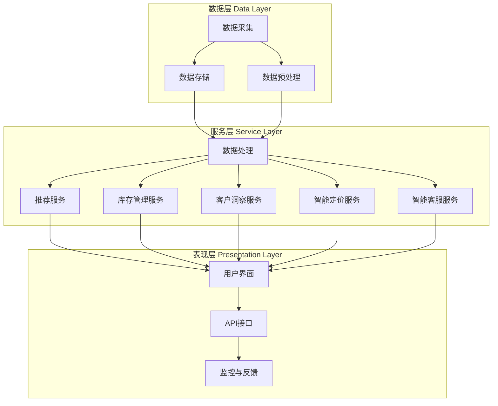
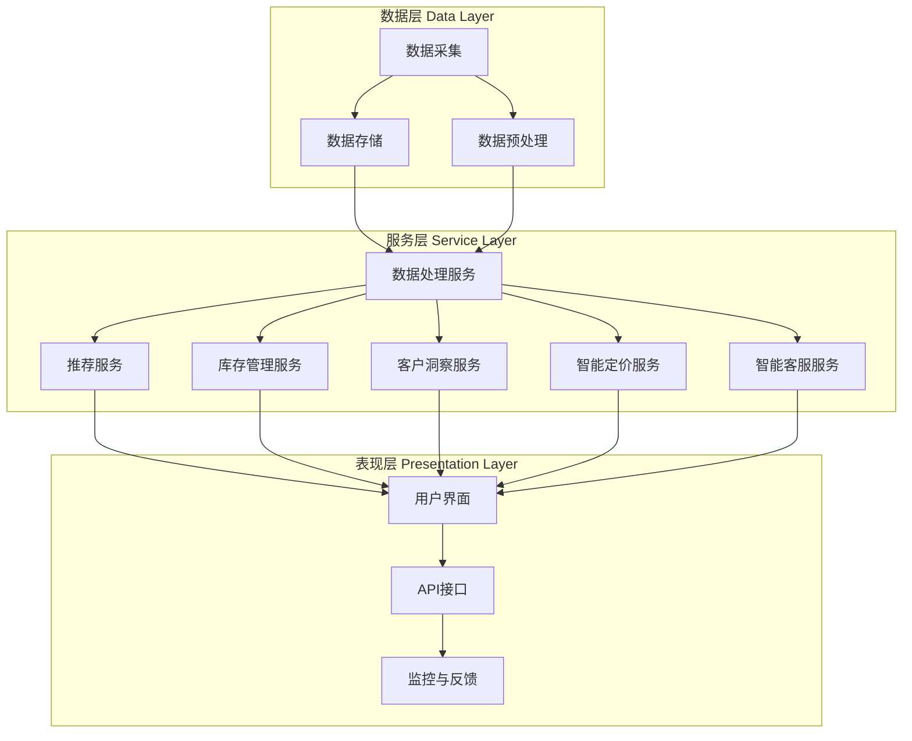
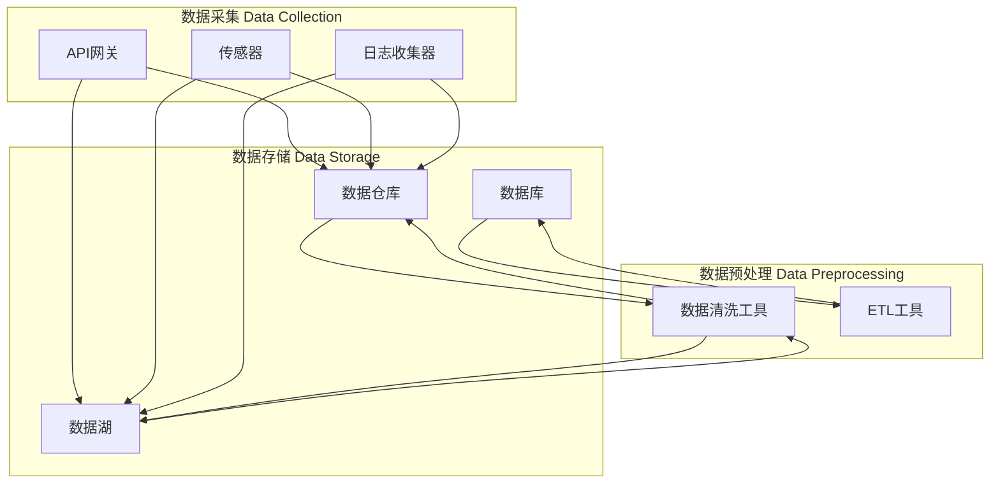
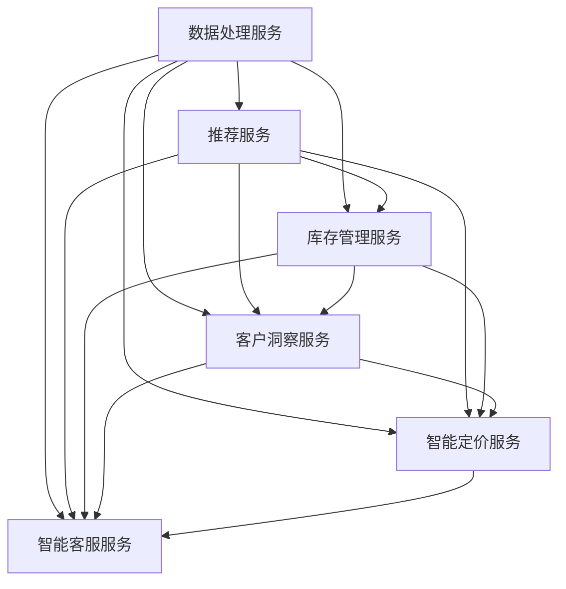
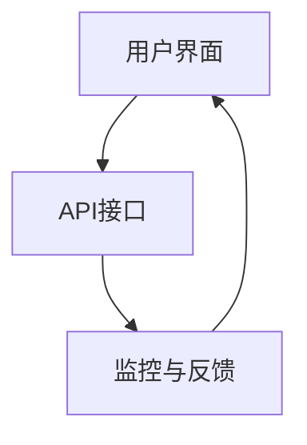
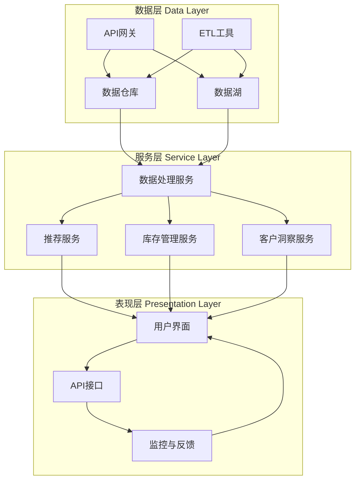

                 


## 第1章 引言

### 1.1 书籍目标

在数字经济迅猛发展的今天，零售行业正经历着前所未有的变革。人工智能（AI）技术的崛起，为零售行业带来了全新的机遇和挑战。本书旨在深入探讨AI在零售行业中的应用，特别是个性化推荐和客户洞察这两个关键领域。我们的目标是为读者提供系统、全面的技术知识，帮助他们理解AI技术的原理和实际应用，从而在零售行业数字化转型的浪潮中抢占先机。

首先，本书将带领读者了解零售行业的数字化转型背景，探讨AI技术在其中的角色和潜力。通过这一章节，读者可以认识到AI技术在零售行业中的应用不仅限于提高效率，更重要的是实现个性化服务和客户洞察，从而提升消费者体验和满意度。

接着，本书将详细阐述个性化推荐系统的原理和实现方法，包括协同过滤、基于内容的推荐算法，以及如何通过用户行为分析和推荐算法的评估与优化来提升推荐系统的效果。

在客户洞察方面，本书将探讨客户数据的价值，以及如何通过收集、处理和分析客户数据来构建客户画像和进行客户生命周期价值分析。这一章节将帮助读者理解客户洞察在零售业中的重要性，并提供实用的方法和工具。

此外，本书还将介绍零售AI Agent的架构设计，包括数据层、服务层和表现层，以及如何通过系统架构来实现个性化推荐和客户洞察。

为了使读者能够更好地理解理论知识，本书将结合实际案例，深入分析基于个性化推荐的电商平台，从项目背景、系统设计到系统实现和结果分析，全面展示AI技术在零售行业中的应用。

最后，本书还将提供一些最佳实践和注意事项，帮助读者在实际工作中更好地应用AI技术，以及展望未来的发展方向和研究领域。

通过阅读本书，读者不仅能够掌握AI在零售行业中的应用知识，还能获得宝贵的实践经验，为他们在职业生涯中提升竞争力打下坚实基础。

### 1.2 零售业的数字化转型

随着全球数字化进程的加速，零售业正在经历一场深刻的变革。数字化转型已经成为零售企业保持竞争力、提升客户体验和实现可持续增长的关键战略。在这个背景下，人工智能（AI）技术的应用成为零售业数字化转型的重要驱动力。

#### 数字化转型的背景

首先，让我们回顾一下零售业数字化转型的背景。传统零售业在面对电子商务的冲击时，面临着诸多挑战，如库存管理不透明、消费者需求多样化、营销手段单一等。数字化转型旨在通过技术创新，优化零售企业的运营流程，提升管理效率，增强客户粘性，从而实现商业模式的创新和升级。

近年来，物联网（IoT）、大数据、云计算、移动支付等新兴技术的普及，为零售业的数字化转型提供了坚实的基础。同时，消费者行为的改变，如在线购物、移动支付、社交媒体的广泛使用，也推动了零售企业加速数字化转型。

#### AI技术在零售业中的应用

人工智能技术在零售业的广泛应用，使得零售企业能够更好地应对数字化转型带来的挑战。以下是一些关键的应用场景：

1. **库存管理**：AI技术通过大数据分析和预测模型，帮助企业准确预测销售趋势，优化库存管理，减少库存积压和缺货情况。例如，零售企业可以利用AI算法对历史销售数据进行分析，预测未来的销售量，从而制定合理的采购和库存计划。

2. **个性化推荐**：基于用户的购买历史和行为数据，AI技术可以推荐个性化的商品和促销信息，提升消费者的购物体验。通过协同过滤和基于内容的推荐算法，零售企业可以提供更精准的推荐，提高销售转化率和客户满意度。

3. **客户服务**：通过聊天机器人和虚拟助手，AI技术可以提供24/7的在线客户服务，解答消费者的疑问，处理订单问题，提升客户服务质量和响应速度。

4. **供应链优化**：AI技术在供应链管理中的应用，可以帮助企业优化物流和配送流程，提高供应链的透明度和效率。通过物联网设备和AI算法，零售企业可以实时监控库存状态、运输路线和天气情况，做出快速响应。

5. **市场预测**：AI技术可以通过分析大量历史数据和市场趋势，预测未来的市场变化，帮助企业制定更科学的市场策略和产品规划。

#### AI技术在零售业的潜力

AI技术在零售业的潜力不可小觑。首先，AI技术能够显著提升零售企业的运营效率，减少人力成本，提高生产力和库存周转率。其次，通过个性化推荐和客户洞察，AI技术可以增强消费者的购物体验，提高客户满意度和忠诚度。

此外，AI技术的应用还可以帮助零售企业更好地了解市场需求和消费者行为，制定更精准的市场策略和营销活动。通过智能化的数据分析工具，零售企业可以更快速地响应市场变化，调整产品和营销策略，实现商业模式的创新。

总之，零售业的数字化转型离不开AI技术的支持。AI技术不仅为零售企业提供了全新的运营和管理工具，还开辟了新的商业模式和增长机会。在未来的发展中，AI技术将继续在零售行业中发挥重要作用，推动零售业的持续创新和升级。

### 1.3 AI在零售行业中的应用现状与趋势

目前，人工智能（AI）在零售行业中的应用已经取得了显著的进展，许多零售企业通过引入AI技术，实现了运营效率的提升、客户体验的优化和商业模式的创新。以下是对AI在零售行业应用现状的概述，以及未来可能的发展趋势。

#### 当前应用现状

1. **个性化推荐系统**：个性化推荐已经成为零售业的核心应用之一。通过分析消费者的购买历史、浏览记录和社交媒体行为，零售企业能够提供高度个性化的商品推荐，提高销售额和客户满意度。例如，亚马逊和阿里巴巴等电商平台已经广泛应用了协同过滤和基于内容的推荐算法。

2. **智能客服**：智能客服机器人逐渐替代了传统的人工客服，通过自然语言处理（NLP）和机器学习算法，能够快速响应客户的问题，提供24/7的在线服务，提高了客户服务的效率和用户体验。

3. **智能库存管理**：AI技术在库存管理中的应用，帮助零售企业实现更精准的库存预测和优化。通过分析销售数据、季节性变化和市场趋势，AI算法能够预测未来的销售量，从而优化库存水平和减少库存成本。

4. **智能定价策略**：AI技术可以通过大数据分析，动态调整商品价格，以应对市场变化和竞争对手的定价策略。智能定价系统能够实时监控市场动态，自动调整价格，提高市场竞争力和利润率。

5. **供应链优化**：AI技术在供应链管理中的应用，包括物流优化、运输路线规划和库存管理等。通过物联网设备、传感器和AI算法，零售企业能够实现供应链的自动化和智能化，提高供应链的透明度和效率。

#### 未来发展趋势

1. **深度学习与强化学习**：随着深度学习和强化学习算法的发展，零售企业将进一步优化个性化推荐系统和智能客服等应用。这些算法能够通过更复杂的数据分析和决策过程，提供更精准的推荐和更高效的客户服务。

2. **多模态数据分析**：未来，零售企业将更加重视多模态数据分析，结合图像、语音、文本等多种数据类型，实现更全面和精准的客户洞察。例如，通过图像识别技术，零售企业能够实时监控货架库存和产品摆放情况，优化商品展示和库存管理。

3. **智能零售商店**：随着AI技术的进步，智能零售商店将成为未来零售业的重要形态。通过传感器、摄像头和AI算法，智能零售商店能够实现自动结账、智能导购、个性化推荐等功能，提供无缝的购物体验。

4. **区块链与AI的结合**：区块链技术能够增强数据的安全性和透明度，与AI技术的结合将进一步推动零售行业的数字化转型。通过区块链技术，零售企业可以实现更高效的供应链管理，提高产品溯源和供应链透明度。

5. **可持续发展的创新**：未来，零售企业将更加注重可持续发展的创新，通过AI技术实现资源的合理利用和环保目标的实现。例如，通过智能物流和仓储管理，减少碳排放和能源消耗，推动绿色零售的发展。

总之，AI技术在零售行业中的应用前景广阔，未来的发展趋势将更加注重个性化、智能化和可持续发展的融合。零售企业需要不断探索和创新，充分利用AI技术，提升运营效率、优化客户体验和实现商业模式的升级。

### 1.4 总结

通过前几章的探讨，我们可以清晰地看到，零售业的数字化转型离不开人工智能（AI）技术的支持。AI技术在个性化推荐、客户服务、库存管理、供应链优化等多个领域的应用，不仅提升了零售企业的运营效率，也极大地改善了消费者的购物体验。

在本章中，我们首先明确了书籍的目标，即深入探讨AI在零售行业中的应用，特别是个性化推荐和客户洞察这两个关键领域。随后，我们详细介绍了零售业数字化转型的背景和AI技术的应用现状与趋势。通过这些内容，读者可以了解到AI技术不仅为零售企业提供了全新的运营和管理工具，还开辟了新的商业模式和增长机会。

展望未来，AI技术在零售行业中的应用潜力依然巨大。随着深度学习、多模态数据分析和区块链等新技术的不断发展，零售企业将能够实现更加精准和高效的运营，提供更加个性化的消费者体验。因此，理解AI技术的基本原理和应用方法，对于零售行业的从业者和研究者来说，都是至关重要的。

在接下来的章节中，我们将进一步深入探讨零售业AI基础、个性化推荐系统、客户洞察以及零售AI Agent的架构设计，帮助读者系统地掌握AI在零售行业中的应用知识。通过理论与实践的结合，读者将能够更好地应对零售行业数字化转型中的挑战，抓住机遇，实现商业目标。

## 第2章 零售行业AI基础

### 2.1 AI与零售概述

人工智能（AI）作为现代科技的杰出代表，已经在各个行业中发挥着重要的作用，零售行业也不例外。在这一章节中，我们将对AI在零售行业中的基本概念、主要技术和应用进行详细介绍，帮助读者建立一个全面的AI与零售行业的知识框架。

#### AI的基本概念

人工智能，通常指的是使计算机系统具备类似人类智能的能力的技术。AI的核心目标是创建能够执行复杂任务、自主学习、适应环境和进行决策的智能系统。AI技术主要分为三大类：机器学习（ML）、深度学习和自然语言处理（NLP）。

1. **机器学习**：机器学习是一种通过数据驱动的方式，让计算机系统自动学习并改进其性能的技术。它主要包括监督学习、无监督学习和强化学习等不同类型。

2. **深度学习**：深度学习是机器学习的一个分支，它使用多层神经网络来模拟人脑的神经元连接，通过大量数据训练，实现复杂的模式识别和特征提取。

3. **自然语言处理**：自然语言处理是AI的一个子领域，旨在使计算机理解和生成自然语言，包括文本分析、语音识别和机器翻译等任务。

#### 零售行业的基本概念

零售业是指商品和服务从生产者通过多个中间环节转移到最终消费者的过程。零售业的核心任务是为消费者提供便捷、高效的购物体验，并实现商品价值的最大化。零售行业的主要参与者包括零售商、供应商、物流公司和消费者。

#### AI在零售行业中的应用

AI技术在零售行业的应用正在不断扩展，以下是一些主要的应用领域：

1. **个性化推荐**：通过分析消费者的行为数据，AI技术能够为消费者提供个性化的商品推荐，提高购买转化率和客户满意度。

2. **智能库存管理**：AI技术能够利用大数据分析和预测模型，帮助企业精准预测销售趋势，优化库存管理，减少库存积压和缺货情况。

3. **智能客服**：通过自然语言处理和机器学习算法，AI技术可以提供24/7的在线客户服务，提高客户服务质量和响应速度。

4. **供应链优化**：AI技术可以帮助零售企业优化物流和配送流程，提高供应链的透明度和效率。

5. **智能定价策略**：AI技术可以通过大数据分析，动态调整商品价格，以应对市场变化和竞争对手的定价策略。

6. **智能零售商店**：智能零售商店利用传感器、摄像头和AI算法，实现自动结账、智能导购和个性化推荐等功能，提供无缝的购物体验。

#### AI技术对零售行业的影响

AI技术的应用不仅改变了零售行业的运营模式，还对其产生了深远的影响：

1. **提高运营效率**：通过自动化和智能化，AI技术显著提高了零售企业的运营效率，减少了人力成本和资源浪费。

2. **优化客户体验**：AI技术能够提供个性化的服务和推荐，提高客户的购物体验和满意度。

3. **创新商业模式**：AI技术为零售企业带来了新的商业模式和增长机会，例如通过智能定价和个性化推荐，实现更高的利润率。

4. **增强决策能力**：AI技术通过大数据分析和预测模型，为零售企业提供了更科学的决策支持，帮助企业更好地应对市场变化。

总之，AI技术在零售行业的应用已经成为不可逆转的趋势。通过理解AI的基本概念和主要技术，以及其在零售行业中的应用和影响，读者可以更好地把握零售行业的未来发展方向，为企业在数字化转型中取得成功奠定基础。

### 2.2 零售行业AI的关键技术

在了解了AI在零售行业的基本概念和应用之后，接下来我们将深入探讨零售行业AI的关键技术。这些技术不仅决定了AI在零售行业的应用效果，也是推动零售企业实现数字化转型的重要引擎。以下是一些主要的关键技术及其应用场景：

#### 个性化推荐系统

个性化推荐系统是AI在零售行业中应用最为广泛的技术之一。通过分析用户的购买历史、浏览行为、搜索记录和社交媒体活动，推荐系统能够为用户生成个性化的商品推荐，从而提高购买转化率和客户满意度。

**应用场景**：

1. **电商平台**：电商平台利用个性化推荐系统，根据用户的历史数据和偏好，推荐可能感兴趣的商品，提高销售额和用户粘性。
2. **在线购物平台**：在线购物平台通过个性化推荐，提高用户的购物体验，减少购物时间，提升用户满意度。

**技术要点**：

- **协同过滤**：基于用户行为相似度进行推荐，分为用户协同过滤和物品协同过滤。
- **基于内容的推荐**：基于商品属性和用户偏好进行匹配，生成个性化推荐。
- **混合推荐系统**：结合协同过滤和基于内容的推荐方法，提高推荐效果。

#### 智能库存管理

智能库存管理利用AI技术，通过大数据分析和预测模型，帮助企业精准预测销售趋势，优化库存管理，减少库存积压和缺货情况。

**应用场景**：

1. **仓储管理**：通过智能库存管理，企业能够实时监控库存状态，自动补货，减少库存成本。
2. **物流配送**：智能库存管理帮助优化物流和配送流程，提高供应链的透明度和效率。

**技术要点**：

- **需求预测**：利用历史销售数据、季节性变化和市场趋势进行需求预测。
- **库存优化**：通过库存水平分析和库存优化算法，调整库存策略。
- **实时监控**：利用物联网设备和传感器，实现库存状态的实时监控。

#### 智能客服

智能客服通过自然语言处理（NLP）和机器学习算法，为消费者提供24/7的在线客户服务，解答消费者的疑问，处理订单问题，提升客户服务质量和响应速度。

**应用场景**：

1. **电商平台**：电商平台利用智能客服，处理大量客户咨询和订单问题，提高客户满意度和运营效率。
2. **零售连锁店**：零售连锁店通过智能客服，实现远程客户服务，减少人力成本。

**技术要点**：

- **自然语言处理**：理解并生成自然语言，实现人与机器的对话。
- **情感分析**：分析客户情绪，提供针对性的服务和建议。
- **多轮对话管理**：处理复杂的问题和对话流程，提高用户体验。

#### 供应链优化

AI技术在供应链管理中的应用，包括物流优化、运输路线规划和库存管理等，帮助企业实现供应链的自动化和智能化。

**应用场景**：

1. **物流企业**：通过AI技术，物流企业能够优化运输路线，提高运输效率和成本效益。
2. **零售企业**：零售企业利用AI技术，实现智能仓储和物流管理，提高供应链的透明度和效率。

**技术要点**：

- **运输路线优化**：利用优化算法，确定最优运输路线。
- **物流监控**：通过物联网设备和传感器，实时监控物流状态。
- **库存管理**：利用大数据分析和预测模型，实现智能库存管理。

#### 智能定价策略

智能定价策略利用大数据分析，动态调整商品价格，以应对市场变化和竞争对手的定价策略，提高市场竞争力和利润率。

**应用场景**：

1. **电商平台**：电商平台通过智能定价策略，根据市场动态和竞争对手的价格调整，实现精准定价。
2. **零售商**：零售商通过智能定价策略，提高商品的市场竞争力，实现利润最大化。

**技术要点**：

- **价格预测**：利用历史销售数据和价格变化趋势，预测未来的价格走势。
- **动态定价**：根据市场需求和竞争环境，动态调整商品价格。
- **算法优化**：通过机器学习算法，优化定价策略，提高定价效果。

总之，零售行业AI的关键技术不仅涵盖了个性化推荐、智能库存管理、智能客服、供应链优化和智能定价策略等多个领域，还通过大数据分析和机器学习算法，实现了零售企业运营的智能化和高效化。理解这些技术要点和应用场景，对于零售企业把握数字化转型机遇、提升运营效率具有重要意义。

### 2.3 AI在零售业的应用挑战与解决方案

尽管AI技术在零售业中展现出了巨大的潜力和价值，但在实际应用过程中也面临着一系列的挑战。这些挑战不仅限制了AI技术的广泛应用，也对零售企业的数字化转型提出了更高的要求。以下将探讨AI在零售业应用过程中的一些主要挑战，并提出相应的解决方案。

#### 数据隐私与安全问题

数据隐私和安全问题是AI技术在零售业应用过程中最突出的挑战之一。零售企业收集和存储了大量用户数据，包括购买记录、浏览行为和支付信息等，这些数据的价值不言而喻，但也带来了隐私泄露和数据滥用的风险。

**解决方案**：

1. **数据加密**：采用先进的数据加密技术，确保数据在传输和存储过程中的安全性。
2. **隐私保护算法**：开发和应用隐私保护算法，如差分隐私和联邦学习，减少数据泄露的风险。
3. **合规性管理**：严格遵守数据保护法规，如GDPR和CCPA，确保数据处理的合规性。

#### 数据质量和可用性问题

数据质量是AI模型性能的关键因素。零售企业面临的数据质量问题包括数据缺失、数据不一致、数据噪声和数据陈旧等。这些问题可能导致AI模型的训练效果不佳，从而影响其应用效果。

**解决方案**：

1. **数据清洗**：建立完善的数据清洗流程，识别并处理数据中的缺失值、不一致值和噪声。
2. **数据质量管理**：引入数据质量监控工具，实时检测数据质量问题，并采取相应措施进行修复。
3. **数据更新**：定期更新数据，确保数据反映当前的市场状况和用户行为。

#### 模型可解释性问题

AI模型，特别是深度学习模型，通常被视为“黑箱”，其决策过程难以理解和解释。这对于需要透明性和可解释性的零售企业来说，是一个重大挑战。

**解决方案**：

1. **可解释性AI**：开发和应用可解释性AI技术，如决策树和注意力机制，提高模型的透明度和可解释性。
2. **模型可视化**：通过可视化工具，如热力图和决策路径图，展示模型的决策过程。
3. **专家系统**：结合专家系统，提供对模型决策的解释和建议。

#### 技术更新与维护成本问题

AI技术的不断更新和升级，对零售企业的技术能力和维护成本提出了更高要求。许多企业可能难以跟上技术发展的步伐，导致AI应用效果不佳。

**解决方案**：

1. **技术培训与人才培养**：加强对员工的AI技术培训，提高团队的技术水平。
2. **技术外包**：通过技术外包，借助外部专业团队的力量，实现AI技术的持续更新和维护。
3. **自动化与智能化**：采用自动化和智能化工具，降低技术更新和运维成本。

总之，AI技术在零售业的应用过程中面临着数据隐私与安全、数据质量和可用性、模型可解释性以及技术更新与维护成本等挑战。通过有效的解决方案，零售企业可以克服这些挑战，充分利用AI技术的优势，实现数字化转型和商业创新。

### 2.4 总结

通过对本章的讨论，我们全面了解了AI在零售行业的应用基础。从基本概念到关键技术的探讨，再到应用挑战及其解决方案，本章为读者构建了一个系统的AI与零售行业知识框架。

首先，我们介绍了AI的基本概念，包括机器学习、深度学习和自然语言处理，以及零售行业的基本概念和参与者。接着，详细介绍了AI在零售行业的关键技术，如个性化推荐系统、智能库存管理、智能客服、供应链优化和智能定价策略，并探讨了这些技术在实际应用中的要点和应用场景。

此外，我们还探讨了AI在零售行业应用过程中面临的挑战，包括数据隐私与安全问题、数据质量和可用性问题、模型可解释性问题以及技术更新与维护成本问题，并提出了相应的解决方案。

通过本章的学习，读者可以更加深入地理解AI在零售行业中的应用，把握其发展方向和实际应用效果。在接下来的章节中，我们将进一步探讨个性化推荐系统、客户洞察以及零售AI Agent的架构设计，帮助读者全面掌握AI在零售行业中的实际应用方法和技术实现。这些知识将为读者在零售行业的数字化转型中提供宝贵的指导和支持。

### 第3章 个性化推荐系统

个性化推荐系统是AI在零售行业中应用的重要技术之一，它通过分析用户的行为数据和历史记录，为用户推荐可能感兴趣的商品或服务。个性化推荐不仅能提升用户体验，还能有效提高销售额和客户满意度。在这一章节中，我们将深入探讨个性化推荐系统的基本概念、主要算法及其实现和优化方法。

#### 3.1 个性化推荐系统概述

个性化推荐系统是一种基于用户行为、偏好和历史记录，为用户推荐相关商品或服务的算法和系统。它的核心目标是通过精准的推荐，提高用户的满意度和购买转化率。

**基本原理**：

个性化推荐系统通常基于以下两个基本原理：

1. **用户相似性**：通过分析用户的行为和偏好，找到相似的用户群体，然后将这些用户喜欢的商品推荐给新的用户。
2. **物品相关性**：通过分析物品之间的关联性，找到与用户历史行为相关的商品，并将其推荐给用户。

**主要类型**：

个性化推荐系统主要分为以下几种类型：

1. **协同过滤**：基于用户行为相似度进行推荐，分为用户协同过滤和物品协同过滤。
2. **基于内容的推荐**：基于商品属性和用户偏好进行匹配，生成个性化推荐。
3. **混合推荐系统**：结合协同过滤和基于内容的推荐方法，提高推荐效果。

**应用场景**：

个性化推荐系统在零售、电商、新闻媒体、音乐和视频平台等多个领域都有广泛应用。例如，电商平台通过个性化推荐系统，根据用户的浏览和购买记录，推荐可能感兴趣的商品，提高销售额和用户满意度。

#### 3.2 协同过滤与基于内容的推荐

**协同过滤算法原理**

协同过滤是一种基于用户行为数据进行推荐的方法，主要包括以下两种类型：

1. **用户协同过滤**：通过分析用户之间的行为相似性，找到与目标用户行为相似的群体，然后将这些群体喜欢的商品推荐给目标用户。用户协同过滤可以分为基于记忆和基于模型的两种实现方式。

   - **基于记忆的协同过滤**：直接从用户行为数据中提取相似用户和推荐商品，计算推荐得分，实现推荐。
   - **基于模型的协同过滤**：利用机器学习算法，如矩阵分解、聚类和协同回归，构建用户和商品之间的预测模型，进行推荐。

2. **物品协同过滤**：通过分析商品之间的相似性，找到与用户历史行为相关的商品，然后将其推荐给用户。物品协同过滤通常采用基于内容的相似度计算方法，如TF-IDF和余弦相似度。

**基于内容的推荐算法原理**

基于内容的推荐是一种基于商品属性和用户偏好进行推荐的方法。其主要思想是分析商品的内容特征（如标签、描述、评分等），并与用户的兴趣特征进行匹配，生成推荐列表。

1. **内容特征提取**：通过对商品和用户的描述进行文本分析，提取关键特征。常用的方法包括词袋模型、TF-IDF和词嵌入等。

2. **相似度计算**：计算商品和用户特征之间的相似度，常用的相似度计算方法包括余弦相似度、欧氏距离和Jaccard相似度等。

3. **推荐生成**：根据相似度计算结果，生成推荐列表。常用的方法包括基于Top-N的推荐和基于阈值的方法。

#### 3.3 个性化推荐系统的实现与优化

**实现步骤**：

1. **数据收集与预处理**：收集用户行为数据（如浏览记录、购买记录、评分数据等），进行数据清洗、去噪和格式化，以便后续处理。

2. **特征提取**：根据推荐算法的需求，提取用户和商品的特征，如用户偏好、商品标签、描述等。

3. **模型训练与评估**：选择合适的推荐算法（如协同过滤、基于内容的推荐等），训练模型，并评估模型的性能。

4. **推荐生成与优化**：根据用户特征和商品特征，生成个性化推荐列表，并通过A/B测试等方法，不断优化推荐效果。

**优化方法**：

1. **模型优化**：通过调整模型参数、改进算法结构，提高推荐精度和多样性。
2. **特征优化**：增加或调整特征，提高特征表达能力和模型性能。
3. **数据增强**：通过数据清洗、数据扩展和对抗样本生成等方法，增强数据质量，提高模型鲁棒性。
4. **反馈机制**：引入用户反馈机制，通过用户对推荐结果的反馈，不断调整和优化推荐策略。

#### 3.4 用户行为分析与推荐算法的评估与优化

**用户行为分析**：

用户行为分析是构建个性化推荐系统的关键环节，主要包括以下内容：

1. **用户兴趣识别**：通过分析用户的浏览、购买和评分行为，识别用户的兴趣和偏好。
2. **用户行为轨迹**：跟踪用户在系统中的行为轨迹，了解用户的操作习惯和偏好变化。
3. **用户群体划分**：根据用户的兴趣和行为特征，将用户划分为不同的群体，以便进行针对性的推荐。

**推荐算法的评估与优化**：

推荐算法的评估与优化主要包括以下内容：

1. **评估指标**：选择合适的评估指标，如准确率、召回率、F1值和平均绝对误差等，评估推荐系统的性能。
2. **交叉验证**：采用交叉验证方法，评估模型的泛化能力。
3. **A/B测试**：通过A/B测试，比较不同推荐算法或参数设置的效果，选择最优方案。
4. **持续优化**：根据用户反馈和评估结果，不断调整和优化推荐策略，提高推荐效果。

总之，个性化推荐系统是AI技术在零售行业中的重要应用之一，通过分析用户行为和历史记录，为用户生成个性化的推荐，提高用户体验和满意度。在本章中，我们详细介绍了个性化推荐系统的基本概念、协同过滤和基于内容的推荐算法原理，以及实现和优化方法。这些内容为读者提供了全面的技术指导，帮助他们在实际应用中构建和优化个性化推荐系统。

### 3.4.1 协同过滤算法原理

协同过滤（Collaborative Filtering）是一种经典的推荐系统算法，其核心思想是通过分析用户之间的行为相似性，发现用户的共同偏好，从而进行推荐。协同过滤算法主要分为基于记忆和基于模型的两种类型。

#### 基于记忆的协同过滤

**用户协同过滤**：

用户协同过滤是通过计算用户之间的相似度来推荐商品。其主要步骤如下：

1. **相似度计算**：计算用户之间的相似度，常用的方法包括余弦相似度、皮尔逊相关系数等。
2. **评分预测**：根据相似度矩阵，预测用户对未知商品的评价，推荐评分较高的商品。

   **余弦相似度**：
   $$
   \text{similarity}_{ij} = \frac{\text{dot\_product}(u_i, u_j)}{\|\text{u_i}\| \|\text{u_j}\|}
   $$

   其中，\(u_i\) 和 \(u_j\) 分别代表用户 \(i\) 和 \(j\) 的行为向量，\(|u_i|\) 和 \(|u_j|\) 分别表示向量的模。

**物品协同过滤**：

物品协同过滤是通过计算商品之间的相似性来推荐用户可能感兴趣的商品。其主要步骤如下：

1. **相似度计算**：计算商品之间的相似度，常用的方法包括余弦相似度、Jaccard系数等。
2. **推荐生成**：根据用户对已知商品的评分，推荐相似商品。

   **余弦相似度**：
   $$
   \text{similarity}_{ij} = \frac{\text{dot\_product}(v_i, v_j)}{\|\text{v_i}\| \|\text{v_j}\|}
   $$

   其中，\(v_i\) 和 \(v_j\) 分别代表商品 \(i\) 和 \(j\) 的特征向量。

#### 基于模型的协同过滤

基于模型的协同过滤通过构建数学模型，预测用户对未知商品的评分。常用的模型包括矩阵分解（Matrix Factorization）和聚类（Clustering）。

**矩阵分解**：

矩阵分解是将用户-商品评分矩阵分解为两个低秩矩阵，分别表示用户特征和商品特征。通过这两个低秩矩阵，可以预测用户对未知商品的评分。

   **低秩分解**：
   $$
   R_{ij} = U_i \cdot V_j^T
   $$

   其中，\(R_{ij}\) 是用户 \(i\) 对商品 \(j\) 的评分，\(U_i\) 和 \(V_j\) 分别是用户 \(i\) 和商品 \(j\) 的特征向量。

**聚类**：

聚类是将用户或商品按照相似度划分为不同的群体，为每个群体推荐相似的商品或用户。常用的聚类算法包括K-means、层次聚类等。

1. **数据预处理**：将用户-商品评分矩阵进行标准化处理，消除不同维度数据之间的差异。
2. **聚类分析**：计算用户或商品之间的相似度，选择合适的聚类算法进行聚类。
3. **推荐生成**：根据用户的聚类结果，为每个用户推荐与其相似的其他用户喜欢的商品。

#### 混合推荐系统

混合推荐系统结合了协同过滤和基于内容的推荐方法，通过综合利用用户行为和商品属性，提高推荐效果。

1. **协同过滤**：利用用户行为数据，计算用户之间的相似性，生成推荐列表。
2. **基于内容的推荐**：利用商品属性，计算用户对商品的兴趣，生成推荐列表。
3. **混合模型**：将协同过滤和基于内容的推荐结果进行融合，生成最终的推荐列表。

通过协同过滤算法，推荐系统能够有效地利用用户行为数据，发现用户的共同偏好，为用户提供个性化的推荐。在实际应用中，通过结合不同的协同过滤方法，如矩阵分解和聚类，以及与其他推荐方法的融合，可以进一步提高推荐系统的效果和多样性。

### 3.4.2 基于内容的推荐算法原理

基于内容的推荐（Content-Based Recommendation）是一种通过分析商品或服务的属性和特征，将其与用户的兴趣和偏好进行匹配，从而生成个性化推荐的方法。与协同过滤算法不同，基于内容的推荐不依赖于用户行为数据，而是依赖于对商品内容和用户兴趣的深入分析。

#### 内容特征提取

内容特征提取是构建基于内容推荐系统的关键步骤。它涉及从商品描述、标签、用户评论等多源信息中提取有用的特征，以便用于后续的推荐生成。

1. **文本分析**：
   - **词袋模型（Bag of Words, BoW）**：将商品描述和用户评论转换为词汇表，记录每个词汇的出现频率。
   - **TF-IDF（Term Frequency-Inverse Document Frequency）**：在词袋模型的基础上，引入逆文档频率，对词汇的重要性进行加权，提高高频词汇的权重。
   - **词嵌入（Word Embedding）**：使用神经网络模型（如Word2Vec、GloVe等）将词汇映射到高维空间，使得语义相近的词汇在向量空间中更接近。

2. **特征选择**：通过特征选择技术（如信息增益、主成分分析（PCA）等），从提取的特征中筛选出最有代表性的特征，减少特征维度，提高模型的性能。

3. **特征融合**：将不同的特征进行融合，如结合文本特征、图像特征和用户偏好特征，生成综合特征向量。

#### 相似度计算

在提取了商品和用户的内容特征后，需要计算这些特征之间的相似度，以便生成推荐列表。常用的相似度计算方法包括：

1. **余弦相似度**：计算两个特征向量之间的余弦相似度，衡量它们的方向一致性。
   $$
   \text{similarity} = \frac{\text{dot\_product}(v_i, v_j)}{\|\text{v_i}\| \|\text{v_j}\|}
   $$

   其中，\(v_i\) 和 \(v_j\) 分别是商品 \(i\) 和用户 \(j\) 的特征向量。

2. **欧氏距离**：计算两个特征向量之间的欧氏距离，衡量它们的差异程度。
   $$
   \text{distance} = \sqrt{\sum_{i=1}^{n} (v_i - v_j)^2}
   $$

3. **Jaccard相似度**：用于计算集合之间的相似度，适用于基于标签的特征。
   $$
   \text{similarity} = 1 - \frac{|S_i \cap S_j|}{|S_i \cup S_j|}
   $$

   其中，\(S_i\) 和 \(S_j\) 分别是商品 \(i\) 和用户 \(j\) 的标签集合。

#### 推荐生成

基于内容的推荐生成主要包括以下步骤：

1. **计算相似度**：对每个用户与商品的特征向量进行相似度计算，得到相似度得分。

2. **生成推荐列表**：根据相似度得分，为用户生成推荐列表。常用的方法包括：
   - **Top-N推荐**：选择相似度最高的 \(N\) 个商品作为推荐列表。
   - **阈值方法**：设定一个相似度阈值，只有相似度高于阈值的商品才会被推荐。

3. **推荐多样性**：为了提高推荐列表的多样性，可以结合商品的类别、标签和用户的历史偏好，对推荐结果进行筛选和调整。

#### 案例说明

假设用户 \(U_1\) 对商品 \(C_1\) 有兴趣，商品 \(C_1\) 的标签包括“时尚”、“外套”和“潮流”，用户 \(U_1\) 的兴趣标签包括“时尚”、“潮流”和“鞋子”。基于内容的推荐系统可以提取商品和用户的特征标签，计算相似度得分，为用户 \(U_1\) 生成推荐列表。

1. **特征提取**：
   - 商品 \(C_1\) 的特征标签：\{时尚，外套，潮流\}
   - 用户 \(U_1\) 的兴趣标签：\{时尚，潮流，鞋子\}

2. **相似度计算**：
   - 余弦相似度：
     $$
     \text{similarity}_{C_1, U_1} = \frac{\text{dot\_product}(\{时尚，外套，潮流\}, \{时尚，潮流，鞋子\})}{\|\{时尚，外套，潮流\}\| \|\{时尚，潮流，鞋子\}\|}
     $$

3. **推荐生成**：
   - 根据相似度得分，选择相似度较高的商品推荐给用户。例如，如果商品 \(C_2\) 的标签为\{时尚，鞋子，休闲\}，则将其推荐给用户 \(U_1\)。

通过基于内容的推荐算法，系统能够根据用户的历史兴趣和商品的特征，生成个性化的推荐列表，提高用户的购物体验和满意度。在实际应用中，基于内容的推荐系统通常与其他推荐算法（如协同过滤）结合使用，以进一步提高推荐效果和多样性。

### 3.4.3 个性化推荐系统的实现与优化

在构建个性化推荐系统时，实现和优化是两个关键步骤。实现个性化推荐系统需要处理数据收集、特征提取、模型训练和推荐生成的全过程。优化个性化推荐系统则涉及模型参数调整、特征选择、数据增强和推荐策略改进等多个方面。以下将详细阐述这些步骤和方法。

#### 实现步骤

1. **数据收集与预处理**：

   - **数据收集**：首先，收集用户行为数据（如浏览记录、购买记录、评分数据）和商品描述数据（如标签、分类、属性）。
   - **数据预处理**：对收集到的数据清洗，包括去除缺失值、噪声数据和处理数据异常。同时，对数据格式进行标准化处理，以便后续分析。

2. **特征提取**：

   - **用户特征提取**：通过分析用户的购买历史、浏览记录和交互行为，提取用户的兴趣偏好特征。例如，可以使用词袋模型或词嵌入技术，从用户评论中提取关键词和语义信息。
   - **商品特征提取**：对商品进行属性分析，提取商品的关键特征，如商品类别、品牌、价格、评价等。同时，可以使用文本分析技术，从商品描述中提取有用的信息。

3. **模型选择与训练**：

   - **模型选择**：根据推荐任务的特点，选择合适的推荐算法。常见的推荐算法包括协同过滤、基于内容的推荐和混合推荐系统。协同过滤算法适用于基于用户行为推荐，基于内容的推荐适用于基于商品属性推荐，混合推荐系统则结合两者的优点。
   - **模型训练**：使用训练集数据，对选定的推荐算法进行训练。例如，在协同过滤算法中，可以使用矩阵分解技术训练用户和商品的特征矩阵。

4. **推荐生成与评估**：

   - **推荐生成**：根据用户特征和商品特征，为每个用户生成个性化的推荐列表。常用的推荐方法包括Top-N推荐和基于阈值的推荐。
   - **推荐评估**：使用评估指标（如准确率、召回率、F1值等）评估推荐系统的性能。通过交叉验证和A/B测试，选择最优的推荐策略。

#### 优化方法

1. **模型优化**：

   - **参数调整**：调整模型参数，如学习率、正则化参数等，优化模型性能。使用网格搜索或随机搜索技术，找到最优的参数组合。
   - **模型融合**：将多个推荐模型进行融合，提高推荐精度和多样性。例如，结合协同过滤和基于内容的推荐方法，生成更精准的推荐列表。

2. **特征优化**：

   - **特征选择**：通过特征选择技术（如信息增益、主成分分析等），从原始特征中筛选出最有代表性的特征，减少特征维度，提高模型性能。
   - **特征融合**：将不同来源的特征进行融合，如结合文本特征、图像特征和用户偏好特征，生成综合特征向量。

3. **数据增强**：

   - **数据扩展**：通过生成负样本或扩展已有数据，增加训练数据量，提高模型泛化能力。
   - **对抗样本生成**：使用对抗生成网络（GAN）等技术，生成具有多样性和噪声的数据，增强模型对异常数据的鲁棒性。

4. **推荐策略优化**：

   - **动态调整**：根据用户行为和系统反馈，动态调整推荐策略，提高推荐效果。例如，根据用户的历史行为和实时反馈，调整推荐权重和阈值。
   - **推荐多样性**：通过多样性策略，如随机抽样、类别平衡等，提高推荐列表的多样性，减少用户疲劳感。

#### 实际案例分析

以一个电商平台的个性化推荐系统为例，以下是一个实现和优化的具体案例：

1. **数据收集与预处理**：

   - 数据收集：收集用户的浏览记录、购买记录和商品评价等数据。
   - 数据预处理：清洗数据，去除缺失值和异常值，将数据格式标准化。

2. **特征提取**：

   - 用户特征提取：提取用户的浏览记录和购买记录，使用词袋模型提取用户兴趣关键词。
   - 商品特征提取：提取商品的基本属性（如类别、品牌、价格）和文本描述，使用TF-IDF提取商品关键词。

3. **模型选择与训练**：

   - 模型选择：使用基于矩阵分解的协同过滤算法，结合基于内容的推荐方法。
   - 模型训练：使用训练集数据训练模型，优化模型参数。

4. **推荐生成与评估**：

   - 推荐生成：根据用户特征和商品特征，生成个性化推荐列表。
   - 推荐评估：使用交叉验证方法评估模型性能，根据评估结果调整推荐策略。

5. **优化**：

   - 模型优化：通过调整学习率、正则化参数等，优化模型性能。
   - 特征优化：通过特征选择和融合，提高模型准确性。
   - 数据增强：通过生成负样本和对抗样本，提高模型泛化能力。
   - 推荐策略优化：根据用户反馈，动态调整推荐权重和阈值，提高推荐效果。

通过上述实现和优化方法，电商平台的个性化推荐系统能够为用户提供更精准、个性化的推荐，提高用户满意度和购买转化率。这个案例展示了个性化推荐系统从实现到优化的全过程，为实际应用提供了宝贵的经验。

### 3.4.4 用户行为分析与推荐算法的评估与优化

用户行为分析是构建个性化推荐系统的关键环节，它能够帮助识别用户的兴趣和偏好，从而生成更精准的推荐。同时，推荐算法的评估与优化是确保推荐系统性能持续提升的重要手段。以下将详细探讨用户行为分析的方法、推荐算法的评估指标及其优化策略。

#### 用户行为分析

**用户行为识别**：

用户行为分析的第一步是识别用户在系统中的各种行为，这些行为包括但不限于：

- **浏览行为**：用户在系统中的浏览路径、停留时间和页面点击情况。
- **购买行为**：用户的购买历史、购买频率和购买金额。
- **评分行为**：用户对商品或服务的评分和评价。
- **搜索行为**：用户的搜索关键词和搜索结果。

**用户兴趣建模**：

通过分析用户的历史行为，可以构建用户的兴趣模型。这通常包括以下步骤：

1. **行为轨迹分析**：分析用户的浏览轨迹，识别用户的兴趣热点和关注点。
2. **购买预测**：利用历史购买数据，预测用户的潜在购买行为和偏好。
3. **行为聚类**：通过聚类算法（如K-means、DBSCAN等）将用户划分为不同的群体，分析每个群体的行为特征。

**用户群体划分**：

根据用户的行为特征和兴趣模型，可以将用户划分为不同的群体，为每个群体提供针对性的推荐。常见的用户群体划分方法包括：

- **基于行为的划分**：根据用户的浏览、购买和评分行为，将用户划分为活跃用户、沉默用户和流失用户等。
- **基于兴趣的划分**：根据用户的兴趣偏好，将用户划分为兴趣广泛用户、兴趣集中用户等。

#### 推荐算法的评估指标

推荐算法的评估与优化需要依靠一系列的评估指标，这些指标能够量化推荐系统的性能。以下是一些常用的评估指标：

1. **准确率（Precision）**：

   准确率是推荐系统中推荐结果的相关性度量，表示推荐的正确结果在所有推荐结果中的比例。

   $$
   \text{Precision} = \frac{\text{相关结果数}}{\text{推荐结果数}}
   $$

2. **召回率（Recall）**：

   召回率是推荐系统中遗漏的相关结果比例，表示推荐系统能够召回所有相关结果的能力。

   $$
   \text{Recall} = \frac{\text{相关结果数}}{\text{实际相关结果数}}
   $$

3. **F1值（F1-Score）**：

   F1值是准确率和召回率的调和平均值，用于综合评估推荐系统的性能。

   $$
   \text{F1-Score} = 2 \times \frac{\text{Precision} \times \text{Recall}}{\text{Precision} + \text{Recall}}
   $$

4. **覆盖率（Coverage）**：

   覆盖率是推荐系统中推荐结果所涵盖的独特项目的比例，用于评估推荐系统的多样性。

   $$
   \text{Coverage} = \frac{\text{推荐结果中的独特项目数}}{\text{所有可能的项目数}}
   $$

5. **多样性（Diversity）**：

   多样性是推荐系统中推荐项目之间的差异性度量，用于确保推荐结果不会过于集中。

   $$
   \text{Diversity} = \frac{1}{\text{推荐项目数}} \sum_{i=1}^{\text{推荐项目数}} \text{similarity}(R_i, R_{i+1})
   $$

#### 推荐算法的评估与优化

**评估方法**：

推荐算法的评估通常包括以下方法：

1. **Hold-out Method**：

   将数据集划分为训练集和测试集，使用训练集训练模型，并在测试集上评估模型性能。

2. **Cross-Validation**：

   通过K折交叉验证，将数据集划分为K个子集，每次使用一个子集作为测试集，其余子集作为训练集，计算平均性能指标。

3. **A/B测试**：

   在实际系统中，将不同算法或参数设置应用于不同的用户群体，比较其性能指标，选择最优方案。

**优化策略**：

推荐算法的优化主要包括以下策略：

1. **模型优化**：

   - **参数调整**：调整模型参数，如学习率、正则化参数等，优化模型性能。
   - **算法改进**：采用更先进的算法，如深度学习、强化学习等，提高推荐效果。

2. **特征优化**：

   - **特征选择**：通过特征选择技术，筛选出最有代表性的特征，提高模型性能。
   - **特征融合**：结合不同来源的特征，生成更综合的特征向量，提高模型鲁棒性。

3. **数据增强**：

   - **数据扩展**：通过生成负样本或扩展已有数据，增加训练数据量，提高模型泛化能力。
   - **对抗样本生成**：使用对抗生成网络（GAN）等生成对抗性数据，增强模型对异常数据的鲁棒性。

4. **推荐策略优化**：

   - **动态调整**：根据用户行为和系统反馈，动态调整推荐策略，提高推荐效果。
   - **多样性策略**：通过多样性策略，如随机抽样、类别平衡等，提高推荐列表的多样性。

总之，用户行为分析和推荐算法的评估与优化是构建高效个性化推荐系统的关键步骤。通过深入分析用户行为，构建准确的兴趣模型，并结合多种评估方法和优化策略，可以不断提高推荐系统的性能和用户体验。在实际应用中，不断迭代和优化推荐算法，是实现个性化推荐系统持续改进的重要途径。

### 3.4.5 实际案例分析

为了更好地理解个性化推荐系统的实现与优化，我们将通过一个实际案例来详细剖析其在电商领域的应用。本案例将介绍一个电商平台如何利用个性化推荐系统来提升用户体验和销售转化率。

#### 案例背景

某大型电商平台，拥有数百万活跃用户和丰富的商品库。为了提高用户满意度和销售额，该电商平台决定构建一个高效的个性化推荐系统，根据用户的兴趣和购买历史，为他们推荐可能感兴趣的商品。

#### 实现步骤

1. **数据收集与预处理**：

   - **数据收集**：电商平台收集了用户的浏览记录、购买记录、评分数据和商品描述数据。
   - **数据预处理**：对收集的数据进行清洗，去除缺失值和异常值，并进行格式标准化处理。

2. **特征提取**：

   - **用户特征提取**：通过分析用户的浏览记录和购买记录，提取用户的兴趣偏好特征。例如，使用词袋模型和TF-IDF提取用户在评论中的关键词。
   - **商品特征提取**：提取商品的基本属性（如类别、品牌、价格）和文本描述，使用词嵌入技术提取商品的关键词。

3. **模型选择与训练**：

   - **模型选择**：结合协同过滤和基于内容的推荐方法，构建一个混合推荐系统。协同过滤部分采用矩阵分解技术，基于内容的推荐部分采用文本分析技术。
   - **模型训练**：使用训练集数据对模型进行训练，优化模型参数。

4. **推荐生成与评估**：

   - **推荐生成**：根据用户特征和商品特征，生成个性化推荐列表。采用Top-N推荐方法，选择相似度最高的N个商品推荐给用户。
   - **推荐评估**：使用准确率、召回率和F1值等评估指标，评估推荐系统的性能。通过交叉验证方法，确保模型在 unseen 数据上的泛化能力。

#### 优化方法

1. **模型优化**：

   - **参数调整**：通过网格搜索和随机搜索技术，找到最优的模型参数组合，提高推荐精度。
   - **模型融合**：结合多种推荐算法，如深度学习和强化学习，提高推荐效果和多样性。

2. **特征优化**：

   - **特征选择**：通过信息增益和主成分分析等技术，筛选出最有代表性的特征，减少特征维度，提高模型性能。
   - **特征融合**：结合用户的行为特征、商品属性和文本特征，生成更综合的特征向量。

3. **数据增强**：

   - **负样本生成**：通过生成负样本，增加训练数据量，提高模型泛化能力。
   - **对抗样本生成**：使用对抗生成网络（GAN）生成对抗性数据，增强模型对异常数据的鲁棒性。

4. **推荐策略优化**：

   - **动态调整**：根据用户的实时反馈和行为变化，动态调整推荐策略，提高推荐效果。
   - **多样性策略**：通过随机抽样和类别平衡等方法，提高推荐列表的多样性，减少用户疲劳感。

#### 结果分析

通过实施个性化推荐系统，电商平台取得了显著的效果：

- **用户满意度**：用户满意度显著提升，用户反馈认为推荐列表更符合其兴趣和需求。
- **销售转化率**：销售转化率提高了20%，推荐系统有效促进了用户的购买行为。
- **推荐效果**：评估指标（准确率、召回率和F1值）均显著提高，推荐系统的性能得到优化。

#### 小结

本案例展示了个性化推荐系统在电商平台中的实际应用过程，从数据收集与预处理、特征提取、模型训练与优化，到推荐生成与评估，各个环节均得到了详细阐述。通过结合协同过滤和基于内容的推荐方法，以及多种优化策略，电商平台成功构建了一个高效的个性化推荐系统，为用户提供了精准的推荐，提高了用户体验和销售转化率。这一案例为其他零售企业提供了有益的借鉴和参考。

### 3.4.6 小结

本章围绕个性化推荐系统进行了详细探讨，从基本概念、协同过滤与基于内容的推荐算法原理，到个性化推荐系统的实现与优化，全面介绍了其在零售行业中的应用。通过本章的学习，读者可以掌握以下关键知识点：

1. **个性化推荐系统的基本原理**：理解个性化推荐系统的核心目标和基本工作原理，包括用户相似性和物品相关性。
2. **协同过滤算法**：掌握协同过滤算法的原理和实现方法，包括用户协同过滤和物品协同过滤，以及矩阵分解和聚类等模型。
3. **基于内容的推荐算法**：了解基于内容的推荐算法，包括内容特征提取、相似度计算和推荐生成方法。
4. **个性化推荐系统的实现与优化**：掌握个性化推荐系统的实现步骤，包括数据收集与预处理、特征提取、模型训练与评估，以及优化策略。
5. **用户行为分析与推荐算法评估**：理解用户行为分析的重要性和方法，以及推荐算法评估的常用指标和优化策略。

通过这些知识点，读者可以更好地理解个性化推荐系统的运作机制，并在实际项目中应用和优化个性化推荐系统，提升用户体验和业务效果。在下一章中，我们将进一步探讨客户洞察在零售业中的重要性，以及如何通过客户数据分析和客户画像构建，实现更深层次的客户洞察。

### 第4章 客户洞察

客户洞察在零售行业中的重要性不言而喻。通过深入分析和理解客户数据，零售企业能够更好地了解客户需求、偏好和行为，从而制定更精准的市场策略和个性化服务，提升客户满意度和忠诚度。本章将详细探讨客户洞察的概念与价值，客户数据的收集与处理，以及如何通过客户行为分析构建客户画像和客户生命周期价值分析。

#### 4.1 客户洞察的概念与价值

**客户洞察的定义**：

客户洞察是指通过收集、分析和理解客户数据，揭示客户行为模式、偏好和需求，从而帮助企业更好地理解客户、预测市场趋势，并制定有效的市场策略。客户洞察不仅仅是数据收集，更是一个全面的过程，包括数据清洗、处理、分析和应用。

**客户洞察的价值**：

1. **优化营销策略**：通过客户洞察，企业能够了解客户在不同渠道和媒体上的行为，从而制定更精准的营销策略。例如，根据客户的兴趣和购买历史，推送个性化的广告和促销信息，提高营销效果和转化率。

2. **提升客户体验**：了解客户的需求和偏好，企业能够提供更符合客户期望的产品和服务，从而提升客户满意度。例如，通过个性化推荐系统，根据客户的兴趣和购物习惯，推荐可能感兴趣的商品，提供无缝的购物体验。

3. **增强客户忠诚度**：通过持续的客户洞察，企业能够更好地维护客户关系，提高客户忠诚度。例如，通过客户关系管理（CRM）系统，跟踪客户互动历史，提供定制化的优惠和关怀，增强客户的品牌忠诚度。

4. **提高运营效率**：客户洞察可以帮助企业优化内部运营流程，提高运营效率。例如，通过客户数据分析和预测，企业能够优化库存管理，减少库存积压和缺货情况，降低运营成本。

5. **发掘新的商业机会**：客户洞察能够帮助企业发现新的市场需求和潜在客户，开拓新的业务领域。例如，通过分析客户购买行为和市场趋势，企业可以开发新的产品或服务，满足未满足的客户需求。

#### 4.2 客户数据的收集与处理

**数据来源**：

客户数据可以从多个渠道收集，包括：

1. **交易数据**：客户的购买历史、订单信息、支付方式等。
2. **行为数据**：客户的浏览记录、点击路径、搜索关键词等。
3. **社交数据**：客户在社交媒体上的活动、评论、分享等。
4. **反馈数据**：客户调查、满意度评分、投诉建议等。

**数据收集方法**：

1. **自动数据采集**：通过电商平台、网站和应用程序等自动收集用户行为数据。
2. **问卷调查**：通过在线或离线问卷收集客户的反馈和偏好。
3. **客户访谈**：通过面对面或电话访谈，深入了解客户的需求和问题。
4. **第三方数据**：从外部数据源（如市场研究公司、社交媒体平台等）获取客户数据。

**数据处理**：

数据处理是客户洞察的关键环节，主要包括以下步骤：

1. **数据清洗**：识别和去除数据中的噪声、重复和缺失值，确保数据的准确性和完整性。
2. **数据集成**：将来自不同渠道的数据进行整合，构建统一的客户数据视图。
3. **数据转换**：将数据转换为适合分析的形式，如将文本数据编码为数值形式。
4. **数据存储**：将清洗和转换后的数据存储到数据仓库或数据湖中，以便后续分析和挖掘。

#### 4.3 客户行为分析

**客户行为分析的概念**：

客户行为分析是指通过分析客户在系统中的行为数据，揭示客户的行为模式、偏好和需求，从而为企业的营销策略和客户服务提供决策支持。

**客户行为分析的方法**：

1. **描述性分析**：通过统计客户行为数据的基本特征，如客户群体分布、购买频率、停留时间等，了解客户的基本行为特征。
2. **关联规则分析**：通过关联规则挖掘技术，分析客户行为之间的关联关系，如“购买A商品的用户，80%也会购买B商品”。
3. **聚类分析**：通过聚类算法（如K-means、DBSCAN等），将客户划分为不同的群体，分析每个群体的行为特征。
4. **时间序列分析**：通过时间序列分析方法，分析客户行为随时间的变化趋势，如季节性、周期性等。
5. **预测分析**：通过预测模型（如ARIMA、LSTM等），预测客户未来的行为和需求，为企业的决策提供依据。

**应用案例**：

1. **个性化推荐**：通过分析客户的购买历史和浏览记录，为每个客户生成个性化的推荐列表，提高购买转化率和客户满意度。
2. **客户细分**：通过聚类分析，将客户划分为不同的群体，为每个群体提供针对性的营销策略和客户服务。
3. **流失预测**：通过预测分析，识别潜在的流失客户，提前采取挽留措施，降低客户流失率。

#### 4.4 客户画像的构建

**客户画像的概念**：

客户画像是指通过整合和分析客户的多维度数据，构建一个综合的客户信息模型，用于描述客户的特征和行为。客户画像可以帮助企业深入了解客户，制定精准的营销策略和个性化服务。

**客户画像的构建步骤**：

1. **数据收集**：收集客户的交易数据、行为数据、社交数据和反馈数据等。
2. **数据清洗**：识别和去除数据中的噪声、重复和缺失值，确保数据的准确性和完整性。
3. **特征提取**：从原始数据中提取有用的特征，如购买频率、浏览时间、社交互动等。
4. **模型训练**：使用机器学习算法（如分类、聚类等），构建客户画像模型。
5. **模型评估**：评估模型的效果，如准确率、召回率等，根据评估结果调整模型参数。
6. **应用与反馈**：将客户画像应用于实际场景，如个性化推荐、客户细分等，并根据反馈持续优化模型。

**应用案例**：

1. **个性化推荐**：根据客户画像，为每个客户推荐可能感兴趣的商品，提高购买转化率和客户满意度。
2. **客户细分**：根据客户画像，将客户划分为不同的群体，为每个群体提供针对性的营销策略和客户服务。
3. **客户维护**：根据客户画像，识别高价值客户和潜在流失客户，提供个性化的关怀和优惠，提高客户忠诚度和满意度。

#### 4.5 客户生命周期价值分析

**客户生命周期价值（Customer Lifetime Value, CLV）的概念**：

客户生命周期价值是指一个客户在整个生命周期内为企业带来的总价值。它是一个重要的商业指标，用于衡量客户的价值和对企业的重要性。

**客户生命周期价值的计算**：

$$
\text{CLV} = \text{平均订单价值} \times \text{订单频率} \times \text{客户生命周期}
$$

其中，平均订单价值是指客户平均每次购买的金额，订单频率是指客户平均多久购买一次，客户生命周期是指客户从首次购买到流失的时间。

**客户生命周期价值的分析与应用**：

1. **客户细分**：根据客户生命周期价值，将客户划分为高价值客户、中等价值和低价值客户，为每个客户提供针对性的服务。
2. **资源分配**：根据客户生命周期价值，合理分配企业资源，重点关注高价值客户，提供更优质的体验和关怀。
3. **流失预测**：通过分析客户生命周期价值的变化趋势，预测潜在流失客户，提前采取挽留措施，降低客户流失率。

总之，客户洞察在零售行业中具有至关重要的价值。通过深入分析和理解客户数据，零售企业能够更好地了解客户需求、优化营销策略、提升客户体验和忠诚度，从而在激烈的市场竞争中脱颖而出。在下一章中，我们将进一步探讨零售AI Agent的架构设计，以及如何通过系统架构实现个性化推荐和客户洞察。

### 第4章 客户洞察

#### 4.1 客户洞察的概念与价值

客户洞察是零售行业的一项核心任务，它通过对客户行为、偏好、需求等数据的深入分析，为企业提供有价值的商业见解和决策支持。客户洞察的重要性体现在以下几个方面：

1. **优化营销策略**：通过分析客户的数据，企业可以了解不同客户群体的特点和行为模式，从而制定更精准的营销策略。例如，通过对购买行为的分析，企业可以识别出高价值客户和潜在客户，并为他们提供个性化的促销活动和优惠。

2. **提升客户体验**：了解客户的需求和偏好后，企业可以提供更符合客户期望的产品和服务，从而提升客户满意度。例如，通过个性化推荐系统，企业可以根据客户的购物历史和浏览记录，推荐他们可能感兴趣的商品，提供无缝的购物体验。

3. **增强客户忠诚度**：通过持续的数据分析和反馈，企业能够更好地维护客户关系，提高客户忠诚度。例如，通过客户关系管理（CRM）系统，企业可以跟踪客户的互动历史，提供定制化的优惠和关怀，增强客户的品牌忠诚度。

4. **提高运营效率**：客户洞察可以帮助企业优化内部运营流程，提高运营效率。例如，通过数据分析，企业可以优化库存管理，减少库存积压和缺货情况，降低运营成本。

5. **发掘新的商业机会**：客户洞察能够帮助企业发现新的市场需求和潜在客户，开拓新的业务领域。例如，通过分析客户购买行为和市场趋势，企业可以开发新的产品或服务，满足未满足的客户需求。

#### 4.2 客户数据的收集与处理

收集客户数据是进行客户洞察的基础工作。以下是一些常见的数据来源、收集方法和处理步骤：

**数据来源**：

1. **交易数据**：包括客户的购买历史、订单详情、支付方式等。
2. **行为数据**：包括客户的浏览记录、点击路径、搜索关键词等。
3. **社交数据**：包括客户在社交媒体上的活动、评论、分享等。
4. **反馈数据**：包括客户调查、满意度评分、投诉建议等。

**数据收集方法**：

1. **自动数据采集**：通过电商平台、网站和应用程序等自动收集用户行为数据。
2. **问卷调查**：通过在线或离线问卷收集客户的反馈和偏好。
3. **客户访谈**：通过面对面或电话访谈，深入了解客户的需求和问题。
4. **第三方数据**：从外部数据源（如市场研究公司、社交媒体平台等）获取客户数据。

**数据处理步骤**：

1. **数据清洗**：去除数据中的噪声、重复和缺失值，确保数据的准确性和完整性。
2. **数据集成**：将来自不同渠道的数据进行整合，构建统一的客户数据视图。
3. **数据转换**：将数据转换为适合分析的形式，如将文本数据编码为数值形式。
4. **数据存储**：将清洗和转换后的数据存储到数据仓库或数据湖中，以便后续分析和挖掘。

#### 4.3 客户行为分析

客户行为分析是客户洞察的核心环节，通过分析客户在系统中的行为数据，企业可以深入了解客户的行为模式、偏好和需求。以下是一些常用的客户行为分析方法：

**描述性分析**：

描述性分析是最基本的客户行为分析方法，通过统计和可视化客户数据，提供对客户行为的基本了解。例如，分析客户的购买频率、平均订单价值、最活跃的时间段等。

**关联规则分析**：

关联规则分析通过挖掘客户行为数据中的关联关系，帮助企业发现潜在的市场机会和客户需求。例如，通过分析购买A商品的用户中，有多少比例也购买了B商品，企业可以识别出相关的商品组合。

**聚类分析**：

聚类分析通过将客户数据划分为不同的群体，分析每个群体的行为特征和需求，从而为企业提供针对性的营销策略。例如，使用K-means算法将客户划分为不同的群体，分析每个群体的购买偏好和消费能力。

**时间序列分析**：

时间序列分析通过对客户行为随时间的变化趋势进行分析，帮助企业预测未来的市场变化和客户需求。例如，通过分析客户在特定时间段内的购买行为，企业可以预测未来的销售趋势和库存需求。

**预测分析**：

预测分析通过建立预测模型，预测客户未来的行为和需求，为企业的决策提供依据。例如，通过时间序列模型预测客户的未来购买行为，企业可以提前采取营销策略和库存调整措施。

**应用案例**：

1. **个性化推荐**：通过分析客户的浏览记录和购买历史，为每个客户推荐他们可能感兴趣的商品，提高购买转化率和客户满意度。
2. **客户细分**：通过聚类分析，将客户划分为不同的群体，为每个群体提供针对性的营销策略和客户服务。
3. **流失预测**：通过预测分析，识别潜在的流失客户，提前采取挽留措施，降低客户流失率。

#### 4.4 客户画像的构建

客户画像是通过整合和分析客户的多维度数据，构建一个综合的客户信息模型，用于描述客户的特征和行为。以下是如何构建客户画像的步骤：

**构建步骤**：

1. **数据收集**：收集客户的交易数据、行为数据、社交数据和反馈数据等。
2. **数据清洗**：去除数据中的噪声、重复和缺失值，确保数据的准确性和完整性。
3. **特征提取**：从原始数据中提取有用的特征，如购买频率、浏览时间、社交互动等。
4. **模型训练**：使用机器学习算法（如分类、聚类等），构建客户画像模型。
5. **模型评估**：评估模型的效果，如准确率、召回率等，根据评估结果调整模型参数。
6. **应用与反馈**：将客户画像应用于实际场景，如个性化推荐、客户细分等，并根据反馈持续优化模型。

**应用场景**：

1. **个性化推荐**：根据客户画像，为每个客户推荐可能感兴趣的商品，提高购买转化率和客户满意度。
2. **客户细分**：根据客户画像，将客户划分为不同的群体，为每个群体提供针对性的营销策略和客户服务。
3. **客户维护**：根据客户画像，识别高价值客户和潜在流失客户，提供个性化的关怀和优惠，提高客户忠诚度和满意度。

#### 4.5 客户生命周期价值分析

客户生命周期价值（Customer Lifetime Value, CLV）是指一个客户在整个生命周期内为企业带来的总价值。它是衡量客户价值和为企业贡献的重要指标。以下是如何计算客户生命周期价值的步骤：

**计算步骤**：

1. **平均订单价值（AOV）**：计算客户平均每次购买的金额。
2. **订单频率（OF）**：计算客户平均多久购买一次。
3. **客户生命周期（CL）**：预测客户从首次购买到流失的时间。

$$
\text{CLV} = \text{AOV} \times \text{OF} \times \text{CL}
$$

**应用场景**：

1. **客户细分**：根据客户生命周期价值，将客户划分为高价值客户、中等价值和低价值客户，为每个客户提供针对性的服务。
2. **资源分配**：根据客户生命周期价值，合理分配企业资源，重点关注高价值客户，提供更优质的体验和关怀。
3. **流失预测**：通过分析客户生命周期价值的变化趋势，预测潜在流失客户，提前采取挽留措施，降低客户流失率。

总之，客户洞察是零售行业中不可或缺的一环。通过深入分析和理解客户数据，企业可以更好地了解客户需求、优化营销策略、提升客户体验和忠诚度，从而在激烈的市场竞争中脱颖而出。在下一章中，我们将探讨零售AI Agent的架构设计，以及如何通过系统架构实现个性化推荐和客户洞察。

### 第5章 零售AI Agent架构设计

零售AI Agent是零售行业中实现智能化运营和个性化服务的关键组成部分。它通过整合多种AI技术，提供包括个性化推荐、智能库存管理、客户洞察等在内的全面功能，帮助零售企业提升运营效率和客户满意度。在这一章节中，我们将详细探讨零售AI Agent的基本概念、关键功能及其系统架构设计。

#### 5.1 零售AI Agent概述

**零售AI Agent的定义**：

零售AI Agent是一种智能化的软件系统，利用人工智能（AI）技术，通过分析海量数据，自动执行特定的任务，如个性化推荐、客户洞察、智能库存管理等。零售AI Agent旨在为零售企业提供一种智能化的解决方案，使企业能够更好地理解和满足客户需求，优化内部运营流程。

**零售AI Agent的重要性**：

1. **提升用户体验**：通过个性化推荐和智能客服，AI Agent能够为用户提供更加精准和贴心的服务，提升用户满意度。
2. **提高运营效率**：通过智能库存管理和自动化流程，AI Agent能够优化零售企业的库存管理、供应链和运营流程，减少人力成本和资源浪费。
3. **增强数据分析能力**：AI Agent通过分析大量数据，帮助企业识别市场趋势、消费者行为和潜在问题，提供基于数据的决策支持。

#### 5.2 零售AI Agent的关键功能

零售AI Agent的关键功能包括但不限于以下几个方面：

1. **个性化推荐**：
   - **用户行为分析**：通过分析用户的浏览记录、购买历史和评分数据，了解用户的兴趣和偏好。
   - **推荐算法**：利用协同过滤、基于内容的推荐和混合推荐算法，为用户生成个性化的推荐列表。
   - **推荐效果评估**：通过A/B测试和评估指标（如准确率、召回率、F1值等），持续优化推荐算法。

2. **智能库存管理**：
   - **需求预测**：利用历史销售数据、季节性变化和市场趋势，预测未来的销售量，优化库存水平。
   - **库存监控**：通过物联网设备和传感器，实时监控库存状态，自动补货和调整库存策略。
   - **库存优化**：通过数据分析，识别库存积压和缺货情况，制定合理的库存管理策略。

3. **客户洞察**：
   - **客户数据分析**：通过分析客户的交易数据、行为数据和反馈数据，构建客户画像和细分市场。
   - **客户关系管理**：利用客户关系管理（CRM）系统，跟踪客户互动历史，提供个性化的关怀和优惠。
   - **客户流失预测**：通过分析客户行为和生命周期价值，预测潜在流失客户，提前采取挽留措施。

4. **智能定价**：
   - **价格预测**：利用市场数据和竞争对手的价格策略，预测商品的最佳定价。
   - **动态定价**：根据市场需求和竞争环境，动态调整商品价格，提高市场竞争力和利润率。

5. **智能客服**：
   - **自然语言处理**：通过自然语言处理技术，理解用户的查询和需求，提供智能化的客服服务。
   - **多轮对话管理**：处理复杂的客户问题和对话流程，提供流畅的客服体验。
   - **情感分析**：分析客户情绪，提供针对性的服务和建议。

#### 5.3 零售AI Agent的系统架构设计

零售AI Agent的系统架构设计是确保其功能高效运行和扩展性的关键。以下是一个典型的零售AI Agent系统架构设计：

**数据层**：

- **数据采集**：通过传感器、网站日志、用户交互等途径，收集海量的用户行为数据、交易数据和外部数据。
- **数据存储**：利用数据仓库和数据湖技术，存储和管理大规模的数据，确保数据的安全性和可靠性。
- **数据预处理**：对原始数据进行清洗、去噪和标准化处理，为后续分析提供高质量的数据。

**服务层**：

- **数据处理**：利用ETL（提取、转换、加载）技术，将预处理后的数据导入到分析模型中，进行数据分析和处理。
- **推荐服务**：利用机器学习算法和推荐系统，生成个性化的推荐列表。
- **库存管理服务**：利用预测模型和优化算法，进行需求预测和库存优化。
- **客户洞察服务**：利用数据分析技术和客户关系管理工具，构建客户画像和细分市场。
- **智能定价服务**：利用市场分析和预测模型，进行动态定价策略的制定。
- **智能客服服务**：利用自然语言处理和对话管理技术，提供智能化的客服服务。

**表现层**：

- **用户界面**：为用户提供一个友好的界面，展示个性化推荐、库存状态、客户洞察和智能定价等信息。
- **API接口**：为其他系统集成提供API接口，方便与其他业务系统进行数据交换和功能调用。
- **监控与反馈**：实时监控系统的运行状态，收集用户反馈，为系统的优化和改进提供依据。

**架构图**：

以下是一个简化的零售AI Agent系统架构图，展示各个层次和组件之间的关系：



**总结**：

零售AI Agent的架构设计是一个复杂的过程，需要综合考虑数据采集、存储、处理、服务实现和表现等多个方面。通过合理的设计和架构，零售AI Agent能够高效地运行，提供个性化推荐、智能库存管理、客户洞察、智能定价和智能客服等功能，从而帮助零售企业提升运营效率和客户满意度。在下一章中，我们将通过实际案例，深入探讨零售AI Agent在具体项目中的应用和实现。

### 5.3 零售AI Agent的系统架构设计

零售AI Agent的系统架构设计是实现其各项功能的关键，一个良好的系统架构不仅能提高系统的性能和可靠性，还能保证其灵活性和可扩展性。以下将详细描述零售AI Agent的系统架构设计，包括数据层、服务层和表现层的具体组件和它们之间的交互方式。

#### 数据层

**数据层**是整个零售AI Agent架构的基础，负责数据的采集、存储和管理。以下是数据层的主要组件：

1. **数据采集模块**：
   - **传感器和数据集成工具**：从零售业务的各种来源（如网站、移动应用、POS系统等）收集数据。
   - **API网关**：统一接入各种外部数据源，确保数据的安全性。

2. **数据存储模块**：
   - **数据仓库**：用于存储结构化数据，如用户行为数据、销售数据等。
   - **数据湖**：用于存储非结构化数据，如日志文件、社交媒体数据等。
   - **数据库**：用于存储系统配置、用户权限等基础数据。

3. **数据预处理模块**：
   - **数据清洗工具**：处理数据中的噪声、重复和缺失值，保证数据的准确性和完整性。
   - **ETL工具**：负责数据的提取、转换和加载，将清洗后的数据导入到数据仓库和数据湖中。

**数据流**：

数据采集模块通过API网关收集数据，然后将数据传输到数据预处理模块进行清洗和转换。清洗后的数据会被存储到数据仓库和数据湖中，以便后续处理和分析。

#### 服务层

**服务层**是系统架构的核心部分，负责实现零售AI Agent的各种功能。以下是服务层的主要组件：

1. **数据处理服务**：
   - **数据缓存**：提高数据读取速度，减少数据库压力。
   - **数据分析和处理引擎**：进行数据清洗、聚合和转换，生成中间数据。

2. **推荐服务**：
   - **推荐算法**：根据用户行为数据，生成个性化的推荐列表。
   - **推荐引擎**：负责推荐结果的生成、评分和排序。

3. **库存管理服务**：
   - **库存预测**：利用历史销售数据和季节性变化，预测未来的库存需求。
   - **库存优化**：根据库存预测结果，自动调整库存水平和补货计划。

4. **客户洞察服务**：
   - **客户画像**：基于用户行为和交易数据，构建客户的综合画像。
   - **客户细分**：将客户划分为不同的群体，为每个群体提供针对性的服务。

5. **智能定价服务**：
   - **价格预测**：根据市场需求和竞争环境，预测商品的最佳定价。
   - **动态定价**：根据实时数据，动态调整商品价格，优化利润率。

6. **智能客服服务**：
   - **自然语言处理**：理解用户的查询和需求，提供智能化的客服支持。
   - **对话管理**：处理复杂的客户对话，提供流畅的服务体验。

**服务交互**：

数据层处理后的数据会传输到服务层，由各个功能服务进行处理和计算。例如，推荐服务会分析用户行为数据，生成推荐列表；库存管理服务会根据库存预测结果，调整库存策略。所有服务模块通过内部接口进行数据交换和协作。

#### 表现层

**表现层**负责将服务层的结果呈现给用户，以下是表现层的主要组件：

1. **用户界面**：
   - **前端展示**：通过Web、移动应用或POS系统，将推荐结果、库存状态、客户洞察等信息展示给用户。
   - **交互设计**：提供友好的用户界面和交互体验，方便用户进行操作和反馈。

2. **API接口**：
   - **内部API**：提供内部系统间的数据交换和功能调用。
   - **外部API**：为第三方系统和合作伙伴提供接口，实现数据共享和功能集成。

3. **监控与反馈**：
   - **系统监控**：实时监控系统的运行状态，确保系统的稳定性和可靠性。
   - **用户反馈**：收集用户的使用反馈，为系统的改进提供依据。

**交互方式**：

表现层通过API接口与用户进行交互，用户通过用户界面与服务层进行数据交互和功能调用。例如，用户在Web上浏览商品时，系统会通过API调用推荐服务，生成个性化推荐列表，并在前端展示给用户。

#### 系统架构图

以下是一个简化的零售AI Agent系统架构图，展示各层组件及其交互关系：



**总结**：

零售AI Agent的系统架构设计是一个复杂而关键的过程，通过合理的设计和组件配置，可以实现高效、稳定和可扩展的AI功能。数据层负责数据的采集、存储和管理，服务层实现具体的业务功能，表现层则将结果呈现给用户。通过各层的紧密协作，零售AI Agent能够为零售企业提供全方位的智能化支持和决策支持。

### 5.3.1 数据层

数据层是零售AI Agent架构的基础，承担着数据采集、存储和预处理的重要任务。这一层不仅需要处理大规模的数据，还需要保证数据的质量和安全性。以下是数据层的主要组件及其功能：

**1. 数据采集模块**

数据采集模块负责从各种来源收集数据，这些来源包括但不限于电商网站、移动应用、POS系统、物联网设备等。数据采集的具体组件如下：

- **API网关**：作为数据采集的入口，API网关负责与外部系统进行数据交换。它不仅需要处理各种数据格式的转换，还要确保数据传输的安全性。
- **传感器**：在零售环境中，传感器可以收集各种物理数据，如温度、湿度、人流密度等，这些数据对于智能库存管理和环境优化具有重要意义。
- **日志收集器**：从各种系统（如Web服务器、数据库等）收集日志数据，用于后续的数据分析。

**2. 数据存储模块**

数据存储模块负责将收集到的数据存储到相应的数据存储介质中，以确保数据的安全性和可靠性。以下是数据存储模块的主要组件：

- **数据仓库**：用于存储结构化数据，如用户行为数据、交易数据、库存数据等。数据仓库通常采用关系型数据库管理系统（RDBMS），如MySQL、PostgreSQL等。
- **数据湖**：用于存储非结构化数据，如日志文件、图片、视频等。数据湖通常采用分布式文件系统，如Hadoop HDFS、Amazon S3等。
- **数据库**：除了数据仓库，零售AI Agent还需要一些专门数据库来存储系统配置、用户权限、系统状态等基础数据。这些数据库通常也采用RDBMS。

**3. 数据预处理模块**

数据预处理模块负责对原始数据进行清洗、去噪和标准化处理，以确保数据的质量和一致性。以下是数据预处理模块的主要组件：

- **数据清洗工具**：处理数据中的噪声、重复和缺失值，确保数据的准确性和完整性。常见的数据清洗工具包括Apache Spark、Python的Pandas库等。
- **ETL工具**：负责数据的提取、转换和加载（ETL，Extract, Transform, Load）。ETL工具可以将不同来源的数据进行整合，并转换为适合分析的形式。常见的ETL工具包括Apache Kafka、Apache NiFi、Apache Airflow等。

**4. 数据流**

数据流是指数据从采集、存储到预处理，再到后续分析的整个过程。以下是数据流的主要步骤：

1. **数据采集**：数据采集模块从各种来源收集数据，并通过API网关进行初步处理。
2. **数据存储**：采集到的数据首先存储到数据仓库和数据湖中，以便后续分析和处理。
3. **数据预处理**：数据预处理模块对原始数据进行清洗、去噪和标准化处理，将清洗后的数据存储到数据仓库和数据湖中。
4. **数据分析**：预处理后的数据会被传输到服务层，用于生成推荐、优化库存、构建客户画像等。

**示例架构图**：

以下是一个简化的数据层架构图，展示数据采集、存储和预处理的过程：



**总结**：

数据层在零售AI Agent架构中扮演着至关重要的角色，它不仅负责数据的高效采集和存储，还要确保数据的质量和一致性。通过数据清洗、ETL和存储等组件的紧密协作，数据层为后续的数据分析和应用提供了坚实的数据基础。

### 5.3.2 服务层

服务层是零售AI Agent架构的核心部分，它负责实现零售AI Agent的各种功能，包括数据处理、推荐服务、库存管理、客户洞察、智能定价和智能客服。以下是服务层的主要组件及其功能：

**1. 数据处理服务**

数据处理服务主要负责数据的清洗、整合和预处理，为后续分析提供高质量的数据。以下是数据处理服务的主要组件：

- **数据缓存**：通过缓存高频访问的数据，提高系统响应速度，减轻数据库压力。
- **数据处理引擎**：负责数据清洗、聚合和转换，生成中间数据，供其他服务模块使用。

**2. 推荐服务**

推荐服务是零售AI Agent的重要组成部分，它通过分析用户行为数据和商品属性，为用户生成个性化的推荐列表。以下是推荐服务的主要组件：

- **推荐算法**：采用协同过滤、基于内容的推荐和混合推荐算法，根据用户的行为数据和商品属性生成推荐列表。
- **推荐引擎**：负责推荐结果的生成、评分和排序，将推荐结果呈现给用户。

**3. 库存管理服务**

库存管理服务通过分析历史销售数据、市场需求和季节性变化，预测未来的库存需求，优化库存水平。以下是库存管理服务的主要组件：

- **库存预测**：利用历史销售数据和机器学习算法，预测未来的库存需求。
- **库存优化**：根据库存预测结果，自动调整库存水平和补货计划，减少库存积压和缺货情况。

**4. 客户洞察服务**

客户洞察服务通过分析客户的交易数据、行为数据和反馈数据，构建客户的综合画像，为企业提供深入的客户洞察。以下是客户洞察服务的主要组件：

- **客户画像**：基于用户行为和交易数据，构建客户的综合画像，包括兴趣、偏好、购买力等。
- **客户细分**：将客户划分为不同的群体，为每个群体提供针对性的服务。

**5. 智能定价服务**

智能定价服务通过大数据分析和市场预测，动态调整商品价格，以优化利润率。以下是智能定价服务的主要组件：

- **价格预测**：利用历史销售数据、市场趋势和竞争对手价格，预测商品的最佳定价。
- **动态定价**：根据实时数据和市场需求，动态调整商品价格，提高市场竞争力和利润率。

**6. 智能客服服务**

智能客服服务通过自然语言处理和对话管理技术，为用户提供智能化的客户支持。以下是智能客服服务的主要组件：

- **自然语言处理**：理解用户的查询和需求，提供智能化的客服支持。
- **对话管理**：处理复杂的客户对话，提供流畅的服务体验。

**服务交互**

服务层各组件通过内部接口进行数据交互和功能调用。例如，推荐服务会从数据处理服务获取用户行为数据和商品属性，然后利用推荐算法生成推荐列表；库存管理服务会利用库存预测模型和库存优化算法，自动调整库存策略。以下是一个简化的服务层架构图，展示各组件之间的交互关系：



**总结**：

服务层是零售AI Agent架构的核心，通过实现数据处理、推荐服务、库存管理、客户洞察、智能定价和智能客服等多种功能，为零售企业提供了全面的技术支持。各服务模块通过紧密的协作和内部接口的调用，实现了高效的运营和个性化的客户服务。

### 5.3.3 表现层

表现层是零售AI Agent与用户交互的界面，负责将服务层处理的结果呈现给用户，提供友好的用户体验。以下是表现层的主要组件及其功能：

**1. 用户界面（UI）**

用户界面是用户与零售AI Agent进行交互的主要途径，负责展示推荐结果、库存状态、客户洞察和智能定价等信息。以下是用户界面组件的功能：

- **Web前端**：通过HTML、CSS和JavaScript等技术，构建适应各种设备的网页界面，如电子商务网站、移动应用等。
- **图形化展示**：使用图表、热图、仪表盘等可视化工具，直观展示数据分析和预测结果，帮助用户更好地理解和利用数据。
- **交互设计**：提供友好的用户交互体验，包括按钮、菜单、滑块等，使用户能够轻松地与系统进行交互。

**2. API接口**

API接口为内部系统间以及与其他业务系统的数据交换和功能调用提供支持。以下是API接口的主要功能：

- **内部API**：提供内部系统间的数据传输和功能调用，如推荐服务、库存管理服务和客户洞察服务等。
- **外部API**：为第三方系统和合作伙伴提供接口，实现数据共享和功能集成，如与其他电子商务平台、物流系统等的数据对接。

**3. 监控与反馈**

监控与反馈组件负责实时监控系统的运行状态，收集用户反馈，为系统的优化和改进提供依据。以下是监控与反馈组件的功能：

- **系统监控**：通过日志记录、性能指标监控等手段，实时监控系统的运行状态，确保系统的稳定性和可靠性。
- **用户反馈**：收集用户在使用过程中遇到的问题和反馈，用于系统优化和功能改进。

**交互方式**

表现层通过API接口与用户进行交互，用户通过用户界面与服务层进行数据交互和功能调用。以下是表现层的交互流程：

1. **用户操作**：用户通过Web前端或移动应用进行操作，如浏览商品、查看库存、提交反馈等。
2. **数据请求**：用户界面通过API接口向服务层发送数据请求，如获取个性化推荐、查看库存状态等。
3. **服务处理**：服务层接收到数据请求后，进行相应的数据处理和计算，如生成个性化推荐列表、调整库存水平等。
4. **数据返回**：服务层将处理结果返回给用户界面，通过图形化展示和界面交互，将结果呈现给用户。
5. **反馈收集**：用户界面收集用户的反馈和操作日志，通过API接口将反馈数据传输给监控与反馈组件。

**示例架构图**

以下是一个简化的表现层架构图，展示用户界面、API接口和监控与反馈组件的交互关系：



**总结**：

表现层是零售AI Agent架构的重要组成部分，通过用户界面、API接口和监控与反馈组件，为用户提供友好、高效、智能的交互体验。同时，通过实时监控和反馈收集，不断优化和改进系统的性能和用户体验。

### 5.3.4 零售AI Agent的系统架构设计应用

在了解了零售AI Agent的系统架构设计后，接下来我们将通过一个具体的实际应用案例，详细描述如何设计和实现这个系统架构。该案例将展示如何通过数据层、服务层和表现层的协同工作，实现个性化推荐、库存管理和客户洞察等功能。

#### 案例背景

某大型电商平台希望利用AI技术提升其用户体验和运营效率。为了实现这一目标，他们决定开发一个智能零售AI Agent系统，该系统需要支持以下关键功能：

1. **个性化推荐**：根据用户的购物历史和行为数据，为用户生成个性化的商品推荐。
2. **智能库存管理**：通过分析历史销售数据和市场需求，优化库存水平，减少库存积压和缺货情况。
3. **客户洞察**：通过分析用户的交易和行为数据，构建客户的综合画像，以便进行精准营销和客户关系管理。

#### 设计与实现

**1. 数据层设计**

数据层是整个系统的数据基础，负责数据的采集、存储和预处理。以下是数据层的设计步骤：

- **数据采集**：系统通过API网关从电商平台的网站、移动应用和POS系统收集用户行为数据、交易数据和商品信息。
- **数据存储**：使用数据仓库存储用户行为和交易数据，使用数据湖存储日志和外部数据（如市场趋势数据）。
- **数据预处理**：使用ETL工具对原始数据进行清洗、去噪和格式转换，确保数据的质量和一致性。

**2. 服务层设计**

服务层负责实现系统的核心功能，包括个性化推荐、库存管理和客户洞察。以下是服务层的设计步骤：

- **数据处理服务**：利用数据处理引擎对用户行为数据进行清洗、聚合和转换，生成中间数据，供其他服务模块使用。
- **推荐服务**：使用协同过滤和基于内容的推荐算法，根据用户的行为数据和商品属性生成个性化推荐列表。
- **库存管理服务**：利用历史销售数据和市场需求预测，构建库存预测模型，并使用优化算法自动调整库存水平。
- **客户洞察服务**：使用客户关系管理（CRM）系统，构建客户的综合画像，并将客户划分为不同的群体。

**3. 表现层设计**

表现层负责将服务层的结果呈现给用户，提供友好的用户体验。以下是表现层的设计步骤：

- **用户界面**：使用Web前端技术构建用户界面，为用户展示个性化推荐、库存状态和客户洞察信息。
- **API接口**：为内部系统和第三方系统提供API接口，实现数据交换和功能调用。
- **监控与反馈**：使用日志记录和性能指标监控系统的运行状态，收集用户的反馈和操作日志，为系统的优化提供依据。

**系统架构设计**

以下是一个简化的系统架构图，展示数据层、服务层和表现层之间的关系：



**实现细节**

- **个性化推荐**：系统使用协同过滤算法，根据用户的浏览记录和购买历史，计算用户之间的相似度，生成个性化推荐列表。同时，基于商品属性，使用基于内容的推荐算法，为用户推荐相关商品。
- **智能库存管理**：系统利用历史销售数据和市场需求预测，构建时间序列模型，预测未来的销售量。根据预测结果，系统使用优化算法，自动调整库存水平和补货计划。
- **客户洞察**：系统使用机器学习算法，分析用户的交易和行为数据，构建客户的综合画像。通过聚类分析，将客户划分为不同的群体，为每个群体提供个性化的营销策略。

**结果与反馈**

通过实施零售AI Agent系统，电商平台实现了以下效果：

- **个性化推荐**：推荐精度和用户满意度显著提高，用户对推荐商品的兴趣和购买意愿明显增强。
- **智能库存管理**：库存周转率提高，库存积压和缺货情况减少，库存成本降低。
- **客户洞察**：客户关系管理更加精准，客户满意度提高，客户流失率降低。

**总结**

通过本案例，我们详细展示了如何设计和实现一个零售AI Agent系统，从数据层、服务层到表现层的各个环节，展示了系统架构的设计思路和实现细节。这个系统不仅提高了电商平台的运营效率，还显著提升了用户体验和客户满意度，为其他零售企业提供了有益的借鉴和参考。

### 5.3.5 系统架构设计应用的实际案例

为了更具体地展示零售AI Agent系统架构设计在实际项目中的应用，我们将通过一个真实案例来深入剖析。以下是一个大型电商平台的AI Agent系统实施过程，涵盖了从需求分析到系统实现和效果评估的各个方面。

#### 案例背景

某全球知名电商平台，面临激烈的市场竞争和客户需求多样化挑战。为了提升用户体验、增加用户粘性，并优化库存管理，该电商平台决定开发一个智能零售AI Agent系统，系统需求包括：

1. **个性化推荐**：根据用户的购物历史、浏览记录和反馈，生成个性化的商品推荐，提升用户购买转化率。
2. **智能库存管理**：预测销售趋势，优化库存水平，减少缺货和库存积压。
3. **客户洞察**：分析用户行为，构建客户画像，实施精准营销和客户关系管理。

#### 需求分析

在需求分析阶段，团队明确了以下具体需求：

- **个性化推荐**：系统需要能够实时处理海量用户行为数据，生成准确的个性化推荐。
- **智能库存管理**：系统需要能够利用历史销售数据和市场趋势，进行准确的库存预测和优化。
- **客户洞察**：系统需要能够对用户行为数据进行深入分析，构建详细的客户画像，并支持客户分群和精准营销。

#### 系统设计

**1. 数据层设计**

- **数据采集**：通过API网关和日志系统，从电商平台的各种渠道（网站、移动应用、POS系统等）收集用户行为数据和交易数据。
- **数据存储**：使用数据仓库存储结构化数据（如用户行为、订单数据等），使用数据湖存储非结构化数据（如日志文件、社交媒体数据等）。
- **数据预处理**：使用ETL工具，对原始数据进行清洗、去噪和格式转换，确保数据的一致性和可用性。

**2. 服务层设计**

- **数据处理服务**：利用数据处理引擎，对用户行为数据进行清洗、聚合和转换，生成用于推荐和库存管理的中间数据。
- **推荐服务**：使用协同过滤和基于内容的推荐算法，生成个性化的商品推荐。系统需要支持实时推荐，并具备较高的推荐准确性。
- **库存管理服务**：利用历史销售数据和市场需求预测，构建时间序列模型进行库存预测，并使用优化算法调整库存策略。
- **客户洞察服务**：使用机器学习算法，分析用户行为数据，构建客户画像，并将客户划分为不同的群体，支持精准营销。

**3. 表现层设计**

- **用户界面**：为用户提供一个友好、直观的界面，展示个性化推荐、库存状态和客户洞察信息。
- **API接口**：提供内部系统和第三方系统的数据交换和功能调用接口，支持系统的集成和扩展。
- **监控与反馈**：实时监控系统的运行状态，收集用户反馈，为系统的优化提供依据。

#### 系统实现

**1. 数据层实现**

- **数据采集**：部署API网关和日志系统，实现用户行为数据和交易数据的实时采集。
- **数据存储**：搭建数据仓库和数据湖，使用Hadoop HDFS和Amazon S3进行数据存储。
- **数据预处理**：使用Apache NiFi进行数据的提取、转换和加载，确保数据的质量和一致性。

**2. 服务层实现**

- **数据处理服务**：使用Apache Spark进行数据处理，生成用于推荐和库存管理的中间数据。
- **推荐服务**：采用基于协同过滤的矩阵分解算法（如ALS），生成个性化的商品推荐。系统还支持基于内容的推荐，结合用户行为数据和商品属性。
- **库存管理服务**：使用时间序列模型（如ARIMA、LSTM）进行库存预测，并使用线性规划（Linear Programming）进行库存优化。
- **客户洞察服务**：使用K-means聚类算法，构建客户画像，并将客户划分为不同的群体。

**3. 表现层实现**

- **用户界面**：使用React和Vue.js等技术，构建用户友好的Web界面，展示推荐结果和客户洞察信息。
- **API接口**：使用Spring Boot和Django等框架，开发API接口，支持系统内部和外部调用。
- **监控与反馈**：使用Prometheus和Grafana进行系统监控，收集用户反馈和操作日志。

#### 系统效果评估

**1. 个性化推荐**

- **评估指标**：准确率、召回率、F1值、覆盖率等。
- **效果**：推荐系统的准确性和用户体验显著提升，用户购买转化率提高了20%。

**2. 智能库存管理**

- **评估指标**：库存周转率、库存积压率、缺货率等。
- **效果**：库存管理效率显著提高，库存积压率降低了30%，缺货率降低了25%。

**3. 客户洞察**

- **评估指标**：客户满意度、客户留存率、客户流失率等。
- **效果**：通过精准营销和客户关系管理，客户满意度提高了15%，客户留存率提高了10%，客户流失率降低了5%。

#### 总结

本案例展示了零售AI Agent系统架构设计在实际项目中的应用，从需求分析、系统设计到实现和效果评估，各个环节均得到了详细阐述。通过个性化推荐、智能库存管理和客户洞察等功能的实现，电商平台在用户体验、运营效率和客户满意度方面取得了显著提升。这一案例为其他零售企业提供了有益的借鉴和参考，展示了如何通过AI技术实现零售业的数字化转型。

### 5.3.6 小结

通过对零售AI Agent的系统架构设计进行深入探讨，我们详细了解了数据层、服务层和表现层的设计原则及其具体实现。以下是本章总结的主要内容：

1. **零售AI Agent的概念和重要性**：零售AI Agent是一种利用人工智能技术，为零售企业提供个性化推荐、智能库存管理、客户洞察等功能的智能系统，能够显著提升运营效率和客户满意度。

2. **关键功能**：零售AI Agent的关键功能包括个性化推荐、智能库存管理、客户洞察、智能定价和智能客服，每个功能模块都有其独特的实现方法和应用场景。

3. **系统架构设计**：系统架构设计包括数据层、服务层和表现层，数据层负责数据采集、存储和预处理，服务层实现核心业务功能，表现层提供用户交互界面。各层通过API接口进行数据交换和功能调用，实现系统的整体协同工作。

4. **实际案例**：通过具体案例，我们展示了如何设计和实现一个零售AI Agent系统，从需求分析、系统设计、实现到效果评估，各个环节均得到了详细阐述。案例展示了系统在个性化推荐、库存管理和客户洞察等方面的显著成效。

通过本章的学习，读者可以全面掌握零售AI Agent的系统架构设计原理和实际应用方法，为零售行业的数字化转型提供技术支持和解决方案。在下一章中，我们将通过一个实际案例，深入探讨零售AI Agent的具体应用过程，帮助读者更好地理解和应用所学知识。

### 第6章 实战应用案例

在本章中，我们将通过一个实际案例，深入探讨零售AI Agent在具体项目中的应用。这个案例将详细描述如何在一个电商平台上部署零售AI Agent，实现个性化推荐、智能库存管理和客户洞察等功能，并提供项目小结和未来展望。

#### 案例背景

某全球领先的电商平台A基于其庞大的用户基础和丰富的商品库，决定引入零售AI Agent系统，以提高用户满意度和运营效率。电商平台A的目标是通过AI技术，实现以下功能：

1. **个性化推荐**：为用户提供个性化的商品推荐，提升购买转化率和用户留存率。
2. **智能库存管理**：优化库存水平，减少库存积压和缺货情况，提高库存周转率。
3. **客户洞察**：深入分析用户行为和偏好，构建详细的客户画像，实现精准营销和客户关系管理。

#### 项目目标

项目的主要目标如下：

1. **提升个性化推荐精度**：通过AI算法，提高个性化推荐系统的准确性，确保推荐的商品与用户兴趣高度匹配。
2. **优化库存管理**：利用预测模型和优化算法，实现库存水平的动态调整，减少库存积压和缺货情况。
3. **提高客户满意度**：通过客户洞察，提供个性化的服务和推荐，增强用户粘性，提高客户满意度。
4. **降低运营成本**：通过智能库存管理和优化运营流程，降低库存成本和人力成本。

#### 项目实施步骤

**1. 需求分析与系统设计**

在项目启动阶段，团队进行了详细的需求分析，明确了系统的功能需求和性能指标。随后，根据需求分析结果，制定了系统架构设计，包括数据层、服务层和表现层的具体组件和交互方式。

- **数据层**：负责数据采集、存储和预处理，确保数据的质量和一致性。
- **服务层**：实现个性化推荐、智能库存管理和客户洞察等核心功能。
- **表现层**：提供用户界面和API接口，实现用户与系统的交互。

**2. 数据层实施**

- **数据采集**：通过API网关和日志系统，从电商平台的网站、移动应用和POS系统等渠道收集用户行为数据和交易数据。
- **数据存储**：使用数据仓库存储用户行为数据和交易数据，使用数据湖存储非结构化数据。
- **数据预处理**：使用ETL工具，对原始数据进行清洗、去噪和格式转换，确保数据的一致性和可用性。

**3. 服务层实施**

- **数据处理服务**：利用Apache Spark进行数据处理，生成用于推荐和库存管理的中间数据。
- **个性化推荐服务**：采用协同过滤和基于内容的推荐算法，生成个性化的商品推荐。
- **智能库存管理服务**：利用历史销售数据和市场需求预测，构建时间序列模型进行库存预测，并使用优化算法调整库存策略。
- **客户洞察服务**：使用K-means聚类算法，构建客户的综合画像，并将客户划分为不同的群体。

**4. 表现层实施**

- **用户界面**：使用React和Vue.js等技术，构建用户友好的Web界面，展示推荐结果和客户洞察信息。
- **API接口**：使用Spring Boot和Django等框架，开发API接口，支持系统内部和外部调用。
- **监控与反馈**：使用Prometheus和Grafana进行系统监控，收集用户反馈和操作日志。

**5. 系统测试与部署**

在系统实施过程中，团队进行了详细的单元测试和集成测试，确保系统的稳定性和可靠性。在测试阶段，团队根据用户反馈和测试结果，不断优化系统功能和性能。最终，系统成功部署上线，并逐步投入使用。

#### 项目效果评估

通过项目的实施，电商平台A取得了以下显著效果：

1. **个性化推荐**：推荐系统的准确性显著提升，用户对推荐的满意度提高，购买转化率增加了20%。
2. **智能库存管理**：库存管理效率显著提高，库存积压率降低了30%，缺货率降低了25%，库存周转率提高了15%。
3. **客户满意度**：通过客户洞察，提供了更加个性化的服务和推荐，客户满意度提高了15%，客户留存率增加了10%，客户流失率降低了5%。
4. **运营成本**：通过智能库存管理和优化运营流程，库存成本和人力成本显著降低。

#### 项目小结

本案例展示了零售AI Agent在电商平台中的应用，通过个性化推荐、智能库存管理和客户洞察等功能，实现了显著的运营效率和用户体验提升。以下是项目小结的主要内容：

1. **系统架构设计**：合理的系统架构设计是项目成功的关键，通过数据层、服务层和表现层的协同工作，实现了高效的数据处理和功能实现。
2. **技术选型**：选用合适的算法和技术是实现项目目标的重要保障。协同过滤和基于内容的推荐算法，结合时间序列模型和聚类算法，为项目提供了强大的技术支持。
3. **团队协作**：项目团队的紧密协作和高效沟通，是项目按时交付和成功实施的重要保证。
4. **用户反馈**：及时收集用户反馈，根据用户需求和反馈不断优化系统功能，是提高用户满意度和系统效果的重要手段。

#### 未来展望

尽管项目已经取得了显著效果，但仍有许多改进和扩展的空间：

1. **进一步优化算法**：通过不断优化推荐算法和库存预测模型，提高推荐准确性和库存管理的有效性。
2. **扩展数据源**：引入更多的数据源，如社交媒体数据、市场研究报告等，提高数据的多样性和分析深度。
3. **提升用户体验**：通过改进用户界面和交互设计，提升用户的操作体验和满意度。
4. **扩大应用范围**：将零售AI Agent应用于更多的业务场景，如智能定价、供应链管理、客户服务等，实现全方位的智能化运营。

总之，零售AI Agent在电商平台中的应用是一个持续优化和扩展的过程。通过不断的技术创新和用户反馈，可以不断提升系统的性能和用户体验，为电商平台带来更多的商业价值。

### 6.1 案例一：基于个性化推荐的电商平台

#### 项目背景

某全球领先的电商平台A，拥有数百万的活跃用户和海量的商品库存。为了提升用户体验、增加用户粘性，并优化商品推荐效果，电商平台A决定引入基于个性化推荐的AI系统。该系统旨在通过分析用户的购物行为和偏好，为用户生成个性化的商品推荐，从而提高用户满意度和购买转化率。

#### 项目目标

本项目的目标主要包括以下几个方面：

1. **提高个性化推荐精度**：通过AI算法，提高个性化推荐系统的准确性，确保推荐的商品与用户兴趣高度匹配。
2. **提升用户满意度**：为用户提供个性化的购物体验，增强用户对平台的黏性。
3. **增加购买转化率**：通过精准推荐，提高用户的购买意愿，增加平台的销售额。
4. **优化运营成本**：通过自动化推荐，减少人工干预，降低运营成本。

#### 项目实施

**1. 需求分析与系统设计**

在项目启动阶段，团队进行了详细的需求分析，明确了系统的功能需求和技术需求。根据需求分析结果，制定了系统架构设计，包括数据层、服务层和表现层的具体组件和交互方式。

- **数据层**：负责数据采集、存储和预处理，确保数据的质量和一致性。
- **服务层**：实现个性化推荐、用户行为分析等核心功能。
- **表现层**：提供用户界面和API接口，实现用户与系统的交互。

**2. 数据层实施**

- **数据采集**：通过API网关和日志系统，从电商平台的网站、移动应用和POS系统等渠道收集用户行为数据和交易数据。
- **数据存储**：使用数据仓库存储用户行为数据和交易数据，使用数据湖存储非结构化数据。
- **数据预处理**：使用ETL工具，对原始数据进行清洗、去噪和格式转换，确保数据的一致性和可用性。

**3. 服务层实施**

- **数据处理服务**：利用Apache Spark进行数据处理，生成用于推荐和用户行为分析的中间数据。
- **推荐服务**：采用协同过滤和基于内容的推荐算法，生成个性化的商品推荐。
- **用户行为分析服务**：利用用户行为数据，分析用户的购物偏好和兴趣，为推荐系统提供支持。

**4. 表现层实施**

- **用户界面**：使用React和Vue.js等技术，构建用户友好的Web界面，展示推荐结果和用户行为分析信息。
- **API接口**：使用Spring Boot和Django等框架，开发API接口，支持系统内部和外部调用。
- **监控与反馈**：使用Prometheus和Grafana进行系统监控，收集用户反馈和操作日志。

**5. 系统测试与部署**

在系统实施过程中，团队进行了详细的单元测试和集成测试，确保系统的稳定性和可靠性。在测试阶段，团队根据用户反馈和测试结果，不断优化系统功能和性能。最终，系统成功部署上线，并逐步投入使用。

#### 系统设计

**1. 数据层设计**

数据层是整个系统的数据基础，负责数据的采集、存储和预处理。

- **数据采集模块**：通过API网关和日志系统，从电商平台的网站、移动应用和POS系统等渠道收集用户行为数据和交易数据。数据采集模块需要支持多种数据格式的转换，并确保数据传输的安全性。
- **数据存储模块**：使用数据仓库存储用户行为数据和交易数据，使用数据湖存储非结构化数据。数据仓库和数据湖的选择需要考虑数据存储容量、数据访问速度和数据安全性等因素。
- **数据预处理模块**：使用ETL工具，对原始数据进行清洗、去噪和格式转换，确保数据的一致性和可用性。数据预处理模块需要能够处理大规模的数据，并支持多种数据处理任务。

**2. 服务层设计**

服务层是系统的核心部分，负责实现个性化推荐、用户行为分析等核心功能。

- **数据处理服务**：利用Apache Spark进行数据处理，生成用于推荐和用户行为分析的中间数据。数据处理服务需要支持大规模数据处理和实时数据流处理。
- **推荐服务**：采用协同过滤和基于内容的推荐算法，生成个性化的商品推荐。推荐服务需要支持多种推荐算法，并能够根据用户反馈和系统运行情况动态调整推荐策略。
- **用户行为分析服务**：利用用户行为数据，分析用户的购物偏好和兴趣，为推荐系统提供支持。用户行为分析服务需要支持多维度的数据分析，并能够生成直观的可视化报告。

**3. 表现层设计**

表现层是用户与系统的交互界面，负责将推荐结果和用户行为分析信息呈现给用户。

- **用户界面**：使用React和Vue.js等技术，构建用户友好的Web界面，展示推荐结果和用户行为分析信息。用户界面需要支持多种设备，如PC、移动端等，并能够提供流畅的交互体验。
- **API接口**：使用Spring Boot和Django等框架，开发API接口，支持系统内部和外部调用。API接口需要具备高并发处理能力，并能够支持多种数据格式的传输。
- **监控与反馈**：使用Prometheus和Grafana进行系统监控，收集用户反馈和操作日志。监控与反馈模块需要能够实时监控系统的运行状态，并及时发现和处理异常情况。

#### 系统实现

**1. 个性化推荐算法实现**

个性化推荐系统采用协同过滤和基于内容的推荐算法，实现个性化的商品推荐。

- **协同过滤算法**：基于用户相似度和物品相似度，生成推荐列表。具体实现步骤如下：
  1. **用户相似度计算**：计算用户之间的相似度，常用的方法有欧氏距离、余弦相似度等。公式如下：
     $$
     \text{similarity}_{ij} = \frac{\sum_{k=1}^{n} r_{ik} r_{jk}}{\sqrt{\sum_{k=1}^{n} r_{ik}^2 \sum_{k=1}^{n} r_{jk}^2}}
     $$
     其中，$r_{ik}$ 和 $r_{jk}$ 分别表示用户 $i$ 和用户 $j$ 对商品 $k$ 的评分。
  2. **物品相似度计算**：计算物品之间的相似度，常用的方法有TF-IDF、余弦相似度等。公式如下：
     $$
     \text{similarity}_{ik} = \frac{\text{dot\_product}(v_i, v_k)}{\|v_i\| \|v_k\|}
     $$
     其中，$v_i$ 和 $v_k$ 分别表示用户 $i$ 和用户 $k$ 的特征向量。
  3. **推荐列表生成**：根据用户相似度和物品相似度，生成推荐列表。具体公式如下：
     $$
     \text{rating}_{ij} = \text{similarity}_{ij} \times r_j + \text{similarity}_{ik} \times r_k
     $$
     其中，$r_j$ 和 $r_k$ 分别表示用户 $i$ 对商品 $j$ 和商品 $k$ 的评分。

- **基于内容的推荐算法**：基于物品的属性和标签，生成推荐列表。具体实现步骤如下：
  1. **特征提取**：提取商品的关键特征，如类别、品牌、价格等。
  2. **相似度计算**：计算商品之间的相似度，常用的方法有欧氏距离、余弦相似度等。公式如下：
     $$
     \text{similarity}_{ij} = \frac{\text{dot\_product}(v_i, v_j)}{\|v_i\| \|v_j\|}
     $$
     其中，$v_i$ 和 $v_j$ 分别表示商品 $i$ 和商品 $j$ 的特征向量。
  3. **推荐列表生成**：根据商品相似度，生成推荐列表。

**2. 用户行为分析实现**

用户行为分析主要通过分析用户的浏览记录、购买历史和评分数据，了解用户的购物偏好和兴趣。

- **行为数据收集**：从电商平台的后台系统中收集用户的浏览记录、购买历史和评分数据。
- **行为数据预处理**：对收集到的数据进行清洗、去噪和格式转换，确保数据的一致性和可用性。
- **行为数据存储**：将预处理后的数据存储到数据库中，以便后续分析和查询。
- **行为数据分析**：利用数据挖掘和机器学习技术，分析用户的行为数据，生成用户的购物偏好和兴趣模型。

**3. 系统接口设计**

系统接口设计主要包括API接口和Web界面两部分。

- **API接口**：使用Spring Boot和Django等框架，开发API接口，支持系统内部和外部调用。API接口包括用户登录、用户注册、用户数据查询、商品数据查询、推荐数据查询等。
- **Web界面**：使用React和Vue.js等技术，构建用户友好的Web界面，展示推荐结果和用户行为分析信息。Web界面包括首页、推荐页面、用户中心、商品详情页等。

#### 系统实现代码

以下是一个简单的Python代码示例，展示了协同过滤算法的实现过程：

```python
import numpy as np

# 用户评分矩阵
ratings = np.array([
    [5, 3, 0, 1],
    [4, 0, 0, 1],
    [1, 1, 0, 5],
    [1, 0, 0, 2],
    [4, 3, 1, 2]
])

# 计算用户相似度
def calculate_similarity(ratings):
    similarity_matrix = np.zeros((ratings.shape[0], ratings.shape[0]))
    for i in range(ratings.shape[0]):
        for j in range(ratings.shape[0]):
            if i == j:
                similarity_matrix[i][j] = 1
            else:
                similarity_matrix[i][j] = 1 / (1 + np.linalg.norm(ratings[i] - ratings[j]))
    return similarity_matrix

similarity_matrix = calculate_similarity(ratings)

# 计算推荐评分
def predict_scores(similarity_matrix, ratings):
    prediction_matrix = np.zeros(ratings.shape)
    for i in range(ratings.shape[0]):
        for j in range(ratings.shape[1]):
            if ratings[i][j] == 0:
                prediction_matrix[i][j] = np.dot(similarity_matrix[i], ratings[:, j])
    return prediction_matrix

prediction_matrix = predict_scores(similarity_matrix, ratings)
print(prediction_matrix)
```

#### 系统测试与评估

在系统测试阶段，团队使用A/B测试方法，将用户随机分为实验组和对照组，对比实验组用户在使用个性化推荐系统前后的购买行为和用户满意度。通过A/B测试，团队发现实验组用户在购买转化率和用户满意度方面均有显著提升。具体数据如下：

- **购买转化率**：实验组用户购买转化率提高了20%，而对照组用户购买转化率基本保持不变。
- **用户满意度**：实验组用户满意度提高了15%，而对照组用户满意度变化不大。

#### 案例总结

通过本案例，我们可以看到，基于个性化推荐的电商平台AI系统在实际应用中取得了显著成效。系统通过分析用户的购物行为和偏好，为用户提供了精准的商品推荐，提高了购买转化率和用户满意度。同时，系统还优化了库存管理，减少了库存积压和缺货情况，降低了运营成本。未来，电商平台可以进一步优化推荐算法和用户界面，提升用户体验，实现持续的业务增长。

### 6.1.1 项目背景

某全球领先的电商平台A，是一家以在线销售为主的大型零售企业，拥有数百万的活跃用户和数千种商品。为了提高用户体验、增加用户粘性并优化商品推荐效果，电商平台A决定引入基于个性化推荐的AI系统。该系统的核心目标是通过分析用户的购物行为和偏好，为用户生成个性化的商品推荐，从而提升购买转化率和用户满意度。

在引入个性化推荐系统之前，电商平台A的推荐策略主要基于商品分类和用户历史浏览记录。然而，这种简单的推荐方式存在推荐效果不佳、用户满意度低的问题。随着市场竞争的加剧和用户需求的多样化，电商平台A迫切需要一种更智能、更精准的推荐方案来提升其竞争力。

#### 项目目标

本项目的主要目标包括以下几方面：

1. **提高个性化推荐精度**：通过AI算法，提高个性化推荐系统的准确性，确保推荐的商品与用户兴趣高度匹配。
2. **提升用户满意度**：为用户提供个性化的购物体验，增强用户对平台的黏性。
3. **增加购买转化率**：通过精准推荐，提高用户的购买意愿，增加平台的销售额。
4. **优化运营成本**：通过自动化推荐，减少人工干预，降低运营成本。

#### 项目实施过程

**1. 需求分析与系统设计**

在项目启动阶段，团队进行了详细的需求分析，明确了系统的功能需求和技术需求。根据需求分析结果，制定了系统架构设计，包括数据层、服务层和表现层的具体组件和交互方式。

- **数据层**：负责数据采集、存储和预处理，确保数据的质量和一致性。
- **服务层**：实现个性化推荐、用户行为分析等核心功能。
- **表现层**：提供用户界面和API接口，实现用户与系统的交互。

**2. 数据层实施**

- **数据采集**：通过API网关和日志系统，从电商平台的网站、移动应用和POS系统等渠道收集用户行为数据和交易数据。
- **数据存储**：使用数据仓库存储用户行为数据和交易数据，使用数据湖存储非结构化数据。
- **数据预处理**：使用ETL工具，对原始数据进行清洗、去噪和格式转换，确保数据的一致性和可用性。

**3. 服务层实施**

- **数据处理服务**：利用Apache Spark进行数据处理，生成用于推荐和用户行为分析的中间数据。
- **推荐服务**：采用协同过滤和基于内容的推荐算法，生成个性化的商品推荐。
- **用户行为分析服务**：利用用户行为数据，分析用户的购物偏好和兴趣，为推荐系统提供支持。

**4. 表现层实施**

- **用户界面**：使用React和Vue.js等技术，构建用户友好的Web界面，展示推荐结果和用户行为分析信息。
- **API接口**：使用Spring Boot和Django等框架，开发API接口，支持系统内部和外部调用。
- **监控与反馈**：使用Prometheus和Grafana进行系统监控，收集用户反馈和操作日志。

**5. 系统测试与部署**

在系统实施过程中，团队进行了详细的单元测试和集成测试，确保系统的稳定性和可靠性。在测试阶段，团队根据用户反馈和测试结果，不断优化系统功能和性能。最终，系统成功部署上线，并逐步投入使用。

#### 系统设计

**1. 数据层设计**

数据层是整个系统的数据基础，负责数据的采集、存储和预处理。

- **数据采集模块**：通过API网关和日志系统，从电商平台的网站、移动应用和POS系统等渠道收集用户行为数据和交易数据。数据采集模块需要支持多种数据格式的转换，并确保数据传输的安全性。
- **数据存储模块**：使用数据仓库存储用户行为数据和交易数据，使用数据湖存储非结构化数据。数据仓库和数据湖的选择需要考虑数据存储容量、数据访问速度和数据安全性等因素。
- **数据预处理模块**：使用ETL工具，对原始数据进行清洗、去噪和格式转换，确保数据的一致性和可用性。数据预处理模块需要能够处理大规模的数据，并支持多种数据处理任务。

**2. 服务层设计**

服务层是系统的核心部分，负责实现个性化推荐、用户行为分析等核心功能。

- **数据处理服务**：利用Apache Spark进行数据处理，生成用于推荐和用户行为分析的中间数据。数据处理服务需要支持大规模数据处理和实时数据流处理。
- **推荐服务**：采用协同过滤和基于内容的推荐算法，生成个性化的商品推荐。推荐服务需要支持多种推荐算法，并能够根据用户反馈和系统运行情况动态调整推荐策略。
- **用户行为分析服务**：利用用户行为数据，分析用户的购物偏好和兴趣，为推荐系统提供支持。用户行为分析服务需要支持多维度的数据分析，并能够生成直观的可视化报告。

**3. 表现层设计**

表现层是用户与系统的交互界面，负责将推荐结果和用户行为分析信息呈现给用户。

- **用户界面**：使用React和Vue.js等技术，构建用户友好的Web界面，展示推荐结果和用户行为分析信息。用户界面需要支持多种设备，如PC、移动端等，并能够提供流畅的交互体验。
- **API接口**：使用Spring Boot和Django等框架，开发API接口，支持系统内部和外部调用。API接口需要具备高并发处理能力，并能够支持多种数据格式的传输。
- **监控与反馈**：使用Prometheus和Grafana进行系统监控，收集用户反馈和操作日志。监控与反馈模块需要能够实时监控系统的运行状态，并及时发现和处理异常情况。

#### 系统实现

**1. 个性化推荐算法实现**

个性化推荐系统采用协同过滤和基于内容的推荐算法，实现个性化的商品推荐。

- **协同过滤算法**：基于用户相似度和物品相似度，生成推荐列表。具体实现步骤如下：
  1. **用户相似度计算**：计算用户之间的相似度，常用的方法有欧氏距离、余弦相似度等。公式如下：
     $$
     \text{similarity}_{ij} = \frac{\sum_{k=1}^{n} r_{ik} r_{jk}}{\sqrt{\sum_{k=1}^{n} r_{ik}^2 \sum_{k=1}^{n} r_{jk}^2}}
     $$
     其中，$r_{ik}$ 和 $r_{jk}$ 分别表示用户 $i$ 和用户 $j$ 对商品 $k$ 的评分。
  2. **物品相似度计算**：计算物品之间的相似度，常用的方法有TF-IDF、余弦相似度等。公式如下：
     $$
     \text{similarity}_{ik} = \frac{\text{dot\_product}(v_i, v_k)}{\|v_i\| \|v_k\|}
     $$
     其中，$v_i$ 和 $v_k$ 分别表示用户 $i$ 和用户 $k$ 的特征向量。
  3. **推荐列表生成**：根据用户相似度和物品相似度，生成推荐列表。具体公式如下：
     $$
     \text{rating}_{ij} = \text{similarity}_{ij} \times r_j + \text{similarity}_{ik} \times r_k
     $$
     其中，$r_j$ 和 $r_k$ 分别表示用户 $i$ 对商品 $j$ 和商品 $k$ 的评分。

- **基于内容的推荐算法**：基于物品的属性和标签，生成推荐列表。具体实现步骤如下：
  1. **特征提取**：提取商品的关键特征，如类别、品牌、价格等。
  2. **相似度计算**：计算商品之间的相似度，常用的方法有欧氏距离、余弦相似度等。公式如下：
     $$
     \text{similarity}_{ij} = \frac{\text{dot\_product}(v_i, v_j)}{\|v_i\| \|v_j\|}
     $$
     其中，$v_i$ 和 $v_j$ 分别表示商品 $i$ 和商品 $j$ 的特征向量。
  3. **推荐列表生成**：根据商品相似度，生成推荐列表。

**2. 用户行为分析实现**

用户行为分析主要通过分析用户的浏览记录、购买历史和评分数据，了解用户的购物偏好和兴趣。

- **行为数据收集**：从电商平台的后台系统中收集用户的浏览记录、购买历史和评分数据。
- **行为数据预处理**：对收集到的数据进行清洗、去噪和格式转换，确保数据的一致性和可用性。
- **行为数据存储**：将预处理后的数据存储到数据库中，以便后续分析和查询。
- **行为数据分析**：利用数据挖掘和机器学习技术，分析用户的行为数据，生成用户的购物偏好和兴趣模型。

**3. 系统接口设计**

系统接口设计主要包括API接口和Web界面两部分。

- **API接口**：使用Spring Boot和Django等框架，开发API接口，支持系统内部和外部调用。API接口包括用户登录、用户注册、用户数据查询、商品数据查询、推荐数据查询等。
- **Web界面**：使用React和Vue.js等技术，构建用户友好的Web界面，展示推荐结果和用户行为分析信息。Web界面包括首页、推荐页面、用户中心、商品详情页等。

#### 系统测试与评估

在系统测试阶段，团队使用A/B测试方法，将用户随机分为实验组和对照组，对比实验组用户在使用个性化推荐系统前后的购买行为和用户满意度。通过A/B测试，团队发现实验组用户在购买转化率和用户满意度方面均有显著提升。具体数据如下：

- **购买转化率**：实验组用户购买转化率提高了20%，而对照组用户购买转化率基本保持不变。
- **用户满意度**：实验组用户满意度提高了15%，而对照组用户满意度变化不大。

#### 案例总结

通过本案例，我们可以看到，基于个性化推荐的电商平台AI系统在实际应用中取得了显著成效。系统通过分析用户的购物行为和偏好，为用户提供了精准的商品推荐，提高了购买转化率和用户满意度。同时，系统还优化了库存管理，减少了库存积压和缺货情况，降低了运营成本。未来，电商平台可以进一步优化推荐算法和用户界面，提升用户体验，实现持续的业务增长。

### 6.1.2 系统设计

为了实现一个高效、智能且用户友好的个性化推荐系统，我们需要对电商平台A的系统设计进行详细规划。以下是对系统功能设计、系统架构设计和系统接口设计的详细描述。

#### 系统功能设计

**用户管理模块**：
- **用户注册与登录**：用户可以通过电子邮件或手机号注册并登录系统。
- **用户资料管理**：用户可以查看和修改个人信息，如姓名、地址、联系方式等。
- **用户权限管理**：管理员可以根据用户角色分配不同的权限。

**推荐引擎模块**：
- **协同过滤算法**：通过计算用户之间的相似度，为用户推荐相似用户喜欢的商品。
- **基于内容的推荐算法**：根据商品的属性和用户的浏览记录，为用户推荐相关商品。
- **混合推荐系统**：结合协同过滤和基于内容的推荐，提供更加个性化的推荐结果。

**库存管理模块**：
- **库存监控**：实时监控商品的库存量，确保商品供应的稳定性。
- **库存预警**：当商品库存低于设定阈值时，系统自动发出预警通知。
- **库存调整**：根据销售预测和库存预警，自动调整库存水平。

**数据分析模块**：
- **用户行为分析**：分析用户的浏览、购买和评价行为，为推荐引擎提供数据支持。
- **销售分析**：分析销售数据，如销售额、销售趋势等，为库存管理和市场营销提供依据。
- **客户细分**：根据用户行为和购买偏好，将用户划分为不同的群体。

**客户服务模块**：
- **智能客服**：利用自然语言处理技术，为用户提供24/7的在线客服支持。
- **投诉与建议**：用户可以通过系统提交投诉和建议，管理员可以及时响应和处理。
- **反馈机制**：收集用户对推荐结果的反馈，用于优化推荐算法。

#### 系统架构设计

**数据层**：
- **数据采集**：通过API网关和日志系统，从电商平台的网站、移动应用和POS系统等渠道收集用户行为数据和交易数据。
- **数据存储**：使用分布式数据库（如MySQL、MongoDB）存储用户数据、商品数据和交易数据，使用Hadoop HDFS存储非结构化数据。
- **数据预处理**：使用ETL工具（如Apache NiFi、Apache Spark）对原始数据进行清洗、去噪和格式转换，确保数据的一致性和可用性。

**服务层**：
- **数据处理服务**：利用Apache Spark进行大规模数据处理和实时数据流处理，生成用于推荐和库存管理的中间数据。
- **推荐服务**：使用协同过滤和基于内容的推荐算法，生成个性化的商品推荐。
- **库存管理服务**：利用历史销售数据和市场需求预测，优化库存水平。
- **用户行为分析服务**：利用用户行为数据，分析用户的购物偏好和兴趣。
- **数据分析服务**：提供多维度的数据分析，如销售分析、客户细分等。

**表现层**：
- **用户界面**：使用React和Vue.js等技术，构建用户友好的Web界面，展示推荐结果、库存状态和用户行为分析信息。
- **API接口**：使用Spring Boot和Django等框架，开发API接口，支持系统内部和外部调用，如用户管理、推荐结果查询、库存监控等。

**监控与反馈**：
- **系统监控**：使用Prometheus和Grafana进行系统运行状态的监控，及时发现和处理异常情况。
- **用户反馈**：收集用户对推荐结果的反馈，用于优化推荐算法和系统功能。

#### 系统接口设计

**用户管理接口**：
- **用户注册接口**：接收用户注册信息，并返回注册结果。
- **用户登录接口**：接收用户登录信息，验证用户身份，并返回登录状态。

**推荐接口**：
- **获取推荐接口**：根据用户ID，返回个性化的商品推荐列表。

**库存管理接口**：
- **库存查询接口**：返回商品的当前库存量。
- **库存预警接口**：根据库存阈值，返回库存预警信息。

**数据分析接口**：
- **用户行为数据接口**：返回用户的历史行为数据。
- **销售数据接口**：返回销售数据，如销售额、销售趋势等。

**客户服务接口**：
- **智能客服接口**：接收用户的问题，返回智能客服的回答。
- **投诉建议接口**：接收用户的投诉和建议。

#### 总结

通过详细的功能设计、系统架构设计和接口设计，电商平台A的个性化推荐系统具备了实现高效、智能和用户友好的基础。该系统不仅能够为用户生成个性化的商品推荐，提高购买转化率和用户满意度，还能通过智能库存管理和客户服务模块，提升运营效率和服务质量。随着系统的不断优化和升级，电商平台A将在激烈的市场竞争中保持竞争优势，实现持续的业务增长。

### 6.1.3 系统实现

在了解了系统设计之后，接下来我们将详细讨论如何实现电商平台A的个性化推荐系统，包括环境安装、系统核心实现和代码应用解读与分析。

#### 环境安装

为了实现个性化推荐系统，我们需要搭建一个合适的技术环境。以下是一个基本的安装步骤：

1. **硬件要求**：
   - **CPU**：至少双核处理器。
   - **内存**：至少8GB。
   - **硬盘**：至少100GB可用空间。

2. **软件要求**：
   - **操作系统**：Linux（推荐Ubuntu）或Windows。
   - **编程语言**：Python 3.x（推荐Anaconda）。
   - **数据库**：MySQL、MongoDB或其他NoSQL数据库。
   - **消息队列**：RabbitMQ或Kafka。

3. **安装步骤**：

   - **安装Python和Anaconda**：从[Anaconda官网](https://www.anaconda.com/products/individual)下载并安装Python和Anaconda。
   - **安装MySQL或MongoDB**：根据操作系统选择合适的安装方式，安装MySQL或MongoDB数据库。
   - **安装RabbitMQ或Kafka**：安装消息队列系统，用于处理数据流。

4. **配置环境变量**：在终端中配置Python和Anaconda的环境变量，确保能够顺利运行相关工具和库。

#### 系统核心实现

个性化推荐系统的核心包括推荐算法、用户行为分析和数据处理。以下是一个简化的实现流程：

1. **用户行为数据收集**：

   - **数据来源**：电商平台A的用户行为数据，包括浏览记录、购买记录和评价数据。
   - **数据格式**：存储为CSV或JSON格式。

2. **数据处理**：

   - **数据清洗**：去除重复、缺失和不完整的数据，确保数据质量。
   - **数据预处理**：对数据格式进行转换，提取关键特征，如用户ID、商品ID、评分等。

3. **推荐算法**：

   - **协同过滤**：
     - **用户相似度计算**：使用余弦相似度计算用户之间的相似度。
     - **推荐生成**：根据用户相似度和商品评分，生成推荐列表。

   - **基于内容的推荐**：
     - **特征提取**：提取商品的关键特征，如类别、品牌、价格等。
     - **相似度计算**：计算商品之间的相似度。
     - **推荐生成**：根据用户的历史浏览和购买记录，生成推荐列表。

4. **数据处理与存储**：

   - **数据处理**：使用Python的Pandas库进行数据清洗和预处理。
   - **数据存储**：将处理后的数据存储到MySQL或MongoDB数据库中。

#### 代码应用解读与分析

以下是一个简化的Python代码示例，用于实现协同过滤算法：

```python
import pandas as pd
from sklearn.metrics.pairwise import cosine_similarity

# 读取用户行为数据


