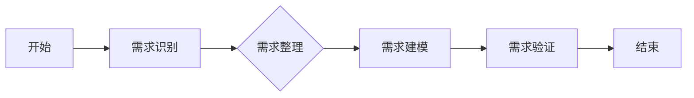
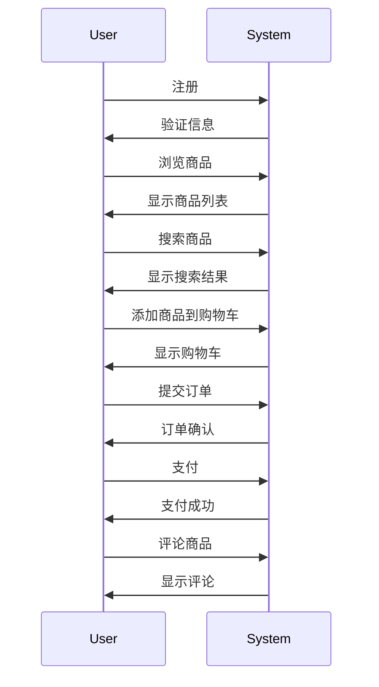
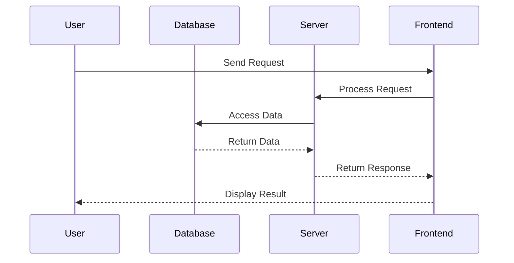
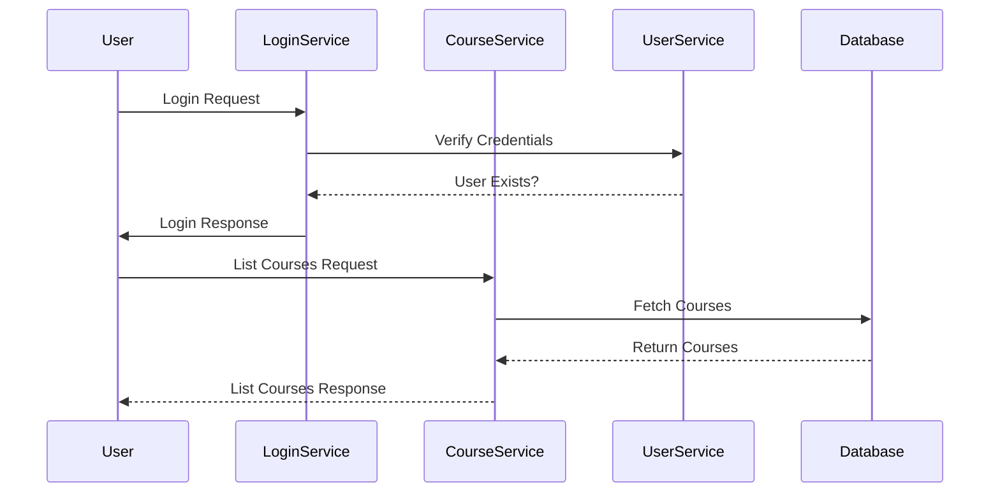
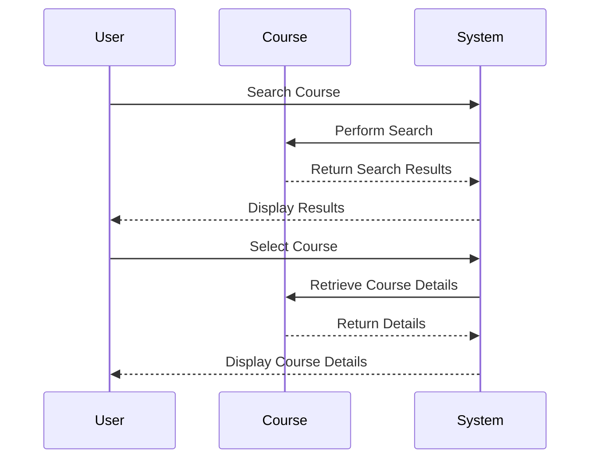

                 

### 需求分析：捕获和明确用户需求的技巧

> **关键词**：需求分析、用户需求、捕获技巧、明确需求、技术方法论

> **摘要**：本文将探讨需求分析的核心概念和实际应用技巧，帮助读者深入了解如何有效地捕获和明确用户需求。我们将从概念背景出发，逐步介绍需求分析的方法论，详细解析捕获用户需求的各种技术，并通过实际案例，展示需求分析在实际项目中的应用。

---

## **背景介绍**

### **核心概念术语说明**

- **需求分析**：指通过一系列技术手段和方法，识别和确定项目、产品或系统所需的功能、性能和其他特性，以满足用户或业务需求的过程。
- **用户需求**：指用户期望从产品或系统中得到的功能、性能、用户体验等方面的要求。
- **捕获**：指通过各种技术手段获取用户需求的过程。
- **明确需求**：指对捕获到的需求进行整理、分类、建模和验证，确保需求准确、清晰、可行。

### **问题背景**

在软件开发和系统设计中，需求分析是一个至关重要的阶段。它不仅决定了项目的成功与否，还直接影响产品的质量和用户体验。然而，需求分析并非易事，往往面临以下挑战：

- **需求不明确**：用户难以准确描述自己的需求，导致需求文档模糊不清。
- **需求变更频繁**：在项目开发过程中，用户需求可能发生变化，增加了需求管理的难度。
- **需求遗漏**：需求分析过程中可能遗漏关键需求，导致产品无法满足用户期望。

### **问题描述**

为了解决上述问题，我们需要掌握一系列技巧，包括：

- **用户访谈与问卷调查**：通过直接与用户交流，获取他们的真实需求和期望。
- **观察与用户体验研究**：通过观察用户行为和体验，发现潜在的需求和改进点。
- **文档分析**：通过分析业务和技术文档，获取相关的需求信息。
- **需求建模与验证**：对捕获的需求进行建模和验证，确保需求的准确性和可行性。

### **问题解决**

通过上述技巧，我们可以有效地捕获和明确用户需求，从而确保项目顺利进行，并最终交付满足用户期望的产品。以下是本文将详细探讨的需求分析方法和技术。

### **边界与外延**

需求分析不仅适用于软件开发，还广泛应用于系统设计、产品管理、项目管理等领域。在软件工程中，需求分析是需求工程的重要组成部分，贯穿于项目生命周期的各个阶段。

### **概念结构与核心要素组成**

需求分析的核心要素包括：

- **需求来源**：用户需求、业务需求、市场调研、竞争对手分析等。
- **需求捕获技术**：用户访谈、问卷调查、观察研究、文档分析等。
- **需求分类**：功能需求、非功能需求、业务规则等。
- **需求管理**：需求变更控制、需求优先级排序、需求文档化等。

## **核心概念与联系**

### **核心概念原理**

需求分析的核心概念是识别用户需求并确保这些需求能够被转化为实际的产品或系统功能。这一过程涉及以下几个关键步骤：

1. **需求识别**：通过多种方法（如用户访谈、问卷调查、观察研究）识别潜在需求。
2. **需求整理**：对收集到的需求进行分类、整理，形成清晰的需求列表。
3. **需求建模**：利用需求模型（如用例图、功能需求文档）描述需求。
4. **需求验证**：通过用户评审、原型测试等方法验证需求的准确性和可行性。

### **概念属性特征对比表格**

| 特征          | 用户访谈 | 问卷调查 | 观察研究 | 文档分析 |
|---------------|----------|----------|----------|----------|
| **互动性**    | 高       | 中       | 低       | 低       |
| **深度性**    | 高       | 低       | 中       | 高       |
| **灵活性**    | 中       | 高       | 中       | 低       |
| **代表性**    | 高       | 中       | 低       | 高       |
| **适用场景**  | 复杂需求 | 大规模需求 | 用户行为分析 | 技术文档解析 |

### **ER实体关系图架构**

```mermaid
erDiagram
    User ||--|{ Requirement }
    Product ||--|{ Feature }
    System ||--|{ Non-Feature }
    Document ||--|{ Information }
```

## **算法原理讲解**

### **算法流程图**



### **Python源代码**

```python
# 需求分析流程
def analyze_requirements():
    requirements = []
    requirements.append(identify_requirements())
    requirements.append(organize_requirements())
    requirements.append(model_requirements())
    requirements.append(validate_requirements())
    return requirements

# 需求识别
def identify_requirements():
    # 使用用户访谈、问卷调查、观察研究等方法
    return "需求识别完成"

# 需求整理
def organize_requirements():
    # 对收集到的需求进行分类、整理
    return "需求整理完成"

# 需求建模
def model_requirements():
    # 使用需求模型描述需求
    return "需求建模完成"

# 需求验证
def validate_requirements():
    # 通过用户评审、原型测试等方法验证需求
    return "需求验证完成"
```

### **算法原理**

需求分析算法的核心是四个主要步骤：需求识别、需求整理、需求建模和需求验证。这些步骤构成了一个闭环，确保需求从捕获到验证的每个阶段都得到充分处理。

1. **需求识别**：通过用户访谈、问卷调查、观察研究等方法，识别出用户和系统的需求。
2. **需求整理**：对识别出的需求进行分类、整理，形成清晰的需求列表。
3. **需求建模**：使用需求模型（如用例图、功能需求文档）描述需求，使其更加具体和可操作。
4. **需求验证**：通过用户评审、原型测试等方法验证需求的准确性和可行性，确保需求能够实现。

### **数学模型和公式**

需求分析的数学模型主要包括以下几部分：

- **需求优先级排序**：使用加权得分模型对需求进行优先级排序。
  $$P_i = w_1 \cdot F_i + w_2 \cdot E_i + w_3 \cdot D_i$$
  其中，$P_i$ 表示需求 $i$ 的优先级，$w_1$、$w_2$、$w_3$ 分别是功能、紧急性和依赖性的权重，$F_i$、$E_i$、$D_i$ 分别是需求的功能性、紧急性和依赖性得分。

- **需求变更管理**：使用需求变更影响评估模型评估需求变更的影响。
  $$I_i = \sum_{j=1}^{n} (C_j \cdot D_j)$$
  其中，$I_i$ 表示需求 $i$ 变更的影响度，$C_j$ 表示变更 $j$ 的成本，$D_j$ 表示变更 $j$ 对需求 $i$ 的影响度。

### **详细讲解和举例说明**

#### **需求识别**

例如，在一个电子商务项目中，需求识别可能包括：

- 用户注册功能
- 商品浏览与搜索功能
- 购物车与订单管理功能
- 支付功能
- 用户评论与反馈功能

这些需求可以通过用户访谈、问卷调查和观察研究等方法识别出来。

#### **需求整理**

对上述识别出的需求进行整理，可能得到以下分类：

- **功能需求**：用户注册、商品浏览与搜索、购物车与订单管理、支付、用户评论与反馈。
- **非功能需求**：系统性能、安全性、可用性、可扩展性。

#### **需求建模**

使用用例图来描述上述需求，可以画出如下用例图：



#### **需求验证**

通过用户评审和原型测试来验证需求的准确性和可行性。例如，通过用户测试来验证用户注册功能的可用性和用户体验。

## **系统分析与架构设计方案**

### **问题场景介绍**

假设我们正在开发一个在线教育平台，需求分析的目标是捕获和明确用户的需求，以便构建一个满足用户期望的教育系统。

### **项目介绍**

在线教育平台项目旨在为用户提供一个便捷的在线学习环境，支持课程学习、作业提交、在线考试等功能。

### **系统功能设计（领域模型类图）**

```mermaid
classDiagram
    Class01 <|-- Class02
    Class03 --|> Class04
    Class04 : many
    Class05 : many
    Class01 : +int id
    Class01 : +String name
    Class01 : +String description
    Class02 : +int id
    Class02 : +String name
    Class03 : +int id
    Class03 : +String name
    Class04 : +int id
    Class04 : +String name
    Class05 : +int id
    Class05 : +String name
    Class01 <|.. Class02
    Class03 <|.. Class04
    Class04 <..| Class05
```

### **系统架构设计（架构图）**



### **系统接口设计**



### **系统交互（序列图）**



## **项目实战**

### **环境安装**

确保安装了Python 3.8及以上版本，并安装了以下依赖项：

```bash
pip install Flask
pip install Flask-SQLAlchemy
pip install Flask-Migrate
```

### **系统核心实现源代码**

```python
# app.py

from flask import Flask, request, jsonify
from flask_sqlalchemy import SQLAlchemy

app = Flask(__name__)
app.config['SQLALCHEMY_DATABASE_URI'] = 'sqlite:///online_education.db'
db = SQLAlchemy(app)

class User(db.Model):
    id = db.Column(db.Integer, primary_key=True)
    username = db.Column(db.String(80), unique=True, nullable=False)
    password = db.Column(db.String(120), nullable=False)

class Course(db.Model):
    id = db.Column(db.Integer, primary_key=True)
    name = db.Column(db.String(120), nullable=False)
    description = db.Column(db.String(255), nullable=True)

@app.route('/users', methods=['POST'])
def create_user():
    username = request.json['username']
    password = request.json['password']
    new_user = User(username=username, password=password)
    db.session.add(new_user)
    db.session.commit()
    return jsonify({'message': 'User created successfully.'})

@app.route('/courses', methods=['GET'])
def list_courses():
    courses = Course.query.all()
    return jsonify({'courses': [course.name for course in courses]})

if __name__ == '__main__':
    db.create_all()
    app.run(debug=True)
```

### **代码应用解读与分析**

这段代码定义了一个简单的在线教育平台，其中包括用户和课程两个模型。用户可以通过`/users`接口注册账户，通过`/courses`接口获取所有课程的列表。

- **用户注册**：通过`POST`请求向`/users`接口发送用户名和密码，保存到数据库中。
- **课程列表**：通过`GET`请求向`/courses`接口获取所有课程的名称列表。

### **实际案例分析和详细讲解剖析**

假设有一个新用户想要注册并浏览课程列表，以下是详细的步骤：

1. 用户通过Web浏览器访问在线教育平台。
2. 用户在注册表单中输入用户名和密码，并提交表单。
3. Flask后端接收到`POST`请求，提取用户名和密码，创建一个`User`对象，并保存到数据库。
4. 用户通过另一个表单或导航栏访问课程列表页面。
5. Flask后端接收到`GET`请求，查询数据库中的所有课程，并将课程名称列表返回给前端。

### **项目小结**

通过需求分析，我们确定了在线教育平台的基本功能，实现了用户注册和课程列表展示。这个项目为我们提供了一个简单的框架，可以在此基础上继续扩展，添加更多功能，如课程详情、用户课程进度跟踪、在线考试等。

## **最佳实践 Tips**

1. **明确项目目标和范围**：在开始需求分析之前，明确项目的目标和范围，有助于集中精力捕获关键需求。
2. **建立跨部门沟通机制**：需求分析涉及多个部门，建立有效的沟通机制可以确保需求的准确性和完整性。
3. **定期审查和更新需求文档**：需求可能会随着项目进展而发生变化，定期审查和更新需求文档可以确保其与实际需求保持一致。
4. **使用原型和用户测试**：在需求验证阶段，使用原型和用户测试可以更直观地了解用户需求，并及时进行调整。

## **小结**

本文详细介绍了需求分析的概念、方法和技术，通过实际案例展示了需求分析在软件开发中的重要性。掌握有效的需求分析技巧，可以帮助我们更好地理解用户需求，构建高质量的产品。

## **注意事项**

- **需求分析的深度和广度**：在需求分析过程中，需要既关注需求的深度，也要确保覆盖所有相关的需求。
- **用户参与**：用户参与是需求分析成功的关键，应尽可能多地获取用户的反馈和意见。

## **拓展阅读**

- 《软件需求规格说明书编写指南》
- 《用户体验要素》
- 《敏捷需求管理：如何在快速变化的环境中高效管理需求》

## **作者信息**

作者：AI天才研究院/AI Genius Institute & 禅与计算机程序设计艺术 /Zen And The Art of Computer Programming。

