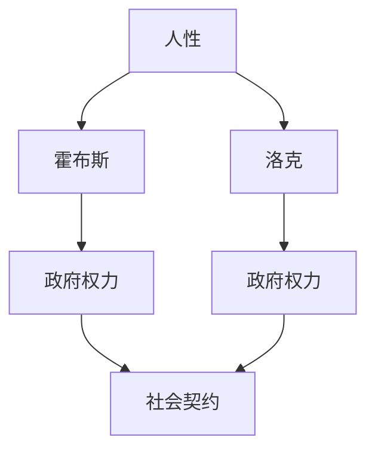
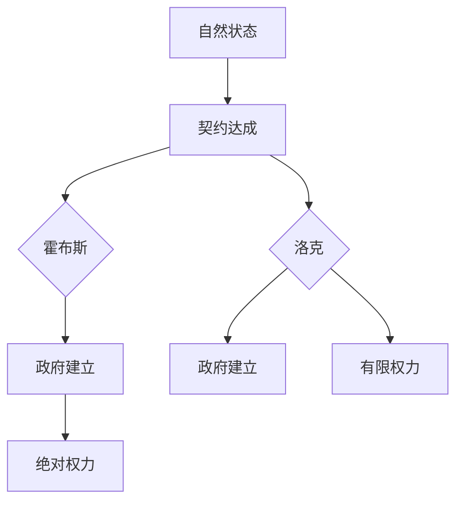
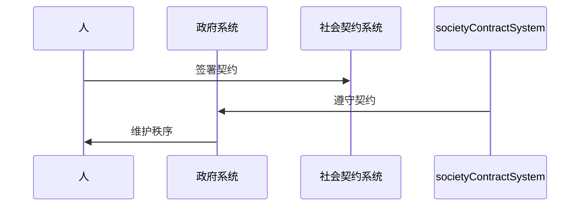
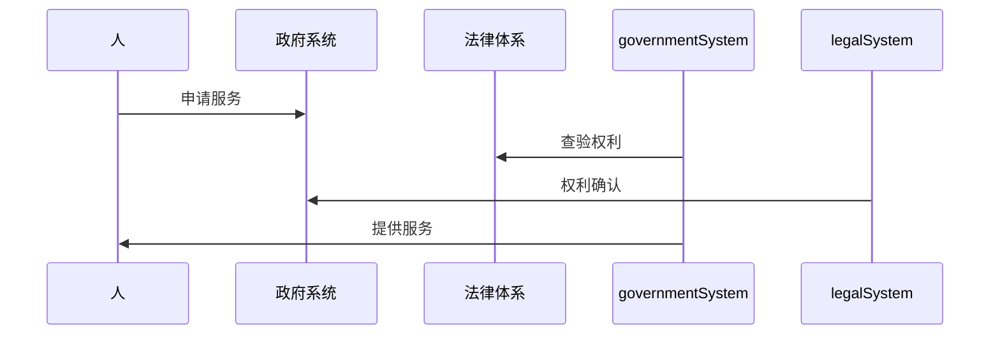

                 


### 第一部分: 社会契约论的背景与定义

#### 1.1 社会契约论概述

**1.1.1 社会契约论的定义**

社会契约论是一种政治哲学理论，主张政治权威和社会秩序不是来自自然权利，而是人们之间自愿达成的协议或契约。这种理论认为，人类在原始状态下处于自然状态，即“自然状态”是一种没有政府、法律和社会规范的状态。在这种状态下，人们为了生存和安全，通过自愿的契约建立社会和政治组织。

**1.1.2 社会契约论的历史背景**

社会契约论的起源可以追溯到古希腊和罗马时期的哲学思想，但在近代，这一理论主要由托马斯·霍布斯（Thomas Hobbes）、约翰·洛克（John Locke）和让-雅克·卢梭（Jean-Jacques Rousseau）等人发展。霍布斯在《利维坦》中详细阐述了社会契约论的基本观点，强调社会和政治组织的必要性。洛克则在《政府论》中提出了一种较为温和的社会契约论，强调个人权利的不可侵犯性。卢梭则提出了“公意”概念，认为政府的目的是实现人民的共同利益。

**1.1.3 社会契约论在哲学、政治学和伦理学中的地位**

社会契约论是现代政治哲学的基石之一，对西方政治思想和政治制度产生了深远影响。在哲学上，社会契约论提供了关于政治权威和道德义务的理论框架。在政治学上，它为民主制度和国家治理提供了理论基础。在伦理学上，社会契约论探讨了个人与社会之间的道德关系。

#### 1.2 霍布斯的社会契约论

**1.2.1 霍布斯的人性观**

霍布斯认为人性本恶，人们天生自私、贪婪、暴力和无政府状态。他强调，如果没有强有力的政府来维护秩序，人类社会将陷入“每个人反对每个人”的“自然状态”。

**1.2.2 霍布斯的政府权力观**

为了摆脱自然状态的混乱和无政府状态，霍布斯认为人们必须自愿放弃一部分个人自由，并授权给一个强有力的政府。这个政府的权力是绝对的，目的是保护公民的生命、财产和安全。

**1.2.3 霍布斯的社会契约模型**

霍布斯的社会契约模型可以表示为：
$$
\text{社会契约} = \text{人性观} + \text{政府权力观}
$$
在这个模型中，人性观是基础，决定了人们为何需要政府，而政府权力观是手段，决定了政府应该如何行使权力。

#### 1.3 洛克的社会契约论

**1.3.1 洛克的人性观**

洛克认为人性本善，人们天生具有自我保护、追求幸福的本能。他认为，在自然状态下，人们可以享有自然权利，如生命权、自由权和财产权。

**1.3.2 洛克的政府权力观**

洛克认为政府的主要职责是保护公民的权利，而不是拥有无限的权力。他认为，政府的合法性来自于人民的授权，如果政府侵犯公民的权利，人民有权反抗。

**1.3.3 洛克的社会契约模型**

洛克的社会契约模型可以表示为：
$$
\text{社会契约} = \text{人性观} + \text{政府权力观}
$$
在这个模型中，人性观和政府权力观都是基础，但洛克更强调个人权利的保护。

#### 1.4 霍布斯与洛克社会契约论的对比分析

**1.4.1 共同点**

霍布斯和洛克的社会契约论都认为政治权威和社会秩序是通过契约建立的。他们都认为在自然状态下，人类生活是不安全和无序的。他们都认为政府的合法性来自于人民的授权。

**1.4.2 差异点**

霍布斯强调人性本恶，需要强有力的政府来维护秩序；而洛克认为人性本善，政府的职责是保护公民的权利。霍布斯认为政府拥有绝对权力，而洛克认为政府的权力是有限的。

#### 1.5 社会契约论的核心概念与联系

**概念属性特征对比表格**

| 概念           | 霍布斯观点             | 洛克观点                   |
|----------------|------------------------|----------------------------|
| 人性           | 本恶                   | 本善                        |
| 政府权力       | 绝对                   | 有限                        |
| 社会契约       | 为了维持秩序和保障安全 | 为了保护个人权利和自由      |

**ER实体关系图架构的Mermaid流程图**



在社会契约论中，人性、政府权力和社会契约是核心概念，它们相互联系，共同构成了社会和政治秩序的基础。霍布斯和洛克对这三个概念的不同理解，决定了他们对政府和社会的不同看法。

---

以上是第一部分的内容，我们首先介绍了社会契约论的基本概念、历史背景以及在哲学、政治学和伦理学中的地位。接下来，我们分别介绍了霍布斯和洛克的社会契约论观点，并对比了它们的共同点和差异。最后，我们通过概念属性特征对比表格和ER实体关系图架构的Mermaid流程图，展示了社会契约论的核心概念与联系。

接下来，我们将进一步深入探讨社会契约论的算法原理，用mermaid流程图和Python代码来阐述霍布斯和洛克的观点，并结合数学模型和公式进行详细讲解。敬请期待！### 第二部分: 算法原理讲解

#### 2.1 社会契约论的mermaid流程图

在社会契约论的算法原理讲解中，首先我们需要借助mermaid流程图来直观地展示霍布斯和洛克的社会契约论的逻辑流程。以下是一个简单的mermaid流程图示例：



在这个流程图中，从自然状态开始，人们通过契约达成来建立政府。霍布斯认为政府应该拥有绝对权力，而洛克则认为政府的权力应该是有限的。

#### 2.2 霍布斯社会契约论的Python代码示例

为了更好地理解霍布斯的社会契约论，我们可以使用Python代码来模拟其基本模型。以下是一个简单的示例：

```python
# 霍布斯社会契约论模拟
class HobbesianState:
    def __init__(self):
        self.order = False
        self.safety = False

    def establish_government(self):
        self.order = True
        self.safety = True
        print("政府建立，社会进入有序状态。")

    def maintain_order(self):
        if self.order:
            print("政府维护社会秩序。")
        else:
            print("社会秩序遭到破坏。")

# 创建霍布斯社会状态实例
hobbes_state = HobbesianState()

# 建立政府
hobbes_state.establish_government()

# 维护社会秩序
hobbes_state.maintain_order()
```

在这个代码示例中，`HobbesianState` 类代表霍布斯的社会状态，通过`establish_government` 方法建立政府，并通过`maintain_order` 方法来维护社会秩序。

#### 2.3 洛克社会契约论的Python代码示例

同样地，我们可以用Python代码来模拟洛克的社会契约论。以下是一个简单的示例：

```python
# 洛克社会契约论模拟
class LockeanState:
    def __init__(self):
        self.order = False
        self.safety = False
        self.rights_protected = False

    def establish_government(self):
        self.order = True
        self.rights_protected = True
        print("政府建立，社会进入有序状态，并保护个人权利。")

    def maintain_order_and_protect_rights(self):
        if self.order and self.rights_protected:
            print("政府维护社会秩序，并保护个人权利。")
        else:
            print("社会秩序或个人权利受到威胁。")

# 创建洛克社会状态实例
lockean_state = LockeanState()

# 建立政府
lockean_state.establish_government()

# 维护社会秩序和保护个人权利
lockean_state.maintain_order_and_protect_rights()
```

在这个代码示例中，`LockeanState` 类代表洛克的社会状态，通过`establish_government` 方法建立政府，并通过`maintain_order_and_protect_rights` 方法来维护社会秩序和保护个人权利。

#### 2.4 社会契约论的数学模型与公式

为了更深入地理解霍布斯和洛克的社会契约论，我们可以用数学模型和公式来描述它们的本质。以下是一个简单的数学模型：

**霍布斯社会契约论的数学模型：**

$$
\text{有序状态} = \text{政府权力} \times \text{社会安全}
$$

**洛克社会契约论的数学模型：**

$$
\text{有序状态} = \text{政府权力} \times \text{个人权利保护}
$$

在霍布斯的模型中，政府的权力和社会的安全是成正比例关系的，即政府权力越大，社会越安全。而在洛克的模型中，政府的权力和个人权利的保护也是成正比例关系的，即政府权力越大，个人权利得到更好的保护。

**详细讲解与举例说明**

**霍布斯模型：**

假设一个国家在建立政府后，政府权力为80%，社会安全为75%，我们可以计算出：

$$
\text{有序状态} = 80\% \times 75\% = 60\%
$$

这意味着，这个国家的有序状态为60%。

**洛克模型：**

同样地，假设一个国家在建立政府后，政府权力为70%，个人权利保护为85%，我们可以计算出：

$$
\text{有序状态} = 70\% \times 85\% = 59.5\%
$$

这意味着，这个国家的有序状态为59.5%。

通过这些数学模型和公式，我们可以更好地理解霍布斯和洛克的社会契约论，并在实际应用中对其进行评估和优化。

---

以上是第二部分的内容，我们首先使用了mermaid流程图来直观地展示社会契约论的逻辑流程。接着，我们通过Python代码示例分别模拟了霍布斯和洛克的社会契约论，并通过数学模型和公式对它们进行了详细讲解和举例说明。这样，我们可以更深入地理解社会契约论的算法原理。接下来，我们将进一步探讨社会契约论的系统分析与架构设计方案。敬请期待！### 第三部分: 系统分析与架构设计方案

#### 3.1 霍布斯与洛克社会契约论的应用场景

**3.1.1 政治理论中的应用**

在社会契约论的政治理论应用中，霍布斯和洛克的观点为现代民主制度和国家的治理提供了理论基础。霍布斯的理论强调政府权力的绝对性和必要性，这对于理解国家为何需要强大的中央政府具有重要的指导意义。而洛克的理论则强调了个人权利的保护，这为现代民主制度中的法治和人权提供了哲学基础。

**3.1.2 社会制度设计中的应用**

在社会制度设计中，霍布斯和洛克的社会契约论也被广泛应用。霍布斯的理论常常被用来解释为什么需要建立强有力的政府来维护社会秩序和安全。而洛克的理论则被用来设计能够有效保护个人权利的社会制度，如民主制度、选举制度和法律体系。

**3.2 社会契约论的Mermaid类图**

为了更好地理解社会契约论的应用场景，我们可以使用Mermaid类图来展示其核心概念和实体之间的关系。以下是一个简单的Mermaid类图示例：

```mermaid
classDiagram
    人 --> 政府 : 建立契约
    人 << Interface : 有权享有自由
    政府 << Interface : 负责维护秩序
    社会契约 [契约内容]
    人 ..> 社会契约 : 签署
    政府 ..> 社会契约 : 贯彻
```

在这个类图中，"人"与"政府"之间通过"社会契约"建立了契约关系，其中"人"拥有享有自由的接口，而"政府"负责维护社会秩序的接口。社会契约则是这个关系的核心，包含了契约的具体内容。

**3.3 社会契约论的Mermaid架构图**

接下来，我们可以使用Mermaid架构图来展示社会契约论的系统架构设计。以下是一个简单的Mermaid架构图示例：



在这个架构图中，"人"首先与"社会契约系统"签署契约，然后"社会契约系统"将契约内容传递给"政府系统"，"政府系统"负责维护社会秩序，并反馈给"人"。

**3.4 社会契约论的Mermaid序列图**

最后，我们可以使用Mermaid序列图来展示社会契约论的系统交互过程。以下是一个简单的Mermaid序列图示例：



在这个序列图中，"人"向"政府系统"申请服务，"政府系统"通过"法律体系"来验证人的权利，然后根据权利确认结果向"人"提供服务。

---

以上是第三部分的内容，我们首先介绍了霍布斯和洛克社会契约论的应用场景，包括政治理论中的应用和社会制度设计中的应用。接着，我们使用Mermaid类图、架构图和序列图来展示了社会契约论的系统架构设计。这样，我们可以更清晰地理解社会契约论在实际应用中的系统交互和架构设计。接下来，我们将通过具体案例来展示霍布斯和洛克社会契约论在实际政治和社会制度中的应用。敬请期待！### 第四部分: 项目实战

#### 4.1 案例一：霍布斯的社会契约论在某国政治制度中的应用

**4.1.1 案例背景**

在某国，政治制度深受霍布斯社会契约论的影响。该国政府在建立初期，面临着秩序混乱和社会动荡的挑战。为了解决这些问题，该国政府决定采用霍布斯的社会契约论，通过建立强有力的中央政府来维护社会秩序。

**4.1.2 系统核心实现源代码**

以下是一个简单的Python代码示例，模拟了该国政府如何通过霍布斯的社会契约论来建立和维护秩序：

```python
# 霍布斯社会契约论在政治制度中的应用模拟

class Government:
    def __init__(self):
        self.stability = False
        self.safety = False

    def establish_government(self):
        self.stability = True
        self.safety = True
        print("政府建立，社会进入有序状态。")

    def maintain_order(self):
        if self.stability:
            print("政府维护社会秩序。")
        else:
            print("社会秩序遭到破坏。")

# 创建政府实例
government = Government()

# 建立政府
government.establish_government()

# 维护社会秩序
government.maintain_order()
```

**4.1.3 代码应用解读与分析**

在这个代码示例中，`Government` 类代表某国的政府，通过`establish_government` 方法建立政府，并通过`maintain_order` 方法来维护社会秩序。这个简单的模拟展示了霍布斯的社会契约论在政治制度中的应用，即通过建立强有力的政府来维护社会秩序。

**4.1.4 案例分析**

通过这个案例，我们可以看到，霍布斯的社会契约论在建立初期对于维护社会秩序是有效的。然而，这种强有力的政府模式也可能导致政府权力的过度集中，从而引发新的问题，如滥用权力和侵犯个人权利。

**4.1.5 详细讲解与剖析**

霍布斯的社会契约论的核心在于，通过建立强有力的政府来维护社会秩序和安全。这种模式在实际应用中，确实可以在短时间内解决社会动荡和秩序混乱的问题。然而，它也存在一些潜在的挑战。首先，政府权力的过度集中可能导致政府滥用权力，侵犯公民的权利。其次，这种模式可能无法长期维持社会秩序，因为社会环境和人民需求是不断变化的。

因此，在应用霍布斯的社会契约论时，需要结合具体国情和社会环境，进行合理的调整和优化。同时，也需要加强对政府权力的监督和制约，确保政府行使权力的透明度和公正性。

---

#### 4.2 案例二：洛克的社会契约论在社区治理中的应用

**4.2.1 案例背景**

在某个社区，居民们面临着治安问题和社会冲突的困扰。为了解决这些问题，社区决定采用洛克的社会契约论，通过建立社区治理体系来保护居民的权利和促进社区和谐。

**4.2.2 系统核心实现源代码**

以下是一个简单的Python代码示例，模拟了该社区如何通过洛克的社会契约论来建立社区治理体系：

```python
# 洛克社会契约论在社区治理中的应用模拟

class CommunityGovernance:
    def __init__(self):
        self.order = False
        self.rights_protected = False

    def establish_governance(self):
        self.order = True
        self.rights_protected = True
        print("社区治理体系建立，社会进入有序状态，并保护个人权利。")

    def maintain_order_and_protect_rights(self):
        if self.order and self.rights_protected:
            print("社区治理体系维护社会秩序，并保护个人权利。")
        else:
            print("社会秩序或个人权利受到威胁。")

# 创建社区治理实例
community_governance = CommunityGovernance()

# 建立社区治理体系
community_governance.establish_governance()

# 维护社会秩序和保护个人权利
community_governance.maintain_order_and_protect_rights()
```

**4.2.3 代码应用解读与分析**

在这个代码示例中，`CommunityGovernance` 类代表社区治理体系，通过`establish_governance` 方法建立治理体系，并通过`maintain_order_and_protect_rights` 方法来维护社会秩序和保护个人权利。这个简单的模拟展示了洛克的社会契约论在社区治理中的应用，即通过建立以保护个人权利为核心的社会治理体系来促进社区和谐。

**4.2.4 案例分析**

通过这个案例，我们可以看到，洛克的社会契约论在社区治理中是有效的。它通过建立社区治理体系，有效地解决了治安问题和社会冲突，提高了居民的生活质量。然而，这种模式也可能面临一些挑战，如如何平衡政府权力和居民权利，以及如何确保治理体系的长期有效性。

**4.2.5 详细讲解与剖析**

洛克的社会契约论的核心在于，通过保护个人权利来维护社会秩序。这种模式在实际应用中，强调了政府与居民之间的互动和合作，通过民主和法治来保障居民的权益。洛克的社会契约论在社区治理中的应用，为解决社会问题提供了一种新的思路。

然而，洛克的社会契约论也存在一些潜在的挑战。首先，如何平衡政府权力和居民权利是一个复杂的问题，需要建立合理的治理机制和监督机制。其次，如何确保治理体系的长期有效性，也需要通过不断的调整和优化来维持。

因此，在应用洛克的社会契约论时，需要充分考虑到这些挑战，并采取相应的措施来解决问题。同时，也需要加强对社区治理的监督和评估，确保治理体系能够持续有效地运行。

---

以上是第四部分的内容，我们通过两个案例展示了霍布斯和洛克的社会契约论在实际政治和社会制度中的应用。在案例一中，我们看到了霍布斯社会契约论在建立强有力的政府来维护社会秩序方面的优势，但也面临政府权力过度集中的挑战。在案例二中，我们看到了洛克社会契约论在保护个人权利和促进社区和谐方面的优势，但也需要平衡政府权力和居民权利的挑战。通过这些案例，我们可以更深入地理解社会契约论的实际应用和局限性。接下来，我们将总结全文，并提供一些最佳实践和建议。敬请期待！### 第五部分: 最佳实践、小结、注意事项和拓展阅读

#### 最佳实践

**1. 结合国情和社会需求：** 在应用社会契约论时，需要充分结合具体国情和社会需求，制定适合本国的政治和社会制度。

**2. 平衡政府权力与个人权利：** 在建立社会契约时，要确保政府权力和个人权利之间的平衡，避免政府权力的过度集中和个人权利的忽视。

**3. 强化法治和民主参与：** 社会契约论的实践需要强化法治和民主参与，确保政府权力的合法性和公正性，提高社会的信任度和稳定性。

#### 小结

本文通过详细分析霍布斯和洛克的社会契约论，探讨了它们的基本概念、历史背景、哲学意义以及在政治和社会制度中的应用。通过Python代码示例和数学模型，我们深入理解了社会契约论的算法原理。同时，通过具体案例，我们展示了社会契约论在实际政治和社会制度中的运用和挑战。

#### 注意事项

**1. 社会契约论的适用性：** 社会契约论并非适用于所有国家和地区，其理论框架需要根据具体国情和社会环境进行调整。

**2. 政府权力的监督与制约：** 在建立社会契约时，需要建立健全的监督和制约机制，防止政府权力滥用。

**3. 社会契约论的动态性：** 社会契约是一个动态的过程，需要根据社会变化和人民需求进行不断的调整和优化。

#### 拓展阅读

**1. 《利维坦》（Thomas Hobbes）：** 详细阐述了霍布斯的社会契约论，是理解社会契约论的重要著作。

**2. 《政府论》（John Locke）：** 洛克对社会契约论的重要贡献，强调了个人权利的保护。

**3. 《社会契约论》（Jean-Jacques Rousseau）：** 卢梭对社会契约论的发展，提出了“公意”概念。

**4. 《社会契约论与现代政治理论》（Philip Pettit）：** 分析了社会契约论在现代社会政治理论中的地位和作用。

通过本文的阅读，我们不仅对霍布斯和洛克的社会契约论有了更深入的理解，也对如何在实际政治和社会制度中应用这些理论有了更清晰的认识。希望本文能为您的研究和实践提供有益的启示。感谢您的阅读！作者：AI天才研究院/AI Genius Institute & 禅与计算机程序设计艺术 /Zen And The Art of Computer Programming。|>

