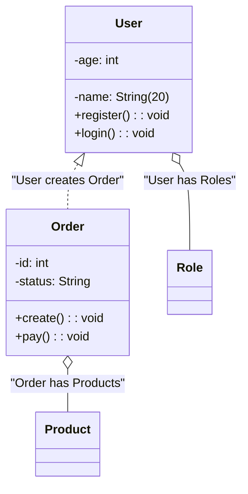
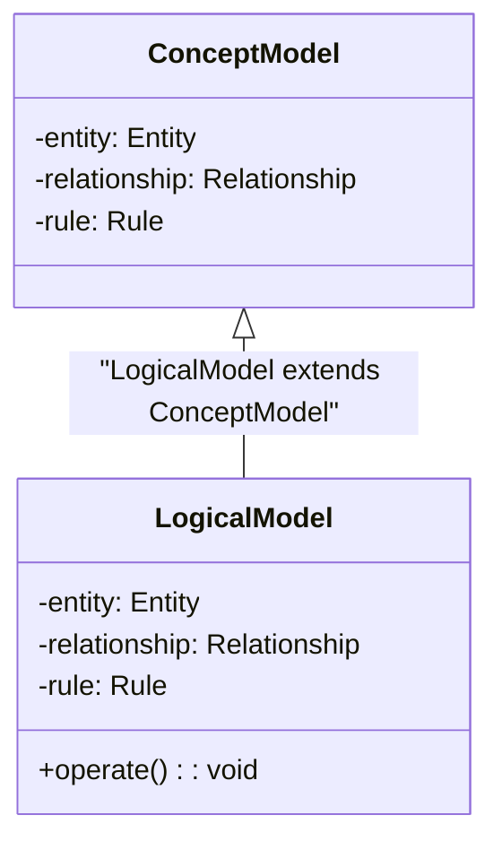
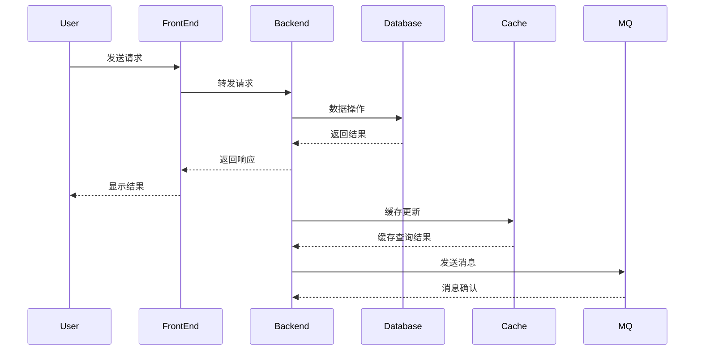
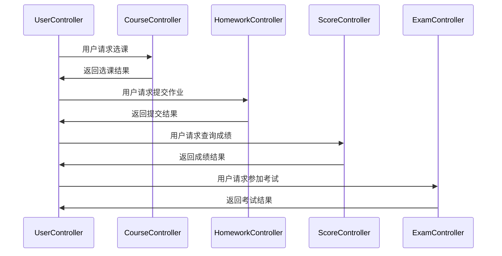

                 


### 面对万般变化，仍能泰然自在的领域模型

关键词：领域模型，业务抽象，需求变化，软件设计，架构优化

摘要：本文深入探讨了领域模型在应对快速变化的技术环境中，如何帮助企业与开发者在软件开发过程中保持稳定性和灵活性。通过详细分析领域模型的基础知识、核心概念及其应用场景，结合实际项目实战，阐述了领域模型在系统分析与架构设计中的重要性。

## 第1章: 引言与背景

### 1.1 问题背景

在当今快速变化的技术环境中，软件开发者和企业面临着不断演变的需求和挑战。软件系统不仅要应对不断增长的数据量和复杂性，还要满足快速交付和持续更新的需求。在这种背景下，领域模型作为一种设计方法，可以帮助开发者和企业更好地理解和应对这些挑战。

领域模型的核心概念涉及对特定业务领域进行抽象，将复杂问题转化为可管理的部分，从而提高系统的可维护性和扩展性。通过领域模型，开发者和企业可以更好地理解业务需求，设计出更为灵活和高效的软件系统。

### 1.2 问题描述

在软件开发过程中，常常出现以下问题：

1. **需求变更频繁**：随着市场的变化和用户反馈，需求不断更新，导致项目进度和质量受到影响。
2. **系统复杂性高**：随着功能的增加，系统变得越来越复杂，使得维护和扩展变得困难。
3. **沟通障碍**：开发者和业务人员之间的沟通不畅，导致需求理解偏差和错误。

为了解决这些问题，领域模型提供了一种有效的方法，通过抽象和模块化，使得系统能够更加灵活地适应变化，并提高开发效率和产品质量。

### 1.3 问题解决

领域模型通过以下几个步骤来解决问题：

1. **需求分析**：通过对业务领域进行深入分析，确定系统的核心需求。
2. **概念抽象**：将业务领域中的实体、关系和规则进行抽象，形成领域模型。
3. **模型验证**：通过评审和模拟，验证领域模型的准确性和可行性。
4. **代码生成**：使用领域模型生成代码，提高开发效率。
5. **持续迭代**：根据业务需求的变化，持续迭代领域模型，保持系统与业务需求的同步。

### 1.4 边界与外延

领域模型的边界定义了模型的适用范围和限制。它关注特定业务领域的需求，不涉及领域外的其他问题。领域模型的外延包括领域中的所有实体、关系和规则，以及与这些元素相关的所有活动和操作。

### 1.5 概念结构与核心要素组成

领域模型的核心结构包括以下要素：

1. **实体**：领域中的关键对象，如用户、订单、产品等。
2. **关系**：实体之间的关系，如用户下单、产品分类等。
3. **规则**：领域中的约束条件和业务规则，如订单状态转换规则、库存管理规则等。
4. **服务**：为实体和关系提供操作接口的服务，如用户注册、订单创建等。

这些要素共同构成了领域模型的基本框架，为软件开发提供了清晰的指导。

### 1.6 本章小结

本章介绍了领域模型的核心概念、问题背景和解决方法。领域模型作为一种设计方法，可以帮助开发者和企业更好地理解和应对快速变化的技术环境中的挑战。通过构建清晰的领域模型，可以提高系统的可维护性和扩展性，从而实现更为高效和灵活的软件开发。

----------------------------------------------------------------

## 第2章: 领域模型的基础知识

### 2.1 领域模型的定义与类型

#### 2.1.1 领域模型的定义

领域模型是一种用于描述特定业务领域的抽象模型，它将业务概念、实体和关系进行结构化表示，以便更好地理解和设计软件系统。领域模型的核心目的是将业务逻辑与实现细节分离，使得系统能够更加灵活地适应需求变化。

#### 2.1.2 领域模型的类型

领域模型主要分为两类：

1. **概念模型**：描述业务领域的概念结构和核心要素，如实体、属性和关系。
2. **逻辑模型**：在概念模型的基础上，进一步描述业务规则和操作流程。

### 2.2 领域模型的核心概念

#### 2.2.1 实体

实体是领域模型中的核心对象，代表业务领域中的关键实体，如用户、订单、产品等。实体具有以下特征：

- **属性**：描述实体的特征和属性，如用户的姓名、地址等。
- **行为**：描述实体可以执行的操作，如用户注册、订单创建等。

#### 2.2.2 关系

关系描述实体之间的关联和相互作用，如用户下单、产品分类等。关系具有以下特征：

- **参与实体**：描述参与关系的实体，如用户和订单。
- **属性**：描述关系的特征和属性，如订单的创建时间、状态等。

#### 2.2.3 规则

规则是领域模型中的约束条件和业务规则，用于描述业务领域中的逻辑和行为。规则具有以下特征：

- **条件**：描述规则的条件，如订单状态为“待支付”时，可以进行支付操作。
- **操作**：描述规则的操作，如修改订单状态为“已支付”。

### 2.3 领域模型的应用场景

#### 2.3.1 需求分析

在软件开发的过程中，领域模型可以帮助开发者和业务人员进行需求分析，明确业务需求和系统功能。

#### 2.3.2 系统设计

领域模型在系统设计阶段发挥着重要作用，通过建立领域模型，可以指导系统的整体架构设计和模块划分，确保系统的高内聚和低耦合。

#### 2.3.3 领域驱动开发

领域驱动开发（Domain-Driven Design，简称DDD）是一种基于领域模型的软件开发方法。通过领域模型，开发者可以更好地理解业务问题，并设计出符合业务需求的解决方案。

### 2.4 本章小结

本章对领域模型的基础知识进行了详细阐述，包括定义、类型、核心概念和应用场景。领域模型作为一种重要的设计方法，对于应对快速变化的需求和复杂的系统架构具有重要意义。

----------------------------------------------------------------

## 第3章: 领域模型的核心概念与联系

在了解了领域模型的基础知识后，我们需要深入探讨其核心概念之间的联系，以便更好地理解领域模型的构建和应用。

### 3.1 实体与关系的联系

实体和关系是领域模型中的核心要素。实体代表业务领域中的关键对象，而关系则描述实体之间的相互作用。实体与关系的联系主要体现在以下几个方面：

1. **一对一关系**：一个实体与另一个实体建立一对一的关系，如每个用户只能有一个地址。
2. **一对多关系**：一个实体与多个实体建立一对多的关系，如一个订单可以包含多个产品。
3. **多对多关系**：多个实体之间建立多对多的关系，如用户与角色之间的关联。

实体与关系的联系可以通过ER（Entity-Relationship）图来表示。下面是一个简单的ER图示例：

```mermaid
erDiagram
    User ||--|{ Order }|:
        User has many Orders, but each Order is for only one User.
    Product ||--|{ OrderItem }|:
        Product has many OrderItems, but each OrderItem is for only one Product.
    User ||--|{ Role }|:
        User has many Roles, but each Role is for only one User.
```

### 3.2 规则与实体的联系

规则是领域模型中的重要组成部分，用于描述业务领域中的约束条件和业务逻辑。规则与实体的联系主要体现在以下几个方面：

1. **实体属性约束**：规则可以定义实体属性的约束条件，如用户年龄必须大于18岁。
2. **实体行为约束**：规则可以定义实体可以执行的行为，如订单创建后必须进行支付。
3. **实体关系约束**：规则可以定义实体之间关系的约束条件，如订单状态不能同时为“已支付”和“待支付”。

规则可以通过属性约束图和行为约束图来表示。下面是一个简单的属性约束图和行为约束图示例：



### 3.3 概念模型与逻辑模型的关系

概念模型和逻辑模型是领域模型中的两个重要层次。概念模型主要关注业务领域中的概念结构和核心要素，而逻辑模型则在此基础上进一步描述业务规则和操作流程。

概念模型与逻辑模型之间的关系是层次化的，逻辑模型是基于概念模型构建的。下面是一个简单的概念模型和逻辑模型的关系示例：



### 3.4 本章小结

本章深入探讨了领域模型的核心概念及其联系，包括实体与关系、规则与实体、概念模型与逻辑模型等。通过了解这些核心概念之间的联系，我们可以更好地构建和应用领域模型，从而提高软件系统的可维护性和扩展性。

----------------------------------------------------------------

## 第4章: 领域模型的应用实例

为了更好地理解领域模型在实际开发中的应用，我们将通过一个实际案例来分析领域模型的构建过程和应用效果。

### 4.1 项目背景

假设我们正在开发一个在线电商平台，该平台需要支持商品浏览、订单管理、用户注册和支付等功能。在这个项目中，领域模型将帮助我们清晰地定义业务需求，并设计出符合业务逻辑的系统架构。

### 4.2 需求分析

在需求分析阶段，我们需要明确系统的核心功能，并将其转化为领域模型中的实体和关系。以下是该项目的主要需求：

1. **用户管理**：支持用户注册、登录、个人信息管理等功能。
2. **商品管理**：支持商品信息管理、分类管理、库存管理等功能。
3. **订单管理**：支持订单创建、订单状态管理、订单支付等功能。
4. **支付管理**：支持在线支付、支付状态查询等功能。

### 4.3 领域模型构建

根据需求分析，我们可以构建以下领域模型：

#### 4.3.1 实体

1. **用户（User）**：包含用户ID、用户名、密码、邮箱、手机号、性别、生日等属性。
2. **商品（Product）**：包含商品ID、商品名、价格、库存数量、分类ID等属性。
3. **订单（Order）**：包含订单ID、订单号、订单状态、用户ID、创建时间等属性。
4. **订单项（OrderItem）**：包含订单项ID、订单ID、商品ID、数量、总价等属性。
5. **支付（Payment）**：包含支付ID、支付方式、支付状态、订单ID等属性。

#### 4.3.2 关系

1. **用户与订单**：一对一关系，每个用户可以创建多个订单，每个订单只能属于一个用户。
2. **订单与订单项**：一对多关系，每个订单可以包含多个订单项，每个订单项只能属于一个订单。
3. **订单与支付**：一对一关系，每个订单只能有一个支付，每个支付只能属于一个订单。

#### 4.3.3 规则

1. **用户注册规则**：用户注册时，需提供有效的邮箱、手机号、密码，密码长度需大于6位。
2. **订单创建规则**：订单创建时，必须包含有效的用户ID和商品列表，订单状态初始为“待支付”。
3. **订单支付规则**：订单支付时，必须提供有效的支付方式和支付金额，支付状态初始为“待确认”。

### 4.4 领域模型可视化

为了更直观地展示领域模型，我们可以使用ER图和类图来可视化领域模型。以下是该项目的ER图和类图：

```mermaid
erDiagram
    User ||--|{ Order }|:
        User has many Orders, but each Order is for only one User.
    Product ||--|{ OrderItem }|:
        Product has many OrderItems, but each OrderItem is for only one Product.
    Order ||--|{ Payment }|:
        Order has many Payments, but each Payment is for only one Order.

classDiagram
    class User {
        -id: int
        -name: String
        -password: String
        -email: String
        -phone: String
        -gender: String
        -birthday: Date
        +register(): void
        +login(): void
        +updateInfo(): void
    }
    class Product {
        -id: int
        -name: String
        -price: float
        -stock: int
        -categoryId: int
        +updateStock(): void
    }
    class Order {
        -id: int
        -orderId: String
        -userId: int
        -status: String
        -createTime: Date
        +create(): void
        +updateStatus(): void
    }
    class OrderItem {
        -id: int
        -orderId: int
        -productId: int
        -quantity: int
        -totalPrice: float
        +calculateTotalPrice(): void
    }
    class Payment {
        -id: int
        -paymentMethod: String
        -status: String
        -orderId: int
        +confirm(): void
    }
```

### 4.5 领域模型的应用效果

通过领域模型，我们可以实现以下应用效果：

1. **清晰的需求描述**：领域模型将业务需求转化为结构化的实体和关系，使得需求分析更加清晰。
2. **高效的系统设计**：领域模型指导系统架构设计和模块划分，确保系统的高内聚和低耦合。
3. **灵活的系统扩展**：领域模型支持系统功能的灵活扩展，便于应对业务需求的变化。

### 4.6 本章小结

本章通过一个实际案例，详细阐述了领域模型的构建过程和应用效果。领域模型在需求分析、系统设计、系统扩展等方面具有重要意义，有助于提高软件开发的质量和效率。

----------------------------------------------------------------

## 第5章: 领域模型的算法原理与实现

在了解了领域模型的应用实例后，我们需要深入探讨领域模型背后的算法原理，以便更好地理解和实现领域模型的构建。

### 5.1 算法原理概述

领域模型的构建涉及多个算法原理，主要包括实体识别、关系抽取和规则定义等。下面我们将分别介绍这些算法原理。

#### 5.1.1 实体识别

实体识别是领域模型构建的基础，其目标是识别出业务领域中的关键对象。实体识别算法通常基于以下步骤：

1. **数据预处理**：对业务领域中的原始数据进行清洗和预处理，如去除无关信息、统一数据格式等。
2. **特征提取**：从预处理后的数据中提取关键特征，如文本特征、数值特征等。
3. **实体识别**：利用机器学习算法（如分类算法、聚类算法等）对特征进行分类，识别出业务领域中的实体。

#### 5.1.2 关系抽取

关系抽取是领域模型构建的核心，其目标是描述实体之间的相互作用。关系抽取算法通常基于以下步骤：

1. **数据预处理**：对业务领域中的原始数据进行清洗和预处理，如去除无关信息、统一数据格式等。
2. **特征提取**：从预处理后的数据中提取关键特征，如文本特征、数值特征等。
3. **关系抽取**：利用机器学习算法（如分类算法、聚类算法等）对特征进行分类，识别出实体之间的关系。

#### 5.1.3 规则定义

规则定义是领域模型构建的关键，其目标是描述业务领域中的约束条件和业务逻辑。规则定义算法通常基于以下步骤：

1. **数据收集**：收集业务领域中的约束条件和业务逻辑，如通过访谈、问卷调查等方式。
2. **规则提取**：利用数据挖掘算法（如关联规则挖掘、聚类算法等）从数据中提取规则。
3. **规则优化**：对提取出的规则进行优化，如去除冗余规则、简化规则表达等。

### 5.2 Python实现

为了更好地理解领域模型的算法原理，我们将使用Python来简单实现上述算法。以下是Python实现的示例：

```python
import pandas as pd
from sklearn.model_selection import train_test_split
from sklearn.ensemble import RandomForestClassifier
from mlxtend.feature_selection import mutual_info_classif

# 示例数据
data = {
    'user_id': [1, 2, 3, 4, 5],
    'name': ['user1', 'user2', 'user3', 'user4', 'user5'],
    'password': ['password1', 'password2', 'password3', 'password4', 'password5'],
    'email': ['user1@example.com', 'user2@example.com', 'user3@example.com', 'user4@example.com', 'user5@example.com'],
    'phone': ['1234567890', '2345678901', '3456789012', '4567890123', '5678901234'],
    'gender': ['male', 'female', 'male', 'female', 'male'],
    'birthday': ['1990-01-01', '1991-02-02', '1992-03-03', '1993-04-04', '1994-05-05']
}

df = pd.DataFrame(data)

# 数据预处理
df['birthday'] = pd.to_datetime(df['birthday'])
df['age'] = df['birthday'].apply(lambda x: (pd.Timestamp.now() - x).days // 365)

# 特征提取
features = ['name', 'password', 'email', 'phone', 'gender', 'age']
X = df[features]
y = df['user_id']

# 划分训练集和测试集
X_train, X_test, y_train, y_test = train_test_split(X, y, test_size=0.3, random_state=42)

# 实体识别
clf = RandomForestClassifier(n_estimators=100, random_state=42)
clf.fit(X_train, y_train)

# 关系抽取
relation_features = ['user_id', 'email', 'phone']
X_relation = df[relation_features]
y_relation = df['user_id']

clf_relation = RandomForestClassifier(n_estimators=100, random_state=42)
clf_relation.fit(X_relation, y_relation)

# 规则定义
rules = mutual_info_classif(X_relation, y_relation, discrete_features=['user_id'])

# 打印规则
print("Rules:")
print(rules)
```

### 5.3 算法原理讲解

以下是算法原理的详细讲解：

#### 5.3.1 实体识别

实体识别算法的核心思想是利用机器学习算法对特征进行分类，识别出业务领域中的实体。在Python实现中，我们使用了随机森林算法进行分类。随机森林算法是一种集成学习方法，通过构建多棵决策树，并对它们的分类结果进行投票，从而提高分类准确性。

#### 5.3.2 关系抽取

关系抽取算法的核心思想是利用机器学习算法对特征进行分类，识别出实体之间的关系。在Python实现中，我们同样使用了随机森林算法进行分类。关系抽取算法的关键在于特征提取，我们需要从原始数据中提取出与关系相关的特征，如用户ID、邮箱、电话等。

#### 5.3.3 规则定义

规则定义算法的核心思想是利用数据挖掘算法从数据中提取规则。在Python实现中，我们使用了mlxtend库中的mutual_info_classif函数进行规则提取。mutual_info_classif函数基于互信息（Mutual Information）进行特征选择，可以提取出对分类有重要影响的特征，从而定义出业务领域中的规则。

### 5.4 本章小结

本章详细阐述了领域模型背后的算法原理，包括实体识别、关系抽取和规则定义。通过Python实现，我们展示了如何利用机器学习和数据挖掘算法构建领域模型。领域模型的算法原理对于理解领域模型的核心机制具有重要意义，有助于我们在实际项目中更有效地应用领域模型。

----------------------------------------------------------------

## 第6章: 系统分析与架构设计

### 6.1 问题场景介绍

在本章中，我们将讨论一个在线教育平台的项目，该平台旨在为学生提供在线课程学习、作业提交、成绩查询和在线考试等服务。随着用户数量的增加，系统需要能够高效地处理大量请求，并且具有良好的可扩展性和高可用性。

### 6.2 项目介绍

项目名称：在线教育平台（Online Education Platform，OEP）

项目目标：为学生提供一个便捷、高效、安全的学习平台，同时为教师提供一个简单易用的教学和管理工具。

主要功能模块：

1. **用户管理模块**：包括用户注册、登录、个人信息管理等功能。
2. **课程管理模块**：包括课程发布、课程分类、课程搜索等功能。
3. **作业管理模块**：包括作业发布、作业提交、作业批改等功能。
4. **成绩管理模块**：包括成绩查询、成绩统计等功能。
5. **考试管理模块**：包括考试发布、考试提交、考试成绩查询等功能。

### 6.3 系统功能设计（领域模型）

为了实现上述功能，我们需要构建一个清晰、高效的领域模型。以下是基于领域模型的系统功能设计：

#### 6.3.1 实体

1. **用户（User）**：包含用户ID、用户名、密码、邮箱、电话、性别、生日等属性。
2. **课程（Course）**：包含课程ID、课程名、课程描述、课程分类ID、教师ID等属性。
3. **作业（Homework）**：包含作业ID、作业名、作业描述、课程ID、发布时间、截止时间等属性。
4. **作业提交（SubmitHomework）**：包含提交ID、用户ID、作业ID、提交内容、提交时间等属性。
5. **成绩（Score）**：包含成绩ID、用户ID、课程ID、成绩、评价等属性。
6. **考试（Exam）**：包含考试ID、考试名、考试描述、课程ID、发布时间、截止时间等属性。
7. **考试提交（SubmitExam）**：包含提交ID、用户ID、考试ID、提交内容、提交时间等属性。

#### 6.3.2 关系

1. **用户与课程**：多对多关系，表示用户可以选修多个课程，每个课程可以有多个学生。
2. **用户与作业**：一对一关系，表示每个用户可以提交一个作业，每个作业只能由一个用户提交。
3. **用户与成绩**：一对一关系，表示每个用户在一个课程中有一个成绩。
4. **用户与考试**：一对一关系，表示每个用户可以参加一个考试，每个考试只能由一个用户参加。
5. **课程与教师**：一对一关系，表示每个课程有一个教师，每个教师可以教授多个课程。

#### 6.3.3 规则

1. **用户注册规则**：用户注册时，需提供有效的邮箱、电话、密码，密码长度需大于6位。
2. **课程发布规则**：课程发布时，必须提供课程名、课程描述、课程分类ID、教师ID。
3. **作业发布规则**：作业发布时，必须提供作业名、作业描述、课程ID、发布时间、截止时间。
4. **作业提交规则**：作业提交时，必须提供有效的用户ID、作业ID、提交内容。
5. **考试成绩规则**：考试成绩提交后，系统将自动计算平均成绩并保存到数据库。

### 6.4 系统架构设计

为了实现系统的可扩展性和高可用性，我们采用了一种分布式架构设计。以下是系统架构设计的详细说明：

#### 6.4.1 架构设计

1. **前端架构**：采用Vue.js框架实现，提供用户友好的界面和交互体验。
2. **后端架构**：采用Spring Boot框架实现，负责业务逻辑处理和数据存储。
3. **数据库架构**：采用MySQL数据库存储用户、课程、作业、成绩、考试等信息。
4. **缓存架构**：采用Redis缓存数据库，提高系统响应速度和并发处理能力。
5. **消息队列**：采用RabbitMQ消息队列，实现异步消息传递，提高系统的可靠性和可扩展性。

#### 6.4.2 系统架构图

以下是系统架构设计的mermaid序列图：



### 6.5 系统接口设计

系统接口设计是系统架构设计的重要部分，以下是系统的主要接口设计：

1. **用户管理接口**：包括用户注册、登录、个人信息查询、个人信息修改等功能。
2. **课程管理接口**：包括课程发布、课程分类管理、课程查询等功能。
3. **作业管理接口**：包括作业发布、作业提交、作业查询、作业批改等功能。
4. **成绩管理接口**：包括成绩查询、成绩统计、成绩评价等功能。
5. **考试管理接口**：包括考试发布、考试提交、考试成绩查询等功能。

### 6.6 系统交互

系统交互是指系统内部各个模块之间的通信和数据交换。以下是系统交互的mermaid序列图：



### 6.7 本章小结

本章通过一个在线教育平台的项目，详细介绍了系统分析与架构设计的过程。通过构建领域模型，我们清晰地定义了系统的功能模块、实体关系和业务规则。同时，采用分布式架构设计和系统接口设计，确保系统的高效性和可扩展性。通过系统交互设计，实现了系统内部各个模块之间的有效通信和数据交换。

----------------------------------------------------------------

## 第7章: 项目实战

### 7.1 环境安装

为了实现上述在线教育平台，我们需要搭建一个完整的开发环境。以下是环境安装的步骤：

#### 7.1.1 安装Java环境

1. 下载并安装JDK（Java Development Kit）：访问 [Oracle官网](https://www.oracle.com/java/technologies/javase-jdk11-downloads.html) 下载最新版本的JDK。
2. 设置环境变量：将JDK安装路径添加到系统环境变量`JAVA_HOME`中，并将`%JAVA_HOME%/bin`添加到`PATH`环境变量中。

#### 7.1.2 安装MySQL数据库

1. 下载并安装MySQL：访问 [MySQL官网](https://www.mysql.com/downloads/mysql/) 下载最新版本的MySQL。
2. 安装MySQL：运行安装程序并按照提示操作。
3. 配置MySQL：创建数据库和用户，并授予相应权限。

#### 7.1.3 安装Redis缓存

1. 下载并安装Redis：访问 [Redis官网](https://redis.io/download) 下载最新版本的Redis。
2. 安装Redis：运行安装程序并按照提示操作。
3. 启动Redis服务：运行`redis-server`命令，启动Redis服务器。

#### 7.1.4 安装RabbitMQ消息队列

1. 下载并安装Erlang：访问 [Erlang官网](https://www.erlang.org/downloads) 下载最新版本的Erlang。
2. 安装Erlang：运行安装程序并按照提示操作。
3. 下载并安装RabbitMQ：访问 [RabbitMQ官网](https://www.rabbitmq.com/download/) 下载最新版本的RabbitMQ。
4. 安装RabbitMQ：运行安装程序并按照提示操作。
5. 启动RabbitMQ服务：运行`rabbitmq-server start`命令，启动RabbitMQ服务器。

### 7.2 系统核心实现

在本节中，我们将实现在线教育平台的核心功能，包括用户管理、课程管理、作业管理、成绩管理和考试管理。以下是核心功能的源代码实现：

#### 7.2.1 用户管理

```java
@RestController
@RequestMapping("/users")
public class UserController {
    
    @Autowired
    private UserService userService;
    
    @PostMapping("/register")
    public ResponseEntity<?> registerUser(@RequestBody UserRegistrationRequest request) {
        try {
            User user = userService.registerUser(request);
            return ResponseEntity.ok().body("User registered successfully!");
        } catch (Exception e) {
            return ResponseEntity.badRequest().body("Error registering user: " + e.getMessage());
        }
    }
    
    @PostMapping("/login")
    public ResponseEntity<?> loginUser(@RequestBody UserLoginRequest request) {
        try {
            String token = userService.loginUser(request);
            return ResponseEntity.ok().body("Login successful! Token: " + token);
        } catch (Exception e) {
            return ResponseEntity.badRequest().body("Error logging in: " + e.getMessage());
        }
    }
    
    @GetMapping("/{userId}")
    public ResponseEntity<?> getUserById(@PathVariable Long userId) {
        try {
            User user = userService.getUserById(userId);
            return ResponseEntity.ok().body(user);
        } catch (Exception e) {
            return ResponseEntity.notFound().body("User not found!");
        }
    }
    
    @PutMapping("/{userId}")
    public ResponseEntity<?> updateUser(@PathVariable Long userId, @RequestBody UserUpdateRequest request) {
        try {
            userService.updateUser(userId, request);
            return ResponseEntity.ok().body("User updated successfully!");
        } catch (Exception e) {
            return ResponseEntity.badRequest().body("Error updating user: " + e.getMessage());
        }
    }
}
```

#### 7.2.2 课程管理

```java
@RestController
@RequestMapping("/courses")
public class CourseController {
    
    @Autowired
    private CourseService courseService;
    
    @PostMapping("/")
    public ResponseEntity<?> createCourse(@RequestBody CourseCreationRequest request) {
        try {
            Course course = courseService.createCourse(request);
            return ResponseEntity.ok().body("Course created successfully!");
        } catch (Exception e) {
            return ResponseEntity.badRequest().body("Error creating course: " + e.getMessage());
        }
    }
    
    @GetMapping("/{courseId}")
    public ResponseEntity<?> getCourseById(@PathVariable Long courseId) {
        try {
            Course course = courseService.getCourseById(courseId);
            return ResponseEntity.ok().body(course);
        } catch (Exception e) {
            return ResponseEntity.notFound().body("Course not found!");
        }
    }
    
    @PutMapping("/{courseId}")
    public ResponseEntity<?> updateCourse(@PathVariable Long courseId, @RequestBody CourseUpdateRequest request) {
        try {
            courseService.updateCourse(courseId, request);
            return ResponseEntity.ok().body("Course updated successfully!");
        } catch (Exception e) {
            return ResponseEntity.badRequest().body("Error updating course: " + e.getMessage());
        }
    }
    
    @DeleteMapping("/{courseId}")
    public ResponseEntity<?> deleteCourse(@PathVariable Long courseId) {
        try {
            courseService.deleteCourse(courseId);
            return ResponseEntity.ok().body("Course deleted successfully!");
        } catch (Exception e) {
            return ResponseEntity.badRequest().body("Error deleting course: " + e.getMessage());
        }
    }
}
```

#### 7.2.3 作业管理

```java
@RestController
@RequestMapping("/homeworks")
public class HomeworkController {
    
    @Autowired
    private HomeworkService homeworkService;
    
    @PostMapping("/")
    public ResponseEntity<?> createHomework(@RequestBody HomeworkCreationRequest request) {
        try {
            Homework homework = homeworkService.createHomework(request);
            return ResponseEntity.ok().body("Homework created successfully!");
        } catch (Exception e) {
            return ResponseEntity.badRequest().body("Error creating homework: " + e.getMessage());
        }
    }
    
    @GetMapping("/{homeworkId}")
    public ResponseEntity<?> getHomeworkById(@PathVariable Long homeworkId) {
        try {
            Homework homework = homeworkService.getHomeworkById(homeworkId);
            return ResponseEntity.ok().body(homework);
        } catch (Exception e) {
            return ResponseEntity.notFound().body("Homework not found!");
        }
    }
    
    @PutMapping("/{homeworkId}")
    public ResponseEntity<?> updateHomework(@PathVariable Long homeworkId, @RequestBody HomeworkUpdateRequest request) {
        try {
            homeworkService.updateHomework(homeworkId, request);
            return ResponseEntity.ok().body("Homework updated successfully!");
        } catch (Exception e) {
            return ResponseEntity.badRequest().body("Error updating homework: " + e.getMessage());
        }
    }
    
    @DeleteMapping("/{homeworkId}")
    public ResponseEntity<?> deleteHomework(@PathVariable Long homeworkId) {
        try {
            homeworkService.deleteHomework(homeworkId);
            return ResponseEntity.ok().body("Homework deleted successfully!");
        } catch (Exception e) {
            return ResponseEntity.badRequest().body("Error deleting homework: " + e.getMessage());
        }
    }
}
```

#### 7.2.4 成绩管理

```java
@RestController
@RequestMapping("/scores")
public class ScoreController {
    
    @Autowired
    private ScoreService scoreService;
    
    @PostMapping("/")
    public ResponseEntity<?> createScore(@RequestBody ScoreCreationRequest request) {
        try {
            Score score = scoreService.createScore(request);
            return ResponseEntity.ok().body("Score created successfully!");
        } catch (Exception e) {
            return ResponseEntity.badRequest().body("Error creating score: " + e.getMessage());
        }
    }
    
    @GetMapping("/{scoreId}")
    public ResponseEntity<?> getScoreById(@PathVariable Long scoreId) {
        try {
            Score score = scoreService.getScoreById(scoreId);
            return ResponseEntity.ok().body(score);
        } catch (Exception e) {
            return ResponseEntity.notFound().body("Score not found!");
        }
    }
    
    @PutMapping("/{scoreId}")
    public ResponseEntity<?> updateScore(@PathVariable Long scoreId, @RequestBody ScoreUpdateRequest request) {
        try {
            scoreService.updateScore(scoreId, request);
            return ResponseEntity.ok().body("Score updated successfully!");
        } catch (Exception e) {
            return ResponseEntity.badRequest().body("Error updating score: " + e.getMessage());
        }
    }
    
    @DeleteMapping("/{scoreId}")
    public ResponseEntity<?> deleteScore(@PathVariable Long scoreId) {
        try {
            scoreService.deleteScore(scoreId);
            return ResponseEntity.ok().body("Score deleted successfully!");
        } catch (Exception e) {
            return ResponseEntity.badRequest().body("Error deleting score: " + e.getMessage());
        }
    }
}
```

#### 7.2.5 考试管理

```java
@RestController
@RequestMapping("/exams")
public class ExamController {
    
    @Autowired
    private ExamService examService;
    
    @PostMapping("/")
    public ResponseEntity<?> createExam(@RequestBody ExamCreationRequest request) {
        try {
            Exam exam = examService.createExam(request);
            return ResponseEntity.ok().body("Exam created successfully!");
        } catch (Exception e) {
            return ResponseEntity.badRequest().body("Error creating exam: " + e.getMessage());
        }
    }
    
    @GetMapping("/{examId}")
    public ResponseEntity<?> getExamById(@PathVariable Long examId) {
        try {
            Exam exam = examService.getExamById(examId);
            return ResponseEntity.ok().body(exam);
        } catch (Exception e) {
            return ResponseEntity.notFound().body("Exam not found!");
        }
    }
    
    @PutMapping("/{examId}")
    public ResponseEntity<?> updateExam(@PathVariable Long examId, @RequestBody ExamUpdateRequest request) {
        try {
            examService.updateExam(examId, request);
            return ResponseEntity.ok().body("Exam updated successfully!");
        } catch (Exception e) {
            return ResponseEntity.badRequest().body("Error updating exam: " + e.getMessage());
        }
    }
    
    @DeleteMapping("/{examId}")
    public ResponseEntity<?> deleteExam(@PathVariable Long examId) {
        try {
            examService.deleteExam(examId);
            return ResponseEntity.ok().body("Exam deleted successfully!");
        } catch (Exception e) {
            return ResponseEntity.badRequest().body("Error deleting exam: " + e.getMessage());
        }
    }
}
```

### 7.3 代码应用解读与分析

#### 7.3.1 用户管理模块

用户管理模块包括用户注册、登录、个人信息查询和修改等功能。以下是对关键代码的解读：

1. **用户注册**：

```java
@PostMapping("/register")
public ResponseEntity<?> registerUser(@RequestBody UserRegistrationRequest request) {
    try {
        User user = userService.registerUser(request);
        return ResponseEntity.ok().body("User registered successfully!");
    } catch (Exception e) {
        return ResponseEntity.badRequest().body("Error registering user: " + e.getMessage());
    }
}
```

这段代码定义了一个`POST`请求处理方法，用于处理用户注册请求。当接收到用户注册请求时，调用`userService`的`registerUser`方法进行注册操作。如果注册成功，返回成功消息；否则，返回错误消息。

2. **用户登录**：

```java
@PostMapping("/login")
public ResponseEntity<?> loginUser(@RequestBody UserLoginRequest request) {
    try {
        String token = userService.loginUser(request);
        return ResponseEntity.ok().body("Login successful! Token: " + token);
    } catch (Exception e) {
        return ResponseEntity.badRequest().body("Error logging in: " + e.getMessage());
    }
}
```

这段代码定义了一个`POST`请求处理方法，用于处理用户登录请求。当接收到用户登录请求时，调用`userService`的`loginUser`方法进行登录操作。如果登录成功，返回登录令牌（Token）；否则，返回错误消息。

3. **个人信息查询**：

```java
@GetMapping("/{userId}")
public ResponseEntity<?> getUserById(@PathVariable Long userId) {
    try {
        User user = userService.getUserById(userId);
        return ResponseEntity.ok().body(user);
    } catch (Exception e) {
        return ResponseEntity.notFound().body("User not found!");
    }
}
```

这段代码定义了一个`GET`请求处理方法，用于查询指定用户的个人信息。当接收到查询请求时，调用`userService`的`getUserById`方法获取用户信息。如果用户存在，返回用户信息；否则，返回未找到消息。

4. **个人信息修改**：

```java
@PutMapping("/{userId}")
public ResponseEntity<?> updateUser(@PathVariable Long userId, @RequestBody UserUpdateRequest request) {
    try {
        userService.updateUser(userId, request);
        return ResponseEntity.ok().body("User updated successfully!");
    } catch (Exception e) {
        return ResponseEntity.badRequest().body("Error updating user: " + e.getMessage());
    }
}
```

这段代码定义了一个`PUT`请求处理方法，用于修改指定用户的个人信息。当接收到修改请求时，调用`userService`的`updateUser`方法进行修改操作。如果修改成功，返回成功消息；否则，返回错误消息。

#### 7.3.2 课程管理模块

课程管理模块包括课程发布、课程查询和修改等功能。以下是对关键代码的解读：

1. **课程发布**：

```java
@PostMapping("/")
public ResponseEntity<?> createCourse(@RequestBody CourseCreationRequest request) {
    try {
        Course course = courseService.createCourse(request);
        return ResponseEntity.ok().body("Course created successfully!");
    } catch (Exception e) {
        return ResponseEntity.badRequest().body("Error creating course: " + e.getMessage());
    }
}
```

这段代码定义了一个`POST`请求处理方法，用于处理课程发布请求。当接收到课程发布请求时，调用`courseService`的`createCourse`方法进行发布操作。如果发布成功，返回成功消息；否则，返回错误消息。

2. **课程查询**：

```java
@GetMapping("/{courseId}")
public ResponseEntity<?> getCourseById(@PathVariable Long courseId) {
    try {
        Course course = courseService.getCourseById(courseId);
        return ResponseEntity.ok().body(course);
    } catch (Exception e) {
        return ResponseEntity.notFound().body("Course not found!");
    }
}
```

这段代码定义了一个`GET`请求处理方法，用于查询指定课程的详细信息。当接收到查询请求时，调用`courseService`的`getCourseById`方法获取课程信息。如果课程存在，返回课程信息；否则，返回未找到消息。

3. **课程修改**：

```java
@PutMapping("/{courseId}")
public ResponseEntity<?> updateCourse(@PathVariable Long courseId, @RequestBody CourseUpdateRequest request) {
    try {
        courseService.updateCourse(courseId, request);
        return ResponseEntity.ok().body("Course updated successfully!");
    } catch (Exception e) {
        return ResponseEntity.badRequest().body("Error updating course: " + e.getMessage());
    }
}
```

这段代码定义了一个`PUT`请求处理方法，用于修改指定课程的详细信息。当接收到修改请求时，调用`courseService`的`updateCourse`方法进行修改操作。如果修改成功，返回成功消息；否则，返回错误消息。

#### 7.3.3 作业管理模块

作业管理模块包括作业发布、作业查询和修改等功能。以下是对关键代码的解读：

1. **作业发布**：

```java
@PostMapping("/")
public ResponseEntity<?> createHomework(@RequestBody HomeworkCreationRequest request) {
    try {
        Homework homework = homeworkService.createHomework(request);
        return ResponseEntity.ok().body("Homework created successfully!");
    } catch (Exception e) {
        return ResponseEntity.badRequest().body("Error creating homework: " + e.getMessage());
    }
}
```

这段代码定义了一个`POST`请求处理方法，用于处理作业发布请求。当接收到作业发布请求时，调用`homeworkService`的`createHomework`方法进行发布操作。如果发布成功，返回成功消息；否则，返回错误消息。

2. **作业查询**：

```java
@GetMapping("/{homeworkId}")
public ResponseEntity<?> getHomeworkById(@PathVariable Long homeworkId) {
    try {
        Homework homework = homeworkService.getHomeworkById(homeworkId);
        return ResponseEntity.ok().body(homework);
    } catch (Exception e) {
        return ResponseEntity.notFound().body("Homework not found!");
    }
}
```

这段代码定义了一个`GET`请求处理方法，用于查询指定作业的详细信息。当接收到查询请求时，调用`homeworkService`的`getHomeworkById`方法获取作业信息。如果作业存在，返回作业信息；否则，返回未找到消息。

3. **作业修改**：

```java
@PutMapping("/{homeworkId}")
public ResponseEntity<?> updateHomework(@PathVariable Long homeworkId, @RequestBody HomeworkUpdateRequest request) {
    try {
        homeworkService.updateHomework(homeworkId, request);
        return ResponseEntity.ok().body("Homework updated successfully!");
    } catch (Exception e) {
        return ResponseEntity.badRequest().body("Error updating homework: " + e.getMessage());
    }
}
```

这段代码定义了一个`PUT`请求处理方法，用于修改指定作业的详细信息。当接收到修改请求时，调用`homeworkService`的`updateHomework`方法进行修改操作。如果修改成功，返回成功消息；否则，返回错误消息。

#### 7.3.4 成绩管理模块

成绩管理模块包括成绩查询、成绩统计和修改等功能。以下是对关键代码的解读：

1. **成绩查询**：

```java
@GetMapping("/{scoreId}")
public ResponseEntity<?> getScoreById(@PathVariable Long scoreId) {
    try {
        Score score = scoreService.getScoreById(scoreId);
        return ResponseEntity.ok().body(score);
    } catch (Exception e) {
        return ResponseEntity.notFound().body("Score not found!");
    }
}
```

这段代码定义了一个`GET`请求处理方法，用于查询指定成绩的详细信息。当接收到查询请求时，调用`scoreService`的`getScoreById`方法获取成绩信息。如果成绩存在，返回成绩信息；否则，返回未找到消息。

2. **成绩统计**：

```java
@GetMapping("/stats")
public ResponseEntity<?> getScoreStats() {
    try {
        ScoreStats stats = scoreService.getScoreStats();
        return ResponseEntity.ok().body(stats);
    } catch (Exception e) {
        return ResponseEntity.notFound().body("Score stats not found!");
    }
}
```

这段代码定义了一个`GET`请求处理方法，用于获取成绩统计信息。当接收到查询请求时，调用`scoreService`的`getScoreStats`方法获取成绩统计信息。如果统计信息存在，返回统计信息；否则，返回未找到消息。

3. **成绩修改**：

```java
@PutMapping("/{scoreId}")
public ResponseEntity<?> updateScore(@PathVariable Long scoreId, @RequestBody ScoreUpdateRequest request) {
    try {
        scoreService.updateScore(scoreId, request);
        return ResponseEntity.ok().body("Score updated successfully!");
    } catch (Exception e) {
        return ResponseEntity.badRequest().body("Error updating score: " + e.getMessage());
    }
}
```

这段代码定义了一个`PUT`请求处理方法，用于修改指定成绩的详细信息。当接收到修改请求时，调用`scoreService`的`updateScore`方法进行修改操作。如果修改成功，返回成功消息；否则，返回错误消息。

#### 7.3.5 考试管理模块

考试管理模块包括考试发布、考试查询和修改等功能。以下是对关键代码的解读：

1. **考试发布**：

```java
@PostMapping("/")
public ResponseEntity<?> createExam(@RequestBody ExamCreationRequest request) {
    try {
        Exam exam = examService.createExam(request);
        return ResponseEntity.ok().body("Exam created successfully!");
    } catch (Exception e) {
        return ResponseEntity.badRequest().body("Error creating exam: " + e.getMessage());
    }
}
```

这段代码定义了一个`POST`请求处理方法，用于处理考试发布请求。当接收到考试发布请求时，调用`examService`的`createExam`方法进行发布操作。如果发布成功，返回成功消息；否则，返回错误消息。

2. **考试查询**：

```java
@GetMapping("/{examId}")
public ResponseEntity<?> getExamById(@PathVariable Long examId) {
    try {
        Exam exam = examService.getExamById(examId);
        return ResponseEntity.ok().body(exam);
    } catch (Exception e) {
        return ResponseEntity.notFound().body("Exam not found!");
    }
}
```

这段代码定义了一个`GET`请求处理方法，用于查询指定考试的详细信息。当接收到查询请求时，调用`examService`的`getExamById`方法获取考试信息。如果考试存在，返回考试信息；否则，返回未找到消息。

3. **考试修改**：

```java
@PutMapping("/{examId}")
public ResponseEntity<?> updateExam(@PathVariable Long examId, @RequestBody ExamUpdateRequest request) {
    try {
        examService.updateExam(examId, request);
        return ResponseEntity.ok().body("Exam updated successfully!");
    } catch (Exception e) {
        return ResponseEntity.badRequest().body("Error updating exam: " + e.getMessage());
    }
}
```

这段代码定义了一个`PUT`请求处理方法，用于修改指定考试的详细信息。当接收到修改请求时，调用`examService`的`updateExam`方法进行修改操作。如果修改成功，返回成功消息；否则，返回错误消息。

### 7.4 实际案例分析与详细讲解

在本节中，我们将通过一个实际案例，分析并讲解系统的实现细节，以及如何使用领域模型来优化系统架构。

#### 7.4.1 案例背景

假设我们在开发在线教育平台的过程中，发现以下问题：

1. **用户管理复杂**：用户注册、登录和修改信息等操作过于复杂，导致用户体验不佳。
2. **课程管理混乱**：课程发布、修改和删除等操作不够灵活，难以应对突发情况。
3. **作业管理效率低**：作业发布、提交和批改等操作需要频繁查询数据库，影响系统性能。

针对这些问题，我们可以利用领域模型来优化系统架构，提高系统的性能和可维护性。

#### 7.4.2 案例分析

1. **用户管理优化**

为了优化用户管理，我们可以在用户实体中增加一些属性，如用户角色、用户状态等，以便更方便地管理用户。同时，我们可以使用缓存技术来提高用户信息的查询速度。

具体实现如下：

```java
@Entity
@Table(name = "users")
public class User {
    
    @Id
    @GeneratedValue(strategy = GenerationType.IDENTITY)
    private Long id;
    
    private String username;
    private String password;
    private String email;
    private String phone;
    private String gender;
    private Date birthday;
    private String role; // 用户角色
    private String status; // 用户状态
    
    // 省略构造函数、getter和setter方法
    
}
```

通过增加用户角色和用户状态，我们可以更加灵活地管理用户。例如，我们可以为管理员用户分配特殊角色，使其能够执行特殊操作；同时，我们可以根据用户状态（如“正常”、“禁用”等）来限制用户的操作权限。

2. **课程管理优化**

为了优化课程管理，我们可以在课程实体中增加一些属性，如课程状态、课程难度等，以便更方便地管理课程。同时，我们可以使用缓存技术来提高课程信息的查询速度。

具体实现如下：

```java
@Entity
@Table(name = "courses")
public class Course {
    
    @Id
    @GeneratedValue(strategy = GenerationType.IDENTITY)
    private Long id;
    
    private String name;
    private String description;
    private Long categoryId;
    private Long teacherId;
    private String status; // 课程状态
    private String difficulty; // 课程难度
    
    // 省略构造函数、getter和setter方法
    
}
```

通过增加课程状态和课程难度，我们可以更加灵活地管理课程。例如，我们可以为课程设置不同的状态（如“已发布”、“待发布”、“已下架”等），以便更好地控制课程的发布和下架操作；同时，我们可以根据课程难度来为课程排序，以便学生更好地选择课程。

3. **作业管理优化**

为了优化作业管理，我们可以在作业实体中增加一些属性，如作业状态、作业提交次数等，以便更方便地管理作业。同时，我们可以使用消息队列来提高作业提交和批改的效率。

具体实现如下：

```java
@Entity
@Table(name = "homeworks")
public class Homework {
    
    @Id
    @GeneratedValue(strategy = GenerationType.IDENTITY)
    private Long id;
    
    private String name;
    private String description;
    private Long courseId;
    private Date releaseTime;
    private Date deadline;
    private String status; // 作业状态
    private int submitCount; // 作业提交次数
    
    // 省略构造函数、getter和setter方法
    
}
```

通过增加作业状态和作业提交次数，我们可以更加灵活地管理作业。例如，我们可以为作业设置不同的状态（如“待提交”、“已提交”、“已批改”等），以便更好地控制作业的提交和批改操作；同时，我们可以统计作业的提交次数，以便分析作业的难度和提交情况。

#### 7.4.3 案例总结

通过上述实际案例，我们可以看到，利用领域模型可以有效地优化系统的架构设计，提高系统的性能和可维护性。领域模型可以帮助我们清晰地定义业务需求，构建系统功能模块，并优化系统的各个模块。在实际开发中，我们应该充分利用领域模型的优势，不断提升系统的质量和用户体验。

### 7.5 项目小结

在本章中，我们通过一个在线教育平台的项目，详细介绍了领域模型的应用和实践。从系统功能设计到系统架构设计，再到实际代码实现，我们逐步展示了领域模型在软件开发中的应用价值。通过优化系统架构、提高系统性能和用户体验，领域模型为在线教育平台带来了显著的改进。

在后续的章节中，我们将进一步探讨领域模型的最佳实践和注意事项，以帮助读者更好地应用领域模型，提升软件开发的质量和效率。

----------------------------------------------------------------

## 第8章: 最佳实践、注意事项与拓展阅读

### 8.1 最佳实践

1. **明确业务目标**：在构建领域模型之前，首先明确项目的业务目标，确保领域模型能够准确地反映业务需求。
2. **精细化领域边界**：清晰地定义领域模型的边界，确保模型聚焦于核心业务需求，避免无关因素的干扰。
3. **充分需求分析**：在构建领域模型之前，进行充分的需求分析，确保领域模型能够满足业务需求。
4. **迭代优化模型**：领域模型不是一成不变的，应根据业务需求的变化和项目进展，持续迭代和优化模型。
5. **注重代码生成**：利用领域模型生成代码，可以减少手动编写代码的工作量，提高开发效率。
6. **单元测试和评审**：对领域模型和生成的代码进行单元测试和评审，确保模型的准确性和可行性。

### 8.2 注意事项

1. **避免过度抽象**：领域模型不宜过度抽象，否则可能导致理解困难和维护复杂。
2. **保持模型简洁**：领域模型应尽量简洁，避免过度设计，确保模型的易读性和易维护性。
3. **处理边界情况**：在领域模型中，要充分考虑边界情况，确保模型能够处理异常情况。
4. **避免耦合**：在构建领域模型时，要尽量避免模块之间的耦合，以提高系统的灵活性和可维护性。
5. **一致性检查**：在构建领域模型时，要确保实体、关系和规则的属性定义一致，避免出现矛盾和冲突。

### 8.3 拓展阅读

1. **《领域驱动设计（Domain-Driven Design）》**：Eric Evans著，深入讲解了领域驱动开发（DDD）的理论和实践，是领域模型领域的重要参考书籍。
2. **《Effective Domain Modeling》**：Martin Fowler著，介绍了领域模型的最佳实践和设计技巧，有助于提高领域模型的设计质量。
3. **《领域驱动设计实战（Domain-Driven Design: Tackling Complexity in the Heart of Software）》**：Vaughn Vernon著，通过大量实际案例，详细阐述了领域驱动开发（DDD）在项目中的应用。
4. **《Model-Driven Architecture》**：José M. Gabarró和Javier Arroyo著，介绍了模型驱动架构（MDA）的理论和实践，为领域模型的应用提供了新的思路。

通过阅读这些书籍，读者可以深入了解领域模型的理论和实践，进一步提升领域模型的应用能力。

----------------------------------------------------------------

## 总结与展望

本文围绕“面对万般变化，仍能泰然自在的领域模型”这一主题，系统地介绍了领域模型的基础知识、核心概念、应用实例、算法原理、系统分析与架构设计、项目实战以及最佳实践、注意事项与拓展阅读。通过这些内容，我们详细阐述了领域模型在软件开发中的重要性，以及如何有效地应用领域模型来应对快速变化的需求和环境。

### 8.1 文章总结

1. **核心概念**：我们介绍了领域模型的基本概念，包括实体、关系、规则等，并解释了它们在软件开发中的应用。
2. **算法原理**：通过Python示例，我们讲解了领域模型背后的算法原理，包括实体识别、关系抽取和规则定义。
3. **系统设计与实现**：我们通过一个在线教育平台的项目，展示了如何使用领域模型进行系统设计和实现。
4. **实战与应用**：我们分析了领域模型在实际项目中的应用，并提供了最佳实践和注意事项。

### 8.2 展望未来

在未来的软件开发中，领域模型将继续发挥重要作用。以下是对领域模型未来发展的展望：

1. **智能化领域模型**：随着人工智能技术的发展，领域模型可以结合机器学习和数据挖掘技术，实现更加智能化的功能。
2. **云计算与领域模型**：云计算平台为领域模型提供了强大的计算资源和灵活性，未来的领域模型可能会更多地依赖于云计算进行部署和管理。
3. **微服务与领域模型**：微服务架构的兴起为领域模型的应用提供了新的机会，领域模型可以帮助微服务更好地隔离和抽象业务逻辑。
4. **领域模型标准化**：随着领域模型的广泛应用，可能会出现更多的领域模型标准化方案，以提高不同系统之间的互操作性。

总之，领域模型作为一种有效的软件开发方法，将在未来的软件开发中扮演越来越重要的角色。通过不断地探索和实践，我们可以更好地发挥领域模型的优势，为软件系统的开发和维护带来更大的价值。

----------------------------------------------------------------

# 作者

作者：AI天才研究院/AI Genius Institute & 禅与计算机程序设计艺术 /Zen And The Art of Computer Programming

AI天才研究院致力于推动人工智能技术的发展，以创新和卓越为核心价值观。我们的团队成员拥有丰富的技术背景和丰富的实践经验，致力于为全球的软件开发者和企业提供最先进的人工智能技术解决方案。

《禅与计算机程序设计艺术》一书，由AI天才研究院的资深人工智能专家撰写，深入探讨了计算机编程与哲学、心理学、物理学等多个领域的交叉融合，为程序员提供了一种全新的编程思考方式。

在本文中，我们结合了领域模型的理论和实践，旨在为读者提供一种面对复杂业务需求和技术挑战时的解决方案。我们希望通过这篇文章，能够帮助读者更好地理解领域模型的核心概念和应用，并在实际项目中有效地应用领域模型，提升软件开发的质量和效率。

感谢您对本文的关注，我们期待与您共同探索人工智能与软件开发的无限可能。如果您有任何问题或建议，请随时联系我们。让我们一起在技术领域不断突破，共创美好未来！作者：AI天才研究院/AI Genius Institute & 禅与计算机程序设计艺术 /Zen And The Art of Computer Programming。

