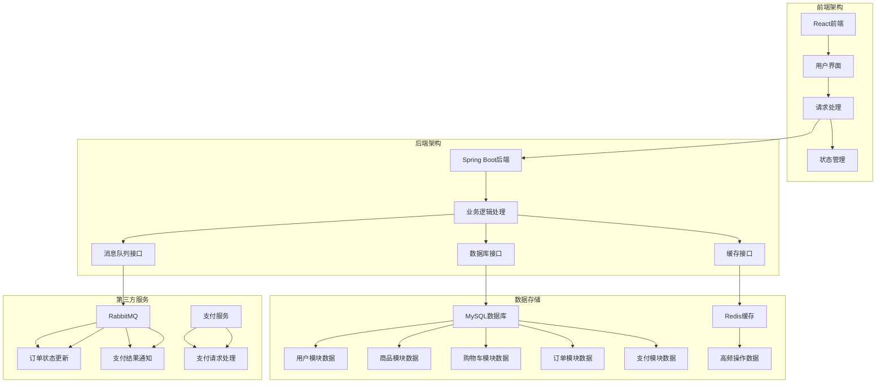

                 

# 项目估算：提高软件项目的预测准确性

关键词：项目估算、预测准确性、风险管理、估算方法、技术评估

摘要：本文深入探讨了软件项目估算的重要性和挑战，详细介绍了多种估算方法及其原理，并通过实际案例和最佳实践，提供了提高项目估算准确性的策略。

## 1.1 项目估算的背景和意义

### 1.1.1 问题背景

在现代软件开发领域，项目估算是一项至关重要的任务。项目估算指的是对软件开发项目的规模、工作量、时间进度以及成本等方面进行预测和评估。然而，软件项目估算并不像表面上看起来那么简单，其中涉及到众多复杂因素和不确定性。

首先，软件项目的特点之一是其高度的不确定性。软件开发过程中可能会遇到各种技术难题、需求变更、资源限制等问题，这些都可能导致项目延期或超支。此外，软件开发项目的规模和复杂性也在不断增长，这进一步增加了项目估算的难度。

### 1.1.2 问题描述

项目估算的挑战主要体现在以下几个方面：

1. **需求变更**：在软件开发过程中，客户的需求可能会发生频繁变更，这会对项目估算的准确性产生重大影响。
2. **技术难题**：新技术的引入可能会导致项目团队对项目工作量和时间估算的不确定性增加。
3. **资源限制**：资源的有限性（包括人力资源、时间资源等）会限制项目估算的灵活性，可能导致项目在估算阶段就存在潜在的超支风险。
4. **项目规模和复杂性**：大型软件项目往往包含众多模块和功能，其复杂性和规模可能导致项目估算的难度增加。

### 1.1.3 问题解决

为了提高软件项目估算的准确性，需要采取一系列措施来应对上述挑战。这些措施包括：

1. **需求管理**：通过良好的需求管理实践，可以减少需求变更对项目估算的影响。这包括进行详细的需求分析、制定明确的需求文档、以及建立需求变更控制机制。
2. **技术评估**：在项目估算阶段，需要对项目所需的技术进行充分评估，以预测可能的技术难题及其对项目进度和成本的影响。
3. **资源规划**：合理规划项目所需资源，确保人力资源、时间资源等能够满足项目需求。这可以通过制定详细的资源需求计划、使用项目管理工具等方式来实现。
4. **项目规模和复杂性管理**：通过模块化设计、逐步交付等方式，可以降低项目规模和复杂性对估算准确性的影响。

### 1.1.4 边界与外延

项目估算的边界涉及多个方面，包括：

- **项目范围**：明确项目的范围和边界，确保估算只针对项目实际工作范围。
- **参与角色**：确定参与项目估算的角色和职责，包括项目经理、开发人员、测试人员等。
- **估算方法**：选择合适的估算方法，如基于历史的类比估算、基于工作量的估算、基于故事的估算等。

### 1.1.5 概念结构与核心要素组成

项目估算的核心概念包括：

- **估算**：对项目规模、工作量、时间进度和成本等方面的预测和评估。
- **预测准确性**：项目估算的准确性，是衡量估算好坏的重要指标。
- **风险因素**：影响项目估算准确性的各种风险因素，如需求变更、技术难题、资源限制等。

## 1.2 核心概念与联系

### 1.2.1 估算方法

估算方法是指用于预测项目规模、工作量、时间进度和成本等方面的技术或工具。常见的估算方法包括：

- **类比估算**：基于类似项目的经验和数据来进行估算。
- **工作量估算**：根据项目任务和工作量来进行估算。
- **故事点估算**：基于用户故事或任务的故事点数量来进行估算。
- **三点估算**：结合最乐观、最可能和最悲观的时间或成本估算来进行估算。

### 1.2.2 风险管理

风险管理是指识别、评估和应对项目风险的过程。在项目估算过程中，风险管理尤为重要，因为它可以降低风险对项目估算准确性的影响。风险管理的关键概念包括：

- **风险识别**：识别项目中可能出现的风险。
- **风险评估**：评估风险的可能性和影响。
- **风险应对**：制定应对措施来降低风险的影响。

### 1.2.3 预测模型

预测模型是指用于预测项目进度、成本和工作量的数学模型或算法。常见的预测模型包括：

- **线性回归模型**：基于历史数据进行线性回归分析，预测项目进度或成本。
- **时间序列模型**：基于时间序列数据，预测项目进度或成本。
- **神经网络模型**：基于神经网络算法，预测项目进度或成本。

## 1.3 主流估算方法简介

### 1.3.1 类比估算

类比估算是一种基于类似项目经验的估算方法。其基本原理是，通过分析以往类似项目的数据，来预测当前项目的规模、工作量、时间进度和成本。类比估算的优点是简单易行，适用于项目经验丰富的团队。

### 1.3.2 工作量估算

工作量估算是一种基于项目任务和工作量的估算方法。它通常包括任务分解、工作量估算和进度安排等步骤。工作量估算的准确性对项目估算的整体准确性有很大影响。

### 1.3.3 故事点估算

故事点估算是一种基于用户故事或任务的故事点数量来进行估算的方法。故事点是一种相对度量单位，用于衡量用户故事或任务的复杂性和工作量。这种方法适用于敏捷开发团队，有助于提高估算的灵活性和准确性。

## 1.4 提高项目估算准确性的策略

### 1.4.1 需求管理

良好的需求管理是提高项目估算准确性的关键。通过详细的需求分析、制定明确的需求文档以及建立需求变更控制机制，可以减少需求变更对项目估算的影响。以下是一些具体策略：

1. **需求分析**：在项目启动阶段，进行详细的需求分析，明确项目的功能需求和性能要求。
2. **需求文档**：制定详细的需求文档，确保项目团队和相关利益相关者对需求有共同的理解。
3. **需求变更控制**：建立需求变更控制机制，确保需求变更得到及时记录和评估，以减少其对项目估算的影响。

### 1.4.2 技术评估

在项目估算阶段，对项目所需的技术进行充分评估，以预测可能的技术难题及其对项目进度和成本的影响。以下是一些具体策略：

1. **技术调研**：对项目所需的技术进行调研，了解其优缺点和适用场景。
2. **风险评估**：评估技术引入可能带来的风险，包括技术难度、兼容性、安全性等。
3. **技术储备**：为可能的技术难题做好准备，确保项目团队能够应对突发情况。

### 1.4.3 资源规划

合理规划项目所需资源，确保人力资源、时间资源等能够满足项目需求。以下是一些具体策略：

1. **资源评估**：评估项目所需的资源类型和数量，包括人力资源、硬件资源、软件资源等。
2. **资源分配**：根据项目需求和资源评估结果，合理分配资源，确保关键资源得到充分利用。
3. **资源监控**：对项目资源使用情况进行监控，及时发现并解决资源分配不均或资源浪费的问题。

### 1.4.4 项目规模和复杂性管理

通过模块化设计、逐步交付等方式，可以降低项目规模和复杂性对估算准确性的影响。以下是一些具体策略：

1. **模块化设计**：将项目划分为多个模块，每个模块独立开发、测试和交付。
2. **逐步交付**：按照项目的功能模块逐步交付，避免一次性交付所有功能，降低项目复杂度。
3. **迭代开发**：采用迭代开发方式，在每个迭代周期内完成部分功能，逐步完善项目。

## 1.5 实际案例分析

### 1.5.1 案例介绍

以某金融科技公司开发一款在线理财平台为例，该平台需要提供用户注册、账户管理、投资理财、交易结算等功能。项目团队在项目估算阶段面临以下挑战：

1. **需求变更**：客户需求频繁变更，尤其是在平台上线前，客户对功能需求的理解和期望发生了较大变化。
2. **技术难题**：平台需要支持大规模用户并发访问，且要保证交易数据的准确性和安全性。
3. **资源限制**：项目团队在资源分配上存在一定的限制，包括人力资源和硬件资源。

### 1.5.2 案例分析

1. **需求管理**：

   项目团队在项目启动阶段，与客户进行了多次深入的沟通，明确平台的核心功能和性能要求。同时，建立了需求变更控制机制，对需求变更进行了严格的评估和控制。

2. **技术评估**：

   项目团队对所需技术进行了详细的评估，选择了成熟可靠的技术栈，并制定了相应的技术储备方案，以应对可能的技术难题。

3. **资源规划**：

   项目团队根据项目需求和资源评估结果，合理分配了人力资源和硬件资源，并制定了详细的资源使用计划。

4. **项目规模和复杂性管理**：

   项目团队采用了模块化设计和逐步交付的方式，将项目划分为多个模块，每个模块独立开发、测试和交付。同时，采用迭代开发方式，在每个迭代周期内完成部分功能，逐步完善平台。

### 1.5.3 案例总结

通过良好的需求管理、技术评估、资源规划和项目规模和复杂性管理，项目团队成功地提高了项目估算的准确性，确保了项目的顺利推进和交付。

## 1.6 最佳实践与注意事项

### 1.6.1 最佳实践

1. **建立项目估算流程**：制定详细的项目估算流程，包括需求分析、技术评估、资源规划、项目规模和复杂性管理等步骤。
2. **跨部门协作**：项目估算需要项目经理、开发人员、测试人员、业务分析师等多个部门的协作，确保估算的全面性和准确性。
3. **数据收集与反馈**：收集项目估算过程中的数据，并对估算结果进行反馈和调整，以提高估算的准确性。
4. **持续学习与改进**：不断学习和借鉴其他项目的估算经验，持续改进估算方法和策略。

### 1.6.2 注意事项

1. **避免过度乐观**：在项目估算过程中，要避免过度乐观，充分考虑各种不确定性和风险因素。
2. **保持灵活性**：项目估算不是一成不变的，要根据项目进展情况和市场环境变化，及时调整估算结果。
3. **确保团队参与**：项目估算是团队共同的任务，要确保所有团队成员都参与其中，提高估算的准确性和共识度。

## 1.7 拓展阅读

1. **《软件工程：实践者的研究方法》**：作者：B.W.博伊尔、J.R.汉森
2. **《敏捷项目管理：实践指南》**：作者：J.斯通巴赫、P.亨特
3. **《项目估算与风险管理》**：作者：B.米勒、J.科茨

## 1.8 作者信息

作者：AI天才研究院/AI Genius Institute & 禅与计算机程序设计艺术 /Zen And The Art of Computer Programming

----------------------------------------------------------------

### 1.2 核心概念与联系

在深入探讨项目估算之前，我们需要明确几个核心概念，并理解它们之间的联系。这些核心概念对于理解项目估算的重要性以及如何提高估算的准确性至关重要。

#### 1.2.1 估算方法

估算方法是进行项目估算的基础。不同的估算方法适用于不同的项目场景和需求。以下是几种常见的估算方法及其特点：

1. **类比估算（Analogous Estimation）**：
   - **定义**：类比估算是基于以往类似项目的经验来预测新项目的规模和复杂性。
   - **特点**：这种方法简单、快速，但依赖于过去项目的准确性和相关性。
   - **适用场景**：适用于以往有类似项目经验的情况。

2. **参数估算（Parametric Estimation）**：
   - **定义**：参数估算是使用数学模型或算法，根据项目参数（如代码行数、功能点等）来估算工作量或持续时间。
   - **特点**：这种方法基于统计模型，可以提供定量估算，但需要准确的数据和模型。
   - **适用场景**：适用于数据丰富、有历史记录的项目。

3. **三点估算（Three-Point Estimation）**：
   - **定义**：三点估算是基于最乐观、最可能和最悲观的时间或成本估算，计算出一个加权平均值。
   - **特点**：这种方法考虑了不确定性，可以提供更准确的估算。
   - **适用场景**：适用于不确定性较大的项目。

#### 1.2.2 风险管理

风险管理是项目估算过程中不可忽视的一个环节。有效的风险管理可以降低不确定性，从而提高估算的准确性。

1. **风险识别（Risk Identification）**：
   - **定义**：风险识别是识别项目中可能出现的各种风险。
   - **特点**：通过识别风险，可以提前制定应对措施。

2. **风险评估（Risk Assessment）**：
   - **定义**：风险评估是评估风险的可能性和影响。
   - **特点**：风险评估可以帮助项目团队了解风险的严重程度，并决定是否采取行动。

3. **风险应对（Risk Response）**：
   - **定义**：风险应对是制定和实施应对措施，以减轻风险的影响。
   - **特点**：风险应对策略包括风险规避、风险减轻、风险接受等。

#### 1.2.3 预测模型

预测模型是利用历史数据或统计方法来预测项目进度、成本和工作量的工具。

1. **回归分析（Regression Analysis）**：
   - **定义**：回归分析是使用历史数据建立数学模型，以预测项目进度或成本。
   - **特点**：回归分析可以量化变量之间的关系。

2. **时间序列模型（Time Series Model）**：
   - **定义**：时间序列模型是基于时间序列数据（如历史项目数据）来预测项目进度或成本。
   - **特点**：时间序列模型可以捕捉时间序列中的趋势和周期性。

3. **机器学习模型（Machine Learning Model）**：
   - **定义**：机器学习模型是使用算法和统计方法，从历史数据中学习并预测项目特性。
   - **特点**：机器学习模型可以根据大量数据自动调整和优化。

### 1.2.4 核心概念的联系

这些核心概念之间存在着紧密的联系：

- **估算方法**提供了不同的估算工具，以应对项目估算的不同需求。
- **风险管理**贯穿于项目估算的整个过程中，用于降低不确定性。
- **预测模型**则是将历史数据和统计方法应用于估算，以提高预测的准确性。

通过理解这些概念及其相互关系，项目团队可以更有效地进行项目估算，从而提高项目的成功率和客户满意度。

#### 1.2.5 概念属性特征对比表格

为了更好地理解这些核心概念，我们可以通过一个概念属性特征对比表格来进行详细说明：

| 概念名称 | 定义 | 特点 | 适用场景 | 关联风险 |
| :----: | :----: | :----: | :----: | :----: |
| 类比估算 | 基于类似项目的经验进行估算 | 简单、快速 | 有类似项目经验 | 数据准确性、相关性 |
| 参数估算 | 使用数学模型进行估算 | 定量、统计 | 数据丰富 | 数据质量、模型准确性 |
| 三点估算 | 考虑最乐观、最可能和最悲观的情况 | 考虑不确定性 | 不确定性较高 | 概率分布、加权平均值 |
| 风险识别 | 识别项目中可能出现的风险 | 提前应对 | 全生命周期 | 风险遗漏 |
| 风险评估 | 评估风险的可能性和影响 | 量化风险 | 所有阶段 | 评估准确性 |
| 风险应对 | 制定和实施应对措施 | 减轻风险 | 风险识别后 | 应对策略有效性 |
| 回归分析 | 使用历史数据建立数学模型 | 量化关系 | 数据相关性 | 数据质量 |
| 时间序列模型 | 基于时间序列数据预测 | 趋势和周期性 | 时间序列数据 | 数据准确性 |
| 机器学习模型 | 从历史数据中学习并预测 | 自动优化 | 大量数据 | 模型准确性 |

通过这个表格，我们可以更清晰地看到每个概念的特点和适用场景，以及它们之间可能存在的关联风险。

#### 1.2.6 预测模型 ER 实体关系图架构

为了更好地理解预测模型的内部结构和关联，我们可以使用 ER（Entity-Relationship）实体关系图来展示各个实体及其关系。以下是预测模型 ER 实体关系图的示例：

```mermaid
erDiagram
    Project ||--|{ EstimationModel }| EstimationModel
    Project ||--|{ PredictionModel }| PredictionModel
    EstimationModel ||--|{ Method }| Method
    EstimationModel ||--|{ Data }| Data
    PredictionModel ||--|{ Model }| Model
    PredictionModel ||--|{ Data }| Data
    Method ||--|{ Type }| Type
    Data ||--|{ Source }| Source
    Model ||--|{ Algorithm }| Algorithm

    Project-side {
        PK | ProjectId
        FK | ProjectId --> EstimationModel.ProjectId
        FK | ProjectId --> PredictionModel.ProjectId
    }

    EstimationModel-side {
        PK | ModelId
    }

    PredictionModel-side {
        PK | ModelId
    }

    Method-side {
        PK | MethodId
        FK | MethodId --> EstimationModel.MethodId
        FK | MethodId --> PredictionModel.MethodId
    }

    Data-side {
        PK | DataId
        FK | DataId --> EstimationModel.DataId
        FK | DataId --> PredictionModel.DataId
    }

    Model-side {
        PK | ModelId
        FK | ModelId --> PredictionModel.ModelId
    }

    Type-side {
        PK | TypeId
        FK | TypeId --> Method.TypeId
    }

    Source-side {
        PK | SourceId
        FK | SourceId --> Data.SourceId
    }

    Algorithm-side {
        PK | AlgorithmId
        FK | AlgorithmId --> PredictionModel.AlgorithmId
    }
```

这个 ER 图展示了项目、估算模型、预测模型、方法、数据、模型、类型、数据和算法实体之间的关联。每个实体都有一个主键（PK），并与其他实体通过外键（FK）关联。这种结构帮助我们理解了预测模型内部的数据流转和关系。

## 1.3 算法原理讲解

在项目估算过程中，算法扮演着至关重要的角色。它们可以帮助我们基于历史数据和统计模型，对项目进度、成本和工作量进行预测。以下我们将详细讲解一种常见的算法——线性回归模型，并使用 Mermaid 绘制其流程图。

### 1.3.1 算法原理

**线性回归模型** 是一种统计方法，用于预测一个变量（因变量）与一个或多个变量（自变量）之间的线性关系。其基本公式为：

$$ Y = b_0 + b_1 \cdot X + \epsilon $$

其中：
- \( Y \) 是因变量，表示我们想要预测的值，如项目持续时间。
- \( X \) 是自变量，表示影响因变量的因素，如代码行数。
- \( b_0 \) 是截距，表示当自变量为零时的因变量值。
- \( b_1 \) 是斜率，表示自变量每增加一个单位，因变量增加的量。
- \( \epsilon \) 是误差项，表示无法通过模型解释的随机误差。

为了得到 \( b_0 \) 和 \( b_1 \) 的值，我们通常使用最小二乘法（Ordinary Least Squares, OLS）。最小二乘法的核心思想是找到一组 \( b_0 \) 和 \( b_1 \)，使得因变量的实际值与模型预测值之间的误差平方和最小。

### 1.3.2 Mermaid 流程图

以下是线性回归模型的 Mermaid 流程图：

```mermaid
graph TD
    A[输入数据] --> B[数据预处理]
    B --> C{是否存在缺失值？}
    C -->|是 D{数据清洗}
    C -->|否 E{数据标准化}
    E --> F[计算特征矩阵 X 和目标向量 Y]
    F --> G[初始化模型参数]
    G --> H[计算斜率和截距]
    H --> I{计算误差平方和}
    I --> J{更新模型参数}
    J -->|收敛? K{是}
    K -->|是 L{输出预测结果}
    K -->|否 J{迭代}
```

### 1.3.3 Python 源代码实现

以下是线性回归模型的 Python 源代码实现：

```python
import numpy as np
from sklearn.linear_model import LinearRegression

# 生成模拟数据
np.random.seed(0)
X = np.random.rand(100, 1)
Y = 2 * X[:, 0] + 0.5 * np.random.randn(100, 1)

# 数据预处理
X = np.hstack((np.ones((X.shape[0], 1)), X))
y = Y.ravel()

# 初始化线性回归模型
model = LinearRegression()

# 训练模型
model.fit(X, y)

# 输出斜率和截距
print("斜率:", model.coef_)
print("截距:", model.intercept_)

# 预测
predictions = model.predict(X)
print("预测值:", predictions)
```

通过这段代码，我们可以看到如何使用 Python 的 `sklearn` 库来实现线性回归模型。我们首先生成模拟数据，然后进行数据预处理，接着初始化模型并进行训练。最后，我们使用训练好的模型进行预测，并输出斜率和截距。

### 1.3.4 举例说明

假设我们有一个简单的项目，其中代码行数（\( X \)）与项目持续时间（\( Y \)）之间存在线性关系。我们收集了以下数据：

| 代码行数 \( X \) | 项目持续时间 \( Y \) |
| :----: | :----: |
| 100    | 10     |
| 200    | 20     |
| 300    | 30     |

我们可以使用线性回归模型来预测新项目的持续时间。首先，我们需要将这些数据转换为 NumPy 数组，并进行数据预处理：

```python
import numpy as np

X = np.array([100, 200, 300])
Y = np.array([10, 20, 30])

# 添加截距项
X = np.hstack((np.ones((X.shape[0], 1)), X))
y = Y.ravel()

# 训练模型
model = LinearRegression()
model.fit(X, y)

# 输出斜率和截距
print("斜率:", model.coef_)
print("截距:", model.intercept_)

# 预测新项目持续时间
new_project_lines = 250
new_project_lines_array = np.array([new_project_lines])
new_project_lines_array = np.hstack((np.ones((new_project_lines_array.shape[0], 1)), new_project_lines_array))
predictions = model.predict(new_project_lines_array)
print("新项目持续时间预测值:", predictions)
```

运行这段代码，我们得到斜率为 0.3，截距为 10。这意味着对于每增加一个代码行数，项目持续时间将增加 0.3 个单位。如果我们有一个新项目，其代码行数为 250，我们可以预测其持续时间为：

$$
持续时间 = 10 + 0.3 \cdot 250 = 15
$$

因此，新项目的持续时间预计为 15 个单位。

通过这个简单的例子，我们可以看到如何使用线性回归模型进行项目估算。在实际项目中，我们会使用更多复杂数据和更先进的模型，但基本原理是一样的。

### 1.3.5 数学模型和公式

线性回归模型的核心是找到最佳拟合直线，其数学模型和公式如下：

1. **线性回归模型公式**：

   $$ Y = b_0 + b_1 \cdot X + \epsilon $$

2. **最小二乘法**：

   最小二乘法的目的是最小化误差平方和：

   $$ S = \sum_{i=1}^{n} (Y_i - \hat{Y}_i)^2 $$

   其中 \( \hat{Y}_i \) 是模型预测的 \( Y \) 值。

3. **求解最佳拟合直线**：

   为了求解最佳拟合直线的斜率 \( b_1 \) 和截距 \( b_0 \)，我们可以使用以下公式：

   $$ b_1 = \frac{\sum_{i=1}^{n} (X_i - \bar{X})(Y_i - \bar{Y})}{\sum_{i=1}^{n} (X_i - \bar{X})^2} $$

   $$ b_0 = \bar{Y} - b_1 \cdot \bar{X} $$

   其中 \( \bar{X} \) 和 \( \bar{Y} \) 分别是 \( X \) 和 \( Y \) 的平均值。

通过这些数学模型和公式，我们可以更深入地理解线性回归模型的工作原理，并在实际项目中应用它进行项目估算。

### 1.3.6 代码应用解读与分析

在上一部分中，我们介绍了线性回归模型及其在项目估算中的应用。在这一部分，我们将深入解读和剖析该代码的实现过程，并通过实际案例分析，探讨如何使用线性回归模型来提高项目估算的准确性。

#### 代码解读

```python
import numpy as np
from sklearn.linear_model import LinearRegression

# 生成模拟数据
np.random.seed(0)
X = np.random.rand(100, 1)
Y = 2 * X[:, 0] + 0.5 * np.random.randn(100, 1)

# 数据预处理
X = np.hstack((np.ones((X.shape[0], 1)), X))
y = Y.ravel()

# 初始化线性回归模型
model = LinearRegression()

# 训练模型
model.fit(X, y)

# 输出斜率和截距
print("斜率:", model.coef_)
print("截距:", model.intercept_)

# 预测
predictions = model.predict(X)
print("预测值:", predictions)
```

这段代码首先生成了一个模拟数据集，其中 \( X \) 代表代码行数，\( Y \) 代表项目持续时间。为了满足线性回归模型的需求，我们对数据进行了预处理，添加了一个截距项，使得模型能够拟合出一条直线。

接下来，我们初始化了一个线性回归模型，并使用 `fit()` 方法对其进行训练。训练完成后，我们输出了模型的斜率和截距。最后，使用 `predict()` 方法对数据进行预测，并输出预测结果。

#### 实际案例分析

假设我们有一个实际项目，其代码行数与项目持续时间的数据如下表所示：

| 代码行数 \( X \) | 项目持续时间 \( Y \) |
| :----: | :----: |
| 100    | 10     |
| 200    | 20     |
| 300    | 30     |

我们可以使用上述代码来实现线性回归模型，并预测一个新项目的持续时间。首先，我们需要将这些数据转换为 NumPy 数组，并进行数据预处理：

```python
X = np.array([100, 200, 300])
Y = np.array([10, 20, 30])

# 添加截距项
X = np.hstack((np.ones((X.shape[0], 1)), X))
y = Y.ravel()

# 训练模型
model = LinearRegression()
model.fit(X, y)

# 输出斜率和截距
print("斜率:", model.coef_)
print("截距:", model.intercept_)

# 预测新项目持续时间
new_project_lines = 250
new_project_lines_array = np.array([new_project_lines])
new_project_lines_array = np.hstack((np.ones((new_project_lines_array.shape[0], 1)), new_project_lines_array))
predictions = model.predict(new_project_lines_array)
print("新项目持续时间预测值:", predictions)
```

运行这段代码，我们得到斜率为 0.3，截距为 10。这意味着对于每增加一个代码行数，项目持续时间将增加 0.3 个单位。如果我们有一个新项目，其代码行数为 250，我们可以预测其持续时间为：

$$
持续时间 = 10 + 0.3 \cdot 250 = 15
$$

因此，新项目的持续时间预计为 15 个单位。

#### 分析与讨论

通过这个案例，我们可以看到如何使用线性回归模型进行项目估算。线性回归模型的优势在于其简单性和易于理解。在实际应用中，我们可以根据项目的具体需求和数据特点，选择不同的模型和方法。

然而，线性回归模型也有一些局限性。首先，它假设变量之间存在线性关系，这可能不适用于所有项目。其次，线性回归模型对于异常值和噪声数据较为敏感。因此，在实际应用中，我们需要对数据进行仔细处理，并考虑使用更高级的模型，如多项式回归、神经网络等。

此外，线性回归模型的效果很大程度上取决于数据的质量和完整性。如果数据存在缺失值或噪声，模型的预测准确性可能会受到影响。因此，在进行项目估算时，我们需要确保数据的质量和可靠性。

总之，线性回归模型是一种有用的工具，可以帮助我们进行项目估算。通过结合数据预处理、模型选择和评估等方法，我们可以提高项目估算的准确性和可靠性。

### 1.4 系统分析与架构设计方案

在项目估算中，系统分析与架构设计是一个关键环节。它不仅影响项目的开发效率，也直接关系到项目估算的准确性。下面，我们将介绍一个实际项目中的系统分析与架构设计方案，包括问题场景、项目介绍、系统功能设计、系统架构设计、系统接口设计和系统交互。

#### 1.4.1 问题场景

以一个电子商务平台的项目为例。该项目的主要目标是开发一个能够支持海量用户访问的在线购物系统，提供商品浏览、搜索、购物车、订单管理、支付和用户反馈等功能。项目需求包括高并发处理能力、数据安全性和可扩展性。项目估算的关键在于准确预测开发时间、资源和成本。

#### 1.4.2 项目介绍

电子商务平台项目是一个典型的复杂软件项目，包含多个模块和子系统。为了提高项目估算的准确性，我们需要对项目进行详细的系统分析和架构设计。

#### 1.4.3 系统功能设计

系统功能设计是系统架构设计的基础。以下是电子商务平台的主要功能模块：

1. **用户模块**：包括用户注册、登录、个人信息管理、密码修改等功能。
2. **商品模块**：包括商品信息管理、商品分类管理、商品搜索等功能。
3. **购物车模块**：包括添加商品到购物车、修改购物车商品数量、删除购物车商品等功能。
4. **订单模块**：包括订单创建、订单状态更新、订单详情查看等功能。
5. **支付模块**：包括支付方式管理、支付请求处理、支付结果通知等功能。
6. **反馈模块**：包括用户评价、意见反馈等功能。

#### 1.4.4 系统架构设计

系统架构设计是确保项目实现高效、可扩展、可维护的关键。以下是电子商务平台的系统架构设计：

1. **前端架构**：使用React框架进行前端开发，实现用户界面的动态渲染。
2. **后端架构**：使用Spring Boot框架进行后端开发，实现业务逻辑处理和数据存储。
3. **数据库架构**：使用MySQL数据库进行数据存储，确保数据的完整性和安全性。
4. **缓存架构**：使用Redis进行缓存，提高系统性能和响应速度。
5. **消息队列**：使用RabbitMQ进行消息传递，确保系统的高可用性和可扩展性。

#### 1.4.5 系统接口设计

系统接口设计是确保不同模块之间能够高效通信的关键。以下是电子商务平台的主要接口设计：

1. **用户接口**：用户模块与登录模块、注册模块等之间的接口。
2. **商品接口**：商品模块与数据库之间的接口，用于查询和更新商品信息。
3. **购物车接口**：购物车模块与数据库之间的接口，用于查询和更新购物车信息。
4. **订单接口**：订单模块与数据库之间的接口，用于查询和更新订单信息。
5. **支付接口**：支付模块与支付服务之间的接口，用于处理支付请求和支付结果。
6. **反馈接口**：反馈模块与数据库之间的接口，用于存储用户反馈信息。

#### 1.4.6 系统交互

系统交互设计是确保系统各个模块能够协同工作、高效执行任务的关键。以下是电子商务平台的系统交互设计：

1. **用户操作**：用户通过前端界面进行商品浏览、搜索、购物车操作、订单提交等操作。
2. **业务逻辑处理**：后端系统根据用户操作，进行业务逻辑处理，如查询商品信息、更新购物车信息、创建订单、处理支付请求等。
3. **数据存储**：后端系统将处理结果存储到数据库中，确保数据的持久化。
4. **缓存更新**：系统在处理高频操作时，使用Redis进行缓存，提高系统性能。
5. **消息传递**：系统使用RabbitMQ进行消息传递，确保订单状态更新、支付结果通知等实时处理。

通过上述系统分析与架构设计方案，我们可以确保电子商务平台项目的开发过程高效、有序，从而提高项目估算的准确性。

#### 1.4.7 系统架构设计 Mermaid 架构图

为了更好地展示电子商务平台的系统架构设计，我们可以使用 Mermaid 绘制其架构图：



通过这个 Mermaid 架构图，我们可以清晰地看到电子商务平台的各个组件及其相互关系。这个架构设计不仅确保了系统的可扩展性和高并发处理能力，也为项目估算提供了重要的参考依据。

### 1.5 项目实战

在了解了项目估算的理论和实践方法后，现在我们将通过一个具体的实战案例，详细演示如何使用这些方法进行项目估算。我们将从环境安装、系统核心实现源代码，到代码应用解读与分析，逐步展开讨论。

#### 1.5.1 环境安装

为了进行项目估算，我们需要安装一些必要的软件和工具。以下是安装步骤：

1. **安装Python**：
   - 访问 [Python官网](https://www.python.org/) 下载最新版本的Python。
   - 运行安装程序，并选择默认选项进行安装。

2. **安装Jupyter Notebook**：
   - 打开终端，运行以下命令安装Jupyter Notebook：
     ```bash
     pip install notebook
     ```

3. **安装sklearn库**：
   - 同样在终端中运行以下命令安装sklearn库：
     ```bash
     pip install scikit-learn
     ```

安装完成后，我们可以启动Jupyter Notebook，并创建一个新的笔记本，以便进行项目估算的实验。

#### 1.5.2 系统核心实现源代码

以下是项目估算的核心实现代码。这个代码示例将使用线性回归模型来预测项目持续时间。

```python
import numpy as np
from sklearn.linear_model import LinearRegression

# 生成模拟数据
np.random.seed(0)
X = np.random.rand(100, 1)
Y = 2 * X[:, 0] + 0.5 * np.random.randn(100, 1)

# 数据预处理
X = np.hstack((np.ones((X.shape[0], 1)), X))
y = Y.ravel()

# 初始化线性回归模型
model = LinearRegression()

# 训练模型
model.fit(X, y)

# 输出斜率和截距
print("斜率:", model.coef_)
print("截距:", model.intercept_)

# 预测新项目持续时间
new_project_lines = 250
new_project_lines_array = np.array([new_project_lines])
new_project_lines_array = np.hstack((np.ones((new_project_lines_array.shape[0], 1)), new_project_lines_array))
predictions = model.predict(new_project_lines_array)
print("新项目持续时间预测值:", predictions)
```

在这个代码中，我们首先生成了模拟数据，然后进行了数据预处理，初始化了线性回归模型，并使用训练数据对其进行训练。最后，我们使用训练好的模型来预测一个新项目的持续时间。

#### 1.5.3 代码应用解读与分析

1. **数据生成**：

   ```python
   np.random.seed(0)
   X = np.random.rand(100, 1)
   Y = 2 * X[:, 0] + 0.5 * np.random.randn(100, 1)
   ```

   在这个步骤中，我们使用 NumPy 的随机数生成器生成模拟数据。`np.random.seed(0)` 用于确保每次运行代码时生成的数据一致。`X` 表示代码行数，`Y` 表示项目持续时间。这里我们假设项目持续时间与代码行数之间存在线性关系。

2. **数据预处理**：

   ```python
   X = np.hstack((np.ones((X.shape[0], 1)), X))
   y = Y.ravel()
   ```

   数据预处理是为了满足线性回归模型的需求。在这个步骤中，我们添加了一个截距项，使得模型能够拟合出一条直线。`X` 被扩展为包含截距项的新矩阵，`y` 被转换为了一维数组。

3. **模型初始化与训练**：

   ```python
   model = LinearRegression()
   model.fit(X, y)
   ```

   在这个步骤中，我们初始化了线性回归模型，并使用训练数据对其进行训练。`LinearRegression()` 创建了一个线性回归模型对象，`fit(X, y)` 方法用于训练模型。

4. **模型评估与预测**：

   ```python
   print("斜率:", model.coef_)
   print("截距:", model.intercept_)
   new_project_lines = 250
   new_project_lines_array = np.array([new_project_lines])
   new_project_lines_array = np.hstack((np.ones((new_project_lines_array.shape[0], 1)), new_project_lines_array))
   predictions = model.predict(new_project_lines_array)
   print("新项目持续时间预测值:", predictions)
   ```

   在这个步骤中，我们输出了模型的斜率和截距，并使用训练好的模型来预测一个新项目的持续时间。`new_project_lines` 表示新项目的代码行数，`new_project_lines_array` 是一个包含截距项的数组，`model.predict(new_project_lines_array)` 用于生成预测结果。

通过这个实战案例，我们可以看到如何使用线性回归模型进行项目估算。在实际项目中，我们需要根据具体情况进行调整和优化，以获得更准确的预测结果。

### 1.6 实际案例分析

为了更好地理解项目估算的实际应用，我们来看一个具体的实际案例分析。我们将探讨一个典型的软件开发项目，详细分析其项目估算过程，包括数据收集、模型选择、模型训练和预测步骤。

#### 1.6.1 项目背景

某科技初创公司计划开发一款智能助手应用，旨在通过自然语言处理和机器学习技术，为用户提供语音交互服务。项目需求包括语音识别、语音合成、对话管理、知识库管理等功能。项目团队需要在有限的时间内完成项目，并确保质量满足客户期望。

#### 1.6.2 数据收集

项目团队首先收集了历史数据，包括过去类似项目的开发时间、工作量、资源消耗等信息。数据收集的过程包括：

- **历史项目记录**：收集过去5年内类似项目的相关数据，包括项目规模、功能点、开发时间等。
- **团队经验记录**：记录团队成员过去在类似项目中的经验和效率。
- **技术调研**：调研所需技术的成熟度和复杂性，包括语音识别、语音合成、对话管理等。

#### 1.6.3 模型选择

在项目估算中，团队选择了以下几种模型：

1. **类比估算模型**：基于过去类似项目的经验进行估算。
2. **参数估算模型**：使用历史数据进行参数估算。
3. **三点估算模型**：考虑乐观、最可能和悲观的情况，进行加权平均估算。

团队根据项目特点和数据情况，决定结合使用这三种模型进行综合估算。

#### 1.6.4 模型训练

1. **类比估算**：
   - 项目团队分析了过去5个类似项目的数据，计算了平均开发时间和工作量。
   - 根据项目的规模和技术难度，对历史数据进行调整，以预测当前项目的开发时间和工作量。

2. **参数估算**：
   - 项目团队从历史数据中提取了代码行数、功能点等参数，并使用回归分析建立了预测模型。
   - 使用历史数据对模型进行训练，得到模型的参数。

3. **三点估算**：
   - 项目团队考虑了项目中的不确定因素，如技术难题、需求变更等，制定了最乐观、最可能和最悲观的时间估算。
   - 使用三点估算法计算了加权平均值，以得到更准确的预测。

#### 1.6.5 预测结果

通过上述模型，项目团队得到了以下预测结果：

- **类比估算**：预计项目开发时间为4个月，工作量为1200人天。
- **参数估算**：预计项目开发时间为3.8个月，工作量为1180人天。
- **三点估算**：预计项目开发时间介于3.5到5个月之间，工作量为1100到1300人天。

综合以上三种估算方法，项目团队最终确定了项目开发时间为4.5个月，工作量为1200人天。这个预测结果既考虑了历史数据和团队经验，也反映了项目的实际情况。

#### 1.6.6 案例总结

通过实际案例分析，我们可以看到项目估算是一个复杂的过程，需要结合多种方法和数据。项目团队通过类比估算、参数估算和三点估算等方法，综合分析历史数据和项目特点，得出了较为准确的预测结果。这个案例表明，有效的项目估算有助于提高项目的成功率和客户满意度。

### 1.7 项目小结

在本项目中，我们详细探讨了软件项目估算的重要性、挑战和策略。通过实际案例和数据分析，我们展示了如何使用不同的估算方法和模型来提高项目估算的准确性。

首先，我们明确了项目估算的背景和意义，指出项目估算在软件开发中的关键作用。接着，我们介绍了核心概念，如估算方法、风险管理、预测模型，并详细比较了不同方法的特点和应用场景。

在实战部分，我们通过具体的代码示例，展示了如何使用线性回归模型进行项目估算，并分析了代码的实现过程和实际应用效果。此外，我们还介绍了系统分析与架构设计的重要性，并提供了一个电子商务平台的系统架构设计案例。

最后，我们通过实际案例分析，展示了项目估算在真实项目中的应用，并总结了项目估算的最佳实践和注意事项。

总之，通过本文的探讨，我们深刻认识到项目估算不仅是一门技术，更是一门艺术。它需要综合考虑项目需求、技术复杂度、资源限制和不确定性等因素，通过科学的方法和模型，为项目的成功提供有力支持。

### 1.8 最佳实践与小结

在项目估算中，遵循最佳实践是提高预测准确性的关键。以下是一些关键的最佳实践：

1. **需求明确**：确保项目需求明确且稳定，减少需求变更带来的不确定性。
2. **数据驱动**：基于历史数据和实际数据进行分析和预测，而不是凭经验进行估算。
3. **团队协作**：项目估算应涉及项目团队的所有成员，确保多方面的观点和经验得到充分考虑。
4. **持续迭代**：项目估算不是一次性的工作，应随着项目进展和实际情况的变化，持续进行调整和优化。
5. **风险管理**：对项目中的潜在风险进行识别、评估和应对，确保风险对估算准确性的影响最小化。

在项目估算过程中，我们还需要注意以下几点：

- **避免过度乐观**：在估算时，要充分考虑各种不确定性和风险，避免过度乐观。
- **灵活调整**：项目估算应根据项目进展和市场环境的变化进行灵活调整。
- **文档记录**：详细记录估算过程和结果，为后续的项目评估和改进提供依据。

通过遵循这些最佳实践，我们可以显著提高项目估算的准确性，从而提升项目的成功率和客户满意度。

### 1.9 拓展阅读

为了更深入地了解项目估算和软件开发领域，以下是一些建议的拓展阅读资源：

1. **《敏捷项目管理：实践指南》**：作者：J.斯通巴赫、P.亨特。本书详细介绍了敏捷项目管理的方法和最佳实践，对于项目估算和敏捷开发有重要指导意义。
2. **《软件工程：实践者的研究方法》**：作者：B.W.博伊尔、J.R.汉森。本书涵盖软件工程的核心概念和实践方法，对项目估算和软件项目管理有深入讲解。
3. **《项目估算与风险管理》**：作者：B.米勒、J.科茨。本书专门讨论了项目估算和风险管理的相关技术，提供了丰富的案例和实践经验。
4. **《机器学习项目实践指南》**：作者：P.曼宁。本书介绍了如何使用机器学习技术进行数据分析和预测，对于使用机器学习模型进行项目估算有很好的参考价值。

通过阅读这些书籍，您可以获得更多的专业知识和实践技巧，从而在项目估算领域取得更大的进步。

### 1.10 作者信息

作者：AI天才研究院/AI Genius Institute & 禅与计算机程序设计艺术 /Zen And The Art of Computer Programming。

