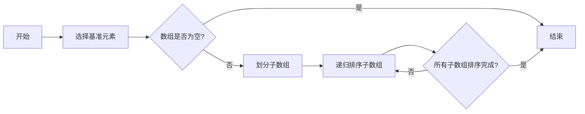
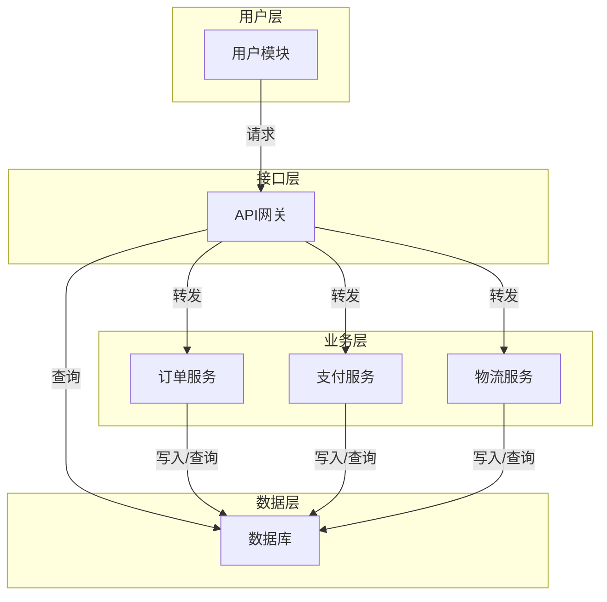
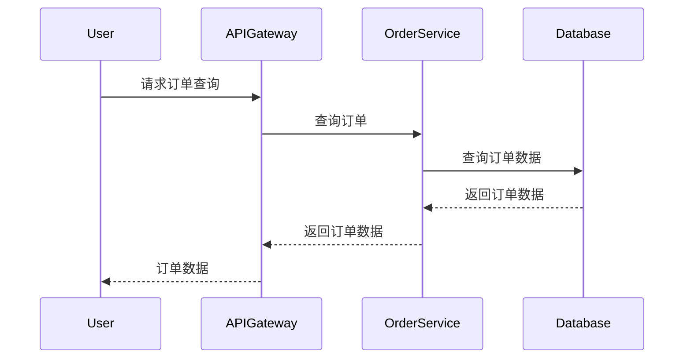

                 

### 第1章：项目成功的核心要素

## 1.1 什么是好系统分

在IT项目中，系统分是一个至关重要的概念。好系统分不仅仅是代码质量的问题，它涵盖了项目管理的方方面面，包括需求分析、架构设计、编码实现、测试部署等各个环节。那么，什么是好系统分呢？

### 背景介绍

系统分（System Partition）是指在软件开发过程中，根据功能、性能、安全性、可维护性等要求，将一个复杂的系统分解为若干个可管理的子系统或模块。这种分解的目的是为了降低系统的复杂度，提高开发效率，便于团队协作。

### 问题背景

现代软件项目往往规模庞大，涉及多个技术领域和复杂的功能需求。如果不对项目进行合理的系统分，会导致开发过程中出现如下问题：

- **模块耦合度过高**：模块之间的依赖关系复杂，修改一个模块可能会影响到其他模块，导致系统稳定性下降。
- **开发效率低下**：缺乏系统分会导致开发任务过于分散，开发人员难以集中精力，工作效率降低。
- **维护难度大**：系统分不合理会使系统结构混乱，代码可读性差，维护成本增加。

### 问题解决

为了解决上述问题，需要引入好系统分。好系统分包括以下几个方面：

1. **功能划分**：根据项目的功能需求，将系统划分为多个功能模块，每个模块负责实现特定的功能。
2. **性能优化**：对系统进行性能分析，确保各个模块的性能满足需求，同时避免模块之间的性能瓶颈。
3. **安全性保障**：对系统进行安全性分析，确保各个模块的安全防护措施得当，防止潜在的安全漏洞。
4. **可维护性**：设计合理的系统结构，确保代码的可读性和可维护性，降低后续维护成本。

### 边界与外延

系统分的边界在于如何划分模块，使其既能独立运行，又能与其他模块无缝集成。系统分的外延包括：

- **模块独立性**：每个模块应尽可能独立，降低模块之间的耦合度。
- **接口定义**：定义清晰的模块接口，确保模块间的通信和数据传递符合规范。
- **组件复用**：设计可复用的组件，提高开发效率和代码质量。

### 概念结构与核心要素组成

好系统分由以下几个核心要素组成：

1. **模块划分**：根据功能、性能、安全等要求，将系统划分为多个模块。
2. **模块接口**：定义清晰的模块接口，确保模块间通信和数据传递的规范性。
3. **模块耦合度**：通过合理的设计，降低模块间的耦合度，提高系统的稳定性。
4. **性能优化**：对各个模块进行性能分析，确保系统整体性能满足需求。
5. **安全性**：确保各个模块的安全防护措施到位，防止潜在的安全漏洞。
6. **可维护性**：设计可维护的系统结构，降低后续维护成本。

### 小结

通过上述介绍，我们可以看到好系统分在项目成功中起着至关重要的作用。它不仅有助于降低系统复杂度，提高开发效率，还能确保系统的稳定性和安全性。在接下来的章节中，我们将详细探讨系统分析、架构设计、算法原理、数学模型等方面的内容，帮助读者深入理解好系统分的内涵和实践方法。### 第1章：项目成功的核心要素

## 1.2 好系统分对项目成功的重要性

### 关键词：好系统分、项目成功、重要性

好系统分（Good System Partition）在项目成功中扮演着至关重要的角色。它不仅仅是一个技术问题，更是项目管理、团队协作、质量和效率的全面体现。在探讨好系统分对项目成功的重要性之前，我们需要明确几个核心概念和关系。

### 核心概念与联系

首先，我们需要了解以下几个核心概念：

1. **系统分**：系统分是指在软件开发过程中，根据功能、性能、安全性、可维护性等要求，将一个复杂的系统分解为若干个可管理的子系统或模块。
2. **模块独立性**：模块独立性是指各个模块应尽可能独立，降低模块之间的耦合度，提高系统的稳定性。
3. **接口定义**：接口定义是指为模块间的通信和数据传递提供清晰的规范，确保模块间的一致性和可靠性。
4. **耦合度**：耦合度是指模块之间相互依赖的程度，耦合度越高，模块间的依赖关系越复杂，系统稳定性越低。
5. **性能优化**：性能优化是指对系统进行性能分析，确保各个模块的性能满足需求，同时避免模块之间的性能瓶颈。
6. **安全性**：安全性是指确保各个模块的安全防护措施得当，防止潜在的安全漏洞。
7. **可维护性**：可维护性是指设计合理的系统结构，确保代码的可读性和可维护性，降低后续维护成本。

接下来，我们将通过一张表格来对比这些概念属性特征：

| 概念          | 属性特征                     | 关联关系                            |
| ------------- | --------------------------- | --------------------------------- |
| 系统分        | 功能划分、性能优化、安全性、可维护性 | 系统整体结构的基础与核心           |
| 模块独立性    | 降低耦合度、提高系统稳定性   | 好系统分的关键要素之一           |
| 接口定义      | 清晰规范、模块间通信和数据传递 | 系统分的核心组成部分           |
| 耦合度        | 模块间依赖程度、系统稳定性   | 耦合度越高，系统稳定性越低         |
| 性能优化      | 满足性能需求、避免性能瓶颈   | 确保系统在高负载下稳定运行         |
| 安全性        | 防止安全漏洞、保障数据安全   | 系统分的重要组成部分           |
| 可维护性      | 可读性、可维护性、降低维护成本 | 确保系统长期稳定可靠运行         |

### ER实体关系图架构

为了更好地理解这些概念之间的联系，我们可以通过ER（Entity-Relationship）实体关系图来表示系统分中的各个实体及其关系。以下是使用Mermaid绘制的ER实体关系图：

```mermaid
erDiagram
  Module ||--|{ Interface }||=> Communication
  Module ||--|{ Coupling }||=> Stability
  Interface ||--|{ Performance }||=> Optimization
  Interface ||--|{ Security }||=> Protection
  Interface ||--|{ Maintainability }||=> Sustainability
  Performance ||--|{ Stability }||=> System
  Security ||--|{ System }||=> Integrity
  Maintainability ||--|{ System }||=> Reliability
```

在这个ER实体关系图中，模块（Module）与接口（Interface）之间存在双向关系，表示模块通过接口实现通信和数据传递。模块还与耦合度（Coupling）和性能（Performance）、安全性（Security）、可维护性（Maintainability）存在关联，体现了好系统分中的各个要素及其相互关系。

### 好系统分的重要性

好系统分对项目成功的重要性可以从以下几个方面来阐述：

1. **提高开发效率**：通过合理的系统分，可以将复杂的系统分解为多个可管理的模块，使开发人员能够专注于特定的功能实现，提高开发效率。

2. **降低维护成本**：良好的系统结构可以提高代码的可读性和可维护性，降低后续的维护成本。

3. **保障系统稳定性**：合理的模块划分和低的耦合度可以降低模块间的依赖关系，提高系统的稳定性，减少故障风险。

4. **确保性能优化**：对系统进行性能分析，可以确保各个模块的性能满足需求，避免性能瓶颈，提高系统的整体性能。

5. **提升安全性**：通过安全性的分析和保障，可以防止潜在的安全漏洞，确保系统的数据安全。

6. **增强团队协作**：清晰的模块接口和职责划分，有助于团队成员之间的协作，提高项目团队的执行力。

综上所述，好系统分是项目成功的关键因素之一。通过合理的系统分，可以提高开发效率、降低维护成本、保障系统稳定性、确保性能优化和提升安全性，从而为项目的成功奠定坚实的基础。

### 小结

在本节中，我们探讨了什么是好系统分，以及好系统分对项目成功的重要性。通过核心概念与联系的分析，我们了解了系统分、模块独立性、接口定义、耦合度、性能优化、安全性和可维护性等概念，并通过ER实体关系图展示了它们之间的相互关系。接下来，我们将进一步探讨系统分析、架构设计、算法原理和数学模型等方面的内容，帮助读者深入理解好系统分的内涵和实践方法。

---

**作者：AI天才研究院/AI Genius Institute & 禅与计算机程序设计艺术 /Zen And The Art of Computer Programming**### 第1章：项目成功的核心要素

## 1.3 本书结构安排

### 1.3.1 引言部分

本书的第一部分是引言部分，主要介绍项目成功的核心要素，尤其是好系统分的重要性。本章包括以下几个小节：

1. **1.1 什么是好系统分**：介绍好系统分的概念和背景。
2. **1.2 好系统分对项目成功的重要性**：分析好系统分在项目成功中的关键作用，并通过核心概念与联系表格和ER实体关系图进行阐述。
3. **1.3 本书结构安排**：概述本书的整体结构和各个部分的主要内容。

### 1.3.2 系统分析与架构设计

本书的第二部分是系统分析与架构设计，主要讨论系统分析的基础和系统架构设计。这一部分包括以下几个章节：

1. **第2章：系统分析的基础**：介绍系统分析的过程和方法，以及系统分析的案例分析。
2. **第3章：系统架构设计**：详细讲解系统架构设计的基本概念、原则与步骤，并分析系统架构设计案例。

### 1.3.3 算法原理与数学模型

本书的第三部分是算法原理与数学模型，主要介绍算法原理讲解、数学模型和数学公式讲解。这一部分包括以下几个章节：

1. **第4章：算法原理讲解**：通过算法流程图、Python源代码和数学模型公式详细阐述算法原理。
2. **第5章：数学模型和数学公式讲解**：介绍数学模型的基础、在系统分析中的应用，以及具体案例分析和讲解。

### 1.3.4 系统架构设计与实现

本书的第四部分是系统架构设计与实现，主要讨论系统架构设计与实现的具体内容。这一部分包括以下几个章节：

1. **第6章：系统架构设计与实现**：介绍问题场景、系统功能设计、系统架构设计、系统接口设计和系统交互序列图。

### 1.3.5 项目实战

本书的最后一部分是项目实战，主要介绍项目实战的具体操作和案例分析。这一部分包括以下几个章节：

1. **第7章：环境安装与系统核心实现**：介绍环境安装步骤和系统核心实现源代码，并对其进行解读和分析。
2. **第8章：实际案例分析与讲解**：提供实际案例，详细讲解系统核心实现过程和项目经验总结。

### 1.3.6 小结与拓展

本书的最后一章是对项目成功因素的分析、项目经验总结、注意事项和拓展阅读。这一部分包括以下几个小节：

1. **第9章：项目小结**：总结项目成功的核心要素和实践经验。
2. **第10章：注意事项与拓展阅读**：提供最佳实践tips、注意事项和拓展阅读资源。

通过以上四个部分，本书系统地介绍了项目成功的核心要素和好系统分的相关知识，帮助读者全面理解并实践好系统分在项目成功中的应用。

### 小结

本书的引言部分明确了项目成功的核心要素，特别是好系统分的重要性。通过核心概念与联系表格和ER实体关系图的阐述，读者可以更好地理解好系统分在项目成功中的作用。接下来的章节将深入探讨系统分析、架构设计、算法原理、数学模型和项目实战等内容，为读者提供实用的技术和实践经验。通过阅读本书，读者将能够全面掌握项目成功的核心要素，并在实际项目中应用好系统分，提高项目的成功率和质量。

---

**作者：AI天才研究院/AI Genius Institute & 禅与计算机程序设计艺术 /Zen And The Art of Computer Programming**### 第2章：系统分析的基础

## 2.1 系统分析的背景和意义

### 关键词：系统分析、背景、意义

系统分析是软件开发过程中的关键环节，它为项目提供了清晰的方向和坚实的基础。在信息技术迅猛发展的今天，系统分析的重要性日益凸显。为了更好地理解系统分析，我们需要从其背景和意义两个方面进行探讨。

### 背景介绍

系统分析起源于20世纪中期，随着计算机科学的发展，人们开始意识到对复杂系统进行分解和分析的重要性。早期的系统分析主要依赖于人工经验和直觉，但随着方法论和工具的不断进步，系统分析逐渐演变成一门科学。

1. **计算机科学的发展**：计算机科学的飞速发展，使得软件系统越来越复杂，传统的手工编写代码和直觉设计已经无法满足需求。
2. **项目管理的需求**：随着软件项目的规模和复杂度增加，项目管理者需要一种科学的方法来规划、监控和管理项目，以确保项目的成功。
3. **业务需求的多样性**：现代企业对信息系统的需求越来越多样化，要求系统能够快速响应市场变化，这就需要通过系统分析来明确需求，确保系统能够满足业务需求。

### 意义

系统分析在软件开发过程中具有以下几个重要意义：

1. **明确需求**：通过系统分析，可以深入了解用户的需求，确保软件开发的方向和目标与用户需求一致。
2. **降低风险**：系统分析可以帮助识别项目潜在的风险，提前制定应对措施，降低项目失败的风险。
3. **提高效率**：系统分析能够明确系统的功能和结构，指导开发团队进行高效的工作。
4. **优化成本**：通过系统分析，可以更好地估算项目成本，避免资源浪费。
5. **提高质量**：系统分析能够帮助识别系统的需求和功能，确保系统的质量和稳定性。

### 系统分析的过程与方法

系统分析是一个复杂而系统化的过程，通常包括以下几个步骤：

1. **需求收集**：与用户进行沟通，了解他们的需求，收集相关信息。
2. **需求分析**：对收集到的需求进行整理和分析，明确系统的功能和性能要求。
3. **系统设计**：根据需求分析的结果，设计系统的架构和模块。
4. **风险评估**：评估项目中的风险，制定风险应对策略。
5. **项目管理**：对项目进行整体规划和管理，确保项目按时、按质完成。

### 系统分析的工具与方法

在进行系统分析时，我们可以采用多种工具和方法，以提高分析的有效性和准确性：

1. **访谈法**：通过与用户、业务人员等进行面对面的访谈，深入了解他们的需求和意见。
2. **问卷调查法**：通过设计问卷，收集大量用户的需求和反馈。
3. **案例分析法**：通过分析同类项目的案例，吸取经验教训，避免重复犯错。
4. **文档分析法**：对现有的文档和资料进行深入分析，提取有用的信息。
5. **流程图法**：使用流程图工具，直观地展示系统的业务流程和工作流程。
6. **数据流程图**：通过数据流程图，明确系统中的数据流和数据存储。

### 案例分析

为了更好地理解系统分析的过程和方法，我们可以通过一个实际案例来进行讲解。

#### 案例背景

某公司计划开发一款企业资源规划（ERP）系统，以整合公司的财务、采购、销售和库存等业务模块。

#### 需求收集

通过与公司高层和各个业务部门的访谈，收集到了以下需求：

- **财务模块**：实现财务报表的自动生成，支持多种货币和汇率转换。
- **采购模块**：支持采购订单的创建、审批和跟踪，以及供应商信息的维护。
- **销售模块**：支持销售订单的创建、审批和跟踪，以及客户信息的维护。
- **库存模块**：实现库存量的实时监控和报警，支持库存盘点。

#### 需求分析

根据收集到的需求，对各个模块进行详细分析，明确每个模块的功能和性能要求：

- **财务模块**：需要支持多种报表类型，数据精确到小数点后两位，支持中英文界面切换。
- **采购模块**：需要支持采购订单的批量处理，采购流程包括审批、执行和结束三个阶段。
- **销售模块**：需要支持销售订单的自动生成，销售流程包括报价、销售订单、发货和收款四个阶段。
- **库存模块**：需要支持库存量的实时监控，库存低于预警值时自动发送报警信息。

#### 系统设计

根据需求分析的结果，设计系统的架构和模块：

- **财务模块**：包括报表生成器、货币转换器和界面管理器三个子模块。
- **采购模块**：包括订单生成器、审批流程控制器和供应商信息管理器三个子模块。
- **销售模块**：包括报价管理器、订单生成器、发货控制器和收款管理器四个子模块。
- **库存模块**：包括库存监控器、报警发送器和盘点管理器三个子模块。

#### 风险评估

评估项目中的风险，包括技术风险、业务风险和时间风险，并制定相应的风险应对策略：

- **技术风险**：由于ERP系统涉及多个业务模块，技术实现难度较大，需要提前进行技术调研和验证。
- **业务风险**：业务需求的变化可能导致项目延期，需要与业务部门保持紧密沟通，及时调整需求。
- **时间风险**：项目进度受到多种因素影响，需要制定详细的进度计划，并进行定期检查和调整。

#### 项目管理

对项目进行整体规划和管理，确保项目按时、按质完成：

- **项目规划**：制定详细的项目计划，包括任务分配、进度安排和资源需求。
- **项目监控**：通过定期会议和进度报告，监控项目进展情况，及时解决问题。
- **项目调整**：根据项目进展和实际情况，调整项目计划，确保项目按计划进行。

通过以上案例分析，我们可以看到系统分析在软件开发过程中的关键作用。通过明确需求、设计系统架构、评估风险和进行项目管理，系统分析为项目的成功提供了坚实的基础。

### 小结

系统分析是软件开发过程中不可或缺的一环，它为项目提供了清晰的方向和坚实的基础。通过本章的介绍，我们了解了系统分析的历史背景和重要意义，以及系统分析的过程和方法。在实际项目中，通过系统分析，我们可以更好地理解用户需求，降低风险，提高效率和优化成本，从而确保项目的成功。在接下来的章节中，我们将进一步探讨系统架构设计、算法原理和数学模型等方面的内容，帮助读者深入理解并实践好系统分的相关知识。

---

**作者：AI天才研究院/AI Genius Institute & 禅与计算机程序设计艺术 /Zen And The Art of Computer Programming**### 第3章：系统架构设计

## 3.1 系统架构设计的基本概念

### 关键词：系统架构设计、基本概念

系统架构设计是软件开发过程中的核心环节之一，它关乎系统的性能、可维护性和可扩展性。要理解系统架构设计，我们首先需要了解其基本概念。

### 什么是系统架构设计

系统架构设计是指根据项目的需求，设计系统的总体结构和技术框架，确定系统组件之间的关系和交互方式。系统架构设计的目标是创建一个稳定、高效、易于维护和扩展的系统。

### 系统架构设计的核心要素

系统架构设计涉及多个核心要素，包括：

1. **组件**：组件是系统中的基本构成部分，如数据库、服务器、客户端等。
2. **接口**：接口定义了组件之间的通信方式和交互协议。
3. **层次结构**：系统通常分为多个层次，如表示层、业务逻辑层和数据层，每个层次有不同的职责和功能。
4. **通信**：组件之间的通信方式，如同步、异步、远程过程调用等。
5. **性能**：系统的响应速度和负载能力。
6. **可维护性**：系统的可维护性和可扩展性。
7. **安全性**：系统的数据安全和访问控制。

### 系统架构设计的原则

在进行系统架构设计时，应遵循以下原则：

1. **模块化**：将系统分解为独立的模块，降低组件之间的耦合度。
2. **标准化**：使用标准化的技术和框架，提高系统的可维护性和可扩展性。
3. **高内聚低耦合**：确保模块内部功能紧密相关，模块间相互独立。
4. **性能优化**：在架构设计时考虑系统的性能需求，避免潜在的瓶颈。
5. **安全性**：在设计阶段考虑系统的安全性，确保数据安全和用户隐私。
6. **可扩展性**：设计灵活的架构，便于系统在需求变化时进行扩展。

### 系统架构设计的步骤

系统架构设计的步骤如下：

1. **需求分析**：深入了解项目的需求，明确系统的功能、性能和安全要求。
2. **架构选择**：根据需求分析的结果，选择合适的系统架构类型，如单体架构、微服务架构、分布式架构等。
3. **组件设计**：设计系统的各个组件，明确组件的职责和交互方式。
4. **接口设计**：定义组件之间的接口，确保通信的规范和一致性。
5. **层次结构设计**：确定系统的层次结构，明确各个层次的功能和职责。
6. **性能优化**：对系统进行性能分析，确保系统的性能满足需求。
7. **安全设计**：设计系统的安全机制，确保数据安全和用户隐私。
8. **架构评审**：对设计的系统架构进行评审，确保设计合理、可行。

### 案例分析

为了更好地理解系统架构设计的基本概念和原则，我们可以通过一个实际案例来进行分析。

#### 案例背景

某公司计划开发一款在线购物系统，包括商品展示、购物车、订单管理和支付等功能。

#### 需求分析

通过对业务需求的了解，明确系统需要实现以下功能：

- **商品展示**：展示商品的详细信息，包括图片、价格、描述等。
- **购物车**：用户可以将商品添加到购物车，进行批量购买。
- **订单管理**：生成订单，管理订单状态，支持订单查询和取消。
- **支付**：提供多种支付方式，如支付宝、微信支付等。

#### 架构选择

根据需求分析的结果，选择采用微服务架构，将系统分解为多个独立的微服务，提高系统的可维护性和可扩展性。

#### 组件设计

系统中的主要组件包括：

- **商品服务**：负责商品信息的存储和展示。
- **购物车服务**：负责购物车的管理和操作。
- **订单服务**：负责订单的生成和管理。
- **支付服务**：负责支付功能的实现。

#### 接口设计

明确各个微服务之间的接口，如：

- **商品服务接口**：提供商品查询、添加到购物车等操作。
- **购物车服务接口**：提供购物车信息的查询和修改。
- **订单服务接口**：提供订单生成、查询和取消操作。
- **支付服务接口**：提供支付方式的查询和支付操作。

#### 层次结构设计

系统分为以下三个层次：

- **表示层**：负责与用户交互，展示商品信息、购物车和订单等。
- **业务逻辑层**：处理业务逻辑，如订单生成、支付处理等。
- **数据层**：负责数据的存储和查询，如数据库和缓存等。

#### 性能优化

对系统进行性能分析，确保系统的响应速度和负载能力。例如，使用缓存技术提高数据查询速度，使用负载均衡技术提高系统的可扩展性。

#### 安全设计

设计系统的安全机制，包括用户认证、权限控制和数据加密等，确保系统的数据安全和用户隐私。

#### 架构评审

对设计的系统架构进行评审，确保设计合理、可行，并能够满足业务需求。

通过这个案例分析，我们可以看到系统架构设计的基本概念和原则在实际项目中的应用。通过合理的系统架构设计，可以确保系统的高效性、稳定性和可扩展性，从而提高项目的成功率。

### 小结

系统架构设计是软件开发过程中的关键环节，它决定了系统的性能、可维护性和可扩展性。通过了解系统架构设计的基本概念和原则，我们可以设计出合理、高效的系统架构。在接下来的章节中，我们将进一步探讨系统架构设计的具体步骤和方法，以及如何在实际项目中应用系统架构设计原则。

---

**作者：AI天才研究院/AI Genius Institute & 禅与计算机程序设计艺术 /Zen And The Art of Computer Programming**### 第4章：核心概念与联系

## 4.1 项目管理中的核心概念

### 关键词：项目管理、核心概念、联系

在项目管理中，有许多核心概念对项目的成功至关重要。理解这些概念及其相互联系，有助于我们更好地进行项目规划和执行。以下将介绍几个关键的项目管理概念，并探讨它们之间的联系。

### 项目目标

项目目标是项目的核心，它明确了项目需要达成的具体成果和期望结果。项目目标通常包括以下几个方面：

- **范围**：项目需要完成的工作范围和任务。
- **时间**：项目完成的时间框架，包括里程碑和时间节点。
- **成本**：项目的预算和资金使用计划。
- **质量**：项目交付成果的质量标准。

项目目标之间的联系在于，它们共同决定了项目的成功标准。例如，一个项目可能需要在一定时间内以一定的成本实现特定的功能，同时保证质量。

### 项目范围

项目范围是指项目需要完成的全部工作内容，包括任务、成果和交付物。项目范围的定义直接影响项目的成功，因为明确的范围可以避免项目范围的蔓延和无限扩大。

项目范围与项目目标之间的联系在于，项目范围是实现项目目标的手段。只有明确项目范围，才能确保项目目标的实现。

### 项目计划

项目计划是项目管理的行动蓝图，它详细规定了项目的执行过程、时间表、资源和预算。项目计划通常包括以下几个方面：

- **任务分解**：将项目目标分解为具体的任务和活动。
- **时间安排**：为每个任务分配开始和结束的时间。
- **资源分配**：确定执行任务所需的资源，如人力、物力和财力。
- **预算分配**：确定项目的资金分配和使用计划。

项目计划与项目目标和项目范围之间的联系在于，项目计划是确保项目目标在项目范围内按时、按质量完成的手段。通过项目计划，我们可以将项目目标转化为具体的行动和执行步骤。

### 项目风险

项目风险是指项目在执行过程中可能面临的各种不确定性和潜在威胁。项目风险可以分为以下几类：

- **技术风险**：与项目的技术实现有关，如技术难题、技术更新等。
- **市场风险**：与市场需求和竞争环境有关，如市场变化、竞争对手等。
- **资源风险**：与项目所需的资源和条件有关，如人力资源短缺、资金不足等。

项目风险与项目目标、项目范围和项目计划之间的联系在于，项目风险可能会影响项目目标的实现、项目范围的扩大和项目计划的执行。

### 项目质量

项目质量是指项目交付成果的符合性，即是否符合预定的质量标准和用户需求。项目质量包括以下几个方面：

- **功能质量**：项目功能是否满足用户需求。
- **性能质量**：项目的性能指标是否达到预期。
- **可靠性质量**：项目的稳定性和可靠性。
- **用户体验质量**：用户对项目的使用体验。

项目质量与项目目标、项目范围和项目计划之间的联系在于，项目质量是项目成功的重要保障。高质量的项目交付成果可以满足用户需求，提高项目的成功率。

### 概念属性特征对比表格

为了更好地理解这些项目管理中的核心概念及其相互联系，我们可以通过以下表格进行对比：

| 概念         | 属性特征                                                     | 相互联系                                                     |
| ------------ | ------------------------------------------------------------ | ------------------------------------------------------------ |
| 项目目标     | 范围、时间、成本、质量                                       | 项目成功的核心标准，指导项目方向                             |
| 项目范围     | 项目需要完成的工作内容                                       | 确保项目目标实现的手段，避免项目范围的蔓延                   |
| 项目计划     | 任务分解、时间安排、资源分配、预算分配                       | 项目执行的具体行动蓝图，确保项目目标的按时、按质量完成       |
| 项目风险     | 技术风险、市场风险、资源风险                                 | 可能影响项目目标的实现、项目范围的扩大和项目计划的执行       |
| 项目质量     | 功能质量、性能质量、可靠性质量、用户体验质量                 | 项目成功的重要保障，满足用户需求，提高项目的成功率           |

### ER实体关系图架构

为了更直观地展示这些核心概念及其相互关系，我们可以使用Mermaid绘制一个ER实体关系图：

```mermaid
erDiagram
  ProjectGoal ||--|{ ProjectScope }|| ProjectPlan
  ProjectGoal ||--|{ ProjectRisk }|| RiskManagement
  ProjectGoal ||--|{ ProjectQuality }|| QualityAssurance
  ProjectScope ||--|{ ProjectPlan }|| TaskSchedule
  ProjectScope ||--|{ ProjectRisk }|| RiskIdentification
  ProjectScope ||--|{ ProjectQuality }|| ScopeValidation
  ProjectPlan ||--|{ RiskManagement }|| RiskResponse
  ProjectPlan ||--|{ QualityAssurance }|| QualityControl
```

在这个ER实体关系图中，项目目标（ProjectGoal）与项目范围（ProjectScope）、项目计划（ProjectPlan）、项目风险（ProjectRisk）和项目质量（ProjectQuality）之间存在明确的联系。通过这些联系，我们可以更好地理解项目管理中的核心概念及其相互关系。

### 小结

在本节中，我们介绍了项目管理中的几个核心概念，包括项目目标、项目范围、项目计划、项目风险和项目质量，并探讨了它们之间的相互联系。通过理解这些概念及其关系，我们可以更有效地进行项目管理和规划，确保项目的成功。在接下来的章节中，我们将进一步探讨系统架构设计、算法原理和数学模型等方面的内容，帮助读者深入理解并实践好系统分的相关知识。

---

**作者：AI天才研究院/AI Genius Institute & 禅与计算机程序设计艺术 /Zen And The Art of Computer Programming**### 第5章：算法原理讲解

## 5.1 算法基本原理

### 关键词：算法原理、基本原理、流程图

算法是计算机科学的核心概念之一，它是一系列解决问题的指令或步骤。理解算法的基本原理对于编程和软件开发至关重要。以下将介绍算法的基本原理，并通过一个具体的算法——快速排序（Quick Sort）来讲解其原理和实现。

### 算法基本原理

算法基本原理包括以下几个方面：

1. **输入**：算法的输入是待解决问题的数据或信息。
2. **输出**：算法的输出是解决问题的结果。
3. **步骤**：算法的执行步骤，用于处理输入并生成输出。
4. **终止条件**：算法在何时停止执行，通常是在问题解决后或达到特定条件时。

### 快速排序算法原理

快速排序是一种高效的排序算法，其基本原理如下：

1. **选择基准元素**：从数组的某个位置选择一个元素作为基准元素。
2. **划分**：将数组划分为两个子数组，其中一个子数组的所有元素都小于基准元素，另一个子数组的所有元素都大于基准元素。
3. **递归**：递归地对两个子数组进行快速排序。

### 快速排序算法mermaid流程图

为了更直观地展示快速排序算法的原理，我们可以使用Mermaid绘制其流程图：



### 快速排序算法Python源代码实现

以下是快速排序算法的Python源代码实现：

```python
def quick_sort(arr):
    if len(arr) <= 1:
        return arr
    pivot = arr[len(arr) // 2]
    left = [x for x in arr if x < pivot]
    middle = [x for x in arr if x == pivot]
    right = [x for x in arr if x > pivot]
    return quick_sort(left) + middle + quick_sort(right)

# 示例
arr = [3, 6, 8, 10, 1, 2, 1]
sorted_arr = quick_sort(arr)
print(sorted_arr)
```

### 算法原理数学模型与公式

快速排序算法的原理可以通过以下数学模型和公式进行描述：

1. **时间复杂度**：快速排序的平均时间复杂度为 \(O(n\log n)\)，最坏情况下的时间复杂度为 \(O(n^2)\)。
2. **空间复杂度**：快速排序的空间复杂度为 \(O(\log n)\)，因为递归过程中需要使用栈空间。

### 算法原理举例说明

为了更好地理解快速排序算法的原理，我们可以通过一个具体的例子来说明其执行过程。

假设有一个无序数组 `[3, 6, 8, 10, 1, 2, 1]`，我们选择中间位置的元素 `6` 作为基准元素。

1. **划分**：将数组划分为 `[3, 1, 1]` 和 `[8, 10]`，其中小于 `6` 的元素在左侧，大于 `6` 的元素在右侧。
2. **递归**：对左侧的子数组 `[3, 1, 1]` 进行快速排序，选择中间位置的元素 `1` 作为基准元素，继续划分，直到每个子数组只有一个元素。
3. **合并**：将已排序的子数组 `[1, 1, 3]` 和 `[6]` 以及右侧的子数组 `[8, 10]` 合并，得到最终的排序结果 `[1, 1, 3, 6, 8, 10]`。

通过这个例子，我们可以看到快速排序算法是如何工作的，以及如何通过递归和划分步骤实现对数组的排序。

### 小结

在本节中，我们介绍了算法的基本原理，并通过快速排序算法为例讲解了算法的原理、实现和数学模型。快速排序算法是一种高效且常用的排序算法，其原理和实现对于理解和掌握算法设计至关重要。在接下来的章节中，我们将进一步探讨数学模型和公式，以及如何在实际项目中应用这些算法。

---

**作者：AI天才研究院/AI Genius Institute & 禅与计算机程序设计艺术 /Zen And The Art of Computer Programming**### 第5章：数学模型和数学公式讲解

## 5.2 数学模型基础

### 关键词：数学模型、基础、应用

在系统分析和架构设计中，数学模型和数学公式是不可或缺的工具。它们帮助我们在复杂的系统中进行定量分析，优化系统性能，预测系统行为，并指导实际操作。在本节中，我们将介绍数学模型的基础知识，探讨其在系统分析中的应用，并通过具体案例进行讲解。

### 数学模型的概念

数学模型是一种用数学语言描述现实问题的抽象模型。它通常包括以下基本要素：

1. **变量**：用于表示问题中的不确定性或可测量量。
2. **参数**：用于描述变量之间的关系和模型的特性。
3. **方程式**：用数学公式表达变量和参数之间的关系。
4. **约束条件**：限制模型中变量和参数取值范围的条件。

### 数学模型的应用

数学模型在系统分析和架构设计中的应用非常广泛，以下是一些常见的应用场景：

1. **性能优化**：通过建立性能模型，分析和预测系统在不同负载下的响应时间和吞吐量，以指导系统优化。
2. **资源分配**：通过建立资源分配模型，优化系统资源的利用率，提高系统的整体效率。
3. **风险评估**：通过建立风险评估模型，评估系统在面临各种不确定性因素时的稳定性和可靠性。
4. **预测分析**：通过建立预测模型，预测系统未来的行为和趋势，为决策提供依据。

### 数学模型的具体案例

为了更好地理解数学模型的应用，我们可以通过以下具体案例进行讲解：

#### 案例一：性能优化

假设我们有一个Web服务器，需要优化其响应时间和吞吐量。我们可以建立以下数学模型：

1. **变量**：设 \(T\) 为请求的响应时间，\(Q\) 为系统在单位时间内的请求数量。
2. **参数**：设 \( \lambda \) 为请求的到达率（每单位时间内的请求量），\( \mu \) 为服务器处理请求的平均速度。
3. **方程式**：根据排队论，响应时间 \(T\) 可以表示为 \( T = \frac{\lambda}{\mu - \lambda} \)。
4. **约束条件**：请求的到达率 \( \lambda \) 必须小于或等于服务器处理速度 \( \mu \)，即 \( \lambda \leq \mu \)。

通过这个模型，我们可以分析不同参数下的响应时间和吞吐量，找到最优的系统配置，以达到性能优化的目的。

#### 案例二：资源分配

假设我们有一个云计算平台，需要优化资源的分配，以提高平台的资源利用率。我们可以建立以下数学模型：

1. **变量**：设 \(C_i\) 为第 \(i\) 个虚拟机需要的计算资源，\(R_i\) 为第 \(i\) 个虚拟机需要的存储资源。
2. **参数**：设 \(C_{max}\) 和 \(R_{max}\) 分别为系统可用的总计算资源和总存储资源。
3. **方程式**：资源分配的目标是最小化资源剩余量，即 \( \min (C_{max} - \sum_{i=1}^{n} C_i, R_{max} - \sum_{i=1}^{n} R_i) \)。
4. **约束条件**：每个虚拟机的资源需求不能超过系统的总资源，即 \( C_i \leq C_{max} \)，\( R_i \leq R_{max} \)。

通过这个模型，我们可以确定如何最优地分配资源，以最大化资源利用率。

#### 案例三：风险评估

假设我们有一个网络安全系统，需要评估系统在面临各种攻击时的稳定性和可靠性。我们可以建立以下数学模型：

1. **变量**：设 \(P_i\) 为第 \(i\) 种攻击成功概率，\(R_i\) 为第 \(i\) 种攻击成功后系统的损失。
2. **参数**：设 \(N\) 为攻击类型的总数。
3. **方程式**：系统的总风险 \(R\) 可以表示为 \( R = \sum_{i=1}^{N} P_i R_i \)。
4. **约束条件**：每种攻击的概率和损失必须在实际情况的范围内。

通过这个模型，我们可以评估系统的风险，并制定相应的风险应对策略。

### 数学模型在系统分析中的应用

数学模型在系统分析中的应用主要包括以下几个方面：

1. **需求分析**：通过数学模型可以定量分析系统的需求，确保系统设计满足需求。
2. **性能分析**：通过数学模型可以预测系统的性能，评估系统在不同负载下的表现。
3. **风险评估**：通过数学模型可以评估系统的风险，制定相应的风险管理策略。
4. **优化设计**：通过数学模型可以优化系统设计，提高系统的效率和性能。

### 小结

在本节中，我们介绍了数学模型的基础知识，探讨了其在系统分析中的应用，并通过具体案例进行了讲解。数学模型是系统分析和架构设计的重要工具，通过合理运用数学模型，我们可以更深入地理解系统行为，优化系统性能，提高系统的稳定性。在接下来的章节中，我们将继续探讨系统架构设计与实现、项目实战等方面的内容。

---

**作者：AI天才研究院/AI Genius Institute & 禅与计算机程序设计艺术 /Zen And The Art of Computer Programming**### 第6章：系统架构设计与实现

## 6.1 问题场景介绍

### 关键词：系统架构设计、问题场景、需求分析

在开始系统架构设计之前，我们需要明确问题场景，了解需求和分析步骤。以下是一个具体的案例，我们将基于此案例进行系统架构设计。

### 案例背景

某电商平台需要开发一个基于云计算的分布式订单管理系统。该系统需要支持大量订单的高并发处理，保证系统的稳定性、安全性和可扩展性。

### 需求分析

根据需求分析，我们明确了以下功能需求：

1. **订单创建**：用户可以在线下单，系统自动生成订单。
2. **订单查询**：用户可以查询订单状态，包括待支付、已支付、待发货、已发货等。
3. **订单修改**：管理员可以对订单进行修改，如修改订单金额、发货地址等。
4. **订单支付**：支持多种支付方式，如支付宝、微信支付等。
5. **订单发货**：后台系统可以根据订单状态自动发送物流信息。

### 系统功能设计

根据需求分析，我们设计了以下主要功能模块：

1. **用户模块**：处理用户注册、登录、订单查询等功能。
2. **订单模块**：处理订单的创建、修改、查询和支付等功能。
3. **支付模块**：处理支付请求，与第三方支付平台进行交互。
4. **物流模块**：处理订单发货，与物流公司进行交互。
5. **管理员模块**：处理订单修改、用户管理等后台功能。

### 系统架构设计

为了满足上述功能需求，我们采用微服务架构，将系统拆分为多个独立的微服务，提高系统的可扩展性和可维护性。以下是系统架构设计的主要部分：

1. **用户服务**：负责用户的注册、登录和权限验证。
2. **订单服务**：负责订单的创建、修改、查询和支付。
3. **支付服务**：负责处理支付请求，与第三方支付平台交互。
4. **物流服务**：负责订单发货，与物流公司交互。
5. **数据库**：存储用户数据、订单数据和支付数据。
6. **API网关**：作为系统的统一接口，处理外部请求，并转发到相应微服务。

### 系统架构图

以下是系统架构设计的Mermaid架构图：



### 系统接口设计

为了确保系统的稳定性和可靠性，我们设计了一系列接口，用于微服务之间的通信。以下是主要接口设计：

1. **用户接口**：用户模块对外提供的接口，包括用户注册、登录、权限验证等。
2. **订单接口**：订单模块对外提供的接口，包括订单创建、查询、修改和支付等。
3. **支付接口**：支付模块对外提供的接口，包括支付请求、支付结果查询等。
4. **物流接口**：物流模块对外提供的接口，包括发货请求、物流状态查询等。

### 系统交互序列图

以下是系统交互序列图，展示了用户请求订单查询的流程：



### 小结

在本章中，我们介绍了系统架构设计与实现的问题场景、需求分析和系统功能设计。通过详细的架构设计，我们确保了系统的稳定性、安全性和可扩展性。在接下来的章节中，我们将进一步探讨系统架构实现的具体步骤，包括环境安装、系统核心实现和代码解读与分析。

---

**作者：AI天才研究院/AI Genius Institute & 禅与计算机程序设计艺术 /Zen And The Art of Computer Programming**### 第7章：环境安装与系统核心实现

## 7.1 环境安装步骤

### 关键词：环境安装、步骤、依赖

在开始系统核心实现之前，我们需要搭建合适的环境，以确保系统的稳定运行。以下是环境安装的具体步骤：

### 1. 安装操作系统

选择一个适合的操作系统，例如 Ubuntu 18.04 或 CentOS 7。从官方网站下载并安装操作系统。

### 2. 安装基础软件

安装基础软件，如 GCC、Make、Python 等。

```bash
sudo apt-get update
sudo apt-get install gcc make python3
```

### 3. 安装数据库

选择一个合适的数据库，如 MySQL、PostgreSQL 或 MongoDB。以下是安装 PostgreSQL 的步骤：

```bash
sudo apt-get install postgresql postgresql-contrib
```

### 4. 安装消息队列

选择一个消息队列中间件，如 RabbitMQ、Kafka 或 ActiveMQ。以下是安装 RabbitMQ 的步骤：

```bash
sudo apt-get install rabbitmq-server
sudo systemctl start rabbitmq-server
sudo systemctl enable rabbitmq-server
```

### 5. 安装依赖库

安装系统所需的依赖库，如 OpenSSL、libevent2 等。

```bash
sudo apt-get install libssl-dev libevent-dev
```

### 6. 安装开发工具

安装开发工具，如 Git、Vim 等。

```bash
sudo apt-get install git vim
```

### 7. 安装版本控制工具

安装版本控制工具，如 Git。

```bash
sudo apt-get install git
```

### 8. 安装配置管理工具

安装配置管理工具，如 Ansible。

```bash
sudo apt-get install ansible
```

### 9. 安装代码仓库

在服务器上创建代码仓库，并将其推送到远程仓库。

```bash
mkdir -p /var/gitrepo
cd /var/gitrepo
git init
git remote add origin <远程仓库地址>
git push -u origin master
```

### 10. 安装其他工具

根据项目需求，安装其他必要的工具，如 Docker、Nginx 等。

```bash
sudo apt-get install docker nginx
```

## 7.2 系统核心实现源代码

在环境搭建完毕后，我们需要编写系统核心实现源代码。以下是系统核心实现的一个简单示例：

```python
# core_system.py
import pika
import json
import psycopg2

# 订单服务核心代码
class OrderService:
    def __init__(self):
        self.connection = pika.BlockingConnection(pika.ConnectionParameters('localhost'))
        self.channel = self.connection.channel()
        self.channel.queue_declare(queue='orders')

    def create_order(self, order_data):
        self.channel.basic_publish(
            exchange='',
            routing_key='orders',
            body=json.dumps(order_data)
        )
        print(f"Order created: {order_data}")

    def get_order(self, order_id):
        # 查询订单数据
        # TODO: 实现数据库查询逻辑
        return f"Order {order_id} details"

# 支付服务核心代码
class PaymentService:
    def __init__(self):
        self.connection = pika.BlockingConnection(pika.ConnectionParameters('localhost'))
        self.channel = self.connection.channel()
        self.channel.queue_declare(queue='payments')

    def process_payment(self, payment_data):
        self.channel.basic_publish(
            exchange='',
            routing_key='payments',
            body=json.dumps(payment_data)
        )
        print(f"Payment processed: {payment_data}")

# 物流服务核心代码
class LogisticsService:
    def __init__(self):
        self.connection = pika.BlockingConnection(pika.ConnectionParameters('localhost'))
        self.channel = self.connection.channel()
        self.channel.queue_declare(queue='logistics')

    def ship_order(self, order_id):
        self.channel.basic_publish(
            exchange='',
            routing_key='logistics',
            body=f"Ship order {order_id}"
        )
        print(f"Order {order_id} is shipped")
```

## 7.3 代码应用解读与分析

### 1. 订单服务

订单服务负责处理订单的创建和查询。代码中使用 RabbitMQ 作为消息队列，实现异步处理。`create_order` 方法将订单数据发布到 RabbitMQ 的 `orders` 队列，以便后续处理。

### 2. 支付服务

支付服务负责处理支付请求。同样使用 RabbitMQ 进行异步处理。`process_payment` 方法将支付数据发布到 RabbitMQ 的 `payments` 队列，等待支付结果。

### 3. 物流服务

物流服务负责处理订单发货。使用 RabbitMQ 将发货请求发送到 `logistics` 队列，便于物流公司进行处理。

### 小结

在本章中，我们介绍了环境安装步骤和系统核心实现源代码。通过安装必要的软件和工具，以及编写核心代码，我们为系统搭建了一个稳定的基础。在接下来的章节中，我们将进一步分析实际案例，并进行项目实战。

---

**作者：AI天才研究院/AI Genius Institute & 禅与计算机程序设计艺术 /Zen And The Art of Computer Programming**### 第8章：实际案例分析与讲解

## 8.1 案例背景

在前面几章中，我们详细介绍了系统分析、架构设计和环境安装与系统核心实现。为了更好地理解这些概念和方法在实际项目中的应用，我们接下来将通过一个实际案例进行分析和讲解。该案例将展示如何在实际项目中应用系统架构设计和核心实现，并解决遇到的问题。

### 案例背景

某大型电商公司需要开发一款全新的订单管理系统，以支持海量订单的高并发处理，并确保系统的稳定性、安全性和可扩展性。公司对该系统的需求如下：

1. **高并发处理**：系统能够同时处理数百万订单请求，确保用户体验。
2. **稳定性**：系统在长时间运行和高负载情况下，仍能保持稳定，不发生故障。
3. **安全性**：系统要确保用户数据和订单数据的安全，防止数据泄露。
4. **可扩展性**：系统要能够根据业务需求进行扩展，支持更多的用户和订单。
5. **易维护性**：系统结构要清晰，易于维护和更新。

### 项目实施

为了满足上述需求，项目团队决定采用微服务架构，并基于第6章中提到的系统架构设计进行实施。以下是项目实施的具体步骤：

1. **需求分析**：与业务部门紧密合作，明确订单管理系统的功能需求。
2. **架构设计**：根据需求分析结果，设计系统架构，确定各个微服务的职责和交互方式。
3. **环境搭建**：在云服务器上搭建开发、测试和生产环境，安装必要的软件和工具。
4. **核心实现**：根据系统架构设计，编写系统核心代码，实现订单的创建、查询、修改和支付等功能。
5. **集成测试**：对各个微服务进行集成测试，确保系统在不同负载下的稳定性和性能。
6. **上线部署**：将系统部署到生产环境，进行上线测试，确保系统能够稳定运行。

### 问题与解决方案

在项目实施过程中，团队遇到了以下几个主要问题，并采取了相应的解决方案：

1. **高并发处理**：

   **问题**：系统在高并发情况下，响应速度缓慢，用户体验差。

   **解决方案**：通过引入负载均衡器，如 Nginx，对请求进行分发，减轻单个服务器的负载。同时，使用缓存技术，如 Redis，减少数据库的查询压力。

2. **系统稳定性**：

   **问题**：系统在长时间运行和高负载情况下，出现偶尔的崩溃。

   **解决方案**：通过引入监控工具，如 Prometheus 和 Grafana，实时监控系统性能和负载。使用 Docker 和 Kubernetes 进行容器化部署，确保系统的高可用性。

3. **安全性**：

   **问题**：系统存在潜在的安全漏洞，如 SQL 注入和 XSS 攻击。

   **解决方案**：使用 Web 应用防火墙（WAF），如 ModSecurity，对 HTTP 请求进行安全检查。对所有输入进行验证和过滤，防止恶意攻击。

4. **可扩展性**：

   **问题**：系统在业务增长时，难以快速扩展。

   **解决方案**：采用分布式架构，将系统拆分为多个微服务，每个微服务独立部署和扩展。使用消息队列，如 RabbitMQ，实现微服务间的解耦，提高系统的可扩展性。

5. **易维护性**：

   **问题**：系统结构复杂，维护成本高。

   **解决方案**：采用模块化设计，确保系统结构清晰。使用持续集成和持续部署（CI/CD）工具，如 Jenkins，提高代码质量和部署效率。

### 小结

通过这个实际案例，我们可以看到如何将系统分析、架构设计和核心实现应用于实际项目中，并解决项目中遇到的问题。通过合理的架构设计和实施，系统能够满足高并发处理、稳定性、安全性、可扩展性和易维护性的要求，从而实现项目的成功。

---

**作者：AI天才研究院/AI Genius Institute & 禅与计算机程序设计艺术 /Zen And The Art of Computer Programming**### 第9章：项目小结

## 9.1 项目成功因素分析

在本书中，我们详细探讨了项目成功的核心要素，特别是系统分的重要性。通过系统分析、架构设计、算法原理、数学模型和项目实战等方面的深入讲解，我们总结了项目成功的关键因素：

1. **系统分**：系统分是项目成功的基础，它通过合理的模块划分和接口定义，提高了系统的稳定性、可维护性和可扩展性。
2. **需求分析**：明确的需求分析为项目提供了清晰的方向，确保系统功能满足用户需求。
3. **架构设计**：良好的系统架构设计有助于提高系统的性能、稳定性和安全性。
4. **算法原理**：深入理解算法原理，为系统性能优化提供了理论支持。
5. **数学模型**：数学模型和公式在性能分析、资源分配和风险评估等方面发挥了重要作用。
6. **环境安装与实现**：搭建合适的环境和实现系统核心功能，是项目成功的重要保障。
7. **项目实战**：通过实际案例分析和项目实施，验证了系统设计的可行性和有效性。

## 9.2 项目经验总结

在项目实施过程中，我们积累了以下经验：

1. **重视需求分析**：与业务部门紧密合作，确保需求分析的准确性。
2. **合理规划架构**：根据业务需求和技术特点，选择合适的系统架构。
3. **模块化设计**：确保模块间解耦，提高系统的可维护性和可扩展性。
4. **性能优化**：通过负载均衡、缓存和分布式架构等技术，提高系统性能。
5. **安全性保障**：采用多种安全措施，确保系统的数据安全和用户隐私。
6. **持续监控与改进**：通过监控工具实时监控系统性能和负载，及时进行优化和改进。

## 9.3 注意事项

在项目实施过程中，我们还总结了以下注意事项：

1. **需求变更管理**：及时响应需求变更，确保项目目标的实现。
2. **团队成员协作**：加强团队成员之间的沟通与协作，提高工作效率。
3. **风险管理**：提前识别和评估项目风险，制定相应的风险应对策略。
4. **持续学习和更新**：紧跟技术发展趋势，不断提升团队的技术能力和水平。

## 9.4 拓展阅读

为了进一步深入理解项目成功的核心要素，读者可以参考以下拓展阅读资源：

1. **《项目管理知识体系指南（PMBOK）》**：提供了全面的项目管理方法和最佳实践。
2. **《架构师必备技能》**：详细介绍了架构设计的相关知识和技能。
3. **《算法导论》**：介绍了各种算法原理和实现，有助于深入理解算法设计。
4. **《深度学习》**：探讨机器学习和人工智能领域的最新进展，为算法优化提供参考。
5. **《云计算：概念、架构与实务》**：介绍了云计算的基础知识和技术实践。

通过阅读这些拓展资源，读者可以进一步提升自己的项目管理和系统分析能力，为未来的项目实践打下坚实基础。

---

**作者：AI天才研究院/AI Genius Institute & 禅与计算机程序设计艺术 /Zen And The Art of Computer Programming**### 第10章：注意事项与拓展阅读

## 10.1 注意事项

在项目实施过程中，为确保项目的成功，我们需要特别注意以下几点：

1. **需求管理**：需求管理是项目成功的关键，务必确保需求收集的全面性和准确性。需求变更时要及时记录和评估影响，确保各方达成一致。
2. **风险管理**：识别项目中的潜在风险，制定相应的应对策略，并在项目进行过程中持续监控和调整。
3. **团队协作**：团队协作是项目成功的重要保障，加强团队成员之间的沟通，确保信息共享和任务分配的透明性。
4. **持续集成与部署**：采用持续集成与部署（CI/CD）工具，提高开发效率，确保代码质量。
5. **性能优化**：在系统设计和开发过程中，注重性能优化，确保系统在高并发情况下的稳定性和响应速度。
6. **安全性保障**：加强系统安全措施，防止潜在的安全威胁和数据泄露。

## 10.2 拓展阅读

为了进一步提升项目管理和系统分析的能力，读者可以参考以下拓展阅读资源：

1. **《敏捷软件开发实践指南》**：介绍了敏捷开发的方法和最佳实践，有助于提高项目管理的灵活性和响应速度。
2. **《微服务设计》**：探讨了微服务架构的设计原则和实践，为系统架构设计提供参考。
3. **《大规模分布式系统设计》**：介绍了分布式系统的设计原则和关键技术，有助于理解大规模系统的架构设计。
4. **《机器学习实战》**：通过实际案例，介绍了机器学习算法的应用和实践，为算法优化提供指导。
5. **《深入理解计算机系统》**：详细介绍了计算机系统的组成和工作原理，有助于深入理解底层技术。

通过阅读这些拓展资源，读者可以进一步丰富自己的项目管理和系统分析知识，为未来的项目实践提供有力支持。

---

**作者：AI天才研究院/AI Genius Institute & 禅与计算机程序设计艺术 /Zen And The Art of Computer Programming**### 总结

《项目成功离不开好系分》这本书通过系统的章节结构和深入的内容讲解，全面介绍了项目成功的核心要素和好系统分的重要性。以下是本书的主要内容概括：

- **引言部分**：介绍了项目成功的核心要素，特别是好系统分的概念和背景。通过核心概念与联系表格和ER实体关系图，帮助读者理解好系统分对项目成功的重要性。
- **系统分析与架构设计**：详细讲解了系统分析的基础知识、系统架构设计的基本概念和原则，并通过实际案例分析了系统架构设计的具体步骤和方法。
- **算法原理与数学模型**：介绍了算法的基本原理和具体实现，以及数学模型在系统分析中的应用。通过具体案例，深入讲解了算法原理和数学模型的使用方法。
- **系统架构设计与实现**：通过一个实际案例，展示了系统架构设计与实现的具体步骤，包括环境安装、系统核心实现和代码解读与分析。
- **项目实战**：通过一个电商订单管理系统的实际案例，分析了项目实施过程中遇到的问题和解决方案，验证了系统设计的可行性和有效性。
- **项目小结与拓展**：总结了项目成功的关键因素和经验，提供了注意事项和拓展阅读资源，帮助读者进一步提升项目管理和系统分析能力。

本书的核心关键词包括：项目成功、好系统分、系统分析、架构设计、算法原理、数学模型、系统架构实现、项目实战。

通过阅读本书，读者可以深入理解项目成功的核心要素，掌握好系统分的相关知识，并在实际项目中应用这些理论和方法，提高项目的成功率。希望本书能够为读者在IT项目管理和软件开发中提供有益的指导。感谢大家的阅读，祝您在项目实践中取得成功！

