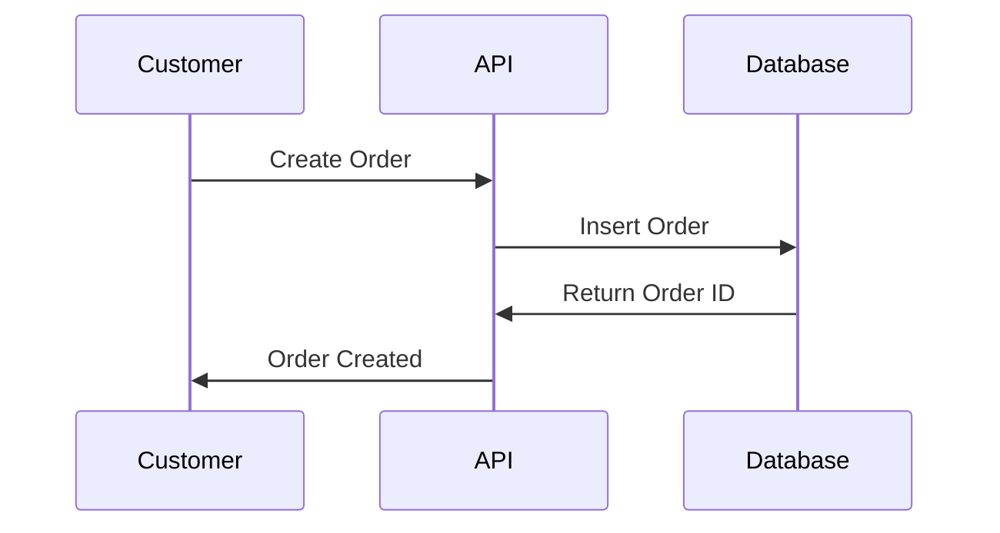

                 

### 领域建模易筋洗髓

> 关键词：领域建模，系统架构，数据模型，方法与步骤，实践案例，最佳实践

> 摘要：本文旨在深入探讨领域建模这一计算机科学中的核心技术，通过详细的步骤分析和实际案例展示，帮助读者理解领域建模的原理、方法与最佳实践。本文分为引言、核心概念、方法论、实战案例、最佳实践和总结与展望六个部分，涵盖了领域建模的各个方面，旨在提升读者的领域建模能力。

### 目录大纲

1. **引言**
   - 问题背景与现状
   - 领域建模的重要性
   - 领域建模的方法与步骤
   - 本书的目标与结构

2. **核心概念**
   - 概念结构与核心要素
   - 领域模型与业务模型
   - 模型属性特征对比表格
   - 实体关系图（ER图）架构

3. **方法论**
   - 建模流程与工具
   - UML类图设计
   - 领域规则与约束
   - 模型验证与迭代

4. **实战案例**
   - 实战项目介绍
   - 领域模型设计与实现
   - 系统架构设计与接口设计
   - 实际案例分析与讲解

5. **最佳实践**
   - 常见问题与解决技巧
   - 领域建模技巧与经验分享
   - 小结与注意事项

6. **总结与展望**
   - 领域建模的价值与趋势
   - 领域建模的未来发展方向
   - 总结与反思
   - 拓展阅读与资源推荐

---

### 第一部分：引言

#### 问题背景与现状

领域建模是软件工程中的一个关键环节，它涉及到如何将业务需求抽象成一套数据模型和系统架构。随着现代软件系统的复杂性不断增加，领域建模在系统设计和开发中的重要性日益凸显。然而，许多工程师在面对复杂的业务场景时，往往感到无从下手，缺乏系统的建模方法和实践经验。

#### 领域建模的重要性

领域建模不仅有助于理解业务需求，还能为系统设计提供清晰的蓝图。通过精确的领域模型，开发者可以更好地预测系统行为，避免设计中的歧义和漏洞。此外，领域建模还有助于提高代码的可维护性和可扩展性，降低系统开发成本。

#### 领域建模的方法与步骤

领域建模通常包括以下几个步骤：

1. **需求分析**：与业务团队沟通，理解业务需求，识别系统边界。
2. **概念建模**：使用ER图或类图，抽象出核心实体和关系。
3. **领域模型细化**：添加属性、操作和约束，使模型更加完整。
4. **模型验证**：通过迭代和反馈，确保模型准确反映业务需求。

#### 本书的目标与结构

本书的目标是帮助读者系统地掌握领域建模的方法和技巧，通过理论讲解和实战案例，提升实际操作能力。本书分为六大部分，每部分都将深入探讨领域建模的某个方面，从理论到实践，逐步引导读者进入领域建模的世界。

---

### 第二部分：核心概念

#### 概念结构与核心要素

领域建模需要明确核心概念和要素。这些概念通常包括实体、属性、关系和操作。实体是模型中的基本对象，属性描述实体的特征，关系则定义实体之间的交互，操作则表示实体可以执行的行为。

#### 领域模型与业务模型

领域模型是对业务领域的抽象，它与业务模型紧密相关。业务模型通常关注业务流程和规则，而领域模型则更侧重于数据结构和系统架构。两者之间需要保持一致，以确保系统能够准确反映业务需求。

#### 模型属性特征对比表格

为了更好地理解模型属性特征，我们可以使用对比表格来展示不同概念之间的区别。以下是实体、属性和关系的属性特征对比表格：

| 特征 | 实体 | 属性 | 关系 |
| --- | --- | --- | --- |
| 表示对象 | 是 | 否 | 是 |
| 具有属性 | 是 | 是 | 否 |
| 具有操作 | 是 | 否 | 是 |
| 之间的关系 | 通过关系 | 无直接关系 | 通过关系 |

#### 实体关系图（ER图）架构

实体关系图（ER图）是领域建模中常用的工具，它通过图形化的方式展示实体及其关系。以下是ER图的示例：

```mermaid
erDiagram
    Customer ||--|{ Order }|
    Product ||--|{ Order }|
    Order ||--|{ LineItem }|
```

在这个ER图中，`Customer`、`Product` 和 `Order` 是实体，它们之间的关系通过箭头表示。

---

### 第三部分：方法论

#### 建模流程与工具

领域建模通常遵循以下流程：

1. **需求分析**：收集和理解业务需求。
2. **概念建模**：使用ER图或类图进行初步建模。
3. **细化模型**：添加属性、操作和约束。
4. **模型验证**：与业务团队和开发者进行沟通，确保模型准确无误。
5. **迭代与优化**：根据反馈调整模型。

常用的建模工具有ERwin、PowerDesigner和Visual Paradigm等。

#### UML类图设计

UML类图是领域建模的重要工具，它能够清晰地展示类之间的关系和属性。以下是UML类图的示例：

```mermaid
classDiagram
    Customer <|-- Order
    Product <|-- Order
    Order <<-- LineItem
```

在这个UML类图中，`Customer`、`Product` 和 `Order` 是类，它们之间的关系通过箭头和角标表示。

#### 领域规则与约束

领域规则和约束是领域模型的重要组成部分，它们确保模型的一致性和完整性。例如，在一个电商系统中，我们可以定义以下规则：

- 每个订单必须有一个顾客。
- 每个订单可以包含多个商品。
- 每个商品必须有一个价格。

#### 模型验证与迭代

模型验证是确保领域模型准确无误的重要步骤。常用的验证方法包括：

- **一致性检查**：确保模型中没有冲突或矛盾。
- **实例检查**：通过实例验证模型是否符合业务需求。
- **迭代优化**：根据验证结果，不断调整和优化模型。

---

### 第四部分：实战案例

#### 实战项目介绍

我们以一个电商系统为例，介绍领域建模的过程。

#### 领域模型设计与实现

1. **需求分析**：识别系统中的核心实体，如顾客、订单和商品。
2. **概念建模**：使用ER图或类图初步定义实体和关系。
3. **细化模型**：为每个实体添加属性、操作和约束。
4. **模型验证**：与业务团队沟通，确保模型准确无误。

以下是电商系统的ER图：

```mermaid
erDiagram
    Customer ||--|{ Order }|
    Product ||--|{ Order }|
    Order ||--|{ LineItem }|
```

#### 系统架构设计与接口设计

1. **系统架构设计**：定义系统的整体架构，包括前端、后端和数据库。
2. **接口设计**：设计系统的API接口，定义请求和响应的结构。

以下是系统架构图和接口设计：



#### 实际案例分析与讲解

我们通过一个具体的订单创建场景，详细分析领域模型的实现。

1. **需求分析**：顾客需要创建一个订单，包含多个商品。
2. **模型设计**：为订单、商品和顾客定义属性和关系。
3. **接口实现**：设计API接口，接收订单信息，处理订单逻辑。

以下是订单创建的Python代码示例：

```python
class Customer:
    def create_order(self, products):
        order = Order(products=products)
        database.insert(order)
        return order

class Order:
    def __init__(self, products):
        self.products = products
        self.status = "pending"

    def process_order(self):
        self.status = "processed"

class Product:
    def __init__(self, name, price):
        self.name = name
        self.price = price

# 实例化对象
customer = Customer()
product1 = Product("Laptop", 1200)
product2 = Product("Mouse", 50)
order = customer.create_order([product1, product2])

# 处理订单
order.process_order()

# 打印订单信息
print(order.products)
```

---

### 第五部分：最佳实践

#### 常见问题与解决技巧

1. **模型过于复杂**：通过简化模型和迭代优化来降低复杂度。
2. **需求变化频繁**：保持与业务团队的紧密沟通，及时调整模型。
3. **模型验证困难**：使用自动化工具和实例验证方法来简化验证过程。

#### 领域建模技巧与经验分享

1. **先从简单模型开始，逐步细化**。
2. **保持模型的一致性和完整性**。
3. **重视领域规则和约束**。

#### 小结与注意事项

领域建模是一个系统性工程，需要充分考虑业务需求和系统架构。在实际操作中，要注重模型的可维护性和可扩展性，不断优化和迭代。

---

### 第六部分：总结与展望

#### 领域建模的价值与趋势

领域建模在软件工程中具有重要地位，随着业务需求的复杂化和系统规模的扩大，其价值将日益凸显。领域建模不仅有助于提高开发效率，还能为系统的持续迭代和维护提供有力支持。

#### 领域建模的未来发展方向

领域建模的未来发展方向包括：

1. **自动化建模工具的发展**：使用AI技术自动生成领域模型。
2. **模型驱动的开发方法**：通过领域模型实现自动化代码生成。
3. **跨领域建模技术的融合**：将不同领域的建模技术相结合，提高建模的通用性。

#### 总结与反思

领域建模是一项重要的技术，需要系统学习和实践。通过本文的讲解，我们希望能帮助读者更好地理解领域建模的原理和方法，提升实际操作能力。

#### 拓展阅读与资源推荐

- 《领域驱动设计（Domain-Driven Design）：软件核心复杂性应对策略》Eric Evans
- 《领域驱动设计实战》煞笔亮
- 《模型驱动架构：软件开发新技术》Stephen J. Mellor & Robert A. Nord

---

**作者：AI天才研究院/AI Genius Institute & 禅与计算机程序设计艺术 /Zen And The Art of Computer Programming**

通过本文，我们系统地介绍了领域建模的核心概念、方法论、实战案例和最佳实践，旨在帮助读者深入理解领域建模的原理和应用，提升实际操作能力。领域建模不仅是软件开发中的重要环节，也是系统设计的关键。希望通过本文的讲解，读者能够在实际项目中更好地应用领域建模技术，提高系统设计的质量和效率。同时，我们也期待领域建模在未来的发展中，能够不断创新和进步，为软件工程带来更多的可能性。**

