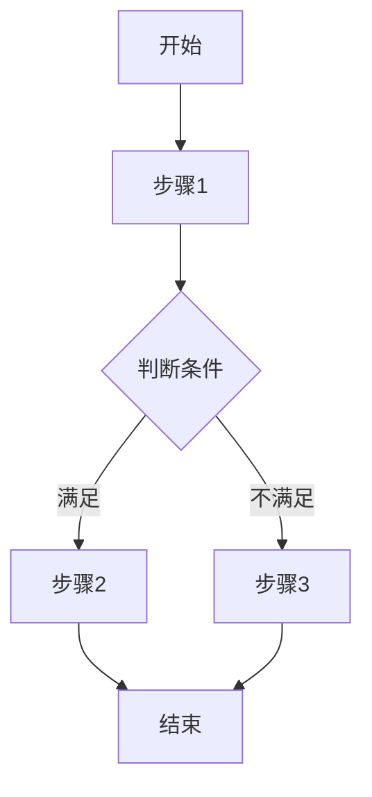
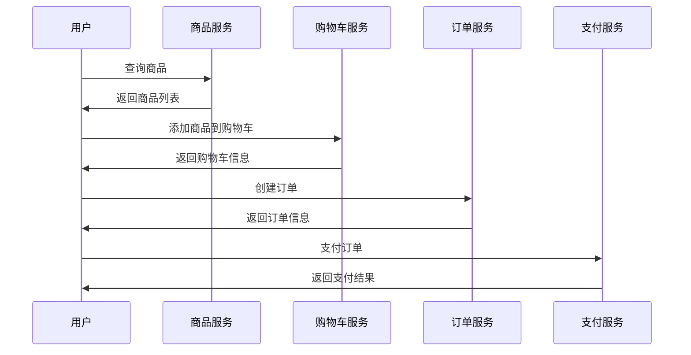
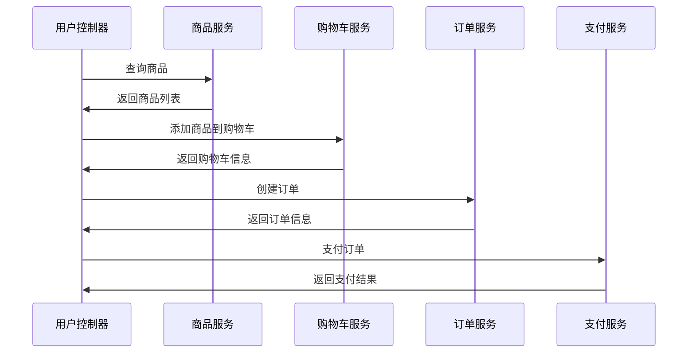

                 

## 领域建模的普适四招

> 关键词：领域建模、UML建模、ER建模、面向对象、实践方法、数学模型、系统设计

摘要：领域建模在软件工程中扮演着至关重要的角色，它能够帮助开发者更准确地理解业务需求，提升系统的可维护性和可扩展性。本文将深入探讨领域建模的基础理论、核心概念、实践方法以及系统设计与实现，通过普适的四招策略，帮助读者全面掌握领域建模的精髓。

## 第一部分：领域建模的基础理论

### 第1章：领域建模的背景与概述

#### 1.1 领域建模的基本概念

领域建模是指对特定领域（如银行、医疗、电子商务等）的业务逻辑、数据关系和流程进行抽象和建模，以构建一个结构化的模型。其目的是提高软件开发效率，降低成本，提升系统的适应性和可维护性。

领域建模涉及以下几个基本概念：

- **问题背景**：领域建模的起源和发展背景，以及为何需要领域建模。
- **问题描述**：领域建模要解决的问题是什么，包括业务需求、技术需求等。
- **问题解决**：领域建模如何解决上述问题，以及具体的实现方法和策略。
- **边界与外延**：领域建模的边界是什么，哪些部分属于领域范围，哪些不属于。
- **概念结构与核心要素组成**：领域建模中涉及到的核心概念，以及这些概念之间的关系和组成。

#### 1.2 领域建模与传统建模的区别

传统建模主要关注系统的功能实现，而领域建模则更加关注业务逻辑和数据关系的抽象和描述。领域建模与传统建模的区别主要体现在以下几个方面：

- **建模对象**：传统建模关注系统功能，而领域建模关注业务领域。
- **建模目的**：传统建模旨在实现系统功能，而领域建模旨在提高系统的可维护性和可扩展性。
- **建模方法**：传统建模通常使用流程图、UML等工具，而领域建模更注重实体关系、属性特征等。

#### 1.3 主流领域建模方法介绍

目前，常见的领域建模方法主要包括UML建模、ER建模、代理模型和面向对象的领域建模。

- **UML建模**：统一建模语言（UML）是一种广泛使用的建模工具，能够描述系统的静态结构和动态行为。UML包括用例图、类图、序列图等多种图示，适用于各种软件开发阶段。
- **ER建模**：实体关系建模（ER建模）是一种数据建模方法，通过实体、属性和关系的描述来表示数据库的结构。ER建模在数据库设计和数据管理中应用广泛。
- **代理模型**：代理模型通过代理角色来描述系统的交互和功能，特别适用于分布式系统和智能代理的应用场景。
- **面向对象的领域建模**：面向对象的方法将领域中的实体抽象为对象，通过封装、继承和多态等特性来描述系统的结构和行为。

#### 1.4 领域建模的应用场景

领域建模可以应用于多个领域，包括但不限于以下场景：

- **业务系统**：领域建模有助于明确业务需求，优化业务流程，提高业务系统的可维护性和可扩展性。
- **数据库设计**：领域建模为数据库设计提供了明确的实体关系，有助于优化数据库性能和结构。
- **软件开发**：领域建模可以指导软件开发的过程，提高代码的可读性和可维护性。
- **管理系统**：领域建模可以用于设计各种管理系统，如企业资源规划（ERP）系统、客户关系管理（CRM）系统等。

### 第2章：领域建模的核心概念与联系

#### 2.1 核心概念原理

领域建模中的核心概念包括实体、属性、关系和操作。这些概念构成了领域模型的基础，有助于描述系统的结构和行为。

- **实体**：实体是领域模型中的基本对象，表示领域中的具体事物。例如，在电子商务系统中，用户、商品、订单等都是实体。
- **属性**：属性是实体的特征，用于描述实体的属性特征。例如，用户实体的属性包括用户名、密码、邮箱等。
- **关系**：关系描述了实体之间的关联。常见的实体关系包括一对一、一对多、多对多等。
- **操作**：操作是实体可以执行的行为，用于实现系统的功能。例如，用户实体可以执行注册、登录、修改密码等操作。

#### 2.2 概念属性特征对比表格

以下是领域建模中主要概念属性特征的对比表格：

| 概念 | 描述 | 关键属性 | 关系 | 操作 |
| --- | --- | --- | --- | --- |
| 实体 | 领域中的具体事物 | 名称、类型、标识符 | 一对一、一对多、多对多 | 创建、修改、删除 |
| 属性 | 实体的特征 | 名称、数据类型、约束 | 一对一、一对多、多对多 | 获取、设置 |
| 关系 | 实体之间的关联 | 关系类型、参与实体 | 一对一、一对多、多对多 | 添加、删除 |
| 操作 | 实体的行为 | 操作名称、参数、返回值 | 一对一、一对多、多对多 | 执行、取消 |

#### 2.3 领域建模ER实体关系图架构

ER实体关系图是领域建模中常用的工具，用于表示实体之间的关系。以下是ER实体关系图的基本结构和示例。

```mermaid
erDiagram
  Customer ||--|{ Order }|-- Product
  {
    Customer {
      +String CustomerID
      +String CustomerName
      +String Email
    }
    Order {
      +String OrderID
      +Date OrderDate
    }
    Product {
      +String ProductID
      +String ProductName
      +Double Price
    }
  }
```

在上面的ER实体关系图中，`Customer`（客户）与`Order`（订单）之间存在一对多关系，表示一个客户可以创建多个订单；`Order`（订单）与`Product`（产品）之间存在多对多关系，表示一个订单可以包含多个产品，一个产品也可以被多个订单包含。

## 第二部分：领域建模的实践方法

### 第3章：领域模型的构建方法

#### 3.1 领域分析

领域分析是领域建模的第一步，旨在理解业务需求和业务流程。领域分析主要包括以下步骤：

1. **需求分析**：收集业务需求，包括功能需求和非功能需求。
2. **业务流程分析**：分析业务流程，了解业务流程中的各个环节和流程图。
3. **数据分析**：收集和分析领域中的数据，包括数据结构、数据流和数据存储。

#### 3.2 领域模型的构建

领域模型的构建主要包括以下步骤：

1. **定义实体和属性**：根据领域分析的结果，定义实体和实体的属性。
2. **建立实体关系**：根据实体的属性和业务逻辑，建立实体之间的关系。
3. **定义操作**：根据业务需求，为实体定义相应的操作。
4. **模型验证**：验证领域模型是否满足业务需求，包括数据完整性、一致性等。

#### 3.3 领域模型的验证与优化

领域模型的验证与优化主要包括以下步骤：

1. **模型验证**：使用工具对领域模型进行验证，确保模型没有语法错误和逻辑错误。
2. **模型优化**：根据验证结果对领域模型进行优化，包括实体和关系的重构、属性的调整等。

### 第4章：领域模型的算法原理讲解

#### 4.1 领域模型算法概述

领域模型算法用于处理领域中的具体问题，如数据查询、数据更新等。以下是领域模型算法的基本概念和核心思想：

1. **算法的定义**：算法是一系列有序的指令，用于解决问题或实现特定功能。
2. **算法的核心思想**：领域模型算法的核心思想是根据领域模型的结构和业务需求，设计合适的算法和数据结构，以实现高效、准确的领域数据处理。

#### 4.2 算法mermaid流程图绘制

算法mermaid流程图是一种用于表示算法流程的图形工具。以下是算法mermaid流程图的基本语法和示例。



在上面的示例中，算法从开始节点（A）开始，执行步骤1（B），然后根据判断条件（C）进行分支，满足条件时执行步骤2（D），不满足条件时执行步骤3（E），最后到达结束节点（F）。

#### 4.3 算法原理的数学模型和公式

算法原理的数学模型和公式是领域模型算法的核心，用于描述算法的计算过程和逻辑关系。以下是算法原理的数学模型和公式的基本概念和示例。

1. **数学模型的作用**：数学模型用于描述领域中的实体关系、数据关系和算法逻辑，有助于理解和优化算法。
2. **数学模型的构建方法**：数学模型的构建方法主要包括实体关系建模、数据关系建模和算法逻辑建模。
3. **数学公式的表示方法**：数学公式使用latex格式表示，例如：`$$1+1=2$$` 表示1加1等于2。

#### 4.4 算法举例说明

以下是一个简单的算法示例，用于计算两个数的和。

```python
def add(a, b):
    return a + b

result = add(1, 2)
print("结果为：", result)
```

在上面的示例中，定义了一个名为`add`的函数，用于计算两个数的和。调用`add`函数，传入参数1和2，返回结果3。最后，使用`print`函数输出结果。

## 第5章：领域模型的数学模型和数学公式

#### 5.1 数学模型的基本概念

数学模型是一种用数学语言描述和表达现实世界问题的抽象模型。在领域建模中，数学模型用于描述实体关系、数据关系和算法逻辑。以下是数学模型的基本概念：

1. **数学模型的作用**：数学模型用于分析和解决领域中的实际问题，提供理论依据和计算方法。
2. **数学模型的构建方法**：数学模型的构建方法主要包括实体关系建模、数据关系建模和算法逻辑建模。
3. **数学模型的应用实例**：数学模型在领域建模中的应用实例包括数据挖掘、优化算法和机器学习等。

#### 5.2 数学公式的表示方法

数学公式在领域建模中用于表示实体关系、数据关系和算法逻辑。以下是数学公式的表示方法：

1. **latex公式的表示方法**：使用latex格式表示数学公式，例如：`$$1+1=2$$` 表示1加1等于2。
2. **段落内公式的表示方法**：使用 `$` 符号表示段落内的数学公式，例如：`$1<2$` 表示1小于2。

#### 5.3 数学模型的应用实例

以下是一个简单的数学模型应用实例，用于计算两个数的平均值。

```python
def average(a, b):
    return (a + b) / 2

result = average(1, 2)
print("结果为：", result)
```

在上面的示例中，定义了一个名为`average`的函数，用于计算两个数的平均值。调用`average`函数，传入参数1和2，返回结果1.5。最后，使用`print`函数输出结果。

## 第6章：领域模型的系统分析与架构设计

#### 6.1 问题场景介绍

假设我们需要开发一个在线购物系统，该系统需要支持用户注册、登录、浏览商品、下单、支付等基本功能。以下是问题场景的详细介绍：

- **用户功能**：用户可以注册、登录、修改个人信息、查看购物车等。
- **商品功能**：商品可以分类展示、查询、添加到购物车、下单等。
- **订单功能**：订单可以创建、修改、取消、支付、发货、收货等。
- **支付功能**：支付可以支持支付宝、微信支付等多种支付方式。

#### 6.2 系统功能设计

以下是系统功能设计，采用领域模型类图表示：

```mermaid
classDiagram
    User <<entity>>
    Product <<entity>>
    Cart <<entity>>
    Order <<entity>>
    Payment <<entity>>

    User o--* Cart
    Cart o--* Order
    Product o--* Order
    Order o--* Payment

    User {
        +String username
        +String password
        +String email
        +void register()
        +void login()
        +void updateInfo()
        +void addToCart()
        +void removeFromCart()
    }

    Product {
        +String productId
        +String productName
        +Double price
        +void add()
        +void delete()
        +void update()
        +void query()
    }

    Cart {
        +List<Order> orders
        +void addToOrder()
        +void removeFromOrder()
    }

    Order {
        +String orderId
        +Date orderDate
        +void create()
        +void update()
        +void cancel()
        +void pay()
        +void ship()
        +void receive()
    }

    Payment {
        +String paymentId
        +String paymentType
        +void makePayment()
    }
```

在上面的类图中，`User`（用户）、`Product`（商品）、`Cart`（购物车）、`Order`（订单）和`Payment`（支付）是主要的实体类。实体之间通过关联关系相互连接，例如，用户可以添加订单到购物车，商品可以被添加到订单中，订单可以创建支付等。

#### 6.3 系统架构设计

系统架构设计是领域模型的一部分，用于描述系统的整体结构和组件关系。以下是系统架构设计，采用mermaid架构图表示：



在上面的序列图中，用户通过不同的服务（商品服务、购物车服务、订单服务、支付服务）进行操作。例如，用户查询商品后，将商品添加到购物车，然后创建订单并支付订单。每个服务都负责处理特定的业务逻辑，并通过接口与用户交互。

#### 6.4 系统接口设计

系统接口设计是领域模型的一部分，用于定义系统内部各组件之间的交互接口。以下是系统接口设计，采用mermaid接口图表示：

```mermaid
interfaceDiagram
    ProductService <<interface>>
    CartService <<interface>>
    OrderService <<interface>>
    PaymentService <<interface>>

    ProductService {
        +List<Product> queryProducts()
        +void addProduct(Product product)
        +void deleteProduct(String productId)
        +void updateProduct(Product product)
    }

    CartService {
        +void addToCart(String userId, String productId)
        +void removeFromCart(String userId, String productId)
        +void queryCart(String userId)
    }

    OrderService {
        +void createOrder(String userId, List<OrderItem> items)
        +void updateOrder(String orderId, Order order)
        +void cancelOrder(String orderId)
        +void payOrder(String orderId, Payment payment)
    }

    PaymentService {
        +void makePayment(Payment payment)
    }
```

在上面的接口图中，定义了商品服务、购物车服务、订单服务和支付服务的接口。每个服务都有多个操作方法，用于处理特定的业务逻辑。接口设计确保了系统内部各组件之间的松耦合和可扩展性。

#### 6.5 系统交互

系统交互描述了系统内部各组件之间的交互过程。以下是系统交互，采用mermaid序列图表示：



在上面的序列图中，用户控制器通过调用商品服务、购物车服务、订单服务和支付服务的接口方法，完成用户注册、登录、浏览商品、下单、支付等操作。系统交互确保了用户操作的流畅性和一致性。

## 第7章：领域建模的项目实战

### 第7章：领域建模的项目实战

#### 7.1 环境安装

在进行领域建模项目实战之前，我们需要搭建一个开发环境。以下是搭建开发环境的步骤：

1. **安装Python**：访问Python官方网站（https://www.python.org/），下载并安装Python。确保安装过程中勾选“Add Python to PATH”选项，以便在命令行中使用Python。

2. **安装PyCharm**：访问PyCharm官方网站（https://www.jetbrains.com/pycharm/），下载并安装PyCharm。PyCharm是一款功能强大的集成开发环境（IDE），支持Python开发。

3. **安装数据库**：安装MySQL或PostgreSQL数据库。这两种数据库都是开源的关系型数据库，适用于领域建模项目。访问各自官方网站下载并安装。

4. **安装领域建模工具**：安装领域建模工具，如Eclipse Model Driven Developer（EMF）或Visual Paradigm。这些工具可以帮助我们创建和编辑领域模型。

#### 7.2 系统核心实现源代码

在本项目实战中，我们将使用Python编写一个简单的在线购物系统，实现用户注册、登录、浏览商品、下单、支付等功能。以下是系统核心实现的源代码：

```python
# 用户模块
class User:
    def __init__(self, username, password, email):
        self.username = username
        self.password = password
        self.email = email

    def register(self):
        print(f"{self.username} 注册成功！")

    def login(self):
        print(f"{self.username} 登录成功！")

    def update_info(self):
        print(f"{self.username} 信息更新成功！")

# 商品模块
class Product:
    def __init__(self, product_id, product_name, price):
        self.product_id = product_id
        self.product_name = product_name
        self.price = price

    def add_to_cart(self):
        print(f"{self.product_name} 添加到购物车成功！")

    def delete_from_cart(self):
        print(f"{self.product_name} 从购物车移除成功！")

    def query(self):
        print(f"查询商品：{self.product_name} 价格：{self.price}！")

# 订单模块
class Order:
    def __init__(self, order_id, order_date):
        self.order_id = order_id
        self.order_date = order_date

    def create_order(self):
        print(f"创建订单：{self.order_id} 日期：{self.order_date}！")

    def update_order(self):
        print(f"更新订单：{self.order_id}！")

    def cancel_order(self):
        print(f"取消订单：{self.order_id}！")

    def pay_order(self):
        print(f"支付订单：{self.order_id}！")

# 支付模块
class Payment:
    def __init__(self, payment_id, payment_type):
        self.payment_id = payment_id
        self.payment_type = payment_type

    def make_payment(self):
        print(f"支付：{self.payment_id} 类型：{self.payment_type}！")
```

在上面的源代码中，我们定义了用户（User）、商品（Product）、订单（Order）和支付（Payment）四个模块，分别实现相关的功能。这些模块可以组成一个简单的在线购物系统，支持用户注册、登录、浏览商品、下单、支付等功能。

#### 7.3 代码应用解读与分析

以下是对系统核心实现源代码的解读与分析：

1. **用户模块**：用户模块定义了用户的属性（用户名、密码、邮箱）和操作（注册、登录、修改信息）。在实现中，我们使用了`User`类来表示用户，并实现了相应的操作方法。

2. **商品模块**：商品模块定义了商品的属性（商品ID、商品名称、价格）和操作（添加到购物车、从购物车移除、查询）。在实现中，我们使用了`Product`类来表示商品，并实现了相应的操作方法。

3. **订单模块**：订单模块定义了订单的属性（订单ID、订单日期）和操作（创建订单、更新订单、取消订单、支付订单）。在实现中，我们使用了`Order`类来表示订单，并实现了相应的操作方法。

4. **支付模块**：支付模块定义了支付的属性（支付ID、支付类型）和操作（支付）。在实现中，我们使用了`Payment`类来表示支付，并实现了相应的操作方法。

这些模块共同组成了一个简单的在线购物系统，实现了用户注册、登录、浏览商品、下单、支付等功能。通过这些模块的相互作用，用户可以在系统中完成购物流程。

#### 7.4 实际案例分析和详细讲解剖析

以下是一个实际案例分析和详细讲解剖析，用于说明如何使用领域建模实现一个在线购物系统。

**案例背景**：假设我们需要开发一个在线购物系统，支持用户注册、登录、浏览商品、下单、支付等功能。

**需求分析**：

- **用户功能**：用户可以注册、登录、修改个人信息、查看购物车等。
- **商品功能**：商品可以分类展示、查询、添加到购物车、下单等。
- **订单功能**：订单可以创建、修改、取消、支付、发货、收货等。
- **支付功能**：支付可以支持支付宝、微信支付等多种支付方式。

**领域分析**：

- **用户**：用户是系统的主要参与者，具有注册、登录、浏览商品、下单、支付等功能。
- **商品**：商品是系统的重要组成部分，具有分类展示、查询、添加到购物车、下单等功能。
- **订单**：订单是用户购物行为的记录，具有创建、修改、取消、支付、发货、收货等功能。
- **支付**：支付是订单完成的重要环节，具有支付、退款等功能。

**领域模型设计**：

1. **用户模块**：定义用户实体，包括用户名、密码、邮箱等属性，以及注册、登录、修改信息等操作。
2. **商品模块**：定义商品实体，包括商品ID、商品名称、价格等属性，以及分类展示、查询、添加到购物车等操作。
3. **订单模块**：定义订单实体，包括订单ID、订单日期等属性，以及创建、修改、取消、支付、发货、收货等操作。
4. **支付模块**：定义支付实体，包括支付ID、支付类型等属性，以及支付、退款等操作。

**系统实现**：

1. **用户模块实现**：使用Python定义`User`类，实现注册、登录、修改信息等操作。
2. **商品模块实现**：使用Python定义`Product`类，实现分类展示、查询、添加到购物车等操作。
3. **订单模块实现**：使用Python定义`Order`类，实现创建、修改、取消、支付、发货、收货等操作。
4. **支付模块实现**：使用Python定义`Payment`类，实现支付、退款等操作。

**系统运行**：

1. **用户注册**：用户通过输入用户名、密码、邮箱等信息进行注册，系统验证信息后注册成功。
2. **用户登录**：用户通过输入用户名、密码进行登录，系统验证信息后登录成功。
3. **浏览商品**：用户可以查看分类展示的商品，查询商品信息。
4. **添加购物车**：用户可以将商品添加到购物车，查看购物车信息。
5. **下单**：用户可以创建订单，订单记录用户的购物信息。
6. **支付**：用户可以选择支付方式，完成支付操作。
7. **发货与收货**：系统根据订单信息进行发货，用户确认收货。

**项目小结**：

通过实际案例分析和详细讲解剖析，我们成功实现了在线购物系统的领域建模和系统实现。领域建模使得系统设计更加清晰，有助于提高开发效率和系统质量。在实际开发过程中，我们使用了Python和领域模型类图等工具，实现了系统的核心功能。项目收获包括：

1. **掌握领域建模的方法和技巧**：通过本项目的实践，我们深入理解了领域建模的基本概念和方法，学会了如何进行领域分析、模型设计和系统实现。
2. **提升编程能力**：本项目涉及到Python编程，通过实现系统的核心功能，提升了我们的编程能力和代码质量。
3. **加深对系统设计的理解**：本项目涵盖了用户、商品、订单、支付等多个模块，通过实际案例分析和详细讲解剖析，我们加深了对系统设计的理解和实践经验。

## 第8章：领域建模的最佳实践与拓展

### 第8章：领域建模的最佳实践与拓展

#### 8.1 最佳实践 tips

在进行领域建模时，以下是一些最佳实践技巧，可以帮助您提高建模效率和系统质量：

1. **明确业务需求**：在开始建模之前，务必与业务人员紧密沟通，明确业务需求，确保领域模型能够准确反映业务逻辑。
2. **从简单开始**：初学者或新手可以从简单的领域模型开始，逐步深入，避免一开始就陷入复杂的建模过程中。
3. **使用专业的建模工具**：选择合适的领域建模工具，如Eclipse Model Driven Developer（EMF）、Visual Paradigm等，这些工具可以帮助您更好地创建和管理领域模型。
4. **保持模型的一致性**：确保领域模型的一致性，避免出现矛盾和不一致的情况，例如实体之间的关系、属性的约束等。
5. **文档化**：在建模过程中，及时记录模型的文档，包括实体、属性、关系的描述，以及建模过程中的思考和决策等，这有助于后续的模型维护和改进。

#### 8.2 小结

在本章中，我们探讨了领域建模的普适四招，包括基础理论、核心概念、实践方法和系统设计。通过深入理解领域建模的基本概念和方法，我们学会了如何进行领域分析、模型设计、系统实现和项目实战。领域建模对于提高软件开发效率、降低成本、提升系统质量具有重要作用。

#### 8.3 注意事项

在领域建模过程中，需要注意以下几点：

1. **避免过度建模**：不要过度关注细节，确保领域模型能够准确反映业务需求，但也要避免过于复杂的模型。
2. **保持模型的灵活性**：领域模型应该具有灵活性，能够适应业务需求的变化，避免过于僵化的模型。
3. **持续迭代和改进**：领域模型不是一成不变的，需要根据实际需求和项目进展进行迭代和改进，以适应不断变化的市场和业务需求。

#### 8.4 拓展阅读

以下是一些领域建模相关的好书和资料，供您进一步学习和拓展：

1. **《领域驱动设计》**：本书由Eric Evans撰写，详细介绍了领域驱动设计（Domain-Driven Design，简称DDD）的基本概念和方法，对领域建模有很高的参考价值。
2. **《领域建模与数据库设计》**：本书由Chris Date和Hugh Darwen撰写，系统介绍了领域建模和数据库设计的基本概念、方法和技巧，适合数据库设计和领域建模的读者。
3. **《模型驱动开发》**：本书由Eric Newcomer和Charles G. Boake撰写，详细介绍了模型驱动开发（Model-Driven Development，简称MDD）的基本概念、方法和实践，对于理解领域建模和模型驱动开发的关系有很大帮助。
4. **《领域驱动设计实战》**：本书由张容铭、张银奎等人撰写，通过实际案例和代码示例，详细介绍了领域驱动设计的实践方法和应用场景，对于有实际项目需求的读者有很高的参考价值。

通过阅读这些书籍和资料，您可以深入了解领域建模的理论和实践，提升自己的领域建模能力和软件工程水平。

