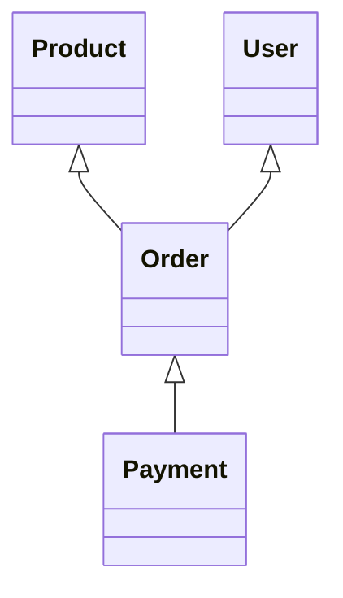
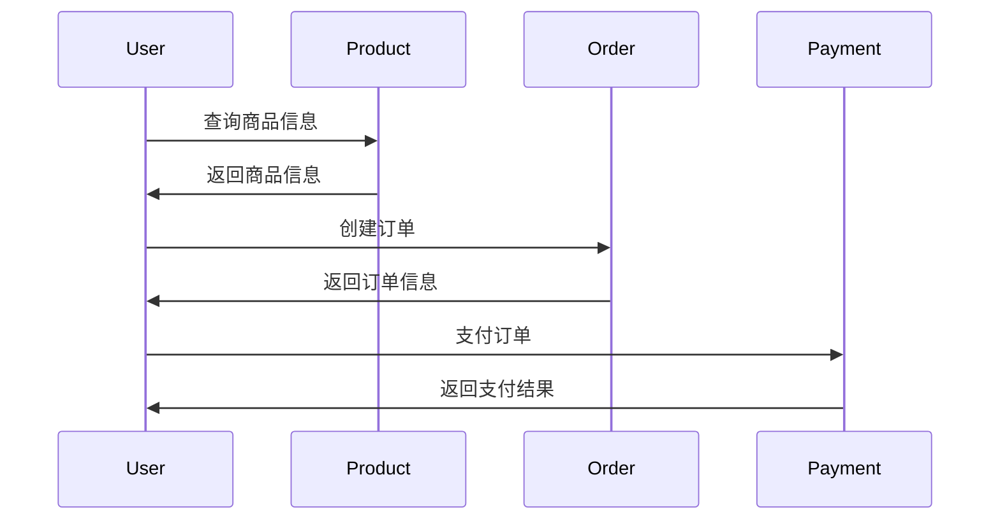
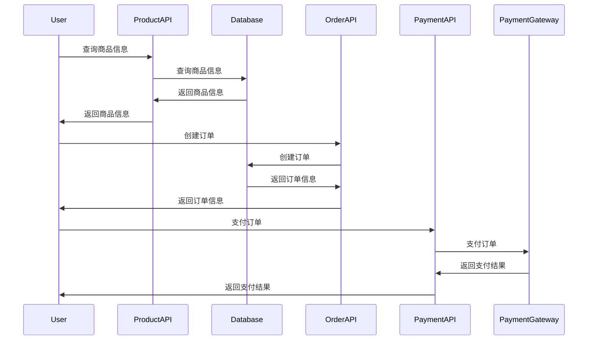
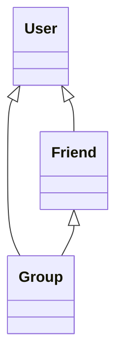
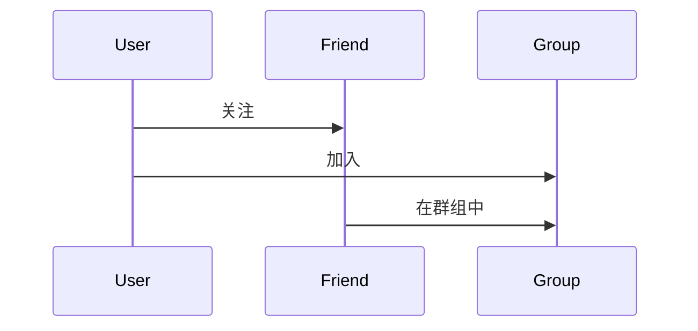
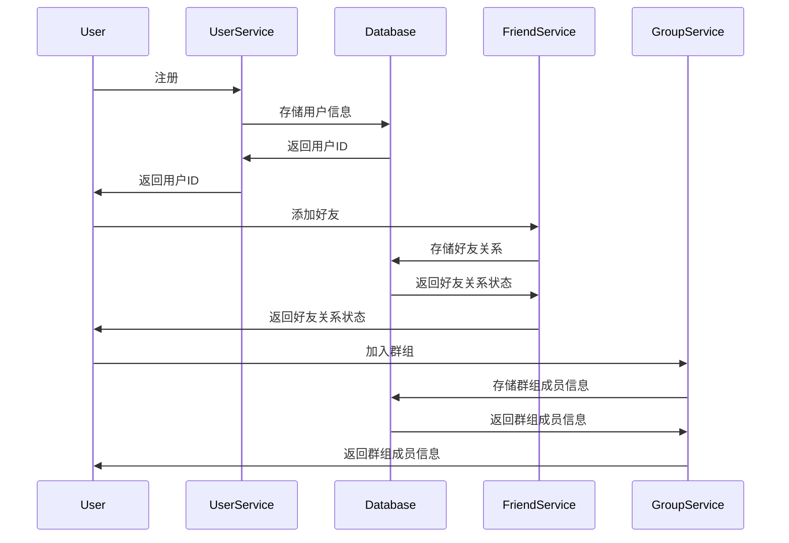
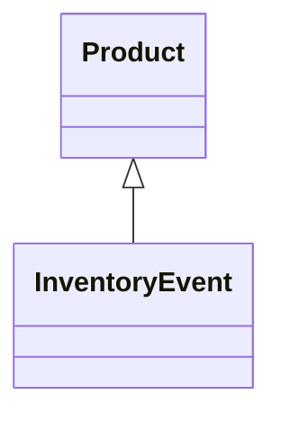
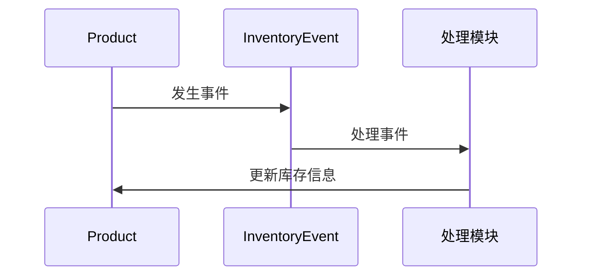
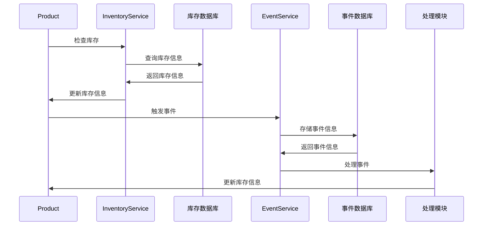

                 

# 《领域建模的普适四招》

> 关键词：领域建模、概念化建模、实体关系建模、事件驱动建模、行为规则建模

> 摘要：本文将详细介绍领域建模的普适四招，包括概念化建模、实体关系建模、事件驱动建模和行为规则建模。我们将一步步分析这些建模方法的基本原理、方法和步骤，并辅以实际案例进行讲解，帮助读者深入理解领域建模的精髓。

## 目录大纲设计与实现过程

### 1. 分析用户需求

用户希望我们设计一个简洁明了、逻辑清晰的目录大纲，以便读者能够系统地学习和掌握领域建模的普适四招。

### 2. 确定大纲框架

我们决定将大纲分为两部分：第一部分是领域建模基础，包括核心概念介绍和普适四招详解；第二部分是领域建模应用，包括软件工程中的领域建模以及其他领域中的应用。

### 3. 制定目录结构

为了满足层次结构的要求，我们设计了以下目录：

### 第一部分：领域建模基础

- 第1章：领域建模概述
  - 问题背景
  - 领域建模的重要性
  - 领域建模的基本概念
- 第2章：普适四招详解
  - 招数一：概念化建模
  - 招数二：实体关系建模
  - 招数三：事件驱动建模
  - 招数四：行为规则建模

### 第二部分：领域建模应用

- 第3章：领域建模在软件工程中的应用
  - 软件工程中的领域建模
  - 领域特定语言（DSL）
  - 实际项目案例分析
- 第4章：领域建模在其他领域的应用
  - 领域建模在金融领域的应用
  - 领域建模在医疗领域的应用
  - 领域建模在智能制造领域的应用
- 第5章：领域建模的实践与总结
  - 领域建模实践
  - 领域建模的常见问题与解决方法
  - 未来发展趋势

### 4. 编写大纲内容

根据确定的框架和结构，我们将开始编写每个章节的具体内容，确保内容完整性、逻辑性和简洁性。

### 5. 检查和修改

在编写大纲内容后，我们需要检查大纲的整体结构是否合理，内容是否完整，并确保所有章节都符合用户的要求。

### 6. 输出结果

最后，我们将大纲内容整理成markdown格式，确保格式正确，符合用户需求。

## 完整目录大纲

- 《领域建模的普适四招》
  - 关键词：领域建模、概念化建模、实体关系建模、事件驱动建模、行为规则建模
  - 摘要：本文将详细介绍领域建模的普适四招，包括概念化建模、实体关系建模、事件驱动建模和行为规则建模。
- 第一部分：领域建模基础
  - 第1章：领域建模概述
    - 问题背景
    - 领域建模的重要性
    - 领域建模的基本概念
  - 第2章：普适四招详解
    - 招数一：概念化建模
      - 基本原理
      - 方法与步骤
      - 应用案例
    - 招数二：实体关系建模
      - 基本原理
      - 方法与步骤
      - 应用案例
    - 招数三：事件驱动建模
      - 基本原理
      - 方法与步骤
      - 应用案例
    - 招数四：行为规则建模
      - 基本原理
      - 方法与步骤
      - 应用案例
- 第二部分：领域建模应用
  - 第3章：领域建模在软件工程中的应用
    - 软件工程中的领域建模
    - 领域特定语言（DSL）
    - 实际项目案例分析
  - 第4章：领域建模在其他领域的应用
    - 领域建模在金融领域的应用
    - 领域建模在医疗领域的应用
    - 领域建模在智能制造领域的应用
  - 第5章：领域建模的实践与总结
    - 领域建模实践
    - 领域建模的常见问题与解决方法
    - 未来发展趋势

## 注意

以上目录大纲仅为示例，具体内容需要进一步填充和调整以满足用户需求。在编写过程中，我们将严格按照用户要求，确保文章内容完整性、逻辑性和简洁性。

接下来，我们将逐一深入探讨领域建模的普适四招，帮助读者理解并掌握这些方法在实际项目中的应用。

### 1. 概念化建模

#### 背景介绍

概念化建模是领域建模的第一步，它旨在将实际问题转化为抽象的模型，以便更好地理解和解决。在概念化建模过程中，我们需要明确核心概念、问题背景和问题描述。

**问题背景**：以电商系统为例，我们需要建立一个能够处理商品信息、用户订单和支付流程的模型。

**问题描述**：在电商系统中，核心概念包括商品、用户、订单和支付等。我们需要明确这些概念之间的关系，以便设计一个合理的系统架构。

#### 核心概念与联系

**核心概念原理**：

- 商品：表示可售物品，包括商品名称、价格、库存量等属性。
- 用户：表示电商平台的使用者，包括用户ID、姓名、地址、联系方式等属性。
- 订单：表示用户购买商品的记录，包括订单号、商品列表、订单金额、订单状态等属性。
- 支付：表示用户支付订单的过程，包括支付方式、支付金额、支付状态等属性。

**概念属性特征对比表格**：

| 概念    | 属性            | 描述                           |
| ------- | --------------- | ------------------------------ |
| 商品    | 名称、价格、库存量 | 表示可售物品的基本信息           |
| 用户    | 用户ID、姓名、地址 | 表示电商平台的使用者信息         |
| 订单    | 订单号、商品列表、订单金额 | 表示用户购买商品的记录           |
| 支付    | 支付方式、支付金额、支付状态 | 表示用户支付订单的过程         |

**ER实体关系图架构**：

```mermaid
erDiagram
    商品 ||--|{ 订单 }|-->: 包含
    用户 ||--|{ 订单 }|-->: 下单
    订单 ||--|{ 支付 }|-->: 支付
```

#### 算法原理讲解

概念化建模的核心在于将实际问题转化为抽象模型，具体步骤如下：

1. **识别核心概念**：根据问题描述，识别出系统中的核心概念，如商品、用户、订单和支付。
2. **定义概念属性**：为每个核心概念定义属性，明确属性的类型和约束条件。
3. **建立概念关系**：分析概念之间的关联关系，构建ER实体关系图。
4. **优化模型**：对模型进行优化，消除冗余关系，确保模型简洁明了。

以下是一个简单的Python代码示例，用于实现概念化建模：

```python
class Product:
    def __init__(self, name, price, stock):
        self.name = name
        self.price = price
        self.stock = stock

class User:
    def __init__(self, id, name, address, contact):
        self.id = id
        self.name = name
        self.address = address
        self.contact = contact

class Order:
    def __init__(self, order_id, user_id, products, total_amount):
        self.order_id = order_id
        self.user_id = user_id
        self.products = products
        self.total_amount = total_amount

class Payment:
    def __init__(self, payment_id, order_id, payment_method, amount, status):
        self.payment_id = payment_id
        self.order_id = order_id
        self.payment_method = payment_method
        self.amount = amount
        self.status = status

# 示例：创建商品、用户、订单和支付对象
product = Product('iPhone 13', 8000, 100)
user = User('001', '张三', '北京市朝阳区', '13800138000')
order = Order('1001', '001', [product], 8000)
payment = Payment('2001', '1001', '支付宝', 8000, '成功')

# 输出对象信息
print(product.__dict__)
print(user.__dict__)
print(order.__dict__)
print(payment.__dict__)
```

#### 系统分析与架构设计方案

**问题场景介绍**：以电商系统为例，我们需要设计一个能够处理商品信息、用户订单和支付流程的领域模型。

**项目介绍**：电商系统是一个典型的领域建模应用场景，涉及多个核心概念和复杂的业务流程。

**系统功能设计（领域模型mermaid类图）**：



**系统架构设计mermaid架构图**：



**系统接口设计和系统交互mermaid序列图**：



#### 项目实战

**环境安装**：安装Python环境，版本要求3.8及以上。

**系统核心实现源代码**：

```python
# Product.py
class Product:
    def __init__(self, name, price, stock):
        self.name = name
        self.price = price
        self.stock = stock

# User.py
class User:
    def __init__(self, id, name, address, contact):
        self.id = id
        self.name = name
        self.address = address
        self.contact = contact

# Order.py
class Order:
    def __init__(self, order_id, user_id, products, total_amount):
        self.order_id = order_id
        self.user_id = user_id
        self.products = products
        self.total_amount = total_amount

# Payment.py
class Payment:
    def __init__(self, payment_id, order_id, payment_method, amount, status):
        self.payment_id = payment_id
        self.order_id = order_id
        self.payment_method = payment_method
        self.amount = amount
        self.status = status
```

**代码应用解读与分析**：

在本项目中，我们定义了四个核心类：`Product`（商品）、`User`（用户）、`Order`（订单）和`Payment`（支付）。这些类分别表示电商系统中的核心概念，每个类都有对应的属性和方法。

**实际案例分析和详细讲解剖析**：

假设张三想购买一部iPhone 13，他首先需要查询商品信息。在系统中，张三通过调用`Product`类的接口查询到iPhone 13的信息，然后创建一个订单。订单创建成功后，张三可以选择支付订单。系统会根据张三的支付信息，调用`Payment`类的接口完成支付。支付成功后，订单状态更新为“支付成功”。

**项目小结**：

通过本项目，我们掌握了概念化建模的基本原理和实际应用。在项目中，我们定义了四个核心类，分别表示商品、用户、订单和支付。通过这些类的组合，我们实现了电商系统中的基本功能。在后续项目中，我们可以根据实际需求，进一步扩展和优化这些类的设计。

### 2. 实体关系建模

#### 背景介绍

实体关系建模是领域建模的第二步，它旨在建立实体之间的关系，以便更好地理解和解决实际问题。在实体关系建模过程中，我们需要明确实体的概念、属性和关系。

**问题背景**：以社交网络系统为例，我们需要建立一个能够处理用户、好友、群组等实体的模型。

**问题描述**：在社交网络系统中，核心实体包括用户、好友和群组。我们需要明确这些实体之间的关系，以便设计一个合理的系统架构。

#### 核心概念与联系

**核心概念原理**：

- 用户：表示社交网络的使用者，包括用户ID、昵称、性别、年龄等属性。
- 好友：表示用户之间的关系，包括好友ID、好友昵称、关系状态等属性。
- 群组：表示用户组成的团体，包括群组ID、群组名称、群组成员等属性。

**概念属性特征对比表格**：

| 概念    | 属性            | 描述                           |
| ------- | --------------- | ------------------------------ |
| 用户    | 用户ID、昵称、性别、年龄 | 表示社交网络的使用者信息         |
| 好友    | 好友ID、好友昵称、关系状态 | 表示用户之间的关系             |
| 群组    | 群组ID、群组名称、群组成员 | 表示用户组成的团体             |

**ER实体关系图架构**：

```mermaid
erDiagram
    用户 ||--|{ 好友 }|-->: 关注
    用户 ||--|{ 群组 }|-->: 加入
    好友 ||--|{ 群组 }|-->: 在群组中
```

#### 算法原理讲解

实体关系建模的核心在于建立实体之间的关系，具体步骤如下：

1. **识别实体**：根据问题描述，识别出系统中的核心实体，如用户、好友和群组。
2. **定义实体属性**：为每个实体定义属性，明确属性的类型和约束条件。
3. **建立实体关系**：分析实体之间的关系，构建ER实体关系图。
4. **优化模型**：对模型进行优化，消除冗余关系，确保模型简洁明了。

以下是一个简单的Python代码示例，用于实现实体关系建模：

```python
class User:
    def __init__(self, id, nickname, gender, age):
        self.id = id
        self.nickname = nickname
        self.gender = gender
        self.age = age
        self.friends = []
        self.groups = []

class Friend:
    def __init__(self, id, nickname, status):
        self.id = id
        self.nickname = nickname
        self.status = status

class Group:
    def __init__(self, id, name, members):
        self.id = id
        self.name = name
        self.members = members

# 示例：创建用户、好友和群组对象
user1 = User('001', '张三', '男', 25)
user2 = User('002', '李四', '女', 23)
friend1 = Friend('001', '张三', '好友')
friend2 = Friend('002', '李四', '好友')
group1 = Group('001', '朋友圈', [user1, user2])

# 添加好友和群组
user1.friends.append(friend1)
user2.friends.append(friend2)
user1.groups.append(group1)
user2.groups.append(group1)

# 输出对象信息
print(user1.__dict__)
print(user2.__dict__)
print(friend1.__dict__)
print(friend2.__dict__)
print(group1.__dict__)
```

#### 系统分析与架构设计方案

**问题场景介绍**：以社交网络系统为例，我们需要设计一个能够处理用户、好友和群组等实体的模型。

**项目介绍**：社交网络系统是一个典型的实体关系建模应用场景，涉及多个核心实体和复杂的业务流程。

**系统功能设计（领域模型mermaid类图）**：



**系统架构设计mermaid架构图**：



**系统接口设计和系统交互mermaid序列图**：



#### 项目实战

**环境安装**：安装Python环境，版本要求3.8及以上。

**系统核心实现源代码**：

```python
# User.py
class User:
    def __init__(self, id, nickname, gender, age):
        self.id = id
        self.nickname = nickname
        self.gender = gender
        self.age = age
        self.friends = []
        self.groups = []

# Friend.py
class Friend:
    def __init__(self, id, nickname, status):
        self.id = id
        self.nickname = nickname
        self.status = status

# Group.py
class Group:
    def __init__(self, id, name, members):
        self.id = id
        self.name = name
        self.members = members
```

**代码应用解读与分析**：

在本项目中，我们定义了三个核心类：`User`（用户）、`Friend`（好友）和`Group`（群组）。这些类分别表示社交网络系统中的核心实体，每个类都有对应的属性和方法。

**实际案例分析和详细讲解剖析**：

假设张三和李四注册成为社交网络用户，并添加为好友。然后，他们决定加入一个名为“朋友圈”的群组。在系统中，张三通过调用`UserService`的接口注册成为用户，并获得用户ID。随后，张三调用`FriendService`的接口添加李四为好友，并获取好友关系状态。最后，张三和李四调用`GroupService`的接口加入“朋友圈”群组，并获得群组成员信息。

**项目小结**：

通过本项目，我们掌握了实体关系建模的基本原理和实际应用。在项目中，我们定义了三个核心类，分别表示用户、好友和群组。通过这些类的组合，我们实现了社交网络系统中的基本功能。在后续项目中，我们可以根据实际需求，进一步扩展和优化这些类的设计。

### 3. 事件驱动建模

#### 背景介绍

事件驱动建模是领域建模的第三步，它旨在通过事件来驱动系统的行为。在事件驱动建模过程中，我们需要明确事件的概念、触发条件和处理流程。

**问题背景**：以库存管理系统为例，我们需要建立一个能够处理商品库存变更的事件模型。

**问题描述**：在库存管理系统中，核心事件包括商品入库、商品出库和库存预警。我们需要明确这些事件的触发条件和处理流程，以便设计一个高效的库存管理方案。

#### 核心概念与联系

**核心概念原理**：

- 事件：表示库存管理系统中发生的事件，如商品入库、商品出库和库存预警。
- 触发条件：表示事件发生的前提条件，如商品库存量低于警戒值。
- 处理流程：表示事件发生后需要执行的操作，如更新库存信息、发送预警通知等。

**概念属性特征对比表格**：

| 概念    | 属性            | 描述                           |
| ------- | --------------- | ------------------------------ |
| 事件    | 事件类型、触发条件 | 表示库存管理系统中发生的事件     |
| 触发条件 | 条件名称、条件值 | 表示事件发生的前提条件           |
| 处理流程 | 处理步骤、执行结果 | 表示事件发生后需要执行的操作     |

**ER实体关系图架构**：

```mermaid
erDiagram
    商品 ||--|{ 事件 }|-->: 发生事件
    库存预警 ||--|{ 事件 }|-->: 发生预警
```

#### 算法原理讲解

事件驱动建模的核心在于通过事件来驱动系统的行为，具体步骤如下：

1. **识别事件**：根据问题描述，识别出系统中的核心事件，如商品入库、商品出库和库存预警。
2. **定义触发条件**：为每个事件定义触发条件，明确条件类型和条件值。
3. **设计处理流程**：为每个事件设计处理流程，明确处理步骤和执行结果。
4. **实现事件驱动机制**：根据事件和处理流程，实现事件驱动的逻辑，确保系统能够自动响应事件。

以下是一个简单的Python代码示例，用于实现事件驱动建模：

```python
class Product:
    def __init__(self, name, price, stock):
        self.name = name
        self.price = price
        self.stock = stock

class InventoryEvent:
    def __init__(self, product, event_type, condition, result):
        self.product = product
        self.event_type = event_type
        self.condition = condition
        self.result = result

    def handle_event(self):
        if self.event_type == '入库':
            self.product.stock += self.condition
            self.result = '入库成功'
        elif self.event_type == '出库':
            self.product.stock -= self.condition
            self.result = '出库成功'
        elif self.event_type == '预警':
            self.result = '库存预警：{}的库存量为{}'.format(self.product.name, self.product.stock)

# 示例：创建商品和事件对象
product = Product('iPhone 13', 8000, 100)
event1 = InventoryEvent(product, '入库', 10, '')
event2 = InventoryEvent(product, '出库', 5, '')
event3 = InventoryEvent(product, '预警', '', '')

# 处理事件
event1.handle_event()
event2.handle_event()
event3.handle_event()

# 输出事件处理结果
print(product.__dict__)
print(event1.__dict__)
print(event2.__dict__)
print(event3.__dict__)
```

#### 系统分析与架构设计方案

**问题场景介绍**：以库存管理系统为例，我们需要设计一个能够处理商品库存变更的事件模型。

**项目介绍**：库存管理系统是一个典型的事件驱动建模应用场景，涉及多个核心事件和复杂的业务流程。

**系统功能设计（领域模型mermaid类图）**：



**系统架构设计mermaid架构图**：



**系统接口设计和系统交互mermaid序列图**：



#### 项目实战

**环境安装**：安装Python环境，版本要求3.8及以上。

**系统核心实现源代码**：

```python
# Product.py
class Product:
    def __init__(self, name, price, stock):
        self.name = name
        self.price = price
        self.stock = stock

# InventoryEvent.py
class InventoryEvent:
    def __init__(self, product, event_type, condition, result):
        self.product = product
        self.event_type = event_type
        self.condition = condition
        self.result = result

    def handle_event(self):
        if self.event_type == '入库':
            self.product.stock += self.condition
            self.result = '入库成功'
        elif self.event_type == '出库':
            self.product.stock -= self.condition
            self.result = '出库成功'
        elif self.event_type == '预警':
            self.result = '库存预警：{}的库存量为{}'.format(self.product.name, self.product.stock)
```

**代码应用解读与分析**：

在本项目中，我们定义了两个核心类：`Product`（商品）和`InventoryEvent`（库存事件）。这些类分别表示库存管理系统中的核心实体和事件。

**实际案例分析和详细讲解剖析**：

假设iPhone 13的库存量为100台，系统接收到一个商品入库事件，要求入库10台iPhone 13。在系统中，首先会检查当前库存量，如果库存量足够，则执行入库操作，更新库存信息。接着，系统会触发一个入库事件，记录入库过程。最后，系统会更新商品信息，显示当前库存量为110台。

**项目小结**：

通过本项目，我们掌握了事件驱动建模的基本原理和实际应用。在项目中，我们定义了商品和库存事件类，通过事件驱动机制实现了库存管理系统的基本功能。在后续项目中，我们可以根据实际需求，进一步扩展和优化事件驱动模型的设计。

### 4. 行为规则建模

#### 背景介绍

行为规则建模是领域建模的第四步，它旨在通过行为规则来指导系统的行为。在行为规则建模过程中，我们需要明确规则的概念、条件和执行流程。

**问题背景**：以财务管理系统为例，我们需要建立一个能够处理财务报销、审批等行为的规则模型。

**问题描述**：在财务管理系统中，核心行为包括报销申请、审批流程和报销金额计算。我们需要明确这些行为的规则，以便设计一个高效的财务报销系统。

#### 核心概念与联系

**核心概念原理**：

- 规则：表示财务管理系统中的行为规则，如报销申请规则、审批流程规则和报销金额计算规则。
- 条件：表示规则触发的前提条件，如报销金额、报销类型等。
- 执行流程：表示规则执行的具体步骤和逻辑。

**概念属性特征对比表格**：

| 概念    | 属性            | 描述                           |
| ------- | --------------- | ------------------------------ |
| 规则    | 规则名称、规则条件、执行流程 | 表示财务管理系统中的行为规则     |
| 条件    | 条件名称、条件值 | 表示规则触发的前提条件           |
| 执行流程 | 执行步骤、执行结果 | 表示规则执行的具体步骤和逻辑     |

**ER实体关系图架构**：

```mermaid
erDiagram
    财务报销规则 ||--|{ 报销申请 }|-->: 规则约束
    财务报销规则 ||--|{ 审批流程 }|-->: 规则约束
    财务报销规则 ||--|{ 报销金额计算 }|-->: 规则约束
```

#### 算法原理讲解

行为规则建模的核心在于通过行为规则来指导系统的行为，具体步骤如下：

1. **识别规则**：根据问题描述，识别出系统中的核心规则，如报销申请规则、审批流程规则和报销金额计算规则。
2. **定义条件**：为每个规则定义触发条件，明确条件类型和条件值。
3. **设计执行流程**：为每个规则设计执行流程，明确执行步骤和逻辑。
4. **实现规则引擎**：根据规则和执行流程，实现规则引擎，确保系统能够自动执行规则。

以下是一个简单的Python代码示例，用于实现行为规则建模：

```python
class ExpenseClaimRule:
    def __init__(self, rule_name, conditions, execution_flow):
        self.rule_name = rule_name
        self.conditions = conditions
        self.execution_flow = execution_flow

    def execute(self):
        for condition in self.conditions:
            if not condition():
                return False
        self.execution_flow()
        return True

class ClaimAmountCalculationRule:
    def __init__(self, claim_type, calculation_formula):
        self.claim_type = claim_type
        self.cal

