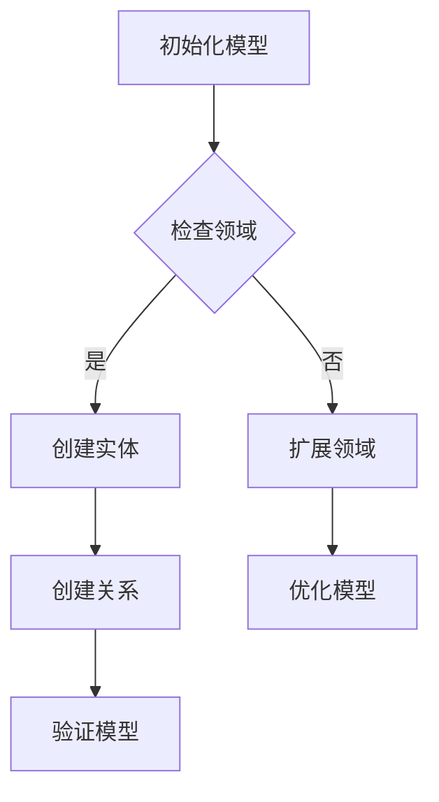
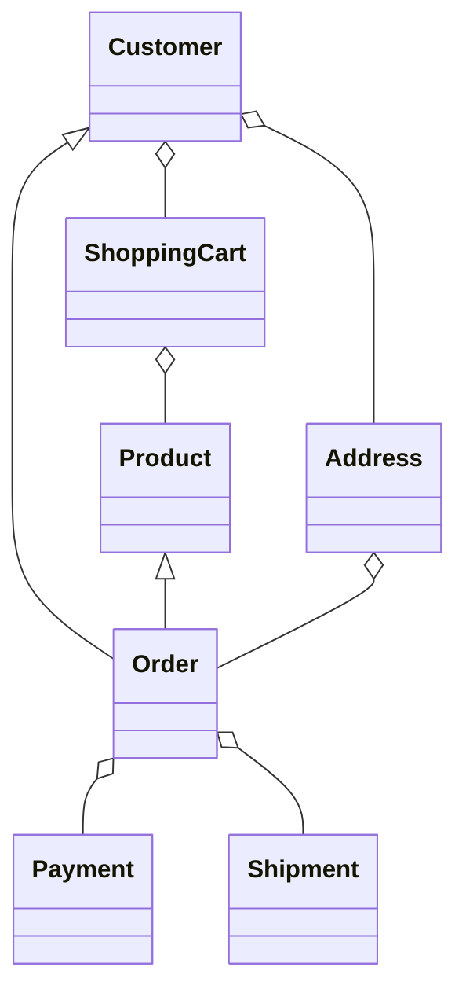

                 

### 领域建模：技术人都该是设计师

关键词：领域建模、软件开发、设计原则、系统架构、算法原理

摘要：随着软件系统的复杂性日益增加，领域建模作为一种系统设计和开发方法，正逐渐成为技术人员的必备技能。本文将深入探讨领域建模的基本概念、核心原理以及应用方法，帮助读者理解并掌握这一关键技术。

## 第一部分：领域建模的基本概念

### 第1章：背景介绍

#### 1.1 问题背景

在当今的软件开发领域中，随着项目的复杂性不断增加，传统的面向过程的开发方法已经逐渐显示出其局限性。为了更好地应对这种挑战，领域建模成为了一种重要的设计方法，它能够帮助开发人员更好地理解和设计复杂系统。

#### 1.2 问题描述

领域建模是一种用于软件系统设计和开发的方法，它通过创建抽象模型来描述系统中的关键领域和概念，以便更好地理解和设计复杂系统。领域建模涉及到多个方面的内容，包括核心概念、领域模型、设计原则等。

#### 1.3 问题解决

领域建模能够帮助开发人员更好地理解系统需求，提高系统的可维护性和扩展性。通过创建领域模型，开发人员可以更加清晰地定义系统的业务逻辑和功能，从而降低系统的复杂度，提高开发效率。

#### 1.4 边界与外延

领域建模的定义和应用范围比较广泛，它不仅适用于软件系统设计，还可以应用于企业信息化建设、产品设计和开发等多个领域。领域建模的核心要素包括领域知识、领域模型、设计原则和方法等。

#### 1.5 概念结构与核心要素组成

领域建模的核心概念包括领域、领域模型、领域专家等。领域是指系统所涉及的特定业务领域，领域模型是用于描述领域概念和关系的抽象模型，领域专家则是具有特定领域知识和经验的专家。领域建模的方法主要包括UML（统一建模语言）、实体关系模型等。

---

### 第2章：核心概念与联系

#### 2.1 领域概念

领域是指系统所涉及的特定业务领域，它定义了系统的上下文和范围。领域通常由一组相关的业务过程、功能和数据组成。

#### 2.2 领域模型

领域模型是用于描述领域概念和关系的抽象模型。它通常使用UML（统一建模语言）来表示，包括用例图、类图、序列图等。

#### 2.3 设计原则

领域建模的设计原则包括抽象、模块化、层次化、可扩展性等。这些原则有助于提高领域模型的清晰度和可维护性。

#### 2.4 概念属性特征对比表格

在领域建模中，概念属性特征对比表格是一种常用的工具，用于比较不同概念之间的属性特征。以下是一个简单的例子：

| 概念 | 属性1 | 属性2 | 属性3 |
| --- | --- | --- | --- |
| A | 1 | 2 | 3 |
| B | 4 | 5 | 6 |

#### 2.5 ER实体关系图架构

ER实体关系图是一种用于表示领域模型中实体和关系的图形化工具。以下是一个简单的ER实体关系图示例：

```mermaid
erDiagram
  A ||--o{ B } : "has"
  A ||--|{ C } : "is"
  B ||--o{ D } : "has"
  C ||--|{ D } : "is"
```

---

## 第二部分：领域建模的深入探讨

### 第3章：算法原理讲解

#### 3.1 算法原理概述

领域建模中的算法原理主要涉及领域模型的构建、优化和验证等过程。以下将介绍几个常用的算法原理。

#### 3.2 算法mermaid流程图

以下是一个简单的领域模型构建算法的mermaid流程图示例：



#### 3.3 算法Python源代码

以下是一个简单的Python源代码示例，用于构建一个简单的领域模型：

```python
class Entity:
    def __init__(self, name, attributes):
        self.name = name
        self.attributes = attributes

class Relationship:
    def __init__(self, name, entities):
        self.name = name
        self.entities = entities

def create_entity(name, attributes):
    return Entity(name, attributes)

def create_relationship(name, entities):
    return Relationship(name, entities)

def build_model(entities, relationships):
    model = {}
    for entity in entities:
        model[entity.name] = entity
    for relationship in relationships:
        model[relationship.name] = relationship
    return model
```

#### 3.4 算法原理详细讲解

领域建模的算法原理涉及多个方面，包括领域模型的构建、优化和验证等过程。下面将详细讲解这些算法原理。

##### 3.4.1 领域模型的构建

领域模型的构建是领域建模的核心步骤。它涉及到以下过程：

1. **领域分析**：通过对领域进行深入分析，确定领域的关键概念和关系。
2. **实体创建**：根据领域分析的结果，创建领域模型中的实体。实体是领域模型中的核心概念，用于表示领域中的对象。
3. **关系创建**：确定实体之间的关系，并创建相应的实体关系。
4. **模型验证**：对构建的领域模型进行验证，确保模型能够准确描述领域中的概念和关系。

以下是一个简单的领域模型构建的数学模型：

$$
\text{领域模型} = \{\text{实体}_1, \text{实体}_2, ..., \text{实体}_n\} \cup \{\text{关系}_1, \text{关系}_2, ..., \text{关系}_m\}
$$

其中，实体和关系分别表示领域模型中的对象和它们之间的关系。

##### 3.4.2 领域模型的优化

领域模型的优化是提高模型可维护性和可扩展性的关键步骤。以下是一些常见的优化方法：

1. **模块化**：将领域模型划分为多个模块，每个模块负责一个特定的子领域。这种方法有助于降低模型的复杂度，提高可维护性。
2. **层次化**：将领域模型组织成层次结构，顶层表示核心概念，底层表示具体实现细节。这种方法有助于提高模型的抽象级别，降低实现复杂性。
3. **泛化与 specialization**：通过泛化（generalization）和 specialization（特化）关系，将具有相似属性的实体和关系进行分类和组织。这种方法有助于提高模型的复用性。

以下是一个简单的领域模型优化的数学模型：

$$
\text{优化模型} = \{\text{模块}_1, \text{模块}_2, ..., \text{模块}_k\}
$$

其中，模块表示领域模型的子结构。

##### 3.4.3 领域模型的验证

领域模型的验证是确保模型能够准确描述领域中的概念和关系的必要步骤。以下是一些常见的验证方法：

1. **一致性检查**：检查领域模型中的实体和关系是否一致。例如，确保实体的属性和关系之间的关联关系正确。
2. **完整性检查**：检查领域模型是否包含所有的关键概念和关系。例如，确保所有的实体都有相应的属性和关系。
3. **正确性检查**：检查领域模型是否能够准确地描述领域中的业务逻辑。例如，确保领域模型能够正确地处理业务规则和约束条件。

以下是一个简单的领域模型验证的数学模型：

$$
\text{验证模型} = \{\text{实体}_1, \text{实体}_2, ..., \text{实体}_n\} \cup \{\text{关系}_1, \text{关系}_2, ..., \text{关系}_m\}
$$

其中，实体和关系分别表示领域模型中的对象和它们之间的关系。

---

### 第4章：系统分析与架构设计

#### 4.1 问题场景介绍

在现代软件开发中，系统分析与架构设计是一个至关重要的环节。以下是一个常见的问题场景：

- **需求分析**：某电商公司需要开发一个在线购物系统，包括用户注册、商品浏览、购物车、订单管理等功能。
- **架构设计**：需要设计一个高效、可扩展的系统架构，以支持系统的长期发展。

#### 4.2 项目介绍

本案例将开发一个简单的在线购物系统，包括用户注册、商品浏览、购物车、订单管理等功能。系统将采用MVC（模型-视图-控制器）架构，使用Python作为后端开发语言，前端采用HTML、CSS和JavaScript。

#### 4.3 系统功能设计（领域模型）

以下是一个简单的领域模型，用于描述在线购物系统中的关键概念和关系：



#### 4.4 系统架构设计

以下是一个简单的系统架构设计，用于描述在线购物系统的组件和交互：

```mermaid
sequenceDiagram
    Customer ->> Web Server: 登录/注册请求
    Web Server ->> Authentication Service: 验证请求
    Authentication Service ->> Database: 查询用户信息
    Database ->> Web Server: 返回用户信息
    Web Server ->> Customer: 登录/注册结果
    Customer ->> Web Server: 商品浏览请求
    Web Server ->> Product Service: 获取商品信息
    Product Service ->> Database: 查询商品信息
    Database ->> Product Service: 返回商品信息
    Product Service ->> Web Server: 返回商品信息
    Web Server ->> Customer: 商品浏览结果
    Customer ->> Web Server: 添加商品到购物车请求
    Web Server ->> Shopping Cart Service: 添加商品请求
    Shopping Cart Service ->> Database: 更新购物车信息
    Database ->> Shopping Cart Service: 返回更新结果
    Shopping Cart Service ->> Web Server: 返回更新结果
    Web Server ->> Customer: 添加商品到购物车结果
    Customer ->> Web Server: 提交订单请求
    Web Server ->> Order Service: 创建订单请求
    Order Service ->> Database: 创建订单
    Database ->> Order Service: 返回订单信息
    Order Service ->> Web Server: 返回订单信息
    Web Server ->> Customer: 提交订单结果
endsequence
```

#### 4.5 系统接口设计和系统交互

以下是一个简单的系统接口设计和系统交互，用于描述在线购物系统中的接口和交互：

```mermaid
interface Customer {
    login(): void
    register(): void
    browseProducts(): Product[]
    addToShoppingCart(Product product): void
    placeOrder(): Order
}

interface ProductService {
    getProductById(id: int): Product
    getAllProducts(): Product[]
}

interface ShoppingCartService {
    addProduct(product: Product): void
    removeProduct(product: Product): void
    getShoppingCart(): ShoppingCart
}

interface OrderService {
    createOrder(order: Order): void
    getOrderById(id: int): Order
    updateOrder(order: Order): void
    deleteOrder(id: int): void
}

interface PaymentService {
    processPayment(payment: Payment): PaymentResult
}

interface ShipmentService {
    shipOrder(order: Order): void
}

class ShoppingCart {
    products: Product[]
    customer: Customer
}

class Order {
    id: int
    customer: Customer
    products: Product[]
    payment: Payment
    shipment: Shipment
}

class Payment {
    id: int
    amount: float
    status: PaymentStatus
}

class Shipment {
    id: int
    status: ShipmentStatus
}

enum PaymentStatus {
    PENDING,
    COMPLETED,
    FAILED
}

enum ShipmentStatus {
    PENDING,
    SHIPPED,
    DELIVERED
}
```

---

### 第5章：项目实战

#### 5.1 环境安装

在本案例中，我们将使用Python和Django框架来开发在线购物系统。首先需要安装Python和Django框架：

1. 安装Python：从官方网站下载并安装Python。
2. 安装Django：在命令行中运行`pip install django`。

#### 5.2 系统核心实现源代码

以下是一个简单的在线购物系统核心实现源代码：

```python
# models.py
from django.db import models
from django.contrib.auth.models import User

class Customer(models.Model):
    user = models.OneToOneField(User, on_delete=models.CASCADE)
    address = models.ForeignKey('Address', on_delete=models.CASCADE)

class Address(models.Model):
    street = models.CharField(max_length=100)
    city = models.CharField(max_length=50)
    state = models.CharField(max_length=50)
    zip_code = models.CharField(max_length=10)

class Product(models.Model):
    name = models.CharField(max_length=100)
    price = models.FloatField()
    description = models.TextField()

class ShoppingCart(models.Model):
    customer = models.OneToOneField(Customer, on_delete=models.CASCADE)
    products = models.ManyToManyField(Product)

class Order(models.Model):
    customer = models.ForeignKey(Customer, on_delete=models.CASCADE)
    products = models.ManyToManyField(Product)
    payment = models.ForeignKey('Payment', on_delete=models.CASCADE)
    shipment = models.ForeignKey('Shipment', on_delete=models.CASCADE)

class Payment(models.Model):
    amount = models.FloatField()
    status = models.CharField(max_length=50)

class Shipment(models.Model):
    status = models.CharField(max_length=50)
```

#### 5.3 代码应用解读与分析

以上代码定义了在线购物系统的核心模型，包括客户、地址、商品、购物车、订单、支付和配送等。这些模型分别对应领域模型中的关键概念和关系。

1. **客户（Customer）**：客户是系统的核心用户，用于表示用户信息。客户模型与用户模型进行关联，以便使用Django的认证系统。
2. **地址（Address）**：地址模型用于表示客户的收货地址。
3. **商品（Product）**：商品模型用于表示系统中的商品信息。
4. **购物车（ShoppingCart）**：购物车模型用于表示客户的购物车，与商品模型进行关联，以便管理购物车中的商品。
5. **订单（Order）**：订单模型用于表示客户的订单信息，与客户、商品、支付和配送模型进行关联，以便管理订单的整个生命周期。
6. **支付（Payment）**：支付模型用于表示订单的支付信息。
7. **配送（Shipment）**：配送模型用于表示订单的配送信息。

#### 5.4 实际案例分析和详细讲解剖析

以下是一个简单的实际案例，用于分析并讲解在线购物系统的核心实现：

- **客户注册**：当客户注册时，首先需要创建客户模型，并将其与用户模型进行关联。注册成功后，客户可以登录系统，并浏览商品。
- **商品浏览**：当客户浏览商品时，系统会从数据库中查询商品信息，并将其展示给客户。客户可以选择商品并添加到购物车。
- **购物车管理**：客户可以将商品添加到购物车，也可以从购物车中删除商品。购物车模型与商品模型进行关联，以便管理购物车中的商品。
- **订单提交**：当客户准备下单时，系统会创建订单模型，并将其与客户、购物车、支付和配送模型进行关联。订单创建成功后，客户可以查看订单详情。
- **支付处理**：系统会调用支付模型，处理订单的支付信息。支付成功后，系统会更新订单状态，并创建配送模型，以便管理订单的配送信息。

通过以上实际案例，可以清晰地看到在线购物系统的核心实现和业务逻辑。

#### 5.5 项目小结

在本案例中，我们通过领域建模的方法，设计并实现了在线购物系统。领域建模帮助我们清晰地定义了系统中的关键概念和关系，提高了系统的可维护性和可扩展性。通过实际案例的分析和讲解，我们深入了解了领域建模的应用方法和实践技巧。领域建模是软件开发中不可或缺的一部分，技术人员都应该掌握这一关键技能。

---

## 最佳实践 Tips

1. **深入理解领域**：在进行领域建模之前，一定要对领域有深入的理解，包括领域中的关键概念、关系和业务逻辑。
2. **遵循设计原则**：在构建领域模型时，一定要遵循抽象、模块化、层次化、可扩展性等设计原则，以提高模型的清晰度和可维护性。
3. **验证模型**：在构建领域模型后，一定要对模型进行验证，确保模型能够准确地描述领域中的概念和关系。
4. **持续迭代**：领域建模是一个持续迭代的过程，要根据实际需求和市场变化，不断调整和优化模型。

## 小结

领域建模是软件开发中不可或缺的一部分，它能够帮助我们更好地理解和设计复杂系统。通过本文的深入探讨，我们了解了领域建模的基本概念、核心原理和应用方法。领域建模不仅能够提高系统的可维护性和可扩展性，还能够降低系统的复杂度，提高开发效率。作为一名技术人员，掌握领域建模的技能是非常重要的。

## 注意事项

1. **领域分析的重要性**：在进行领域建模之前，一定要进行深入的分析，确保对领域有清晰的理解。
2. **模型验证的必要性**：在构建领域模型后，一定要对模型进行验证，确保模型能够准确地描述领域中的概念和关系。

## 拓展阅读

1. 《领域驱动设计》 - Eric Evans
2. 《设计模式：可复用的面向对象软件的基础》 - Erich Gamma等
3. 《架构风格与设计模式》 - Martin Fowler

作者：AI天才研究院/AI Genius Institute & 禅与计算机程序设计艺术 /Zen And The Art of Computer Programming

本文由AI天才研究院和禅与计算机程序设计艺术联合撰写，旨在为广大技术人员提供深入的技术分析和实战指导。感谢您的阅读，希望本文对您的学习和实践有所帮助。如果您有任何疑问或建议，欢迎在评论区留言交流。我们将持续为您带来更多优质内容。|

