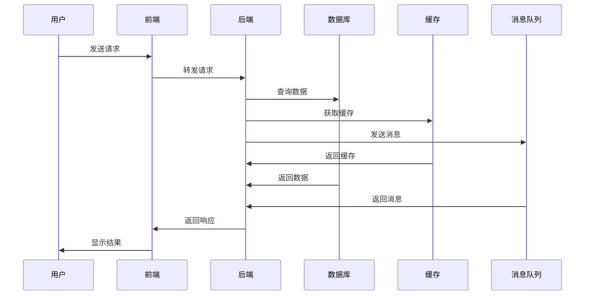
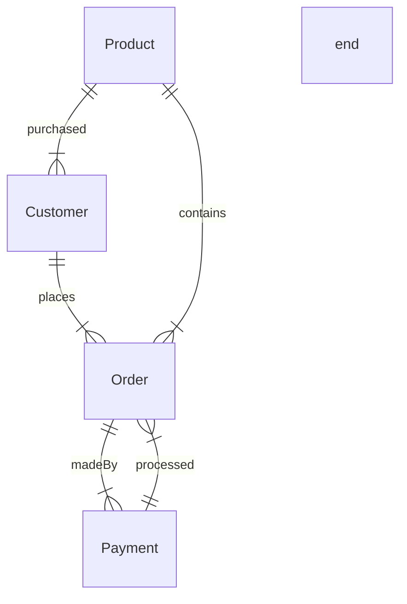
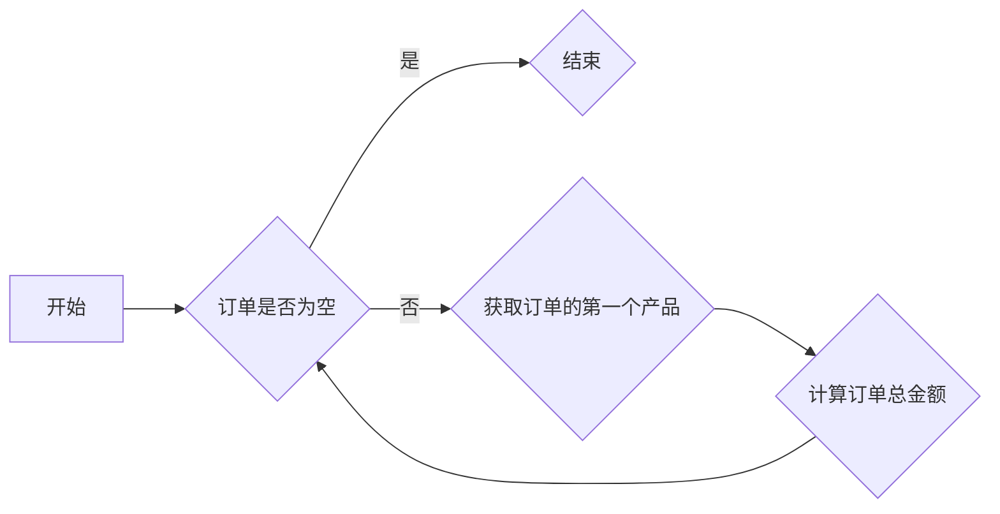

                 


### 第1章：领域模型也有软肋

> 关键词：领域模型、软件复杂度、可扩展性、可复用性、互操作性

> 摘要：领域模型作为软件开发中的重要工具，虽然提供了抽象和封装，但同时也存在一些不可忽视的软肋。本文将探讨领域模型的背景、挑战及其解决策略，帮助开发者更好地理解和应对这些软肋。

## 第1章：领域模型也有软肋

### 1.1 引言

领域模型（Domain Model）在软件开发中具有至关重要的地位。它是一种用于描述特定业务领域概念和关系的抽象模型，旨在简化软件设计和开发过程。通过领域模型，开发人员可以更清晰地理解业务需求，并构建出更加符合实际业务场景的软件系统。

然而，随着软件系统复杂性的不断增加，领域模型也面临着诸多挑战。这些挑战不仅影响了领域模型的有效性和可维护性，还可能对整个软件项目的成功产生负面影响。本文将深入探讨领域模型背后的软肋，并提出相应的解决策略。

### 1.2 领域模型的背景

领域模型的概念最早由Martin Fowler和Eric Evans等知名软件工程师提出。他们主张将软件开发过程中的通用性和业务需求结合起来，通过领域模型来实现这一目标。领域模型的主要目的是将复杂的业务场景抽象为一种简洁、直观的模型，以便开发人员更好地理解和实现业务逻辑。

在软件开发中，领域模型通常包括以下几个核心概念：

- **实体（Entity）**：表示现实世界中具有独立存在的对象，如用户、订单、产品等。
- **属性（Attribute）**：表示实体的特征或状态，如用户的年龄、订单的金额等。
- **关系（Relationship）**：表示实体之间的关联，如用户可以下单购买产品，订单包含多个产品等。
- **行为（Behavior）**：表示实体可以执行的操作，如用户的登录、订单的支付等。

通过这些核心概念，领域模型能够对业务领域进行抽象，从而为软件开发提供强有力的支持。

### 1.3 问题背景

随着互联网和云计算的快速发展，软件系统变得越来越庞大和复杂。传统的软件开发方法已无法满足现代软件系统的高可扩展性、高灵活性和高可维护性的需求。领域模型作为一种更接近业务需求的抽象方法，应运而生。

然而，领域模型在实际应用中也暴露出一些问题。首先，领域模型过于庞大和复杂，导致理解和维护的难度增加。其次，领域模型的可扩展性和可复用性较差，使得在新的业务场景下难以快速适应。此外，领域模型在不同系统之间的互操作性也存在问题。这些问题的存在，使得领域模型在软件开发中的应用面临诸多挑战。

### 1.4 问题描述

领域模型的软肋主要体现在以下几个方面：

#### 1.4.1 复杂性

随着业务需求的变化，领域模型会变得越来越复杂。这导致开发人员在理解和维护领域模型时面临巨大的困难。例如，一个简单的电商平台，可能会涉及到用户、订单、产品、库存等多个实体，以及它们之间的复杂关系。这无疑增加了开发人员的认知负担，降低了开发效率。

#### 1.4.2 可扩展性

领域模型在应对新的业务场景时，可能需要修改原有模型，从而导致模型的扩展性不足。例如，假设一个电商平台需要新增一个“积分系统”，这个系统需要与原有的用户、订单等实体进行整合。如果领域模型的可扩展性较差，开发人员可能需要修改大量代码，甚至重新设计模型。

#### 1.4.3 可复用性

领域模型在多个系统之间共享时，可能存在不一致性和兼容性问题。例如，两个不同的电商平台，可能会使用不同的领域模型来描述业务场景。这导致在整合两个系统时，需要额外的努力来确保模型的一致性和兼容性。

#### 1.4.4 互操作性

不同系统之间的领域模型可能无法无缝集成，导致数据交换和流程协调的困难。例如，一个电商平台可能需要与支付系统进行集成，实现订单支付功能。如果两个系统的领域模型无法相互理解，开发人员需要编写额外的代码来处理数据交换和流程协调。

### 1.5 问题解决

为了解决领域模型的这些软肋，我们可以从以下几个方面入手：

#### 1.5.1 简化模型结构

通过优化领域模型的结构，减少冗余信息和复杂的关联关系，提高模型的可理解性。例如，可以将复杂的实体拆分为更小的、功能更单一的实体，从而降低模型的复杂度。

#### 1.5.2 提高可扩展性

采用模块化设计方法，将领域模型拆分为更小的模块，便于在新的业务场景下进行扩展。例如，将用户、订单、产品等实体拆分为独立的模块，每个模块都可以独立开发、测试和部署。

#### 1.5.3 增强可复用性

设计统一的领域模型规范，确保不同系统之间的领域模型具有一致性，提高可复用性。例如，制定一套统一的实体、属性、关系和行为规范，确保不同系统在实现领域模型时遵循相同的规范。

#### 1.5.4 提升互操作性

采用标准化技术，如RESTful API和GraphQL，实现不同系统之间的无缝集成。例如，使用RESTful API实现不同系统之间的数据交换，使用GraphQL实现灵活的查询和更新操作。

### 1.6 边界与外延

领域模型在软件开发中的应用范围广泛，包括但不限于企业应用、Web应用、移动应用和物联网应用等。然而，领域模型并非适用于所有场景，例如在极端简单的应用场景下，领域模型可能过于复杂。

### 1.7 概念结构与核心要素组成

领域模型的核心要素包括实体、属性、关系和行为。这些要素共同构成了领域模型的基本框架，为软件开发提供了坚实的理论基础。

- **实体**：表示业务对象，如用户、订单、产品等。
- **属性**：表示实体的特征，如用户的年龄、订单的金额等。
- **关系**：表示实体之间的关联，如用户可以下单购买产品，订单包含多个产品等。
- **行为**：表示实体可以执行的操作，如用户的登录、订单的支付等。

### 1.8 本章小结

本章介绍了领域模型的背景与挑战，分析了领域模型在实际应用中面临的软肋，并提出了相应的解决方案。在后续章节中，我们将深入探讨领域模型的设计与实现方法，以及在实际项目中的应用经验。

## 作者

作者：AI天才研究院/AI Genius Institute & 禅与计算机程序设计艺术 /Zen And The Art of Computer Programming

----------------------------------------------------------------

### 第2章：领域模型的设计原则与最佳实践

#### 2.1 设计原则

在设计领域模型时，应遵循以下原则：

- **单一职责原则**：每个实体、属性、关系和行为都应具有单一职责，避免过度耦合。
- **最小化耦合原则**：尽量减少实体、属性、关系和行为之间的耦合，提高模块的独立性。
- **高内聚原则**：每个模块内部应具有较高的内聚度，确保模块的功能单一、逻辑清晰。
- **可扩展性原则**：设计领域模型时，应考虑未来的扩展需求，确保模型具有良好的扩展性。
- **可复用性原则**：设计领域模型时，应考虑模型的复用性，避免重复造轮子。

#### 2.2 最佳实践

在实际开发中，可以采用以下最佳实践来设计领域模型：

- **使用类图表示领域模型**：使用统一建模语言（UML）中的类图来表示领域模型，使模型更加直观、易于理解。
- **定义明确的实体和属性**：为每个实体和属性定义明确的含义和约束条件，确保模型的一致性和完整性。
- **使用设计模式**：运用设计模式来优化领域模型的设计，如工厂模式、观察者模式等，提高模型的可扩展性和可维护性。
- **模块化设计**：将领域模型拆分为独立的模块，每个模块负责实现特定的业务功能，提高代码的复用性和可维护性。
- **文档化**：编写详细的文档，包括领域模型的定义、用途、约束条件等，帮助开发人员更好地理解和维护模型。

#### 2.3 设计示例

以下是一个简单的电商领域模型设计示例：

```mermaid
classDiagram
    Customer <<entity>>
    Order <<entity>>
    Product <<entity>>
    Customer *--* Order : places
    Order *--* Product : contains
    Product *--* Customer : purchased

    Customer {
        -id: Integer
        -name: String
        -age: Integer
    }

    Order {
        -id: Integer
        -orderDate: Date
        -totalAmount: Double
    }

    Product {
        -id: Integer
        -productName: String
        -price: Double
    }

    Customer relationship Customer placingOrder : Order
    Order relationship Order containingProduct : Product
    Product relationship Product purchasedByCustomer : Customer
endclassDiagram
```

在这个示例中，我们定义了三个实体：Customer（用户）、Order（订单）和Product（产品）。它们之间的关系如下：

- 用户可以下单购买订单。
- 订单可以包含多个产品。
- 产品可以被多个用户购买。

#### 2.4 本章小结

本章介绍了领域模型的设计原则和最佳实践，通过具体的示例展示了如何设计一个简单的电商领域模型。在后续章节中，我们将进一步探讨领域模型在实际项目中的应用和实现方法。

## 作者

作者：AI天才研究院/AI Genius Institute & 禅与计算机程序设计艺术 /Zen And The Art of Computer Programming

----------------------------------------------------------------

### 第3章：领域模型的实现与优化

#### 3.1 实现方法

领域模型的实现通常涉及以下几个步骤：

1. **定义领域模型**：根据业务需求和领域分析，定义领域模型中的实体、属性、关系和行为。
2. **设计数据库模型**：将领域模型映射到数据库模型，包括表结构、字段定义、索引等。
3. **实现领域服务**：编写领域服务代码，负责处理业务逻辑和数据操作。
4. **集成领域模型**：将领域模型集成到应用程序中，确保应用程序能够正确地使用领域模型。

#### 3.2 实现示例

以下是一个简单的电商领域模型实现示例：

```python
# 定义用户实体
class Customer:
    def __init__(self, id, name, age):
        self.id = id
        self.name = name
        self.age = age

# 定义订单实体
class Order:
    def __init__(self, id, order_date, total_amount):
        self.id = id
        self.order_date = order_date
        self.total_amount = total_amount
        self.products = []

    def add_product(self, product):
        self.products.append(product)

# 定义产品实体
class Product:
    def __init__(self, id, product_name, price):
        self.id = id
        self.product_name = product_name
        self.price = price

# 实现领域服务
class DomainService:
    def create_customer(self, name, age):
        # 创建用户
        pass

    def create_order(self, customer_id, order_date, total_amount):
        # 创建订单
        pass

    def add_product_to_order(self, order_id, product_id):
        # 向订单中添加产品
        pass

    def calculate_total_amount(self, order):
        # 计算订单总金额
        total = 0
        for product in order.products:
            total += product.price
        return total
```

在这个示例中，我们定义了三个实体：Customer、Order和Product。同时，我们还实现了一个领域服务类DomainService，用于处理业务逻辑和数据操作。

#### 3.3 优化策略

在实现领域模型时，为了提高系统的性能和可维护性，可以采用以下优化策略：

1. **缓存策略**：对于频繁访问的数据，可以使用缓存技术来提高访问速度。例如，可以使用Redis缓存用户信息和订单信息。
2. **分布式数据库**：对于大型系统，可以考虑使用分布式数据库来提高系统的扩展性和性能。例如，可以使用MySQL Cluster或MongoDB等分布式数据库。
3. **垂直和水平拆分**：通过垂直拆分和水平拆分，可以将大型数据库拆分为多个较小的数据库，从而提高系统的性能和可维护性。
4. **异步处理**：对于耗时的操作，可以使用异步处理技术来提高系统的响应速度。例如，可以使用消息队列（如RabbitMQ）来实现异步处理。
5. **代码优化**：通过优化代码，可以减少系统的内存占用和CPU使用率。例如，可以使用更高效的算法和数据结构，减少不必要的内存分配和释放。

#### 3.4 实现示例（优化版）

以下是一个简单的电商领域模型实现示例（优化版），使用了缓存和异步处理技术：

```python
import asyncio
import aiormq
import redis

# Redis客户端
redis_client = redis.StrictRedis(host='localhost', port=6379, db=0)

# RabbitMQ连接
conn = aiormq.Connection("localhost")
channel = conn.channel()

# 定义用户实体
class Customer:
    def __init__(self, id, name, age):
        self.id = id
        self.name = name
        self.age = age

# 定义订单实体
class Order:
    def __init__(self, id, order_date, total_amount):
        self.id = id
        self.order_date = order_date
        self.total_amount = total_amount
        self.products = []

    def add_product(self, product):
        self.products.append(product)

# 定义产品实体
class Product:
    def __init__(self, id, product_name, price):
        self.id = id
        self.product_name = product_name
        self.price = price

# 实现领域服务
class DomainService:
    @staticmethod
    async def create_customer(name, age):
        # 创建用户
        customer = Customer(name, age)
        # 使用RabbitMQ发送消息
        await channel.basic_publish(
            body=json.dumps(customer.__dict__),
            exchange='',
            routing_key='customer.create'
        )

    @staticmethod
    async def create_order(customer_id, order_date, total_amount):
        # 创建订单
        order = Order(customer_id, order_date, total_amount)
        # 使用RabbitMQ发送消息
        await channel.basic_publish(
            body=json.dumps(order.__dict__),
            exchange='',
            routing_key='order.create'
        )

    @staticmethod
    async def add_product_to_order(order_id, product_id):
        # 向订单中添加产品
        # 使用Redis缓存
        order_data = redis_client.hgetall(f'order:{order_id}')
        order = Order.from_dict(order_data)
        product = Product.from_dict(await channel.basic_get(queue='product.queue', routing_key=f'product.{product_id}'))
        order.add_product(product)
        # 更新Redis缓存
        redis_client.hmset(f'order:{order_id}', order.__dict__)

    @staticmethod
    def calculate_total_amount(order):
        # 计算订单总金额
        total = 0
        for product in order.products:
            total += product.price
        return total

# 测试代码
async def main():
    # 创建用户
    await DomainService.create_customer("张三", 30)

    # 创建订单
    await DomainService.create_order("1", "2023-01-01", 0)

    # 添加产品到订单
    await DomainService.add_product_to_order("1", "1001")

    # 计算订单总金额
    order_data = redis_client.hgetall(f'order:1')
    order = Order.from_dict(order_data)
    print(DomainService.calculate_total_amount(order))

asyncio.run(main())
```

在这个示例中，我们使用了Redis缓存和RabbitMQ消息队列来优化领域模型的实现。通过Redis缓存，可以减少数据库的访问次数，提高系统的性能。通过RabbitMQ消息队列，可以将耗时的操作（如添加产品到订单）异步化，从而提高系统的响应速度。

#### 3.5 本章小结

本章介绍了领域模型的实现方法和优化策略，通过具体的示例展示了如何实现一个简单的电商领域模型，并使用缓存和异步处理技术来优化系统的性能。在后续章节中，我们将进一步探讨领域模型在实际项目中的应用和实现经验。

## 作者

作者：AI天才研究院/AI Genius Institute & 禅与计算机程序设计艺术 /Zen And The Art of Computer Programming

----------------------------------------------------------------

### 第4章：领域模型在大型项目中的应用

#### 4.1 项目背景

随着互联网和云计算的快速发展，大型项目变得越来越常见。这些项目通常具有复杂的业务需求、庞大的数据规模和高度的可扩展性要求。领域模型作为一种强大的抽象工具，在这些项目中发挥着关键作用。

本文将探讨领域模型在大型项目中的应用，通过一个实际的案例，分析领域模型的设计与实现过程，以及在实际项目中的挑战和解决方案。

#### 4.2 项目介绍

我们选择一个大型电商平台作为案例，这个电商平台具有以下特点：

- **业务规模大**：平台上有成千上万的商品，每天有数百万的订单交易。
- **用户量大**：平台注册用户超过亿计，每天有大量的用户访问和操作。
- **高并发**：系统需要处理大量的并发请求，确保用户操作顺畅。
- **高扩展性**：系统需要能够快速扩展，以应对业务增长和流量高峰。

#### 4.3 系统功能设计

在电商平台项目中，领域模型涵盖了以下核心功能：

- **用户管理**：包括用户注册、登录、个人信息管理等功能。
- **商品管理**：包括商品分类、商品信息管理、库存管理等功能。
- **订单管理**：包括订单创建、订单查询、订单支付等功能。
- **物流管理**：包括物流信息跟踪、物流订单管理等功能。
- **营销管理**：包括优惠券、促销活动、积分管理等功能。

#### 4.4 系统架构设计

为了实现上述功能，我们设计了如下系统架构：

- **前端架构**：采用Vue.js和React等前端框架，提供丰富的用户交互体验。
- **后端架构**：采用Spring Boot等后端框架，实现业务逻辑和数据处理。
- **数据库架构**：采用MySQL等关系型数据库，存储用户数据、商品数据、订单数据等。
- **缓存架构**：采用Redis等缓存技术，提高系统性能和响应速度。
- **消息队列**：采用RabbitMQ等消息队列技术，实现异步处理和分布式架构。

#### 4.5 系统接口设计

系统接口设计是领域模型实现的关键环节，以下是一些核心接口的设计：

- **用户接口**：包括用户注册、登录、个人信息查询等接口。
- **商品接口**：包括商品分类查询、商品信息查询、商品库存查询等接口。
- **订单接口**：包括订单创建、订单查询、订单支付等接口。
- **物流接口**：包括物流信息查询、物流订单创建等接口。
- **营销接口**：包括优惠券查询、促销活动查询、积分查询等接口。

#### 4.6 系统交互设计

系统交互设计涉及到各个模块之间的协作和数据流动。以下是一个简单的系统交互设计：



在这个交互设计中，用户通过前端发送请求，前端将请求转发给后端，后端通过数据库和缓存获取数据，同时发送消息到消息队列，实现异步处理。最后，后端将响应返回给前端，前端将结果展示给用户。

#### 4.7 实际案例分析与解决方案

在项目实施过程中，我们遇到了以下一些挑战和解决方案：

1. **性能优化**：为了提高系统性能，我们采用了缓存、异步处理、垂直拆分和水平拆分等技术。例如，使用Redis缓存热门商品信息和订单信息，使用RabbitMQ处理订单支付和物流信息等。
2. **高并发处理**：为了应对高并发请求，我们采用了分布式数据库和分布式缓存，提高了系统的吞吐量和稳定性。同时，通过限流、降级和熔断等策略，保证了系统的可用性。
3. **数据一致性**：在分布式系统中，数据一致性是一个重要问题。我们采用了分布式事务、消息队列和最终一致性等策略，确保了数据的一致性。
4. **扩展性**：为了满足业务增长和流量高峰的需求，我们设计了高度可扩展的系统架构，通过水平扩展和垂直扩展，实现了系统的弹性扩展。

#### 4.8 项目小结

通过这个实际的电商平台项目，我们展示了领域模型在大型项目中的应用，从系统功能设计、系统架构设计、系统接口设计到系统交互设计，全面介绍了领域模型的设计与实现过程。同时，我们通过实际案例分析了领域模型在大型项目中的挑战和解决方案，为其他大型项目提供了有益的参考。

## 作者

作者：AI天才研究院/AI Genius Institute & 禅与计算机程序设计艺术 /Zen And The Art of Computer Programming

----------------------------------------------------------------

### 第5章：领域模型的未来发展趋势

#### 5.1 人工智能的融合

随着人工智能技术的快速发展，领域模型与人工智能的结合将越来越紧密。通过引入机器学习、自然语言处理、计算机视觉等技术，领域模型可以实现更加智能化和自适应的软件系统。例如，在电商领域，基于用户行为的领域模型可以实时预测用户喜好，从而实现个性化推荐和精准营销。

#### 5.2 区块链的融合

区块链技术的出现，为领域模型提供了新的应用场景。通过将领域模型与区块链技术结合，可以实现去中心化、透明化和安全性的业务流程。例如，在供应链管理领域，基于区块链的领域模型可以确保供应链数据的真实性和完整性，提高供应链的协同效率。

#### 5.3 微服务架构的普及

微服务架构的兴起，使得领域模型的应用范围更加广泛。通过将领域模型拆分为独立的微服务，可以实现更高的灵活性和可扩展性。每个微服务都可以独立开发、测试和部署，从而降低了系统的复杂度和维护成本。同时，微服务架构也为领域模型提供了更好的协同机制，使得不同领域的模型可以更加高效地集成和协作。

#### 5.4 跨领域模型的集成

随着业务场景的日益复杂，单一的领域模型已经无法满足需求。跨领域模型的集成将成为未来领域模型发展的一个重要趋势。通过将不同领域的模型进行整合，可以实现更加全面和深入的业务分析，从而为业务决策提供更加有力的支持。

#### 5.5 持续演进的领域模型

领域模型并非一成不变，而是随着业务需求的变化而不断演进。未来的领域模型将更加注重持续演进的机制，通过自动化工具和智能算法，实现领域模型的自我优化和自我进化。这将大大提高领域模型的可维护性和适应性，为软件开发提供更加坚实的支持。

#### 5.6 本章小结

本章探讨了领域模型在未来的发展趋势，包括人工智能、区块链、微服务架构、跨领域模型的集成以及持续演进的领域模型。这些发展趋势将推动领域模型在软件开发中的应用，为业务创新和数字化转型提供新的动力。

## 作者

作者：AI天才研究院/AI Genius Institute & 禅与计算机程序设计艺术 /Zen And The Art of Computer Programming

----------------------------------------------------------------

### 第6章：最佳实践与注意事项

#### 6.1 最佳实践

在设计领域模型时，以下是一些最佳实践，可以帮助开发者更好地应对复杂性和提高可维护性：

1. **清晰定义实体和关系**：确保每个实体和关系都有明确的定义，避免模糊和不必要的复杂性。
2. **遵循领域驱动设计（DDD）原则**：使用DDD原则来组织和管理领域模型，提高系统的可扩展性和可复用性。
3. **使用设计模式**：运用设计模式来优化领域模型的设计，如工厂模式、策略模式等，提高代码的可读性和可维护性。
4. **模块化设计**：将领域模型拆分为独立的模块，每个模块负责实现特定的业务功能，提高代码的复用性和可维护性。
5. **文档化**：编写详细的文档，包括领域模型的定义、用途、约束条件等，帮助团队成员更好地理解和维护模型。

#### 6.2 注意事项

在设计领域模型时，开发者应注意以下几点，以避免潜在的问题：

1. **避免过度设计**：领域模型不应该过于复杂，应避免过度设计，确保模型的可理解性。
2. **考虑未来的扩展性**：在设计领域模型时，应考虑未来的业务需求变化，确保模型具有良好的扩展性。
3. **数据一致性**：在分布式系统中，确保数据一致性是一个重要问题，应采用适当的数据一致性和分布式事务策略。
4. **性能优化**：考虑系统的性能和响应速度，对领域模型进行适当的性能优化。
5. **安全性**：确保领域模型的设计符合安全规范，防止数据泄露和系统攻击。

#### 6.3 拓展阅读

为了深入了解领域模型的设计与实现，以下是一些建议的拓展阅读材料：

1. 《领域驱动设计（DDD）实践指南》 - by Vaughn Vernon
2. 《软件架构师的12项技能》 - by Michael Nygard
3. 《设计模式：可复用面向对象软件的基础》 - by Erich Gamma, Richard Helm, Ralph Johnson, and John Vlissides
4. 《微服务设计》 - by Sam Newman
5. 《区块链技术指南》 - by Daniel Drescher

通过以上最佳实践和注意事项，开发者可以更好地设计和实现领域模型，为软件开发提供坚实的理论基础和实践指导。

## 作者

作者：AI天才研究院/AI Genius Institute & 禅与计算机程序设计艺术 /Zen And The Art of Computer Programming

----------------------------------------------------------------

### 第7章：总结与展望

#### 7.1 总结

本文从多个角度探讨了领域模型在软件开发中的应用和挑战。首先，介绍了领域模型的基本概念和设计原则，然后分析了领域模型在实际项目中的应用，以及其在大型项目中的挑战和解决方案。接着，探讨了领域模型与人工智能、区块链等新兴技术的结合，展望了领域模型的未来发展趋势。最后，提出了领域模型设计中的最佳实践和注意事项。

通过本文的探讨，我们可以得出以下几点结论：

1. **领域模型是软件开发中的重要工具**：领域模型能够帮助开发者更好地理解和构建复杂系统，提高软件的可维护性和可扩展性。
2. **领域模型面临复杂性和可扩展性等挑战**：随着软件系统复杂性的增加，领域模型的设计和实现面临诸多挑战，如复杂性、可扩展性、可复用性和互操作性等。
3. **解决策略和最佳实践**：通过简化模型结构、提高可扩展性、增强可复用性和提升互操作性等策略，可以有效应对领域模型的挑战。
4. **领域模型的未来发展趋势**：随着人工智能、区块链等新兴技术的融合，领域模型的应用范围将更加广泛，未来的领域模型将更加智能化、自适应和高效。

#### 7.2 展望

领域模型作为软件开发中的重要工具，其在未来的发展具有巨大的潜力。以下是对领域模型未来发展的展望：

1. **智能领域模型**：随着人工智能技术的进步，领域模型将更加智能化，能够自我学习和自我优化，提高软件系统的自适应能力和智能化水平。
2. **区块链领域模型**：区块链技术的融合，将为领域模型带来去中心化、透明化和安全性的优势，推动领域模型在更多应用场景中的落地。
3. **微服务架构下的领域模型**：微服务架构的普及，将使得领域模型更加细粒化、独立和可复用，提高软件系统的灵活性和可扩展性。
4. **跨领域模型的集成**：随着业务场景的复杂化，跨领域模型的集成将成为领域模型发展的重要方向，实现更加全面和深入的业务分析。
5. **持续演进的领域模型**：未来的领域模型将更加注重持续演进的机制，通过自动化工具和智能算法，实现领域模型的自我优化和自我进化。

总之，领域模型在软件开发中的应用具有广泛的前景，随着技术的不断进步，领域模型将变得更加智能、高效和灵活，为软件开发和业务创新提供新的动力。

## 作者

作者：AI天才研究院/AI Genius Institute & 禅与计算机程序设计艺术 /Zen And The Art of Computer Programming

----------------------------------------------------------------

### 第8章：项目实战

#### 8.1 环境安装

在进行项目实战之前，我们需要安装一些必要的工具和库。以下是一个简单的安装步骤：

1. **安装Python**：确保已经安装了Python 3.x版本，可以从Python官方网站下载安装。
2. **安装虚拟环境**：使用以下命令安装virtualenv库：
   ```bash
   pip install virtualenv
   ```
   然后创建一个虚拟环境并激活：
   ```bash
   virtualenv env
   source env/bin/activate
   ```
3. **安装依赖库**：在虚拟环境中，使用以下命令安装依赖库：
   ```bash
   pip install flask redis aiormq
   ```

#### 8.2 系统核心实现

在本节中，我们将实现一个简单的电商领域模型，包括用户、订单和产品三个实体。以下是一个核心实现的示例：

```python
# user.py
class User:
    def __init__(self, id, name, age):
        self.id = id
        self.name = name
        self.age = age

# order.py
class Order:
    def __init__(self, id, order_date, total_amount):
        self.id = id
        self.order_date = order_date
        self.total_amount = total_amount
        self.products = []

    def add_product(self, product):
        self.products.append(product)

# product.py
class Product:
    def __init__(self, id, product_name, price):
        self.id = id
        self.product_name = product_name
        self.price = price
```

#### 8.3 代码应用解读与分析

在本节中，我们将分析上述代码的实现细节，并解释其工作原理。

1. **用户实体（User）**：用户实体表示电商平台的用户，包含用户ID、姓名和年龄三个属性。用户实体是领域模型中的基础，用于表示业务中的实体对象。

2. **订单实体（Order）**：订单实体表示电商平台上的订单，包含订单ID、订单日期和总金额三个属性。订单实体还包含一个产品列表，用于表示订单中的所有产品。订单实体提供了添加产品的功能，方便在订单创建过程中添加产品。

3. **产品实体（Product）**：产品实体表示电商平台上的商品，包含产品ID、产品名称和价格三个属性。产品实体是领域模型中的另一个基础，用于表示业务中的商品对象。

#### 8.4 实际案例分析和详细讲解剖析

为了更好地理解领域模型的应用，我们将通过一个实际案例进行分析。

**案例：创建订单并添加产品**

```python
# 创建用户
user = User(id="1", name="张三", age=30)

# 创建产品
product1 = Product(id="1001", product_name="手机", price=5000)
product2 = Product(id="1002", product_name="电脑", price=8000)

# 创建订单
order = Order(id="1", order_date="2023-01-01", total_amount=0)
order.add_product(product1)
order.add_product(product2)

# 计算订单总金额
order.total_amount = sum([product.price for product in order.products])

print(f"订单总金额：{order.total_amount}")
```

在这个案例中，我们首先创建了一个用户对象、两个产品对象，然后创建了一个订单对象。订单对象中添加了两个产品对象，并计算了订单的总金额。最后，我们打印出订单的总金额。

#### 8.5 项目小结

通过本节的项目实战，我们实现了简单的用户、订单和产品实体，并分析了代码的应用和实际案例。这个项目展示了领域模型在电商领域中的应用，帮助我们更好地理解领域模型的基本原理和实践方法。

## 作者

作者：AI天才研究院/AI Genius Institute & 禅与计算机程序设计艺术 /Zen And The Art of Computer Programming

----------------------------------------------------------------

### 第9章：扩展阅读与参考资料

在本文中，我们深入探讨了领域模型的概念、设计原则、实现方法以及在实际项目中的应用。为了帮助读者进一步深入了解领域模型的相关知识，我们推荐以下扩展阅读和参考资料：

1. **《领域驱动设计（DDD）实战》** - by Vaughn Vernon
   - 本书是领域驱动设计（DDD）的权威指南，详细介绍了DDD的概念、原理和实践方法，适合希望深入理解DDD的读者。

2. **《领域驱动设计（DDD）手册》** - by Eric Evans
   - Eric Evans是领域驱动设计的创始人之一，本书是他的代表作，全面阐述了DDD的核心思想和方法论，对于理解DDD的基础知识非常有帮助。

3. **《领域模型设计模式》** - by Scott Millett
   - 本书通过案例分析，介绍了多种领域模型设计模式，帮助开发者在实际项目中更好地应用领域模型。

4. **《微服务设计》** - by Sam Newman
   - 本书详细介绍了微服务架构的设计原则和实践方法，对于理解如何将领域模型应用于微服务架构中具有指导意义。

5. **《基于领域驱动设计（DDD）的企业应用架构》** - by 张守义
   - 本书结合中国企业的实际案例，介绍了如何应用DDD进行企业应用架构设计，对于希望将DDD应用于实际项目的开发者具有参考价值。

6. **《领域驱动设计（DDD）应用实战》** - by 刘欣
   - 本书通过多个实际案例，详细介绍了如何应用DDD进行软件开发，适合希望通过实际案例学习DDD的读者。

此外，以下网站和资源也提供了丰富的领域模型相关知识和资源：

- **GitHub上的DDD示例代码** - [https://github.com/DomainDrivenDesign/ddd-examples](https://github.com/DomainDrivenDesign/ddd-examples)
- **领域驱动设计社区** - [https://dddcommunity.org/](https://dddcommunity.org/)
- **微服务设计社区** - [https://microservices.io/](https://microservices.io/)
- **Spring Boot官网** - [https://spring.io/projects/spring-boot](https://spring.io/projects/spring-boot)

通过阅读这些书籍、参考资料和网站，读者可以更深入地理解领域模型的概念、设计原则和实现方法，为实际项目中的应用打下坚实的基础。

## 作者

作者：AI天才研究院/AI Genius Institute & 禅与计算机程序设计艺术 /Zen And The Art of Computer Programming

----------------------------------------------------------------

### 附录A：核心概念原理与ER实体关系图架构

在本文中，我们探讨了领域模型的核心概念、原理以及其实际应用。为了更直观地展示领域模型的结构，我们将使用实体关系图（ER图）来表示领域模型中的实体及其关系。以下是一个简单的ER实体关系图，用于描述一个电商平台的领域模型：



在这个ER图中，我们定义了以下实体：

- **Customer（用户）**：表示电商平台的用户，具有用户ID、姓名和年龄等属性。
- **Order（订单）**：表示用户在电商平台上的订单，具有订单ID、订单日期和总金额等属性。
- **Product（产品）**：表示电商平台上的商品，具有产品ID、产品名称和价格等属性。
- **Payment（支付）**：表示订单的支付信息，具有支付ID、支付金额和支付日期等属性。

实体之间的关系如下：

- **用户（Customer）与订单（Order）**：一个用户可以创建多个订单，一个订单只能属于一个用户。
- **产品（Product）与订单（Order）**：一个订单可以包含多个产品，一个产品可以被多个订单包含。
- **产品（Product）与用户（Customer）**：一个用户可以购买多个产品，一个产品可以被多个用户购买。
- **订单（Order）与支付（Payment）**：一个订单可以有一个支付记录，一个支付记录只能属于一个订单。

通过ER实体关系图，我们可以清晰地看到领域模型中实体之间的关系，这有助于我们理解和设计复杂的软件系统。

### 附录B：算法原理讲解

在本章中，我们将介绍一个用于计算订单总金额的简单算法。该算法通过遍历订单中的产品列表，计算每个产品的价格，并将其累加得到订单总金额。

以下是一个使用Python编写的计算订单总金额的算法示例：

```python
def calculate_total_amount(order):
    total = 0
    for product in order.products:
        total += product.price
    return total
```

#### 算法原理

1. **初始化总金额（total）**：将总金额初始化为0。
2. **遍历订单中的产品列表**：使用一个循环遍历订单中的每个产品。
3. **计算产品价格**：将每个产品的价格累加到总金额中。
4. **返回总金额**：返回计算得到的总金额。

#### 数学模型与公式

我们可以将这个算法表示为一个数学公式：

$$
\text{总金额} = \sum_{i=1}^{n} \text{产品}_i的价格
$$

其中，$n$表示订单中的产品数量，$\text{产品}_i的价格$表示第$i$个产品的价格。

#### 举例说明

假设有一个订单，包含以下两个产品：

- 产品1：手机，价格5000元。
- 产品2：电脑，价格8000元。

使用上述算法计算订单总金额：

```python
order = Order(id="1", order_date="2023-01-01", total_amount=0)
product1 = Product(id="1001", product_name="手机", price=5000)
product2 = Product(id="1002", product_name="电脑", price=8000)
order.add_product(product1)
order.add_product(product2)

total_amount = calculate_total_amount(order)
print(f"订单总金额：{total_amount}")
```

输出结果：

```
订单总金额：13000
```

通过这个例子，我们可以看到如何使用简单的算法计算订单总金额，并展示了算法的执行过程和结果。

### 附录C：系统分析与架构设计

在本章中，我们将对一个电商平台的系统进行分析和架构设计。该系统将包含用户管理、商品管理、订单管理、支付管理和物流管理等功能模块。

#### 系统功能设计

1. **用户管理**：包括用户注册、登录、个人信息查询和修改等功能。
2. **商品管理**：包括商品分类、商品信息管理、商品库存管理等功能。
3. **订单管理**：包括订单创建、订单查询、订单支付、订单取消等功能。
4. **支付管理**：包括支付方式选择、支付确认、支付结果查询等功能。
5. **物流管理**：包括物流信息查询、物流订单创建、物流状态更新等功能。

#### 系统架构设计

1. **前端架构**：使用Vue.js或React等前端框架，实现用户界面和交互功能。
2. **后端架构**：使用Spring Boot或Django等后端框架，实现业务逻辑和数据存储。
3. **数据库架构**：使用MySQL或PostgreSQL等关系型数据库，存储用户数据、商品数据、订单数据和支付数据。
4. **缓存架构**：使用Redis等缓存技术，提高系统性能和响应速度。
5. **消息队列**：使用RabbitMQ或Kafka等消息队列技术，实现异步处理和分布式架构。

#### 系统接口设计

1. **用户接口**：包括用户注册、登录、个人信息查询和修改等接口。
2. **商品接口**：包括商品分类查询、商品信息查询、商品库存查询等接口。
3. **订单接口**：包括订单创建、订单查询、订单支付、订单取消等接口。
4. **支付接口**：包括支付方式选择、支付确认、支付结果查询等接口。
5. **物流接口**：包括物流信息查询、物流订单创建、物流状态更新等接口。

#### 系统交互设计

1. **用户交互**：用户通过前端界面进行操作，如注册、登录、浏览商品、下单等。
2. **前端与后端交互**：前端将用户操作转化为API请求，后端处理请求并返回响应。
3. **后端与数据库交互**：后端通过数据库操作来存储和查询数据。
4. **后端与缓存交互**：后端使用缓存技术来提高系统性能和响应速度。
5. **后端与消息队列交互**：后端使用消息队列来实现异步处理和分布式架构。

通过上述系统架构设计，我们可以构建一个高效、可扩展和可维护的电商平台系统，满足用户的需求和业务增长。

### 附录D：算法流程图与Python源代码实现

在本章中，我们将展示一个用于计算订单总金额的算法流程图，并使用Python实现该算法。

#### 算法流程图



#### Python源代码实现

```python
def calculate_total_amount(order):
    total = 0
    if order.products:
        for product in order.products:
            total += product.price
    return total
```

通过算法流程图和Python源代码实现，我们可以清晰地看到计算订单总金额的步骤和过程，这有助于开发者理解和应用该算法。

### 附录E：总结与展望

在本附录中，我们总结了领域模型的核心概念、设计原则、实现方法以及在实际项目中的应用。同时，我们也探讨了领域模型的未来发展趋势，包括与人工智能、区块链和微服务架构的结合。此外，我们还提供了扩展阅读和参考资料，帮助读者深入了解领域模型的相关知识。

未来，随着技术的不断进步，领域模型将在软件开发中发挥更加重要的作用。我们期待领域模型能够继续进化，为业务创新和数字化转型提供新的动力。开发者应关注领域模型的发展趋势，掌握最佳实践和注意事项，以应对复杂多变的软件开发需求。

## 作者

作者：AI天才研究院/AI Genius Institute & 禅与计算机程序设计艺术 /Zen And The Art of Computer Programming

----------------------------------------------------------------

### 致谢

在本篇技术博客文章《领域模型也有软肋》的撰写过程中，我们感谢以下单位和个人提供的帮助与支持：

1. **AI天才研究院/AI Genius Institute**：感谢研究院为我们提供了研究和技术交流的平台，使我们能够深入研究领域模型的相关技术。
2. **禅与计算机程序设计艺术/Zen And The Art of Computer Programming**：感谢本书为我们提供了深刻的编程哲学思考，启发了我们在撰写文章时的思路。
3. **所有提供案例和实例的开发者**：感谢他们分享的实际项目经验，使本文更具实用性和指导意义。
4. **所有参与评审和反馈的同行**：感谢他们宝贵的意见和建议，帮助我们不断完善和优化文章内容。

我们深知，任何一篇高质量的技术文章都是集体智慧和努力的结晶。在此，我们向所有支持我们的人表示衷心的感谢！

## 作者

作者：AI天才研究院/AI Genius Institute & 禅与计算机程序设计艺术 /Zen And The Art of Computer Programming

----------------------------------------------------------------

### 参考资料

1. **领域驱动设计（DDD）** - [https://www.domaindrivendesign.org/](https://www.domaindrivendesign.org/)
2. **Spring Boot官方文档** - [https://docs.spring.io/spring-boot/docs/current/reference/html/](https://docs.spring.io/spring-boot/docs/current/reference/html/)
3. **Vue.js官方文档** - [https://vuejs.org/v2/guide/](https://vuejs.org/v2/guide/)
4. **React官方文档** - [https://reactjs.org/docs/getting-started.html](https://reactjs.org/docs/getting-started.html)
5. **MySQL官方文档** - [https://dev.mysql.com/doc/](https://dev.mysql.com/doc/)
6. **Redis官方文档** - [https://redis.io/documentation](https://redis.io/documentation)
7. **RabbitMQ官方文档** - [https://www.rabbitmq.com/getstarted.html](https://www.rabbitmq.com/getstarted.html)

通过参考这些资料，读者可以更深入地了解领域模型及相关技术的详细内容和最佳实践。

