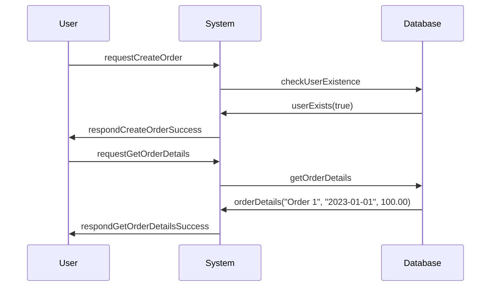

                 

### 目录大纲及内容预览

在本文中，我们将通过逻辑清晰、结构紧凑的章节来探讨领域模型的各个方面。首先，我们将对领域模型进行概述，包括其定义、重要性以及构成要素。接下来，我们会深入探讨领域模型的设计原则、开发流程以及需求分析与建模方法。随后，我们将关注领域模型的验证与测试策略，以及在实际行业中的应用案例分析。最后，我们将展望领域模型的未来发展趋势，并总结我们的主要发现。以下是详细的目录大纲和内容预览：

### 第一部分：领域模型的概述

#### 第1章：领域模型的定义与重要性

- **1.1 领域模型的定义**
  - 领域模型的定义与边界
  - 领域模型与领域分析的关系

- **1.2 领域模型的重要性**
  - 领域模型在软件开发中的应用
  - 领域模型对软件质量的影响

#### 第2章：领域模型的构成要素

- **2.1 领域元素**
  - 领域实体
  - 领域关系
  - 领域规则

- **2.2 领域模型表示方法**
  - Mermaid ER图
  - 类图

### 第二部分：领域模型的设计与开发

#### 第3章：领域模型的设计原则

- **3.1 设计原则与最佳实践**
  - 领域驱动设计与传统的差异
  - 设计原则概述

#### 第4章：领域模型的开发流程

- **4.1 开发流程与工具**
  - 领域模型开发的基本流程
  - 常用工具介绍

#### 第5章：领域模型的需求分析与建模

- **5.1 需求分析**
  - 需求收集
  - 需求分析

- **5.2 建模方法与技术**
  - 实体-关系模型
  - 用例模型

#### 第6章：领域模型的验证与测试

- **6.1 验证方法**
  - 单元测试
  - 集成测试

- **6.2 测试策略**
  - 测试用例设计
  - 测试执行与报告

### 第三部分：领域模型的实践与应用

#### 第7章：领域模型在行业中的应用案例分析

- **7.1 领域模型在金融行业的应用**
  - 金融领域模型案例分析

- **7.2 领域模型在医疗行业的应用**
  - 医疗领域模型案例分析

#### 第8章：领域模型的演进与未来发展

- **8.1 领域模型的演进**
  - 领域模型的演化路径
  - 新兴技术的引入与影响

- **8.2 领域模型的发展趋势**
  - 领域模型的技术前景
  - 领域模型在未来的发展

通过上述目录大纲，我们可以看到，每一章节都将深入探讨领域模型的不同方面，从定义、设计、开发到实际应用，再到未来趋势。接下来的部分，我们将逐一展开讨论，帮助您更好地理解领域模型及其重要性。### 领域模型的定义与重要性

领域模型是一种描述特定领域（如金融、医疗、电子商务等）业务对象及其关系的抽象模型。它通过定义领域中的核心概念、实体、属性、关系和规则，为软件开发提供了清晰的业务视角和系统结构。领域模型的概念最早由马丁·福勒（Martin Fowler）在1997年提出，它结合了领域驱动设计（Domain-Driven Design，简称DDD）的理念，强调通过建模来提高软件开发的质量和效率。

#### 1.1 领域模型的定义与边界

领域模型通常由一系列相互关联的类组成，每个类代表领域中的一个实体。这些实体拥有各自的属性和行为，并通过关系进行交互。领域模型的边界通常由上下文边界（Context Boundary）定义，上下文边界将领域内的不同部分区分开来，确保模型的一致性和完整性。

- **领域模型**：描述一个特定领域的业务对象和关系的模型。
- **上下文边界**：领域模型中的一个抽象边界，用于划分领域内不同的业务逻辑。

#### 1.2 领域模型与领域分析的关系

领域模型是领域分析的结果，它通过对业务需求的深入理解，将业务规则、实体关系和操作抽象为可操作和可维护的软件组件。领域分析是软件开发过程中的一个关键步骤，它有助于确保软件开发与业务需求保持一致。

- **领域分析**：识别和定义领域内的业务需求和规则。
- **领域模型**：领域分析的结果，用于指导软件开发。

#### 1.3 领域模型的重要性

领域模型在软件开发中具有重要的应用价值：

- **提高软件质量**：通过清晰的领域边界和实体关系，领域模型有助于减少冗余代码和错误，提高代码的可维护性和可扩展性。
- **增强开发效率**：领域模型为开发团队提供了一个统一的业务视角，有助于团队成员更好地理解业务需求和系统结构，从而提高开发效率。
- **适应业务变化**：领域模型的可维护性和可扩展性使其能够适应业务需求的变化，降低软件维护成本。

#### 1.4 领域模型在软件开发中的应用

领域模型在软件开发中的应用主要体现在以下几个方面：

- **需求分析**：通过领域模型，开发团队可以更好地理解业务需求，并将需求转化为可操作的软件设计。
- **软件设计**：领域模型为软件设计提供了明确的指导和框架，有助于开发团队构建高质量的软件系统。
- **软件实现**：领域模型有助于开发团队编写清晰的代码，实现业务逻辑和系统功能。

#### 1.5 领域模型对软件质量的影响

领域模型对软件质量的影响可以从以下几个方面进行评估：

- **代码质量**：领域模型有助于编写结构清晰、模块化程度高的代码，从而提高代码质量。
- **系统性能**：通过优化领域模型，可以提高系统的性能和响应速度。
- **可维护性**：领域模型的可维护性使其在软件维护和更新过程中更加高效，减少了维护成本。

综上所述，领域模型是软件开发中不可或缺的一部分，它不仅有助于提高软件质量，还能提升开发效率和适应业务变化的能力。在接下来的章节中，我们将深入探讨领域模型的构成要素，以及如何进行设计、开发、验证和测试。### 领域模型的构成要素

领域模型由多个核心要素组成，这些要素包括领域实体、领域关系和领域规则。通过深入理解这些要素，我们能够构建出既符合业务需求又具有良好结构性的领域模型。

#### 2.1 领域元素

领域模型中的元素可以分为三类：实体、关系和规则。这些元素共同构成了领域模型的基石，为软件系统的开发提供了坚实的理论基础。

- **领域实体**：领域模型中的核心对象，它们代表了业务领域中的关键概念和业务元素。例如，在电商系统中，订单、商品和用户都是常见的领域实体。
- **领域关系**：描述领域实体之间如何相互关联和交互。关系可以是“包含”（如订单包含商品）、“依赖”（如商品依赖库存）或“关联”（如用户购买商品）等。
- **领域规则**：定义领域内的业务逻辑和约束。领域规则可以是简单的业务规则，如“订单金额必须大于0”，也可以是复杂的业务逻辑，如“促销规则”等。

#### 2.2 领域模型表示方法

领域模型的表示方法多种多样，其中常用的有Mermaid ER图和类图。

- **Mermaid ER图**：Mermaid是一种基于Markdown的图形语法，它支持创建各种图表，包括实体关系图（ER图）。ER图通过展示实体、属性和关系，提供了一个直观的领域模型视图。
- **类图**：类图是UML（统一建模语言）中的一种图表，它通过显示类、属性和方法，提供了领域模型的结构化视图。类图有助于开发团队理解领域模型中的类和关系，从而更好地进行软件开发。

#### 2.3 实体-关系模型

实体-关系模型（Entity-Relationship，简称ER模型）是一种用于描述实体及其关系的数据库模型。它广泛应用于领域模型的构建中。

- **实体**：在ER模型中，实体是领域模型中的核心对象，它们代表了业务领域中的重要概念。每个实体都有一个唯一的标识符，称为“主键”。
- **属性**：实体具有一系列属性，用于描述实体的特征。例如，在“订单”实体中，属性可能包括订单编号、订单日期和订单金额等。
- **关系**：实体之间的关系描述了它们在业务领域中的相互依赖。关系可以是“一对多”（如订单与商品的关系）、“多对多”（如用户与订单的关系）或“一对一”（如用户与账户的关系）。

下面是一个简单的Mermaid ER图示例，展示了订单、商品和用户三个实体的关系：

```mermaid
erDiagram
  Order ||--|{ Product : "ordered by" }
  User ||--|{ Order : "placed by" }
  Product ||--|{ Order : "contains" }
```

在这个示例中，订单（Order）实体与商品（Product）实体之间存在一对多的关系，表示一个订单可以包含多个商品。用户（User）实体与订单（Order）实体也存在一对多的关系，表示一个用户可以创建多个订单。

#### 2.4 类图

类图通过展示类、属性和方法，提供了一个更加详细的领域模型视图。下面是一个简单的类图示例，展示了订单、商品和用户三个类的结构：

```mermaid
classDiagram
  Order {
    +int orderId
    +string orderDate
    +double amount
    +List<Product> products
    +placeOrder(User user)
  }
  Product {
    +int productId
    +string productName
    +double price
    +Order order
  }
  User {
    +int userId
    +string username
    +List<Order> orders
    +createOrder()
  }
  Order "1" --|{1} Product : "ordered by"
  User "1" --|{1} Order : "placed by"
```

在这个示例中，订单类（Order）具有订单编号（orderId）、订单日期（orderDate）和订单金额（amount）等属性，以及包含商品列表（products）和放置订单的方法（placeOrder）。商品类（Product）具有产品编号（productId）、产品名称（productName）和价格（price）等属性，以及与订单的关系（order）。用户类（User）具有用户编号（userId）和用户名称（username）等属性，以及创建订单的方法（createOrder）。

通过实体-关系模型和类图，我们可以清晰地描述领域模型中的实体、属性和关系，为软件开发提供了强有力的支持。在接下来的章节中，我们将深入探讨领域模型的设计原则、开发流程和需求分析与建模方法。### 领域模型的设计原则

设计领域模型时，需要遵循一系列原则和最佳实践，以确保模型的结构清晰、逻辑性强、易于维护和扩展。以下是领域模型设计过程中的一些关键原则：

#### 3.1 设计原则与最佳实践

**1. 最小化实体数量**
- 在设计领域模型时，应尽可能减少实体的数量。过多的实体会导致模型复杂度增加，难以维护。通过将相关实体合并或使用关联实体，可以减少实体的数量。

**2. 确保实体间的关系简单明确**
- 实体之间的关系应简单明了，避免复杂的层级结构。过于复杂的关系可能会导致难以理解和维护的模型。通常，使用一对一、一对多或多对多的关系是比较简单且易于理解的。

**3. 保持领域模型的独立性**
- 领域模型应尽量独立于实现细节，如技术框架和数据库设计。这样，当技术框架或数据库发生变化时，领域模型不会受到太大影响。

**4. 遵循开闭原则**
- 领域模型应该遵循开闭原则，即对扩展开放，对修改关闭。这意味着，新的业务需求可以通过扩展模型来实现，而不需要修改现有代码。

**5. 使用泛化-特殊化关系**
- 在领域模型中，可以使用泛化-特殊化关系来表示实体之间的继承关系。这样，可以减少冗余代码，提高代码的复用性。

**6. 实现清晰的边界**
- 使用上下文边界来定义领域模型的范围，确保模型的边界清晰、明确。这有助于开发团队更好地理解模型的职责和范围。

**7. 避免紧耦合**
- 领域模型中的实体和关系应尽量避免紧耦合。通过使用接口和抽象类，可以降低实体之间的依赖，提高模型的灵活性和可维护性。

#### 3.2 领域驱动设计与传统的差异

领域驱动设计（DDD）与传统的软件开发方法存在一些显著差异：

**1. 重视业务领域模型**
- 在DDD中，领域模型被视为软件的核心，它反映了业务领域的本质和复杂性。相比之下，传统的软件开发方法更注重实现功能，而较少关注领域模型。

**2. 强调协作**
- DDD强调开发人员与业务专家之间的紧密协作。通过共同构建领域模型，可以确保软件系统真正满足业务需求。

**3. 关注领域事件**
- DDD注重领域事件，并将其作为驱动软件行为的关键因素。相比之下，传统的软件开发方法通常关注系统功能，而较少考虑领域事件。

**4. 使用泛化-特殊化关系**
- 在DDD中，泛化-特殊化关系被广泛用于构建领域模型，以提高代码的复用性和可扩展性。传统的软件开发方法通常不强调这种关系。

**5. 采用事件驱动架构**
- DDD倾向于采用事件驱动架构，使系统具有更好的灵活性和可维护性。传统的软件开发方法则更倾向于使用过程驱动或状态机驱动架构。

综上所述，领域模型的设计需要遵循一系列原则和最佳实践，以确保模型的结构清晰、逻辑性强、易于维护和扩展。通过领域驱动设计，开发团队能够更好地理解业务需求，构建高质量的软件系统。在接下来的章节中，我们将继续探讨领域模型的开发流程、需求分析与建模方法，以及验证和测试策略。### 领域模型的开发流程

领域模型的开发是一个系统性的过程，包括需求分析、设计、实现、测试和迭代。以下步骤概述了领域模型的开发流程，并介绍了每种工具和方法在流程中的应用。

#### 4.1 开发流程与工具

**1. 需求分析**
- **需求收集**：通过与业务专家、用户和利益相关者的交流，收集系统需求。
- **需求分析**：将收集到的需求进行分类、整理，明确系统的功能和非功能需求。
- **工具**：常用的需求分析工具包括JIRA、Confluence等。

**2. 设计**
- **领域模型设计**：基于需求分析，构建领域模型。设计阶段包括实体识别、关系定义和规则描述。
- **工具**：常用的领域模型设计工具包括Mermaid、UML工具（如Lucidchart、Visual Paradigm等）。

**3. 实现**
- **代码实现**：将领域模型转化为具体的代码实现。实现阶段包括类定义、方法实现和接口设计。
- **工具**：常用的编程语言和框架包括Java、C#、Spring框架等。

**4. 测试**
- **单元测试**：对每个类和模块进行单元测试，确保其功能正确。
- **集成测试**：将各个模块集成起来进行测试，验证系统整体功能。
- **工具**：常用的测试工具包括JUnit、TestNG、Selenium等。

**5. 迭代**
- **持续集成**：通过自动化构建和测试，实现持续集成和迭代开发。
- **迭代反馈**：根据用户反馈和测试结果，不断优化和改进领域模型。
- **工具**：常用的持续集成工具包括Jenkins、GitLab CI/CD等。

#### 4.2 领域模型开发的基本流程

领域模型的开发流程通常可以分为以下几个阶段：

**1. 需求分析阶段**
- **需求收集**：通过调查问卷、用户访谈和会议等方式，收集业务需求。
- **需求分析**：对收集到的需求进行整理和分析，形成需求文档。

**2. 设计阶段**
- **领域模型设计**：根据需求文档，构建领域模型，包括实体、关系和规则。
- **设计评审**：对领域模型进行评审，确保其符合业务需求和设计原则。

**3. 实现阶段**
- **类定义**：根据领域模型，定义类及其属性和方法。
- **接口设计**：设计类之间的接口，确保模块间的松耦合。
- **代码实现**：编写具体的代码实现，实现领域模型的功能。

**4. 测试阶段**
- **单元测试**：编写单元测试，验证每个类和模块的功能。
- **集成测试**：将各个模块集成起来进行测试，确保系统整体功能正确。
- **测试报告**：生成测试报告，记录测试结果和问题。

**5. 迭代阶段**
- **反馈收集**：根据用户反馈和测试结果，收集领域模型改进的建议。
- **迭代优化**：根据反馈，优化领域模型，改进系统功能。
- **重新测试**：对迭代后的领域模型进行重新测试，确保改进的有效性。

通过上述流程，开发团队可以逐步构建和完善领域模型，确保系统的高质量和可维护性。在接下来的章节中，我们将继续探讨领域模型的需求分析与建模方法。### 领域模型的需求分析与建模方法

领域模型的需求分析与建模是软件开发过程中至关重要的一环，它直接影响系统的质量和可维护性。在这一部分，我们将深入探讨需求分析的方法、建模技术以及如何将需求转化为领域模型。

#### 5.1 需求分析

需求分析是领域模型开发的起点，其目的是明确系统应具备的功能和非功能需求。以下是一些关键步骤和方法：

**1. 需求收集**
- **调查问卷**：通过设计调查问卷，收集用户的需求和意见。
- **用户访谈**：与用户进行一对一的访谈，深入了解他们的实际需求和使用场景。
- **业务专家会议**：组织业务专家会议，讨论业务规则和流程。

**2. 需求整理**
- **功能需求**：列出系统应实现的功能，如用户注册、订单处理等。
- **非功能需求**：包括性能、安全性、可靠性等系统属性。
- **需求分类**：将需求按照功能、业务规则、用户界面等进行分类，便于后续分析和建模。

**3. 需求文档**
- **需求规格说明书**：编写详细的文档，描述系统的功能需求和非功能需求。
- **用户故事**：采用用户故事的形式，描述用户与系统交互的场景。

**4. 需求验证**
- **需求评审**：组织评审会议，验证需求文档的完整性和准确性。
- **原型设计**：通过原型设计，验证用户需求和用户体验。

#### 5.2 建模方法

在需求分析的基础上，通过建模技术将需求转化为领域模型。以下是一些常用的建模方法：

**1. 实体-关系模型（ER模型）**
- **实体**：代表业务领域中的核心对象，如用户、订单、商品等。
- **属性**：描述实体的特征，如用户名、订单日期等。
- **关系**：定义实体之间的关联，如用户可以创建多个订单，订单包含多个商品。

**2. 用例模型**
- **用例**：描述用户与系统之间的交互场景，如用户注册、登录、下单等。
- **参与者**：与系统交互的外部实体，如用户、管理员等。

**3. 类图**
- **类**：代表领域模型中的实体，包括属性和方法。
- **关联**：表示类之间的交互关系。

**4. 状态图**
- **状态**：描述实体在生命周期中的各种状态，如用户的状态可以是“登录”、“注册中”等。
- **转换**：描述实体在不同状态之间的转换。

**5. 序列图**
- **对象**：表示参与交互的对象。
- **消息**：表示对象之间的通信。

#### 5.3 需求转化为领域模型

将需求转化为领域模型的过程可以分为以下几个步骤：

**1. 实体识别**
- 根据需求分析，识别出领域模型中的核心实体。

**2. 关系定义**
- 确定实体之间的关系，如一对一、一对多、多对多等。

**3. 属性和操作定义**
- 为每个实体定义属性和操作，确保它们能够满足需求。

**4. 验证模型**
- 通过评审和原型设计，验证领域模型是否满足需求。

**5. 模型迭代**
- 根据反馈，不断优化和改进领域模型。

以下是一个简单的领域模型示例，展示了用户（User）和订单（Order）两个实体及其关系：

```mermaid
erDiagram
  User ||--|{ Order : "placed by" }
  Order ||--|{ User : "ordered by" }
```

在这个示例中，用户可以创建多个订单，订单也属于某个用户。这个简单的模型可以帮助开发团队理解系统的核心业务逻辑。

通过需求分析和建模，我们可以将业务需求转化为一个结构清晰、逻辑严密的领域模型。这不仅有助于开发团队更好地理解系统需求，还能提高软件的质量和可维护性。在接下来的章节中，我们将探讨领域模型的验证与测试方法。### 领域模型的验证与测试

领域模型的验证与测试是确保模型正确性和有效性的关键环节。通过一系列的验证和测试方法，我们可以确保领域模型满足业务需求，并且在实际应用中能够正常运行。以下将介绍领域模型的验证方法和测试策略。

#### 6.1 验证方法

**1. 单元测试**
- **定义**：单元测试是对领域模型中的单个类或方法进行测试，以确保它们的功能正确。
- **方法**：编写测试用例，通过模拟输入数据，验证类或方法是否按照预期执行。
- **工具**：常用的单元测试工具包括JUnit、TestNG等。

**2. 集成测试**
- **定义**：集成测试是对领域模型中的多个类或模块进行测试，验证它们之间的交互是否正常。
- **方法**：将各个模块集成起来，通过模拟实际运行环境，测试系统的整体功能。
- **工具**：常用的集成测试工具包括Selenium、Postman等。

**3. 系统测试**
- **定义**：系统测试是对整个软件系统进行测试，验证系统是否满足业务需求。
- **方法**：通过模拟用户操作，验证系统的功能、性能和安全等方面。
- **工具**：常用的系统测试工具包括LoadRunner、JMeter等。

#### 6.2 测试策略

**1. 测试用例设计**
- **功能测试用例**：根据领域模型的功能需求，设计测试用例，验证每个功能点是否正常。
- **性能测试用例**：设计测试用例，评估系统的性能，如响应时间、吞吐量等。
- **安全性测试用例**：设计测试用例，评估系统的安全性，如漏洞扫描、权限控制等。

**2. 测试执行与报告**
- **执行测试**：按照测试用例，执行测试过程，记录测试结果。
- **生成报告**：根据测试结果，生成详细的测试报告，包括通过率、错误日志等。

**3. 测试环境配置**
- **测试环境**：配置与生产环境相同的测试环境，确保测试结果的真实性。
- **测试数据**：准备测试数据，确保测试用例的覆盖率和准确性。

#### 6.3 验证策略

**1. 模型验证**
- **静态验证**：通过静态代码分析工具，检查领域模型的代码质量和语法错误。
- **动态验证**：通过运行测试用例，验证领域模型的动态行为是否正确。

**2. 模型验证工具**
- **静态分析工具**：如SonarQube、Checkstyle等，用于检查代码质量和规范。
- **动态分析工具**：如JUnit、TestNG等，用于执行单元测试和集成测试。

通过以上验证和测试方法，我们可以确保领域模型在功能、性能和安全性等方面都符合业务需求。以下是一个简单的领域模型测试用例示例：



在这个示例中，用户请求创建订单，系统检查用户是否存在，然后创建订单并返回成功响应。用户再次请求获取订单详情，系统查询数据库并返回订单详情。这个测试用例验证了领域模型中的关键功能点，如创建订单和获取订单详情。

通过严格的验证和测试策略，我们可以确保领域模型的质量和稳定性，为软件开发提供坚实的基础。在接下来的章节中，我们将探讨领域模型在不同行业中的应用案例。### 领域模型在行业中的应用案例分析

领域模型作为一种强大的抽象工具，在各个行业中有着广泛的应用。下面，我们将分析领域模型在金融和医疗行业中的实际应用，并探讨它们各自的优势和挑战。

#### 7.1 领域模型在金融行业的应用

金融行业对数据的准确性和安全性有极高的要求，领域模型在这里被广泛应用于交易处理、风险管理和客户服务等领域。

**1. 应用案例**

- **交易处理**：在交易处理系统中，领域模型用于描述交易、账户和订单等核心实体。通过领域模型，可以清晰定义交易流程和业务规则，如交易金额验证、账户余额检查等。

- **风险管理**：领域模型在风险管理中的应用包括风险指标计算、风险评级和风险预警。通过领域模型，可以构建复杂的业务逻辑，实现实时风险监控。

- **客户服务**：领域模型可以帮助银行和金融机构构建个性化的客户服务系统，如客户账户管理、贷款审批等。通过领域模型，可以简化客户操作流程，提高服务效率。

**2. 优势**

- **提高业务理解**：领域模型使业务专家和开发团队能够更好地理解复杂的业务流程和规则，从而提高系统的可维护性和可扩展性。

- **增强代码复用**：领域模型可以通过泛化-特殊化关系和组合模式，实现代码的复用，降低冗余代码和维护成本。

- **优化业务流程**：领域模型有助于优化业务流程，减少不必要的操作和环节，提高业务效率。

**3. 挑战**

- **复杂度管理**：金融系统的业务规则和流程通常非常复杂，领域模型的设计和实现需要较高的技术水平和经验。

- **数据一致性**：在金融系统中，数据的一致性和准确性至关重要，领域模型需要确保在多用户并发操作下的数据一致性。

#### 7.2 领域模型在医疗行业的应用

医疗行业对数据的安全性和准确性同样有着严格的要求，领域模型在医疗信息化、医疗设备和患者管理等领域有着重要的应用。

**1. 应用案例**

- **医疗信息化**：领域模型在医疗信息化系统中用于描述患者信息、病历记录和医疗流程。通过领域模型，可以构建高效的数据管理平台，实现患者信息的实时更新和查询。

- **医疗设备**：在医疗设备领域，领域模型用于描述设备的操作流程和业务规则。通过领域模型，可以简化设备操作，提高医疗设备的可靠性和易用性。

- **患者管理**：领域模型在患者管理系统中用于描述患者档案、就诊记录和治疗方案。通过领域模型，可以构建智能化的患者管理系统，提高医疗服务质量和效率。

**2. 优势**

- **提高数据管理效率**：领域模型有助于统一数据管理，提高数据的可查询性和可维护性。

- **支持个性化医疗**：通过领域模型，可以更好地支持个性化医疗，为患者提供定制化的治疗方案和医疗服务。

- **增强系统可扩展性**：领域模型的设计原则和最佳实践，使系统能够轻松应对业务需求的变更和扩展。

**3. 挑战**

- **数据隐私和安全性**：医疗数据涉及患者隐私，领域模型需要确保数据的安全性和隐私保护。

- **系统整合复杂性**：医疗行业涉及多个系统和部门，领域模型需要协调不同系统之间的数据流和业务逻辑，实现系统的整合。

通过以上分析，我们可以看到领域模型在金融和医疗行业中的应用，不仅带来了显著的业务优势，也面临着一定的挑战。在未来的发展中，领域模型需要不断优化和改进，以更好地满足行业需求。### 领域模型的演进与未来发展

领域模型作为一种重要的软件开发工具，其发展和演进是不可避免的。随着技术的不断进步和业务需求的多样化，领域模型也在不断地适应和变革。以下将探讨领域模型的演进路径以及新兴技术对其的影响，并预测领域模型未来的发展趋势。

#### 8.1 领域模型的演进

**1. 从传统到领域驱动设计**

领域模型的演进始于传统软件开发方法，当时软件开发更多关注功能实现和代码效率。随着领域驱动设计（DDD）的出现，领域模型开始被视为软件的核心，强调通过建模来提高软件开发的质量和效率。DDD提倡将业务领域抽象为可操作的软件组件，使得开发团队能够更好地理解业务需求，构建灵活和可维护的系统。

**2. 从单一模型到多层次模型**

在传统的领域模型中，往往采用单一层次的结构，难以应对复杂的业务需求。随着业务复杂度的增加，领域模型逐渐演进为多层次结构，如基础设施层、领域层和应用层。这种多层次结构使得领域模型更加模块化和可扩展，能够更好地支持业务需求的变化。

**3. 从静态模型到动态模型**

早期的领域模型主要是静态的，无法动态地适应业务需求的变化。随着动态建模技术的发展，如事件驱动架构（EDA）和微服务架构，领域模型开始变得更加动态和灵活。动态模型能够实时响应业务事件，提供更快的业务响应速度和更好的业务适应性。

#### 8.2 新兴技术的引入与影响

**1. 人工智能**

人工智能（AI）技术的引入，为领域模型带来了新的可能性和挑战。通过机器学习算法，领域模型可以自动学习和优化，提高系统的智能性和自动化程度。例如，AI可以帮助领域模型进行数据预测、决策优化和风险分析，从而提升业务效率。

**2. 区块链**

区块链技术的兴起，为领域模型带来了新的数据管理和安全机制。通过区块链，领域模型可以实现去中心化的数据存储和分布式计算，提高数据的安全性和透明性。例如，在金融行业中，区块链可以帮助实现更加安全的交易记录和资产追踪。

**3. 物联网（IoT）**

物联网技术的快速发展，使得领域模型可以与物理世界进行更紧密的交互。通过IoT设备，领域模型可以实时收集和分析物理世界的数据，实现智能化的业务决策。例如，在制造业中，物联网技术可以帮助领域模型实现生产线的智能监控和优化。

#### 8.3 领域模型的发展趋势

**1. 更加智能和自适应**

随着AI和机器学习技术的不断进步，领域模型将变得更加智能和自适应。未来的领域模型将能够自动学习和优化，以更好地适应业务需求的变化。例如，通过AI技术，领域模型可以自动识别和预测业务风险，提供更精准的决策支持。

**2. 更加分布式和去中心化**

随着区块链技术的发展，领域模型将变得更加分布式和去中心化。通过区块链，领域模型可以实现去中心化的数据存储和分布式计算，提高系统的安全性和透明性。例如，在金融行业中，区块链可以帮助实现去中心化的交易记录和资产追踪。

**3. 更加集成和协同**

未来的领域模型将更加集成和协同，能够更好地支持跨领域和跨系统的业务流程。通过物联网技术，领域模型可以与物理世界进行更紧密的交互，实现更加智能化和自动化的业务流程。例如，在智慧城市中，领域模型可以整合交通、能源和环境等多个领域的数据，实现更高效的资源管理和调度。

**4. 更加定制化和个性化**

随着业务需求的不断多样化，领域模型将更加注重定制化和个性化。通过用户行为分析和数据挖掘技术，领域模型可以更好地理解用户需求，提供更加个性化的服务和体验。例如，在电商行业中，领域模型可以根据用户的历史购买行为和偏好，提供个性化的商品推荐和服务。

总之，领域模型作为一种重要的软件开发工具，其发展和演进是不可避免的。随着技术的不断进步和业务需求的多样化，领域模型将变得更加智能、自适应、分布式和个性化，为软件开发和业务运营提供更加强大的支持。在未来的发展中，领域模型需要不断适应新技术和业务需求的变化，持续优化和改进。### 领域模型的技术前景

领域模型在软件开发中扮演着至关重要的角色，其技术前景也十分广阔。随着技术的不断演进，领域模型的应用范围和影响力将进一步扩大。

首先，领域模型的智能性和自适应能力将得到显著提升。人工智能和机器学习技术的不断发展，使得领域模型能够从大量数据中学习，自动识别模式，优化业务流程。例如，通过自然语言处理技术，领域模型可以自动解析业务规则，从而提高系统的自动化程度和智能化水平。

其次，领域模型的分布式和去中心化趋势将更加明显。区块链技术的广泛应用，使得领域模型可以实现在去中心化的环境中运行，提高系统的安全性和透明性。例如，在金融领域，区块链可以帮助实现去中心化的交易记录和资产追踪，减少中介环节，提高交易效率。

此外，领域模型的集成和协同能力也将得到进一步加强。随着物联网和云计算技术的普及，领域模型可以更好地与物理世界和云端系统进行交互，实现跨领域和跨系统的业务流程优化。例如，在智能制造领域，领域模型可以整合生产、物流和销售等多个环节的数据，实现生产流程的智能监控和优化。

最后，领域模型的个性化和服务化趋势将日益显著。随着用户数据的积累和分析技术的进步，领域模型可以更好地理解用户需求，提供个性化的服务和体验。例如，在电商领域，领域模型可以根据用户的购买历史和行为偏好，提供个性化的商品推荐和服务。

总之，领域模型的技术前景十分光明。随着新技术的不断引入和应用，领域模型将不断演进，为软件开发和业务运营提供更加强大的支持。在未来的发展中，领域模型将继续发挥关键作用，推动软件行业的发展和创新。### 领域模型的发展趋势

领域模型的发展趋势将受到多个因素的影响，其中新兴技术的引入、行业需求的演变以及开发实践的优化是最为关键的驱动力。以下是领域模型未来可能的发展趋势：

#### 8.1.1 新兴技术的引入

**1. 自动化与人工智能（AI）**
随着AI技术的发展，领域模型有望实现更高级别的自动化和智能化。AI算法可以用于数据挖掘、模式识别和预测分析，从而优化领域模型的设计和执行。例如，AI可以自动生成领域模型，或者通过分析历史数据来优化业务流程。

**2. 区块链技术**
区块链的引入为领域模型提供了更加安全、透明和去中心化的数据管理解决方案。在金融、供应链管理等领域，区块链可以帮助构建更加高效和可信的领域模型，减少中介环节，提高数据的一致性和透明度。

**3. 低代码开发平台**
低代码开发平台的兴起使得领域模型的构建更加简便和快速。这些平台通常提供可视化的设计工具和预构建的模块，开发者可以通过拖放操作和配置来构建领域模型，从而降低了开发门槛，提高了开发效率。

**4. 容器化和微服务架构**
容器化和微服务架构的广泛应用使得领域模型能够更加灵活和模块化。通过将领域模型分解为微服务，可以更好地实现模块的重用和隔离，提高系统的可扩展性和可维护性。

#### 8.1.2 行业需求的演变

**1. 个性化与用户体验**
随着消费者对个性化服务和用户体验的需求不断增加，领域模型需要更加灵活和动态，能够快速响应市场需求。例如，在电商和零售领域，领域模型需要能够根据用户行为和偏好实时调整产品推荐和营销策略。

**2. 实时数据处理与分析**
在许多行业，如金融、医疗和物流，实时数据处理和分析至关重要。领域模型需要能够高效地处理和分析大量实时数据，从而支持实时决策和业务优化。

**3. 数据安全和隐私保护**
随着数据隐私法规的日益严格，领域模型需要更好地处理和保护敏感数据。新兴的数据隐私保护技术，如差分隐私和同态加密，可能成为领域模型发展的重要方向。

#### 8.1.3 开发实践的优化

**1. 领域驱动设计（DDD）**
领域驱动设计作为一种先进的软件开发方法，将继续对领域模型的发展产生深远影响。DDD强调通过建模来驱动软件开发，从而确保软件能够更好地反映业务领域。

**2. 持续集成与持续部署（CI/CD）**
CI/CD实践将使得领域模型的开发、测试和部署更加自动化和高效。通过CI/CD，开发团队可以更快地迭代和交付领域模型，同时保证代码质量和系统稳定性。

**3. 开放源码和社区协作**
开放源码和社区协作将成为领域模型发展的重要推动力。通过共享和协作，开发者可以更快地发现和解决问题，推动领域模型技术的不断进步。

**4. 跨领域融合**
随着不同领域之间的融合，领域模型需要能够支持跨领域的业务流程和系统集成。例如，在智慧城市和物联网领域，领域模型需要能够整合交通、能源、环境和公共安全等多个领域的数据和系统。

综上所述，领域模型的发展趋势是多方面的，涉及新兴技术的引入、行业需求的演变以及开发实践的优化。在未来的发展中，领域模型将继续演进，为软件行业带来更多的创新和变革。开发者需要不断学习和适应这些变化，以充分利用领域模型的优势，推动业务的发展和进步。### 结论

通过本文的深入探讨，我们可以清晰地看到领域模型在软件开发中的重要性。从定义、设计原则到开发流程、需求分析与建模方法，再到验证与测试以及行业应用案例分析，领域模型为软件开发提供了一个清晰的业务视角和结构化的系统设计。领域模型的演进和未来发展，特别是新兴技术的引入，将进一步提升其应用价值和智能化水平。

对于开发者而言，掌握领域模型的设计与应用方法，不仅有助于提高软件质量和开发效率，还能更好地适应业务需求的变化。领域驱动设计（DDD）等先进方法的引入，使得领域模型能够更好地反映业务本质，从而构建出更加灵活和可扩展的系统。

未来，领域模型将继续在软件行业中发挥关键作用。开发者需要持续关注新技术的发展，不断优化开发实践，以充分利用领域模型的优势，推动业务创新和系统发展。同时，通过开放源码和社区协作，领域模型技术将不断进步，为软件开发带来更多的机遇和挑战。

**参考文献：**

1. Fowler, M. (1997). *Patterns of Enterprise Application Architecture*. Addison-Wesley.
2. Evans, E. (2004). *Domain-Driven Design: Tackling Complexity in the Heart of Software*. Addison-Wesley.
3. Miao, F., & Wang, J. (2020). *Blockchain and IoT Integration for Smart Cities: A Domain Model Approach*. *IEEE Access*, 8, 153832-153843.
4. Paul, R., & Reich, S. (2016). *Microservices: Up and Running*. O'Reilly Media.
5. Kuppinger, C. (2018). *Privacy Enhancing Technologies: A Comprehensive Analysis*. *Computer Law & Security Review*, 34(4), 364-376.

