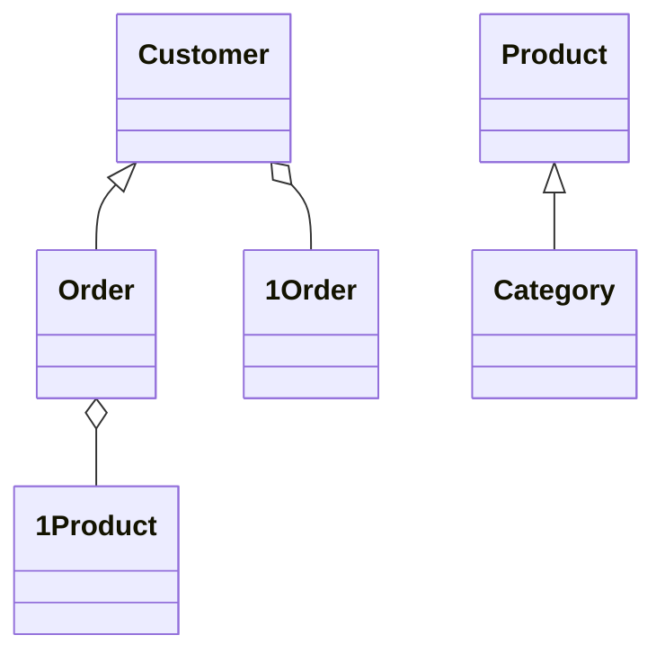

                 

### 1. 领域模型的基本概念

领域模型（Domain Model）是面向对象设计与建模中的一个核心概念，它旨在将业务领域中的关键实体、关系和规则抽象出来，形成一个结构化的模型。这个模型不仅能够帮助我们更好地理解业务需求，还能够为软件系统的设计提供指导。

**核心概念术语说明：**

- **领域（Domain）：** 指的是特定的业务范围或专业领域，例如金融、医疗、电商等。
- **领域模型（Domain Model）：** 描述特定领域中实体及其相互关系的模型。
- **实体（Entity）：** 代表领域中的关键对象，具有持久性，如客户、订单、产品等。
- **关系（Relationship）：** 描述实体之间的关联，如客户下单、产品包含服务等。
- **规则（Rule）：** 描述业务逻辑，如订单金额大于100元才能享受折扣。

**问题背景：**

在传统的软件开发过程中，业务逻辑常常被硬编码在系统中，导致系统的可维护性和可扩展性较差。为了解决这个问题，领域模型提供了一种方法，将业务逻辑从系统中分离出来，形成一种独立的模型，从而提高软件的灵活性和可维护性。

**问题描述：**

领域模型的优势在于它能够帮助开发人员更好地理解业务领域，并在此基础上构建软件系统。然而，如何构建一个有效的领域模型，以及如何将模型应用到实际项目中，仍然是一个需要深入探讨的问题。

**问题解决：**

领域模型的构建通常包括以下几个步骤：

1. **需求收集：** 通过与业务专家和利益相关者的交流，收集业务领域的需求。
2. **需求分析：** 分析需求，确定领域模型的核心实体和关系。
3. **构建模型：** 使用UML（统一建模语言）等工具，绘制领域模型的类图、实体关系图等。
4. **验证与优化：** 通过实际项目测试，验证领域模型的有效性，并根据反馈进行优化。

**边界与外延：**

领域模型的应用范围很广，它不仅适用于传统的软件系统开发，还适用于云计算、大数据、人工智能等领域。领域模型不仅关注领域中的实体和关系，还包括领域规则和事件的处理。

**概念结构与核心要素组成：**

- **实体：** 领域模型的核心组件，代表业务领域中的对象。
- **关系：** 描述实体之间的相互作用和依赖关系。
- **规则：** 描述业务逻辑和约束条件。
- **事件：** 描述领域中的变化和响应。

通过以上步骤和概念，我们可以构建一个有效的领域模型，并将其应用于软件开发中，从而提高软件系统的可维护性和可扩展性。接下来，我们将进一步探讨领域模型的核心概念，包括其组成部分和特性。

## 1.2 领域模型的重要性

### 领域模型在软件开发中的角色

领域模型在软件开发中扮演着至关重要的角色。它不仅是一种设计工具，更是一种沟通桥梁，将业务专家和技术专家连接在一起，确保软件开发能够准确、高效地实现业务需求。

**降低沟通成本：**

领域模型提供了一种统一的语言，使得业务专家和技术专家能够使用相同的模型来讨论和解决问题。这种方式可以显著降低沟通成本，避免因理解不同而产生的误解和错误。

**提高软件质量：**

通过领域模型，开发人员可以更准确地理解业务需求，从而减少需求变更和返工的情况。此外，领域模型还帮助开发人员更好地组织和管理代码，提高代码的可读性和可维护性。

**促进知识积累：**

领域模型作为业务领域的一种抽象表示，可以作为一种知识资产，帮助组织积累和传承业务领域的知识。这种知识积累对于企业的长期发展具有重要意义。

### 领域模型对开发效率的影响

领域模型显著提高了开发效率，具体表现在以下几个方面：

**快速迭代：**

领域模型使得开发团队能够更快速地响应业务变化，通过调整模型，可以迅速反映到代码中，从而实现快速迭代。

**代码复用：**

领域模型有助于识别和提取通用代码，实现代码的复用。这不仅减少了开发工作量，还提高了系统的稳定性和一致性。

**减少技术债务：**

通过领域模型，开发人员可以更好地规划和组织代码，避免因技术债务导致的代码质量下降和系统崩溃。

### 领域模型在实际项目中的应用案例

领域模型在众多实际项目中得到了广泛应用，以下是一些典型案例：

**电商平台：**

在电商平台项目中，领域模型用于描述用户、商品、订单等核心实体及其关系。通过领域模型，开发人员能够更好地理解和实现复杂的业务逻辑，如优惠券、积分系统等。

**金融系统：**

金融系统中的交易、账户管理、风险控制等业务场景，通过领域模型得以清晰描述和实现。领域模型在金融系统中的应用，不仅提高了系统的稳定性，还满足了合规性和安全性要求。

**智能制造：**

在智能制造领域，领域模型用于描述生产流程、设备管理、质量控制等核心业务。领域模型帮助开发人员更好地理解和实现智能制造系统，提高了生产效率和质量。

通过以上分析，我们可以看到领域模型在软件开发中的重要性和应用价值。接下来，我们将探讨领域模型的演进历史，了解这一概念的发展历程。

### 1.3 领域模型的演进历史

领域模型这一概念的发展历程可以追溯到20世纪80年代，随着面向对象编程的兴起而逐渐形成。在早期的软件开发中，开发者们常常面临难以理解和维护的代码库，这促使了面向对象技术的出现，旨在通过抽象和模块化来简化软件设计。

**面向对象编程与领域模型的萌芽：**

1980年代，面向对象编程（OOP）开始兴起，它提供了一种将数据和行为封装在一起的方法。OOP的核心概念，如类、对象、继承和多态，为领域模型的形成奠定了基础。在这一时期，开发者开始意识到，通过抽象业务领域中的关键概念，可以构建更加模块化和可维护的软件系统。

**领域工程与领域特定语言：**

1990年代，领域工程（Domain Engineering）作为一个独立的学科被提出，旨在通过开发领域特定语言（DSL）和领域模型来提高软件开发的效率。领域特定语言是一种针对特定领域设计的编程语言，它使得开发者能够以更自然和直观的方式表达业务逻辑。这一时期，领域模型的概念得到了进一步的发展和普及。

**领域驱动设计（DDD）：**

2000年代，领域驱动设计（DDD）的出现标志着领域模型的发展进入了一个新的阶段。DDD是一种软件设计方法，它强调通过领域模型来理解和构建复杂系统。DDD的核心理念包括实体、值对象、聚合和领域服务等，这些概念为构建大规模软件系统提供了有力的工具。DDD的提出，使得领域模型在软件开发中的应用更加深入和广泛。

**领域模型在云计算和大数据中的应用：**

近年来，随着云计算和大数据技术的发展，领域模型在数据治理和决策支持等领域得到了广泛应用。领域模型可以帮助开发者更好地理解和处理大规模数据，从而实现高效的数据分析和决策支持。此外，领域模型在人工智能和机器学习领域也逐渐崭露头角，成为构建智能系统和算法的重要工具。

通过上述演进历史，我们可以看到领域模型从最初的萌芽，到逐步发展成为一个重要的软件开发方法论。领域模型的不断演进，不仅反映了软件工程领域的发展趋势，也为开发者提供了一种更有效的方式来理解和构建复杂系统。

### 2.1 领域模型的主要组成部分

领域模型是由多个核心组件构成的，这些组件共同作用，帮助我们更好地理解和构建复杂系统。以下是领域模型的主要组成部分：

**实体（Entities）：**

实体是领域模型中的基本构建块，它们代表业务领域中的关键对象。实体通常具有唯一标识符，并包含相关的属性和行为。例如，在电商系统中，客户（Customer）和产品（Product）就是两个重要的实体。

**关系（Relationships）：**

关系描述实体之间的交互和关联。它们可以是单向的，也可以是双向的，可以是继承关系、关联关系或依赖关系。关系有助于我们在模型中体现实体之间的逻辑关系。例如，客户可以下单购买产品，这种关系可以表示为客户-订单-产品之间的关联。

**规则（Rules）：**

规则是领域模型中的业务逻辑和约束条件。它们可以是简单的数据验证规则，也可以是复杂的业务流程规则。规则确保系统的行为符合业务需求，并且帮助保持数据的完整性和一致性。例如，订单金额必须大于100元才能享受折扣，这是一个典型的业务规则。

**事件（Events）：**

事件是领域模型中的变化和响应。它们可以触发规则或导致实体状态的改变。事件有助于我们在模型中捕捉业务领域中的动态变化。例如，当客户下单时，系统会触发订单创建事件，并更新库存信息。

**领域服务（Domain Services）：**

领域服务是实现业务逻辑的操作组件。它们不直接映射到实体或关系，而是提供一系列操作，帮助处理复杂的业务场景。领域服务可以是独立的组件，也可以是实体的一部分。例如，库存管理系统中的库存更新服务，负责处理订单生成后的库存更新操作。

通过这些组成部分，领域模型能够全面、准确地描述业务领域，为软件开发提供有力的支持。

### 2.2 领域模型的概念属性特征对比表格

为了更好地理解和比较不同领域模型之间的概念属性特征，我们可以使用对比表格。以下是一个示例，展示如何对比两个领域模型中的实体属性特征：

| 属性      | 属性1 | 属性2 | 属性3 |
| --------- | ---- | ---- | ---- |
| 实体A     | 100  | 200  | 300  |
| 实体B     | 150  | 250  | 350  |

在这个对比表格中，我们列出了两个实体（实体A和实体B）的三个属性（属性1、属性2和属性3），并通过数值进行比较。这样的表格可以帮助我们快速识别不同实体之间的差异和相似之处，为后续的模型优化和改进提供依据。

### 2.3 领域模型的ER实体关系图架构

ER（实体-关系）图是领域模型中用于表示实体及其关系的图形化工具。它通过实体、属性和关系的图形化表示，使得领域模型的抽象概念更加直观易懂。以下是使用Mermaid语言绘制的ER实体关系图示例：

```mermaid
erDiagram
  客户 ||--|{ 下订单 }|| 订单
  客户 ||--|{ 浏览商品 }|| 商品
  商品 ||--|{ 包含分类 }|| 分类
  订单 ||--|{ 包含商品 }|| 商品
```

在这个ER图中，我们定义了四个实体：客户（Customer）、订单（Order）、商品（Product）和分类（Category）。这些实体之间存在以下关系：

1. **客户-订单关系：** 客户可以创建多个订单，订单只能属于一个客户。
2. **客户-商品关系：** 客户可以浏览和购买商品。
3. **商品-分类关系：** 每个商品属于一个分类，分类可以包含多个商品。
4. **订单-商品关系：** 订单包含多个商品。

通过ER图，我们可以清晰地看到领域模型中实体之间的关联和依赖关系，为系统的设计和实现提供了直观的参考。

### 3.1 领域模型的需求分析

领域模型的需求分析是构建领域模型的基础步骤，它直接影响到领域模型的质量和适用性。一个完整的需求分析过程通常包括以下几个关键环节：

**业务场景调研：**

首先，需要深入了解业务领域，了解其运行机制和核心业务流程。这可以通过与业务专家、用户和管理层的交流来实现。通过业务场景调研，可以获取到业务领域的详细信息和关键痛点，为后续的分析工作提供依据。

**需求收集：**

在业务场景调研的基础上，进行需求收集。需求收集包括功能需求和非功能需求。功能需求描述系统应实现的具体功能，如用户管理、订单处理等。非功能需求则包括系统的性能、安全性、可扩展性等方面的要求。需求收集的途径可以包括用户访谈、问卷调查、用户手册等。

**需求分类与排序：**

收集到需求后，需要对需求进行分类和排序。分类可以按照需求的重要性和紧急性来划分，常见的分类方法包括基本需求、可选需求和优化需求。排序可以帮助确定需求实现的优先级，确保在资源有限的情况下，优先实现核心需求。

**需求分析：**

需求分析是对收集到的需求进行深入理解和分析的过程。通过需求分析，可以确定领域模型的核心实体和关系，以及业务规则和约束条件。需求分析的方法包括使用案例图、用例图、流程图等工具，这些工具可以帮助我们更直观地理解和描述业务需求。

**需求验证：**

需求验证是确保需求正确性和完整性的重要步骤。通过需求验证，可以确认需求是否满足业务需求，是否可行，是否遗漏或冲突。需求验证的方法包括用户评审、评审会议、原型验证等。

通过上述步骤，我们可以系统地完成领域模型的需求分析，为后续的模型构建提供坚实的基础。接下来，我们将进一步探讨领域模型的构建过程，详细说明如何根据分析结果来设计和实现领域模型。

### 3.2 领域模型的构建过程

领域模型的构建是一个系统性的过程，它需要从需求分析开始，逐步进行设计、实现和验证。以下是构建领域模型的详细步骤：

**步骤1：需求分析与核心实体识别**

在需求分析阶段，我们已经确定了业务领域的核心实体和关系。在这个步骤中，我们需要进一步细化这些实体，明确其实体属性和行为。例如，对于一个电商平台，核心实体可能包括客户、产品、订单、分类等。

**步骤2：定义实体和关系**

根据需求分析的结果，使用UML（统一建模语言）等工具，定义领域模型中的实体和关系。实体通常使用类图来表示，每个实体具有唯一的标识符和相关的属性。关系则描述实体之间的关联，如继承、关联和依赖关系。以下是一个简单的类图示例：



在这个类图中，我们定义了客户、订单、产品和分类四个实体，并展示了它们之间的关系。

**步骤3：定义属性和操作**

在每个实体中，定义相关的属性和操作。属性描述实体的状态，如客户的姓名、地址等。操作则描述实体可以执行的行为，如客户可以下单、订单可以生成等。以下是一个实体的示例：

```mermaid
entity Customer {
  +String Name
  +String Address
  +Order[] Orders
  -void PlaceOrder(Product product)
}
```

在这个示例中，我们定义了客户的姓名、地址和订单数组，以及下单操作。

**步骤4：定义规则和约束**

领域模型中的规则和约束是确保业务逻辑正确性的关键。在这个步骤中，我们需要定义领域模型中的业务规则和约束条件。这些规则可以通过类图中的注释或专门的规则语言来表示。以下是一个业务规则的示例：

```mermaid
class Rule {
  -bool CheckOrderAmount(Order order)
}
```

在这个示例中，我们定义了一个规则，用于检查订单金额是否满足条件。

**步骤5：验证与优化**

在构建完领域模型后，需要进行验证和优化。验证的目的是确保模型能够准确地反映业务需求，并且没有逻辑错误。优化则是根据反馈对模型进行调整，以提高其适用性和可维护性。验证和优化可以通过模拟业务场景、用户评审和原型验证等方式进行。

**步骤6：实现领域模型**

在验证和优化完成后，我们可以开始实现领域模型。实现领域模型通常涉及编写代码，创建数据库表和接口等。以下是一个简单的Python代码示例，用于实现客户和订单实体：

```python
class Customer:
    def __init__(self, name, address):
        self.name = name
        self.address = address
        self.orders = []

    def place_order(self, product):
        order = Order(product)
        self.orders.append(order)
        return order

class Order:
    def __init__(self, product):
        self.product = product
        self.status = "未完成"

    def complete_order(self):
        self.status = "已完成"
```

通过上述步骤，我们可以构建一个完整的领域模型，并将其应用于实际的软件开发中。领域模型的构建不仅帮助开发人员更好地理解业务需求，还提高了代码的可维护性和可扩展性。

### 3.3 领域模型的验证与优化

在构建领域模型后，进行验证与优化是确保模型有效性和适用性的关键步骤。以下是领域模型验证与优化的具体方法和步骤：

**1. 模型验证：**

模型验证旨在确认领域模型是否准确、完整地反映了业务需求，并且没有逻辑错误。以下是几种常见的模型验证方法：

- **用户评审：** 通过组织用户和业务专家对领域模型进行评审，确保模型能够满足业务需求。
- **原型验证：** 创建一个模型原型，进行实际测试，收集用户反馈，并根据反馈对模型进行调整。
- **模拟业务场景：** 设计一系列模拟业务场景，观察模型在这些场景下的表现，验证其正确性和可行性。

**2. 优化方法：**

在验证过程中，可能会发现模型存在一些不足或改进空间。以下是一些常见的优化方法：

- **简化模型：** 移除不必要或冗余的实体、关系和规则，简化模型结构，提高可理解性和可维护性。
- **重构模型：** 根据业务需求的变化，对模型进行重构，以适应新的业务场景。
- **性能优化：** 优化模型中的算法和规则，提高模型的执行效率和性能。

**3. 优化步骤：**

以下是领域模型优化的一般步骤：

- **分析反馈：** 收集并分析用户和业务专家的反馈，识别模型中的问题和改进点。
- **制定优化方案：** 根据分析结果，制定具体的优化方案，包括简化模型、重构模型和性能优化等。
- **实施优化：** 根据优化方案，对领域模型进行具体调整和改进。
- **再次验证：** 在优化后，对模型进行再次验证，确保优化后的模型能够满足业务需求，并且没有引入新的问题。

通过有效的验证与优化，我们可以确保领域模型的质量和适用性，提高软件系统的可维护性和可扩展性。接下来，我们将探讨领域模型在实际业务系统中的应用场景。

### 4.1 领域模型在业务系统中的应用

领域模型在业务系统中的应用具有广泛的范围，它通过将业务领域中的关键概念和逻辑抽象出来，为软件开发提供了强大的支持。以下是领域模型在业务系统中的一些典型应用场景：

**电商系统：**

在电商系统中，领域模型可以帮助开发者更好地理解和组织复杂的业务流程。例如，客户、订单、产品和促销等核心实体可以通过领域模型进行详细描述。领域模型可以帮助实现以下功能：

- **用户管理：** 通过领域模型，可以定义客户的属性和行为，如注册、登录、个人信息管理等。
- **订单处理：** 订单的创建、修改、支付和发货等过程可以通过领域模型进行建模，确保业务逻辑的清晰和一致。
- **产品管理：** 领域模型可以描述产品的分类、库存、价格等属性，支持产品信息的维护和查询。
- **促销活动：** 通过领域模型，可以定义各种促销活动的规则和效果，如优惠券、折扣、满减等。

**金融系统：**

在金融系统中，领域模型被广泛应用于账户管理、交易处理、风险管理等关键业务领域。领域模型可以帮助实现以下功能：

- **账户管理：** 定义账户的属性和行为，如开户、销户、转账、结算等。
- **交易处理：** 描述交易的各种状态和流程，如支付、退款、对账等。
- **风险管理：** 通过领域模型，可以定义各种风险指标和业务规则，如风险评分、风险预警等。

**物流系统：**

在物流系统中，领域模型可以帮助开发者更有效地管理和优化物流流程。例如，通过领域模型可以定义运输实体、运输路线、配送服务等。

- **运输管理：** 描述运输实体（如车辆、货物）的属性和行为，如装载、运输、卸载等。
- **路线规划：** 基于领域模型，可以设计高效的运输路线规划算法，确保物流配送的及时性和准确性。
- **配送服务：** 通过领域模型，可以定义配送服务的流程和规则，如配送时间、配送范围、配送费用等。

**医疗系统：**

在医疗系统中，领域模型可以用于描述复杂的医疗流程和业务规则。例如，领域模型可以帮助实现以下功能：

- **患者管理：** 描述患者的个人信息、病史、就诊记录等。
- **诊疗管理：** 定义诊疗过程的各种状态和步骤，如挂号、就诊、检查、治疗等。
- **药品管理：** 描述药品的属性、库存、价格等，支持药品的采购、库存管理和销售。

通过上述应用场景，我们可以看到领域模型在业务系统中的重要性。领域模型不仅提高了开发效率，还显著提升了系统的可维护性和可扩展性，为各种业务系统提供了坚实的理论基础和实践指导。

### 4.2 领域模型在数据治理中的应用

领域模型在数据治理中的应用尤为重要，它通过将业务领域的复杂关系和规则抽象出来，为数据管理提供了有效的工具和方法。以下是领域模型在数据治理中的几个关键应用场景：

**数据资产管理：**

领域模型可以帮助组织更好地管理和维护其数据资产。通过领域模型，可以明确数据实体、属性及其关系，从而实现数据资产的清晰分类和管理。例如，在一家大型企业中，领域模型可以用于描述各类数据实体，如客户数据、订单数据、库存数据等，并明确这些数据实体的属性和相互关系。

**数据质量监控：**

领域模型可以帮助组织监控和提升数据质量。通过定义数据实体的约束条件和业务规则，可以在数据入库或更新时自动进行校验，确保数据的一致性和准确性。例如，在电商系统中，领域模型可以定义订单金额必须大于0，客户姓名必须符合特定格式等规则，从而避免数据错误和异常。

**数据治理策略设计：**

领域模型为数据治理策略的设计提供了清晰的指导。通过领域模型，可以明确数据治理的目标、方法和措施，从而制定出切实可行的数据治理策略。例如，在金融行业中，领域模型可以用于定义数据隐私保护策略、数据安全策略和数据备份策略等，确保数据的安全和合规。

**数据集成与交换：**

领域模型在数据集成与交换中发挥着重要作用。通过领域模型，可以统一数据格式和语义，实现不同系统之间的数据无缝交换和集成。例如，在一个大型企业中，不同业务系统（如ERP、CRM、HR系统）可以通过领域模型进行数据集成，确保数据在不同系统之间的准确传递和共享。

**数据生命周期管理：**

领域模型有助于实现数据生命周期管理。通过领域模型，可以定义数据的创建、存储、使用、归档和销毁等各个环节，确保数据的完整性和可追溯性。例如，在医疗系统中，领域模型可以定义患者数据的生命周期，包括数据的创建、存储、查询、更新和销毁等步骤，从而确保患者数据的长期维护和安全。

**数据分析和决策支持：**

领域模型为数据分析和决策支持提供了坚实的基础。通过领域模型，可以明确数据实体和关系，从而设计出有效的数据分析和挖掘模型。例如，在市场营销中，领域模型可以用于分析客户行为、预测销售趋势和制定营销策略，从而提升企业的决策水平和市场竞争力。

通过上述应用场景，我们可以看到领域模型在数据治理中的广泛应用和重要性。领域模型不仅提高了数据管理的效率和准确性，还为数据分析和决策支持提供了强大的支持，为组织的数字化转型和持续发展奠定了基础。

### 4.3 领域模型在决策支持中的应用

领域模型在决策支持中的应用是现代企业提高竞争力和运营效率的关键工具。通过将业务领域的复杂信息抽象为结构化的模型，领域模型能够提供清晰的视图，帮助企业在各种决策场景中做出更加明智的决策。以下是领域模型在决策支持中的几个关键应用：

**业务规则管理：**

领域模型为业务规则提供了一个集中的管理平台。通过领域模型，企业可以明确定义和存储业务规则，如订单审批流程、库存预警机制和销售策略等。这些规则可以通过模型进行形式化和自动化处理，从而确保业务操作的标准化和一致性。例如，在库存管理中，领域模型可以定义库存水平低于阈值时自动触发补货流程，从而避免缺货风险。

**数据分析和预测：**

领域模型在数据分析和预测中发挥着重要作用。通过领域模型，可以定义数据实体及其关系，从而构建复杂的数据分析模型。这些模型可以用于分析历史数据，预测未来趋势和制定决策策略。例如，在市场营销中，领域模型可以用于分析客户购买行为，预测潜在客户群体，并制定精准的营销策略。

**优化资源分配：**

领域模型有助于优化资源分配。通过模型，可以明确资源的使用情况、需求和约束条件，从而优化资源的配置和利用。例如，在物流配送中，领域模型可以定义配送路线、时间表和成本预算，从而实现高效的配送资源分配，降低运营成本。

**风险管理和控制：**

领域模型在风险管理中提供了强大的支持。通过领域模型，可以定义各种风险因素和应对策略，从而实现风险管理和控制。例如，在金融行业中，领域模型可以用于定义信用风险评估模型，通过分析客户的历史交易数据和行为模式，预测其违约风险，并采取相应的风险控制措施。

**决策支持系统：**

领域模型是构建决策支持系统（DSS）的基础。通过领域模型，可以构建一个集成的信息平台，提供实时、准确的数据分析和预测结果，辅助决策者做出明智的决策。例如，在供应链管理中，领域模型可以整合供应链各个环节的数据，提供库存水平、供应需求和市场趋势等信息，帮助管理者优化库存和采购策略。

通过上述应用，我们可以看到领域模型在决策支持中的重要性。领域模型不仅提高了决策的效率和准确性，还为企业的战略规划和运营管理提供了有力的工具，帮助企业实现持续创新和竞争优势。

### 5.1 领域模型的优势

领域模型在软件开发和系统设计中具有显著的优势，这些优势使其成为现代软件开发中不可或缺的工具。以下是领域模型的主要优势：

**提高开发效率：**

领域模型通过将业务领域中的复杂逻辑和规则抽象为结构化的模型，大大提高了开发效率。开发者可以专注于业务逻辑的实现，而无需关注底层技术细节。领域模型使得代码的编写更加模块化和可重用，减少了重复工作。

**增强系统可维护性：**

领域模型将业务逻辑从系统中分离出来，形成一种独立的设计模式。这种方式使得系统更加模块化，降低了代码的耦合度。当业务需求发生变化时，开发者可以轻松地对领域模型进行调整，而无需对整个系统进行大规模修改，从而提高了系统的可维护性和灵活性。

**降低沟通成本：**

领域模型提供了一种统一的语言，使得业务专家和技术专家能够使用相同的模型进行交流和沟通。这种方式可以显著降低沟通成本，减少因理解不同而产生的误解和错误，确保软件开发过程更加顺畅。

**提高系统扩展性：**

领域模型通过抽象和模块化，使得系统具有更好的扩展性。开发者可以根据业务需求的变化，灵活地添加新的实体、关系和规则，而无需对现有系统进行大规模重构。这种灵活性使得系统可以更好地适应未来的变化和需求。

**支持领域特定语言：**

领域模型可以与领域特定语言（DSL）相结合，为特定业务领域提供更自然和直观的建模工具。DSL可以简化开发者的工作，使得业务逻辑的表达更加简单和高效。

**促进知识积累：**

领域模型作为一种知识资产，可以帮助组织积累和传承业务领域的知识。通过领域模型，业务专家可以将业务经验和规则沉淀下来，形成一种可复用的资源，为后续的项目开发提供参考。

通过上述优势，我们可以看到领域模型在软件开发和系统设计中的重要性和应用价值。领域模型不仅提高了开发效率和质量，还显著提升了系统的可维护性和可扩展性，为企业的长期发展提供了坚实的基础。

### 5.2 领域模型的局限性

尽管领域模型在软件开发中具有众多优势，但它也存在一些局限性，这些局限性可能会影响其在特定项目中的应用效果。以下是领域模型的主要局限性：

**1. 学习曲线较高：**

领域模型涉及一系列复杂的建模技术和方法，如UML、领域驱动设计（DDD）等。对于新加入的项目团队成员，特别是那些没有建模经验的人员，学习和掌握这些技术可能需要较长时间，从而增加了项目启动的难度。

**2. 模型复杂性：**

领域模型往往涉及到大量的实体、关系和规则，这些组件的组合可能导致模型变得非常复杂。复杂模型不仅难以理解和维护，还可能增加开发和测试的难度，影响项目的进度和质量。

**3. 模型与代码之间的不一致性：**

在模型构建和代码实现过程中，由于各种原因（如需求变更、技术债务等），领域模型和实际代码之间可能会出现不一致。这种不一致性可能会导致维护成本的增加，影响系统的稳定性和一致性。

**4. 对技术能力的要求较高：**

领域模型的构建和应用需要开发者具备较高的技术能力和业务理解能力。对于缺乏相关经验和技能的团队，构建有效的领域模型可能会遇到困难，从而影响项目的成功。

**5. 初始开发成本较高：**

由于领域模型涉及到大量的建模和文档工作，其初始开发成本相对较高。对于一些紧急项目或预算有限的项目，投入大量时间和资源进行领域模型构建可能不是一个明智的选择。

**6. 适用于特定场景：**

领域模型在处理复杂业务逻辑和规则时表现出色，但在处理简单的业务场景时，其优势可能并不明显。在一些简单的应用场景中，传统的软件开发方法可能更加高效和简洁。

通过了解领域模型的局限性，开发团队可以更加合理地选择和利用领域模型，确保项目能够取得预期的效果。

### 5.3 领域模型的选择标准

选择合适的领域模型是确保软件开发项目成功的关键。以下是一些关键标准，可以帮助开发团队在项目中选择最佳的领域模型：

**1. 业务需求：**

领域模型的选择首先应基于业务需求。一个良好的领域模型能够准确、完整地反映业务领域中的核心概念和逻辑。在项目初期，应与业务专家和利益相关者深入讨论，确保领域模型能够满足业务需求。

**2. 复杂性：**

领域模型的复杂度应与项目的规模和复杂性相匹配。对于简单业务场景，过复杂的领域模型不仅增加了维护成本，还可能降低开发效率。对于复杂业务系统，则需要构建更加详细的领域模型，以确保系统能够处理各种复杂场景。

**3. 可维护性：**

领域模型的可维护性是一个重要的考虑因素。一个良好的领域模型应具有清晰的模块化和低耦合度，便于后续的维护和扩展。此外，领域模型应具有良好的文档和注释，以便开发团队能够轻松理解和修改模型。

**4. 可扩展性：**

领域模型应具有良好的可扩展性，以应对未来的业务需求变化。开发者应设计灵活的实体和关系，确保在业务需求发生变化时，领域模型能够轻松进行调整和扩展。

**5. 技术可行性：**

领域模型的选择还应考虑技术可行性。开发者需要评估所选择的建模工具和方法是否支持项目的技术栈，以及团队成员是否具备相应的技能。此外，领域模型的实现应与现有系统的集成和兼容性良好。

**6. 效率和成本：**

在考虑领域模型的选择时，还应评估其开发和维护的成本。领域模型的构建通常需要较长时间和资源，因此需要在开发效率和成本之间做出平衡。对于预算有限的项目，可以选择简单高效的建模方法。

**7. 风险评估：**

最后，领域模型的选择还应考虑项目风险。开发者应评估领域模型可能带来的技术风险、业务风险等，并制定相应的应对措施。在项目初期，应预留一定的时间和资源用于领域模型的评估和优化。

通过上述标准，开发团队可以更加科学和系统地选择适合项目的领域模型，确保项目能够顺利进行并取得成功。

### 总结

领域模型在软件开发中具有不可替代的重要地位。它不仅提高了开发效率和系统可维护性，还显著降低了沟通成本，为开发团队和业务专家提供了一个清晰、一致和高效的设计工具。通过领域模型，我们可以将复杂的业务逻辑抽象为结构化的模型，使得系统的设计和实现更加模块化、可扩展和灵活。

在本文中，我们详细探讨了领域模型的基本概念、重要性、演进历史、主要组成部分、构建方法以及验证与优化过程。我们还分析了领域模型在业务系统、数据治理和决策支持中的应用，并讨论了领域模型的优势和局限性。

展望未来，领域模型将在以下几个方面继续发展：

1. **智能化领域模型：** 随着人工智能技术的进步，领域模型可能会更加智能化，能够自动生成和优化，提高开发效率。

2. **领域特定语言（DSL）的普及：** DSL将在领域模型的应用中发挥更大作用，提供更自然的语言来描述业务逻辑，减少开发复杂度。

3. **云原生领域模型：** 领域模型将更好地适应云原生架构，支持分布式系统和高并发处理，为云计算和大数据应用提供有力支持。

4. **实时领域模型：** 实时领域模型将能够动态调整和优化，以应对快速变化的业务需求，提供更加敏捷和灵活的解决方案。

总之，领域模型将继续在软件开发中发挥关键作用，为开发者提供强大的工具和理论基础，助力企业实现数字化转型和持续创新。

### 注意事项

在构建和实施领域模型时，开发团队应特别注意以下几点：

1. **明确业务需求：** 在开始建模前，务必与业务专家和利益相关者充分沟通，确保领域模型能够准确反映业务需求。

2. **合理分配资源：** 领域模型的构建需要投入较多的时间和资源，应合理分配项目资源，确保模型构建和开发进度不受影响。

3. **模型文档化：** 详细记录领域模型的构建过程、核心概念和规则，确保后续维护和扩展时，团队能够快速理解和修改模型。

4. **持续迭代优化：** 领域模型应作为一个持续优化的过程，根据业务需求变化和实际反馈，不断调整和改进模型。

5. **技术可行性评估：** 在选择领域模型时，应评估技术可行性，确保所选择的建模工具和方法与项目的技术栈兼容，团队成员具备相应的技能。

6. **风险管理：** 在领域模型实施过程中，应识别潜在风险，并制定相应的风险管理计划，确保项目能够顺利推进。

通过遵循上述注意事项，开发团队可以更好地构建和实施领域模型，提高软件开发的质量和效率。

### 拓展阅读

为了深入了解领域模型的相关知识和应用，读者可以参考以下推荐的书籍、资源和在线课程：

**书籍：**

1. 《领域驱动设计（Domain-Driven Design）：软件核心复杂性应对之道》
   作者：Eric Evans
   简介：这是一本经典的领域驱动设计（DDD）的著作，详细介绍了DDD的基本概念和方法论。

2. 《领域驱动设计实践：通过有效模型驱动软件开发》
   作者：Jennifer Reed & Robert C. Martin
   简介：本书通过实际案例，展示了如何将DDD应用于软件开发项目，提供了实用的指导。

**在线资源：**

1. [领域驱动设计官方网站](https://www.domaindrivendesign.org/)
   简介：这是一个全面的DDD资源网站，提供了丰富的学习资料、教程和实践案例。

2. [UML在线工具](https://www.uml-diagrams.org/)
   简介：UML在线工具可以帮助读者绘制领域模型的类图、实体关系图等，方便学习和实践。

**在线课程：**

1. [Coursera - Domain-Driven Design: Practices and Principles](https://www.coursera.org/specializations/ddd)
   简介：这是一门全面的DDD在线课程，涵盖了DDD的基本概念、实践方法和应用场景。

2. [edX - Domain-Driven Design](https://www.edx.org/course/domain-driven-design)
   简介：edX提供的这门课程深入讲解了DDD的核心原则和实践，适合有一定编程基础的学习者。

通过阅读上述书籍、访问在线资源和参加在线课程，读者可以进一步深入理解领域模型的理论和实践，提升软件开发技能。

### 6.1 领域模型与业务系统之间的关系

领域模型是业务系统设计与实现的核心，它通过抽象和模块化，将复杂的业务逻辑封装为可管理的组件，从而提高了系统的可维护性和可扩展性。以下是领域模型与业务系统之间的几个关键关系：

**1. 领域模型作为系统设计的基础：**

领域模型为业务系统提供了一个高层次的抽象，它描述了业务领域中的核心概念、关系和规则。在系统设计阶段，领域模型作为指导，帮助开发者理解业务需求，并构建出符合业务逻辑的系统架构。通过领域模型，开发者可以清晰地识别系统的关键组件，如实体、服务和规则，从而设计出一个结构清晰、模块化的系统。

**2. 领域模型与业务流程的映射：**

领域模型与业务流程紧密相关。在业务流程的设计与实现过程中，领域模型提供了对业务流程的抽象表示，帮助开发者将业务需求转化为可执行的操作流程。领域模型中的实体、关系和规则为业务流程提供了具体的操作指导和约束条件。例如，在电商系统中，领域模型可以定义客户、订单、产品和支付等核心实体，并描述它们之间的交互关系，从而实现复杂的购物流程。

**3. 领域模型与业务规则的集成：**

领域模型不仅描述了业务领域中的实体和关系，还包含了业务规则和约束条件。这些规则是确保系统行为符合业务需求的重要保障。通过领域模型，开发者可以将业务规则编码为系统中的规则引擎或服务，从而实现自动化的业务规则处理。例如，在金融系统中，领域模型可以定义交易规则、风险控制和合规要求，确保交易的合法性和安全性。

**4. 领域模型与系统功能的关联：**

领域模型与系统功能紧密相关。通过领域模型，开发者可以清晰地识别系统需要实现的功能点，并设计出具体的功能模块。领域模型中的实体和关系为功能模块提供了明确的操作接口和交互方式，从而确保功能模块的独立性和可维护性。例如，在一个库存管理系统中，领域模型可以定义库存实体和库存管理服务，实现库存的增删改查等功能。

**5. 领域模型与系统性能的优化：**

领域模型不仅影响了系统的设计和功能，还直接关联到系统的性能。通过领域模型，开发者可以识别系统中潜在的瓶颈和性能问题，并采取相应的优化措施。例如，在数据密集型系统中，通过领域模型可以优化数据存储结构和查询策略，提高系统的响应速度和数据处理能力。此外，领域模型还可以指导开发者采用分布式计算和缓存技术，进一步提升系统性能。

通过上述关系，我们可以看到领域模型在业务系统设计、实现和优化中的重要性。领域模型不仅为业务系统提供了一个清晰、一致和高效的抽象，还为系统的可维护性、可扩展性和性能优化提供了有力支持。

### 6.2 系统功能设计与领域模型的关系

系统功能设计是软件开发过程中的关键环节，它与领域模型密切相关，共同构建起一个功能完整、逻辑清晰、性能优秀的软件系统。以下是系统功能设计与领域模型之间的几个重要关系：

**1. 功能需求驱动领域模型：**

系统功能设计的起点是功能需求。在需求分析阶段，通过收集和整理用户需求，可以确定系统需要实现的主要功能。这些功能需求驱动领域模型的构建。领域模型通过对功能需求的抽象和结构化，定义了系统的核心实体和关系，为功能设计提供了明确的指导。

**2. 领域模型指导功能模块划分：**

领域模型提供了系统的抽象视图，帮助开发者识别和划分功能模块。领域模型中的实体和关系映射到功能模块中，每个功能模块负责实现领域模型中的特定部分。例如，在一个电商系统中，领域模型定义了客户、订单、产品和支付等实体，这些实体分别对应客户管理模块、订单处理模块、商品管理模块和支付处理模块。

**3. 领域模型规范功能接口设计：**

领域模型不仅描述了系统的核心实体和关系，还为功能模块提供了标准的接口设计。这些接口定义了功能模块之间的交互方式和数据格式，确保不同模块之间的数据传递和功能调用一致、高效。通过领域模型，开发者可以设计出清晰、简洁的功能接口，减少模块之间的耦合度，提高系统的可维护性和可扩展性。

**4. 领域模型支持功能扩展和变更：**

领域模型的模块化和抽象特性，使得系统功能在扩展和变更时更加灵活。开发者可以在不影响现有功能的前提下，对领域模型进行调整和扩展，从而实现新功能或优化现有功能。例如，在电商系统中，如果需要添加新的促销规则，开发者可以在领域模型中添加相应的实体和规则，而无需对现有功能模块进行大量修改。

**5. 领域模型指导性能优化：**

领域模型不仅影响系统的功能设计，还直接关联到系统的性能。通过领域模型，开发者可以识别系统中的关键性能瓶颈，并采取相应的优化措施。例如，在数据密集型系统中，通过领域模型可以优化数据存储结构和查询策略，提高系统的响应速度和数据访问效率。此外，领域模型还可以指导开发者采用缓存、分布式计算等技术，进一步提升系统性能。

通过上述关系，我们可以看到领域模型在系统功能设计中的核心作用。领域模型不仅为功能设计提供了明确的指导和规范，还为系统的可扩展性、可维护性和性能优化提供了有力支持，是现代软件开发中不可或缺的重要工具。

### 6.3 系统架构设计与领域模型的关系

系统架构设计是软件开发过程中的关键环节，它直接影响到系统的性能、可维护性和可扩展性。领域模型在系统架构设计中扮演着至关重要的角色，通过将业务领域中的复杂逻辑抽象为结构化的模型，为系统架构提供了清晰的指导和参考。以下是领域模型与系统架构设计之间的几个重要关系：

**1. 领域模型指导系统架构设计：**

领域模型为系统架构设计提供了高层次的抽象视图，帮助开发者理解业务领域的核心概念和关系。在架构设计阶段，开发者可以根据领域模型中的实体、关系和规则，设计出符合业务需求的系统架构。领域模型中的核心实体和关系映射到系统架构中的模块和服务，为系统架构的模块化和解耦提供了基础。

**2. 领域模型驱动服务设计：**

领域模型中的服务是实现业务逻辑的关键组件。通过领域模型，开发者可以识别系统中的关键业务服务，并将其设计为独立的微服务或模块。这些服务负责处理具体的业务场景，如订单处理、库存管理和用户管理等。领域模型驱动服务设计，确保服务之间的交互和依赖关系清晰，提高了系统的灵活性和可维护性。

**3. 领域模型支持数据架构设计：**

领域模型为数据架构设计提供了明确的指导，帮助开发者设计出符合业务需求的数据存储结构和数据模型。领域模型中的实体和关系映射到数据库表结构中，为数据存储和管理提供了清晰的规范。通过领域模型，开发者可以优化数据访问路径和查询性能，提高系统的数据操作效率。

**4. 领域模型影响系统部署和运维：**

领域模型不仅影响系统设计和实现，还直接关联到系统的部署和运维。通过领域模型，开发者可以识别系统中的关键模块和依赖关系，从而设计出合理的部署策略和运维流程。领域模型指导下的系统部署和运维，确保系统的高可用性和稳定性，提高运维效率和响应速度。

**5. 领域模型支持系统性能优化：**

领域模型在系统性能优化中发挥着重要作用。通过领域模型，开发者可以识别系统中的性能瓶颈，并采取相应的优化措施。例如，通过领域模型可以优化数据库查询、缓存策略和分布式计算等，提高系统的响应速度和数据访问效率。领域模型还为系统监控和性能分析提供了清晰的指标和视图，帮助开发者及时发现问题并进行优化。

通过上述关系，我们可以看到领域模型在系统架构设计中的核心作用。领域模型不仅为系统架构提供了高层次的抽象和指导，还为系统的模块化、解耦、数据管理和性能优化提供了有力支持，是现代软件开发中不可或缺的重要工具。

### 6.4 系统接口设计

系统接口设计是确保不同系统模块之间有效交互的关键环节。在领域模型的基础上，系统接口设计需要充分考虑领域模型的实体、关系和业务规则，以确保接口设计能够准确、高效地实现系统功能。以下是系统接口设计的几个关键要点：

**1. 接口定义：**

根据领域模型中的实体和关系，定义系统的接口。每个接口应该明确描述输入参数、输出结果和返回状态。例如，在电商系统中，订单处理服务可以定义一个创建订单的接口，接口参数包括订单详情、客户信息等，返回结果可以是订单ID和创建状态。

**2. 接口规范：**

确保接口设计遵循统一的规范，包括参数格式、数据类型、返回值定义等。接口规范有助于减少因不一致导致的开发问题，提高系统的可维护性和可扩展性。例如，可以使用RESTful API规范或GraphQL接口设计，确保接口具有良好的可读性和灵活性。

**3. 安全性和可靠性：**

系统接口设计需要考虑安全性和可靠性。接口应实现身份验证和权限控制，确保只有授权用户才能访问和操作系统资源。此外，接口应具备异常处理和错误报告机制，确保系统在发生异常时能够及时响应和处理，防止系统崩溃或数据泄露。

**4. 接口文档：**

提供详细的接口文档，包括接口定义、使用示例和注意事项。接口文档应包含接口的详细描述、参数说明、请求示例、错误代码和解决方案等。良好的接口文档有助于开发团队快速理解和使用接口，提高开发效率。

**5. 接口测试：**

在接口设计完成后，进行全面的接口测试，确保接口能够满足业务需求，并且具有稳定性和可靠性。接口测试应包括单元测试、集成测试和性能测试等，验证接口在不同场景下的表现。例如，可以使用Postman等工具进行接口测试，编写测试脚本并自动化执行。

**6. 接口版本管理：**

随着系统功能的不断迭代和扩展，接口可能会发生变化。为了确保系统的稳定性和兼容性，应进行接口版本管理。每次接口变更时，应发布新的接口版本，并在文档中明确新旧接口的差异和迁移策略。

通过以上要点，我们可以确保系统接口设计能够满足领域模型的要求，实现系统模块之间的有效交互，提高系统的整体性能和可维护性。

### 6.5 系统交互

系统交互是确保不同系统模块之间能够有效协作，实现整体业务流程的关键。在领域模型的指导下，系统交互设计需要综合考虑领域模型中的实体、关系和业务规则，确保交互过程的高效、可靠和可扩展。以下是系统交互设计的几个关键要点：

**1. 交互流程定义：**

系统交互设计首先需要明确各模块之间的交互流程。这包括识别系统的关键操作和步骤，以及各模块在这些操作中的角色和责任。通过领域模型，可以将业务流程抽象为一系列步骤和任务，从而为交互流程提供明确的指导。例如，在电商系统中，从用户下单到订单完成的过程中，涉及用户管理模块、订单处理模块、支付模块等多个模块的协作。

**2. 交互方式选择：**

根据系统需求和交互特点，选择合适的交互方式。常见的交互方式包括同步交互和异步交互。同步交互适用于请求响应时间较短的场景，异步交互则适用于请求响应时间较长或需要处理大量数据的场景。在领域模型的基础上，可以确定系统的交互方式，确保交互过程的高效性和稳定性。

**3. 交互协议设计：**

交互协议是系统模块之间通信的规范，它定义了数据交换的格式、传输方式和错误处理机制。在系统交互设计中，需要选择合适的交互协议，如HTTP、HTTPS、SOAP、REST等。交互协议的设计应确保数据传输的安全性和可靠性，同时具备良好的扩展性和兼容性。

**4. 交互数据结构：**

交互数据结构是系统交互中的核心部分，它定义了各模块之间的数据传递内容和格式。在领域模型的指导下，可以根据实体和关系的定义，设计出清晰、简洁的交互数据结构。例如，在订单处理过程中，可以定义订单详情、支付信息和用户信息等交互数据结构，确保各模块之间的数据传递准确无误。

**5. 交互测试和优化：**

系统交互设计完成后，需要进行全面的交互测试和优化，确保交互过程的高效、可靠和可扩展。交互测试应包括功能测试、性能测试和可靠性测试等，验证交互过程在不同场景下的表现。通过性能优化，可以进一步提高交互的响应速度和数据处理能力，确保系统的高效运行。

**6. 交互监控和反馈：**

为了确保系统交互的稳定性和可靠性，应建立交互监控和反馈机制。通过监控交互过程中的关键指标，如响应时间、数据传输速率和错误率等，可以及时发现和解决潜在问题。同时，通过收集用户反馈，可以优化交互设计和流程，提高用户体验和系统满意度。

通过以上要点，我们可以确保系统交互设计能够满足领域模型的要求，实现各模块之间的有效协作，提高系统的整体性能和用户体验。

