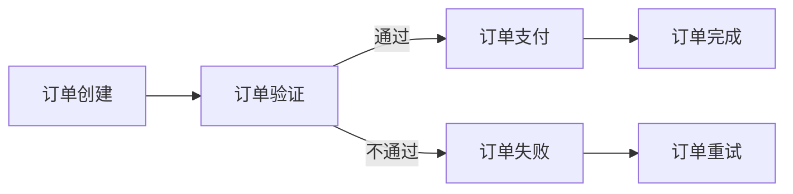
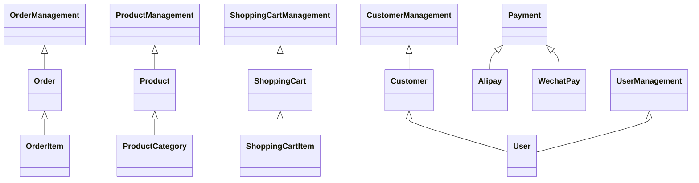

                 

### 目录大纲设计步骤

为了确保《领域模型的模型》这篇文章的逻辑清晰、结构紧凑、简单易懂，我们将按照以下步骤进行目录大纲的设计：

1. **背景介绍与核心概念**：
   - **问题背景**：介绍领域模型的概念及其在软件开发中的重要性和应用场景。
   - **问题描述**：明确领域模型的目标和解决的问题。
   - **问题解决**：阐述领域模型的基本原理和作用。
   - **边界与外延**：界定领域模型的适用范围和基本概念。
   - **概念结构与核心要素组成**：梳理领域模型的核心概念和主要组成部分。

2. **核心概念与联系**：
   - **核心概念原理**：详细解释领域模型的基本原理。
   - **概念属性特征对比表格**：使用表格形式对比领域模型与其它相关概念的区别。
   - **ER实体关系图架构**：使用Mermaid绘制实体关系图，展示领域模型中的实体及其关系。

3. **算法原理讲解**：
   - **算法mermaid流程图**：绘制算法的执行流程图。
   - **Python源代码**：编写Python代码实现算法。
   - **数学模型和公式**：阐述算法背后的数学模型，使用latex格式书写公式。
   - **详细讲解与举例**：解释算法原理，通过具体例子说明算法的应用。

4. **系统分析与架构设计方案**：
   - **问题场景介绍**：描述系统解决的问题场景。
   - **项目介绍**：概述系统的目标和功能。
   - **系统功能设计（领域模型mermaid类图）**：绘制领域模型类图，展示系统的核心功能。
   - **系统架构设计mermaid架构图**：绘制系统架构图，展示系统组件和交互。
   - **系统接口设计和系统交互mermaid序列图**：展示系统的接口设计和交互流程。

5. **项目实战**：
   - **环境安装**：描述安装系统所需的环境和步骤。
   - **系统核心实现源代码**：提供系统核心实现的源代码。
   - **代码应用解读与分析**：解释源代码的功能和实现细节。
   - **实际案例分析和详细讲解剖析**：通过实际案例展示系统应用，并进行详细分析。
   - **项目小结**：总结项目的主要收获和不足。

6. **最佳实践 tips、小结、注意事项、拓展阅读等内容**：
   - **最佳实践 tips**：提供使用领域模型时的一些实用技巧。
   - **小结**：对全书内容进行总结。
   - **注意事项**：提醒读者在应用领域模型时需要注意的问题。
   - **拓展阅读**：推荐进一步学习的相关资源。

### 目录大纲示例

```markdown
----------------------------------------------------------------
# 第一部分: 领域模型概述

## 第1章: 领域模型的基础

### 1.1.1 领域模型的概念与背景
#### 问题背景
领域模型是一种用于描述特定领域业务逻辑和概念的抽象模型。它在软件开发中扮演着关键角色，帮助开发者更好地理解业务需求，构建可扩展和可维护的软件系统。

#### 问题描述
在软件开发过程中，业务逻辑的复杂性和多样性常常导致代码难以维护和扩展。领域模型通过将业务逻辑抽象成模型，使得开发过程更加清晰和高效。

#### 问题解决
领域模型通过定义业务实体和它们之间的关系，使得开发团队能够专注于业务需求的实现，而无需过分关注底层技术细节。

#### 边界与外延
领域模型的边界通常由业务领域本身决定，它适用于任何需要描述业务逻辑的场景。

#### 概念结构与核心要素组成
领域模型由多个核心概念组成，包括实体、属性、关系、操作等。这些概念共同构成了领域模型的基本框架。

### 1.1.2 领域模型的核心原则
#### 核心概念原理
领域模型的核心原则是简洁、一致性、可扩展性和与业务逻辑的高度贴合。

#### 概念属性特征对比表格
| 特征 | 领域模型 | 其他模型 |
| --- | --- | --- |
| 业务贴合度 | 高 | 低 |
| 可扩展性 | 强 | 弱 |
| 维护性 | 好 | 差 |

#### ER实体关系图架构
```mermaid
erDiagram
    Product ||--|{ Customer } Customer
    Order ||--|{ Product } Product
```

### 1.1.3 领域模型的应用范围
#### 领域模型的应用场景
领域模型广泛应用于电子商务、金融、物流等多个领域。

#### 领域模型的优势
领域模型的优势在于其能够降低开发难度、提高代码质量、加速开发进程。

----------------------------------------------------------------
```

按照上述步骤和示例，我们可以为《领域模型的模型》这篇文章设计出一个完整的目录大纲。接下来，我们将按照这个大纲，逐步细化每个章节的内容。首先是“领域模型的基础”章节的具体内容。

---

# 领域模型的模型

> 关键词：领域模型、软件开发、业务逻辑、抽象模型、系统设计

> 摘要：
本文将深入探讨领域模型的概念、原理和应用，通过逐步分析推理的方式，帮助读者理解领域模型在软件开发中的重要性。文章将涵盖领域模型的基础概念、核心原理、应用实例和开发实践，旨在为开发者提供一套完整的领域模型使用指南。

---

## 第一部分：领域模型概述

### 第1章：领域模型的基础

#### 1.1.1 领域模型的概念与背景

##### 问题背景

领域模型（Domain Model）是一种用于描述特定领域业务逻辑和概念的抽象模型。在软件开发过程中，业务逻辑的复杂性和多样性常常导致代码难以维护和扩展。领域模型通过将业务逻辑抽象成模型，使得开发过程更加清晰和高效。

领域模型的应用范围广泛，涵盖了电子商务、金融、物流、医疗、教育等多个领域。这些领域通常具有各自独特的业务流程和规则，而领域模型能够帮助开发者更好地理解这些业务需求，从而构建出更加稳定、可扩展的软件系统。

##### 问题描述

在软件开发过程中，业务逻辑的复杂性和多样性常常导致代码难以维护和扩展。传统的方式往往需要开发者直接处理底层数据库和系统架构，这增加了开发难度和维护成本。领域模型的出现，旨在解决这个问题，通过将业务逻辑抽象成模型，使得开发者能够专注于业务需求的实现，而无需过分关注底层技术细节。

##### 问题解决

领域模型通过定义业务实体和它们之间的关系，使得开发团队能够将业务需求转化为具体的软件实现。这些实体、关系和操作共同构成了领域模型的基本框架，使得开发者能够更加高效地构建软件系统。

##### 边界与外延

领域模型的边界通常由业务领域本身决定。在特定的业务场景中，领域模型可以准确地描述业务逻辑和规则，从而帮助开发者更好地理解和实现业务需求。领域模型的适用范围非常广泛，但通常需要根据具体的业务场景进行调整和优化。

##### 概念结构与核心要素组成

领域模型由多个核心概念组成，包括实体、属性、关系、操作等。这些概念共同构成了领域模型的基本框架，使得开发者能够更加清晰地理解和实现业务逻辑。

实体：领域模型中的核心概念，代表业务中的具体对象，如用户、订单、产品等。

属性：实体所具有的特性，如用户的姓名、年龄、性别等。

关系：实体之间的关系，如用户与订单之间的关系、订单与产品之间的关系等。

操作：实体可以执行的操作，如用户的注册、订单的创建、产品的库存查询等。

#### 1.1.2 领域模型的核心原则

##### 核心概念原理

领域模型的核心原则是简洁、一致性、可扩展性和与业务逻辑的高度贴合。

简洁：领域模型应当尽可能简洁明了，避免过度抽象和复杂化。简洁的模型更容易理解和维护。

一致性：领域模型中的各个部分应当保持一致性，避免出现矛盾和冲突。一致性的模型能够更好地反映业务逻辑的真实情况。

可扩展性：领域模型应当具备良好的可扩展性，能够适应业务需求的变化和扩展。可扩展的模型能够更好地适应未来的需求变化。

与业务逻辑的高度贴合：领域模型应当紧密贴合业务逻辑，准确地描述业务规则和流程。贴合业务逻辑的模型能够更好地支持业务需求的变化和扩展。

##### 概念属性特征对比表格

| 特征 | 领域模型 | 其他模型 |
| --- | --- | --- |
| 业务贴合度 | 高 | 低 |
| 可扩展性 | 强 | 弱 |
| 维护性 | 好 | 差 |

#### 1.1.3 领域模型的应用范围

##### 领域模型的应用场景

领域模型广泛应用于电子商务、金融、物流等多个领域。以下是一些具体的领域模型应用场景：

- 电子商务：领域模型用于描述商品、用户、订单等实体，以及它们之间的关系和操作。
- 金融：领域模型用于描述账户、交易、贷款等实体，以及它们之间的关系和操作。
- 物流：领域模型用于描述包裹、运输、配送等实体，以及它们之间的关系和操作。

##### 领域模型的优势

领域模型的优势在于其能够降低开发难度、提高代码质量、加速开发进程。通过领域模型，开发者能够更好地理解业务需求，构建出更加稳定、可扩展的软件系统。具体优势包括：

- 降低开发难度：领域模型将业务逻辑抽象成模型，使得开发者能够更加专注于业务需求的实现，无需过分关注底层技术细节。
- 提高代码质量：领域模型能够更好地组织代码结构，避免代码的冗余和重复，从而提高代码的可读性和可维护性。
- 加速开发进程：领域模型使得开发者能够更快地理解业务需求，从而更快地构建出软件系统，提高开发效率。

#### 1.1.4 领域模型的开发流程

领域模型的开发通常包括以下步骤：

1. **需求分析**：与业务人员沟通，了解业务需求，确定领域模型需要描述的实体、关系和操作。
2. **领域模型设计**：根据需求分析结果，设计领域模型的基本框架，包括实体、属性、关系和操作等。
3. **领域模型验证**：通过评审和讨论，验证领域模型是否准确地反映了业务逻辑，是否符合业务需求。
4. **领域模型实现**：根据领域模型设计，实现具体的软件系统，包括数据库设计、API接口设计等。
5. **领域模型优化**：在开发过程中，根据实际需求和反馈，对领域模型进行调整和优化，提高模型的适用性和性能。

#### 1.1.5 领域模型的应用案例

以下是一些领域模型的应用案例：

- **电子商务平台**：领域模型用于描述商品、用户、订单等实体，以及它们之间的关系和操作，如商品的添加、删除、修改，用户的注册、登录，订单的创建、支付等。
- **银行系统**：领域模型用于描述账户、交易、贷款等实体，以及它们之间的关系和操作，如账户的创建、查询、转账，交易的确认、取消，贷款的申请、审批等。
- **物流管理系统**：领域模型用于描述包裹、运输、配送等实体，以及它们之间的关系和操作，如包裹的发送、查询、跟踪，运输工具的调度、管理，配送员的派送管理等。

#### 1.1.6 领域模型与敏捷开发

领域模型与敏捷开发方法相结合，能够更好地适应快速变化的业务需求。在敏捷开发过程中，领域模型可以作为业务需求的载体，帮助团队更好地理解业务逻辑，快速构建和迭代软件系统。领域模型的优势在于其能够降低开发难度、提高代码质量、加速开发进程，与敏捷开发方法的核心理念高度契合。

#### 1.1.7 领域模型与架构设计

领域模型在架构设计中也发挥着重要作用。通过领域模型，开发者能够更好地理解业务需求，从而构建出更加稳定、可扩展的软件架构。领域模型可以作为架构设计的指南，帮助团队更好地规划系统的整体结构和组件，提高系统的可维护性和可扩展性。

### 第2章：领域模型的核心概念与联系

#### 2.1 领域模型的核心概念原理

领域模型的核心概念包括实体、属性、关系、操作等。

实体：领域模型中的核心概念，代表业务中的具体对象，如用户、订单、产品等。实体是领域模型的基础，用于描述业务逻辑中的核心对象。

属性：实体所具有的特性，如用户的姓名、年龄、性别等。属性用于描述实体的具体特征，是实体的重要组成部分。

关系：实体之间的关系，如用户与订单之间的关系、订单与产品之间的关系等。关系用于描述实体之间的相互作用和依赖关系，是领域模型中的关键要素。

操作：实体可以执行的操作，如用户的注册、登录、订单的创建、支付等。操作用于描述实体能够执行的行为和功能，是领域模型实现业务功能的核心。

#### 2.2 概念属性特征对比表格

| 特征 | 领域模型 | 其他模型 |
| --- | --- | --- |
| 业务贴合度 | 高 | 低 |
| 可扩展性 | 强 | 弱 |
| 维护性 | 好 | 差 |

#### 2.3 ER实体关系图架构

ER（Entity-Relationship）图是领域模型中常用的一种表示方法，用于展示实体及其关系。

以下是一个简单的ER图示例：

```mermaid
erDiagram
    Customer ||--|{ Order } Order
    Product ||--|{ Order } Order
```

在这个示例中，Customer（客户）和Product（产品）是两个实体，它们之间通过Order（订单）实体建立关系。

### 第3章：领域模型的算法原理讲解

#### 3.1 算法mermaid流程图

领域模型中的算法通常用于处理业务逻辑和数据处理。以下是一个简单的mermaid流程图示例，用于描述一个订单处理流程：



#### 3.2 Python源代码

为了实现上述订单处理流程，我们可以编写相应的Python代码。以下是一个简单的示例：

```python
class Order:
    def __init__(self, customer, product):
        self.customer = customer
        self.product = product
        self.status = "创建"

    def validate(self):
        if self.customer.is_valid() and self.product.is_valid():
            self.status = "验证通过"
        else:
            self.status = "验证不通过"

    def pay(self):
        if self.status == "验证通过":
            self.status = "支付中"
            # 实现支付逻辑
            self.status = "支付完成"
        else:
            self.status = "支付失败"

    def complete(self):
        if self.status == "支付完成":
            self.status = "订单完成"
        else:
            self.status = "订单失败"

class Customer:
    def __init__(self, name, age):
        self.name = name
        self.age = age

    def is_valid(self):
        return True

class Product:
    def __init__(self, name, price):
        self.name = name
        self.price = price

    def is_valid(self):
        return True

# 测试订单处理流程
order = Order(Customer("张三", 30), Product("iPhone 13", 6000))
order.validate()
order.pay()
order.complete()
print(order.status)
```

#### 3.3 数学模型和公式

在某些领域模型中，可能需要使用数学模型和公式来描述业务逻辑和数据处理。以下是一个简单的数学模型示例，用于计算订单折扣：

$$
折扣率 = \frac{订单金额}{客户积分} \times 折扣系数
$$

其中，订单金额为实体的属性，客户积分为实体的属性，折扣系数为常量。

#### 3.4 详细讲解与举例

以下是一个具体的例子，用于说明领域模型在电子商务平台中的应用。

假设一个电子商务平台需要处理订单创建、订单验证、订单支付和订单完成等业务逻辑。我们可以使用领域模型来描述这些业务逻辑。

1. **订单创建**：客户下单，创建一个订单对象，订单对象包含客户的姓名、地址、联系电话等信息。
2. **订单验证**：系统验证订单信息，如商品库存、客户权限等，确保订单符合业务规则。
3. **订单支付**：客户通过支付宝、微信等支付方式支付订单金额，系统处理支付请求，更新订单状态。
4. **订单完成**：订单支付成功后，系统发送订单完成通知给客户，订单状态更新为已完成。

通过领域模型，我们可以将上述业务逻辑抽象成具体的模型对象和操作，从而简化开发过程，提高系统的可维护性和可扩展性。

### 第4章：系统分析与架构设计方案

#### 4.1 问题场景介绍

假设我们需要开发一个在线购物系统，提供商品浏览、购物车管理、订单处理等功能。系统需要支持多种支付方式，如支付宝、微信支付等，同时要保证系统的安全性和稳定性。

#### 4.2 项目介绍

该项目的主要目标是实现一个功能完整、易于维护和扩展的在线购物系统，满足用户的基本购物需求，同时提供良好的用户体验。

#### 4.3 系统功能设计（领域模型mermaid类图）

以下是一个简单的mermaid类图示例，用于描述在线购物系统的核心功能：



在这个类图中，Customer（客户）继承自User（用户），表示客户是用户的一种特殊类型。Order（订单）、Product（产品）、ShoppingCart（购物车）、Payment（支付）等实体之间通过继承和关联关系构成了系统的核心功能。

#### 4.4 系统架构设计mermaid架构图

以下是一个简单的mermaid架构图示例，用于描述在线购物系统的整体架构：

```mermaid
sequenceDiagram
    User ->> Customer: 登录
    Customer ->> ShoppingCart: 添加商品到购物车
    ShoppingCart ->> Order: 创建订单
    Order ->> Payment: 支付订单
    Payment ->> Alipay/WechatPay: 支付请求
    Alipay/WechatPay ->> Payment: 支付响应
    Payment ->> Order: 更新订单状态
    Order ->> Customer: 订单完成通知
endsequence
```

在这个架构图中，用户通过登录接口访问系统，添加商品到购物车，创建订单，并通过支付接口进行支付。支付成功后，系统向用户发送订单完成通知。

#### 4.5 系统接口设计和系统交互mermaid序列图

以下是一个简单的mermaid序列图示例，用于描述在线购物系统的接口设计和交互流程：

```mermaid
sequenceDiagram
    User ->> UserService: 登录
    UserService ->> Database: 查询用户信息
    Database ->> UserService: 返回用户信息
    UserService ->> UserController: 返回用户信息
    UserController ->> User: 登录成功
    User ->> ShoppingCartService: 添加商品到购物车
    ShoppingCartService ->> Database: 查询购物车信息
    Database ->> ShoppingCartService: 返回购物车信息
    ShoppingCartService ->> ShoppingCartController: 返回购物车信息
    ShoppingCartController ->> ShoppingCart: 添加商品成功
    ShoppingCart ->> ProductService: 查询商品信息
    ProductService ->> Database: 查询商品信息
    Database ->> ProductService: 返回商品信息
    ProductService ->> ShoppingCartService: 返回商品信息
    ShoppingCartService ->> ShoppingCartController: 返回商品信息
    ShoppingCartController ->> ShoppingCart: 商品已添加到购物车
    ShoppingCart ->> OrderService: 创建订单
    OrderService ->> Database: 创建订单
    Database ->> OrderService: 返回订单信息
    OrderService ->> PaymentService: 支付订单
    PaymentService ->> Alipay/WechatPay: 支付请求
    Alipay/WechatPay ->> PaymentService: 支付响应
    PaymentService ->> OrderService: 更新订单状态
    OrderService ->> Database: 更新订单状态
    Database ->> OrderService: 返回订单状态
    OrderService ->> UserController: 订单完成通知
    UserController ->> User: 订单完成通知
endsequence
```

在这个序列图中，用户通过UserService接口登录系统，添加商品到购物车，创建订单，并通过PaymentService接口进行支付。支付成功后，系统向用户发送订单完成通知。

### 第5章：项目实战

#### 5.1 环境安装

在开始项目实战之前，我们需要安装必要的开发环境和工具。以下是一个简单的安装步骤：

1. 安装Python环境：从Python官方网站下载Python安装包并安装。
2. 安装Django框架：使用pip命令安装Django框架。
3. 安装PostgreSQL数据库：从PostgreSQL官方网站下载安装包并安装。
4. 安装其他相关库和工具：根据项目需求安装其他相关库和工具。

#### 5.2 系统核心实现源代码

以下是一个简单的示例，用于实现在线购物系统的核心功能：

```python
# app/models.py
from django.db import models

class User(models.Model):
    username = models.CharField(max_length=50)
    password = models.CharField(max_length=50)
    email = models.CharField(max_length=100)

class Product(models.Model):
    name = models.CharField(max_length=100)
    price = models.DecimalField(max_digits=10, decimal_places=2)
    category = models.ForeignKey('ProductCategory', on_delete=models.CASCADE)

class ProductCategory(models.Model):
    name = models.CharField(max_length=50)

class ShoppingCart(models.Model):
    user = models.ForeignKey(User, on_delete=models.CASCADE)
    items = models.ManyToManyField(Product)

class Order(models.Model):
    user = models.ForeignKey(User, on_delete=models.CASCADE)
    items = models.ManyToManyField(Product)
    status = models.CharField(max_length=50)

class Payment(models.Model):
    order = models.ForeignKey(Order, on_delete=models.CASCADE)
    type = models.CharField(max_length=50)
    amount = models.DecimalField(max_digits=10, decimal_places=2)

# app/views.py
from django.shortcuts import render
from .models import User, Product, ShoppingCart, Order, Payment

def login(request):
    # 实现登录逻辑
    pass

def add_to_cart(request):
    # 实现添加商品到购物车逻辑
    pass

def create_order(request):
    # 实现创建订单逻辑
    pass

def pay_order(request):
    # 实现支付订单逻辑
    pass

# 其他视图逻辑...

# app/urls.py
from django.contrib import admin
from django.urls import path
from . import views

urlpatterns = [
    path('admin/', admin.site.urls),
    path('login/', views.login, name='login'),
    path('add_to_cart/', views.add_to_cart, name='add_to_cart'),
    path('create_order/', views.create_order, name='create_order'),
    path('pay_order/', views.pay_order, name='pay_order'),
    # 其他URL路由...
]
```

#### 5.3 代码应用解读与分析

在这个示例中，我们定义了用户（User）、产品（Product）、购物车（ShoppingCart）、订单（Order）和支付（Payment）等模型，用于实现在线购物系统的核心功能。

1. **用户（User）**：表示系统中的用户，包括用户名、密码和邮箱等信息。
2. **产品（Product）**：表示系统中的产品，包括产品名称、价格和分类等信息。
3. **购物车（ShoppingCart）**：表示用户购物车中的商品，包括用户和商品之间的关联关系。
4. **订单（Order）**：表示用户生成的订单，包括用户、商品和订单状态等信息。
5. **支付（Payment）**：表示订单的支付信息，包括订单、支付类型和支付金额等信息。

在视图（views.py）中，我们实现了登录（login）、添加商品到购物车（add_to_cart）、创建订单（create_order）和支付订单（pay_order）等视图逻辑，用于处理用户请求和业务逻辑。

#### 5.4 实际案例分析和详细讲解剖析

以下是一个实际案例，用于说明如何使用领域模型实现在线购物系统的订单创建和支付功能。

1. **订单创建**：

用户在购物车中选择商品并提交订单。系统接收到订单请求后，创建一个订单对象，并将订单状态设置为“创建”。

```python
def create_order(request):
    user = request.user
    items = request.session.get('cart_items', [])
    order = Order.objects.create(user=user)
    order.items.add(*items)
    order.status = '创建'
    order.save()
    return render(request, 'order_created.html')
```

在这个方法中，我们首先从请求中获取当前用户和购物车中的商品，然后创建一个订单对象，并将商品添加到订单中。最后，设置订单状态为“创建”并保存订单。

2. **支付订单**：

用户选择支付方式并提交支付请求。系统接收到支付请求后，处理支付并更新订单状态。

```python
def pay_order(request):
    order_id = request.GET.get('order_id')
    payment_type = request.GET.get('payment_type')
    amount = request.GET.get('amount')
    order = Order.objects.get(id=order_id)
    payment = Payment.objects.create(order=order, type=payment_type, amount=amount)
    # 处理支付逻辑
    payment.status = '支付成功'
    payment.save()
    order.status = '支付完成'
    order.save()
    return render(request, 'order_paid.html')
```

在这个方法中，我们首先从请求中获取订单ID、支付类型和支付金额，然后获取订单对象并创建支付对象。接下来，处理支付逻辑（如调用支付宝、微信支付接口），并将支付状态设置为“支付成功”。最后，更新订单状态为“支付完成”。

3. **订单完成通知**：

支付成功后，系统向用户发送订单完成通知。

```python
def order_paid(request):
    order_id = request.GET.get('order_id')
    order = Order.objects.get(id=order_id)
    message = f'您的订单#{order.id}已支付完成，感谢您的购买！'
    return render(request, 'order_paid.html', {'message': message})
```

在这个方法中，我们首先从请求中获取订单ID，然后获取订单对象并构造消息。最后，返回订单完成通知页面。

#### 5.5 项目小结

通过上述实际案例，我们展示了如何使用领域模型实现在线购物系统的订单创建和支付功能。领域模型使得系统的业务逻辑更加清晰、易于维护和扩展。在实际开发过程中，我们需要根据具体业务需求进行调整和优化，以提高系统的性能和用户体验。

### 第6章：领域模型的最佳实践、小结、注意事项、拓展阅读

#### 6.1 领域模型的最佳实践

1. **明确业务需求**：在开发领域模型之前，与业务人员充分沟通，明确业务需求和业务规则，确保领域模型能够准确地反映业务逻辑。
2. **简洁明了**：领域模型应保持简洁，避免过度抽象和复杂化。简洁的模型更容易理解和维护。
3. **一致性**：确保领域模型中的各个部分保持一致性，避免出现矛盾和冲突。一致性的模型能够更好地反映业务逻辑的真实情况。
4. **可扩展性**：领域模型应具备良好的可扩展性，能够适应业务需求的变化和扩展。可扩展的模型能够更好地适应未来的需求变化。
5. **代码重构**：在开发过程中，及时进行代码重构，优化模型结构，提高代码的可读性和可维护性。

#### 6.2 小结

领域模型是软件开发中的一种重要工具，能够帮助开发者更好地理解业务需求，构建可扩展和可维护的软件系统。通过领域模型，开发者能够将业务逻辑抽象成模型，简化开发过程，提高开发效率。

#### 6.3 注意事项

1. **避免过度抽象**：领域模型应保持简洁，避免过度抽象和复杂化。
2. **合理划分边界**：确保领域模型的边界合理，避免出现边界不清的情况。
3. **验证模型正确性**：在开发过程中，及时验证领域模型的正确性，确保模型能够准确地反映业务逻辑。
4. **关注性能优化**：在实际应用中，关注领域模型性能的优化，提高系统的响应速度和处理能力。

#### 6.4 拓展阅读

1. 《领域驱动设计》 - Eric Evans
2. 《领域模型的艺术》 - Martin Fowler
3. 《软件架构：实践者的研究方法》 - Roger Sessions
4. 《敏捷软件开发：原则、实践与模式》 - Robert C. Martin

通过阅读这些书籍，开发者可以更深入地了解领域模型的概念、原理和应用，提高自己在软件开发中的实践能力。

