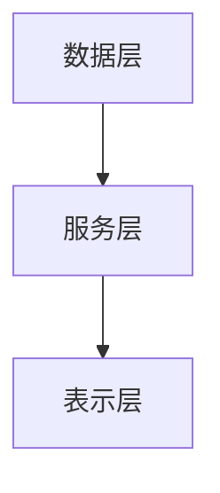
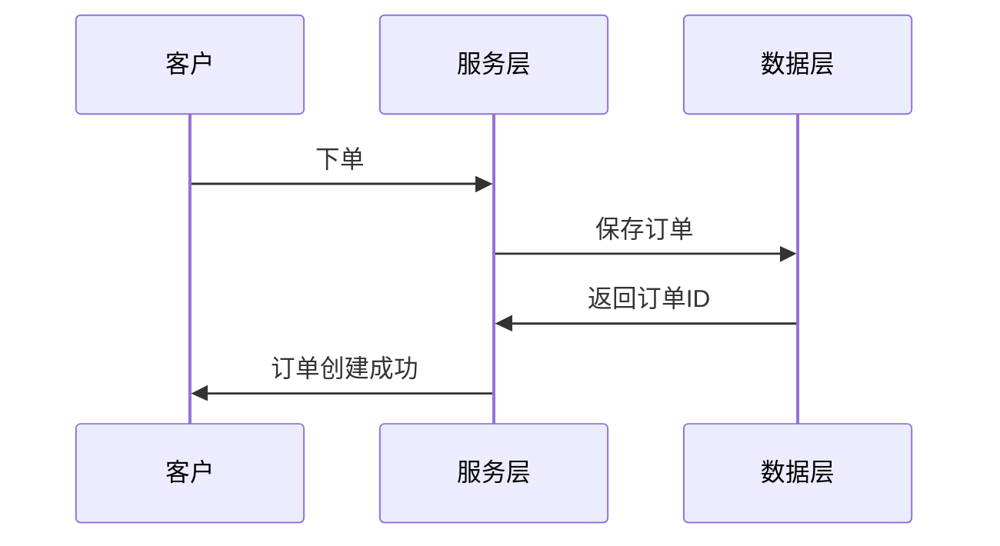

                 

# 领域模型神功可护体

## 关键词
- 领域模型
- 软件设计
- 领域驱动设计
- 实体关系图
- 数学模型
- 系统架构

## 摘要
本文将深入探讨领域模型的核心概念、设计原则和应用技巧，通过一步步分析推理，揭示领域模型在软件开发中的重要作用。我们将结合具体案例，讲解如何使用领域模型优化系统架构，提升软件开发的效率和质量。

## 第一部分：领域模型概述与重要性

### 1.1 领域模型的背景

#### 1.1.1 领域模型的概念与起源

领域模型（Domain Model）是指针对特定业务领域（Domain）的一组概念和它们之间的关系。它起源于20世纪80年代的软件工程领域，最初作为面向对象设计（Object-Oriented Design, OOD）的一部分出现。领域模型的概念帮助开发者更好地理解业务需求，并通过抽象和建模实现需求的软件实现。

#### 1.1.2 领域模型的演进历程

领域模型经历了从简单对象模型到复杂实体-关系模型，再到基于领域驱动设计（Domain-Driven Design, DDD）的演进。随着软件开发复杂度的增加，领域模型逐渐从辅助设计工具发展成为软件开发的核心框架。

#### 1.1.3 领域模型的应用领域

领域模型广泛应用于金融、保险、电子商务、物流等复杂业务领域，通过建模帮助开发者更好地理解和应对业务需求，从而提高软件开发的效率和质量。

### 1.2 领域模型的重要性

#### 1.2.1 领域模型对软件开发的影响

领域模型能够帮助开发者更好地理解业务需求，从而设计出更加贴近用户需求的软件系统。它不仅提高了软件的可维护性，还降低了开发成本。

#### 1.2.2 领域模型的优势

领域模型的优势包括：

1. **高内聚、低耦合**：领域模型通过抽象和封装，实现了模块之间的低耦合和高内聚，提高了系统的可维护性和可扩展性。
2. **面向业务**：领域模型紧密结合业务逻辑，使得软件系统能够更好地适应业务变化。
3. **易于复用**：通过领域模型，开发者可以更好地复用代码和设计模式，提高开发效率。

#### 1.2.3 领域模型的发展趋势

随着云计算、大数据、人工智能等技术的发展，领域模型在软件开发中的应用越来越广泛。未来的领域模型将更加智能化，能够自适应地适应业务变化，提高软件开发的自动化水平。

## 第二部分：核心概念与联系

### 2.1 领域模型的基本概念

#### 2.1.1 实体与关系

实体（Entity）是领域模型中的核心概念，代表现实世界中的对象。例如，在电子商务系统中，客户（Customer）、订单（Order）等都是实体。

关系（Relationship）描述实体之间的交互和关联。例如，一个客户可以下多个订单，订单与客户之间是一对多的关系。

#### 2.1.2 领域模型的核心要素

领域模型的核心要素包括：

1. **实体**：定义领域中的关键对象。
2. **关系**：描述实体之间的交互和关联。
3. **属性**：实体具有的属性特征，例如客户的名字、地址等。
4. **行为**：实体能够执行的操作，例如客户可以下单、取消订单等。

#### 2.1.3 领域模型与数据模型的关系

领域模型和数据模型（Data Model）密切相关。领域模型通常基于数据模型构建，但比数据模型更加抽象和高层。数据模型关注的是数据存储和访问，而领域模型关注的是业务逻辑和业务需求。

### 2.2 领域模型与其他设计模式的关系

#### 2.2.1 领域模型与面向对象设计

领域模型与面向对象设计（OOD）有密切的联系。面向对象设计强调将现实世界的对象抽象为类，而领域模型则将面向对象设计与业务需求相结合，形成更加贴近业务的模型。

#### 2.2.2 领域模型与领域驱动设计（DDD）

领域驱动设计（DDD）是一种软件开发方法论，它强调通过领域模型来理解和构建复杂业务系统。领域模型是DDD的核心概念之一，DD

## 第三部分：算法原理讲解

### 3.1 领域模型的创建过程

#### 3.1.1 领域模型的构建方法

领域模型的创建通常遵循以下步骤：

1. **需求分析**：了解业务需求，确定领域模型需要涵盖的核心概念和关系。
2. **建模**：使用实体-关系图（Entity-Relationship Diagram, ERD）或其他建模工具，将需求转化为领域模型。
3. **验证**：验证领域模型是否满足业务需求，并进行优化。

#### 3.1.2 关系映射算法

关系映射算法是领域模型创建过程中的一项关键技术。它用于将业务逻辑中的关系映射到数据库中的表结构和关系。常见的映射算法包括：

1. **一对一映射**：用于表示实体之间的单值关系。
2. **一对多映射**：用于表示实体之间的多值关系。
3. **多对多映射**：用于表示实体之间的多对多关系。

#### 3.1.3 模型验证与优化

模型验证是确保领域模型正确性和完整性的重要步骤。常见的验证方法包括：

1. **一致性检查**：检查领域模型中的实体、关系和属性是否一致。
2. **完整性检查**：检查领域模型是否包含所有必要的概念和关系。
3. **优化**：通过合并实体、简化关系等方式优化领域模型，提高其可读性和可维护性。

### 3.2 数学模型与公式

在领域模型的设计过程中，数学模型和公式扮演着重要角色。以下是一个简单的数学模型示例：

$$
D = \frac{1}{2}mv^2 + U(x)
$$

其中，$D$ 表示系统的总能量，$m$ 表示系统的质量，$v$ 表示系统的速度，$U(x)$ 表示系统的势能。这个公式用于描述一个动态系统的能量分布。

#### 3.2.1 领域模型的设计策略

领域模型的设计策略包括：

1. **抽象**：通过抽象提取出领域模型的核心概念和关系，降低模型的复杂度。
2. **模块化**：将领域模型划分为多个模块，每个模块负责一个特定的功能。
3. **可扩展性**：设计时考虑未来的扩展性，使得领域模型能够适应业务变化。

#### 3.2.2 模型验证方法

模型验证是确保领域模型正确性和完整性的重要步骤。常见的验证方法包括：

1. **一致性检查**：检查领域模型中的实体、关系和属性是否一致。
2. **完整性检查**：检查领域模型是否包含所有必要的概念和关系。
3. **测试**：通过编写测试用例对领域模型进行测试，验证其功能是否符合预期。

## 第四部分：系统分析与架构设计

### 4.1 领域模型在实际项目中的应用

#### 4.1.1 项目介绍

以一个电子商务系统为例，介绍领域模型在实际项目中的应用。该系统主要包括客户管理、订单管理、库存管理等功能。

#### 4.1.2 系统功能设计

系统功能设计基于领域模型，包括以下实体和关系：

- 客户（Customer）与订单（Order）之间是一对多关系。
- 订单（Order）与商品（Product）之间是多对多关系。
- 商品（Product）与库存（Inventory）之间存在关联。

#### 4.1.3 系统架构设计

系统架构设计基于领域模型，包括以下组件：

- 数据层：负责数据存储和访问。
- 服务层：负责业务逻辑处理。
- 表示层：负责用户界面展示。

### 4.2 系统架构与接口设计

#### 4.2.1 系统架构图

系统架构图如下所示：



#### 4.2.2 接口设计

接口设计基于领域模型，包括以下接口：

- 客户接口（Customer Interface）
- 订单接口（Order Interface）
- 商品接口（Product Interface）
- 库存接口（Inventory Interface）

#### 4.2.3 系统交互图

系统交互图如下所示：



## 第五部分：项目实战

### 5.1 环境安装与配置

#### 5.1.1 开发环境搭建

- 安装Java开发环境（JDK 1.8及以上版本）
- 安装IDE（如IntelliJ IDEA）
- 安装数据库（如MySQL）

#### 5.1.2 工具与依赖安装

- 安装Maven（用于项目构建）
- 安装Spring Boot（用于快速开发）
- 安装MySQL（用于数据存储）

### 5.2 系统核心实现

#### 5.2.1 实现步骤

1. 创建Maven项目
2. 添加依赖
3. 定义领域模型
4. 实现服务层
5. 实现数据层
6. 编写测试用例

#### 5.2.2 源代码解读

以下是一个简单的领域模型示例：

```java
@Entity
public class Customer {
    @Id
    @GeneratedValue(strategy = GenerationType.IDENTITY)
    private Long id;

    private String name;
    private String email;

    @OneToMany(mappedBy = "customer")
    private List<Order> orders;

    // 构造器、getter和setter方法
}

@Entity
public class Order {
    @Id
    @GeneratedValue(strategy = GenerationType.IDENTITY)
    private Long id;

    private Date orderDate;

    @ManyToOne
    private Customer customer;

    @ManyToMany
    private List<Product> products;

    // 构造器、getter和setter方法
}

@Entity
public class Product {
    @Id
    @GeneratedValue(strategy = GenerationType.IDENTITY)
    private Long id;

    private String name;
    private double price;

    @ManyToMany(mappedBy = "products")
    private List<Order> orders;

    // 构造器、getter和setter方法
}
```

### 5.3 实际案例分析

#### 5.3.1 案例背景

假设一个电子商务系统需要实现订单管理系统，支持客户下单、查看订单、修改订单等功能。

#### 5.3.2 案例分析

1. 定义领域模型：根据需求分析，确定领域模型中的实体和关系。
2. 实现服务层：根据领域模型，实现订单管理服务的功能，包括下单、查看订单、修改订单等。
3. 实现数据层：使用数据库技术，实现领域模型的数据存储和访问。

#### 5.3.3 深入剖析

以下是对订单管理系统的深入剖析：

1. **领域模型设计**：根据需求分析，定义客户（Customer）、订单（Order）和商品（Product）三个实体，并确定它们之间的关系。

2. **服务层实现**：实现订单管理服务的功能，包括下单、查看订单、修改订单等。以下是一个简单的下单服务实现：

```java
@Service
public class OrderService {
    @Autowired
    private OrderRepository orderRepository;

    public Order createOrder(Customer customer, List<Product> products) {
        Order order = new Order();
        order.setCustomer(customer);
        order.setOrderDate(new Date());
        order.setProducts(products);

        return orderRepository.save(order);
    }
}
```

3. **数据层实现**：使用Spring Data JPA实现领域模型的数据存储和访问。以下是一个简单的订单数据访问对象实现：

```java
@Repository
public interface OrderRepository extends JpaRepository<Order, Long> {
    List<Order> findByCustomer(Customer customer);
}
```

### 5.4 项目小结

通过实际案例分析，我们可以看到领域模型在软件开发中的应用价值。领域模型不仅帮助开发者更好地理解业务需求，还提高了软件的可维护性和可扩展性。

## 第六部分：最佳实践与拓展

### 6.1 最佳实践

1. **需求分析**：在领域模型设计之前，进行充分的需求分析，确保领域模型能够准确反映业务需求。
2. **迭代开发**：领域模型设计是一个迭代过程，应根据业务需求的变化不断优化和调整。
3. **代码复用**：利用领域模型，实现代码的复用，提高开发效率。

### 6.2 小结

领域模型是软件开发中的重要工具，通过本文的讲解，我们了解了领域模型的核心概念、设计原则和应用技巧。领域模型不仅能够帮助开发者更好地理解业务需求，还能提高软件开发的效率和质量。

### 6.3 注意事项

1. **领域模型设计要贴近业务**：确保领域模型能够准确反映业务需求。
2. **领域模型要适度抽象**：避免过度设计，导致模型复杂度增加。
3. **领域模型要与数据库设计保持一致**：确保领域模型和数据模型之间的映射关系清晰。

### 6.4 拓展阅读推荐

1. 《领域驱动设计》（Eric Evans著）：深入讲解领域驱动设计的方法和实践。
2. 《领域模型与设计模式》（Philippe Kruchten著）：探讨领域模型与设计模式之间的关系。
3. 《领域模型实战》（Diana Larsen & Charlotte Wheeler著）：通过实际案例，介绍领域模型的设计和应用。

## 作者信息

作者：AI天才研究院/AI Genius Institute & 禅与计算机程序设计艺术 /Zen And The Art of Computer Programming

