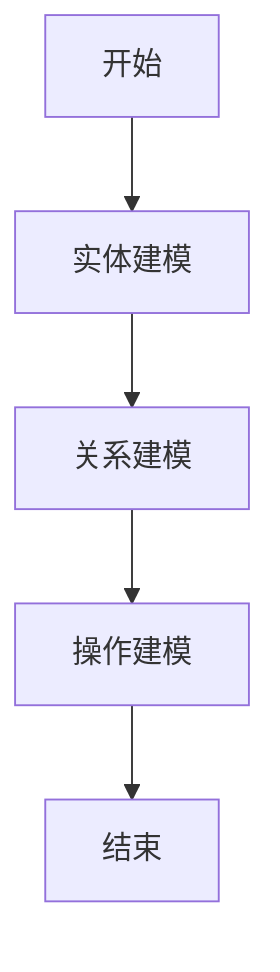

                 

### 《领域模型神功可护体》

关键词：领域模型、核心概念、应用场景、算法原理、数学模型

摘要：本文深入探讨了领域模型这一在软件开发中至关重要的概念，从背景介绍、核心概念与联系、算法原理讲解、数学模型应用、系统分析与架构设计、项目实战及最佳实践等方面，全面解析了领域模型的精髓。通过详细的步骤分析和实践案例，本文旨在帮助读者掌握领域模型的应用技巧，提升软件开发效率。

### 引言

领域模型是软件工程中的一个核心概念，它用于描述特定业务领域的实体、属性和关系。一个好的领域模型可以显著提升软件的可理解性、可维护性和扩展性。随着软件系统规模的不断扩大和复杂度的增加，领域模型的重要性愈发凸显。本文将带你一步一步深入领域模型的世界，掌握其核心原理和应用技巧。

### 第一部分：背景与核心概念

#### 第1章：领域模型的起源与重要性

1.1 问题背景：随着软件工程的发展，复杂系统越来越普遍，如何有效地管理和设计这些系统成为一个亟待解决的问题。领域模型作为一种应对复杂性的工具，逐渐受到关注。

1.2 领域模型的概念与定义：领域模型是一种抽象的表示方法，用于描述一个特定领域的实体、属性和关系。它通过概念、类、关系等元素来表示业务领域，使得软件开发者能够更好地理解业务需求。

1.3 领域模型的应用领域：领域模型广泛应用于金融、电商、医疗、物流等各个领域，是现代软件系统设计的基石。

1.4 领域模型的重要性：领域模型有助于提高软件的可维护性和扩展性，降低开发成本，加速开发进程，是软件工程中不可或缺的一部分。

#### 第2章：领域模型的核心概念与联系

2.1 核心概念原理

领域模型的核心概念包括实体、属性、关系和操作。实体是领域模型中最基本的元素，表示业务领域中的对象；属性描述实体的特征；关系表示实体之间的交互；操作则用于实现实体的功能。

2.2 概念属性特征对比表格

以下是一个简单的实体属性特征对比表格，展示了不同实体的属性和特征：

| 实体       | 属性               | 特征                             |
|------------|--------------------|--------------------------------|
| 客户       | 姓名、地址、电话   | 客户信息的唯一标识               |
| 商品       | 名称、价格、库存   | 商品的唯一标识                   |
| 订单       | 订单号、订单日期   | 订单信息的唯一标识               |

2.3 领域模型的ER实体关系图

领域模型的ER实体关系图用于表示实体之间的关系。以下是一个简化的ER实体关系图示例：

```mermaid
erDiagram
  客户 ||--|{ 订单 }|
  订单 ||--|{ 商品 }|
```

在这个ER图中，客户和订单之间存在一对多的关系，订单和商品之间也存在一对多的关系。

### 第二部分：领域模型的原理与算法

#### 第3章：领域模型的基本原理

3.1 领域模型的基本原理

领域模型的基本原理包括实体建模、关系建模和操作建模。实体建模关注如何表示业务领域的对象；关系建模关注如何描述实体之间的关系；操作建模关注如何实现实体的功能。

3.2 算法mermaid流程图

以下是一个简单的领域模型算法流程图示例：



在这个流程图中，实体建模、关系建模和操作建模是依次进行的，每个步骤都有明确的输入和输出。

#### 第4章：领域模型的数学模型

4.1 数学模型

领域模型的数学模型用于描述实体之间的关系和属性。以下是一个简单的数学模型示例：

$$
关系 = 实体1 \times 实体2
$$

在这个模型中，实体1和实体2之间的关系是一个乘积关系。

4.2 数学公式详细讲解

数学模型中的公式用于描述实体之间的关系。以下是对上述公式的详细讲解：

- 实体1和实体2表示两个不同的实体；
- 关系表示实体之间的关联关系；
- 乘积表示两个实体的组合。

#### 第5章：领域模型的应用案例

5.1 案例一：领域模型在金融风险管理中的应用

在金融风险管理中，领域模型可以帮助金融机构更好地理解和管理风险。例如，通过领域模型可以描述客户、贷款、抵押品等实体，以及它们之间的关系。

5.2 案例二：领域模型在电商推荐系统中的应用

在电商推荐系统中，领域模型可以帮助系统更好地理解用户行为和偏好。例如，通过领域模型可以描述用户、商品、购买记录等实体，以及它们之间的关系。

### 第三部分：领域模型的项目实战

#### 第6章：领域模型项目实战

6.1 环境安装

在进行领域模型项目实战之前，需要安装相关的开发环境和工具。例如，可以使用Eclipse或IntelliJ IDEA等集成开发环境（IDE），以及UML工具如Visual Paradigm或StarUML等。

6.2 系统核心实现源代码

以下是一个简单的领域模型项目实现的Python代码示例：

```python
class Customer:
    def __init__(self, name, address, phone):
        self.name = name
        self.address = address
        self.phone = phone

    def buy(self, product):
        print(f"{self.name} bought {product.name}")

class Product:
    def __init__(self, name, price, stock):
        self.name = name
        self.price = price
        self.stock = stock

    def check_stock(self):
        if self.stock > 0:
            print(f"{self.name} is in stock.")
        else:
            print(f"{self.name} is out of stock.")

class Order:
    def __init__(self, order_id, order_date):
        self.order_id = order_id
        self.order_date = order_date

    def add_product(self, product):
        self.products.append(product)

customer = Customer("John", "123 Main St", "555-5555")
product = Product("Laptop", 1000, 10)
order = Order("1001", "2022-01-01")

customer.buy(product)
order.add_product(product)
```

6.3 代码应用解读与分析

在这个代码示例中，我们定义了三个类：Customer（客户）、Product（商品）和Order（订单）。每个类都包含了必要的属性和方法。通过这些类，我们可以创建客户、商品和订单，并进行相应的操作。

#### 第7章：领域模型最佳实践

7.1 最佳实践 tips

- 确保领域模型与业务需求紧密对应，避免过度设计；
- 优先考虑核心实体的建模，逐步扩展；
- 避免在领域模型中引入过多的操作；
- 定期复审领域模型，确保其持续适应业务需求。

7.2 小结

领域模型是软件工程中的一个重要概念，它有助于提升软件系统的可维护性和扩展性。通过本文的介绍，读者应该对领域模型有了更深入的理解，并掌握了领域模型的基本原理和应用技巧。

7.3 注意事项

- 在实际项目中，领域模型的设计需要与业务人员紧密合作，确保模型能够准确反映业务需求；
- 领域模型的设计应遵循适度原则，避免过度设计；
- 领域模型的设计是一个持续迭代的过程，需要定期复审和调整。

7.4 拓展阅读

- 《领域驱动设计（Domain-Driven Design）：软件核心复杂性应对策略》
- 《领域驱动设计实践指南（Domain-Driven Design Distilled）》
- 《领域模型实战：面向对象的软件设计》

### 结论

领域模型是软件开发中不可或缺的一部分，它有助于提升软件系统的可维护性和扩展性。通过本文的介绍，读者应该对领域模型有了更深入的理解，并掌握了领域模型的基本原理和应用技巧。希望本文能够对您的软件开发工作有所帮助。

### 作者信息

作者：AI天才研究院/AI Genius Institute & 禅与计算机程序设计艺术 /Zen And The Art of Computer Programming

