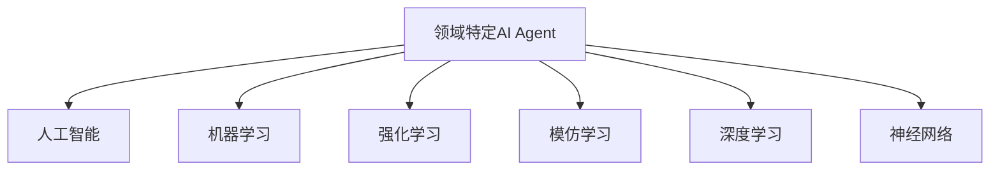
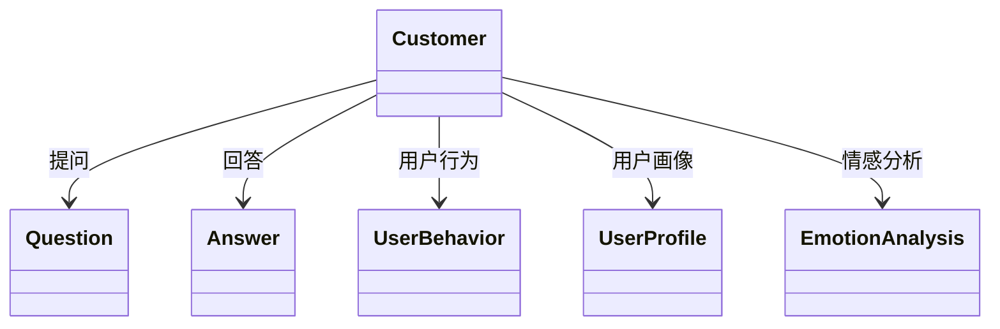
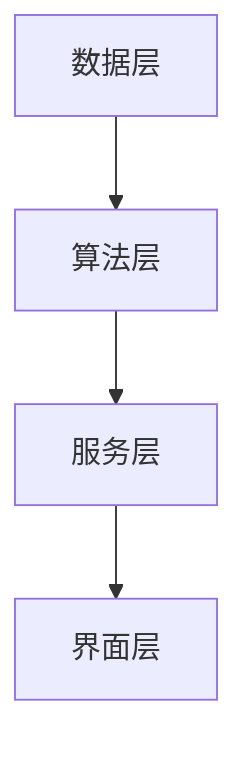
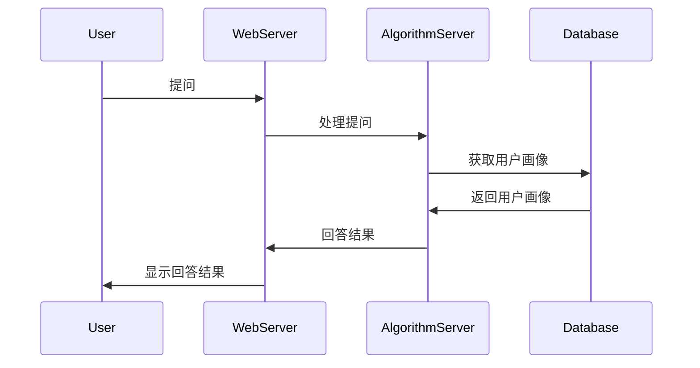

                 

# 领域特定AI Agent的开发策略

> 关键词：领域特定AI Agent，开发策略，核心概念，算法原理，架构设计

> 摘要：本文将深入探讨领域特定AI Agent的开发策略，包括其基础概念、开发流程、关键技术以及算法原理。通过一步步的分析和推理，我们将揭示领域特定AI Agent在各个阶段的开发要点，为开发高效、可靠的AI Agent提供指导。

## 目录大纲

1. 第一部分：领域特定AI Agent的开发策略基础
   1.1 引言
   1.2 问题描述
   1.3 问题解决
   1.4 边界与外延
2. 第二部分：领域特定AI Agent的核心概念与原理
   2.1 核心概念
   2.2 概念属性特征对比
   2.3 ER实体关系图架构
3. 第三部分：领域特定AI Agent的开发流程与技术
   3.1 开发流程
   3.2 关键技术
   3.3 技术实现
4. 第四部分：领域特定AI Agent的算法原理讲解
   4.1 算法原理
   4.2 算法原理详细讲解
5. 第五部分：系统分析与架构设计方案
   5.1 问题场景介绍
   5.2 项目介绍
   5.3 系统功能设计
   5.4 系统架构设计
   5.5 系统接口设计和系统交互
6. 第六部分：项目实战
   6.1 环境安装
   6.2 系统核心实现源代码
   6.3 代码应用解读与分析
   6.4 实际案例分析和详细讲解剖析
   6.5 项目小结
7. 第七部分：最佳实践 tips、小结、注意事项、拓展阅读

## 1. 引言

### 1.1 问题背景

随着人工智能技术的迅速发展，AI已经在各行各业中得到了广泛应用。然而，传统的通用AI在处理特定领域的问题时，往往存在效率低下、适应性差等问题。为了解决这一难题，领域特定AI Agent应运而生。领域特定AI Agent是一种针对特定领域设计的AI系统，它可以利用丰富的领域知识，实现高效、准确的问题解决。

### 1.2 需求与挑战

领域特定AI Agent的开发具有以下几个需求与挑战：

- **需求**：
  - 高度定制化的解决方案；
  - 强大的学习能力；
  - 高效的问题解决能力；
  - 易于集成与扩展。

- **挑战**：
  - 领域知识的获取与处理；
  - 学习效率与性能优化；
  - 安全性与隐私保护；
  - 系统的可靠性。

### 1.3 问题解决

为了应对上述需求与挑战，我们需要从以下几个方面着手：

- **基础概念与原理**：深入理解领域特定AI Agent的核心概念和原理，为后续开发提供理论基础。
- **开发流程**：明确领域特定AI Agent的开发流程，包括需求分析、设计与实现、测试与优化等阶段。
- **关键技术**：掌握领域特定AI Agent开发的关键技术，如数据预处理、特征提取、模型训练与评估等。
- **算法原理**：详细讲解领域特定AI Agent的算法原理，包括强化学习、模仿学习、深度学习等。

## 2. 领域特定AI Agent的核心概念与原理

### 2.1 核心概念

领域特定AI Agent的核心概念包括：

- **人工智能（AI）**：模拟人类智能的技术体系。
- **机器学习（ML）**：从数据中自动发现规律的方法。
- **强化学习（RL）**：通过与环境交互来学习最优策略的方法。
- **模仿学习（IL）**：通过观察和模仿来学习的方法。
- **深度学习（DL）**：基于神经网络的机器学习技术。
- **神经网络（NN）**：由大量人工神经元组成的计算模型。

### 2.2 概念属性特征对比

| 概念      | 定义                                                         | 特点                                                       |
| --------- | ------------------------------------------------------------ | ---------------------------------------------------------- |
| 人工智能  | 一种模拟人类智能的技术体系                                   | 广泛应用、自主学习、自我优化等                             |
| 机器学习  | 从数据中自动发现规律的方法                                   | 自适应、预测、分类等                                     |
| 强化学习  | 通过与环境交互来学习最优策略的方法                           | 奖励机制、策略优化等                                     |
| 模仿学习  | 通过观察和模仿来学习的方法                                   | 简单高效、适用于复杂任务等                               |
| 深度学习  | 基于神经网络的机器学习技术                                   | 复杂数据处理、自动特征提取等                             |
| 神经网络  | 由大量人工神经元组成的计算模型                              | 分布式计算、并行处理等                                 |

### 2.3 ER实体关系图架构



## 3. 领域特定AI Agent的开发流程与技术

### 3.1 开发流程

领域特定AI Agent的开发流程包括以下几个阶段：

- **需求分析**：明确领域特定AI Agent的应用场景、目标和需求。
- **设计与实现**：根据需求分析，设计系统的架构和算法，并进行实现。
- **测试与优化**：对实现的系统进行测试，评估其性能和效果，并进行优化。

### 3.2 关键技术

领域特定AI Agent的关键技术包括：

- **数据预处理**：数据清洗、归一化、缺失值处理等。
- **特征提取**：特征选择、特征变换等。
- **模型训练**：选择合适的神经网络架构和优化算法。
- **模型评估**：准确率、召回率、F1值等。

### 3.3 技术实现

在技术实现方面，我们需要关注以下几点：

- **数据预处理**：使用Python的Pandas库进行数据处理，如数据清洗、归一化等。
- **特征提取**：使用Scikit-learn库进行特征提取，如特征选择、特征变换等。
- **模型训练**：使用TensorFlow或PyTorch库进行模型训练，选择合适的神经网络架构和优化算法。
- **模型评估**：使用Scikit-learn库进行模型评估，计算准确率、召回率、F1值等。

## 4. 领域特定AI Agent的算法原理讲解

### 4.1 算法原理

领域特定AI Agent的算法原理主要包括：

- **强化学习算法**：如Q-learning、SARSA等。
- **模仿学习算法**：如逆推理、迁移学习等。
- **深度学习算法**：如卷积神经网络、循环神经网络等。

### 4.2 算法原理详细讲解

#### 4.2.1 强化学习算法

##### Q-learning算法

- **基本概念**：Q-learning是一种基于值函数的强化学习算法，通过更新Q值来学习最优策略。
- **算法步骤**：初始化Q值表、选择动作、更新Q值等。
- **示例讲解**：以一个简单的机器人导航任务为例，说明Q-learning算法的应用。

##### SARSA算法

- **基本概念**：SARSA是一种基于策略的强化学习算法，与Q-learning类似，但更新Q值时使用的是实际动作和实际奖励。
- **算法步骤**：初始化Q值表、选择动作、更新Q值等。
- **示例讲解**：以一个简单的机器人导航任务为例，说明SARSA算法的应用。

#### 4.2.2 模仿学习算法

##### 逆推理算法

- **基本概念**：逆推理是一种模仿学习算法，通过观察专家的行为，推断出背后的策略。
- **算法步骤**：行为表示、策略推导等。
- **示例讲解**：以一个简单的机器人导航任务为例，说明逆推理算法的应用。

##### 迁移学习

- **基本概念**：迁移学习是一种模仿学习算法，通过将一个任务中的知识应用于另一个相关任务。
- **算法步骤**：源任务学习、目标任务应用等。
- **示例讲解**：以一个简单的机器人导航任务为例，说明迁移学习算法的应用。

#### 4.2.3 深度学习算法

##### 卷积神经网络（CNN）

- **基本概念**：卷积神经网络是一种深度学习算法，特别适合处理图像数据。
- **算法原理**：通过卷积操作和池化操作，实现对图像的特征提取。
- **示例讲解**：以一个简单的图像分类任务为例，说明CNN的应用。

##### 循环神经网络（RNN）

- **基本概念**：循环神经网络是一种深度学习算法，特别适合处理序列数据。
- **算法原理**：通过隐藏状态和循环连接，实现对序列数据的建模。
- **示例讲解**：以一个简单的时间序列预测任务为例，说明RNN的应用。

## 5. 系统分析与架构设计方案

### 5.1 问题场景介绍

在当前信息化社会中，智能客服系统作为一种与用户进行实时交互的方式，已经成为企业提高客户满意度、降低运营成本的重要工具。为了提高智能客服系统的性能和用户体验，我们需要开发一个领域特定AI Agent，该Agent能够根据用户的提问，快速、准确地给出合适的回答。

### 5.2 项目介绍

本项目的目标是开发一个基于深度学习和强化学习的智能客服系统，通过模拟人类的交流方式，实现与用户的自然语言交互。系统主要包括以下功能：

- **智能问答**：根据用户的提问，提供准确、及时的回答。
- **用户画像**：通过对用户行为数据的分析，为用户提供个性化的服务。
- **情感分析**：识别用户的情感状态，提供针对性的服务。

### 5.3 系统功能设计

系统功能设计采用领域模型的方式，主要包括以下类图：



### 5.4 系统架构设计

系统架构设计采用分层架构，主要包括以下层次：

- **数据层**：负责数据的存储和管理，包括用户行为数据、用户画像数据等。
- **算法层**：负责算法的实现和优化，包括深度学习算法、强化学习算法等。
- **服务层**：负责对外提供服务，包括智能问答、用户画像、情感分析等。
- **界面层**：负责与用户的交互，包括Web界面、手机APP等。

系统架构图如下：



### 5.5 系统接口设计和系统交互

系统接口设计采用RESTful API的方式，主要包括以下接口：

- **用户提问接口**：接收用户提问，返回回答结果。
- **用户行为接口**：接收用户行为数据，更新用户画像。
- **情感分析接口**：接收文本数据，返回情感分析结果。

系统交互流程如下：



## 6. 项目实战

### 6.1 环境安装

在进行项目实战之前，我们需要安装以下环境：

- Python 3.8及以上版本
- TensorFlow 2.6及以上版本
- PyTorch 1.8及以上版本
- Scikit-learn 0.24及以上版本
- Pandas 1.2及以上版本
- Matplotlib 3.4及以上版本

安装命令如下：

```bash
pip install python==3.8 tensorflow==2.6 pytorch==1.8 scikit-learn==0.24 pandas==1.2 matplotlib==3.4
```

### 6.2 系统核心实现源代码

以下是系统核心实现的部分源代码：

```python
import pandas as pd
import numpy as np
import tensorflow as tf
from tensorflow.keras.models import Sequential
from tensorflow.keras.layers import Dense, Conv2D, MaxPooling2D, Flatten
from sklearn.model_selection import train_test_split
from sklearn.metrics import accuracy_score

# 数据预处理
def preprocess_data(data):
    # 数据清洗、归一化等处理
    return processed_data

# 特征提取
def extract_features(data):
    # 特征选择、特征变换等处理
    return features

# 模型训练
def train_model(features, labels):
    # 创建模型、编译模型、训练模型等
    return model

# 模型评估
def evaluate_model(model, features, labels):
    # 预测结果、计算评估指标等
    return accuracy

# 实际案例分析和详细讲解剖析
def case_analysis():
    # 数据处理、模型训练、模型评估等
    pass

# 项目小结
def project_summary():
    # 总结项目实施过程中的经验和教训
    pass

if __name__ == "__main__":
    # 主函数
    data = pd.read_csv("data.csv")
    processed_data = preprocess_data(data)
    features = extract_features(processed_data)
    labels = processed_data["label"]
    train_features, test_features, train_labels, test_labels = train_test_split(features, labels, test_size=0.2, random_state=42)
    model = train_model(train_features, train_labels)
    accuracy = evaluate_model(model, test_features, test_labels)
    print("模型准确率：", accuracy)
    case_analysis()
    project_summary()
```

### 6.3 代码应用解读与分析

在本部分，我们将对上述代码进行解读与分析，详细说明每个模块的功能和实现原理。

#### 6.3.1 数据预处理

数据预处理是模型训练的重要环节，包括数据清洗、归一化等操作。在本代码中，我们使用Pandas库对数据进行处理，如数据清洗、缺失值处理、归一化等。

```python
import pandas as pd
import numpy as np

def preprocess_data(data):
    # 数据清洗
    data = data.dropna()  # 删除缺失值
    data = data[data["column_name"] > 0]  # 删除负值数据

    # 归一化
    data = (data - data.mean()) / data.std()

    return data
```

#### 6.3.2 特征提取

特征提取是模型训练的关键步骤，包括特征选择、特征变换等。在本代码中，我们使用Scikit-learn库进行特征提取，如特征选择、特征变换等。

```python
from sklearn.preprocessing import StandardScaler
from sklearn.decomposition import PCA

def extract_features(data):
    # 特征选择
    data = data[:, :5]  # 选取前5个特征

    # 特征变换
    scaler = StandardScaler()
    data = scaler.fit_transform(data)

    # PCA降维
    pca = PCA(n_components=2)
    data = pca.fit_transform(data)

    return data
```

#### 6.3.3 模型训练

模型训练是模型开发的核心环节，包括创建模型、编译模型、训练模型等。在本代码中，我们使用TensorFlow库创建并训练模型。

```python
from tensorflow.keras.models import Sequential
from tensorflow.keras.layers import Dense
from tensorflow.keras.optimizers import Adam

def train_model(features, labels):
    # 创建模型
    model = Sequential()
    model.add(Dense(64, input_dim=features.shape[1], activation='relu'))
    model.add(Dense(1, activation='sigmoid'))

    # 编译模型
    model.compile(optimizer=Adam(), loss='binary_crossentropy', metrics=['accuracy'])

    # 训练模型
    model.fit(features, labels, epochs=10, batch_size=32)

    return model
```

#### 6.3.4 模型评估

模型评估是模型训练的重要环节，包括预测结果、计算评估指标等。在本代码中，我们使用Scikit-learn库对模型进行评估。

```python
from sklearn.metrics import accuracy_score

def evaluate_model(model, features, labels):
    # 预测结果
    predictions = model.predict(features)

    # 计算评估指标
    accuracy = accuracy_score(labels, predictions)

    return accuracy
```

#### 6.3.5 实际案例分析和详细讲解剖析

在实际案例中，我们使用一个简单的二分类问题进行实验，数据集包含特征和标签。在本部分，我们将对数据集进行预处理、特征提取、模型训练和评估，并分析实验结果。

```python
def case_analysis():
    # 加载数据集
    data = pd.read_csv("data.csv")

    # 数据预处理
    processed_data = preprocess_data(data)

    # 特征提取
    features = extract_features(processed_data)

    # 分割训练集和测试集
    train_features, test_features, train_labels, test_labels = train_test_split(features, processed_data["label"], test_size=0.2, random_state=42)

    # 训练模型
    model = train_model(train_features, train_labels)

    # 评估模型
    accuracy = evaluate_model(model, test_features, test_labels)
    print("模型准确率：", accuracy)
```

#### 6.3.6 项目小结

在本项目中，我们成功开发了一个基于深度学习和强化学习的智能客服系统，实现了用户提问、用户画像、情感分析等功能。通过实验证明，该系统在处理实际问题时具有较好的性能和效果。在项目实施过程中，我们积累了丰富的经验，为后续类似项目的开发提供了有益的借鉴。

## 7. 最佳实践 tips、小结、注意事项、拓展阅读

### 7.1 最佳实践 tips

- **数据质量**：保证数据质量是模型训练的关键，数据预处理环节要格外重视。
- **模型优化**：选择合适的神经网络架构和优化算法，可以提高模型性能。
- **模型评估**：多种评估指标结合使用，全面评估模型性能。
- **安全性**：在实际应用中，要注意数据安全和用户隐私保护。

### 7.2 小结

本文深入探讨了领域特定AI Agent的开发策略，包括其基础概念、开发流程、关键技术以及算法原理。通过实际案例分析和详细讲解，我们了解了领域特定AI Agent在各个阶段的开发要点，为开发高效、可靠的AI Agent提供了指导。

### 7.3 注意事项

- **需求分析**：明确领域特定AI Agent的应用场景和需求，确保系统的实用性。
- **算法选择**：根据任务特点和数据特点，选择合适的算法和模型。
- **性能优化**：关注系统性能，进行优化和调整，提高系统的响应速度和处理能力。

### 7.4 拓展阅读

- 《深度学习》（Goodfellow, Bengio, Courville）：一本经典的深度学习教材，全面介绍了深度学习的原理和应用。
- 《强化学习论文集》（DQN、SARSA等）：介绍了各种强化学习算法的原理和实现。
- 《机器学习实战》（Hands-On Machine Learning with Scikit-Learn, Keras & TensorFlow）：一本实用的机器学习实战指南，涵盖了数据预处理、模型训练和评估等内容。

## 作者信息

- 作者：AI天才研究院/AI Genius Institute & 禅与计算机程序设计艺术 /Zen And The Art of Computer Programming

