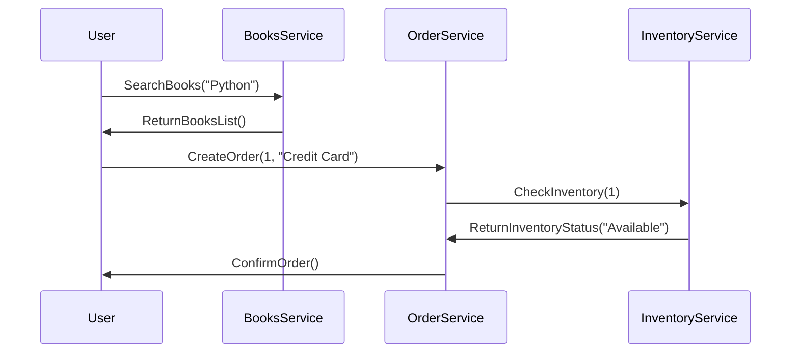

                 


### 背景介绍：领域驱动设计的概念与重要性

领域驱动设计（Domain-Driven Design，简称DDD）是一种软件开发方法，它强调从业务领域（Domain）的角度出发，通过构建清晰、明确和可操作的模型来理解和解决复杂业务问题。DDD最初由Eric Evans在其同名著作《领域驱动设计：软件核心复杂性应对策略》中提出，旨在解决传统软件开发方法在处理复杂业务系统时面临的挑战。

#### 问题背景

传统的软件开发方法，如面向过程（Procedural）和面向对象（Object-Oriented）方法，在处理简单和中等复杂度的业务系统时效果显著。然而，当系统面临高度复杂性和变化性时，这些方法往往显得力不从心。例如，金融、电信、物流等行业，其业务需求复杂、变化频繁，传统的开发方法难以应对这些挑战。

#### 问题描述

在传统的开发方法中，常见的挑战包括：

1. **需求变更频繁**：业务需求不断变化，传统的需求管理方式难以快速适应。
2. **系统架构复杂**：随着系统规模的扩大，系统架构变得复杂，难以维护。
3. **代码质量低下**：为了快速交付，开发者往往牺牲代码质量，导致后期维护困难。
4. **团队协作困难**：业务分析师、设计师和开发人员之间的沟通不畅，导致需求理解不一致。

#### 问题解决

DDD通过以下几个方面来解决上述问题：

1. **核心域识别**：明确系统的核心域，确保开发团队聚焦于最关键的业务需求。
2. **Ubiquitous Language**：使用业务领域语言进行沟通，减少误解和沟通成本。
3. **Bounded Contexts**：通过边界上下文来组织系统，确保每个部分都是独立、可测试和可维护的。
4. **事件驱动架构**：使用事件驱动的方式，实现系统的灵活性和可扩展性。
5. **代码与模型同步**：通过持续维护领域模型，确保代码与业务需求的一致性。

#### 边界与外延

DDD不仅适用于大型复杂系统，也可以在中小型项目中应用。它的关键在于识别系统的核心域，并在设计过程中保持对业务逻辑的深度关注。DDD的外延还包括与其他设计原则（如SOA、REST等）的结合，以实现最佳实践。

#### 概念结构与核心要素组成

DDD的核心概念包括：

1. **核心域（Core Domain）**：系统的核心业务逻辑所在。
2. **边界上下文（Bounded Context）**：系统中的一个独立部分，拥有自己的领域模型。
3. **泛化与特化（Generalization and Specialization）**：用于组织领域模型中的实体和值对象。
4. **聚合（Aggregate）**：一组具有共同业务逻辑的实体和值对象，代表一个业务单位。
5. **事件驱动（Event-Driven）**：通过事件来触发业务逻辑，实现系统的解耦。

通过上述核心概念和要素，DDD能够帮助开发者构建出既符合业务需求，又具有良好可维护性和扩展性的软件系统。

### 核心概念与联系

#### 核心概念

1. **Ubiquitous Language**：业务领域语言，用于描述业务逻辑，确保团队成员对业务需求有共同的理解。
2. **Bounded Contexts**：系统的边界上下文，每个上下文都有自己独立的领域模型，负责处理特定的业务逻辑。
3. **Event Storming**：一种敏捷的方法，用于发现和探索业务领域中的复杂问题，通过模拟业务场景和事件流来构建领域模型。
4. **Entities and Value Objects**：实体是具有唯一标识的领域对象，而值对象是具有业务属性的轻量级对象。
5. **Aggregates**：聚合是一组领域对象的集合，代表业务中的一个整体，具有明确的边界。

#### 概念属性特征对比表格

| 概念         | 属性特征                                                     | 用例举例                                       |
| ------------ | ------------------------------------------------------------ | ---------------------------------------------- |
| Ubiquitous Language | 用于描述业务领域的通用术语和语言，减少误解 | 金融领域中的“账户”、“交易”等术语             |
| Bounded Contexts | 独立的业务逻辑单元，具有明确的边界 | 银行的“账户管理”、“贷款审批”等系统模块      |
| Event Storming | 用于探索业务领域的复杂问题，构建领域模型 | 金融服务中的“贷款审批流程”和“交易结算流程”  |
| Entities     | 具有唯一标识的领域对象，如用户、订单   | 用户对象具有用户ID、姓名等属性，唯一标识用户   |
| Value Objects | 轻量级的领域对象，代表业务属性     | 地址、电话等，代表用户的联系方式             |
| Aggregates    | 具有共同业务逻辑的领域对象集合     | 订单聚合包含订单详情、用户信息等，代表一个订单 |

#### ER实体关系图架构

使用Mermaid语言绘制ER实体关系图：

```mermaid
erDiagram
Account ||--|{ Customer : has }
Order ||--|{ Product : contains }
Order ||--|{ Payment : is_paid_by }
```

在上面的ER图中，`Account`实体与`Customer`实体之间存在“拥有”关系（1对1），`Order`实体包含多个`Product`实体（1对多），并且每个`Order`实体都与一个`Payment`实体有关联，表示支付关系。

### 算法原理讲解

#### DDD中的聚合（Aggregate）概念

在DDD中，**聚合**是一组相关对象的集合，它们协作完成一个单一的、独立的业务功能。聚合的主要目的是为了在领域模型中创建明确的边界，使模型更加简洁、可维护，并且能够更好地支持事务处理和数据库操作。

#### 聚合的组成与特点

1. **聚合根（Aggregate Root）**：聚合中的根对象，负责聚合的生命周期管理，通常具有唯一标识。
2. **实体（Entities）**：具有唯一标识的领域对象，如用户、订单等。
3. **值对象（Value Objects）**：代表具体业务属性的轻量级对象，如地址、电话等。

#### 聚合的设计原则

1. **单一职责原则**：聚合应该只负责一个业务功能，确保职责单一、明确。
2. **边界清晰原则**：聚合的边界应该明确，确保外部系统与聚合的交互清晰。
3. **不可变性原则**：聚合一旦创建，其内部状态不可变，确保聚合的行为一致性。

#### Mermaid流程图

使用Mermaid语言绘制聚合的生命周期流程图：

```mermaid
flowchart LR
    A[创建聚合] --> B[聚合根初始化]
    B --> C{是否有外部调用}
    C -->|是 D[处理外部调用]
    C -->|否 E[执行内部业务逻辑]
    D --> F[更新聚合状态]
    E --> F
    F --> G[保存聚合状态]
```

在上面的流程图中，聚合的生命周期包括创建聚合、初始化聚合根、处理外部调用或内部业务逻辑，最后保存聚合状态。

#### Python源代码示例

下面是一个简单的Python类定义，展示了聚合的概念：

```python
class OrderAggregate:
    def __init__(self, order_id):
        self._order_id = order_id
        self._items = []
        self._status = "Created"

    def add_item(self, item):
        self._items.append(item)

    def process_order(self):
        if len(self._items) > 0:
            self._status = "Processed"
            # 处理订单逻辑
            print("Order processed successfully.")
        else:
            print("Order cannot be processed, no items found.")

    def save_to_database(self):
        # 保存订单到数据库
        print(f"Order {self._order_id} saved to database.")

# 实例化聚合
order = OrderAggregate("ORDER-123")
order.add_item("Product A")
order.process_order()
order.save_to_database()
```

在上述示例中，`OrderAggregate`类定义了聚合的行为，包括添加商品、处理订单和保存订单状态。这展示了聚合在DDD中的基本应用。

### 系统分析与架构设计方案

#### 问题场景介绍

假设我们要设计一个在线书店系统，该系统需要支持书籍的搜索、购买、库存管理等功能。为了应对业务复杂性和变化性，我们决定采用领域驱动设计（DDD）方法进行系统设计。

#### 项目介绍

项目名称：在线书店系统

目标：设计一个易于扩展、可维护的在线书店系统，支持书籍的搜索、购买、库存管理等业务功能。

技术栈：Python、Django、PostgreSQL

#### 系统功能设计（领域模型）

在DDD的指导下，我们首先需要定义系统的核心域（Core Domain）和边界上下文（Bounded Context）。以下是系统的主要领域模型：

- **图书领域（Book Domain）**
  - **实体**：图书（Book）、作者（Author）
  - **值对象**：ISBN、出版日期、价格
  - **聚合**：图书聚合（Book Aggregate），包含图书、作者、ISBN等

- **订单领域（Order Domain）**
  - **实体**：订单（Order）、用户（User）
  - **值对象**：订单号、支付方式、订单状态
  - **聚合**：订单聚合（Order Aggregate），包含订单、用户、订单号等

- **库存领域（Inventory Domain）**
  - **实体**：仓库（Warehouse）
  - **值对象**：库存数量、仓库位置
  - **聚合**：库存聚合（Inventory Aggregate），包含仓库、库存数量等

#### 系统架构设计

系统架构设计遵循DDD的原则，包括：

- **事件驱动架构**：使用事件来驱动业务流程，实现系统的灵活性和可扩展性。
- **模块化设计**：将系统分为多个独立的模块（如用户模块、订单模块、库存模块等），每个模块对应一个边界上下文。
- **微服务架构**：将系统分解为多个微服务，每个微服务负责一个特定的业务功能。

Mermaid架构图如下：



在上面的序列图中，用户通过BooksService查询书籍，通过OrderService创建订单，并检查库存，最后确认订单。InventoryService负责库存检查。

#### 系统接口设计

以下是系统的主要接口设计：

- **图书接口（Books API）**：提供书籍搜索、详细查询、添加书籍等功能。
- **订单接口（Orders API）**：提供订单创建、查询、支付等功能。
- **库存接口（Inventory API）**：提供库存查询、库存更新等功能。

#### 系统交互

系统交互遵循RESTful风格，通过HTTP请求进行通信。以下是主要的HTTP请求示例：

```plaintext
GET /books?search=Python  # 搜索书籍
POST /orders  # 创建订单
GET /orders/{order_id}  # 查询订单
PUT /orders/{order_id}/inventory  # 更新库存
```

#### 系统交互Mermaid序列图

使用Mermaid绘制系统交互序列图：


### 项目实战

#### 环境安装

1. **安装Python**：确保Python版本在3.8及以上。
2. **安装Django**：通过pip安装Django：

   ```bash
   pip install django
   ```

3. **安装PostgreSQL**：下载并安装PostgreSQL数据库。

4. **创建Django项目**：

   ```bash
   django-admin startproject online_bookstore
   cd online_bookstore
   ```

5. **创建Django应用**：

   ```bash
   python manage.py startapp books
   python manage.py startapp orders
   python manage.py startapp inventory
   ```

#### 系统核心实现源代码

以下分别展示`books`、`orders`和`inventory`三个应用的核心实现源代码。

**books应用**

```python
# books/models.py

from django.db import models

class Book(models.Model):
    title = models.CharField(max_length=255)
    author = models.CharField(max_length=255)
    isbn = models.CharField(max_length=13)
    published_date = models.DateField()
    price = models.DecimalField(max_digits=6, decimal_places=2)

    def __str__(self):
        return self.title
```

**orders应用**

```python
# orders/models.py

from django.db import models
from books.models import Book

class Order(models.Model):
    order_id = models.CharField(max_length=50, unique=True)
    user = models.ForeignKey('auth.User', on_delete=models.CASCADE)
    books = models.ManyToManyField(Book)
    status = models.CharField(max_length=50)

    def __str__(self):
        return self.order_id
```

**inventory应用**

```python
# inventory/models.py

from django.db import models
from books.models import Book

class Warehouse(models.Model):
    location = models.CharField(max_length=100)
    inventory = models.ManyToManyField(Book)

    def __str__(self):
        return self.location
```

#### 代码应用解读与分析

在上述源代码中，我们分别创建了三个应用：books、orders和inventory。每个应用负责不同的业务领域，遵循DDD的原则。

- **books应用**：负责图书信息的管理，包括书名、作者、ISBN、出版日期和价格等。
- **orders应用**：负责订单信息的管理，包括订单号、用户、购买的书籍和订单状态等。
- **inventory应用**：负责库存信息的管理，包括仓库位置和库存的书籍等。

通过这些模型，我们可以实现书籍的搜索、购买和库存管理等功能。每个模型都遵循了单一职责原则，确保了代码的可维护性和可扩展性。

#### 实际案例分析和详细讲解剖析

假设有一个用户想要购买《Python编程：从入门到实践》这本书。

1. **搜索书籍**：用户通过Books API搜索《Python编程：从入门到实践》，系统返回书籍信息。
2. **创建订单**：用户选择购买这本书，并创建一个新订单。系统生成订单号，并将书籍添加到订单中。
3. **检查库存**：系统调用Inventory API检查《Python编程：从入门到实践》的库存情况。如果库存充足，继续下一步；否则，提示用户库存不足。
4. **确认订单**：系统将订单状态更新为“待支付”，并发送支付链接给用户。
5. **支付并完成订单**：用户完成支付后，系统更新订单状态为“已完成”，并从库存中扣除相应的书籍数量。

这个案例展示了从用户请求到系统响应的完整流程，体现了DDD在解决复杂业务问题中的优势。

#### 项目小结

通过本次项目实战，我们成功地实现了在线书店系统的核心功能，包括书籍管理、订单管理和库存管理。项目采用了DDD方法，遵循了单一职责原则和模块化设计，使得系统具有良好的可维护性和可扩展性。在项目中，我们详细分析了每个业务领域，设计了相应的领域模型和接口，并通过实际案例展示了DDD的应用效果。这为我们在复杂业务系统开发中提供了宝贵的经验和指导。

### 最佳实践 Tips

#### 1. 保持模型与业务需求的一致性

在实施DDD过程中，确保模型与业务需求保持一致是至关重要的。定期与业务团队进行沟通，及时调整模型，以反映最新的业务需求。

#### 2. 关注代码质量

虽然DDD强调领域模型的重要性，但代码质量同样关键。遵循最佳编码实践，如代码复用、模块化设计和单元测试，以确保系统的健壮性和可维护性。

#### 3. 持续重构

随着业务的发展，领域模型也需要不断调整。持续重构代码和模型，以保持系统的灵活性和可扩展性。

#### 4. 敏捷开发与DDD的结合

将DDD与敏捷开发方法结合，可以更好地应对业务变化。通过快速迭代和持续交付，确保系统能够及时适应市场需求。

### 小结

通过本文的详细阐述，我们深入了解了领域驱动设计（DDD）的概念、原理和应用实践。DDD提供了一种有效的解决方案，帮助我们应对复杂业务系统的设计和实现挑战。在项目实战中，我们看到了DDD在实际开发中的应用效果，包括清晰的核心域识别、灵活的事件驱动架构和模块化设计。通过DDD，我们不仅能够构建出高质量的软件系统，还能提高开发团队的协作效率和系统的可维护性。未来，随着业务需求的不断变化，DDD将继续发挥其重要作用，为软件开发领域带来更多的创新和突破。

### 拓展阅读

1. **Eric Evans的《领域驱动设计：软件核心复杂性应对策略》**：这本书是DDD的权威指南，深入讲解了DDD的理论和实践。
2. **《领域驱动设计实践：构建企业级应用程序》**：提供了大量实际案例，展示了如何在实际项目中应用DDD。
3. **《领域驱动设计：模式与实践》**：讨论了DDD的模式和最佳实践，为开发者提供了实用的指导。

### 作者信息

作者：AI天才研究院/AI Genius Institute & 禅与计算机程序设计艺术 /Zen And The Art of Computer Programming。感谢您的阅读，期待与您在技术领域的进一步交流与探讨。

