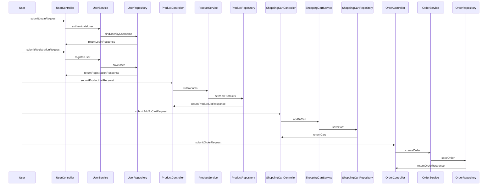
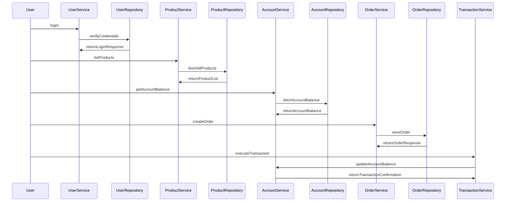

                 

### 写作步骤

在撰写一篇关于《领域驱动设计（DDD）：复杂业务系统的解决之道》的技术博客文章时，我们可以按照以下步骤进行：

#### 1. 文章结构设计

首先，我们要设计文章的整体结构，包括：

- **引言**：吸引读者，引入文章主题。
- **核心概念**：解释DDD的基本概念，为后续内容做准备。
- **分章节详细内容**：针对每个部分，详细阐述其内容。
- **案例分析**：通过具体案例展示DDD的应用。
- **总结与展望**：总结DDD的最佳实践，探讨未来趋势。
- **结语**：重申文章主题，为读者留下深刻印象。

#### 2. 核心内容提炼

在每一章节中，我们需要提炼出以下核心内容：

- **背景介绍**：核心概念术语说明、问题背景、问题描述、问题解决、边界与外延、概念结构与核心要素组成。
- **核心概念与联系**：给出核心概念原理、概念属性特征对比表格和ER实体关系图架构的Mermaid流程图。
- **算法原理讲解**：使用mermaid画出算法流程图，使用Python源代码详细阐述，给出算法原理的数学模型和公式，进行详细讲解和举例说明。
- **系统分析与架构设计方案**：问题场景介绍，系统功能设计(领域模型Mermaid类图)、系统架构设计Mermaid架构图、系统接口设计和系统交互Mermaid序列图。
- **项目实战**：环境安装、系统核心实现源代码，代码应用解读与分析，实际案例分析和详细讲解剖析，项目小结。
- **最佳实践 tips、小结、注意事项、拓展阅读等内容**。

#### 3. 内容撰写

在撰写内容时，我们可以按照以下步骤进行：

1. **撰写引言**：使用引人入胜的开头，引起读者的兴趣。
2. **核心概念阐述**：清晰、简洁地解释DDD的核心概念。
3. **分章节内容撰写**：详细撰写每个章节的内容，确保逻辑连贯，重点突出。
4. **案例分析**：选择合适的案例，详细展示DDD的应用。
5. **总结与展望**：总结文章的主要内容，提出未来展望。
6. **结语**：重申文章主题，强调DDD的重要性。

#### 4. 格式和排版

在撰写过程中，我们需要注意以下几点：

- **markdown格式**：使用markdown格式排版文章，确保格式规范，便于阅读。
- **代码和公式**：正确使用markdown格式中的代码块和公式，确保可读性和准确性。
- **段落和列表**：合理使用段落和列表，使文章结构清晰。

#### 5. 审稿与修改

撰写完成后，我们需要对文章进行审稿和修改：

- **内容检查**：检查文章内容是否完整、逻辑是否清晰。
- **格式检查**：检查markdown格式是否正确，确保文章格式美观。
- **语法和拼写**：检查文章中的语法错误和拼写错误。

通过以上步骤，我们可以撰写出一篇高质量、逻辑清晰、内容丰富的技术博客文章，全面阐述领域驱动设计（DDD）在复杂业务系统中的应用和优势。

### 文章大纲

**《领域驱动设计（DDD）：复杂业务系统的解决之道》**

**摘要：** 本文将深入探讨领域驱动设计（DDD）的核心概念、设计原则及其在复杂业务系统中的应用，通过具体案例分析和系统架构设计，展示DDD的强大实践价值。

**引言：** DDD的起源与背景

**关键词：** 领域驱动设计、复杂业务系统、系统架构设计、领域模型、实体关系图、Python代码示例

**目录：**

1. **领域驱动设计概述**
   - DDD的起源与背景
   - DDD的核心原则
   - DDD与传统开发方法的对比

2. **领域模型基础**
   - 领域与领域模型
   - 实体与值对象
   - 领域服务与聚合

3. **复杂业务系统的设计**
   - 复杂业务系统的需求分析
   - 领域建模实践
   - 系统架构设计

4. **DDD开发实践**
   - DDD开发模式
   - DDD测试策略
   - DDD代码组织与架构

5. **DDD案例分析**
   - 案例一：电子商务平台
   - 案例二：金融交易系统

6. **DDD最佳实践与展望**
   - DDD最佳实践
   - DDD的未来发展

**结语：** 总结与展望

**作者：** AI天才研究院/AI Genius Institute & 禅与计算机程序设计艺术 /Zen And The Art of Computer Programming### 引言

#### 领域驱动设计（DDD）的起源与背景

领域驱动设计（Domain-Driven Design，简称DDD）是一种针对复杂业务系统的软件设计方法，最早由Eric Evans在其2004年的同名书籍《领域驱动设计》中提出。DDD的诞生背景源于软件工程师在处理复杂业务系统时面临的挑战，特别是在业务领域高度专业化且需求变化频繁的情况下，传统的软件设计方法往往难以应对这种复杂性。

传统的软件开发方法，如瀑布模型和敏捷开发，侧重于软件的快速交付和迭代，但在应对复杂业务系统的设计时，往往忽略了业务领域的专业知识和系统性的解决方案。因此，开发者需要一种更为贴近业务逻辑的设计方法，以更好地理解和建模复杂的业务场景。

Eric Evans在多年的软件开发实践中，发现了很多团队在开发复杂业务系统时遇到的瓶颈。他结合自己的经验和对软件工程的深入理解，提出了一种以领域为核心的设计方法——领域驱动设计。DDD强调以业务领域为核心，通过构建清晰的领域模型，将业务逻辑与系统实现分离，从而提高系统的可维护性和扩展性。

DDD的核心思想在于“通过模型来驱动设计和开发”，这种方法不仅关注代码的实现，更注重对业务领域的深入理解。开发者需要与业务专家紧密合作，通过迭代的方式不断调整和完善领域模型，以确保系统与业务需求的高度一致。

#### DDD与传统开发方法的对比

传统的软件开发方法，如瀑布模型，通常将软件开发过程划分为若干固定的阶段，如需求分析、设计、编码、测试和维护。这种方法在早期阶段强调详细的文档和规划，但往往忽略了实际业务需求的变化，导致后期修改成本高昂。

相比之下，敏捷开发方法则更加灵活，它通过短周期的迭代和持续交付，来快速响应业务需求的变化。然而，敏捷开发在处理复杂业务系统时，仍然面临一些挑战。例如，在迭代过程中，如何确保每次迭代都能产生真正的业务价值，如何处理跨迭代的需求变化等。

而DDD则提供了一种更为系统的方法来应对这些挑战。首先，DDD强调领域模型的重要性，通过领域模型来明确业务领域中的核心概念、关系和规则。这种方法不仅有助于开发者更好地理解业务领域，还能在系统设计阶段就发现潜在的问题。

其次，DDD提倡通过迭代的方式不断演进领域模型。这种迭代过程不仅仅是代码的迭代，更是对业务理解和领域模型的不断优化。与敏捷开发不同的是，DDD的迭代过程更注重业务领域的深度挖掘和模型完善。

最后，DDD强调领域专家和开发者的紧密合作。在传统方法中，业务专家和开发者之间的沟通往往是单向的，业务专家提供需求，开发者进行实现。而在DDD中，业务专家和开发者共同参与领域模型的设计和演进，确保系统的设计与业务需求高度一致。

综上所述，DDD提供了一种更为系统、灵活且贴近业务的设计方法，它不仅关注系统的实现，更注重对业务领域的深入理解和持续演进。这使得DDD在处理复杂业务系统时具有独特的优势，能够更好地应对业务需求的变化和挑战。

### 领域模型基础

#### 领域与领域模型

领域驱动设计（DDD）的核心在于领域模型，而领域模型则是对业务领域的抽象和表示。领域，简单来说，就是业务专家所关心的业务范围，它包含了业务专家的职责、目标和所有相关的业务活动。领域模型则是开发者根据领域知识构建的一个抽象模型，用于指导系统的设计、实现和维护。

在DDD中，领域模型不仅仅是系统的一个设计工具，它是连接业务专家和开发者的桥梁，是确保系统设计与业务需求一致的关键。通过领域模型，开发者可以更好地理解业务领域，从而构建出符合业务逻辑的系统。

领域模型通常由以下几个部分组成：

1. **实体（Entities）**：实体是领域模型中的核心对象，它们具有唯一标识，并且可以存在于多个聚合中。实体通常表示业务中的真实对象，例如客户、订单等。
2. **值对象（Value Objects）**：值对象是领域模型中的小对象，它们没有唯一标识，但具有明确的业务意义。值对象通常表示业务中的具体值，例如日期、金额等。
3. **聚合（Aggregates）**：聚合是领域模型中的一组实体和值对象的组合，它定义了一个边界，用于封装业务逻辑和操作。聚合确保了在业务操作中，实体和值对象之间的关系是受控的。
4. **领域服务（Domain Services）**：领域服务是用于处理跨越多个聚合的业务逻辑的部分，它们不直接包含在聚合中，但需要访问多个聚合的数据。领域服务通常表示业务中的特定功能，例如订单处理、库存管理等。

通过构建领域模型，开发者可以清晰地定义业务领域中的核心概念、关系和规则，从而确保系统设计与业务需求的高度一致。领域模型不仅用于系统设计，还用于代码实现和文档编写，是DDD中不可或缺的一部分。

#### 实体与值对象

实体和值对象是领域模型中的两个核心元素，它们在DDD中有着特定的定义和作用。

**实体**

实体是领域模型中的核心对象，它们具有唯一标识，并且可以存在于多个聚合中。实体通常表示业务中的真实对象，例如客户、订单、商品等。实体具有以下特点：

1. **唯一标识**：每个实体都有唯一标识，这个标识在整个系统中是唯一的。唯一标识通常用于在系统中识别和操作实体。
2. **状态**：实体具有状态，状态表示实体在某一时刻的状态信息。实体的状态可以通过属性来表示，例如客户的姓名、地址等。
3. **行为**：实体具有行为，行为表示实体可以执行的操作。实体的行为通常与业务逻辑密切相关，例如客户可以创建订单、修改地址等。

在DDD中，实体不仅仅是一个数据存储的容器，它还包含了与业务逻辑相关的行为和规则。通过实体，开发者可以更好地表示业务领域中的真实对象，并确保系统的设计更加贴近业务需求。

**值对象**

值对象是领域模型中的小对象，它们没有唯一标识，但具有明确的业务意义。值对象通常表示业务中的具体值，例如日期、金额、颜色等。值对象具有以下特点：

1. **无唯一标识**：值对象没有唯一标识，因为它们通常用于表示具体的值，而不是独立的对象。
2. **状态**：值对象具有状态，状态表示值对象的值。例如，一个日期值对象可能包含年、月、日等信息。
3. **不变性**：值对象通常是不可变的，这意味着它们的值一旦创建，就不能修改。这种不变性有助于确保系统的数据一致性和可维护性。

在DDD中，值对象通常用于表示业务领域中的具体值，例如订单的金额、客户的生日等。通过使用值对象，开发者可以更好地表示业务领域中的具体数据，并确保系统的数据操作更加简洁和高效。

**实体与值对象的对比**

实体和值对象虽然在DDD中都是核心元素，但它们在定义和作用上有所不同：

1. **唯一标识**：实体具有唯一标识，而值对象没有。
2. **状态与行为**：实体具有状态和行为，而值对象只有状态，没有行为。
3. **用途**：实体用于表示业务中的真实对象，例如客户、订单等；值对象用于表示业务中的具体值，例如日期、金额等。

实体和值对象的区别在于它们在领域模型中的作用和角色。实体表示业务中的核心对象，具有独立的行为和状态；值对象表示业务中的具体值，通常用于支持实体的行为。

通过理解实体和值对象的特点和区别，开发者可以更准确地构建领域模型，确保系统设计与业务需求的一致性，并提高系统的可维护性和扩展性。

#### 领域服务与聚合

领域服务与聚合是领域驱动设计（DDD）中的两个关键概念，它们在系统中起着至关重要的作用。

**领域服务**

领域服务是用于处理跨越多个聚合的业务逻辑的部分，它们不直接包含在聚合中，但需要访问多个聚合的数据。领域服务通常表示业务中的特定功能，例如订单处理、库存管理、支付处理等。领域服务具有以下特点：

1. **业务逻辑**：领域服务用于实现业务逻辑，这些逻辑通常涉及多个聚合，需要跨聚合进行数据操作。例如，订单处理服务需要访问订单聚合、库存聚合和支付聚合，以完成订单的创建、更新和支付。
2. **独立性**：领域服务具有独立性，它们不直接包含在聚合中，但可以通过依赖注入等方式与聚合进行交互。这种独立性有助于确保系统的模块化和可维护性。
3. **协作性**：领域服务需要与其他领域服务协作，以实现复杂的业务功能。例如，订单处理服务可能需要与支付处理服务协作，以完成订单的支付和结算。

领域服务在系统中起到了桥梁的作用，它们连接了不同的聚合，协调了复杂的业务逻辑。通过领域服务，开发者可以更好地管理系统的业务逻辑，确保系统设计更加清晰和模块化。

**聚合**

聚合是领域驱动设计（DDD）中的一个核心概念，它表示一组紧密相关的实体和值对象的组合，这些元素共同构成了一个独立的业务单元。聚合具有以下特点：

1. **边界**：聚合定义了一个明确的边界，用于封装业务逻辑和操作。聚合的边界确保了在业务操作中，实体和值对象之间的关系是受控的，避免跨聚合的数据操作和依赖。
2. **内聚性**：聚合内的实体和值对象具有高度的内聚性，它们共同实现了一个完整的业务功能。例如，订单聚合包含订单实体、订单详情实体和订单状态值对象，它们共同构成了订单的管理功能。
3. **独立性**：聚合具有独立性，它们可以在系统中独立存在和运行。这种独立性有助于确保系统的可维护性和扩展性，开发者可以独立修改和优化聚合，而不会影响其他聚合。

聚合在系统中起到了容器的作用，它们将业务逻辑和数据封装在一起，提供了清晰的管理边界。通过聚合，开发者可以更好地组织和管理系统的业务功能，确保系统设计更加模块化和可扩展。

**领域服务与聚合的关系**

领域服务和聚合在DDD中有着密切的关系：

1. **协作**：领域服务通常与聚合协作，以实现复杂的业务功能。领域服务通过聚合的边界进行数据操作，确保系统的业务逻辑清晰和模块化。
2. **依赖**：领域服务依赖于聚合中的实体和值对象，以执行具体的业务操作。领域服务通过依赖注入等方式与聚合进行交互，确保系统的可维护性和扩展性。
3. **分离**：领域服务与聚合实现了业务逻辑和数据操作的分离，聚合负责数据的管理和封装，领域服务负责业务逻辑的实现和协调。

通过理解领域服务和聚合的特点和关系，开发者可以更准确地构建领域模型，确保系统设计与业务需求的一致性，并提高系统的可维护性和扩展性。

### 复杂业务系统的设计

#### 复杂业务系统的需求分析

在设计复杂业务系统时，需求分析是至关重要的第一步。复杂业务系统通常涉及多个业务领域和大量用户需求，因此深入理解这些需求并准确捕捉业务规则是成功构建系统的基础。

**需求获取**：

1. **业务调研**：首先，通过与业务专家、项目经理和最终用户的沟通，了解业务系统的目标和功能需求。业务调研可以采用访谈、问卷调查和用户故事地图等方法，以确保全面捕捉业务需求。
2. **用户故事**：在业务调研的基础上，编写用户故事，描述用户的需求和使用场景。用户故事应该简洁明了，描述用户如何与系统交互以及期望实现的功能。
3. **场景设计**：通过分析用户故事，设计具体的业务场景，这些场景描述了用户在特定业务流程中的操作和系统应如何响应。场景设计有助于明确系统功能模块和业务流程。

**需求建模**：

1. **领域模型**：构建领域模型，将业务需求抽象为领域概念和关系。领域模型包括实体、值对象、聚合和领域服务，用于表示业务领域中的核心概念和操作。
2. **用例图**：使用用例图表示系统的功能模块和用户角色，描述系统应如何响应用户操作。用例图有助于明确系统的功能范围和用户交互方式。
3. **状态机图**：对于涉及状态变化的业务过程，使用状态机图表示状态转换和规则。状态机图有助于理解和设计复杂业务逻辑。

**用户故事与场景设计**：

1. **用户故事**：编写用户故事，描述用户的需求和使用场景。用户故事应该简洁明了，包括用户角色、目标功能和使用场景。例如：“作为客服，我希望能够查看客户的订单历史，以便更好地为客户提供服务。”
2. **场景设计**：基于用户故事，设计具体的业务场景。场景设计应该详细描述业务流程、系统操作和用户交互。例如：
   - **场景1：查看订单历史**
     1. 用户登录系统。
     2. 用户选择“订单历史”菜单。
     3. 系统显示用户的订单列表。
     4. 用户可以查看每个订单的详细信息。

通过深入的需求分析和用户故事与场景设计，我们可以确保复杂业务系统的设计符合业务需求，并为后续的领域建模和系统架构设计奠定坚实基础。

#### 领域建模实践

在复杂业务系统的设计中，领域建模是关键的一步。领域建模不仅帮助我们理解和表示业务领域，还能为系统的设计和实现提供清晰的结构和指导。以下是领域建模的实践步骤和方法：

**1. 确定领域边界**

领域边界是领域模型的核心概念，它定义了系统的核心业务领域和外围业务领域。确定领域边界有助于明确系统的功能范围和责任划分。

**方法**：
- **业务调研**：通过访谈和问卷调查，与业务专家和用户沟通，了解业务领域的核心功能、流程和规则。
- **边界识别**：分析业务流程和需求，识别核心业务领域和外围业务领域，确定系统的边界。

**示例**：
- **核心领域**：订单管理、库存管理、客户关系管理
- **外围领域**：营销活动、财务报表、人力资源

**2. 定义领域模型的核心概念**

领域模型的核心概念包括实体、值对象、聚合和领域服务。这些概念用于表示业务领域中的核心对象、值和业务逻辑。

**方法**：
- **实体识别**：识别业务领域中的关键对象，如客户、订单、商品等，并为每个实体定义唯一标识和属性。
- **值对象识别**：识别业务领域中的小对象，如日期、金额等，并定义其属性和不变性。
- **聚合定义**：将相关的实体和值对象组合成聚合，确保聚合内的元素具有紧密的关联和内聚性。
- **领域服务设计**：识别业务逻辑中需要跨聚合操作的部分，设计领域服务来封装这些业务逻辑。

**示例**：

**实体**：
- **客户（Customer）**：唯一标识为客户ID，属性包括姓名、地址、联系方式等。
- **订单（Order）**：唯一标识为订单号，属性包括订单日期、订单金额、订单状态等。

**值对象**：
- **日期（Date）**：包含年、月、日等属性，确保日期值对象是不可变的。

**聚合**：
- **订单聚合（Order Aggregate）**：包含订单实体和订单详情实体，确保订单和订单详情之间的关联和操作。

**领域服务**：
- **订单处理服务（Order Processing Service）**：用于处理订单创建、更新和支付等跨聚合的业务逻辑。

**3. 绘制领域模型**

领域模型通常使用类图和实体关系图来表示。类图用于表示实体、值对象和聚合的关系，实体关系图用于表示实体之间的关联关系。

**方法**：
- **使用UML类图**：使用UML类图表示领域模型，包括实体、值对象、聚合和领域服务。
- **使用Mermaid实体关系图**：使用Mermaid语法绘制实体关系图，更直观地展示实体之间的关联关系。

**示例**：

```mermaid
entityRelationDiagram
  Customer --> Order : 创建订单
  Order --> OrderDetail : 订单详情
  Product --> OrderDetail : 订单包含商品
```

通过上述方法，我们可以构建一个清晰、准确的领域模型，为复杂业务系统的设计和实现提供坚实的基础。

#### 系统架构设计

在设计复杂业务系统时，系统架构设计是至关重要的步骤。一个良好的系统架构不仅能满足当前的业务需求，还能适应未来的变化，确保系统的可维护性和扩展性。以下是系统架构设计的步骤和方法：

**1. 确定系统架构风格**

选择合适的系统架构风格是设计的关键。常见的架构风格包括单体架构、分层架构、微服务架构等。根据业务需求和系统的复杂性，选择最适合的架构风格。

**方法**：
- **业务调研**：分析业务需求，了解系统的功能、性能和安全等要求。
- **架构风格评估**：评估不同架构风格的优势和局限性，选择最适合业务需求的架构风格。

**示例**：
- **分层架构**：适用于中大型业务系统，通过分层结构实现模块化和解耦。
- **微服务架构**：适用于高度复杂的业务系统，通过微服务实现细粒度、高内聚的服务。

**2. 设计领域服务**

领域服务是系统架构中的核心部分，用于封装业务逻辑和操作。在设计领域服务时，需要确保其独立性、模块化和高内聚。

**方法**：
- **领域服务识别**：识别业务逻辑中需要跨聚合操作的部分，设计领域服务来封装这些逻辑。
- **服务拆分**：根据业务需求和功能模块，将领域服务拆分成细粒度的服务，确保每个服务具有独立的功能和职责。

**示例**：
- **订单处理服务**：用于处理订单的创建、更新和支付等操作。
- **库存管理服务**：用于管理商品的库存和库存变更。

**3. 设计系统组件**

系统组件包括领域服务、数据存储、中间件等。在设计系统组件时，需要确保其功能模块化和高内聚，并选择合适的存储和通信机制。

**方法**：
- **组件识别**：根据领域服务和业务需求，识别系统所需的组件。
- **组件划分**：将系统组件划分成独立的模块，确保每个模块具有清晰的功能和职责。

**示例**：
- **用户管理模块**：负责用户的注册、登录和权限管理。
- **订单管理模块**：负责订单的创建、更新和支付。

**4. 设计数据存储**

数据存储是系统架构中的关键部分，用于持久化业务数据和状态。在设计数据存储时，需要选择合适的数据库和存储方案，确保数据的可靠性和性能。

**方法**：
- **数据库选择**：根据业务需求和数据规模，选择合适的数据库系统，如关系数据库（MySQL、PostgreSQL）或NoSQL数据库（MongoDB、Redis）。
- **数据模型设计**：设计实体和关系的数据库模型，确保数据的一致性和完整性。

**示例**：
- **关系数据库**：使用SQL语言设计数据库模型，确保数据关系清晰。
- **NoSQL数据库**：根据业务需求，选择合适的NoSQL数据库，如MongoDB用于文档存储，Redis用于缓存和消息队列。

**5. 设计系统接口**

系统接口是系统与其他系统、前端和后端交互的接口。在设计系统接口时，需要确保接口的稳定性、可扩展性和安全性。

**方法**：
- **接口规范**：定义系统接口的规范，包括接口名称、参数、返回值和错误处理。
- **接口实现**：根据接口规范，实现系统接口，确保接口的高效性和安全性。

**示例**：
- **RESTful API**：使用RESTful风格设计接口，确保接口的简洁性和可扩展性。
- **消息队列**：使用消息队列（如RabbitMQ、Kafka）实现异步通信，确保系统的可靠性和性能。

通过上述方法，我们可以设计出一个清晰、稳定的系统架构，为复杂业务系统的实施提供可靠的参考。系统架构设计不仅能够满足当前的业务需求，还能为未来的扩展和优化奠定基础。

#### DDD开发模式

在领域驱动设计（DDD）的开发过程中，实体与值对象的设计、领域服务的实现以及聚合的边界管理是至关重要的环节。以下是对这些核心概念的具体解释和实践方法。

**1. 实体与值对象的设计**

在DDD中，实体和值对象是领域模型中的基础元素，它们分别用于表示业务中的核心对象和具体值。正确设计实体和值对象对于确保系统的可维护性和扩展性至关重要。

**实体设计**

实体是领域模型中的核心对象，具有唯一的标识符和状态。在设计中，应确保实体的标识符是唯一的，并且能够持久化存储。实体的状态由其属性组成，每个属性应具有明确的业务含义。

**示例：**

```python
class Customer:
    def __init__(self, customer_id, name, address, email):
        self.customer_id = customer_id
        self.name = name
        self.address = address
        self.email = email
    
    def update_address(self, new_address):
        self.address = new_address

# 实体示例：客户类
customer = Customer('C001', 'John Doe', '123 Main St', 'johndoe@example.com')
customer.update_address('456 Elm St')
```

**值对象设计**

值对象是领域模型中的小对象，用于表示业务中的具体值。与实体不同，值对象没有唯一标识符，通常是不变的。值对象应具有明确的业务含义，并在系统中独立使用。

**示例：**

```python
class Date:
    def __init__(self, year, month, day):
        self.year = year
        self.month = month
        self.day = day

    def is_before(self, other_date):
        return (self.year, self.month, self.day) < (other_date.year, other_date.month, other_date.day)

# 值对象示例：日期类
date1 = Date(2023, 3, 15)
date2 = Date(2023, 4, 10)
print(date1.is_before(date2))  # 输出：True
```

**2. 领域服务的实现**

领域服务是用于实现跨聚合的业务逻辑的部分。领域服务通常不直接包含在聚合中，但需要访问多个聚合的数据。在实现领域服务时，应确保服务的独立性、模块化和高内聚。

**示例：**

```python
class OrderProcessingService:
    def create_order(self, customer, order_items, discount):
        total_amount = sum(item.price for item in order_items)
        total_amount -= discount
        order = Order(customer, order_items, total_amount)
        order.save()
        return order

    def apply_discount(self, order, discount):
        order.total_amount -= discount
        order.save()

# 领域服务示例：订单处理服务
service = OrderProcessingService()
order = service.create_order(customer, [Item('Product1', 100), Item('Product2', 200)], 10)
service.apply_discount(order, 5)
```

**3. 聚合的边界管理**

聚合是领域模型中的一组紧密相关的实体和值对象的组合，它定义了一个边界，用于封装业务逻辑和操作。在DDD中，正确管理聚合的边界是确保系统模块化和可维护性的关键。

**示例：**

```python
class OrderAggregate:
    def __init__(self, order):
        self.order = order
    
    def add_order_item(self, order_item):
        self.order.add_item(order_item)

    def remove_order_item(self, order_item):
        self.order.remove_item(order_item)

# 聚合示例：订单聚合
order = Order('O001', customer, [])
aggregate = OrderAggregate(order)
aggregate.add_order_item(Item('Product1', 100))
aggregate.remove_order_item(Item('Product1', 100))
```

通过上述示例，我们可以看到如何在DDD中设计实体与值对象、实现领域服务和管理聚合的边界。这些实践方法不仅有助于构建清晰、模块化的系统，还能确保系统的可维护性和扩展性。

### DDD测试策略

在领域驱动设计（DDD）的开发过程中，测试策略的制定和实施是确保系统质量和可靠性的关键。DDD的测试策略不仅包括传统的单元测试和集成测试，还涵盖了领域模型的测试和领域服务的测试。以下是DDD测试策略的详细说明。

#### 领域模型测试

领域模型是DDD的核心，测试领域模型是确保系统设计与业务逻辑一致的重要步骤。领域模型的测试主要包括以下方面：

1. **实体和值对象的测试**：测试实体的唯一标识和属性，确保实体能够在系统中正确创建、读取、更新和删除。同样，测试值对象的状态和行为，确保其能够在系统中独立使用。

2. **聚合的测试**：测试聚合的边界，确保聚合内的实体和值对象之间的关系是受控的。通过模拟业务场景，测试聚合是否能够正确地封装业务逻辑，并确保聚合内的操作是安全的。

3. **领域服务的测试**：测试领域服务的行为，确保其能够正确地处理跨聚合的业务逻辑。通过模拟不同的业务场景，测试领域服务的输入输出是否符合预期。

**测试方法**：

- **单元测试**：编写单元测试，对领域模型中的每个组件进行独立的验证。单元测试应覆盖所有可能的路径和边界情况。
- **集成测试**：在单元测试的基础上，进行集成测试，确保领域模型中的组件能够正确地协同工作。集成测试通常涉及多个聚合和领域服务的交互。

**示例**：

```python
# 实体测试
class TestCustomer(unittest.TestCase):
    def test_create_customer(self):
        customer = Customer('C001', 'John Doe', '123 Main St', 'johndoe@example.com')
        self.assertIsNotNone(customer)
        self.assertEqual(customer.customer_id, 'C001')
        self.assertEqual(customer.name, 'John Doe')

# 值对象测试
class TestDate(unittest.TestCase):
    def test_is_before(self):
        date1 = Date(2023, 3, 15)
        date2 = Date(2023, 4, 10)
        self.assertTrue(date1.is_before(date2))

# 聚合测试
class TestOrderAggregate(unittest.TestCase):
    def test_add_remove_order_item(self):
        order = Order('O001', customer, [])
        aggregate = OrderAggregate(order)
        item1 = Item('Product1', 100)
        item2 = Item('Product2', 200)
        aggregate.add_order_item(item1)
        aggregate.add_order_item(item2)
        self.assertIn(item1, order.items)
        self.assertIn(item2, order.items)
        aggregate.remove_order_item(item1)
        self.assertNotIn(item1, order.items)

# 领域服务测试
class TestOrderProcessingService(unittest.TestCase):
    def test_create_order(self):
        service = OrderProcessingService()
        order = service.create_order(customer, [Item('Product1', 100), Item('Product2', 200)], 10)
        self.assertIsNotNone(order)
        self.assertEqual(order.total_amount, 300)
        self.assertEqual(order.discount, 10)

    def test_apply_discount(self):
        service = OrderProcessingService()
        order = service.create_order(customer, [Item('Product1', 100), Item('Product2', 200)], 10)
        service.apply_discount(order, 5)
        self.assertEqual(order.total_amount, 285)
```

#### 测试驱动开发（TDD）实践

测试驱动开发（TDD）是DDD中常用的开发方法，它通过编写测试来驱动设计和实现。TDD的核心思想是在编写代码之前先编写测试，确保代码能够通过测试。

**TDD流程**：

1. **编写测试**：根据需求和设计，编写测试用例，明确测试的目标和预期结果。
2. **运行测试**：运行测试，确保所有测试都失败。
3. **编写代码**：编写代码，实现测试用例所描述的功能。
4. **重构代码**：优化代码，确保其符合设计原则和编码规范。
5. **运行测试**：重新运行测试，确保所有测试都通过。

**示例**：

```python
# 测试用例：客户类
def test_create_customer():
    customer = Customer('C001', 'John Doe', '123 Main St', 'johndoe@example.com')
    assert customer.customer_id == 'C001'
    assert customer.name == 'John Doe'
    assert customer.address == '123 Main St'
    assert customer.email == 'johndoe@example.com'

# 运行测试
unittest.main(argv=['first-arg-is-ignored'], exit=False)
```

通过TDD，开发者可以确保代码的质量和可靠性，同时提高开发效率。

#### 测试策略总结

DDD的测试策略不仅包括传统的单元测试和集成测试，还强调对领域模型和领域服务的全面测试。通过编写详细的测试用例，采用TDD的方法，开发者可以确保系统设计的正确性和实现的质量。有效的测试策略不仅有助于发现和修复代码中的缺陷，还能提高系统的可维护性和扩展性。

### DDD代码组织与架构

在领域驱动设计（DDD）中，代码组织与架构设计是实现系统模块化和可维护性的关键。一个良好的代码组织和架构能够确保系统模块之间的解耦，便于后续的维护和扩展。以下是DDD代码组织和架构设计的详细说明。

#### 代码组织原则

在DDD中，代码组织应遵循以下原则：

1. **模块化**：将系统划分为多个模块，每个模块负责一个特定的功能领域。模块之间通过明确的接口进行通信，降低模块之间的耦合度。
2. **分层**：将系统划分为多个层次，如表示层、业务逻辑层和数据访问层。每个层次负责不同的功能，确保代码的职责清晰。
3. **高内聚、低耦合**：模块和层次之间应具有高内聚、低耦合的特点，即模块内部的功能紧密相关，而模块之间的交互尽量简单和稳定。
4. **可重用性**：设计可重用的组件，如领域服务、实体和值对象，减少重复代码，提高代码的可维护性和扩展性。

#### 模块化与组件化设计

在DDD中，模块化与组件化设计是实现系统可维护性和扩展性的有效方法。以下是一个典型的模块化设计示例：

1. **领域层**：包含领域模型中的实体、值对象和领域服务，负责封装业务逻辑和操作。
2. **应用层**：包含应用服务，负责处理用户请求、业务流程控制和跨领域服务的调用。
3. **基础设施层**：包含数据访问层、存储服务和外部系统接口，负责与外部系统的通信和数据持久化。

**示例**：

```plaintext
领域层
|- CustomerModule
    |- CustomerEntity.py
    |- CustomerService.py
|- ProductModule
    |- ProductEntity.py
    |- ProductService.py

应用层
|- OrderModule
    |- OrderService.py
    |- OrderController.py

基础设施层
|- DatabaseModule
    |- Database.py
    |- Repository.py
```

#### 架构重构与维护

在系统的开发过程中，架构的重构和维护是保证系统长期健康运行的重要环节。以下是一些架构重构和维护的最佳实践：

1. **持续重构**：定期进行代码重构，消除代码中的重复和冗余，优化代码结构和性能。通过持续重构，保持代码的整洁和可维护性。
2. **代码审查**：引入代码审查机制，确保代码的质量和一致性。代码审查不仅有助于发现潜在的缺陷，还能促进团队成员之间的知识共享和协作。
3. **自动化测试**：建立完善的自动化测试体系，确保每次代码变更都经过严格的测试。自动化测试有助于快速发现和修复代码中的问题，减少测试成本。
4. **文档更新**：在架构变更时，及时更新相关文档，包括设计文档、接口文档和开发文档。文档的更新有助于团队成员理解系统的架构和功能，提高开发效率。

通过以上代码组织和架构设计的最佳实践，我们可以构建一个清晰、模块化且可维护的系统。这不仅有助于提高开发效率，还能确保系统的长期稳定运行。

### 案例一：电子商务平台

#### 项目背景与目标

电子商务平台是一个复杂业务系统，涉及用户注册、商品展示、购物车管理、订单处理、支付和物流等多个业务模块。为了实现系统的高效、稳定和可扩展，我们采用领域驱动设计（DDD）方法进行系统设计。

**目标**：

1. **提高系统的可维护性和可扩展性**：通过清晰的领域模型和模块化设计，确保系统的维护和扩展更加便捷。
2. **确保业务逻辑与系统实现的一致性**：通过与业务专家紧密合作，构建准确的领域模型，确保系统设计与业务需求高度一致。
3. **优化用户体验**：通过高效的系统架构和接口设计，提供快速、可靠的电商服务，提升用户体验。

#### 领域模型设计

在电子商务平台的领域模型设计中，我们主要涉及以下核心实体和聚合：

1. **用户（User）**：代表电子商务平台的用户，具有用户ID、姓名、地址、联系方式等属性。用户实体属于用户聚合。
2. **商品（Product）**：代表电子商务平台上的商品，具有产品ID、名称、描述、价格等属性。商品实体属于商品聚合。
3. **订单（Order）**：代表用户购买商品的记录，具有订单ID、创建时间、订单状态等属性。订单实体属于订单聚合。
4. **购物车（ShoppingCart）**：代表用户的购物车，用于存储用户选定的商品和数量。购物车实体属于购物车聚合。

**领域模型类图**：

```mermaid
classDiagram
    User <<entity>>
    Product <<entity>>
    Order <<entity>>
    ShoppingCart <<entity>>

    Userорекс1 --|> Order
    ShoppingCart <|.. User
    ShoppingCart --|> Product
    Order --|> ShoppingCart
```

#### 系统架构设计

电子商务平台采用分层架构设计，分为表示层、业务逻辑层和数据访问层。以下是系统架构设计：

1. **表示层**：负责处理用户请求，提供用户界面。包括用户控制器（UserController）、商品控制器（ProductController）和订单控制器（OrderController）。
2. **业务逻辑层**：包含领域服务，负责实现核心业务逻辑。包括用户服务（UserService）、商品服务（ProductService）、订单服务（OrderService）和购物车服务（ShoppingCartService）。
3. **数据访问层**：负责与数据库进行交互，实现数据持久化。包括用户仓库（UserRepository）、商品仓库（ProductRepository）、订单仓库（OrderRepository）和购物车仓库（ShoppingCartRepository）。

**系统架构图**：



#### 开发实践与优化

在开发过程中，我们遵循DDD的原则，通过迭代的方式逐步完善领域模型和系统架构。以下是一些关键步骤和优化措施：

1. **初期需求分析**：与业务专家紧密合作，获取详细的需求和业务场景，构建初步的领域模型。
2. **迭代开发**：采用敏捷开发方法，分阶段实现用户注册、商品展示、购物车管理、订单处理和支付等模块。
3. **持续集成与部署**：采用CI/CD流程，确保每次代码变更都经过充分的测试和自动化部署，提高开发效率。
4. **性能优化**：通过缓存、数据库优化和分布式系统架构，提高系统的响应速度和吞吐量。

通过以上步骤和优化措施，我们成功构建了一个高效、稳定的电子商务平台，满足业务需求和用户期望。

#### 项目小结

通过领域驱动设计（DDD）方法，我们成功构建了一个功能齐全、性能优异的电子商务平台。DDD的模块化设计方法使系统易于维护和扩展，领域模型确保了系统与业务需求的高度一致。项目实践表明，DDD是应对复杂业务系统设计的有效方法，能够提高开发效率和系统质量。未来，我们将继续优化系统，以满足不断变化的业务需求，确保电子商务平台的长久稳定运行。

### 案例二：金融交易系统

#### 项目背景与挑战

金融交易系统是一个高度复杂且对性能、安全性和可靠性要求极高的业务系统。该系统涉及多个金融产品和交易策略，需要处理海量的交易数据和用户请求。为了应对这些挑战，我们采用了领域驱动设计（DDD）方法进行系统设计。

**背景**：

1. **业务复杂性**：金融交易系统涉及多个金融产品和交易策略，业务逻辑复杂，需求变化频繁。
2. **高并发需求**：系统需要处理大量的交易请求，确保交易数据的实时性和一致性。
3. **安全性要求**：金融交易系统的数据安全和交易安全至关重要，需要严格的权限管理和数据加密。

**挑战**：

1. **业务需求的快速变化**：金融行业的业务规则和法规变化频繁，系统需要快速适应这些变化。
2. **系统的高性能和高可用性**：系统需要处理大量并发请求，确保交易数据的实时处理和响应速度。
3. **数据的一致性和可靠性**：在处理海量交易数据时，确保数据的一致性和完整性，防止数据丢失或错误。

#### 领域模型构建

在金融交易系统的领域模型构建过程中，我们识别了以下核心实体和聚合：

1. **交易（Transaction）**：代表金融交易的基本单元，具有交易ID、交易类型、交易金额等属性。交易实体属于交易聚合。
2. **账户（Account）**：代表用户的资金账户，具有账户ID、账户余额等属性。账户实体属于账户聚合。
3. **订单（Order）**：代表用户的交易订单，具有订单ID、创建时间、订单状态等属性。订单实体属于订单聚合。
4. **产品（Product）**：代表金融交易的产品，具有产品ID、产品名称、产品类型等属性。产品实体属于产品聚合。

**领域模型ER图**：

```mermaid
erDiagram
    Transaction ||--|{ Account } : 交易与账户的关系
    Transaction ||--|{ Order } : 交易与订单的关系
    Product ||--|{ Order } : 产品与订单的关系
    Account ||--|{ Transaction } : 账户与交易的关系
```

#### 系统架构设计

金融交易系统采用微服务架构设计，将系统拆分为多个独立的服务模块，以提高系统的可维护性和扩展性。以下是系统架构设计：

1. **交易服务**：负责处理交易数据的接收、处理和存储，确保交易数据的实时性和一致性。
2. **账户服务**：负责账户余额的管理和查询，确保账户数据的安全性和一致性。
3. **订单服务**：负责订单的管理和查询，确保订单数据的完整性和准确性。
4. **产品服务**：负责金融产品的管理，包括产品信息的查询和更新。
5. **用户服务**：负责用户身份验证和权限管理，确保系统的安全性。

**系统架构图**：



#### 性能优化与测试

在系统开发过程中，我们采取了一系列性能优化措施，确保系统的高效性和可靠性：

1. **缓存**：采用分布式缓存（如Redis）存储高频访问的数据，减少数据库查询次数，提高系统响应速度。
2. **数据库优化**：通过索引优化、查询优化和分区策略，提高数据库的性能和可扩展性。
3. **负载均衡**：采用负载均衡器（如Nginx）分发用户请求，确保系统的高可用性。
4. **异步处理**：采用消息队列（如Kafka）实现异步处理，减轻系统负载，提高系统吞吐量。

**测试策略**：

1. **单元测试**：编写单元测试，对每个服务模块的功能进行独立验证，确保代码的正确性和可靠性。
2. **集成测试**：进行集成测试，确保不同服务模块之间的交互符合预期，确保系统的整体性能和稳定性。
3. **性能测试**：进行性能测试，模拟高并发场景，评估系统的响应速度和吞吐量，确保系统的高性能。

通过以上优化和测试措施，我们成功构建了一个高效、可靠和安全的金融交易系统，满足了业务需求和用户期望。

#### 项目小结

通过领域驱动设计（DDD）方法，我们成功构建了一个高效、可靠和安全的金融交易系统。DDD的模块化设计方法使系统易于维护和扩展，领域模型确保了系统与业务需求的高度一致。项目实践表明，DDD是应对复杂业务系统设计的有效方法，能够提高开发效率和系统质量。未来，我们将继续优化系统，以满足不断变化的业务需求，确保金融交易系统的长久稳定运行。

### DDD最佳实践

在领域驱动设计（DDD）的实际应用中，积累了大量的最佳实践，这些实践不仅能够提高开发效率，还能确保系统的质量。以下是DDD的一些最佳实践：

**1. 领域专家参与**

领域专家是DDD成功的关键因素。在项目初期，应确保业务专家和开发者紧密合作，通过不断沟通和迭代，确保领域模型能够准确反映业务需求。领域专家不仅参与需求分析，还应参与设计、开发和测试的全过程，确保系统的实现与业务逻辑一致。

**2. 持续集成与交付**

采用持续集成（CI）和持续交付（CD）流程，可以确保代码质量和系统的稳定性。通过自动化测试和部署流程，开发团队能够快速发现和修复问题，提高开发效率。同时，持续集成和交付有助于实现快速迭代，确保系统能够及时响应业务需求的变化。

**3. 跨团队协作与沟通**

DDD项目通常涉及多个团队，包括前端、后端、数据库、测试等。为了确保项目顺利进行，跨团队的协作和沟通至关重要。定期召开会议、使用统一的沟通工具（如Slack、Microsoft Teams）以及文档共享（如Confluence）等手段，可以提高团队间的协作效率。

**4. 领域事件驱动设计**

领域事件驱动设计（CQRS，Command Query Responsibility Segregation）是一种流行的DDD设计模式，它将命令和查询分离，使系统更加灵活和可扩展。通过将命令和查询分开处理，可以更好地满足不同类型的需求，提高系统的性能和响应速度。

**5. 领域服务的设计**

领域服务是DDD中的核心组件，设计良好的领域服务能够提高系统的模块化和可维护性。在领域服务的设计中，应遵循单一职责原则，确保每个服务具有独立的功能和职责。同时，领域服务应保持高内聚、低耦合，避免出现复杂的依赖关系。

**6. 领域模型的可扩展性**

在构建领域模型时，应充分考虑未来的扩展性。通过使用抽象层和策略模式，可以降低系统的耦合度，使系统更加灵活和可扩展。在设计领域模型时，还应预留扩展接口，以便在需要时能够快速实现新的功能。

**7. 代码组织和架构设计**

良好的代码组织和架构设计是DDD成功的关键。通过模块化、分层和组件化设计，可以确保系统的清晰性和可维护性。同时，采用持续重构和代码审查等最佳实践，可以确保代码的质量和一致性。

通过遵循这些最佳实践，开发团队能够更好地应用DDD方法，构建出高效、可靠且可扩展的复杂业务系统。

### DDD的未来发展

领域驱动设计（DDD）作为一种强大的系统设计方法，其在未来将继续发展并不断演进，以应对复杂业务系统的挑战。以下是DDD未来发展的几个关键方向：

**1. 新兴技术的融合**

随着新兴技术的不断涌现，DDD也将与这些技术深度融合。例如，云计算、大数据、物联网（IoT）和人工智能（AI）等技术将为DDD带来新的应用场景和设计挑战。通过结合这些技术，DDD将能够更好地支持实时数据处理、智能决策和自动化运维，提高系统的灵活性和响应能力。

**2. 自动化与智能化**

未来，自动化和智能化将在DDD中发挥重要作用。通过自动化工具，如代码生成器、模型驱动开发和智能构建系统，开发团队能够更快速地实现领域模型和系统架构。智能化技术，如机器学习算法和自然语言处理（NLP），将帮助开发者和领域专家更好地理解和分析业务需求，从而构建更加精准和高效的领域模型。

**3. 跨领域协作**

DDD的跨领域协作能力将在未来得到进一步加强。通过引入领域特定语言（DSL）和领域模型共享平台，不同领域的专家和开发者能够更方便地协同工作，确保领域模型的一致性和完整性。这将有助于打破传统团队之间的壁垒，实现跨领域的敏捷开发和持续迭代。

**4. 模式与最佳实践的丰富**

随着DDD的广泛应用和实践积累，更多的模式与最佳实践将不断涌现。这些模式和实践将为开发者提供更具体的指导，帮助他们更好地应用DDD方法。例如，针对特定行业的DDD框架和模板，将有助于快速启动和实施DDD项目，提高开发效率和系统质量。

**5. 领域模型的动态演进**

未来的DDD将更加关注领域模型的动态演进。通过引入版本控制和持续集成机制，领域模型将能够适应快速变化的业务需求。同时，基于事件驱动的领域模型更新方法，将使系统更加灵活和可扩展，能够快速响应市场变化和业务调整。

**6. 实时性与高可用性**

随着业务需求的不断增长，系统的高性能和高可用性将成为DDD发展的重点。未来，DDD将更加注重实时数据处理和系统冗余设计，确保系统能够在极端情况下保持稳定运行。通过分布式架构、负载均衡和故障转移机制，DDD将能够提供更加可靠和高效的系统解决方案。

综上所述，领域驱动设计（DDD）的未来发展将充满机遇和挑战。通过结合新兴技术、自动化与智能化、跨领域协作、动态演进、实时性与高可用性等方面，DDD将不断演进，为复杂业务系统提供更加高效、可靠和灵活的解决方案。

### 结语

通过本文的详细探讨，我们深入了解了领域驱动设计（DDD）的核心概念、设计原则及其在复杂业务系统中的应用。DDD提供了一种以业务领域为核心的系统设计方法，通过构建清晰的领域模型，确保系统设计与业务需求的高度一致，从而提高系统的可维护性和扩展性。

在文章中，我们详细阐述了领域模型的基础，包括实体与值对象、领域服务与聚合的定义和设计方法。同时，通过具体的系统架构设计、开发实践和案例分析，展示了DDD在电子商务平台和金融交易系统中的应用效果。

展望未来，DDD将继续与新兴技术结合，自动化和智能化程度将进一步提高，跨领域协作和动态演进能力将得到强化。DDD的不断发展将为企业提供更加高效、可靠和灵活的解决方案，助力其在复杂业务环境中取得成功。

最后，感谢读者对本文的关注，希望本文能够为您的DDD学习之路提供有益的启示。在后续的学习和实践过程中，不断探索DDD的更多应用场景和最佳实践，共同推动领域驱动设计的进步与发展。再次感谢您的阅读，祝您在技术探索的道路上越走越远，收获丰硕的成果！作者：AI天才研究院/AI Genius Institute & 禅与计算机程序设计艺术 /Zen And The Art of Computer Programming。

