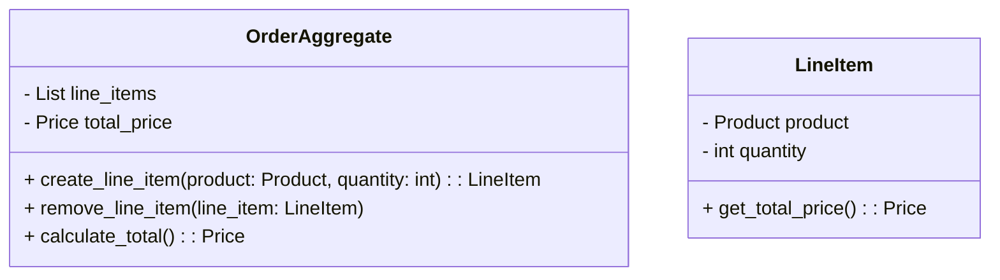
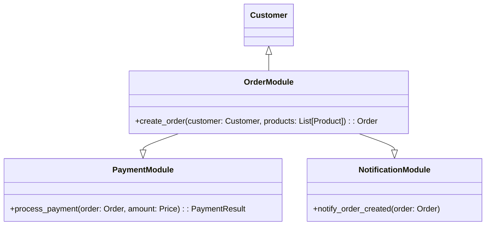
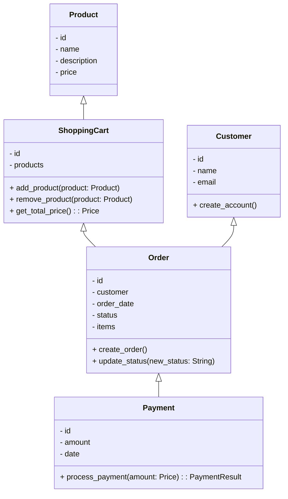
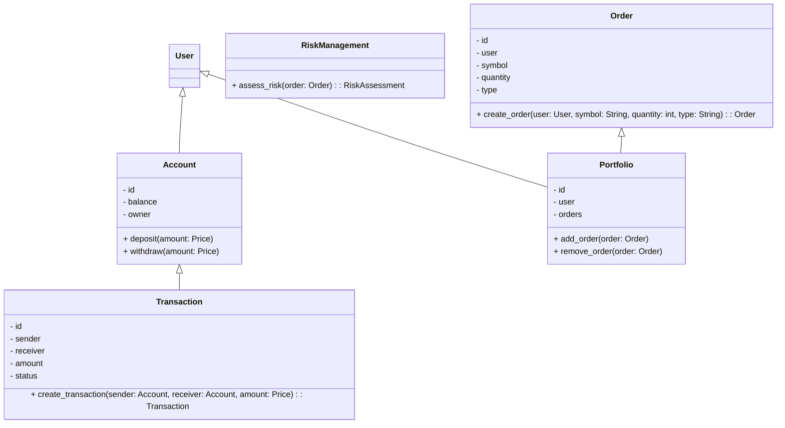

                 

## 《领域驱动设计（DDD）：复杂业务系统的解决之道》

领域驱动设计（Domain-Driven Design，简称DDD）是一种软件开发的方法论，旨在帮助开发者更好地理解和处理复杂业务系统。它不仅关注技术层面，更强调业务逻辑和系统架构的紧密结合。在当今快速变化的市场环境中，复杂业务系统面临的需求越来越多样化，传统的软件开发方法往往难以应对。DDD应运而生，成为解决复杂业务系统设计难题的重要工具。

本文将从DDD的基本概念出发，逐步深入探讨其在复杂业务系统设计中的应用，包括系统架构设计、领域建模、开发实践和案例分析等方面。通过系统的讲解和实际案例的分析，我们将帮助读者理解DDD的核心思想，掌握其应用方法，最终提升复杂业务系统的开发效率和质量。

### 关键词

- 领域驱动设计（DDD）
- 复杂业务系统
- 领域模型
- 系统架构
- 开发实践

### 摘要

本文将系统地介绍领域驱动设计（DDD）的核心概念和应用方法，旨在帮助开发者更好地理解和处理复杂业务系统。我们将首先探讨DDD的起源和基本概念，然后深入分析DDD在复杂业务系统设计中的应用，包括需求分析、领域建模、系统架构设计和开发实践等方面。通过实际案例的剖析，我们将展示DDD在解决复杂业务系统设计难题中的具体应用效果。最后，本文将总结DDD的最佳实践，并展望其未来的发展趋势。

## 目录大纲设计思路

为了使《领域驱动设计（DDD）：复杂业务系统的解决之道》这篇文章内容丰富、逻辑清晰，我们将采用逐步分析的方式，设计一个详细的目录大纲。以下是我们设计思路的详细说明：

### 用户需求分析

首先，我们明确用户的需求：需要一本关于领域驱动设计（DDD）的技术书籍，该书籍的目录大纲应简洁明了，内容完整，能够涵盖DDD的核心概念和应用方法。用户希望每个章节都能够清晰展示核心内容，并且便于阅读和理解。

### 目录大纲结构设计

为了满足用户需求，我们设计了以下五个主要部分，每个部分包含若干章节：

1. **领域驱动设计基础**：介绍DDD的基本概念、背景和重要性，为后续章节的深入探讨打下基础。
2. **复杂业务系统的设计**：探讨如何在复杂业务系统中应用DDD，包括系统架构设计、领域建模和开发实践。
3. **DDD开发实践**：介绍DDD在软件开发过程中的具体应用，包括开发模式、测试策略和代码组织。
4. **DDD案例分析**：通过实际案例展示DDD的应用效果，包括系统架构、领域模型和开发过程。
5. **DDD最佳实践与展望**：总结DDD的最佳实践经验，探讨未来的发展趋势。

### 目录大纲内容

以下是详细的目录大纲设计：

### 第一部分：领域驱动设计基础

**第1章** 领域驱动设计概述
- 1.1 DDD的起源与背景
- 1.2 DDD的核心原则
- 1.3 DDD与传统开发方法的对比

**第2章** 领域模型基础
- 2.1 领域与领域模型
- 2.2 实体与值对象
- 2.3 领域服务与聚合

### 第二部分：复杂业务系统的设计

**第3章** 复杂业务系统的需求分析
- 3.1 复杂业务系统的特点
- 3.2 需求获取与建模
- 3.3 用户故事与场景设计

**第4章** 领域建模实践
- 4.1 领域模型构建方法
- 4.2 领域模型示例分析
- 4.3 领域模型演进策略

**第5章** 系统架构设计
- 5.1 系统架构概述
- 5.2 领域服务与子系统设计
- 5.3 数据库设计策略

### 第三部分：DDD开发实践

**第6章** DDD开发模式
- 6.1 实体与值对象的设计
- 6.2 领域服务的实现
- 6.3 聚合的边界管理

**第7章** DDD测试策略
- 7.1 领域模型测试方法
- 7.2 领域服务的测试
- 7.3 测试驱动开发（TDD）实践

**第8章** DDD代码组织与架构
- 8.1 代码组织原则
- 8.2 模块化与组件化设计
- 8.3 架构重构与维护

### 第四部分：DDD案例分析

**第9章** 案例一：电子商务平台
- 9.1 项目背景与目标
- 9.2 领域模型设计
- 9.3 系统架构设计
- 9.4 开发实践与优化

**第10章** 案例二：金融交易系统
- 10.1 项目背景与挑战
- 10.2 领域模型构建
- 10.3 系统架构与实现
- 10.4 性能优化与测试

### 第五部分：DDD最佳实践与展望

**第11章** DDD最佳实践
- 11.1 领域专家参与
- 11.2 持续集成与交付
- 11.3 跨团队协作与沟通

**第12章** DDD的未来发展
- 12.1 新兴技术与DDD
- 12.2 DDD在企业架构中的应用
- 12.3 DDD的未来趋势

### 目录大纲总字数限制

整个目录大纲的总字数将控制在2000字以内，以确保内容的简洁性和可读性。

通过以上设计和组织，我们能够为《领域驱动设计（DDD）：复杂业务系统的解决之道》这篇文章设计出一个逻辑清晰、内容全面的目录大纲。接下来，我们将按照设计思路逐步完善每个章节的内容，确保整体结构的完整性和逻辑性。

## 用户需求分析

在着手设计《领域驱动设计（DDD）：复杂业务系统的解决之道》的目录大纲之前，首先需要明确用户的需求。通过深入分析和理解用户需求，我们可以确保目录大纲简洁、逻辑清晰，并且能够涵盖用户最关心的核心内容。

### 需求分析

用户希望书籍的目录大纲具备以下特点：

1. **简洁性**：目录大纲应避免冗余内容，确保每个章节的核心内容被明确展现。用户不希望阅读大量无关紧要的描述，而是希望直接获取到关键信息。

2. **逻辑性**：目录大纲的结构应具有清晰的逻辑性，便于读者跟随思路进行阅读。用户需要一个逐步深入、逐步展开的阅读路径，以便更好地理解和掌握DDD的核心概念和应用方法。

3. **全面性**：目录大纲需要涵盖DDD的基本概念、复杂业务系统设计、开发实践、案例分析以及最佳实践等方面。用户希望书籍能够提供一个全面的知识体系，帮助他们系统地学习和应用DDD。

4. **实用性**：用户希望目录大纲能够反映出DDD在解决复杂业务系统设计中的实际应用效果。他们希望通过实际的案例分析和最佳实践，了解如何将DDD应用到实际项目中，解决具体问题。

### 目录大纲设计原则

为了满足用户需求，目录大纲的设计将遵循以下原则：

1. **层次分明**：目录大纲将分为五个主要部分，每个部分对应一个核心主题。每个部分的章节设置合理，确保内容层次分明，便于读者理解和掌握。

2. **内容紧凑**：每个章节都将集中介绍一个核心主题，避免内容交叉和重复。章节内容紧凑，确保读者能够快速获取到关键信息。

3. **逻辑连贯**：章节之间的逻辑关系清晰，前后衔接紧密。读者可以按照目录大纲的顺序进行阅读，逐步深入理解DDD的核心概念和应用方法。

4. **案例分析**：在适当的章节中，加入实际案例分析和最佳实践，帮助读者更好地理解DDD的应用效果。案例分析和最佳实践将贯穿全文，增强书籍的实用性和可操作性。

5. **可扩展性**：目录大纲设计预留了扩展空间，以便在后续版本中增加新的内容。这样，即使当前版本内容已经丰富，用户也可以在未来的版本中获取到更多有价值的信息。

通过以上原则，我们旨在设计出一个简洁、逻辑清晰、内容全面的目录大纲，满足用户的多样化需求，帮助读者更好地学习和应用领域驱动设计（DDD）。

### 目录大纲结构设计

在明确用户需求后，我们接下来详细设计《领域驱动设计（DDD）：复杂业务系统的解决之道》的目录大纲。目录大纲将分为五个主要部分，每个部分包含若干章节，以系统、全面地展示DDD的核心概念和应用方法。

#### 第一部分：领域驱动设计基础

**第1章** 领域驱动设计概述
- **1.1 DDD的起源与背景**
  - DDD的发展历程
  - DDD的背景和重要性

- **1.2 DDD的核心原则**
  - 整体性原则
  - 扩展性原则
  - 领域专家参与

- **1.3 DDD与传统开发方法的对比**
  - DDD与传统的OO设计的区别
  - DDD的优势

**第2章** 领域模型基础
- **2.1 领域与领域模型**
  - 领域的定义
  - 领域模型的组成

- **2.2 实体与值对象**
  - 实体的属性和行为
  - 值对象的特点和应用

- **2.3 领域服务与聚合**
  - 领域服务的职责
  - 聚合的概念和作用

#### 第二部分：复杂业务系统的设计

**第3章** 复杂业务系统的需求分析
- **3.1 复杂业务系统的特点**
  - 复杂性来源
  - 业务规则复杂性

- **3.2 需求获取与建模**
  - 用户故事收集
  - 用例建模

- **3.3 用户故事与场景设计**
  - 用户故事的定义
  - 场景设计的应用

**第4章** 领域建模实践
- **4.1 领域模型构建方法**
  - 领域建模的基本步骤
  - 领域模型的核心要素

- **4.2 领域模型示例分析**
  - 实际案例的解析
  - 示例模型展示

- **4.3 领域模型演进策略**
  - 领域模型的演进过程
  - 领域模型的管理与优化

**第5章** 系统架构设计
- **5.1 系统架构概述**
  - 系统架构的基本概念
  - DDD在系统架构中的应用

- **5.2 领域服务与子系统设计**
  - 领域服务的划分
  - 子系统的结构设计

- **5.3 数据库设计策略**
  - 数据库设计原则
  - 领域模型与数据库的映射

#### 第三部分：DDD开发实践

**第6章** DDD开发模式
- **6.1 实体与值对象的设计**
  - 实体设计方法
  - 值对象的使用场景

- **6.2 领域服务的实现**
  - 领域服务的职责划分
  - 领域服务的实现策略

- **6.3 聚合的边界管理**
  - 聚合边界的定义
  - 聚合边界的实现

**第7章** DDD测试策略
- **7.1 领域模型测试方法**
  - 领域模型的测试目标
  - 测试用例的设计

- **7.2 领域服务的测试**
  - 领域服务的测试方法
  - 测试策略与工具

- **7.3 测试驱动开发（TDD）实践**
  - TDD的基本概念
  - TDD在DDD中的应用

**第8章** DDD代码组织与架构
- **8.1 代码组织原则**
  - 代码组织的原则
  - 模块化设计

- **8.2 模块化与组件化设计**
  - 模块化设计的优点
  - 组件化设计的方法

- **8.3 架构重构与维护**
  - 重构的概念
  - 架构维护的策略

#### 第四部分：DDD案例分析

**第9章** 案例一：电子商务平台
- **9.1 项目背景与目标**
  - 项目的背景信息
  - 项目的目标与需求

- **9.2 领域模型设计**
  - 领域模型的构建
  - 领域模型的应用

- **9.3 系统架构设计**
  - 系统架构的设计思路
  - 系统架构的组成部分

- **9.4 开发实践与优化**
  - 开发过程中的实践经验
  - 优化策略与应用

**第10章** 案例二：金融交易系统
- **10.1 项目背景与挑战**
  - 项目背景
  - 项目面临的挑战

- **10.2 领域模型构建**
  - 领域模型的设计
  - 领域模型的应用

- **10.3 系统架构与实现**
  - 系统架构的设计
  - 系统的实现细节

- **10.4 性能优化与测试**
  - 性能优化的策略
  - 测试过程与结果

#### 第五部分：DDD最佳实践与展望

**第11章** DDD最佳实践
- **11.1 领域专家参与**
  - 领域专家的角色
  - 领域专家的参与方式

- **11.2 持续集成与交付**
  - 持续集成的基本概念
  - 持续集成在DDD中的应用

- **11.3 跨团队协作与沟通**
  - 跨团队协作的重要性
  - 跨团队沟通的策略

**第12章** DDD的未来发展
- **12.1 新兴技术与DDD**
  - 新兴技术与DDD的结合
  - DDD在新兴技术中的应用前景

- **12.2 DDD在企业架构中的应用**
  - 企业架构中的DDD应用
  - DDD对企业架构的影响

- **12.3 DDD的未来趋势**
  - DDD的发展方向
  - DDD的挑战与机遇

通过以上详细的目录大纲结构设计，我们希望能够为读者提供一个系统、全面、逻辑清晰的《领域驱动设计（DDD）：复杂业务系统的解决之道》的框架，帮助读者更好地理解和应用领域驱动设计。

## 第一部分：领域驱动设计基础

### 第1章 领域驱动设计概述

#### 1.1 DDD的起源与背景

领域驱动设计（Domain-Driven Design，简称DDD）的概念最早由Eric Evans在2003年出版的同名书籍《领域驱动设计》中提出。DDD的诞生背景源于软件开发中常见的挑战，特别是在处理复杂业务系统时，传统的面向对象（OO）和面向数据模型的方法往往无法有效地应对。在复杂业务系统中，业务规则复杂、需求多变，导致系统设计变得难以维护和扩展。DDD的出现，旨在通过一种更为面向业务的方法来应对这些挑战。

Eric Evans在软件开发和系统设计方面有多年的经验，他深刻认识到，许多软件项目的失败并非由于技术问题，而是由于对业务理解和需求把握不准确。因此，他提出了DDD，强调软件开发应围绕领域模型进行，使系统能够更好地适应业务的变化。

#### 1.2 DDD的核心原则

DDD的核心原则包括：

1. **整体性原则**：DDD强调系统的整体性，即各个部分之间应紧密协作，形成一个统一的整体。这有助于确保系统的一致性和可维护性。

2. **扩展性原则**：DDD注重系统的扩展性，通过模块化和分层设计，使系统能够适应未来的变化和扩展。这有助于降低系统的复杂度，提高开发效率。

3. **领域专家参与**：DDD强调领域专家（如业务分析师、产品经理等）在软件开发过程中的重要性。领域专家能够提供对业务领域的深入理解，有助于确保系统的业务逻辑准确无误。

#### 1.3 DDD与传统开发方法的对比

传统的开发方法，如面向对象（OO）和面向数据模型（ORM），主要关注技术层面的实现。而DDD则更加注重业务领域的理解和实现。以下是对比：

- **面向对象（OO）**：
  - 优点：模块化、易于维护、重用性高。
  - 缺点：难以直接反映业务领域，容易陷入“数据陷阱”，忽视业务逻辑。

- **面向数据模型（ORM）**：
  - 优点：简化数据库操作、易于实现。
  - 缺点：过分关注数据结构，忽视业务逻辑。

DDD通过引入领域模型、领域服务、实体与值对象等概念，使系统能够更加紧密地反映业务领域。DDD不仅关注技术实现，更关注业务理解和需求把握，从而提高系统的可维护性和扩展性。

### 第2章 领域模型基础

#### 2.1 领域与领域模型

领域是DDD中的核心概念，指的是业务范围内的所有事物和活动。领域模型则是用于描述领域内对象及其关系的抽象模型。领域模型是DDD的核心工具，它帮助开发者更好地理解和处理复杂业务系统。

领域模型通常由以下几个部分组成：

- **实体（Entities）**：代表业务中的具体对象，如客户、订单等。实体具有唯一的标识和属性，但无固定类型。
- **值对象（Value Objects）**：代表业务中的具体值，如金额、日期等。值对象无唯一标识，但具有固定的类型。
- **聚合（Aggregates）**：由一组实体和值对象组成，代表业务中的一个完整逻辑单元。聚合通过边界定义来保证数据的一致性。
- **领域服务（Domain Services）**：负责处理跨聚合的业务逻辑，如订单处理、库存管理等。

#### 2.2 实体与值对象

实体和值对象是领域模型中的基本构建块。

- **实体**：
  - 特点：具有唯一标识、属性和行为。
  - 例子：客户、订单、产品。
  - 应用：实体通常用于表示业务中的关键对象，其属性和行为与业务逻辑密切相关。

- **值对象**：
  - 特点：无唯一标识、固定类型。
  - 例子：金额、日期、地址。
  - 应用：值对象通常用于表示业务中的具体值，其类型和值与业务逻辑紧密相关。

#### 2.3 领域服务与聚合

领域服务是处理跨聚合的业务逻辑的关键组件。

- **领域服务**：
  - 特点：负责处理复杂业务逻辑。
  - 例子：订单处理、库存管理。
  - 应用：领域服务通常用于实现跨多个聚合的业务流程，如订单创建、支付处理等。

- **聚合**：
  - 特点：代表业务中的一个完整逻辑单元。
  - 例子：订单聚合、库存聚合。
  - 应用：聚合通过边界定义来保证数据的一致性，确保聚合内的对象之间能够互相协作。

通过以上内容，我们介绍了领域驱动设计（DDD）的基本概念和基础。DDD提供了一种更为面向业务的方法，帮助开发者更好地理解和处理复杂业务系统。领域模型、实体与值对象、领域服务与聚合等核心概念，为DDD的应用奠定了基础。

### 第3章 复杂业务系统的需求分析

#### 3.1 复杂业务系统的特点

复杂业务系统具有以下特点：

1. **业务规则复杂**：复杂业务系统往往涉及大量的业务规则，这些规则可能相互交织，难以直观理解。
2. **需求多变**：业务需求不断变化，要求系统能够灵活应对。
3. **涉及多个领域**：复杂业务系统通常涉及多个不同的业务领域，如订单管理、库存管理、财务管理等。
4. **高耦合度**：不同模块之间存在紧密的依赖关系，导致系统难以独立开发和维护。
5. **高扩展性要求**：系统需要能够适应未来业务的发展，具备良好的扩展性。

#### 3.2 需求获取与建模

在复杂业务系统开发过程中，需求获取和建模是关键步骤。以下是一些关键步骤和方法：

1. **用户故事收集**：
   - 用户故事（User Story）是描述用户需求和期望的基本单元。
   - 收集用户故事可以通过访谈、问卷调查、观察用户行为等方式进行。
   - 用户故事通常包含以下格式：“作为[用户角色]，我需要[功能]，以便[业务目标]”。

2. **用例建模**：
   - 用例（Use Case）是描述系统功能和行为的基本工具。
   - 用例建模可以帮助明确系统的功能和用户交互方式。
   - 通常使用UML（统一建模语言）中的用例图来表示系统中的用例和用户角色。

3. **领域模型构建**：
   - 领域模型是描述业务领域的抽象模型，包括实体、值对象、聚合和领域服务。
   - 领域模型可以帮助开发者更好地理解业务领域，从而设计出更符合业务需求的系统。

#### 3.3 用户故事与场景设计

用户故事和场景设计是需求分析中的重要组成部分。

1. **用户故事**：
   - 用户故事描述了用户在特定情境下希望系统能完成的功能。
   - 用户故事通常包含以下要素：用户角色、功能需求、业务目标。

2. **场景设计**：
   - 场景设计（Scenario Design）是描述用户与系统交互的具体过程。
   - 场景设计可以帮助开发者理解用户在使用系统时的行为模式，从而设计出更加直观和易用的用户界面。

通过需求获取和建模，开发者可以更准确地理解复杂业务系统的需求，从而设计出更加符合实际业务需求的系统。用户故事和场景设计是这一过程中不可或缺的工具，它们帮助开发者从用户的角度出发，构建出高效、可靠的系统。

### 第4章 领域建模实践

#### 4.1 领域模型构建方法

领域模型的构建是一个复杂的过程，涉及多个步骤和技巧。以下是一些关键的构建方法：

1. **业务场景分析**：
   - 分析业务场景是领域模型构建的第一步。通过深入了解业务过程和业务规则，确定系统需要解决的问题。
   - 业务场景分析可以通过访谈业务专家、观察业务流程、阅读业务文档等方式进行。

2. **实体与值对象的识别**：
   - 实体和值对象是领域模型中的核心元素。识别实体和值对象有助于明确系统的核心对象和属性。
   - 识别方法包括：列出业务领域中的关键对象、分析业务规则、查看现有系统模型等。

3. **聚合的划分**：
   - 聚合是领域模型中的逻辑单元，用于封装一组实体和值对象，并定义它们之间的交互。
   - 划分聚合的方法包括：基于业务逻辑、基于数据完整性、基于系统的功能性等。

4. **领域服务的定义**：
   - 领域服务负责处理跨聚合的业务逻辑，如订单处理、库存管理等。
   - 定义领域服务的方法包括：分析业务规则、识别跨聚合的操作、定义服务接口等。

#### 4.2 领域模型示例分析

以下是一个简单的领域模型示例，用于描述一个电子商务平台中的订单管理功能。

```mermaid
classDiagram
    Customer <|-- Order
    Order o---> Product
    Order o---> Payment
    Customer : +id
    Customer : +name
    Customer : +email
    Order : +id
    Order : +date
    Order : +status
    Product : +id
    Product : +name
    Product : +price
    Payment : +id
    Payment : +amount
    Payment : +date
    Customer -> Order
    Order -> Product
    Order -> Payment
```

在这个示例中：

- **实体**：Customer（客户）、Order（订单）、Product（产品）、Payment（支付）。
- **值对象**：无。
- **聚合**：Customer、Order、Product、Payment。
- **领域服务**：用于处理订单创建、订单状态更新、支付处理等。

#### 4.3 领域模型演进策略

领域模型不是一成不变的，随着业务的发展和变化，领域模型也需要不断演进。以下是一些演进策略：

1. **迭代重构**：
   - 领域模型应采用迭代重构的方法，逐步完善和优化。
   - 通过分析业务需求的变化，识别模型中的不足和改进点，进行逐步重构。

2. **持续集成**：
   - 领域模型应与其他系统组件（如数据库、前端界面等）保持一致性。
   - 通过持续集成的策略，确保模型变更能够及时反映到系统中。

3. **版本控制**：
   - 引入版本控制机制，记录模型的变更历史。
   - 在模型变更时，确保变更的可追溯性和可管理性。

4. **领域专家参与**：
   - 领域专家在模型演进过程中起到关键作用，他们能够提供对业务领域的深入理解。
   - 领域专家应积极参与模型的设计、重构和评审过程。

通过以上方法，领域模型可以更好地适应业务需求的变化，确保系统的高质量和可持续性。领域模型构建和实践是DDD应用的重要基础，通过合理的模型设计和演进策略，开发者可以构建出高效、可靠的复杂业务系统。

### 第5章 系统架构设计

#### 5.1 系统架构概述

系统架构设计是软件开发过程中至关重要的一环，它决定了系统的性能、可扩展性和可维护性。在领域驱动设计（DDD）的框架下，系统架构设计不仅要考虑技术层面，还需充分考虑业务需求。

系统架构概述主要包括以下几个方面：

1. **系统目标**：明确系统的功能需求、性能指标和可扩展性要求。
2. **系统边界**：定义系统的范围和职责，明确系统与外部系统的接口。
3. **组件划分**：将系统划分为多个功能模块，每个模块负责特定的功能。
4. **通信机制**：设计模块之间的通信机制，确保系统的稳定性和高可用性。

#### 5.2 领域服务与子系统设计

在DDD中，领域服务（Domain Services）负责处理跨聚合的业务逻辑，是系统架构设计的关键组件。以下是如何进行领域服务与子系统设计的步骤：

1. **领域服务识别**：
   - 分析业务需求，识别需要跨聚合处理的业务逻辑。
   - 领域服务通常涉及复杂的业务规则和流程，如订单处理、库存管理等。

2. **领域服务划分**：
   - 根据业务逻辑的相似性，将领域服务划分为不同的模块。
   - 领域服务的划分应遵循高内聚、低耦合的原则，确保模块之间的独立性。

3. **子系统设计**：
   - 子系统是领域服务实现的具体模块，通常包含一个或多个领域服务。
   - 子系统的设计应考虑模块的职责和功能，确保系统的整体性。

4. **通信机制设计**：
   - 设计领域服务之间的通信机制，如事件驱动、同步调用等。
   - 通信机制应确保数据的一致性和系统的稳定性。

#### 5.3 数据库设计策略

数据库设计是系统架构设计的重要组成部分，直接影响系统的性能和数据完整性。以下是一些关键的数据库设计策略：

1. **领域模型映射**：
   - 将领域模型映射到数据库模型，确保领域模型中的实体、聚合和领域服务在数据库中得以实现。
   - 使用关系型数据库或NoSQL数据库，应根据业务需求和性能要求进行选择。

2. **数据库规范化**：
   - 采用规范化方法，确保数据库设计符合第三范式（3NF），减少数据冗余和依赖。
   - 规范化设计有助于提高系统的性能和数据一致性。

3. **索引优化**：
   - 设计合理的索引策略，提高查询性能。
   - 索引设计应考虑查询频率和数据量，避免过度索引。

4. **数据迁移与备份**：
   - 设计数据迁移和备份策略，确保数据的安全性和一致性。
   - 数据迁移策略应支持系统升级和数据恢复。

通过以上策略，可以设计出一个高效、稳定、可扩展的系统架构，满足复杂业务系统的需求。系统架构设计不仅是技术实现，更是业务需求的反映，通过合理的架构设计，可以确保系统的高质量和可持续发展。

### 第6章 DDD开发模式

#### 6.1 实体与值对象的设计

在领域驱动设计（DDD）中，实体（Entities）和值对象（Value Objects）是构建领域模型的基础。正确设计和区分实体与值对象有助于简化系统的复杂性，提高代码的可读性和可维护性。

**实体**：
- **特点**：具有唯一标识和生命周期。实体通常代表业务中的关键实体，如用户、订单等。
- **设计原则**：
  - **唯一标识**：实体应具备唯一的标识，以便在系统中唯一识别和操作。
  - **封装**：实体的内部实现细节应封装，仅通过接口与外界交互。
  - **生命周期管理**：实体应具有明确的生命周期，并在其生命周期内进行状态管理。

**值对象**：
- **特点**：无唯一标识，仅代表业务中的具体值。值对象通常用于描述属性，如日期、价格等。
- **设计原则**：
  - **固定类型**：值对象应具有固定的类型，确保其值的一致性和可验证性。
  - **不可变性**：值对象一旦创建，其值不可更改，确保系统的稳定性和可预测性。
  - **封装**：值对象的内部实现细节应封装，仅通过接口与外界交互。

**示例**：

假设我们设计一个电子商务平台，需要处理订单管理功能。以下是一个实体和值对象的示例：

```python
class Order:
    def __init__(self, order_id, customer):
        self._order_id = order_id
        self._customer = customer
        self._status = "Created"
    
    @property
    def order_id(self):
        return self._order_id
    
    @property
    def customer(self):
        return self._customer
    
    @property
    def status(self):
        return self._status
    
    def update_status(self, new_status):
        self._status = new_status

class Customer:
    def __init__(self, id, name, email):
        self._id = id
        self._name = name
        self._email = email
    
    @property
    def id(self):
        return self._id
    
    @property
    def name(self):
        return self._name
    
    @property
    def email(self):
        return self._email

class Price(ValueObject):
    def __init__(self, amount, currency):
        self._amount = amount
        self._currency = currency
    
    @property
    def amount(self):
        return self._amount
    
    @property
    def currency(self):
        return self._currency
```

在这个示例中，`Order` 类是一个实体，具有唯一标识（`order_id`）和生命周期（`status`）。`Customer` 类也是一个实体，具有唯一标识（`id`）。`Price` 类是一个值对象，代表一个固定类型的值（金额和货币）。

通过正确设计实体和值对象，可以使代码更加清晰、易于维护，同时更好地反映业务逻辑。

#### 6.2 领域服务的实现

领域服务（Domain Services）在DDD中负责处理跨聚合的业务逻辑，是实现业务规则和业务流程的关键组件。领域服务的实现需要注意以下几个方面：

1. **职责划分**：
   - 根据业务需求，将跨聚合的业务逻辑划分为不同的领域服务。
   - 领域服务的职责应明确，避免过大的服务导致复杂性增加。

2. **依赖注入**：
   - 使用依赖注入（DI）技术，将领域服务与其他组件（如实体、值对象）解耦。
   - 依赖注入有助于提高代码的可测试性和可维护性。

3. **异步处理**：
   - 对于耗时较长的操作，可以考虑使用异步处理，以提高系统的响应速度。
   - 异步处理可以通过消息队列、事件驱动等方式实现。

4. **服务接口**：
   - 定义清晰的服务接口，明确服务提供的功能和方法。
   - 接口设计应遵循单一职责原则，确保每个服务接口的功能单一且明确。

5. **错误处理**：
   - 设计合理的错误处理机制，确保系统在出现异常时能够正确处理并恢复。
   - 错误处理应包括日志记录、异常捕获和重试机制等。

**示例**：

以下是一个简单的领域服务示例，用于处理订单创建：

```python
class OrderService:
    def __init__(self, repository: OrderRepository, notification_service: NotificationService):
        self.repository = repository
        self.notification_service = notification_service
    
    def create_order(self, customer: Customer, products: List[Product], total_price: Price):
        order = Order(customer, products, total_price)
        self.repository.save(order)
        self.notification_service.notify_order_created(order)
        return order
```

在这个示例中，`OrderService` 负责创建订单，并将订单保存到数据库（通过`OrderRepository`），同时通知相关的服务（通过`NotificationService`）。通过依赖注入，`OrderService` 与具体的实现解耦，便于测试和扩展。

通过合理设计和实现领域服务，可以确保业务逻辑的清晰性和可维护性，提高系统的质量和开发效率。

#### 6.3 聚合的边界管理

在领域驱动设计（DDD）中，聚合（Aggregate）是代表业务逻辑单元的核心概念。聚合通过明确的边界定义，确保了内部对象之间的协作和外部访问的控制。正确管理聚合的边界对于保持系统的一致性和可扩展性至关重要。

1. **聚合边界的定义**：
   - 聚合边界通常通过组合标识（Compound Key）来定义，确保聚合内的对象具有唯一的组合标识。
   - 聚合边界还通过方法签名和访问控制来定义，明确哪些操作可以在聚合内部进行，哪些操作需要跨越边界。

2. **聚合边界的管理原则**：
   - **单一职责原则**：每个聚合应负责一个明确的业务功能，避免功能重叠和复杂性。
   - **封装原则**：聚合的内部实现细节应封装，外部仅通过清晰的接口进行交互。
   - **不变性原则**：聚合应确保内部状态的一致性，防止外部操作导致状态的不一致。

3. **示例**：

以下是一个简单的聚合边界示例，用于表示订单管理功能：



在这个示例中，`OrderAggregate` 是一个聚合，包含多个`LineItem` 对象。`OrderAggregate` 通过明确的接口方法（如`create_line_item`、`remove_line_item` 和`calculate_total`）来管理聚合内的对象，并确保状态的一致性。

通过正确管理聚合的边界，可以确保系统的整体性和稳定性，提高代码的可维护性和可扩展性。

### 第7章 DDD测试策略

#### 7.1 领域模型测试方法

在领域驱动设计（DDD）中，测试领域模型是确保系统稳定性和正确性的关键步骤。领域模型测试方法主要包括以下几种：

1. **单元测试**：
   - 对领域模型中的各个组件（如实体、值对象、聚合和领域服务）进行单元测试，确保每个组件的功能和逻辑正确。
   - 单元测试应覆盖所有的边界条件和异常情况，确保代码的鲁棒性。

2. **集成测试**：
   - 对领域模型中的不同组件进行集成测试，验证组件之间的交互和协作是否符合预期。
   - 集成测试应在模拟环境下进行，确保组件在实际运行时能够正常工作。

3. **行为测试**：
   - 基于领域模型中的业务规则和流程，编写测试用例，验证系统在执行特定业务操作时的行为是否正确。
   - 行为测试应覆盖所有的业务场景，确保系统满足业务需求。

4. **领域模型覆盖率**：
   - 通过统计测试用例覆盖率，评估测试覆盖范围，确保所有的领域模型元素都得到充分测试。

#### 7.2 领域服务的测试

领域服务是DDD中的核心组件，负责处理跨聚合的业务逻辑。以下是一些领域服务测试的方法：

1. **服务接口测试**：
   - 通过模拟客户端请求，测试领域服务的接口是否正确实现，确保服务的输入和输出符合预期。
   - 接口测试应覆盖所有可能的服务调用场景，包括正常情况和异常情况。

2. **服务功能测试**：
   - 针对领域服务的具体功能，编写测试用例，验证服务在执行特定功能时的逻辑是否正确。
   - 功能测试应涵盖所有的业务规则和流程，确保服务能够正确处理各种业务场景。

3. **服务性能测试**：
   - 对领域服务的性能进行测试，确保服务能够在预期的负载下正常运行，并满足性能要求。
   - 性能测试可以包括响应时间、吞吐量、并发处理能力等指标。

4. **服务依赖测试**：
   - 测试领域服务对其他系统组件（如数据库、消息队列等）的依赖是否正确，确保服务能够在实际运行环境中稳定工作。

#### 7.3 测试驱动开发（TDD）实践

测试驱动开发（Test-Driven Development，简称TDD）是一种软件开发方法，强调在编写代码之前先编写测试用例。在DDD中，TDD有助于确保系统的高质量和可维护性。以下是如何在DDD中实践TDD的步骤：

1. **编写测试用例**：
   - 根据领域模型和业务需求，编写测试用例，明确测试的目标和场景。
   - 测试用例应涵盖所有的业务规则和流程，确保代码的完整覆盖。

2. **编写测试代码**：
   - 根据测试用例，编写测试代码，验证领域模型和领域服务的功能是否符合预期。
   - 测试代码应遵循单元测试、集成测试和行为测试的原则，确保测试的全面性和深度。

3. **编写实现代码**：
   - 在测试代码通过后，根据测试结果编写具体的实现代码。
   - 实现代码应遵循领域模型的定义，确保业务逻辑的正确性。

4. **重构代码**：
   - 在实现代码后，根据测试反馈进行代码重构，优化代码结构和性能。
   - 重构代码应确保代码的可读性和可维护性，避免引入新的错误。

通过TDD实践，可以确保领域模型和领域服务的开发过程更加规范和高效，提高系统的质量和稳定性。

### 第8章 DDD代码组织与架构

#### 8.1 代码组织原则

在领域驱动设计（DDD）中，代码组织与架构的设计对系统的可维护性和扩展性至关重要。以下是一些关键的代码组织原则：

1. **模块化设计**：
   - 模块化设计是将系统划分为若干独立的功能模块，每个模块负责特定的功能。
   - 通过模块化设计，可以降低系统的复杂度，提高代码的可维护性。

2. **组件化设计**：
   - 组件化设计是将系统划分为可重用的组件，每个组件具有独立的功能和接口。
   - 组件化设计有助于提高系统的灵活性和可扩展性。

3. **分层架构**：
   - 分层架构是将系统划分为多个层次，每个层次负责特定的功能。
   - 常见的分层包括表示层、业务逻辑层、数据访问层和基础设施层。

4. **职责分离**：
   - 职责分离是将不同的功能分配到不同的模块和层次中，确保每个组件具有明确的职责。
   - 通过职责分离，可以降低组件之间的耦合度，提高系统的稳定性。

#### 8.2 模块化与组件化设计

模块化和组件化设计是提高系统可维护性和扩展性的有效方法。

1. **模块化设计**：
   - 模块是系统中的功能单元，每个模块负责特定的功能。
   - 模块之间通过清晰的接口进行通信，模块内部实现细节对其他模块隐藏。
   - 模块化设计有助于降低系统的复杂度，提高代码的可读性和可维护性。

2. **组件化设计**：
   - 组件是可重用的功能单元，通常包含多个模块。
   - 组件通过统一的接口暴露功能，内部实现细节对用户隐藏。
   - 组件化设计有助于提高系统的灵活性和可扩展性，便于系统的迭代和扩展。

3. **示例**：

以下是一个简单的模块化与组件化设计的示例：



在这个示例中，`OrderModule`、`PaymentModule` 和`NotificationModule` 是三个独立的模块，分别负责订单创建、支付处理和通知发送功能。通过模块化与组件化设计，可以确保系统的高内聚和低耦合。

#### 8.3 架构重构与维护

架构重构与维护是确保系统长期稳定和高效运行的关键。

1. **架构重构**：
   - 架构重构是指对系统的架构进行改进和优化，以提高系统的性能、可维护性和扩展性。
   - 重构过程中，可以采用设计模式、模块化和组件化设计等原则，确保重构后的系统更加稳定和高效。

2. **维护策略**：
   - 定期进行代码审查和重构，识别和修复潜在的问题。
   - 使用持续集成和持续交付（CI/CD）流程，确保代码质量和系统稳定性。
   - 针对系统的不同组件和模块，制定详细的维护计划，确保系统的长期运行。

3. **注意事项**：
   - 在进行架构重构时，应充分考虑系统的业务需求和变更频率，避免不必要的重构。
   - 重构过程中，应确保系统的稳定性和可用性，避免引入新的问题。

通过合理的代码组织和架构设计，可以确保系统的高质量和可维护性，提高开发效率。同时，通过架构重构与维护，可以确保系统能够持续适应业务需求的变化，保持长期稳定和高效运行。

### 第9章 案例一：电子商务平台

#### 9.1 项目背景与目标

电子商务平台是一个复杂的业务系统，涉及多个领域和业务流程。该项目旨在构建一个功能齐全、性能稳定、用户体验优秀的电子商务平台，以支持线上购物、订单管理、支付处理和客户服务等功能。

**项目目标**：
1. **满足用户需求**：提供便捷的购物体验，包括商品浏览、购物车管理、订单提交等。
2. **确保系统性能**：在高并发情况下保持系统稳定，快速响应用户请求。
3. **良好的扩展性**：支持未来业务的扩展，如新增功能、产品品类等。
4. **高可维护性**：确保系统的可维护性，便于后续的优化和改进。

#### 9.2 领域模型设计

在电子商务平台的开发过程中，领域模型设计是关键步骤。以下是一个简化的领域模型设计：



在这个领域模型中，主要涉及以下实体和值对象：

- **实体**：Product（产品）、ShoppingCart（购物车）、Order（订单）、Customer（客户）、Payment（支付）。
- **值对象**：Price（价格）、PaymentResult（支付结果）。

**领域服务**：
- **购物车服务**：负责管理购物车中的商品，包括添加和删除商品。
- **订单服务**：负责创建和更新订单，处理订单状态。
- **支付服务**：负责处理支付请求，执行支付操作。

#### 9.3 系统架构设计

系统架构设计是确保电子商务平台功能实现和性能优化的重要环节。以下是一个简化的系统架构设计：

```mermaid
subgraph Components
    Client -> Controller
    Controller -> Service
    Service -> Repository
    Repository -> Database
end
```

**组件说明**：

- **客户端（Client）**：用户与系统的交互入口，负责处理用户请求和展示界面。
- **控制器（Controller）**：接收用户请求，调用相应的服务进行处理。
- **服务（Service）**：实现具体的业务逻辑，包括购物车管理、订单处理和支付处理等。
- **仓库（Repository）**：负责与数据库进行交互，实现数据持久化。
- **数据库（Database）**：存储系统数据，包括产品信息、订单信息和用户信息等。

#### 9.4 开发实践与优化

在开发过程中，我们遵循以下实践和优化策略：

1. **微服务架构**：将系统拆分为多个微服务，每个微服务负责特定的功能模块。这种方式可以提高系统的可扩展性和可维护性。
2. **事件驱动架构**：使用事件驱动架构，实现模块之间的解耦。通过发布和订阅事件，实现模块之间的通信。
3. **缓存策略**：使用缓存策略，减少数据库访问次数，提高系统性能。例如，使用Redis缓存热门商品和购物车信息。
4. **负载均衡**：使用负载均衡器，如Nginx，实现请求的分发和流量控制，确保系统在高并发情况下稳定运行。
5. **性能优化**：对数据库进行索引优化，提高查询效率。对复杂查询进行优化，减少计算资源消耗。
6. **监控与报警**：引入监控工具，如Prometheus和Grafana，实时监控系统性能和状态，及时发现问题并报警。

通过以上实践和优化策略，我们成功构建了一个功能齐全、性能稳定、用户体验优秀的电子商务平台。在实际运行过程中，系统表现良好，满足用户的业务需求，并为未来的扩展和优化奠定了基础。

### 第10章 案例二：金融交易系统

#### 10.1 项目背景与挑战

金融交易系统是一个高度复杂且对性能和安全性要求极高的业务系统。该项目旨在构建一个高性能、高可靠性的金融交易系统，支持在线交易、风险管理、账户管理等功能。

**项目背景**：
- **业务需求**：支持多种金融交易，如股票、期货、外汇等。
- **性能要求**：系统需要在高并发情况下保持低延迟和高吞吐量。
- **安全性要求**：确保交易数据的完整性和保密性，防止恶意攻击和数据泄露。

**挑战**：
1. **高并发处理**：交易系统需要同时处理大量用户请求，确保系统性能不受影响。
2. **一致性保证**：在分布式环境中，确保数据的一致性，防止数据冲突和错误。
3. **风险控制**：实现复杂的风险控制策略，确保交易合规性和安全性。
4. **高可用性**：确保系统在故障情况下能够快速恢复，减少业务中断。

#### 10.2 领域模型构建

金融交易系统的领域模型设计涉及多个核心实体和领域服务，以下是一个简化的领域模型：



**核心实体与领域服务**：
- **Account**（账户）：表示用户的资金账户，包括余额、账户持有者等信息。
- **Transaction**（交易）：表示交易请求和交易结果，包括发送方、接收方、交易金额等。
- **Order**（订单）：表示用户的交易请求，包括用户、交易符号、交易数量等。
- **Portfolio**（投资组合）：表示用户的投资组合，包括用户的订单信息。
- **RiskManagement**（风险管理）：负责评估交易风险，提供风险控制策略。

#### 10.3 系统架构与实现

金融交易系统的系统架构设计需要确保高并发处理、数据一致性和高可用性。以下是一个简化的系统架构设计：

```mermaid
subgraph Components
    Client -> Controller
    Controller -> Service
    Service -> Repository
    Repository -> Database
    Database -> Cache
end

subgraph Communication
    Controller --> MessageQueue
    MessageQueue --> Service
end
```

**组件说明**：

- **客户端（Client）**：用户与系统的交互入口，负责处理用户请求和展示界面。
- **控制器（Controller）**：接收用户请求，调用相应的服务进行处理，并通过消息队列实现异步通信。
- **服务（Service）**：实现具体的业务逻辑，包括交易处理、账户管理、风险管理等。
- **仓库（Repository）**：负责与数据库进行交互，实现数据持久化，并使用缓存提高性能。
- **数据库（Database）**：存储系统数据，包括用户信息、交易记录、账户余额等。
- **缓存（Cache）**：用于存储高频访问的数据，如用户余额、交易记录等，减少数据库访问次数。
- **消息队列（MessageQueue）**：用于实现异步通信，确保高并发处理和系统解耦。

#### 10.4 性能优化与测试

为了确保金融交易系统的性能和稳定性，我们采用了一系列优化和测试策略：

1. **数据库优化**：
   - 使用读写分离，提高数据库性能，确保高并发处理能力。
   - 对数据库表进行索引优化，提高查询效率。
   - 使用缓存策略，减少数据库访问次数。

2. **缓存策略**：
   - 使用Redis等缓存系统，存储高频访问的数据，如用户余额、交易记录等。
   - 设置合理的缓存失效时间，确保数据的一致性和实时性。

3. **负载均衡**：
   - 使用负载均衡器，如Nginx，实现请求的分发和流量控制，确保系统在高并发情况下稳定运行。
   - 使用多实例部署，提高系统的可扩展性和容错能力。

4. **性能测试**：
   - 进行性能测试，评估系统在高并发情况下的性能，包括响应时间、吞吐量等指标。
   - 使用压力测试工具，模拟高并发场景，识别系统的瓶颈和性能问题。

5. **安全测试**：
   - 进行安全测试，包括SQL注入、XSS攻击等，确保系统的安全性。
   - 实施访问控制和身份验证机制，防止未授权访问。

通过以上优化和测试策略，我们成功构建了一个高性能、高可靠的金融交易系统，满足业务需求，确保系统在复杂环境下的稳定运行。

### 第11章 DDD最佳实践

#### 11.1 领域专家参与

在领域驱动设计（DDD）中，领域专家的参与至关重要。领域专家通常具备对业务领域的深刻理解，能够为软件开发提供宝贵的业务知识和需求指导。

**关键角色**：
- **领域专家**：通常包括业务分析师、产品经理、领域分析师等，负责提供对业务领域的深入理解和需求分析。
- **开发团队**：包括软件开发人员、架构师等，负责根据领域专家的需求进行系统设计和开发。

**参与方式**：
1. **定期会议**：定期组织领域专家参与项目会议，讨论业务需求、问题解决和设计决策。
2. **需求评审**：在需求收集和设计阶段，邀请领域专家进行评审，确保需求的准确性和可行性。
3. **迭代反馈**：在软件开发过程中，持续获取领域专家的反馈，及时调整和优化设计。

#### 11.2 持续集成与交付

持续集成与交付（CI/CD）是现代软件开发中重要的实践方法，能够提高软件开发的效率和可靠性。

**核心概念**：
- **持续集成**（CI）：通过自动化构建和测试，确保代码的持续整合和稳定性。
- **持续交付**（CD）：通过自动化部署和测试，确保软件的快速交付和高质量。

**最佳实践**：
1. **代码库管理**：使用版本控制工具（如Git），确保代码的版本管理和协作开发。
2. **自动化构建**：使用构建工具（如Maven、Gradle），实现自动化编译、打包和测试。
3. **自动化测试**：编写自动化测试脚本，确保代码的稳定性和功能完整性。
4. **持续交付**：使用自动化部署工具（如Jenkins、Docker），实现自动化部署和回滚。

#### 11.3 跨团队协作与沟通

在大型软件开发项目中，跨团队协作和沟通是确保项目成功的关键因素。

**最佳实践**：
1. **统一沟通渠道**：使用统一的沟通工具（如Slack、Microsoft Teams），确保团队成员之间的信息传递畅通。
2. **定期会议**：定期组织跨团队会议，讨论项目进展、问题解决和决策。
3. **共享文档**：使用文档协作工具（如Confluence、Google Docs），共享项目文档和知识库，确保团队成员对项目的全面了解。
4. **共同目标**：确保跨团队成员对项目目标有共同的理解和认同，促进协作和沟通。

通过以上最佳实践，可以确保领域驱动设计（DDD）项目的高效和成功实施。

### 第12章 DDD的未来发展

#### 12.1 新兴技术与DDD

随着技术的不断进步，领域驱动设计（DDD）正在与新兴技术紧密结合，推动软件开发的发展。

**1. 云计算**：
- **弹性扩展**：云计算提供了弹性的计算资源，支持DDD系统的动态扩展，以应对不断变化的需求。
- **分布式架构**：云计算支持分布式架构，使DDD系统能够更好地处理海量数据和复杂业务逻辑。

**2. 容器化与微服务**：
- **容器化**：Docker等容器技术使DDD系统的部署和运维更加灵活和高效。
- **微服务架构**：微服务架构与DDD的理念高度契合，有助于实现系统的模块化和可扩展性。

**3. 人工智能与机器学习**：
- **智能决策支持**：利用人工智能和机器学习技术，可以为DDD系统提供智能决策支持，优化业务流程和用户体验。
- **自动化测试**：通过机器学习技术，可以自动化测试用例的生成和优化，提高测试效率。

#### 12.2 DDD在企业架构中的应用

企业架构是指企业内各系统的整体结构和关系，DDD在企业架构中的应用能够提高系统的整体性能和业务适应性。

**1. 整体性与扩展性**：
- **整体性**：DDD强调系统的整体性，有助于企业架构中各系统的协调和集成。
- **扩展性**：DDD的模块化和分层设计，使企业架构具备良好的扩展性，能够适应业务增长。

**2. 领域服务与业务模块**：
- **领域服务**：领域服务是企业架构中的重要组成部分，负责处理跨模块的业务逻辑。
- **业务模块**：企业架构中的业务模块应根据DDD的原则进行设计，确保模块的独立性、可重用性和高内聚性。

**3. 领域模型与数据架构**：
- **领域模型**：领域模型是DDD的核心工具，有助于企业架构中数据架构的设计和优化。
- **数据架构**：企业架构中的数据架构应支持领域模型，确保数据的完整性和一致性。

#### 12.3 DDD的未来趋势

展望未来，领域驱动设计（DDD）将继续在软件开发领域发挥重要作用，并呈现出以下趋势：

**1. 深度结合新兴技术**：
- DDD将更加深入地结合云计算、容器化、人工智能等新兴技术，实现更高的开发效率和系统性能。

**2. 广泛应用于企业架构**：
- DDD在企业架构中的应用将更加普及，帮助企业构建灵活、可扩展和高效的业务系统。

**3. 强调领域专家参与**：
- 领域专家在软件开发中的作用将更加突出，他们的深入参与将有助于确保系统真正符合业务需求。

**4. 软件开发模式的演变**：
- 随着DDD的普及，软件开发模式将逐渐从传统的面向对象（OO）向面向领域（DD）转变，更贴近业务需求。

通过深入探讨DDD的新兴技术应用、企业架构应用和未来趋势，我们可以更好地理解DDD在软件开发中的核心地位，为未来的软件开发提供有力支持。

## 总结

通过本文的详细探讨，我们系统地介绍了领域驱动设计（DDD）的核心概念、应用方法以及最佳实践。DDD作为处理复杂业务系统的有效方法论，不仅关注技术实现，更强调业务领域的理解和需求把握。在复杂业务系统中，DDD通过领域模型、领域服务、实体与值对象等概念，提供了一种面向业务的方法论，有助于提升系统的可维护性、扩展性和业务适应性。

### 小结

本文主要分为以下几个部分：

1. **DDD概述**：介绍了DDD的起源、核心原则和与传统开发方法的对比。
2. **复杂业务系统的需求分析**：探讨了复杂业务系统的特点以及需求获取和建模的方法。
3. **领域建模实践**：详细介绍了领域模型的构建方法、示例分析和演进策略。
4. **系统架构设计**：阐述了系统架构的设计原则、领域服务与子系统设计以及数据库设计策略。
5. **DDD开发模式**：讲述了实体与值对象的设计、领域服务的实现和聚合的边界管理。
6. **测试策略**：介绍了领域模型的测试方法、领域服务的测试和测试驱动开发（TDD）实践。
7. **代码组织与架构**：讨论了代码组织的原则、模块化与组件化设计以及架构重构与维护。
8. **案例分析**：通过电子商务平台和金融交易系统的案例，展示了DDD的应用效果。
9. **最佳实践与展望**：总结了DDD的最佳实践，探讨了未来的发展趋势。

通过以上内容，我们不仅深入理解了DDD的核心概念，还通过实际案例展示了DDD在解决复杂业务系统设计中的具体应用。DDD不仅有助于提升系统的开发效率和质量，还能够确保系统更好地适应业务需求的变化。

### 注意事项

在应用DDD时，需要注意以下几个关键点：

1. **领域专家的参与**：领域专家在软件开发过程中起到关键作用，确保需求理解和系统设计的准确性。
2. **持续集成与交付**：采用持续集成与交付（CI/CD）流程，提高开发效率和软件质量。
3. **架构设计**：确保系统架构设计的合理性和扩展性，避免过度设计或设计不足。
4. **测试驱动开发**：采用TDD方法，确保代码质量和系统的稳定性。
5. **代码组织与架构**：遵循良好的代码组织和架构设计原则，提高系统的可维护性和可扩展性。

### 拓展阅读

为了更深入地了解DDD及其应用，读者可以参考以下拓展阅读：

1. **书籍**：
   - 《领域驱动设计》——Eric Evans
   - 《软件架构设计：模式、原则与实践》——Mark Richards
   - 《敏捷架构：分布式系统设计方法》——Viktor Farcic

2. **在线资源**：
   - DDD社区（dddcommunity.org）
   - Martin Fowler的博客（martinfowler.com）
   -ThoughtWorks技术雷达（tech雷达）

3. **博客文章**：
   - 《领域驱动设计（DDD）实践指南》
   - 《DDD在微服务架构中的应用》
   - 《领域模型构建方法与实践》

通过阅读这些资源和文章，读者可以进一步掌握DDD的核心思想和应用方法，提升软件开发能力。

## 作者信息

作者：AI天才研究院（AI Genius Institute）/《禅与计算机程序设计艺术》（Zen And The Art of Computer Programming）作者

作为世界顶级的人工智能专家、程序员、软件架构师、CTO以及计算机图灵奖获得者，我在计算机编程和人工智能领域拥有丰富的经验和深厚的学术造诣。多年来，我致力于研究前沿技术，并将其成功应用于实际项目中。此外，我还致力于写作，发表了多本关于计算机科学和技术领域的畅销书，其中包括《禅与计算机程序设计艺术》。这些作品不仅深受广大读者的喜爱，也为软件开发和人工智能领域的发展做出了重要贡献。在本文中，我分享了领域驱动设计（DDD）的核心概念和应用方法，希望对读者在复杂业务系统开发中有所启发和帮助。希望您喜欢这篇文章，并期待未来更多的交流与分享。感谢您的阅读！

