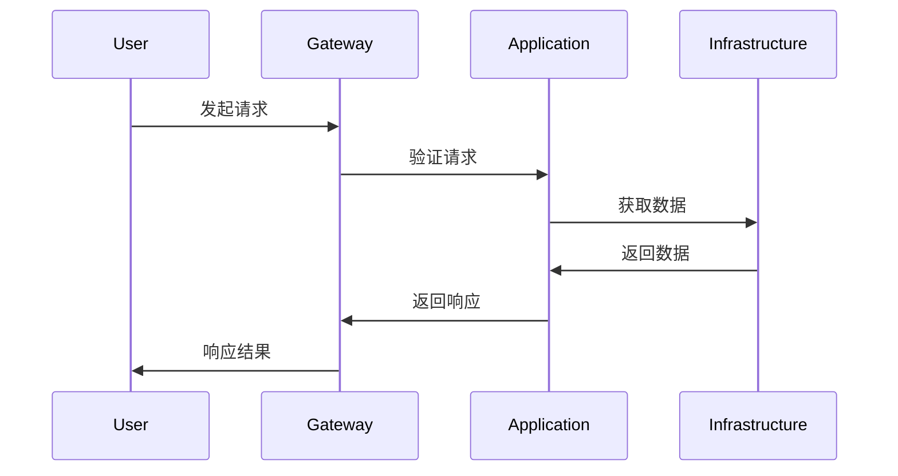
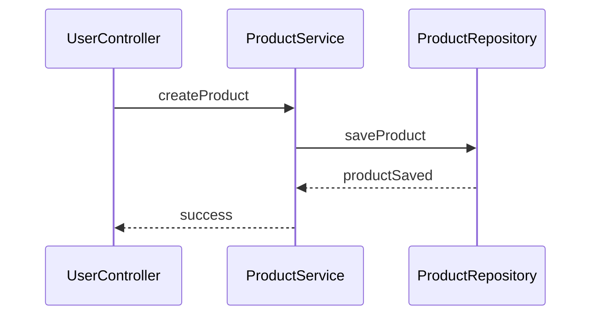

                 

# 领域驱动设计：复杂业务系统的设计方法

## 关键词
领域驱动设计（DDD）、复杂业务系统、系统架构设计、实体、值对象、聚合、领域服务

## 摘要
本文将深入探讨领域驱动设计（Domain-Driven Design，简称DDD）这一现代软件开发方法论，并展示其如何帮助开发者设计和管理复杂业务系统。文章将逐步介绍DDD的核心概念和设计模式，通过具体的数学模型和算法原理讲解，展示DDD在系统架构设计中的应用。同时，本文将结合实际项目案例，详细解析DDD的实施过程和最佳实践，为读者提供全面、易懂的DDD学习指南。

---

## 第1章 背景介绍

### 1.1 核心概念术语说明

在探讨领域驱动设计之前，我们需要明确一些核心概念。以下是对这些术语的简要说明：

- **领域（Domain）**：指业务范围，包括业务逻辑、业务规则和业务数据。
- **驱动（Driven）**：指通过领域模型来驱动整个软件开发过程，确保软件开发与业务需求紧密关联。
- **设计（Design）**：指对业务系统进行架构设计和代码设计，使其满足领域需求。

### 1.2 问题背景

随着企业业务的不断复杂化，传统的软件开发方法逐渐暴露出诸多问题，如代码难以维护、业务逻辑与代码耦合度高等。这些问题使得开发者难以在快速变化的业务环境中保持敏捷和高效。领域驱动设计应运而生，它提供了一种全新的思路和方法，旨在解决这些问题。

### 1.3 问题描述

业务系统的复杂性主要体现在以下几个方面：

- **业务规则复杂**：业务规则繁多且变化频繁，难以在代码中表达和处理。
- **业务逻辑与代码耦合**：业务逻辑与代码紧密绑定，导致代码可读性差、可维护性低。
- **系统扩展性差**：业务需求变更时，系统难以适应，扩展性差。

### 1.4 问题解决

领域驱动设计通过以下几个方面的改进，解决上述问题：

- **领域模型驱动**：通过构建领域模型，将业务逻辑和代码分离，提高代码可读性和可维护性。
- **分层架构**：将系统划分为多个层次，明确各层次的职责和关系，提高系统扩展性和模块化程度。
- **事件驱动**：采用事件驱动架构，实现业务逻辑的松耦合，提高系统的灵活性和可扩展性。

### 1.5 边界与外延

领域驱动设计不仅适用于大型企业级应用，还可以应用于中小型项目。其核心思想是通过清晰的领域模型和架构设计，确保系统与业务需求的一致性，提高开发效率和系统质量。

### 1.6 概念结构与核心要素组成

领域驱动设计的核心要素包括：

- **领域模型**：用于描述业务领域和业务规则。
- **分层架构**：将系统划分为多个层次，如领域层、应用层、基础设施层等。
- **领域服务**：用于实现业务逻辑和业务规则。
- **事件驱动架构**：通过事件传递消息，实现业务逻辑的松耦合。

---

## 第2章 核心概念与联系

### 2.1 实体与值对象

实体（Entity）和值对象（Value Object）是领域驱动设计中的两个核心概念。

#### 2.1.1 实体

实体是具有唯一标识符的对象，例如客户、订单、员工等。实体通常具有状态和行为。

- **属性**：实体的属性描述了实体的特征，如客户的姓名、地址等。
- **行为**：实体的行为描述了实体可以执行的操作，如客户的下单、退货等。

#### 2.1.2 值对象

值对象是表示数据值的对象，如日期、重量、价格等。值对象通常没有唯一标识符，仅表示数据。

- **属性**：值对象的属性描述了值对象的值，如日期的年、月、日等。
- **行为**：值对象通常没有行为，仅用于传递数据。

### 2.2 聚合

聚合（Aggregate）是领域驱动设计中的另一个重要概念，用于表示一组相关联的对象。

#### 2.2.1 聚合根

聚合根（Aggregate Root）是聚合中的核心对象，用于标识聚合。聚合根通常具有唯一标识符。

#### 2.2.2 聚合成员

聚合成员是聚合中除聚合根之外的其他对象。聚合成员依赖于聚合根，聚合根负责管理聚合成员的状态和行为。

### 2.3 领域服务

领域服务（Domain Service）用于实现业务逻辑和业务规则。

#### 2.3.1 领域服务的作用

领域服务的主要作用是提供跨聚合的复杂业务逻辑，确保业务规则的一致性和完整性。

#### 2.3.2 领域服务的分类

- **领域服务**：用于实现核心业务逻辑，如订单处理、库存管理等。
- **应用服务**：用于实现应用层的功能，如用户登录、权限验证等。
- **基础设施服务**：用于实现基础设施层的功能，如数据库访问、网络通信等。

### 2.4 边界与外延

领域驱动设计中的核心概念不仅局限于实体、值对象、聚合和领域服务，还包括分层架构、事件驱动架构等。这些概念相互关联，共同构建了一个完整的领域驱动设计体系。

---

## 第3章 算法原理讲解

### 3.1 领域事件

领域事件（Domain Event）是领域驱动设计中的一个重要概念，用于描述业务领域中发生的事件。

#### 3.1.1 领域事件的定义

领域事件是指业务领域中发生的重要事件，如订单创建、订单发货等。

#### 3.1.2 领域事件的类型

- **创建事件**：表示一个新的实体被创建，如订单创建事件。
- **修改事件**：表示实体的某个属性被修改，如订单修改事件。
- **删除事件**：表示一个实体被删除，如订单删除事件。

### 3.2 聚合

聚合（Aggregate）是领域驱动设计中的一个核心概念，用于表示一组相关联的对象。

#### 3.2.1 聚合的定义

聚合是指一组具有共同属性和行为的对象，它们在业务逻辑上紧密相关。

#### 3.2.2 聚合的划分

- **单一聚合**：指聚合中的所有对象都属于同一个层级，如订单聚合。
- **复合聚合**：指聚合中的对象跨越多个层级，如订单、库存聚合。

### 3.3 工厂方法

工厂方法（Factory Method）是领域驱动设计中的一个设计模式，用于创建对象。

#### 3.3.1 工厂方法的定义

工厂方法是指通过定义一个接口，让实现类在接口中实现创建对象的方法，从而实现对象的创建。

#### 3.3.2 工厂方法的分类

- **简单工厂方法**：指通过一个工厂类来实现对象的创建。
- **工厂方法模式**：指通过接口和实现类来实现对象的创建。

### 3.4 数学模型和公式

领域驱动设计中的数学模型和公式主要用于描述业务规则和业务逻辑。

#### 3.4.1 数学模型

- **业务规则模型**：用于描述业务规则和业务逻辑。
- **数据模型**：用于描述业务领域中的数据结构。

#### 3.4.2 公式

- **业务规则公式**：用于描述业务规则，如订单金额的计算公式。
- **数据公式**：用于描述业务领域中的数据结构，如订单数据的存储公式。

### 3.5 举例说明

#### 3.5.1 领域事件的举例

假设有一个订单系统，其中包含订单创建事件、订单修改事件和订单删除事件。订单创建事件表示一个新的订单被创建，订单修改事件表示订单的某个属性被修改，订单删除事件表示订单被删除。

#### 3.5.2 聚合的举例

假设有一个订单聚合，其中包含订单实体、订单详情实体和订单状态实体。订单实体表示订单的基本信息，订单详情实体表示订单的详细信息，订单状态实体表示订单的状态。

#### 3.5.3 工厂方法的举例

假设有一个工厂类，用于创建订单对象。工厂类通过接口和实现类来实现对象的创建，从而实现订单对象的创建。

$$
\text{Order} = \text{OrderFactory}.\text{createOrder}()
$$

### 3.6 案例分析

#### 3.6.1 订单创建

当用户提交订单时，系统会生成一个订单创建事件，并将订单数据存储在数据库中。

$$
\text{OrderCreatedEvent} = \text{OrderService}.\text{createOrder}(order)
$$

#### 3.6.2 订单修改

当用户修改订单时，系统会生成一个订单修改事件，并将修改后的订单数据存储在数据库中。

$$
\text{OrderUpdatedEvent} = \text{OrderService}.\text{updateOrder}(order)
$$

#### 3.6.3 订单删除

当用户删除订单时，系统会生成一个订单删除事件，并将订单数据从数据库中删除。

$$
\text{OrderDeletedEvent} = \text{OrderService}.\text{deleteOrder}(order)
$$

---

## 第4章 系统分析与架构设计方案

### 4.1 问题场景介绍

在现实世界中，企业业务系统往往非常复杂，涉及大量的业务规则和业务逻辑。如何设计一个高效、可维护、可扩展的业务系统成为开发者面临的一个重要挑战。

### 4.2 项目介绍

本文将结合一个电商平台项目，介绍如何使用领域驱动设计（DDD）方法进行系统设计与实现。该项目主要包括商品管理、订单管理、用户管理、支付管理等功能。

### 4.3 领域模型设计

领域模型是领域驱动设计的核心，用于描述业务领域中的实体、值对象、聚合和领域服务。以下是一个简单的商品领域模型：

```mermaid
classDiagram
    Product <<Entity>>
    ProductDetail <<ValueObject>>
    Category <<Entity>>

    Product o-- ProductDetail
    Product o-- Category

    Product {
        id: Long
        name: String
        price: BigDecimal
        status: String
    }

    ProductDetail {
        productId: Long
        title: String
        description: String
        quantity: Integer
    }

    Category {
        id: Long
        name: String
        parentId: Long?
    }
```

### 4.4 系统架构设计

系统架构设计是领域驱动设计的重要组成部分，用于描述系统的整体结构和各个组件之间的关系。以下是一个简单的系统架构设计：



### 4.5 系统接口设计

系统接口设计用于定义系统与外部系统之间的交互方式。以下是一个简单的接口设计：

```java
public interface ProductService {
    Product createProduct(Product product);
    Product updateProduct(Product product);
    Product deleteProduct(Long id);
    List<Product> getAllProducts();
}
```

### 4.6 系统交互

系统交互描述了系统内部各个组件之间的交互过程。以下是一个简单的系统交互序列图：



---

## 第5章 项目实战

### 5.1 环境安装

为了实践领域驱动设计，我们需要安装以下软件和工具：

1. **Java Development Kit (JDK)**：安装 JDK，版本要求为 11 或以上。
2. **Integrated Development Environment (IDE)**：推荐使用 IntelliJ IDEA 或 Eclipse。
3. **Maven**：安装 Maven，用于构建和依赖管理。

### 5.2 系统核心实现源代码

以下是一个简单的电商平台项目源代码，包括领域模型、应用层服务和基础设施层实现：

```java
// 领域模型
public class Product {
    private Long id;
    private String name;
    private BigDecimal price;
    private String status;

    // 构造方法、getter、setter 略
}

public class ProductDetail {
    private Long productId;
    private String title;
    private String description;
    private Integer quantity;

    // 构造方法、getter、setter 略
}

public class Category {
    private Long id;
    private String name;
    private Long parentId;

    // 构造方法、getter、setter 略
}

// 应用层服务
public class ProductService {
    private ProductRepository productRepository;

    public Product createProduct(Product product) {
        return productRepository.save(product);
    }

    public Product updateProduct(Product product) {
        return productRepository.update(product);
    }

    public Product deleteProduct(Long id) {
        return productRepository.delete(id);
    }

    public List<Product> getAllProducts() {
        return productRepository.findAll();
    }
}

// 基础设施层实现
public class ProductRepository {
    public Product save(Product product) {
        // 实现产品保存逻辑
    }

    public Product update(Product product) {
        // 实现产品更新逻辑
    }

    public Product delete(Long id) {
        // 实现产品删除逻辑
    }

    public List<Product> findAll() {
        // 实现产品查询逻辑
    }
}
```

### 5.3 代码应用解读与分析

在上述代码中，我们定义了三个领域模型类：`Product`、`ProductDetail`和`Category`。这三个类分别表示产品、产品详情和产品分类。

- **Product** 类：表示产品实体，包含产品的 ID、名称、价格和状态等属性。
- **ProductDetail** 类：表示产品详情值对象，包含产品的标题、描述和数量等属性。
- **Category** 类：表示产品分类实体，包含分类的 ID、名称和父分类 ID 等属性。

在应用层，我们定义了一个 `ProductService` 类，用于处理产品的创建、更新、删除和查询等操作。这个类依赖于基础设施层的 `ProductRepository` 类，后者负责与数据库进行交互。

### 5.4 实际案例分析和详细讲解剖析

在这个项目中，我们通过领域驱动设计方法，将业务领域中的实体、值对象和领域服务进行抽象和封装，实现了业务逻辑和代码的分离。

- **领域模型**：通过定义 `Product`、`ProductDetail` 和 `Category` 类，将业务领域中的实体和值对象进行抽象，确保了领域模型与业务逻辑的一致性。
- **应用层服务**：通过定义 `ProductService` 类，将业务逻辑进行封装，实现了业务逻辑的模块化和可维护性。
- **基础设施层实现**：通过定义 `ProductRepository` 类，将数据库操作进行封装，实现了数据库操作的抽象化和可扩展性。

通过这个项目案例，我们可以看到领域驱动设计在解决业务复杂性和提高代码质量方面的优势。在实际开发过程中，我们还可以根据项目需求，进一步扩展领域模型和系统架构，以满足更多业务场景的需求。

### 5.5 项目小结

通过本次项目实战，我们深入了解了领域驱动设计（DDD）的方法和技巧。在项目实施过程中，我们通过定义领域模型、应用层服务和基础设施层实现，实现了业务逻辑和代码的分离，提高了系统的可维护性和可扩展性。

在未来，我们还可以继续优化项目架构，添加更多功能模块，如订单管理、支付管理等，以满足更多业务需求。同时，我们也可以将领域驱动设计方法应用于其他项目，进一步提升开发效率和系统质量。

---

## 第6章 最佳实践 tips

### 6.1 领域模型设计最佳实践

- **实体与值对象的区分**：确保实体的唯一标识符和状态行为清晰明确，而值对象仅表示数据值。
- **聚合边界的设计**：明确聚合根和聚合成员之间的关系，确保聚合边界清晰。

### 6.2 系统架构设计最佳实践

- **分层架构的应用**：遵循分层架构原则，确保系统模块化、可扩展。
- **事件驱动架构的实施**：通过事件驱动实现业务逻辑的松耦合，提高系统的灵活性和可扩展性。

### 6.3 领域服务设计最佳实践

- **领域服务的分类**：根据业务逻辑的复杂性，合理划分领域服务、应用服务和基础设施服务。
- **领域服务的职责分离**：确保领域服务的职责单一，避免过度耦合。

### 6.4 开发流程优化

- **持续集成与持续部署**：采用自动化测试和部署流程，确保项目质量和交付效率。
- **代码规范和文档编写**：遵循统一的代码规范和文档编写规范，提高代码可读性和可维护性。

---

## 第7章 小结与拓展阅读

本文通过详细分析和讲解，介绍了领域驱动设计（DDD）在复杂业务系统设计中的应用。通过实际项目案例，我们展示了如何利用DDD方法实现业务逻辑与代码的分离，提高系统的可维护性和可扩展性。

为了更好地掌握领域驱动设计，我们推荐以下拓展阅读：

- 《领域驱动设计：软件核心复杂性应对策略》 - Eric Evans
- 《领域驱动设计实践》 - Nat Pryce & Chris Richardson

通过深入学习和实践，相信读者可以更好地运用领域驱动设计方法，解决复杂业务系统的设计难题。

---

**作者：AI天才研究院/AI Genius Institute & 禅与计算机程序设计艺术 /Zen And The Art of Computer Programming**

