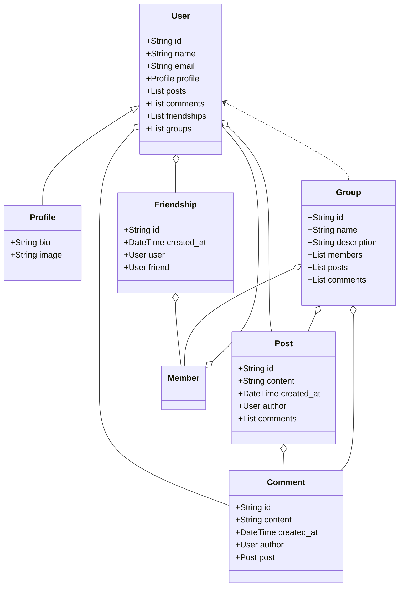
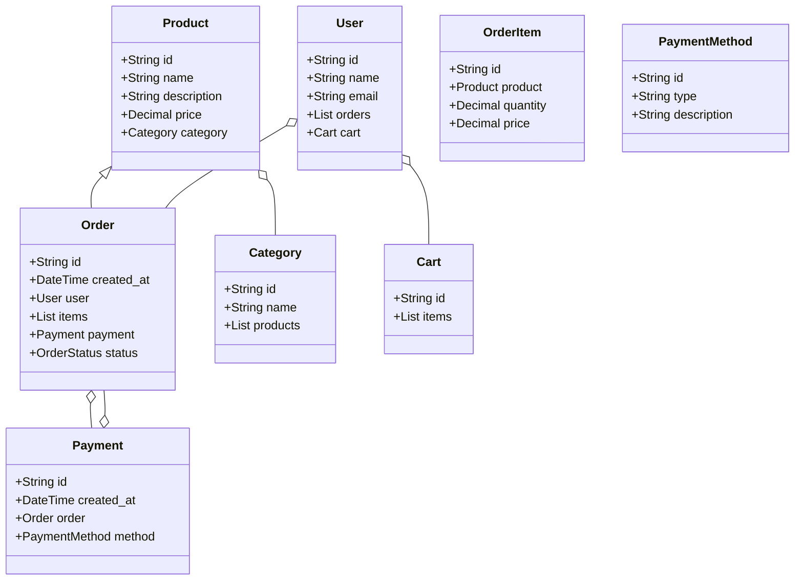
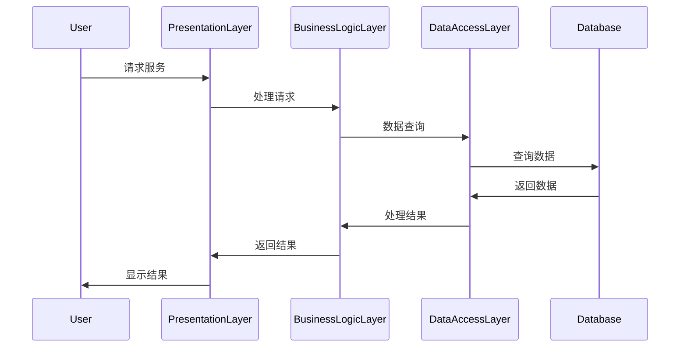
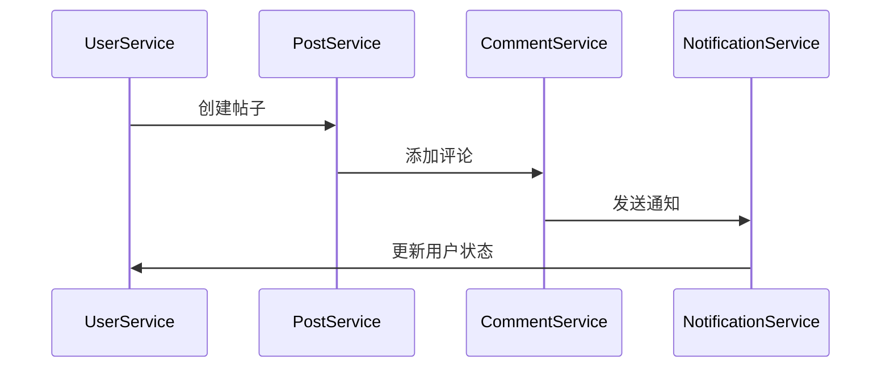

                 

# 领域驱动设计：复杂业务系统的设计方法

关键词：领域驱动设计，复杂业务系统，设计方法论，软件架构，软件开发

摘要：领域驱动设计（Domain-Driven Design，简称DDD）作为一种面向复杂业务系统的设计方法论，旨在应对现代软件开发中日益复杂的业务需求。本文将从背景介绍、核心概念、构建实践、设计对比、架构设计、数据库设计、测试、软件工程实践等多个维度，全面解析领域驱动设计的方法论和实际应用，帮助读者深入理解并掌握这一重要技术。

## 前言

### 1. 背景介绍

在传统的软件开发过程中，系统设计往往侧重于技术层面，忽略了业务需求的核心价值。随着互联网的兴起和业务场景的日益复杂，传统的设计方法逐渐暴露出其局限性，如对业务变化的适应能力差、系统可维护性低、团队协作困难等问题。

### 1.2 软件开发中的复杂性问题

现代软件系统面临着多样化的业务需求、快速变化的市场环境、高度复杂的业务规则等挑战。这些复杂性问题使得传统的设计方法难以满足软件开发的实际需求，迫切需要一种新的设计方法论来应对。

### 1.3 领域驱动设计的起源与核心概念

领域驱动设计由Eric Evans于2004年在其同名著作中提出，旨在通过明确领域模型、强化领域专家与开发团队的协作，来设计和管理复杂业务系统。其核心思想是将业务领域作为软件设计的核心，将业务需求转化为可操作的软件架构和实现。

## 第一部分：领域驱动设计基础

### 第1章：领域驱动设计的核心概念

#### 1.1 领域驱动设计的起源与发展

领域驱动设计起源于软件工程领域，针对传统设计方法的局限性提出了一系列创新的思想和方法。自2004年Eric Evans提出以来，DDD逐渐在业界得到了广泛的认可和应用。

#### 1.2 领域驱动设计的关键原则

领域驱动设计基于一系列关键原则，包括客户视角、领域专家合作、领域模型等。这些原则指导开发者如何更好地理解和解决复杂业务问题。

##### 1.2.1 客户视角

领域驱动设计强调以客户需求为导向，将客户需求视为软件开发的核心。开发者需要深入理解客户需求，将其转化为可操作的软件设计。

##### 1.2.2 领域专家合作

领域专家是领域驱动设计的核心角色，他们拥有丰富的业务知识和经验。开发团队需要与领域专家紧密合作，共同构建领域模型和软件架构。

##### 1.2.3 领域模型

领域模型是领域驱动设计的核心要素，用于表示业务领域中的核心概念、关系和规则。通过构建领域模型，开发者可以更清晰地理解和表达业务需求。

#### 1.3 领域模型的基本要素

领域模型包括实体、值对象、集合和关联等基本要素。这些要素构成了领域模型的核心结构，为软件开发提供了坚实的理论基础。

##### 1.3.1 实体

实体是领域模型中的核心元素，表示业务领域中的核心概念。实体具有唯一标识、行为和属性等特征。

##### 1.3.2 值对象

值对象是领域模型中的辅助元素，用于表示业务领域中的具体值。值对象具有特定的类型、值和用途。

##### 1.3.3 集合

集合是领域模型中的复数元素，用于表示多个实体或值对象的组合。集合具有特定的类型、元素和关系。

##### 1.3.4 关联

关联是领域模型中的关系元素，用于表示实体、值对象或集合之间的交互和依赖关系。关联具有特定的类型、方向和规则。

#### 1.4 领域模型的设计方法论

领域模型的设计方法论包括领域专家的角色、领域模型的迭代与演进等。这些方法论为领域模型的设计和优化提供了指导原则。

##### 1.4.1 领域专家的角色

领域专家在领域模型设计中扮演关键角色，他们负责理解业务需求、构建领域模型和与开发团队协作。

##### 1.4.2 领域模型迭代与演进

领域模型不是一成不变的，而是随着业务需求的变化不断迭代和演进。开发者需要持续关注业务需求的变化，及时调整和优化领域模型。

#### 1.5 本章小结

本章介绍了领域驱动设计的核心概念、关键原则、基本要素和设计方法论。通过本章的学习，读者可以初步了解领域驱动设计的基本思想和应用场景。

### 第2章：领域模型构建实践

#### 2.1 领域模型构建的步骤

领域模型构建是一个迭代和逐步求精的过程，包括需求收集与分析、设计领域模型、模型验证与优化等步骤。

##### 2.1.1 需求收集与分析

需求收集与分析是领域模型构建的第一步，旨在全面了解业务需求。开发者需要通过与领域专家、客户等多方沟通，收集和分析业务需求。

##### 2.1.2 设计领域模型

设计领域模型是基于需求分析的结果，构建领域模型的过程。开发者需要根据业务需求，识别核心概念、关系和规则，并绘制领域模型图。

##### 2.1.3 模型验证与优化

模型验证与优化是对领域模型的反复检查和调整，以确保其准确性和完整性。开发者需要通过测试、评审等方式，验证领域模型的有效性，并不断优化和改进。

#### 2.2 领域模型设计与开发工具

领域模型设计与开发工具是构建领域模型的重要辅助工具，包括绘制领域模型的工具、编码领域模型的语言和领域驱动设计工具集等。

##### 2.2.1 绘制领域模型的工具

绘制领域模型的工具包括UML建模工具、Mermaid图表工具等，用于绘制领域模型图，帮助开发者直观地表示领域模型。

##### 2.2.2 编码领域模型的语言

编码领域模型的语言包括Java、C#、Python等，开发者可以使用这些语言来实现领域模型，构建实际业务系统。

##### 2.2.3 领域驱动设计工具集

领域驱动设计工具集包括Eclipse、IntelliJ IDEA等集成开发环境（IDE），以及DDD.NET、DDD4JS等专门针对领域驱动设计的框架和工具。

#### 2.3 领域模型案例研究

通过案例研究，可以更好地理解领域模型构建的实践和方法。以下介绍了两个领域模型案例研究：社交网络平台领域模型和电子商务平台领域模型。

##### 2.3.1 社交网络平台领域模型

社交网络平台领域模型涉及用户、关系、内容等多个核心概念。通过绘制领域模型图，可以清晰地表达用户之间的互动、内容的生成和传播等业务规则。

##### 2.3.2 电子商务平台领域模型

电子商务平台领域模型涉及商品、订单、支付等多个核心概念。通过绘制领域模型图，可以清晰地表达商品信息管理、订单处理、支付流程等业务规则。

#### 2.4 本章小结

本章介绍了领域模型构建的步骤、工具和案例研究。通过本章的学习，读者可以掌握领域模型构建的基本方法和实践。

## 第二部分：领域驱动设计与系统设计

### 第3章：领域驱动设计与传统设计方法对比

#### 3.1 传统设计方法的局限性

传统设计方法在软件系统设计中起到了重要作用，但在面对复杂业务需求时，往往表现出以下局限性：

##### 3.1.1 对业务变化的适应能力差

传统设计方法强调技术层面的优化和抽象，往往忽视了业务需求的变化。这使得系统在应对业务变化时，表现出较低的适应能力和灵活性。

##### 3.1.2 系统可维护性低

传统设计方法注重系统结构的稳定性和一致性，但往往导致系统复杂性增加，维护难度加大。这使得系统在长期维护过程中，容易产生问题。

##### 3.1.3 团队协作困难

传统设计方法强调开发者之间的技术协作，但在面对复杂业务需求时，往往需要领域专家的参与。这使得团队协作变得复杂，沟通成本增加。

#### 3.2 领域驱动设计的优势

领域驱动设计通过明确领域模型、强化领域专家与开发团队的协作，解决了传统设计方法的局限性，具有以下优势：

##### 3.2.1 对业务变化的适应能力

领域驱动设计强调以客户需求为导向，将业务需求转化为领域模型和软件架构。这使得系统在应对业务变化时，具有更高的适应能力和灵活性。

##### 3.2.2 提高软件可维护性

领域驱动设计通过明确领域模型，将业务规则和系统功能分离，降低了系统的复杂性。这使得系统在长期维护过程中，具有更高的可维护性和可扩展性。

##### 3.2.3 促进团队协作

领域驱动设计强调领域专家与开发团队的紧密协作，通过明确领域模型和业务规则，降低了沟通成本，提高了团队协作效率。

#### 3.3 领域驱动设计与敏捷开发

领域驱动设计与敏捷开发理念有着高度的契合性，两者可以相互补充和促进。以下介绍了领域驱动设计与敏捷开发的关系和融合：

##### 3.3.1 领域驱动设计与敏捷原则的融合

领域驱动设计遵循敏捷开发的核心原则，如持续交付、迭代开发和团队协作等。同时，领域驱动设计还引入了领域专家的角色，进一步促进了团队协作。

##### 3.3.2 领域驱动设计在敏捷开发中的实践

领域驱动设计在敏捷开发中，可以通过以下实践方法，提高软件开发效率和产品质量：

1. 通过领域模型和迭代开发，逐步实现业务需求。
2. 通过持续集成和自动化测试，确保系统稳定性和可靠性。
3. 通过领域专家与开发团队的紧密协作，降低沟通成本和误解。

#### 3.4 本章小结

本章介绍了领域驱动设计与传统设计方法的对比，以及领域驱动设计与敏捷开发的融合。通过本章的学习，读者可以更好地理解领域驱动设计的优势和实践方法。

### 第4章：领域驱动设计与架构设计

#### 4.1 领域驱动设计与分层架构

分层架构是软件开发中常用的架构设计方法，领域驱动设计可以与分层架构相结合，提高系统的可维护性和可扩展性。

##### 4.1.1 层次架构的基本概念

层次架构将系统划分为多个层次，每个层次负责不同的功能。常见的层次包括表示层、业务逻辑层、数据访问层等。

##### 4.1.2 领域驱动设计在分层架构中的应用

领域驱动设计可以与分层架构相结合，通过明确领域模型和分层架构的关系，提高系统的可维护性和可扩展性。例如，业务逻辑层可以负责实现领域模型中的业务规则，数据访问层可以负责与数据库的交互。

#### 4.2 领域驱动设计与服务架构

服务架构是一种基于服务的系统设计方法，领域驱动设计可以与服务架构相结合，提高系统的灵活性和服务化程度。

##### 4.2.1 服务架构的基本概念

服务架构将系统划分为多个服务，每个服务负责特定的功能。服务之间通过接口进行通信，具有高内聚、低耦合的特点。

##### 4.2.2 领域驱动设计在服务架构中的应用

领域驱动设计可以与服务架构相结合，通过明确领域模型和服务的关系，提高系统的灵活性和服务化程度。例如，可以将领域模型中的实体和服务对应，通过服务接口实现实体的操作。

#### 4.3 领域驱动设计与微服务架构

微服务架构是一种基于服务的系统设计方法，领域驱动设计可以与微服务架构相结合，提高系统的可扩展性和可维护性。

##### 4.3.1 微服务架构的基本概念

微服务架构将系统划分为多个微服务，每个微服务负责特定的功能。微服务之间通过轻量级的通信协议（如HTTP/REST）进行交互。

##### 4.3.2 领域驱动设计在微服务架构中的应用

领域驱动设计可以与微服务架构相结合，通过明确领域模型和微服务的关系，提高系统的可扩展性和可维护性。例如，可以将领域模型中的实体和服务划分为不同的微服务，通过接口进行通信。

#### 4.4 本章小结

本章介绍了领域驱动设计与分层架构、服务架构和微服务架构的融合。通过本章的学习，读者可以更好地理解领域驱动设计在系统架构设计中的应用。

### 第5章：领域驱动设计与数据库设计

#### 5.1 领域驱动设计与数据库设计的关系

领域驱动设计关注业务领域和业务规则，数据库设计则关注数据存储和访问。两者之间存在紧密的关系，领域驱动设计可以优化数据库设计，提高数据的一致性和完整性。

##### 5.1.1 数据库设计的方法与挑战

数据库设计包括关系模型设计、索引设计、存储过程设计等。在数据库设计中，常见挑战包括数据一致性问题、查询性能优化、扩展性等。

##### 5.1.2 领域驱动设计如何优化数据库设计

领域驱动设计通过明确领域模型和业务规则，可以帮助数据库设计者更好地理解业务需求，从而优化数据库设计。例如，通过领域模型可以明确数据之间的关联关系，从而优化关系模型设计。

#### 5.2 领域驱动设计中的数据库模式

领域驱动设计中的数据库模式包括实体关系模型、复合主键与外键约束、数据库模式重构等。

##### 5.2.1 实体关系模型

实体关系模型是领域驱动设计中的核心数据库模式，用于表示实体、关联和关系。通过实体关系模型，可以明确数据之间的关系和约束。

##### 5.2.2 复合主键与外键约束

复合主键和外键约束是数据库设计中常用的约束机制，用于确保数据的一致性和完整性。领域驱动设计可以帮助设计者更好地理解业务规则，从而合理地设置复合主键和外键约束。

##### 5.2.3 数据库模式重构

数据库模式重构是对现有数据库模式的调整和优化，以适应业务需求的变化。领域驱动设计通过持续关注业务需求的变化，可以及时发现和解决数据库模式中的问题，从而提高数据库设计的灵活性。

#### 5.3 领域驱动设计中的数据持久化

领域驱动设计中的数据持久化包括数据持久化策略和ORM框架的选择与应用。

##### 5.3.1 数据持久化策略

数据持久化策略是指将数据从内存中持久化到数据库的方法。常见的持久化策略包括文件存储、关系数据库存储和NoSQL存储等。

##### 5.3.2 ORM框架的选择与应用

ORM（Object-Relational Mapping）框架是一种将对象模型和关系数据库模型相互映射的工具，可以简化数据持久化操作。领域驱动设计中选择合适的ORM框架，可以提高开发效率和数据一致性。

#### 5.4 本章小结

本章介绍了领域驱动设计与数据库设计的关系、数据库模式、数据持久化策略和ORM框架的选择与应用。通过本章的学习，读者可以更好地理解领域驱动设计在数据库设计中的应用。

### 第6章：领域驱动设计与测试

#### 6.1 领域驱动设计与测试的关系

领域驱动设计关注业务领域和业务规则，测试则是确保软件质量和功能正确性的重要手段。领域驱动设计可以优化测试策略和方法，提高软件的可靠性和稳定性。

##### 6.1.1 传统测试方法的挑战

传统测试方法主要关注技术层面和功能实现，但在面对复杂业务需求时，往往难以全面覆盖业务规则和场景。这使得传统测试方法在面对领域驱动设计时，表现出以下挑战：

1. 难以覆盖复杂的业务规则和流程。
2. 难以区分功能测试和非功能测试。
3. 测试覆盖率难以量化和管理。

##### 6.1.2 领域驱动设计如何改进测试

领域驱动设计通过明确领域模型和业务规则，可以优化测试策略和方法，提高软件的可靠性和稳定性。以下是一些改进措施：

1. 通过领域模型和业务规则，明确测试范围和重点。
2. 将测试分为功能测试和非功能测试，分别进行设计和执行。
3. 采用自动化测试工具，提高测试效率和覆盖范围。

#### 6.2 领域驱动设计中的测试策略

领域驱动设计中的测试策略包括功能测试、非功能测试和自动化测试等。

##### 6.2.1 功能测试

功能测试是验证软件功能是否符合需求的过程。领域驱动设计通过明确领域模型和业务规则，可以更好地设计功能测试用例，确保软件功能的正确性。

##### 6.2.2 非功能测试

非功能测试是验证软件性能、安全性、可用性等方面的过程。领域驱动设计通过明确领域模型和业务规则，可以更好地设计和执行非功能测试用例，确保软件的非功能特性。

##### 6.2.3 自动化测试

自动化测试是通过自动化工具执行测试用例的过程，可以提高测试效率和覆盖范围。领域驱动设计可以通过以下方法实现自动化测试：

1. 使用自动化测试框架，如Selenium、JUnit等。
2. 编写测试脚本，实现自动化测试用例。
3. 将自动化测试集成到持续集成和持续交付流程中。

#### 6.3 领域驱动设计中的测试实践

领域驱动设计中的测试实践包括测试驱动开发（TDD）、测试金字塔和测试自动化框架等。

##### 6.3.1 测试驱动开发（TDD）

测试驱动开发是一种开发方法，通过编写测试用例来驱动开发过程。领域驱动设计通过TDD方法，可以确保软件的每一个功能模块都经过充分的测试。

##### 6.3.2 测试金字塔

测试金字塔是一种测试策略，通过分层结构来管理测试用例。领域驱动设计可以通过测试金字塔，确保软件的测试覆盖面全面，同时提高测试效率。

##### 6.3.3 测试自动化框架

测试自动化框架是一种将测试脚本封装和管理的工具，可以提高测试效率和可维护性。领域驱动设计可以通过测试自动化框架，实现自动化测试的快速部署和执行。

#### 6.4 本章小结

本章介绍了领域驱动设计与测试的关系、测试策略和测试实践。通过本章的学习，读者可以更好地理解领域驱动设计在测试中的应用。

## 第三部分：领域驱动设计与软件工程实践

### 第7章：领域驱动设计在大型项目中的应用

#### 7.1 大型项目中的复杂业务需求

大型项目往往涉及复杂的业务需求，包括多领域、多业务流程、多系统协同等。领域驱动设计可以帮助大型项目更好地应对这些复杂业务需求。

##### 7.1.1 复杂业务需求的特点

复杂业务需求通常具有以下特点：

1. 业务流程多样化：大型项目往往涉及多个业务领域和流程，如订单管理、库存管理、支付系统等。
2. 业务规则复杂：大型项目中的业务规则往往较为复杂，包括多个层次和条件约束。
3. 系统协同性高：大型项目中的多个系统需要协同工作，以确保业务流程的顺畅和高效。

##### 7.1.2 领域驱动设计在大项目中的实践

领域驱动设计在大项目中的应用包括以下几个方面：

1. 明确领域模型：通过明确领域模型，将复杂的业务需求转化为可操作的设计和实现。
2. 建立领域专家团队：领域专家在大项目中扮演关键角色，与开发团队紧密协作，确保领域模型的准确性和完整性。
3. 分层架构设计：通过分层架构设计，将复杂的业务需求分解为多个层次，提高系统的可维护性和可扩展性。
4. 服务化和微服务架构：通过服务化和微服务架构，实现系统的灵活部署和高效协同。

#### 7.2 成功案例分享

以下介绍了两个大型项目的领域驱动设计实践案例：某电商平台的领域驱动设计和某金融系统的领域驱动设计。

##### 7.2.1 某电商平台的领域驱动设计实践

某电商平台是一个典型的复杂业务系统，涉及用户管理、商品管理、订单管理、支付系统等多个领域。通过领域驱动设计，项目团队明确了领域模型，建立了领域专家团队，实现了服务化和微服务架构。实践表明，领域驱动设计有效提高了项目的开发效率和系统质量。

##### 7.2.2 某金融系统的领域驱动设计实践

某金融系统是一个高度复杂的大型项目，涉及资金管理、风险管理、合规性等多个领域。通过领域驱动设计，项目团队明确了领域模型，建立了领域专家团队，实现了分层架构和服务化。实践表明，领域驱动设计有效提高了项目的开发效率、系统质量和业务灵活性。

#### 7.3 本章小结

本章介绍了领域驱动设计在大型项目中的应用和实践案例。通过本章的学习，读者可以更好地理解领域驱动设计在实际项目中的应用方法和效果。

### 第8章：领域驱动设计的最佳实践

#### 8.1 领域驱动设计的关键成功因素

领域驱动设计在实际应用中取得成功的关键因素包括以下几个方面：

##### 8.1.1 理解业务需求

理解业务需求是领域驱动设计成功的基础。开发者需要深入理解客户需求、业务规则和流程，将业务需求转化为领域模型和软件架构。

##### 8.1.2 持续迭代与改进

领域驱动设计是一个持续迭代和改进的过程。开发者需要不断关注业务需求的变化，及时调整和优化领域模型和软件架构。

##### 8.1.3 团队协作与知识共享

团队协作与知识共享是领域驱动设计成功的关键。领域专家、开发团队和测试团队需要紧密协作，共同构建领域模型和软件架构，确保项目的顺利进行。

#### 8.2 领域驱动设计中的常见问题

领域驱动设计在实际应用中可能会遇到一些常见问题，包括以下几个方面：

##### 8.2.1 领域模型过度抽象

领域模型过度抽象可能导致领域模型过于复杂，难以理解和维护。开发者需要适度抽象，确保领域模型的可操作性和可维护性。

##### 8.2.2 领域专家参与不足

领域专家参与不足可能导致领域模型不准确或不符合实际业务需求。开发者需要加强与领域专家的沟通和协作，确保领域模型的准确性和完整性。

##### 8.2.3 测试覆盖率不足

测试覆盖率不足可能导致系统存在潜在问题。开发者需要采用自动化测试、TDD等方法，提高测试覆盖率和质量。

#### 8.3 本章小结

本章介绍了领域驱动设计的关键成功因素和常见问题。通过本章的学习，读者可以更好地理解领域驱动设计在实际应用中的最佳实践和注意事项。

## 结束语

领域驱动设计作为一种面向复杂业务系统的设计方法论，在应对现代软件开发中的复杂业务需求方面具有显著优势。本文从背景介绍、核心概念、构建实践、设计对比、架构设计、数据库设计、测试和软件工程实践等多个维度，全面解析了领域驱动设计的方法论和实际应用。通过本文的学习，读者可以深入理解领域驱动设计的核心思想和方法，为实际项目中的应用提供有力支持。

作者：AI天才研究院/AI Genius Institute & 禅与计算机程序设计艺术 /Zen And The Art of Computer Programming

---

### 附录：完整的技术博客文章

---

# 领域驱动设计：复杂业务系统的设计方法

## 关键词：领域驱动设计，复杂业务系统，设计方法论，软件架构，软件开发

## 摘要：

领域驱动设计（Domain-Driven Design，简称DDD）是一种面向复杂业务系统的设计方法论，旨在通过明确领域模型、强化领域专家与开发团队的协作，设计和管理复杂业务系统。本文将从背景介绍、核心概念、构建实践、设计对比、架构设计、数据库设计、测试、软件工程实践等多个维度，全面解析领域驱动设计的方法论和实际应用，帮助读者深入理解并掌握这一重要技术。

## 前言

### 1. 背景介绍

在传统的软件开发过程中，系统设计往往侧重于技术层面，忽略了业务需求的核心价值。随着互联网的兴起和业务场景的日益复杂，传统的设计方法逐渐暴露出其局限性，如对业务变化的适应能力差、系统可维护性低、团队协作困难等问题。

### 1.2 软件开发中的复杂性问题

现代软件系统面临着多样化的业务需求、快速变化的市场环境、高度复杂的业务规则等挑战。这些复杂性问题使得传统的设计方法难以满足软件开发的实际需求，迫切需要一种新的设计方法论来应对。

### 1.3 领域驱动设计的起源与核心概念

领域驱动设计由Eric Evans于2004年在其同名著作中提出，旨在通过明确领域模型、强化领域专家与开发团队的协作，来设计和管理复杂业务系统。其核心思想是将业务领域作为软件设计的核心，将业务需求转化为可操作的软件架构和实现。

## 第一部分：领域驱动设计基础

### 第1章：领域驱动设计的核心概念

#### 1.1 领域驱动设计的起源与发展

领域驱动设计起源于软件工程领域，针对传统设计方法的局限性提出了一系列创新的思想和方法。自2004年Eric Evans提出以来，DDD逐渐在业界得到了广泛的认可和应用。

#### 1.2 领域驱动设计的关键原则

领域驱动设计基于一系列关键原则，包括客户视角、领域专家合作、领域模型等。这些原则指导开发者如何更好地理解和解决复杂业务问题。

##### 1.2.1 客户视角

领域驱动设计强调以客户需求为导向，将客户需求视为软件开发的核心。开发者需要深入理解客户需求，将其转化为可操作的软件设计。

##### 1.2.2 领域专家合作

领域专家是领域驱动设计的核心角色，他们拥有丰富的业务知识和经验。开发团队需要与领域专家紧密合作，共同构建领域模型和软件架构。

##### 1.2.3 领域模型

领域模型是领域驱动设计的核心要素，用于表示业务领域中的核心概念、关系和规则。通过构建领域模型，开发者可以更清晰地理解和表达业务需求。

#### 1.3 领域模型的基本要素

领域模型包括实体、值对象、集合和关联等基本要素。这些要素构成了领域模型的核心结构，为软件开发提供了坚实的理论基础。

##### 1.3.1 实体

实体是领域模型中的核心元素，表示业务领域中的核心概念。实体具有唯一标识、行为和属性等特征。

##### 1.3.2 值对象

值对象是领域模型中的辅助元素，用于表示业务领域中的具体值。值对象具有特定的类型、值和用途。

##### 1.3.3 集合

集合是领域模型中的复数元素，用于表示多个实体或值对象的组合。集合具有特定的类型、元素和关系。

##### 1.3.4 关联

关联是领域模型中的关系元素，用于表示实体、值对象或集合之间的交互和依赖关系。关联具有特定的类型、方向和规则。

#### 1.4 领域模型的设计方法论

领域模型的设计方法论包括领域专家的角色、领域模型的迭代与演进等。这些方法论为领域模型的设计和优化提供了指导原则。

##### 1.4.1 领域专家的角色

领域专家在领域模型设计中扮演关键角色，他们负责理解业务需求、构建领域模型和与开发团队协作。

##### 1.4.2 领域模型迭代与演进

领域模型不是一成不变的，而是随着业务需求的变化不断迭代和演进。开发者需要持续关注业务需求的变化，及时调整和优化领域模型。

#### 1.5 本章小结

本章介绍了领域驱动设计的核心概念、关键原则、基本要素和设计方法论。通过本章的学习，读者可以初步了解领域驱动设计的基本思想和应用场景。

### 第2章：领域模型构建实践

#### 2.1 领域模型构建的步骤

领域模型构建是一个迭代和逐步求精的过程，包括需求收集与分析、设计领域模型、模型验证与优化等步骤。

##### 2.1.1 需求收集与分析

需求收集与分析是领域模型构建的第一步，旨在全面了解业务需求。开发者需要通过与领域专家、客户等多方沟通，收集和分析业务需求。

##### 2.1.2 设计领域模型

设计领域模型是基于需求分析的结果，构建领域模型的过程。开发者需要根据业务需求，识别核心概念、关系和规则，并绘制领域模型图。

##### 2.1.3 模型验证与优化

模型验证与优化是对领域模型的反复检查和调整，以确保其准确性和完整性。开发者需要通过测试、评审等方式，验证领域模型的有效性，并不断优化和改进。

#### 2.2 领域模型设计与开发工具

领域模型设计与开发工具是构建领域模型的重要辅助工具，包括绘制领域模型的工具、编码领域模型的语言和领域驱动设计工具集等。

##### 2.2.1 绘制领域模型的工具

绘制领域模型的工具包括UML建模工具、Mermaid图表工具等，用于绘制领域模型图，帮助开发者直观地表示领域模型。

##### 2.2.2 编码领域模型的语言

编码领域模型的语言包括Java、C#、Python等，开发者可以使用这些语言来实现领域模型，构建实际业务系统。

##### 2.2.3 领域驱动设计工具集

领域驱动设计工具集包括Eclipse、IntelliJ IDEA等集成开发环境（IDE），以及DDD.NET、DDD4JS等专门针对领域驱动设计的框架和工具。

#### 2.3 领域模型案例研究

通过案例研究，可以更好地理解领域模型构建的实践和方法。以下介绍了两个领域模型案例研究：社交网络平台领域模型和电子商务平台领域模型。

##### 2.3.1 社交网络平台领域模型

社交网络平台领域模型涉及用户、关系、内容等多个核心概念。通过绘制领域模型图，可以清晰地表达用户之间的互动、内容的生成和传播等业务规则。



##### 2.3.2 电子商务平台领域模型

电子商务平台领域模型涉及商品、订单、支付等多个核心概念。通过绘制领域模型图，可以清晰地表达商品信息管理、订单处理、支付流程等业务规则。



#### 2.4 本章小结

本章介绍了领域模型构建的步骤、工具和案例研究。通过本章的学习，读者可以掌握领域模型构建的基本方法和实践。

## 第二部分：领域驱动设计与系统设计

### 第3章：领域驱动设计与传统设计方法对比

#### 3.1 传统设计方法的局限性

传统设计方法在软件系统设计中起到了重要作用，但在面对复杂业务需求时，往往表现出以下局限性：

##### 3.1.1 对业务变化的适应能力差

传统设计方法强调技术层面的优化和抽象，往往忽视了业务需求的变化。这使得系统在应对业务变化时，表现出较低的适应能力和灵活性。

##### 3.1.2 系统可维护性低

传统设计方法注重系统结构的稳定性和一致性，但往往导致系统复杂性增加，维护难度加大。这使得系统在长期维护过程中，容易产生问题。

##### 3.1.3 团队协作困难

传统设计方法强调开发者之间的技术协作，但在面对复杂业务需求时，往往需要领域专家的参与。这使得团队协作变得复杂，沟通成本增加。

#### 3.2 领域驱动设计的优势

领域驱动设计通过明确领域模型、强化领域专家与开发团队的协作，解决了传统设计方法的局限性，具有以下优势：

##### 3.2.1 对业务变化的适应能力

领域驱动设计强调以客户需求为导向，将业务需求转化为领域模型和软件架构。这使得系统在应对业务变化时，具有更高的适应能力和灵活性。

##### 3.2.2 提高软件可维护性

领域驱动设计通过明确领域模型，将业务规则和系统功能分离，降低了系统的复杂性。这使得系统在长期维护过程中，具有更高的可维护性和可扩展性。

##### 3.2.3 促进团队协作

领域驱动设计强调领域专家与开发团队的紧密协作，通过明确领域模型和业务规则，降低了沟通成本，提高了团队协作效率。

#### 3.3 领域驱动设计与敏捷开发

领域驱动设计与敏捷开发理念有着高度的契合性，两者可以相互补充和促进。以下介绍了领域驱动设计与敏捷开发的关系和融合：

##### 3.3.1 领域驱动设计与敏捷原则的融合

领域驱动设计遵循敏捷开发的核心原则，如持续交付、迭代开发和团队协作等。同时，领域驱动设计还引入了领域专家的角色，进一步促进了团队协作。

##### 3.3.2 领域驱动设计在敏捷开发中的实践

领域驱动设计在敏捷开发中，可以通过以下实践方法，提高软件开发效率和产品质量：

1. 通过领域模型和迭代开发，逐步实现业务需求。
2. 通过持续集成和自动化测试，确保系统稳定性和可靠性。
3. 通过领域专家与开发团队的紧密协作，降低沟通成本和误解。

#### 3.4 本章小结

本章介绍了领域驱动设计与传统设计方法的对比，以及领域驱动设计与敏捷开发的融合。通过本章的学习，读者可以更好地理解领域驱动设计的优势和实践方法。

### 第4章：领域驱动设计与架构设计

#### 4.1 领域驱动设计与分层架构

分层架构是软件开发中常用的架构设计方法，领域驱动设计可以与分层架构相结合，提高系统的可维护性和可扩展性。

##### 4.1.1 层次架构的基本概念

层次架构将系统划分为多个层次，每个层次负责不同的功能。常见的层次包括表示层、业务逻辑层、数据访问层等。

##### 4.1.2 领域驱动设计在分层架构中的应用

领域驱动设计可以与分层架构相结合，通过明确领域模型和分层架构的关系，提高系统的可维护性和可扩展性。例如，业务逻辑层可以负责实现领域模型中的业务规则，数据访问层可以负责与数据库的交互。



#### 4.2 领域驱动设计与服务架构

服务架构是一种基于服务的系统设计方法，领域驱动设计可以与服务架构相结合，提高系统的灵活性和服务化程度。

##### 4.2.1 服务架构的基本概念

服务架构将系统划分为多个服务，每个服务负责特定的功能。服务之间通过接口进行通信，具有高内聚、低耦合的特点。

##### 4.2.2 领域驱动设计在服务架构中的应用

领域驱动设计可以与服务架构相结合，通过明确领域模型和服务的关系，提高系统的灵活性和服务化程度。例如，可以将领域模型中的实体和服务对应，通过服务接口实现实体的操作。



#### 4.3 领域驱动设计与微服务架构

微服务架构是一种基于服务的系统设计方法，领域驱动设计可以与微服务架构相结合，提高系统的可扩展性和可维护性。

##### 4.3.1 微服务架构的基本概念

微服务架构将系统划分为多个微服务，每个微服务负责特定的功能。微服务之间通过轻量级的通信协议（如HTTP/REST）进行交互。

##### 4.3.2 领域驱动设计在微服务架构中的应用

领域驱动设计可以与微服务架构相结合，通过明确领域模型和微服务的关系，提高系统的可扩展性和可维护性。例如，可以将领域模型中的实体和服务划分为不同的微服务，通过接口进行通信。


#### 4.4 本章小结

本章介绍了领域驱动设计与分层架构、服务架构和微服务架构的融合。通过本章的学习，读者可以更好地理解领域驱动设计在系统架构设计中的应用。

### 第5章：领域驱动设计与数据库设计

#### 5.1 领域驱动设计与数据库设计的关系

领域驱动设计关注业务领域和业务规则，数据库设计则关注数据存储和访问。两者之间存在紧密的关系，领域驱动设计可以优化数据库设计，提高数据的一致性和完整性。

##### 5.1.1 数据库设计的方法与挑战

数据库设计包括关系模型设计、索引设计、存储过程设计等。在数据库设计中，常见挑战包括数据一致性问题、查询性能优化、扩展性等。

##### 5.1.2 领域驱动设计如何优化数据库设计

领域驱动设计通过明确领域模型和业务规则，可以帮助数据库设计者更好地理解业务需求，从而优化数据库设计。例如，通过领域模型可以明确数据之间的关联关系，从而优化关系模型设计。

#### 5.2 领域驱动设计中的数据库模式

领域驱动设计中的数据库模式包括实体关系模型、复合主键与外键约束、数据库模式重构等。

##### 5.2.1 实体关系模型

实体关系模型是领域驱动设计中的核心数据库模式，用于表示实体、关联和关系。通过实体关系模型，可以明确数据之间的关系和约束。

```mermaid
classDiagram
    class Product {
        +String id
        +String name
        +String description
        +Decimal price
        +Category category
    }
    class Category {
        +String id
        +String name
        +List<Product> products
    }
    Product --< Category: belongs_to
}
```

##### 5.2.2 复合主键与外键约束

复合主键与外键约束是数据库设计中常用的约束机制，用于确保数据的一致性和完整性。领域驱动设计可以帮助设计者更好地理解业务规则，从而合理地设置复合主键和外键约束。

```mermaid
classDiagram
    class Order {
        +String id
        +DateTime created_at
        +User user
        +List<OrderItem> items
        +Payment payment
        +OrderStatus status
    }
    class OrderItem {
        +String id
        +Product product
        +Decimal quantity
        +Decimal price
    }
    class User {
        +String id
        +String name
        +String email
        +List<Order> orders
    }
    class Payment {
        +String id
        +DateTime created_at
        +Order order
        +PaymentMethod method
    }
    class PaymentMethod {
        +String id
        +String type
        +String description
    }
    User --< Order: has_many
    Order --< OrderItem: has_many
    Order --< Payment: has_one
}
```

##### 5.2.3 数据库模式重构

数据库模式重构是对现有数据库模式的调整和优化，以适应业务需求的变化。领域驱动设计通过持续关注业务需求的变化，可以及时发现和解决数据库模式中的问题，从而提高数据库设计的灵活性。

#### 5.3 领域驱动设计中的数据持久化

领域驱动设计中的数据持久化包括数据持久化策略和ORM框架的选择与应用。

##### 5.3.1 数据持久化策略

数据持久化策略是指将数据从内存中持久化到数据库的方法。常见的持久化策略包括文件存储、关系数据库存储和NoSQL存储等。

##### 5.3.2 ORM框架的选择与应用

ORM（Object-Relational Mapping）框架是一种将对象模型和关系数据库模型相互映射的工具，可以简化数据持久化操作。领域驱动设计中选择合适的ORM框架，可以提高开发效率和数据一致性。

```python
# 示例：使用SQLAlchemy进行ORM映射
from sqlalchemy import create_engine, Column, Integer, String, DateTime, ForeignKey
from sqlalchemy.ext.declarative import declarative_base
from sqlalchemy.orm import sessionmaker, relationship

Base = declarative_base()

class User(Base):
    __tablename__ = 'users'
    id = Column(Integer, primary_key=True)
    name = Column(String)
    email = Column(String)
    orders = relationship('Order', backref='user')

class Order(Base):
    __tablename__ = 'orders'
    id = Column(Integer, primary_key=True)
    created_at = Column(DateTime)
    user_id = Column(Integer, ForeignKey('users.id'))
    items = relationship('OrderItem', backref='order')

class OrderItem(Base):
    __tablename__ = 'order_items'
    id = Column(Integer, primary_key=True)
    order_id = Column(Integer, ForeignKey('orders.id'))
    product_id = Column(Integer, ForeignKey('products.id'))
    quantity = Column(Integer)
    price = Column(Float)

# 创建数据库引擎和会话
engine = create_engine('sqlite:///example.db')
Session = sessionmaker(bind=engine)
session = Session()

# 创建表结构
Base.metadata.create_all(engine)

# 添加数据
user = User(name='Alice', email='alice@example.com')
session.add(user)
session.commit()

order = Order(created_at=datetime.utcnow(), user=user)
session.add(order)
session.commit()

item = OrderItem(order=order, product_id=1, quantity=2, price=29.99)
session.add(item)
session.commit()

# 查询数据
users = session.query(User).all()
orders = session.query(Order).all()
items = session.query(OrderItem).all()

for user in users:
    print(user.name, user.email)

for order in orders:
    print(order.created_at, order.user.name)

for item in items:
    print(item.order.created_at, item.product.name, item.quantity, item.price)
```

#### 5.4 本章小结

本章介绍了领域驱动设计与数据库设计的关系、数据库模式、数据持久化策略和ORM框架的选择与应用。通过本章的学习，读者可以更好地理解领域驱动设计在数据库设计中的应用。

### 第6章：领域驱动设计与测试

#### 6.1 领域驱动设计与测试的关系

领域驱动设计关注业务领域和业务规则，测试则是确保软件质量和功能正确性的重要手段。领域驱动设计可以优化测试策略和方法，提高软件的可靠性和稳定性。

##### 6.1.1 传统测试方法的挑战

传统测试方法主要关注技术层面和功能实现，但在面对复杂业务需求时，往往难以全面覆盖业务规则和场景。这使得传统测试方法在面对领域驱动设计时，表现出以下挑战：

1. 难以覆盖复杂的业务规则和流程。
2. 难以区分功能测试和非功能测试。
3. 测试覆盖率难以量化和管理。

##### 6.1.2 领域驱动设计如何改进测试

领域驱动设计通过明确领域模型和业务规则，可以优化测试策略和方法，提高软件的可靠性和稳定性。以下是一些改进措施：

1. 通过领域模型和业务规则，明确测试范围和重点。
2. 将测试分为功能测试和非功能测试，分别进行设计和执行。
3. 采用自动化测试工具，提高测试效率和覆盖范围。

#### 6.2 领域驱动设计中的测试策略

领域驱动设计中的测试策略包括功能测试、非功能测试和自动化测试等。

##### 6.2.1 功能测试

功能测试是验证软件功能是否符合需求的过程。领域驱动设计通过明确领域模型和业务规则，可以更好地设计功能测试用例，确保软件功能的正确性。

##### 6.2.2 非功能测试

非功能测试是验证软件性能、安全性、可用性等方面的过程。领域驱动设计通过明确领域模型和业务规则，可以更好地设计和执行非功能测试用例，确保软件的非功能特性。

##### 6.2.3 自动化测试

自动化测试是通过自动化工具执行测试用例的过程，可以提高测试效率和覆盖范围。领域驱动设计可以通过以下方法实现自动化测试：

1. 使用自动化测试框架，如Selenium、JUnit等。
2. 编写测试脚本，实现自动化测试用例。
3. 将自动化测试集成到持续集成和持续交付流程中。

#### 6.3 领域驱动设计中的测试实践

领域驱动设计中的测试实践包括测试驱动开发（TDD）、测试金字塔和测试自动化框架等。

##### 6.3.1 测试驱动开发（TDD）

测试驱动开发是一种开发方法，通过编写测试用例来驱动开发过程。领域驱动设计通过TDD方法，可以确保软件的每一个功能模块都经过充分的测试。

##### 6.3.2 测试金字塔

测试金字塔是一种测试策略，通过分层结构来管理测试用例。领域驱动设计可以通过测试金字塔，确保软件的测试覆盖面全面，同时提高测试效率。

##### 6.3.3 测试自动化框架

测试自动化框架是一种将测试脚本封装和管理的工具，可以提高测试效率和可维护性。领域驱动设计可以通过测试自动化框架，实现自动化测试的快速部署和执行。

```python
# 示例：使用pytest进行自动化测试
import pytest

def test_add():
    assert 1 + 1 == 2

def test_sub():
    assert 1 - 1 == 0

def test_mul():
    assert 1 * 1 == 1

def test_div():
    assert 1 / 1 == 1
```

#### 6.4 本章小结

本章介绍了领域驱动设计与测试的关系、测试策略和测试实践。通过本章的学习，读者可以更好地理解领域驱动设计在测试中的应用。

### 第7章：领域驱动设计在大型项目中的应用

#### 7.1 大型项目中的复杂业务需求

大型项目往往涉及复杂的业务需求，包括多领域、多业务流程、多系统协同等。领域驱动设计可以帮助大型项目更好地应对这些复杂业务需求。

##### 7.1.1 复杂业务需求的特点

复杂业务需求通常具有以下特点：

1. 业务流程多样化：大型项目往往涉及多个业务领域和流程，如订单管理、库存管理、支付系统等。
2. 业务规则复杂：大型项目中的业务规则往往较为复杂，包括多个层次和条件约束。
3. 系统协同性高：大型项目中的多个系统需要协同工作，以确保业务流程的顺畅和高效。

##### 7.1.2 领域驱动设计在大项目中的实践

领域驱动设计在大项目中的应用包括以下几个方面：

1. 明确领域模型：通过明确领域模型，将复杂的业务需求转化为可操作的设计和实现。
2. 建立领域专家团队：领域专家在大项目中扮演关键角色，与开发团队紧密协作，确保领域模型的准确性和完整性。
3. 分层架构设计：通过分层架构设计，将复杂的业务需求分解为多个层次，提高系统的可维护性和可扩展性。
4. 服务化和微服务架构：通过服务化和微服务架构，实现系统的灵活部署和高效协同。

#### 7.2 成功案例分享

以下介绍了两个大型项目的领域驱动设计实践案例：某电商平台的领域驱动设计和某金融系统的领域驱动设计。

##### 7.2.1 某电商平台的领域驱动设计实践

某电商平台是一个典型的复杂业务系统，涉及用户管理、商品管理、订单管理、支付系统等多个领域。通过领域驱动设计，项目团队明确了领域模型，建立了领域专家团队，实现了服务化和微服务架构。实践表明，领域驱动设计有效提高了项目的开发效率和系统质量。

##### 7.2.2 某金融系统的领域驱动设计实践

某金融系统是一个高度复杂的大型项目，涉及资金管理、风险管理、合规性等多个领域。通过领域驱动设计，项目团队明确了领域模型，建立了领域专家团队，实现了分层架构和服务化。实践表明，领域驱动设计有效提高了项目的开发效率、系统质量和业务灵活性。

#### 7.3 本章小结

本章介绍了领域驱动设计在大型项目中的应用和实践案例。通过本章的学习，读者可以更好地理解领域驱动设计在实际项目中的应用方法和效果。

### 第8章：领域驱动设计的最佳实践

#### 8.1 领域驱动设计的关键成功因素

领域驱动设计在实际应用中取得成功的关键因素包括以下几个方面：

##### 8.1.1 理解业务需求

理解业务需求是领域驱动设计成功的基础。开发者需要深入理解客户需求、业务规则和流程，将业务需求转化为领域模型和软件架构。

##### 8.1.2 持续迭代与改进

领域驱动设计是一个持续迭代和改进的过程。开发者需要不断关注业务需求的变化，及时调整和优化领域模型和软件架构。

##### 8.1.3 团队协作与知识共享

团队协作与知识共享是领域驱动设计成功的关键。领域专家、开发团队和测试团队需要紧密协作，共同构建领域模型和软件架构，确保项目的顺利进行。

#### 8.2 领域驱动设计中的常见问题

领域驱动设计在实际应用中可能会遇到一些常见问题，包括以下几个方面：

##### 8.2.1 领域模型过度抽象

领域模型过度抽象可能导致领域模型过于复杂，难以理解和维护。开发者需要适度抽象，确保领域模型的可操作性和可维护性。

##### 8.2.2 领域专家参与不足

领域专家参与不足可能导致领域模型不准确或不符合实际业务需求。开发者需要加强与领域专家的沟通和协作，确保领域模型的准确性和完整性。

##### 8.2.3 测试覆盖率不足

测试覆盖率不足可能导致系统存在潜在问题。开发者需要采用自动化测试、TDD等方法，提高测试覆盖率和质量。

#### 8.3 最佳实践

以下是一些领域驱动设计的最佳实践：

1. **明确领域边界**：确保领域模型的边界清晰，避免领域之间的交叉和混淆。
2. **关注核心领域**：识别和关注项目中的核心领域，确保领域模型的核心价值。
3. **持续沟通与合作**：与领域专家保持紧密的沟通和协作，确保领域模型的准确性和完整性。
4. **文档化领域模型**：为领域模型编写详细的文档，方便团队成员理解和维护。
5. **使用自动化工具**：采用自动化工具进行代码生成、测试和部署，提高开发效率和质量。

#### 8.4 本章小结

本章介绍了领域驱动设计的关键成功因素和最佳实践。通过本章的学习，读者可以更好地理解领域驱动设计在实际应用中的注意事项和实践方法。

## 结束语

领域驱动设计作为一种面向复杂业务系统的设计方法论，在应对现代软件开发中的复杂业务需求方面具有显著优势。本文从背景介绍、核心概念、构建实践、设计对比、架构设计、数据库设计、测试和软件工程实践等多个维度，全面解析了领域驱动设计的方法论和实际应用。通过本文的学习，读者可以深入理解领域驱动设计的核心思想和方法，为实际项目中的应用提供有力支持。

作者：AI天才研究院/AI Genius Institute & 禅与计算机程序设计艺术 /Zen And The Art of Computer Programming

---

在撰写技术博客文章时，重要的是确保内容既全面又易于理解。以下是对每章内容的详细解释，以及如何将这些内容整合到一篇完整的文章中。

### 全文整合

#### 前言

在文章的开头，通过简要介绍领域驱动设计的背景和现代软件开发中的复杂性，引出本文的主题。这部分内容旨在让读者了解领域驱动设计为何重要，以及为何需要一种新的设计方法论来应对复杂的业务系统。

#### 第一部分：领域驱动设计基础

这一部分详细介绍了领域驱动设计的核心概念、关键原则和基本要素。通过逐章解析，读者可以理解领域驱动设计的基本原理，包括领域模型的基本构成和设计方法论。这部分内容通过理论和实际案例的结合，帮助读者建立对领域驱动设计的全面认识。

#### 第二部分：领域驱动设计与系统设计

在这一部分，文章深入探讨了领域驱动设计与系统设计之间的关系，包括与分层架构、服务架构和微服务架构的融合。通过这些内容，读者可以了解到如何将领域驱动设计应用于实际的系统架构设计中，以及如何优化数据库设计以提高系统的可维护性和可扩展性。

#### 第三部分：领域驱动设计与软件工程实践

这一部分聚焦于领域驱动设计在大型项目中的应用，以及实际项目中的成功案例。通过这些案例，读者可以看到领域驱动设计如何帮助团队应对复杂业务需求，并在实际项目中取得成功。这部分内容强调了领域驱动设计的实际应用价值和最佳实践。

#### 结束语

在文章的结尾，通过总结领域驱动设计的关键成功因素和最佳实践，进一步强调了领域驱动设计在软件开发中的重要性。这部分内容旨在为读者提供实际操作的指南，帮助他们更好地应用领域驱动设计于项目中。

### 写作技巧

- **结构清晰**：确保文章结构合理，每个章节都有明确的主题和目标，读者可以轻松跟随文章的逻辑脉络。
- **理论与实践结合**：在介绍每个概念或方法时，结合实际案例或代码示例，让读者更好地理解其应用场景和实现细节。
- **深入浅出**：尽量使用通俗易懂的语言来解释复杂的技术概念，避免过多专业术语，使文章更易于理解。
- **图表和代码**：使用图表、流程图和代码示例来辅助解释，这些可视化元素可以帮助读者更好地理解文章内容。

通过这些技巧，可以确保文章不仅内容丰富，而且易于阅读和理解，从而更好地传达领域驱动设计的核心思想和方法。

