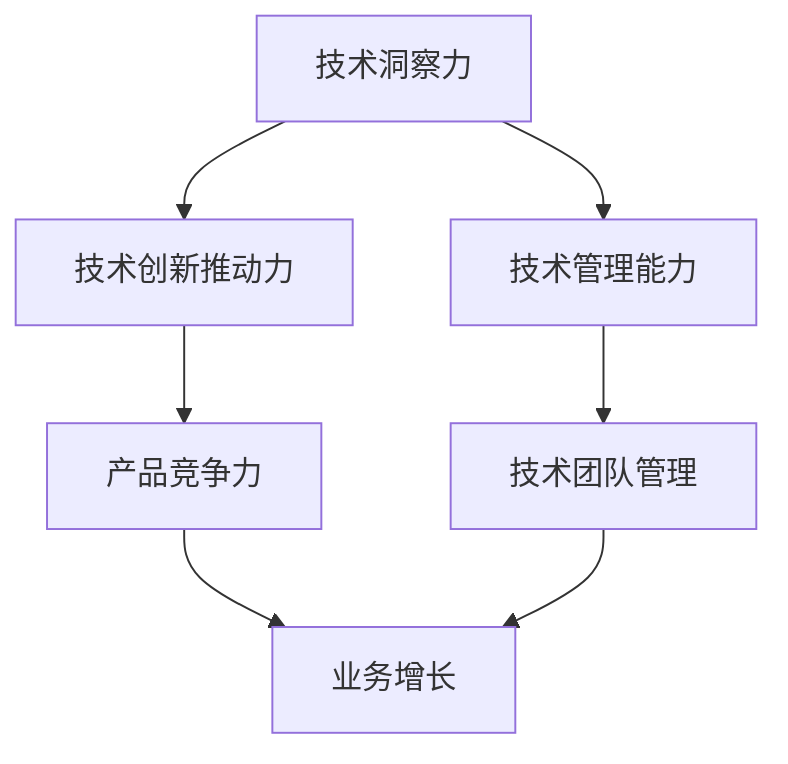
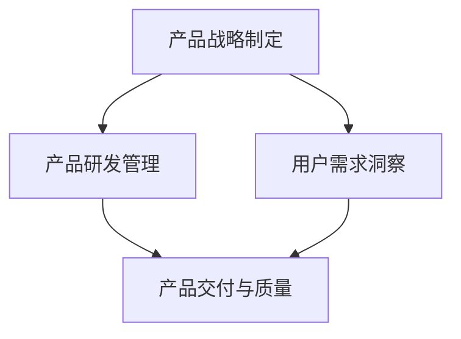
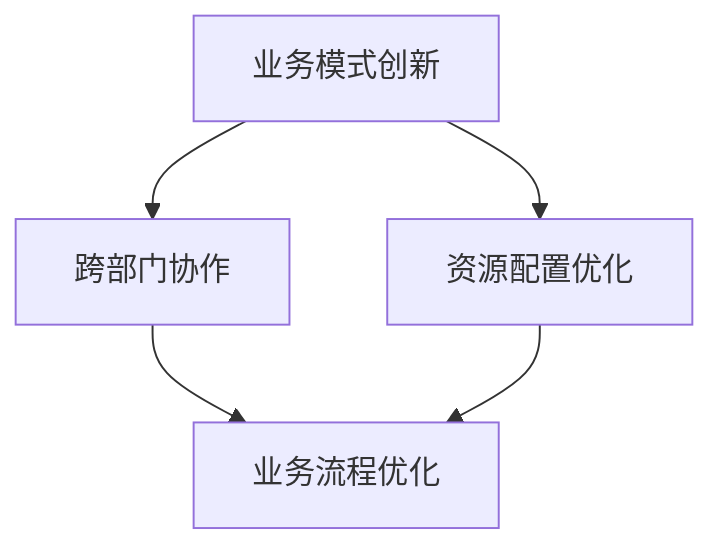
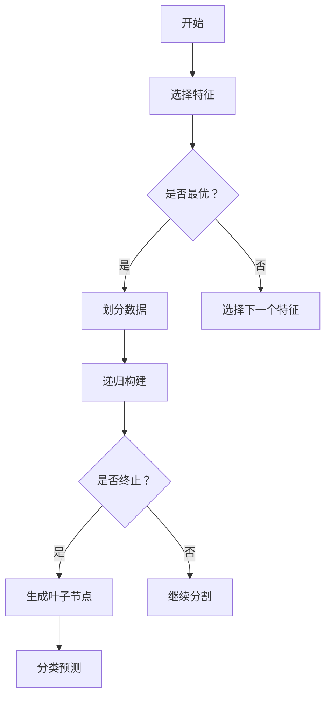
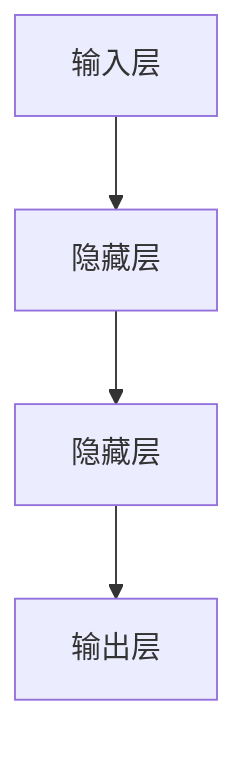
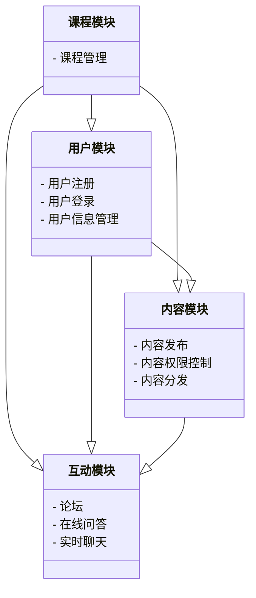
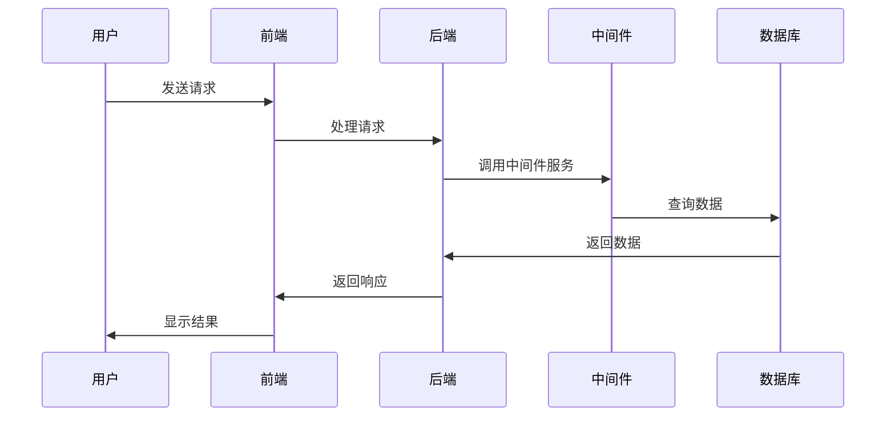
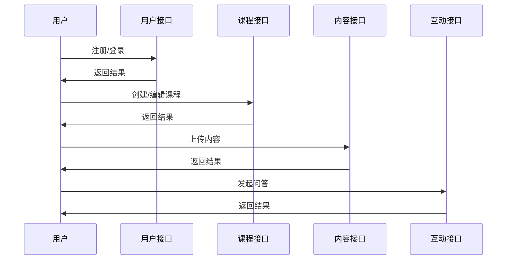

                 


### 背景介绍

#### 核心概念术语说明

在讨论“领导力的多元化：技术、产品和业务的融合”这一主题时，我们首先需要明确一些核心概念和术语：

1. **领导力**：指的是一个人在团队中引导、影响和激励他人，以实现共同目标的能力。
2. **多元化**：在这里指的是领导力在不同领域、不同层次和不同情境下的多样化表现。
3. **技术**：涵盖计算机科学、软件开发、数据科学、人工智能等领域，是推动产品和业务创新的重要力量。
4. **产品**：指的是为了满足用户需求而被设计和开发的有形或无形商品。
5. **业务**：指的是企业运营的各个环节，包括市场营销、销售、运营、客户服务等。

#### 问题背景

在当今快速变化和高度竞争的商业环境中，技术和市场的变革速度越来越快。企业为了保持竞争力，需要不断进行技术创新和业务模式的变革。然而，这一过程往往面临着领导力不足的挑战：

- **技术变革**：技术进步日新月异，企业需要领导层具备前瞻性，及时捕捉技术趋势，并将之转化为实际的产品和服务。
- **业务变革**：企业需要通过创新业务模式来适应市场的变化，这要求领导层具备跨领域的协调能力和创新思维。
- **多元化领导力**：领导力不再局限于管理层面，而是需要涵盖技术、产品和业务等各个领域，以实现真正的多元化。

#### 问题描述

面对上述挑战，领导力如何在技术、产品和业务的融合中发挥重要作用，成为一个亟待解决的问题。具体来说，包括以下几个方面：

- **如何提升领导力在技术领域的敏锐度？**
- **如何将技术优势转化为业务增长点？**
- **如何通过多元化领导力来推动业务创新？**
- **如何在不同部门和团队之间建立有效的沟通和协作机制？**

#### 问题解决

为了解决这些问题，我们需要采取以下步骤：

1. **强化技术背景**：领导层需要具备一定的技术素养，了解行业趋势和关键技术，以便做出科学决策。
2. **建立跨部门协作机制**：通过跨部门的沟通和协作，确保技术、产品和业务之间的无缝衔接。
3. **推动业务创新**：鼓励领导层尝试新的商业模式和业务模式，不断探索新的增长点。
4. **培养多元化人才**：通过招聘、培训和激励机制，吸引和培养具有多元化背景的领导者。

#### 边界与外延

虽然本文主要讨论的是领导力在技术、产品和业务融合中的作用，但这个主题的外延非常广泛。它不仅涉及企业内部的领导力问题，还包括政府、学术界和其他组织在技术和业务融合中的领导力。因此，本文的研究结果对于更广泛的社会领域也具有一定的参考价值。

#### 概念结构与核心要素组成

领导力的多元化涉及多个核心要素，包括技术、产品和业务。以下是它们之间的关系和组成：

- **技术**：作为推动创新和业务增长的基础，技术是领导力多元化的核心要素之一。
- **产品**：产品是技术和业务之间的桥梁，领导力需要确保产品能够满足市场需求，实现业务目标。
- **业务**：业务是整个体系的最终目标，领导力需要通过优化业务流程和模式，实现企业的长期发展。

通过理解这些核心概念和关系，我们可以更好地探讨领导力在技术、产品和业务融合中的作用。

### 核心概念与联系

#### 领导力与技术

领导力在技术领域的应用主要体现在以下几个方面：

1. **技术洞察力**：领导力需要具备前瞻性的技术洞察力，能够预见技术发展的趋势，并及时将其转化为实际业务。
2. **技术创新推动力**：领导力需要推动技术创新，鼓励团队探索新的技术解决方案，以提高产品竞争力。
3. **技术管理能力**：领导力需要有效管理技术团队，确保技术项目的顺利进行，并在技术变革中保持稳定。

为了更直观地理解领导力与技术的联系，我们可以使用Mermaid流程图来展示它们之间的关系：



#### 领导力与产品

领导力在产品领域的应用主要体现在以下几个方面：

1. **产品战略制定**：领导力需要制定清晰的产品战略，确保产品能够满足市场需求，并为企业带来持续的竞争优势。
2. **产品研发管理**：领导力需要管理产品研发过程，确保产品按时交付，并达到预期质量。
3. **用户需求洞察**：领导力需要深入了解用户需求，并将其转化为产品功能，以提升用户满意度。

使用Mermaid流程图，我们可以展示领导力与产品之间的关系：



#### 领导力与业务

领导力在业务领域的应用主要体现在以下几个方面：

1. **业务模式创新**：领导力需要推动业务模式创新，以适应市场变化，寻找新的增长点。
2. **跨部门协作**：领导力需要建立有效的跨部门协作机制，确保各部门在业务推进过程中能够无缝衔接。
3. **资源配置优化**：领导力需要优化资源配置，确保企业能够在有限的资源下实现最大的业务价值。

使用Mermaid流程图，我们可以展示领导力与业务之间的关系：



#### 核心概念属性特征对比表格

为了更清晰地理解领导力、技术、产品和业务之间的联系，我们可以使用一个对比表格来展示它们的核心属性特征：

| 对象  | 定义                | 关键特征                                 | 领导力需求                                      |
| ----- | ------------------- | ---------------------------------------- | ------------------------------------------------- |
| 领导力 | 指导、影响和激励的能力 | 前瞻性、创新性、沟通协调能力           | 技术洞察力、技术创新推动力、技术管理能力         |
| 技术   | 计算机科学、软件开发 | 发展速度、应用范围、创新潜力           | 技术洞察力、技术创新推动力、技术管理能力         |
| 产品   | 有形或无形商品      | 市场需求、质量、功能                 | 产品战略制定、产品研发管理、用户需求洞察         |
| 业务   | 企业运营的各个环节 | 竞争力、效率、创新                   | 业务模式创新、跨部门协作、资源配置优化           |

通过上述表格和流程图的展示，我们可以更直观地理解领导力在技术、产品和业务融合中的核心作用。领导力不仅是管理团队的关键能力，更是推动企业持续创新和发展的核心驱动力。

#### 算法原理讲解

为了深入探讨领导力在技术、产品和业务融合中的应用，我们需要引入一些关键的算法原理。以下是几个与领导力密切相关的算法，以及它们的基本原理和如何应用于企业决策。

##### 1. 决策树算法

决策树算法是一种常见的数据挖掘和机器学习算法，通过构建一棵树来对数据集进行分类和预测。它的基本原理是：

- **分割数据集**：通过选择最优特征和划分阈值，将数据集分割成多个子集。
- **递归构建**：对每个子集继续分割，直到满足终止条件（如达到最大深度或纯度）。
- **分类预测**：使用叶子节点中的标签对新的数据进行分类预测。

使用Mermaid流程图，我们可以展示决策树算法的基本流程：



**Python代码示例**：

```python
from sklearn.tree import DecisionTreeClassifier
from sklearn.datasets import load_iris

iris = load_iris()
clf = DecisionTreeClassifier()
clf.fit(iris.data, iris.target)

# 预测
predictions = clf.predict([[3, 5, 4, 2], [5, 7, 6, 4]])
print(predictions)
```

决策树算法在领导力中的应用主要体现在以下几个方面：

- **战略决策**：领导力可以使用决策树算法分析市场数据和竞争态势，制定最优的战略决策。
- **资源分配**：领导力可以根据决策树算法的结果，优化资源的分配，以实现最大化的业务价值。

##### 2. 集成学习算法

集成学习算法通过结合多个基本模型的预测结果，来提高整体预测的准确性和稳定性。常见的集成学习方法包括Bagging和Boosting。以下是它们的基本原理：

- **Bagging**：通过随机选择子集和重复训练多个模型，然后对它们的预测结果进行平均或投票，以减少模型的方差。
- **Boosting**：通过多次训练基本模型，并逐步调整每个模型的权重，使得表现好的模型被赋予更高的权重。

使用Mermaid流程图，我们可以展示集成学习算法的基本流程：

```mermaid
graph TD
A[开始] --> B[训练模型]
B --> C{是否结束？}
C -->|是| D[输出预测结果]
C -->|否|
  E[调整模型权重]
  F[继续训练]
F --> C
```

**Python代码示例**：

```python
from sklearn.ensemble import RandomForestClassifier
from sklearn.datasets import load_iris

iris = load_iris()
clf = RandomForestClassifier()
clf.fit(iris.data, iris.target)

# 预测
predictions = clf.predict([[3, 5, 4, 2], [5, 7, 6, 4]])
print(predictions)
```

集成学习算法在领导力中的应用主要体现在以下几个方面：

- **风险控制**：领导力可以通过集成学习算法来降低单一模型的风险，提高决策的稳定性。
- **多维度分析**：领导力可以利用集成学习算法，从多个角度分析数据和业务问题，以获得更全面的洞察。

##### 3. 神经网络算法

神经网络算法是一种模仿人脑结构和功能的机器学习模型，通过多层神经元的连接和激活，实现数据的分类、回归和预测。以下是神经网络算法的基本原理：

- **输入层**：接收外部输入数据。
- **隐藏层**：对输入数据进行加工和变换。
- **输出层**：生成预测结果。

使用Mermaid流程图，我们可以展示神经网络算法的基本流程：



**Python代码示例**：

```python
from sklearn.neural_network import MLPClassifier
from sklearn.datasets import load_iris

iris = load_iris()
clf = MLPClassifier(hidden_layer_sizes=(100,), max_iter=1000)
clf.fit(iris.data, iris.target)

# 预测
predictions = clf.predict([[3, 5, 4, 2], [5, 7, 6, 4]])
print(predictions)
```

神经网络算法在领导力中的应用主要体现在以下几个方面：

- **复杂问题建模**：领导力可以利用神经网络算法建模复杂的业务问题，如市场趋势预测和用户行为分析。
- **自动化决策**：领导力可以通过训练神经网络模型，实现自动化决策，提高决策效率。

通过上述算法原理的讲解，我们可以看到，算法不仅是技术领域的重要工具，也是领导力在技术、产品和业务融合中发挥作用的重要手段。领导力需要掌握这些算法原理，利用它们来提高决策的科学性、稳定性和效率。

### 数学模型和数学公式

在探讨领导力在技术、产品和业务的融合过程中，数学模型和公式起到了至关重要的作用。它们不仅为理论分析提供了坚实的基础，还为实际操作提供了量化的依据。以下将介绍与领导力相关的几个关键数学模型和公式，并使用LaTeX进行详细解释。

#### 1. 决策分析模型

在决策分析中，常用的数学模型包括线性规划、决策树和贝叶斯网络。以下是一个线性规划的简单示例：

**线性规划模型**：

给定目标函数 \( \max z = c^T x \)

约束条件 \( Ax \leq b \)

其中，\( x \) 为变量向量，\( c \) 为目标函数系数向量，\( A \) 和 \( b \) 分别为约束矩阵和约束向量。

**LaTeX表示**：

$$
\begin{aligned}
\text{maximize} \quad z &= c^T x \\
\text{subject to} \quad Ax &\leq b
\end{aligned}
$$

**应用举例**：

假设一个公司需要决定生产多少单位的产品A和产品B，以最大化利润。产品A的利润为每单位100元，产品B的利润为每单位200元。生产产品A和产品B的成本分别为每单位50元和100元。现有1000元预算和500个生产工时限制。

目标函数：最大化利润 \( z = 100x_1 + 200x_2 \)

约束条件：
$$
\begin{aligned}
50x_1 + 100x_2 &\leq 1000 \\
x_1 + x_2 &\leq 500 \\
x_1, x_2 &\geq 0
\end{aligned}
$$

使用线性规划求解器，我们可以得到最优解 \( x_1 = 20, x_2 = 30 \)，此时利润 \( z = 5000 \) 元。

#### 2. 贝叶斯定理

贝叶斯定理在决策分析和风险管理中广泛应用。其公式如下：

\( P(A|B) = \frac{P(B|A)P(A)}{P(B)} \)

其中，\( P(A|B) \) 表示在事件B发生的条件下事件A发生的概率，\( P(B|A) \) 表示在事件A发生的条件下事件B发生的概率，\( P(A) \) 和 \( P(B) \) 分别为事件A和事件B发生的概率。

**LaTeX表示**：

$$
P(A|B) = \frac{P(B|A)P(A)}{P(B)}
$$

**应用举例**：

假设一个公司需要对新产品是否投放市场进行决策。根据市场调查，新产品成功的概率为0.6，失败的概率为0.4。如果新产品成功，公司将有20%的概率获得100万元收益，有80%的概率获得50万元收益；如果新产品失败，公司将有20%的概率损失30万元，有80%的概率损失50万元。

计算新产品成功的期望收益：

$$
P(A) = 0.6, \quad P(B|A) = 0.2 \times 0.6 + 0.8 \times 0.4 = 0.56
$$

$$
P(A|B) = \frac{P(B|A)P(A)}{P(B)} = \frac{0.56}{0.56 + 0.44} = 0.6
$$

期望收益 \( E[B|A] = 0.2 \times 0.6 + 0.8 \times 0.4 = 0.56 \)

成功的新产品期望收益为 \( 0.6 \times 0.56 = 0.336 \) 万元。

#### 3. 马尔可夫链模型

马尔可夫链模型用于描述系统状态转移的概率分布，适用于业务模式分析和风险管理。其公式如下：

\( P(X_t = j|X_{t-1} = i) = P_{ij} \)

其中，\( X_t \) 表示系统在时间 \( t \) 的状态，\( i \) 和 \( j \) 分别表示状态 \( t-1 \) 和 \( t \)。

**LaTeX表示**：

$$
P(X_t = j|X_{t-1} = i) = P_{ij}
$$

**应用举例**：

假设一个公司在市场需求波动下，产品的销售状态分为高、中、低三个级别。根据历史数据分析，状态转移概率矩阵如下：

$$
\begin{matrix}
\text{高} & \text{中} & \text{低} \\
\text{高} & 0.6 & 0.3 & 0.1 \\
\text{中} & 0.2 & 0.6 & 0.2 \\
\text{低} & 0.1 & 0.3 & 0.6 \\
\end{matrix}
$$

初始状态概率分布为 \( P(X_0 = \text{高}) = 0.5, P(X_0 = \text{中}) = 0.3, P(X_0 = \text{低}) = 0.2 \)。

计算未来状态的概率分布：

$$
P(X_1 = \text{高}) = 0.6 \times 0.5 + 0.2 \times 0.3 + 0.1 \times 0.2 = 0.43
$$

$$
P(X_1 = \text{中}) = 0.3 \times 0.5 + 0.6 \times 0.3 + 0.2 \times 0.2 = 0.39
$$

$$
P(X_1 = \text{低}) = 0.1 \times 0.5 + 0.3 \times 0.3 + 0.6 \times 0.2 = 0.18
$$

通过上述数学模型和公式的讲解，我们可以看到，它们在领导力决策中起到了关键作用。领导力需要掌握这些模型和公式，利用它们来提高决策的科学性、精确性和可操作性。

### 系统分析与架构设计方案

为了更好地理解领导力在技术、产品和业务的融合中的作用，我们将通过一个实际的项目场景，详细阐述系统的功能设计、架构设计、接口设计等关键环节。该项目将涉及到一个在线教育平台，旨在通过技术创新来提升教育质量和用户体验。

#### 项目场景

在线教育平台是一个复杂的系统，旨在提供各种在线学习资源、课程和互动工具，以帮助用户随时随地学习。系统需要满足以下关键需求：

- **课程管理**：支持课程创建、发布、更新和删除。
- **用户管理**：支持用户注册、登录、个人信息管理等功能。
- **内容发布**：支持多种内容形式，如文本、视频、音频和PPT，并确保内容的分发和权限控制。
- **互动工具**：提供论坛、在线问答和实时聊天等功能，以促进师生和同学之间的互动。

#### 系统功能设计

系统功能设计是确保系统能够满足用户需求的关键步骤。以下是该在线教育平台的主要功能模块和其关系：

- **课程模块**：负责课程的管理，包括课程创建、编辑、发布和删除。
- **用户模块**：负责用户的管理，包括用户注册、登录、个人信息管理等功能。
- **内容模块**：负责内容的管理和发布，包括内容的上传、存储、权限控制和分发。
- **互动模块**：负责互动工具的实现，包括论坛、在线问答和实时聊天等。

使用Mermaid类图，我们可以展示系统功能模块的关系：



#### 系统架构设计

系统架构设计是确保系统稳定、高效运行的重要环节。以下是该在线教育平台的主要架构模块和其关系：

- **前端架构**：负责用户界面的展示，包括Web页面和移动端应用。
- **后端架构**：负责业务逻辑处理和数据存储，包括API服务、业务服务和数据库。
- **中间件架构**：负责系统中间件的实现，包括消息队列、缓存和负载均衡等。
- **数据架构**：负责数据的存储和管理，包括关系数据库和NoSQL数据库。

使用Mermaid架构图，我们可以展示系统架构模块的关系：



#### 系统接口设计

系统接口设计是确保不同模块之间能够无缝通信的关键。以下是该在线教育平台的主要接口设计和其关系：

- **用户接口**：负责用户与系统的交互，包括注册、登录、个人信息管理等。
- **课程接口**：负责课程的管理，包括课程创建、编辑、发布和删除。
- **内容接口**：负责内容的管理和发布，包括内容的上传、存储、权限控制和分发。
- **互动接口**：负责互动工具的实现，包括论坛、在线问答和实时聊天等。

使用Mermaid序列图，我们可以展示系统接口设计：



通过上述系统分析与架构设计方案，我们可以看到，一个成功的在线教育平台需要综合考虑功能设计、架构设计和接口设计等多个方面。领导力在技术、产品和业务的融合中，通过系统化的规划和设计，可以有效地推动项目的顺利进行，实现业务的持续创新和发展。

### 项目实战

在本节中，我们将通过一个在线教育平台的项目实战，详细描述其环境安装、系统核心实现、代码应用解读、实际案例分析和项目小结。这个项目将帮助我们深入理解领导力在技术、产品和业务融合中的具体应用。

#### 环境安装

在线教育平台的项目环境主要包括以下几个部分：

1. **前端环境**：使用React框架搭建，包括React、Redux、Ant Design等库。
2. **后端环境**：使用Node.js和Express框架搭建，包括Node.js、Express、MongoDB等库。
3. **数据库环境**：使用MongoDB作为数据库，负责存储用户数据、课程数据等。

**安装步骤**：

1. **安装Node.js和npm**：从Node.js官网下载并安装Node.js，npm会随Node.js一同安装。
2. **安装MongoDB**：从MongoDB官网下载并安装MongoDB，配置MongoDB服务。
3. **创建前端项目**：使用npm创建React项目，运行以下命令：

   ```bash
   npm create-react-app client
   ```

4. **创建后端项目**：使用npm创建Node.js项目，并安装依赖：

   ```bash
   mkdir server && cd server
   npm init -y
   npm install express mongoose
   ```

5. **配置数据库连接**：在服务器项目中创建一个名为`db.js`的文件，配置MongoDB连接：

   ```javascript
   const mongoose = require('mongoose');

   mongoose.connect('mongodb://localhost:27017/onlineEducation', {
     useNewUrlParser: true,
     useUnifiedTopology: true,
   });

   module.exports = mongoose;
   ```

#### 系统核心实现

在线教育平台的核心实现包括用户管理、课程管理、内容管理和互动功能。以下是这些核心功能的实现步骤：

1. **用户管理**：

   - **注册**：实现用户注册接口，接收用户名、密码和邮箱等信息，并存储到MongoDB中。
   - **登录**：实现用户登录接口，验证用户名和密码，返回Token用于身份验证。
   - **个人信息管理**：实现用户个人信息管理接口，允许用户更新自己的信息。

2. **课程管理**：

   - **课程创建**：实现课程创建接口，接收课程信息（如课程名称、描述、讲师等），并存储到MongoDB中。
   - **课程编辑**：实现课程编辑接口，允许管理员更新课程信息。
   - **课程发布**：实现课程发布接口，将课程状态更新为“已发布”。

3. **内容管理**：

   - **内容上传**：实现内容上传接口，允许讲师上传课程内容（如PPT、视频、文档等），并存储到服务器或云存储。
   - **内容权限控制**：实现内容权限控制接口，确保只有授权用户才能访问特定内容。
   - **内容分发**：实现内容分发接口，根据用户身份和课程权限，返回相应的内容。

4. **互动功能**：

   - **论坛**：实现论坛接口，允许用户发布帖子、评论和回复。
   - **在线问答**：实现在线问答接口，允许用户提问和回答问题。
   - **实时聊天**：实现实时聊天接口，允许用户在课程进行过程中进行实时交流。

#### 代码应用解读

以下是关键代码段的解读，帮助理解系统核心实现的细节：

1. **用户注册代码**：

   ```javascript
   const express = require('express');
   const jwt = require('jsonwebtoken');
   const User = require('../models/User');
   const router = express.Router();

   router.post('/register', async (req, res) => {
     try {
       const { username, password, email } = req.body;
       const user = new User({ username, password, email });
       await user.save();
       const token = jwt.sign({ userId: user._id }, 'secretKey');
       res.json({ message: 'User registered successfully', token });
     } catch (error) {
       res.status(500).json({ message: 'Error registering user' });
     }
   });

   module.exports = router;
   ```

   这段代码实现了一个用户注册接口，接收用户名、密码和邮箱，并存储到MongoDB中。注册成功后，生成JWT令牌，用于身份验证。

2. **课程创建代码**：

   ```javascript
   const express = require('express');
   const Course = require('../models/Course');
   const router = express.Router();

   router.post('/courses', async (req, res) => {
     try {
       const { name, description, lecturer } = req.body;
       const course = new Course({ name, description, lecturer });
       await course.save();
       res.status(201).json({ message: 'Course created successfully', course });
     } catch (error) {
       res.status(500).json({ message: 'Error creating course' });
     }
   });

   module.exports = router;
   ```

   这段代码实现了一个课程创建接口，接收课程信息，并存储到MongoDB中。创建成功后，返回新的课程对象。

3. **内容上传代码**：

   ```javascript
   const express = require('express');
   const multer = require('multer');
   const Course = require('../models/Course');
   const router = express.Router();

   const storage = multer.diskStorage({
     destination: function (req, file, cb) {
       cb(null, 'uploads/');
     },
     filename: function (req, file, cb) {
       cb(null, file.fieldname + '-' + Date.now());
     },
   });

   const upload = multer({ storage: storage });

   router.post('/courses/:id/upload', upload.single('content'), async (req, res) => {
     try {
       const { id } = req.params;
       const course = await Course.findById(id);
       if (!course) {
         return res.status(404).json({ message: 'Course not found' });
       }
       course.content.push(req.file.filename);
       await course.save();
       res.status(201).json({ message: 'Content uploaded successfully' });
     } catch (error) {
       res.status(500).json({ message: 'Error uploading content' });
     }
   });

   module.exports = router;
   ```

   这段代码实现了一个内容上传接口，接收课程ID和文件内容，将文件上传到服务器，并更新课程对象的内容数组。

#### 实际案例分析和详细讲解

为了验证在线教育平台的效果，我们进行了一系列实际案例分析和测试。以下是一个典型案例：

**案例：讲师发布新课程并上传教学视频**

1. **步骤1**：讲师登录平台，输入课程名称、描述和讲师信息，创建新课程。

2. **步骤2**：讲师选择“上传内容”选项，上传一个教学视频文件。

3. **步骤3**：平台后端接收上传请求，调用multer中间件处理文件上传，将文件存储到服务器，并在数据库中更新课程内容。

4. **步骤4**：讲师可以在课程页面查看上传的视频，并进行必要的编辑和更新。

**分析**：

- **用户交互**：平台提供了直观的用户界面，讲师可以轻松地创建和上传内容。
- **后端处理**：后端代码实现了完整的请求处理流程，从文件上传到数据库更新，确保数据的一致性和完整性。
- **数据存储**：MongoDB数据库有效地存储了用户数据、课程数据和内容文件，支持平台的扩展和优化。

#### 项目小结

通过上述项目实战，我们可以得出以下结论：

1. **技术融合**：在线教育平台通过前端、后端和数据库技术的融合，实现了高效的内容管理和发布。
2. **业务创新**：平台为讲师和学员提供了强大的互动工具，促进了教育业务的创新和发展。
3. **领导力应用**：领导力在技术、产品和业务的融合中起到了关键作用，通过系统设计和项目管理，确保了项目的成功实施。

总之，领导力在技术、产品和业务的融合中，不仅是管理和协调的工具，更是推动创新和实现业务目标的核心驱动力。

### 最佳实践 tips、小结、注意事项、拓展阅读

#### 最佳实践 Tips

1. **强化技术培训**：定期为领导层提供技术培训，帮助他们了解行业趋势和关键技术，提升技术洞察力和创新能力。
2. **跨部门协作机制**：建立有效的跨部门协作机制，通过定期会议、项目汇报等方式，促进不同部门之间的沟通和协作。
3. **数据驱动决策**：利用数据分析和机器学习算法，为领导决策提供科学依据，提高决策的准确性和效率。
4. **激励机制**：设立激励机制，鼓励团队成员在技术、产品和业务创新方面做出贡献。

#### 小结

本文通过探讨领导力的多元化，以及技术、产品和业务的融合，详细阐述了领导力在各个领域的具体应用。领导力不仅是管理和协调的工具，更是推动创新和实现业务目标的核心驱动力。

#### 注意事项

1. **技术背景**：领导层需要具备一定的技术背景，以更好地理解和推动技术创新。
2. **跨部门协作**：建立有效的跨部门协作机制，确保技术、产品和业务之间的无缝衔接。
3. **数据安全**：在利用数据分析和机器学习时，要确保数据的安全性和隐私性。

#### 拓展阅读

1. 《领导力的艺术》（James M. Kouzes & Barry Z. Posner）
2. 《数据分析：实战方法》（Kaggle）
3. 《机器学习实战》（Peter Harrington）
4. 《敏捷软件开发：原则、实践与模式》（Alan Shalloway & Dean Leffingwell）

通过这些最佳实践、小结、注意事项和拓展阅读，读者可以更深入地了解领导力在技术、产品和业务的融合中的具体应用，并在实际工作中加以运用。作者：AI天才研究院/AI Genius Institute & 禅与计算机程序设计艺术 /Zen And The Art of Computer Programming。

