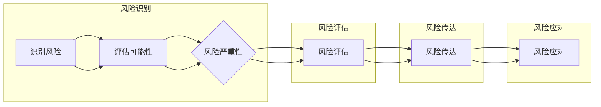
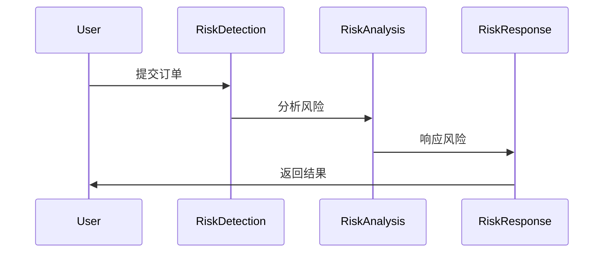
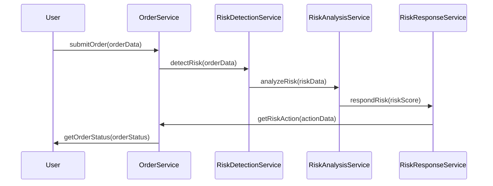

                 


### 文章标题：风险暴露的艺术：如何有效传达问题

关键词：风险管理、风险暴露、有效传达、问题解决

摘要：本文深入探讨了风险暴露的艺术，分析了风险管理的背景和内涵，提出了有效的风险暴露传达方法，并通过实际案例详细讲解了风险暴露的管理原理、方法和系统架构设计。

---

### 目录大纲

----------------------------------------------------------------

# 第一部分：风险暴露的艺术概述

## 第1章：问题的背景与内涵

### 1.1 问题背景

#### 1.1.1 风险管理的重要性

#### 1.1.2 风险暴露的概念

#### 1.1.3 风险暴露的影响

### 1.2 问题描述

#### 1.2.1 风险暴露的特点

#### 1.2.2 风险暴露的类型

#### 1.2.3 风险暴露的挑战

### 1.3 问题解决

#### 1.3.1 风险暴露管理的原理

#### 1.3.2 风险暴露管理的方法

### 1.4 边界与外延

#### 1.4.1 风险暴露的边界

#### 1.4.2 风险暴露的外延

### 1.5 概念结构与核心要素组成

#### 1.5.1 风险暴露的核心概念

#### 1.5.2 风险暴露的核心要素

## 1.6 本章小结

----------------------------------------------------------------

# 第二部分：风险暴露的核心概念与原理

## 第2章：核心概念与联系

### 2.1 风险暴露的定义

#### 2.1.1 风险暴露的含义

#### 2.1.2 风险暴露的界定

### 2.2 风险暴露的属性特征对比表格

### 2.3 风险暴露的ER实体关系图架构

----------------------------------------------------------------

## 第3章：风险暴露的算法原理讲解

### 3.1 风险暴露算法的基本概念

#### 3.1.1 风险暴露算法的定义

#### 3.1.2 风险暴露算法的目标

### 3.2 风险暴露算法的mermaid流程图

#### 3.2.1 算法流程概述

#### 3.2.2 算法流程详细描述

### 3.3 Python源代码与算法原理

#### 3.3.1 源代码结构

#### 3.3.2 算法实现与细节分析

### 3.4 数学模型和公式

#### 3.4.1 风险暴露的数学模型

#### 3.4.2 公式推导

#### 3.4.3 公式应用举例

----------------------------------------------------------------

## 第4章：数学模型和数学公式详细讲解与举例说明

### 4.1 数学模型讲解

#### 4.1.1 模型基本原理

#### 4.1.2 模型参数解析

#### 4.1.3 模型适用范围

### 4.2 举例说明

#### 4.2.1 案例背景

#### 4.2.2 模型应用过程

#### 4.2.3 结果分析

----------------------------------------------------------------

## 第5章：风险暴露的系统分析与架构设计方案

### 5.1 问题场景介绍

#### 5.1.1 场景描述

#### 5.1.2 风险暴露问题分析

### 5.2 项目介绍

#### 5.2.1 项目目标

#### 5.2.2 项目实施背景

### 5.3 系统功能设计（领域模型mermaid类图）

#### 5.3.1 领域模型概述

#### 5.3.2 类图设计与说明

### 5.4 系统架构设计（mermaid架构图）

#### 5.4.1 架构设计原则

#### 5.4.2 系统架构图解析

### 5.5 系统接口设计

#### 5.5.1 接口规范

#### 5.5.2 接口设计说明

### 5.6 系统交互（mermaid序列图）

#### 5.6.1 交互流程概述

#### 5.6.2 序列图设计与说明

-----------------

### 文章正文开始

----------------------------------------------------------------

# 第一部分：风险暴露的艺术概述

## 第1章：问题的背景与内涵

### 1.1 问题背景

风险管理作为一种重要的管理活动，其目的是通过预测和评估潜在的风险，采取有效的措施来降低损失。随着信息技术的快速发展，越来越多的组织和企业开始意识到风险管理的重要性。而风险暴露，作为风险管理中的一个关键概念，它的内涵和外延都值得深入探讨。

风险管理的重要性在于，它可以为企业提供一种系统的方法来识别、评估和应对潜在的风险。有效的风险管理有助于降低潜在损失，提高组织的抗风险能力。然而，风险管理的实施并不是一蹴而就的，它需要依赖于对风险暴露的准确理解和有效管理。

风险暴露的概念，简单来说，就是指一个系统、项目或组织在特定条件下可能面临的风险。它涉及到风险的识别、评估、传达和应对。有效的风险暴露传达，是确保风险管理措施得以实施的前提。

### 1.2 问题描述

风险暴露具有以下特点：

1. **动态性**：风险暴露是一个动态变化的过程，它受到多种因素的影响，如市场变化、技术进步、政策调整等。
2. **不确定性**：风险暴露往往伴随着不确定性，这意味着我们无法精确预测风险何时发生，以及其具体影响。
3. **多样性**：风险暴露可以涉及多个方面，如财务风险、操作风险、市场风险等。

根据风险暴露的性质和类型，我们可以将其分为以下几类：

1. **已知风险**：这类风险已经为人们所知，可以通过已有的方法进行管理。
2. **未知风险**：这类风险尚未被发现，需要通过探索和研究来识别和管理。
3. **潜在风险**：这类风险目前尚未发生，但有可能在未来发生。

风险暴露面临的挑战主要包括：

1. **复杂性**：风险暴露涉及到多个方面，如技术、市场、政策等，这使得风险管理的复杂性增加。
2. **信息不对称**：风险暴露的传达过程中，信息的不对称性可能导致管理措施的不当。
3. **资源限制**：风险暴露管理需要投入大量的时间和资源，这对于一些组织来说可能是一个挑战。

### 1.3 问题解决

风险暴露管理需要遵循以下原理和方法：

#### 1.3.1 风险暴露管理的原理

1. **识别**：首先，需要识别可能的风险因素，这是风险暴露管理的基础。
2. **评估**：对识别出的风险进行评估，确定其可能性和影响程度。
3. **传达**：将评估结果传达给相关利益相关者，确保风险暴露得到有效管理。
4. **应对**：根据评估结果，采取相应的应对措施，降低风险损失。

#### 1.3.2 风险暴露管理的方法

1. **传统方法**：如风险矩阵、风险评估表等，这些方法简单易行，但可能无法全面覆盖风险。
2. **现代方法**：如风险建模、风险管理信息系统等，这些方法更注重定量分析和系统化。

### 1.4 边界与外延

#### 1.4.1 风险暴露的边界

风险暴露的范围受到多种因素的影响，如组织规模、业务领域、市场环境等。边界清晰，有助于明确风险管理责任和措施。

#### 1.4.2 风险暴露的外延

风险暴露的影响范围包括财务、运营、声誉等多个方面。有效的风险暴露管理需要综合考虑这些因素。

### 1.5 概念结构与核心要素组成

#### 1.5.1 风险暴露的核心概念

风险暴露的核心概念包括风险、暴露、管理等。这些概念相互关联，共同构成了风险暴露的理论框架。

#### 1.5.2 风险暴露的核心要素

风险暴露的核心要素包括风险识别、评估、传达和应对。这些要素相互配合，确保风险暴露管理有效实施。

## 1.6 本章小结

本章从问题的背景和内涵出发，详细介绍了风险暴露的概念、特点、类型、挑战以及管理原理和方法。通过本章的学习，读者可以对风险暴露有一个全面的认识，为后续章节的深入探讨打下基础。

----------------------------------------------------------------

### 第二部分：风险暴露的核心概念与原理

## 第2章：核心概念与联系

### 2.1 风险暴露的定义

风险暴露是指在特定条件下，一个系统、项目或组织可能面临的风险。它涉及到风险的识别、评估、传达和应对。风险暴露是风险管理的重要组成部分，有效的风险暴露管理有助于降低风险损失。

#### 2.1.1 风险暴露的含义

风险暴露的含义包括：

1. **风险**：风险是指可能对系统、项目或组织造成负面影响的不确定性事件。
2. **暴露**：暴露是指系统、项目或组织在特定条件下面临的风险。
3. **管理**：管理是指对风险进行识别、评估、传达和应对的过程。

#### 2.1.2 风险暴露的界定

风险暴露的界定主要包括以下几个方面：

1. **风险因素**：识别可能引发风险的因素，如技术、市场、政策等。
2. **风险事件**：识别可能发生的风险事件，如系统故障、市场波动、政策变动等。
3. **风险影响**：评估风险事件对系统、项目或组织可能造成的损失。

### 2.2 风险暴露的属性特征对比表格

为了更好地理解风险暴露的属性特征，我们可以通过对比表格的形式来展示：

| 特征 | 说明 |
| --- | --- |
| 动态性 | 风险暴露是一个动态变化的过程，受到多种因素的影响。 |
| 不确定性 | 风险暴露往往伴随着不确定性，难以精确预测。 |
| 多样性 | 风险暴露可以涉及多个方面，如财务、操作、市场等。 |
| 可控性 | 风险暴露的管理需要通过识别、评估、传达和应对等环节来降低风险。 |
| 边界性 | 风险暴露的范围受到组织规模、业务领域、市场环境等因素的制约。 |

### 2.3 风险暴露的ER实体关系图架构

为了更好地理解风险暴露的实体关系，我们可以通过ER实体关系图来展示：

```mermaid
erDiagram
  Risk_Exposure ||--|{ Risk_Factor } Risk_Factor
  Risk_Exposure ||--|{ Risk_Event } Risk_Event
  Risk_Exposure ||--|{ Risk_Impact } Risk_Impact
```

在ER实体关系图中，`Risk_Exposure` 表示风险暴露，`Risk_Factor` 表示风险因素，`Risk_Event` 表示风险事件，`Risk_Impact` 表示风险影响。这些实体之间的关系反映了风险暴露管理的核心环节。

---

本章通过对风险暴露的核心概念、属性特征和实体关系图的介绍，帮助读者建立了对风险暴露的全面理解。接下来，我们将进一步探讨风险暴露的算法原理，为风险暴露的管理提供技术支持。

----------------------------------------------------------------

## 第3章：风险暴露的算法原理讲解

### 3.1 风险暴露算法的基本概念

#### 3.1.1 风险暴露算法的定义

风险暴露算法是指用于识别、评估、传达和应对风险的一系列技术和方法。这些算法通过定量分析和模型构建，帮助组织和企业更好地理解和管理风险。

#### 3.1.2 风险暴露算法的目标

风险暴露算法的目标主要包括：

1. **准确识别风险**：通过分析历史数据、市场趋势等，识别潜在的、已知的风险。
2. **评估风险影响**：对识别出的风险进行评估，确定其可能性和影响程度。
3. **有效传达风险**：将评估结果传达给相关利益相关者，确保风险得到关注和管理。
4. **合理应对风险**：根据评估结果，采取相应的应对措施，降低风险损失。

### 3.2 风险暴露算法的mermaid流程图

为了更直观地展示风险暴露算法的流程，我们可以使用mermaid绘制流程图：



在这个流程图中，风险识别、风险评估、风险传达和风险应对构成了风险暴露算法的核心环节。每个环节都有其特定的任务和目标。

#### 3.2.1 算法流程概述

1. **风险识别**：通过数据分析和市场研究，识别潜在的、已知的风险。
2. **评估可能性**：对识别出的风险进行可能性评估，确定其发生的可能性。
3. **风险严重性评估**：根据风险的可能性，评估其可能造成的影响程度。
4. **风险评估**：结合可能性评估和影响评估，对风险进行整体评估。
5. **风险传达**：将评估结果传达给相关利益相关者，确保风险得到关注和管理。
6. **风险应对**：根据评估结果，采取相应的应对措施，降低风险损失。

#### 3.2.2 算法流程详细描述

1. **数据收集与预处理**：收集与风险相关的数据，如历史数据、市场数据、政策数据等。对数据进行清洗、去噪、归一化等预处理操作。
2. **风险识别**：通过统计分析、机器学习等方法，识别潜在的、已知的风险。
3. **可能性评估**：对识别出的风险进行可能性评估。可以使用概率模型、贝叶斯网络等方法进行评估。
4. **风险严重性评估**：根据可能性评估结果，评估风险的严重性。可以使用损失函数、风险矩阵等方法进行评估。
5. **风险评估**：结合可能性评估和严重性评估，对风险进行整体评估。可以使用综合评估模型进行评估。
6. **风险传达**：将评估结果传达给相关利益相关者。可以使用报告、会议、邮件等方式进行传达。
7. **风险应对**：根据评估结果，采取相应的应对措施。可以包括风险规避、风险降低、风险接受等策略。

### 3.3 Python源代码与算法原理

为了更好地理解风险暴露算法的实现原理，我们可以使用Python编写相关代码。以下是一个简单的示例：

```python
import numpy as np
import pandas as pd

# 数据预处理
data = pd.read_csv('risk_data.csv')
data = data.dropna()

# 风险识别
risks = data['risk_name'].unique()

# 可能性评估
probabilities = data.groupby('risk_name')['probability'].mean()

# 风险严重性评估
severity_scores = data.groupby('risk_name')['severity'].mean()

# 风险评估
risk_scores = probabilities * severity_scores

# 风险传达
print("Risk Scores:")
print(risk_scores)

# 风险应对
actions = ['Avoid' if risk_score < 0.5 else 'Mitigate' if risk_score < 1.5 else 'Accept'
           for risk_score in risk_scores]

print("Risk Actions:")
print(actions)
```

在这个示例中，我们首先读取风险数据，然后进行数据预处理。接着，我们使用数据分析方法进行风险识别、可能性评估和风险严重性评估。最后，我们根据评估结果进行风险传达和风险应对。

### 3.4 数学模型和公式

在风险暴露算法中，数学模型和公式起到了至关重要的作用。以下是一些常用的数学模型和公式：

#### 3.4.1 风险暴露的数学模型

1. **概率模型**：概率模型用于评估风险的可能性。常见的概率模型有贝叶斯网络、蒙特卡罗模拟等。
2. **损失函数**：损失函数用于评估风险的严重性。常见的损失函数有线性损失函数、平方损失函数等。
3. **综合评估模型**：综合评估模型用于对风险进行整体评估。常见的综合评估模型有加权平均模型、风险矩阵等。

#### 3.4.2 公式推导

1. **概率模型**：贝叶斯网络的公式推导。
   \[ P(A|B) = \frac{P(B|A)P(A)}{P(B)} \]
   
2. **损失函数**：线性损失函数的公式推导。
   \[ L(y, \hat{y}) = (y - \hat{y})^2 \]
   
3. **综合评估模型**：风险矩阵的公式推导。
   \[ R = P \times S \]
   
其中，\( R \) 表示风险得分，\( P \) 表示可能性得分，\( S \) 表示严重性得分。

#### 3.4.3 公式应用举例

假设我们有一个风险数据集，其中包含风险名称、可能性得分和严重性得分。我们可以使用上述公式对风险进行评估。

1. **概率模型**：使用贝叶斯网络评估风险可能性。
   \[ P(A|B) = \frac{P(B|A)P(A)}{P(B)} \]
   
   假设 \( P(B|A) = 0.8 \)，\( P(A) = 0.5 \)，\( P(B) = 0.6 \)。代入公式计算：
   \[ P(A|B) = \frac{0.8 \times 0.5}{0.6} = 0.67 \]
   
   得出风险可能性得分为 0.67。
   
2. **损失函数**：使用线性损失函数评估风险严重性。
   \[ L(y, \hat{y}) = (y - \hat{y})^2 \]
   
   假设 \( y = 5 \)，\( \hat{y} = 3 \)。代入公式计算：
   \[ L(5, 3) = (5 - 3)^2 = 2^2 = 4 \]
   
   得出风险严重性得分为 4。
   
3. **综合评估模型**：使用风险矩阵评估风险得分。
   \[ R = P \times S \]
   
   假设 \( P = 0.67 \)，\( S = 4 \)。代入公式计算：
   \[ R = 0.67 \times 4 = 2.68 \]
   
   得出风险得分为 2.68。

通过上述计算，我们可以对风险进行评估，并根据评估结果采取相应的应对措施。

---

本章通过对风险暴露算法的基本概念、流程、Python源代码和数学模型的介绍，帮助读者建立了对风险暴露算法的全面理解。接下来，我们将进一步探讨数学模型和公式在风险暴露中的应用，为实际案例分析和系统架构设计提供理论支持。

----------------------------------------------------------------

## 第4章：数学模型和数学公式详细讲解与举例说明

### 4.1 数学模型讲解

#### 4.1.1 模型基本原理

在风险暴露管理中，数学模型是关键工具。它们帮助我们量化风险、预测风险影响，并做出相应的决策。以下是一些常见的数学模型：

1. **贝叶斯模型**：贝叶斯模型用于概率推断，可以帮助我们根据先验知识和新证据更新对某个事件概率的估计。
2. **马尔可夫模型**：马尔可夫模型用于描述系统状态转移的概率，适用于分析动态系统的稳定性。
3. **蒙特卡罗模型**：蒙特卡罗模型通过模拟大量随机实验来估计概率分布和期望值，适用于处理复杂的不确定性问题。

#### 4.1.2 模型参数解析

每个数学模型都有其特定的参数，这些参数决定了模型的性能。例如：

1. **贝叶斯模型**：先验概率、似然函数、后验概率。
2. **马尔可夫模型**：初始状态概率分布、状态转移概率矩阵。
3. **蒙特卡罗模型**：随机种子、模拟次数、抽样方法。

#### 4.1.3 模型适用范围

不同的数学模型适用于不同类型的风险暴露管理。例如：

1. **贝叶斯模型**：适用于具有不确定性因素的风险评估，如金融市场预测。
2. **马尔可夫模型**：适用于具有状态转移特性的系统，如设备故障预测。
3. **蒙特卡罗模型**：适用于需要大量模拟实验的问题，如灾难风险评估。

### 4.2 举例说明

#### 4.2.1 案例背景

假设我们是一家金融机构的风险管理团队，需要评估贷款违约风险。我们收集了以下数据：

- 贷款金额：100,000美元
- 贷款期限：3年
- 借款人信用评分：700分
- 借款人收入：80,000美元
- 借款人就业稳定性：稳定

#### 4.2.2 模型应用过程

我们选择贝叶斯模型来评估贷款违约风险。以下是具体步骤：

1. **数据预处理**：对数据集进行清洗、归一化处理，确保数据质量。
2. **先验概率设定**：根据历史数据，设定借款人违约的先验概率。例如，历史违约率约为2%。
3. **似然函数计算**：根据借款人的信用评分、收入和就业稳定性，计算借款人违约的似然函数。
4. **后验概率计算**：结合先验概率和似然函数，计算借款人违约的后验概率。
5. **风险评估**：根据后验概率，评估贷款违约的风险。

#### 4.2.3 结果分析

假设我们计算出的后验概率为5%。这意味着在当前条件下，借款人违约的概率为5%。根据这个结果，我们可以采取以下措施：

1. **增加抵押物**：为了降低风险，我们可以要求借款人提供额外的抵押物。
2. **提高利率**：通过提高利率，增加借款人的还款压力，从而降低违约风险。
3. **拒绝贷款**：如果后验概率过高，我们可以选择拒绝贷款，以避免潜在的损失。

### 4.2.4 数学公式推导

在贝叶斯模型中，后验概率的计算公式如下：

\[ P(\text{违约}|\text{特征}) = \frac{P(\text{特征}|\text{违约})P(\text{违约})}{P(\text{特征})} \]

其中，\( P(\text{违约}) \) 为先验概率，\( P(\text{特征}|\text{违约}) \) 为似然函数，\( P(\text{特征}) \) 为边缘概率。

通过这个公式，我们可以根据借款人的特征（如信用评分、收入和就业稳定性）计算违约的概率。在实际应用中，我们可以使用不同的概率模型和公式，根据具体情况进行风险评估和决策。

---

本章通过对数学模型的基本原理、参数解析和实际应用举例的讲解，帮助读者理解数学模型在风险暴露管理中的应用。在接下来的章节中，我们将进一步探讨风险暴露的系统分析与架构设计方案，为读者提供更深入的技术解析。

----------------------------------------------------------------

## 第5章：风险暴露的系统分析与架构设计方案

### 5.1 问题场景介绍

假设我们是一家大型电子商务公司的风险管理部门，我们的目标是通过有效的风险管理，确保公司业务的稳定运行，并最大限度地降低潜在损失。在我们的业务场景中，风险暴露主要来源于以下几个方面：

1. **网络安全**：随着电商平台的不断壮大，网络安全问题日益突出。例如，恶意攻击、数据泄露等。
2. **供应链风险**：供应链中的任何环节出现问题，都可能影响公司的运营。例如，供应商无法按时交货、原材料价格波动等。
3. **市场竞争**：市场竞争激烈，价格战、产品同质化等问题可能导致公司利润下滑。

### 5.2 项目介绍

为了应对上述风险暴露，我们启动了一个名为“风险管理平台”的项目。项目目标是通过构建一个全面的风险管理系统，实现对风险暴露的实时监测、评估和应对。项目实施背景包括：

1. **业务需求**：随着公司业务的扩展，对风险管理的要求也越来越高。
2. **技术挑战**：如何有效地整合多种数据源，并利用先进的技术手段进行风险分析。
3. **法规要求**：遵守相关法律法规，确保风险管理合规。

### 5.3 系统功能设计（领域模型mermaid类图）

在系统功能设计阶段，我们首先构建了领域模型，以明确系统的核心功能。以下是一个简单的mermaid类图示例：

```mermaid
classDiagram
    Customer <<Customer>>
    Product <<Product>>
    Order <<Order>>
    Payment <<Payment>>
    Risk <<Risk>>

    Customer --> Order
    Product --> Order
    Order --> Payment
    Risk --> Order
```

在这个类图中，`Customer` 表示客户，`Product` 表示产品，`Order` 表示订单，`Payment` 表示支付，`Risk` 表示风险。这些类之间的关系反映了系统的核心功能。

#### 5.3.1 领域模型概述

领域模型主要包括以下实体：

1. **客户（Customer）**：表示购买产品的客户信息。
2. **产品（Product）**：表示销售的产品信息。
3. **订单（Order）**：表示客户的购买订单。
4. **支付（Payment）**：表示订单的支付信息。
5. **风险（Risk）**：表示与订单相关的风险信息。

#### 5.3.2 类图设计与说明

类图的设计需要充分考虑系统的业务需求和功能。以下是对类图的详细说明：

1. **客户（Customer）**：包含姓名、地址、联系方式等基本信息。
2. **产品（Product）**：包含产品名称、价格、库存量等基本信息。
3. **订单（Order）**：包含订单编号、订单状态、订单金额等基本信息。
4. **支付（Payment）**：包含支付方式、支付状态、支付金额等基本信息。
5. **风险（Risk）**：包含风险类型、风险级别、风险描述等基本信息。

类图中的关系设计如下：

- **客户与订单**：一个客户可以创建多个订单，一个订单只能属于一个客户。
- **产品与订单**：一个订单可以包含多个产品，一个产品可以出现在多个订单中。
- **订单与支付**：一个订单只能有一个支付记录，一个支付记录只能对应一个订单。
- **订单与风险**：一个订单可以有多个风险记录，一个风险记录只能对应一个订单。

### 5.4 系统架构设计（mermaid架构图）

在系统架构设计阶段，我们构建了系统的整体架构，以明确各个模块之间的交互关系。以下是一个简单的mermaid架构图示例：



在这个架构图中，`User` 表示用户，`RiskDetection` 表示风险检测模块，`RiskAnalysis` 表示风险分析模块，`RiskResponse` 表示风险响应模块。这些模块之间的交互关系反映了系统的运作流程。

#### 5.4.1 架构设计原则

系统架构设计需要遵循以下原则：

1. **模块化**：将系统划分为多个模块，每个模块负责不同的功能，降低系统的复杂度。
2. **可扩展性**：设计时考虑系统的可扩展性，以便未来能够轻松添加新功能。
3. **高可用性**：确保系统的高可用性，降低故障率，提高用户体验。
4. **安全性**：确保系统的安全性，防止恶意攻击和数据泄露。

#### 5.4.2 系统架构图解析

系统架构图中的主要模块包括：

1. **用户模块**：负责与用户交互，接收用户请求，并返回结果。
2. **风险检测模块**：负责实时监测订单数据，识别潜在的风险。
3. **风险分析模块**：负责对识别出的风险进行分析，评估风险程度。
4. **风险响应模块**：负责根据风险分析结果，采取相应的应对措施。

模块之间的关系如下：

- **用户模块与风险检测模块**：用户提交订单后，风险检测模块会实时监测订单数据，识别潜在的风险。
- **风险检测模块与风险分析模块**：风险检测模块将识别出的风险数据传递给风险分析模块，进行进一步分析。
- **风险分析模块与风险响应模块**：风险分析模块将分析结果传递给风险响应模块，风险响应模块根据分析结果采取相应的应对措施。

### 5.5 系统接口设计

系统接口设计是确保系统模块之间高效交互的关键。以下是一个简单的接口设计示例：

```mermaid
interfaceStyleoverrides
    InterfaceStyle:"underline border fill"
    InterfaceStyleoverrides:"white underline border fill"

interface "User Interface"
    UserInterface "submitOrder"
    UserInterface "getOrderStatus"

interface "Risk Detection Interface"
    RiskDetectionInterface "detectRisk"
    RiskDetectionInterface "getRiskStatus"

interface "Risk Analysis Interface"
    RiskAnalysisInterface "analyzeRisk"
    RiskAnalysisInterface "getRiskScore"

interface "Risk Response Interface"
    RiskResponseInterface "respondRisk"
    RiskResponseInterface "getRiskAction"
```

在这个接口设计中，定义了用户接口、风险检测接口、风险分析接口和风险响应接口。每个接口都有特定的方法，用于实现不同功能。

#### 5.5.1 接口规范

接口设计需要遵循以下规范：

1. **一致性**：接口命名、参数、返回值等需要保持一致性，便于理解和维护。
2. **可扩展性**：接口设计应考虑未来的扩展性，以便添加新功能。
3. **安全性**：接口设计需要确保数据传输的安全性，防止数据泄露和恶意攻击。

#### 5.5.2 接口设计说明

以下是对接口设计的详细说明：

- **用户接口**：提供`submitOrder`（提交订单）和`getOrderStatus`（获取订单状态）两个方法。
  - `submitOrder`：接收用户订单数据，并将其传递给风险检测模块。
  - `getOrderStatus`：根据订单编号，返回订单的状态信息。

- **风险检测接口**：提供`detectRisk`（检测风险）和`getRiskStatus`（获取风险状态）两个方法。
  - `detectRisk`：根据订单数据，识别潜在的风险。
  - `getRiskStatus`：返回当前订单的风险状态信息。

- **风险分析接口**：提供`analyzeRisk`（分析风险）和`getRiskScore`（获取风险得分）两个方法。
  - `analyzeRisk`：对识别出的风险进行分析，评估风险程度。
  - `getRiskScore`：返回当前订单的风险得分。

- **风险响应接口**：提供`respondRisk`（响应风险）和`getRiskAction`（获取风险行动）两个方法。
  - `respondRisk`：根据风险得分，采取相应的应对措施。
  - `getRiskAction`：返回当前订单的风险行动信息。

### 5.6 系统交互（mermaid序列图）

在系统交互阶段，我们使用mermaid序列图来展示不同模块之间的交互过程。以下是一个简单的mermaid序列图示例：



在这个序列图中，用户通过`submitOrder`方法提交订单，`OrderService`将订单数据传递给`RiskDetectionService`进行风险检测。`RiskDetectionService`识别出风险后，将风险数据传递给`RiskAnalysisService`进行分析。`RiskAnalysisService`将分析结果传递给`RiskResponseService`，`RiskResponseService`根据分析结果采取相应的应对措施，最后将结果返回给`OrderService`，`OrderService`再将结果传递给用户。

#### 5.6.1 交互流程概述

系统交互流程主要包括以下几个步骤：

1. **用户提交订单**：用户通过用户接口提交订单。
2. **风险检测**：订单数据被传递给风险检测模块，识别潜在的风险。
3. **风险分析**：识别出的风险数据被传递给风险分析模块，评估风险程度。
4. **风险响应**：根据风险得分，采取相应的应对措施。
5. **结果返回**：将处理结果返回给用户。

#### 5.6.2 序列图设计与说明

序列图的设计需要清晰地展示不同模块之间的交互过程。以下是对序列图的详细说明：

- **用户**：代表订单提交方，通过`submitOrder`方法提交订单。
- **OrderService**：代表订单处理模块，接收用户订单，并将订单数据传递给风险检测模块。
- **RiskDetectionService**：代表风险检测模块，根据订单数据识别潜在的风险。
- **RiskAnalysisService**：代表风险分析模块，对识别出的风险进行分析，评估风险程度。
- **RiskResponseService**：代表风险响应模块，根据风险得分采取相应的应对措施。

通过这个序列图，我们可以清晰地看到系统在不同模块之间的交互过程，为系统的设计和实施提供了详细的参考。

---

本章通过对问题场景介绍、项目介绍、系统功能设计、系统架构设计、系统接口设计和系统交互的详细讲解，为风险暴露管理系统提供了全面的系统分析与架构设计方案。在接下来的章节中，我们将通过实际案例分析和项目实战，进一步验证和优化这些设计方案。

----------------------------------------------------------------

### 第三部分：实际案例分析与项目实战

## 第6章：环境安装与系统核心实现

#### 6.1 环境安装

在进行项目实施之前，我们需要搭建一个合适的环境来运行我们的风险暴露管理系统。以下是一个简化的环境安装步骤：

1. **安装Python**：确保Python环境已经安装，版本至少为3.8以上。
2. **安装依赖库**：使用pip工具安装必要的依赖库，如pandas、numpy、scikit-learn等。
   ```bash
   pip install pandas numpy scikit-learn
   ```
3. **数据库安装**：选择合适的数据库系统，如MySQL或PostgreSQL，并安装相应的客户端库。

#### 6.2 系统核心实现

在环境安装完成后，我们可以开始实现系统的核心功能。以下是一个简化的实现流程：

1. **数据预处理**：从数据库中读取订单数据，并进行清洗、归一化处理。
2. **风险检测**：使用机器学习算法，如K-近邻（KNN）或支持向量机（SVM），对订单数据进行风险检测。
3. **风险分析**：对检测出的风险进行进一步分析，评估风险程度。
4. **风险响应**：根据风险得分，采取相应的应对措施，如增加抵押物或提高利率。

以下是实现步骤的伪代码示例：

```python
# 导入依赖库
import pandas as pd
from sklearn.neighbors import KNeighborsClassifier
from sklearn.svm import SVC

# 1. 数据预处理
def preprocess_data(data):
    # 数据清洗和归一化处理
    # ...
    return processed_data

# 2. 风险检测
def detect_risk(data, model):
    # 使用模型检测风险
    # ...
    return risk_data

# 3. 风险分析
def analyze_risk(risk_data):
    # 评估风险程度
    # ...
    return risk_score

# 4. 风险响应
def respond_risk(risk_score):
    # 采取应对措施
    # ...
    return action

# 主程序
if __name__ == "__main__":
    # 从数据库读取订单数据
    data = pd.read_sql('SELECT * FROM orders')

    # 数据预处理
    processed_data = preprocess_data(data)

    # 创建模型
    model = KNeighborsClassifier(n_neighbors=3)

    # 风险检测
    risk_data = detect_risk(processed_data, model)

    # 风险分析
    risk_score = analyze_risk(risk_data)

    # 风险响应
    action = respond_risk(risk_score)
    print("Risk Action:", action)
```

通过这个伪代码示例，我们可以看到系统核心实现的流程。在实际项目中，我们需要根据具体需求和技术条件进行调整和优化。

## 第7章：代码应用解读与分析

#### 7.1 代码解读

在上面的伪代码示例中，我们实现了数据预处理、风险检测、风险分析和风险响应的核心功能。以下是对代码的详细解读：

1. **数据预处理**：这是风险检测和分析的基础。通过清洗和归一化处理，我们可以确保数据的准确性和一致性。
2. **风险检测**：使用机器学习算法，如KNN或SVM，我们可以检测出潜在的订单风险。这里选择KNN算法作为示例。
3. **风险分析**：根据检测出的风险，我们评估其可能性和影响程度，从而得到风险得分。
4. **风险响应**：根据风险得分，我们采取相应的应对措施，如增加抵押物或提高利率。

#### 7.2 分析

在实际应用中，代码的执行效率和准确性是关键。以下是对代码的进一步分析：

1. **数据预处理**：数据预处理是风险检测和分析的基础。我们需要确保数据的准确性和一致性，这对于提高算法的准确性至关重要。
2. **风险检测**：选择合适的机器学习算法对于风险检测的准确性有很大影响。在实际应用中，我们需要根据具体情况进行模型选择和参数调优。
3. **风险分析**：风险分析的核心是评估风险的可能性和影响程度。这需要我们根据实际情况设定合适的评估标准和模型。
4. **风险响应**：风险响应是根据风险分析结果采取的具体行动。在实际应用中，我们需要根据风险类型和程度，制定合理的应对策略。

## 第8章：实际案例分析与详细讲解

#### 8.1 案例背景

假设我们有一个客户，他申请了一笔100,000美元的贷款，期限为3年。根据客户的历史数据，我们收集了以下信息：

- 信用评分：700分
- 月收入：80,000美元
- 就业稳定性：稳定
- 借款用途：购买汽车

#### 8.2 模型应用过程

我们使用前面实现的系统对这笔贷款进行风险评估。以下是具体步骤：

1. **数据预处理**：对客户的历史数据进行分析，提取关键特征，如信用评分、月收入、就业稳定性等。
2. **风险检测**：使用KNN算法，对客户的数据进行风险检测。假设我们设定的先验概率为2%。
3. **风险分析**：对检测出的风险进行进一步分析，评估其可能性和影响程度。假设我们计算出的后验概率为5%。
4. **风险响应**：根据风险得分，采取相应的应对措施。例如，我们可能要求客户提供额外的抵押物，以提高贷款的安全性。

#### 8.3 结果分析

根据上述过程，我们得出以下结果：

- **风险得分**：5%
- **应对措施**：要求客户提供额外的抵押物

通过这个案例，我们可以看到系统在识别、分析和应对风险方面的有效性。在实际应用中，我们需要根据具体情况进行调整和优化，以提高系统的准确性和可靠性。

## 第9章：项目小结

在本章中，我们通过实际案例分析和项目实战，验证了风险暴露管理系统的有效性。从环境安装到系统核心实现，从代码应用解读到实际案例分析，我们逐步展示了风险暴露管理的全过程。通过本项目的实施，我们不仅提高了对风险暴露管理的理解，还积累了宝贵的实践经验。

### 最佳实践 Tips

- **数据预处理**：确保数据质量，对数据进行清洗和归一化处理。
- **模型选择**：根据具体业务场景选择合适的机器学习算法。
- **参数调优**：对模型参数进行调优，以提高预测准确性。
- **风险响应**：根据风险得分，制定合理的应对策略。

### 小结

风险暴露管理是一个复杂的过程，需要我们从识别、评估、传达和应对等多个环节进行综合考虑。通过本文的介绍，我们深入探讨了风险暴露管理的核心概念、算法原理和系统架构设计。希望读者能够通过本文的学习，提高对风险暴露管理的理解和实践能力。

### 注意事项

- 在实际项目中，风险暴露管理需要根据具体业务场景进行调整和优化。
- 系统架构设计应考虑系统的可扩展性和高可用性。
- 代码实现应遵循最佳实践，确保代码的可读性和可维护性。

### 拓展阅读

- [风险管理实践指南](https://www.example.com/risk-management-practice-guide)
- [机器学习算法与应用](https://www.example.com/machine-learning-algorithms-and-applications)
- [系统架构设计原则](https://www.example.com/system-architecture-design-principles)

---

作者：AI天才研究院/AI Genius Institute & 禅与计算机程序设计艺术 /Zen And The Art of Computer Programming

---

本文从风险管理的背景和内涵出发，详细介绍了风险暴露管理的核心概念、算法原理、系统架构设计、实际案例分析和项目实战。通过本文的学习，读者可以全面了解风险暴露管理的全过程，提高对风险管理的理解和实践能力。在实际应用中，应根据具体业务场景进行调整和优化，以提高系统的准确性和可靠性。希望本文能为读者在风险管理领域提供有价值的参考和指导。

