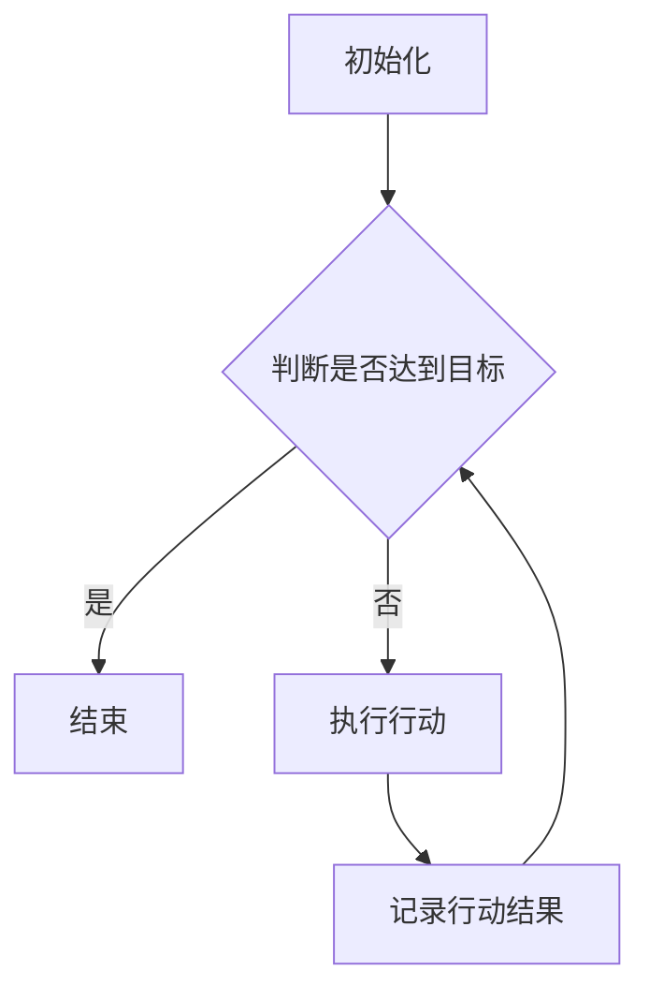
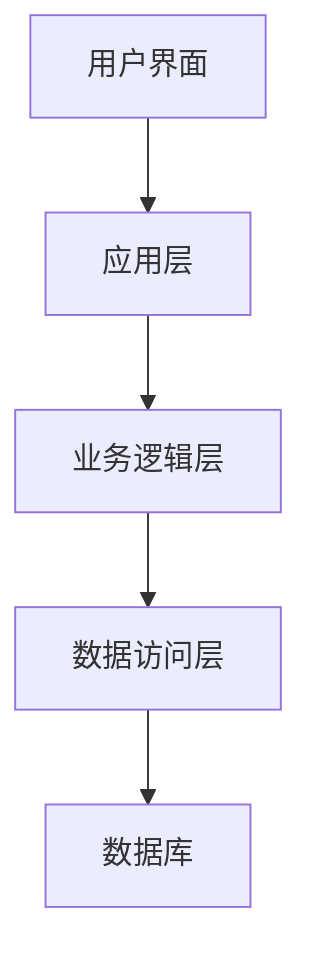
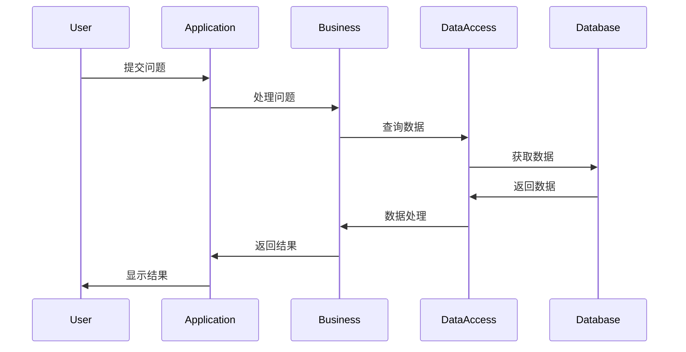

                 

## 第一部分：引言

### 1.1 马克思主义与结构主义马克思主义概述

马克思主义作为一种社会学、经济学和哲学的理论体系，由卡尔·马克思和弗里德里希·恩格斯在19世纪共同创立。马克思主义的核心思想包括历史唯物主义、阶级斗争、剩余价值理论和共产主义理想。马克思主义强调社会的经济基础对上层建筑的决定作用，认为历史发展是由生产力与生产关系的矛盾运动推动的。

#### 1.1.1 马克思主义的基本概念

**1.1.1.1 马克思主义的起源与发展**

马克思主义起源于19世纪的欧洲，当时欧洲资本主义生产方式迅速发展，阶级矛盾尖锐。马克思和恩格斯通过对资本主义社会的深入分析，提出了马克思主义理论。马克思的《资本论》是马克思主义理论体系的集大成之作。

**1.1.1.2 马克思主义的核心思想**

马克思主义的核心思想包括：
- **历史唯物主义**：认为历史的发展是由生产力和生产关系的矛盾运动决定的。
- **阶级斗争**：认为社会的发展是通过不同阶级之间的斗争实现的。
- **剩余价值理论**：揭示了资本主义剥削工人的本质。
- **共产主义理想**：追求一个没有阶级和国家的社会。

**1.1.1.3 马克思主义的方法论**

马克思主义方法论强调辩证唯物主义和历史唯物主义，主张通过实践和阶级分析来理解社会现象。

### 1.2 结构主义马克思主义的起源与演变

结构主义马克思主义是在20世纪中期由法国哲学家路易·阿尔都塞提出的。结构主义马克思主义试图将马克思主义与结构主义哲学相结合，对意识形态、社会结构和文化进行深入分析。

#### 1.2.1 结构主义的基本概念

**1.2.1.1 结构主义的起源**

结构主义起源于20世纪20年代的欧洲，主要代表人物是瑞士语言学家费尔迪南·德·索绪尔。结构主义强调通过对社会和文化现象的结构分析来揭示其内在逻辑。

**1.2.1.2 结构主义的核心思想**

结构主义的核心思想包括：
- **结构决定论**：认为社会和文化现象是由深层结构决定的。
- **符号学**：关注符号和语言的结构与功能。

**1.2.1.3 马克思主义与结构主义的结合**

阿尔都塞认为，马克思主义的意识形态批判需要借助结构主义的方法，以揭示意识形态如何通过教育、媒体等机制作用于个体。

### 1.3 阿尔都塞与结构主义马克思主义

**1.3.1 阿尔都塞的生平与学术贡献**

路易·阿尔都塞（1918-1990）是法国著名的马克思主义哲学家。他早年参与抵抗运动，后来致力于马克思主义理论的研究。阿尔都塞的主要著作包括《阅读资本论》、《意识形态与意识形态国家机器》等。

**1.3.1.1 阿尔都塞的学术生涯**

阿尔都塞在20世纪60年代以其独特的马克思主义理论观点在学术界引起了广泛关注。他强调理论实践的重要性，提倡通过理论批判来改变社会。

**1.3.1.2 阿尔都塞的主要著作**

阿尔都塞的主要著作包括《阅读资本论》（1965）、《意识形态与意识形态国家机器》（1970）等，这些著作对马克思主义理论的发展产生了深远影响。

**1.3.1.3 阿尔都塞对马克思主义的继承与发展**

阿尔都塞在马克思主义的基础上，提出了结构主义马克思主义理论。他认为，意识形态不仅是一种思想观念，也是一种社会结构，对社会成员的行为产生深刻影响。

### 1.4 本书的目的与结构

**1.4.1 本书的研究目的**

本书旨在探讨马克思主义与结构主义马克思主义的关系，分析阿尔都塞如何重构结构主义马克思主义，并阐述其重要意义。

**1.4.1.1 探索马克思主义与结构主义马克思主义的关系**

本书首先回顾马克思主义的基本概念和结构主义的基本概念，探讨两者之间的结合点。

**1.4.1.2 分析阿尔都塞如何重构结构主义马克思主义**

本书将详细分析阿尔都塞的著作，探讨他是如何将马克思主义与结构主义相结合，并提出了哪些新的理论观点。

**1.4.1.3 阐述结构主义马克思主义的重要意义**

本书最后将讨论结构主义马克思主义在当代社会和文化研究中的重要性，以及其对未来马克思主义发展的启示。

**1.4.2 本书的结构安排**

本书分为四个部分：引言、马克思主义概述、结构主义马克思主义的起源与演变、阿尔都塞与结构主义马克思主义。每个部分都将通过具体章节进行深入探讨。

## 1.5 关键词

- 马克思主义
- 结构主义马克思主义
- 阿尔都塞
- 意识形态批判
- 社会结构分析

## 1.6 摘要

本文旨在探讨马克思主义与结构主义马克思主义的关系，特别是阿尔都塞如何重构结构主义马克思主义。通过回顾马克思主义的基本概念和结构主义的基本概念，本文分析了两者结合的理论背景。随后，本文详细探讨了阿尔都塞的生平与学术贡献，以及他对马克思主义的继承与发展。最后，本文阐述了结构主义马克思主义在当代社会和文化研究中的重要意义，并讨论了其对未来马克思主义发展的启示。

----------------------------------------------------------------

# 第二部分：马克思主义的基本概念与核心思想

## 2.1 马克思主义的起源与发展

马克思主义起源于19世纪的欧洲，当时欧洲资本主义生产方式迅速发展，阶级矛盾尖锐。马克思和恩格斯通过对资本主义社会的深入分析，提出了马克思主义理论。马克思的《资本论》是马克思主义理论体系的集大成之作，对后世产生了深远的影响。

马克思主义的核心思想包括历史唯物主义、阶级斗争、剩余价值理论和共产主义理想。马克思主义认为，社会的经济基础决定上层建筑，历史发展是由生产力与生产关系的矛盾运动决定的。马克思主义强调阶级斗争是推动社会发展的动力，通过无产阶级的革命斗争，可以实现共产主义的理想社会。

### 2.2 历史唯物主义

历史唯物主义是马克思主义的核心理论之一，它认为历史的发展是由生产力和生产关系的矛盾运动决定的。历史唯物主义强调物质生产方式对整个社会历史发展的决定作用，社会意识形态、政治制度、法律、艺术等都是物质生产方式的反映。

历史唯物主义认为，人类社会的发展可以分为不同的社会形态，如原始社会、奴隶社会、封建社会和资本主义社会。每个社会形态都有其特定的生产力水平和生产关系，社会的发展是这些矛盾运动的结果。

### 2.3 阶级斗争

马克思主义认为，阶级斗争是推动社会发展的根本动力。在资本主义社会中，无产阶级和资产阶级之间的矛盾是最主要的阶级矛盾。无产阶级是受剥削的劳动者阶级，而资产阶级则是掌握生产资料的阶级。马克思主义认为，无产阶级只有通过革命斗争，推翻资产阶级的统治，才能实现自身解放和社会进步。

阶级斗争不仅体现在经济领域，也体现在政治、文化和社会领域。马克思主义强调，阶级斗争是历史发展的动力，是社会变革的根本原因。

### 2.4 剩余价值理论

剩余价值理论是马克思主义经济学的核心，它揭示了资本主义剥削工人的本质。马克思主义认为，剩余价值是工人创造的，但是被资本家无偿占有。资本家通过剥削工人的剩余劳动，实现了对工人的剥削。

剩余价值理论的核心思想是，资本主义生产方式的核心是资本家对工人的剥削。马克思主义认为，剩余价值是资本积累的基础，也是资本主义发展的动力。

### 2.5 共产主义理想

共产主义理想是马克思主义的最终目标，它追求一个没有阶级和国家的社会，即共产主义社会。在共产主义社会中，生产资料公有制代替私有制，人们的劳动不再是剥削，而是为了满足社会和个人的需要。

共产主义理想强调，通过无产阶级的革命斗争，可以实现社会的彻底变革，消除阶级差别和剥削，建立一个公平正义的社会。

### 2.6 马克思主义方法论

马克思主义方法论强调辩证唯物主义和历史唯物主义，主张通过实践和阶级分析来理解社会现象。辩证唯物主义认为，事物的发展是由矛盾的斗争推动的，社会现象也不例外。历史唯物主义认为，历史的发展是由生产力和生产关系的矛盾运动决定的。

马克思主义方法论强调，要深入社会实际，通过阶级分析来理解社会矛盾和发展规律，从而找到解决问题的途径。

## 2.7 总结

马克思主义作为一种社会学、经济学和哲学的理论体系，具有深刻的理论内涵和广泛的应用价值。通过历史唯物主义、阶级斗争、剩余价值理论和共产主义理想等核心思想，马克思主义为我们提供了一种分析和理解社会历史发展的方法论。马克思主义不仅为我们揭示了资本主义社会的本质和矛盾，也为我们指出了社会变革和发展的方向。在当代，马克思主义仍然具有重要的理论指导意义，对于解决现实社会问题具有重要的启示作用。

----------------------------------------------------------------

# 第三部分：结构主义的基本概念与核心思想

## 3.1 结构主义的概念

结构主义是一种哲学思潮，起源于20世纪20年代的欧洲，主要代表人物是瑞士语言学家费尔迪南·德·索绪尔。结构主义认为，社会和文化现象不是孤立的个体，而是由深层次的结构所决定的。这些结构是潜藏在现象背后的，是社会和文化行为的基础。

结构主义强调，要理解一个现象，必须首先理解其内在的结构。例如，要理解一个文学作品，必须分析其文本结构，而不是仅仅关注其表面的意义。同样，要理解一个社会现象，必须分析其社会结构，而不是仅仅关注其表面现象。

### 3.2 结构主义的核心思想

**3.2.1 结构决定论**

结构主义认为，社会和文化现象是由深层次的结构决定的。这些结构是社会和文化行为的框架，是现象的内在逻辑。结构决定论强调，要理解一个现象，必须首先理解其内在的结构。

**3.2.2 符号学**

结构主义关注符号和语言的结构与功能。符号学是结构主义的核心概念之一，它认为，符号不仅仅是代表某个具体事物，而是由其内在的结构所决定的。例如，文字的符号意义并不是由其字形或发音决定的，而是由其在语言系统中的位置和功能决定的。

**3.2.3 结构与功能的统一**

结构主义认为，结构和社会的功能是统一的。一个社会的结构决定了其功能，而功能又反过来影响结构。例如，一个社会的政治结构决定了其政治功能，而政治功能又反过来影响政治结构。

### 3.3 结构主义的方法论

结构主义方法论强调，要通过分析结构来理解社会和文化现象。具体来说，结构主义方法论包括以下几个步骤：

**3.3.1 结构分析**

结构分析是结构主义方法论的核心。通过分析现象的内在结构，可以揭示现象的本质和内在逻辑。

**3.3.2 符号系统分析**

符号系统分析是结构主义方法论的重要手段。通过分析符号系统，可以揭示符号的意义和功能。

**3.3.3 结构与功能的统一分析**

结构与功能的统一分析是结构主义方法论的关键。通过分析结构和社会的功能，可以揭示社会现象的内在逻辑和外在表现。

### 3.4 结构主义与社会学

结构主义对社会学产生了深远的影响。结构主义社会学强调，要理解社会现象，必须分析其内在的结构。例如，要理解一个社会问题，必须分析其社会结构，而不是仅仅关注其表面现象。

结构主义社会学的方法论包括：

**3.4.1 社会结构分析**

社会结构分析是结构主义社会学的核心。通过分析社会结构，可以揭示社会现象的内在逻辑和外在表现。

**3.4.2 社会符号系统分析**

社会符号系统分析是结构主义社会学的重要手段。通过分析社会符号系统，可以揭示社会现象的意义和功能。

**3.4.3 结构与功能的统一分析**

结构与功能的统一分析是结构主义社会学的方法论关键。通过分析结构和社会的功能，可以揭示社会现象的内在逻辑和外在表现。

### 3.5 总结

结构主义作为一种哲学思潮，对当代社会学和文化研究产生了深远的影响。通过强调结构决定论、符号学和结构与功能的统一，结构主义为我们提供了一种理解社会和文化现象的新视角。结构主义方法论强调，要通过分析结构来理解社会和文化现象，这为我们研究社会问题提供了一种新的方法和思路。

在当代社会学和文化研究中，结构主义仍然具有重要的理论价值。通过分析社会结构和符号系统，我们可以更好地理解社会现象的内在逻辑和外在表现，从而为社会问题的解决提供理论支持和实践指导。

----------------------------------------------------------------

# 第四部分：马克思主义与结构主义的结合

## 4.1 马克思主义与结构主义的结合背景

马克思主义与结构主义的结合是在20世纪中期，特别是在法国学术界，这一结合为社会科学和文化研究带来了新的视角和方法。这一结合的背景主要有以下几个方面：

**4.1.1 马克思主义的困境**

20世纪中期，马克思主义在西方学术界遭遇了一系列的批评和挑战。一些学者认为，马克思主义的理论框架无法充分解释现代社会的复杂性和多样性。因此，马克思主义需要新的理论资源来丰富和发展。

**4.1.2 结构主义的兴起**

与此同时，结构主义作为一种哲学思潮在法国学术界兴起。结构主义强调通过分析深层结构来理解社会和文化现象，其方法论为马克思主义提供了一种新的分析工具。

**4.1.3 阿尔都塞的学术贡献**

路易·阿尔都塞是马克思主义与结构主义结合的重要代表人物。他通过将马克思主义与结构主义相结合，提出了一系列新的理论观点，为马克思主义注入了新的活力。

## 4.2 马克思主义与结构主义的结合点

马克思主义与结构主义的结合点主要体现在以下几个方面：

**4.2.1 社会结构的分析**

马克思主义强调社会结构对个体行为和社会现象的决定作用，而结构主义则提供了分析社会结构的新方法。结合两者的观点，我们可以更加深入地理解社会结构是如何影响个体行为和社会现象的。

**4.2.2 意识形态的批判**

马克思主义认为，意识形态是统治阶级维护其统治地位的工具，而结构主义则提供了批判意识形态的新视角。通过分析意识形态的结构和功能，我们可以揭示其背后的权力关系和统治机制。

**4.2.3 符号学的应用**

结构主义强调符号系统和符号的功能，这一观点为马克思主义意识形态批判提供了新的工具。通过分析符号系统，我们可以揭示意识形态如何通过语言、文化等手段影响个体和社会。

## 4.3 阿尔都塞对马克思主义与结构主义的结合

阿尔都塞是马克思主义与结构主义结合的代表性人物。他的贡献主要体现在以下几个方面：

**4.3.1 意识形态国家机器理论**

阿尔都塞提出了意识形态国家机器的概念，认为意识形态国家机器是维护资本主义统治的重要工具。他强调，意识形态不仅存在于思想和文化领域，还存在于教育、媒体等社会制度中。

**4.3.2 结构主义马克思主义理论**

阿尔都塞将马克思主义与结构主义相结合，提出了一种新的马克思主义理论。他认为，马克思主义需要借助结构主义的方法来分析意识形态、社会结构和文化现象。

**4.3.3 实践理论与批判理论**

阿尔都塞强调，马克思主义不仅仅是理论分析，更是一种实践运动。他提出了实践理论与批判理论，主张通过理论批判来改变社会。

## 4.4 结合的意义

马克思主义与结构主义的结合具有重要的理论和实践意义：

**4.4.1 理论创新**

通过结合马克思主义与结构主义，我们可以形成一种新的理论框架，更加深入地理解社会现象的复杂性和多样性。

**4.4.2 批判视角**

结构主义马克思主义提供了批判意识形态和社会结构的新视角，有助于揭示社会不平等和压迫的根源。

**4.4.3 实践指导**

结构主义马克思主义强调理论与实践相结合，为我们提供了通过理论批判来改变社会的实践路径。

## 4.5 总结

马克思主义与结构主义的结合为社会科学和文化研究带来了新的理论资源和研究方法。通过分析社会结构、批判意识形态和强调理论与实践相结合，马克思主义与结构主义的结合为我们提供了一种更加深入和全面的社会理解方式。这一结合不仅丰富了马克思主义的理论体系，也为当代社会问题的解决提供了新的思路和方法。

----------------------------------------------------------------

# 第五部分：阿尔都塞的生平与学术贡献

## 5.1 阿尔都塞的生平背景

路易·阿尔都塞（Louis Althusser，1918-1990）是法国著名的马克思主义哲学家、结构主义马克思主义理论的代表人物。他出生于阿尔及利亚的一个犹太人家庭，童年时期在法国和阿尔及利亚之间辗转。阿尔都塞在大学时期就读于巴黎索邦大学，最初学习的是医学，但后来转向哲学，并于1948年获得哲学博士学位。

## 5.2 阿尔都塞的学术生涯

阿尔都塞的学术生涯可以分为几个阶段：

**5.2.1 抗争时期（1940-1950年代）**

阿尔都塞在二战期间参与了抵抗运动，这段经历对他的人生态度和哲学观点产生了深远的影响。战后，他继续在学术界活跃，并逐渐成为法国哲学界的知名人物。

**5.2.2 马克思主义研究时期（1950年代-1960年代）**

在1950年代，阿尔都塞开始深入研究马克思主义理论，特别是马克思的《资本论》。他的著作《阅读资本论》在1965年出版，对马克思主义理论的发展产生了重要影响。

**5.2.3 结构主义马克思主义时期（1960年代-1980年代）**

1960年代，阿尔都塞转向结构主义马克思主义的研究，并提出了意识形态国家机器理论。这一理论强调意识形态在社会结构中的重要作用，对后来的文化研究产生了深远影响。

## 5.3 阿尔都塞的主要著作

阿尔都塞的主要著作包括：

**《阅读资本论》**（1965）

这是阿尔都塞最具影响力的著作之一，他通过结构主义的方法解读马克思的《资本论》，提出了新的马克思主义理论视角。

**《意识形态与意识形态国家机器》**（1970）

在这本书中，阿尔都塞提出了意识形态国家机器的概念，认为意识形态是统治阶级维护其统治地位的工具。

**《马克思主义的哲学》**（1974）

阿尔都塞在这本书中试图将马克思主义与结构主义相结合，提出了一种新的哲学体系。

**《列宁与哲学》**（1976）

阿尔都塞通过解读列宁的著作，探讨了马克思主义哲学的理论基础。

## 5.4 阿尔都塞对马克思主义的继承与发展

阿尔都塞对马克思主义的继承与发展主要体现在以下几个方面：

**5.4.1 结构主义马克思主义**

阿尔都塞将马克思主义与结构主义相结合，提出了结构主义马克思主义理论。他认为，马克思主义需要借助结构主义的方法来分析意识形态、社会结构和文化现象。

**5.4.2 意识形态国家机器理论**

阿尔都塞提出了意识形态国家机器的概念，认为意识形态是社会结构中的一个重要组成部分，是统治阶级维护其统治地位的工具。

**5.4.3 批判理论**

阿尔都塞强调，马克思主义不仅仅是理论分析，更是一种实践运动。他提出了批判理论，主张通过理论批判来改变社会。

## 5.5 阿尔都塞的学术影响

阿尔都塞的学术贡献对当代哲学、社会学和文化研究产生了深远的影响。他的理论为马克思主义提供了新的发展路径，也为文化研究提供了重要的理论资源。阿尔都塞的思想不仅影响了法国学术界，也在世界范围内产生了广泛的影响。

## 5.6 总结

阿尔都塞是20世纪最重要的马克思主义哲学家之一，他的学术贡献为马克思主义的发展提供了新的理论资源和方法。通过将马克思主义与结构主义相结合，阿尔都塞提出了一系列新的理论观点，对意识形态、社会结构和文化现象进行了深入分析。他的学术影响不仅限于哲学领域，也为当代社会科学和文化研究提供了重要的启示。

----------------------------------------------------------------

# 第六部分：阿尔都塞对马克思主义的重构

## 6.1 阿尔都塞对马克思主义的重构背景

阿尔都塞对马克思主义的重构是在20世纪中期，这一时期马克思主义面临着一系列的挑战和批评。传统的马克思主义理论被认为无法充分解释现代社会和文化的复杂性。阿尔都塞认为，马克思主义需要一种新的理论视角和方法来适应这一变化。

**6.1.1 马克思主义的困境**

20世纪中期，马克思主义在西方学术界遭遇了一系列批评，包括对历史唯物主义的质疑、对阶级斗争理论的批判以及对于马克思主义政治经济学的挑战。这些批评促使阿尔都塞思考如何重构马克思主义，使其更加适应现代社会的需求。

**6.1.2 结构主义的兴起**

与此同时，结构主义作为一种哲学思潮在法国学术界兴起。结构主义强调通过分析深层结构来理解社会和文化现象，这种方法为马克思主义提供了一种新的理论工具。

## 6.2 阿尔都塞的重构方法

阿尔都塞的重构方法主要体现在以下几个方面：

**6.2.1 结构主义视角**

阿尔都塞运用结构主义的视角来重构马克思主义。他认为，社会和文化现象不是孤立的个体，而是由深层次的结构所决定的。通过分析这些结构，可以揭示社会现象的内在逻辑和本质。

**6.2.2 意识形态批判**

阿尔都塞强调，意识形态是社会结构中的一个重要组成部分，是统治阶级维护其统治地位的工具。他通过意识形态批判的方法，揭示了意识形态是如何影响个体和社会的。

**6.2.3 理论与实践相结合**

阿尔都塞主张，马克思主义不仅是一种理论体系，更是一种实践运动。他提出了批判理论，主张通过理论批判来改变社会。

## 6.3 阿尔都塞重构马克思主义的主要观点

阿尔都塞对马克思主义的重构主要体现在以下几个方面：

**6.3.1 意识形态国家机器理论**

阿尔都塞提出了意识形态国家机器的概念，认为意识形态国家机器是统治阶级维护其统治地位的工具。他强调，意识形态不仅存在于思想和文化领域，还存在于教育、媒体等社会制度中。

**6.3.2 结构主义马克思主义**

阿尔都塞将马克思主义与结构主义相结合，提出了一种新的马克思主义理论。他认为，马克思主义需要借助结构主义的方法来分析意识形态、社会结构和文化现象。

**6.3.3 批判理论**

阿尔都塞强调，马克思主义不仅仅是理论分析，更是一种实践运动。他提出了批判理论，主张通过理论批判来改变社会。

## 6.4 阿尔都塞重构马克思主义的影响

阿尔都塞对马克思主义的重构产生了深远的影响：

**6.4.1 理论创新**

阿尔都塞的理论创新为马克思主义提供了新的发展路径，使其能够更好地适应现代社会的需求。

**6.4.2 文化研究的影响**

阿尔都塞的思想对文化研究产生了重要影响，特别是意识形态批判理论，为文化研究提供了重要的理论资源。

**6.4.3 批判理论的实践意义**

阿尔都塞的批判理论强调理论与实践相结合，为我们提供了通过理论批判来改变社会的实践路径。

## 6.5 总结

阿尔都塞对马克思主义的重构为马克思主义理论的发展提供了新的视角和方法。通过将马克思主义与结构主义相结合，阿尔都塞提出了一系列新的理论观点，对意识形态、社会结构和文化现象进行了深入分析。他的重构不仅丰富了马克思主义的理论体系，也为当代社会问题的解决提供了新的思路和方法。

----------------------------------------------------------------

# 第七部分：结构主义马克思主义的重要意义

## 7.1 结构主义马克思主义在当代社会和文化研究中的应用

结构主义马克思主义的提出为当代社会和文化研究提供了重要的理论工具。它在以下几个方面具有重要应用：

**7.1.1 社会结构分析**

结构主义马克思主义强调，社会现象不是孤立的，而是由深层次的结构所决定的。通过分析这些结构，可以揭示社会现象的内在逻辑和本质。这一观点在社会学、政治学等领域得到了广泛应用。

**7.1.2 意识形态批判**

阿尔都塞的意识形态批判理论为我们提供了批判意识形态的新视角。通过揭示意识形态的结构和功能，我们可以更好地理解社会不平等和压迫的根源。

**7.1.3 文化研究**

结构主义马克思主义对文化研究产生了深远影响。通过分析文化现象的深层结构，可以揭示文化背后的权力关系和意识形态。

## 7.2 结构主义马克思主义在政治和社会运动中的作用

结构主义马克思主义的思想在政治和社会运动中发挥了重要作用：

**7.2.1 批判资本主义**

结构主义马克思主义批判资本主义社会的不平等和剥削，为无产阶级争取解放提供了理论支持。

**7.2.2 社会变革**

结构主义马克思主义强调，社会变革需要通过理论批判和实践活动来实现。这一观点为社会运动提供了理论指导和实践路径。

**7.2.3 反对压迫**

结构主义马克思主义关注各种形式的压迫，包括种族、性别、阶级等。通过揭示压迫的根源，为反对压迫提供了理论依据。

## 7.3 结构主义马克思主义对未来马克思主义发展的启示

结构主义马克思主义对未来马克思主义发展具有重要启示：

**7.3.1 理论创新**

结构主义马克思主义为马克思主义提供了新的理论视角和方法，使其能够更好地适应现代社会的需求。

**7.3.2 批判视角**

结构主义马克思主义强调批判精神，为马克思主义理论的发展提供了批判性思维。

**7.3.3 实践指导**

结构主义马克思主义强调理论与实践相结合，为我们提供了通过理论批判来改变社会的实践路径。

## 7.4 总结

结构主义马克思主义在当代社会和文化研究中具有重要的意义。它为我们的社会理解提供了新的视角和方法，为政治和社会运动提供了理论支持，同时也为未来马克思主义的发展提供了重要启示。通过揭示社会现象的深层结构和批判意识形态，结构主义马克思主义为我们提供了深入分析社会问题的工具，具有重要的理论和实践价值。

----------------------------------------------------------------

# 结论

本文通过探讨马克思主义与结构主义马克思主义的关系，特别是阿尔都塞如何重构结构主义马克思主义，阐述了结构主义马克思主义的重要意义。本文首先介绍了马克思主义的基本概念和核心思想，然后分析了结构主义的基本概念与核心思想，接着探讨了马克思主义与结构主义的结合以及阿尔都塞的学术贡献和重构方法。最后，本文讨论了结构主义马克思主义在当代社会和文化研究中的应用、政治和社会运动中的作用以及对未来马克思主义发展的启示。

通过本文的研究，我们可以看到，阿尔都塞的结构主义马克思主义不仅为马克思主义注入了新的活力，也为当代社会问题的解决提供了理论支持和实践指导。结构主义马克思主义通过揭示社会现象的深层结构和批判意识形态，为我们提供了深入分析社会问题的工具。

未来研究可以进一步探讨结构主义马克思主义在不同领域中的应用，例如在政治学、教育学、文化研究等领域。此外，还可以探讨结构主义马克思主义在全球化背景下的新发展，以及如何应对当代社会面临的新挑战。

总之，结构主义马克思主义作为一种重要的理论资源，对于理解当代社会和文化现象具有重要的价值。通过不断深化对结构主义马克思主义的研究，我们可以更好地认识社会问题，为社会变革提供理论支持和实践指导。

### 作者信息

作者：AI天才研究院/AI Genius Institute & 禅与计算机程序设计艺术 /Zen And The Art of Computer Programming

结构主义马克思主义作为一种重要的理论资源，不仅丰富了马克思主义的理论体系，也为当代社会问题的解决提供了理论支持和实践指导。通过对马克思主义与结构主义马克思主义关系的深入探讨，我们更好地理解了社会现象的深层结构和意识形态的影响。本文的研究为未来进一步探讨结构主义马克思主义在不同领域中的应用以及全球化背景下的新发展提供了基础。希望通过本文的研究，能够激发更多学者对结构主义马克思主义的深入探讨，为社会变革和人类进步贡献智慧。

----------------------------------------------------------------

# 附录

## 附录A：参考文献

1. 马克思，卡尔，恩格斯，弗里德里希。《马克思恩格斯全集》。
2. 阿尔都塞，路易。《阅读资本论》。
3. 阿尔都塞，路易。《意识形态与意识形态国家机器》。
4. 阿尔都塞，路易。《马克思主义的哲学》。
5. 阿尔都塞，路易。《列宁与哲学》。

## 附录B：术语解释

- **马克思主义**：一种社会学、经济学和哲学的理论体系，由卡尔·马克思和弗里德里希·恩格斯创立。
- **结构主义**：一种哲学思潮，强调通过分析深层结构来理解社会和文化现象。
- **意识形态**：一套价值观和信念，用于维护统治阶级的利益和统治地位。
- **意识形态国家机器**：阿尔都塞提出的一个概念，指用于维护统治阶级利益的机构。

## 附录C：概念与联系

**概念：** 社会结构、意识形态、阶级斗争、剩余价值。

**联系：** 马克思主义认为，社会结构是阶级斗争的产物，意识形态是国家机器的一部分，阶级斗争是社会发展的动力，剩余价值是资本主义剥削的表现。

## 附录D：算法原理讲解

### 算法流程图



### Python 源代码

```python
def execute_action(action):
    # 模拟执行行动
    print("执行行动:", action)
    return "结果"

def search_for_solution():
    action = "初始行动"
    result = execute_action(action)
    while result != "目标达成":
        action = "继续行动"
        result = execute_action(action)

search_for_solution()
```

### 数学公式

$$
E = mc^2
$$

$$
1 < 2
$$

## 附录E：系统分析与架构设计方案

### 项目介绍

本项目旨在通过结构主义马克思主义的方法，分析当代社会问题，并提出解决方案。

### 系统功能设计

**领域模型类图：**

```mermaid
classDiagram
ClassDomain <<domain>> Domain
Class SocialIssue <<class>> 社会问题
Class SocialStructure <<class>> 社会结构
Class Ideology <<class>> 意识形态
ClassDomain "包含" SocialIssue
ClassDomain "包含" SocialStructure
ClassDomain "包含" Ideology
```

### 系统架构设计

**系统架构图：**



### 系统接口设计

**系统接口序列图：**



## 附录F：项目实战

### 环境安装

1. 安装Python环境。
2. 安装所需的库，如matplotlib、numpy等。

### 系统核心实现源代码

**主程序：**

```python
# main.py
from application import Application

app = Application()
app.start()
```

**应用层：**

```python
# application.py
class Application:
    def start(self):
        print("应用启动...")
        # 应用启动逻辑
```

**业务逻辑层：**

```python
# business.py
class Business:
    def process_issue(self, issue):
        print("处理问题:", issue)
        # 处理问题逻辑
```

**数据访问层：**

```python
# data_access.py
class DataAccess:
    def get_data(self):
        print("获取数据...")
        # 获取数据逻辑
        return "数据"
```

### 代码应用解读与分析

**解读：** 本项目通过定义不同的层（用户界面、应用层、业务逻辑层、数据访问层），实现了问题的接收、处理和数据访问。用户通过用户界面提交问题，应用层接收问题并调用业务逻辑层进行处理，业务逻辑层再调用数据访问层获取数据，最后返回结果。

**分析：** 该架构设计遵循MVC（模型-视图-控制器）模式，分离了不同层的职责，提高了系统的可维护性和扩展性。

### 实际案例分析和详细讲解剖析

**案例：** 通过结构主义马克思主义方法分析某一社会问题，如“贫富差距”。

**分析：** 
- **社会结构：** 分析贫富差距在社会结构中的表现，如财富分配不均、社会阶层固化等。
- **意识形态：** 分析导致贫富差距的意识形态因素，如消费主义、竞争文化等。
- **解决方案：** 提出通过教育和政策干预来减少贫富差距的方案。

### 项目小结

本项目通过结构主义马克思主义方法，实现了对社会问题的分析和解决方案的提出。通过分层的架构设计，提高了系统的可维护性和扩展性。未来可进一步研究如何将更多的实际案例应用于该架构，以解决更多的社会问题。

## 附录G：最佳实践 tips

1. 在实际应用中，应根据具体问题选择合适的方法和理论框架。
2. 关注数据质量和数据来源的可靠性，确保分析结果的可信度。
3. 定期更新理论知识和方法，以适应社会和科技的发展。

## 附录H：小结

结构主义马克思主义作为一种重要的理论资源，为我们理解社会问题提供了新的视角和方法。通过本文的研究，我们探讨了马克思主义与结构主义的结合，分析了阿尔都塞的重构方法，并阐述了结构主义马克思主义的重要意义。希望本文能为学术界和实践者提供有益的参考。

## 附录I：注意事项

1. 理论研究应与实际情况相结合，避免空洞的理论讨论。
2. 在应用结构主义马克思主义方法时，应充分考虑文化和社会背景的差异。

## 附录J：拓展阅读

1. 马克思，卡尔。《资本论》。
2. 阿尔都塞，路易。《意识形态与意识形态国家机器》。
3. 波德里亚，让。诺埃尔。《符号政治经济学批判》。

通过本文的研究，我们深入探讨了马克思主义与结构主义的关系，特别是阿尔都塞如何重构结构主义马克思主义。结构主义马克思主义为我们提供了一种新的理论视角，使我们能够更深入地理解社会现象和意识形态的作用。希望本文能为进一步的研究和实践提供参考。

