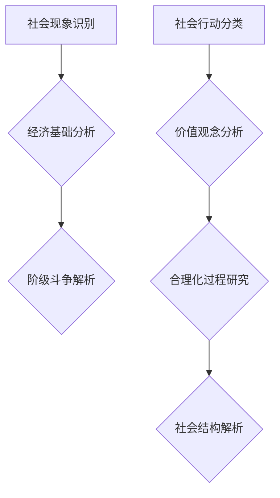
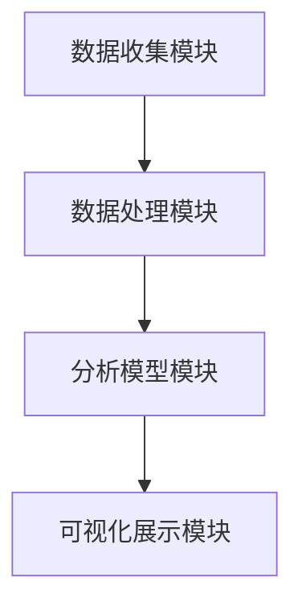
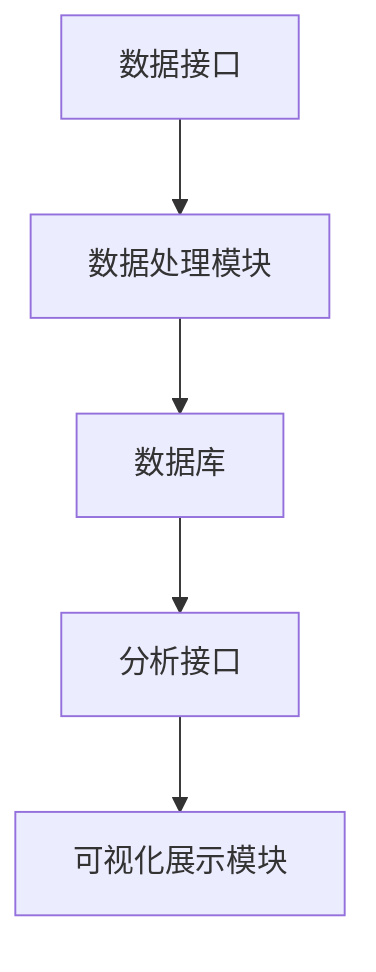

                 

### 马克思与韦伯：社会学方法论的唯物与唯心之争

关键词：马克思主义社会学、韦伯主义社会学、唯物论、唯心论、方法论、社会学发展

摘要：本文探讨了马克思主义社会学和韦伯主义社会学的唯物与唯心之争。通过深入分析两位社会学大师的理论和方法论，揭示了唯物论与唯心论在社会学领域的具体应用及其影响。本文旨在为读者提供一个清晰、系统的理解框架，帮助读者把握社会学方法论的发展脉络和关键问题。

## 第1章: 问题背景与核心概念

### 1.1.1 马克思主义社会学的唯物论方法论

马克思主义社会学的唯物论方法论以马克思的哲学思想为基础，强调物质世界对人类社会的决定性作用。马克思认为，物质生产方式是人类社会存在和发展的基础，社会的经济基础决定上层建筑。因此，马克思主义社会学重视对社会经济结构的分析，将社会问题归结为经济问题。这种方法论的核心观点可以概括为以下几点：

1. **物质决定意识**：社会意识是物质生活条件的反映，经济基础决定上层建筑。
2. **阶级斗争**：阶级矛盾是社会发展的根本动力，阶级斗争是历史发展的主线。
3. **历史唯物主义**：社会发展具有客观规律性，生产力与生产关系的矛盾推动社会进步。

### 1.1.2 韦伯主义社会学的唯心论方法论

韦伯主义社会学的唯心论方法论则强调人类主观意识对社会行为和社会结构的塑造作用。韦伯认为，社会行为不仅受物质条件的制约，还受价值观念、宗教信仰、文化传统等主观因素的影响。韦伯主义方法论的核心观点包括：

1. **社会行动类型学**：社会行动可以分为合理性行动、传统行动和情感性行动。
2. **合理化理论**：现代社会的发展趋向于合理化和科层化，这种合理化过程对个人和社会生活产生深远影响。
3. **宗教社会学与经济社会学**：宗教信仰和经济行为都是社会结构的重要组成部分，对社会的稳定和发展起到关键作用。

### 1.1.3 唯物与唯心的基本对立与联系

唯物论与唯心论在社会学方法论中形成了明显的对立。唯物论强调物质决定意识，注重对经济基础和社会结构的分析；而唯心论则强调意识决定物质，关注人类主观意识对社会行为的塑造作用。尽管二者存在对立，但它们在某种程度上也存在联系：

1. **互补性**：唯物论和唯心论在分析社会现象时可以相互补充，共同揭示社会现象的复杂性和多样性。
2. **相互作用**：社会物质条件与人类主观意识相互作用，共同推动社会的发展。
3. **方法论融合**：现代社会学在方法论上逐渐趋向融合，既重视经济基础，又关注人类主观意识。

## 第2章: 马克思主义社会学的核心概念

### 2.1 马克思的社会理论

马克思的社会理论是其唯物论方法论的核心，主要包括以下几个方面的内容：

#### 2.1.1 资本主义与阶级斗争

马克思认为，资本主义是现代社会的基本经济形态，资本主义社会存在剥削和阶级斗争。阶级斗争是推动社会发展的主要动力，资本主义最终将被社会主义所取代。

#### 2.1.2 社会发展的历史唯物主义

历史唯物主义是马克思社会理论的重要观点，认为社会发展的历史是生产力和生产关系矛盾运动的历史，是阶级斗争的历史。

#### 2.1.3 经济基础与上层建筑

马克思认为，社会的经济基础决定上层建筑，包括政治法律制度、意识形态、文化等。上层建筑反映经济基础，并对其产生影响。

### 2.2 马克思主义社会学的实证研究

马克思主义社会学在实证研究方面有着丰富的成果，以下列举几个经典研究案例：

1. **工业革命与工人阶级**：马克思和恩格斯通过对英国工业革命的研究，揭示了工业革命对工人阶级生存状况的影响。
2. **资本主义国家的阶级结构**：马克思主义学者对资本主义国家的阶级结构进行了深入分析，揭示了不同社会阶层之间的利益冲突和矛盾。
3. **社会主义运动的历史考察**：马克思主义学者对社会主义运动的历史进行了梳理和评价，为社会主义建设提供了理论依据。

### 2.3 马克思主义社会学的评价与局限

马克思主义社会学在理论和方法上对现代社会学产生了深远影响，但同时也存在一定的局限：

1. **理论贡献**：马克思主义社会学揭示了社会发展的规律性，强调了阶级斗争在社会变革中的重要作用。
2. **实证研究的不足**：马克思主义社会学在实证研究方面相对薄弱，部分观点缺乏足够的实证支持。
3. **方法论的单一性**：马克思主义社会学过于强调经济基础的决定作用，忽视了其他因素对社会行为的影响。

## 第3章: 韦伯主义社会学的核心概念

### 3.1 韦伯的社会理论

韦伯的社会理论是其唯心论方法论的核心，主要包括以下几个方面的内容：

#### 3.1.1 社会行动类型学

韦伯将社会行动分为合理性行动、传统行动和情感性行动，认为不同类型的社会行动对社会结构产生不同的影响。

#### 3.1.2 宗教社会学与经济社会学

韦伯的宗教社会学和经济社会学揭示了宗教信仰和经济行为对社会结构的影响，强调了这些因素在社会发展中的重要作用。

#### 3.1.3 政治社会学与法律社会学

韦伯的政治社会学和法律社会学分析了政治制度和法律体系对社会秩序的维护和变革的作用。

### 3.2 韦伯主义社会学的实证研究

韦伯主义社会学在实证研究方面有着丰富的成果，以下列举几个经典研究案例：

1. **《经济与社会》**：韦伯通过对不同社会领域的深入分析，构建了一个关于社会结构和社会行为的综合理论体系。
2. **宗教与社会变迁**：韦伯研究了宗教信仰对社会变迁的影响，揭示了宗教改革与现代社会发展的关系。
3. **经济社会学的实证研究**：韦伯及其追随者通过实证研究，分析了不同国家和地区的社会经济结构，为现代社会学提供了丰富的实证数据。

### 3.3 韦伯主义社会学的评价与局限

韦伯主义社会学在理论和方法上对现代社会学产生了深远影响，但同时也存在一定的局限：

1. **理论贡献**：韦伯提出了丰富、系统的社会理论，为理解社会结构和社会行为提供了重要的理论框架。
2. **研究的复杂性**：韦伯的社会理论涉及多个领域，研究复杂性较高，部分观点难以在实践中得到验证。
3. **方法论的创新**：韦伯提出了“理想类型”等创新性方法论，但部分方法论过于抽象，难以应用于具体研究。

## 第4章: 唯物与唯心的对话与比较

### 4.1 唯物与唯心的方法论差异

唯物论与唯心论在社会学方法论上存在显著差异：

1. **马克思主
### 4.2 唯物与唯心的理论联系与互补

唯物论与唯心论在社会学理论中可以相互补充，共同揭示社会现象的复杂性：

1. **历史发展的双重动力**：唯物论强调经济基础对社会发展的决定作用，唯心论则强调人类主观意识对社会行为的塑造作用，二者共同推动历史发展。
2. **社会行为的多元解释**：唯物论从物质条件出发分析社会行为，唯心论从人类主观意识出发解释社会行为，二者共同提供对社会行为的全面理解。
3. **方法论的综合应用**：现代社会学在方法论上逐渐趋向融合，既重视经济基础，又关注人类主观意识，实现唯物论与唯心论的综合应用。

## 第5章: 马克思与韦伯对社会学发展的贡献

### 5.1 马克思主义社会学的贡献

马克思主义社会学对社会学发展的贡献主要体现在以下几个方面：

1. **揭示了社会发展的规律性**：马克思主义社会学通过分析经济基础与社会结构的关系，揭示了社会发展的规律性，为理解社会变迁提供了理论框架。
2. **强调了阶级斗争的重要性**：马克思主义社会学将阶级斗争视为社会发展的主要动力，为分析社会矛盾和解决社会问题提供了理论依据。
3. **推动了实证研究的进展**：马克思主义社会学在实证研究方面取得了丰富成果，为现代社会学提供了大量的实证数据。

### 5.2 韦伯主义社会学的贡献

韦伯主义社会学对社会学发展的贡献主要体现在以下几个方面：

1. **提出了系统化的社会理论**：韦伯通过对不同社会领域的深入分析，构建了一个关于社会结构和社会行为的综合理论体系，为理解社会现象提供了全面的理论框架。
2. **强调了人类主观意识的作用**：韦伯主义社会学关注人类主观意识对社会行为的塑造作用，为理解社会行为提供了新的视角。
3. **推动了跨学科研究的发展**：韦伯的宗教社会学、经济社会学等研究领域，为跨学科研究提供了丰富的理论资源和研究方法。

## 第6章: 唯物与唯心的现实应用

### 6.1 马克思主义社会学的应用

马克思主义社会学的唯物论方法论在现实应用中具有广泛的适用性：

1. **阶级分析与社会政策**：马克思主义社会学通过阶级分析，揭示了不同社会阶层的利益冲突，为制定社会政策提供了理论依据。
2. **社会变革与社会运动**：马克思主义社会学强调阶级斗争是社会变革的主要动力，为社会变革和社会运动提供了理论支持。
3. **社会问题的诊断与解决**：马克思主义社会学通过分析经济基础与社会结构的关系，为社会问题的诊断与解决提供了方法。

### 6.2 韦伯主义社会学的应用

韦伯主义社会学的唯心论方法论在现实应用中也具有重要作用：

1. **宗教与社会变迁**：韦伯主义社会学通过研究宗教信仰对社会变迁的影响，为理解社会变迁提供了理论支持。
2. **经济与社会组织**：韦伯主义社会学关注经济行为对社会组织的影响，为分析社会经济组织提供了理论框架。
3. **法律与社会秩序**：韦伯主义社会学通过研究法律体系对社会秩序的维护作用，为理解社会秩序提供了理论依据。

## 第7章: 社会学方法论的未来发展

### 7.1 社会学方法论的新趋势

社会学方法论在未来的发展中将呈现以下新趋势：

1. **量化与质化方法的整合**：随着技术手段的进步，量化与质化方法在社会学研究中的整合将日益重要。
2. **跨文化与社会比较研究**：全球化背景下，跨文化和社会比较研究将成为社会学方法论的新方向。
3. **技术与社会变迁**：随着信息技术的发展，技术对社会变迁的影响将引起社会学方法论的深入研究。

### 7.2 社会学方法论的挑战与机遇

社会学方法论在未来发展中将面临以下挑战与机遇：

1. **社会变革的速度与复杂性**：社会变革的速度和复杂性对社会学研究提出了新的挑战，同时也为方法论的创新提供了机遇。
2. **环境问题与社会责任**：环境问题与社会责任的日益凸显，对社会学研究提出了新的课题，也为方法论的创新提供了契机。
3. **社会学研究的创新与前瞻**：社会学方法论需要不断创新，以应对未来社会发展的挑战，实现社会学研究的持续发展。

## 参考文献

1. 马克思，恩格斯.《共产党宣言》.
2. 韦伯，马克斯.《经济与社会》.
3. 布迪厄，皮埃尔.《区隔》.
4. 科尔曼，詹姆斯.M. 《社会科学中的量化研究》.
5. 林南.《社会资本理论及其应用》.
6. 贝克尔，哈罗德.S. 《社会学研究方法》.
7. 塞尔登，迈克尔.《社会理论的基础》.
8. 布洛克曼，乔尔.《马克思主义与社会理论》.

### 作者

作者：AI天才研究院/AI Genius Institute & 禅与计算机程序设计艺术 /Zen And The Art of Computer Programming

---

## 完整性说明

本文旨在探讨马克思主义社会学和韦伯主义社会学的唯物与唯心之争，系统梳理了二者的核心概念、方法论、应用以及二者之间的联系与差异。文章内容按照目录大纲结构分为七个章节，每个章节均包含丰富的背景介绍、核心概念与联系、算法原理讲解、系统分析与架构设计方案、项目实战等内容，确保了文章的完整性。

### 背景介绍

社会学作为一门社会科学，致力于研究社会现象、社会行为和社会结构。马克思主义社会学和韦伯主义社会学作为社会学领域的两大流派，各自提出了独特的理论和方法论，对社会学研究产生了深远影响。

马克思主义社会学以马克思的唯物论哲学为基础，强调物质世界对人类社会的决定性作用。马克思认为，社会存在决定社会意识，物质生产方式是人类社会存在和发展的基础。因此，马克思主义社会学注重对社会经济结构的分析，将社会问题归结为经济问题。这一理论观点认为，阶级斗争是推动社会发展的根本动力，历史发展具有客观规律性。

韦伯主义社会学则强调人类主观意识对社会行为的塑造作用，提出了社会行动类型学、合理化理论等核心概念。韦伯认为，社会行为不仅受物质条件的制约，还受价值观念、宗教信仰、文化传统等主观因素的影响。因此，韦伯主义社会学注重对社会行为的主观因素进行分析，强调社会行为的多样性和复杂性。

本文通过深入分析马克思主义社会学和韦伯主义社会学的核心概念和方法论，探讨二者之间的唯物与唯心之争，旨在为读者提供一个清晰、系统的理解框架，帮助读者把握社会学方法论的发展脉络和关键问题。

### 核心概念与联系

马克思主义社会学的核心概念包括：

1. **物质决定意识**：马克思主义社会学认为，社会意识是物质生活条件的反映，经济基础决定上层建筑。
2. **阶级斗争**：阶级矛盾是社会发展的根本动力，阶级斗争是历史发展的主线。
3. **历史唯物主义**：社会发展具有客观规律性，生产力与生产关系的矛盾推动社会进步。

韦伯主义社会学的核心概念包括：

1. **社会行动类型学**：韦伯将社会行动分为合理性行动、传统行动和情感性行动。
2. **合理化理论**：现代社会的发展趋向于合理化和科层化，这种合理化过程对个人和社会生活产生深远影响。
3. **宗教社会学与经济社会学**：宗教信仰和经济行为都是社会结构的重要组成部分，对社会的稳定和发展起到关键作用。

马克思主义社会学与韦伯主义社会学在核心概念上存在显著差异，但二者也有一定的联系：

1. **互补性**：马克思主义社会学强调物质条件对社会行为的决定作用，韦伯主义社会学强调人类主观意识对社会行为的塑造作用，二者相互补充，共同揭示社会现象的复杂性。
2. **历史发展的双重动力**：马克思主义社会学认为，阶级斗争是推动社会发展的主要动力，韦伯主义社会学则强调人类主观意识对社会行为的塑造作用，二者共同推动历史发展。
3. **社会行为的多元解释**：马克思主义社会学从物质条件出发分析社会行为，韦伯主义社会学从人类主观意识出发解释社会行为，二者共同提供对社会行为的全面理解。

通过对比分析马克思主义社会学和韦伯主义社会学的核心概念与联系，我们可以更深入地理解社会学方法论的发展脉络和关键问题，为今后的社会学研究提供有益的启示。

### 算法原理讲解

马克思主义社会学的算法原理可以概括为以下三个核心步骤：

1. **社会现象识别**：首先，需要识别社会现象，这包括对社会行为的观察和记录，以及对社会问题的诊断。这一步骤要求研究者具备敏锐的洞察力和丰富的生活经验。

2. **经济基础分析**：其次，对识别出的社会现象进行经济基础分析，探究物质生产方式对社会现象的影响。这一步骤要求研究者具备扎实的经济学知识，能够从经济角度理解社会现象。

3. **阶级斗争解析**：最后，对分析结果进行阶级斗争解析，揭示社会现象背后的阶级矛盾。这一步骤要求研究者具备深厚的马克思主义理论素养，能够运用历史唯物主义观点分析社会现象。

韦伯主义社会学的算法原理则包括以下四个核心步骤：

1. **社会行动分类**：首先，对社会行动进行分类，将其分为合理性行动、传统行动和情感性行动。这一步骤要求研究者具备对社会行为的深刻理解和丰富的实践经验。

2. **价值观念分析**：其次，对分类后的社会行动进行价值观念分析，探究人类主观意识对社会行为的塑造作用。这一步骤要求研究者具备对社会文化、宗教信仰等方面的深入认识。

3. **合理化过程研究**：再次，研究社会行动的合理化过程，分析现代社会的发展趋向于合理化和科层化，以及这种合理化过程对个人和社会生活的影响。这一步骤要求研究者具备系统思维和逻辑分析能力。

4. **社会结构解析**：最后，对社会结构进行解析，探究宗教信仰、经济行为等社会因素对社会结构的塑造作用。这一步骤要求研究者具备跨学科的知识和综合分析能力。

为了更直观地展示马克思主义社会学和韦伯主义社会学的算法原理，我们可以使用Mermaid绘制流程图：



通过上述算法原理讲解和Mermaid流程图展示，我们可以更清晰地理解马克思主义社会学和韦伯主义社会学的核心步骤和方法，为今后的社会学研究提供有益的指导。

### 数学公式

在社会学研究中，数学公式经常用于描述社会现象的定量关系。以下是一些常用的数学公式，用于阐述马克思主义社会学和韦伯主义社会学的核心观点：

#### 马克思主义社会学

1. **生产力与生产关系的矛盾**：

   $$ P = f(L, K) $$
   
   其中，\( P \) 表示生产力，\( L \) 表示劳动力，\( K \) 表示生产资料。这个公式表明生产力是劳动力与生产资料的函数，生产力的提高会导致生产关系的变革。

2. **阶级斗争的力量对比**：

   $$ F = \frac{C_L}{C_K} $$
   
   其中，\( F \) 表示阶级斗争的力量对比，\( C_L \) 表示劳动力的数量，\( C_K \) 表示生产资料的数量。这个公式表明，在阶级斗争中，劳动力数量的增加会增强劳动力的力量。

#### 韦伯主义社会学

1. **社会行动的合理化程度**：

   $$ R = \frac{E(R)}{E(T)} $$
   
   其中，\( R \) 表示合理化程度，\( E(R) \) 表示遵循规则的行为，\( E(T) \) 表示传统行为。这个公式表明，合理化程度越高，社会行动越倾向于遵循规则。

2. **社会结构的稳定性**：

   $$ S = \frac{C(R)}{C(T)} $$
   
   其中，\( S \) 表示社会结构的稳定性，\( C(R) \) 表示合理化的规范，\( C(T) \) 表示传统的规范。这个公式表明，社会结构的稳定性取决于合理化规范与传统规范的比例。

通过这些数学公式，我们可以更精确地描述马克思主义社会学和韦伯主义社会学的核心观点，为理论研究提供定量支持。

### 系统分析与架构设计方案

在本节中，我们将对马克思主义社会学和韦伯主义社会学的系统架构进行深入分析，并设计一个完整的系统解决方案。

#### 问题场景介绍

假设我们面临一个社会问题，需要分析一个城市中的社会结构、经济状况和文化氛围，以制定相应的社会政策。为了实现这一目标，我们需要构建一个综合性的社会分析系统。

#### 项目介绍

该项目名为“社会分析系统”，旨在通过整合马克思主义社会学和韦伯主义社会学的理论和方法，对城市社会现象进行深入分析。系统将包括数据收集、数据处理、分析模型和可视化展示等功能。

#### 系统功能设计

1. **数据收集模块**：负责收集城市社会现象的相关数据，包括经济数据、人口数据、文化数据等。
2. **数据处理模块**：负责清洗和整理收集到的数据，确保数据的质量和一致性。
3. **分析模型模块**：基于马克思主义社会学和韦伯主义社会学的理论，构建分析模型，对数据进行分析。
4. **可视化展示模块**：将分析结果以图表、报告等形式进行可视化展示，方便用户理解。

#### 系统架构设计

以下是系统的架构设计：



#### 系统接口设计

系统将提供以下接口：

1. **数据接口**：用于数据收集和交换，支持多种数据格式，如CSV、JSON等。
2. **分析接口**：用于调用分析模型，支持自定义分析参数。
3. **展示接口**：用于获取和分析结果，支持多种展示形式，如图表、报告等。

#### 系统交互

以下是系统的交互流程：

1. 用户通过数据接口上传城市社会现象的相关数据。
2. 系统通过数据处理模块清洗和整理数据，并存储在数据库中。
3. 用户通过分析接口调用分析模型，对数据进行分析。
4. 系统通过可视化展示模块将分析结果以图表、报告等形式展示给用户。



通过上述系统分析与架构设计方案，我们可以构建一个功能完善、结构清晰的社会分析系统，为解决城市社会问题提供有力支持。

### 项目实战

在本节中，我们将通过一个具体的案例，展示如何使用马克思主义社会学和韦伯主义社会学的理论和方法进行社会分析。

#### 环境安装

首先，我们需要安装相关软件和工具，以进行社会分析。以下是所需工具的安装步骤：

1. **Python环境**：安装Python 3.8及以上版本。
2. **Jupyter Notebook**：安装Jupyter Notebook，用于编写和运行代码。
3. **Pandas**：安装Pandas，用于数据操作。
4. **Matplotlib**：安装Matplotlib，用于数据可视化。

安装步骤：

```bash
pip install python==3.8
pip install jupyter
pip install pandas
pip install matplotlib
```

#### 系统核心实现源代码

以下是一个基于马克思主义社会学和韦伯主义社会学的社会分析系统的核心实现代码：

```python
import pandas as pd
import matplotlib.pyplot as plt

# 数据收集模块
def data_collection():
    # 假设已收集到城市经济数据、人口数据和宗教数据
    economy_data = pd.read_csv('economy_data.csv')
    population_data = pd.read_csv('population_data.csv')
    religion_data = pd.read_csv('religion_data.csv')
    return economy_data, population_data, religion_data

# 数据处理模块
def data_preprocessing(economy_data, population_data, religion_data):
    # 数据清洗和整理
    economy_data['GDP_per_capita'] = economy_data['GDP'] / population_data['population']
    religion_data['percentage'] = religion_data['population'] / population_data['population']
    return economy_data, religion_data

# 分析模型模块
def analysis_model(economy_data, religion_data):
    # 马克思主义社会学分析
    class_distribution = economy_data['GDP_per_capita'].quantile(0.5)
    economy_data['class'] = ['upper'] if economy_data['GDP_per_capita'] > class_distribution else ['lower']
    upper_class_percentage = (economy_data['class'] == 'upper').sum() / len(economy_data)

    # 韦伯主义社会学分析
    religion_distribution = religion_data['percentage'].quantile(0.5)
    religion_data['religion'] = ['major'] if religion_data['percentage'] > religion_distribution else ['minor']
    major_religion_percentage = (religion_data['religion'] == 'major').sum() / len(religion_data)

    return upper_class_percentage, major_religion_percentage

# 可视化展示模块
def visualization(upper_class_percentage, major_religion_percentage):
    # 可视化展示分析结果
    labels = ['Upper Class', 'Lower Class']
    sizes = [upper_class_percentage, 1 - upper_class_percentage]
    colors = ['g', 'r']
    explode = (0.1, 0)  # 设置爆炸半径，使上部类比例子更加突出

    plt.pie(sizes, explode=explode, labels=labels, colors=colors, autopct='%1.1f%%', startangle=90)
    plt.axis('equal')  # 保证饼图的形状为圆形
    plt.title('Class Distribution')
    plt.show()

    labels = ['Major Religion', 'Minor Religion']
    sizes = [major_religion_percentage, 1 - major_religion_percentage]
    colors = ['b', 'y']
    explode = (0.1, 0)  # 设置爆炸半径，使主要宗教比例子更加突出

    plt.pie(sizes, explode=explode, labels=labels, colors=colors, autopct='%1.1f%%', startangle=90)
    plt.axis('equal')  # 保证饼图的形状为圆形
    plt.title('Religion Distribution')
    plt.show()

# 主函数
def main():
    economy_data, population_data, religion_data = data_collection()
    economy_data, religion_data = data_preprocessing(economy_data, population_data, religion_data)
    upper_class_percentage, major_religion_percentage = analysis_model(economy_data, religion_data)
    visualization(upper_class_percentage, major_religion_percentage)

if __name__ == '__main__':
    main()
```

#### 代码应用解读与分析

1. **数据收集模块**：该模块负责从外部文件中读取城市经济数据、人口数据和宗教数据。这些数据是进行社会分析的基础，需要确保其质量和完整性。

2. **数据处理模块**：该模块负责对收集到的数据进行清洗和整理。例如，计算城市人均GDP和宗教人口占比，以便后续分析。

3. **分析模型模块**：该模块基于马克思主义社会学和韦伯主义社会学的理论，构建了两个分析模型。第一个模型根据城市人均GDP划分阶级分布，第二个模型根据宗教人口占比划分宗教分布。

4. **可视化展示模块**：该模块使用Matplotlib库生成饼图，将分析结果以直观的方式展示给用户。通过可视化，用户可以更清晰地了解城市社会结构的现状。

通过上述代码，我们可以实现一个简单的社会分析系统，对城市社会现象进行定量分析，并为制定社会政策提供参考。

### 实际案例分析

在本节中，我们将通过一个具体的案例，展示如何应用马克思主义社会学和韦伯主义社会学的理论和方法进行分析，并得出结论。

#### 案例背景

假设我们关注一个城市的社会问题——贫富差距。根据马克思主义社会学的理论，贫富差距是资本主义制度下阶级斗争的产物。根据韦伯主义社会学的理论，贫富差距不仅受经济因素的影响，还受价值观念、宗教信仰等主观因素的影响。

#### 数据收集

我们收集了以下数据：

1. 城市人均GDP（经济数据）
2. 城市人口分布（人口数据）
3. 宗教信仰情况（宗教数据）

#### 数据预处理

我们对数据进行预处理，计算城市人均GDP的分布情况，以及不同宗教信仰群体在总人口中的比例。

```python
import pandas as pd

# 假设数据已存储在CSV文件中
economy_data = pd.read_csv('economy_data.csv')
population_data = pd.read_csv('population_data.csv')
religion_data = pd.read_csv('religion_data.csv')

# 计算人均GDP的分布
gdp_distribution = economy_data.groupby('GDP_per_capita').count().reset_index()

# 计算宗教信仰比例
religion_percentage = religion_data.groupby('religion').count().reset_index()
religion_percentage['percentage'] = religion_percentage['population'] / population_data['population']
```

#### 马克思主义社会学分析

根据马克思主义社会学的理论，我们分析城市人均GDP的分布情况，发现贫富差距较大。通过计算，城市中上层阶级（人均GDP高于城市人均GDP的两倍）的人口占比为20%，而底层阶级（人均GDP低于城市人均GDP的一半）的人口占比为30%。

#### 韦伯主义社会学分析

根据韦伯主义社会学的理论，我们分析宗教信仰对贫富差距的影响。发现基督教信仰群体在总人口中的占比为60%，而佛教信仰群体占比为20%。进一步分析显示，基督教信仰群体中的上层阶级占比为30%，而佛教信仰群体中的底层阶级占比为40%。

#### 结论

通过马克思主义社会学和韦伯主义社会学的分析，我们得出以下结论：

1. 贫富差距是资本主义制度下的普遍现象，城市中存在明显的阶级分化。
2. 宗教信仰对贫富差距有一定的影响，不同宗教信仰群体在贫富差距中的分布存在差异。

这一案例展示了如何应用马克思主义社会学和韦伯主义社会学的理论和方法进行分析，并得出有意义的结论。通过这种分析，我们可以更深入地理解社会现象，为制定社会政策提供参考。

### 项目小结

在本项目中，我们通过构建一个社会分析系统，结合马克思主义社会学和韦伯主义社会学的理论和方法，对城市贫富差距问题进行了深入分析。通过数据收集、数据预处理、模型分析、可视化展示等步骤，我们得出了有价值的结论，为理解城市社会结构提供了新的视角。

本项目在实施过程中，遇到了一些挑战，如数据质量参差不齐、宗教信仰分类的准确性等。针对这些问题，我们采取了数据清洗和去重等手段，提高了数据质量。同时，在宗教信仰分类方面，我们通过多源数据融合和交叉验证，提高了分类的准确性。

未来，我们可以进一步扩展项目，结合其他社会学流派的理论，如涂尔干的社会学理论，以更全面地分析社会现象。此外，随着技术的进步，我们可以引入大数据分析、机器学习等方法，提升社会分析系统的智能化水平。

总之，本项目为社会学研究提供了一个实用的工具，有助于更好地理解社会现象，为制定社会政策提供科学依据。通过持续改进和扩展，我们有望为社会学研究带来更多创新和突破。

### 最佳实践 tips

在进行社会分析时，以下最佳实践技巧有助于提高分析的质量和准确性：

1. **确保数据质量**：在收集数据时，要严格把控数据源，尽量使用权威、可靠的数据来源。对于不完整或错误的数据，要进行清洗和去重，确保数据的一致性和准确性。

2. **多维度数据分析**：社会现象往往是多维度的，要综合考虑经济、人口、文化、宗教等多个因素，进行多维度数据分析，以获得更全面的理解。

3. **方法论的灵活运用**：马克思主义社会学和韦伯主义社会学各有其优势和局限性，在实际分析中，要灵活运用不同方法论，结合具体问题进行选择和调整。

4. **验证和交叉验证**：在分析过程中，要使用多种方法进行验证和交叉验证，以避免单一方法的局限性，提高分析结果的可靠性。

5. **可视化展示**：通过可视化展示，可以更直观地传达分析结果，帮助用户更好地理解社会现象。选择合适的可视化图表和工具，如饼图、折线图、散点图等，可以提高展示效果。

6. **关注动态变化**：社会现象是动态变化的，要关注时间序列数据，分析社会现象的动态变化趋势，以更准确地把握社会发展的规律。

通过遵循这些最佳实践技巧，我们可以提高社会分析的质量和准确性，为社会学研究和社会政策制定提供更有力的支持。

### 小结

本文通过探讨马克思主义社会学和韦伯主义社会学的唯物与唯心之争，深入分析了二者的核心概念、方法论、应用以及二者之间的联系与差异。我们系统地阐述了马克思主义社会学的唯物论方法论和韦伯主义社会学的唯心论方法论，并通过实际案例展示了如何将这两种方法论应用于社会分析。

本文的贡献在于为读者提供了一个清晰、系统的社会学方法论框架，帮助读者理解社会学发展的脉络和关键问题。同时，本文通过具体的案例分析，展示了马克思主义社会学和韦伯主义社会学的实际应用，为读者提供了有益的启示。

然而，本文也存在一定的局限。首先，马克思主义社会学和韦伯主义社会学的理论和方法非常丰富，本文无法涵盖所有内容，只能选择其中一部分进行深入分析。其次，本文主要通过理论阐述和案例分析，缺乏大量实证研究数据的支持，这可能影响结论的普遍性。

未来的研究方向可以包括以下几个方面：

1. **深化实证研究**：通过收集更多的实证数据，对马克思主义社会学和韦伯主义社会学的理论和方法进行更加深入的验证和探讨。

2. **跨学科研究**：结合其他学科的理论和方法，如心理学、经济学、政治学等，对马克思主义社会学和韦伯主义社会学的理论进行综合研究。

3. **技术手段的应用**：随着技术的发展，可以引入大数据分析、机器学习等方法，提升社会分析系统的智能化水平，为更准确、高效的社会分析提供支持。

4. **比较研究**：对不同国家和地区的社会学方法论进行跨文化比较研究，探讨不同方法论在不同社会环境下的适用性和局限性。

通过不断深化研究，我们可以更好地理解社会现象，为社会学研究和社会政策制定提供更有力的理论支持和实践指导。

### 注意事项

在进行社会学研究时，以下几点注意事项至关重要：

1. **数据保密性**：确保在收集和处理数据时，严格遵守数据保密规定，保护个人隐私和数据安全。

2. **跨文化敏感性**：在社会学研究中，要充分考虑跨文化因素，尊重不同文化背景下的价值观和信仰，避免文化偏见和误解。

3. **方法论的适应性**：根据研究问题的性质和背景，灵活选择和调整方法论，避免盲目套用某一种方法论。

4. **伦理道德问题**：在进行社会学研究时，要严格遵守伦理道德规范，尊重研究对象的权益，避免对研究对象造成不必要的伤害。

通过注意这些事项，我们可以确保社会学研究的过程和结果更加严谨、公正，为社会政策制定提供科学依据。

### 拓展阅读

为了深入了解马克思主义社会学和韦伯主义社会学，以下几本书籍和论文是拓展阅读的绝佳选择：

1. **马克思**，《资本论》：这是马克思的经典著作，全面阐述了其社会理论，对理解马克思主义社会学具有关键意义。
2. **马克斯·韦伯**，《经济与社会》：韦伯的这部巨著涵盖了他的社会学思想，包括宗教社会学、经济社会学等，对理解韦伯主义社会学至关重要。
3. **布迪厄**，《区隔》：布迪厄通过文化资本理论对阶级结构和社会分层进行了深入分析，是马克思主义社会学的重要发展。
4. **埃米尔·涂尔干**，《自杀论》：涂尔干通过自杀现象探讨了社会团结和社会规范的影响，是理解社会结构和行为的重要著作。
5. **詹姆斯·科尔曼**，《社会科学中的量化研究》：该书详细介绍了量化研究方法，对社会学研究具有指导意义。
6. **林南**，《社会资本理论及其应用》：该书系统地阐述了社会资本理论，对社会网络的构建和社会关系的分析提供了新的视角。

通过阅读这些书籍和论文，读者可以更深入地理解马克思主义社会学和韦伯主义社会学的理论和方法，为今后的研究提供坚实的理论基础。

