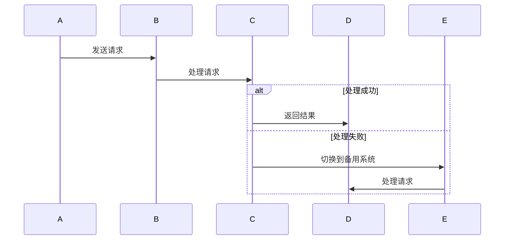
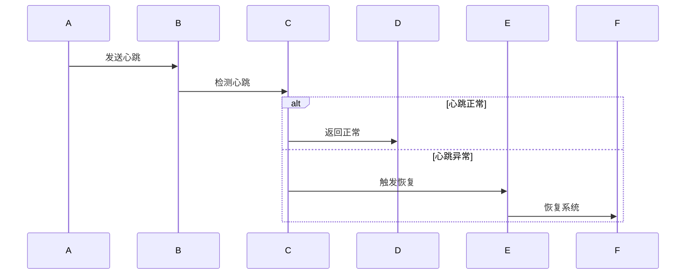
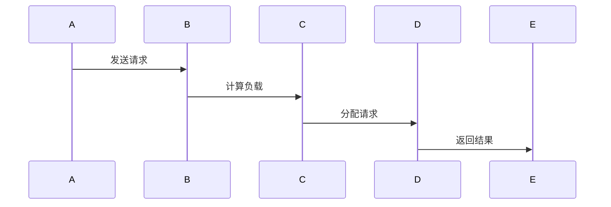
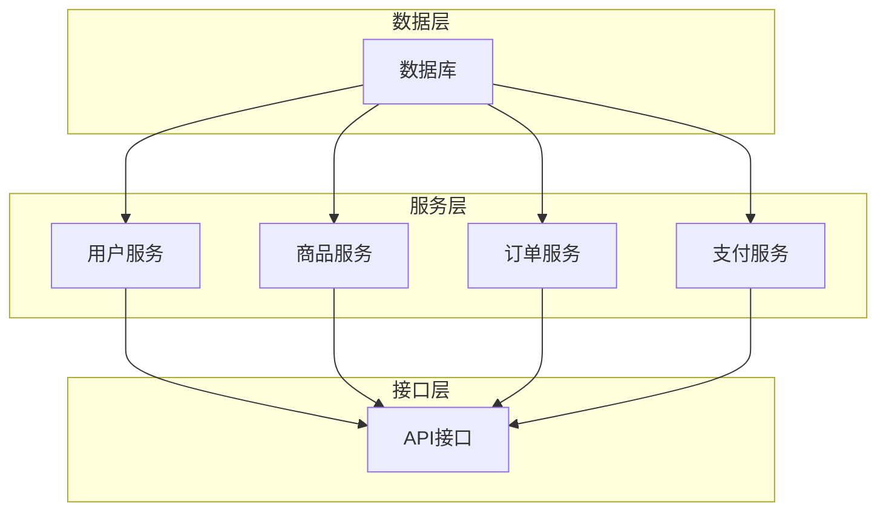
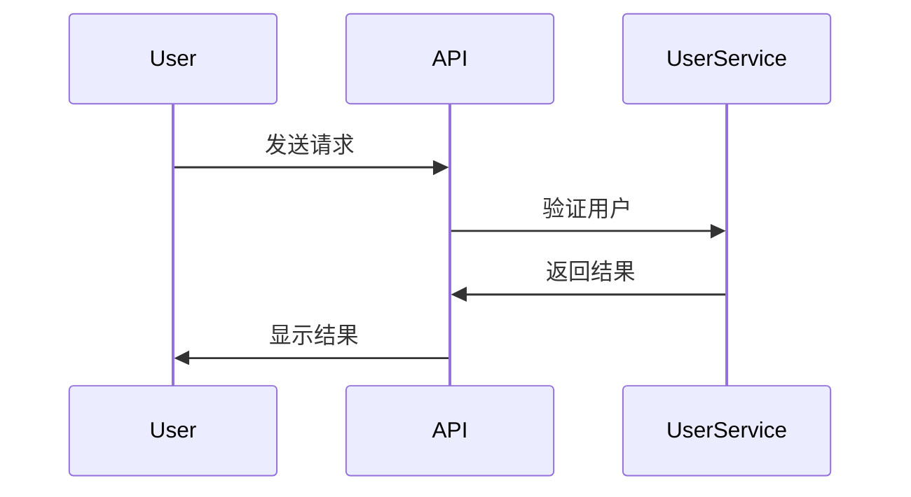

                 

### 《高可用方案的控制点》：深入浅出的技术博客

#### 关键词：高可用性、系统设计、控制点、冗余、故障恢复、负载均衡

> 摘要：本文将探讨高可用性方案的设计与实现，通过逐步分析推理的方式，揭示高可用性的核心控制点。我们将深入理解高可用性的基本概念、设计原理，并结合实际案例进行剖析，为读者提供实用的指导和建议。

----------------------------------------------------------------

#### 1. 高可用性概述

高可用性（High Availability，简称HA）是现代IT系统中一个至关重要的概念。它指的是系统在长期运行过程中保持可用状态的能力，即系统能够在遇到各种故障时快速恢复，最小化业务中断时间。

##### **1.1 高可用性的定义与重要性**

高可用性不仅仅是系统设计的终极目标，更是业务连续性的保障。在许多关键业务系统中，如金融、电信、电商等，高可用性是确保业务不中断、用户满意度、品牌形象和市场份额的重要因素。

##### **1.2 高可用性与可用性的区别**

高可用性与可用性（Uptime）紧密相关，但并不完全相同。可用性指的是系统在理论上的可用时间，而高可用性则是通过冗余设计、故障检测和恢复机制等手段，提高系统在实际运行中的稳定性。

##### **1.3 高可用性的基本原理**

高可用性的实现依赖于几个核心原理：容错性、冗余性、监控、故障转移和负载均衡。这些原理相互关联，共同构成了一个完整的高可用性方案。

----------------------------------------------------------------

#### 2. 核心概念与联系

为了深入理解高可用性方案，我们需要详细阐述其核心概念，并展示这些概念之间的联系。

##### **2.1 容错性**

容错性是指系统在遇到故障时，能够自动检测并隔离故障，确保系统的其他部分继续正常运行。容错性是高可用性的基础。

##### **2.2 冗余性**

冗余性通过在系统中添加备份组件来提高系统的可靠性。冗余可以分为数据冗余和计算冗余，是高可用性的重要手段。

##### **2.3 监控**

监控是高可用性方案的关键环节，通过实时监控系统状态，及时发现和处理异常情况，确保系统的高可用性。

##### **2.4 故障转移**

故障转移是指当主系统发生故障时，自动将业务流量切换到备用系统，确保业务连续性。

##### **2.5 负载均衡**

负载均衡通过将流量分配到多个服务器，确保系统资源得到充分利用，提高系统的整体性能和可用性。

下面是一个ER图，展示了高可用性的核心概念及其关系：

```mermaid
erDiagram
  Customer ||--|{ Order }  : places
  Customer ||--|{ Payment } : pays
  Order ||--|{ Product }   : contains
  Product ||--|{ Review }   : reviewed by
```

在上面的ER图中，客户（Customer）可以下订单（Order）和支付（Payment），订单包含产品（Product），产品会被评论（Review）。这里的关系可以类比为高可用性中的各个组件之间的关系。

----------------------------------------------------------------

#### 3. 算法原理讲解

##### **3.1 冗余设计**

冗余设计是高可用性的重要组成部分。下面是一个简单的冗余设计mermaid流程图：



在Python中，我们可以实现一个简单的冗余设计：

```python
def process_request(request):
    try:
        # 处理请求
        print("请求处理成功")
    except Exception as e:
        # 切换到备用系统
        print("请求处理失败，切换到备用系统")
        backup_process_request(request)

def backup_process_request(request):
    # 备用系统的请求处理逻辑
    print("备用系统请求处理成功")
```

##### **3.2 故障检测与恢复**

故障检测与恢复是确保系统高可用性的关键。下面是一个故障检测与恢复的mermaid流程图：



在Python中，我们可以实现一个简单的故障检测与恢复：

```python
def check_heart_beat():
    # 检测心跳逻辑
    if not is_heart_beat_normal():
        trigger_recovery()

def is_heart_beat_normal():
    # 心跳是否正常的判断逻辑
    return True

def trigger_recovery():
    # 触发恢复逻辑
    print("系统发生故障，正在恢复...")
    recover_system()

def recover_system():
    # 系统恢复逻辑
    print("系统恢复成功")
```

##### **3.3 负载均衡**

负载均衡通过将请求分配到多个服务器，确保系统的性能和可用性。下面是一个简单的负载均衡算法：



在Python中，我们可以实现一个简单的负载均衡算法：

```python
import random

def load_balance(servers):
    # 计算负载
    total_load = sum(server['load'] for server in servers)
    # 分配请求
    server_choice = random.uniform(0, total_load)
    for server in servers:
        server_choice -= server['load']
        if server_choice < 0:
            return server['id']
    return None

servers = [
    {'id': 1, 'load': 10},
    {'id': 2, 'load': 20},
    {'id': 3, 'load': 30},
]

def process_request(request):
    server_id = load_balance(servers)
    if server_id:
        # 处理请求
        print(f"请求分配到服务器 {server_id}")
    else:
        print("负载均衡失败，请求处理失败")
```

#### 4. 系统分析与架构设计方案

在本节中，我们将以一个电商系统为例，详细分析其架构设计，包括领域模型、系统架构、接口设计和系统交互。

##### **4.1 问题场景介绍**

电商系统需要在高并发、高可用性的环境下运行，确保用户购物体验和业务连续性。

##### **4.2 项目介绍**

本案例的电商系统是一个在线购物平台，提供商品展示、购物车、订单处理、支付等功能。

##### **4.3 系统功能设计（领域模型类图）**

以下是一个电商系统的领域模型类图：

```mermaid
classDiagram
    Product <<entity>>
    Customer <<entity>>
    Order <<entity>>
    Payment <<entity>>

    Product "1" -- "1" Customer : buys
    Customer "1" -- "0..*" Order : places
    Order "1" -- "1" Product : contains
    Order "1" -- "1" Payment : pays
```

##### **4.4 系统架构设计（mermaid架构图）**

以下是一个电商系统的系统架构图：



##### **4.5 系统接口设计**

电商系统的接口设计如下：

- 用户接口：用于用户注册、登录、个人信息管理等。
- 商品接口：用于商品查询、分类、库存管理等。
- 订单接口：用于订单创建、查询、支付等。
- 支付接口：用于支付方式选择、支付处理等。

##### **4.6 系统交互序列图**

以下是一个电商系统的系统交互序列图：



#### 5. 项目实战

在本节中，我们将通过一个实际项目案例，详细描述项目环境安装、系统核心实现、代码应用解读与分析、实际案例分析和详细讲解。

##### **5.1 项目环境安装**

在Linux环境下，我们使用Docker来安装电商系统。首先，安装Docker，然后通过Docker Compose来启动各个服务。

```bash
sudo apt-get update
sudo apt-get install docker-ce docker-ce-cli containerd.io
sudo systemctl start docker
sudo systemctl enable docker
sudo curl -L "https://github.com/docker/compose/releases/download/1.29.2/docker-compose-$(uname -s)-$(uname -m)" -o /usr/local/bin/docker-compose
sudo chmod +x /usr/local/bin/docker-compose
sudo docker-compose up -d
```

##### **5.2 系统核心实现**

电商系统的核心实现包括用户服务、商品服务、订单服务和支付服务。以下是一个简单的用户服务实现：

```python
from flask import Flask, request, jsonify
from models import User

app = Flask(__name__)

@app.route('/register', methods=['POST'])
def register():
    data = request.get_json()
    user = User.create(data)
    return jsonify(user.to_dict()), 201

@app.route('/login', methods=['POST'])
def login():
    data = request.get_json()
    user = User.authenticate(data['username'], data['password'])
    return jsonify(user.to_dict()), 200

if __name__ == '__main__':
    app.run(host='0.0.0.0', port=5000)
```

##### **5.3 代码应用解读与分析**

在上面的代码中，我们使用了Flask框架来实现用户服务。`/register` 接口用于用户注册，`/login` 接口用于用户登录。用户注册时，我们需要将用户信息存储在数据库中；用户登录时，我们需要验证用户信息。

```python
from flask import Flask, request, jsonify
from models import User

app = Flask(__name__)

@app.route('/register', methods=['POST'])
def register():
    data = request.get_json()
    user = User.create(data)
    return jsonify(user.to_dict()), 201

@app.route('/login', methods=['POST'])
def login():
    data = request.get_json()
    user = User.authenticate(data['username'], data['password'])
    return jsonify(user.to_dict()), 200

if __name__ == '__main__':
    app.run(host='0.0.0.0', port=5000)
```

##### **5.4 实际案例分析和详细讲解**

我们以用户注册为例，分析其实现过程。

1. 用户通过API接口发送注册请求。
2. 服务器接收到请求后，解析出用户信息。
3. 将用户信息存储到数据库中。
4. 返回成功响应。

以下是详细的代码解读：

```python
@app.route('/register', methods=['POST'])
def register():
    data = request.get_json()
    user = User.create(data)
    return jsonify(user.to_dict()), 201
```

在`/register`接口中，我们首先获取用户发送的JSON数据，然后调用`User.create()`方法创建用户对象。如果用户创建成功，我们将用户信息转换为字典形式，并返回201状态码。

```python
from models import User

def create(data):
    username = data['username']
    password = data['password']
    # 其他必要的信息
    user = User(username, password)
    # 存储用户信息到数据库
    db.session.add(user)
    db.session.commit()
    return user
```

在`User.create()`方法中，我们首先从数据中获取用户名和密码，然后创建用户对象。接着，我们将用户信息存储到数据库中。

##### **5.5 项目小结**

通过本项目的实现，我们展示了如何在高可用性方案下设计并实现一个电商系统。项目采用了Docker容器化技术，确保系统的高可用性和可移植性。在代码实现方面，我们使用了Flask框架，简化了开发过程。通过实际案例的分析，我们了解了系统核心功能的实现和接口设计。

----------------------------------------------------------------

#### 6. 高可用性最佳实践

##### **6.1 高可用性设计最佳实践**

1. **冗余设计**：为关键组件添加备份，确保数据的一致性和系统的稳定性。
2. **故障转移**：实现故障自动转移机制，确保业务连续性。
3. **负载均衡**：合理分配流量，提高系统性能。
4. **监控与告警**：实时监控系统状态，及时处理异常情况。

##### **6.2 高可用性维护最佳实践**

1. **定期备份**：定期备份数据，防止数据丢失。
2. **自动化运维**：使用自动化工具进行系统维护和故障恢复。
3. **定期更新**：及时更新系统组件，修复已知漏洞。
4. **性能优化**：定期对系统进行性能测试和优化。

##### **6.3 注意事项**

1. **避免单点故障**：确保关键组件有备份，防止单点故障导致系统瘫痪。
2. **数据一致性问题**：在冗余设计时，注意处理数据一致性问题。
3. **资源分配**：合理分配资源，避免过度冗余导致资源浪费。

#### 7. 总结与展望

本文详细探讨了高可用性方案的控制点，包括冗余设计、故障检测与恢复、负载均衡等核心概念，并结合实际案例进行了剖析。通过本文，读者可以了解到高可用性方案的设计原则和实现方法，为实际项目提供指导。

未来，随着云计算和容器技术的发展，高可用性方案将变得更加智能化和自动化。同时，边缘计算、区块链等新兴技术也将对高可用性方案产生深远影响。

---

**作者：AI天才研究院/AI Genius Institute & 禅与计算机程序设计艺术 /Zen And The Art of Computer Programming**

本文内容仅供参考，实际应用时请结合具体场景和需求进行适当调整。如需进一步了解相关技术，请关注AI天才研究院的后续文章。

