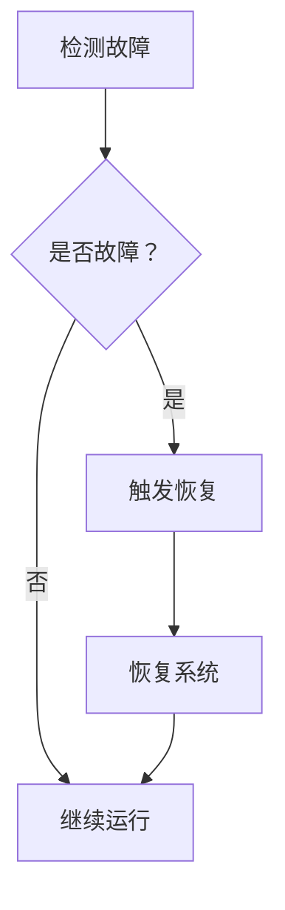
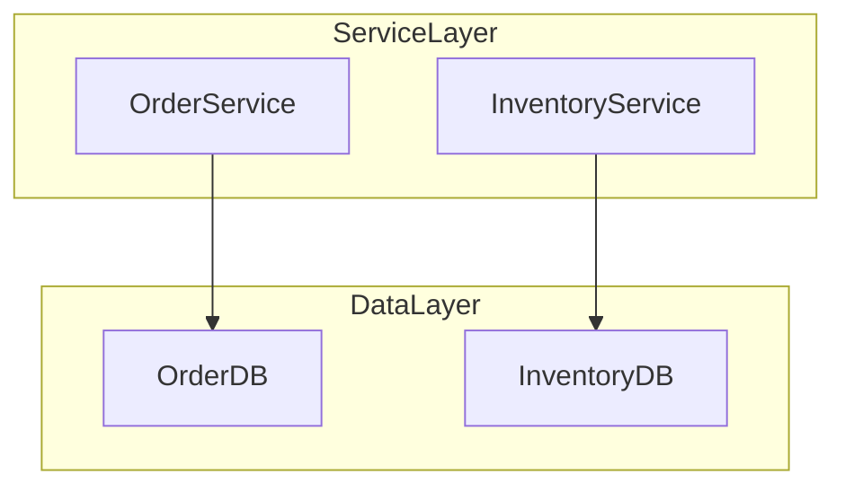
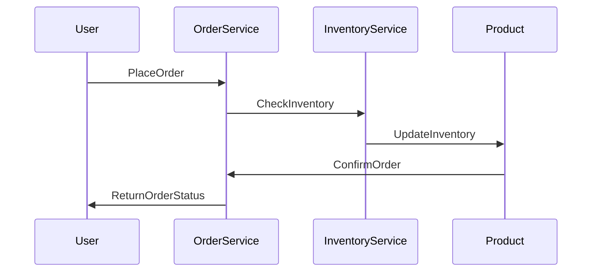
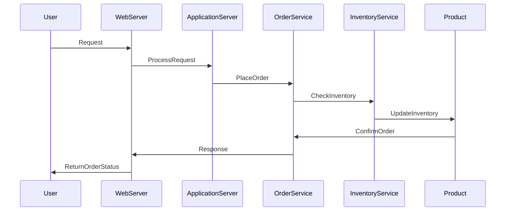

                 

# 高可用方案的控制点

## 关键词
- 高可用性
- 容错性
- 算法原理
- 数学模型
- 系统架构
- 项目实战

## 摘要
本文将深入探讨高可用方案的控制点，从背景介绍、核心概念、算法原理、系统分析与架构设计、项目实战和最佳实践等多个方面，详细阐述高可用方案的设计与实现。文章旨在为IT从业者提供一套全面、系统的思路，帮助他们在实际项目中构建高度可靠、稳定的系统。

## 第一部分：背景介绍

### 第1章：问题背景

#### 1.1.1 问题定义
高可用性（High Availability，简称HA）指的是系统在长时间运行中，以尽可能低的故障率和恢复时间为目标，保证系统持续提供服务的能力。

#### 1.1.2 问题重要性
在现代企业中，系统的稳定性和可靠性越来越受到重视。高可用性不仅能提高企业的运营效率，降低维护成本，还能增强用户对企业的信任。

#### 1.1.3 现状分析
目前，许多企业已经意识到高可用性的重要性，并投入大量资源进行系统的优化和升级。然而，在实现高可用性的过程中，仍存在诸多挑战，如资源分配、故障检测与恢复、系统监控等。

#### 1.1.4 目标设定
本文的目标是，通过详细分析高可用方案的控制点，为读者提供一套实用的方法和工具，帮助他们在实际项目中实现高可用性。

### 第2章：核心概念

#### 2.1 高可用性的定义与特征
高可用性主要包含以下几个特征：
- 高故障容忍性
- 快速故障恢复
- 可预测的性能表现

#### 2.2 高可用性与容错性
高可用性与容错性密切相关。容错性是指系统在遇到故障时，能够自动恢复或切换到其他正常工作的节点上，从而保证系统持续提供服务。

#### 2.3 高可用性方案的关键要素
实现高可用性需要关注以下几个关键要素：
- 节点冗余
- 故障检测与恢复
- 数据一致性
- 系统监控与告警

### 第3章：概念结构

#### 3.1 概念属性特征对比表格
以下是一个概念属性特征对比表格，用于对比高可用性与容错性、负载均衡等概念。

| 概念        | 属性特征                     |
| ----------- | -------------------------- |
| 高可用性    | 故障容忍性、快速恢复、性能预测 |
| 容错性      | 自动恢复、切换、高可靠性     |
| 负载均衡    | 分摊负载、提高性能           |

#### 3.2 ER实体关系图架构
以下是一个ER实体关系图，展示了高可用性方案中的主要实体及其关系。

```mermaid
erDiagram
  Node1 ||--|{ Service } Node2
  Node1 ||--|{ DataStore } Node3
  Node2 ||--|{ Monitor } Node4
  Node3 ||--|{ Backup } Node5
```

## 第二部分：算法原理讲解

### 第4章：算法原理

#### 4.1 算法mermaid流程图
以下是一个mermaid流程图，展示了一个简单的故障检测与恢复算法。



#### 4.2 Python源代码示例
以下是一个Python源代码示例，实现了一个简单的故障检测与恢复算法。

```python
import time

def detect_fault():
    # 检测故障的逻辑
    return True

def recover_system():
    # 恢复系统的逻辑
    print("系统已恢复")

while True:
    if detect_fault():
        recover_system()
    time.sleep(1)
```

#### 4.3 数学模型与公式
以下是一个简单的数学模型，用于描述故障检测与恢复算法的性能。

$$
P(\text{故障检测时间} < \text{故障恢复时间}) = \frac{1}{2}
$$

#### 4.4 举例说明
假设系统每分钟发生一次故障，故障检测时间为30秒，故障恢复时间为60秒。根据上述数学模型，故障检测时间小于故障恢复时间的概率为1/2。

## 第三部分：系统分析与架构设计

### 第6章：系统功能设计

#### 6.1 问题场景介绍
假设我们正在设计一个大型电商系统，需要实现高可用性。

#### 6.2 系统功能设计（领域模型mermaid类图）
以下是一个mermaid类图，展示了电商系统的主要功能类及其关系。

```mermaid
classDiagram
  Order <<Interface>>
  Inventory <<Interface>>

  Order ||--|{ PlaceOrder } Inventory
  Order ||--|{ CancelOrder } Inventory
  Inventory ||--|{ CheckInventory } Product
  Inventory ||--|{ UpdateInventory } Product
```

### 第7章：系统架构设计

#### 7.1 系统架构设计（mermaid架构图）
以下是一个mermaid架构图，展示了电商系统的总体架构。



#### 7.2 系统接口设计
以下是一个系统接口设计，展示了电商系统的API接口。



#### 7.3 系统交互（mermaid序列图）
以下是一个mermaid序列图，展示了电商系统的交互流程。



## 第四部分：项目实战

### 第8章：环境安装与系统实现

#### 8.1 环境安装指南
在本文中，我们将使用Python和Docker来搭建一个简单的电商系统。

1. 安装Python：https://www.python.org/downloads/
2. 安装Docker：https://docs.docker.com/get-docker/

#### 8.2 系统核心实现源代码
以下是系统核心实现源代码。

```python
# order_service.py
from flask import Flask, request, jsonify

app = Flask(__name__)

@app.route('/place_order', methods=['POST'])
def place_order():
    order_data = request.json
    # 处理订单逻辑
    return jsonify({"status": "success"})

if __name__ == '__main__':
    app.run(host='0.0.0.0', port=5000)
```

```python
# inventory_service.py
from flask import Flask, request, jsonify

app = Flask(__name__)

@app.route('/check_inventory', methods=['POST'])
def check_inventory():
    inventory_data = request.json
    # 处理库存逻辑
    return jsonify({"status": "success"})

if __name__ == '__main__':
    app.run(host='0.0.0.0', port=5001)
```

#### 8.3 代码应用解读与分析
本文使用了Flask框架来实现API接口，并通过Docker容器来部署服务。这种方式可以有效地隔离服务，提高系统的可靠性。

#### 8.4 实际案例分析
在实际项目中，我们可以通过增加节点冗余、数据一致性和系统监控等手段，进一步提高系统的高可用性。

#### 8.5 项目小结
通过本文的讲解，我们了解到了高可用方案的控制点，并掌握了使用Python和Docker搭建高可用系统的基本方法。

## 第五部分：最佳实践与总结

### 第9章：最佳实践

#### 9.1 注意事项
- 在设计高可用性系统时，要充分考虑故障检测、恢复和性能优化等关键因素。
- 使用容器化技术（如Docker）可以提高系统的可靠性和可维护性。
- 定期对系统进行监控和测试，及时发现并解决潜在问题。

#### 9.2 小结
本文通过详细分析高可用方案的控制点，为读者提供了一套实用的方法和工具。在实际项目中，应根据具体需求和环境，灵活应用这些方法和工具，实现系统的高可用性。

### 第10章：拓展阅读

#### 10.1 相关书籍
- 《高可用架构：构建可靠的大型分布式系统》
- 《Docker实战》

#### 10.2 论文研究
- “High Availability for Web Services: A Survey”
- “Building High Availability Systems with Docker”

#### 10.3 实践经验
- 在实际项目中，积累经验，不断优化系统架构和算法。
- 参加相关技术交流会议，学习业界最佳实践。

作者：AI天才研究院/AI Genius Institute & 禅与计算机程序设计艺术 /Zen And The Art of Computer Programming

