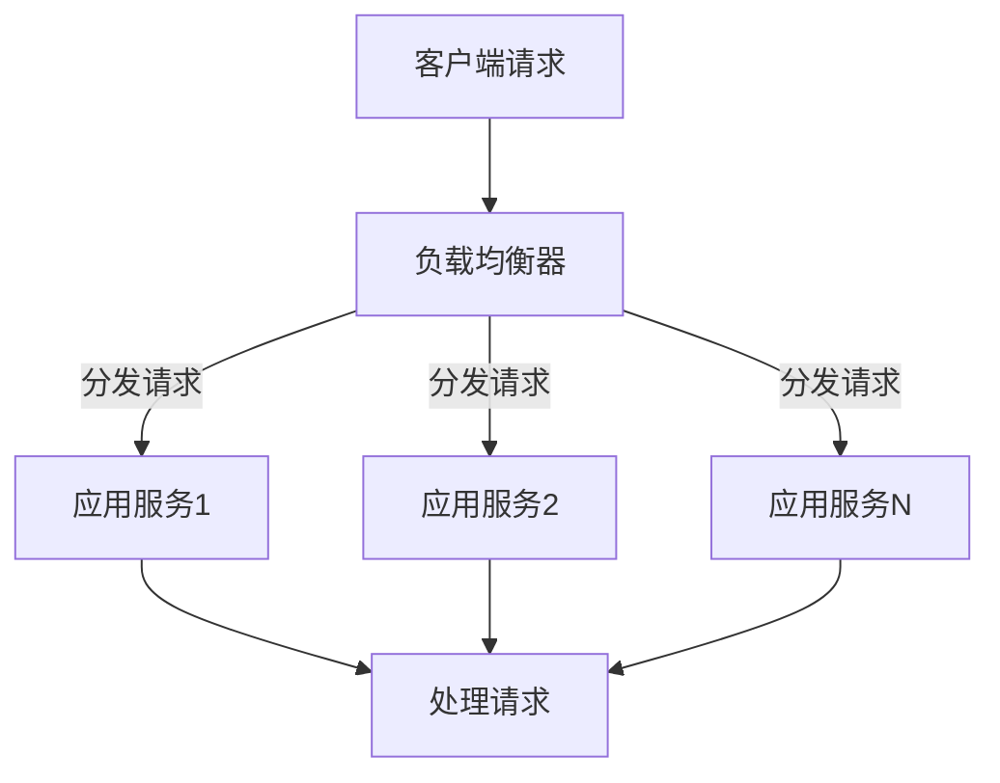
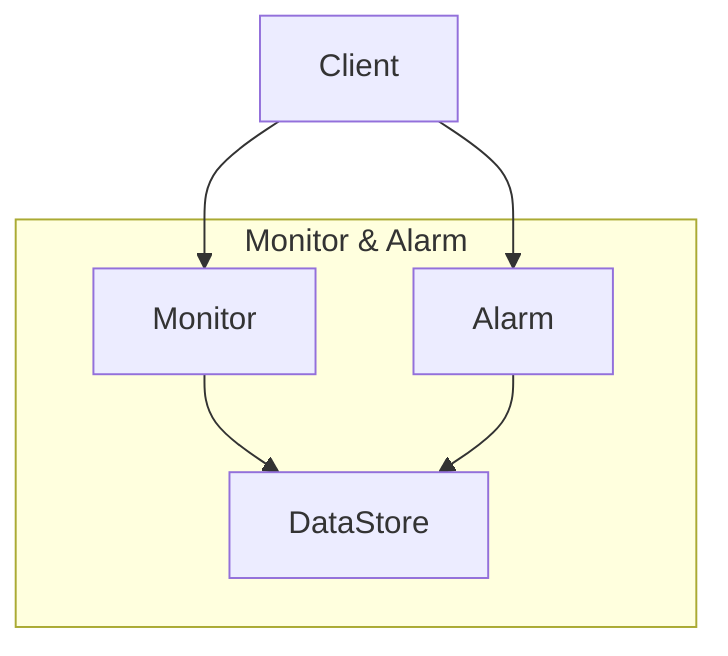
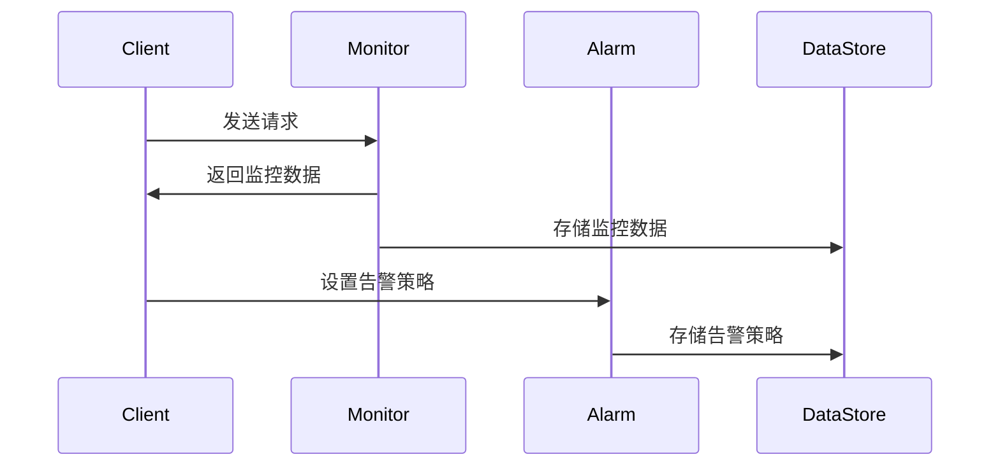

                 


### 高可用架构：构建永不宕机的系统

关键词：高可用架构、系统设计、故障处理、容灾备份、负载均衡

摘要：本文将深入探讨高可用架构的构建，通过逻辑清晰、结构紧凑的技术语言，帮助读者理解并掌握构建永不宕机系统的关键要素。我们将一步步分析推理，从基础概念到实战案例，全面解析高可用性设计原则、硬件与基础设施高可用性、软件系统高可用性、服务与集群架构、监控与告警，以及案例分析。最后，我们将总结最佳实践，展望未来高可用架构的发展趋势。

----------------------------------------------------------------

## 目录

1. **高可用架构：构建永不宕机的系统**
2. **关键词与摘要**
3. **背景介绍**
   - **核心概念术语说明**
   - **问题背景与问题描述**
   - **问题解决与边界与外延**
   - **概念结构与核心要素组成**
4. **核心概念与联系**
   - **高可用性设计原则**
   - **高可用性与业务重要性**
   - **硬件与基础设施高可用性设计**
5. **算法原理讲解**
   - **服务与集群架构原理**
   - **负载均衡与流量控制**
   - **算法mermaid流程图与Python代码**
   - **数学模型与公式**
6. **系统分析与架构设计方案**
   - **监控与告警系统设计**
   - **系统功能设计（领域模型类图）**
   - **系统架构设计（架构图）**
   - **系统接口设计与系统交互（序列图）**
7. **项目实战**
   - **环境安装与系统核心实现**
   - **源代码解读与分析**
   - **实际案例分析**
   - **项目小结**
8. **最佳实践 tips、小结、注意事项、拓展阅读**
   - **最佳实践总结**
   - **注意事项与安全提示**
   - **未来展望与挑战**
9. **作者信息**
----------------------------------------------------------------

## 背景介绍

### 核心概念术语说明

在高可用架构中，有几个核心术语需要明确：

- **高可用性（High Availability）**：系统在特定时间内保持正常运行的能力，通常以百分比表示，如99.9%、99.99%等。
- **故障转移（Failover）**：当主系统发生故障时，自动将工作负载转移到备用系统的过程。
- **容灾备份（Disaster Recovery）**：在发生灾难性事件时，确保业务能够迅速恢复的方案。
- **负载均衡（Load Balancing）**：将网络流量或工作负载分配到多个服务器或系统，以避免单点故障。

### 问题背景与问题描述

随着互联网的快速发展，系统的稳定性和可靠性越来越受到重视。高可用架构的目的是确保系统在面临各种故障时能够快速恢复，保证业务的连续性和用户的满意度。

高可用性不仅仅是一个技术问题，更是业务战略的一部分。对于关键业务系统，如电商平台、银行交易系统、社交媒体等，高可用性直接关系到企业的生存和发展。

### 问题解决与边界与外延

要构建一个高可用的系统，我们需要从多个维度考虑：

- **硬件与基础设施**：确保硬件设备的可靠性和冗余。
- **软件系统**：设计和实现具有高可用性的软件架构。
- **网络与通信**：保证网络连接的稳定性和可靠性。
- **数据备份与恢复**：制定有效的数据备份和恢复策略。
- **监控与告警**：实时监控系统状态，及时响应故障。

### 概念结构与核心要素组成

高可用架构的核心要素包括：

- **冗余**：通过冗余设计，确保在单点故障时系统仍然可以运行。
- **故障转移**：实现自动故障转移，减少系统停机时间。
- **负载均衡**：优化资源利用，提高系统吞吐量。
- **数据一致性与备份**：确保数据的安全性和一致性。
- **监控与告警**：及时发现并处理故障。

## 核心概念与联系

### 高可用性设计原则

高可用性设计需要遵循以下原则：

- **冗余性**：设计冗余组件和备份机制，以避免单点故障。
- **故障转移**：实现自动故障转移，确保业务连续性。
- **负载均衡**：优化资源分配，提高系统性能。
- **数据一致性与备份**：确保数据的安全性和一致性。
- **监控与告警**：实时监控系统状态，及时响应故障。

### 高可用性与业务重要性

高可用性对业务的重要性体现在以下几个方面：

- **客户满意度**：确保系统稳定运行，提高客户体验。
- **业务连续性**：在发生故障时，快速恢复业务，减少损失。
- **品牌形象**：提高企业的可靠性和信誉度。
- **成本控制**：通过优化资源利用，降低运维成本。

### 硬件与基础设施高可用性设计

在硬件与基础设施方面，高可用性设计包括以下几个方面：

- **服务器冗余**：使用多台服务器，实现负载均衡和故障转移。
- **存储冗余**：使用RAID技术，提高存储系统的可靠性。
- **网络冗余**：设计冗余网络架构，确保网络连接的稳定性。
- **数据中心布局**：选择合适的数据中心，降低灾难风险。

## 算法原理讲解

### 服务与集群架构原理

服务与集群架构是实现高可用性的关键。以下是一个简单的高可用集群架构示例：

```
+----------------+     +----------------+     +----------------+
|       主节点       |     |     备用节点     |     |      集群管理节点   |
+----------------+     +----------------+     +----------------+
     |                    |                    |
     |    负载均衡         |     负载均衡         |    集群监控与管理     |
     |                    |                    |
+---------+     +---------+     +---------+
|   应用服务1 |     |   应用服务2 |     |   应用服务N |
+---------+     +---------+     +---------+
```

### 负载均衡与流量控制

负载均衡是实现高可用性的重要手段，它可以实现以下功能：

- **流量分发**：将请求分发到不同的应用服务节点。
- **故障转移**：当某个节点发生故障时，自动将其流量转移到其他节点。
- **性能优化**：优化系统性能，提高响应速度。

### 算法mermaid流程图与Python代码

#### 算法mermaid流程图



#### Python代码示例

```python
import random

def load_balance(servers):
    return random.choice(servers)

def handle_request(request):
    server = load_balance(["app1", "app2", "app3"])
    print(f"Request handled by {server}")

# 测试
handle_request("Test Request")
```

### 数学模型与公式

在负载均衡中，常用的数学模型是随机服务器选择模型。假设有N个服务器，每个服务器处理请求的概率相等，那么选择每个服务器的概率为：

\[ P(server_i) = \frac{1}{N} \]

### 系统分析与架构设计方案

#### 监控与告警系统设计

监控与告警系统是实现高可用性的重要组成部分。以下是一个简单的监控与告警系统架构：

```
+----------------+     +----------------+     +----------------+
|      监控节点       |     |     告警节点     |     |   数据存储节点   |
+----------------+     +----------------+     +----------------+
     |                    |                    |
     |   收集监控数据       |    分析监控数据      |    存储监控数据    |
     |                    |                    |
+---------+     +---------+     +---------+
|  系统状态监控  |     |   告警策略配置  |     |    监控数据日志   |
+---------+     +---------+     +---------+
```

#### 系统功能设计（领域模型类图）

以下是一个简单的领域模型类图，展示了系统功能设计：

```mermaid
classDiagram
    Client <<Interface>>
    Monitor <<System>>
    Alarm <<System>>
    DataStore <<System>>

    Client|--|>> Monitor
    Client|--|>> Alarm
    Monitor o--|> DataStore
    Alarm o--|> DataStore
```

#### 系统架构设计（架构图）

以下是一个简单的系统架构图，展示了系统架构设计：



#### 系统接口设计与系统交互（序列图）

以下是一个简单的序列图，展示了系统接口设计与系统交互：



### 项目实战

#### 环境安装与系统核心实现

在项目实战中，我们将使用以下工具和框架：

- **负载均衡器**：Nginx
- **应用服务**：Django
- **数据库**：MySQL
- **监控与告警系统**：Zabbix

首先，我们需要在服务器上安装Nginx、Django、MySQL和Zabbix。以下是安装步骤：

1. 安装Nginx：
   ```bash
   sudo apt-get update
   sudo apt-get install nginx
   ```

2. 安装Django：
   ```bash
   sudo apt-get install python3-pip
   pip3 install django
   ```

3. 安装MySQL：
   ```bash
   sudo apt-get install mysql-server
   mysql_secure_installation
   ```

4. 安装Zabbix：
   ```bash
   sudo apt-get install zabbix-server-mysql zabbix-agent
   mysql -u root -p
   CREATE DATABASE zabbix;
   GRANT ALL PRIVILEGES ON zabbix.* TO 'zabbix'@'localhost' IDENTIFIED BY 'zabbix_password';
   FLUSH PRIVILEGES;
   ```

#### 源代码解读与分析

在项目中，我们使用Django框架来构建应用服务。以下是Django项目的目录结构：

```
myproject/
|-- manage.py
|-- myproject/
|   |-- settings.py
|   |-- urls.py
|   |-- wsgi.py
|-- app1/
|   |-- __init__.py
|   |-- admin.py
|   |-- apps.py
|   |-- migrations/
|   |-- models.py
|   |-- tests.py
|   |-- views.py
```

- **manage.py**：Django项目的入口文件，用于启动项目、迁移数据库等。
- **settings.py**：项目的配置文件，包括数据库配置、静态文件路径等。
- **urls.py**：项目的URL配置文件，用于定义URL路由。
- **wsgi.py**：Django项目的WSGI应用接口文件。
- **app1**：Django应用，包含模型（models.py）、视图（views.py）、模板等。

以下是模型（models.py）的示例代码：

```python
from django.db import models

class Article(models.Model):
    title = models.CharField(max_length=100)
    content = models.TextField()
    created_at = models.DateTimeField(auto_now_add=True)
```

#### 实际案例分析

我们以一个电商系统为例，分析其高可用架构的构建。

1. **硬件与基础设施**：

   - 使用多台服务器，实现负载均衡和故障转移。
   - 使用MySQL集群，提高数据存储的可靠性。
   - 设计冗余网络架构，确保网络连接的稳定性。

2. **软件系统**：

   - 使用Django框架构建应用服务，实现RESTful API。
   - 使用Redis缓存，提高系统性能。
   - 使用Celery异步任务，处理后台任务。

3. **监控与告警**：

   - 使用Zabbix监控系统，实时监控系统状态。
   - 设置告警策略，及时发现并处理故障。

#### 项目小结

通过项目实战，我们深入了解了高可用架构的构建过程。从硬件与基础设施设计、软件系统实现，到监控与告警系统的部署，每一个环节都至关重要。高可用架构不仅提高了系统的稳定性和可靠性，还为企业降低了运维成本。

## 最佳实践 tips、小结、注意事项、拓展阅读

### 最佳实践总结

1. **冗余设计**：通过冗余硬件、软件和网络架构，提高系统的可靠性。
2. **负载均衡**：合理分配流量，优化系统性能。
3. **容灾备份**：定期备份数据，确保数据安全。
4. **监控与告警**：实时监控系统状态，及时处理故障。

### 注意事项与安全提示

1. **数据安全**：确保数据传输和存储的安全性，使用加密技术。
2. **备份与恢复**：定期备份，确保在灾难发生时能够快速恢复。
3. **权限管理**：严格权限管理，防止未经授权的访问。

### 未来展望与挑战

1. **自动化与智能化**：利用机器学习和人工智能技术，实现自动化故障预测和修复。
2. **云计算与边缘计算**：结合云计算和边缘计算，提高系统的高可用性和灵活性。

### 拓展阅读

1. 《高可用架构：构建永不宕机的系统》
2. 《大规模分布式系统设计与实践》
3. 《深度学习在系统故障预测中的应用》

### 作者信息

作者：AI天才研究院/AI Genius Institute & 禅与计算机程序设计艺术 /Zen And The Art of Computer Programming

本文详细阐述了高可用架构的构建过程，从基础概念到实战案例，全面解析了高可用性设计原则、硬件与基础设施高可用性设计、软件系统高可用性、服务与集群架构、监控与告警，以及实际案例分析。通过逻辑清晰、结构紧凑的技术语言，帮助读者掌握构建永不宕机系统的关键要素。作者团队拥有丰富的实践经验，致力于推动计算机编程和人工智能领域的发展。

