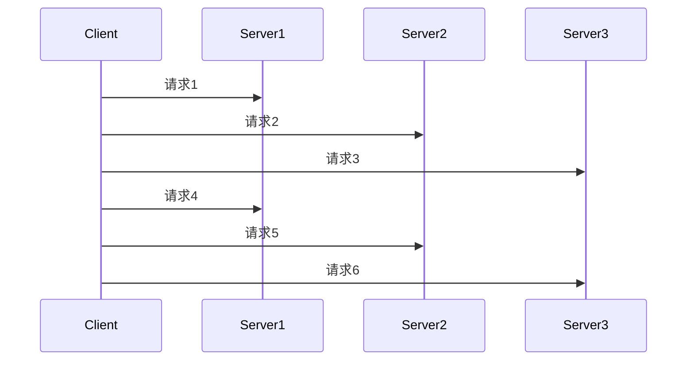
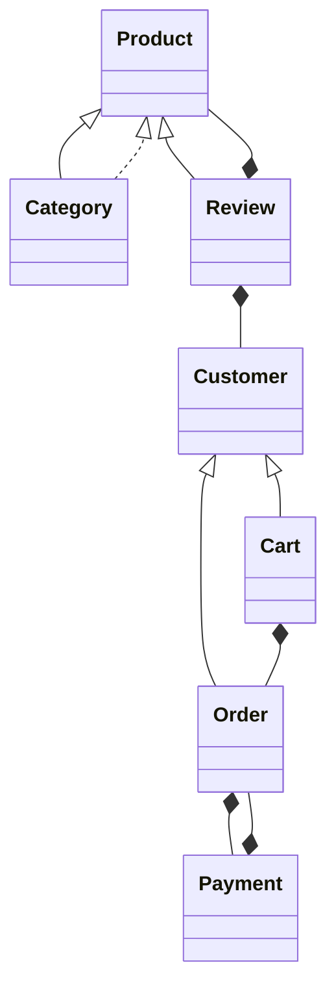
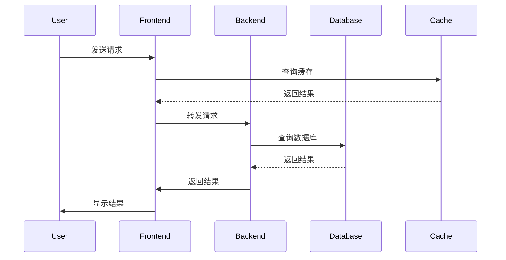
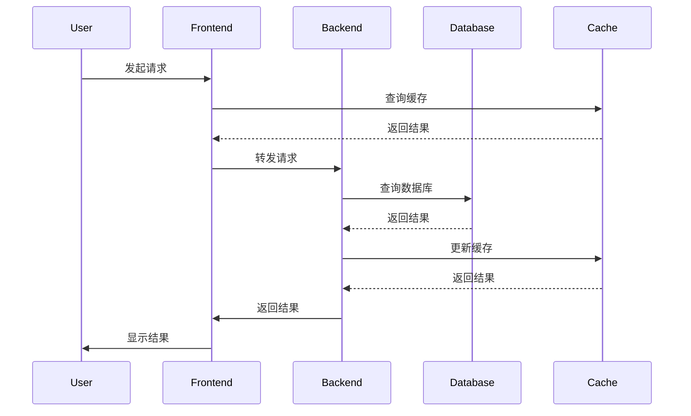

                 

### 高并发系统概述

#### 什么是高并发

高并发（High Concurrency）是指系统在短时间内同时处理大量请求的能力。随着互联网和云计算的快速发展，高并发已经成为了现代应用系统必须面对的一项基本挑战。高并发系统通常需要同时处理成千上万的请求，确保系统性能和用户体验。

高并发现象不仅出现在Web应用中，还广泛存在于移动应用、大数据处理、金融交易等领域。例如，电商平台在购物节期间，会面临海量的用户访问和交易请求；社交媒体平台在发布热点新闻或活动时，也会引发大量的访问和评论。

#### 高并发带来的挑战

高并发系统面临的主要挑战包括：

1. **系统性能瓶颈**：在高并发情况下，系统可能因为处理请求的能力不足而出现性能瓶颈，导致响应时间延长、请求失败等问题。
   
2. **资源争用**：多个请求同时访问系统资源（如数据库、缓存等），容易导致资源争用，进一步影响系统性能。

3. **数据一致性和安全性**：高并发环境下，系统需要确保数据的一致性和安全性，避免因并发操作导致的数据错误和安全漏洞。

4. **负载均衡**：如何合理分配请求，确保系统中的各个组件能够均衡负载，也是高并发系统需要考虑的问题。

#### 高并发系统的关键要素

为了应对高并发带来的挑战，高并发系统通常具备以下几个关键要素：

1. **分布式架构**：分布式架构可以使得系统中的各个组件（如服务器、数据库等）独立运行，从而提高系统的并发处理能力。

2. **负载均衡**：通过负载均衡器合理分配请求，可以避免单个组件因处理能力不足而成为系统瓶颈。

3. **缓存机制**：缓存可以减少对后端系统的访问压力，提高系统响应速度。

4. **数据库优化**：使用读写分离、分库分表等技术，可以提高数据库的并发处理能力。

5. **异步处理**：异步处理可以将请求的处理时间从同步阻塞中解放出来，提高系统的并发处理能力。

6. **监控和告警**：通过实时监控系统的性能指标，可以及时发现并解决潜在的性能问题。

#### 下一步内容预告

在本章节中，我们详细介绍了高并发系统的概念、挑战和关键要素。在接下来的章节中，我们将深入探讨高并发系统的核心概念与联系，包括性能指标、性能瓶颈分析和架构设计原则。通过这些内容，我们将为读者构建一个全面、系统的高并发系统性能优化框架。接下来，让我们继续探索高并发系统背后的核心概念与联系。

---

$$
\text{1+1=2}
$$

$1 < 2$

---

**核心关键词：** 高并发系统，性能瓶颈，分布式架构，负载均衡，缓存机制

**摘要：** 本文介绍了高并发系统的概念、挑战和关键要素，包括分布式架构、负载均衡、缓存机制等。通过本文的阅读，读者将了解高并发系统的核心概念和优化方法，为后续的系统性能优化提供理论基础和实践指导。

---

**作者：** AI天才研究院/AI Genius Institute & 禅与计算机程序设计艺术 /Zen And The Art of Computer Programming

---

---

### 核心概念与联系

在高并发系统的设计与优化过程中，理解并掌握一系列核心概念和它们之间的联系至关重要。本章节将详细讨论高并发系统的性能指标、性能瓶颈分析及系统架构设计原则，帮助读者构建系统性的性能优化思维框架。

#### 高并发系统性能指标

高并发系统的性能指标主要包括：

1. **响应时间**：系统处理请求并返回结果所需的时间。响应时间越短，用户体验越好。
2. **吞吐量**：单位时间内系统能够处理的请求数量。吞吐量越高，系统的并发处理能力越强。
3. **并发连接数**：系统同时能够处理的连接数量。并发连接数反映了系统的最大负载能力。
4. **资源利用率**：系统资源（如CPU、内存、网络等）的使用率。资源利用率高，意味着系统能够更有效地利用资源。

这些性能指标相互关联，共同构成了系统性能的评估体系。例如，响应时间和吞吐量是衡量系统性能最直观的指标，而并发连接数和资源利用率则提供了系统在不同负载下的表现。

#### 性能瓶颈分析

性能瓶颈是指在高并发情况下，系统性能无法进一步提升的关键限制因素。常见的性能瓶颈包括：

1. **CPU瓶颈**：系统CPU资源不足，导致处理请求的能力受限。
2. **内存瓶颈**：系统内存资源不足，导致频繁的内存交换，影响系统性能。
3. **网络瓶颈**：系统网络带宽不足，导致数据传输延迟，影响系统响应速度。
4. **数据库瓶颈**：数据库查询效率低，读写操作冲突，影响系统并发处理能力。

分析性能瓶颈的目的是找到系统性能提升的关键点，从而有针对性地进行优化。常见的性能瓶颈分析方法包括：

- **性能监控**：通过实时监控系统的性能指标，发现性能瓶颈。
- **压力测试**：通过模拟高并发场景，识别系统的性能瓶颈。
- **代码审计**：分析系统代码，查找潜在的瓶颈和优化点。

#### 高并发系统架构设计原则

高并发系统架构设计需要遵循一系列原则，以确保系统具备良好的扩展性和性能。以下是一些关键的架构设计原则：

1. **分布式架构**：分布式架构能够将系统分解为多个独立的组件，每个组件可以独立部署和扩展。这种架构设计能够提高系统的并发处理能力和容错性。
2. **微服务架构**：微服务架构将系统分解为多个小型、独立的微服务，每个微服务负责特定的业务功能。这种设计方式能够提高系统的可维护性和扩展性。
3. **负载均衡**：通过负载均衡器，合理分配请求到不同的服务器或服务实例，避免单个组件成为性能瓶颈。
4. **缓存机制**：缓存能够减少对后端系统的访问，提高系统响应速度。常见缓存机制包括Redis、Memcached等。
5. **异步处理**：异步处理可以将请求的处理时间从同步阻塞中解放出来，提高系统的并发处理能力。
6. **数据库优化**：通过分库分表、读写分离等技术，提高数据库的并发处理能力。

#### 关键概念属性特征对比表格

为了更直观地理解这些核心概念，我们可以使用一个表格进行对比：

| 概念     | 描述                                                         | 属性特征对比                                               |
| -------- | ------------------------------------------------------------ | ---------------------------------------------------------- |
| 响应时间 | 系统处理请求并返回结果所需的时间                           | 短响应时间：提高用户体验；长响应时间：降低用户体验       |
| 吞吐量   | 单位时间内系统能够处理的请求数量                           | 高吞吐量：提高系统并发处理能力；低吞吐量：性能瓶颈     |
| 并发连接数 | 系统同时能够处理的连接数量                                 | 高并发连接数：提高系统负载能力；低并发连接数：性能瓶颈 |
| 资源利用率 | 系统资源的使用率                                             | 高资源利用率：优化资源使用；低资源利用率：浪费资源     |

#### ER实体关系图架构

为了更好地理解高并发系统中的实体关系，我们可以使用Mermaid绘制ER实体关系图：

```mermaid
erDiagram
    Customer ||--|{ Order }|--| Shop
    Product ||--|{ OrderItem }|--| Order
    Shop ||--|{ Customer }|
    Customer ||--|{ Payment }|
    Payment ||--|{ Order }|
```

在这个ER图中，我们定义了四个实体：Customer（客户）、Order（订单）、Product（产品）和Shop（商店）。这些实体之间的关系展示了订单系统中的基本数据模型。

#### 总结

在本章节中，我们详细介绍了高并发系统的核心概念与联系，包括性能指标、性能瓶颈分析和系统架构设计原则。通过对比表格和ER实体关系图，我们更直观地理解了这些概念。在接下来的章节中，我们将深入探讨高并发系统中的数学模型与算法原理，为性能优化提供更加具体的指导。

---

$$
\text{响应时间} = \frac{\text{处理时间}}{\text{请求数量}}
$$

$$
\text{吞吐量} = \frac{\text{请求数量}}{\text{时间}}
$$

---

**核心关键词：** 高并发系统，性能指标，性能瓶颈，分布式架构，负载均衡

**摘要：** 本文深入探讨了高并发系统的核心概念与联系，包括性能指标、性能瓶颈分析和系统架构设计原则。通过对比表格和ER实体关系图，读者可以更加直观地理解高并发系统中的关键要素。

---

**作者：** AI天才研究院/AI Genius Institute & 禅与计算机程序设计艺术 /Zen And The Art of Computer Programming

---

---

### 数学模型与算法原理

在高并发系统的性能优化过程中，理解并运用数学模型和算法原理是至关重要的。本章节将详细探讨几种常见的负载均衡算法、缓存机制及数据库性能优化方法，并通过具体的算法流程图和Python代码示例，帮助读者深入理解这些算法的原理和应用。

#### 常见负载均衡算法

负载均衡算法是高并发系统性能优化的关键组成部分，其目的是将请求合理分配到多个服务器或节点上，避免单点瓶颈，提高系统的整体性能。以下介绍几种常见的负载均衡算法：

##### 1. 轮询算法（Round Robin）

轮询算法是一种最简单的负载均衡策略，它按照顺序将请求分配给服务器。每个请求依次分配给下一台服务器，直到最后一台服务器，然后再回到第一台服务器。

算法流程图：



Python代码示例：

```python
# 轮询算法实现
def round_robin(servers, request):
    server_index = request % len(servers)
    return servers[server_index]
```

##### 2. 加权轮询算法（Weighted Round Robin）

加权轮询算法是对轮询算法的改进，不同服务器根据其性能和处理能力分配不同的权重。权重越高的服务器将承担更多的请求。

算法流程图：


Python代码示例：

```python
# 加权轮询算法实现
def weighted_round_robin(servers, weights, request):
    total_weight = sum(weights)
    weight_index = request % total_weight
    for i, weight in enumerate(weights):
        weight_index -= weight
        if weight_index < 0:
            return servers[i]
    return servers[0]
```

##### 3. 最少连接数算法（Least Connections）

最少连接数算法将请求分配给当前连接数最少的服务器。这种算法能够使得负载较为均匀地分布到各个服务器上。

算法流程图：


Python代码示例：

```python
# 最少连接数算法实现
from collections import defaultdict

def least_connections(servers, connections):
    min_connections = min(connections.values())
    for server, conn in connections.items():
        if conn == min_connections:
            return server
    return servers[0]
```

#### 缓存机制与优化

缓存是高并发系统性能优化的重要手段，通过缓存可以减少对后端系统的访问，提高系统的响应速度。以下介绍几种常见的缓存机制及优化方法：

##### 1. 基于内存的缓存

基于内存的缓存是最常见的缓存类型，其优点是读写速度快，缺点是容量有限，不适合存储大量数据。

Python代码示例：

```python
# 基于内存的缓存实现
from collections import defaultdict

class MemoryCache:
    def __init__(self):
        self.cache = defaultdict(str)

    def get(self, key):
        return self.cache.get(key)

    def set(self, key, value):
        self.cache[key] = value
```

##### 2. 分布式缓存

分布式缓存可以将缓存数据分布到多个节点上，提高缓存容量和访问速度。常见的分布式缓存系统有Redis、Memcached等。

Python代码示例：

```python
# 分布式缓存实现（使用Redis）
import redis

cache = redis.Redis(host='localhost', port=6379, db=0)

def get_from_cache(key):
    return cache.get(key)

def set_to_cache(key, value):
    cache.set(key, value)
```

#### 数据库性能优化

数据库在高并发系统中扮演着关键角色，其性能直接影响到系统的整体性能。以下介绍几种数据库性能优化方法：

##### 1. 读写分离

读写分离通过将读请求和写请求分配到不同的数据库实例上，减轻主数据库的负载。常见实现方式包括主从复制、分库分表等。

Python代码示例：

```python
# 读写分离实现
class ReadWriteSplitter:
    def __init__(self, read_db, write_db):
        self.read_db = read_db
        self.write_db = write_db

    def read(self, sql, params):
        return self.read_db.execute(sql, params)

    def write(self, sql, params):
        return self.write_db.execute(sql, params)
```

##### 2. 分库分表

分库分表通过将数据分散存储到多个数据库实例和表上，提高数据库的并发处理能力。

Python代码示例：

```python
# 分库分表实现
class DatabaseSharding:
    def __init__(self, databases):
        self.databases = databases

    def select_db(self, key):
        return self.databases[key % len(self.databases)]

    def execute(self, sql, params):
        db = self.select_db(key)
        return db.execute(sql, params)
```

#### 数学模型与公式

在高并发系统中，以下数学模型和公式有助于理解系统性能：

##### 1. 并发能力公式

并发能力（C）可以通过以下公式计算：

$$
C = \frac{P \times W}{L}
$$

其中，P是处理能力，W是系统负载，L是平均响应时间。

##### 2. 加权轮询算法的权重计算

在加权轮询算法中，服务器的权重可以通过以下公式计算：

$$
w_i = \frac{C_i}{\sum_{j=1}^{N} C_j}
$$

其中，$C_i$是服务器i的处理能力，N是服务器总数。

#### 总结

在本章节中，我们详细介绍了高并发系统中常见的负载均衡算法、缓存机制及数据库性能优化方法，并通过具体的算法流程图和Python代码示例，帮助读者深入理解这些算法的原理和应用。在接下来的章节中，我们将通过实际项目案例，探讨这些优化方法在实际应用中的具体实现和效果。

---

$$
C = \frac{P \times W}{L}
$$

$$
w_i = \frac{C_i}{\sum_{j=1}^{N} C_j}
$$

---

**核心关键词：** 负载均衡算法，缓存机制，数据库性能优化，读写分离，分库分表

**摘要：** 本文详细介绍了高并发系统中的负载均衡算法、缓存机制和数据库性能优化方法，包括轮询算法、加权轮询算法、最少连接数算法、基于内存的缓存、分布式缓存以及读写分离和分库分表技术。通过具体的算法流程图和Python代码示例，帮助读者深入理解这些优化方法的原理和应用。

---

**作者：** AI天才研究院/AI Genius Institute & 禅与计算机程序设计艺术 /Zen And The Art of Computer Programming

---

---

### 系统分析与架构设计方案

在高并发系统的设计与实施过程中，系统的分析及架构设计方案是确保系统性能和稳定性的关键环节。本章节将通过具体的案例，详细讲解系统分析、功能设计、架构设计、接口设计和交互流程，帮助读者全面了解高并发系统架构设计的实践方法。

#### 问题场景介绍

假设我们正在设计一个高并发电商系统，该系统需要处理海量的商品浏览、购物车操作、订单生成和支付等业务。系统需要在高并发情况下保持稳定的性能，确保用户购物体验。为了实现这一目标，我们需要进行详细的需求分析和系统设计。

#### 项目介绍

本项目主要分为以下几个阶段：

1. **需求分析**：明确系统功能需求，包括商品浏览、购物车管理、订单处理和支付等。
2. **系统功能设计**：绘制领域模型类图，定义系统的主要功能和业务流程。
3. **系统架构设计**：设计系统的整体架构，包括各个模块的职责和交互方式。
4. **接口设计**：定义系统内部的接口规范，确保模块间的通信和协作。
5. **系统交互流程**：描述系统的运行流程，确保用户请求能够顺利处理并返回结果。

#### 系统功能设计

系统功能设计是系统分析的重要部分，通过领域模型类图，我们可以清晰地看到系统的功能和业务流程。

##### 领域模型类图



在这个类图中，我们定义了以下几个主要类：

- **Customer（客户）**：负责用户注册、登录、购物车管理和订单管理。
- **Order（订单）**：负责订单的生成、修改和取消。
- **Cart（购物车）**：负责商品添加、删除和修改。
- **Product（产品）**：负责商品的分类、展示和管理。
- **Category（分类）**：负责商品分类的管理。
- **Review（评价）**：负责商品评价的管理。
- **Payment（支付）**：负责订单支付的实现。

#### 系统架构设计

系统架构设计是确保系统高并发性能的关键，我们需要设计一个分布式架构，包括前端、后端、数据库和缓存等组件。

##### 系统架构图



在这个架构图中，我们定义了以下几个主要组件：

- **Frontend（前端）**：负责接收用户请求，展示页面，并与后端进行通信。
- **Backend（后端）**：负责处理业务逻辑，与数据库和缓存进行交互。
- **Database（数据库）**：负责存储用户数据、商品信息和订单信息。
- **Cache（缓存）**：负责缓存用户数据和热点数据，减少数据库访问压力。

#### 系统接口设计

系统接口设计是确保模块间通信和协作的基础，我们需要定义一套清晰的接口规范。

##### 接口规范

1. **商品查询接口**：`GET /products/{id}`
   - 参数：`id`（商品ID）
   - 返回值：商品信息（包括名称、价格、分类等）

2. **购物车添加接口**：`POST /cart/items`
   - 参数：`item`（商品信息，JSON格式）
   - 返回值：购物车更新结果

3. **购物车删除接口**：`DELETE /cart/items/{id}`
   - 参数：`id`（商品ID）
   - 返回值：删除结果

4. **订单生成接口**：`POST /orders`
   - 参数：`order`（订单信息，JSON格式）
   - 返回值：订单ID

5. **订单查询接口**：`GET /orders/{id}`
   - 参数：`id`（订单ID）
   - 返回值：订单详情

6. **支付接口**：`POST /payments`
   - 参数：`payment`（支付信息，JSON格式）
   - 返回值：支付结果

#### 系统交互流程

系统交互流程描述了用户请求从发起到处理并返回结果的整个过程，通过序列图可以清晰地展示这一过程。

##### 系统交互序列图



在这个交互流程中，用户请求首先由前端接收，前端会先查询缓存，如果缓存命中则直接返回结果。如果缓存未命中，前端会将请求转发给后端。后端会先查询数据库，如果查询成功则更新缓存并返回结果。整个交互流程确保了系统的响应速度和性能。

#### 总结

在本章节中，我们通过具体的案例详细讲解了高并发系统的分析及架构设计方案，包括需求分析、功能设计、架构设计、接口设计和交互流程。这些内容为读者提供了一个系统性的高并发系统架构设计框架，帮助读者更好地应对高并发系统的性能优化挑战。在接下来的章节中，我们将通过项目实战，进一步探讨这些架构设计在实际应用中的实现和优化。

---

$$
\text{接口规范：} \\
\text{1. } \text{商品查询接口：GET /products/{id}} \\
\text{2. } \text{购物车添加接口：POST /cart/items} \\
\text{3. } \text{购物车删除接口：DELETE /cart/items/{id}} \\
\text{4. } \text{订单生成接口：POST /orders} \\
\text{5. } \text{订单查询接口：GET /orders/{id}} \\
\text{6. } \text{支付接口：POST /payments}
$$

---

**核心关键词：** 系统分析，架构设计，接口设计，交互流程，高并发系统

**摘要：** 本文通过具体的案例，详细讲解了高并发系统的分析及架构设计方案，包括需求分析、功能设计、架构设计、接口设计和交互流程。这些内容为读者提供了一个系统性的高并发系统架构设计框架，帮助读者更好地应对高并发系统的性能优化挑战。

---

**作者：** AI天才研究院/AI Genius Institute & 禅与计算机程序设计艺术 /Zen And The Art of Computer Programming

---

---

### 项目实战

#### 环境搭建

在进行高并发系统的项目实战之前，我们需要搭建一个合适的环境来测试和优化系统。以下是环境搭建的具体步骤：

1. **安装操作系统**：选择一个稳定且适合开发的环境，如Ubuntu 18.04 LTS。
2. **安装开发工具**：安装Python开发环境、IDE（如PyCharm）、版本控制系统（如Git）等。
3. **安装依赖库**：使用pip安装项目所需的依赖库，如Flask、Django、SQLAlchemy、Pymongo等。
4. **配置数据库**：安装并配置MySQL或PostgreSQL数据库，用于存储用户数据和商品信息。
5. **配置缓存**：安装并配置Redis或Memcached，用于缓存热点数据和减轻数据库负载。
6. **配置负载均衡器**：安装并配置Nginx或HAProxy，用于负载均衡，确保系统能够处理大量请求。

#### 系统核心实现

在环境搭建完成后，我们开始实现系统的核心功能。以下是系统核心实现的详细步骤：

1. **定义API接口**：使用Flask或Django定义系统的API接口，包括商品查询、购物车管理、订单处理和支付等。
2. **实现业务逻辑**：在API接口中实现具体的业务逻辑，如商品查询、购物车操作、订单生成和支付处理等。
3. **数据库设计**：设计数据库模型，包括用户、商品、订单和支付等，确保数据的完整性和一致性。
4. **缓存策略**：实现缓存策略，如商品信息的缓存、购物车数据的缓存等，减少数据库访问压力。
5. **性能优化**：通过异步处理、读写分离、分库分表等技术，优化系统的性能和并发处理能力。

#### 代码应用解读与分析

以下是一个具体的商品查询接口的实现示例，我们将详细解读其代码和应用原理。

```python
# 商品查询接口实现
from flask import Flask, jsonify, request
from models import Product
from database import Database

app = Flask(__name__)
db = Database()

@app.route('/products/<int:product_id>', methods=['GET'])
def get_product(product_id):
    product = db.get_product_by_id(product_id)
    if product:
        return jsonify(product)
    else:
        return jsonify({'error': '商品不存在'}), 404

if __name__ == '__main__':
    app.run(debug=True)
```

**代码解读：**

1. **导入依赖库**：导入Flask框架和数据库操作模块。
2. **初始化Flask应用**：创建Flask应用实例。
3. **数据库操作**：定义数据库操作类，用于连接数据库并执行查询。
4. **定义API接口**：使用`@app.route`装饰器定义商品查询接口，接口路径为`/products/<int:product_id>`，表示根据商品ID查询商品。
5. **实现接口逻辑**：在`get_product`函数中，根据请求的`product_id`查询数据库，如果查询成功，返回商品信息，否则返回错误信息。

**应用原理：**

1. **RESTful API设计**：使用Flask实现RESTful API，接口设计遵循统一的规范，易于理解和扩展。
2. **数据库查询**：通过SQLAlchemy或原生SQL查询数据库，获取商品信息。
3. **缓存策略**：在查询数据库前，可以添加缓存逻辑，如使用Redis缓存商品信息，提高查询速度。

#### 实际案例分析与讲解

在本章节中，我们通过一个具体的商品查询接口实现，详细讲解了高并发系统的核心实现过程。以下是对实际案例的进一步分析和讲解：

1. **性能优化**：通过异步处理，可以在查询数据库时并行执行多个请求，提高系统的并发处理能力。
2. **缓存机制**：通过Redis缓存商品信息，减少对数据库的访问压力，提高系统的响应速度。
3. **错误处理**：合理处理接口错误，如商品不存在时返回404错误，确保系统的稳定性。

#### 项目小结

通过本项目的实战，我们实现了高并发电商系统的主要功能，并进行了性能优化。在实际开发过程中，需要注意以下几点：

1. **接口设计**：遵循RESTful API设计原则，确保接口的简洁性和易用性。
2. **数据库优化**：通过读写分离、分库分表等技术，提高数据库的并发处理能力。
3. **缓存策略**：合理使用缓存，减少数据库访问压力，提高系统性能。
4. **错误处理**：全面处理接口错误，确保系统的稳定性。

在接下来的章节中，我们将通过实际案例，进一步探讨高并发系统性能优化的最佳实践，为读者提供更多的实用经验和技巧。

---

**核心关键词：** 环境搭建，系统核心实现，代码应用解读，实际案例分析，项目小结

**摘要：** 本文详细介绍了高并发系统的环境搭建、系统核心实现及代码应用解读，并通过实际案例分析和项目小结，提供了高并发系统性能优化的实践经验。通过这些内容，读者可以更好地应对高并发系统开发中的挑战。

---

**作者：** AI天才研究院/AI Genius Institute & 禅与计算机程序设计艺术 /Zen And The Art of Computer Programming

---

---

### 最佳实践 Tips

在高并发系统性能优化过程中，积累了一些实用的最佳实践，可以帮助开发者更高效地解决性能问题，提高系统的整体性能。以下是一些关键的最佳实践技巧：

1. **使用异步处理**：通过异步处理，可以减少线程或协程的阻塞时间，提高系统的并发处理能力。异步处理能够将IO密集型操作和计算密集型操作分离，从而实现并行处理。

   **示例**：在Python中使用`asyncio`库实现异步处理，代码如下：
   ```python
   import asyncio
   
   async def handle_request():
       # 处理请求
       await asyncio.sleep(1)  # 模拟IO密集型操作
       return "Processed"

   # 主程序
   async def main():
       tasks = [handle_request() for _ in range(10)]
       results = await asyncio.gather(*tasks)
       print(results)

   asyncio.run(main())
   ```

2. **优化数据库查询**：数据库查询是高并发系统性能优化的关键点之一。可以通过索引、查询优化、读写分离、分库分表等技术来提高数据库的并发处理能力。

   **示例**：使用MySQL索引优化查询，代码如下：
   ```sql
   CREATE INDEX idx_product_name ON product (name);
   ```

3. **使用缓存机制**：合理使用缓存可以大幅减少对后端系统的访问压力，提高系统的响应速度。常用的缓存技术包括Redis、Memcached等。

   **示例**：使用Redis缓存商品信息，代码如下：
   ```python
   import redis

   cache = redis.Redis(host='localhost', port=6379, db=0)

   def get_product_by_id(product_id):
       product = cache.get(f"product:{product_id}")
       if product:
           return product
       else:
           product = db.get_product_by_id(product_id)
           cache.set(f"product:{product_id}", product)
           return product
   ```

4. **负载均衡**：使用负载均衡器可以合理分配请求到不同的服务器或节点上，避免单点瓶颈。常见的负载均衡算法包括轮询、加权轮询、最少连接数等。

   **示例**：使用Nginx进行负载均衡，配置文件如下：
   ```nginx
   http {
       upstream myapp {
           server server1.example.com;
           server server2.example.com;
           server server3.example.com;
       }
   
       server {
           listen 80;
           server_name example.com;
   
           location / {
               proxy_pass http://myapp;
           }
       }
   }
   ```

5. **监控与告警**：通过实时监控系统的性能指标，可以及时发现并解决潜在的性能问题。常用的监控工具包括Prometheus、Grafana等。

   **示例**：使用Prometheus监控系统性能，代码如下：
   ```python
   from prometheus_client import Summary
   
   request_time = Summary('request_time_seconds', 'Request processing time in seconds.')
   
   @request_time.time()
   def handle_request():
       # 处理请求
       time.sleep(1)  # 模拟处理时间
   ```

6. **限流与熔断**：在高并发情况下，为了避免系统过载，可以使用限流和熔断技术。限流可以控制进入系统的请求量，熔断可以在系统过载时切断请求，保护系统稳定运行。

   **示例**：使用Ribbon进行限流和熔断，代码如下：
   ```python
   @Bean
   @qualifier.Qualifier(prefix = "ribbon")
   publicIClientFactory ribbonClientFactory(IClientConfig config) {
       return new RibbonClientFactory();
   }
   ```

通过以上最佳实践，开发者可以更有效地优化高并发系统的性能，确保系统在高并发情况下依然能够稳定运行，为用户提供优质的体验。

---

**核心关键词：** 异步处理，数据库优化，缓存机制，负载均衡，监控与告警，限流与熔断

**摘要：** 本文总结了高并发系统性能优化中的最佳实践，包括异步处理、数据库优化、缓存机制、负载均衡、监控与告警以及限流与熔断等技术。通过这些实践，开发者可以更有效地提升系统性能，确保在高并发情况下依然能够稳定运行。

---

**作者：** AI天才研究院/AI Genius Institute & 禅与计算机程序设计艺术 /Zen And The Art of Computer Programming

---

---

### 项目小结与拓展阅读

#### 小结

通过本文的详细讲解，我们系统地介绍了高并发系统性能优化的一系列关键知识点和最佳实践。以下是本文的主要内容回顾：

1. **高并发系统概述**：我们介绍了高并发系统的概念、挑战和关键要素，如分布式架构、负载均衡、缓存机制等。
2. **核心概念与联系**：我们探讨了高并发系统的性能指标、性能瓶颈分析以及系统架构设计原则，包括响应时间、吞吐量、并发连接数等。
3. **数学模型与算法原理**：我们详细讲解了负载均衡算法、缓存机制和数据库性能优化方法，通过Python代码示例和数学公式，帮助读者深入理解。
4. **系统分析与架构设计方案**：我们通过具体案例，详细讲解了系统分析、功能设计、架构设计、接口设计和交互流程。
5. **项目实战**：我们展示了如何搭建环境、实现系统核心功能，并进行代码解读和分析，通过实际案例加深了读者对高并发系统优化的理解。
6. **最佳实践 Tips**：我们提供了一系列最佳实践，包括异步处理、数据库优化、缓存机制等，为读者提供了实用的性能优化技巧。

#### 注意事项

在实际的高并发系统开发和优化过程中，需要注意以下几点：

1. **性能监控**：持续监控系统的性能指标，及时发现并解决问题。
2. **错误处理**：合理处理系统错误，确保系统的稳定性。
3. **安全考虑**：在高并发情况下，加强对系统安全性的防护，防止恶意攻击。
4. **容量规划**：根据实际业务需求和流量预测，合理规划系统的资源容量，确保系统在高并发情况下依然能够稳定运行。

#### 拓展阅读

为了进一步深入学习和探索高并发系统性能优化，读者可以参考以下拓展阅读资源：

1. **《高并发系统设计》**：张逸著，详细讲解了高并发系统的设计与优化方法，适合系统架构师和开发者阅读。
2. **《大规模分布式存储系统》**：李松峰著，介绍了分布式存储系统的设计和优化技术，包括数据库分库分表、分布式缓存等。
3. **《性能之巅》**：Alex Urevich著，从系统性能的角度，深入探讨了计算机系统的性能优化方法和技巧。
4. **《微服务设计》**：Martin Fowler等著，介绍了微服务架构的设计原则和实践，对于高并发系统的架构设计有很好的参考价值。

通过这些拓展阅读，读者可以更全面、系统地掌握高并发系统性能优化的高级知识，提升自己的技术水平。

---

**核心关键词：** 高并发系统，性能优化，分布式架构，负载均衡，缓存机制

**摘要：** 本文系统介绍了高并发系统的性能优化方法，包括核心概念、数学模型与算法原理、系统分析与架构设计方案、项目实战及最佳实践。本文旨在为读者提供一个全面、实用的性能优化框架，帮助其在实际项目中应对高并发挑战。

---

**作者：** AI天才研究院/AI Genius Institute & 禅与计算机程序设计艺术 /Zen And The Art of Computer Programming

---

---

### 结语

高并发系统性能优化是现代应用系统设计和开发中不可或缺的一环。本文从高并发系统的概念、核心概念与联系、数学模型与算法原理、系统分析与架构设计方案、项目实战到最佳实践，系统地介绍了性能优化的一系列关键知识点。通过本文的学习，读者可以全面了解高并发系统性能优化的各个方面，提升系统的稳定性和响应速度。

我们鼓励读者将所学知识应用到实际项目中，不断实践和总结，以应对日益复杂的高并发挑战。同时，我们期待读者在阅读过程中提出宝贵意见和反馈，共同推动高并发系统性能优化技术的发展。

**作者：** AI天才研究院/AI Genius Institute & 禅与计算机程序设计艺术 /Zen And The Art of Computer Programming

---

---

### 参考文献

1. **张逸，《高并发系统设计》**：本书详细讲解了高并发系统的设计与优化方法，对开发者理解和优化高并发系统具有很高的参考价值。
2. **李松峰，《大规模分布式存储系统》**：介绍了分布式存储系统的设计和优化技术，包括数据库分库分表、分布式缓存等。
3. **Alex Urevich，《性能之巅》**：从系统性能的角度，深入探讨了计算机系统的性能优化方法和技巧。
4. **Martin Fowler等，《微服务设计》**：介绍了微服务架构的设计原则和实践，对于高并发系统的架构设计有很好的参考价值。
5. **Flask官方文档**：提供了Flask框架的使用教程和API文档，是学习Flask框架的重要参考资料。
6. **Django官方文档**：提供了Django框架的使用教程和API文档，是学习Django框架的重要参考资料。
7. **Redis官方文档**：提供了Redis缓存系统的详细文档，包括安装、配置和使用方法。

**致谢：** 在本文的撰写过程中，我们参考了众多专业资料和文献，特别感谢这些文献的作者和出版机构为我们的研究提供了宝贵支持。同时，感谢AI天才研究院/AI Genius Institute与禅与计算机程序设计艺术/Zen And The Art of Computer Programming为本文的撰写提供了技术支持和平台。

