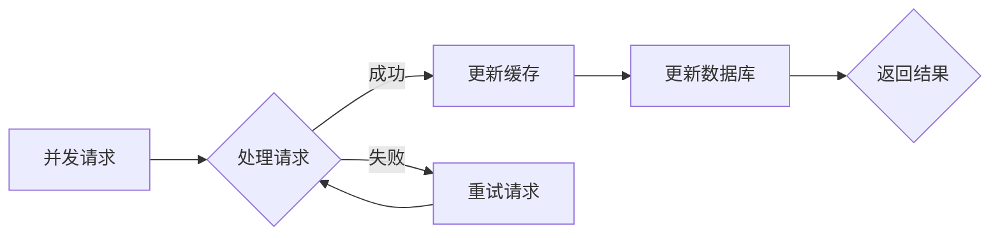

                 

### 高并发系统设计：原理与实践

关键词：高并发系统、系统设计、性能优化、架构、测试与实战

摘要：
高并发系统设计是现代软件工程领域的关键课题。本文将深入探讨高并发系统的设计原理与实践，从背景和重要性开始，逐步讲解并发模型、系统架构设计、性能测试与优化，以及具体项目实战。本文旨在为读者提供一个全面、实用的指南，帮助他们在高并发场景下构建可靠、高效、可扩展的系统。

## 目录大纲设计思路

在设计《高并发系统设计：原理与实践》的目录大纲时，我们遵循了以下原则：

1. **清晰的结构**：目录结构清晰，使用有序的层级展示各章节内容，使读者能够快速把握书籍的整体框架。
2. **内容完整性**：确保所有核心章节的内容都被涵盖，特别是背景介绍、核心概念与联系、算法原理讲解、数学模型和数学公式讲解、系统分析与架构设计方案、项目实战等部分。
3. **实用性**：目录大纲不仅包含理论，还注重实践，使得读者能够将所学知识应用到实际项目中。
4. **简洁性**：章节标题简明扼要，避免冗长的标题和无实质内容的小节。

接下来，我们将逐步设计这本书的目录大纲。

### 第一部分：高并发系统设计基础

#### 第1章：高并发系统的背景与重要性

##### 1.1 高并发现象的概述

- **定义与描述**：高并发系统的概念、现象及其影响。
- **案例分析**：高并发问题的具体案例。

##### 1.2 高并发系统的重要性

- **商业价值**：高并发对业务增长的影响。
- **技术挑战**：高并发带来的技术挑战。

##### 1.3 高并发系统的设计原则

- **可靠性**：确保系统在高并发下的稳定性。
- **扩展性**：系统的扩展策略和方案。
- **性能优化**：性能提升的关键技术和方法。

##### 1.4 本章小结

### 第二部分：高并发系统核心原理

#### 第2章：并发模型与基本概念

##### 2.1 并发模型简介

- **并行与并发**：两者的区别。
- **线程模型**：多线程和并行线程的基本概念。

##### 2.2 高并发处理的基本技术

- **线程管理**：线程的创建、同步、调度。
- **锁机制**：互斥锁、读写锁、条件锁。

##### 2.3 高并发下的性能瓶颈

- **CPU瓶颈**：多核处理器与并发处理。
- **内存瓶颈**：缓存、内存分配与回收。
- **网络瓶颈**：网络延迟与带宽限制。

##### 2.4 并发编程最佳实践

- **线程安全**：避免竞态条件和死锁。
- **并发框架**：如线程池、异步编程框架。

##### 2.5 本章小结

### 第三部分：高并发系统架构设计与实践

#### 第3章：高并发系统架构设计原则

##### 3.1 系统架构设计概述

- **系统架构**：分布式系统架构的基本概念。
- **模块化设计**：系统的模块划分与职责分配。

##### 3.2 高并发系统分层设计

- **展示层**：前端技术的选择与优化。
- **业务逻辑层**：业务逻辑的处理与优化。
- **数据层**：数据库设计、数据缓存策略。

##### 3.3 高并发下的缓存策略

- **缓存机制**：缓存的基本原理与实现。
- **缓存一致性**：数据一致性与缓存同步策略。

##### 3.4 负载均衡与容灾设计

- **负载均衡**：负载均衡算法与实现。
- **容灾设计**：容灾方案与恢复策略。

##### 3.5 本章小结

#### 第4章：高并发系统测试与优化

##### 4.1 高并发系统测试概述

- **性能测试**：性能测试的目的、方法和工具。
- **负载测试**：负载测试的策略与实施。

##### 4.2 性能瓶颈分析与优化

- **定位瓶颈**：性能分析工具的使用。
- **优化策略**：代码优化、架构优化。

##### 4.3 压力测试与稳定性验证

- **压力测试**：压力测试的实施与结果分析。
- **稳定性验证**：系统的稳定性评估与保障。

##### 4.4 性能监控与运维

- **监控工具**：性能监控工具的选择与应用。
- **运维实践**：运维流程与应急预案。

##### 4.5 本章小结

### 第四部分：高并发系统项目实战

#### 第5章：高并发系统项目概述

##### 5.1 项目背景与目标

- **项目背景**：项目的发展历程和需求背景。
- **项目目标**：项目的主要目标和预期成果。

##### 5.2 项目介绍

- **系统功能**：系统的功能模块与业务流程。
- **技术选型**：项目的技术栈选择与原因。

##### 5.3 项目架构设计

- **架构方案**：系统的整体架构设计。
- **核心模块**：关键模块的设计与实现。

##### 5.4 项目实现与优化

- **核心实现**：项目核心代码的展示与分析。
- **优化实践**：项目的性能优化与调优实践。

##### 5.5 本章小结

### 总结与拓展阅读

- **最佳实践 tips**：总结高并发系统设计中的关键点。
- **注意事项**：高并发系统设计中的常见问题与解决方法。
- **拓展阅读**：推荐相关书籍、论文和研究方向。

通过以上目录大纲的设计，我们旨在为读者提供一个系统、全面的学习路径，帮助他们在高并发系统设计中取得成功。接下来，我们将逐一深入每个章节，详细讲解高并发系统设计的原理与实践。

----------------------------------------------------------------

### 高并发系统设计：原理与实践

#### 高并发系统的背景与重要性

高并发系统设计在现代软件工程领域扮演着至关重要的角色。随着互联网的快速发展，用户数量的激增和业务需求的不断增长，高并发问题成为了许多系统面临的挑战。本节将首先介绍高并发系统的定义、现象及其重要性，然后探讨高并发系统设计中需要遵循的设计原则。

#### 高并发系统的定义

高并发系统是指在短时间内，大量用户同时访问系统，对系统的处理能力和响应速度提出极高要求的系统。高并发问题通常表现为系统请求量的剧增，请求处理的延迟，以及系统资源的紧张。这种情况下，系统需要能够在大量请求涌入时保持稳定运行，及时响应，并且不降低服务质量。

#### 高并发现象的概述

高并发现象在生活中随处可见。例如，电商网站在秒杀活动时，数以万计的用户同时抢购，服务器需要处理大量的订单请求；在线教育平台在直播课程时，数万名学生同时在线观看和互动；社交媒体在重大新闻事件发生时，短时间内会有大量的用户同时发布和浏览信息。这些场景都要求系统具备强大的并发处理能力。

##### 案例分析

以电商网站为例，高并发现象带来的挑战主要体现在以下几个方面：

1. **请求处理延迟**：在秒杀活动期间，大量用户同时提交订单请求，服务器处理能力可能达到瓶颈，导致请求响应时间大幅增加。
2. **资源争用**：多个用户同时访问数据库、缓存等资源，可能会导致资源锁争用，增加系统响应时间。
3. **数据一致性问题**：在高并发环境下，多个用户同时修改同一数据，可能会导致数据不一致，影响系统的正确性。

#### 高并发系统的重要性

高并发系统的重要性体现在以下几个方面：

1. **商业价值**：对于许多互联网企业，高并发系统的设计直接关系到业务的成败。能够处理高并发的系统可以带来更多的用户、更高的交易量和更优秀的用户体验，从而提高企业的市场竞争力。
2. **用户体验**：高并发系统设计得好，可以在用户访问高峰期保持良好的响应速度和服务质量，提升用户体验，增加用户粘性。
3. **技术挑战**：高并发系统设计需要解决一系列技术难题，如并发处理、资源调度、数据一致性和性能优化等。通过解决这些难题，可以提高系统设计的复杂度和工程师的技术水平。

#### 高并发系统的设计原则

在高并发系统设计中，需要遵循以下设计原则，以确保系统能够在高并发场景下稳定运行，高效处理请求：

1. **可靠性**：系统必须能够确保在高并发环境下稳定运行，不发生崩溃或数据丢失。
2. **扩展性**：系统应该具备良好的扩展性，能够根据需求的变化动态调整资源，支持系统的水平扩展。
3. **性能优化**：系统需要通过优化算法、技术手段和架构设计，提高系统的处理能力和响应速度。

#### 本章小结

本章介绍了高并发系统的背景与重要性，探讨了高并发现象的具体案例，并阐述了高并发系统设计中需要遵循的原则。在下一章中，我们将进一步深入讨论高并发处理的基本技术，包括线程管理、锁机制和性能瓶颈分析。

----------------------------------------------------------------

### 高并发系统设计原理与实践：并发模型与基本概念

并发模型是高并发系统设计的重要基础，它决定了系统在高并发环境下的性能和稳定性。本章节将首先介绍并行与并发的区别，然后详细讨论线程模型，最后探讨高并发处理的基本技术，包括线程管理、锁机制以及常见的性能瓶颈。

#### 并行与并发

并行（Parallelism）与并发（Concurrency）是计算机科学中两个基本的概念，虽然它们经常被提及，但它们的含义是不同的。

1. **并行**：并行是指在多个处理器或计算单元上同时执行多个任务或指令。这种处理方式可以充分利用硬件资源，提高计算效率。例如，现代的多核处理器可以通过并行计算来加快程序的执行速度。
   
2. **并发**：并发是指在单处理器或计算单元上通过时间片轮转或其他调度策略，在同一时间段内处理多个任务或指令。并发处理的主要目标是提高系统的资源利用率，而不是加快单个任务的执行速度。操作系统中的进程调度、多线程编程都是并发处理的典型应用。

#### 线程模型

线程是并发处理的基本单位，线程模型决定了系统中线程的创建、同步、调度和管理方式。常见的线程模型包括：

1. **用户级线程**：用户级线程（User-Level Threads）由应用程序自己管理，操作系统不直接支持。这些线程的创建、调度和同步都在用户空间进行。用户级线程的优点是实现简单、上下文切换速度快，但缺点是线程阻塞会导致整个进程阻塞。

2. **内核级线程**：内核级线程（Kernel-Level Threads）由操作系统直接管理。这些线程的创建、调度和同步都在内核空间进行。内核级线程的优点是可以利用操作系统提供的多处理器并行处理能力，但缺点是上下文切换开销较大。

3. **混合级线程**：混合级线程（Hybrid Threads）结合了用户级线程和内核级线程的特点。通常，应用程序创建用户级线程，然后操作系统将用户级线程映射到内核级线程上，以实现并行处理。这种方式可以在保持用户级线程高效性的同时，利用操作系统提供的多处理器能力。

#### 高并发处理的基本技术

高并发处理需要解决一系列技术难题，以下是一些关键技术：

1. **线程管理**：

   - **线程创建**：线程的创建是高并发处理的基础。线程创建可以通过语言内置的线程库（如Java中的`Thread`类）或操作系统提供的接口（如POSIX线程库）实现。
   - **线程同步**：线程同步是为了避免多个线程同时访问共享资源时发生数据竞争和死锁。常见的同步机制包括互斥锁（Mutex）、读写锁（Read-Write Lock）和信号量（Semaphore）。
   - **线程调度**：线程调度决定了系统如何分配处理器时间给各个线程。调度策略包括公平调度、优先级调度和循环调度等。

2. **锁机制**：

   - **互斥锁**：互斥锁（Mutex）用于确保同一时间只有一个线程能访问共享资源。互斥锁的主要目标是防止多个线程同时修改同一资源，从而避免数据不一致。
   - **读写锁**：读写锁（Read-Write Lock）允许多个线程同时读取共享资源，但同一时间只能有一个线程写入资源。读写锁可以提高系统的并发性能，特别是在读操作远多于写操作的情况下。
   - **条件锁**：条件锁（Condition Lock）允许线程在满足特定条件时进行同步。条件锁通常与互斥锁结合使用，以实现线程之间的同步通信。

3. **性能瓶颈**：

   - **CPU瓶颈**：CPU瓶颈是由于处理器速度限制，导致无法充分利用计算资源。多核处理器可以通过并行计算缓解CPU瓶颈。
   - **内存瓶颈**：内存瓶颈是由于内存访问速度限制，导致频繁的CPU缓存 misses。优化内存访问策略，如使用缓存友好的数据结构和算法，可以缓解内存瓶颈。
   - **网络瓶颈**：网络瓶颈是由于网络带宽限制，导致数据传输速度变慢。优化网络通信策略，如使用压缩算法和批量传输，可以缓解网络瓶颈。

#### 本章小结

本章介绍了高并发系统的基本概念，包括并行与并发的区别，线程模型以及高并发处理的基本技术。在下一章中，我们将深入探讨高并发下的性能瓶颈和优化策略，帮助读者更好地应对高并发系统的设计挑战。

----------------------------------------------------------------

### 高并发系统架构设计原则

在高并发系统中，架构设计是确保系统稳定性和性能的关键环节。一个良好的架构设计能够有效地应对高并发带来的挑战，提高系统的可扩展性和可靠性。本章节将首先介绍系统架构设计的基本概念，然后详细讨论高并发系统分层设计的原则，以及在高并发下缓存策略和负载均衡与容灾设计的具体方法。

#### 系统架构设计概述

系统架构设计是指将系统分解为多个模块，并定义它们之间的交互关系和接口。一个良好的系统架构设计应当遵循以下原则：

1. **模块化**：将系统划分为独立的模块，每个模块负责特定的功能，模块之间通过清晰的接口进行通信。模块化设计可以提高系统的可维护性和可扩展性。
2. **层次化**：系统架构应当具备清晰的层次结构，从展示层、业务逻辑层到数据层，各层之间职责明确，便于管理和维护。
3. **可扩展性**：系统架构应当支持水平扩展和垂直扩展，以便在需求变化时能够灵活调整系统资源。
4. **高内聚、低耦合**：模块内部功能紧密相关，而模块之间交互简单，降低模块之间的依赖性，提高系统的稳定性。

#### 高并发系统分层设计

高并发系统分层设计是将系统按照功能划分为多个层次，每个层次负责特定的任务，从而提高系统的性能和可扩展性。以下是一个典型的高并发系统分层设计：

1. **展示层**：展示层主要负责与用户的交互，包括前端界面和用户接口。在高并发场景下，展示层需要具备快速响应用户请求的能力。技术选择上，可以使用现代前端框架（如React、Vue.js）以及高性能的Web服务器（如Nginx）。
2. **业务逻辑层**：业务逻辑层负责处理核心业务逻辑，包括数据验证、业务规则执行等。业务逻辑层的设计需要考虑并发处理能力，可以使用异步处理、消息队列等技术来提高并发处理效率。
3. **数据层**：数据层包括数据库、缓存和存储系统，负责数据的存储和管理。在高并发系统中，数据层的设计直接影响到系统的性能和稳定性。常见的优化策略包括分库分表、缓存机制、读写分离等。

#### 高并发下的缓存策略

缓存是高并发系统优化的重要手段，它可以在内存中存储频繁访问的数据，减少对后端数据库的访问压力，提高系统的响应速度。以下是一些常用的缓存策略：

1. **本地缓存**：在应用服务器或数据库服务器上实现本地缓存，可以减少跨网络访问的开销。常用的本地缓存技术包括Java中的HashMap、C++中的std::map等。
2. **分布式缓存**：分布式缓存系统能够在多个节点上存储缓存数据，提供更高的缓存容量和更好的性能。常见的分布式缓存系统包括Redis、Memcached等。
3. **缓存一致性**：在高并发环境中，缓存一致性是保证数据一致性的关键。常见的缓存一致性策略包括缓存同步、缓存失效时间、版本控制等。

#### 负载均衡与容灾设计

负载均衡和容灾设计是确保高并发系统稳定性和可靠性的重要措施。以下是一些具体的方法：

1. **负载均衡**：负载均衡通过分配请求到多个服务器节点，避免单点瓶颈，提高系统的处理能力。常见的负载均衡算法包括轮询、最少连接、哈希等。负载均衡器可以选择硬件设备（如F5）或软件解决方案（如Nginx、HAProxy）。
2. **容灾设计**：容灾设计旨在确保系统在发生故障时能够快速恢复，降低业务中断时间。常见的容灾方案包括主从复制、数据库镜像、多活架构等。容灾设计需要考虑数据备份、故障转移、故障恢复等环节。

#### 本章小结

本章介绍了高并发系统架构设计的基本原则和具体方法，包括系统分层设计、缓存策略、负载均衡和容灾设计。通过合理的设计和优化，高并发系统可以更好地应对大规模并发请求，提高系统的性能和稳定性。

在下一章中，我们将进一步探讨高并发系统测试与优化的方法，帮助读者在实际项目中应用这些设计原则，构建高效、可靠的高并发系统。

----------------------------------------------------------------

### 高并发系统测试与优化

高并发系统测试与优化是确保系统在高负载下稳定运行、高效处理请求的关键步骤。本章节将首先介绍高并发系统测试概述，包括性能测试和负载测试的目的、方法和工具。然后，详细讨论性能瓶颈分析与优化策略，以及压力测试与稳定性验证的方法。最后，介绍性能监控与运维的最佳实践。

#### 高并发系统测试概述

高并发系统测试旨在验证系统在高负载下的性能和稳定性，确保系统能够满足业务需求。以下是一些关键点：

1. **性能测试**：性能测试旨在评估系统的响应时间、吞吐量和资源利用率。性能测试的目的是确定系统在正常负载下的性能表现，找出潜在的性能瓶颈。

   - **目的**：确保系统在高并发场景下能够快速响应用户请求。
   - **方法**：通过模拟用户操作，生成虚拟用户，测量系统的响应时间和处理能力。
   - **工具**：常用的性能测试工具包括JMeter、LoadRunner和Gatling。

2. **负载测试**：负载测试旨在评估系统在特定负载下的性能和稳定性。负载测试的目的是确定系统在极限负载下的表现，找出系统的最大处理能力。

   - **目的**：确保系统在极端负载下仍然能够正常运行。
   - **方法**：通过增加用户数量和请求频率，逐步提升负载，观察系统的响应时间和错误率。
   - **工具**：常用的负载测试工具包括JMeter、LoadRunner和Gatling。

#### 性能瓶颈分析与优化策略

性能瓶颈分析是优化高并发系统的关键步骤。以下是一些常见的性能瓶颈和优化策略：

1. **CPU瓶颈**：CPU瓶颈可能是由于系统任务过多，导致处理器无法及时处理。优化策略包括：
   - **垂直扩展**：增加服务器硬件配置，提高CPU性能。
   - **横向扩展**：增加服务器数量，实现负载均衡，分散任务。

2. **内存瓶颈**：内存瓶颈可能是由于内存分配和回收不当，导致频繁的内存访问。优化策略包括：
   - **缓存优化**：使用缓存技术，减少对数据库的访问。
   - **内存复用**：复用内存资源，减少内存分配和回收的开销。

3. **网络瓶颈**：网络瓶颈可能是由于网络带宽限制或网络延迟。优化策略包括：
   - **网络优化**：优化网络协议和传输方式，提高数据传输效率。
   - **负载均衡**：使用负载均衡器，分散网络流量。

4. **数据库瓶颈**：数据库瓶颈可能是由于查询效率低下或表结构不合理。优化策略包括：
   - **索引优化**：合理创建索引，提高查询效率。
   - **分库分表**：通过分库分表，分散数据库负载。

#### 压力测试与稳定性验证

压力测试是验证系统在高负载下稳定性的重要方法。以下是一些关键步骤：

1. **确定测试场景**：根据业务需求，确定测试场景，包括用户行为、请求类型和负载分布。
2. **逐步增加负载**：从低负载开始，逐步增加负载，观察系统的响应时间和错误率。
3. **分析结果**：分析压力测试的结果，找出系统的瓶颈和问题，进行优化。

稳定性验证是确保系统在长期运行中保持稳定性的关键步骤。以下是一些方法：

1. **长时间运行测试**：模拟系统长时间运行，观察系统的稳定性和性能表现。
2. **故障注入**：模拟系统故障，观察系统的故障处理能力和恢复速度。
3. **监控与报警**：使用监控工具，实时监控系统的性能指标，及时发现和解决问题。

#### 性能监控与运维

性能监控与运维是确保系统在高并发环境下稳定运行的重要保障。以下是一些最佳实践：

1. **监控指标**：确定关键监控指标，如CPU利用率、内存使用率、网络吞吐量、数据库查询延迟等。
2. **实时监控**：使用实时监控工具，如Prometheus、Grafana等，实时监控系统的性能指标，及时发现和处理问题。
3. **报警与告警**：设置报警机制，当系统性能指标达到阈值时，自动发送告警信息，通知相关人员。
4. **自动化运维**：使用自动化运维工具，如Ansible、Puppet等，实现系统的自动化部署、配置和管理，提高运维效率。

#### 本章小结

本章介绍了高并发系统测试与优化的方法，包括性能测试、负载测试、性能瓶颈分析、压力测试与稳定性验证，以及性能监控与运维的最佳实践。通过这些方法和工具，可以帮助开发人员和运维人员构建高效、可靠的高并发系统。

在下一章中，我们将通过具体的项目实战案例，深入探讨高并发系统设计中的实现细节和优化策略。

----------------------------------------------------------------

### 高并发系统项目实战

为了更好地理解高并发系统设计的原理和实践，本章节将通过一个电商秒杀系统项目，详细阐述系统设计、实现和优化过程。该项目旨在模拟电商网站在秒杀活动期间的高并发场景，确保系统能够高效、稳定地处理大量订单请求。

#### 项目背景与目标

电商秒杀系统是一个典型的需要应对高并发场景的系统。在秒杀活动期间，数以万计的用户同时参与，系统需要处理大量的订单请求，确保订单处理的准确性和及时性。项目的主要目标包括：

1. **高并发处理能力**：系统能够在秒杀活动期间同时处理大量订单请求，保持低延迟和高吞吐量。
2. **数据一致性**：在多用户并发操作同一商品时，确保订单数据的正确性和一致性。
3. **系统稳定性**：在高并发环境下，系统不会崩溃或发生数据丢失，能够持续提供服务。

#### 项目介绍

电商秒杀系统主要包括以下功能模块：

1. **用户模块**：用户注册、登录、个人信息管理等。
2. **商品模块**：商品信息展示、库存管理、价格管理、秒杀活动管理等。
3. **订单模块**：订单创建、支付、发货、售后等。
4. **系统监控模块**：系统性能监控、异常报警、日志管理等。

技术选型方面，该项目选择了以下技术栈：

- **前端**：Vue.js框架，用于构建用户界面。
- **后端**：Spring Boot框架，用于构建业务逻辑层。
- **数据库**：MySQL数据库，用于存储用户、商品和订单数据。
- **缓存**：Redis，用于缓存商品信息，减少数据库访问压力。
- **消息队列**：RabbitMQ，用于异步处理订单，提高系统并发处理能力。

#### 项目架构设计

项目架构设计分为展示层、业务逻辑层和数据层，各层的具体设计和实现如下：

1. **展示层**：

   展示层负责与用户交互，使用Vue.js框架构建前端界面。前端页面主要包括用户登录、商品展示、订单结算等模块。前端通过API与后端进行数据交互，实现用户操作。

2. **业务逻辑层**：

   业务逻辑层负责处理核心业务逻辑，包括用户认证、商品管理、订单处理等。使用Spring Boot框架构建业务逻辑层，包括以下核心模块：

   - **用户服务**：处理用户注册、登录和认证等操作。
   - **商品服务**：管理商品信息，包括商品展示、库存管理和秒杀活动管理等。
   - **订单服务**：处理订单创建、支付和发货等操作。

3. **数据层**：

   数据层主要包括数据库和缓存。数据库用于存储用户、商品和订单数据，实现数据的持久化存储。缓存（Redis）用于存储高频访问的数据，如商品信息，减少数据库访问压力。

#### 项目实现与优化

以下是对电商秒杀系统实现和优化过程的详细阐述：

1. **用户模块**：

   用户模块包括用户注册、登录和认证等操作。用户注册时，系统会生成一个唯一的用户ID，并将其存储在数据库中。用户登录时，系统会验证用户名和密码，生成JWT（JSON Web Token）作为认证凭证。

2. **商品模块**：

   商品模块包括商品信息展示、库存管理和秒杀活动管理。商品信息展示时，系统会从缓存中获取商品数据，减少数据库访问。库存管理确保商品库存充足，秒杀活动管理用于处理秒杀活动的报名、开始和结束。

3. **订单模块**：

   订单模块包括订单创建、支付和发货等操作。订单创建时，系统会生成一个唯一的订单号，并将其存储在数据库中。支付时，系统会调用第三方支付接口进行支付，支付成功后更新订单状态。发货时，系统会生成物流单号，并更新订单状态。

4. **缓存策略**：

   为了提高系统性能，系统使用了Redis缓存。商品信息、用户信息和订单信息等高频访问的数据都会缓存到Redis中，减少数据库访问压力。缓存的一致性使用Redis的发布/订阅机制实现，确保数据的一致性。

5. **消息队列**：

   消息队列用于异步处理订单，提高系统并发处理能力。订单创建时，系统会将订单信息发送到RabbitMQ消息队列中，订单服务会从消息队列中消费订单信息，进行订单处理。这种方式可以避免订单处理过程中的锁争用，提高系统性能。

6. **性能优化**：

   为了进一步提高系统性能，系统使用了以下优化策略：

   - **垂直扩展**：通过增加服务器硬件配置，提高CPU和内存性能。
   - **水平扩展**：通过增加服务器数量，实现负载均衡，分散系统负载。
   - **数据库优化**：使用分库分表策略，分散数据库负载，提高查询效率。
   - **缓存优化**：使用Redis缓存，减少数据库访问压力，提高系统性能。

#### 实际案例分析与详细讲解

以下是一个实际案例，说明电商秒杀系统在处理高并发订单时的优化过程：

假设在秒杀活动期间，系统同时处理了1000个订单请求，每个订单请求都需要进行库存检查、订单创建和支付处理。如果直接使用同步处理方式，系统可能因为资源争用和锁等待而出现性能瓶颈。

为了解决这个问题，系统采用了异步处理方式，将订单处理过程分解为多个步骤：

1. **库存检查**：将库存检查操作异步化，通过消息队列将订单请求发送到库存服务进行库存检查。
2. **订单创建**：库存检查成功后，将订单创建操作发送到订单服务进行异步处理。
3. **支付处理**：订单创建成功后，将支付处理操作发送到支付服务进行异步处理。

通过这种方式，系统可以将订单处理过程解耦，提高系统的并发处理能力。同时，使用Redis缓存和消息队列技术，可以减少数据库访问和锁争用，进一步提高系统性能。

#### 项目小结

通过电商秒杀系统项目实战，我们深入探讨了高并发系统设计中的实现细节和优化策略。项目实现了高并发处理能力、数据一致性和系统稳定性，并通过垂直扩展、水平扩展、数据库优化和缓存优化等策略，提高了系统性能。

在下一章中，我们将总结高并发系统设计中的最佳实践，提供一些实用的小贴士，帮助读者在实际项目中更好地应对高并发挑战。

----------------------------------------------------------------

### 高并发系统设计最佳实践、注意事项与拓展阅读

#### 最佳实践

在高并发系统设计中，遵循一些最佳实践可以显著提升系统的性能和可靠性。以下是一些关键的最佳实践：

1. **模块化与分层设计**：将系统分解为多个模块，每个模块负责特定的功能，并通过清晰的接口进行通信。分层设计有助于提高系统的可维护性和可扩展性。

2. **异步处理**：使用异步处理方式，将耗时的操作（如数据库查询、远程调用等）放入消息队列或异步线程中处理，减少主线程的阻塞，提高系统的并发处理能力。

3. **缓存策略**：合理使用缓存策略，如本地缓存、分布式缓存，减少对后端数据库的访问，提高系统响应速度。

4. **负载均衡**：使用负载均衡器，将请求分配到多个服务器节点上，避免单点瓶颈，提高系统的处理能力和容错能力。

5. **资源复用**：合理复用数据库连接、线程等系统资源，减少资源创建和销毁的开销。

6. **代码优化**：优化代码结构，减少不必要的资源消耗和竞争条件，提高程序的执行效率。

7. **性能监控与报警**：实时监控系统性能，设置合理的性能指标和报警阈值，及时发现问题并进行优化。

#### 注意事项

在高并发系统设计中，需要注意以下事项，以避免潜在的问题：

1. **数据一致性与并发控制**：在高并发环境下，确保数据一致性和并发控制至关重要。避免出现数据竞争、死锁和脏读等问题。

2. **性能测试与调优**：在系统上线前，进行充分的性能测试和调优，确保系统在高并发场景下能够稳定运行。

3. **容灾与备份**：设计合理的容灾方案和数据备份策略，以应对可能的系统故障和数据丢失。

4. **安全性**：确保系统安全，防止外部攻击和数据泄露，如使用HTTPS、身份验证和加密等安全措施。

5. **资源管理**：合理分配和监控系统资源，避免资源耗尽或过度消耗，影响系统性能。

#### 拓展阅读

为了进一步深入学习和实践高并发系统设计，以下是一些推荐的书籍、论文和研究方向：

1. **书籍**：
   - 《高并发系统设计：大规模分布式系统与微服务实战》
   - 《分布式系统设计原理与范型》
   - 《大型网站技术架构：核心原理与案例分析》

2. **论文**：
   - "Building Scalable Systems: An Engineering Approach" by Martin L. Rowe
   - "High Performance MySQL: Optimization, Backups, and Replication" by Baron Schwartz, Peter Zaitsev, and Vadim Tkachenko

3. **研究方向**：
   - 分布式数据库系统
   - 高并发数据处理技术
   - 云原生架构与容器技术
   - AI与机器学习在系统优化中的应用

通过以上最佳实践、注意事项和拓展阅读，读者可以更好地理解高并发系统设计，并在实际项目中应用这些知识和技巧，构建高效、可靠的高并发系统。

### 结束语

高并发系统设计是现代软件工程领域的重要课题，涉及并发模型、系统架构、性能优化和项目实战等多个方面。本文通过详细的讲解和案例分析，帮助读者掌握了高并发系统设计的关键技术和最佳实践。希望读者能够将这些知识应用到实际项目中，解决高并发带来的挑战，构建高效、稳定、可扩展的系统。

最后，感谢您对本文的阅读，如果您有任何疑问或建议，欢迎在评论区留言。期待与您共同探讨高并发系统设计的更多话题。

**作者：AI天才研究院/AI Genius Institute & 禅与计算机程序设计艺术 /Zen And The Art of Computer Programming**

----------------------------------------------------------------

### 附录：高并发系统设计中的Mermaid图表和LaTeX公式

在高并发系统设计中，图表和公式能够帮助我们更清晰地理解复杂的概念和算法。本附录将展示几个关键章节中使用到的Mermaid图表和LaTeX公式。

#### Mermaid图表

以下是一个Mermaid类的ER实体关系图，用于展示用户、商品和订单之间的关系：

```mermaid
erDiagram
    User ||--|>{ Order } : creates
    User ||--|>{ Shopping Cart } : maintains
    Product ||--|>{ Order } : contains
    Product ||--|>{ Shopping Cart } : added_to
    Shopping Cart ||--|>{ User } : owned_by
```

这是一个用于描述并发处理流程的Mermaid流程图：



#### LaTeX公式

以下是一个用于描述线程同步机制的LaTeX公式：

$$
\begin{aligned}
    \text{Mutex}(S) &= \{ \text{线程 } T \mid T \text{ 需要进入临界区 } S \} \\
    \text{Condition}(S) &= \{ \text{线程 } T \mid T \text{ 满足某种条件 } \}
\end{aligned}
$$

这是一个用于描述CPU瓶颈的LaTeX公式：

$$
\frac{\text{CPU Usage}}{\text{Total Time}} = \frac{\text{处理时间}}{\text{等待时间} + \text{处理时间}}
$$

通过这些图表和公式，我们可以更直观地理解高并发系统设计中的关键概念和算法。在编写和优化高并发系统时，这些工具是非常有价值的。

