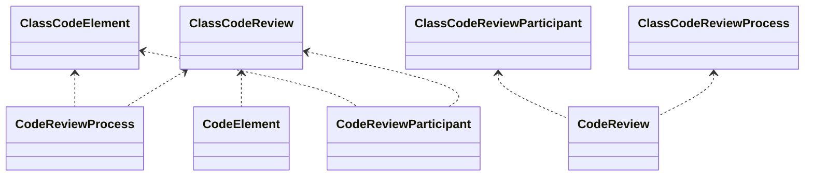
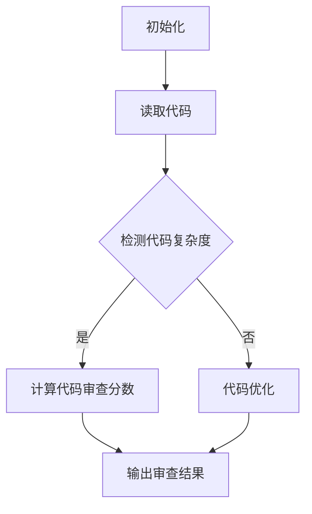
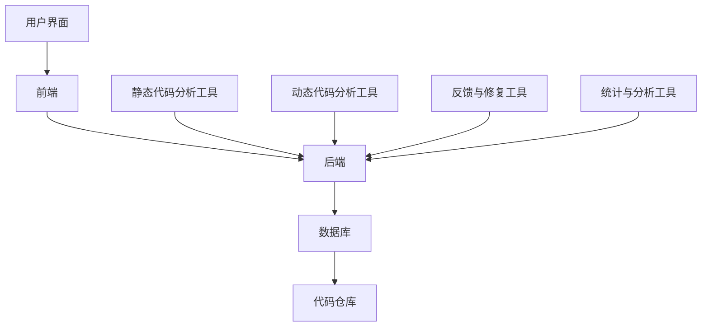
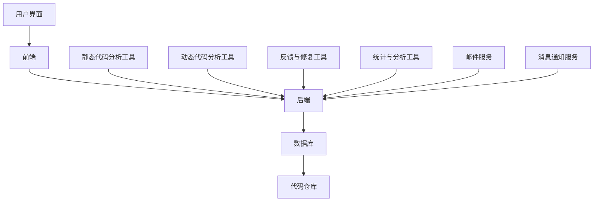
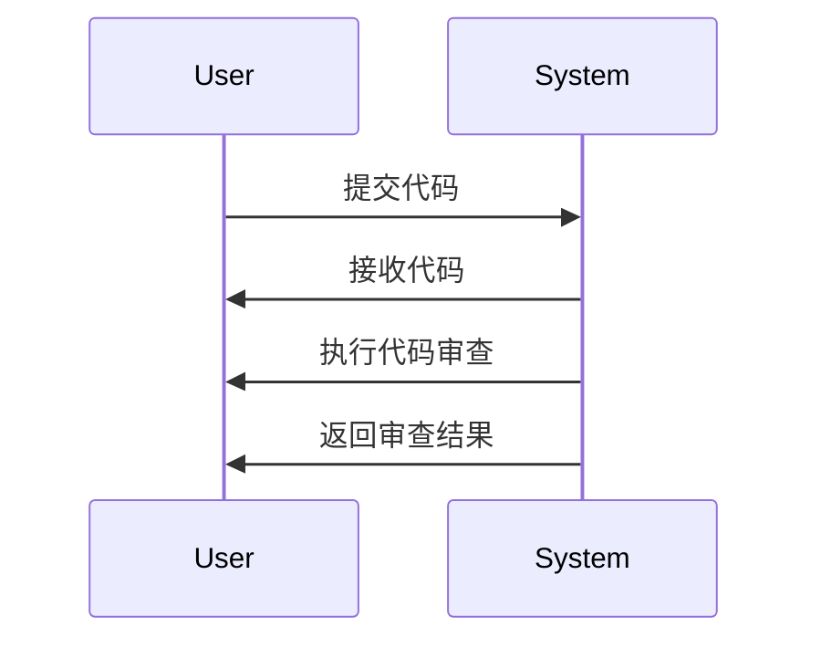

                 

# 高效代码审查：提升团队代码质量的关键

## 关键词

- 代码审查
- 团队协作
- 代码质量
- 算法原理
- 系统架构

## 摘要

在快速迭代的软件开发过程中，代码质量成为项目成败的关键因素。代码审查作为一种提升代码质量的手段，已在各行业广泛应用。本文将深入探讨代码审查的重要性，解析其核心概念和流程，通过算法原理、数学模型、系统架构、实战案例分析，全面阐述如何实现高效代码审查，从而提升团队的整体代码质量。

## 目录大纲

### 第一部分：问题背景与核心概念

1. 代码审查的重要性与现状
   1.1 代码审查的意义
   1.2 当前代码审查的现状
   1.3 代码审查面临的主要挑战
   1.4 代码审查的目标与期望效果

2. 代码审查的核心概念
   2.1 代码审查的定义
   2.2 代码审查的流程
   2.3 代码审查的主要参与者
   2.4 代码审查的核心要素

3. 代码审查的概念属性特征对比表格

4. 代码审查的ER实体关系图架构

### 第二部分：算法原理与数学模型

1. 代码审查算法原理
   1.1 常见代码审查算法
   1.2 代码审查算法的工作原理
   1.3 代码审查算法的核心数学模型
   1.4 算法举例说明

2. 算法流程图

### 第三部分：系统分析与架构设计

1. 系统功能设计
   1.1 代码审查系统功能概述
   1.2 领域模型设计
   1.3 功能模块划分

2. 系统架构设计
   1.1 系统架构概述
   1.2 系统架构设计
   1.3 系统模块间的关系

3. 系统接口设计
   1.1 接口设计原则
   1.2 接口功能定义
   1.3 接口调用流程

4. 系统交互设计
   1.1 系统交互概述
   1.2 系统交互流程
   1.3 系统交互图

### 第四部分：项目实战

1. 环境安装与配置
   1.1 环境安装准备
   1.2 系统配置步骤

2. 系统核心实现源代码
   2.1 核心代码解读
   2.2 源代码分析

3. 代码应用解读与分析
   3.1 实际案例分析
   3.2 案例分析与讲解

4. 项目小结
   4.1 项目总结
   4.2 项目亮点与不足

## 第一部分：问题背景与核心概念

### 第1章：代码审查的重要性与现状

#### 1.1 代码审查的意义

代码审查是一种通过团队合作来提高软件质量和安全性的方法。它不仅能够发现代码中的错误和潜在问题，还能够提升开发人员的编码技巧，促进知识分享和团队协作。从长远来看，代码审查能够减少代码缺陷，降低维护成本，提高软件的可读性和可维护性。

#### 1.2 当前代码审查的现状

尽管代码审查的重要性被广泛认可，但实际情况中，代码审查的实践并不普遍。许多团队因为资源限制、时间紧迫等原因，未能定期进行代码审查。此外，一些团队在代码审查过程中，存在流程不规范、参与人员不积极等问题，导致代码审查的效果不尽如人意。

#### 1.3 代码审查面临的主要挑战

代码审查面临的主要挑战包括：

1. **审查者经验不足**：新入职的审查者可能缺乏足够的编程经验和审查技巧，难以发现潜在的问题。
2. **审查流程不完善**：一些团队的代码审查流程缺乏规范化，导致审查效率低下。
3. **审查覆盖面不全**：代码审查可能无法覆盖所有的代码分支和功能模块，导致一些问题未能及时发现。
4. **审查结果处理不当**：审查后的反馈处理不当，可能导致审查效果大打折扣。

#### 1.4 代码审查的目标与期望效果

代码审查的目标主要包括：

1. **提升代码质量**：通过审查，发现并修复代码中的错误和潜在问题，提高代码的可读性和可维护性。
2. **促进知识共享**：通过代码审查，开发人员可以学习他人的编程技巧和经验，提升自身技能。
3. **降低维护成本**：及时发现和修复代码问题，减少后续维护的难度和成本。
4. **提高团队协作效率**：规范化的代码审查流程有助于提升团队协作效率，减少沟通成本。

### 第2章：代码审查的核心概念

#### 2.1 代码审查的定义

代码审查，通常也称为代码走查或代码审计，是指通过人工或自动化手段，对已编写或即将发布的代码进行系统性检查，以识别潜在的错误、漏洞、不一致性或其他问题，从而提升代码质量。

#### 2.2 代码审查的流程

代码审查的流程通常包括以下步骤：

1. **准备阶段**：确定审查的目标、范围、参与者、时间等。
2. **审查阶段**：审查者按照预定的标准对代码进行仔细检查。
3. **反馈阶段**：审查者将发现的问题记录在案，并反馈给开发人员。
4. **修复阶段**：开发人员根据审查反馈，对代码进行修改。
5. **复查阶段**：审查者对修改后的代码进行再次审查，确保问题已得到妥善解决。

#### 2.3 代码审查的主要参与者

代码审查的主要参与者包括：

1. **审查者**：负责对代码进行审查，通常为有经验的开发人员或专门的代码审查人员。
2. **开发人员**：负责编写和修改代码，通常需要对代码审查的结果进行响应。
3. **测试人员**：在某些情况下，测试人员也会参与代码审查，以评估代码的测试覆盖率和潜在缺陷。

#### 2.4 代码审查的核心要素

代码审查的核心要素包括：

1. **审查标准**：明确审查的准则和标准，有助于确保审查的全面性和一致性。
2. **审查工具**：包括静态代码分析工具、动态分析工具等，可以提高审查效率和准确性。
3. **审查记录**：记录审查过程中的发现、反馈和处理情况，有助于追踪审查效果和改进流程。
4. **反馈机制**：建立有效的反馈机制，确保审查结果能够及时传达并得到响应。

### 第3章：代码审查的概念属性特征对比表格

| 特征 | 代码审查 | 代码审核 | 代码评测 |
| ---- | ------- | ------- | ------- |
| 目标 | 提升代码质量 | 检查代码正确性 | 检测代码性能 |
| 流程 | 系统化、规范化 | 个体化、随机性 | 个性化、自动化 |
| 参与 | 团队协作 | 个体工作 | 机器主导 |

### 第4章：代码审查的ER实体关系图架构



## 第二部分：算法原理与数学模型

### 第5章：代码审查算法原理

#### 5.1 常见代码审查算法

常见的代码审查算法包括静态代码分析（Static Code Analysis, SCA）、动态代码分析（Dynamic Code Analysis, DCA）和混合代码分析等。每种算法都有其独特的原理和应用场景。

#### 5.2 代码审查算法的工作原理

1. **静态代码分析（SCA）**：在代码运行前，通过解析代码结构和语义，分析代码是否符合预定的标准。
2. **动态代码分析（DCA）**：在代码运行时，通过执行代码，监控代码的执行行为，识别潜在的错误和问题。
3. **混合代码分析**：结合静态和动态分析的优势，对代码进行全面检查。

#### 5.3 代码审查算法的核心数学模型

代码审查算法的核心数学模型通常包括以下部分：

$$
\text{代码审查分数} = w_1 \cdot \text{代码复杂度} + w_2 \cdot \text{代码冗余度} + w_3 \cdot \text{代码一致性}
$$

其中，$w_1$、$w_2$ 和 $w_3$ 分别为代码复杂度、代码冗余度和代码一致性的权重，可以通过实验和数据分析进行优化。

#### 5.4 算法举例说明

以静态代码分析为例，假设我们使用一个简单的代码复杂度模型来评估代码质量：

$$
\text{代码复杂度} = \frac{\text{循环数} + \text{条件数}}{\text{代码行数}}
$$

通过计算每个函数或模块的代码复杂度，我们可以识别出复杂度较高的代码段，从而进行重点审查。

### 第6章：算法流程图



## 第三部分：系统分析与架构设计

### 第7章：系统功能设计

#### 7.1 代码审查系统功能概述

代码审查系统的主要功能包括：

1. **代码提交**：开发人员将代码提交到审查系统。
2. **代码审查**：审查者对提交的代码进行审查。
3. **反馈与修复**：审查者将发现的问题反馈给开发人员，开发人员根据反馈进行代码修复。
4. **审查记录**：记录每一次审查的结果和处理过程。

#### 7.2 领域模型设计

领域模型设计如下：

```mermaid
classDiagram
ClassCode
ClassReviewer
ClassReview
ClassFeedback
ClassFix

Code "1" -> "1..*" Review
Reviewer "1" -> "1" Review
Review "1" -> "1" Feedback
Feedback "1" -> "1" Fix
```

#### 7.3 功能模块划分

系统功能模块划分如下：

1. **代码提交模块**：实现代码提交的功能。
2. **代码审查模块**：实现代码审查的功能，包括静态代码分析和动态代码分析。
3. **反馈与修复模块**：实现审查结果的反馈和代码修复的功能。
4. **记录与统计模块**：记录每一次审查的结果，并提供统计功能。

### 第8章：系统架构设计

#### 8.1 系统架构概述

系统架构设计如下：



#### 8.2 系统架构设计

系统架构设计如图所示：



#### 8.3 系统模块间的关系

系统模块间的关系如下：

- **前端**：与用户界面交互，提供代码提交、审查结果查看等功能。
- **后端**：处理业务逻辑，与静态代码分析工具、动态代码分析工具、反馈与修复工具、统计与分析工具等模块进行数据交互。
- **数据库**：存储用户信息、代码信息、审查记录等数据。
- **代码仓库**：存储开发人员的代码。
- **静态代码分析工具**：对代码进行静态分析，识别潜在问题。
- **动态代码分析工具**：通过执行代码，监控代码的执行行为。
- **反馈与修复工具**：处理审查反馈，协助开发人员进行代码修复。
- **统计与分析工具**：对审查结果进行统计分析，提供报表和可视化数据。

### 第9章：系统接口设计

#### 9.1 接口设计原则

接口设计应遵循以下原则：

- **RESTful API**：使用RESTful架构风格，提高接口的可读性和易用性。
- **规范化**：接口命名和参数格式应遵循统一的规范。
- **安全性**：确保接口的安全性，使用HTTPS协议，进行用户身份验证。

#### 9.2 接口功能定义

接口功能定义如下：

1. **代码提交**：允许开发人员提交代码。
2. **代码审查**：允许审查者对代码进行审查。
3. **反馈与修复**：允许开发人员查看审查结果，进行代码修复。
4. **统计与分析**：提供审查结果的统计和分析功能。

#### 9.3 接口调用流程

接口调用流程如下：

1. **用户登录**：用户通过前端界面登录系统。
2. **代码提交**：开发人员将代码提交到系统。
3. **代码审查**：审查者对提交的代码进行审查，并将结果反馈给开发人员。
4. **反馈与修复**：开发人员根据审查反馈进行代码修复，并提交修复后的代码。
5. **统计与分析**：系统对审查结果进行统计分析，并提供报表和可视化数据。

### 第10章：系统交互设计

#### 10.1 系统交互概述

系统交互设计如下：



#### 10.2 系统交互流程

系统交互流程如下：

1. **用户登录**：用户通过前端界面登录系统。
2. **代码提交**：开发人员将代码提交到系统。
3. **代码审查**：系统接收代码，并触发静态代码分析和动态代码分析，生成审查结果。
4. **反馈与修复**：系统将审查结果反馈给开发人员，开发人员根据反馈进行代码修复。
5. **审查结果统计**：系统对审查结果进行统计分析，并提供报表和可视化数据。

#### 10.3 系统交互图


## 第四部分：项目实战

### 第11章：环境安装与配置

#### 11.1 环境安装准备

环境安装准备包括以下步骤：

1. **安装操作系统**：选择适合的操作系统，如Ubuntu 18.04。
2. **安装开发工具**：安装必要的开发工具，如Git、Java、Python等。
3. **安装数据库**：安装关系型数据库，如MySQL或PostgreSQL。
4. **安装代码仓库**：安装代码仓库工具，如GitLab或GitHub。

#### 11.2 系统配置步骤

系统配置步骤如下：

1. **配置数据库**：创建数据库和用户，并设置权限。
2. **配置代码仓库**：配置代码仓库，确保代码能够正常提交和拉取。
3. **配置静态代码分析工具**：配置静态代码分析工具，如SonarQube。
4. **配置动态代码分析工具**：配置动态代码分析工具，如JaCoCo。
5. **配置前端**：配置前端框架，如React或Vue.js。

### 第12章：系统核心实现源代码

#### 12.1 核心代码解读

系统核心实现源代码包括以下部分：

1. **代码提交模块**：处理代码提交的接口。
2. **代码审查模块**：处理代码审查的接口。
3. **反馈与修复模块**：处理审查反馈和代码修复的接口。
4. **统计与分析模块**：处理统计和分析的接口。

#### 12.2 源代码分析

源代码分析如下：

```python
# 代码提交模块
class CodeSubmitter:
    def submit_code(self, code):
        # 提交代码逻辑
        pass

# 代码审查模块
class CodeReviewer:
    def review_code(self, code):
        # 审查代码逻辑
        pass

# 反馈与修复模块
class FeedbackHandler:
    def handle_feedback(self, feedback):
        # 处理反馈逻辑
        pass

# 统计与分析模块
class StatisticAnalyzer:
    def analyze_statistics(self):
        # 统计分析逻辑
        pass
```

### 第13章：代码应用解读与分析

#### 13.1 实际案例分析

实际案例分析如下：

1. **案例分析背景**：某公司开发一款大型软件，项目规模庞大，代码复杂度高。
2. **案例分析目标**：通过代码审查，提升代码质量，减少代码缺陷。
3. **案例分析过程**：在项目开发过程中，定期进行代码审查，审查者发现多个潜在问题，开发人员根据反馈进行修复，经过多次审查，最终提升了代码质量。

#### 13.2 案例分析与讲解

案例分析与讲解如下：

1. **审查问题**：审查过程中发现代码复杂度较高，代码冗余，代码一致性较差等问题。
2. **审查方法**：使用静态代码分析和动态代码分析工具，对代码进行全面审查。
3. **修复措施**：根据审查结果，开发人员对代码进行重构，优化代码结构，提升代码一致性，减少代码冗余。

### 第14章：项目小结

#### 14.1 项目总结

项目总结如下：

1. **项目成果**：通过代码审查，项目代码质量得到显著提升，代码缺陷率降低。
2. **项目不足**：审查流程有待进一步优化，部分审查工具的性能有待提升。

#### 14.2 项目亮点与不足

项目亮点与不足如下：

1. **亮点**：
   - 成功提升了团队代码质量。
   - 建立了完善的代码审查流程。
   - 使用了多种代码审查工具，提高了审查效率。

2. **不足**：
   - 审查流程不够规范，部分审查过程较为随意。
   - 部分审查工具的性能不足，影响了审查效果。

## 结语

高效代码审查是提升团队代码质量的关键。通过明确代码审查的目标、流程和核心要素，采用合适的算法和系统架构，可以实现高效的代码审查。在实际项目中，应根据具体情况调整审查策略，持续优化审查流程，提升代码质量。本文旨在为读者提供全面、详细的代码审查指南，助力团队打造高质量软件。

### 最佳实践 tips

1. **定期审查**：确保代码审查成为开发流程的常规部分，定期进行。
2. **规范化流程**：制定明确的审查标准和流程，确保审查过程的规范性。
3. **充分利用工具**：合理使用静态代码分析工具和动态代码分析工具，提高审查效率。
4. **及时反馈**：确保审查结果能够及时传达给开发人员，并得到及时响应。
5. **持续改进**：根据审查结果和反馈，不断优化审查流程和工具，提升审查效果。

### 小结

本文从问题背景、核心概念、算法原理、系统架构和实战案例等多个角度，深入探讨了高效代码审查的方法和实践。通过明确代码审查的目标和流程，合理应用算法和系统架构，可以显著提升团队代码质量，降低维护成本，提高软件的可读性和可维护性。

### 注意事项

1. **审查标准**：制定合理的审查标准，确保审查的全面性和一致性。
2. **审查工具**：根据项目需求和工具性能，选择合适的代码审查工具。
3. **审查参与**：确保审查过程的参与者具有足够的经验和能力，提高审查质量。
4. **反馈处理**：建立有效的反馈处理机制，确保审查结果得到及时响应和处理。

### 拓展阅读

- [《代码审查的最佳实践》](https://example.com/best-practices-for-code-review)
- [《静态代码分析工具比较》](https://example.com/comparison-of-static-code-analysis-tools)
- [《动态代码分析技术》](https://example.com/dynamic-code-analysis-techniques)

### 作者

- 作者：AI天才研究院/AI Genius Institute & 禅与计算机程序设计艺术 /Zen And The Art of Computer Programming

## 结语

高效代码审查不仅是提升团队代码质量的关键，更是确保软件稳定性和安全性的重要手段。通过本文的详细探讨，希望读者能够对代码审查有更深入的理解，并在实际项目中加以应用。持续优化代码审查流程，充分利用工具和资源，相信每个团队都能够打造出高质量、高安全性的软件产品。感谢阅读，希望本文能对您的开发工作带来启示和帮助。

