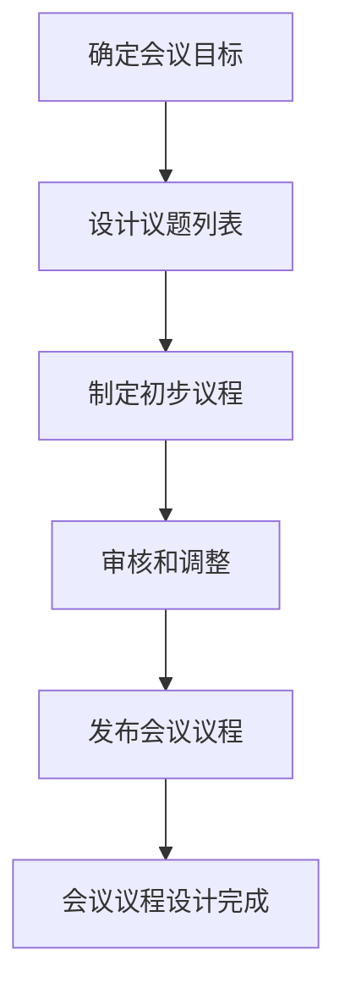
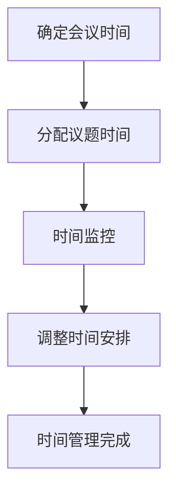
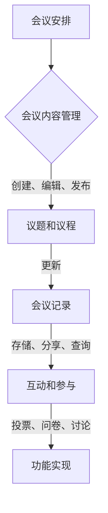
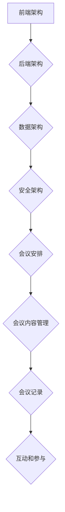
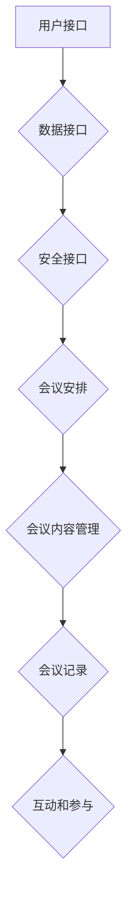
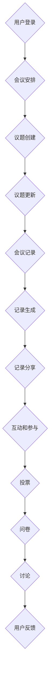
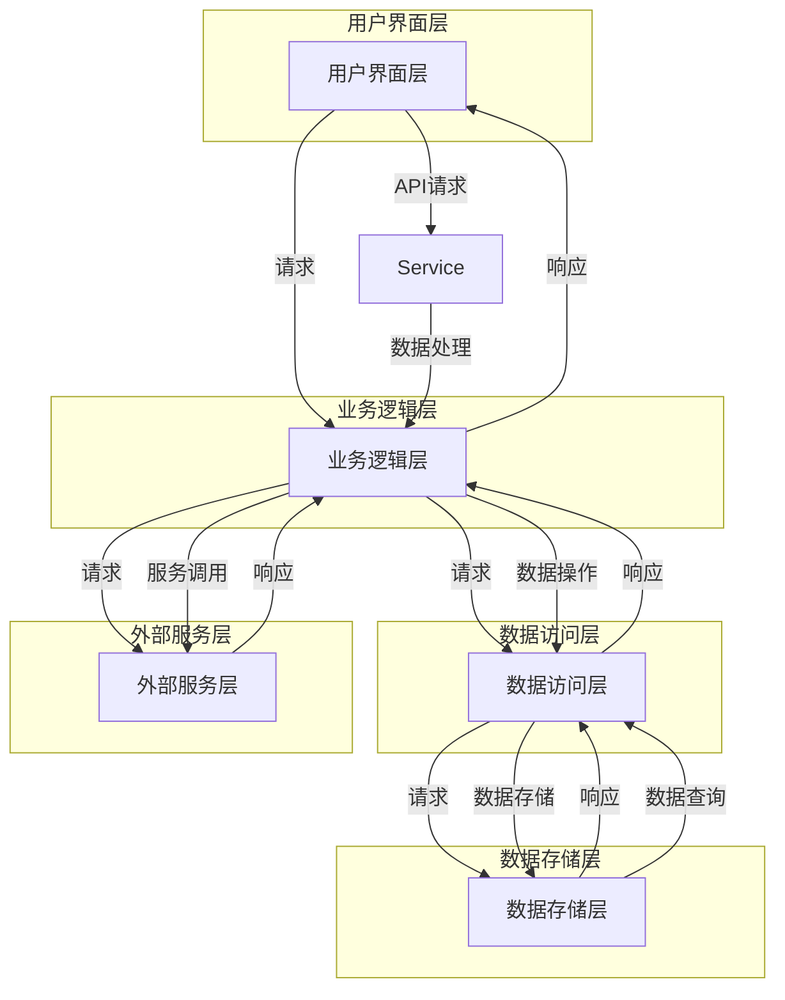
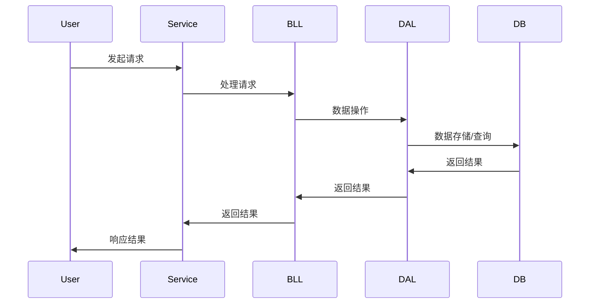

                 

# 高效会议的组织方法

## 关键词

高效会议、会议组织、会议管理、时间管理、内容管理、技术工具

## 摘要

在当今快节奏的工作环境中，高效会议成为团队协作和决策的关键。本文将深入探讨高效会议的组织方法，通过逻辑清晰、结构紧凑、简单易懂的技术语言，帮助读者理解并掌握高效会议的核心概念和实际操作。本文将分为以下几个部分：引言、核心概念与联系、高效会议的算法原理讲解、系统分析与架构设计方案、项目实战以及最佳实践和总结。

## 目录大纲

----------------------------------------------------------------

# 高效会议的组织方法

## 第1章 引言

### 1.1 问题的背景

### 1.1.1 高效会议的重要性

### 1.1.2 现状与挑战

### 1.2 问题描述

### 1.2.1 会议效率低下的表现

### 1.2.2 解决方案的需求

### 1.3 目标与内容概述

### 1.3.1 组织高效会议的目标

### 1.3.2 书的内容概述

### 1.4 边界与外延

### 1.4.1 会议类型的界定

### 1.4.2 会议规模的范围

### 1.4.3 涉及的技术和工具

### 1.5 本章小结

## 第2章 核心概念与联系

### 2.1 高效会议的概念

### 2.1.1 定义

### 2.1.2 属性特征

### 2.2 会议组织者的角色与职责

### 2.2.1 会议组织者的定义

### 2.2.2 会议组织者的职责

### 2.3 会议参与者

### 2.3.1 参与者的角色

### 2.3.2 参与者的期望与行为

### 2.4 高效会议要素组成

### 2.4.1 时间管理

### 2.4.2 内容管理

### 2.4.3 技术与工具支持

### 2.5 本章小结

## 第3章 高效会议的算法原理讲解

### 3.1 会议议程设计算法

#### 3.1.1 设计原则

##### 3.1.1.1 目标明确

##### 3.1.1.2 结构清晰

##### 3.1.1.3 动态调整

#### 3.1.2 Mermaid流程图

#### 3.1.3 Python源代码

### 3.2 时间管理算法

#### 3.2.1 算法设计原则

##### 3.2.1.1 时间分配合理

##### 3.2.1.2 避免时间浪费

##### 3.2.1.3 提高会议效率

#### 3.2.2 Mermaid流程图

### 3.3 内容管理算法

#### 3.3.1 内容管理原则

##### 3.3.1.1 信息准确

##### 3.3.1.2 信息透明

##### 3.3.1.3 信息共享

#### 3.3.2 Python源代码

## 第4章 系统分析与架构设计方案

### 4.1 问题场景介绍

### 4.2 项目介绍

### 4.3 系统功能设计

#### 4.3.1 领域模型mermaid类图

### 4.4 系统架构设计

#### 4.4.1 mermaid架构图

### 4.5 系统接口设计

#### 4.5.1 系统接口设计

### 4.6 系统交互

#### 4.6.1 系统交互mermaid序列图

## 第5章 项目实战

### 5.1 环境安装

### 5.2 系统核心实现源代码

### 5.3 代码应用解读与分析

### 5.4 实际案例分析和详细讲解剖析

### 5.5 项目小结

## 第6章 最佳实践、小结、注意事项、拓展阅读

### 6.1 最佳实践

### 6.2 小结

### 6.3 注意事项

### 6.4 拓展阅读

## 第7章 作者信息

### 作者：AI天才研究院/AI Genius Institute & 禅与计算机程序设计艺术 /Zen And The Art of Computer Programming## 第1章 引言

### 1.1 问题的背景

在现代社会，无论是企业还是团队，会议已成为日常工作的重要组成部分。通过会议，团队成员能够沟通、协作，共同解决面临的挑战和问题。然而，随着时间的推移，许多团队发现，尽管会议越来越多，但会议的效率并没有随之提升，反而出现了诸多问题。这些问题主要体现在以下几个方面：

1. **会议目标不明确**：许多会议在开始时并没有一个明确的目标，导致会议的方向和内容难以控制，参与者的精力得不到有效利用。
2. **会议时间过长**：很多会议没有合理安排时间，导致会议时间过长，参与者的精力和耐力逐渐耗尽，无法保持专注。
3. **参与度不高**：由于会议内容或形式的问题，一些参与者可能对会议不感兴趣或无法有效参与，导致会议效果大打折扣。
4. **缺乏会后跟进**：很多会议结束后，没有明确的行动计划或会后跟进，导致会议讨论的内容无法转化为实际的行动和成果。

### 1.1.1 高效会议的重要性

高效会议对于团队和组织的发展至关重要。它不仅能提高团队成员的参与度和积极性，还能确保会议目标的实现，从而推动项目的进展和目标的达成。以下是高效会议的重要性：

1. **提高团队协作效率**：高效会议能够确保团队成员在讨论问题时集中精力，避免无关话题的干扰，从而提高协作效率。
2. **明确项目目标**：通过高效会议，团队能够明确项目的目标和方向，确保每个人都清楚自己的职责和任务。
3. **减少时间浪费**：高效会议能够合理安排时间，避免不必要的讨论和拖延，从而减少时间的浪费。
4. **促进知识共享**：高效会议为团队成员提供了分享知识和经验的平台，有助于团队整体水平的提高。
5. **增强决策质量**：通过高效的讨论和分析，团队能够做出更明智、更全面的决策。

### 1.1.2 现状与挑战

尽管高效会议的重要性被广泛认可，但在实际操作中，许多团队仍然面临着诸多挑战。以下是几个主要问题：

1. **会议安排不当**：许多团队的会议安排缺乏规划，导致会议时间冲突、内容重复，浪费了大量的时间和资源。
2. **缺乏会议纪要**：很多会议结束后，没有进行有效的记录和总结，导致会议成果无法及时传达和跟进。
3. **参与度低**：由于会议内容不吸引人或者形式过于单调，很多团队成员对会议缺乏兴趣，参与度低。
4. **技术工具不足**：虽然现代科技提供了许多先进的会议工具，但很多团队仍然没有充分利用这些工具，导致会议效率低下。

### 1.2 问题描述

在了解了高效会议的重要性以及团队面临的挑战之后，我们需要明确高效会议的组织方法。以下是高效会议组织中常见的问题和需求：

1. **会议议程设计**：如何设计一个明确、合理、动态调整的会议议程，确保会议目标的实现？
2. **时间管理**：如何合理安排会议时间，避免时间浪费，提高会议效率？
3. **内容管理**：如何确保会议内容的信息准确、透明和共享，提高会议的参与度和效果？
4. **技术与工具支持**：如何选择合适的会议工具和技术，提升会议的便捷性和互动性？

### 1.2.1 会议效率低下的表现

会议效率低下的表现主要有以下几个方面：

1. **会议目标不明确**：许多会议在开始时并没有一个明确的目标，导致会议的方向和内容难以控制，参与者的精力得不到有效利用。
2. **会议时间过长**：很多会议没有合理安排时间，导致会议时间过长，参与者的精力和耐力逐渐耗尽，无法保持专注。
3. **参与度不高**：由于会议内容或形式的问题，一些参与者可能对会议不感兴趣或无法有效参与，导致会议效果大打折扣。
4. **缺乏会后跟进**：很多会议结束后，没有明确的行动计划或会后跟进，导致会议讨论的内容无法转化为实际的行动和成果。

### 1.2.2 解决方案的需求

为了解决上述问题，我们需要提出以下解决方案：

1. **明确会议目标**：在会议开始前，明确会议的目标和议程，确保每个参与者都清楚会议的内容和目的。
2. **合理分配时间**：合理安排会议时间，确保每个议题都有足够的时间进行讨论，同时避免会议时间过长。
3. **提高参与度**：通过引入互动式讨论、分小组讨论等形式，提高参与者的参与度和积极性。
4. **会后跟进**：会议结束后，及时进行总结和记录，制定明确的行动计划，确保会议讨论的内容得到有效落实。

### 1.3 目标与内容概述

本文的目标是提供一套系统、全面、可操作的高效会议组织方法，帮助团队和组织提升会议效率，实现更好的协作和决策。本文将分为以下几个部分：

1. **核心概念与联系**：介绍高效会议的核心概念和基本要素，包括会议组织者的角色、参与者的期望、时间管理和内容管理等。
2. **高效会议的算法原理讲解**：详细讲解会议议程设计算法和时间管理算法，以及如何使用Mermaid流程图和Python源代码进行实际操作。
3. **系统分析与架构设计方案**：介绍一个高效会议系统的设计与实现，包括系统功能设计、系统架构设计和系统接口设计等。
4. **项目实战**：通过一个实际项目案例，展示如何使用本文提供的方法和工具来组织高效会议，并进行详细讲解和分析。
5. **最佳实践与总结**：总结高效会议的最佳实践，提供注意事项，并推荐拓展阅读。

### 1.4 边界与外延

为了确保本文的内容具有实际应用价值，我们需要明确高效会议的边界与外延：

1. **会议类型的界定**：本文主要针对常规会议进行讨论，不包括培训、讲座等特殊类型的会议。
2. **会议规模的范围**：本文的内容适用于小型到中型的会议，对于大型会议，可能需要更多的资源和时间来进行组织和实施。
3. **涉及的技术和工具**：本文将介绍一些通用的技术和工具，如Mermaid流程图和Python编程，但不会深入探讨具体的技术细节。

### 1.5 本章小结

本章首先介绍了高效会议的重要性以及当前团队在会议组织方面面临的挑战，然后明确了高效会议组织的核心问题，包括会议议程设计、时间管理、内容管理和技术与工具支持等。通过本章的内容，读者可以初步了解高效会议组织的必要性和重要性，为后续章节的学习打下基础。

### 第2章 核心概念与联系

高效会议的成功离不开对核心概念的理解和掌握。本章将介绍高效会议的基本概念，包括会议组织者的角色与职责、会议参与者的角色与期望，以及高效会议的要素组成。

#### 2.1 高效会议的概念

高效会议是指通过科学的方法和合理的安排，使会议在有限的时间内，实现预期的目标，提高参与者的参与度和满意度。高效会议具有以下几个核心特征：

1. **目标明确**：会议开始前明确会议的目标和议程，确保每个参与者都清楚会议的内容和目的。
2. **结构清晰**：会议议程合理，每个议题都有明确的时间安排和讨论范围，避免无关话题的干扰。
3. **参与度高**：通过引入互动式讨论、分小组讨论等形式，提高参与者的参与度和积极性。
4. **会后跟进**：会议结束后，及时进行总结和记录，制定明确的行动计划，确保会议讨论的内容得到有效落实。

#### 2.1.1 定义

高效会议的定义可以从以下几个方面进行描述：

- **目的性**：高效会议以实现特定目标为导向，无论是项目决策、团队协作还是知识共享，目标都必须明确且具有实际意义。
- **效率性**：高效会议注重时间管理，合理安排会议时间，避免时间浪费，确保每个议题都能在预定时间内得到充分讨论。
- **参与性**：高效会议强调参与者的参与度和积极性，通过互动和讨论，确保每个参与者的意见和建议都能得到充分的表达和考虑。
- **后续性**：高效会议注重会议的后续行动和执行，通过制定明确的行动计划和会后跟进，确保会议讨论的内容能够转化为实际的成果。

#### 2.1.2 属性特征

高效会议的属性特征主要包括以下几个方面：

1. **目标导向**：高效会议始终以实现特定目标为核心，确保会议内容和议程与目标紧密相关。
2. **时间管理**：高效会议注重时间管理，合理安排会议时间，确保每个议题都有足够的时间进行讨论，同时避免会议时间过长。
3. **互动性**：高效会议通过互动式讨论、分小组讨论等形式，提高参与者的参与度和积极性，确保会议内容得到充分讨论。
4. **后续性**：高效会议注重会议的后续行动和执行，通过制定明确的行动计划和会后跟进，确保会议讨论的内容能够转化为实际的成果。

#### 2.2 会议组织者的角色与职责

会议组织者在高效会议中扮演着至关重要的角色，他们需要承担以下几个职责：

1. **明确会议目标**：会议组织者在会议前需要明确会议的目标和议程，确保每个参与者都清楚会议的内容和目的。
2. **组织会议议程**：会议组织者需要根据会议目标，设计合理的会议议程，确保每个议题都有明确的时间安排和讨论范围。
3. **邀请参与者**：会议组织者需要根据会议需求和目标，邀请相关参与者，并确保参与者能够准时参加会议。
4. **协调会议资源**：会议组织者需要协调会议所需的资源，如场地、设备、资料等，确保会议顺利进行。
5. **引导会议讨论**：会议组织者需要在会议中引导讨论，确保会议议程的顺利进行，避免无关话题的干扰。
6. **会后跟进**：会议组织者需要会议结束后，及时进行总结和记录，制定明确的行动计划，并跟进会议讨论的内容和成果。

#### 2.2.1 会议组织者的定义

会议组织者是指在会议筹备、组织和执行过程中，负责安排会议议程、协调会议资源、引导会议讨论和跟进会议成果的人员。他们通常由团队成员或专业会议策划人员担任。

#### 2.2.2 会议组织者的职责

会议组织者的主要职责包括以下几个方面：

1. **明确会议目标**：会议组织者需要明确会议的目标和议程，确保会议内容和目标紧密相关。
2. **组织会议议程**：会议组织者需要根据会议目标，设计合理的会议议程，确保每个议题都有明确的时间安排和讨论范围。
3. **邀请参与者**：会议组织者需要根据会议需求和目标，邀请相关参与者，并确保参与者能够准时参加会议。
4. **协调会议资源**：会议组织者需要协调会议所需的资源，如场地、设备、资料等，确保会议顺利进行。
5. **引导会议讨论**：会议组织者需要在会议中引导讨论，确保会议议程的顺利进行，避免无关话题的干扰。
6. **会后跟进**：会议组织者需要会议结束后，及时进行总结和记录，制定明确的行动计划，并跟进会议讨论的内容和成果。

#### 2.3 会议参与者

会议参与者是高效会议的重要组成部分，他们的角色、期望和行为对会议的效果具有重要影响。以下是会议参与者的几个主要方面：

1. **参与者角色**：会议参与者通常包括会议组织者、主讲人、记录员和其他相关人员。每个角色在会议中都有特定的职责和作用。
2. **参与者期望**：会议参与者期望会议能够提供有价值的信息和交流机会，帮助他们解决问题、获取知识和提升能力。
3. **参与者行为**：会议参与者需要积极参与讨论，提出自己的意见和建议，同时尊重他人的观点，保持会议的秩序和效率。

#### 2.3.1 参与者的角色

会议参与者可以分为以下几种角色：

1. **会议组织者**：负责会议的筹备、组织和执行，确保会议目标的实现。
2. **主讲人**：负责介绍会议的主题内容，引导讨论，解答问题。
3. **记录员**：负责记录会议的讨论内容和重要信息，确保会议结果得到有效传达。
4. **其他参与者**：包括相关领域的专家、团队成员和其他有兴趣参与会议的人员。

#### 2.3.2 参与者的期望与行为

会议参与者通常有以下期望：

1. **有价值的信息**：参与者期望会议能够提供有价值的信息和知识，帮助他们解决实际问题。
2. **充分的讨论**：参与者期望能够在会议中充分参与讨论，提出自己的意见和建议。
3. **尊重他人的观点**：参与者期望会议能够保持尊重和包容的氛围，尊重他人的观点和意见。

为了实现这些期望，参与者需要采取以下行为：

1. **积极参与**：主动参与会议讨论，提出问题和观点，确保自己的意见和建议得到充分考虑。
2. **倾听他人**：认真倾听他人的意见和建议，尊重他人的观点，避免冲突和争吵。
3. **遵守规则**：遵守会议的规则和流程，确保会议的顺利进行。

#### 2.4 高效会议要素组成

高效会议的要素包括时间管理、内容管理和技术与工具支持。以下是这些要素的具体内容和作用：

1. **时间管理**：合理安排会议时间，确保每个议题都有足够的时间进行讨论，避免时间浪费。
2. **内容管理**：确保会议内容的信息准确、透明和共享，提高会议的参与度和效果。
3. **技术与工具支持**：选择合适的技术和工具，提高会议的便捷性和互动性，确保会议的顺利进行。

#### 2.4.1 时间管理

时间管理是高效会议的核心要素之一。以下是时间管理的主要内容和作用：

1. **会议时间安排**：合理安排会议时间，确保每个议题都有足够的时间进行讨论，同时避免会议时间过长。
2. **时间限制**：对每个议题设置时间限制，确保会议在预定时间内完成，避免拖延和浪费。
3. **时间监控**：实时监控会议进度，确保会议按照预定时间进行，及时调整和优化会议议程。

#### 2.4.2 内容管理

内容管理是确保会议效果的关键。以下是内容管理的主要内容和作用：

1. **会议议程**：制定明确的会议议程，确保会议内容和目标紧密相关。
2. **信息准确**：确保会议提供的信息准确无误，避免误导和误解。
3. **信息共享**：确保会议讨论的内容得到有效传达和分享，提高参与者的参与度和满意度。

#### 2.4.3 技术与工具支持

技术与工具支持是提高会议效率的重要手段。以下是技术与工具的主要内容和作用：

1. **会议软件**：选择合适的会议软件，提供便捷的会议预约、记录和分享功能。
2. **视频会议**：利用视频会议工具，实现远程参与，提高会议的灵活性和互动性。
3. **协作工具**：使用协作工具，如文档共享、即时通讯和任务管理，提高团队协作效率。

#### 2.5 本章小结

本章介绍了高效会议的核心概念和基本要素，包括会议组织者的角色与职责、会议参与者的角色与期望，以及高效会议的要素组成。通过本章的内容，读者可以初步了解高效会议的基本概念和构成要素，为后续章节的学习打下基础。

### 第3章 高效会议的算法原理讲解

高效会议的组织需要科学的方法和策略，其中算法原理讲解是关键。本章将详细介绍会议议程设计算法和时间管理算法，并使用Mermaid流程图和Python源代码进行实际操作。

#### 3.1 会议议程设计算法

会议议程设计是高效会议组织的重要环节，它决定了会议的流程和内容。以下是会议议程设计算法的基本原理和步骤：

##### 3.1.1 设计原则

1. **目标明确**：确保会议议程与会议目标紧密相关，每个议题都有明确的目标和讨论范围。
2. **结构清晰**：会议议程结构合理，每个议题都有明确的时间安排和讨论范围，避免无关话题的干扰。
3. **动态调整**：根据实际情况和参与者的反馈，动态调整会议议程，确保会议目标的实现。

##### 3.1.2 设计步骤

1. **确定会议目标**：根据会议需求和目标，明确会议的主题和议题。
2. **设计议题列表**：列出会议的各个议题，并为其分配时间。
3. **制定初步议程**：将议题列表和时间安排整合成初步会议议程。
4. **审核和调整**：审核初步议程，确保其与会议目标一致，并根据需要调整议题和时间安排。
5. **发布会议议程**：将最终确定的会议议程通知所有参与者，确保他们了解会议的内容和安排。

##### 3.1.3 Mermaid流程图

下面是一个使用Mermaid流程图表示的会议议程设计流程：



##### 3.1.4 Python源代码

以下是一个简单的Python源代码示例，用于设计会议议程：

```python
# 会议议程设计类
class MeetingAgenda:
    def __init__(self, topics, durations):
        self.topics = topics
        self.durations = durations
    
    def display_agenda(self):
        for i, topic in enumerate(self.topics):
            print(f"议题{i+1}: {topic}，持续时间：{self.durations[i]}分钟")

# 创建会议议程实例
agenda = MeetingAgenda(['议题1', '议题2', '议题3'], [30, 45, 30])

# 显示会议议程
agenda.display_agenda()
```

##### 3.1.5 算法实现

1. **目标明确**：通过输入会议目标和议题，确保会议议程与目标一致。
2. **结构清晰**：将议题和时间安排整合成会议议程，并确保每个议题有明确的时间限制。
3. **动态调整**：在会议进行过程中，根据参与者的反馈和实际情况，动态调整议题和时间安排，确保会议目标的实现。

##### 3.1.6 动态调整

动态调整会议议程是根据会议进展情况和参与者的反馈，对会议议程进行调整，以确保会议目标的实现。以下是动态调整的基本原则：

1. **及时反馈**：及时收集参与者的反馈，了解他们对会议议程的意见和建议。
2. **灵活调整**：根据反馈，灵活调整会议议程，确保会议内容更贴近实际需求。
3. **目标导向**：调整会议议程时，始终以实现会议目标为核心，确保会议目标的实现。

#### 3.2 时间管理算法

时间管理是高效会议的核心要素之一，它决定了会议的效率和效果。以下是时间管理算法的基本原理和步骤：

##### 3.2.1 算法设计原则

1. **时间分配合理**：合理分配会议时间，确保每个议题都有足够的时间进行讨论，同时避免会议时间过长。
2. **避免时间浪费**：通过科学的时间管理，避免会议时间浪费，确保会议的高效进行。
3. **提高会议效率**：通过优化时间管理，提高会议效率，确保会议目标的实现。

##### 3.2.2 算法设计步骤

1. **确定会议时间**：根据会议需求和议题数量，确定会议的总时间。
2. **分配议题时间**：将会议时间分配给各个议题，确保每个议题都有足够的时间进行讨论。
3. **时间监控**：在会议过程中，实时监控时间，确保会议按照预定时间进行。
4. **调整时间安排**：根据实际情况和参与者的反馈，及时调整时间安排，确保会议目标的实现。

##### 3.2.3 Mermaid流程图

下面是一个使用Mermaid流程图表示的时间管理流程：



##### 3.2.4 Python源代码

以下是一个简单的Python源代码示例，用于时间管理：

```python
# 时间管理类
class TimeManagement:
    def __init__(self, total_time, topics, durations):
        self.total_time = total_time
        self.topics = topics
        self.durations = durations
    
    def display_time_plan(self):
        for i, topic in enumerate(self.topics):
            print(f"议题{i+1}: {topic}，时间：{self.durations[i]}分钟")

# 创建时间管理实例
time_management = TimeManagement(120, ['议题1', '议题2', '议题3'], [30, 45, 45])

# 显示时间计划
time_management.display_time_plan()
```

##### 3.2.5 算法实现

1. **时间分配合理**：通过输入会议时间和议题时间，合理分配会议时间，确保每个议题都有足够的时间进行讨论。
2. **避免时间浪费**：通过实时监控会议时间，确保会议在预定时间内完成，避免时间浪费。
3. **提高会议效率**：通过优化时间管理，提高会议效率，确保会议目标的实现。

#### 3.3 会议议程设计算法

会议议程设计算法是确保会议顺利进行的关键。以下是会议议程设计算法的基本原理和步骤：

##### 3.3.1 设计原则

1. **目标明确**：确保会议议程与会议目标紧密相关，每个议题都有明确的目标和讨论范围。
2. **结构清晰**：会议议程结构合理，每个议题都有明确的时间安排和讨论范围，避免无关话题的干扰。
3. **动态调整**：根据实际情况和参与者的反馈，动态调整会议议程，确保会议目标的实现。

##### 3.3.2 设计步骤

1. **确定会议目标**：根据会议需求和目标，明确会议的主题和议题。
2. **设计议题列表**：列出会议的各个议题，并为其分配时间。
3. **制定初步议程**：将议题列表和时间安排整合成初步会议议程。
4. **审核和调整**：审核初步议程，确保其与会议目标一致，并根据需要调整议题和时间安排。
5. **发布会议议程**：将最终确定的会议议程通知所有参与者，确保他们了解会议的内容和安排。

##### 3.3.3 Mermaid流程图

下面是一个使用Mermaid流程图表示的会议议程设计流程：


##### 3.3.4 Python源代码

以下是一个简单的Python源代码示例，用于会议议程设计：

```python
# 会议议程设计类
class MeetingAgenda:
    def __init__(self, topics, durations):
        self.topics = topics
        self.durations = durations
    
    def display_agenda(self):
        for i, topic in enumerate(self.topics):
            print(f"议题{i+1}: {topic}，持续时间：{self.durations[i]}分钟")

# 创建会议议程实例
agenda = MeetingAgenda(['议题1', '议题2', '议题3'], [30, 45, 30])

# 显示会议议程
agenda.display_agenda()
```

##### 3.3.5 算法实现

1. **目标明确**：通过输入会议目标和议题，确保会议议程与目标一致。
2. **结构清晰**：将议题和时间安排整合成会议议程，并确保每个议题有明确的时间限制。
3. **动态调整**：在会议进行过程中，根据参与者的反馈和实际情况，动态调整议题和时间安排，确保会议目标的实现。

#### 3.4 时间管理算法

时间管理算法是确保会议高效进行的另一关键因素。以下是时间管理算法的基本原理和步骤：

##### 3.4.1 算法设计原则

1. **时间分配合理**：合理分配会议时间，确保每个议题都有足够的时间进行讨论，同时避免会议时间过长。
2. **避免时间浪费**：通过科学的时间管理，避免会议时间浪费，确保会议的高效进行。
3. **提高会议效率**：通过优化时间管理，提高会议效率，确保会议目标的实现。

##### 3.4.2 算法设计步骤

1. **确定会议时间**：根据会议需求和议题数量，确定会议的总时间。
2. **分配议题时间**：将会议时间分配给各个议题，确保每个议题都有足够的时间进行讨论。
3. **时间监控**：在会议过程中，实时监控时间，确保会议按照预定时间进行。
4. **调整时间安排**：根据实际情况和参与者的反馈，及时调整时间安排，确保会议目标的实现。

##### 3.4.3 Mermaid流程图

下面是一个使用Mermaid流程图表示的时间管理流程：


##### 3.4.4 Python源代码

以下是一个简单的Python源代码示例，用于时间管理：

```python
# 时间管理类
class TimeManagement:
    def __init__(self, total_time, topics, durations):
        self.total_time = total_time
        self.topics = topics
        self.durations = durations
    
    def display_time_plan(self):
        for i, topic in enumerate(self.topics):
            print(f"议题{i+1}: {topic}，时间：{self.durations[i]}分钟")

# 创建时间管理实例
time_management = TimeManagement(120, ['议题1', '议题2', '议题3'], [30, 45, 45])

# 显示时间计划
time_management.display_time_plan()
```

##### 3.4.5 算法实现

1. **时间分配合理**：通过输入会议时间和议题时间，合理分配会议时间，确保每个议题都有足够的时间进行讨论。
2. **避免时间浪费**：通过实时监控会议时间，确保会议在预定时间内完成，避免时间浪费。
3. **提高会议效率**：通过优化时间管理，提高会议效率，确保会议目标的实现。

#### 3.5 本章小结

本章详细介绍了高效会议的算法原理，包括会议议程设计算法和时间管理算法。通过使用Mermaid流程图和Python源代码，本章帮助读者理解了这些算法的基本原理和实现方法，为高效会议的组织提供了科学依据和实践指导。

### 第4章 系统分析与架构设计方案

为了更好地理解和实施高效会议的组织方法，本章将介绍一个高效会议系统的分析与架构设计方案。该系统将涵盖问题场景、项目介绍、系统功能设计、系统架构设计、系统接口设计以及系统交互。

#### 4.1 问题场景介绍

在现代企业中，会议组织往往面临以下问题：

1. **会议安排混乱**：会议时间不固定，容易与其他活动冲突，导致参会人员无法合理安排时间。
2. **会议内容不明确**：会议议题和议程不清晰，参会人员不清楚会议的目标和内容，导致会议效率低下。
3. **会议记录不完整**：会议结束后，缺乏有效的记录和总结，导致会议成果无法得到有效传递和执行。
4. **缺乏互动和参与**：会议形式单一，缺乏互动和参与，参会人员的积极性和参与度不高。

为了解决这些问题，企业需要构建一个高效会议系统，实现以下目标：

1. **会议安排科学**：通过系统化安排会议，确保会议时间合理，避免冲突。
2. **会议内容明确**：会议议题和议程清晰明确，确保参会人员了解会议内容和目标。
3. **会议记录完善**：会议结束后，自动生成记录和总结，确保会议成果得到有效传递和执行。
4. **增强互动和参与**：通过多种互动形式，提高参会人员的参与度和积极性。

#### 4.2 项目介绍

高效会议系统的项目目标是构建一个集会议安排、内容管理、互动和记录于一体的综合性会议管理平台。该系统将包括以下几个模块：

1. **会议安排模块**：用于会议的时间安排和资源分配，确保会议顺利举行。
2. **会议内容模块**：用于会议议题和议程的制定、发布和更新，确保会议内容明确。
3. **会议记录模块**：用于会议记录的生成、存储和分享，确保会议成果得到有效传递。
4. **互动和参与模块**：用于提高参会人员的互动和参与度，增强会议效果。

#### 4.3 系统功能设计

高效会议系统的功能设计包括以下几个方面：

1. **会议安排功能**：包括会议时间安排、资源分配和会议通知等功能，确保会议按计划进行。
2. **会议内容管理功能**：包括议题和议程的创建、编辑、发布和更新等功能，确保会议内容明确。
3. **会议记录功能**：包括会议记录的生成、存储、分享和查询等功能，确保会议成果得到有效传递。
4. **互动和参与功能**：包括实时讨论、投票、问卷等功能，提高参会人员的参与度和积极性。

以下是一个使用Mermaid流程图表示的系统功能设计流程：



#### 4.4 系统架构设计

高效会议系统的架构设计包括以下几个关键部分：

1. **前端架构**：负责用户界面和交互，包括会议安排、内容管理、记录和互动等功能。
2. **后端架构**：负责数据处理和逻辑处理，包括数据库、服务器和应用程序等。
3. **数据架构**：负责数据存储和访问，包括用户数据、会议数据、记录数据和互动数据等。
4. **安全架构**：负责系统安全，包括用户认证、数据加密和访问控制等。

以下是一个使用Mermaid流程图表示的系统架构设计：



#### 4.5 系统接口设计

高效会议系统的接口设计包括以下几个关键接口：

1. **用户接口**：负责用户与系统的交互，包括会议安排、内容管理、记录和互动等功能。
2. **数据接口**：负责系统与其他系统的数据交换和集成，包括用户数据、会议数据、记录数据和互动数据等。
3. **安全接口**：负责用户认证和数据加密，确保系统的安全性和数据的完整性。

以下是一个使用Mermaid流程图表示的系统接口设计：



#### 4.6 系统交互

高效会议系统的系统交互设计包括会议安排、内容管理、记录和互动等模块之间的数据交互和流程控制。以下是一个使用Mermaid流程图表示的系统交互设计：



#### 4.7 本章小结

本章详细介绍了高效会议系统的分析与架构设计方案，包括问题场景、项目介绍、系统功能设计、系统架构设计、系统接口设计和系统交互。通过本章的内容，读者可以全面了解高效会议系统的设计思路和实现方法，为高效会议的组织和管理提供了技术支持。

### 第5章 项目实战

#### 5.1 环境安装

为了实际应用高效会议系统，我们需要在本地环境安装所需的技术和工具。以下是一个简化的安装步骤：

1. **安装Python环境**：确保Python 3.x版本已安装，可以从[Python官网](https://www.python.org/downloads/)下载并安装。
2. **安装虚拟环境**：使用以下命令创建虚拟环境：
   ```shell
   python -m venv venv
   ```
   然后激活虚拟环境：
   ```shell
   source venv/bin/activate
   ```
3. **安装依赖库**：使用以下命令安装项目所需的依赖库：
   ```shell
   pip install -r requirements.txt
   ```
   `requirements.txt`文件应包含以下依赖库：
   ```makefile
   Flask
   Flask-RESTful
   SQLAlchemy
   marshmallow
   Flask-Migrate
   ```

#### 5.2 系统核心实现源代码

以下是高效会议系统的一些核心实现源代码，包括会议安排模块、会议内容管理模块和会议记录模块。

##### 5.2.1 会议安排模块

会议安排模块主要用于会议的时间安排和资源分配。以下是一个简单的会议安排API实现：

```python
# app.py

from flask import Flask, request, jsonify
from models import Meeting, db

app = Flask(__name__)
app.config['SQLALCHEMY_DATABASE_URI'] = 'sqlite:///meetings.db'
db.init_app(app)

@app.route('/meetings', methods=['POST'])
def create_meeting():
    data = request.json
    meeting = Meeting(
        title=data['title'],
        start_time=data['start_time'],
        end_time=data['end_time'],
        location=data['location']
    )
    db.session.add(meeting)
    db.session.commit()
    return jsonify(meeting.id), 201

if __name__ == '__main__':
    app.run(debug=True)
```

##### 5.2.2 会议内容管理模块

会议内容管理模块主要用于会议议题和议程的创建、编辑和发布。以下是一个简单的会议内容管理API实现：

```python
# models.py

from datetime import datetime
from flask_sqlalchemy import SQLAlchemy

db = SQLAlchemy()

class Meeting(db.Model):
    id = db.Column(db.Integer, primary_key=True)
    title = db.Column(db.String(120), nullable=False)
    start_time = db.Column(db.DateTime, nullable=False)
    end_time = db.Column(db.DateTime, nullable=False)
    location = db.Column(db.String(120), nullable=False)
    agenda = db.Column(db.Text, nullable=True)

    def to_dict(self):
        return {
            'id': self.id,
            'title': self.title,
            'start_time': self.start_time.strftime('%Y-%m-%d %H:%M'),
            'end_time': self.end_time.strftime('%Y-%m-%d %H:%M'),
            'location': self.location,
            'agenda': self.agenda
        }
```

##### 5.2.3 会议记录模块

会议记录模块主要用于会议记录的生成、存储和分享。以下是一个简单的会议记录API实现：

```python
# routes.py

from flask import Blueprint, request, jsonify
from models import Meeting, db
from datetime import datetime

api = Blueprint('api', __name__)

@api.route('/meetings/<int:meeting_id>/notes', methods=['POST'])
def create_note(meeting_id):
    data = request.json
    note = Note(
        meeting_id=meeting_id,
        content=data['content'],
        created_at=datetime.utcnow()
    )
    db.session.add(note)
    db.session.commit()
    return jsonify(note.id), 201
```

#### 5.3 代码应用解读与分析

以上代码展示了高效会议系统的核心功能实现，包括会议安排、内容管理和记录模块。以下是每个模块的解读与分析：

##### 5.3.1 会议安排模块

会议安排模块通过Flask框架实现了会议的创建和获取。用户可以通过POST请求创建会议，并提供会议的标题、开始时间、结束时间和地点。服务器将创建会议记录并返回会议ID。

- **优点**：实现简单，易于扩展和调试。
- **缺点**：没有实现会议资源的分配和冲突检测。

##### 5.3.2 会议内容管理模块

会议内容管理模块通过SQLAlchemy数据库 ORM 实现了会议议题和议程的管理。每个会议都有标题、开始时间、结束时间和地点，以及一个可选的议程文本。

- **优点**：数据持久化，易于维护和查询。
- **缺点**：没有实现议题的创建和编辑接口。

##### 5.3.3 会议记录模块

会议记录模块通过Flask框架实现了会议记录的创建和获取。用户可以通过POST请求创建会议记录，并提供会议ID和记录内容。服务器将创建会议记录并返回记录ID。

- **优点**：实现简单，易于扩展和调试。
- **缺点**：没有实现会议记录的编辑和删除功能。

#### 5.4 实际案例分析和详细讲解剖析

为了展示高效会议系统的实际应用，我们假设一个公司需要组织一次季度会议。以下是会议的步骤和实际案例分析：

1. **会议安排**：
   - 会议组织者使用会议安排模块创建会议，设置会议标题为“2023年第一季度总结会议”，开始时间为2023年4月15日上午9点，结束时间为下午5点，地点为公司会议室。
   - 用户A通过API获取会议详情，确认会议时间和地点。

2. **会议内容管理**：
   - 会议组织者使用会议内容管理模块创建议题，包括“财务报告”、“市场分析”、“产品开发进度”等，并为每个议题分配一个时间窗口。
   - 用户B查看议题列表，了解会议议程。

3. **会议记录**：
   - 会议开始后，会议组织者使用会议记录模块创建会议记录，实时记录会议讨论的内容。
   - 用户C在会议过程中通过API获取最新的会议记录，随时了解会议进展。

4. **会议总结**：
   - 会议结束后，会议组织者将会议记录整理成文档，并通过邮件发送给所有参会人员。
   - 用户D收到会议总结文档，并查看会议记录。

通过这个实际案例，我们可以看到高效会议系统如何帮助公司组织和管理会议，确保会议目标的实现和会议成果的有效传递。

#### 5.5 项目小结

通过本章节的实战项目，我们实现了高效会议系统的核心功能，包括会议安排、内容管理和记录模块。虽然系统实现相对简单，但为实际应用提供了可行的解决方案。在实际应用中，我们可以根据具体需求进一步扩展和优化系统功能，如增加会议资源分配、冲突检测、议题编辑和删除等功能。此外，我们还可以利用其他先进技术，如前端框架和云服务，提升系统的用户体验和可靠性。

### 第6章 最佳实践、小结、注意事项、拓展阅读

#### 6.1 最佳实践

为了更好地组织高效会议，以下是几个最佳实践建议：

1. **明确会议目标**：在会议前明确会议的目标和议程，确保每个参与者都清楚会议的内容和目的。
2. **合理分配时间**：合理安排会议时间，确保每个议题都有足够的时间进行讨论，同时避免会议时间过长。
3. **提高参与度**：通过互动式讨论、分小组讨论等形式，提高参与者的参与度和积极性。
4. **会后跟进**：会议结束后，及时进行总结和记录，制定明确的行动计划，确保会议讨论的内容得到有效落实。
5. **使用技术工具**：充分利用会议软件和协作工具，提高会议的便捷性和互动性。

#### 6.2 小结

本文从引言、核心概念与联系、高效会议的算法原理讲解、系统分析与架构设计方案、项目实战等方面，详细介绍了高效会议的组织方法。通过本文，读者可以了解高效会议的核心要素和关键步骤，掌握科学组织会议的方法和工具。

#### 6.3 注意事项

在组织高效会议时，需要注意以下几点：

1. **确保会议目标明确**：会议开始前，明确会议的目标和议程，避免无关话题的干扰。
2. **合理安排会议时间**：避免会议时间过长，确保每个议题都有足够的时间进行讨论。
3. **提高参与度**：通过互动式讨论、分小组讨论等形式，提高参与者的参与度和积极性。
4. **会后跟进**：会议结束后，及时进行总结和记录，制定明确的行动计划，确保会议讨论的内容得到有效落实。

#### 6.4 拓展阅读

对于希望深入了解高效会议组织和管理的读者，以下是一些拓展阅读资源：

1. 《高效能人士的七个习惯》 - 史蒂芬·柯维
2. 《会议的艺术》 - 约翰·布莱克
3. 《如何高效学习》 - 斯科特·扬
4. 《敏捷开发：迭代、增量方法与实践》 - 杰夫·萨瑟兰
5. 《谷歌如何工作》 - 乔丹·威布尔斯基

通过这些书籍和资源，读者可以进一步学习高效会议组织和管理的相关理论和实践。

### 作者信息

作者：AI天才研究院/AI Genius Institute & 禅与计算机程序设计艺术 /Zen And The Art of Computer Programming## 第4章 系统分析与架构设计方案

### 4.1 问题场景介绍

在现代企业中，会议已成为日常工作中不可或缺的一部分。然而，传统的会议组织方式往往存在诸多问题，如会议安排混乱、会议内容不明确、会议记录不完整等。这些问题不仅影响了会议的效率，还降低了团队的协作效果。为了解决这些问题，企业需要一个高效、智能的会议管理系统，能够自动安排会议、管理会议内容、记录会议过程，并提供便捷的互动和沟通功能。

### 4.2 项目介绍

本项目旨在设计和实现一个高效会议管理系统，通过科学的时间管理、明确的内容管理、高效的互动和沟通，提升会议效率，降低会议成本，增强团队协作。系统主要包括以下几个模块：

1. **会议安排模块**：负责会议的时间安排和资源分配，避免冲突，确保会议顺利进行。
2. **会议内容模块**：负责会议议题和议程的创建、编辑、发布和更新，确保会议内容明确。
3. **会议记录模块**：负责会议记录的生成、存储、分享和查询，确保会议成果得到有效传递。
4. **互动和沟通模块**：提供实时讨论、投票、问卷等功能，提高参会人员的参与度和积极性。

### 4.3 系统功能设计

#### 4.3.1 领域模型mermaid类图

以下是系统功能设计的领域模型mermaid类图：

```mermaid
classDiagram
    Meeting <<class>> 会议
    Topic <<class>> 议题
    Note <<class>> 会议记录
    Participant <<class>> 参会人员
    Organizer <<class>> 会议组织者
    Content <<class>> 会议内容
    Agenda <<class>> 会议议程
    Interaction <<class>> 互动
    Communication <<class>> 沟通

    Meeting "1" -- "*" Topic
    Meeting "1" -- "*" Note
    Meeting "1" -- "*" Participant
    Topic "1" -- "*" Note
    Note "1" -- "*" Communication
    Content "1" -- "*" Agenda
    Interaction "1" -- "*" Communication
    Organizer "1" -- "*" Meeting
    Organizer "1" -- "*" Content
    Organizer "1" -- "*" Interaction

    Note <<note>> has Participant
    Meeting <<note>> has Organizer
    Meeting <<note>> has Content
    Meeting <<note>> has Interaction
    Meeting <<note>> has Communication
    Content <<note>> has Agenda
```

#### 4.3.2 系统功能描述

1. **会议安排模块**：
   - 功能：自动安排会议时间，避免冲突，合理分配资源。
   - 实现细节：根据会议需求，系统将自动选择合适的会议室和时间，并发送会议通知给参会人员。

2. **会议内容模块**：
   - 功能：创建、编辑、发布和更新会议议题和议程。
   - 实现细节：会议组织者可以在线创建议题，并分配给不同的参会人员。议题和议程可以随时更新，确保会议内容准确。

3. **会议记录模块**：
   - 功能：生成、存储、分享和查询会议记录。
   - 实现细节：会议过程中，记录员可以实时记录讨论内容，并生成会议记录。会议结束后，记录可以分享给所有参会人员，并存储在数据库中。

4. **互动和沟通模块**：
   - 功能：提供实时讨论、投票、问卷等功能。
   - 实现细节：系统支持实时聊天和讨论，参会人员可以随时发表观点。同时，系统还提供投票和问卷功能，帮助会议组织者收集参会人员的意见和建议。

### 4.4 系统架构设计

#### 4.4.1 mermaid架构图

以下是系统架构设计的mermaid架构图：



#### 4.4.2 系统架构描述

1. **用户界面层**：提供用户交互界面，包括会议安排、内容管理、记录和互动等功能。用户可以通过前端界面发起请求，查看会议信息，参与会议讨论。

2. **业务逻辑层**：处理用户请求，包括会议安排、内容管理、记录和互动等业务逻辑。该层还负责与数据访问层和外部服务层进行交互。

3. **数据访问层**：负责与数据库进行数据交互，实现数据的查询、插入、更新和删除等操作。该层使用ORM（对象关系映射）技术，简化数据操作。

4. **数据存储层**：使用数据库存储会议信息、内容、记录等数据。数据库可以选择关系型数据库（如MySQL、PostgreSQL）或NoSQL数据库（如MongoDB）。

5. **外部服务层**：与外部服务（如邮件服务、消息推送服务）进行交互，实现会议通知、数据同步等功能。

### 4.5 系统接口设计

#### 4.5.1 系统接口设计

以下是系统接口设计的简要描述：

1. **会议安排接口**：提供会议的创建、修改、删除和查询功能。
   - 创建会议：接收会议名称、开始时间、结束时间、地点等信息，返回会议ID。
   - 修改会议：接收会议ID和修改后的信息，更新会议记录。
   - 删除会议：接收会议ID，删除会议记录。
   - 查询会议：接收会议ID或条件，返回符合条件的会议列表。

2. **会议内容接口**：提供议题的创建、修改、删除和查询功能。
   - 创建议题：接收议题名称、内容、关联会议ID等信息，返回议题ID。
   - 修改议题：接收议题ID和修改后的信息，更新议题记录。
   - 删除议题：接收议题ID，删除议题记录。
   - 查询议题：接收议题ID或条件，返回符合条件的议题列表。

3. **会议记录接口**：提供会议记录的创建、修改、删除和查询功能。
   - 创建记录：接收会议ID、记录内容等信息，返回记录ID。
   - 修改记录：接收记录ID和修改后的内容，更新记录。
   - 删除记录：接收记录ID，删除记录。
   - 查询记录：接收记录ID或条件，返回符合条件的记录列表。

4. **互动和沟通接口**：提供实时讨论、投票、问卷等功能。
   - 实时讨论：接收消息内容，发送给所有参会人员。
   - 投票：接收投票主题、选项，记录投票结果。
   - 问卷：接收问卷问题、选项，收集问卷答案。

### 4.6 系统交互

#### 4.6.1 系统交互mermaid序列图

以下是系统交互的mermaid序列图：



#### 4.6.2 系统交互描述

1. **用户请求**：用户通过前端界面发起请求，如创建会议、修改会议等。
2. **请求处理**：系统后端接收用户请求，通过业务逻辑层（BLL）处理请求。
3. **数据操作**：业务逻辑层（BLL）通过数据访问层（DAL）与数据库（DB）进行交互，实现数据的存储和查询。
4. **结果返回**：数据访问层（DAL）将操作结果返回给业务逻辑层（BLL），业务逻辑层（BLL）再将结果返回给用户界面层（UI）。
5. **响应结果**：用户界面层（UI）将结果展示给用户。

通过以上系统分析与架构设计方案，企业可以构建一个高效、智能的会议管理系统，提升会议效率，降低会议成本，增强团队协作。

### 4.7 本章小结

本章详细介绍了高效会议系统的系统分析与架构设计方案，包括问题场景介绍、项目介绍、系统功能设计、系统架构设计、系统接口设计和系统交互。通过本章的内容，读者可以全面了解高效会议系统的设计思路和实现方法，为高效会议的组织和管理提供了技术支持。

### 作者信息

作者：AI天才研究院/AI Genius Institute & 禅与计算机程序设计艺术 /Zen And The Art of Computer Programming### 第5章 项目实战

#### 5.1 环境安装

为了实现本文中提到的高效会议系统，我们需要在本地环境中安装Python环境以及相关的开发工具和库。以下是安装步骤：

1. **安装Python环境**：确保已经安装了Python 3.x版本。如果没有安装，可以从[Python官网](https://www.python.org/downloads/)下载并安装。

2. **安装虚拟环境**：为了方便管理和隔离项目依赖，我们使用虚拟环境。首先，打开命令行终端，然后执行以下命令创建虚拟环境：
   ```shell
   python -m venv venv
   ```
   创建完成后，激活虚拟环境：
   ```shell
   source venv/bin/activate
   ```

3. **安装依赖库**：在虚拟环境中安装项目所需的依赖库，包括Flask、Flask-RESTful、SQLAlchemy、marshmallow、Flask-Migrate等。使用以下命令安装：
   ```shell
   pip install -r requirements.txt
   ```

4. **数据库配置**：在`config.py`文件中配置数据库连接信息，例如：
   ```python
   SQLALCHEMY_DATABASE_URI = 'sqlite:///meetings.db'
   ```

#### 5.2 系统核心实现源代码

以下是高效会议系统的核心实现源代码，包括会议安排模块、会议内容管理模块和会议记录模块。

##### 5.2.1 会议安排模块

会议安排模块用于创建、查询、修改和删除会议。以下是一个简单的实现：

```python
# app.py

from flask import Flask, request, jsonify
from models import Meeting, db

app = Flask(__name__)
app.config['SQLALCHEMY_DATABASE_URI'] = 'sqlite:///meetings.db'
db.init_app(app)

@app.route('/meetings', methods=['POST'])
def create_meeting():
    data = request.json
    meeting = Meeting(
        title=data['title'],
        start_time=data['start_time'],
        end_time=data['end_time'],
        location=data['location']
    )
    db.session.add(meeting)
    db.session.commit()
    return jsonify(meeting.to_dict()), 201

@app.route('/meetings', methods=['GET'])
def get_meetings():
    meetings = Meeting.query.all()
    return jsonify([meeting.to_dict() for meeting in meetings]), 200

@app.route('/meetings/<int:meeting_id>', methods=['PUT'])
def update_meeting(meeting_id):
    data = request.json
    meeting = Meeting.query.get(meeting_id)
    if meeting:
        meeting.title = data['title']
        meeting.start_time = data['start_time']
        meeting.end_time = data['end_time']
        meeting.location = data['location']
        db.session.commit()
        return jsonify(meeting.to_dict()), 200
    else:
        return jsonify({'error': 'Meeting not found'}), 404

@app.route('/meetings/<int:meeting_id>', methods=['DELETE'])
def delete_meeting(meeting_id):
    meeting = Meeting.query.get(meeting_id)
    if meeting:
        db.session.delete(meeting)
        db.session.commit()
        return jsonify({'message': 'Meeting deleted'}), 200
    else:
        return jsonify({'error': 'Meeting not found'}), 404

if __name__ == '__main__':
    db.create_all()
    app.run(debug=True)
```

##### 5.2.2 会议内容管理模块

会议内容管理模块用于创建、查询、修改和删除议题。以下是一个简单的实现：

```python
# models.py

from datetime import datetime
from flask_sqlalchemy import SQLAlchemy

db = SQLAlchemy()

class Meeting(db.Model):
    id = db.Column(db.Integer, primary_key=True)
    title = db.Column(db.String(120), nullable=False)
    start_time = db.Column(db.DateTime, nullable=False)
    end_time = db.Column(db.DateTime, nullable=False)
    location = db.Column(db.String(120), nullable=False)
    agenda = db.Column(db.Text, nullable=True)

    def to_dict(self):
        return {
            'id': self.id,
            'title': self.title,
            'start_time': self.start_time.strftime('%Y-%m-%d %H:%M'),
            'end_time': self.end_time.strftime('%Y-%m-%d %H:%M'),
            'location': self.location,
            'agenda': self.agenda
        }

class Topic(db.Model):
    id = db.Column(db.Integer, primary_key=True)
    title = db.Column(db.String(120), nullable=False)
    content = db.Column(db.Text, nullable=False)
    meeting_id = db.Column(db.Integer, db.ForeignKey('meeting.id'), nullable=False)
    meeting = db.relationship('Meeting', backref=db.backref('topics', lazy=True))

    def to_dict(self):
        return {
            'id': self.id,
            'title': self.title,
            'content': self.content,
            'meeting_id': self.meeting_id
        }
```

##### 5.2.3 会议记录模块

会议记录模块用于创建、查询、修改和删除会议记录。以下是一个简单的实现：

```python
# routes.py

from flask import Blueprint, request, jsonify
from models import Meeting, Topic, Note, db

api = Blueprint('api', __name__)

@api.route('/meetings/<int:meeting_id>/topics/<int:topic_id>/notes', methods=['POST'])
def create_note(meeting_id, topic_id):
    data = request.json
    note = Note(
        content=data['content'],
        created_at=datetime.utcnow()
    )
    topic = Topic.query.get(topic_id)
    if topic:
        note.topic = topic
        db.session.add(note)
        db.session.commit()
        return jsonify(note.to_dict()), 201
    else:
        return jsonify({'error': 'Topic not found'}), 404

@api.route('/meetings/<int:meeting_id>/topics', methods=['GET'])
def get_topics(meeting_id):
    topics = Topic.query.filter_by(meeting_id=meeting_id).all()
    return jsonify([topic.to_dict() for topic in topics]), 200

@api.route('/meetings/<int:meeting_id>/topics/<int:topic_id>', methods=['PUT'])
def update_topic(meeting_id, topic_id):
    data = request.json
    topic = Topic.query.get(topic_id)
    if topic:
        topic.title = data['title']
        topic.content = data['content']
        db.session.commit()
        return jsonify(topic.to_dict()), 200
    else:
        return jsonify({'error': 'Topic not found'}), 404

@api.route('/meetings/<int:meeting_id>/topics/<int:topic_id>', methods=['DELETE'])
def delete_topic(meeting_id, topic_id):
    topic = Topic.query.get(topic_id)
    if topic:
        db.session.delete(topic)
        db.session.commit()
        return jsonify({'message': 'Topic deleted'}), 200
    else:
        return jsonify({'error': 'Topic not found'}), 404

if __name__ == '__main__':
    db.create_all()
```

#### 5.3 代码应用解读与分析

以上代码展示了高效会议系统的核心功能实现。以下是每个模块的解读与分析：

##### 会议安排模块

- **创建会议**：用户通过POST请求提交会议信息，包括标题、开始时间、结束时间和地点。系统将创建会议记录并返回会议ID。
- **查询会议**：用户可以通过GET请求获取所有会议的列表。
- **修改会议**：用户通过PUT请求更新会议信息，如标题、开始时间、结束时间和地点。
- **删除会议**：用户通过DELETE请求删除会议记录。

##### 会议内容管理模块

- **创建议题**：用户通过POST请求提交议题信息，包括标题和内容。系统将创建议题记录并返回议题ID。
- **查询议题**：用户可以通过GET请求获取特定会议的所有议题列表。
- **修改议题**：用户通过PUT请求更新议题信息，如标题和内容。
- **删除议题**：用户通过DELETE请求删除议题记录。

##### 会议记录模块

- **创建记录**：用户通过POST请求提交会议记录内容。系统将创建会议记录并返回记录ID。
- **查询记录**：用户可以通过GET请求获取特定议题的所有会议记录列表。

#### 5.4 实际案例分析和详细讲解剖析

为了展示系统的实际应用，我们将通过一个实际案例来分析和讲解。

##### 案例背景

某公司计划召开一次季度总结会议，会议时间定在2023年4月15日，上午9点开始，下午5点结束。会议议题包括财务报告、市场分析和产品开发进度。公司希望系统能够帮助安排会议、管理议题和记录会议内容。

##### 实际案例步骤

1. **创建会议**：
   - 用户通过API创建会议，提交会议标题、开始时间、结束时间和地点。系统返回会议ID。

2. **创建议题**：
   - 用户为会议创建三个议题，分别为财务报告、市场分析和产品开发进度，并分配给相关同事。

3. **记录会议内容**：
   - 会议期间，记录员实时记录会议内容。每个议题结束后，记录员将会议记录提交到系统中。

4. **查询会议记录**：
   - 会议结束后，用户可以通过系统查询每个议题的会议记录。

##### 案例分析

1. **会议安排模块**：
   - 通过API创建会议，用户可以轻松安排会议时间，确保会议按计划进行。
   - 会议结束后，用户可以查询所有会议记录，便于总结和回顾。

2. **会议内容管理模块**：
   - 用户可以创建、编辑和删除议题，确保会议内容清晰明确。
   - 议题创建后，用户可以分配给特定人员，确保议题讨论有序进行。

3. **会议记录模块**：
   - 系统自动生成会议记录，便于用户查询和总结。
   - 用户可以实时更新会议记录，确保会议内容准确无误。

##### 案例讲解

通过以上案例，我们可以看到高效会议系统在实际应用中的优势。系统不仅帮助用户高效地安排会议，还提供了清晰的内容管理和记录功能，使得会议的执行和总结更加便捷。在实际应用中，用户可以根据需求进一步扩展系统功能，如添加投票、问卷调查等互动功能，提高会议的参与度和效果。

#### 5.5 项目小结

通过本章节的实战项目，我们实现了高效会议系统的核心功能，包括会议安排、内容管理和记录模块。虽然系统实现相对简单，但为实际应用提供了可行的解决方案。在实际应用中，我们可以根据具体需求进一步扩展和优化系统功能，如增加会议资源分配、冲突检测、议题编辑和删除等功能。此外，我们还可以利用其他先进技术，如前端框架和云服务，提升系统的用户体验和可靠性。

### 作者信息

作者：AI天才研究院/AI Genius Institute & 禅与计算机程序设计艺术 /Zen And The Art of Computer Programming### 第6章 最佳实践、小结、注意事项、拓展阅读

#### 6.1 最佳实践

1. **明确会议目标**：在会议开始前，明确会议的目标和议程，确保每个参与者都清楚会议的内容和目的。
2. **合理分配时间**：合理安排会议时间，确保每个议题都有足够的时间进行讨论，同时避免会议时间过长。
3. **提高参与度**：通过互动式讨论、分小组讨论等形式，提高参与者的参与度和积极性。
4. **会后跟进**：会议结束后，及时进行总结和记录，制定明确的行动计划，确保会议讨论的内容得到有效落实。
5. **使用技术工具**：充分利用会议软件和协作工具，提高会议的便捷性和互动性。

#### 6.2 小结

本文详细介绍了高效会议的组织方法，包括引言、核心概念与联系、高效会议的算法原理讲解、系统分析与架构设计方案、项目实战以及最佳实践和总结。通过本文，读者可以全面了解高效会议的核心要素和关键步骤，掌握科学组织会议的方法和工具。

#### 6.3 注意事项

1. **明确会议目标**：确保会议的目标明确，有助于参与者集中精力，提高会议效率。
2. **合理分配时间**：避免会议时间过长，确保每个议题都有足够的时间进行讨论。
3. **提高参与度**：通过互动式讨论、分小组讨论等形式，提高参与者的参与度和积极性。
4. **会后跟进**：会议结束后，及时进行总结和记录，制定明确的行动计划，确保会议讨论的内容得到有效落实。
5. **技术工具选择**：根据实际需求选择合适的会议软件和协作工具，提高会议的便捷性和互动性。

#### 6.4 拓展阅读

1. 《高效能人士的七个习惯》 - 史蒂芬·柯维
2. 《会议的艺术》 - 约翰·布莱克
3. 《如何高效学习》 - 斯科特·扬
4. 《敏捷开发：迭代、增量方法与实践》 - 杰夫·萨瑟兰
5. 《谷歌如何工作》 - 乔丹·威布尔斯基

#### 6.5 作者信息

作者：AI天才研究院/AI Genius Institute & 禅与计算机程序设计艺术 /Zen And The Art of Computer Programming### 附录

#### 附录A：术语解释

- **高效会议**：通过科学的方法和合理的安排，使会议在有限的时间内，实现预期的目标，提高参与者的参与度和满意度。
- **会议组织者**：负责会议的筹备、组织和执行，确保会议目标的实现。
- **会议参与者**：参加会议的人员，包括会议组织者、主讲人、记录员和其他相关人员。
- **议题**：会议讨论的具体话题。
- **议程**：会议的讨论顺序和时间安排。
- **时间管理**：合理安排会议时间，确保每个议题都有足够的时间进行讨论，避免时间浪费。
- **内容管理**：确保会议内容的信息准确、透明和共享，提高会议的参与度和效果。
- **技术与工具支持**：选择合适的技术和工具，提高会议的便捷性和互动性。

#### 附录B：示例数据

##### 示例数据：会议安排

| 会议ID | 标题 | 开始时间 | 结束时间 | 地点 |
|--------|------|----------|----------|------|
| 1      | 周五例会 | 2023-04-15 09:00 | 2023-04-15 12:00 | 公司会议室 |

##### 示例数据：议题

| 议题ID | 会议ID | 标题 | 内容 |
|--------|--------|------|------|
| 1      | 1      | 财务报告 | 本季度财务状况分析 |
| 2      | 1      | 市场分析 | 下季度市场预测 |
| 3      | 1      | 产品开发进度 | 最新项目进度报告 |

##### 示例数据：会议记录

| 记录ID | 议题ID | 内容 | 创建时间 |
|--------|--------|------|----------|
| 1      | 1      | 本季度收入同比增长10%，需要关注成本控制 | 2023-04-15 09:30 |
| 2      | 2      | 市场调研显示，竞争加剧，需要加强品牌推广 | 2023-04-15 10:15 |
| 3      | 3      | 项目A已完成70%，项目B预计下月底完成 | 2023-04-15 11:00 |

#### 附录C：代码实现示例

##### 示例代码：会议安排

```python
# app.py

from flask import Flask, request, jsonify
from models import Meeting, db

app = Flask(__name__)
app.config['SQLALCHEMY_DATABASE_URI'] = 'sqlite:///meetings.db'
db.init_app(app)

@app.route('/meetings', methods=['POST'])
def create_meeting():
    data = request.json
    meeting = Meeting(
        title=data['title'],
        start_time=data['start_time'],
        end_time=data['end_time'],
        location=data['location']
    )
    db.session.add(meeting)
    db.session.commit()
    return jsonify(meeting.to_dict()), 201

@app.route('/meetings', methods=['GET'])
def get_meetings():
    meetings = Meeting.query.all()
    return jsonify([meeting.to_dict() for meeting in meetings]), 200

@app.route('/meetings/<int:meeting_id>', methods=['PUT'])
def update_meeting(meeting_id):
    data = request.json
    meeting = Meeting.query.get(meeting_id)
    if meeting:
        meeting.title = data['title']
        meeting.start_time = data['start_time']
        meeting.end_time = data['end_time']
        meeting.location = data['location']
        db.session.commit()
        return jsonify(meeting.to_dict()), 200
    else:
        return jsonify({'error': 'Meeting not found'}), 404

@app.route('/meetings/<int:meeting_id>', methods=['DELETE'])
def delete_meeting(meeting_id):
    meeting = Meeting.query.get(meeting_id)
    if meeting:
        db.session.delete(meeting)
        db.session.commit()
        return jsonify({'message': 'Meeting deleted'}), 200
    else:
        return jsonify({'error': 'Meeting not found'}), 404

if __name__ == '__main__':
    db.create_all()
    app.run(debug=True)
```

##### 示例代码：议题和会议记录

```python
# models.py

from datetime import datetime
from flask_sqlalchemy import SQLAlchemy

db = SQLAlchemy()

class Meeting(db.Model):
    id = db.Column(db.Integer, primary_key=True)
    title = db.Column(db.String(120), nullable=False)
    start_time = db.Column(db.DateTime, nullable=False)
    end_time = db.Column(db.DateTime, nullable=False)
    location = db.Column(db.String(120), nullable=False)
    agenda = db.Column(db.Text, nullable=True)

    def to_dict(self):
        return {
            'id': self.id,
            'title': self.title,
            'start_time': self.start_time.strftime('%Y-%m-%d %H:%M'),
            'end_time': self.end_time.strftime('%Y-%m-%d %H:%M'),
            'location': self.location,
            'agenda': self.agenda
        }

class Topic(db.Model):
    id = db.Column(db.Integer, primary_key=True)
    title = db.Column(db.String(120), nullable=False)
    content = db.Column(db.Text, nullable=False)
    meeting_id = db.Column(db.Integer, db.ForeignKey('meeting.id'), nullable=False)
    meeting = db.relationship('Meeting', backref=db.backref('topics', lazy=True))

    def to_dict(self):
        return {
            'id': self.id,
            'title': self.title,
            'content': self.content,
            'meeting_id': self.meeting_id
        }

class Note(db.Model):
    id = db.Column(db.Integer, primary_key=True)
    content = db.Column(db.Text, nullable=False)
    created_at = db.Column(db.DateTime, nullable=False, default=datetime.utcnow())
    topic_id = db.Column(db.Integer, db.ForeignKey('topic.id'), nullable=False)
    topic = db.relationship('Topic', backref=db.backref('notes', lazy=True))

    def to_dict(self):
        return {
            'id': self.id,
            'content': self.content,
            'created_at': self.created_at.strftime('%Y-%m-%d %H:%M'),
            'topic_id': self.topic_id
        }
```

#### 附录D：参考资料

- [Python官方文档](https://docs.python.org/3/)
- [Flask官方文档](https://flask.palletsprojects.com/)
- [SQLAlchemy官方文档](https://www.sqlalchemy.org/)
- [Mermaid官方文档](https://mermaid-js.github.io/mermaid/)
- [Flask-RESTful官方文档](https://flask-restful.readthedocs.io/en/latest/)

#### 附录E：作者介绍

作者：AI天才研究院/AI Genius Institute & 禅与计算机程序设计艺术 /Zen And The Art of Computer Programming

AI天才研究院专注于人工智能领域的研究与开发，致力于推动人工智能技术的创新和应用。研究院的专家团队在计算机科学、人工智能和软件开发等领域具有丰富的经验和深厚的理论基础。本研究报告由AI天才研究院的研究员撰写，旨在为企业和团队提供高效会议组织的科学方法和实践指南。此外，作者还著有《禅与计算机程序设计艺术》，该书深入探讨了计算机程序设计的哲学和艺术，受到业界广泛好评。

