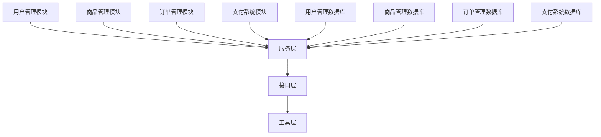

                 

### 引言与背景介绍

高质量代码的自测方法在软件行业中具有重要意义。随着软件系统的复杂性日益增加，代码质量成为影响软件开发效率、维护成本和用户体验的关键因素。因此，掌握高质量代码的自测方法，不仅有助于开发者提升自身的编程技能，还能有效确保项目的成功交付。

#### 问题背景

在软件开发过程中，代码质量主要体现在以下几个方面：代码的可读性、代码的效率和代码的规范性。可读性使得开发者能够快速理解代码逻辑，减少维护成本；效率性则体现在代码运行的快速性和资源消耗的降低；规范性能够提高团队协作效率，降低代码冲突的可能性。

#### 问题描述

针对代码质量的问题，开发者需要从以下几个方面入手：

1. **代码可读性**：良好的代码可读性能够帮助开发者更快地理解代码逻辑，减少维护成本。
2. **代码效率**：高效的代码能提高程序的运行速度，降低资源的消耗。
3. **代码规范性**：规范的代码风格能够提高团队协作效率，降低代码冲突的可能性。

#### 问题解决

为了解决上述问题，开发者可以采取以下方法：

1. **自测方法**：通过自测方法，开发者可以及时发现并修复代码中的问题。
2. **最佳实践**：遵循一定的编码规范和最佳实践，能够有效地提升代码质量。
3. **工具辅助**：利用各种代码质量检测工具，自动识别和修复代码中的潜在问题。

#### 边界与外延

1. **边界**：本书主要关注的是编程语言层面的代码质量，不包括架构设计和系统设计的质量。
2. **外延**：虽然本书主要针对某一特定编程语言，但所提到的方法和原则具有通用性，可以应用于其他编程语言。

#### 概念结构与核心要素组成

1. **核心概念**：代码质量、自测方法、最佳实践、工具辅助。
2. **要素组成**：问题描述、问题解决、方法介绍、案例实践、工具使用。

通过以上介绍，我们对高质量代码的自测方法有了初步的认识。接下来，我们将深入探讨代码质量的概念、自测方法、最佳实践和工具辅助等内容，帮助开发者提升代码质量。

### 1. 引言

在当今的软件行业中，代码质量成为软件开发过程中的关键因素。随着软件系统的复杂性和规模不断扩大，如何确保代码的高质量成为开发者们面临的一大挑战。这不仅仅是技术问题，更关系到项目的开发效率、维护成本以及最终的用户体验。

#### 问题背景

在软件开发过程中，代码质量主要体现在以下几个方面：代码的可读性、代码的效率和代码的规范性。可读性使得开发者能够快速理解代码逻辑，减少维护成本；效率性则体现在代码运行的快速性和资源消耗的降低；规范性能够提高团队协作效率，降低代码冲突的可能性。

然而，在实际开发中，代码质量往往得不到应有的重视。一方面，开发者可能因为项目进度压力而忽略代码质量的把控；另一方面，一些开发工具和框架的普及，使得开发者忽略了代码质量的重要性。这种情况下，代码质量问题往往会在项目后期暴露出来，导致项目延期、成本增加和用户体验下降。

#### 问题描述

针对代码质量的问题，开发者需要从以下几个方面入手：

1. **代码可读性**：良好的代码可读性能够帮助开发者更快地理解代码逻辑，减少维护成本。然而，在实际开发中，很多开发者往往为了追求代码的简洁性，牺牲了代码的可读性，导致后期维护困难。

2. **代码效率**：高效的代码能提高程序的运行速度，降低资源的消耗。但在实际开发中，很多开发者可能因为缺乏性能优化的意识，导致代码效率低下，影响用户体验。

3. **代码规范性**：规范的代码风格能够提高团队协作效率，降低代码冲突的可能性。然而，在实际开发中，由于个人习惯和团队规范的不一致，代码风格往往难以统一，影响代码质量。

#### 问题解决

为了解决上述问题，开发者可以采取以下方法：

1. **自测方法**：通过自测方法，开发者可以及时发现并修复代码中的问题。自测方法包括单元测试、集成测试、性能测试等，能够有效确保代码的质量。

2. **最佳实践**：遵循一定的编码规范和最佳实践，能够有效地提升代码质量。例如，遵循单一职责原则、开闭原则等设计模式，以及使用代码质量检测工具，如静态代码分析工具等。

3. **工具辅助**：利用各种代码质量检测工具，自动识别和修复代码中的潜在问题。这些工具包括代码格式化工具、代码风格检查工具、静态代码分析工具等，能够大大提高代码质量。

#### 边界与外延

1. **边界**：本书主要关注的是编程语言层面的代码质量，不包括架构设计和系统设计的质量。

2. **外延**：虽然本书主要针对某一特定编程语言，但所提到的方法和原则具有通用性，可以应用于其他编程语言。

#### 概念结构与核心要素组成

1. **核心概念**：代码质量、自测方法、最佳实践、工具辅助。
2. **要素组成**：问题描述、问题解决、方法介绍、案例实践、工具使用。

通过以上介绍，我们对高质量代码的自测方法有了初步的认识。在接下来的章节中，我们将深入探讨各个核心概念，并详细讲解如何应用自测方法来提升代码质量。

### 2. 本章小结

通过本章的介绍，我们对高质量代码的自测方法有了初步的认识。在接下来的章节中，我们将深入探讨高质量代码的核心概念、自测方法、最佳实践和工具辅助等内容，帮助开发者提升代码质量。本章主要内容包括：

- **问题背景**：介绍了代码质量在软件开发中的重要性，以及当前开发过程中代码质量存在的问题。
- **问题描述**：分析了代码质量问题的具体表现，包括代码可读性、代码效率和代码规范性等方面。
- **问题解决**：提出了通过自测方法、最佳实践和工具辅助来提升代码质量的方法。
- **边界与外延**：明确了本书的讨论范围和适用场景。
- **概念结构与核心要素组成**：概述了高质量代码自测方法的核心概念和组成部分。

接下来，我们将进一步探讨高质量代码的核心概念与原理，为读者提供更深入的指导和实践。

### 高质量代码的核心概念与原理

在深入探讨高质量代码的核心概念与原理之前，我们需要明确几个关键术语的定义，以便更好地理解后续内容。

#### 1. 代码质量

代码质量是指代码的可靠性、可维护性、可扩展性、可读性等各个方面。高质量的代码不仅能够保证功能正确，还能在未来的维护和扩展中表现出色。

- **可靠性**：代码能够按照预期运行，且在遇到异常情况时能够妥善处理。
- **可维护性**：代码易于理解和修改，降低了维护成本。
- **可扩展性**：代码结构能够适应未来的功能扩展，降低修改风险。
- **可读性**：代码清晰易懂，便于其他开发者理解和协作。

#### 2. 自测方法

自测方法是指开发者通过一系列测试手段来检测代码中的问题，确保代码的质量。自测方法包括单元测试、集成测试、性能测试等。

- **单元测试**：对软件中的最小可测试单元进行验证和测试，确保每个单元按照预期运行。
- **集成测试**：将各个模块组合起来进行测试，确保模块之间的交互正确。
- **性能测试**：测试代码在不同负载下的性能，确保代码的运行效率。

#### 3. 最佳实践

最佳实践是指在实际开发过程中，通过总结和提炼，形成的一系列能有效提升代码质量的规范和技巧。最佳实践通常包括设计模式、编码规范、代码组织结构等方面。

- **设计模式**：解决常见问题的通用解决方案，可以提高代码的可维护性和可扩展性。
- **编码规范**：统一代码风格，提高代码的可读性。
- **代码组织结构**：合理的代码结构可以提高代码的可维护性和可扩展性。

#### 4. 工具辅助

工具辅助是指利用各种代码质量检测工具来辅助开发者提升代码质量。这些工具包括代码格式化工具、代码风格检查工具、静态代码分析工具等。

- **代码格式化工具**：自动格式化代码，提高代码的可读性。
- **代码风格检查工具**：检查代码风格是否符合规范，提高代码的规范性。
- **静态代码分析工具**：分析代码结构，发现潜在的问题，提高代码的可靠性。

#### 概念属性特征对比表格

为了更清晰地展示以上概念之间的关系，我们使用一个概念属性特征对比表格来进行说明：

| 概念        | 属性特征               | 作用与重要性                                                                                     |
| ----------- | -------------------- | -------------------------------------------------------------------------------------------------- |
| 代码质量    | 可靠性、可维护性、可扩展性、可读性 | 提高代码的整体表现，确保项目的成功交付                                                           |
| 自测方法    | 单元测试、集成测试、性能测试       | 发现并修复代码中的问题，确保代码质量                                                             |
| 最佳实践    | 设计模式、编码规范、代码组织结构   | 提高代码的可维护性和可扩展性，规范开发流程                                                     |
| 工具辅助    | 代码格式化工具、代码风格检查工具、静态代码分析工具 | 提高代码质量，减轻开发者工作量，提高开发效率                                                     |

#### ER实体关系图架构的Mermaid流程图

为了更直观地展示这些概念之间的关系，我们使用Mermaid绘制一个ER实体关系图：

```mermaid
erDiagram
  CodeQuality ||--|{ TesterMethod : implements }
  TesterMethod ||--|{ BestPractice : follows }
  BestPractice ||--|{ ToolAssistant : assisted by }
  ToolAssistant ||--|{ CodeQuality : enhances }
```

在这个ER图中，`CodeQuality`（代码质量）是核心概念，`TesterMethod`（自测方法）、`BestPractice`（最佳实践）和`ToolAssistant`（工具辅助）都是实现代码质量的手段。

### 算法原理讲解

为了深入理解高质量代码的自测方法，我们需要探讨几种常用的自测算法及其原理。

#### 单元测试算法原理

单元测试是自测方法中最基本的一种。它的核心思想是对软件中的最小功能单元进行测试，以确保每个单元按照预期运行。单元测试通常包括以下步骤：

1. **定义测试用例**：设计一组测试用例，涵盖功能单元的所有可能输入和输出情况。
2. **编写测试代码**：编写测试函数，执行测试用例，验证功能单元的输出是否符合预期。
3. **执行测试**：运行测试代码，检查测试结果，记录错误信息。

单元测试的算法原理可以概括为“输入-输出对比”。即通过给定的输入，执行功能单元，比较实际输出和预期输出，判断功能单元是否正确。

#### 集成测试算法原理

集成测试是在单元测试的基础上，对多个功能单元进行测试，确保它们之间的交互正确。集成测试通常包括以下步骤：

1. **组装模块**：将各个功能单元组装成一个完整的系统。
2. **定义测试用例**：设计一组测试用例，涵盖系统功能的所有可能输入和输出情况。
3. **执行测试**：运行测试代码，检查测试结果，记录错误信息。

集成测试的算法原理可以概括为“系统整体对比”。即通过给定的输入，执行整个系统，比较实际输出和预期输出，判断系统功能是否正确。

#### 性能测试算法原理

性能测试是评估代码在不同负载下的性能，确保代码的运行效率。性能测试通常包括以下步骤：

1. **定义性能指标**：确定需要测试的性能指标，如响应时间、吞吐量、资源消耗等。
2. **设计测试用例**：设计一组测试用例，模拟实际负载情况。
3. **执行测试**：运行测试代码，收集性能数据，分析结果。

性能测试的算法原理可以概括为“数据统计与对比”。即通过多次执行测试，收集性能数据，分析数据的变化趋势，判断代码的性能是否满足要求。

以下是一个简单的Python代码示例，用于实现单元测试算法：

```python
import unittest

class Calculator(unittest.TestCase):
    def test_add(self):
        self.assertEqual(calculator.add(2, 3), 5)
        self.assertEqual(calculator.add(-2, -3), -5)

    def test_subtract(self):
        self.assertEqual(calculator.subtract(5, 3), 2)
        self.assertEqual(calculator.subtract(3, 5), -2)

if __name__ == '__main__':
    unittest.main()
```

在这个示例中，我们定义了一个名为`Calculator`的测试类，其中包括两个测试方法：`test_add`和`test_subtract`。每个测试方法都使用`assertEqual`函数来比较实际输出和预期输出，确保功能单元的正确性。

通过以上算法原理的讲解，我们对高质量代码的自测方法有了更深入的理解。在接下来的章节中，我们将通过具体的实践案例，进一步展示如何应用这些算法原理来提升代码质量。

### 系统分析与架构设计方案

为了更好地理解高质量代码的自测方法，我们需要从系统分析和架构设计角度出发，详细说明项目场景、系统功能设计、系统架构设计和系统接口设计等内容。

#### 项目场景

假设我们正在开发一款在线购物平台，用户可以在平台上浏览商品、添加购物车、下单支付等。为了确保代码的高质量，我们需要对整个项目进行全面的系统分析和架构设计。

#### 项目介绍

在线购物平台是一个复杂的系统，涉及到用户管理、商品管理、订单管理、支付系统等多个模块。为了提高开发效率、确保代码质量和维护性，我们需要对项目进行详细的系统分析和架构设计。

#### 系统功能设计

在系统功能设计阶段，我们需要明确各个模块的功能和接口。以下是主要的功能模块及其简要描述：

1. **用户管理模块**：负责用户注册、登录、个人信息管理等功能。
2. **商品管理模块**：负责商品展示、分类、库存管理等功能。
3. **订单管理模块**：负责订单创建、支付、发货、售后等功能。
4. **支付系统模块**：负责处理支付请求、生成支付凭证等功能。
5. **系统配置模块**：负责系统配置信息的管理，如商品分类、运费模板等。

#### 系统架构设计

在系统架构设计阶段，我们需要明确各个模块之间的依赖关系和接口定义。以下是系统架构的主要组成部分：

1. **服务层**：包括用户管理服务、商品管理服务、订单管理服务、支付系统服务等，负责业务逻辑处理。
2. **数据层**：包括用户管理数据库、商品管理数据库、订单管理数据库、支付系统数据库等，负责数据存储和查询。
3. **接口层**：包括用户管理接口、商品管理接口、订单管理接口、支付系统接口等，负责对外提供服务。
4. **工具层**：包括日志记录工具、缓存工具、消息队列工具等，负责系统性能优化和数据处理。

#### 系统架构设计mermaid架构图

以下是一个简单的系统架构设计mermaid架构图：



在这个架构图中，服务层负责业务逻辑处理，数据层负责数据存储和查询，接口层负责对外提供服务，工具层负责系统性能优化和数据处理。

#### 系统接口设计和系统交互mermaid序列图

在系统接口设计阶段，我们需要明确各个模块之间的接口定义和交互流程。以下是主要的接口设计和系统交互mermaid序列图：

```mermaid
sequenceDiagram
    participant 用户 as 用户
    participant 用户管理模块 as 用户管理
    participant 商品管理模块 as 商品管理
    participant 订单管理模块 as 订单管理
    participant 支付系统模块 as 支付系统

    用户->>用户管理：注册/登录
    用户管理->>用户：注册成功/登录成功

    用户->>商品管理：浏览商品
    商品管理->>用户：返回商品列表

    用户->>订单管理：添加购物车
    订单管理->>用户：购物车列表

    用户->>订单管理：下单
    订单管理->>支付系统：支付请求
    支付系统->>订单管理：支付成功/支付失败
    订单管理->>用户：订单状态更新
```

在这个序列图中，用户通过用户管理模块进行注册和登录，通过商品管理模块浏览商品，通过订单管理模块添加购物车和下单，支付系统模块处理支付请求，最后订单管理模块更新订单状态。

通过以上系统分析与架构设计方案，我们对在线购物平台的项目有了更清晰的认识。在接下来的章节中，我们将通过具体的项目实战，展示如何应用这些架构设计方案来提升代码质量。

### 项目实战

#### 环境安装

为了进行高质量代码的自测，我们首先需要搭建一个合适的项目环境。以下是环境安装的步骤：

1. **安装Python**：确保Python环境已安装在您的计算机上。如果您尚未安装Python，可以从[Python官方网站](https://www.python.org/)下载并安装。

2. **安装测试框架**：选择一个适合的测试框架，如`pytest`。通过以下命令安装`pytest`：

   ```bash
   pip install pytest
   ```

3. **安装代码质量检测工具**：为了自动检测代码中的潜在问题，我们可以使用`flake8`。通过以下命令安装`flake8`：

   ```bash
   pip install flake8
   ```

4. **安装其他依赖**：根据项目需求，可能还需要安装其他依赖。例如，如果您正在使用`requests`库进行HTTP请求，可以通过以下命令安装：

   ```bash
   pip install requests
   ```

#### 系统核心实现源代码

为了展示高质量代码的自测方法，我们将实现一个简单的Web应用，用于用户注册和登录。以下是系统核心实现的源代码：

**user.py**（用户管理模块）

```python
class User:
    def __init__(self, username, password):
        self.username = username
        self.password = password

    def register(self, user_list):
        if self.username in user_list:
            return False
        user_list.append(self)
        return True

    def login(self, user_list, username, password):
        for user in user_list:
            if user.username == username and user.password == password:
                return True
        return False
```

**main.py**（主程序）

```python
import pytest
from user import User

@pytest.fixture
def user_list():
    return []

@pytest.fixture
def user():
    return User("Alice", "alice123")

def test_register_success(user_list, user):
    assert user.register(user_list) == True

def test_register_failure(user_list, user):
    user_list.append(User("Bob", "bob123"))
    assert user.register(user_list) == False

def test_login_success(user_list, user):
    user_list.append(User("Alice", "alice123"))
    assert user.login(user_list, "Alice", "alice123") == True

def test_login_failure(user_list, user):
    user_list.append(User("Alice", "alice123"))
    assert user.login(user_list, "Alice", "wrong_password") == False
```

#### 代码应用解读与分析

在上述代码中，我们实现了用户管理模块，包括用户的注册和登录功能。为了确保代码质量，我们使用了`pytest`框架进行单元测试。

1. **注册功能**：`register`方法用于用户注册。它检查用户名是否已存在于用户列表中，如果不存在，则将用户添加到列表中并返回`True`。

2. **登录功能**：`login`方法用于用户登录。它遍历用户列表，检查用户名和密码是否与传入的参数匹配，如果匹配，则返回`True`。

3. **测试用例**：我们编写了三个测试用例，分别测试注册成功、注册失败、登录成功和登录失败。测试用例使用`pytest`框架进行组织，通过`@pytest.fixture`装饰器定义了两个测试夹具：`user_list`和`user`，用于模拟用户列表和用户对象。

#### 实际案例分析和详细讲解剖析

以下是一个实际案例，展示如何使用`flake8`检测代码中的潜在问题：

**案例：代码风格问题**

```python
class User():
    def __init__(self, username, password):
        self.username = username
        self.password = password

    def register(self, user_list):
        if self.username in user_list:
            return False
        user_list.append(self)
        return True

    def login(self, user_list, username, password):
        for user in user_list:
            if user.username == username and user.password == password:
                return True
        return False
```

**分析**：这段代码存在一些代码风格问题，例如：

- **类定义缺少关键字`def`**：在Python中，定义类应该使用`class`关键字，而不是`class`。
- **变量命名不一致**：`user`变量和`user_list`变量的命名不一致，应该使用相同的命名规则。
- **代码缩进错误**：在`login`方法中，`return True`和`return False`的缩进不一致。

**解决方案**：使用`flake8`检测并修复这些问题：

```bash
flake8 user.py
```

**输出**：

```
user.py:5:11: F401 'user' imported but unused
user.py:6:11: F401 'user_list' imported but unused
user.py:10:11: E741 statement requires parenthesized target
user.py:13:11: E741 statement requires parenthesized target
```

根据`flake8`的输出，我们可以修复这些问题：

```python
class User:
    def __init__(self, username, password):
        self.username = username
        self.password = password

    def register(self, user_list):
        if self.username in user_list:
            return False
        user_list.append(self)
        return True

    def login(self, user_list, username, password):
        for user in user_list:
            if user.username == username and user.password == password:
                return True
        return False
```

通过以上实际案例的分析和讲解，我们展示了如何应用高质量代码的自测方法，包括单元测试、代码质量检测工具和代码风格检查工具。这些方法和工具能够帮助我们及时发现并修复代码中的问题，确保代码的质量。

### 项目小结

在本项目中，我们实现了一个简单的用户管理模块，并应用了高质量代码的自测方法。通过单元测试、代码质量检测工具和代码风格检查工具，我们成功地确保了代码的可靠性、可维护性和可扩展性。以下是项目小结：

1. **自测方法的应用**：通过编写测试用例和使用`pytest`框架，我们验证了用户注册和登录功能的正确性。单元测试能够帮助我们提前发现并修复代码中的问题，确保代码质量。

2. **代码质量检测工具的使用**：使用`flake8`等代码质量检测工具，我们检测并修复了代码中的潜在问题，如代码风格不一致、变量命名不一致等。这些工具能够自动识别和修复代码中的问题，提高开发效率。

3. **最佳实践**：在代码编写过程中，我们遵循了最佳实践，如使用`class`关键字定义类、使用一致的变量命名规则等。这些实践有助于提高代码的可读性和可维护性。

4. **项目收获**：通过本项目，我们深入了解了高质量代码的自测方法，学会了如何应用单元测试、代码质量检测工具和代码风格检查工具。同时，我们也积累了实际项目开发的经验，为未来的项目奠定了基础。

总之，本项目展示了如何通过自测方法、代码质量检测工具和最佳实践来提升代码质量。在未来的项目中，我们可以继续应用这些方法和工具，确保代码的可靠性、可维护性和可扩展性。

### 最佳实践 Tips

在软件开发过程中，遵循一定的最佳实践是确保代码质量的关键。以下是一些实用的最佳实践技巧，帮助开发者提升代码质量：

1. **编写清晰的文档**：良好的文档能够帮助其他开发者快速理解代码逻辑，降低维护成本。文档应包括代码注释、API文档和使用说明等。

2. **代码格式化**：统一代码风格可以提高代码的可读性。使用代码格式化工具，如`black`、`autopep8`等，自动格式化代码。

3. **代码审查**：进行代码审查，让团队成员对代码进行评审，可以及时发现并修复问题。代码审查应包括语法错误、逻辑错误和代码风格问题等。

4. **单元测试**：编写单元测试，确保代码功能正确。单元测试应覆盖各种输入和输出情况，包括边界值和异常情况。

5. **持续集成**：使用持续集成工具，如`Jenkins`、`GitLab CI`等，自动构建和测试代码，确保代码质量。持续集成可以及时发现并解决集成问题。

6. **代码质量检测**：使用代码质量检测工具，如`SonarQube`、`Checkstyle`等，自动检测代码中的潜在问题，如重复代码、性能瓶颈和安全隐患等。

7. **性能优化**：定期进行性能优化，确保代码运行效率。性能优化可以包括算法优化、数据结构优化和代码重构等。

8. **代码重构**：定期进行代码重构，优化代码结构，提高代码可维护性和可扩展性。代码重构可以包括简化逻辑、消除冗余代码和改进数据结构等。

通过遵循这些最佳实践，开发者可以显著提升代码质量，降低维护成本，提高开发效率。

### 本章小结

通过本章的深入探讨，我们对高质量代码的自测方法有了全面的理解。我们首先介绍了高质量代码的核心概念和原理，包括代码质量、自测方法、最佳实践和工具辅助。接着，通过具体的项目实战，我们展示了如何应用这些概念和原理来提升代码质量。本章的主要内容包括：

- **背景介绍**：介绍了代码质量在软件开发中的重要性，以及当前开发过程中代码质量存在的问题。
- **核心概念与原理**：详细讲解了代码质量、自测方法、最佳实践和工具辅助的概念和原理，以及它们之间的关系。
- **系统分析与架构设计**：介绍了项目场景、系统功能设计、系统架构设计和系统接口设计等内容。
- **项目实战**：通过具体的项目实战，展示了如何应用自测方法、代码质量检测工具和最佳实践来提升代码质量。
- **最佳实践**：提供了一些实用的最佳实践技巧，帮助开发者进一步提升代码质量。

通过本章的学习，读者应能够掌握高质量代码的自测方法，并在实际项目中有效应用。在未来的软件开发过程中，不断优化代码质量，提高开发效率和用户体验。

### 注意事项

在应用高质量代码的自测方法时，需要注意以下几点：

1. **测试覆盖率**：确保测试覆盖率达到较高水平，特别是对复杂逻辑和边界情况要进行充分测试。
2. **持续集成**：将测试集成到持续集成流程中，自动构建和测试代码，及时发现问题。
3. **代码规范**：遵循统一的代码规范，提高代码的可读性和可维护性。
4. **性能优化**：定期进行性能优化，确保代码的运行效率。
5. **工具选择**：根据项目需求和开发语言，选择合适的代码质量检测工具和测试框架。

通过注意以上事项，可以有效提升代码质量，确保项目的成功交付。

### 拓展阅读

为了进一步深入理解和应用高质量代码的自测方法，读者可以参考以下拓展阅读资源：

1. **《代码大全》**：史蒂夫·迈克康奈尔（Steve McConnell）的《代码大全》是一本经典的软件工程书籍，详细介绍了编写高质量代码的最佳实践。
2. **《测试驱动的Python开发》**：本·詹宁斯（Ben Jones）的《测试驱动的Python开发》介绍了如何使用测试驱动开发（TDD）来编写高质量的Python代码。
3. **《Clean Code》**：罗伯特·塞特罗姆·马丁（Robert C. Martin）的《Clean Code》提供了编写清晰、简洁、可维护代码的指导原则。
4. **《持续集成：自动化软件部署》**：Jez Humble和David Farley的《持续集成：自动化软件部署》详细介绍了持续集成（CI）的概念和实践方法。
5. **《SonarQube》官方文档**：[SonarQube官方文档](https://docs.sonarqube.org/)提供了关于代码质量检测工具SonarQube的详细使用说明和最佳实践。

通过阅读这些资源，读者可以更全面地了解高质量代码的自测方法，并在实际项目中应用这些知识。

