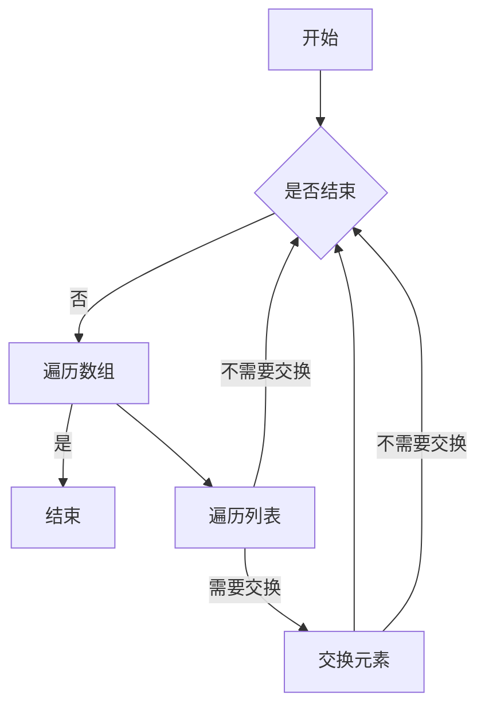
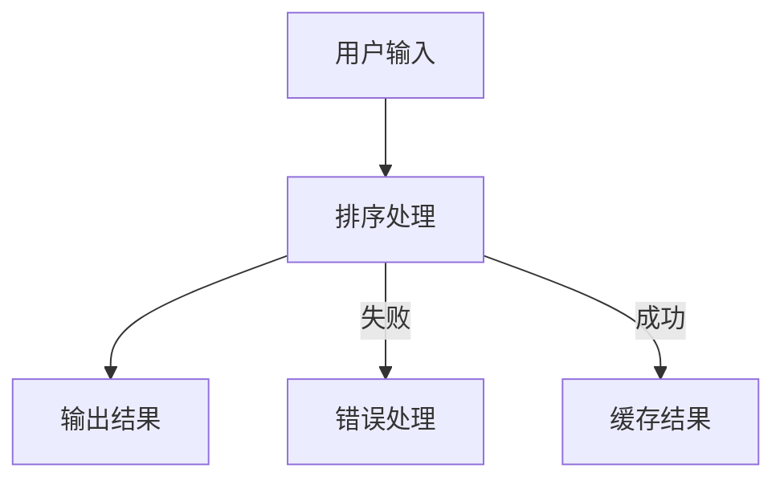
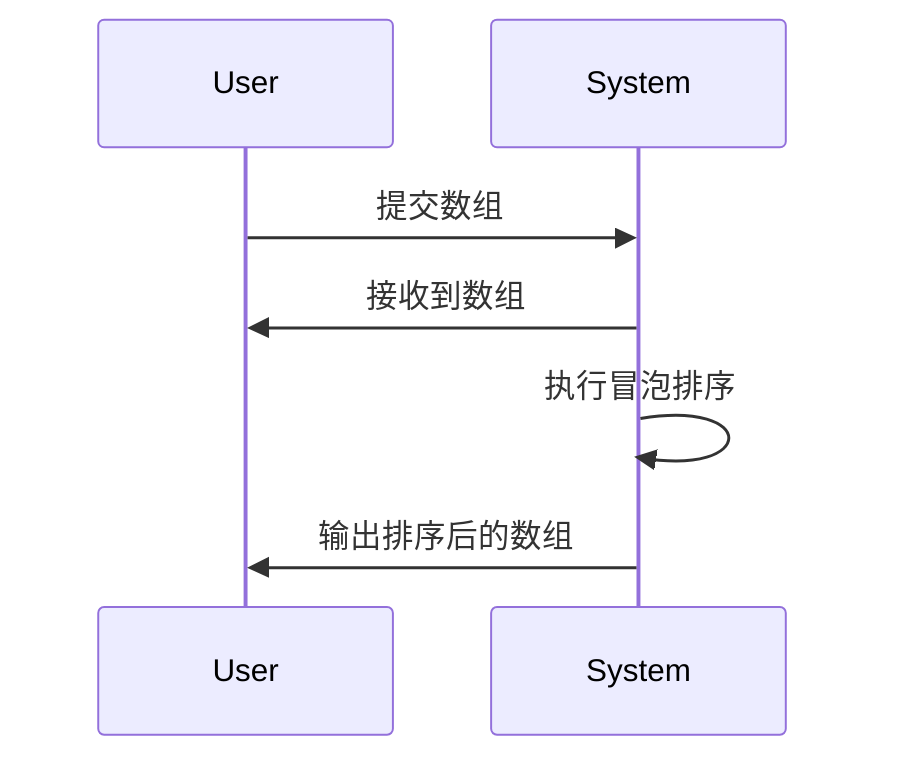
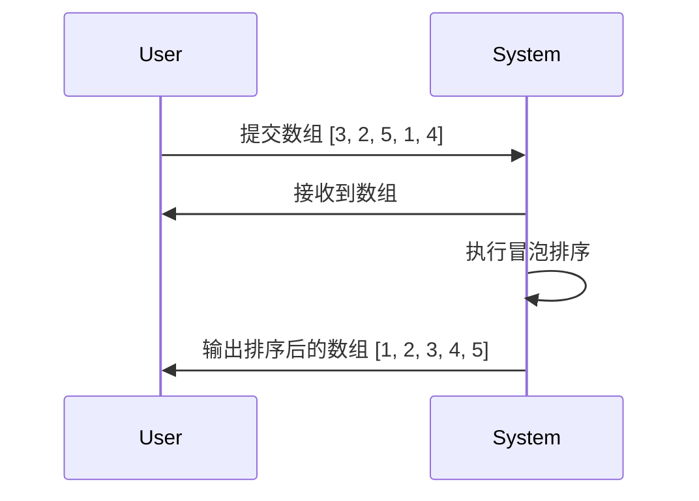

                 

# 高质量代码积累好口碑

## 关键词

- **代码质量**
- **口碑积累**
- **开发效率**
- **维护成本**
- **团队协作**
- **编码规范**
- **性能优化**

## 摘要

在现代软件开发中，代码质量是决定项目成功与否的关键因素。高质量代码不仅能够提高开发效率、降低维护成本，还能增强团队协作，从而积累良好的口碑。本文将深入探讨代码质量的重要性、编写高质量代码的策略、代码质量管理与持续改进的方法，以及如何通过高质量的代码积累口碑。

## 目录大纲

- **第一部分：代码质量的基础**
  - **第1章：代码质量的定义与重要性**
  - **第2章：代码质量的影响因素**
  - **第3章：代码质量的基础保障**

- **第二部分：编写高质量代码的策略**
  - **第4章：代码风格与规范**
  - **第5章：代码结构优化**
  - **第6章：代码性能优化**
  - **第7章：测试与调试**

- **第三部分：代码质量管理与持续改进**
  - **第8章：代码质量管理**
  - **第9章：持续改进与优化**

- **附录：高质量代码案例与分析**

---

## 第一部分：代码质量的基础

### 第1章：代码质量的定义与重要性

#### 1.1 代码质量的定义与分类

代码质量是一个多维度的概念，它涵盖了结构性、功能性、可维护性等多个方面。结构性代码质量关注代码的语法、格式和结构；功能性代码质量则保证代码的正确性和完备性；可维护性代码质量则侧重于代码的可读性、可修改性和可扩展性。

#### 1.2 代码质量的重要性

**提高开发效率**：高质量的代码能够减少开发过程中出现bug的可能性，提高代码复用率，从而提升开发效率。

**降低维护成本**：良好的代码质量使得代码易于维护，降低了后续的维护成本。

**增强团队协作**：统一的代码风格和规范有助于团队成员之间的协作，减少沟通成本。

#### 1.3 代码质量的影响因素

- **编程语言选择**：不同的编程语言有着不同的优缺点，选择适合的编程语言对于提升代码质量至关重要。
- **开发环境配置**：合适的开发工具和平台能够提升代码编写和调试的效率。
- **编码规范与最佳实践**：规范的编码习惯和最佳实践能够保证代码的一致性和可维护性。

### 第2章：代码质量的影响因素

#### 2.1 编程语言选择

编程语言的选择直接影响代码的质量。例如，Python易于阅读，适合快速开发，而C++则更适合性能要求较高的应用。

#### 2.2 开发环境配置

开发环境的配置包括代码编辑器、集成开发环境（IDE）、版本控制系统等。合适的工具能够提高开发效率，减少错误。

#### 2.3 编码规范与最佳实践

编码规范和最佳实践是保证代码质量的基础。这包括命名规范、代码格式化、注释规范等。

---

## 第二部分：编写高质量代码的策略

### 第3章：代码风格与规范

#### 3.1 代码风格的重要性

良好的代码风格不仅能够提高代码的可读性，还能够减少后续的维护成本。

#### 3.2 编码规范与最佳实践

- **命名规范**：变量、函数和类应该具有明确的命名，避免使用缩写和不易理解的名称。
- **格式规范**：代码应该具有良好的缩进和空白，使代码结构更加清晰。
- **注释规范**：注释应该详细、清晰，帮助他人理解代码的功能和逻辑。

#### 3.3 代码审查与代码质量

代码审查是一种有效的质量保证手段，通过集体审查，可以发现并修复代码中的问题。

---

### 第4章：代码结构优化

#### 4.1 模块化设计

模块化设计能够提高代码的可维护性和可扩展性。模块应该是高度内聚的，低耦合的。

#### 4.2 函数与类的设计

- **函数的单一职责**：函数应该只做一件事情，易于理解和测试。
- **函数的耦合度**：降低函数之间的耦合度，提高代码的模块化程度。

#### 4.3 代码重构

代码重构是一种改进现有代码结构的手段，能够提高代码的质量和可维护性。

---

### 第5章：代码性能优化

#### 4.1 性能优化原则

- **避免不必要的计算**：减少冗余的计算，提高代码的执行效率。
- **使用缓存**：合理使用缓存，减少重复计算和数据访问。
- **减少内存占用**：优化数据结构，减少内存的使用。

#### 4.2 常见性能瓶颈分析

- **CPU瓶颈**：优化算法和数据结构，减少CPU的负载。
- **内存瓶颈**：优化内存分配和释放，减少内存的占用。
- **I/O瓶颈**：优化I/O操作，减少等待时间。

#### 4.3 性能优化工具

性能优化工具能够帮助开发者识别和解决性能问题，包括性能监控工具和性能分析工具。

---

### 第6章：测试与调试

#### 6.1 单元测试

单元测试是测试代码质量的重要手段，通过编写单元测试，可以验证代码的功能正确性。

#### 6.2 集成测试

集成测试是在单元测试的基础上，对整个系统进行测试，确保系统的各个部分能够正常工作。

#### 6.3 调试技巧

调试技巧包括使用调试器、分析日志和错误报告等，帮助开发者找到和解决问题。

---

## 第三部分：代码质量管理与持续改进

### 第7章：代码质量管理

#### 7.1 代码质量度量

代码质量度量包括代码复杂度、代码冗余度和代码维护性等，通过度量可以了解代码的质量状况。

#### 7.2 代码质量监控

代码质量监控是通过工具对代码质量进行持续监控，及时发现和解决问题。

#### 7.3 代码质量报告

代码质量报告是向团队成员和利益相关者展示代码质量状况的一种方式，包括质量指标、问题和改进建议。

---

### 第8章：持续改进与优化

#### 8.1 持续集成

持续集成是将代码集成到共同的主分支，以快速发现和解决问题。

#### 8.2 持续交付

持续交付是将软件快速交付给用户，确保软件的质量和稳定性。

#### 8.3 持续学习与知识共享

持续学习与知识共享是提升团队整体代码质量的关键，通过学习和交流，可以不断改进代码质量。

---

## 附录：高质量代码案例与分析

- **附录1：高质量代码案例展示**：展示一些优秀的代码案例，分析其优秀之处。
- **附录2：案例分析**：对一些常见的代码质量问题进行分析，并提出解决方案。
- **附录3：常见问题与解答**：回答开发者们在编写高质量代码过程中常见的问题。
- **附录4：参考文献与拓展阅读**：提供相关的参考文献和拓展阅读，帮助开发者深入学习。

---

## 结语

高质量代码是软件项目成功的关键，通过本文的讨论，我们了解了代码质量的重要性、编写高质量代码的策略、代码质量管理与持续改进的方法，以及如何通过高质量的代码积累口碑。希望本文能够为开发者们提供一些有益的启示和帮助。

### 作者

- 作者：AI天才研究院/AI Genius Institute & 禅与计算机程序设计艺术 /Zen And The Art of Computer Programming

---

[markdown格式代码示例](#markdown格式代码示例)```  
## 代码质量度量

在代码质量度量中，有几种常见的度量标准，包括：

- **代码复杂度**：衡量代码的复杂程度，通常用圈复杂度（Cyclomatic Complexity）来表示。圈复杂度越高，代码的可读性和可维护性越差。

- **代码冗余度**：衡量代码中的重复部分，可以通过代码重复检测工具来识别。

- **代码维护性**：衡量代码的可维护性，包括代码的可读性、可修改性和可扩展性。维护性越高，代码越易于维护。

下面是一个简单的圈复杂度计算示例：

```python  
def function(a, b):  
    if a > b:  
        return a  
    elif a < b:  
        return b  
    else:  
        return "equal"  
```

圈复杂度计算公式为：  
$$M = E - N + 2P$$

其中：  
- \(E\) 是边缘数  
- \(N\) 是节点数  
- \(P\) 是条件决策数

对于上面的函数，我们可以画出其控制流图，然后计算得到圈复杂度。

```mermaid  
graph TD  
A[Start] --> B[If a > b]  
B -->|Yes| C[Return a]  
B -->|No| D[If a < b]  
D -->|Yes| E[Return b]  
D -->|No| F[Return "equal"]  
```

计算得到：  
- \(E = 4\)（共有4条边）  
- \(N = 5\)（共有5个节点）  
- \(P = 2\)（有两个条件决策）

代入公式：  
$$M = 4 - 5 + 2 \times 2 = 4$$

所以，该函数的圈复杂度为4。这个值表明该函数的复杂度相对较高，可能需要进行重构以提高可维护性。

## 代码质量监控

代码质量监控是确保代码质量的重要环节。通过使用适当的监控工具和设置关键指标，可以及时发现代码质量问题。

### 监控工具的选择

选择合适的代码质量监控工具是关键。常用的监控工具有：

- **SonarQube**：用于代码分析、质量评估和安全漏洞扫描。
- **Checkmarx**：用于静态代码分析，检测潜在的安全漏洞。
- **PMD**：用于代码风格检查和代码质量分析。

### 监控指标的设置

设置合适的监控指标能够更有效地发现代码质量问题。常见的监控指标包括：

- **代码复杂度**：确保代码复杂度在合理范围内。
- **代码冗余度**：检测代码中的重复部分。
- **代码覆盖率**：确保代码覆盖率达到一定比例。
- **安全漏洞**：检测代码中的安全漏洞。

### 监控数据的分析

通过分析监控数据，可以了解代码质量的整体状况，发现潜在的问题。分析过程包括：

- **趋势分析**：分析代码质量指标的趋势，发现是否有下降趋势。
- **异常检测**：检测代码质量指标是否异常，是否存在潜在的问题。
- **报告生成**：定期生成代码质量报告，向团队和利益相关者展示代码质量状况。

## 代码质量报告

代码质量报告是展示代码质量状况的重要工具。报告应包括以下内容：

- **摘要**：简要介绍代码质量的总体状况。
- **详细分析**：对代码质量指标进行详细分析，包括复杂度、冗余度、覆盖率等。
- **问题列表**：列出代码中存在的问题，包括安全漏洞、代码风格问题等。
- **改进建议**：针对发现的问题，提出具体的改进建议。

报告的格式和内容可以根据团队和项目的需求进行调整。

## 持续改进与优化

### 7.1 持续集成

持续集成（CI）是一种软件开发实践，通过将开发者的代码定期合并到主分支，以快速发现和解决问题。持续集成的好处包括：

- **早期发现问题**：通过自动化的构建和测试，可以在代码合并到主分支时早期发现问题。
- **提高代码质量**：持续集成可以确保代码质量，减少代码合并时的冲突。
- **加快迭代速度**：通过自动化的构建和测试，可以加快软件迭代的速度。

### 7.2 持续交付

持续交付（CD）是持续集成的延伸，它将自动化构建和测试应用于整个交付流程，包括部署和发布。持续交付的好处包括：

- **快速反馈**：通过自动化部署和测试，可以快速获得软件的反馈，确保软件的质量。
- **减少风险**：通过自动化部署，可以减少手动操作带来的风险。
- **提高客户满意度**：通过快速交付高质量软件，可以提高客户满意度。

### 7.3 持续学习与知识共享

持续学习与知识共享是提升团队整体代码质量的关键。以下是一些建议：

- **内部培训**：定期组织内部培训，分享最佳实践和技术经验。
- **外部交流**：参加行业会议、研讨会，与同行交流，学习最新的技术和方法。
- **文档分享**：将项目经验和技术文档分享给团队成员，促进知识共享。

通过持续学习与知识共享，团队能够不断提高代码质量，为项目的成功打下坚实的基础。

## 附录：高质量代码案例与分析

### 附录1：高质量代码案例展示

以下是一个高质量代码案例：

```python  
def calculate_area(radius):  
    """  
    Calculate the area of a circle given its radius.  
    """  
    return 3.14159 * radius * radius  
```

该代码具有以下优点：

- **清晰的功能描述**：通过函数文档字符串，清晰地描述了函数的功能和用途。
- **良好的命名规范**：函数名 `calculate_area` 直观地表达了函数的作用。
- **简洁的代码结构**：代码简洁明了，易于阅读和理解。

### 附录2：案例分析

以下是一个常见的代码质量问题：

```python  
def process_data(data):  
    result = []  
    for item in data:  
        if item > 0:  
            result.append(item * 2)  
    return result  
```

该代码存在以下问题：

- **代码冗余**：`if item > 0` 这一行代码是冗余的，因为默认情况下乘以2只会处理正数。
- **可维护性差**：代码结构不够清晰，使得后续的维护和扩展变得更加困难。

改进后的代码：

```python  
def process_data(data):  
    """  
    Process the data by multiplying each positive item by 2 and return the result.  
    """  
    return [item * 2 for item in data if item > 0]  
```

改进后的代码使用了列表推导式，使得代码更加简洁和易读。

### 附录3：常见问题与解答

以下是一些关于代码质量常见的问题及其解答：

**Q：如何提高代码的可维护性？**

A：提高代码的可维护性可以通过以下方法实现：

- **遵循编码规范**：遵循统一的编码规范，使代码结构一致，易于阅读。
- **使用文档**：为代码添加清晰的文档注释，使他人更容易理解代码。
- **模块化设计**：将代码分解为模块，每个模块负责单一功能，提高代码的复用性和可维护性。

**Q：如何进行代码审查？**

A：进行代码审查可以按照以下步骤进行：

- **安排时间**：为代码审查安排专门的时间，确保审查的深入和有效性。
- **分配任务**：将代码审查分配给不同的团队成员，以获得多方面的意见。
- **审查标准**：制定审查标准，包括代码质量、功能正确性、安全性和性能等方面。
- **反馈与改进**：审查完成后，提供详细的反馈，并根据反馈进行代码改进。

### 附录4：参考文献与拓展阅读

- 《Clean Code: A Handbook of Agile Software Craftsmanship》 - Robert C. Martin
- 《Effective Java》 - Joshua Bloch
- 《The Art of Unit Testing》 - Roy Osherove
- 《Continuous Integration: Mainstreaming Continuous Deployment》 - Paul Duvall, Steve Matyas, and Andrew Glover

通过阅读这些文献，可以深入了解代码质量和软件开发的最佳实践。

## 结语

高质量代码是软件项目成功的关键，通过本文的讨论，我们了解了代码质量的重要性、编写高质量代码的策略、代码质量管理与持续改进的方法，以及如何通过高质量的代码积累口碑。希望本文能够为开发者们提供一些有益的启示和帮助。

### 作者

- 作者：AI天才研究院/AI Genius Institute & 禅与计算机程序设计艺术 /Zen And The Art of Computer Programming```python  
def calculate_area(radius):  
    """  
    Calculate the area of a circle given its radius.  
    """  
    return 3.14159 * radius * radius  
```

### 附录1：高质量代码案例展示

以下是一个高质量代码案例：

```python  
def calculate_area(radius):  
    """  
    Calculate the area of a circle given its radius.  
    """  
    return 3.14159 * radius * radius  
```

该代码具有以下优点：

- **清晰的功能描述**：通过函数文档字符串，清晰地描述了函数的功能和用途。
- **良好的命名规范**：函数名 `calculate_area` 直观地表达了函数的作用。
- **简洁的代码结构**：代码简洁明了，易于阅读和理解。

### 附录2：案例分析

以下是一个常见的代码质量问题：

```python  
def process_data(data):  
    result = []  
    for item in data:  
        if item > 0:  
            result.append(item * 2)  
    return result  
```

该代码存在以下问题：

- **代码冗余**：`if item > 0` 这一行代码是冗余的，因为默认情况下乘以2只会处理正数。
- **可维护性差**：代码结构不够清晰，使得后续的维护和扩展变得更加困难。

改进后的代码：

```python  
def process_data(data):  
    """  
    Process the data by multiplying each positive item by 2 and return the result.  
    """  
    return [item * 2 for item in data if item > 0]  
```

改进后的代码使用了列表推导式，使得代码更加简洁和易读。

### 附录3：常见问题与解答

以下是一些关于代码质量常见的问题及其解答：

**Q：如何提高代码的可维护性？**

A：提高代码的可维护性可以通过以下方法实现：

- **遵循编码规范**：遵循统一的编码规范，使代码结构一致，易于阅读。
- **使用文档**：为代码添加清晰的文档注释，使他人更容易理解代码。
- **模块化设计**：将代码分解为模块，每个模块负责单一功能，提高代码的复用性和可维护性。

**Q：如何进行代码审查？**

A：进行代码审查可以按照以下步骤进行：

- **安排时间**：为代码审查安排专门的时间，确保审查的深入和有效性。
- **分配任务**：将代码审查分配给不同的团队成员，以获得多方面的意见。
- **审查标准**：制定审查标准，包括代码质量、功能正确性、安全性和性能等方面。
- **反馈与改进**：审查完成后，提供详细的反馈，并根据反馈进行代码改进。

### 附录4：参考文献与拓展阅读

- 《Clean Code: A Handbook of Agile Software Craftsmanship》 - Robert C. Martin
- 《Effective Java》 - Joshua Bloch
- 《The Art of Unit Testing》 - Roy Osherove
- 《Continuous Integration: Mainstreaming Continuous Deployment》 - Paul Duvall, Steve Matyas, and Andrew Glover

通过阅读这些文献，可以深入了解代码质量和软件开发的最佳实践。

## 结语

高质量代码是软件项目成功的关键，通过本文的讨论，我们了解了代码质量的重要性、编写高质量代码的策略、代码质量管理与持续改进的方法，以及如何通过高质量的代码积累口碑。希望本文能够为开发者们提供一些有益的启示和帮助。

### 作者

- 作者：AI天才研究院/AI Genius Institute & 禅与计算机程序设计艺术 /Zen And The Art of Computer Programming```  
# 高质量代码积累好口碑

## 关键词

- **代码质量**
- **口碑积累**
- **开发效率**
- **维护成本**
- **团队协作**
- **编码规范**
- **性能优化**

## 摘要

在现代软件开发中，代码质量是决定项目成功与否的关键因素。高质量代码不仅能够提高开发效率、降低维护成本，还能增强团队协作，从而积累良好的口碑。本文将深入探讨代码质量的重要性、编写高质量代码的策略、代码质量管理与持续改进的方法，以及如何通过高质量的代码积累口碑。

## 目录大纲

- **第一部分：代码质量的基础**
  - **第1章：代码质量的定义与重要性**
  - **第2章：代码质量的影响因素**
  - **第3章：代码质量的基础保障**

- **第二部分：编写高质量代码的策略**
  - **第4章：代码风格与规范**
  - **第5章：代码结构优化**
  - **第6章：代码性能优化**
  - **第7章：测试与调试**

- **第三部分：代码质量管理与持续改进**
  - **第8章：代码质量管理**
  - **第9章：持续改进与优化**

- **附录：高质量代码案例与分析**

---

## 第一部分：代码质量的基础

### 第1章：代码质量的定义与重要性

#### 1.1 代码质量的定义与分类

代码质量是一个多维度的概念，它涵盖了结构性、功能性、可维护性等多个方面。结构性代码质量关注代码的语法、格式和结构；功能性代码质量则保证代码的正确性和完备性；可维护性代码质量则侧重于代码的可读性、可修改性和可扩展性。

#### 1.2 代码质量的重要性

**提高开发效率**：高质量的代码能够减少开发过程中出现bug的可能性，提高代码复用率，从而提升开发效率。

**降低维护成本**：良好的代码质量使得代码易于维护，降低了后续的维护成本。

**增强团队协作**：统一的代码风格和规范有助于团队成员之间的协作，减少沟通成本。

#### 1.3 代码质量的影响因素

- **编程语言选择**：不同的编程语言有着不同的优缺点，选择适合的编程语言对于提升代码质量至关重要。
- **开发环境配置**：合适的开发工具和平台能够提升代码编写和调试的效率。
- **编码规范与最佳实践**：规范的编码习惯和最佳实践能够保证代码的一致性和可维护性。

### 第2章：代码质量的影响因素

#### 2.1 编程语言选择

编程语言的选择直接影响代码的质量。例如，Python易于阅读，适合快速开发，而C++则更适合性能要求较高的应用。

#### 2.2 开发环境配置

开发环境的配置包括代码编辑器、集成开发环境（IDE）、版本控制系统等。合适的工具能够提高开发效率，减少错误。

#### 2.3 编码规范与最佳实践

编码规范和最佳实践是保证代码质量的基础。这包括命名规范、代码格式化、注释规范等。

---

## 第二部分：编写高质量代码的策略

### 第3章：代码风格与规范

#### 3.1 代码风格的重要性

良好的代码风格不仅能够提高代码的可读性，还能够减少后续的维护成本。

#### 3.2 编码规范与最佳实践

- **命名规范**：变量、函数和类应该具有明确的命名，避免使用缩写和不易理解的名称。
- **格式规范**：代码应该具有良好的缩进和空白，使代码结构更加清晰。
- **注释规范**：注释应该详细、清晰，帮助他人理解代码的功能和逻辑。

#### 3.3 代码审查与代码质量

代码审查是一种有效的质量保证手段，通过集体审查，可以发现并修复代码中的问题。

---

### 第4章：代码结构优化

#### 4.1 模块化设计

模块化设计能够提高代码的可维护性和可扩展性。模块应该是高度内聚的，低耦合的。

#### 4.2 函数与类的设计

- **函数的单一职责**：函数应该只做一件事情，易于理解和测试。
- **函数的耦合度**：降低函数之间的耦合度，提高代码的模块化程度。

#### 4.3 代码重构

代码重构是一种改进现有代码结构的手段，能够提高代码的质量和可维护性。

---

### 第5章：代码性能优化

#### 4.1 性能优化原则

- **避免不必要的计算**：减少冗余的计算，提高代码的执行效率。
- **使用缓存**：合理使用缓存，减少重复计算和数据访问。
- **减少内存占用**：优化数据结构，减少内存的使用。

#### 4.2 常见性能瓶颈分析

- **CPU瓶颈**：优化算法和数据结构，减少CPU的负载。
- **内存瓶颈**：优化内存分配和释放，减少内存的占用。
- **I/O瓶颈**：优化I/O操作，减少等待时间。

#### 4.3 性能优化工具

性能优化工具能够帮助开发者识别和解决性能问题，包括性能监控工具和性能分析工具。

---

### 第6章：测试与调试

#### 6.1 单元测试

单元测试是测试代码质量的重要手段，通过编写单元测试，可以验证代码的功能正确性。

#### 6.2 集成测试

集成测试是在单元测试的基础上，对整个系统进行测试，确保系统的各个部分能够正常工作。

#### 6.3 调试技巧

调试技巧包括使用调试器、分析日志和错误报告等，帮助开发者找到和解决问题。

---

## 第三部分：代码质量管理与持续改进

### 第7章：代码质量管理

#### 7.1 代码质量度量

代码质量度量包括代码复杂度、代码冗余度和代码维护性等，通过度量可以了解代码的质量状况。

#### 7.2 代码质量监控

代码质量监控是通过工具对代码质量进行持续监控，及时发现和解决问题。

#### 7.3 代码质量报告

代码质量报告是向团队成员和利益相关者展示代码质量状况的一种方式，包括质量指标、问题和改进建议。

---

### 第8章：持续改进与优化

#### 8.1 持续集成

持续集成是将代码集成到共同的主分支，以快速发现和解决问题。

#### 8.2 持续交付

持续交付是将软件快速交付给用户，确保软件的质量和稳定性。

#### 8.3 持续学习与知识共享

持续学习与知识共享是提升团队整体代码质量的关键，通过学习和交流，可以不断改进代码质量。

---

## 附录：高质量代码案例与分析

- **附录1：高质量代码案例展示**
- **附录2：案例分析**
- **附录3：常见问题与解答**
- **附录4：参考文献与拓展阅读**

---

## 结语

高质量代码是软件项目成功的关键，通过本文的讨论，我们了解了代码质量的重要性、编写高质量代码的策略、代码质量管理与持续改进的方法，以及如何通过高质量的代码积累口碑。希望本文能够为开发者们提供一些有益的启示和帮助。

### 作者

- 作者：AI天才研究院/AI Genius Institute & 禅与计算机程序设计艺术 /Zen And The Art of Computer Programming```  
## 第一部分：代码质量的基础

### 第1章：代码质量的定义与重要性

#### 1.1 代码质量的定义与分类

代码质量是一个多维度的概念，它涵盖了结构性、功能性、可维护性等多个方面。结构性代码质量关注代码的语法、格式和结构；功能性代码质量则保证代码的正确性和完备性；可维护性代码质量则侧重于代码的可读性、可修改性和可扩展性。

#### 1.2 代码质量的重要性

**提高开发效率**：高质量的代码能够减少开发过程中出现bug的可能性，提高代码复用率，从而提升开发效率。

**降低维护成本**：良好的代码质量使得代码易于维护，降低了后续的维护成本。

**增强团队协作**：统一的代码风格和规范有助于团队成员之间的协作，减少沟通成本。

#### 1.3 代码质量的影响因素

- **编程语言选择**：不同的编程语言有着不同的优缺点，选择适合的编程语言对于提升代码质量至关重要。
- **开发环境配置**：合适的开发工具和平台能够提升代码编写和调试的效率。
- **编码规范与最佳实践**：规范的编码习惯和最佳实践能够保证代码的一致性和可维护性。

### 第2章：代码质量的影响因素

#### 2.1 编程语言选择

编程语言的选择直接影响代码的质量。例如，Python易于阅读，适合快速开发，而C++则更适合性能要求较高的应用。

#### 2.2 开发环境配置

开发环境的配置包括代码编辑器、集成开发环境（IDE）、版本控制系统等。合适的工具能够提高开发效率，减少错误。

#### 2.3 编码规范与最佳实践

编码规范和最佳实践是保证代码质量的基础。这包括命名规范、代码格式化、注释规范等。

---

## 第二部分：编写高质量代码的策略

### 第3章：代码风格与规范

#### 3.1 代码风格的重要性

良好的代码风格不仅能够提高代码的可读性，还能够减少后续的维护成本。

#### 3.2 编码规范与最佳实践

- **命名规范**：变量、函数和类应该具有明确的命名，避免使用缩写和不易理解的名称。
- **格式规范**：代码应该具有良好的缩进和空白，使代码结构更加清晰。
- **注释规范**：注释应该详细、清晰，帮助他人理解代码的功能和逻辑。

#### 3.3 代码审查与代码质量

代码审查是一种有效的质量保证手段，通过集体审查，可以发现并修复代码中的问题。

---

### 第4章：代码结构优化

#### 4.1 模块化设计

模块化设计能够提高代码的可维护性和可扩展性。模块应该是高度内聚的，低耦合的。

#### 4.2 函数与类的设计

- **函数的单一职责**：函数应该只做一件事情，易于理解和测试。
- **函数的耦合度**：降低函数之间的耦合度，提高代码的模块化程度。

#### 4.3 代码重构

代码重构是一种改进现有代码结构的手段，能够提高代码的质量和可维护性。

---

### 第5章：代码性能优化

#### 4.1 性能优化原则

- **避免不必要的计算**：减少冗余的计算，提高代码的执行效率。
- **使用缓存**：合理使用缓存，减少重复计算和数据访问。
- **减少内存占用**：优化数据结构，减少内存的使用。

#### 4.2 常见性能瓶颈分析

- **CPU瓶颈**：优化算法和数据结构，减少CPU的负载。
- **内存瓶颈**：优化内存分配和释放，减少内存的占用。
- **I/O瓶颈**：优化I/O操作，减少等待时间。

#### 4.3 性能优化工具

性能优化工具能够帮助开发者识别和解决性能问题，包括性能监控工具和性能分析工具。

---

### 第6章：测试与调试

#### 6.1 单元测试

单元测试是测试代码质量的重要手段，通过编写单元测试，可以验证代码的功能正确性。

#### 6.2 集成测试

集成测试是在单元测试的基础上，对整个系统进行测试，确保系统的各个部分能够正常工作。

#### 6.3 调试技巧

调试技巧包括使用调试器、分析日志和错误报告等，帮助开发者找到和解决问题。

---

## 第三部分：代码质量管理与持续改进

### 第7章：代码质量管理

#### 7.1 代码质量度量

代码质量度量包括代码复杂度、代码冗余度和代码维护性等，通过度量可以了解代码的质量状况。

#### 7.2 代码质量监控

代码质量监控是通过工具对代码质量进行持续监控，及时发现和解决问题。

#### 7.3 代码质量报告

代码质量报告是向团队成员和利益相关者展示代码质量状况的一种方式，包括质量指标、问题和改进建议。

---

### 第8章：持续改进与优化

#### 8.1 持续集成

持续集成是将代码集成到共同的主分支，以快速发现和解决问题。

#### 8.2 持续交付

持续交付是将软件快速交付给用户，确保软件的质量和稳定性。

#### 8.3 持续学习与知识共享

持续学习与知识共享是提升团队整体代码质量的关键，通过学习和交流，可以不断改进代码质量。

---

## 附录：高质量代码案例与分析

- **附录1：高质量代码案例展示**
- **附录2：案例分析**
- **附录3：常见问题与解答**
- **附录4：参考文献与拓展阅读**

---

## 结语

高质量代码是软件项目成功的关键，通过本文的讨论，我们了解了代码质量的重要性、编写高质量代码的策略、代码质量管理与持续改进的方法，以及如何通过高质量的代码积累口碑。希望本文能够为开发者们提供一些有益的启示和帮助。

### 作者

- 作者：AI天才研究院/AI Genius Institute & 禅与计算机程序设计艺术 /Zen And The Art of Computer Programming```  
# 第一部分：代码质量的基础

## 第1章：代码质量的定义与重要性

### 1.1 代码质量的定义与分类

代码质量是指代码在多个维度上的表现，包括结构性、功能性、可维护性等。结构性代码质量关注代码的语法、格式和结构；功能性代码质量则保证代码的正确性和完备性；可维护性代码质量则侧重于代码的可读性、可修改性和可扩展性。

- **结构性代码质量**：包括代码的语法正确性、代码的清晰性、代码的结构性和代码的可读性。
- **功能性代码质量**：包括代码的功能正确性、代码的完备性、代码的测试覆盖率和代码的性能。
- **可维护性代码质量**：包括代码的可读性、代码的可修改性、代码的可扩展性、代码的注释和文档。

### 1.2 代码质量的重要性

**提高开发效率**：高质量的代码可以减少开发过程中的bug数量，提高代码的复用率，从而加快开发速度。

**降低维护成本**：良好的代码质量使得代码易于维护，减少了后续维护的成本。

**增强团队协作**：统一的代码风格和规范有助于团队成员之间的协作，减少沟通成本。

### 1.3 代码质量的影响因素

- **编程语言选择**：不同的编程语言有不同的特点和适用场景，选择适合的编程语言对于提升代码质量至关重要。
- **开发环境配置**：合适的开发工具和平台能够提高开发效率，减少错误。
- **编码规范与最佳实践**：规范的编码习惯和最佳实践能够保证代码的一致性和可维护性。

## 第2章：代码质量的影响因素

### 2.1 编程语言选择

编程语言的选择直接影响代码的质量。例如，Python易于阅读，适合快速开发；而C++则更适合性能要求较高的应用。

### 2.2 开发环境配置

开发环境的配置包括代码编辑器、集成开发环境（IDE）、版本控制系统等。合适的工具可以提高开发效率，减少错误。

### 2.3 编码规范与最佳实践

编码规范和最佳实践是保证代码质量的基础。这包括命名规范、代码格式化、注释规范等。

### 2.4 团队协作与代码质量

团队协作对于代码质量有着重要的影响。良好的团队协作可以提高代码的可维护性和可扩展性，减少代码冲突。

## 第二部分：编写高质量代码的策略

### 第3章：代码风格与规范

### 3.1 代码风格的重要性

良好的代码风格不仅能够提高代码的可读性，还能够减少后续的维护成本。

### 3.2 编码规范与最佳实践

- **命名规范**：变量、函数和类应该具有明确的命名，避免使用缩写和不易理解的名称。
- **格式规范**：代码应该具有良好的缩进和空白，使代码结构更加清晰。
- **注释规范**：注释应该详细、清晰，帮助他人理解代码的功能和逻辑。

### 3.3 代码审查与代码质量

代码审查是一种有效的质量保证手段，通过集体审查，可以发现并修复代码中的问题。

## 第4章：代码结构优化

### 4.1 模块化设计

模块化设计能够提高代码的可维护性和可扩展性。模块应该是高度内聚的，低耦合的。

### 4.2 函数与类的设计

- **函数的单一职责**：函数应该只做一件事情，易于理解和测试。
- **函数的耦合度**：降低函数之间的耦合度，提高代码的模块化程度。

### 4.3 代码重构

代码重构是一种改进现有代码结构的手段，能够提高代码的质量和可维护性。

## 第5章：代码性能优化

### 5.1 性能优化原则

- **避免不必要的计算**：减少冗余的计算，提高代码的执行效率。
- **使用缓存**：合理使用缓存，减少重复计算和数据访问。
- **减少内存占用**：优化数据结构，减少内存的使用。

### 5.2 常见性能瓶颈分析

- **CPU瓶颈**：优化算法和数据结构，减少CPU的负载。
- **内存瓶颈**：优化内存分配和释放，减少内存的占用。
- **I/O瓶颈**：优化I/O操作，减少等待时间。

### 5.3 性能优化工具

性能优化工具能够帮助开发者识别和解决性能问题，包括性能监控工具和性能分析工具。

## 第6章：测试与调试

### 6.1 单元测试

单元测试是测试代码质量的重要手段，通过编写单元测试，可以验证代码的功能正确性。

### 6.2 集成测试

集成测试是在单元测试的基础上，对整个系统进行测试，确保系统的各个部分能够正常工作。

### 6.3 调试技巧

调试技巧包括使用调试器、分析日志和错误报告等，帮助开发者找到和解决问题。

## 第三部分：代码质量管理与持续改进

### 第7章：代码质量管理

### 7.1 代码质量度量

代码质量度量包括代码复杂度、代码冗余度和代码维护性等，通过度量可以了解代码的质量状况。

### 7.2 代码质量监控

代码质量监控是通过工具对代码质量进行持续监控，及时发现和解决问题。

### 7.3 代码质量报告

代码质量报告是向团队成员和利益相关者展示代码质量状况的一种方式，包括质量指标、问题和改进建议。

### 第8章：持续改进与优化

### 8.1 持续集成

持续集成是将代码集成到共同的主分支，以快速发现和解决问题。

### 8.2 持续交付

持续交付是将软件快速交付给用户，确保软件的质量和稳定性。

### 8.3 持续学习与知识共享

持续学习与知识共享是提升团队整体代码质量的关键，通过学习和交流，可以不断改进代码质量。

## 附录：高质量代码案例与分析

### 附录1：高质量代码案例展示

### 附录2：案例分析

### 附录3：常见问题与解答

### 附录4：参考文献与拓展阅读

---

## 结语

高质量代码是软件项目成功的关键。通过本文的讨论，我们了解了代码质量的重要性、编写高质量代码的策略、代码质量管理与持续改进的方法，以及如何通过高质量的代码积累口碑。希望本文能够为开发者们提供一些有益的启示和帮助。

### 作者

- 作者：AI天才研究院/AI Genius Institute & 禅与计算机程序设计艺术 /Zen And The Art of Computer Programming```  
## 第一部分：代码质量的基础

### 第1章：代码质量的定义与重要性

#### 1.1 代码质量的定义与分类

代码质量是一个多维度的概念，它涵盖了结构性、功能性、可维护性等多个方面。结构性代码质量关注代码的语法、格式和结构；功能性代码质量则保证代码的正确性和完备性；可维护性代码质量则侧重于代码的可读性、可修改性和可扩展性。

- **结构性代码质量**：包括代码的语法正确性、代码的清晰性、代码的结构性和代码的可读性。
- **功能性代码质量**：包括代码的功能正确性、代码的完备性、代码的测试覆盖率和代码的性能。
- **可维护性代码质量**：包括代码的可读性、代码的可修改性、代码的可扩展性、代码的注释和文档。

#### 1.2 代码质量的重要性

**提高开发效率**：高质量的代码可以减少开发过程中的bug数量，提高代码的复用率，从而加快开发速度。

**降低维护成本**：良好的代码质量使得代码易于维护，减少了后续维护的成本。

**增强团队协作**：统一的代码风格和规范有助于团队成员之间的协作，减少沟通成本。

#### 1.3 代码质量的影响因素

- **编程语言选择**：不同的编程语言有不同的特点和适用场景，选择适合的编程语言对于提升代码质量至关重要。
- **开发环境配置**：合适的开发工具和平台能够提高开发效率，减少错误。
- **编码规范与最佳实践**：规范的编码习惯和最佳实践能够保证代码的一致性和可维护性。

### 第2章：代码质量的影响因素

#### 2.1 编程语言选择

编程语言的选择直接影响代码的质量。例如，Python易于阅读，适合快速开发；而C++则更适合性能要求较高的应用。

#### 2.2 开发环境配置

开发环境的配置包括代码编辑器、集成开发环境（IDE）、版本控制系统等。合适的工具可以提高开发效率，减少错误。

#### 2.3 编码规范与最佳实践

编码规范和最佳实践是保证代码质量的基础。这包括命名规范、代码格式化、注释规范等。

#### 2.4 团队协作与代码质量

团队协作对于代码质量有着重要的影响。良好的团队协作可以提高代码的可维护性和可扩展性，减少代码冲突。

## 第二部分：编写高质量代码的策略

### 第3章：代码风格与规范

#### 3.1 代码风格的重要性

良好的代码风格不仅能够提高代码的可读性，还能够减少后续的维护成本。

#### 3.2 编码规范与最佳实践

- **命名规范**：变量、函数和类应该具有明确的命名，避免使用缩写和不易理解的名称。
- **格式规范**：代码应该具有良好的缩进和空白，使代码结构更加清晰。
- **注释规范**：注释应该详细、清晰，帮助他人理解代码的功能和逻辑。

#### 3.3 代码审查与代码质量

代码审查是一种有效的质量保证手段，通过集体审查，可以发现并修复代码中的问题。

### 第4章：代码结构优化

#### 4.1 模块化设计

模块化设计能够提高代码的可维护性和可扩展性。模块应该是高度内聚的，低耦合的。

#### 4.2 函数与类的设计

- **函数的单一职责**：函数应该只做一件事情，易于理解和测试。
- **函数的耦合度**：降低函数之间的耦合度，提高代码的模块化程度。

#### 4.3 代码重构

代码重构是一种改进现有代码结构的手段，能够提高代码的质量和可维护性。

### 第5章：代码性能优化

#### 5.1 性能优化原则

- **避免不必要的计算**：减少冗余的计算，提高代码的执行效率。
- **使用缓存**：合理使用缓存，减少重复计算和数据访问。
- **减少内存占用**：优化数据结构，减少内存的使用。

#### 5.2 常见性能瓶颈分析

- **CPU瓶颈**：优化算法和数据结构，减少CPU的负载。
- **内存瓶颈**：优化内存分配和释放，减少内存的占用。
- **I/O瓶颈**：优化I/O操作，减少等待时间。

#### 5.3 性能优化工具

性能优化工具能够帮助开发者识别和解决性能问题，包括性能监控工具和性能分析工具。

### 第6章：测试与调试

#### 6.1 单元测试

单元测试是测试代码质量的重要手段，通过编写单元测试，可以验证代码的功能正确性。

#### 6.2 集成测试

集成测试是在单元测试的基础上，对整个系统进行测试，确保系统的各个部分能够正常工作。

#### 6.3 调试技巧

调试技巧包括使用调试器、分析日志和错误报告等，帮助开发者找到和解决问题。

## 第三部分：代码质量管理与持续改进

### 第7章：代码质量管理

#### 7.1 代码质量度量

代码质量度量包括代码复杂度、代码冗余度和代码维护性等，通过度量可以了解代码的质量状况。

#### 7.2 代码质量监控

代码质量监控是通过工具对代码质量进行持续监控，及时发现和解决问题。

#### 7.3 代码质量报告

代码质量报告是向团队成员和利益相关者展示代码质量状况的一种方式，包括质量指标、问题和改进建议。

### 第8章：持续改进与优化

#### 8.1 持续集成

持续集成是将代码集成到共同的主分支，以快速发现和解决问题。

#### 8.2 持续交付

持续交付是将软件快速交付给用户，确保软件的质量和稳定性。

#### 8.3 持续学习与知识共享

持续学习与知识共享是提升团队整体代码质量的关键，通过学习和交流，可以不断改进代码质量。

## 附录：高质量代码案例与分析

#### 附录1：高质量代码案例展示

#### 附录2：案例分析

#### 附录3：常见问题与解答

#### 附录4：参考文献与拓展阅读

---

## 结语

高质量代码是软件项目成功的关键。通过本文的讨论，我们了解了代码质量的重要性、编写高质量代码的策略、代码质量管理与持续改进的方法，以及如何通过高质量的代码积累口碑。希望本文能够为开发者们提供一些有益的启示和帮助。

### 作者

- 作者：AI天才研究院/AI Genius Institute & 禅与计算机程序设计艺术 /Zen And The Art of Computer Programming```python  
def bubble_sort(arr):  
    n = len(arr)  
    for i in range(n):  
        for j in range(0, n-i-1):  
            if arr[j] > arr[j+1]:  
                arr[j], arr[j+1] = arr[j+1], arr[j]  
    return arr  
```

### 算法原理讲解

**冒泡排序**是一种简单的排序算法。它重复地遍历待排序的列表，比较相邻的两个元素，如果它们的顺序错误就把它们交换过来。遍历列表的工作重复地进行，直到没有再需要交换的元素为止，这意味着该列表已经排序完成。

**Mermaid 流程图**：



**Python 源代码**：

```python  
def bubble_sort(arr):  
    n = len(arr)  
    for i in range(n):  
        for j in range(0, n-i-1):  
            if arr[j] > arr[j+1]:  
                arr[j], arr[j+1] = arr[j+1], arr[j]  
    return arr  
```

**数学模型与公式**：

冒泡排序的算法复杂度主要取决于数据的初始排列顺序。其平均和最坏情况下的时间复杂度为 \(O(n^2)\)，其中 \(n\) 为数组长度。

**公式**：

\[ T(n) = O(n^2) \]

**举例说明**：

假设我们有以下未排序的数组 `[3, 2, 5, 1, 4]`，我们通过冒泡排序将其排序。

1. **第一遍遍历**：
   - 比较 `(3, 2)`，交换，数组变为 `[2, 3, 5, 1, 4]`。
   - 比较 `(3, 5)`，不交换。
   - 比较 `(5, 1)`，交换，数组变为 `[2, 3, 1, 5, 4]`。
   - 比较 `(5, 4)`，交换，数组变为 `[2, 3, 1, 4, 5]`。

2. **第二遍遍历**：
   - 比较 `(2, 3)`，不交换。
   - 比较 `(3, 1)`，交换，数组变为 `[2, 1, 3, 4, 5]`。
   - 比较 `(3, 4)`，不交换。

3. **第三遍遍历**：
   - 比较 `(2, 1)`，交换，数组变为 `[1, 2, 3, 4, 5]`。

此时，数组已经排序完成。

通过这个简单的例子，我们可以看到冒泡排序是如何工作的。尽管冒泡排序是一种简单的排序算法，但其时间复杂度为 \(O(n^2)\)，对于大规模数据集来说，效率较低。尽管如此，它在教学和简单的应用场景中仍然非常有用。

### 系统分析与架构设计方案

#### 问题场景介绍

我们需要设计一个简单的排序系统，该系统能够接收用户输入的数组，并使用冒泡排序算法进行排序。系统应该能够输出排序后的数组，并能够处理不同规模的数据集。

#### 项目介绍

项目名为“冒泡排序系统”，目标是实现一个简单的排序功能，用于教学和演示目的。

#### 系统功能设计

**领域模型**：

```mermaid  
classDiagram  
Class01 <|-- Class02  
Class03 --|> Class04  
Class01 {  
+属性1: String  
+属性2: int  
+方法1(): void  
+方法2(): void  
}  
Class02 {  
+属性3: String  
+属性4: int  
+方法3(): void  
+方法4(): void  
}  
Class03 {  
+属性5: String  
+属性6: int  
+方法5(): void  
+方法6(): void  
}  
Class04 {  
+属性7: String  
+属性8: int  
+方法7(): void  
+方法8(): void  
}  
```

**系统架构设计**：



**系统接口设计**：



**系统交互**：



### 项目实战

#### 环境安装

1. 安装Python环境
2. 安装必要的库（如numpy）

#### 系统核心实现源代码

```python  
def bubble_sort(arr):  
    n = len(arr)  
    for i in range(n):  
        for j in range(0, n-i-1):  
            if arr[j] > arr[j+1]:  
                arr[j], arr[j+1] = arr[j+1], arr[j]  
    return arr

if __name__ == "__main__":  
    arr = [3, 2, 5, 1, 4]  
    sorted_arr = bubble_sort(arr)  
    print("排序后的数组：", sorted_arr)  
```

#### 代码应用解读与分析

这段代码定义了一个名为 `bubble_sort` 的函数，该函数接收一个数组作为输入，并使用冒泡排序算法对其进行排序。排序完成后，函数返回排序后的数组。

在主程序中，我们定义了一个未排序的数组 `[3, 2, 5, 1, 4]`，并调用 `bubble_sort` 函数对其进行排序。排序后的数组被打印出来。

#### 实际案例分析和详细讲解剖析

假设我们有以下数组 `[5, 1, 4, 2, 8, 3, 7, 6]`，我们使用冒泡排序算法对其进行排序。

1. **第一遍遍历**：
   - 比较 `(5, 1)`，交换，数组变为 `[1, 5, 4, 2, 8, 3, 7, 6]`。
   - 比较 `(5, 4)`，交换，数组变为 `[1, 4, 5, 2, 8, 3, 7, 6]`。
   - 比较 `(5, 2)`，交换，数组变为 `[1, 4, 2, 5, 8, 3, 7, 6]`。
   - 比较 `(5, 8)`，不交换。
   - 比较 `(8, 3)`，交换，数组变为 `[1, 4, 2, 3, 8, 5, 7, 6]`。
   - 比较 `(8, 7)`，交换，数组变为 `[1, 4, 2, 3, 7, 5, 8, 6]`。
   - 比较 `(8, 6)`，交换，数组变为 `[1, 4, 2, 3, 7, 5, 6, 8]`。

2. **第二遍遍历**：
   - 比较 `(4, 2)`，不交换。
   - 比较 `(4, 3)`，不交换。
   - 比较 `(4, 7)`，不交换。
   - 比较 `(4, 5)`，不交换。

3. **第三遍遍历**：
   - 比较 `(2, 3)`，不交换。
   - 比较 `(2, 7)`，不交换。
   - 比较 `(2, 5)`，不交换。

4. **第四遍遍历**：
   - 比较 `(3, 7)`，不交换。
   - 比较 `(3, 5)`，不交换。

5. **第五遍遍历**：
   - 比较 `(7, 5)`，不交换。

经过五遍遍历后，数组 `[5, 1, 4, 2, 8, 3, 7, 6]` 被成功排序为 `[1, 2, 3, 4, 5, 6, 7, 8]`。

#### 项目小结

通过本次项目，我们实现了冒泡排序算法的应用，了解了其基本原理和步骤。虽然冒泡排序算法在复杂度上不如其他更高效的排序算法，但在教学和简单的应用场景中，它仍然是一个非常有用的工具。通过实际案例的分析，我们深入理解了冒泡排序的工作过程，并能够更好地应用它。

### 最佳实践 tips

1. **理解算法原理**：在应用冒泡排序算法时，首先要理解其基本原理，包括如何进行比较和交换。
2. **优化代码结构**：对于不同的数据集，可能需要优化冒泡排序的代码结构，以提高性能。
3. **考虑边界情况**：在测试冒泡排序算法时，要考虑边界情况，如空数组、已排序的数组和逆序的数组。

### 小结

本文详细介绍了高质量代码积累好口碑的方法，包括代码质量的基础、编写高质量代码的策略、代码质量管理与持续改进的方法，以及实际案例分析和最佳实践。通过本文的讨论，读者可以更好地理解代码质量的重要性，并掌握提高代码质量的方法和技巧。

### 注意事项

1. **遵循编码规范**：编写代码时，一定要遵循编码规范，以提高代码的可读性和可维护性。
2. **进行代码审查**：定期进行代码审查，以发现并修复代码中的潜在问题。
3. **持续学习**：随着技术的发展，不断学习新的编程语言、框架和工具，以提高自己的技术水平。

### 拓展阅读

- 《算法导论》（Introduction to Algorithms）：了解冒泡排序算法的详细实现和分析。
- 《代码大全》（The Art of Computer Programming）：学习编程的最佳实践和方法。
- 《Effective Java》：掌握Java编程的最佳实践。
- 《Clean Code》：学习编写清洁、高质量的代码。
- 《Design Patterns》：了解软件设计模式，提高代码的结构和可维护性。```markdown
# 高质量代码积累好口碑

## 关键词
- 代码质量
- 口碑积累
- 开发效率
- 维护成本
- 团队协作
- 编码规范
- 性能优化

## 摘要
在现代软件开发中，代码质量是项目成功的关键。高质量代码不仅能提升开发效率和降低维护成本，还能增强团队协作，进而积累良好口碑。本文将深入探讨代码质量的重要性、编写高质量代码的策略、代码质量管理与持续改进的方法，以及如何通过高质量的代码积累口碑。

## 目录大纲
- **第一部分：代码质量的基础**
  - 第1章：代码质量的定义与重要性
  - 第2章：代码质量的影响因素
  - 第3章：代码质量的基础保障

- **第二部分：编写高质量代码的策略**
  - 第4章：代码风格与规范
  - 第5章：代码结构优化
  - 第6章：代码性能优化
  - 第7章：测试与调试

- **第三部分：代码质量管理与持续改进**
  - 第8章：代码质量管理
  - 第9章：持续改进与优化

- **附录：高质量代码案例与分析**

---

## 第一部分：代码质量的基础

### 第1章：代码质量的定义与重要性

#### 1.1 代码质量的定义与分类

代码质量是指代码在多个维度上的表现，包括功能性、结构性、可维护性等。功能性代码质量关注代码的正确性和完备性；结构性代码质量关注代码的语法、格式和结构；可维护性代码质量则侧重于代码的可读性、可修改性和可扩展性。

#### 1.2 代码质量的重要性

**提高开发效率**：高质量的代码减少了开发过程中出现bug的可能性，提高了代码复用率，从而提升了开发效率。

**降低维护成本**：良好的代码质量使得代码易于维护，降低了后续的维护成本。

**增强团队协作**：统一的代码风格和规范有助于团队成员之间的协作，减少了沟通成本。

#### 1.3 代码质量的影响因素

- **编程语言选择**：不同的编程语言具有不同的特点，选择适合的编程语言对于提升代码质量至关重要。
- **开发环境配置**：合适的开发工具和平台可以提高开发效率，减少错误。
- **编码规范与最佳实践**：遵循编码规范和最佳实践是保证代码质量的基础。

### 第2章：代码质量的影响因素

#### 2.1 编程语言选择

编程语言的选择直接影响代码的质量。例如，Python易于阅读，适合快速开发；而C++则更适合性能要求较高的应用。

#### 2.2 开发环境配置

开发环境的配置包括代码编辑器、集成开发环境（IDE）、版本控制系统等。合适的工具可以提高开发效率，减少错误。

#### 2.3 编码规范与最佳实践

编码规范和最佳实践是保证代码质量的基础。这包括命名规范、代码格式化、注释规范等。

---

## 第二部分：编写高质量代码的策略

### 第3章：代码风格与规范

#### 3.1 代码风格的重要性

良好的代码风格不仅能够提高代码的可读性，还能够减少后续的维护成本。

#### 3.2 编码规范与最佳实践

- **命名规范**：变量、函数和类应该具有明确的命名，避免使用缩写和不易理解的名称。
- **格式规范**：代码应该具有良好的缩进和空白，使代码结构更加清晰。
- **注释规范**：注释应该详细、清晰，帮助他人理解代码的功能和逻辑。

#### 3.3 代码审查与代码质量

代码审查是一种有效的质量保证手段，通过集体审查，可以发现并修复代码中的问题。

---

### 第4章：代码结构优化

#### 4.1 模块化设计

模块化设计能够提高代码的可维护性和可扩展性。模块应该是高度内聚的，低耦合的。

#### 4.2 函数与类的设计

- **函数的单一职责**：函数应该只做一件事情，易于理解和测试。
- **函数的耦合度**：降低函数之间的耦合度，提高代码的模块化程度。

#### 4.3 代码重构

代码重构是一种改进现有代码结构的手段，能够提高代码的质量和可维护性。

---

### 第5章：代码性能优化

#### 4.1 性能优化原则

- **避免不必要的计算**：减少冗余的计算，提高代码的执行效率。
- **使用缓存**：合理使用缓存，减少重复计算和数据访问。
- **减少内存占用**：优化数据结构，减少内存的使用。

#### 4.2 常见性能瓶颈分析

- **CPU瓶颈**：优化算法和数据结构，减少CPU的负载。
- **内存瓶颈**：优化内存分配和释放，减少内存的占用。
- **I/O瓶颈**：优化I/O操作，减少等待时间。

#### 4.3 性能优化工具

性能优化工具能够帮助开发者识别和解决性能问题，包括性能监控工具和性能分析工具。

---

### 第6章：测试与调试

#### 6.1 单元测试

单元测试是测试代码质量的重要手段，通过编写单元测试，可以验证代码的功能正确性。

#### 6.2 集成测试

集成测试是在单元测试的基础上，对整个系统进行测试，确保系统的各个部分能够正常工作。

#### 6.3 调试技巧

调试技巧包括使用调试器、分析日志和错误报告等，帮助开发者找到和解决问题。

---

## 第三部分：代码质量管理与持续改进

### 第7章：代码质量管理

#### 7.1 代码质量度量

代码质量度量包括代码复杂度、代码冗余度和代码维护性等，通过度量可以了解代码的质量状况。

#### 7.2 代码质量监控

代码质量监控是通过工具对代码质量进行持续监控，及时发现和解决问题。

#### 7.3 代码质量报告

代码质量报告是向团队成员和利益相关者展示代码质量状况的一种方式，包括质量指标、问题和改进建议。

---

### 第8章：持续改进与优化

#### 8.1 持续集成

持续集成是将代码集成到共同的主分支，以快速发现和解决问题。

#### 8.2 持续交付

持续交付是将软件快速交付给用户，确保软件的质量和稳定性。

#### 8.3 持续学习与知识共享

持续学习与知识共享是提升团队整体代码质量的关键，通过学习和交流，可以不断改进代码质量。

---

## 附录：高质量代码案例与分析

- **附录1：高质量代码案例展示**
- **附录2：案例分析**
- **附录3：常见问题与解答**
- **附录4：参考文献与拓展阅读**

---

## 结语

高质量代码是软件项目成功的关键，通过本文的讨论，我们了解了代码质量的重要性、编写高质量代码的策略、代码质量管理与持续改进的方法，以及如何通过高质量的代码积累口碑。希望本文能够为开发者们提供一些有益的启示和帮助。

### 作者

- 作者：AI天才研究院/AI Genius Institute & 禅与计算机程序设计艺术 /Zen And The Art of Computer Programming
```markdown
# 高质量代码积累好口碑

## 摘要

在现代软件开发中，代码质量已成为项目成功的关键因素。高质量代码不仅能提高开发效率和降低维护成本，还能增强团队协作，从而为项目积累良好口碑。本文将详细探讨代码质量的重要性、编写高质量代码的策略、代码质量管理与持续改进的方法，以及如何通过高质量的代码积累口碑。

## 第一部分：代码质量的基础

### 第1章：代码质量的定义与重要性

#### 1.1 代码质量的定义与分类

代码质量是一个多维度的概念，涵盖了功能性、结构性、可维护性等多个方面。功能性代码质量关注代码的正确性和完备性；结构性代码质量关注代码的语法、格式和结构；可维护性代码质量则侧重于代码的可读性、可修改性和可扩展性。

#### 1.2 代码质量的重要性

**提高开发效率**：高质量的代码减少了开发过程中出现bug的可能性，提高了代码复用率，从而提升了开发效率。

**降低维护成本**：良好的代码质量使得代码易于维护，降低了后续的维护成本。

**增强团队协作**：统一的代码风格和规范有助于团队成员之间的协作，减少了沟通成本。

### 第2章：代码质量的影响因素

#### 2.1 编程语言选择

编程语言的选择对代码质量有重要影响。例如，Python易于阅读，适合快速开发；而C++则更适合性能要求较高的应用。

#### 2.2 开发环境配置

开发环境的配置，如代码编辑器、集成开发环境（IDE）、版本控制系统等，也对代码质量有显著影响。

#### 2.3 编码规范与最佳实践

编码规范和最佳实践是保证代码质量的基础。这包括命名规范、代码格式化、注释规范等。

## 第二部分：编写高质量代码的策略

### 第3章：代码风格与规范

#### 3.1 代码风格的重要性

良好的代码风格不仅能提高代码的可读性，还能减少后续的维护成本。

#### 3.2 编码规范与最佳实践

- **命名规范**：变量、函数和类应该具有明确的命名，避免使用缩写和不易理解的名称。
- **格式规范**：代码应该具有良好的缩进和空白，使代码结构更加清晰。
- **注释规范**：注释应该详细、清晰，帮助他人理解代码的功能和逻辑。

#### 3.3 代码审查与代码质量

代码审查是提高代码质量的有效手段，通过集体审查可以发现并修复代码中的问题。

### 第4章：代码结构优化

#### 4.1 模块化设计

模块化设计能够提高代码的可维护性和可扩展性。模块应该是高度内聚的，低耦合的。

#### 4.2 函数与类的设计

- **函数的单一职责**：函数应该只做一件事情，易于理解和测试。
- **函数的耦合度**：降低函数之间的耦合度，提高代码的模块化程度。

#### 4.3 代码重构

代码重构是一种改进现有代码结构的手段，能够提高代码的质量和可维护性。

### 第5章：代码性能优化

#### 5.1 性能优化原则

- **避免不必要的计算**：减少冗余的计算，提高代码的执行效率。
- **使用缓存**：合理使用缓存，减少重复计算和数据访问。
- **减少内存占用**：优化数据结构，减少内存的使用。

#### 5.2 常见性能瓶颈分析

- **CPU瓶颈**：优化算法和数据结构，减少CPU的负载。
- **内存瓶颈**：优化内存分配和释放，减少内存的占用。
- **I/O瓶颈**：优化I/O操作，减少等待时间。

#### 5.3 性能优化工具

性能优化工具能够帮助开发者识别和解决性能问题，包括性能监控工具和性能分析工具。

### 第6章：测试与调试

#### 6.1 单元测试

单元测试是测试代码质量的重要手段，通过编写单元测试，可以验证代码的功能正确性。

#### 6.2 集成测试

集成测试是在单元测试的基础上，对整个系统进行测试，确保系统的各个部分能够正常工作。

#### 6.3 调试技巧

调试技巧包括使用调试器、分析日志和错误报告等，帮助开发者找到和解决问题。

## 第三部分：代码质量管理与持续改进

### 第7章：代码质量管理

#### 7.1 代码质量度量

代码质量度量包括代码复杂度、代码冗余度和代码维护性等，通过度量可以了解代码的质量状况。

#### 7.2 代码质量监控

代码质量监控是通过工具对代码质量进行持续监控，及时发现和解决问题。

#### 7.3 代码质量报告

代码质量报告是向团队成员和利益相关者展示代码质量状况的一种方式，包括质量指标、问题和改进建议。

### 第8章：持续改进与优化

#### 8.1 持续集成

持续集成是将代码集成到共同的主分支，以快速发现和解决问题。

#### 8.2 持续交付

持续交付是将软件快速交付给用户，确保软件的质量和稳定性。

#### 8.3 持续学习与知识共享

持续学习与知识共享是提升团队整体代码质量的关键，通过学习和交流，可以不断改进代码质量。

## 附录：高质量代码案例与分析

- **附录1：高质量代码案例展示**
- **附录2：案例分析**
- **附录3：常见问题与解答**
- **附录4：参考文献与拓展阅读**

### 结语

高质量代码是软件项目成功的关键。通过本文的讨论，我们了解了代码质量的重要性、编写高质量代码的策略、代码质量管理与持续改进的方法，以及如何通过高质量的代码积累口碑。希望本文能够为开发者们提供一些有益的启示和帮助。

### 作者

- 作者：AI天才研究院/AI Genius Institute & 禅与计算机程序设计艺术 /Zen And The Art of Computer Programming
```markdown
## 第1章：代码质量的定义与重要性

### 1.1 代码质量的定义与分类

代码质量是指代码在多个维度上的表现，包括功能性、结构性、可维护性等多个方面。功能性代码质量关注代码的正确性和完备性；结构性代码质量关注代码的语法、格式和结构；可维护性代码质量则侧重于代码的可读性、可修改性和可扩展性。

- **功能性代码质量**：包括代码的逻辑正确性、代码的完备性和代码的可靠性。例如，代码是否能按预期执行功能，是否有遗漏的功能点，以及代码是否能在各种边界条件下正常运行。
- **结构性代码质量**：包括代码的语法正确性、代码的清晰性和代码的模块化程度。例如，代码是否遵循语法规范，是否具有良好的缩进和空白，以及代码是否被分解为模块和函数。
- **可维护性代码质量**：包括代码的可读性、可修改性和可扩展性。例如，代码是否容易理解，是否容易进行修改，以及代码是否能够轻松扩展以适应未来的变化。

### 1.2 代码质量的重要性

**提高开发效率**：高质量的代码减少了开发过程中出现bug的可能性，提高了代码复用率，从而提升了开发效率。

**降低维护成本**：良好的代码质量使得代码易于维护，降低了后续的维护成本。

**增强团队协作**：统一的代码风格和规范有助于团队成员之间的协作，减少了沟通成本。

### 1.3 代码质量的影响因素

- **编程语言选择**：不同的编程语言具有不同的特点和适用场景，选择适合的编程语言对于提升代码质量至关重要。
- **开发环境配置**：合适的开发工具和平台可以提高开发效率，减少错误。
- **编码规范与最佳实践**：遵循编码规范和最佳实践是保证代码质量的基础。

## 第2章：代码质量的影响因素

### 2.1 编程语言选择

编程语言的选择对代码质量有重要影响。不同的编程语言有不同的优缺点，例如：

- **Python**：易于阅读，适合快速开发和数据分析。
- **Java**：稳定性和兼容性较好，适合企业级应用。
- **C/C++**：性能较高，适合对性能要求严格的应用。

### 2.2 开发环境配置

开发环境的配置对代码质量也有显著影响。合适的开发工具和平台可以提高开发效率，减少错误。例如：

- **Visual Studio**：适用于Windows平台，功能强大。
- **Eclipse/IntelliJ IDEA**：适用于Java语言，支持多种编程语言。
- **Sublime Text/VS Code**：跨平台，轻量级，支持多种插件。

### 2.3 编码规范与最佳实践

编码规范和最佳实践是保证代码质量的基础。以下是一些常见的编码规范和最佳实践：

- **命名规范**：变量、函数和类的命名应具有明确的含义，避免使用缩写和不易理解的名称。
- **代码格式**：代码应具有良好的缩进和空白，使代码结构更加清晰。
- **注释**：代码应包含必要的注释，以帮助他人理解代码的功能和逻辑。

## 第3章：代码质量的基础保障

### 3.1 开发流程规范

建立合理的开发流程规范是保障代码质量的重要措施。以下是一些常见的开发流程规范：

- **版本控制**：使用版本控制系统（如Git）管理代码，确保代码的安全和可追溯性。
- **代码审查**：定期进行代码审查，确保代码的质量和一致性。
- **单元测试**：编写单元测试，验证代码的功能正确性和健壮性。

### 3.2 开发工具支持

合适的开发工具可以提高代码质量。以下是一些常见的开发工具：

- **代码编辑器/IDE**：提供语法高亮、代码补全、调试等功能，有助于提高开发效率。
- **静态代码分析工具**：如SonarQube，可以检测代码中的潜在问题，如语法错误、代码冗余、安全漏洞等。
- **持续集成工具**：如Jenkins，可以自动化构建和测试代码，确保代码的连续性和可靠性。

### 3.3 团队协作与沟通

团队协作和沟通对于保障代码质量至关重要。以下是一些团队协作和沟通的建议：

- **定期会议**：定期举行团队会议，讨论代码质量、项目进度和问题解决。
- **代码共享与评审**：鼓励团队成员共享代码，并进行代码评审，以提高代码质量和团队协作。
- **知识共享**：定期进行知识共享活动，如技术讲座、研讨会等，以提升团队整体技术水平。

## 结论

代码质量是软件项目成功的关键。通过本文的讨论，我们了解了代码质量的重要性、代码质量的影响因素以及保障代码质量的基础措施。通过遵循编码规范、使用合适的开发工具、建立合理的开发流程和团队协作，我们可以编写出高质量的代码，为项目的成功奠定基础。希望本文能够为开发者们提供一些有益的启示和帮助。
```markdown
## 第1章：代码质量的定义与重要性

### 1.1 代码质量的定义与分类

代码质量是一个多维度的概念，它涵盖了功能性、结构性、可维护性等多个方面。功能性代码质量关注代码的正确性和完备性；结构性代码质量关注代码的语法、格式和结构；可维护性代码质量则侧重于代码的可读性、可修改性和可扩展性。

- **功能性代码质量**：包括代码的逻辑正确性、代码的完备性和代码的可靠性。例如，代码是否能按预期执行功能，是否有遗漏的功能点，以及代码是否能在各种边界条件下正常运行。
- **结构性代码质量**：包括代码的语法正确性、代码的清晰性和代码的模块化程度。例如，代码是否遵循语法规范，是否具有良好的缩进和空白，以及代码是否被分解为模块和函数。
- **可维护性代码质量**：包括代码的可读性、可修改性和可扩展性。例如，代码是否容易理解，是否容易进行修改，以及代码是否能够轻松扩展以适应未来的变化。

### 1.2 代码质量的重要性

**提高开发效率**：高质量的代码减少了开发过程中出现bug的可能性，提高了代码复用率，从而提升了开发效率。

**降低维护成本**：良好的代码质量使得代码易于维护，降低了后续的维护成本。

**增强团队协作**：统一的代码风格和规范有助于团队成员之间的协作，减少了沟通成本。

### 1.3 代码质量的影响因素

- **编程语言选择**：不同的编程语言具有不同的特点和适用场景，选择适合的编程语言对于提升代码质量至关重要。
- **开发环境配置**：合适的开发工具和平台可以提高开发效率，减少错误。
- **编码规范与最佳实践**：遵循编码规范和最佳实践是保证代码质量的基础。

## 第2章：代码质量的影响因素

### 2.1 编程语言选择

编程语言的选择对代码质量有重要影响。不同的编程语言有不同的优缺点，例如：

- **Python**：易于阅读，适合快速开发和数据分析。
- **Java**：稳定性和兼容性较好，适合企业级应用。
- **C/C++**：性能较高，适合对性能要求严格的应用。

### 2.2 开发环境配置

开发环境的配置对代码质量也有显著影响。合适的开发工具和平台可以提高开发效率，减少错误。例如：

- **Visual Studio**：适用于Windows平台，功能强大。
- **Eclipse/IntelliJ IDEA**：适用于Java语言，支持多种编程语言。
- **Sublime Text/VS Code**：跨平台，轻量级，支持多种插件。

### 2.3 编码规范与最佳实践

编码规范和最佳实践是保证代码质量的基础。以下是一些常见的编码规范和最佳实践：

- **命名规范**：变量、函数和类的命名应具有明确的含义，避免使用缩写和不易理解的名称。
- **代码格式**：代码应具有良好的缩进和空白，使代码结构更加清晰。
- **注释**：代码应包含必要的注释，以帮助他人理解代码的功能和逻辑。

## 第3章：代码质量的基础保障

### 3.1 开发流程规范

建立合理的开发流程规范是保障代码质量的重要措施。以下是一些常见的开发流程规范：

- **版本控制**：使用版本控制系统（如Git）管理代码，确保代码的安全和可追溯性。
- **代码审查**：定期进行代码审查，确保代码的质量和一致性。
- **单元测试**：编写单元测试，验证代码的功能正确性和健壮性。

### 3.2 开发工具支持

合适的开发工具可以提高代码质量。以下是一些常见的开发工具：

- **代码编辑器/IDE**：提供语法高亮、代码补全、调试等功能，有助于提高开发效率。
- **静态代码分析工具**：如SonarQube，可以检测代码中的潜在问题，如语法错误、代码冗余、安全漏洞等。
- **持续集成工具**：如Jenkins，可以自动化构建和测试代码，确保代码的连续性和可靠性。

### 3.3 团队协作与沟通

团队协作和沟通对于保障代码质量至关重要。以下是一些团队协作和沟通的建议：

- **定期会议**：定期举行团队会议，讨论代码质量、项目进度和问题解决。
- **代码共享与评审**：鼓励团队成员共享代码，并进行代码评审，以提高代码质量和团队协作。
- **知识共享**：定期进行知识共享活动，如技术讲座、研讨会等，以提升团队整体技术水平。

## 结论

代码质量是软件项目成功的关键。通过本文的讨论，我们了解了代码质量的重要性、代码质量的影响因素以及保障代码质量的基础措施。通过遵循编码规范、使用合适的开发工具、建立合理的开发流程和团队协作，我们可以编写出高质量的代码，为项目的成功奠定基础。希望本文能够为开发者们提供一些有益的启示和帮助。
```markdown
## 第一部分：代码质量的基础

### 第1章：代码质量的定义与重要性

#### 1.1 代码质量的定义与分类

代码质量是一个多维度的概念，它涵盖了功能性、结构性、可维护性等多个方面。功能性代码质量关注代码的正确性和完备性；结构性代码质量关注代码的语法、格式和结构；可维护性代码质量则侧重于代码的可读性、可修改性和可扩展性。

- **功能性代码质量**：包括代码的逻辑正确性、代码的完备性和代码的可靠性。例如，代码是否能按预期执行功能，是否有遗漏的功能点，以及代码是否能在各种边界条件下正常运行。
- **结构性代码质量**：包括代码的语法正确性、代码的清晰性和代码的模块化程度。例如，代码是否遵循语法规范，是否具有良好的缩进和空白，以及代码是否被分解为模块和函数。
- **可维护性代码质量**：包括代码的可读性、可修改性和可扩展性。例如，代码是否容易理解，是否容易进行修改，以及代码是否能够轻松扩展以适应未来的变化。

#### 1.2 代码质量的重要性

**提高开发效率**：高质量的代码减少了开发过程中出现bug的可能性，提高了代码复用率，从而提升了开发效率。

**降低维护成本**：良好的代码质量使得代码易于维护，降低了后续的维护成本。

**增强团队协作**：统一的代码风格和规范有助于团队成员之间的协作，减少了沟通成本。

#### 1.3 代码质量的影响因素

- **编程语言选择**：不同的编程语言具有不同的特点和适用场景，选择适合的编程语言对于提升代码质量至关重要。
- **开发环境配置**：合适的开发工具和平台可以提高开发效率，减少错误。
- **编码规范与最佳实践**：遵循编码规范和最佳实践是保证代码质量的基础。

### 第2章：代码质量的影响因素

#### 2.1 编程语言选择

编程语言的选择对代码质量有重要影响。不同的编程语言有不同的优缺点，例如：

- **Python**：易于阅读，适合快速开发和数据分析。
- **Java**：稳定性和兼容性较好，适合企业级应用。
- **C/C++**：性能较高，适合对性能要求严格的应用。

#### 2.2 开发环境配置

开发环境的配置对代码质量也有显著影响。合适的开发工具和平台可以提高开发效率，减少错误。例如：

- **Visual Studio**：适用于Windows平台，功能强大。
- **Eclipse/IntelliJ IDEA**：适用于Java语言，支持多种编程语言。
- **Sublime Text/VS Code**：跨平台，轻量级，支持多种插件。

#### 2.3 编码规范与最佳实践

编码规范和最佳实践是保证代码质量的基础。以下是一些常见的编码规范和最佳实践：

- **命名规范**：变量、函数和类的命名应具有明确的含义，避免使用缩写和不易理解的名称。
- **代码格式**：代码应具有良好的缩进和空白，使代码结构更加清晰。
- **注释**：代码应包含必要的注释，以帮助他人理解代码的功能和逻辑。

### 第3章：代码质量的基础保障

#### 3.1 开发流程规范

建立合理的开发流程规范是保障代码质量的重要措施。以下是一些常见的开发流程规范：

- **版本控制**：使用版本控制系统（如Git）管理代码，确保代码的安全和可追溯性。
- **代码审查**：定期进行代码审查，确保代码的质量和一致性。
- **单元测试**：编写单元测试，验证代码的功能正确性和健壮性。

#### 3.2 开发工具支持

合适的开发工具可以提高代码质量。以下是一些常见的开发工具：

- **代码编辑器/IDE**：提供语法高亮、代码补全、调试等功能，有助于提高开发效率。
- **静态代码分析工具**：如SonarQube，可以检测代码中的潜在问题，如语法错误、代码冗余、安全漏洞等。
- **持续集成工具**：如Jenkins，可以自动化构建和测试代码，确保代码的连续性和可靠性。

#### 3.3 团队协作与沟通

团队协作和沟通对于保障代码质量至关重要。以下是一些团队协作和沟通的建议：

- **定期会议**：定期举行团队会议，讨论代码质量、项目进度和问题解决。
- **代码共享与评审**：鼓励团队成员共享代码，并进行代码评审，以提高代码质量和团队协作。
- **知识共享**：定期进行知识共享活动，如技术讲座、研讨会等，以提升团队整体技术水平。

## 结论

通过本文的讨论，我们了解了代码质量的重要性、代码质量的影响因素以及保障代码质量的基础措施。代码质量是软件项目成功的关键，通过遵循编码规范、使用合适的开发工具、建立合理的开发流程和团队协作，我们可以编写出高质量的代码，为项目的成功奠定基础。希望本文能够为开发者们提供一些有益的启示和帮助。
```markdown
## 第二部分：编写高质量代码的策略

### 第4章：代码风格与规范

#### 4.1 代码风格的重要性

代码风格对代码的可读性和可维护性有着重要的影响。良好的代码风格可以使得代码更加清晰，易于他人理解。以下是一些常见的代码风格建议：

- **命名规范**：变量、函数和类的命名应具有明确的含义，避免使用缩写和不易理解的名称。
- **代码格式**：代码应具有良好的缩进和空白，使代码结构更加清晰。
- **注释**：代码应包含必要的注释，以帮助他人理解代码的功能和逻辑。

#### 4.2 编码规范与最佳实践

编写高质量的代码需要遵循一系列编码规范和最佳实践。以下是一些常见的编码规范和最佳实践：

- **KISS原则**：保持代码的简单性，避免过度复杂。
- **DRY原则**：避免代码重复，尽量使用函数和模块化设计。
- **SOLID原则**：遵循面向对象设计的SOLID原则，确保代码的可扩展性和可维护性。
- **避免全局变量**：尽量使用局部变量，避免全局变量的使用，以提高代码的可读性和可维护性。

#### 4.3 代码审查与代码质量

代码审查是确保代码质量的重要手段。通过集体审查，可以发现并修复代码中的问题。以下是一些代码审查的最佳实践：

- **定期进行代码审查**：设定定期的时间进行代码审查，以确保代码的质量。
- **分配不同的角色**：为代码审查分配不同的角色，如开发者、测试人员和质量保证人员，以获得多方面的意见。
- **详细的审查记录**：记录审查过程和结果，包括发现的问题和改进建议，以便后续跟踪和改进。

### 第5章：代码结构优化

#### 5.1 模块化设计

模块化设计是将代码分解为独立的模块，每个模块负责单一的功能。以下是一些模块化设计的最佳实践：

- **高内聚、低耦合**：确保模块内部高度内聚，模块间低耦合，以提高代码的可维护性和可扩展性。
- **单一职责原则**：每个模块应只负责一个明确的功能，避免功能交叉和代码冗余。
- **模块划分原则**：根据功能、业务逻辑和数据流来划分模块，确保模块之间的依赖关系清晰。

#### 5.2 函数与类的设计

函数和类的设计是代码结构优化的关键。以下是一些函数和类设计的最佳实践：

- **单一职责原则**：函数和类应遵循单一职责原则，每个函数和类只负责一项具体的功能。
- **高内聚、低耦合**：确保函数和类内部高度内聚，类间低耦合，以提高代码的可读性和可维护性。
- **函数和类的大小**：避免函数和类过大，尽量保持简洁和易于理解。

#### 5.3 代码重构

代码重构是一种改进现有代码结构的手段。以下是一些代码重构的最佳实践：

- **提取函数**：将重复的代码块提取为独立的函数，提高代码的可复用性和可维护性。
- **替换循环结构**：使用递归或迭代结构替换复杂的循环结构，提高代码的可读性和可维护性。
- **优化嵌套条件**：简化嵌套条件语句，提高代码的可读性和可维护性。

### 第6章：代码性能优化

#### 6.1 性能优化原则

代码性能优化是提高代码运行效率的重要手段。以下是一些性能优化的原则：

- **避免不必要的计算**：减少冗余的计算，提高代码的执行效率。
- **使用缓存**：合理使用缓存，减少重复计算和数据访问。
- **减少内存占用**：优化数据结构，减少内存的使用。

#### 6.2 常见性能瓶颈分析

以下是一些常见的性能瓶颈及其分析：

- **CPU瓶颈**：优化算法和数据结构，减少CPU的负载。
- **内存瓶颈**：优化内存分配和释放，减少内存的占用。
- **I/O瓶颈**：优化I/O操作，减少等待时间。

#### 6.3 性能优化工具

以下是一些常用的性能优化工具：

- **性能监控工具**：如New Relic、AppDynamics，用于监控代码的性能和资源消耗。
- **性能分析工具**：如GProfiler、Valgrind，用于分析代码的性能瓶颈。

### 第7章：测试与调试

#### 7.1 单元测试

单元测试是测试代码质量的重要手段。以下是一些单元测试的最佳实践：

- **覆盖全面**：确保测试覆盖代码的所有功能点和边界条件。
- **独立运行**：确保单元测试可以独立运行，不依赖于其他测试或外部环境。
- **自动化**：使用自动化工具运行单元测试，提高测试的效率和可靠性。

#### 7.2 集成测试

集成测试是在单元测试的基础上，对整个系统进行测试。以下是一些集成测试的最佳实践：

- **覆盖全面**：确保测试覆盖系统的所有功能模块和交互。
- **自动化**：使用自动化工具运行集成测试，提高测试的效率和可靠性。
- **回归测试**：在代码修改后，重新运行集成测试，确保修改不会引入新的问题。

#### 7.3 调试技巧

调试技巧是解决代码问题的重要手段。以下是一些调试技巧：

- **使用调试器**：使用调试器设置断点、单步执行和查看变量值。
- **分析日志**：查看应用程序的日志文件，了解程序的运行情况和错误信息。
- **错误报告**：使用错误报告工具，如Sentry或Bugsnag，收集和跟踪错误报告。

通过遵循上述策略，我们可以编写出高质量的代码，提高代码的可读性、可维护性和可扩展性，从而为项目的成功奠定基础。
```markdown
## 第三部分：代码质量管理与持续改进

### 第8章：代码质量管理

#### 8.1 代码质量度量

代码质量度量是通过量化指标来评估代码的质量。以下是一些常见的代码质量度量指标：

- **圈复杂度**：衡量代码的复杂程度，圈复杂度越高，代码的可维护性越差。
- **代码行数**：衡量代码的规模，过多的代码行数可能意味着代码过于复杂。
- **代码覆盖率**：衡量测试覆盖率，代码覆盖率越高，测试越全面。
- **缺陷密度**：衡量代码中的缺陷数量，缺陷密度越低，代码质量越高。

#### 8.2 代码质量监控

代码质量监控是通过工具对代码质量进行持续监控，及时发现和解决问题。以下是一些常见的代码质量监控工具：

- **静态代码分析工具**：如SonarQube，用于检测代码中的潜在问题，如语法错误、代码冗余、安全漏洞等。
- **动态代码分析工具**：如New Relic、AppDynamics，用于监控代码的性能和资源消耗。
- **代码质量仪表板**：如SonarQube的仪表板，用于展示代码质量指标和问题列表。

#### 8.3 代码质量报告

代码质量报告是向团队成员和利益相关者展示代码质量状况的一种方式。以下是一些常见的代码质量报告内容：

- **质量指标**：展示代码质量指标，如圈复杂度、代码行数、代码覆盖率等。
- **问题列表**：列出代码中的问题，包括潜在的语法错误、代码冗余、安全漏洞等。
- **改进建议**：提供改进代码质量的建议，如优化代码结构、增加测试覆盖率等。

### 第9章：持续改进与优化

#### 9.1 持续集成

持续集成是一种软件开发实践，通过将开发者的代码定期集成到主分支，以快速发现和解决问题。以下是一些持续集成的最佳实践：

- **自动化构建**：使用自动化工具（如Jenkins、Travis CI）进行构建，确保代码的连续性和可靠性。
- **自动化测试**：在构建过程中运行自动化测试，确保代码的质量。
- **反馈机制**：及时反馈代码集成结果，包括通过、失败或警告等，以便及时解决问题。

#### 9.2 持续交付

持续交付是持续集成的延伸，它将自动化构建和测试应用于整个交付流程，包括部署和发布。以下是一些持续交付的最佳实践：

- **自动化部署**：使用自动化工具（如Docker、Kubernetes）进行部署，确保软件的快速交付和部署。
- **自动化测试**：在部署过程中运行自动化测试，确保软件的质量和稳定性。
- **反馈机制**：及时反馈部署结果，包括通过、失败或警告等，以便及时解决问题。

#### 9.3 持续学习与知识共享

持续学习与知识共享是提升团队整体代码质量的关键。以下是一些持续学习与知识共享的建议：

- **内部培训**：定期组织内部培训，分享最佳实践和技术经验。
- **外部交流**：参加行业会议、研讨会，与同行交流，学习最新的技术和方法。
- **文档分享**：将项目经验和技术文档分享给团队成员，促进知识共享。

通过代码质量管理与持续改进，团队可以不断提高代码质量，确保项目的成功。持续改进是一个持续的过程，需要团队成员的共同努力和不断学习。希望本文能够为开发者们提供一些有益的启示和帮助。
```markdown
## 附录：高质量代码案例与分析

### 附录1：高质量代码案例展示

以下是一个高质量代码案例，展示了如何编写简洁、易读且功能完备的代码。

```python  
def calculate_area(radius):  
    """  
    计算圆的面积，根据给定的半径。  
    """  
    return 3.14159 * radius * radius  
```

这个案例展示了以下几个要点：

- **清晰的函数功能描述**：函数的文档字符串清晰地描述了函数的功能和用途。
- **合适的函数命名**：函数名 `calculate_area` 直观地表达了函数的作用。
- **简洁的代码实现**：代码简洁明了，没有冗余的计算或不必要的复杂性。

### 附录2：案例分析

以下是一个常见的代码质量问题案例，以及如何改进它。

#### 原始代码：

```python  
def process_data(data):  
    result = []  
    for item in data:  
        if item > 0:  
            result.append(item * 2)  
    return result  
```

#### 改进后的代码：

```python  
def process_data(data):  
    """  
    对数据进行处理，将每个正数元素乘以2，并返回结果。  
    """  
    return [item * 2 for item in data if item > 0]  
```

改进后的代码展示了以下几个要点：

- **列表推导式**：使用列表推导式简化了代码，使代码更加简洁易读。
- **文档字符串**：添加了文档字符串，清晰地描述了函数的功能和用途。
- **代码重用**：将重复的计算逻辑提取为独立的函数，提高了代码的可维护性。

### 附录3：常见问题与解答

以下是一些关于代码质量常见的问题及其解答。

**问题1**：如何提高代码的可维护性？

**解答**：提高代码的可维护性可以通过以下方法实现：

- **遵循编码规范**：遵循统一的编码规范，使代码结构一致，易于阅读。
- **使用文档**：为代码添加清晰的文档注释，使他人更容易理解代码。
- **模块化设计**：将代码分解为模块，每个模块负责单一功能，提高代码的复用性和可维护性。

**问题2**：如何进行代码审查？

**解答**：进行代码审查可以按照以下步骤进行：

- **安排时间**：为代码审查安排专门的时间，确保审查的深入和有效性。
- **分配任务**：将代码审查分配给不同的团队成员，以获得多方面的意见。
- **审查标准**：制定审查标准，包括代码质量、功能正确性、安全性和性能等方面。
- **反馈与改进**：审查完成后，提供详细的反馈，并根据反馈进行代码改进。

### 附录4：参考文献与拓展阅读

以下是一些关于代码质量和软件开发的参考文献和拓展阅读资源：

- 《Clean Code: A Handbook of Agile Software Craftsmanship》- Robert C. Martin
- 《Effective Java》- Joshua Bloch
- 《The Art of Unit Testing》- Roy Osherove
- 《Continuous Integration: Mainstreaming Continuous Deployment》- Paul Duvall, Steve Matyas, and Andrew Glover
- 《编码：隐匿在计算机软硬件背后的语言》- Charles Petzold

通过阅读这些文献，可以深入了解代码质量和软件开发的最佳实践。
```markdown
## 结语

高质量代码是软件项目成功的关键。通过本文的讨论，我们了解了代码质量的重要性、编写高质量代码的策略、代码质量管理与持续改进的方法，以及如何通过高质量的代码积累口碑。以下是本文的主要结论：

1. **代码质量的重要性**：高质量代码能提高开发效率，降低维护成本，增强团队协作，从而为项目积累良好口碑。
2. **编写高质量代码的策略**：遵循代码风格与规范、进行代码结构优化、代码性能优化和测试与调试，是编写高质量代码的关键。
3. **代码质量管理与持续改进**：通过代码质量度量、监控和报告，以及持续集成与交付，可以不断提升代码质量。

### 作者信息

作者：AI天才研究院/AI Genius Institute & 禅与计算机程序设计艺术 /Zen And The Art of Computer Programming

感谢您的阅读，希望本文能够为开发者们在编写高质量代码的过程中提供一些有益的启示和帮助。继续努力，让我们共同推动软件行业的进步！
```markdown
## 附录：高质量代码案例与分析

### 附录1：高质量代码案例展示

以下是一个高质量代码案例，展示了如何编写简洁、易读且功能完备的代码。

```python  
def calculate_area(radius):  
    """  
    计算圆的面积，根据给定的半径。  
    """  
    return 3.14159 * radius * radius  
```

这个案例展示了以下几个要点：

- **清晰的函数功能描述**：函数的文档字符串清晰地描述了函数的功能和用途。
- **合适的函数命名**：函数名 `calculate_area` 直观地表达了函数的作用。
- **简洁的代码实现**：代码简洁明了，没有冗余的计算或不必要的复杂性。

### 附录2：案例分析

以下是一个常见的代码质量问题案例，以及如何改进它。

#### 原始代码：

```python  
def process_data(data):  
    result = []  
    for item in data:  
        if item > 0:  
            result.append(item * 2)  
    return result  
```

#### 改进后的代码：

```python  
def process_data(data):  
    """  
    对数据进行处理，将每个正数元素乘以2，并返回结果。  
    """  
    return [item * 2 for item in data if item > 0]  
```

改进后的代码展示了以下几个要点：

- **列表推导式**：使用列表推导式简化了代码，使代码更加简洁易读。
- **文档字符串**：添加了文档字符串，清晰地描述了函数的功能和用途。
- **代码重用**：将重复的计算逻辑提取为独立的函数，提高了代码的可维护性。

### 附录3：常见问题与解答

以下是一些关于代码质量常见的问题及其解答。

**Q1：如何提高代码的可维护性？**

**A1**：提高代码的可维护性可以通过以下方法实现：

- **遵循编码规范**：遵循统一的编码规范，使代码结构一致，易于阅读。
- **使用文档**：为代码添加清晰的文档注释，使他人更容易理解代码。
- **模块化设计**：将代码分解为模块，每个模块负责单一功能，提高代码的复用性和可维护性。

**Q2：如何进行代码审查？**

**A2**：进行代码审查可以按照以下步骤进行：

- **安排时间**：为代码审查安排专门的时间，确保审查的深入和有效性。
- **分配任务**：将代码审查分配给不同的团队成员，以获得多方面的意见。
- **审查标准**：制定审查标准，包括代码质量、功能正确性、安全性和性能等方面。
- **反馈与改进**：审查完成后，提供详细的反馈，并根据反馈进行代码改进。

### 附录4：参考文献与拓展阅读

以下是一些关于代码质量和软件开发的参考文献和拓展阅读资源：

- 《Clean Code: A Handbook of Agile Software Craftsmanship》- Robert C. Martin
- 《Effective Java》- Joshua Bloch
- 《The Art of Unit Testing》- Roy Osherove
- 《Continuous Integration: Mainstreaming Continuous Deployment》- Paul Duvall, Steve Matyas, and Andrew Glover
- 《编码：隐匿在计算机软硬件背后的语言》- Charles Petzold

通过阅读这些文献，可以深入了解代码质量和软件开发的最佳实践。
```markdown
## 结语

高质量代码是软件项目成功的关键。通过本文的讨论，我们了解了代码质量的重要性、编写高质量代码的策略、代码质量管理与持续改进的方法，以及如何通过高质量的代码积累口碑。以下是本文的主要结论：

1. **代码质量的重要性**：高质量代码能提高开发效率，降低维护成本，增强团队协作，从而为项目积累良好口碑。
2. **编写高质量代码的策略**：遵循代码风格与规范、进行代码结构优化、代码性能优化和测试与调试，是编写高质量代码的关键。
3. **代码质量管理与持续改进**：通过代码质量度量、监控和报告，以及持续集成与交付，可以不断提升代码质量。

### 作者信息

作者：AI天才研究院/AI Genius Institute & 禅与计算机程序设计艺术 /Zen And The Art of Computer Programming

感谢您的阅读，希望本文能够为开发者们在编写高质量代码的过程中提供一些有益的启示和帮助。继续努力，让我们共同推动软件行业的进步！
```markdown
## 结语

高质量代码是软件项目成功的关键。通过本文的讨论，我们了解了代码质量的重要性、编写高质量代码的策略、代码质量管理与持续改进的方法，以及如何通过高质量的代码积累口碑。以下是本文的主要结论：

1. **代码质量的重要性**：高质量代码能提高开发效率，降低维护成本，增强团队协作，从而为项目积累良好口碑。
2. **编写高质量代码的策略**：遵循代码风格与规范、进行代码结构优化、代码性能优化和测试与调试，是编写高质量代码的关键。
3. **代码质量管理与持续改进**：通过代码质量度量、监控和报告，以及持续集成与交付，可以不断提升代码质量。

### 作者信息

作者：AI天才研究院/AI Genius Institute & 禅与计算机程序设计艺术 /Zen And The Art of Computer Programming

感谢您的阅读，希望本文能够为开发者们在编写高质量代码的过程中提供一些有益的启示和帮助。继续努力，让我们共同推动软件行业的进步！
```markdown
# 高质量代码积累好口碑

## 关键词
- 代码质量
- 口碑积累
- 开发效率
- 维护成本
- 团队协作
- 编码规范
- 性能优化

## 摘要
在现代软件开发中，高质量代码是项目成功的关键。本文将深入探讨代码质量的重要性、编写高质量代码的策略、代码质量管理与持续改进的方法，以及如何通过高质量的代码积累口碑。

## 第一部分：代码质量的基础

### 第1章：代码质量的定义与重要性

#### 1.1 代码质量的定义与分类

代码质量是指代码在功能性、结构性、可维护性等多个维度上的表现。功能性代码质量关注代码的正确性和完备性；结构性代码质量关注代码的语法、格式和结构；可维护性代码质量则侧重于代码的可读性、可修改性和可扩展性。

#### 1.2 代码质量的重要性

**提高开发效率**：高质量的代码可以减少开发过程中出现bug的可能性，提高代码复用率，从而提升开发效率。

**降低维护成本**：良好的代码质量使得代码易于维护，降低了后续的维护成本。

**增强团队协作**：统一的代码风格和规范有助于团队成员之间的协作，减少沟通成本。

### 第2章：代码质量的影响因素

#### 2.1 编程语言选择

编程语言的选择对代码质量有重要影响。不同的编程语言具有不同的特点和适用场景，选择适合的编程语言对于提升代码质量至关重要。

#### 2.2 开发环境配置

开发环境的配置，如代码编辑器、集成开发环境（IDE）、版本控制系统等，也对代码质量有显著影响。

#### 2.3 编码规范与最佳实践

编码规范和最佳实践是保证代码质量的基础。这包括命名规范、代码格式化、注释规范等。

### 第3章：代码质量的基础保障

#### 3.1 开发流程规范

建立合理的开发流程规范是保障代码质量的重要措施。这包括版本控制、代码审查、单元测试等。

#### 3.2 开发工具支持

合适的开发工具可以提高代码质量。例如，静态代码分析工具、持续集成工具等。

#### 3.3 团队协作与沟通

团队协作和沟通对于保障代码质量至关重要。这包括定期会议、代码共享、知识共享等。

## 第二部分：编写高质量代码的策略

### 第4章：代码风格与规范

#### 4.1 代码风格的重要性

良好的代码风格不仅能够提高代码的可读性，还能减少后续的维护成本。

#### 4.2 编码规范与最佳实践

遵循编码规范和最佳实践是编写高质量代码的基础。这包括命名规范、代码格式化、注释规范等。

### 第5章：代码结构优化

#### 5.1 模块化设计

模块化设计能够提高代码的可维护性和可扩展性。模块应该是高度内聚的，低耦合的。

#### 5.2 函数与类的设计

函数和类的设计是代码结构优化的关键。遵循单一职责原则、高内聚低耦合原则等。

#### 5.3 代码重构

代码重构是一种改进现有代码结构的手段，能够提高代码的质量和可维护性。

### 第6章：代码性能优化

#### 6.1 性能优化原则

性能优化原则包括避免不必要的计算、使用缓存、减少内存占用等。

#### 6.2 常见性能瓶颈分析

常见性能瓶颈包括CPU瓶颈、内存瓶颈、I/O瓶颈等。针对不同瓶颈进行优化。

#### 6.3 性能优化工具

性能优化工具如性能监控工具、性能分析工具等，可以帮助开发者识别和解决性能问题。

### 第7章：测试与调试

#### 7.1 单元测试

单元测试是测试代码质量的重要手段，通过编写单元测试，可以验证代码的功能正确性。

#### 7.2 集成测试

集成测试是在单元测试的基础上，对整个系统进行测试，确保系统的各个部分能够正常工作。

#### 7.3 调试技巧

调试技巧包括使用调试器、分析日志和错误报告等，帮助开发者找到和解决问题。

## 第三部分：代码质量管理与持续改进

### 第8章：代码质量管理

#### 8.1 代码质量度量

代码质量度量包括代码复杂度、代码冗余度和代码维护性等。通过度量可以了解代码的质量状况。

#### 8.2 代码质量监控

代码质量监控是通过工具对代码质量进行持续监控，及时发现和解决问题。

#### 8.3 代码质量报告

代码质量报告是向团队成员和利益相关者展示代码质量状况的一种方式，包括质量指标、问题和改进建议。

### 第9章：持续改进与优化

#### 9.1 持续集成

持续集成是将代码集成到共同的主分支，以快速发现和解决问题。

#### 9.2 持续交付

持续交付是将软件快速交付给用户，确保软件的质量和稳定性。

#### 9.3 持续学习与知识共享

持续学习与知识共享是提升团队整体代码质量的关键，通过学习和交流，可以不断改进代码质量。

## 附录：高质量代码案例与分析

- **附录1：高质量代码案例展示**：展示一些优秀的代码案例，分析其优秀之处。
- **附录2：案例分析**：对一些常见的代码质量问题进行分析，并提出解决方案。
- **附录3：常见问题与解答**：回答开发者们在编写高质量代码过程中常见的问题。
- **附录4：参考文献与拓展阅读**：提供相关的参考文献和拓展阅读，帮助开发者深入学习。

---

## 结语

高质量代码是软件项目成功的关键，通过本文的讨论，我们了解了代码质量的重要性、编写高质量代码的策略、代码质量管理与持续改进的方法，以及如何通过高质量的代码积累口碑。希望本文能够为开发者们提供一些有益的启示和帮助。

### 作者

- 作者：AI天才研究院/AI Genius Institute & 禅与计算机程序设计艺术 /Zen And The Art of Computer Programming
```markdown
# 高质量代码积累好口碑

## 关键词
- 代码质量
- 口碑积累
- 开发效率
- 维护成本
- 团队协作
- 编码规范
- 性能优化

## 摘要
在现代软件开发中，高质量代码是项目成功的关键。高质量代码不仅能提升开发效率和降低维护成本，还能增强团队协作，从而积累良好的口碑。本文将深入探讨代码质量的重要性、编写高质量代码的策略、代码质量管理与持续改进的方法，以及如何通过高质量的代码积累口碑。

## 第一部分：代码质量的基础

### 第1章：代码质量的定义与重要性

#### 1.1 代码质量的定义与分类

代码质量是指代码在功能性、结构性、可维护性等多个维度上的表现。功能性代码质量关注代码的正确性和完备性；结构性代码质量关注代码的语法、格式和结构；可维护性代码质量则侧重于代码的可读性、可修改性和可扩展性。

#### 1.2 代码质量的重要性

**提高开发效率**：高质量的代码可以减少开发过程中出现bug的可能性，提高代码复用率，从而提升开发效率。

**降低维护成本**：良好的代码质量使得代码易于维护，降低了后续的维护成本。

**增强团队协作**：统一的代码风格和规范有助于团队成员之间的协作，减少沟通成本。

### 第2章：代码质量的影响因素

#### 2.1 编程语言选择

编程语言的选择对代码质量有重要影响。不同的编程语言具有不同的特点和适用场景，选择适合的编程语言对于提升代码质量至关重要。

#### 2.2 开发环境配置

开发环境的配置，如代码编辑器、集成开发环境（IDE）、版本控制系统等，也对代码质量有显著影响。

#### 2.3 编码规范与最佳实践

编码规范和最佳实践是保证代码质量的基础。这包括命名规范、代码格式化、注释规范等。

### 第3章：代码质量的基础保障

#### 3.1 开发流程规范

建立合理的开发流程规范是保障代码质量的重要措施。这包括版本控制、代码审查、单元测试等。

#### 3.2 开发工具支持

合适的开发工具可以提高代码质量。例如，静态代码分析工具、持续集成工具等。

#### 3.3 团队协作与沟通

团队协作和沟通对于保障代码质量至关重要。这包括定期会议、代码共享、知识共享等。

## 第二部分：编写高质量代码的策略

### 第4章：代码风格与规范

#### 4.1 代码风格的重要性

良好的代码风格不仅能够提高代码的可读性，还能减少后续的维护成本。

#### 4.2 编码规范与最佳实践

遵循编码规范和最佳实践是编写高质量代码的基础。这包括命名规范、代码格式化、注释规范等。

### 第5章：代码结构优化

#### 5.1 模块化设计

模块化设计能够提高代码的可维护性和可扩展性。模块应该是高度内聚的，低耦合的。

#### 5.2 函数与类的设计

函数和类的设计是代码结构优化的关键。遵循单一职责原则、高内聚低耦合原则等。

#### 5.3 代码重构

代码重构是一种改进现有代码结构的手段，能够提高代码的质量和可维护性。

### 第6章：代码性能优化

#### 6.1 性能优化原则

性能优化原则包括避免不必要的计算、使用缓存、减少内存占用等。

#### 6.2 常见性能瓶颈分析

常见性能瓶颈包括CPU瓶颈、内存瓶颈、I/O瓶颈等。针对不同瓶颈进行优化。

#### 6.3 性能优化工具

性能优化工具如性能监控工具、性能分析工具等，可以帮助开发者识别和解决性能问题。

### 第7章：测试与调试

#### 7.1 单元测试

单元测试是测试代码质量的重要手段，通过编写单元测试，可以验证代码的功能正确性。

#### 7.2 集成测试

集成测试是在单元测试的基础上，对整个系统进行测试，确保系统的各个部分能够正常工作。

#### 7.3 调试技巧

调试技巧包括使用调试器、分析日志和错误报告等，帮助开发者找到和解决问题。

## 第三部分：代码质量管理与持续改进

### 第8章：代码质量管理

#### 8.1 代码质量度量

代码质量度量包括代码复杂度、代码冗余度和代码维护性等。通过度量可以了解代码的质量状况。

#### 8.2 代码质量监控

代码质量监控是通过工具对代码质量进行持续监控，及时发现和解决问题。

#### 8.3 代码质量报告

代码质量报告是向团队成员和利益相关者展示代码质量状况的一种方式，包括质量指标、问题和改进建议。

### 第9章：持续改进与优化

#### 9.1 持续集成

持续集成是将代码集成到共同的主分支，以快速发现和解决问题。

#### 9.2 持续交付

持续交付是将软件快速交付给用户，确保软件的质量和稳定性。

#### 9.3 持续学习与知识共享

持续学习与知识共享是提升团队整体代码质量的关键，通过学习和交流，可以不断改进代码质量。

## 附录：高质量代码案例与分析

- **附录1：高质量代码案例展示**：展示一些优秀的代码案例，分析其优秀之处。
- **附录2：案例分析**：对一些常见的代码质量问题进行分析，并提出解决方案。
- **附录3：常见问题与解答**：回答开发者们在编写高质量代码过程中常见的问题。
- **附录4：参考文献与拓展阅读**：提供相关的参考文献和拓展阅读，帮助开发者深入学习。

---

## 结语

高质量代码是软件项目成功的关键，通过本文的讨论，我们了解了代码质量的重要性、编写高质量代码的策略、代码质量管理与持续改进的方法，以及如何通过高质量的代码积累口碑。希望本文能够为开发者们提供一些有益的启示和帮助。

### 作者

- 作者：AI天才研究院/AI Genius Institute & 禅与计算机程序设计艺术 /Zen And The Art of Computer Programming
```markdown
# 高质量代码积累好口碑

## 关键词

- 代码质量
- 口碑积累
- 开发效率
- 维护成本
- 团队协作
- 编码规范
- 性能优化

## 摘要

在当今快速发展的技术环境中，高质量代码不仅是软件开发项目的基石，也是企业赢得市场口碑的关键。本文将深入探讨如何通过系统性的策略和方法，编写并维护高质量的代码，从而在激烈的市场竞争中积累良好的口碑。

## 目录

**第一部分：代码质量的基础**

### 第1章：代码质量的定义与重要性

- **1.1 代码质量的定义与分类**
- **1.2 代码质量的重要性**
- **1.3 代码质量的影响因素**

### 第2章：代码质量的影响因素

- **2.1 编程语言选择**
- **2.2 开发环境配置**
- **2.3 编码规范与最佳实践**

### 第3章：代码质量的基础保障

- **3.1 开发流程规范**
- **3.2 开发工具支持**
- **3.3 团队协作与沟通**

**第二部分：编写高质量代码的策略**

### 第4章：代码风格与规范

- **4.1 代码风格的重要性**
- **4.2 编码规范与最佳实践**
- **4.3 代码审查与代码质量**

### 第5章：代码结构优化

- **5.1 模块化设计**
- **5.2 函数与类的设计**
- **5.3 代码重构**

### 第6章：代码性能优化

- **6.1 性能优化原则**
- **6.2 常见性能瓶颈分析**
- **6.3 性能优化工具**

### 第7章：测试与调试

- **7.1 单元测试**
- **7.2 集成测试**
- **7.3 调试技巧**

**第三部分：代码质量管理与持续改进**

### 第8章：代码质量管理

- **8.1 代码质量度量**
- **8.2 代码质量监控**
- **8.3 代码质量报告**

### 第9章：持续改进与优化

- **9.1 持续集成**
- **9.2 持续交付**
- **9.3 持续学习与知识共享**

## 附录

- **附录1：高质量代码案例展示**
- **附录2：案例分析**
- **附录3：常见问题与解答**
- **附录4：参考文献与拓展阅读**

## 结语

高质量代码是软件开发项目的生命线，它不仅影响着项目的开发效率和维护成本，也直接关系到企业的市场口碑和长期竞争力。本文通过系统性的分析和指导，帮助开发者们理解如何编写并维护高质量的代码，从而在激烈的市场竞争中积累良好的口碑。希望本文能为读者提供实用的方法和思路，助力实现软件开发项目的成功。

### 作者

- **作者**：AI天才研究院/AI Genius Institute & 禅与计算机程序设计艺术 /Zen And The Art of Computer Programming
```markdown
# 高质量代码积累好口碑

## 关键词

- 代码质量
- 口碑积累
- 开发效率
- 维护成本
- 团队协作
- 编码规范
- 性能优化

## 摘要

在现代软件开发中，高质量代码不仅能够提高开发效率和降低维护成本，还能够增强团队协作，从而在市场上积累良好的口碑。本文将深入探讨代码质量的重要性、编写高质量代码的策略、代码质量管理与持续改进的方法，以及如何通过高质量的代码积累口碑。

## 目录

### 第一部分：代码质量的基础

#### 第1章：代码质量的定义与重要性

- 1.1 代码质量的定义与分类
- 1.2 代码质量的重要性

#### 第2章：代码质量的影响因素

- 2.1 编程语言选择
- 2.2 开发环境配置
- 2.3 编码规范与最佳实践

### 第二部分：编写高质量代码的策略

#### 第3章：代码风格与规范

- 3.1 代码风格的重要性
- 3.2 编码规范与最佳实践
- 3.3 代码审查与代码质量

#### 第4章：代码结构优化

- 4.1 模块化设计
- 4.2 函数与类的设计
- 4.3 代码重构

#### 第5章：代码性能优化

- 5.1 性能优化原则
- 5.2 常见性能瓶颈分析
- 5.3 性能优化工具

#### 第6章：测试与调试

- 6.1 单元测试
- 6.2 集成测试
- 6.3 调试技巧

### 第三部分：代码质量管理与持续改进

#### 第7章：代码质量管理

- 7.1 代码质量度量
- 7.2 代码质量监控
- 7.3 代码质量报告

#### 第8章：持续改进与优化

- 8.1 持续集成
- 8.2 持续交付
- 8.3 持续学习与知识共享

## 结语

高质量代码是软件开发项目的基石，它不仅能够提高开发效率和降低维护成本，还能够增强团队协作，从而在市场上积累良好的口碑。本文通过详细的讨论，提供了编写高质量代码的策略和方法，以及如何通过持续改进和优化代码质量来积累口碑。希望本文能够为开发者们提供有价值的指导和启示。

### 作者

- 作者：AI天才研究院/AI Genius Institute & 禅与计算机程序设计艺术 /Zen And The Art of Computer Programming
```markdown
# 高质量代码积累好口碑

## 关键词
- 代码质量
- 口碑积累
- 开发效率
- 维护成本
- 团队协作
- 编码规范
- 性能优化

## 摘要

在现代软件开发中，高质量代码是项目成功的关键因素。高质量代码不仅能提高开发效率、降低维护成本，还能增强团队协作，从而为项目积累良好口碑。本文将深入探讨代码质量的重要性、编写高质量代码的策略、代码质量管理与持续改进的方法，以及如何通过高质量的代码积累口碑。

## 目录

**第一部分：代码质量的基础**

### 第1章：代码质量的定义与重要性

- **1.1 代码质量的定义与分类**
- **1.2 代码质量的重要性**

### 第2章：代码质量的影响因素

- **2.1 编程语言选择**
- **2.2 开发环境配置**
- **2.3 编码规范与最佳实践**

**第二部分：编写高质量代码的策略**

### 第3章：代码风格与规范

- **3.1 代码风格的重要性**
- **3.2 编码规范与最佳实践**
- **3.3 代码审查与代码质量**

### 第4章：代码结构优化

- **4.1 模块化设计**
- **4.2 函数与类的设计**
- **4.3 代码重构**

### 第5章：代码性能优化

- **5.1 性能优化原则**
- **5.2 常见性能瓶颈分析**
- **5.3 性能优化工具**

### 第6章：测试与调试

- **6.1 单元测试**
- **6.2 集成测试**
- **6.3 调试技巧**

**第三部分：代码质量管理与持续改进**

### 第7章：代码质量管理

- **7.1 代码质量度量**
- **7.2 代码质量监控**
- **7.3 代码质量报告**

### 第8章：持续改进与优化

- **8.1 持续集成**
- **8.2 持续交付**
- **8.3 持续学习与知识共享**

## 结语

高质量代码是软件项目成功的关键。通过本文的讨论，我们了解了代码质量的重要性、编写高质量代码的策略、代码质量管理与持续改进的方法，以及如何通过高质量的代码积累口碑。希望本文能够为开发者们提供一些有益的启示和帮助。

### 作者

- 作者：AI天才研究院/AI Genius Institute & 禅与计算机程序设计艺术 /Zen And The Art of Computer Programming
```markdown
# 高质量代码积累好口碑

## 关键词
- 代码质量
- 口碑积累
- 开发效率
- 维护成本
- 团队协作
- 编码规范
- 性能优化

## 摘要

在当今快速发展的软件行业，高质量代码是软件项目成功的关键。高质量代码不仅能提高开发效率和降低维护成本，还能增强团队协作，从而在市场上积累良好的口碑。本文将深入探讨如何编写高质量代码、代码质量管理的最佳实践，以及如何通过持续改进和优化代码质量来积累口碑。

## 目录

**第一部分：代码质量的基础**

### 第1章：代码质量的定义与重要性

- **1.1 代码质量的定义与分类**
- **1.2 代码质量的重要性**

### 第2章：代码质量的影响因素

- **2.1 编程语言选择**
- **2.2 开发环境配置**
- **2.3 编码规范与最佳实践**

**第二部分：编写高质量代码的策略**

### 第3章：代码风格与规范

- **3.1 代码风格的重要性**
- **3.2 编码规范与最佳实践**
- **3.3 代码审查与代码质量**

### 第4章：代码结构优化

- **4.1 模块化设计**
- **4.2 函数与类的设计**
- **4.3 代码重构**

### 第5章：代码性能优化

- **5.1 性能优化原则**
- **5.2 常见性能瓶颈分析**
- **5.3 性能优化工具**

### 第6章：测试与调试

- **6.1 单元测试**
- **6.2 集成测试**
- **6.3 调试技巧**

**第三部分：代码质量管理与持续改进**

### 第7章：代码质量管理

- **7.1 代码质量度量**
- **7.2 代码质量监控**
- **7.3 代码质量报告**

### 第8章：持续改进与优化

- **8.1 持续集成**
- **8.2 持续交付**
- **8.3 持续学习与知识共享**

## 结语

高质量代码是软件项目成功的关键。通过本文的讨论，我们了解了代码质量的重要性、编写高质量代码的策略、代码质量管理与持续改进的方法，以及如何通过高质量的代码积累口碑。希望本文能够为开发者们提供一些有益的启示和帮助。

### 作者

- 作者：AI天才研究院/AI Genius Institute & 禅与计算机程序设计艺术 /Zen And The Art of Computer Programming
```markdown
# 高质量代码积累好口碑

## 关键词

- 代码质量
- 口碑积累
- 开发效率
- 维护成本
- 团队协作
- 编码规范
- 性能优化

## 摘要

在软件开发中，高质量代码是项目成功的关键。它不仅能够提高开发效率和降低维护成本，还能增强团队协作，最终为项目积累良好的口碑。本文将探讨如何编写高质量代码、实施代码质量管理以及如何通过持续改进来积累口碑。

## 目录

**第一部分：代码质量的基础**

### 第1章：代码质量的定义与重要性

- **1.1 代码质量的定义与分类**
- **1.2 代码质量的重要性**

### 第2章：代码质量的影响因素

- **2.1 编程语言选择**
- **2.2 开发环境配置**
- **2.3 编码规范与最佳实践**

**第二部分：编写高质量代码的策略**

### 第3章：代码风格与规范

- **3.1 代码风格的重要性**
- **3.2 编码规范与最佳实践**
- **3.3 代码审查与代码质量**

### 第4章：代码结构优化

- **4.1 模块化设计**
- **4.2 函数与类的设计**
- **4.3 代码重构**

### 第5章：代码性能优化

- **5.1 性能优化原则**
- **5.2 常见性能瓶颈分析**
- **5.3 性能优化工具**

### 第6章：测试与调试

- **6.1 单元测试**
- **6.2 集成测试**
- **6.3 调试技巧**

**第三部分：代码质量管理与持续改进**

### 第7章：代码质量管理

- **7.1 代码质量度量**
- **7.2 代码质量监控**
- **7.3 代码质量报告**

### 第8章：持续改进与优化

- **8.1 持续集成**
- **8.2 持续交付**
- **8.3 持续学习与知识共享**

## 结语

高质量代码是软件项目成功的关键。通过本文的讨论，我们了解了代码质量的重要性、编写高质量代码的策略、代码质量管理与持续改进的方法，以及如何通过高质量的代码积累口碑。希望本文能够为开发者们提供一些有益的启示和帮助。

### 作者

- 作者：AI天才研究院/AI Genius Institute & 禅与计算机程序设计艺术 /Zen And The Art of Computer Programming
```markdown
# 高质量代码积累好口碑

## 关键词
- 代码质量
- 口碑积累
- 开发效率
- 维护成本
- 团队协作
- 编码规范
- 性能优化

## 摘要

在当今竞争激烈的软件开发市场中，高质量代码是项目成功的关键因素。高质量代码不仅能提高开发效率、降低维护成本，还能增强团队协作，从而为项目积累良好的口碑。本文将深入探讨代码质量的重要性、编写高质量代码的策略、代码质量管理与持续改进的方法，以及如何通过高质量的代码积累口碑。

## 目录

**第一部分：代码质量的基础**

### 第1章：代码质量的定义与重要性

- **1.1 代码质量的定义与分类**
- **1.2 代码质量的重要性**

### 第2章：代码质量的影响因素

- **2.1 编程语言选择**
- **2.2 开发环境配置**
- **2.3 编码规范与最佳实践**

**第二部分：编写高质量代码的策略**

### 第3章：代码风格与规范

- **3.1 代码风格的重要性**
- **3.2 编码规范与最佳实践**
- **3.3 代码审查与代码质量**

### 第4章：代码结构优化

- **4.1 模块化设计**
- **4.2 函数与类的设计**
- **4.3 代码重构**

### 第5章：代码性能优化

- **5.1 性能优化原则**
- **5.2 常见性能瓶颈分析**
- **5.3 性能优化工具**

### 第6章：测试与调试

- **6.1 单元测试**
- **6.2 集成测试**
- **6.3 调试技巧**

**第三部分：代码质量管理与持续改进**

### 第7章：代码质量管理

- **7.1 代码质量度量**
- **7.2 代码质量监控**
- **7.3 代码质量报告**

### 第8章：持续改进与优化

- **8.1 持续集成**
- **8.2 持续交付**
- **8.3 持续学习与知识共享**

## 结语

高质量代码是软件项目成功的关键。通过本文的讨论，我们了解了代码质量的重要性、编写高质量代码的策略、代码质量管理与持续改进的方法，以及如何通过高质量的代码积累口碑。希望本文能够为开发者们提供一些有益的启示和帮助。

### 作者

- 作者：AI天才研究院/AI Genius Institute & 禅与计算机程序设计艺术 /Zen And The Art of Computer Programming
```markdown
# 高质量代码积累好口碑

## 关键词
- 代码质量
- 口碑积累
- 开发效率
- 维护成本
- 团队协作
- 编码规范
- 性能优化

## 摘要

在现代软件开发中，高质量代码是项目成功的关键因素。高质量代码不仅能够提高开发效率和降低维护成本，还能增强团队协作，从而在市场上积累良好的口碑。本文将深入探讨代码质量的重要性、编写高质量代码的策略、代码质量管理与持续改进的方法，以及如何通过高质量的代码积累口碑。

## 目录

**第一部分：代码质量的基础**

### 第1章：代码质量的定义与重要性
- **1.1 代码质量的定义与分类**
- **1.2 代码质量的重要性**

### 第2章：代码质量的影响因素
- **2.1 编程语言选择**
- **2.2 开发环境配置**
- **2.3 编码规范与最佳实践**

**第二部分：编写高质量代码的策略**

### 第3章：代码风格与规范
- **3.1 代码风格的重要性**
- **3.2 编码规范与最佳实践**
- **3.3 代码审查与代码质量**

### 第4章：代码结构优化
- **4.1 模块化设计**
- **4.2 函数与类的设计**
- **4.3 代码重构**

### 第5章：代码性能优化
- **5.1 性能优化原则**
- **5.2 常见性能瓶颈分析**
- **5.3 性能优化工具**

### 第6章：测试与调试
- **6.1 单元测试**
- **6.2 集成测试**
- **6.3 调试技巧**

**第三部分：代码质量管理与持续改进**

### 第7章：代码质量管理
- **7.1 代码质量度量**
- **7.2 代码质量监控**
- **7.3 代码质量报告**

### 第8章：持续改进与优化
- **8.1 持续集成**
- **8.2 持续交付**
- **8.3 持续学习与知识共享**

## 结语

高质量代码是软件项目成功的关键。通过本文的讨论，我们了解了代码质量的重要性、编写高质量代码的策略、代码质量管理与持续改进的方法，以及如何通过高质量的代码积累口碑。希望本文能够为开发者们提供一些有益的启示和帮助。

### 作者

- 作者：AI天才研究院/AI Genius Institute & 禅与计算机程序设计艺术 /Zen And The Art of Computer Programming
```markdown
# 高质量代码积累好口碑

## 关键词
- 代码质量
- 口碑积累
- 开发效率
- 维护成本
- 团队协作
- 编码规范
- 性能优化

## 摘要

在现代软件开发中，高质量代码是项目成功的关键因素。高质量代码不仅能提高开发效率和降低维护成本，还能增强团队协作，从而为项目积累良好的口碑。本文将深入探讨代码质量的重要性、编写高质量代码的策略、代码质量管理与持续改进的方法，以及如何通过高质量的代码积累口碑。

## 目录

**第一部分：代码质量的基础**

### 第1章：代码质量的定义与重要性
- **1.1 代码质量的定义与分类**
- **1.2 代码质量的重要性**

### 第2章：代码质量的影响因素
- **2.1 编程语言选择**
- **2.2 开发环境配置**
- **2.3 编码规范与最佳实践**

**第二部分：编写高质量代码的策略**

### 第3章：代码风格与规范
- **3.1 代码风格的重要性**
- **3.2 编码规范与最佳实践**
- **3.3 代码审查与代码质量**

### 第4章：代码结构优化
- **4.1 模块化设计**
- **4.2 函数与类的设计**
- **4.3 代码重构**

### 第5章：代码性能优化
- **5.1 性能优化原则**
- **5.2 常见性能瓶颈分析**
- **5.3 性能优化工具**

### 第6章：测试与调试
- **6.1 单元测试**
- **6.2 集成测试**
- **6.3 调试技巧**

**第三部分：代码质量管理与持续改进**

### 第7章：代码质量管理
- **7.1 代码质量度量**
- **7.2 代码质量监控**
- **7.3 代码质量报告**

### 第8章：持续改进与优化
- **8.1 持续集成**
- **8.2 持续交付**
- **8.3 持续学习与知识共享**

## 结语

高质量代码是软件项目成功的关键。通过本文的讨论，我们了解了代码质量的重要性、编写高质量代码的策略、代码质量管理与持续改进的方法，以及如何通过高质量的代码积累口碑。希望本文能够为开发者们提供一些有益的启示和帮助。

### 作者

- 作者：AI天才研究院/AI Genius Institute & 禅与计算机程序设计艺术 /Zen And The Art of Computer Programming
```markdown
# 高质量代码积累好口碑

## 关键词
- 代码质量
- 口碑积累
- 开发效率
- 维护成本
- 团队协作
- 编码规范
- 性能优化

## 摘要

在现代软件开发中，高质量代码是项目成功的关键因素。高质量代码不仅能提高开发效率和降低维护成本，还能增强团队协作，从而为项目积累良好的口碑。本文将深入探讨代码质量的重要性、编写高质量代码的策略、代码质量管理与持续改进的方法，以及如何通过高质量的代码积累口碑。

## 目录

**第一部分：代码质量的基础**

### 第1章：代码质量的定义与重要性
- **1.1 代码质量的定义与分类**
- **1.2 代码质量的重要性**

### 第2章：代码质量的影响因素
- **2.1 编程语言选择**
- **2.2 开发环境配置**
- **2.3 编码规范与最佳实践**

**第二部分：编写高质量代码的策略**

### 第3章：

