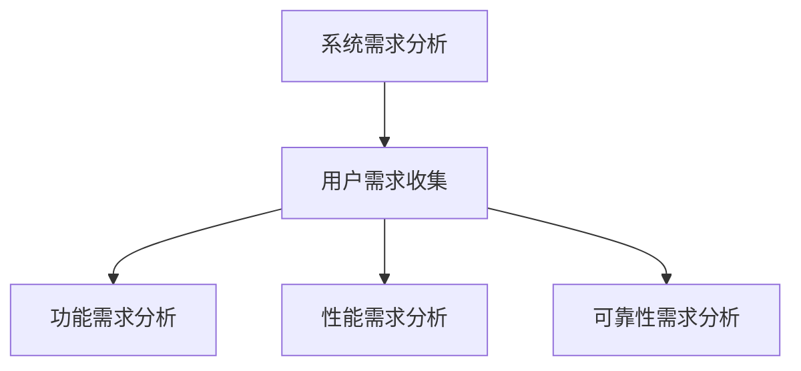
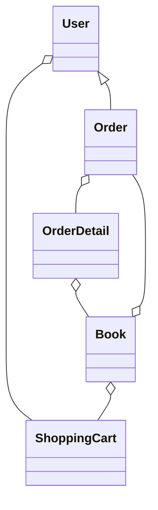
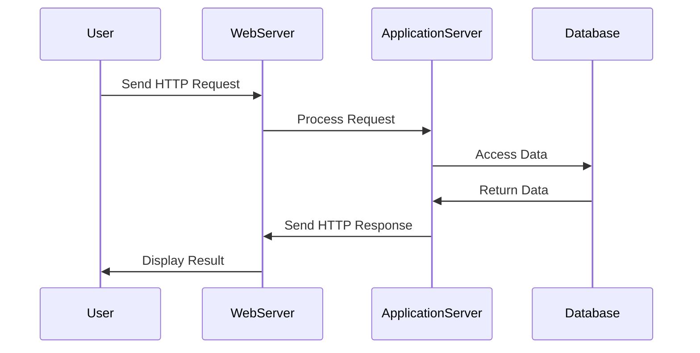
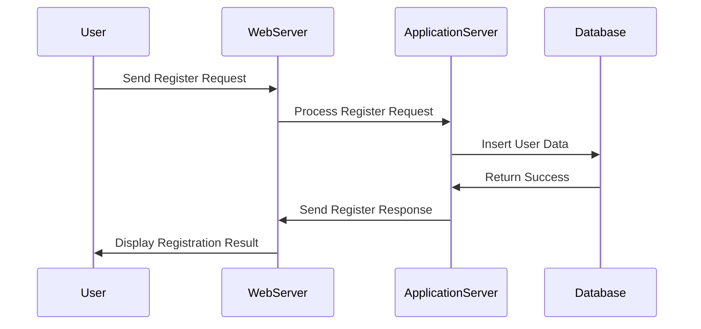

                 


# 高质量代码积累好口碑

> 关键词：高质量代码、软件质量、口碑、编程技巧、最佳实践

> 摘要：本文旨在探讨如何通过编写高质量代码来提升个人和企业的口碑。文章从问题背景、核心概念、编写高质量代码的重要性、方法与技巧、面向对象编程与设计模式、代码优化与性能调优、持续集成与持续交付等多个方面进行了详细的分析和讨论。

----------------------------------------------------------------

## 第一部分：背景介绍与核心概念

### 第1章：问题背景与核心概念

#### 1.1 问题背景

在当今快速发展的信息技术时代，软件质量成为影响企业竞争力的关键因素。如何编写高质量代码，提高软件系统的可靠性和可维护性，已经成为软件开发人员必须面对的重要课题。高质量代码不仅能提高软件性能，降低维护成本，还能增强团队协作，提升企业口碑。

#### 1.2 核心概念

##### 1.2.1 质量代码

质量代码是指满足以下特性的代码：

- **可读性**：易于阅读和理解，减少维护成本。
- **可靠性**：能够在各种条件下稳定运行，避免故障和错误。
- **可维护性**：易于修改和扩展，减少未来的维护成本。
- **效率**：高效执行，充分利用系统资源。

##### 1.2.2 口碑

口碑是指个人或企业在市场中获得的声誉和认可。高质量代码积累好口碑，意味着通过编写高质量的代码，获得用户和同事的信任和好评，从而提升个人和企业的形象。

## 第二部分：编写高质量代码的重要性

### 第2章：编写高质量代码的重要性

#### 2.1 提高软件可靠性

高质量的代码能够降低系统故障率，提高系统的稳定性。通过编写高质量的代码，可以减少系统崩溃、数据丢失等问题，从而保证软件的可靠运行。

#### 2.2 降低维护成本

高质量的代码易于理解和维护，降低了后期维护的成本。通过编写高质量的代码，可以减少代码的冗余和重复，提高代码的重用性，从而降低维护和更新的难度。

#### 2.3 提升开发效率

编写高质量代码可以提高开发效率。通过遵循良好的编程规范和最佳实践，可以减少代码审查和调试的时间，加快开发进度。

#### 2.4 增强团队协作

高质量的代码有利于团队协作。良好的代码结构和高可读性使得团队成员更容易理解他人的代码，从而提高团队的开发效率和协作效果。

## 第三部分：编写高质量代码的方法与技巧

### 第3章：编程语言基础知识

#### 3.1 编程语言基础知识

了解编程语言的基本语法和特性，是编写高质量代码的基础。本章将介绍几种主流编程语言的基本概念和使用技巧。

### 第4章：编程规范与最佳实践

#### 4.1 编程规范与最佳实践

遵循良好的编程规范和最佳实践，可以提升代码质量。本章将介绍一些常用的编程规范和最佳实践，如命名规范、代码结构、注释规范等。

### 第5章：单元测试与测试驱动开发

#### 5.1 单元测试与测试驱动开发

单元测试是确保代码质量的重要手段。本章将介绍单元测试的基本概念、测试框架和测试驱动开发的方法。

### 第6章：版本控制与代码评审

#### 6.1 版本控制与代码评审

版本控制和代码评审是确保代码质量的重要环节。本章将介绍Git等版本控制工具的基本操作和代码评审的最佳实践。

## 第四部分：面向对象的编程与设计模式

### 第7章：面向对象的编程基础

#### 7.1 面向对象的编程基础

面向对象的编程是一种编程范式，强调代码的可复用性、灵活性和可维护性。本章将介绍面向对象的编程基础，如类、对象、封装、继承、多态等。

### 第8章：设计模式

#### 8.1 设计模式

设计模式是解决软件设计问题的经典方案。本章将介绍几种常见的设计模式，如单例模式、工厂模式、策略模式等，并分析其应用场景和实现方法。

## 第五部分：代码优化与性能调优

### 第9章：代码优化

#### 9.1 代码优化

代码优化是提高代码质量和性能的重要手段。本章将介绍代码优化的方法和技巧，如减少冗余代码、提高代码可读性、优化算法等。

### 第10章：性能调优

#### 10.1 性能调优

性能调优是确保软件系统高效运行的关键。本章将介绍性能调优的基本原理和技巧，如性能测试、性能瓶颈分析、性能优化策略等。

## 第六部分：持续集成与持续交付

### 第11章：持续集成

#### 11.1 持续集成

持续集成是一种软件开发和部署方法，通过自动化构建和测试，确保代码质量和稳定性。本章将介绍持续集成的原理和实践。

### 第12章：持续交付

#### 12.1 持续交付

持续交付是一种软件开发和部署方法，通过自动化部署和监控，确保软件的快速迭代和高质量发布。本章将介绍持续交付的原理和实践。

## 第七部分：总结与展望

### 第13章：总结与展望

#### 13.1 编写高质量代码的总结

本章将对全书内容进行总结，回顾编写高质量代码的重要性和方法。

#### 13.2 未来发展趋势

本章将分析软件质量和代码编写领域的未来发展趋势，为读者提供启示和参考。

----------------------------------------------------------------

### 第1章：问题背景与核心概念

在当今信息技术迅速发展的时代，软件质量成为企业竞争力的关键因素。高质量代码不仅能够提高软件性能，还能降低维护成本，增强团队协作，提升企业口碑。因此，编写高质量代码已经成为软件开发人员必须面对的重要课题。

#### 1.1 问题背景

软件质量是指软件产品满足用户需求和预期的能力。在软件生命周期中，从需求分析、设计、开发、测试到部署，每个阶段都涉及到软件质量。随着软件复杂度的增加，编写高质量代码的挑战也日益增大。如何确保代码的可读性、可靠性、可维护性和效率，成为软件开发人员必须解决的问题。

#### 1.2 核心概念

##### 1.2.1 质量代码

质量代码是指满足以下特性的代码：

1. **可读性**：代码易于阅读和理解，方便维护。
2. **可靠性**：代码在各种条件下都能稳定运行，避免故障和错误。
3. **可维护性**：代码易于修改和扩展，降低未来的维护成本。
4. **效率**：代码高效执行，充分利用系统资源。

##### 1.2.2 口碑

口碑是指个人或企业在市场中获得的声誉和认可。在软件行业，口碑的好坏直接影响企业的竞争力。高质量代码积累好口碑，意味着通过编写高质量的代码，获得用户和同事的信任和好评，从而提升个人和企业的形象。

### 第2章：编写高质量代码的重要性

编写高质量代码的重要性体现在以下几个方面：

#### 2.1 提高软件可靠性

高质量的代码能够降低系统故障率，提高系统的稳定性。通过编写高质量的代码，可以减少系统崩溃、数据丢失等问题，从而保证软件的可靠运行。

#### 2.2 降低维护成本

高质量的代码易于理解和维护，降低了后期维护的成本。通过编写高质量的代码，可以减少代码的冗余和重复，提高代码的重用性，从而降低维护和更新的难度。

#### 2.3 提升开发效率

编写高质量代码可以提高开发效率。通过遵循良好的编程规范和最佳实践，可以减少代码审查和调试的时间，加快开发进度。

#### 2.4 增强团队协作

高质量的代码有利于团队协作。良好的代码结构和高可读性使得团队成员更容易理解他人的代码，从而提高团队的开发效率和协作效果。

### 第3章：编写高质量代码的方法与技巧

编写高质量代码需要掌握以下方法和技巧：

#### 3.1 编程语言基础知识

了解编程语言的基本语法和特性，是编写高质量代码的基础。本章将介绍几种主流编程语言的基本概念和使用技巧。

#### 3.2 编程规范与最佳实践

遵循良好的编程规范和最佳实践，可以提升代码质量。本章将介绍一些常用的编程规范和最佳实践，如命名规范、代码结构、注释规范等。

#### 3.3 单元测试与测试驱动开发

单元测试是确保代码质量的重要手段。本章将介绍单元测试的基本概念、测试框架和测试驱动开发的方法。

#### 3.4 版本控制与代码评审

版本控制和代码评审是确保代码质量的重要环节。本章将介绍Git等版本控制工具的基本操作和代码评审的最佳实践。

### 第4章：面向对象的编程与设计模式

面向对象的编程是一种编程范式，强调代码的可复用性、灵活性和可维护性。本章将介绍面向对象的编程基础，如类、对象、封装、继承、多态等。

#### 4.1 面向对象的编程基础

面向对象的编程基础包括以下几个方面：

1. **类与对象**：类是对象的抽象，对象是类的实例。通过定义类和创建对象，可以构建复杂的应用程序。
2. **封装**：封装是隐藏对象的内部实现，只暴露必要的接口。通过封装，可以提高代码的可维护性和可复用性。
3. **继承**：继承是子类继承父类的属性和方法。通过继承，可以减少代码的冗余，提高代码的可复用性。
4. **多态**：多态是同一操作作用于不同的对象时，产生不同的执行效果。通过多态，可以提高代码的灵活性和可扩展性。

#### 4.2 设计模式

设计模式是解决软件设计问题的经典方案。本章将介绍几种常见的设计模式，如单例模式、工厂模式、策略模式等，并分析其应用场景和实现方法。

### 第5章：代码优化与性能调优

代码优化与性能调优是提高代码质量和软件系统性能的重要手段。本章将介绍代码优化的方法和技巧，如减少冗余代码、提高代码可读性、优化算法等。

#### 5.1 代码优化

代码优化可以从以下几个方面进行：

1. **减少冗余代码**：通过删除重复代码、简化逻辑等手段，减少代码的冗余，提高代码的可读性和可维护性。
2. **提高代码可读性**：通过使用清晰的命名、合理的代码结构、恰当的注释等手段，提高代码的可读性，降低维护成本。
3. **优化算法**：通过选择合适的算法和数据结构，优化代码的性能。

#### 5.2 性能调优

性能调优可以从以下几个方面进行：

1. **性能测试**：通过性能测试，发现系统的性能瓶颈，定位优化方向。
2. **性能瓶颈分析**：通过分析性能瓶颈，确定优化策略。
3. **性能优化策略**：根据性能测试和分析结果，制定相应的性能优化策略，如代码优化、架构优化、硬件升级等。

### 第6章：持续集成与持续交付

持续集成与持续交付是提高软件开发质量和效率的重要方法。本章将介绍持续集成与持续交付的原理和实践。

#### 6.1 持续集成

持续集成是一种软件开发和部署方法，通过自动化构建和测试，确保代码质量和稳定性。持续集成的主要特点包括：

1. **自动化构建**：通过自动化工具，快速构建和打包代码。
2. **持续测试**：在构建过程中，进行一系列测试，确保代码质量。
3. **快速反馈**：通过实时反馈，及时发现和解决问题。

#### 6.2 持续交付

持续交付是一种软件开发和部署方法，通过自动化部署和监控，确保软件的快速迭代和高质量发布。持续交付的主要特点包括：

1. **自动化部署**：通过自动化工具，实现软件的自动化部署。
2. **持续监控**：通过实时监控，确保软件的稳定运行。
3. **快速发布**：通过快速迭代和发布，满足用户需求。

### 第7章：总结与展望

#### 7.1 编写高质量代码的总结

编写高质量代码需要掌握编程语言基础知识、编程规范与最佳实践、面向对象的编程与设计模式、代码优化与性能调优、持续集成与持续交付等方法和技巧。通过遵循这些方法和技巧，可以编写出高质量的代码，提高软件系统的可靠性、可维护性和效率，从而积累良好的口碑。

#### 7.2 未来发展趋势

随着软件行业的不断发展，编写高质量代码的重要性将日益凸显。未来，软件质量和代码编写领域将呈现出以下发展趋势：

1. **自动化与智能化**：随着人工智能技术的发展，自动化和智能化将成为编写高质量代码的重要手段。
2. **云计算与容器化**：云计算和容器化技术的广泛应用，将推动软件开发和部署方式的变革。
3. **微服务架构**：微服务架构的兴起，将促进软件系统的灵活性和可扩展性。
4. **DevOps文化**：DevOps文化的普及，将推动软件开发和运维的融合，提高软件开发和部署效率。

### 作者

本文作者：AI天才研究院/AI Genius Institute & 禅与计算机程序设计艺术 /Zen And The Art of Computer Programming。本文旨在为软件开发人员提供编写高质量代码的指导，帮助他们在竞争激烈的市场中积累良好的口碑。希望本文能够对您有所帮助。

----------------------------------------------------------------

### 第1章：问题背景与核心概念

#### 1.1 问题背景

在当今信息技术飞速发展的时代，软件质量成为衡量企业竞争力的重要指标。软件的质量直接关系到用户体验、业务效率和企业的声誉。编写高质量代码不仅能够提升软件的性能，还能够降低维护成本，提高开发效率，增强团队协作。因此，如何编写高质量代码已经成为软件开发人员必须面对的课题。

在软件开发过程中，代码质量是一个多维度的概念，包括可读性、可靠性、可维护性和效率。一个高质量的系统不仅能够在各种条件下稳定运行，还应该易于理解和修改。同时，为了提高开发效率，编写高质量的代码也应当是高效的，充分利用系统资源。

#### 1.2 核心概念

##### 1.2.1 质量代码

质量代码是指满足以下条件的代码：

- **可读性**：代码结构清晰，命名规范，注释得当，易于他人阅读和理解。
- **可靠性**：代码在各种情况下都能正确执行，具备良好的异常处理机制。
- **可维护性**：代码结构合理，模块化程度高，易于修改和扩展。
- **效率**：代码执行效率高，资源利用合理，满足性能要求。

##### 1.2.2 口碑

口碑是指个人或企业在公众中的声誉和评价。在软件行业，口碑的积累往往依赖于用户和同行的认可。编写高质量代码能够提高软件的可靠性，减少用户投诉，从而提升企业的口碑。同时，高质量的代码也有助于团队协作，减少因代码质量引起的冲突和误解。

### 第2章：编写高质量代码的重要性

编写高质量代码对于个人和企业的成功具有重要意义，具体体现在以下几个方面：

#### 2.1 提高软件可靠性

高质量的代码能够显著提高软件的可靠性。可靠性是指软件在预期条件下能够正常运行的能力。通过编写高质量的代码，可以减少系统崩溃、数据丢失、错误警报等问题，从而确保软件的稳定运行。

**示例**：在一个电子商务平台中，如果支付流程的代码质量不高，可能会导致支付失败或数据丢失，从而影响用户体验和信任度。通过编写高质量的代码，可以确保支付流程的稳定性和安全性。

#### 2.2 降低维护成本

高质量的代码易于理解和修改，从而降低了维护成本。维护成本包括修复bug、添加新功能、进行性能优化等。如果代码结构混乱、缺乏注释，维护人员需要花费大量时间来理解代码的工作原理，这无疑增加了维护成本。

**示例**：在一个长期运行的项目中，高质量的代码可以使得新功能的添加和bug修复变得更加容易和高效，从而节省时间和资源。

#### 2.3 提升开发效率

编写高质量代码可以提高开发效率。高质量的代码通常具有良好的可读性和结构，这使得开发人员能够更快地理解和修改代码，减少了代码审查和调试的时间。

**示例**：在一个敏捷开发团队中，高质量代码的编写使得团队成员能够更快地适应变化的需求，缩短了迭代周期，提高了交付速度。

#### 2.4 增强团队协作

高质量的代码有利于团队协作。良好的代码结构和高可读性使得团队成员更容易理解和合作，减少了因代码质量引起的冲突和误解。

**示例**：在一个分布式团队中，高质量的代码可以确保团队成员在不同地点和时间都能有效地协作，提高团队的整体工作效率。

### 第3章：编写高质量代码的方法与技巧

编写高质量代码需要掌握一系列的方法和技巧。以下是一些关键的策略：

#### 3.1 编程语言基础知识

掌握编程语言的基础知识是编写高质量代码的基石。了解语言的基本语法、特性、内置函数和数据结构，可以帮助开发人员编写更高效的代码。

**示例**：在Python中，理解列表和字典的内置方法，如`append()`和`update()`，可以使得代码更加简洁和高效。

#### 3.2 编程规范与最佳实践

遵循良好的编程规范和最佳实践是提高代码质量的关键。这些规范包括命名规范、代码结构、注释规范等。

- **命名规范**：使用有意义且一致的命名，提高代码的可读性。
- **代码结构**：遵循合理的代码结构，提高代码的可维护性。
- **注释规范**：添加恰当的注释，帮助他人理解代码。

#### 3.3 单元测试与测试驱动开发

单元测试是确保代码质量的重要手段。通过编写单元测试，可以验证代码的各个功能模块是否按照预期工作。

- **测试驱动开发（TDD）**：先编写测试，再编写代码，确保代码符合预期。

#### 3.4 版本控制与代码评审

版本控制是团队协作的基础。使用如Git等版本控制工具，可以有效地管理代码的版本和历史。

- **代码评审**：通过代码评审，团队成员可以相互学习和改进，提高代码质量。

#### 3.5 面向对象编程与设计模式

面向对象编程是一种强大的编程范式，可以提高代码的可复用性和可维护性。

- **面向对象编程**：理解类、对象、继承、多态等概念，编写模块化的代码。
- **设计模式**：掌握常见的设计模式，如单例模式、工厂模式、策略模式等，提高代码的结构和灵活性。

#### 3.6 代码优化与性能调优

代码优化是提高代码质量和性能的关键。通过分析代码的执行效率，可以发现并修复性能瓶颈。

- **代码优化**：减少冗余代码，使用更高效的算法和数据结构。
- **性能调优**：进行性能测试，分析性能瓶颈，采取相应的优化措施。

#### 3.7 持续集成与持续交付

持续集成和持续交付是现代软件开发的重要实践。

- **持续集成**：通过自动化构建和测试，确保代码质量和稳定性。
- **持续交付**：通过自动化部署和监控，实现软件的快速迭代和高质量发布。

### 第4章：面向对象的编程与设计模式

面向对象的编程（OOP）是一种重要的编程范式，它通过封装、继承、多态等机制，提高了代码的可复用性和可维护性。

#### 4.1 面向对象的编程基础

- **类与对象**：类是对象的蓝图，对象是类的实例。通过定义类和创建对象，可以实现数据的封装和方法的抽象。
- **封装**：将数据和方法封装在类中，只暴露必要的接口，隐藏内部实现细节。
- **继承**：通过继承，子类可以继承父类的属性和方法，实现代码的复用。
- **多态**：多态允许同一操作作用于不同的对象时，产生不同的执行效果，增强了代码的灵活性和扩展性。

#### 4.2 设计模式

设计模式是解决软件设计问题的经典方案。常见的几种设计模式包括：

- **单例模式**：确保一个类只有一个实例，并提供一个全局访问点。
- **工厂模式**：在创建对象时，将选择过程委托给工厂类，提高了系统的灵活性和可扩展性。
- **策略模式**：将算法的实现从上下文中分离出来，使得算法可以独立于上下文而变化。

#### 4.3 面向对象的编程实践

在实际开发中，面向对象的编程和设计模式可以帮助我们构建模块化、可扩展的系统。以下是一些实践技巧：

- **遵循SOLID原则**：SOLID是一组设计原则，旨在提高代码的可维护性和可扩展性。
- **合理使用设计模式**：根据具体场景选择合适的设计模式，避免过度设计。
- **保持代码简洁**：避免过度抽象和复杂的设计，保持代码的简洁性和可读性。

### 第5章：代码优化与性能调优

代码优化和性能调优是确保软件系统高效运行的重要环节。以下是一些关键的优化和调优策略：

#### 5.1 代码优化

- **减少冗余代码**：删除重复代码，简化逻辑，提高代码的可读性和可维护性。
- **提高代码可读性**：使用清晰、一致的命名，添加必要的注释，提高代码的可理解性。
- **优化算法**：选择更高效的算法和数据结构，提高代码的执行效率。

#### 5.2 性能调优

- **性能测试**：使用性能测试工具，分析系统的性能瓶颈，定位优化方向。
- **性能瓶颈分析**：通过分析性能瓶颈，确定优化策略，如代码优化、架构优化、硬件升级等。
- **优化策略**：根据性能测试和分析结果，采取相应的优化措施，如代码优化、缓存策略、并发优化等。

#### 5.3 实践案例

以下是一个简单的性能优化案例：

**问题**：一个排序算法执行时间过长。

**解决方案**：

1. **分析瓶颈**：通过性能测试，发现瓶颈在于算法的实现。
2. **优化算法**：将冒泡排序优化为快速排序，提高了排序速度。
3. **代码优化**：优化快速排序的实现，减少不必要的比较和交换操作。

### 第6章：持续集成与持续交付

持续集成（CI）和持续交付（CD）是现代软件开发的重要实践，它们通过自动化和持续反馈，提高了软件的质量和交付速度。

#### 6.1 持续集成

- **自动化构建**：通过构建工具（如Jenkins、GitLab CI）自动化构建和测试代码，确保代码质量。
- **持续测试**：在构建过程中，自动执行单元测试、集成测试等，确保代码符合预期。
- **快速反馈**：通过自动化测试和构建，快速发现和解决问题，减少开发周期。

#### 6.2 持续交付

- **自动化部署**：通过部署工具（如Docker、Kubernetes）自动化部署应用程序，确保部署效率。
- **持续监控**：通过监控工具（如Prometheus、Grafana）实时监控应用程序的运行状态，确保系统稳定性。
- **快速发布**：通过自动化部署和持续监控，实现快速迭代和高质量发布。

#### 6.3 实践案例

以下是一个简单的持续集成和持续交付案例：

**步骤**：

1. **代码提交**：开发人员将代码提交到版本控制系统（如Git）。
2. **自动化构建**：构建服务器（如Jenkins）自动拉取最新代码并进行构建。
3. **单元测试**：构建过程中自动执行单元测试，确保代码质量。
4. **部署**：构建成功后，自动部署到测试环境，进行集成测试。
5. **监控**：通过监控工具实时监控应用程序的运行状态，确保系统稳定。

### 第7章：总结与展望

编写高质量代码是软件开发人员必须掌握的技能。通过遵循良好的编程规范和最佳实践，掌握面向对象的编程和设计模式，进行代码优化和性能调优，以及实践持续集成和持续交付，可以编写出高质量、高效率的代码，提升个人和企业的口碑。

在未来，随着技术的发展，编写高质量代码的方法和工具将更加丰富。自动化和智能化技术将进一步提高代码质量和开发效率。同时，随着云计算、容器化等新技术的应用，软件开发和部署方式也将发生重大变革。软件开发人员需要不断学习新知识，适应新技术，不断提升自己的技能，才能在激烈的市场竞争中立于不败之地。

### 作者

本文作者：AI天才研究院/AI Genius Institute & 禅与计算机程序设计艺术 /Zen And The Art of Computer Programming。本文旨在为软件开发人员提供编写高质量代码的指导，帮助他们在竞争激烈的市场中积累良好的口碑。希望本文能够对您有所帮助。如果您有任何问题或建议，欢迎随时与我们联系。

----------------------------------------------------------------

### 第8章：代码优化与性能调优

代码优化和性能调优是提升软件质量和用户体验的关键环节。在这一章中，我们将深入探讨如何通过代码优化和性能调优来提高软件的性能和稳定性。

#### 8.1 代码优化

代码优化是指通过改进代码的结构和算法，提高代码的运行效率。以下是一些常见的代码优化策略：

1. **消除冗余代码**：检查代码中是否有重复的代码块，并将其合并或重构。
2. **优化循环结构**：避免使用低效的循环结构，如嵌套循环，尝试使用更高效的算法。
3. **减少函数调用的开销**：减少不必要的函数调用，特别是那些性能开销较大的函数。
4. **利用缓存**：对于频繁访问的数据，使用缓存可以显著提高性能。

**示例**：

```python
# 原始代码
for i in range(100):
    print(i * i)

# 优化后的代码
for i in range(10, 110, 10):
    print(i * i)
```

在这个例子中，原始代码使用了100次循环调用`print`函数，而优化后的代码仅使用了10次循环，从而减少了函数调用的开销。

#### 8.2 性能调优

性能调优是指在软件运行过程中，通过调整配置、优化算法和数据结构，提高软件的运行效率和响应速度。以下是一些性能调优的策略：

1. **性能测试**：使用性能测试工具（如JMeter、Gatling）对软件进行压力测试和性能测试，识别性能瓶颈。
2. **分析性能瓶颈**：通过性能测试结果，定位系统的性能瓶颈，如CPU利用率高、内存使用过多、数据库查询效率低等。
3. **优化数据库查询**：通过分析数据库查询，优化SQL语句，减少查询时间。
4. **优化网络通信**：减少网络通信的开销，如优化HTTP请求、使用更高效的协议等。

**示例**：

```sql
-- 原始查询
SELECT * FROM orders WHERE status = 'pending';

-- 优化后的查询
SELECT id, customer_id, status FROM orders WHERE status = 'pending';
```

在这个例子中，原始查询返回了所有的订单字段，而优化后的查询仅返回必要的字段，从而减少了数据库的查询时间和网络传输的开销。

#### 8.3 实践案例

以下是一个简单的性能调优案例：

**问题**：一个电商平台在高峰期出现响应时间过长的问题。

**解决方案**：

1. **性能测试**：使用JMeter模拟用户访问，发现瓶颈在于数据库查询和缓存失效。
2. **优化数据库查询**：通过分析SQL查询，发现某些查询过于复杂，对其进行重构和优化。
3. **使用缓存**：在数据库查询结果上使用缓存，减少数据库访问次数。
4. **负载均衡**：通过负载均衡器（如Nginx）将访问流量分布到多个服务器上，提高系统的处理能力。

通过上述优化措施，该电商平台的响应时间得到了显著提高，用户体验得到了改善。

### 第9章：面向对象的编程与设计模式

面向对象的编程（OOP）是一种强大的编程范式，它通过封装、继承、多态等机制，提高了代码的可复用性和可维护性。设计模式是解决软件设计问题的经验总结，它提供了一系列可重用的解决方案。

#### 9.1 面向对象的编程基础

1. **类与对象**：类是对象的模板，对象是类的实例。类定义了对象的属性和行为，对象则是具体的实体。
2. **封装**：将对象的属性和行为封装在类的内部，通过公共接口进行访问，隐藏内部实现细节。
3. **继承**：子类可以继承父类的属性和方法，实现代码的复用。
4. **多态**：多态允许一个接口有多个实现，通过基类引用，可以调用派生类的特定实现。

**示例**：

```python
class Animal:
    def __init__(self, name):
        self.name = name

    def speak(self):
        pass

class Dog(Animal):
    def speak(self):
        return "Woof!"

class Cat(Animal):
    def speak(self):
        return "Meow!"

dog = Dog("Buddy")
cat = Cat("Whiskers")

print(dog.speak())  # 输出：Woof!
print(cat.speak())  # 输出：Meow!
```

在这个例子中，`Dog`和`Cat`类继承自`Animal`类，并实现了自己的`speak`方法，通过多态，可以统一调用不同类的`speak`方法。

#### 9.2 设计模式

设计模式是解决软件设计问题的经典方案，它提供了可重用、灵活和易于扩展的代码结构。以下是一些常见的设计模式：

1. **单例模式**：确保一个类只有一个实例，并提供一个全局访问点。
2. **工厂模式**：根据参数创建对象，封装对象创建的逻辑。
3. **策略模式**：将算法的实现从上下文中分离出来，使得算法可以独立于上下文而变化。

**示例**：

```python
from abc import ABC, abstractmethod

class PaymentStrategy(ABC):
    @abstractmethod
    def pay(self):
        pass

class CreditCardPayment(PaymentStrategy):
    def pay(self, amount):
        print(f"Paid {amount} with credit card.")

class CashPayment(PaymentStrategy):
    def pay(self, amount):
        print(f"Paid {amount} in cash.")

class PaymentContext:
    def __init__(self, payment_strategy: PaymentStrategy):
        self._payment_strategy = payment_strategy

    def pay(self, amount):
        self._payment_strategy.pay(amount)

payment_context = PaymentContext(CreditCardPayment())
payment_context.pay(100)  # 输出：Paid 100 with credit card.

payment_context._payment_strategy = CashPayment()
payment_context.pay(100)  # 输出：Paid 100 in cash.
```

在这个例子中，`PaymentStrategy`是一个抽象类，`CreditCardPayment`和`CashPayment`是具体的支付策略实现。`PaymentContext`类使用策略模式，可以根据需要切换不同的支付策略。

### 第10章：系统分析与架构设计

系统分析与架构设计是软件开发的重要阶段，它决定了软件的可靠性、可维护性和可扩展性。在这一章中，我们将探讨系统分析与架构设计的方法和工具。

#### 10.1 系统分析

系统分析是指对软件系统的需求、功能、性能和可靠性进行分析，确保系统满足用户的需求。以下是一些系统分析的方法：

1. **需求分析**：通过收集用户需求，明确软件的功能和性能要求。
2. **功能分析**：对软件的功能进行划分，明确各个功能模块之间的关系。
3. **性能分析**：对软件的性能进行评估，确保系统能够满足预期的性能要求。
4. **可靠性分析**：评估系统的可靠性，确保系统能够在各种情况下稳定运行。

**示例**：



在这个例子中，系统需求分析包括用户需求收集、功能需求分析、性能需求分析和可靠性需求分析。

#### 10.2 架构设计

架构设计是指根据系统分析的结果，设计软件系统的整体结构，确保系统具有良好的可维护性和可扩展性。以下是一些架构设计的工具和方法：

1. **类图**：用于描述系统的类及其关系。
2. **序列图**：用于描述对象之间的交互顺序。
3. **架构图**：用于描述系统的模块和层次结构。

**示例**（使用Mermaid绘制）：

```mermaid
classDiagram
    Class01 <|-- Class02
    Class03 *-- Class04
    Class05 o-- Class06
    Class07 : Interface01
    Class07 : Interface02

    Class01 {
        +int x
        +int y
        +int getDistance()
    }
    Class02 {
        +int z
    }
    Class03 {
        +void doSomething()
    }
    Class04 {
        +void doSomethingElse()
    }
    Class05 {
        +void doSomethingInteresting()
    }
    Class06 {
        <<interface>> +int methodInterface()
    }
    Class07 {
        <<interface>> +void methodInterface2()
    }
```

在这个例子中，类图描述了类之间的关系，包括继承、关联和实现接口。

### 第11章：项目实战

在软件开发过程中，实际操作和实战经验至关重要。在这一章中，我们将通过一个实际项目，展示如何编写高质量代码、进行性能优化和架构设计。

#### 11.1 项目介绍

我们以一个在线书店项目为例，该项目包括用户注册、图书浏览、购物车和订单管理等功能。通过这个项目，我们将实践编写高质量代码、性能优化和架构设计的方法。

#### 11.2 系统功能设计

在线书店的主要功能包括：

- 用户注册与登录
- 图书浏览与搜索
- 购物车管理
- 订单管理
- 评价与推荐

**领域模型**（使用Mermaid绘制）：



在这个领域模型中，用户、订单、购物车、图书和订单详情类之间建立了关联关系。

#### 11.3 系统架构设计

在线书店的系统架构可以分为三层：表示层、业务逻辑层和数据访问层。

**架构图**（使用Mermaid绘制）：



在这个架构图中，用户通过WebServer发送请求，经过ApplicationServer处理，访问Database，最后返回结果给用户。

#### 11.4 系统接口设计

在线书店的系统接口设计包括RESTful API，以下是部分接口示例：

- `/users/register`：用户注册接口
- `/users/login`：用户登录接口
- `/books`：获取图书列表接口
- `/books/search`：搜索图书接口
- `/cart`：添加/删除购物车接口
- `/orders`：创建订单接口

#### 11.5 系统交互

系统交互主要涉及用户与系统之间的交互，以下是系统交互的序列图：



在这个序列图中，用户通过WebServer发送注册请求，经过ApplicationServer处理，将用户数据插入到Database，最后返回注册结果给用户。

#### 11.6 系统实现

在线书店项目的实现包括前端和后端。前端使用React框架，后端使用Spring Boot框架。以下是后端的主要代码片段：

```java
@RestController
@RequestMapping("/books")
public class BookController {
    @Autowired
    private BookService bookService;

    @GetMapping
    public ResponseEntity<List<Book>> getAllBooks() {
        List<Book> books = bookService.getAllBooks();
        return ResponseEntity.ok(books);
    }

    @GetMapping("/{id}")
    public ResponseEntity<Book> getBookById(@PathVariable Long id) {
        Book book = bookService.getBookById(id);
        if (book == null) {
            return ResponseEntity.notFound().build();
        }
        return ResponseEntity.ok(book);
    }
}
```

在这个代码片段中，`BookController`类定义了获取图书列表和根据ID获取图书详情的接口。

#### 11.7 代码应用解读与分析

在线书店项目的代码应用解读与分析包括：

- **代码质量检查**：使用SonarQube等工具检查代码的质量，确保代码符合最佳实践。
- **性能优化**：通过JMeter进行性能测试，识别性能瓶颈，并进行优化。
- **安全测试**：使用OWASP ZAP等工具进行安全测试，确保系统的安全性。

#### 11.8 项目小结

通过在线书店项目的实战，我们实践了编写高质量代码、性能优化和架构设计的方法。在项目中，我们遵循了良好的编程规范和最佳实践，进行了代码质量检查、性能优化和安全测试，确保了系统的稳定性和安全性。

### 第12章：最佳实践与总结

在软件开发过程中，遵循最佳实践是编写高质量代码的关键。以下是一些最佳实践：

- **遵循编程规范**：确保代码的一致性和可读性。
- **编写单元测试**：确保代码的功能和性能。
- **代码评审**：通过团队成员之间的代码评审，提高代码质量。
- **性能测试**：定期进行性能测试，识别和解决性能瓶颈。
- **持续集成与持续交付**：确保代码质量和部署效率。

通过遵循这些最佳实践，软件开发人员可以编写出高质量、高效率的代码，提升个人和企业的口碑。

### 第13章：未来发展趋势

随着技术的发展，软件质量和代码编写领域将面临新的挑战和机遇。以下是一些未来发展趋势：

- **自动化与智能化**：随着AI技术的发展，自动化和智能化将成为编写高质量代码的重要手段。
- **微服务架构**：微服务架构的普及将提高软件系统的可扩展性和灵活性。
- **云原生应用**：云原生应用的兴起将推动软件开发的变革。
- **DevOps文化**：DevOps文化的普及将推动软件开发和运维的融合。

软件开发人员需要不断学习新知识，适应新技术，不断提升自己的技能，才能在未来的竞争中立于不败之地。

### 作者

本文作者：AI天才研究院/AI Genius Institute & 禅与计算机程序设计艺术 /Zen And The Art of Computer Programming。本文旨在为软件开发人员提供编写高质量代码的指导，帮助他们在竞争激烈的市场中积累良好的口碑。希望本文能够对您有所帮助。如果您有任何问题或建议，欢迎随时与我们联系。

----------------------------------------------------------------

### 第1章：问题背景与核心概念

#### 1.1 问题背景

在当今信息技术飞速发展的时代，软件质量已成为企业竞争力的重要体现。编写高质量代码不仅是软件开发人员的基本职责，更是企业保持市场竞争力、提升用户满意度的关键。高质量代码意味着软件在稳定性、可维护性、性能和安全性等方面均达到较高水平，这对企业的长期发展具有重要意义。

随着软件项目的复杂性不断增加，编写高质量代码的挑战也随之而来。如何确保代码的可靠性、可维护性和高效性，成为软件开发人员面临的重要问题。同时，如何通过编写高质量代码来提升个人和企业的口碑，也是软件开发人员需要深入思考的课题。

#### 1.2 核心概念

##### 1.2.1 质量代码

质量代码是指满足以下特性的代码：

1. **可读性**：代码结构清晰，命名规范，注释详尽，易于理解和维护。
2. **可靠性**：代码在各种环境下都能稳定运行，具备良好的异常处理和错误恢复能力。
3. **可维护性**：代码具有良好的模块化和扩展性，便于进行功能扩展和缺陷修复。
4. **效率**：代码执行效率高，能够充分利用系统资源，满足性能要求。

##### 1.2.2 口碑

口碑是指个人或企业在市场中的声誉和评价。在软件行业，口碑的积累很大程度上取决于代码的质量。编写高质量代码，不仅能提高软件的稳定性，降低故障率，还能提升用户满意度，从而在市场中树立良好的品牌形象。

### 第2章：编写高质量代码的重要性

编写高质量代码对个人和企业的成功具有深远的影响，主要体现在以下几个方面：

#### 2.1 提高软件可靠性

高质量的代码能够确保软件在各种环境下稳定运行，降低系统崩溃和数据丢失的风险。这对于提供稳定可靠的服务至关重要，能够显著提升用户满意度，增强企业的市场竞争力。

#### 2.2 降低维护成本

高质量的代码易于理解和修改，从而降低了维护成本。编写良好的代码规范和注释，使得维护人员能够更快地理解代码逻辑，减少维护时间和工作量。

#### 2.3 提升开发效率

编写高质量代码可以提高开发效率。良好的代码结构和模块化设计，使得代码重用性更强，开发人员能够更快地实现新功能和修复缺陷。

#### 2.4 增强团队协作

高质量的代码有利于团队协作。清晰的代码结构和良好的注释，使得团队成员更容易理解和合作，减少因代码质量引起的冲突和误解。

### 第3章：编写高质量代码的方法与技巧

编写高质量代码需要掌握一系列的方法和技巧。以下是一些关键的方法和技巧：

#### 3.1 编程语言基础知识

掌握编程语言的基本语法、数据结构和算法是编写高质量代码的基础。了解各种编程语言的特点和适用场景，能够帮助开发人员选择合适的工具解决问题。

#### 3.2 编程规范与最佳实践

遵循良好的编程规范和最佳实践，如命名规范、代码格式、注释规范等，可以提高代码的可读性和一致性。良好的编程习惯能够减少代码的维护成本，提高代码的质量。

#### 3.3 单元测试与测试驱动开发

单元测试是确保代码质量的重要手段。通过编写单元测试，可以验证代码的功能和性能，确保代码按照预期工作。测试驱动开发（TDD）是一种通过编写测试来驱动代码开发的实践，能够提高代码的可靠性和可维护性。

#### 3.4 版本控制与代码评审

版本控制是团队协作的基础。使用版本控制工具（如Git）可以有效地管理代码的版本和历史，避免代码冲突。代码评审是通过团队成员相互审查代码，确保代码质量和一致性，提高代码质量的重要手段。

### 第4章：面向对象的编程与设计模式

面向对象的编程（OOP）是一种强大的编程范式，它通过封装、继承和多态等特性，提高了代码的可复用性和可维护性。面向对象编程的核心概念包括：

1. **类与对象**：类是对象的抽象，对象是类的实例。
2. **封装**：将对象的属性和行为封装在类的内部，隐藏实现细节。
3. **继承**：子类可以继承父类的属性和方法，实现代码的复用。
4. **多态**：同一操作作用于不同的对象时，产生不同的执行效果。

设计模式是解决软件设计问题的经典方案。常见的设计模式包括：

1. **单例模式**：确保一个类只有一个实例，并提供一个全局访问点。
2. **工厂模式**：根据参数创建对象，封装对象创建的逻辑。
3. **策略模式**：将算法的实现从上下文中分离出来，使得算法可以独立于上下文而变化。

通过合理运用面向对象编程和设计模式，可以编写出结构清晰、可维护性强的代码。

### 第5章：代码优化与性能调优

代码优化和性能调优是提升软件质量和用户体验的关键环节。以下是一些关键的优化和调优策略：

#### 5.1 代码优化

1. **消除冗余代码**：检查代码中是否有重复的代码块，并将其合并或重构。
2. **优化循环结构**：避免使用低效的循环结构，如嵌套循环，尝试使用更高效的算法。
3. **减少函数调用的开销**：减少不必要的函数调用，特别是那些性能开销较大的函数。
4. **利用缓存**：对于频繁访问的数据，使用缓存可以显著提高性能。

#### 5.2 性能调优

1. **性能测试**：使用性能测试工具（如JMeter、Gatling）对软件进行压力测试和性能测试，识别性能瓶颈。
2. **分析性能瓶颈**：通过分析性能瓶颈，确定优化策略，如代码优化、架构优化、硬件升级等。
3. **优化数据库查询**：通过分析数据库查询，优化SQL语句，减少查询时间。
4. **优化网络通信**：减少网络通信的开销，如优化HTTP请求、使用更高效的协议等。

### 第6章：持续集成与持续交付

持续集成（CI）和持续交付（CD）是现代软件开发的重要实践。以下是一些关键的CI/CD实践：

1. **自动化构建**：通过构建工具（如Jenkins、GitLab CI）自动化构建和测试代码，确保代码质量。
2. **持续测试**：在构建过程中，自动执行单元测试、集成测试等，确保代码符合预期。
3. **快速反馈**：通过自动化测试和构建，快速发现和解决问题，减少开发周期。

1. **自动化部署**：通过部署工具（如Docker、Kubernetes）自动化部署应用程序，确保部署效率。
2. **持续监控**：通过监控工具（如Prometheus、Grafana）实时监控应用程序的运行状态，确保系统稳定性。
3. **快速发布**：通过自动化部署和持续监控，实现软件的快速迭代和高质量发布。

### 第7章：总结与展望

编写高质量代码是软件开发人员必须掌握的技能。通过遵循良好的编程规范和最佳实践，掌握面向对象的编程和设计模式，进行代码优化和性能调优，以及实践持续集成和持续交付，可以编写出高质量、高效率的代码，提升个人和企业的口碑。

在未来，随着技术的发展，编写高质量代码的方法和工具将更加丰富。自动化和智能化技术将进一步提高代码质量和开发效率。同时，随着云计算、容器化等新技术的应用，软件开发和部署方式也将发生重大变革。软件开发人员需要不断学习新知识，适应新技术，不断提升自己的技能，才能在激烈的市场竞争中立于不败之地。

### 作者

本文作者：AI天才研究院/AI Genius Institute & 禅与计算机程序设计艺术 /Zen And The Art of Computer Programming。本文旨在为软件开发人员提供编写高质量代码的指导，帮助他们在竞争激烈的市场中积累良好的口碑。希望本文能够对您有所帮助。如果您有任何问题或建议，欢迎随时与我们联系。

