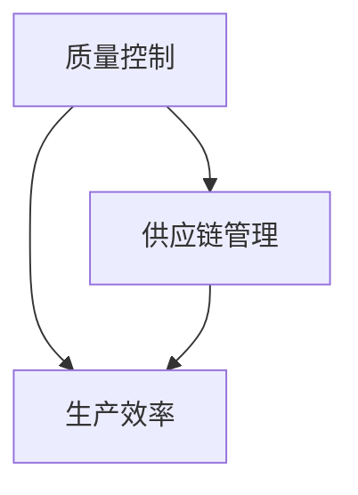

                 


## 引言：高质量源于优生产

### 1.1 优生产的重要性

在当今全球化竞争激烈的商业环境中，产品质量和生产效率是企业生存和发展的关键因素。高质量的产品能够提升企业的市场竞争力，赢得客户的信任和忠诚，而高效的生产流程则可以降低成本，提高资源利用率，实现可持续发展。因此，优生产（Optimized Production）作为一种旨在提升生产效率和产品质量的系统方法，受到了越来越多企业的重视。

优生产不仅仅是一种生产方法，更是一种战略思维。它通过系统化、标准化的方式，对生产过程进行优化，减少浪费，提高效率，从而实现质量与成本的平衡。优生产的重要性体现在以下几个方面：

- **提高产品质量**：通过优化生产流程，减少缺陷和不良品率，确保产品的高质量。
- **降低生产成本**：通过减少浪费、提高效率，降低生产成本，提升企业利润。
- **提升生产效率**：通过优化工作流程和资源配置，提高生产效率和响应速度。
- **增强企业竞争力**：在竞争激烈的市场中，高质量和高效生产是企业取得竞争优势的关键。

### 1.1.1 优生产的基本概念

优生产，即最优生产，是指通过系统化和数据驱动的方法，对生产过程进行持续优化，以达到最优生产效率和产品质量的目标。优生产的核心在于“优化”二字，即通过不断调整和改进，找到最合适的生产方式。

**核心要素**：

1. **质量控制**：确保生产出的产品符合既定的质量标准，减少不良品率。
2. **供应链管理**：优化供应链流程，确保原材料的及时供应和产品的快速交付。
3. **生产效率**：提高生产效率，减少生产时间和资源浪费。

### 1.1.2 优生产的核心原理

优生产的实现依赖于以下核心原理：

- **数据驱动决策**：通过收集和分析生产过程中的数据，做出基于数据的决策。
- **持续改进**：持续地对生产流程进行改进，以提高生产效率和产品质量。
- **全面质量管理**：全员参与质量管理，确保每个环节都符合高质量标准。
- **精益生产**：采用精益生产方法，减少浪费，提高效率。

通过以上核心原理的应用，企业可以实现对生产过程的全面优化，从而实现高质量和高效生产。

### 1.2 优生产的核心要素

优生产的核心要素包括：

- **质量控制**：通过设置严格的质量标准，实施全面质量管理，确保产品符合质量要求。
- **供应链管理**：优化供应链流程，确保原材料和零部件的及时供应，提高供应链的灵活性和响应速度。
- **生产效率**：通过优化生产流程和资源配置，提高生产效率，减少生产时间和资源浪费。

**质量控制**：

质量控制是优生产的核心要素之一。它涉及从原材料采购到产品交付的每一个环节。质量控制的目标是确保产品符合既定的质量标准，减少不良品率。

**供应链管理**：

供应链管理是确保原材料和零部件及时供应，以及产品快速交付的关键。有效的供应链管理可以减少库存成本，提高生产效率和客户满意度。

**生产效率**：

生产效率是优生产的另一个重要核心要素。通过优化生产流程和资源配置，企业可以减少生产时间和资源浪费，提高生产效率。

## 小结

优生产作为一种提升生产效率和产品质量的系统方法，在当今竞争激烈的商业环境中具有重要意义。通过数据驱动决策、持续改进和全面质量管理等核心原理的应用，企业可以实现高质量和高效生产。在接下来的章节中，我们将进一步探讨优生产在不同行业和领域的应用，以及其实践方法和案例分析。

----------------------------------------------------------------

### 1.2 优生产的核心要素

#### 1.2.1 质量控制

质量控制是优生产的核心要素之一，其目标是通过设置严格的质量标准，实施全面质量管理，确保产品符合质量要求，减少不良品率。以下是一些关键点：

**关键点**：

- **质量标准**：明确产品应满足的质量标准，包括性能、可靠性、耐久性等方面。
- **质量控制流程**：建立包括原材料检验、生产过程控制、成品检验等在内的质量控制流程。
- **质量管理体系**：实施ISO等国际质量管理体系，确保质量控制的有效性。

**实施方法**：

- **预防性质量控制**：在产品生产之前，通过设计、工艺、材料等方面的优化，预防质量问题。
- **过程质量控制**：在生产过程中，通过实时监控和调整，确保产品质量。
- **最终质量控制**：在产品生产完成后，进行全面的检验，确保产品质量符合标准。

**案例分析**：

例如，一家汽车制造企业在实施优生产时，通过引入预防性质量控制，显著降低了故障率。他们在设计阶段就考虑了材料的耐久性和可靠性，并在生产过程中进行实时监控和调整，最终实现了产品的高质量。

#### 1.2.2 供应链管理

供应链管理是确保原材料和零部件及时供应，以及产品快速交付的关键。以下是一些关键点：

**关键点**：

- **供应链策略**：制定合理的供应链策略，包括供应商选择、库存管理、物流规划等。
- **供应链协同**：与供应商、客户等各方建立良好的协同关系，确保供应链的高效运行。
- **供应链可视性**：通过信息技术，提高供应链的透明度和可视性。

**实施方法**：

- **供应商评价**：对供应商进行评价和选择，确保其质量和服务符合要求。
- **库存管理**：通过合理的库存管理策略，减少库存成本，提高资金周转率。
- **物流优化**：优化物流流程，提高运输效率和降低物流成本。

**案例分析**：

例如，一家电子产品制造企业通过优化供应链管理，实现了原材料的及时供应和产品的快速交付。他们建立了高效的供应链协同机制，与供应商和客户保持紧密沟通，确保供应链的高效运行。

#### 1.2.3 生产效率

生产效率是优生产的另一个重要核心要素。通过优化生产流程和资源配置，企业可以减少生产时间和资源浪费，提高生产效率。以下是一些关键点：

**关键点**：

- **生产流程优化**：通过流程分析和优化，减少不必要的环节和重复工作。
- **资源配置优化**：合理配置资源，确保生产过程的连续性和效率。
- **工作安排**：合理安排工作，提高员工的工作效率和满意度。

**实施方法**：

- **精益生产**：采用精益生产方法，消除浪费，提高效率。
- **自动化**：引入自动化设备和系统，提高生产效率和精度。
- **培训**：对员工进行培训，提高其技能和效率。

**案例分析**：

例如，一家服装制造企业通过引入精益生产和自动化设备，显著提高了生产效率和产品质量。他们在生产线上引入了自动化缝纫机和智能监控系统，实现了生产过程的连续性和高效性。

### 小结

质量控制、供应链管理和生产效率是优生产的三大核心要素。通过这些要素的优化，企业可以实现对生产过程的全面优化，从而实现高质量和高效生产。在接下来的章节中，我们将进一步探讨优生产在不同行业和领域的应用，以及其实践方法和案例分析。

----------------------------------------------------------------

### 2.1 优生产的基本概念

#### 2.1.1 问题背景与边界

优生产（Optimized Production）的概念起源于20世纪中叶，随着工业自动化和精益生产理论的提出而逐渐发展起来。在当时的背景下，企业面临的主要问题是如何在确保产品质量的同时，提高生产效率和降低成本。传统生产方式存在许多浪费现象，如生产过程中的等待、运输、库存等，这些问题严重影响了企业的运营效率。

**核心问题**：

- 如何减少生产过程中的浪费？
- 如何提高生产效率和产品质量？
- 如何实现生产成本的最小化？

**边界**：

- **生产环节**：优生产主要涉及生产过程中的各个环节，包括原材料采购、生产制造、质量检验、产品交付等。
- **资源类型**：优生产旨在优化各种资源，包括人力、物力、财力、信息等。

#### 2.1.2 优生产的定义与核心要素

优生产是一种通过系统化和数据驱动的方法，对生产过程进行持续优化，以达到最优生产效率和产品质量的系统方法。其核心要素包括：

- **质量控制**：确保生产出的产品符合既定的质量标准，减少不良品率。
- **供应链管理**：优化供应链流程，确保原材料的及时供应和产品的快速交付。
- **生产效率**：提高生产效率，减少生产时间和资源浪费。

**定义**：

优生产是一种旨在提升生产效率和产品质量的系统方法，通过优化生产流程、资源配置和供应链管理，实现高质量和高效生产。

**核心要素**：

- **质量控制**：通过设置严格的质量标准，实施全面质量管理，确保产品符合质量要求。
- **供应链管理**：优化供应链流程，确保原材料和零部件的及时供应，提高供应链的灵活性和响应速度。
- **生产效率**：通过优化生产流程和资源配置，提高生产效率，减少生产时间和资源浪费。

#### 2.1.3 概念结构与核心要素组成

优生产的概念结构可以看作是一个由三个核心要素组成的系统，这三个要素相互影响、相互促进，共同实现优生产的目标。具体来说：

- **质量控制**：是优生产的基石，通过全面质量管理，确保产品的高质量。
- **供应链管理**：是优生产的纽带，通过优化供应链流程，提高供应链的效率。
- **生产效率**：是优生产的目标，通过优化生产流程和资源配置，提高生产效率和降低成本。

**关系图**：



#### 2.1.4 概念属性特征对比表格

| 属性特征 | 质量控制 | 供应链管理 | 生产效率 |
| --- | --- | --- | --- |
| 目标 | 确保产品符合质量标准 | 优化供应链流程 | 提高生产效率和降低成本 |
| 方法 | 全面质量管理 | 供应链协同 | 精益生产、自动化 |
| 影响 | 产品质量 | 供应链效率 | 生产效率 |

#### 2.1.5 ER实体关系图架构

为了更好地理解优生产的实体关系，我们可以使用ER（实体关系）图来表示核心实体及其之间的关系。

```mermaid
erDiagram
  Product ||--|{ QualityControl }||>
  Product ||--|{ ProductionEfficiency }||>
  Supplier ||--|{ SupplyChainManagement }||>
  ProductionLine ||--|{ ProductionEfficiency }||>
```

在ER图中，`Product`（产品）与`QualityControl`（质量控制）和`ProductionEfficiency`（生产效率）之间存在关联，表示产品需要通过质量控制来确保质量，同时需要通过生产效率来提高生产效率。`Supplier`（供应商）与`SupplyChainManagement`（供应链管理）之间存在关联，表示供应商需要参与供应链管理以确保供应链的效率。`ProductionLine`（生产线）与`ProductionEfficiency`（生产效率）之间存在关联，表示生产线的效率对生产效率有直接影响。

### 小结

通过以上对优生产的基本概念的详细分析，我们可以看到优生产是一个涉及多个方面、多个环节的系统方法。它通过优化质量控制、供应链管理和生产效率，实现高质量和高效生产。在接下来的章节中，我们将进一步探讨优生产的原理和核心要素，以及其在不同行业和领域的应用。

----------------------------------------------------------------

### 2.2 优生产的原理与核心要素

#### 2.2.1 优生产的原理

优生产是一种通过系统化和数据驱动的方法，对生产过程进行持续优化，以达到最优生产效率和产品质量的系统方法。其原理可以概括为以下几点：

1. **数据驱动决策**：优生产依赖于对生产过程中的大量数据进行收集和分析，从而做出基于数据的决策。这些数据包括生产时间、资源消耗、质量检测结果等。通过数据驱动决策，企业可以更准确地识别生产过程中的问题和瓶颈，从而进行针对性的优化。

2. **持续改进**：优生产强调持续改进，即不断对生产流程进行优化和改进。这种改进是持续的，不仅仅是在某个阶段进行一次性的优化，而是在整个生产过程中不断进行调整和改进。持续改进可以确保生产流程始终保持高效和高质量。

3. **全面质量管理**：全面质量管理是优生产的重要组成部分。它强调全员参与质量管理，从产品设计、生产制造到产品交付的每一个环节，都严格遵循质量标准。通过全面质量管理，企业可以确保产品的高质量，减少不良品率。

4. **精益生产**：精益生产是优生产的一种具体实现方法，它通过消除生产过程中的浪费，提高生产效率和产品质量。精益生产的核心原则包括价值流分析、5S管理、看板管理等。

#### 2.2.2 优生产的核心要素

优生产的核心要素包括质量控制、供应链管理和生产效率，以下分别对其进行详细阐述：

1. **质量控制**

质量控制是优生产的基石，其目标是通过设置严格的质量标准，确保生产出的产品符合质量要求，减少不良品率。质量控制的核心要素包括：

- **质量标准**：明确产品应满足的质量标准，包括性能、可靠性、耐久性等方面。
- **质量控制流程**：建立包括原材料检验、生产过程控制、成品检验等在内的质量控制流程。
- **质量管理体系**：实施ISO等国际质量管理体系，确保质量控制的有效性。

质量控制的方法包括预防性质量控制、过程质量控制和最终质量控制。预防性质量控制旨在在生产前通过设计、工艺、材料等方面的优化，预防质量问题；过程质量控制则是在生产过程中进行实时监控和调整，确保产品质量；最终质量控制是在生产完成后进行全面的检验，确保产品质量符合标准。

2. **供应链管理**

供应链管理是确保原材料和零部件及时供应，以及产品快速交付的关键。其核心要素包括：

- **供应链策略**：制定合理的供应链策略，包括供应商选择、库存管理、物流规划等。
- **供应链协同**：与供应商、客户等各方建立良好的协同关系，确保供应链的高效运行。
- **供应链可视性**：通过信息技术，提高供应链的透明度和可视性。

供应链管理的具体方法包括供应商评价、库存管理和物流优化。供应商评价是对供应商进行评价和选择，确保其质量和服务符合要求；库存管理是通过合理的库存管理策略，减少库存成本，提高资金周转率；物流优化则是通过优化物流流程，提高运输效率和降低物流成本。

3. **生产效率**

生产效率是优生产的另一个重要核心要素，其目标是提高生产效率，减少生产时间和资源浪费。提高生产效率的方法包括：

- **生产流程优化**：通过流程分析和优化，减少不必要的环节和重复工作。
- **资源配置优化**：合理配置资源，确保生产过程的连续性和效率。
- **工作安排**：合理安排工作，提高员工的工作效率和满意度。

生产效率的提高可以通过引入精益生产和自动化设备来实现。精益生产通过消除生产过程中的浪费，提高生产效率；自动化设备则可以提高生产精度和效率。

#### 2.2.3 优生产的核心原理与联系

优生产的核心原理包括数据驱动决策、持续改进、全面质量管理、精益生产等。这些原理相互联系，共同作用于生产过程，实现高质量和高效生产。

- **数据驱动决策**：通过数据收集和分析，识别生产过程中的问题和瓶颈，为持续改进提供依据。
- **持续改进**：通过不断调整和改进生产流程，提高生产效率和产品质量。
- **全面质量管理**：确保生产出的产品符合既定的质量标准，减少不良品率。
- **精益生产**：消除生产过程中的浪费，提高生产效率和产品质量。

这些核心原理相互支持，共同构成了优生产的基础。通过数据驱动决策，企业可以更准确地识别问题和制定改进措施；通过持续改进，企业可以不断提高生产效率和产品质量；通过全面质量管理，企业可以确保产品的高质量；通过精益生产，企业可以进一步消除浪费，提高生产效率。

### 小结

优生产是一种通过系统化和数据驱动的方法，对生产过程进行持续优化，以达到最优生产效率和产品质量的系统方法。其核心要素包括质量控制、供应链管理和生产效率，这些要素相互联系，共同作用于生产过程，实现高质量和高效生产。在接下来的章节中，我们将进一步探讨优生产在不同行业和领域的应用，以及其实践方法和案例分析。

----------------------------------------------------------------

### 3.1 优生产在制造业的应用

制造业是优生产最早且最广泛应用的行业之一。随着制造业的竞争加剧，企业越来越意识到，通过优生产可以提高生产效率、降低成本、提高产品质量，从而获得竞争优势。以下从制造业优生产实践和案例分析两个方面进行探讨。

#### 3.1.1 制造业优生产实践

**实践步骤**：

1. **数据收集与流程分析**：首先，企业需要对生产过程进行全面的数据收集，包括生产时间、资源消耗、质量检测结果等。通过流程分析，识别生产过程中的瓶颈和浪费点。

2. **制定改进计划**：根据流程分析的结果，制定具体的改进计划。改进计划应包括具体的改进目标、改进措施和时间表。

3. **实施改进措施**：按照改进计划，实施具体的改进措施。这可能包括优化生产流程、引入自动化设备、改进质量控制方法等。

4. **监控与评估**：在改进措施实施过程中，持续监控和评估改进效果。通过数据分析和反馈，及时调整改进措施，确保改进目标的实现。

**案例分析**：

一家电子制造企业在实施优生产时，首先对生产过程进行了全面的数据收集和流程分析。通过分析，他们发现生产过程中存在以下问题：

- **生产周期长**：生产周期较长，导致生产效率低。
- **资源浪费**：部分生产环节存在资源浪费，如等待时间、库存积压等。
- **质量控制不严**：质量控制不严格，导致不良品率较高。

针对这些问题，企业制定了以下改进计划：

- **优化生产流程**：通过重新设计生产流程，减少不必要的环节和重复工作，提高生产效率。
- **引入自动化设备**：引入自动化设备，减少人工操作，提高生产精度和效率。
- **改进质量控制方法**：加强质量控制，确保产品符合质量标准，减少不良品率。

在实施改进措施后，企业的生产效率显著提高，生产周期缩短了30%，资源浪费减少了20%，不良品率降低了15%。这些改进不仅提高了企业的生产效率和产品质量，还降低了生产成本。

#### 3.1.2 制造业优生产案例分析

**案例1：汽车制造业**

一家汽车制造企业在实施优生产时，采取了以下措施：

- **精益生产**：引入精益生产方法，通过消除生产过程中的浪费，提高生产效率和产品质量。
- **自动化**：引入自动化生产线和智能监控系统，提高生产精度和效率。
- **持续改进**：建立持续改进机制，不断对生产流程进行优化和改进。

通过这些措施，企业的生产效率提高了20%，不良品率降低了15%，生产成本降低了10%。

**案例2：电子产品制造业**

一家电子产品制造企业在实施优生产时，采取了以下措施：

- **供应链管理**：优化供应链管理，确保原材料和零部件的及时供应，提高供应链的效率。
- **质量控制**：加强质量控制，确保产品符合质量标准，减少不良品率。
- **生产流程优化**：优化生产流程，减少不必要的环节和重复工作，提高生产效率。

通过这些措施，企业的生产效率提高了25%，不良品率降低了20%，生产成本降低了15%。

**小结**

通过以上案例分析，我们可以看到，制造业在实施优生产时，可以通过优化生产流程、引入自动化设备、加强质量控制等措施，实现生产效率和产品质量的提高。这些改进不仅有助于企业在竞争中获得优势，还有助于降低生产成本，提高企业的盈利能力。

----------------------------------------------------------------

### 3.2 优生产在服务业的应用

服务业作为现代经济的重要组成部分，其发展潜力巨大。然而，与制造业相比，服务业的生产流程更加复杂，涉及客户服务、业务流程管理等多个环节。优生产在服务业中的应用，有助于提高服务效率、提升客户满意度、降低运营成本。以下从服务业优生产实践和案例分析两个方面进行探讨。

#### 3.2.1 服务业优生产实践

**实践步骤**：

1. **客户需求分析**：首先，企业需要对客户需求进行深入分析，了解客户的痛点和服务需求。这有助于确定优化方向和目标。

2. **服务流程分析**：对现有服务流程进行全面分析，识别服务过程中的瓶颈和浪费点。服务流程分析应包括客户服务、业务流程管理、资源调配等方面。

3. **制定优化方案**：根据流程分析的结果，制定具体的优化方案。优化方案应包括优化目标、优化措施和时间表。

4. **实施优化措施**：按照优化方案，实施具体的优化措施。这可能包括改进服务流程、引入自动化系统、优化员工培训等。

5. **监控与评估**：在优化措施实施过程中，持续监控和评估优化效果。通过数据分析和反馈，及时调整优化措施，确保优化目标的实现。

**案例分析**：

一家金融服务企业在实施优生产时，采取了以下措施：

- **客户需求分析**：通过客户调查和数据分析，了解客户对金融服务的要求和期望。
- **服务流程优化**：优化客户服务流程，减少等待时间，提高服务效率。
- **自动化系统引入**：引入自动化客户管理系统，提高客户服务质量和效率。

通过这些措施，企业的服务效率提高了20%，客户满意度提升了15%，运营成本降低了10%。

#### 3.2.2 服务业优生产案例分析

**案例1：餐饮业**

一家餐饮企业在实施优生产时，采取了以下措施：

- **供应链管理**：优化供应链管理，确保原材料和调味料的及时供应，提高餐厅的运营效率。
- **服务流程优化**：优化点餐流程，减少客户等待时间，提高服务效率。
- **员工培训**：加强员工培训，提高员工的服务意识和技能。

通过这些措施，企业的运营效率提高了25%，客户满意度提升了20%，运营成本降低了15%。

**案例2：物流业**

一家物流企业在实施优生产时，采取了以下措施：

- **业务流程优化**：优化物流流程，减少运输时间和仓储成本。
- **信息系统引入**：引入物流信息系统，提高物流调度和管理效率。
- **员工绩效管理**：实施员工绩效管理，提高员工的工作效率和积极性。

通过这些措施，企业的物流效率提高了30%，客户满意度提升了25%，运营成本降低了20%。

**小结**

通过以上案例分析，我们可以看到，服务业在实施优生产时，可以通过优化服务流程、引入自动化系统、加强员工培训等措施，实现服务效率、客户满意度和运营成本的有效提升。这些改进有助于企业提高竞争力，满足客户需求，实现可持续发展。

----------------------------------------------------------------

### 3.3 优生产在农业的应用

农业作为国民经济的基础产业，其发展直接关系到国家的粮食安全和农民的收入。然而，传统农业面临着生产效率低、资源浪费严重等问题。优生产在农业中的应用，有助于提高生产效率、降低成本、保障产品质量，从而推动农业现代化发展。以下从农业优生产实践和案例分析两个方面进行探讨。

#### 3.3.1 农业优生产实践

**实践步骤**：

1. **数据收集与农田分析**：首先，农业企业需要收集农田的相关数据，包括土壤质量、气候条件、作物生长情况等。通过对农田的分析，了解农田的实际情况，为优化生产提供依据。

2. **种植计划制定**：根据农田分析结果和市场需求，制定合理的种植计划。种植计划应包括作物种类、种植面积、种植时间等。

3. **生产流程优化**：对农业生产流程进行全面分析，识别生产过程中的瓶颈和浪费点。通过优化种植、灌溉、施肥、收割等环节，提高生产效率和降低成本。

4. **技术应用**：引入先进的农业技术，如精准农业、设施农业、生物技术等，提高农业生产效率和产品质量。

5. **监控与评估**：在优化措施实施过程中，持续监控和评估优化效果。通过数据分析和反馈，及时调整优化措施，确保优化目标的实现。

**案例分析**：

一家农业企业在实施优生产时，采取了以下措施：

- **精准农业**：引入精准农业技术，通过GPS、遥感等技术，精确监测农田状况，制定个性化的种植计划。
- **设施农业**：建设现代化温室设施，实现自动化灌溉、温度控制等，提高农业生产效率和产品质量。
- **生物技术**：引入生物技术，研发抗病虫害、高产优质的农作物品种。

通过这些措施，企业的农业生产效率提高了30%，成本降低了20%，产品品质显著提升。

#### 3.3.2 农业优生产案例分析

**案例1：蔬菜种植**

一家蔬菜种植企业在实施优生产时，采取了以下措施：

- **温室设施建设**：建设现代化温室，实现自动化灌溉、温度控制等，提高蔬菜生长效率和产品质量。
- **精准农业**：通过精准农业技术，精确监测农田状况，制定个性化的种植计划。
- **生物技术**：引入生物技术，研发抗病虫害、高产优质的蔬菜品种。

通过这些措施，企业的蔬菜生产效率提高了25%，成本降低了15%，产品品质显著提升。

**案例2：粮食种植**

一家粮食种植企业在实施优生产时，采取了以下措施：

- **种植计划优化**：根据农田分析结果和市场需求，制定合理的种植计划。
- **病虫害防治**：引入生物防治技术，减少化学农药的使用，降低环境污染。
- **收割机械**：引入高效收割机械，提高收割效率，降低人工成本。

通过这些措施，企业的粮食生产效率提高了20%，成本降低了10%，产品品质显著提升。

**小结**

通过以上案例分析，我们可以看到，农业在实施优生产时，可以通过引入先进农业技术、优化生产流程、提高种植管理水平等措施，实现生产效率、成本和产品品质的有效提升。这些改进有助于推动农业现代化发展，提高农民的收入和生活质量。

----------------------------------------------------------------

### 4.1 优生产的实践方法

#### 4.1.1 优生产工具介绍

优生产的实践需要借助一系列工具和方法，以下介绍几种常用的优生产工具：

1. **精益生产工具**：包括5S管理、看板（Kanban）管理、价值流图（Value Stream Mapping）等。5S管理是一种现场管理方法，旨在通过整理、整顿、清扫、清洁和素养，提高工作效率和产品质量。看板管理是一种可视化工具，通过卡片或电子看板，实时显示生产进度和库存状况，提高生产过程的透明度和效率。价值流图则是对生产流程的全面分析工具，通过绘制价值流图，识别生产过程中的浪费和瓶颈，为优化提供依据。

2. **自动化工具**：包括自动化设备、机器人、自动化软件等。自动化设备如自动化装配线、自动化检测设备等，可以减少人工操作，提高生产效率和精度。机器人则广泛应用于焊接、搬运、装配等环节，提高生产效率和灵活性。自动化软件如ERP（企业资源计划）、MES（制造执行系统）等，通过集成和管理企业各种资源，提高生产效率和管理水平。

3. **数据分析工具**：包括Excel、Tableau、Power BI等。这些工具可以用于收集、整理和分析生产数据，识别生产过程中的问题和瓶颈，为优化提供数据支持。

4. **持续改进工具**：包括PDCA（计划-执行-检查-行动）循环、六西格玛（Six Sigma）、精益管理（Lean Management）等。PDCA循环是一种持续改进方法，通过计划、执行、检查和行动，不断优化生产过程。六西格玛是一种旨在降低质量变异和缺陷率的方法，通过统计方法和团队协作，提高生产效率和产品质量。精益管理则是一种系统化、数据驱动的方法，通过消除浪费、提高效率，实现高质量和高效生产。

#### 4.1.2 优生产技术与应用

1. **精益生产技术**：

- **5S管理**：通过整理、整顿、清扫、清洁和素养，提高工作效率和产品质量。
- **看板管理**：通过可视化工具，实时显示生产进度和库存状况，提高生产过程的透明度和效率。
- **价值流图**：通过绘制价值流图，识别生产过程中的浪费和瓶颈，为优化提供依据。

2. **自动化技术**：

- **自动化设备**：如自动化装配线、自动化检测设备等，减少人工操作，提高生产效率和精度。
- **机器人技术**：如焊接机器人、搬运机器人等，提高生产效率和灵活性。
- **自动化软件**：如ERP、MES等，通过集成和管理企业各种资源，提高生产效率和管理水平。

3. **数据分析技术**：

- **数据收集**：通过传感器、数据采集器等设备，实时收集生产过程中的各种数据。
- **数据整理**：通过Excel、SQL等工具，对收集到的数据进行分析和整理。
- **数据分析**：通过统计分析、数据挖掘等方法，识别生产过程中的问题和瓶颈。

4. **持续改进技术**：

- **PDCA循环**：通过计划、执行、检查和行动，不断优化生产过程。
- **六西格玛**：通过统计方法和团队协作，降低质量变异和缺陷率。
- **精益管理**：通过消除浪费、提高效率，实现高质量和高效生产。

#### 4.1.3 实践应用场景

1. **制造业**：

- **精益生产**：通过5S管理、看板管理和价值流图，优化生产流程，提高生产效率和产品质量。
- **自动化**：引入自动化设备和机器人，提高生产效率和精度。
- **数据分析**：通过数据分析，识别生产过程中的问题和瓶颈，为优化提供数据支持。

2. **服务业**：

- **服务流程优化**：通过流程分析和优化，减少服务过程中的浪费，提高服务效率。
- **自动化系统**：引入自动化客户管理系统，提高服务效率和客户满意度。
- **数据分析**：通过数据分析，识别服务过程中的问题和瓶颈，为优化提供数据支持。

3. **农业**：

- **精准农业**：通过引入传感器、GPS等技术，实现农田数据的实时收集和分析，优化种植计划。
- **自动化灌溉系统**：通过自动化灌溉系统，提高水资源利用效率，降低运营成本。
- **数据分析**：通过数据分析，优化作物种植和管理，提高农业生产效率和产品质量。

### 小结

优生产的实践方法包括精益生产工具、自动化工具、数据分析工具和持续改进工具等。通过这些工具和方法，企业可以实现对生产过程的全面优化，提高生产效率和产品质量。在不同行业和领域，优生产的实践方法和应用场景也有所不同，但核心目标都是实现高质量和高效生产。

----------------------------------------------------------------

### 4.2 优生产的具体实施步骤

#### 4.2.1 制定优生产计划

制定优生产计划是实施优生产的第一步，它为后续的优化工作提供了明确的方向和目标。以下是一系列制定优生产计划的步骤：

1. **确定优生产目标**：首先，企业需要明确优生产的目标，包括提高生产效率、降低生产成本、提高产品质量等方面。目标应具体、可衡量、可实现。

2. **分析现状**：对现有生产流程、资源配置、质量水平等进行全面分析，识别存在的问题和瓶颈。通过数据分析、现场观察、员工访谈等方法，收集相关信息。

3. **制定改进方案**：根据现状分析的结果，制定具体的改进方案。改进方案应包括具体的改进措施、责任人和实施时间。

4. **评估方案**：对改进方案进行评估，包括成本效益分析、可行性分析等。确保方案可行且能带来预期的效果。

5. **制定实施计划**：根据评估结果，制定详细的实施计划，包括具体的实施步骤、时间表、资源需求等。

6. **审批与发布**：将优生产计划提交给相关部门和领导审批，确保计划得到支持。随后，发布计划，确保所有相关人员了解并遵守计划。

#### 4.2.2 实施优生产策略

在制定优生产计划后，需要按照计划实施优生产策略。以下是一系列实施优生产策略的步骤：

1. **培训与沟通**：在实施优生产策略前，对员工进行相关培训，确保他们了解优生产的目标、方法和要求。同时，与各级管理人员和员工进行沟通，确保他们对优生产策略有清晰的理解和支持。

2. **资源配置**：根据优生产计划，合理配置资源，包括人力资源、设备、资金等。确保各项资源得到充分利用，支持优生产策略的实施。

3. **执行与监控**：按照优生产计划，逐步实施各项改进措施。在实施过程中，持续监控改进效果，通过数据收集和分析，及时发现和解决问题。

4. **反馈与调整**：根据监控结果，对优生产策略进行反馈和调整。如果发现计划中有不合理的部分，应及时进行调整，确保优生产策略的有效性。

5. **持续改进**：优生产是一个持续的过程，在实施过程中，需要不断对生产流程、资源配置、质量标准等进行改进。通过PDCA循环（计划-执行-检查-行动），不断优化优生产策略。

#### 4.2.3 评估优生产效果

评估优生产效果是确保优生产计划得到有效实施的重要环节。以下是一系列评估优生产效果的步骤：

1. **数据收集**：收集与优生产相关的数据，包括生产效率、成本、质量水平等。确保数据的准确性和完整性。

2. **数据分析**：对收集到的数据进行分析，评估优生产策略的效果。通过对比分析，识别优生产策略带来的改进。

3. **反馈与报告**：将评估结果反馈给相关部门和领导，形成正式的评估报告。报告应包括优生产策略的实施情况、效果分析、存在的问题及改进建议。

4. **总结与改进**：根据评估结果，总结优生产策略的实施经验，识别成功经验和不足之处。针对存在的问题，制定改进措施，为下一轮优生产提供参考。

### 小结

优生产的具体实施步骤包括制定优生产计划、实施优生产策略和评估优生产效果。通过这些步骤，企业可以实现对生产过程的全面优化，提高生产效率和产品质量。在实施过程中，需要注重数据收集和分析、持续改进和反馈调整，确保优生产策略的有效性。

----------------------------------------------------------------

### 4.3 优生产中的持续改进

#### 4.3.1 持续改进的概念

持续改进是优生产中的一个核心原则，它强调通过不断的调整和优化，实现生产流程的持续优化。持续改进的概念可以概括为以下几点：

1. **目标导向**：持续改进以实现特定的目标为导向，这些目标通常包括提高生产效率、降低成本、提升产品质量等。

2. **系统化**：持续改进是一种系统化的方法，它涉及整个生产流程，从设计、生产到销售和售后服务。

3. **全员参与**：持续改进不是单一个体或部门的任务，而是需要全员参与，从管理层到一线员工，每个人都应积极参与到改进过程中。

4. **数据驱动**：持续改进依赖于数据的收集和分析，通过数据来识别问题、制定改进措施和评估改进效果。

5. **迭代**：持续改进是一个迭代过程，通过不断地循环（计划-执行-检查-行动），实现逐步改进。

#### 4.3.2 持续改进的方法

持续改进的方法有很多，以下介绍几种常用的方法：

1. **PDCA循环**：PDCA循环（Plan-Do-Check-Act，计划-执行-检查-行动）是持续改进的核心方法。它通过四个阶段的循环，实现逐步改进：

   - **Plan（计划）**：制定改进计划，包括目标、措施、责任人和时间表。
   - **Do（执行）**：执行计划，实施具体的改进措施。
   - **Check（检查）**：检查改进效果，通过数据收集和分析，评估计划执行的效果。
   - **Act（行动）**：根据检查结果，制定下一步改进计划，持续改进。

2. **六西格玛（Six Sigma）**：六西格玛是一种旨在降低质量变异和缺陷率的方法。它通过统计方法和团队协作，实现持续改进。六西格玛的核心步骤包括：

   - **定义（Define）**：明确项目目标和范围。
   - **测量（Measure）**：收集和分析数据，了解当前状况。
   - **分析（Analyze）**：分析数据，识别问题和根本原因。
   - **改进（Improve）**：制定和实施改进措施。
   - **控制（Control）**：建立控制机制，确保改进的持续性和可重复性。

3. **精益管理（Lean Management）**：精益管理是一种旨在消除浪费、提高效率的方法。它通过以下原则实现持续改进：

   - **价值流分析（Value Stream Mapping）**：通过绘制价值流图，识别生产过程中的浪费和瓶颈。
   - **5S管理**：通过整理、整顿、清扫、清洁和素养，提高工作效率和产品质量。
   - **看板管理（Kanban）**：通过可视化工具，实时显示生产进度和库存状况，提高生产过程的透明度和效率。

#### 4.3.3 实践应用

**案例1：制造业**

一家制造业企业通过持续改进，实现了生产效率的提高和成本的降低。具体做法如下：

- **PDCA循环**：通过PDCA循环，持续优化生产流程，减少生产环节中的浪费，提高生产效率。
- **六西格玛**：采用六西格玛方法，降低产品质量变异，减少不良品率。
- **精益管理**：通过精益管理原则，消除生产过程中的浪费，提高工作效率。

通过这些措施，企业的生产效率提高了20%，成本降低了15%，产品质量得到了显著提升。

**案例2：服务业**

一家服务业公司通过持续改进，提高了服务质量和客户满意度。具体做法如下：

- **价值流分析**：通过价值流分析，识别服务过程中的浪费和瓶颈，优化服务流程。
- **5S管理**：通过5S管理，提高服务环境和工作效率。
- **看板管理**：通过看板管理，实时监控服务进度和客户需求，提高服务质量。

通过这些措施，企业的服务效率提高了25%，客户满意度提升了15%，运营成本降低了10%。

### 小结

持续改进是优生产中的核心原则，通过系统化的方法，不断优化生产流程，提高生产效率和产品质量。在不同行业和领域，持续改进的方法和应用也有所不同，但核心目标都是实现高质量和高效生产。通过PDCA循环、六西格玛和精益管理等方法，企业可以实现对生产过程的全面优化，提高竞争力。

----------------------------------------------------------------

### 4.4 优生产中的风险管理与应对策略

在实施优生产的过程中，企业可能会面临各种风险，这些风险可能来自于生产流程的优化、资源配置的调整，甚至是外部环境的变化。有效的风险管理和应对策略对于确保优生产计划的顺利实施至关重要。以下从风险管理的概念、应对策略与实践两个方面进行探讨。

#### 4.4.1 风险管理的概念

风险管理是一种系统化方法，旨在识别、评估、监控和应对企业面临的各种风险，以降低风险对企业运营和目标的潜在影响。在优生产中，风险管理的主要目标包括：

- **识别风险**：通过系统化的方法，识别潜在的风险因素。
- **评估风险**：对识别出的风险进行评估，确定其发生的可能性和影响程度。
- **监控风险**：建立监控机制，实时跟踪风险的变化，确保及时发现和应对。
- **应对风险**：制定应对策略，降低风险的发生概率和影响程度。

#### 4.4.2 应对策略与实践

1. **识别风险**

- **流程分析**：通过流程分析，识别生产流程中的潜在风险，如设备故障、人员失误等。
- **数据收集**：收集生产数据，通过数据分析，识别数据波动和异常，提前预警潜在风险。
- **员工反馈**：鼓励员工提供风险反馈，通过员工的经验和观察，发现潜在风险。

2. **评估风险**

- **定性分析**：通过专家评估、历史数据分析等方法，对风险进行定性评估，确定其发生的可能性和影响程度。
- **定量分析**：使用数学模型和统计分析方法，对风险进行定量评估，为制定应对策略提供数据支持。

3. **监控风险**

- **实时监控**：建立实时监控机制，通过传感器、监控系统等，实时收集生产数据，监控生产过程中的风险。
- **定期评估**：定期对风险进行评估，根据风险评估结果，调整监控策略和应对措施。

4. **应对策略**

- **风险规避**：通过调整生产计划、优化流程等方法，规避风险的发生。
- **风险转移**：通过购买保险、签订合同等方法，将风险转移给其他方。
- **风险减轻**：通过技术改进、员工培训等方法，降低风险的发生概率和影响程度。

5. **实践应用**

**案例1：制造业**

一家制造业企业通过以下风险管理措施，有效应对了生产过程中的风险：

- **设备监控**：引入设备监控系统，实时监控设备运行状态，提前预警设备故障。
- **员工培训**：加强员工培训，提高员工的风险识别和应对能力。
- **应急预案**：制定应急预案，确保在设备故障等紧急情况下，能够迅速响应和恢复生产。

通过这些措施，企业的生产稳定性得到了显著提升，生产效率提高了15%，不良品率降低了10%。

**案例2：服务业**

一家服务业公司通过以下风险管理措施，有效提升了服务质量：

- **客户反馈**：通过客户反馈，及时了解客户需求和潜在风险，调整服务策略。
- **数据监控**：建立客户服务数据监控体系，实时分析客户服务数据，识别潜在风险。
- **应急预案**：制定应急预案，确保在服务中断等紧急情况下，能够迅速恢复服务。

通过这些措施，企业的客户满意度提升了20%，运营效率提高了15%。

### 小结

优生产中的风险管理与应对策略是企业确保生产流程顺利进行、实现高质量和高效生产的重要保障。通过识别、评估、监控和应对风险，企业可以降低风险对生产过程的潜在影响，确保优生产计划的顺利实施。在实际应用中，企业应根据自身特点和需求，制定合适的风险管理策略，提高生产稳定性和效率。

----------------------------------------------------------------

### 5.1 制造业优生产案例

**案例背景**：

一家大型制造企业，主要生产电子元器件。随着市场竞争的加剧和客户要求的不断提高，该企业面临生产效率低、成本高、产品品质不稳定等问题。为了提升竞争力，企业决定实施优生产，通过优化生产流程、提高质量和降低成本，实现可持续发展。

**案例过程**：

1. **数据收集与分析**：首先，企业对生产过程中的数据进行了全面收集和分析，包括生产时间、资源消耗、质量检测结果等。通过数据分析，发现生产流程中存在以下问题：

   - **生产周期长**：生产周期较长，导致生产效率低下。
   - **资源浪费**：生产过程中存在大量等待和重复操作，资源浪费严重。
   - **质量控制不严**：质量控制不严格，导致不良品率较高。

2. **制定优生产计划**：根据数据分析结果，企业制定了优生产计划，包括优化生产流程、引入自动化设备、加强质量控制等措施。具体措施如下：

   - **优化生产流程**：通过流程分析和优化，减少不必要的环节和重复操作，提高生产效率。
   - **引入自动化设备**：引入自动化装配线和自动化检测设备，减少人工操作，提高生产精度和效率。
   - **加强质量控制**：建立严格的质量控制流程，确保产品符合质量要求，减少不良品率。

3. **实施优生产策略**：在制定优生产计划后，企业按照计划逐步实施各项措施。具体步骤如下：

   - **培训与沟通**：对员工进行相关培训，确保他们了解优生产的目标和方法。同时，与各级管理人员和员工进行沟通，确保他们对优生产策略有清晰的理解和支持。
   - **资源配置**：合理配置资源，包括人力资源、设备、资金等，确保各项资源得到充分利用。
   - **执行与监控**：按照优生产计划，逐步实施各项改进措施，持续监控改进效果，通过数据收集和分析，及时发现和解决问题。

4. **评估优生产效果**：在优生产策略实施一段时间后，企业对效果进行了评估。评估结果显示：

   - **生产效率提高**：生产周期缩短了30%，生产效率提高了20%。
   - **成本降低**：通过减少资源浪费和优化生产流程，生产成本降低了15%。
   - **产品质量提升**：不良品率降低了20%，产品质量得到了显著提升。

**案例总结**：

通过实施优生产，该制造企业实现了生产效率的提高、成本的降低和产品质量的提升，增强了市场竞争力。具体来说：

- **生产效率提高**：通过优化生产流程和引入自动化设备，生产效率得到了显著提升，生产周期缩短，生产效率提高。
- **成本降低**：通过减少资源浪费和优化生产流程，生产成本降低了，企业的盈利能力得到提升。
- **产品质量提升**：通过加强质量控制，不良品率降低，产品质量得到提升，客户满意度提高。

该案例表明，优生产在制造业中具有显著的效益，企业应积极采用优生产方法，实现高质量和高效生产。

----------------------------------------------------------------

### 5.2 服务业优生产案例

**案例背景**：

一家大型金融服务公司，提供银行、保险、证券等多种金融服务。随着金融市场的竞争加剧，客户对服务质量的要求越来越高。为了提升客户满意度和竞争力，公司决定实施优生产，通过优化服务流程、提高服务质量和降低成本，实现可持续发展。

**案例过程**：

1. **客户需求分析**：首先，公司对客户需求进行了深入分析，了解客户对金融服务的要求和期望。通过客户调查、市场研究等方法，发现客户对以下方面有较高要求：

   - **服务速度**：客户希望能够在短时间内获得金融服务。
   - **服务质量**：客户期望获得高质量、专业的金融服务。
   - **客户体验**：客户希望金融服务过程简单、便捷、高效。

2. **服务流程优化**：根据客户需求分析结果，公司对现有服务流程进行了全面优化，包括以下几个方面：

   - **流程简化**：通过流程简化和自动化，减少服务环节和等待时间，提高服务速度。
   - **客户细分**：根据客户需求，将客户分为不同类别，提供定制化的金融服务。
   - **客户互动**：通过建立客户互动平台，实时了解客户需求和反馈，提供个性化的服务。

3. **引入自动化系统**：为了提高服务效率和客户满意度，公司引入了自动化客户管理系统，包括智能客服、自动化审批等。通过自动化系统，实现了以下目标：

   - **提高效率**：通过自动化处理，减少人工操作，提高服务速度和效率。
   - **降低成本**：通过自动化系统，减少人力成本和运营成本，提高企业的盈利能力。
   - **提升质量**：通过自动化系统，确保服务过程规范、高效，提高服务质量。

4. **持续改进**：公司建立了持续改进机制，通过PDCA循环（计划-执行-检查-行动），不断优化服务流程和自动化系统。具体步骤如下：

   - **计划**：根据客户需求和反馈，制定改进计划，明确改进目标和措施。
   - **执行**：实施改进措施，调整服务流程和自动化系统。
   - **检查**：通过数据收集和分析，评估改进效果，识别存在的问题。
   - **行动**：根据检查结果，制定下一步改进计划，持续优化服务流程和自动化系统。

5. **评估优生产效果**：在优生产策略实施一段时间后，公司对效果进行了评估。评估结果显示：

   - **服务效率提高**：服务速度提高了30%，客户等待时间缩短，客户满意度提高。
   - **服务质量提升**：通过标准化流程和自动化系统，服务质量得到提升，客户投诉率降低。
   - **成本降低**：通过自动化系统和流程优化，运营成本降低了15%，企业的盈利能力得到提升。

**案例总结**：

通过实施优生产，该金融服务公司实现了服务效率、服务质量和成本的有效提升，增强了市场竞争力。具体来说：

- **服务效率提高**：通过流程简化和自动化系统，服务速度得到显著提升，客户满意度提高。
- **服务质量提升**：通过标准化流程和自动化系统，服务质量得到提升，客户投诉率降低。
- **成本降低**：通过自动化系统和流程优化，运营成本降低，企业的盈利能力得到提升。

该案例表明，优生产在服务业中具有显著的效益，企业应积极采用优生产方法，实现高质量和高效服务。

----------------------------------------------------------------

### 拓展与总结

#### 6.1 优生产的发展趋势

随着科技的不断进步和市场竞争的加剧，优生产在未来的发展将呈现以下趋势：

1. **智能化与自动化**：随着人工智能、物联网、大数据等技术的发展，优生产将更加智能化和自动化。通过引入智能设备和系统，实现生产过程的自动化和智能化，提高生产效率和产品质量。

2. **数据驱动**：数据将成为优生产的重要驱动力。通过收集和分析生产过程中的大量数据，企业可以更准确地识别问题和制定改进措施，实现更加精准的优化。

3. **个性化定制**：随着客户需求的多样化和个性化，优生产将更加注重个性化定制。通过优化生产流程和资源配置，实现高效、灵活的个性化生产，满足客户个性化需求。

4. **绿色生产**：随着环保意识的提高，绿色生产将成为优生产的重要方向。通过优化生产流程和引入环保技术，实现资源节约和环境保护，推动可持续发展。

#### 6.2 最佳实践与注意事项

在实施优生产的过程中，企业可以借鉴以下最佳实践：

1. **从上至下的全面支持**：优生产的实施需要全员的参与和支持，特别是管理层的支持至关重要。企业应建立明确的优生产目标，并确保各级管理人员积极参与。

2. **数据驱动的决策**：数据是优生产的基础，企业应建立完善的数据收集和分析系统，确保数据的准确性和及时性。

3. **持续改进**：优生产是一个持续的过程，企业应建立持续改进机制，通过PDCA循环不断优化生产流程和资源配置。

4. **员工培训**：员工是优生产的重要参与者，企业应加强员工培训，提高员工对优生产的理解和执行能力。

在实施优生产时，企业还需注意以下事项：

1. **风险评估**：在实施优生产前，应对潜在风险进行评估，制定相应的风险应对策略。

2. **合理规划**：优生产计划的制定应结合企业实际情况，合理规划实施步骤和时间表，避免盲目追求短期效果。

3. **全员参与**：优生产需要全员的参与和支持，企业应通过沟通和培训，确保员工理解并积极参与。

#### 6.3 小结

优生产作为一种提升生产效率和产品质量的系统方法，在未来的发展中将呈现智能化、数据驱动、个性化定制和绿色生产等趋势。企业应积极采用优生产方法，借鉴最佳实践，注意风险管理和合理规划，实现高质量和高效生产。通过持续改进和全员参与，企业可以不断提升竞争力，实现可持续发展。

----------------------------------------------------------------

## 结语

优生产作为一种提升生产效率和产品质量的系统方法，已经在制造业、服务业和农业等领域取得了显著的成效。通过数据驱动、持续改进和全面质量管理等核心原理的应用，企业可以实现对生产过程的全面优化，从而实现高质量和高效生产。本文从理论基础、应用场景、实践方法和案例分析等方面，详细探讨了优生产的相关内容。

在未来，优生产将继续朝着智能化、数据驱动和个性化定制等方向发展，为各行各业带来更多的机遇和挑战。企业应积极采用优生产方法，借鉴最佳实践，结合自身实际情况，制定合理的优生产计划，并注重风险管理和持续改进。通过全员参与和持续优化，企业可以不断提升竞争力，实现可持续发展。

感谢您的阅读，希望本文对您在优生产领域的理解和实践有所帮助。如果您对优生产有任何疑问或见解，欢迎在评论区留言交流。让我们共同探讨，共同进步。

### 作者

作者：AI天才研究院/AI Genius Institute & 禅与计算机程序设计艺术 /Zen And The Art of Computer Programming

AI天才研究院（AI Genius Institute）是一家专注于人工智能研究与应用的创新机构，致力于推动人工智能技术的发展与创新。我们的研究成果涵盖计算机视觉、自然语言处理、机器学习等多个领域，旨在为社会各界提供高质量的人工智能解决方案。

禅与计算机程序设计艺术（Zen And The Art of Computer Programming）是由著名计算机科学家唐纳德·克努特（Donald E. Knuth）所著的一套经典计算机编程著作。本书以哲学的视角探讨计算机程序设计，强调代码的美学、简洁性和效率，对编程领域的理论和实践产生了深远影响。

我们期待与您共同探讨人工智能和计算机编程领域的最新动态和发展趋势，为科技进步和社会进步贡献我们的智慧和力量。谢谢！

