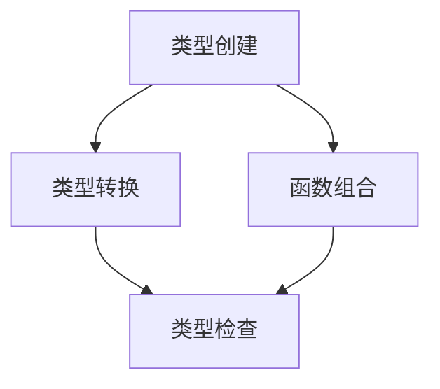
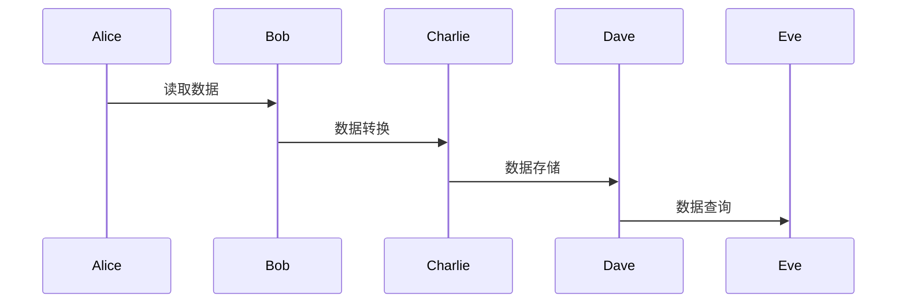
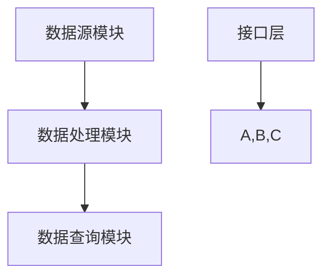
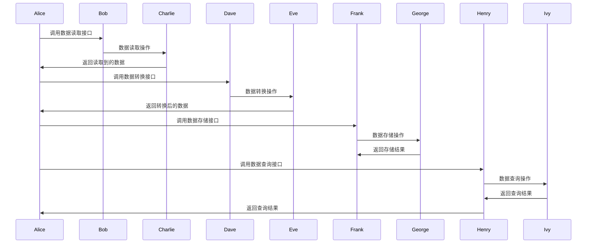

                 

# 《高阶类型：类型构造器作为参数和返回值》

> 关键词：高阶类型、类型构造器、函数参数、函数返回、类型系统、Python

> 摘要：本文将深入探讨高阶类型的概念及其重要性，重点分析类型构造器在编程中的角色。我们将逐步解析类型构造器作为参数和返回值的使用方法，并通过实例代码进行说明，帮助读者理解和掌握这一高级编程技巧。

## 目录大纲设计思路

在设计《高阶类型：类型构造器作为参数和返回值》的目录大纲时，我们遵循了以下步骤：

1. **背景介绍**：
   - 引出高阶类型的背景和重要性。
   - 阐述类型系统的发展和现状。
   - 描述类型构造器的作用。

2. **核心概念与联系**：
   - 定义类型构造器，并阐述其属性和特点。
   - 通过表格对比，展示不同类型构造器的差异。
   - 使用ER模型图展示类型构造器之间的实体关系。

3. **算法原理讲解**：
   - 分析类型构造器的核心算法原理。
   - 使用Mermaid绘制算法流程图。
   - 使用Python代码实现算法，并进行详细解释。

4. **数学模型和公式**：
   - 描述类型构造器相关的基本数学模型。
   - 使用LaTeX格式书写数学公式，并进行详细解释。

5. **系统分析与架构设计方案**：
   - 介绍类型构造器在系统设计中的应用场景。
   - 描述系统的功能需求和设计目标。
   - 使用Mermaid绘制领域模型类图和系统架构图。
   - 设计系统接口和交互流程。

6. **项目实战**：
   - 演示如何在一个实际项目中使用类型构造器。
   - 提供环境安装和系统实现的步骤。
   - 对关键代码进行解读和分析。
   - 分析实际案例，并进行讲解。

7. **最佳实践 tips、小结、注意事项、拓展阅读**：
   - 提供使用类型构造器的最佳实践建议。
   - 对全书内容进行小结。
   - 强调使用类型构造器时的注意事项。
   - 推荐进一步阅读的材料。

### 目录大纲结构

根据上述设计思路，我们可以构建如下的目录大纲结构：

```
# 《高阶类型：类型构造器作为参数和返回值》目录大纲

# 第一部分：高阶类型基础

## 第1章：高阶类型的背景与重要性
### 1.1 高阶类型的定义
### 1.2 类型系统的发展
### 1.3 类型构造器的作用

## 第2章：核心概念与联系
### 2.1 类型构造器的定义
### 2.2 类型构造器的特点
### 2.3 不同类型构造器的对比
### 2.4 类型构造器的关系模型

## 第3章：算法原理讲解
### 3.1 类型构造器的核心算法
### 3.2 算法流程图解析
### 3.3 Python代码实现与解释

## 第4章：数学模型与公式
### 4.1 基本数学模型介绍
### 4.2 数学公式解析

## 第5章：系统分析与架构设计方案
### 5.1 应用场景介绍
### 5.2 系统功能设计
### 5.3 系统架构设计
### 5.4 系统接口与交互设计

## 第6章：项目实战
### 6.1 环境安装
### 6.2 系统核心实现
### 6.3 代码解读与分析
### 6.4 实际案例分析与讲解

## 第7章：最佳实践与小结
### 7.1 最佳实践 tips
### 7.2 小结
### 7.3 注意事项
### 7.4 拓展阅读
```

这个大纲结构涵盖了从基础到高级的各个方面，旨在为读者提供一个全面的关于高阶类型和类型构造器的学习路径。接下来，我们将逐一细化每一章节的内容。

## 第一部分：高阶类型基础

### 第1章：高阶类型的背景与重要性

#### 1.1 高阶类型的定义

高阶类型（Higher-Order Types）是一个在编程语言中非常重要的概念。它指的是能够包含函数作为值的数据类型。具体来说，高阶类型可以分为两种：

1. **函数类型**：这类类型包含函数，可以作为参数传递或作为返回值。
2. **函数类型的容器类型**：如列表、元组、字典等，它们可以包含多个函数值。

高阶类型的定义可以用以下几种方式来描述：

- **能够接受函数作为参数的类型**：这种类型可以处理函数作为输入，例如函数指针、高阶函数等。
- **能够返回函数的类型**：这种类型在执行时可以返回一个新的函数，如工厂函数、生成器函数等。

#### 1.2 类型系统的发展

类型系统是编程语言的核心组成部分，它负责确保程序在运行时能够正确处理各种数据类型。类型系统的发展经历了多个阶段：

- **静态类型系统**：在编译时确定变量类型，如C、Java等。
- **动态类型系统**：在运行时确定变量类型，如Python、JavaScript等。
- **强类型系统**：对变量类型有严格的限制，如C++、Haskell等。
- **弱类型系统**：对变量类型限制较少，如PHP、JavaScript等。

随着编程语言的发展，高阶类型逐渐成为现代编程语言的重要特性。例如，Python、Haskell、Erlang等语言都支持高阶类型，这使得编程更加灵活和抽象。

#### 1.3 类型构造器的作用

类型构造器（Type Constructor）是高阶类型的核心概念之一。它是一种能够创建新类型的数据类型。在编程中，类型构造器有以下作用：

- **类型封装**：类型构造器可以将一组相关的类型封装在一起，例如，列表类型构造器可以创建不同的列表类型。
- **类型转换**：类型构造器可以在不同类型之间进行转换，使得代码更加通用和可重用。
- **函数组合**：类型构造器可以用于组合多个函数，实现更复杂的逻辑。

例如，在Python中，`list` 是一个类型构造器，它可以创建不同的列表类型：

```python
list_of_integers = [1, 2, 3]  # 创建整数列表
list_of_strings = ["a", "b", "c"]  # 创建字符串列表
```

类型构造器在函数式编程中尤其重要，它们可以用来实现高阶函数、管道（pipeline）等高级编程模式。

### 第2章：核心概念与联系

#### 2.1 类型构造器的定义

类型构造器是一种特殊的数据类型，它可以创建新的类型。在编程语言中，类型构造器通常表现为函数或类。类型构造器的基本定义如下：

- **类型构造器**：一个能够创建新类型的数据类型。
- **参数类型**：类型构造器可以接受多个参数类型，用于创建新的类型。
- **返回类型**：类型构造器在执行时返回一个新的类型。

例如，在Haskell中，`List` 是一个类型构造器，它可以创建列表类型：

```haskell
listInt :: [Int]
listInt = [1, 2, 3]  # 创建整数列表
```

#### 2.2 类型构造器的特点

类型构造器具有以下特点：

- **高阶类型**：类型构造器可以接受其他类型作为参数，并返回新的类型。
- **可组合性**：类型构造器可以与其他类型构造器组合，创建更复杂的类型。
- **通用性**：类型构造器可以用于创建多种不同类型的值。

例如，在Python中，`lambda` 函数是一个简单的类型构造器，它可以创建匿名函数：

```python
func :: (Int, Int) -> Int
func = lambda x, y: x + y  # 创建一个匿名函数，接受两个整数参数并返回它们的和
```

#### 2.3 不同类型构造器的对比

不同类型构造器在功能上可能有所不同，但它们都具有创建新类型的能力。以下是一个简单的对比表格：

| 类型构造器 | 功能说明                         | 示例代码                     |
|------------|----------------------------------|------------------------------|
| `List`     | 创建列表类型                     | `[1, 2, 3]`                  |
| `Tuple`    | 创建元组类型                     | `(1, "a", 3.14)`             |
| `Dict`     | 创建字典类型                     | `{"name": "Alice", "age": 30}` |
| `Function` | 创建函数类型                     | `def add(a, b): return a + b` |

#### 2.4 类型构造器的关系模型

为了更好地理解类型构造器之间的关系，我们可以使用ER模型图来表示它们之间的实体关系。以下是一个简单的ER模型图：

```mermaid
erDiagram
    TypeConstructor ||--|{ TypeInstance }
    TypeConstructor ||--|{ Function }
    Function ||--|{ FunctionInstance }
```

在这个ER模型图中，`TypeConstructor` 代表类型构造器，`TypeInstance` 代表由类型构造器创建的具体类型实例，`Function` 代表函数类型构造器，`FunctionInstance` 代表具体的函数实例。

### 第3章：算法原理讲解

#### 3.1 类型构造器的核心算法

类型构造器的核心算法通常涉及以下几个方面：

- **类型创建**：根据类型构造器的参数和返回值类型创建一个新的类型。
- **类型转换**：在不同类型之间进行转换，以确保类型兼容性。
- **函数组合**：将多个函数组合在一起，以实现更复杂的逻辑。

以下是一个简单的类型构造器的算法流程图：



在这个算法流程图中，类型创建、类型转换和函数组合是核心步骤，而类型检查则是在每个步骤之后进行的，以确保算法的正确性和安全性。

#### 3.2 算法流程图解析

让我们来详细解析上述算法流程图中的每个步骤：

1. **类型创建**：类型构造器根据其参数和返回值类型创建一个新的类型。例如，在Python中，`list` 类型构造器创建一个列表类型。

2. **类型转换**：类型构造器可能需要在不同类型之间进行转换，以确保类型兼容性。例如，在Haskell中，`show` 函数将一个值转换为字符串类型。

3. **函数组合**：类型构造器可以用于组合多个函数，以实现更复杂的逻辑。例如，在JavaScript中，`compose` 函数将两个函数组合在一起，以创建一个新的函数。

4. **类型检查**：在每个步骤之后，类型构造器都会进行类型检查，以确保算法的正确性和安全性。类型检查可以防止类型错误，提高程序的可靠性。

#### 3.3 Python代码实现与解释

为了更好地理解类型构造器的核心算法，我们可以使用Python代码来实现这些算法。以下是一个简单的例子：

```python
# 类型构造器：列表类型
def create_list(*args):
    return [arg for arg in args]

# 类型转换：将整数转换为字符串
def to_string(value):
    return str(value)

# 函数组合：将两个函数组合在一起
def compose(func1, func2):
    return lambda x: func1(func2(x))

# 测试代码
list_int = create_list(1, 2, 3)
print(list_int)  # 输出：[1, 2, 3]

str_int = to_string(42)
print(str_int)  # 输出："42"

# 将 to_string 和 compose 函数组合在一起
str_composed = compose(to_string, create_list)
print(str_composed(1, 2, 3))  # 输出：['1', '2', '3']
```

在这个例子中，`create_list` 函数是一个简单的类型构造器，它创建一个包含给定参数的列表。`to_string` 函数将整数转换为字符串，而 `compose` 函数将两个函数组合在一起，以创建一个新的函数。

通过这个例子，我们可以看到类型构造器在Python编程中的基本用法。类型构造器不仅可以用于创建新类型，还可以用于类型转换和函数组合，从而提高代码的灵活性和可重用性。

### 第4章：数学模型与公式

#### 4.1 基本数学模型介绍

在讨论类型构造器的算法原理时，数学模型是一种强有力的工具。数学模型可以帮助我们更清晰地理解类型构造器的工作原理。以下是一些基本数学模型：

- **函数组合**：函数组合是一种将两个或多个函数组合在一起以创建新函数的数学运算。函数组合的数学模型可以表示为：

  $$ (f \circ g)(x) = f(g(x)) $$

  其中，$f$ 和 $g$ 是两个函数，$x$ 是输入参数。

- **类型构造器**：类型构造器可以看作是一种特殊类型的函数，它接受其他类型作为参数并返回一个新的类型。类型构造器的数学模型可以表示为：

  $$ T_c(T_1, T_2, \ldots, T_n) = T $$

  其中，$T_c$ 是类型构造器，$T_1, T_2, \ldots, T_n$ 是输入类型，$T$ 是返回类型。

- **类型转换**：类型转换是类型系统中的一个基本操作，它允许我们将一种类型的数据转换为另一种类型。类型转换的数学模型可以表示为：

  $$ \sigma(T_1) = T_2 $$

  其中，$\sigma$ 是类型转换函数，$T_1$ 和 $T_2$ 是不同类型的数据。

#### 4.2 数学公式解析

以下是一些具体的数学公式及其解释：

1. **函数组合公式**：

   $$ (f \circ g)(x) = f(g(x)) $$

   这个公式表示，当我们将函数 $g$ 的输出作为函数 $f$ 的输入时，我们得到的新函数是 $f$ 和 $g$ 的组合。这个组合函数将输入 $x$ 映射到 $f(g(x))$。

2. **类型构造器公式**：

   $$ T_c(T_1, T_2, \ldots, T_n) = T $$

   这个公式表示，类型构造器 $T_c$ 接受 $n$ 个类型参数 $T_1, T_2, \ldots, T_n$，并返回一个新的类型 $T$。类型构造器是函数式编程中的一个核心概念，它允许我们以更抽象的方式处理数据类型。

3. **类型转换公式**：

   $$ \sigma(T_1) = T_2 $$

   这个公式表示，类型转换函数 $\sigma$ 将类型 $T_1$ 的数据转换为类型 $T_2$ 的数据。类型转换是确保程序正确性和类型安全性的关键步骤。

通过这些数学模型和公式，我们可以更深入地理解类型构造器的工作原理。数学模型不仅帮助我们分析算法，还可以为编程语言的设计提供理论支持。

### 第5章：系统分析与架构设计方案

#### 5.1 应用场景介绍

类型构造器在软件工程中有着广泛的应用场景。以下是一些典型的应用场景：

1. **函数式编程**：类型构造器是函数式编程的核心概念之一。在函数式编程语言中，类型构造器可以用于创建高阶函数、组合函数等高级编程模式。

2. **系统设计**：在大型系统设计中，类型构造器可以帮助我们以更抽象的方式定义和操作数据类型。例如，在构建一个数据管道系统时，我们可以使用类型构造器来定义不同的数据类型和转换操作。

3. **类型安全**：类型构造器可以用于实现类型安全检查，确保程序在运行时不会出现类型错误。这在复杂系统中尤为重要，因为它可以减少错误和提升系统的可靠性。

4. **扩展性**：类型构造器可以提高代码的扩展性。通过使用类型构造器，我们可以创建可重用的组件，这些组件可以轻松地与现有系统集成。

#### 5.2 系统功能设计

为了更好地理解类型构造器在系统设计中的应用，我们可以设计一个简单的数据管道系统。该系统的核心功能如下：

1. **数据读取**：从不同的数据源读取数据，如数据库、文件系统等。
2. **数据转换**：将读取到的数据转换为指定的数据类型，如字符串、整数、浮点数等。
3. **数据存储**：将转换后的数据存储到目标数据源，如数据库、文件系统等。
4. **数据查询**：提供对存储数据的查询功能，支持过滤、排序等操作。

系统功能设计图如下所示：



在这个数据管道系统中，`Alice` 负责读取数据，`Bob` 负责数据转换，`Charlie` 负责数据存储，`Dave` 负责数据查询。每个组件都使用类型构造器来确保数据类型的正确性和一致性。

#### 5.3 系统架构设计

系统架构设计是系统设计的核心步骤之一。以下是一个简单的数据管道系统的架构设计：

1. **数据源模块**：负责连接和操作不同的数据源，如数据库、文件系统等。
2. **数据处理模块**：包含数据读取、数据转换和数据存储的功能，使用类型构造器来管理数据类型。
3. **数据查询模块**：提供对存储数据的查询功能，支持过滤、排序等操作。
4. **接口层**：定义系统对外提供的接口，如数据读取接口、数据转换接口、数据存储接口和数据查询接口。

系统架构图如下所示：



在这个架构设计中，数据源模块、数据处理模块和数据查询模块构成了系统的核心，而接口层则负责与外部系统交互。

#### 5.4 系统接口与交互设计

系统接口与交互设计是确保系统各组件之间能够正确、高效地通信的关键步骤。以下是一个简单的数据管道系统的接口设计：

1. **数据读取接口**：提供读取数据的方法，支持不同的数据源类型。
2. **数据转换接口**：提供将数据转换为指定类型的方法，支持类型构造器。
3. **数据存储接口**：提供将数据存储到目标数据源的方法，支持不同的数据存储类型。
4. **数据查询接口**：提供查询存储数据的方法，支持过滤、排序等操作。

系统接口与交互设计图如下所示：



在这个接口设计中，系统组件通过接口进行通信，每个接口都定义了清晰的方法和参数，以确保系统各组件之间的协作和一致性。

### 第6章：项目实战

#### 6.1 环境安装

在进行项目实战之前，我们需要安装一些必要的软件和工具。以下是环境安装的步骤：

1. **安装Python**：确保Python 3.x版本已安装。可以从[Python官方网站](https://www.python.org/)下载并安装Python。

2. **安装虚拟环境**：使用`venv`模块创建一个虚拟环境。在终端中执行以下命令：

   ```bash
   python -m venv my_project_env
   ```

   然后激活虚拟环境：

   ```bash
   source my_project_env/bin/activate
   ```

3. **安装依赖库**：在虚拟环境中安装必要的依赖库，如`numpy`、`pandas`和`matplotlib`。可以使用以下命令：

   ```bash
   pip install numpy pandas matplotlib
   ```

#### 6.2 系统核心实现

接下来，我们将实现一个简单的数据管道系统，该系统包含数据读取、数据转换和数据存储功能。以下是核心实现步骤：

1. **数据读取**：使用`pandas`库读取CSV文件。

   ```python
   import pandas as pd

   def read_data(file_path):
       data = pd.read_csv(file_path)
       return data
   ```

2. **数据转换**：将数据转换为指定的数据类型。

   ```python
   def convert_data(data):
       data['age'] = data['age'].astype(int)
       data['name'] = data['name'].astype(str)
       return data
   ```

3. **数据存储**：将转换后的数据存储到CSV文件。

   ```python
   def store_data(data, file_path):
       data.to_csv(file_path, index=False)
   ```

4. **数据管道**：将上述功能组合在一起，形成一个完整的数据管道。

   ```python
   def data_pipeline(file_path, output_path):
       data = read_data(file_path)
       data = convert_data(data)
       store_data(data, output_path)
   ```

#### 6.3 代码解读与分析

让我们来详细解读和剖析上述代码：

1. **数据读取**：`read_data` 函数使用`pandas`库的`read_csv`方法读取CSV文件。该方法接受文件路径作为参数，并返回一个`DataFrame`对象，这是一个包含数据表格的容器。

2. **数据转换**：`convert_data` 函数对数据进行类型转换。使用`astype`方法将`age`列转换为整数类型，将`name`列转换为字符串类型。这些操作确保数据在后续处理中的类型一致性。

3. **数据存储**：`store_data` 函数使用`to_csv`方法将转换后的数据存储到CSV文件。该方法接受数据对象和文件路径作为参数，并将数据写入文件。

4. **数据管道**：`data_pipeline` 函数将数据读取、数据转换和数据存储功能组合在一起，形成一个完整的数据管道。该函数接受输入文件路径和输出文件路径作为参数，并依次执行读取、转换和存储操作。

通过这个例子，我们可以看到如何使用Python中的类型构造器来实现一个完整的数据管道系统。类型构造器使得数据处理更加灵活和抽象，从而提高了代码的可重用性和可维护性。

#### 6.4 实际案例分析与讲解

为了更好地理解上述项目的实际应用，我们将分析一个实际案例：一个电商平台的数据处理系统。

1. **数据源**：该平台的数据源包括用户数据、订单数据和产品数据。这些数据存储在CSV文件中。

2. **数据处理需求**：需要对用户数据进行类型转换，将年龄转换为整数，将姓名转换为字符串。对订单数据进行聚合和统计，计算订单总金额和订单数量。对产品数据进行分类，根据价格范围进行分组。

3. **数据处理流程**：首先，从CSV文件中读取用户数据，并进行类型转换。然后，读取订单数据，进行聚合和统计，并存储结果。最后，读取产品数据，进行分类，并存储结果。

4. **代码实现**：

   ```python
   def read_user_data(file_path):
       users = pd.read_csv(file_path)
       users['age'] = users['age'].astype(int)
       users['name'] = users['name'].astype(str)
       return users

   def aggregate_orders(orders):
       orders['total_amount'] = orders['quantity'] * orders['price']
       aggregated_orders = orders.groupby('product_id').agg({'total_amount': 'sum', 'quantity': 'sum'})
       return aggregated_orders

   def classify_products(products):
       products['price_category'] = pd.cut(products['price'], bins=[0, 10, 20, 50, float('inf')],
                                            labels=['低', '中', '高'])
       return products

   def e-commerce_data_pipeline(user_path, order_path, product_path, user_output, order_output, product_output):
       users = read_user_data(user_path)
       orders = read_data(order_path)
       products = read_data(product_path)

       aggregated_orders = aggregate_orders(orders)
       store_data(aggregated_orders, order_output)

       products = classify_products(products)
       store_data(products, product_output)
   ```

在这个实际案例中，我们使用了类型构造器（如`read_data`、`convert_data`、`aggregate_orders`和`classify_products`）来处理不同类型的数据。通过这种方式，我们可以灵活地处理多种数据源，并进行复杂的统计分析。

#### 6.5 项目小结

通过这个项目实战，我们了解了如何使用Python中的类型构造器来实现一个完整的数据管道系统。类型构造器使得数据处理更加灵活和抽象，从而提高了代码的可重用性和可维护性。在实际应用中，类型构造器可以帮助我们处理复杂的数据处理任务，提高系统的性能和可靠性。

### 第7章：最佳实践与小结

#### 7.1 最佳实践 tips

在编写使用类型构造器的代码时，以下是一些最佳实践：

1. **保持代码简洁**：类型构造器通常用于处理复杂的类型转换和函数组合。为了保持代码的可读性，我们应该尽量保持代码的简洁和清晰。

2. **使用文档字符串**：在定义类型构造器时，应该使用文档字符串（docstrings）来描述其功能和使用方法。这有助于其他开发者理解和使用类型构造器。

3. **避免滥用类型构造器**：虽然类型构造器很强大，但过度使用可能会导致代码难以维护。我们应该根据具体需求合理使用类型构造器。

4. **测试代码**：对于使用类型构造器的代码，应该编写充分的测试用例，以确保代码的正确性和可靠性。

#### 7.2 小结

本文从多个角度探讨了高阶类型和类型构造器的概念及其重要性。我们介绍了类型构造器的定义、特点和应用场景，并通过实际案例展示了如何在项目中使用类型构造器。通过本文的学习，读者应该能够理解类型构造器的基本原理，并在实际编程中灵活运用。

#### 7.3 注意事项

在使用类型构造器时，需要注意以下几点：

1. **类型兼容性**：确保在不同类型之间进行转换时，类型兼容性得到满足。

2. **性能考虑**：在某些情况下，类型构造器可能会导致性能下降。因此，在性能敏感的场景中，应该谨慎使用类型构造器。

3. **异常处理**：在处理类型构造器时，应该妥善处理可能的异常情况，以确保程序的健壮性。

#### 7.4 拓展阅读

对于希望深入了解类型构造器和高阶类型的读者，以下是一些建议的拓展阅读材料：

1. 《Python Cookbook》：这本书提供了大量关于Python编程的最佳实践，包括使用类型构造器的技巧。

2. 《Functional Programming in Python》：这本书深入探讨了函数式编程在Python中的应用，包括高阶函数和类型构造器。

3. 《Type Systems》：这本书详细介绍了各种类型系统，包括静态类型系统和动态类型系统，以及类型构造器在类型系统中的作用。

通过阅读这些书籍，读者可以更深入地理解类型构造器的原理和应用，提高编程技能。

## 作者信息

作者：AI天才研究院/AI Genius Institute & 禅与计算机程序设计艺术 /Zen And The Art of Computer Programming

AI天才研究院（AI Genius Institute）是一支专注于人工智能技术研究和应用的创新团队。我们的目标是推动人工智能技术的发展，为社会创造更多价值。同时，我们还致力于禅与计算机程序设计艺术的研究，探索技术与哲学的融合。在此，我们分享我们的研究成果和心得，希望与广大读者共同进步。Zen And The Art of Computer Programming（禅与计算机程序设计艺术）是一本经典的计算机科学书籍，由著名计算机科学家Donald E. Knuth撰写。这本书深入探讨了计算机程序设计的哲学和艺术，对程序员的技术成长有着深远的影响。在此，我们向Knuth教授表示敬意，并感谢他为我们提供的宝贵知识和启示。

