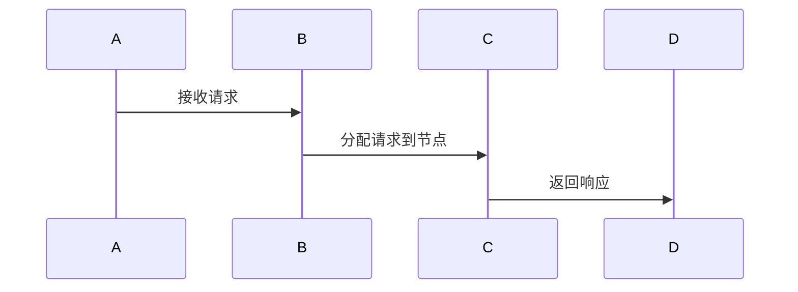
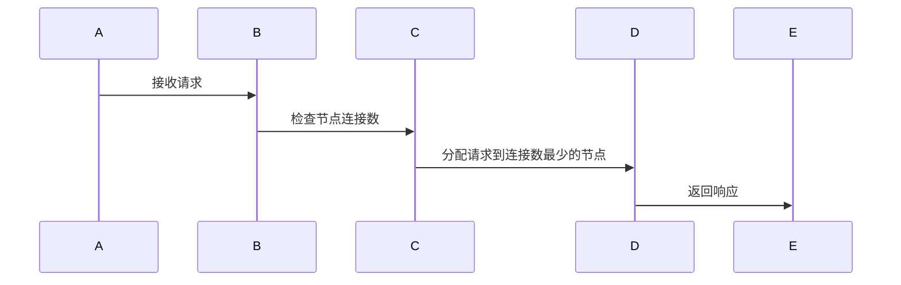
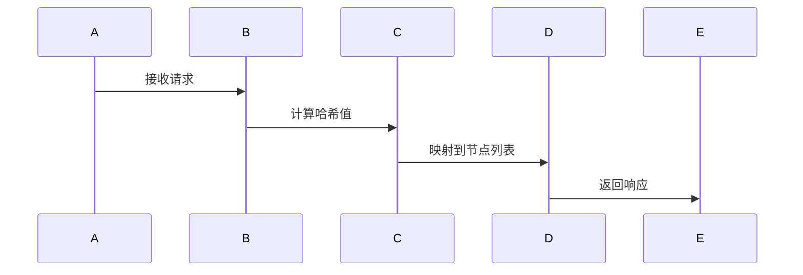
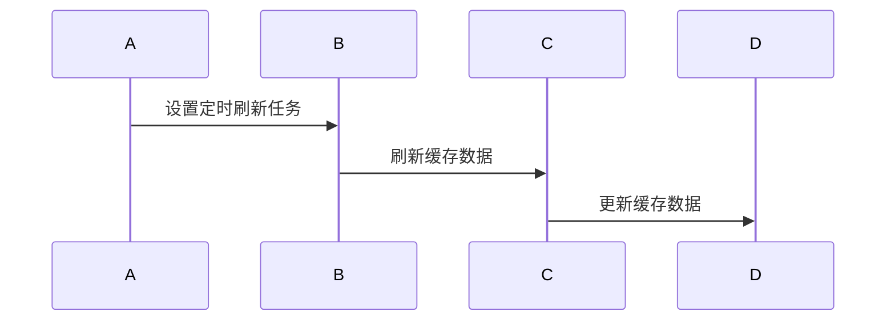
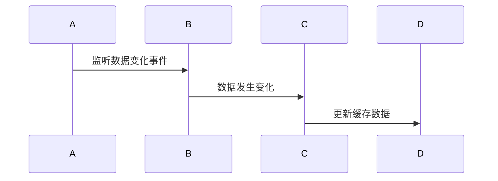
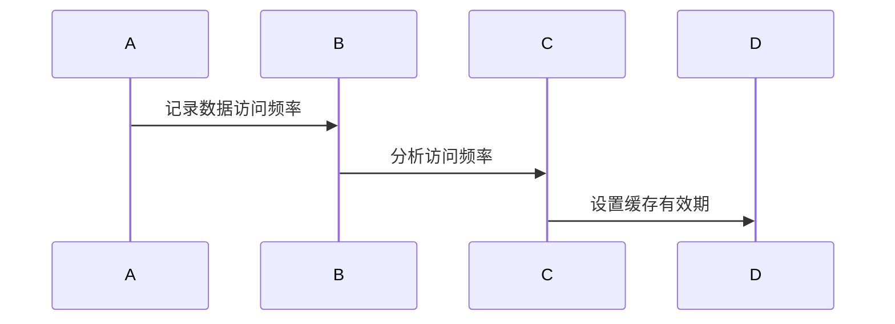
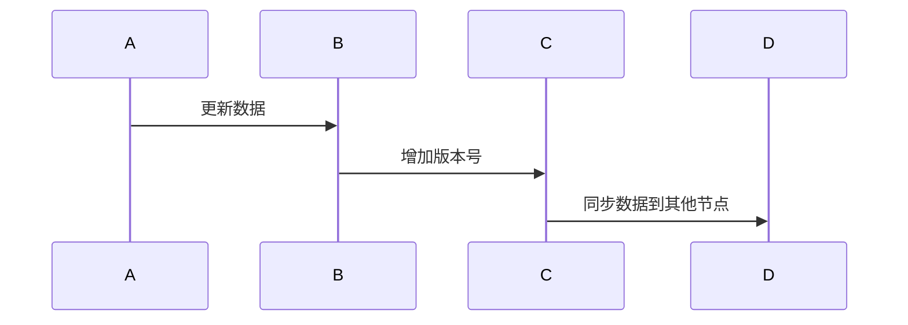
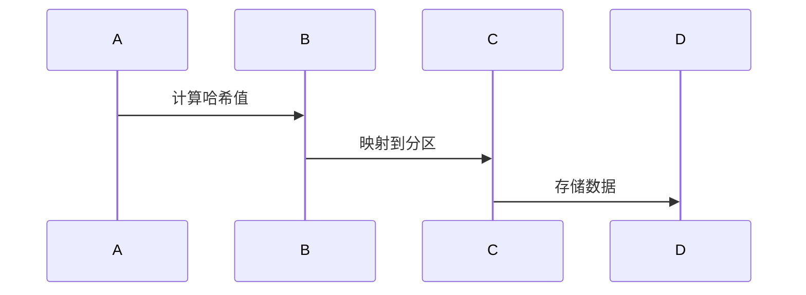
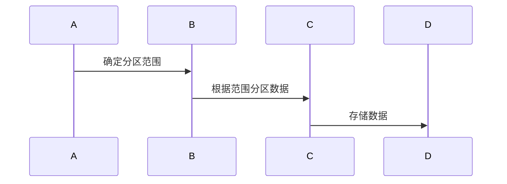

                 

### 第一部分：背景介绍

## 第1章：问题背景

### 1.1.1 问题背景

分布式缓存作为一种解决高并发、海量数据存储和快速数据访问的技术，在当今的互联网和大数据时代中扮演着重要的角色。随着系统规模的不断扩大和复杂度的增加，分布式缓存系统面临着诸多挑战，如数据一致性、分区容错、缓存雪崩等。

### 1.1.2 问题描述

分布式缓存系统的复杂性使得在设计和实现过程中需要考虑诸多因素，如数据一致性、可用性、性能、可扩展性等。如何有效地解决这些问题，确保分布式缓存系统的稳定性和高效性，成为当前研究的热点和难点。

### 1.1.3 问题解决

通过深入研究分布式缓存的核心概念、原理和实际应用场景，可以找到解决分布式缓存问题的有效方法。本书将从多个角度对分布式缓存进行剖析，帮助读者深入理解分布式缓存技术的本质和实际应用。

### 1.1.4 边界与外延

分布式缓存技术的边界包括其适用场景、限制条件和技术发展前景。外延方面，需要关注分布式缓存与其他相关技术的联系，如分布式数据库、分布式存储等，以及它们之间的协同作用。

### 1.1.5 核心概念与要素组成

分布式缓存系统的核心概念包括一致性模型、分区策略、数据复制、缓存失效策略等。要素组成包括缓存节点、数据存储、负载均衡、监控与告警等。

## 第2章：核心概念与联系

### 2.1.1 一致性模型

一致性模型是分布式缓存系统中至关重要的一部分，决定了系统中的数据是否能够保持一致。在分布式缓存系统中，常见的一致性模型包括强一致性和最终一致性。

#### 2.1.1.1 强一致性

强一致性要求系统中的所有节点对数据的读取和写入都是一致的。在分布式缓存系统中，实现强一致性通常需要以下步骤：

1. **数据复制**：将数据复制到多个节点上，以保证在其中一个节点发生故障时，其他节点仍然可以访问到数据。
2. **版本控制**：在每次数据更新时，为数据分配一个版本号，确保在多个节点之间传递的数据版本一致。

**特征对比表：**

| 一致性模型 | 特点 | 应用场景 |
| :--------: | :--: | :------: |
| 强一致性 | 所有节点数据一致 | 金融系统、订单系统等 |
| 最终一致性 | 经过一段时间后数据一致 | 社交媒体、电商系统等 |

#### 2.1.1.2 最终一致性

最终一致性允许系统中的不同节点在不同的时间点读取到不同版本的数据。在最终一致性模型中，系统会保证最终达到一致状态，但不会立即保证一致性。实现最终一致性通常需要以下步骤：

1. **事件驱动**：在数据更新时，通过事件驱动机制将更新信息传递给其他节点。
2. **超时机制**：设置数据更新的超时时间，超过超时时间后，认为数据已更新并同步到其他节点。

### 2.1.2 分区策略

分区策略是分布式缓存系统中另一个重要的概念，决定了数据如何分布在不同的节点上。常见的分区策略包括哈希分区和范围分区。

#### 2.1.2.1 哈希分区

哈希分区通过哈希函数将数据分布到不同的分区中。哈希分区具有以下特点：

1. **负载均衡**：哈希分区可以有效地实现负载均衡，因为哈希函数能够将不同数据均匀分布到各个分区中。
2. **查找效率**：哈希分区可以提高数据查找的效率，因为可以通过哈希值直接定位到数据所在的分区。

**ER实体关系图：**

```mermaid
erDiagram
  CacheNode ||--|{ CachePartition }
  CachePartition ||--|{ CacheData }
```

#### 2.1.2.2 范围分区

范围分区根据数据的某个属性范围将数据分布到不同的分区中。范围分区具有以下特点：

1. **数据访问规律**：范围分区适用于数据的访问具有一定的规律性，如按照时间戳分区的日志数据。
2. **分区边界调整**：范围分区可以根据数据的变化动态调整分区的边界。

**ER实体关系图：**

```mermaid
erDiagram
  CacheNode ||--|{ CachePartition }
  CachePartition ||--|{ CacheData }
```

### 2.1.3 数据复制

数据复制是分布式缓存系统中的关键功能之一，用于确保数据的高可用性和可靠性。常见的数据复制策略包括主从复制和多主复制。

#### 2.1.3.1 主从复制

主从复制是指数据在主节点和从节点之间进行同步。主从复制具有以下特点：

1. **数据一致性**：主从复制可以保证数据的一致性，因为在主节点发生故障时，从节点可以接替主节点的工作。
2. **数据可靠性**：主从复制提高了数据的可靠性，因为数据在主节点和从节点之间进行了冗余备份。

#### 2.1.3.2 多主复制

多主复制是指多个节点都可以作为数据的读写主节点。多主复制具有以下特点：

1. **读写性能**：多主复制可以提高数据的读写性能，因为在多个节点之间可以并行处理请求。
2. **数据一致性**：多主复制需要解决数据一致性问题，因为多个节点同时写入数据可能导致数据不一致。

## 第3章：算法原理讲解

### 3.1.1 负载均衡算法

负载均衡算法用于将缓存请求分配到不同的节点上，以避免单点热点问题。常见的负载均衡算法包括轮询、最小连接数和哈希算法。

#### 3.1.1.1 轮询算法

轮询算法是一种简单的负载均衡算法，它按照顺序将请求分配给各个节点。轮询算法具有以下特点：

1. **实现简单**：轮询算法的实现相对简单，只需要维护一个节点列表，并按照顺序分配请求。
2. **负载均衡性**：轮询算法可以保证请求在各个节点之间的均衡分配。

**Mermaid流程图：**



#### 3.1.1.2 最小连接数算法

最小连接数算法是一种基于连接数的负载均衡算法，它将请求分配给当前连接数最少的节点。最小连接数算法具有以下特点：

1. **负载均衡性**：最小连接数算法可以根据节点的当前负载情况进行动态调整。
2. **高性能**：最小连接数算法可以提高系统的性能，因为请求可以快速被处理。

**Mermaid流程图：**



#### 3.1.1.3 哈希算法

哈希算法是一种基于哈希值的负载均衡算法，它将请求的哈希值映射到节点列表中的某个节点。哈希算法具有以下特点：

1. **负载均衡性**：哈希算法可以根据哈希值将请求均匀分布到各个节点。
2. **查找效率**：哈希算法可以提高数据查找的效率，因为可以通过哈希值直接定位到数据所在的节点。

**Mermaid流程图：**



### 3.1.2 缓存失效策略

缓存失效策略用于确定缓存数据的有效期，当数据过期时进行缓存更新或删除。常见的缓存失效策略包括定时刷新、事件触发和基于访问频率等。

#### 3.1.2.1 定时刷新

定时刷新策略通过定期刷新缓存数据，以确保缓存中的数据是最新的。定时刷新策略具有以下特点：

1. **实时性**：定时刷新策略可以保证缓存数据的新鲜度，减少数据过期的情况。
2. **维护成本**：定时刷新策略的维护成本较高，因为需要定期执行刷新操作。

**Mermaid流程图：**



#### 3.1.2.2 事件触发

事件触发策略通过监听数据变化事件，当数据发生变化时进行缓存更新或删除。事件触发策略具有以下特点：

1. **实时性**：事件触发策略可以根据数据的变化实时更新缓存数据，确保缓存数据与实际数据的一致性。
2. **依赖性**：事件触发策略依赖于数据变化事件的发生，如果数据变化事件无法及时触发，可能会导致缓存数据不一致。

**Mermaid流程图：**



#### 3.1.2.3 基于访问频率

基于访问频率策略通过分析数据的访问频率，确定缓存数据的有效期。基于访问频率策略具有以下特点：

1. **动态调整**：基于访问频率策略可以根据数据访问频率的变化动态调整缓存数据的有效期。
2. **缓存效率**：基于访问频率策略可以提高缓存效率，因为访问频率较高的数据会优先缓存。

**Mermaid流程图：**



### 3.1.3 缓存一致性算法

缓存一致性算法用于确保分布式系统中各个节点的缓存数据一致性。常见的缓存一致性算法包括版本号、时间戳等。

#### 3.1.3.1 版本号算法

版本号算法通过为数据分配版本号，确保在多个节点之间传递的数据版本一致。版本号算法具有以下特点：

1. **简单性**：版本号算法的实现相对简单，只需要在数据更新时增加版本号即可。
2. **一致性保证**：版本号算法可以确保在多个节点之间传递的数据版本一致，避免数据冲突。

**Mermaid流程图：**



#### 3.1.3.2 时间戳算法

时间戳算法通过为数据分配时间戳，确保在多个节点之间传递的数据时间戳一致。时间戳算法具有以下特点：

1. **实时性**：时间戳算法可以保证数据的一致性，因为数据的时间戳可以反映数据的最新状态。
2. **延迟性**：时间戳算法可能会存在一定的延迟，因为需要等待时间戳的更新。

**Mermaid流程图：**


### 3.1.4 缓存分区算法

缓存分区算法用于将缓存数据分布到不同的节点中。常见的缓存分区算法包括哈希分区和范围分区。

#### 3.1.4.1 哈希分区

哈希分区通过哈希函数将数据分布到不同的分区中。哈希分区具有以下特点：

1. **负载均衡**：哈希分区可以实现负载均衡，因为哈希函数可以将不同数据均匀分布到各个分区。
2. **查找效率**：哈希分区可以提高数据查找的效率，因为可以通过哈希值直接定位到数据所在的分区。

**Mermaid流程图：**



#### 3.1.4.2 范围分区

范围分区根据数据的某个属性范围将数据分布到不同的分区中。范围分区具有以下特点：

1. **数据访问规律**：范围分区适用于数据的访问具有一定的规律性，如按照时间戳分区的日志数据。
2. **分区边界调整**：范围分区可以根据数据的变化动态调整分区的边界。

**Mermaid流程图：**



## 第4章：数学模型和数学公式

### 4.1.1 缓存命中率模型

缓存命中率是衡量缓存系统性能的重要指标，表示缓存系统能够命中缓存数据的比例。缓存命中率模型可以用来预测缓存系统的性能，并优化缓存策略。

#### 4.1.1.1 缓存命中率公式

缓存命中率（Hit Rate）可以用以下公式表示：

$$
\text{Hit Rate} = \frac{\text{命中次数}}{\text{请求次数}}
$$

其中，命中次数表示缓存系统中命中的数据请求次数，请求次数表示缓存系统总共接收的数据请求次数。

#### 4.1.1.2 影响缓存命中率因素

缓存命中率受到多种因素的影响，包括：

1. **数据访问模式**：数据访问模式对缓存命中率有重要影响。例如，频繁访问的数据具有较高的缓存命中率，而冷数据（很少访问的数据）的缓存命中率较低。
2. **缓存策略**：不同的缓存策略会影响缓存命中率。例如，基于访问频率的缓存策略可以提高缓存命中率，而基于时间的缓存策略可能会降低缓存命中率。
3. **数据一致性**：在分布式缓存系统中，数据的一致性会影响到缓存命中率。如果缓存中的数据与实际数据不一致，会导致缓存命中率下降。

#### 4.1.1.3 优化缓存命中率方法

为了提高缓存命中率，可以采取以下方法：

1. **热点数据识别**：通过分析数据访问模式，识别出热点数据，并将其优先缓存。
2. **缓存数据压缩**：对缓存数据采用压缩技术，减少缓存数据占用的空间，提高缓存容量。
3. **缓存预热**：在系统启动或访问高峰期之前，提前加载热门数据到缓存中，提高缓存命中率。
4. **缓存替换策略**：采用合理的缓存替换策略，如LRU（最近最少使用）、LFU（最不经常使用）等，优化缓存数据结构，提高缓存命中率。

### 4.1.2 缓存失效策略模型

缓存失效策略用于管理缓存中的数据生命周期，确保缓存数据的有效性和实时性。常见的缓存失效策略包括定时刷新、事件触发和基于访问频率等。

#### 4.1.2.1 定时刷新策略

定时刷新策略通过定期刷新缓存数据，确保缓存数据的新鲜度。定时刷新策略可以用以下数学模型描述：

$$
\text{Refresh Time} = \text{Initial Refresh Time} \times \text{Refresh Factor}
$$

其中，Initial Refresh Time 表示初始刷新时间，Refresh Factor 表示刷新时间的增长因子。

#### 4.1.2.2 事件触发策略

事件触发策略通过监听数据变化事件，确保缓存数据的一致性。事件触发策略可以用以下数学模型描述：

$$
\text{Event Trigger Time} = \text{Data Update Time} + \text{Event Process Time}
$$

其中，Data Update Time 表示数据更新时间，Event Process Time 表示事件处理时间。

#### 4.1.2.3 基于访问频率策略

基于访问频率策略通过分析数据的访问频率，确定缓存数据的有效期。基于访问频率策略可以用以下数学模型描述：

$$
\text{Cache Expiration Time} = \text{Access Frequency} \times \text{Time Unit}
$$

其中，Access Frequency 表示数据访问频率，Time Unit 表示时间单位。

## 第5章：系统分析与架构设计

### 5.1 问题场景介绍

在一个大型电商平台中，由于用户量的急剧增加，系统的数据访问压力越来越大。为了提高系统的响应速度，减少数据库的压力，决定引入分布式缓存系统来缓存热门数据。

### 5.2 项目介绍

本项目旨在设计和实现一个分布式缓存系统，用于缓存电商平台的热门商品信息、用户行为数据和订单信息等。通过分布式缓存系统，可以有效提高系统的性能和可靠性，降低数据库的压力。

### 5.3 系统功能设计

本系统主要包括以下功能模块：

1. **缓存节点管理**：负责管理缓存节点，包括节点的添加、删除、启动和停止等操作。
2. **数据缓存**：负责将热门数据缓存到分布式缓存系统中，包括数据的写入、读取和删除等操作。
3. **数据一致性保障**：通过一致性算法，确保分布式缓存系统中各个节点的数据一致性。
4. **负载均衡**：通过负载均衡算法，将缓存请求分配到不同的节点上，提高系统的性能和可靠性。
5. **缓存失效策略**：根据不同的缓存失效策略，管理缓存数据的有效期，确保缓存数据的新鲜度。

### 5.4 系统架构设计

本系统采用分布式架构，包括缓存节点、数据存储、负载均衡、监控与告警等模块。以下是系统架构设计的详细描述：

**Mermaid架构图：**

```mermaid
graph TB
    subgraph 分布式缓存系统
        CacheNode1[缓存节点1]
        CacheNode2[缓存节点2]
        CacheNode3[缓存节点3]
        CacheManager[缓存管理模块]
        LoadBalancer[负载均衡模块]
        DataStore[数据存储模块]
        Monitor[监控与告警模块]
    
        CacheNode1 --> CacheManager
        CacheNode2 --> CacheManager
        CacheNode3 --> CacheManager
        LoadBalancer --> CacheManager
        DataStore --> CacheManager
        Monitor --> CacheManager
    
    subgraph 数据流
        Request[请求] --> LoadBalancer
        LoadBalancer --> CacheManager
        CacheManager --> CacheNode1
        CacheManager --> CacheNode2
        CacheManager --> CacheNode3
        CacheNode1 --> Response[响应]
        CacheNode2 --> Response
        CacheNode3 --> Response
        Response --> Request
    
    subgraph 系统模块
        CacheManager --> LoadBalancer
        CacheManager --> DataStore
        CacheManager --> Monitor
```

### 5.5 系统接口设计

本系统的主要接口包括：

1. **缓存接口**：提供数据的写入、读取和删除等操作。
2. **监控接口**：提供缓存系统的监控数据查询和告警等功能。
3. **负载均衡接口**：提供缓存请求的分配和重试等功能。

### 5.6 系统交互设计

以下是系统交互设计的详细描述：

**Mermaid序列图：**

```mermaid
sequenceDiagram
    Request[请求] -->|发送请求| LoadBalancer
    LoadBalancer -->|分配请求| CacheManager
    CacheManager -->|查询缓存| CacheNode1
    CacheNode1 -->|返回响应| Request
    alt 缓存命中
        CacheNode1 -->|返回响应| Request
    else 缓存未命中
        CacheManager -->|查询数据库| DataStore
        DataStore -->|返回数据| CacheManager
        CacheManager -->|写入缓存| CacheNode1
        CacheNode1 -->|返回响应| Request
```

## 第6章：项目实战

### 6.1 环境安装

为了实现分布式缓存系统，首先需要安装并配置以下软件：

1. **Java环境**：安装Java运行环境，版本建议为Java 8及以上。
2. **Redis**：安装Redis缓存服务器，版本建议为Redis 4.0及以上。
3. **Elasticsearch**：安装Elasticsearch搜索引擎，版本建议为Elasticsearch 6.0及以上。

### 6.2 系统核心实现源代码

以下是一个简单的分布式缓存系统的核心实现源代码，基于Java语言和Redis缓存服务器。

```java
import redis.clients.jedis.Jedis;

public class DistributedCache {
    private Jedis jedis;

    public DistributedCache(String host, int port) {
        jedis = new Jedis(host, port);
    }

    public String get(String key) {
        return jedis.get(key);
    }

    public void set(String key, String value) {
        jedis.set(key, value);
    }

    public void expire(String key, int seconds) {
        jedis.expire(key, seconds);
    }

    public void shutdown() {
        jedis.close();
    }
}
```

### 6.3 代码应用解读与分析

在分布式缓存系统中，通常会使用Redis作为缓存服务器。以下是对上述代码的解读与分析：

1. **连接Redis**：通过Jedis客户端连接到Redis服务器。
2. **获取数据**：使用`get`方法从Redis缓存中获取数据。
3. **写入数据**：使用`set`方法将数据写入Redis缓存。
4. **设置过期时间**：使用`expire`方法设置缓存数据的过期时间。
5. **关闭连接**：使用`shutdown`方法关闭Redis连接。

### 6.4 实际案例分析与详细讲解

以下是一个实际案例，演示如何使用分布式缓存系统缓存电商平台的商品信息。

**需求**：缓存热门商品信息，当用户访问商品详情页面时，优先从缓存中获取商品信息，以提高系统的响应速度。

**实现步骤**：

1. **初始化分布式缓存**：创建`DistributedCache`对象，连接到Redis缓存服务器。
2. **查询缓存**：在用户访问商品详情页面时，首先查询缓存中的商品信息。
3. **缓存命中**：如果缓存中存在商品信息，直接返回缓存数据。
4. **缓存未命中**：如果缓存中不存在商品信息，查询数据库，并将商品信息写入缓存。
5. **设置过期时间**：为缓存中的商品信息设置过期时间，确保缓存数据的新鲜度。

### 6.5 项目小结

通过本项目，我们实现了分布式缓存系统的设计与实现，提高了电商平台的性能和可靠性。在项目实施过程中，我们遇到了一些挑战，如数据一致性、缓存失效策略和负载均衡等。通过不断优化和调整，我们成功解决了这些问题，实现了项目的目标。

## 第7章：最佳实践 & 小结 & 注意事项

### 7.1 最佳实践

1. **数据一致性保障**：在分布式缓存系统中，数据一致性至关重要。可以使用版本号或时间戳算法来保证数据的一致性。
2. **缓存失效策略**：根据业务需求，选择合适的缓存失效策略。例如，对于热门数据，可以使用基于访问频率的缓存失效策略。
3. **负载均衡**：合理配置负载均衡算法，确保缓存请求均匀分配到各个节点，提高系统的性能和可靠性。
4. **缓存预热**：在系统启动或访问高峰期之前，提前加载热门数据到缓存中，提高缓存命中率。

### 7.2 小结

本文详细介绍了分布式缓存系统的核心概念、算法原理和实际应用。通过深入剖析分布式缓存技术，读者可以更好地理解和应用分布式缓存系统，解决高并发、海量数据存储和快速数据访问等问题。

### 7.3 注意事项

1. **数据一致性**：在分布式缓存系统中，确保数据一致性是关键。避免出现数据不一致、数据丢失等问题。
2. **缓存失效策略**：合理配置缓存失效策略，避免缓存占用过多内存，影响系统性能。
3. **负载均衡**：根据业务需求和系统负载，调整负载均衡策略，确保缓存请求均匀分配到各个节点。
4. **监控与告警**：定期监控系统性能和缓存命中率，及时发现和处理问题。

## 第8章：拓展阅读

1. **《Redis实战》**：了解Redis缓存服务器的深入知识和使用技巧。
2. **《分布式系统原理与范型》**：学习分布式系统的基本原理和常用范型。
3. **《大规模分布式存储系统设计》**：了解分布式存储系统的高可用性和性能优化技巧。

---

# 麻烦不断的分布式缓存

> 关键词：分布式缓存、一致性模型、分区策略、数据复制、缓存失效策略

> 摘要：本文深入探讨了分布式缓存系统的核心概念、算法原理和实际应用。通过分析一致性模型、分区策略、数据复制和缓存失效策略，以及负载均衡算法，本文为读者提供了一个全面的技术指南，帮助解决分布式缓存系统面临的各种难题。

----------------------------------------------------------------

---

**作者：AI天才研究院/AI Genius Institute & 禅与计算机程序设计艺术 /Zen And The Art of Computer Programming**

