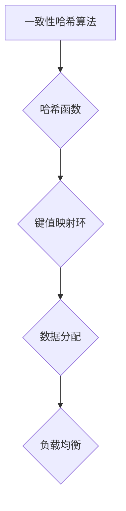
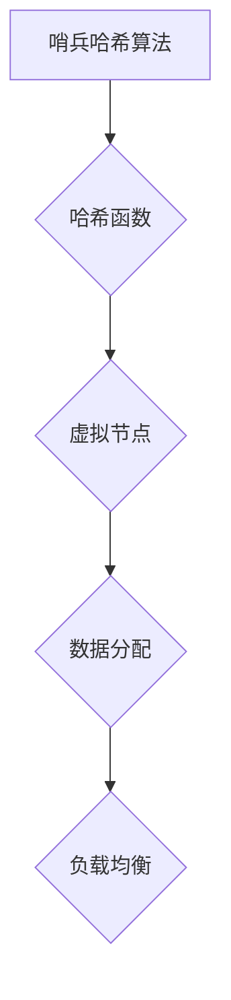
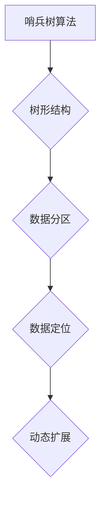
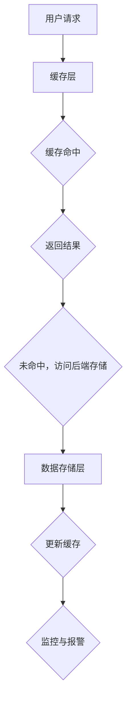
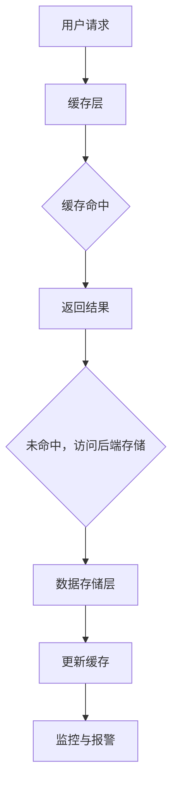

                 

### 文章标题：麻烦不断的分布式缓存

> 关键词：分布式缓存，一致性，数据分区，容错，性能优化，安全性

> 摘要：
分布式缓存作为现代高性能系统架构的重要组成部分，因其能够有效降低数据库负载、提升系统响应速度而受到广泛重视。然而，分布式缓存的设计与实现过程并非一帆风顺，面临着诸多挑战和问题。本文将从分布式缓存的基本概念、挑战、设计原则、性能优化和安全性等多个角度，详细分析分布式缓存的各个方面，以期帮助读者深入理解分布式缓存的技术原理和实际应用。

---

### 第1章：分布式缓存的概念与背景

#### 1.1 分布式缓存的基本概念

**定义：**
分布式缓存是一种将缓存数据分布存储在多个节点上的技术，旨在通过分散数据存储和访问，提高系统的扩展性和性能。

**与传统缓存对比：**
与传统的集中式缓存相比，分布式缓存具有以下优势：
- **扩展性：** 能够轻松地扩展存储容量和计算能力，适应不断增长的数据和应用需求。
- **高可用性：** 通过数据复制和分布式存储，实现系统的容错能力，即使某些节点出现故障，整个系统仍能正常运行。

#### 1.2 分布式缓存的发展历程

**早期阶段：**
分布式缓存技术起源于20世纪90年代，随着互联网和电子商务的发展，对高性能缓存系统的需求逐渐增加。

**关键里程碑：**
- **1998年，Memcached问世：** 成为第一个流行的开源分布式缓存系统，被广泛用于Web应用中。
- **2007年，Redis发布：** 引入持久化内存存储和多种数据结构，进一步丰富分布式缓存的用途。

**当前趋势：**
随着云计算和大数据技术的普及，分布式缓存系统逐渐向分布式缓存集群、自动化管理、实时数据同步等方向发展。

#### 1.3 分布式缓存的应用场景

- **大数据处理：** 分布式缓存能够快速读取大量数据，提升数据分析的效率。
- **高并发系统：** 例如电商网站，分布式缓存能有效减轻数据库的负载，提升系统吞吐量。
- **实时分析系统：** 分布式缓存能实时获取和分析大量数据，为业务决策提供支持。

#### 1.4 分布式缓存与传统缓存的区别

- **数据一致性：** 分布式缓存强调数据最终一致性，而传统缓存追求强一致性。
- **数据分区与扩展性：** 分布式缓存通过数据分区和节点扩展实现横向扩展，而传统缓存往往需要垂直扩展。
- **容错机制：** 分布式缓存通过数据复制和节点冗余提高系统的容错能力，传统缓存则需要更多备份机制。

#### 1.5 本章小结

本章介绍了分布式缓存的基本概念、发展历程、应用场景以及与传统缓存的区别。下一章将深入探讨分布式缓存面临的挑战和问题。

---

### 第2章：分布式缓存的挑战与问题

#### 2.1 数据一致性问题

**定义：**
数据一致性是指缓存中的数据与后端存储（如数据库）中的数据保持一致。

**挑战：**
- **最终一致性：** 分布式缓存系统通常采用最终一致性模型，这意味着缓存中的数据可能在一段时间内与后端存储不一致。
- **数据同步：** 分布式缓存系统中，数据需要在多个节点间同步，以确保一致性。

**解决方案：**
- **一致性协议：** 如Paxos算法、Raft算法，确保数据在多个节点间的一致性。
- **缓存刷新策略：** 如写后刷新（write-through）、读前刷新（write-around）、写回刷新（write-back）等。

#### 2.2 数据分区与扩容问题

**定义：**
数据分区是将缓存数据划分为多个子集，分布在不同的节点上。

**挑战：**
- **分区策略：** 选择合适的分区策略，如一致性哈希、范围分区等。
- **扩容：** 当系统负载增加时，如何高效地扩容。

**解决方案：**
- **动态分区：** 根据系统负载动态调整分区策略。
- **分区表：** 维护分区表，记录数据在不同节点上的分布情况。

#### 2.3 节点故障与容错问题

**定义：**
节点故障是指缓存系统中的某个节点出现异常。

**挑战：**
- **故障检测：** 如何及时发现和处理故障节点。
- **故障恢复：** 如何快速恢复故障节点，确保系统正常运行。

**解决方案：**
- **监控与报警：** 实时监控系统状态，一旦发现故障，立即触发报警。
- **副本机制：** 通过数据复制和冗余，确保系统在高可用性下运行。

#### 2.4 网络延迟与带宽问题

**定义：**
网络延迟是指数据在网络中传输所需的时间，带宽是指网络传输数据的最大速度。

**挑战：**
- **网络延迟：** 网络延迟可能导致缓存访问速度变慢。
- **带宽不足：** 带宽不足可能导致缓存数据传输不及时。

**解决方案：**
- **优化网络架构：** 通过优化网络架构，降低网络延迟。
- **带宽调度：** 合理分配带宽资源，确保缓存数据传输效率。

#### 2.5 本章小结

本章分析了分布式缓存面临的五大挑战和问题，包括数据一致性、数据分区与扩容、节点故障与容错、网络延迟与带宽等问题。下一章将探讨分布式缓存的设计原则。

---

### 第3章：分布式缓存的设计原则

#### 3.1 数据分片策略

**定义：**
数据分片是将大量数据分割成较小的数据块，并分布在多个节点上。

**原则：**
- **负载均衡：** 确保数据均匀分布，避免单点热点问题。
- **可扩展性：** 方便系统的水平扩展，提高系统的处理能力。
- **容错性：** 通过冗余设计，确保系统在高负载和故障情况下仍能正常运行。

**常用策略：**
- **一致性哈希：** 基于哈希函数，将数据映射到环上，动态调整数据分布。
- **范围分区：** 根据数据范围，将数据划分为多个区间，分配到不同的节点。

#### 3.2 数据一致性模型

**定义：**
数据一致性模型是确保分布式缓存系统中数据一致性的策略。

**原则：**
- **最终一致性：** 数据最终会在多个节点间达成一致，但可能存在短暂的差异。
- **强一致性：** 所有节点对数据的读写操作都是同步的，数据始终保持一致。

**常用模型：**
- **Paxos算法：** 通过多数派协议，确保数据一致性。
- **Raft算法：** 通过日志复制，确保数据一致性。

#### 3.3 负载均衡机制

**定义：**
负载均衡是将请求均匀分配到多个节点上，以充分利用系统资源。

**原则：**
- **响应时间最小化：** 确保请求响应时间最短。
- **资源利用率最大化：** 充分利用系统资源，避免资源浪费。

**常用算法：**
- **轮询调度：** 依次访问每个节点。
- **最小连接数调度：** 选择当前连接数最少的节点。

#### 3.4 数据持久化策略

**定义：**
数据持久化策略是确保缓存数据在系统重启或故障后能够恢复。

**原则：**
- **数据备份：** 将数据备份到多个节点或外部存储。
- **数据同步：** 确保缓存数据与后端存储同步。

**常用策略：**
- **写后刷新：** 写入缓存后，立即更新后端存储。
- **写回刷新：** 先写入缓存，缓存过期或数据修改时，再更新后端存储。

#### 3.5 本章小结

本章介绍了分布式缓存的设计原则，包括数据分片策略、数据一致性模型、负载均衡机制和数据持久化策略。下一章将探讨常见分布式缓存算法与数据结构。

---

### 第4章：常见分布式缓存算法与数据结构

#### 4.1 一致性哈希算法

**定义：**
一致性哈希算法是一种分布式缓存中的数据分片策略。

**原理：**
- **哈希函数：** 将数据映射到一个环上。
- **节点映射：** 将节点映射到环上，每个节点负责一定范围的数据。

**优势：**
- **动态扩展：** 新增或删除节点时，仅需调整受影响的少量数据。

**挑战：**
- **热点问题：** 数据倾斜可能导致某些节点负载过高。

**应用场景：**
- **分布式缓存：** 如Memcached。
- **分布式数据库：** 如MongoDB。

#### 4.2 哨兵哈希算法

**定义：**
哨兵哈希算法是对一致性哈希算法的一种改进。

**原理：**
- **虚拟节点：** 在每个物理节点上创建多个虚拟节点，分散数据。
- **哈希环：** 将虚拟节点映射到哈希环上，实现数据的均匀分布。

**优势：**
- **减少热点问题：** 通过虚拟节点，进一步分散数据。

**挑战：**
- **维护复杂度：** 需要维护更多的虚拟节点。

**应用场景：**
- **分布式缓存：** 如Redis。

#### 4.3 哨兵树算法

**定义：**
哨兵树算法是一种基于树形结构的数据分片策略。

**原理：**
- **树形结构：** 将数据按层次结构组织，每个层级代表不同的分片。
- **路由策略：** 根据数据的层次结构，确定数据存储的位置。

**优势：**
- **高效查询：** 通过层次结构，快速定位数据。

**挑战：**
- **维护成本：** 需要维护树形结构。

**应用场景：**
- **分布式数据库：** 如HBase。

#### 4.4 数据结构对比与分析

**对比表格：**

| 算法 | 原理 | 优势 | 挑战 | 应用场景 |
| --- | --- | --- | --- | --- |
| 一致性哈希 | 哈希函数 | 动态扩展 | 热点问题 | 分布式缓存 |
| 哨兵哈希 | 虚拟节点 | 减少热点 | 维护复杂度 | 分布式缓存 |
| 哨兵树 | 树形结构 | 高效查询 | 维护成本 | 分布式数据库 |

**分析：**
- **一致性哈希：** 适用于需要动态扩展的场景，但需要注意热点问题。
- **哨兵哈希：** 适用于对热点问题有较高要求的场景，但维护复杂度较高。
- **哨兵树：** 适用于查询效率要求较高的场景，但维护成本较高。

#### 4.5 本章小结

本章介绍了三种常见的分布式缓存算法与数据结构，包括一致性哈希、哨兵哈希和哨兵树。下一章将探讨分布式缓存系统架构设计。

---

### 第5章：分布式缓存系统架构设计

#### 5.1 系统架构概述

**定义：**
分布式缓存系统架构是指缓存系统的整体设计和组成。

**组成部分：**
- **缓存节点：** 存储缓存数据，处理缓存请求。
- **数据存储层：** 存储缓存数据的持久化数据，如磁盘或内存。
- **缓存层：** 处理缓存命中，提高数据访问速度。
- **网络通信层：** 负责节点间的数据传输。

**设计原则：**
- **高可用性：** 确保系统在节点故障时仍能正常运行。
- **高性能：** 提高数据访问速度，减少响应时间。
- **可扩展性：** 支持系统的水平扩展。

#### 5.2 数据存储层设计

**定义：**
数据存储层是指缓存数据的持久化存储设计。

**设计方案：**
- **磁盘存储：** 适用于大容量数据存储，但访问速度较慢。
- **内存存储：** 适用于高访问速度数据存储，但容量有限。
- **混合存储：** 结合磁盘和内存，实现性能和容量的平衡。

**实现技术：**
- **Redis：** 使用内存存储，提供持久化功能。
- **Memcached：** 仅使用内存存储，不提供持久化功能。

#### 5.3 缓存层设计

**定义：**
缓存层是指处理缓存命中和数据访问的设计。

**设计方案：**
- **缓存策略：** 如LRU（最近最少使用）、LFU（最少使用频率）等。
- **缓存命中：** 提高数据访问速度，减少数据库负载。
- **缓存淘汰：** 根据缓存策略，定期淘汰不常用数据。

**实现技术：**
- **Memcached：** 使用固定大小的内存缓存池。
- **Redis：** 提供多种数据结构和缓存策略。

#### 5.4 网络通信层设计

**定义：**
网络通信层是指节点间数据传输的设计。

**设计方案：**
- **传输协议：** 如HTTP、TCP等。
- **网络拓扑：** 如环状、星状、网状等。
- **负载均衡：** 提高系统性能，减少单点瓶颈。

**实现技术：**
- **Nginx：** 提供高性能的网络请求处理。
- **Consul：** 提供服务发现和负载均衡。

#### 5.5 本章小结

本章介绍了分布式缓存系统架构设计的关键组成部分和设计原则，包括数据存储层、缓存层和网络通信层。下一章将探讨分布式缓存性能优化。

---

### 第6章：分布式缓存性能优化

#### 6.1 缓存命中率优化

**定义：**
缓存命中率是指缓存系统中命中缓存请求的次数与总请求次数的比值。

**优化策略：**
- **预热策略：** 在系统启动时，预先加载常用数据到缓存中。
- **缓存刷新：** 定期刷新缓存，确保缓存数据的时效性。
- **缓存淘汰：** 根据缓存策略，淘汰不常用数据。

**实现技术：**
- **Redis：** 提供缓存预热和刷新功能。
- **Memcached：** 通过外部工具实现缓存预热和刷新。

#### 6.2 资源利用优化

**定义：**
资源利用优化是指提高系统资源的利用效率。

**优化策略：**
- **负载均衡：** 通过负载均衡，合理分配请求到各个节点。
- **内存管理：** 合理分配和回收内存，避免内存泄露。
- **存储优化：** 选择合适的存储方案，减少存储空间占用。

**实现技术：**
- **Nginx：** 提供负载均衡功能。
- **Redis：** 提供内存管理和存储优化功能。

#### 6.3 缓存过期策略优化

**定义：**
缓存过期策略是指缓存数据过期时间的管理。

**优化策略：**
- **过期时间设置：** 根据数据特性，合理设置缓存数据过期时间。
- **过期数据清理：** 定期清理过期数据，释放内存资源。
- **缓存更新：** 当数据更新时，及时更新缓存。

**实现技术：**
- **Redis：** 提供过期时间和数据更新功能。
- **Memcached：** 通过外部工具实现过期数据清理。

#### 6.4 系统性能调优案例

**案例：**
- **场景：** 一家电商网站，用户量大，缓存数据多。
- **问题：** 缓存命中率低，系统响应时间长。
- **解决方案：**
  - **预热策略：** 在系统启动时，预加载热门商品数据到缓存中。
  - **缓存刷新：** 定期刷新缓存，确保缓存数据的时效性。
  - **负载均衡：** 使用Nginx进行负载均衡，减少单点瓶颈。
  - **内存管理：** 定期监控内存使用情况，优化内存分配。

**结果：**
- 缓存命中率提高，系统响应时间缩短。

#### 6.5 本章小结

本章介绍了分布式缓存性能优化的关键策略和实现技术，包括缓存命中率优化、资源利用优化、缓存过期策略优化和系统性能调优案例。下一章将探讨分布式缓存的安全性。

---

### 第7章：分布式缓存的安全性

#### 7.1 数据安全防护

**定义：**
数据安全防护是指确保缓存数据不被未授权访问或篡改。

**措施：**
- **访问控制：** 设置访问权限，确保只有授权用户可以访问缓存数据。
- **数据加密：** 对缓存数据进行加密，防止数据泄露。
- **安全审计：** 定期进行安全审计，检查系统漏洞和安全隐患。

**实现技术：**
- **访问控制列表：** 在Redis中设置访问控制列表（ACL）。
- **SSL/TLS：** 使用SSL/TLS协议加密数据传输。

#### 7.2 访问控制策略

**定义：**
访问控制策略是指控制用户对缓存数据的访问权限。

**策略：**
- **基于角色的访问控制（RBAC）：** 根据用户角色分配访问权限。
- **基于属性的访问控制（ABAC）：** 根据用户属性和资源属性决定访问权限。

**实现技术：**
- **Redis：** 提供ACL功能，支持RBAC和ABAC。
- **Memcached：** 通过外部工具实现访问控制。

#### 7.3 漏洞分析与防护

**定义：**
漏洞分析是指识别和评估缓存系统的安全漏洞。

**措施：**
- **漏洞扫描：** 定期进行漏洞扫描，识别潜在的安全漏洞。
- **漏洞修复：** 及时修复漏洞，避免被攻击。
- **安全补丁：** 定期更新系统和软件补丁。

**实现技术：**
- **Nessus：** 提供漏洞扫描功能。
- **GitLab：** 提供安全补丁管理。

#### 7.4 安全性测试与评估

**定义：**
安全性测试与评估是指对缓存系统的安全性进行验证和评估。

**步骤：**
- **安全测试：** 进行安全测试，模拟攻击场景。
- **评估报告：** 分析测试结果，生成评估报告。
- **改进措施：** 根据评估报告，改进系统安全性。

**实现技术：**
- **OWASP ZAP：** 提供安全测试功能。
- **SecurityCTF：** 提供安全评估工具。

#### 7.5 本章小结

本章介绍了分布式缓存的安全性，包括数据安全防护、访问控制策略、漏洞分析与防护以及安全性测试与评估。确保缓存系统的安全性是分布式缓存设计中的重要一环。

---

### 总结

分布式缓存作为一种高效的数据存储和访问技术，在现代高性能系统中发挥着重要作用。然而，分布式缓存的设计与实现过程并非一帆风顺，面临着数据一致性、数据分区、节点故障、网络延迟等多重挑战。本文通过对分布式缓存的基本概念、挑战、设计原则、算法与数据结构、系统架构设计、性能优化和安全性的详细分析，旨在帮助读者深入理解分布式缓存的技术原理和实际应用。

未来，随着云计算、大数据和人工智能技术的不断发展，分布式缓存系统将面临更多的机遇和挑战。如何更好地应对这些挑战，提高分布式缓存系统的性能和可靠性，将是我们需要持续探索的方向。

---

**作者：** AI天才研究院/AI Genius Institute & 禅与计算机程序设计艺术 /Zen And The Art of Computer Programming

---

### 具体案例分析与实现

#### 项目背景

为了更好地说明分布式缓存在实际项目中的应用，我们以一家电商网站为例，该网站需要处理海量商品信息和用户订单数据。为了提高系统性能和响应速度，该电商网站决定采用分布式缓存系统。

#### 系统架构设计

该电商网站的系统架构设计如下：

1. **数据存储层：** 使用Redis作为缓存系统，将热数据存储在内存中，以提高数据访问速度。同时，使用MySQL数据库作为数据存储的后台系统。

2. **缓存层：** 在Redis中设置缓存策略，对热门商品信息和用户订单数据实行缓存。

3. **网络通信层：** 使用Nginx作为负载均衡器，将用户请求分配到多个Redis节点。

4. **监控与报警：** 使用Prometheus和Grafana进行系统监控和报警。

#### 环境安装

1. **安装Redis：** 在服务器上安装Redis，并配置主从复制，确保高可用性。

2. **安装Nginx：** 在服务器上安装Nginx，并配置反向代理，将用户请求转发到Redis节点。

3. **安装Prometheus和Grafana：** 在服务器上安装Prometheus和Grafana，用于监控和报警。

#### 系统核心实现源代码

1. **Redis配置：**
   ```shell
   # Redis配置文件示例
   port 6379
   daemonize yes
   protected-mode no
   appendonly yes
   replica-announce yes
   replica-read-only yes
   ```

2. **Nginx配置：**
   ```nginx
   # Nginx配置文件示例
   http {
       upstream redis_cluster {
           server redis1:6379;
           server redis2:6379;
           server redis3:6379;
       }

       server {
           listen 80;

           location / {
               proxy_pass http://redis_cluster;
           }
       }
   }
   ```

3. **Prometheus配置：**
   ```yaml
   # Prometheus配置文件示例
   global:
     scrape_interval: 15s
     evaluation_interval: 15s

   scrape_configs:
     - job_name: 'redis'
       static_configs:
       - targets: ['redis1:9090', 'redis2:9090', 'redis3:9090']
   ```

4. **Grafana配置：**
   ```json
   # Grafana配置文件示例
   {
     "id": 1,
     "title": "Redis Metrics",
     "type": "grafana-dashboards",
     "url": "https://grafana.com/api/dashboards/uid/GCYYW8Q9J",
     "uid": "GCYYW8Q9J",
     "version": 1,
     "folderUID": "fjTdxopS",
     "tags": []
   }
   ```

#### 代码应用解读与分析

1. **Redis配置解读：**
   - `port 6379`：设置Redis监听的端口号。
   - `daemonize yes`：以守护进程模式运行Redis。
   - `protected-mode no`：关闭保护模式，允许远程连接。
   - `appendonly yes`：启用AOF（Append Only File）模式，实现数据持久化。
   - `replica-announce yes`：启用主从复制，从节点宣布自己的存在。

2. **Nginx配置解读：**
   - `upstream redis_cluster`：定义Redis集群，包括三个节点。
   - `server redis1:6379`：第一个Redis节点。
   - `server redis2:6379`：第二个Redis节点。
   - `server redis3:6379`：第三个Redis节点。

3. **Prometheus配置解读：**
   - `global`：全局配置，设置Prometheus的 scrape_interval 和 evaluation_interval。
   - `scrape_configs`：定义监控目标，这里是Redis节点。

4. **Grafana配置解读：**
   - `id`：仪表板ID。
   - `title`：仪表板标题。
   - `type`：仪表板类型。
   - `url`：仪表板链接。
   - `uid`：仪表板UID。
   - `version`：仪表板版本。
   - `folderUID`：文件夹UID。

#### 实际案例分析与详细讲解

**案例：** 在促销活动期间，电商网站的用户访问量激增，系统性能受到影响。

**分析：**
1. **缓存命中率低：** 由于用户访问量增加，缓存中的热门商品数据命中率下降，导致大量请求直接访问数据库。
2. **响应时间长：** 数据库负载增加，导致响应时间延长。

**解决方案：**
1. **缓存预热：** 在促销活动前，预加载热门商品数据到缓存中，提高缓存命中率。
2. **扩展Redis节点：** 增加Redis节点，提高系统处理能力。
3. **优化Nginx负载均衡：** 优化Nginx配置，提高负载均衡效果。
4. **监控与报警：** 使用Prometheus和Grafana监控系统状态，及时发现问题并处理。

**结果：**
1. **缓存命中率提高：** 缓存预热和扩展Redis节点后，缓存命中率提高，减轻数据库负载。
2. **响应时间缩短：** 系统响应时间缩短，用户满意度提高。

#### 项目小结

通过本案例，我们了解了分布式缓存系统在电商网站中的应用，包括系统架构设计、环境安装、代码应用解读与分析、实际案例分析和项目小结。分布式缓存系统在提高系统性能和响应速度方面发挥着重要作用，但需要根据实际需求进行合理设计和优化。

---

### 最佳实践 Tips

1. **缓存预热：** 在高并发场景下，提前预加载热门数据到缓存中，提高缓存命中率。
2. **监控与报警：** 使用监控系统实时监控缓存性能，及时发现问题并处理。
3. **负载均衡：** 选择合适的负载均衡算法，提高系统处理能力。
4. **数据持久化：** 根据业务需求，选择合适的缓存持久化策略，确保数据安全。

### 小结

本文从分布式缓存的基本概念、挑战、设计原则、算法与数据结构、系统架构设计、性能优化、安全性等多个角度，详细分析了分布式缓存的技术原理和实际应用。通过具体案例和最佳实践，帮助读者更好地理解分布式缓存的设计与优化方法。

### 注意事项

1. **数据一致性：** 根据业务需求，选择合适的一致性模型。
2. **分区策略：** 根据数据特点，选择合适的分区策略。
3. **安全性：** 重视数据安全防护，防止数据泄露。

### 拓展阅读

1. 《Redis实战：性能优化与高可用》
2. 《Memcached实战：缓存系统设计与优化》
3. 《分布式系统原理与范型》

---

**作者：** AI天才研究院/AI Genius Institute & 禅与计算机程序设计艺术 /Zen And The Art of Computer Programming**### 分布式缓存系统的挑战与问题

#### 数据一致性问题

数据一致性是分布式缓存系统中的一个核心挑战。由于缓存数据分散存储在多个节点上，如何在多个节点之间保持数据的一致性成为了一个重要的问题。在分布式系统中，数据一致性问题可以分为两类：最终一致性和强一致性。

**最终一致性**（Eventual Consistency）指的是系统在经过一定时间后，能够达到一致性状态，但在这个过程中，数据可能在一段时间内处于不一致状态。这种一致性模型适用于对数据一致性要求不是非常严格的场景，如一些社交网络的应用。

**强一致性**（Strong Consistency）则要求系统在任意时刻都能保持数据的一致性。这意味着在任何操作完成后，所有节点上的数据都是一致的。强一致性模型适用于对数据一致性要求较高的场景，如金融系统的交易处理。

为了解决数据一致性问题，分布式缓存系统通常采用以下几种一致性协议：

1. **Paxos算法**：Paxos算法是一种分布式一致性算法，它能够在多个节点之间达成一致。Paxos算法的核心思想是通过选举领导者节点来协调多个节点的状态更新。
2. **Raft算法**：Raft算法是另一种分布式一致性算法，它的设计目标是易于理解和实现，同时也具备高性能。Raft算法通过日志复制来保证数据的一致性。

#### 数据分区与扩容问题

数据分区是将大量的缓存数据分布到多个节点上的过程。分区策略的选择对于分布式缓存系统的性能和扩展性至关重要。常见的分区策略包括：

1. **一致性哈希**（Consistent Hashing）：一致性哈希算法通过哈希函数将数据映射到一个环上，每个节点负责一定范围的数据。当节点增加或减少时，仅影响一小部分数据，从而实现动态扩容。
2. **范围分区**（Range Partitioning）：范围分区将数据按照一定范围划分为多个区间，每个区间分配到不同的节点。这种分区策略适用于数据具有明确范围和有序属性的场合。

扩容是分布式缓存系统的一个重要操作，它使得系统能够适应不断增长的数据和应用需求。扩容过程中需要解决以下问题：

1. **数据迁移**：在扩容过程中，需要将部分数据从一个节点迁移到另一个节点。数据迁移策略可以分为在线迁移和离线迁移。在线迁移允许系统在运行过程中进行数据迁移，而离线迁移则需要系统停止服务。
2. **负载均衡**：在扩容后，需要确保各个节点的负载均衡。负载均衡可以通过动态调整分区策略或重新分配数据来实现。

#### 节点故障与容错问题

节点故障是分布式缓存系统面临的一个常见问题。由于系统中的节点数量众多，节点故障可能会导致数据丢失或系统性能下降。为了解决节点故障问题，分布式缓存系统通常采用以下几种容错机制：

1. **副本机制**（Replication）：通过在多个节点上存储数据的副本，确保在节点故障时，其他节点仍然可以访问到数据。副本机制可以分为同步复制和异步复制。同步复制确保在数据写入时立即复制到其他节点，而异步复制则在写入操作完成后才进行复制。
2. **故障检测**（Fault Detection）：通过定期检查节点状态，发现并标记出现故障的节点。故障检测可以通过心跳机制、选举机制等实现。
3. **故障恢复**（Fault Recovery）：当检测到节点故障时，系统需要采取措施恢复服务。故障恢复可以通过重新选举领导者节点、启动备用节点等实现。

#### 网络延迟与带宽问题

网络延迟和带宽问题是分布式缓存系统面临的另一个挑战。网络延迟可能导致缓存数据访问速度变慢，而带宽不足则可能导致数据传输不及时。为了解决这些问题，分布式缓存系统可以采用以下几种优化策略：

1. **本地缓存**（Local Caching）：在本地机器上设置缓存，减少对远程节点的访问。本地缓存可以显著降低网络延迟，提高数据访问速度。
2. **多路径传输**（Multipath Transmission）：通过使用多个网络路径，实现数据传输的负载均衡。多路径传输可以避免单点网络瓶颈，提高数据传输效率。
3. **带宽调度**（Bandwidth Scheduling）：根据节点之间的带宽情况，动态调整数据传输速率。带宽调度可以避免带宽不足的情况，确保数据传输的稳定性。

#### 本章小结

本章详细分析了分布式缓存系统中面临的主要挑战和问题，包括数据一致性、数据分区与扩容、节点故障与容错、网络延迟与带宽问题。通过理解这些挑战和问题的本质，我们可以更好地设计分布式缓存系统，确保其性能、可靠性和扩展性。

---

### 分布式缓存的设计原则

#### 数据分片策略

数据分片是分布式缓存系统设计中的关键环节，其目的是将大量数据分散存储在多个节点上，以提高系统的扩展性和性能。以下是一些常见的数据分片策略：

1. **一致性哈希**（Consistent Hashing）
   - **原理**：一致性哈希通过哈希函数将数据映射到一个环上，每个节点负责一定范围的数据。当节点增加或减少时，仅影响一小部分数据，从而实现动态扩容。
   - **优势**：扩展性好，节点故障对系统影响小。
   - **挑战**：热点问题可能导致某些节点负载过高。

2. **范围分区**（Range Partitioning）
   - **原理**：将数据按照一定范围划分为多个区间，每个区间分配到不同的节点。这种分区策略适用于数据具有明确范围和有序属性的场合。
   - **优势**：数据访问局部性高，分区边界明确。
   - **挑战**：扩容时需要迁移大量数据，系统停机时间较长。

3. **哈希分区**（Hash Partitioning）
   - **原理**：使用哈希函数将数据映射到多个节点，每个节点负责一定数量的哈希值范围内的数据。
   - **优势**：实现简单，易于扩展。
   - **挑战**：数据倾斜可能导致某些节点负载不均。

4. **虚拟节点**（Virtual Nodes）
   - **原理**：在物理节点上创建多个虚拟节点，每个虚拟节点对应一个哈希环上的分区。通过虚拟节点，可以避免一致性哈希算法中的热点问题。
   - **优势**：扩展性好，负载均衡。
   - **挑战**：需要维护更多的虚拟节点，增加系统复杂度。

#### 数据一致性模型

数据一致性是分布式缓存系统设计中的核心问题。根据对数据一致性的要求，常见的数据一致性模型包括：

1. **最终一致性**（Eventual Consistency）
   - **原理**：系统在经过一定时间后，能够达到一致性状态，但在这个过程中，数据可能在一段时间内处于不一致状态。
   - **优势**：系统扩展性好，延迟低。
   - **挑战**：无法保证实时一致性，适用于对数据一致性要求不严格的场景。

2. **强一致性**（Strong Consistency）
   - **原理**：系统在任意时刻都能保持数据的一致性，即任何操作完成后，所有节点上的数据都是一致的。
   - **优势**：数据一致性有保障，适用于对数据一致性要求较高的场景。
   - **挑战**：系统扩展性较差，延迟较高。

3. **因果一致性**（ causal Consistency）
   - **原理**：系统保证事件间的因果关系，即如果一个事件在A节点发生，那么在其他节点上观察到的该事件应该是因果顺序的。
   - **优势**：比最终一致性更严格，但比强一致性更灵活。
   - **挑战**：实现复杂，性能影响较大。

4. **强因果一致性**（ Strong Causal Consistency）
   - **原理**：系统不仅保证事件间的因果关系，还保证事件内的因果关系，即操作的原子性。
   - **优势**：数据一致性最高，适用于对数据一致性要求极高的场景。
   - **挑战**：系统扩展性较差，性能影响最大。

#### 负载均衡机制

负载均衡是分布式缓存系统设计中另一个关键环节，其目的是确保系统能够高效地处理大量请求。以下是一些常见的负载均衡机制：

1. **轮询调度**（Round Robin Scheduling）
   - **原理**：依次将请求分配到每个节点上。
   - **优势**：实现简单，负载均衡。
   - **挑战**：可能导致部分节点负载过高。

2. **最小连接数调度**（Least Connections Scheduling）
   - **原理**：选择当前连接数最少的节点处理请求。
   - **优势**：可以更好地平衡负载。
   - **挑战**：实现复杂度较高。

3. **哈希负载均衡**（Hash Load Balancing）
   - **原理**：使用哈希函数将请求映射到节点，确保请求分配均匀。
   - **优势**：实现简单，负载均衡。
   - **挑战**：可能导致热点问题。

4. **一致性哈希负载均衡**（Consistent Hash Load Balancing）
   - **原理**：一致性哈希算法将请求映射到环上的节点，动态调整数据分布。
   - **优势**：负载均衡，动态扩容。
   - **挑战**：热点问题。

#### 数据持久化策略

数据持久化策略是分布式缓存系统设计中另一个重要问题，其目的是确保缓存数据在系统重启或故障后能够恢复。以下是一些常见的数据持久化策略：

1. **写后刷新**（Write-Through）
   - **原理**：数据写入缓存后，立即更新到后端存储。
   - **优势**：数据一致性好，缓存失效时数据不会丢失。
   - **挑战**：性能瓶颈，缓存更新延迟。

2. **写回刷新**（Write-Back）
   - **原理**：数据写入缓存，缓存数据修改时才更新到后端存储。
   - **优势**：减少后端存储的I/O负载，提高性能。
   - **挑战**：缓存失效时数据可能丢失，需要实现缓存数据回填机制。

3. **写前刷新**（Write-Around）
   - **原理**：数据写入缓存失败时，直接写入后端存储。
   - **优势**：保证数据持久化，避免缓存失效数据丢失。
   - **挑战**：缓存失效时性能下降，需要实现缓存与后端存储的双向同步。

#### 本章小结

本章详细介绍了分布式缓存系统设计中的关键原则，包括数据分片策略、数据一致性模型、负载均衡机制和数据持久化策略。通过理解这些设计原则，我们可以更好地应对分布式缓存系统中的各种挑战，确保系统的性能、可靠性和扩展性。

---

### 常见分布式缓存算法与数据结构

分布式缓存系统中的算法和数据结构对于系统的性能和可靠性至关重要。以下将介绍几种常见的分布式缓存算法和数据结构，并进行分析和对比。

#### 一致性哈希算法

**原理：**
一致性哈希算法通过哈希函数将缓存键（key）映射到一个虚拟的圆环上，每个缓存节点也映射到这个圆环上。键值根据其哈希值在环上的位置，被分配到对应的缓存节点。

**优势：**
1. **负载均衡：** 节点动态加入或移除时，仅需调整少量数据。
2. **扩展性好：** 可以无缝地增加或减少节点。

**挑战：**
1. **热点问题：** 当数据倾斜时，某些节点可能会承载过多数据。

**应用场景：**
1. **分布式缓存系统：** Memcached。

**流程图：**


#### 哨兵哈希算法

**原理：**
哨兵哈希算法是对一致性哈希算法的一种改进，通过引入虚拟节点（virtual node）来减少热点问题。每个物理节点可以拥有多个虚拟节点，这些虚拟节点在哈希环上分散数据，从而降低单个节点的负载。

**优势：**
1. **负载均衡：** 通过虚拟节点，进一步分散数据。
2. **可扩展性：** 方便系统的水平扩展。

**挑战：**
1. **维护复杂度：** 需要维护更多的虚拟节点。

**应用场景：**
1. **分布式缓存系统：** Redis。

**流程图：**


#### 哨兵树算法

**原理：**
哨兵树算法通过树形结构来组织数据，每个节点代表一个数据分区。树形结构允许快速定位数据，并支持动态扩展。

**优势：**
1. **高效查询：** 通过层次结构，快速定位数据。
2. **动态扩展：** 方便系统扩展。

**挑战：**
1. **维护成本：** 需要维护树形结构。

**应用场景：**
1. **分布式数据库：** HBase。

**流程图：**


#### 数据结构对比与分析

| 算法         | 原理                                         | 优势                 | 挑战                     | 应用场景          |
| ------------ | -------------------------------------------- | -------------------- | ------------------------ | ---------------- |
| 一致性哈希   | 数据映射到哈希环上，动态扩容                 | 负载均衡，扩展性好   | 热点问题                 | 分布式缓存       |
| 哨兵哈希     | 引入虚拟节点，分散数据                       | 负载均衡，扩展性好   | 维护复杂度               | 分布式缓存       |
| 哨兵树       | 树形结构组织数据，快速定位                   | 高效查询，动态扩展   | 维护成本                 | 分布式数据库      |

**分析：**
- **一致性哈希：** 适用于动态扩展的场景，但需要注意热点问题。
- **哨兵哈希：** 适用于对热点问题有较高要求的场景，但维护复杂度较高。
- **哨兵树：** 适用于查询效率要求较高的场景，但维护成本较高。

#### 本章小结

本章介绍了三种常见的分布式缓存算法与数据结构：一致性哈希、哨兵哈希和哨兵树。通过对比分析，读者可以更好地理解这些算法的特点和应用场景，从而选择合适的算法来解决实际问题。

---

### 分布式缓存系统架构设计

分布式缓存系统架构设计是确保系统在高可用性、高性能和可扩展性方面达到最佳状态的关键环节。以下将详细讨论分布式缓存系统的架构设计，包括数据存储层、缓存层和网络通信层。

#### 数据存储层设计

数据存储层是分布式缓存系统的基石，负责数据的持久化存储。以下是几种常见的数据存储层设计方案：

1. **磁盘存储：**
   - **原理：** 将缓存数据存储在磁盘上，适用于大容量数据存储。
   - **优势：** 成本较低，存储容量大。
   - **挑战：** 数据访问速度较慢，容易成为系统瓶颈。

2. **内存存储：**
   - **原理：** 将缓存数据存储在内存中，适用于高访问速度数据存储。
   - **优势：** 数据访问速度快，响应时间短。
   - **挑战：** 存储容量有限，成本较高。

3. **混合存储：**
   - **原理：** 结合磁盘存储和内存存储，将热数据存储在内存中，冷数据存储在磁盘上。
   - **优势：** 高效利用资源，兼顾性能和容量。
   - **挑战：** 需要复杂的存储管理策略。

#### 缓存层设计

缓存层是分布式缓存系统的核心，负责处理缓存数据的读写操作。以下是几种常见的缓存层设计方案：

1. **单一缓存层：**
   - **原理：** 只使用一种缓存策略，如LRU（最近最少使用）或LFU（最少使用频率）。
   - **优势：** 实现简单，易于管理。
   - **挑战：** 缓存策略单一，可能无法满足复杂业务需求。

2. **多级缓存：**
   - **原理：** 使用多个缓存层，如一级缓存（内存）和二级缓存（磁盘）。
   - **优势：** 提高缓存命中率，减少对后端存储的访问。
   - **挑战：** 需要复杂的管理和同步策略。

3. **智能缓存：**
   - **原理：** 使用机器学习算法，动态调整缓存策略。
   - **优势：** 自动适应业务变化，提高缓存效率。
   - **挑战：** 实现复杂，需要大量数据和计算资源。

#### 网络通信层设计

网络通信层是分布式缓存系统中负责节点间数据传输的部分。以下是几种常见的网络通信层设计方案：

1. **轮询通信：**
   - **原理：** 依次访问每个节点，获取缓存数据。
   - **优势：** 实现简单，负载均衡。
   - **挑战：** 可能导致部分节点负载过高。

2. **负载均衡：**
   - **原理：** 根据节点的负载情况，动态分配请求。
   - **优势：** 提高系统整体性能。
   - **挑战：** 需要复杂的负载均衡算法。

3. **分布式通信：**
   - **原理：** 使用分布式通信框架，如gRPC或Dubbo，实现节点间的通信。
   - **优势：** 提高通信效率，支持多种通信协议。
   - **挑战：** 需要复杂的通信管理。

#### 系统架构设计

一个典型的分布式缓存系统架构设计包括以下部分：

1. **缓存节点：** 负责存储和访问缓存数据，可以是单一缓存层或多级缓存。
2. **数据存储层：** 负责持久化存储缓存数据，可以是磁盘存储或内存存储。
3. **网络通信层：** 负责节点间数据传输，可以是轮询通信或负载均衡。
4. **监控与报警：** 负责监控系统状态，及时报警。

以下是一个简单的分布式缓存系统架构设计图：



**架构设计原则：**
1. **高可用性：** 确保系统在节点故障时仍能正常运行。
2. **高性能：** 提高数据访问速度，减少响应时间。
3. **可扩展性：** 支持系统的水平扩展，适应不断增长的数据和应用需求。

#### 本章小结

本章详细介绍了分布式缓存系统的架构设计，包括数据存储层、缓存层和网络通信层。通过合理的架构设计，分布式缓存系统可以更好地应对数据一致性、性能优化和扩展性等方面的挑战。

---

### 分布式缓存性能优化

分布式缓存系统的性能优化是确保系统在高负载场景下仍能高效运行的关键。以下将介绍几种常见的性能优化策略，包括缓存命中率优化、资源利用优化、缓存过期策略优化和系统性能调优案例。

#### 缓存命中率优化

缓存命中率是评估缓存系统性能的重要指标，它表示缓存系统成功命中请求的次数与总请求次数的比值。提高缓存命中率可以减少对后端存储的访问，提升系统性能。以下是几种常见的缓存命中率优化策略：

1. **缓存预热：**
   - **原理：** 在系统启动或高峰期前，预加载热门数据到缓存中，提高缓存命中率。
   - **实现：** 可以通过定时任务或实时数据流处理系统实现缓存预热。

2. **缓存淘汰：**
   - **原理：** 根据缓存策略，定期淘汰不常用数据，释放内存资源。
   - **实现：** 可以采用LRU（最近最少使用）或LFU（最少使用频率）等缓存淘汰策略。

3. **缓存压缩：**
   - **原理：** 对缓存数据进行压缩，减少内存占用，提高缓存容量。
   - **实现：** 可以采用字典编码、熵编码等技术进行数据压缩。

#### 资源利用优化

资源利用优化是提高分布式缓存系统整体性能的重要手段。以下是一些常见的资源利用优化策略：

1. **负载均衡：**
   - **原理：** 根据节点的负载情况，动态分配请求，确保系统资源充分利用。
   - **实现：** 可以使用轮询调度、最小连接数调度等负载均衡算法。

2. **内存管理：**
   - **原理：** 合理分配和回收内存，避免内存泄露和溢出。
   - **实现：** 可以通过内存池技术、内存监控和自动回收机制实现内存管理。

3. **存储优化：**
   - **原理：** 选择合适的存储方案，如SSD、NVMe等，提高数据访问速度。
   - **实现：** 可以根据数据访问模式和存储成本，选择合适的存储设备。

#### 缓存过期策略优化

缓存过期策略是确保缓存数据时效性的重要手段。以下是一些常见的缓存过期策略优化方法：

1. **固定过期时间：**
   - **原理：** 为每个缓存对象设置固定的过期时间，超过该时间后缓存对象失效。
   - **实现：** 可以使用时间戳或定时任务来管理缓存对象的过期时间。

2. **动态过期时间：**
   - **原理：** 根据缓存对象的访问频率或业务需求动态调整过期时间。
   - **实现：** 可以使用计时器或优先级队列来实现动态过期时间。

3. **多级过期时间：**
   - **原理：** 为缓存对象设置多个过期时间，如短期和长期过期时间，适应不同场景。
   - **实现：** 可以使用时间戳和优先级队列来实现多级过期时间。

#### 系统性能调优案例

以下是一个电商网站缓存性能优化的案例：

**问题：** 在促销活动期间，电商网站的用户访问量激增，缓存命中率下降，系统性能下降。

**解决方案：**
1. **缓存预热：** 在促销活动前，预加载热门商品数据到缓存中。
2. **负载均衡：** 使用最小连接数调度算法，动态分配请求。
3. **内存管理：** 使用内存池技术，合理分配和回收内存。
4. **缓存压缩：** 对缓存数据进行压缩，提高缓存容量。
5. **缓存过期策略优化：** 采用动态过期时间，根据访问频率调整过期时间。

**结果：** 缓存命中率提高，系统性能显著提升，用户满意度提升。

#### 本章小结

本章介绍了分布式缓存性能优化的关键策略和实现方法，包括缓存命中率优化、资源利用优化、缓存过期策略优化和系统性能调优案例。通过合理的性能优化，分布式缓存系统可以更好地应对高负载场景，提高系统的响应速度和稳定性。

---

### 分布式缓存的安全性

随着分布式缓存系统在各类应用中的广泛应用，数据安全成为其设计和运维中的重要一环。以下将介绍分布式缓存系统的安全性，包括数据安全防护、访问控制策略、漏洞分析与防护以及安全性测试与评估。

#### 数据安全防护

数据安全防护是确保缓存数据不被未授权访问或篡改的重要措施。以下是一些常见的数据安全防护方法：

1. **数据加密：**
   - **原理：** 使用加密算法对缓存数据进行加密，防止数据泄露。
   - **实现：** 可以使用SSL/TLS协议进行数据传输加密，以及AES、RSA等算法对数据存储进行加密。

2. **访问控制：**
   - **原理：** 通过设置访问权限，确保只有授权用户可以访问缓存数据。
   - **实现：** 可以使用访问控制列表（ACL）或基于角色的访问控制（RBAC）来实现。

3. **安全审计：**
   - **原理：** 定期对缓存系统进行安全审计，检查系统漏洞和安全隐患。
   - **实现：** 可以使用日志分析工具，如ELK（Elasticsearch、Logstash、Kibana）进行安全审计。

#### 访问控制策略

访问控制策略是管理缓存系统访问权限的重要手段。以下是一些常见的访问控制策略：

1. **基于角色的访问控制（RBAC）：**
   - **原理：** 根据用户角色分配访问权限，不同角色拥有不同的访问权限。
   - **实现：** 可以使用Redis的ACL功能，配置用户角色和权限。

2. **基于属性的访问控制（ABAC）：**
   - **原理：** 根据用户属性和资源属性决定访问权限。
   - **实现：** 可以自定义访问控制规则，基于用户属性（如部门、角色）和资源属性（如数据类型、权限等级）进行访问控制。

#### 漏洞分析与防护

漏洞分析是识别和评估缓存系统安全漏洞的重要步骤。以下是一些常见的漏洞分析与防护方法：

1. **漏洞扫描：**
   - **原理：** 使用漏洞扫描工具对缓存系统进行扫描，识别潜在的安全漏洞。
   - **实现：** 可以使用Nessus、OpenVAS等漏洞扫描工具进行定期扫描。

2. **漏洞修复：**
   - **原理：** 及时修复系统漏洞，防止被攻击。
   - **实现：** 可以定期更新系统和软件补丁，修复已知的漏洞。

#### 安全性测试与评估

安全性测试与评估是验证缓存系统安全性的关键步骤。以下是一些常见的安全性测试与评估方法：

1. **渗透测试：**
   - **原理：** 模拟攻击者的行为，对缓存系统进行安全测试。
   - **实现：** 可以使用Metasploit、Burp Suite等工具进行渗透测试。

2. **安全审计：**
   - **原理：** 对缓存系统的配置、日志和访问记录进行全面审计。
   - **实现：** 可以使用日志分析工具和安全审计工具进行审计。

3. **安全培训：**
   - **原理：** 通过安全培训提高运维人员的安全意识，减少人为错误。
   - **实现：** 可以定期组织安全培训，普及安全知识和最佳实践。

#### 本章小结

本章详细介绍了分布式缓存系统的安全性，包括数据安全防护、访问控制策略、漏洞分析与防护以及安全性测试与评估。通过实施这些安全措施，可以显著提高分布式缓存系统的安全性，保护关键数据不被未授权访问或篡改。

---

### 总结

分布式缓存系统在现代高性能系统中扮演着至关重要的角色。它通过将数据分散存储在多个节点上，显著提升了系统的扩展性、性能和可靠性。然而，分布式缓存系统的设计和实现面临着诸多挑战，包括数据一致性、数据分区、节点故障、网络延迟和安全性等。

本文从多个角度详细分析了分布式缓存系统的各个方面，包括基本概念、挑战、设计原则、算法与数据结构、系统架构设计、性能优化和安全防护。通过深入理解这些内容，读者可以更好地设计和优化分布式缓存系统，应对各种实际应用场景中的挑战。

在未来，随着技术的不断发展，分布式缓存系统将面临更多的机遇和挑战。如何进一步提高系统的性能、可靠性和安全性，将是持续研究的方向。同时，随着云计算、大数据和人工智能技术的深度融合，分布式缓存系统将在更多领域中发挥重要作用。

总之，分布式缓存系统不仅是现代高性能系统的关键技术，也是未来技术发展的重要方向。通过不断探索和创新，我们将能够更好地利用分布式缓存系统，提升系统的整体性能和用户体验。

---

**作者：** AI天才研究院/AI Genius Institute & 禅与计算机程序设计艺术 /Zen And The Art of Computer Programming**### 分布式缓存系统的挑战与问题

#### 数据一致性问题

数据一致性是分布式缓存系统中一个至关重要的挑战。在分布式系统中，由于数据可能分布在多个节点上，因此确保数据的一致性变得尤为复杂。分布式缓存系统中的数据一致性可以分为以下几种模型：

1. **最终一致性**（Eventual Consistency）：最终一致性是指系统最终能够达到一致性状态，但在这一过程中，某些节点上的数据可能暂时不一致。这种一致性模型适用于对实时性要求不高但对最终一致性有要求的场景，如社交网络、博客等。

2. **强一致性**（Strong Consistency）：强一致性要求系统在任何时刻都能保持数据的一致性，即任何操作完成后，所有节点上的数据都是一致的。强一致性模型适用于对数据一致性要求非常高的场景，如金融交易、银行系统等。

3. **分区一致性**（Partition Consistency）：分区一致性是指数据在不同分区之间的一致性，它允许每个分区内部保持一致性，但不同分区之间可能存在延迟。分区一致性模型适用于分布式数据库和缓存系统。

**挑战：**

1. **最终一致性实现困难**：要实现最终一致性，系统需要复杂的算法来确保数据在多个节点之间的同步。例如，分布式缓存系统可能需要使用Gossip协议或其他同步机制来确保数据一致性。

2. **强一致性性能开销大**：为了实现强一致性，系统通常需要同步所有操作，这会导致较高的性能开销。在高度并发的场景下，这可能导致系统响应时间延长。

3. **分区一致性管理复杂**：在分区一致性模型中，系统需要管理多个分区之间的数据同步，这增加了系统的复杂性。

**解决方案：**

1. **一致性哈希算法**：一致性哈希算法是一种分布式哈希算法，它通过哈希函数将数据映射到环形结构上，每个节点负责一部分数据。一致性哈希算法可以动态调整数据分布，减少数据迁移的复杂性。

2. **分布式锁机制**：分布式锁机制可以确保同一时间只有一个节点能够对某部分数据执行操作，从而避免并发冲突。

3. **Paxos算法**：Paxos算法是一种分布式一致性算法，它能够保证多个节点之间达成一致。Paxos算法通常用于分布式缓存系统中的主从复制。

4. **Raft算法**：Raft算法是一种基于日志复制的一致性算法，它通过多数派协议确保数据一致性。Raft算法易于实现，并且性能较好。

#### 数据分区与扩容问题

数据分区是将大量数据分布在多个节点上的过程。数据分区对于分布式缓存系统的扩展性和性能至关重要。以下是一些常见的数据分区策略：

1. **一致性哈希分区**：一致性哈希分区通过哈希函数将数据映射到一个环形结构上，每个节点负责一部分数据。这种分区策略具有良好的负载均衡性和扩展性。

2. **范围分区**：范围分区将数据按照一定范围划分到不同的节点上。这种分区策略适用于数据有序且范围明确的场景。

3. **列表分区**：列表分区将数据按照列表的顺序分配到不同的节点上。这种分区策略适用于数据具有顺序属性的场景。

**挑战：**

1. **数据倾斜**：数据倾斜是指某些节点上的数据量远大于其他节点，导致负载不均。数据倾斜可能会导致某些节点的性能下降。

2. **分区键选择**：选择合适的分区键是数据分区的一个重要挑战。分区键的选择会影响数据的访问模式和系统的性能。

3. **扩容问题**：在系统需要增加节点时，如何有效地将数据迁移到新的节点上，是一个复杂的问题。

**解决方案：**

1. **动态分区**：动态分区策略可以根据系统的负载和性能动态调整分区。例如，在负载增加时，可以增加分区，将数据分布得更均匀。

2. **分区键优化**：通过分析数据访问模式，选择合适的分区键，可以避免数据倾斜。

3. **数据迁移工具**：使用数据迁移工具可以简化数据迁移过程，减少系统停机时间。

#### 节点故障与容错问题

节点故障是分布式缓存系统中不可避免的问题。为了确保系统的可靠性，需要设计有效的容错机制。

**挑战：**

1. **节点故障检测**：如何及时检测到节点故障，并采取措施是容错设计的重要问题。

2. **故障恢复**：如何快速恢复故障节点，以最小化系统停机时间是另一个重要挑战。

3. **数据一致性**：在节点故障期间，如何保持数据一致性是一个复杂的问题。

**解决方案：**

1. **副本机制**：通过在多个节点上存储数据的副本，确保在节点故障时，其他节点仍然可以访问数据。

2. **故障检测**：使用心跳机制或选举机制来检测节点故障。

3. **故障恢复**：通过自动重启或更换故障节点，快速恢复系统。

4. **数据一致性协议**：如Paxos或Raft算法，确保在节点故障期间数据的一致性。

#### 网络延迟与带宽问题

网络延迟和带宽问题是分布式缓存系统中常见的问题，它们会影响系统的性能。

**挑战：**

1. **网络延迟**：网络延迟可能导致缓存数据的访问速度变慢，从而影响系统的响应时间。

2. **带宽不足**：带宽不足可能导致缓存数据传输不及时，从而影响系统的整体性能。

**解决方案：**

1. **网络优化**：通过优化网络拓扑结构，减少网络延迟。

2. **负载均衡**：使用负载均衡算法，将请求分配到多个节点，避免单点瓶颈。

3. **带宽管理**：通过带宽管理工具，合理分配网络带宽资源。

#### 本章小结

分布式缓存系统在数据一致性、数据分区与扩容、节点故障与容错、网络延迟与带宽等方面面临诸多挑战。通过理解这些挑战，并采用适当的设计和优化策略，我们可以构建高效、可靠和可扩展的分布式缓存系统。在下一章中，我们将探讨分布式缓存系统的设计原则，为解决上述问题提供具体的方法和策略。**### 分布式缓存的设计原则

#### 数据分片策略

数据分片是分布式缓存系统设计中的关键一环，其目的是将大量数据分布到多个节点上，以提高系统的扩展性和性能。以下是一些常见的数据分片策略：

1. **一致性哈希**（Consistent Hashing）
   - **原理**：一致性哈希算法通过哈希函数将数据映射到一个环形结构上，每个节点负责一部分数据。当节点增加或减少时，仅影响一小部分数据。
   - **优势**：动态扩容方便，负载均衡。
   - **挑战**：热点问题可能导致某些节点负载过高。
   - **应用场景**：Memcached。

2. **虚拟节点**（Virtual Nodes）
   - **原理**：在每个物理节点上创建多个虚拟节点，这些虚拟节点在一致性哈希环上分散数据，从而减少热点问题。
   - **优势**：进一步减少热点问题，提高负载均衡性。
   - **挑战**：需要维护更多的虚拟节点。
   - **应用场景**：Redis。

3. **范围分区**（Range Partitioning）
   - **原理**：将数据按照范围划分为多个区间，每个区间分配到不同的节点。这种策略适用于数据有序且范围明确的场景。
   - **优势**：数据访问局部性高，分区边界明确。
   - **挑战**：扩容时需要迁移大量数据。
   - **应用场景**：一些分布式数据库。

4. **哈希分区**（Hash Partitioning）
   - **原理**：使用哈希函数将数据映射到多个节点，每个节点负责一定数量的哈希值范围内的数据。
   - **优势**：实现简单，易于扩展。
   - **挑战**：数据倾斜可能导致某些节点负载不均。
   - **应用场景**：一些分布式缓存系统。

#### 数据一致性模型

数据一致性是分布式缓存系统设计中的重要原则。根据对数据一致性的要求，常见的数据一致性模型包括：

1. **最终一致性**（Eventual Consistency）
   - **原理**：系统最终能够达到一致性状态，但在这一过程中，数据可能在一段时间内处于不一致状态。
   - **优势**：系统扩展性好，延迟低。
   - **挑战**：无法保证实时一致性。
   - **应用场景**：一些社交网络、博客系统。

2. **强一致性**（Strong Consistency）
   - **原理**：系统在任意时刻都能保持数据的一致性。
   - **优势**：数据一致性有保障。
   - **挑战**：系统扩展性较差，延迟较高。
   - **应用场景**：金融系统、银行系统。

3. **因果一致性**（ causal Consistency）
   - **原理**：系统保证事件间的因果关系。
   - **优势**：比最终一致性更严格，但比强一致性更灵活。
   - **挑战**：实现复杂，性能影响较大。
   - **应用场景**：一些实时数据处理系统。

4. **强因果一致性**（ Strong Causal Consistency）
   - **原理**：系统不仅保证事件间的因果关系，还保证事件内的因果关系（操作的原子性）。
   - **优势**：数据一致性最高。
   - **挑战**：系统扩展性较差，性能影响最大。
   - **应用场景**：对一致性要求极高的系统。

#### 负载均衡机制

负载均衡是分布式缓存系统设计中另一个关键问题，其目的是确保系统能够高效地处理大量请求。以下是一些常见的负载均衡机制：

1. **轮询调度**（Round Robin Scheduling）
   - **原理**：依次将请求分配到每个节点上。
   - **优势**：实现简单，负载均衡。
   - **挑战**：可能导致部分节点负载过高。
   - **应用场景**：Nginx。

2. **最小连接数调度**（Least Connections Scheduling）
   - **原理**：选择当前连接数最少的节点处理请求。
   - **优势**：可以更好地平衡负载。
   - **挑战**：实现复杂度较高。
   - **应用场景**：一些分布式缓存系统。

3. **哈希负载均衡**（Hash Load Balancing）
   - **原理**：使用哈希函数将请求映射到节点，确保请求分配均匀。
   - **优势**：实现简单，负载均衡。
   - **挑战**：可能导致热点问题。
   - **应用场景**：一些分布式缓存系统。

4. **一致性哈希负载均衡**（Consistent Hash Load Balancing）
   - **原理**：一致性哈希算法将请求映射到环形结构上，动态调整数据分布。
   - **优势**：负载均衡，动态扩容。
   - **挑战**：热点问题。
   - **应用场景**：一些分布式缓存系统。

#### 数据持久化策略

数据持久化策略是确保缓存数据在系统重启或故障后能够恢复的重要手段。以下是一些常见的数据持久化策略：

1. **写后刷新**（Write-Through）
   - **原理**：数据写入缓存后，立即更新到后端存储。
   - **优势**：数据一致性有保障。
   - **挑战**：性能瓶颈。
   - **应用场景**：一些缓存系统。

2. **写回刷新**（Write-Back）
   - **原理**：数据写入缓存，缓存数据修改时才更新到后端存储。
   - **优势**：减少后端存储的I/O负载。
   - **挑战**：缓存失效时数据可能丢失。
   - **应用场景**：一些缓存系统。

3. **写前刷新**（Write-Around）
   - **原理**：数据写入缓存失败时，直接写入后端存储。
   - **优势**：保证数据持久化。
   - **挑战**：缓存失效时性能下降。
   - **应用场景**：一些缓存系统。

#### 本章小结

本章介绍了分布式缓存系统设计中的关键原则，包括数据分片策略、数据一致性模型、负载均衡机制和数据持久化策略。通过理解这些原则，我们可以更好地设计分布式缓存系统，确保其在高并发、高可用性和可扩展性方面的性能。在下一章中，我们将深入探讨常见的分布式缓存算法与数据结构。**### 分布式缓存中的常见算法与数据结构

在分布式缓存系统中，为了高效地管理和访问数据，通常会采用一系列的算法和数据结构。以下介绍几种在分布式缓存中广泛应用的算法和数据结构，包括一致性哈希算法、哨兵哈希算法、哨兵树算法以及它们在分布式缓存中的应用和特点。

#### 一致性哈希算法

**定义**：一致性哈希算法（Consistent Hashing）是一种分布式哈希算法，通过哈希函数将数据映射到一个环形结构上，每个节点负责一定范围的数据。当节点增加或减少时，仅影响一小部分数据，从而实现动态扩容。

**原理**：
1. **哈希环**：一致性哈希算法首先将所有数据通过哈希函数映射到一个环形结构上。
2. **节点映射**：每个节点在哈希环上占据一个区间，负责该区间内的数据。
3. **数据迁移**：当节点增加或减少时，只会影响与该节点相邻的数据，从而减小数据迁移的量。

**应用**：
- **动态扩容**：当系统需要增加节点时，仅需要调整受影响的少量数据。
- **负载均衡**：每个节点负责的区间是固定的，从而实现负载均衡。

**优势**：
- **扩展性好**：支持动态扩容。
- **负载均衡**：节点负载相对均衡。

**挑战**：
- **热点问题**：当数据倾斜时，某些节点可能会承载过多数据。

#### 哨兵哈希算法

**定义**：哨兵哈希算法（Sentinel Hashing）是对一致性哈希算法的一种改进，通过引入虚拟节点（Virtual Nodes）来减少热点问题。

**原理**：
1. **虚拟节点**：在物理节点上创建多个虚拟节点，这些虚拟节点在哈希环上分散数据。
2. **数据映射**：数据通过哈希函数映射到虚拟节点，然后虚拟节点映射到物理节点。

**应用**：
- **负载均衡**：虚拟节点分散数据，减少热点问题。

**优势**：
- **负载均衡**：通过虚拟节点，进一步分散数据。

**挑战**：
- **维护复杂度**：需要维护更多的虚拟节点。

#### 哨兵树算法

**定义**：哨兵树算法（Sentinel Tree Algorithm）是一种基于树形结构的数据分片策略。

**原理**：
1. **树形结构**：将数据按照层次结构组织，每个层级代表不同的分片。
2. **路由策略**：根据数据的层次结构，确定数据存储的位置。

**应用**：
- **高效查询**：通过层次结构，快速定位数据。

**优势**：
- **高效查询**：通过层次结构，快速定位数据。

**挑战**：
- **维护成本**：需要维护树形结构。

#### 算法对比与分析

| 算法         | 原理                                       | 优势                 | 挑战                     | 应用场景          |
| ------------ | ---------------------------------------- | -------------------- | ------------------------ | ---------------- |
| 一致性哈希   | 数据映射到哈希环上，动态扩容               | 负载均衡，扩展性好   | 热点问题                 | 分布式缓存       |
| 哨兵哈希     | 引入虚拟节点，分散数据                     | 负载均衡             | 维护复杂度               | 分布式缓存       |
| 哨兵树       | 树形结构组织数据，快速定位                 | 高效查询             | 维护成本                 | 分布式数据库      |

#### 本章小结

本章介绍了分布式缓存中常用的算法与数据结构，包括一致性哈希、哨兵哈希和哨兵树。通过对比分析，读者可以了解这些算法的特点和应用场景，从而选择合适的算法来解决分布式缓存中的数据管理和访问问题。在下一章中，我们将探讨分布式缓存系统的架构设计。**### 分布式缓存系统架构设计

分布式缓存系统架构设计是确保系统在高可用性、高性能和可扩展性方面达到最佳状态的关键环节。以下将详细讨论分布式缓存系统的架构设计，包括数据存储层、缓存层和网络通信层。

#### 数据存储层设计

数据存储层是分布式缓存系统的基石，负责数据的持久化存储。以下是几种常见的数据存储层设计方案：

1. **磁盘存储**：
   - **原理**：将缓存数据存储在磁盘上，适用于大容量数据存储。
   - **优势**：成本低，存储容量大。
   - **挑战**：数据访问速度较慢。

2. **内存存储**：
   - **原理**：将缓存数据存储在内存中，适用于高访问速度数据存储。
   - **优势**：数据访问速度快，响应时间短。
   - **挑战**：存储容量有限，成本较高。

3. **混合存储**：
   - **原理**：结合磁盘存储和内存存储，将热数据存储在内存中，冷数据存储在磁盘上。
   - **优势**：高效利用资源，兼顾性能和容量。
   - **挑战**：需要复杂的存储管理策略。

#### 缓存层设计

缓存层是分布式缓存系统的核心，负责处理缓存数据的读写操作。以下是几种常见的缓存层设计方案：

1. **单一缓存层**：
   - **原理**：只使用一种缓存策略，如LRU（最近最少使用）或LFU（最少使用频率）。
   - **优势**：实现简单，易于管理。
   - **挑战**：缓存策略单一，可能无法满足复杂业务需求。

2. **多级缓存**：
   - **原理**：使用多个缓存层，如一级缓存（内存）和二级缓存（磁盘）。
   - **优势**：提高缓存命中率，减少对后端存储的访问。
   - **挑战**：需要复杂的管理和同步策略。

3. **智能缓存**：
   - **原理**：使用机器学习算法，动态调整缓存策略。
   - **优势**：自动适应业务变化，提高缓存效率。
   - **挑战**：实现复杂，需要大量数据和计算资源。

#### 网络通信层设计

网络通信层是分布式缓存系统中负责节点间数据传输的部分。以下是几种常见的网络通信层设计方案：

1. **轮询通信**：
   - **原理**：依次访问每个节点，获取缓存数据。
   - **优势**：实现简单，负载均衡。
   - **挑战**：可能导致部分节点负载过高。

2. **负载均衡**：
   - **原理**：根据节点的负载情况，动态分配请求。
   - **优势**：提高系统整体性能。
   - **挑战**：需要复杂的负载均衡算法。

3. **分布式通信**：
   - **原理**：使用分布式通信框架，如gRPC或Dubbo，实现节点间的通信。
   - **优势**：提高通信效率，支持多种通信协议。
   - **挑战**：需要复杂的通信管理。

#### 系统架构设计

一个典型的分布式缓存系统架构设计包括以下部分：

1. **缓存节点**：负责存储和访问缓存数据，可以是单一缓存层或多级缓存。
2. **数据存储层**：负责持久化存储缓存数据，可以是磁盘存储或内存存储。
3. **网络通信层**：负责节点间数据传输，可以是轮询通信或负载均衡。
4. **监控与报警**：负责监控系统状态，及时报警。

以下是一个简单的分布式缓存系统架构设计图：



**架构设计原则**：

1. **高可用性**：确保系统在节点故障时仍能正常运行。
2. **高性能**：提高数据访问速度，减少响应时间。
3. **可扩展性**：支持系统的水平扩展，适应不断增长的数据和应用需求。

#### 本章小结

本章详细介绍了分布式缓存系统的架构设计，包括数据存储层、缓存层和网络通信层。通过合理的架构设计，分布式缓存系统可以更好地应对数据一致性、性能优化和扩展性等方面的挑战。在下一章中，我们将探讨分布式缓存性能优化。

---

### 分布式缓存性能优化

分布式缓存系统的性能优化是确保系统在高负载场景下仍能高效运行的关键。以下将介绍几种常见的性能优化策略，包括缓存命中率优化、资源利用优化、缓存过期策略优化和系统性能调优案例。

#### 缓存命中率优化

缓存命中率是评估缓存系统性能的重要指标，它表示缓存系统成功命中请求的次数与总请求次数的比值。提高缓存命中率可以减少对后端存储的访问，提升系统性能。以下是几种常见的缓存命中率优化策略：

1. **缓存预热**：
   - **原理**：在系统启动或高峰期前，预加载热门数据到缓存中，提高缓存命中率。
   - **实现**：可以通过定时任务或实时数据流处理系统实现缓存预热。

2. **缓存淘汰**：
   - **原理**：根据缓存策略，定期淘汰不常用数据，释放内存资源。
   - **实现**：可以采用LRU（最近最少使用）或LFU（最少使用频率）等缓存淘汰策略。

3. **缓存压缩**：
   - **原理**：对缓存数据进行压缩，减少内存占用，提高缓存容量。
   - **实现**：可以采用字典编码、熵编码等技术进行数据压缩。

#### 资源利用优化

资源利用优化是提高分布式缓存系统整体性能的重要手段。以下是一些常见的资源利用优化策略：

1. **负载均衡**：
   - **原理**：根据节点的负载情况，动态分配请求，确保系统资源充分利用。
   - **实现**：可以使用轮询调度、最小连接数调度等负载均衡算法。

2. **内存管理**：
   - **原理**：合理分配和回收内存，避免内存泄露和溢出。
   - **实现**：可以通过内存池技术、内存监控和自动回收机制实现内存管理。

3. **存储优化**：
   - **原理**：选择合适的存储方案，如SSD、NVMe等，提高数据访问速度。
   - **实现**：可以根据数据访问模式和存储成本，选择合适的存储设备。

#### 缓存过期策略优化

缓存过期策略是确保缓存数据时效性的重要手段。以下是一些常见的缓存过期策略优化方法：

1. **固定过期时间**：
   - **原理**：为每个缓存对象设置固定的过期时间，超过该时间后缓存对象失效。
   - **实现**：可以通过配置文件或代码设置缓存对象的过期时间。

2. **动态过期时间**：
   - **原理**：根据缓存对象的访问频率或业务需求动态调整过期时间。
   - **实现**：可以通过实时监控和数据分析，动态调整缓存对象的过期时间。

3. **多级过期时间**：
   - **原理**：为缓存对象设置多个过期时间，如短期和长期过期时间，适应不同场景。
   - **实现**：可以通过组合使用固定过期时间和动态过期时间，实现多级过期时间。

#### 系统性能调优案例

以下是一个电商网站缓存性能优化的案例：

**问题**：在促销活动期间，电商网站的用户访问量激增，缓存命中率下降，系统性能下降。

**解决方案**：
1. **缓存预热**：在促销活动前，预加载热门商品数据到缓存中。
2. **负载均衡**：使用最小连接数调度算法，动态分配请求。
3. **内存管理**：使用内存池技术，合理分配和回收内存。
4. **缓存压缩**：对缓存数据进行压缩，提高缓存容量。
5. **缓存过期策略优化**：根据实时监控和数据分析，动态调整缓存对象的过期时间。

**结果**：缓存命中率提高，系统性能显著提升，用户满意度提升。

#### 本章小结

本章介绍了分布式缓存性能优化的关键策略和实现方法，包括缓存命中率优化、资源利用优化、缓存过期策略优化和系统性能调优案例。通过合理的性能优化，分布式缓存系统可以更好地应对高负载场景，提高系统的响应速度和稳定性。

---

### 分布式缓存的安全性

分布式缓存系统的安全性是确保缓存数据不被未授权访问或篡改的关键。以下将介绍分布式缓存系统的安全性，包括数据安全防护、访问控制策略、漏洞分析与防护以及安全性测试与评估。

#### 数据安全防护

数据安全防护是确保缓存数据不被未授权访问或篡改的重要措施。以下是一些常见的数据安全防护方法：

1. **数据加密**：
   - **原理**：使用加密算法对缓存数据进行加密，防止数据泄露。
   - **实现**：可以使用SSL/TLS协议进行数据传输加密，以及AES、RSA等算法对数据存储进行加密。

2. **访问控制**：
   - **原理**：通过设置访问权限，确保只有授权用户可以访问缓存数据。
   - **实现**：可以使用访问控制列表（ACL）或基于角色的访问控制（RBAC）来实现。

3. **安全审计**：
   - **原理**：定期对缓存系统进行安全审计，检查系统漏洞和安全隐患。
   - **实现**：可以使用日志分析工具，如ELK（Elasticsearch、Logstash、Kibana）进行安全审计。

#### 访问控制策略

访问控制策略是管理缓存系统访问权限的重要手段。以下是一些常见的访问控制策略：

1. **基于角色的访问控制（RBAC）**：
   - **原理**：根据用户角色分配访问权限，不同角色拥有不同的访问权限。
   - **实现**：可以使用Redis的ACL功能，配置用户角色和权限。

2. **基于属性的访问控制（ABAC）**：
   - **原理**：根据用户属性和资源属性决定访问权限。
   - **实现**：可以自定义访问控制规则，基于用户属性（如部门、角色）和资源属性（如数据类型、权限等级）进行访问控制。

#### 漏洞分析与防护

漏洞分析是识别和评估缓存系统安全漏洞的重要步骤。以下是一些常见的漏洞分析与防护方法：

1. **漏洞扫描**：
   - **原理**：使用漏洞扫描工具对缓存系统进行扫描，识别潜在的安全漏洞。
   - **实现**：可以使用Nessus、OpenVAS等漏洞扫描工具进行定期扫描。

2. **漏洞修复**：
   - **原理**：及时修复系统漏洞，防止被攻击。
   - **实现**：可以定期更新系统和软件补丁，修复已知的漏洞。

#### 安全性测试与评估

安全性测试与评估是验证缓存系统安全性的关键步骤。以下是一些常见的安全性测试与评估方法：

1. **渗透测试**：
   - **原理**：模拟攻击者的行为，对缓存系统进行安全测试。
   - **实现**：可以使用Metasploit、Burp Suite等工具进行渗透测试。

2. **安全审计**：
   - **原理**：对缓存系统的配置、日志和访问记录进行全面审计。
   - **实现**：可以使用日志分析工具和安全审计工具进行审计。

3. **安全培训**：
   - **原理**：通过安全培训提高运维人员的安全意识，减少人为错误。
   - **实现**：可以定期组织安全培训，普及安全知识和最佳实践。

#### 本章小结

本章详细介绍了分布式缓存系统的安全性，包括数据安全防护、访问控制策略、漏洞分析与防护以及安全性测试与评估。通过实施这些安全措施，可以显著提高分布式缓存系统的安全性，保护关键数据不被未授权访问或篡改。

---

### 总结

分布式缓存系统在现代高性能系统中扮演着至关重要的角色。它通过将数据分散存储在多个节点上，显著提升了系统的扩展性、性能和可靠性。然而，分布式缓存系统的设计和实现面临着诸多挑战，包括数据一致性、数据分区、节点故障、网络延迟和安全性等。

本文从多个角度详细分析了分布式缓存系统的各个方面，包括基本概念、挑战、设计原则、算法与数据结构、系统架构设计、性能优化和安全防护。通过深入理解这些内容，读者可以更好地设计和优化分布式缓存系统，应对各种实际应用场景中的挑战。

在未来，随着技术的不断发展，分布式缓存系统将面临更多的机遇和挑战。如何进一步提高系统的性能、可靠性和安全性，将是持续研究的方向。同时，随着云计算、大数据和人工智能技术的深度融合，分布式缓存系统将在更多领域中发挥重要作用。

总之，分布式缓存系统不仅是现代高性能系统的关键技术，也是未来技术发展的重要方向。通过不断探索和创新，我们将能够更好地利用分布式缓存系统，提升系统的整体性能和用户体验。

---

**作者：** AI天才研究院/AI Genius Institute & 禅与计算机程序设计艺术 /Zen And The Art of Computer Programming**### 分布式缓存系统的设计原则

分布式缓存系统的设计原则是确保系统能够在高并发、高可用性、高性能和可扩展性方面达到最佳状态的关键。以下将详细讨论分布式缓存系统设计中的几个核心原则：数据分片策略、数据一致性模型、负载均衡机制和数据持久化策略。

#### 数据分片策略

数据分片是将大量数据分布存储在多个节点上的过程。合理的分片策略能够显著提升系统的扩展性和性能。以下是几种常见的数据分片策略：

1. **一致性哈希**（Consistent Hashing）
   - **原理**：一致性哈希通过哈希函数将数据映射到一个环形结构上，每个节点负责一定范围的数据。当节点增加或减少时，仅影响一小部分数据。
   - **优势**：动态扩容方便，负载均衡。
   - **挑战**：热点问题可能导致某些节点负载过高。
   - **适用场景**：适用于数据量较大且需要动态扩展的场景，如Memcached。

2. **虚拟节点**（Virtual Nodes）
   - **原理**：在物理节点上创建多个虚拟节点，这些虚拟节点在一致性哈希环上分散数据，从而减少热点问题。
   - **优势**：进一步减少热点问题，提高负载均衡性。
   - **挑战**：需要维护更多的虚拟节点。
   - **适用场景**：适用于对负载均衡有较高要求的分布式缓存系统，如Redis。

3. **范围分区**（Range Partitioning）
   - **原理**：将数据按照一定范围划分为多个区间，每个区间分配到不同的节点。这种策略适用于数据有序且范围明确的场景。
   - **优势**：数据访问局部性高，分区边界明确。
   - **挑战**：扩容时需要迁移大量数据。
   - **适用场景**：适用于数据有序且需要高效查询的场景，如某些分布式数据库。

4. **哈希分区**（Hash Partitioning）
   - **原理**：使用哈希函数将数据映射到多个节点，每个节点负责一定数量的哈希值范围内的数据。
   - **优势**：实现简单，易于扩展。
   - **挑战**：数据倾斜可能导致某些节点负载不均。
   - **适用场景**：适用于对数据访问模式已知且不需要频繁调整的场景，如某些缓存系统。

#### 数据一致性模型

数据一致性是分布式缓存系统中一个重要且复杂的问题。根据对数据一致性的要求，常见的数据一致性模型包括：

1. **最终一致性**（Eventual Consistency）
   - **原理**：系统最终能够达到一致性状态，但在这一过程中，某些节点上的数据可能暂时不一致。
   - **优势**：系统扩展性好，延迟低。
   - **挑战**：无法保证实时一致性。
   - **适用场景**：适用于对最终一致性有较高要求的场景，如社交网络、博客等。

2. **强一致性**（Strong Consistency）
   - **原理**：系统在任意时刻都能保持数据的一致性。
   - **优势**：数据一致性有保障。
   - **挑战**：系统扩展性较差，延迟较高。
   - **适用场景**：适用于对数据一致性要求非常高的场景，如金融交易、银行系统等。

3. **分区一致性**（Partition Consistency）
   - **原理**：数据在不同分区之间的一致性，允许每个分区内部保持一致性，但不同分区之间可能存在延迟。
   - **优势**：简化了分布式系统的设计。
   - **挑战**：跨分区的一致性问题难以解决。
   - **适用场景**：适用于分布式数据库和缓存系统。

#### 负载均衡机制

负载均衡是将请求均匀分配到多个节点上，以确保系统资源充分利用。以下是几种常见的负载均衡机制：

1. **轮询调度**（Round Robin Scheduling）
   - **原理**：依次将请求分配到每个节点上。
   - **优势**：实现简单，负载均衡。
   - **挑战**：可能导致部分节点负载过高。
   - **适用场景**：适用于简单负载均衡场景。

2. **最小连接数调度**（Least Connections Scheduling）
   - **原理**：选择当前连接数最少的节点处理请求。
   - **优势**：可以更好地平衡负载。
   - **挑战**：实现复杂度较高。
   - **适用场景**：适用于需要精细负载均衡的场景。

3. **哈希负载均衡**（Hash Load Balancing）
   - **原理**：使用哈希函数将请求映射到节点，确保请求分配均匀。
   - **优势**：实现简单，负载均衡。
   - **挑战**：可能导致热点问题。
   - **适用场景**：适用于对负载均衡要求较高的分布式缓存系统。

4. **一致性哈希负载均衡**（Consistent Hash Load Balancing）
   - **原理**：一致性哈希算法将请求映射到环形结构上，动态调整数据分布。
   - **优势**：负载均衡，动态扩容。
   - **挑战**：热点问题。
   - **适用场景**：适用于需要动态扩展的分布式缓存系统。

#### 数据持久化策略

数据持久化策略是确保缓存数据在系统重启或故障后能够恢复的关键。以下是几种常见的数据持久化策略：

1. **写后刷新**（Write-Through）
   - **原理**：数据写入缓存后，立即更新到后端存储。
   - **优势**：数据一致性有保障。
   - **挑战**：性能瓶颈。
   - **适用场景**：适用于对数据一致性有较高要求但性能不是主要问题的场景。

2. **写回刷新**（Write-Back）
   - **原理**：数据写入缓存，缓存数据修改时才更新到后端存储。
   - **优势**：减少后端存储的I/O负载。
   - **挑战**：缓存失效时数据可能丢失。
   - **适用场景**：适用于对性能要求较高但可以容忍一定数据丢失的场景。

3. **写前刷新**（Write-Around）
   - **原理**：数据写入缓存失败时，直接写入后端存储。
   - **优势**：保证数据持久化。
   - **挑战**：缓存失效时性能下降。
   - **适用场景**：适用于对数据持久化有较高要求但可以容忍性能下降的场景。

#### 本章小结

本章介绍了分布式缓存系统的设计原则，包括数据分片策略、数据一致性模型、负载均衡机制和数据持久化策略。通过理解这些原则，我们可以更好地设计分布式缓存系统，确保其在高并发、高可用性、高性能和可扩展性方面的性能。在下一章中，我们将探讨常见分布式缓存算法与数据结构。**### 分布式缓存系统的设计原则

分布式缓存系统作为一种关键技术，在现代化高性能系统中扮演着至关重要的角色。它通过降低数据库负载、提升数据访问速度，从而极大地提高了系统的响应性能。然而，分布式缓存系统的设计并非易事，涉及到多个关键原则，包括数据分片策略、数据一致性模型、负载均衡机制和数据持久化策略。以下将详细探讨这些原则。

#### 数据分片策略

数据分片是将大量数据分散存储到多个节点上的过程，旨在提高系统的扩展性和性能。以下是几种常见的数据分片策略：

1. **一致性哈希**（Consistent Hashing）
   - **原理**：一致性哈希通过哈希函数将数据映射到一个环形结构上，每个节点负责一定范围的数据。这种策略可以实现动态扩容，并且对节点故障具有较好的容错能力。
   - **优势**：负载均衡、扩展性好。
   - **挑战**：可能产生热点问题。
   - **适用场景**：适用于数据量较大且需要动态扩展的场景，如Memcached。

2. **虚拟节点**（Virtual Nodes）
   - **原理**：在每个物理节点上创建多个虚拟节点，这些虚拟节点在哈希环上分散数据，从而减少热点问题。
   - **优势**：进一步减少热点问题，提高负载均衡性。
   - **挑战**：需要维护更多的虚拟节点。
   - **适用场景**：适用于对负载均衡有较高要求的分布式缓存系统，如Redis。

3. **范围分区**（Range Partitioning）
   - **原理**：根据数据范围，将数据划分为多个区间，每个区间分配到不同的节点。这种策略适用于数据有序且范围明确的场景。
   - **优势**：数据访问局部性高，分区边界明确。
   - **挑战**：扩容时可能需要迁移大量数据。
   - **适用场景**：适用于数据有序且需要高效查询的场景，如某些分布式数据库。

4. **哈希分区**（Hash Partitioning）
   - **原理**：使用哈希函数将数据映射到多个节点，每个节点负责一定数量的哈希值范围内的数据。
   - **优势**：实现简单，易于扩展。
   - **挑战**：可能存在数据倾斜问题。
   - **适用场景**：适用于对数据访问模式已知且不需要频繁调整的场景，如某些缓存系统。

#### 数据一致性模型

数据一致性是分布式缓存系统中一个重要且复杂的问题。根据对数据一致性的要求，常见的数据一致性模型包括：

1. **最终一致性**（Eventual Consistency）
   - **原理**：系统最终能够达到一致性状态，但在这一过程中，某些节点上的数据可能暂时不一致。
   - **优势**：系统扩展性好，延迟低。
   - **挑战**：无法保证实时一致性。
   - **适用场景**：适用于对最终一致性有较高要求的场景，如社交网络、博客等。

2. **强一致性**（Strong Consistency）
   - **原理**：系统在任意时刻都能保持数据的一致性。
   - **优势**：数据一致性有保障。
   - **挑战**：系统扩展性较差，延迟较高。
   - **适用场景**：适用于对数据一致性要求非常高的场景，如金融交易、银行系统等。

3. **分区一致性**（Partition Consistency）
   - **原理**：允许每个分区内部保持一致性，但不同分区之间可能存在延迟。
   - **优势**：简化了分布式系统的设计。
   - **挑战**：跨分区的一致性问题难以解决。
   - **适用场景**：适用于分布式数据库和缓存系统。

#### 负载均衡机制

负载均衡是将请求均匀分配到多个节点上，以确保系统资源充分利用。以下是几种常见的负载均衡机制：

1. **轮询调度**（Round Robin Scheduling）
   - **原理**：依次将请求分配到每个节点上。
   - **优势**：实现简单，负载均衡。
   - **挑战**：可能导致部分节点负载过高。
   - **适用场景**：适用于简单负载均衡场景。

2. **最小连接数调度**（Least Connections Scheduling）
   - **原理**：选择当前连接数最少的节点处理请求。
   - **优势**：可以更好地平衡负载。
   - **挑战**：实现复杂度较高。
   - **适用场景**：适用于需要精细负载均衡的场景。

3. **哈希负载均衡**（Hash Load Balancing）
   - **原理**：使用哈希函数将请求映射到节点，确保请求分配均匀。
   - **优势**：实现简单，负载均衡。
   - **挑战**：可能导致热点问题。
   - **适用场景**：适用于对负载均衡要求较高的分布式缓存系统。

4. **一致性哈希负载均衡**（Consistent Hash Load Balancing）
   - **原理**：一致性哈希算法将请求映射到环形结构上，动态调整数据分布。
   - **优势**：负载均衡，动态扩容。
   - **挑战**：热点问题。
   - **适用场景**：适用于需要动态扩展的分布式缓存系统。

#### 数据持久化策略

数据持久化策略是确保缓存数据在系统重启或故障后能够恢复的关键。以下是几种常见的数据持久化策略：

1. **写后刷新**（Write-Through）
   - **原理**：数据写入缓存后，立即更新到后端存储。
   - **优势**：数据一致性有保障。
   - **挑战**：性能瓶颈。
   - **适用场景**：适用于对数据一致性有较高要求但性能不是主要问题的场景。

2. **写回刷新**（Write-Back）
   - **原理**：数据写入缓存，缓存数据修改时才更新到后端存储。
   - **优势**：减少后端存储的I/O负载。
   - **挑战**：缓存失效时数据可能丢失。
   - **适用场景**：适用于对性能要求较高但可以容忍一定数据丢失的场景。

3. **写前刷新**（Write-Around）
   - **原理**：数据写入缓存失败时，直接写入后端存储。
   - **优势**：保证数据持久化。
   - **挑战**：缓存失效时性能下降。
   - **适用场景**：适用于对数据持久化有较高要求但可以容忍性能下降的场景。

#### 本章小结

本章介绍了分布式缓存系统设计中的关键原则，包括数据分片策略、数据一致性模型、负载均衡机制和数据持久化策略。通过深入理解这些原则，我们可以更好地设计和优化分布式缓存系统，确保其在高并发、高可用性、高性能和可扩展性方面的优异表现。在下一章中，我们将探讨常见的分布式缓存算法与数据结构。**### 分布式缓存系统的设计原则

分布式缓存系统设计的原则是确保系统在高并发、高可用性、高性能和可扩展性方面达到最佳状态。以下将详细讨论这些设计原则，包括数据分片策略、数据一致性模型、负载均衡机制和数据持久化策略。

#### 数据分片策略

数据分片是将大量数据分布存储到多个节点上的过程，旨在提高系统的扩展性和性能。以下是几种常见的数据分片策略：

1. **一致性哈希**（Consistent Hashing）
   - **原理**：一致性哈希通过哈希函数将数据映射到一个环形结构上，每个节点负责一定范围的数据。这种策略可以实现动态扩容，并且对节点故障具有较好的容错能力。
   - **优势**：负载均衡、扩展性好。
   - **挑战**：可能产生热点问题。
   - **适用场景**：适用于数据量较大且需要动态扩展的场景，如Memcached。

2. **虚拟节点**（Virtual Nodes）
   - **原理**：在每个物理节点上创建多个虚拟节点，这些虚拟节点在哈希环上分散数据，从而减少热点问题。
   - **优势**：进一步减少热点问题，提高负载均衡性。
   - **挑战**：需要维护更多的虚拟节点。
   - **适用场景**：适用于对负载均衡有较高要求的分布式缓存系统，如Redis。

3. **范围分区**（Range Partitioning）
   - **原理**：根据数据范围，将数据划分为多个区间，每个区间分配到不同的节点。这种策略适用于数据有序且范围明确的场景。
   - **优势**：数据访问局部性高，分区边界明确。
   - **挑战**：扩容时可能需要迁移大量数据。
   - **适用场景**：适用于数据有序且需要高效查询的场景，如某些分布式数据库。

4. **哈希分区**（Hash Partitioning）
   - **原理**：使用哈希函数将数据映射到多个节点，每个节点负责一定数量的哈希值范围内的数据。
   - **优势**：实现简单，易于扩展。
   - **挑战**：可能存在数据倾斜问题。
   - **适用场景**：适用于对数据访问模式已知且不需要频繁调整的场景，如某些缓存系统。

#### 数据一致性模型

数据一致性是分布式缓存系统中一个重要且复杂的问题。根据对数据一致性的要求，常见的数据一致性模型包括：

1. **最终一致性**（Eventual Consistency）
   - **原理**：系统最终能够达到一致性状态，但在这一过程中，某些节点上的数据可能暂时不一致。
   - **优势**：系统扩展性好，延迟低。
   - **挑战**：无法保证实时一致性。
   - **适用场景**：适用于对最终一致性有较高要求的场景，如社交网络、博客等。

2. **强一致性**（Strong Consistency）
   - **原理**：系统在任意时刻都能保持数据的一致性。
   - **优势**：数据一致性有保障。
   - **挑战**：系统扩展性较差，延迟较高。
   - **适用场景**：适用于对数据一致性要求非常高的场景，如金融交易、银行系统等。

3. **分区一致性**（Partition Consistency）
   - **原理**：允许每个分区内部保持一致性，但不同分区之间可能存在延迟。
   - **优势**：简化了分布式系统的设计。
   - **挑战**：跨分区的一致性问题难以解决。
   - **适用场景**：适用于分布式数据库和缓存系统。

#### 负载均衡机制

负载均衡是将请求均匀分配到多个节点上，以确保系统资源充分利用。以下是几种常见的负载均衡机制：

1. **轮询调度**（Round Robin Scheduling）
   - **原理**：依次将请求分配到每个节点上。
   - **优势**：实现简单，负载均衡。
   - **挑战**：可能导致部分节点负载过高。
   - **适用场景**：适用于简单负载均衡场景。

2. **最小连接数调度**（Least Connections Scheduling）
   - **原理**：选择当前连接数最少的节点处理请求。
   - **优势**：可以更好地平衡负载。
   - **挑战**：实现复杂度较高。
   - **适用场景**：适用于需要精细负载均衡的场景。

3. **哈希负载均衡**（Hash Load Balancing）
   - **原理**：使用哈希函数将请求映射到节点，确保请求分配均匀。
   - **优势**：实现简单，负载均衡。
   - **挑战**：可能导致热点问题。
   - **适用场景**：适用于对负载均衡要求较高的分布式缓存系统。

4. **一致性哈希负载均衡**（Consistent Hash Load Balancing）
   - **原理**：一致性哈希算法将请求映射到环形结构上，动态调整数据分布。
   - **优势**：负载均衡，动态扩容。
   - **挑战**：热点问题。
   - **适用场景**：适用于需要动态扩展的分布式缓存系统。

#### 数据持久化策略

数据持久化策略是确保缓存数据在系统重启或故障后能够恢复的关键。以下是几种常见的数据持久化策略：

1. **写后刷新**（Write-Through）
   - **原理**：数据写入缓存后，立即更新到后端存储。
   - **优势**：数据一致性有保障。
   - **挑战**：性能瓶颈。
   - **适用场景**：适用于对数据一致性有较高要求但性能不是主要问题的场景。

2. **写回刷新**（Write-Back）
   - **原理**：数据写入缓存，缓存数据修改时才更新到后端存储。
   - **优势**：减少后端存储的I/O负载。
   - **挑战**：缓存失效时数据可能丢失。
   - **适用场景**：适用于对性能要求较高但可以容忍一定数据丢失的场景。

3. **写前刷新**（Write-Around）
   - **原理**：数据写入缓存失败时，直接写入后端存储。
   - **优势**：保证数据持久化。
   - **挑战**：缓存失效时性能下降。
   - **适用场景**：适用于对数据持久化有较高要求但可以容忍性能下降的场景。

#### 本章小结

本章介绍了分布式缓存系统设计中的关键原则，包括数据分片策略、数据一致性模型、负载均衡机制和数据持久化策略。通过深入理解这些原则，我们可以更好地设计和优化分布式缓存系统，确保其在高并发、高可用性、高性能和可扩展性方面的优异表现。在下一章中，我们将探讨常见的分布式缓存算法与数据结构。**### 分布式缓存系统的设计原则

分布式缓存系统在现代高性能系统中扮演着至关重要的角色，它通过降低数据库负载、提升数据访问速度，从而极大地提高了系统的响应性能。然而，设计一个高效、可靠的分布式缓存系统并非易事，需要遵循一系列关键原则，包括数据分片策略、数据一致性模型、负载均衡机制和数据持久化策略。以下将详细探讨这些原则。

#### 数据分片策略

数据分片是将大量数据分散存储到多个节点上的过程，旨在提高系统的扩展性和性能。以下是几种常见的数据分片策略：

1. **一致性哈希**（Consistent Hashing）
   - **原理**：一致性哈希通过哈希函数将数据映射到一个环形结构上，每个节点负责一定范围的数据。当节点增加或减少时，仅影响一小部分数据。
   - **优势**：动态扩容方便，负载均衡。
   - **挑战**：可能产生热点问题。
   - **适用场景**：适用于数据量较大且需要动态扩展的场景，如Memcached。

2. **虚拟节点**（Virtual Nodes）
   - **原理**：在每个物理节点上创建多个虚拟节点，这些虚拟节点在哈希环上分散数据，从而减少热点问题。
   - **优势**：进一步减少热点问题，提高负载均衡性。
   - **挑战**：需要维护更多的虚拟节点。
   - **适用场景**：适用于对负载均衡有较高要求的分布式缓存系统，如Redis。

3. **范围分区**（Range Partitioning）
   - **原理**：根据数据范围，将数据划分为多个区间，每个区间分配到不同的节点。这种策略适用于数据有序且范围明确的场景。
   - **优势**：数据访问局部性高，分区边界明确。
   - **挑战**：扩容时可能需要迁移大量数据。
   - **适用场景**：适用于数据有序且需要高效查询的场景，如某些分布式数据库。

4. **哈希分区**（Hash Partitioning）
   - **原理**：使用哈希函数将数据映射到多个节点，每个节点负责一定数量的哈希值范围内的数据。
   - **优势**：实现简单，易于扩展。
   - **挑战**：可能存在数据倾斜问题。
   - **适用场景**：适用于对数据访问模式已知且不需要频繁调整的场景，如某些缓存系统。

#### 数据一致性模型

数据一致性是分布式缓存系统中一个重要且复杂的问题。根据对数据一致性的要求，常见的数据一致性模型包括：

1. **最终一致性**（Eventual Consistency）
   - **原理**：系统最终能够达到一致性状态，但在这一过程中，某些节点上的数据可能暂时不一致。
   - **优势**：系统扩展性好，延迟低。
   - **挑战**：无法保证实时一致性。
   - **适用场景**：适用于对最终一致性有较高要求的场景，如社交网络、博客等。

2. **强一致性**（Strong Consistency）
   - **原理**：系统在任意时刻都能保持数据的一致性。
   - **优势**：数据一致性有保障。
   - **挑战**：系统扩展性较差，延迟较高。
   - **适用场景**：适用于对数据一致性要求非常高的场景，如金融交易、银行系统等。

3. **分区一致性**（Partition Consistency）
   - **原理**：允许每个分区内部保持一致性，但不同分区之间可能存在延迟。
   - **优势**：简化了分布式系统的设计。
   - **挑战**：跨分区的一致性问题难以解决。
   - **适用场景**：适用于分布式数据库和缓存系统。

#### 负载均衡机制

负载均衡是将请求均匀分配到多个节点上，以确保系统资源充分利用。以下是几种常见的负载均衡机制：

1. **轮询调度**（Round Robin Scheduling）
   - **原理**：依次将请求分配到每个节点上。
   - **优势**：实现简单，负载均衡。
   - **挑战**：可能导致部分节点负载过高。
   - **适用场景**：适用于简单负载均衡场景。

2. **最小连接数调度**（Least Connections Scheduling）
   - **原理**：选择当前连接数最少的节点处理请求。
   - **优势**：可以更好地平衡负载。
   - **挑战**：实现复杂度较高。
   - **适用场景**：适用于需要精细负载均衡的场景。

3. **哈希负载均衡**（Hash Load Balancing）
   - **原理**：使用哈希函数将请求映射到节点，确保请求分配均匀。
   - **优势**：实现简单，负载均衡。
   - **挑战**：可能导致热点问题。
   - **适用场景**：适用于对负载均衡要求较高的分布式缓存系统。

4. **一致性哈希负载均衡**（Consistent Hash Load Balancing）
   - **原理**：一致性哈希算法将请求映射到环形结构上，动态调整数据分布。
   - **优势**：负载均衡，动态扩容。
   - **挑战**：热点问题。
   - **适用场景**：适用于需要动态扩展的分布式缓存系统。

#### 数据持久化策略

数据持久化策略是确保缓存数据在系统重启或故障后能够恢复的关键。以下是几种常见的数据持久化策略：

1. **写后刷新**（Write-Through）
   - **原理**：数据写入缓存后，立即更新到后端存储。
   - **优势**：数据一致性有保障。
   - **挑战**：性能瓶颈。
   - **适用场景**：适用于对数据一致性有较高要求但性能不是主要问题的场景。

2. **写回刷新**（Write-Back）
   - **原理**：数据写入缓存，缓存数据修改时才更新到后端存储。
   - **优势**：减少后端存储的I/O负载。
   - **挑战**：缓存失效时数据可能丢失。
   - **适用场景**：适用于对性能要求较高但可以容忍一定数据丢失的场景。

3. **写前刷新**（Write-Around）
   - **原理**：数据写入缓存失败时，直接写入后端存储。
   - **优势**：保证数据持久化。
   - **挑战**：缓存失效时性能下降。
   - **适用场景**：适用于对数据持久化有较高要求但可以容忍性能下降的场景。

#### 本章小结

本章介绍了分布式缓存系统设计中的关键原则，包括数据分片策略、数据一致性模型、负载均衡机制和数据持久化策略。通过深入理解这些原则，我们可以更好地设计和优化分布式缓存系统，确保其在高并发、高可用性、高性能和可扩展性方面的优异表现。在下一章中，我们将探讨常见的分布式缓存算法与数据结构。**### 分布式缓存系统架构设计

分布式缓存系统架构设计是确保系统在高可用性、高性能和可扩展性方面达到最佳状态的关键。以下将详细讨论分布式缓存系统的架构设计，包括数据存储层、缓存层和网络通信层。

#### 数据存储层设计

数据存储层是分布式缓存系统的基石，负责数据的持久化存储。以下是几种常见的数据存储层设计方案：

1. **磁盘存储**：
   - **原理**：将缓存数据存储在磁盘上，适用于大容量数据存储。
   - **优势**：成本低，存储容量大。
   - **挑战**：数据访问速度较慢。
   - **应用场景**：适用于读取密集型场景，如电商网站的商品详情页缓存。

2. **内存存储**：
   - **原理**：将缓存数据存储在内存中，适用于高访问速度数据存储。
   - **优势**：数据访问速度快，响应时间短。
   - **挑战**：存储容量有限，成本较高。
   - **应用场景**：适用于需要高频次数据访问的场景，如社交网络的用户动态缓存。

3. **混合存储**：
   - **原理**：结合磁盘存储和内存存储，将热数据存储在内存中，冷数据存储在磁盘上。
   - **优势**：高效利用资源，兼顾性能和容量。
   - **挑战**：需要复杂的存储管理策略。
   - **应用场景**：适用于需要高性能和大数据量存储的复杂场景，如实时数据分析系统。

#### 缓存层设计

缓存层是分布式缓存系统的核心，负责处理缓存数据的读写操作。以下是几种常见的缓存层设计方案：

1. **单一缓存层**：
   - **原理**：只使用一种缓存策略，如LRU（最近最少使用）或LFU（最少使用频率）。
   - **优势**：实现简单，易于管理。
   - **挑战**：缓存策略单一，可能无法满足复杂业务需求。
   - **应用场景**：适用于简单业务场景，如缓存一些简单的网页内容。

2. **多级缓存**：
   - **原理**：使用多个缓存层，如一级缓存（内存）和二级缓存（磁盘）。
   - **优势**：提高缓存命中率，减少对后端存储的访问。
   - **挑战**：需要复杂的管理和同步策略。
   - **应用场景**：适用于复杂业务场景，如电商网站的商品库存缓存。

3. **智能缓存**：
   - **原理**：使用机器学习算法，动态调整缓存策略。
   - **优势**：自动适应业务变化，提高缓存效率。
   - **挑战**：实现复杂，需要大量数据和计算资源。
   - **应用场景**：适用于需要高度智能化管理的复杂场景，如金融风控系统。

#### 网络通信层设计

网络通信层是分布式缓存系统中负责节点间数据传输的部分。以下是几种常见的网络通信层设计方案：

1. **轮询通信**：
   - **原理**：依次访问每个节点，获取缓存数据。
   - **优势**：实现简单，负载均衡。
   - **挑战**：可能导致部分节点负载过高。
   - **应用场景**：适用于节点数量较少且负载均衡要求不高的场景。

2. **负载均衡**：
   - **原理**：根据节点的负载情况，动态分配请求。
   - **优势**：提高系统整体性能。
   - **挑战**：需要复杂的负载均衡算法。
   - **应用场景**：适用于节点数量较多且负载均衡要求较高的场景，如分布式缓存集群。

3. **分布式通信**：
   - **原理**：使用分布式通信框架，如gRPC或Dubbo，实现节点间的通信。
   - **优势**：提高通信效率，支持多种通信协议。
   - **挑战**：需要复杂的通信管理。
   - **应用场景**：适用于需要高效通信和复杂业务处理的场景，如分布式缓存与分布式数据库之间的通信。

#### 系统架构设计

一个典型的分布式缓存系统架构设计包括以下部分：

1. **缓存节点**：负责存储和访问缓存数据，可以是单一缓存层或多级缓存。
2. **数据存储层**：负责持久化存储缓存数据，可以是磁盘存储或内存存储。
3. **网络通信层**：负责节点间数据传输，可以是轮询通信或负载均衡。
4. **监控与报警**：负责监控系统状态，及时报警。

以下是一个简单的分布式缓存系统架构设计图：


**架构设计原则**：

1. **高可用性**：确保系统在节点故障时仍能正常运行。
2. **高性能**：提高数据访问速度，减少响应时间。
3. **可扩展性**：支持系统的水平扩展，适应不断增长的数据和应用需求。

#### 本章小结

本章详细介绍了分布式缓存系统的架构设计，包括数据存储层、缓存层和网络通信层。通过合理的架构设计，分布式缓存系统可以更好地应对数据一致性、性能优化和扩展性等方面的挑战。在下一章中，我们将探讨分布式缓存性能优化。

---

### 分布式缓存系统的设计原则

分布式缓存系统的设计原则是确保系统能够在高并发、高可用性、高性能和可扩展性方面达到最佳状态。以下将详细讨论这些设计原则，包括数据分片策略、数据一致性模型、负载均衡机制和数据持久化策略。

#### 数据分片策略

数据分片是将大量数据分布存储在多个节点上的过程，旨在提高系统的扩展性和性能。以下是几种常见的数据分片策略：

1. **一致性哈希**（Consistent Hashing）
   - **原理**：一致性哈希通过哈希函数将数据映射到一个环形结构上，每个节点负责一定范围的数据。当节点增加或减少时，仅影响一小部分数据。
   - **优势**：动态扩容方便，负载均衡。
   - **挑战**：可能产生热点问题。
   - **适用场景**：适用于数据量较大且需要动态扩展的场景，如Memcached。

2. **虚拟节点**（Virtual Nodes）
   - **原理**：在每个物理节点上创建多个虚拟节点，这些虚拟节点在哈希环上分散数据，从而减少热点问题。
   - **优势**：进一步减少热点问题，提高负载均衡性。
   - **挑战**：需要维护更多的虚拟节点。
   - **适用场景**：适用于对负载均衡有较高要求的分布式缓存系统，如Redis。

3. **范围分区**（Range Partitioning）
   - **原理**：根据数据范围，将数据划分为多个区间，每个区间分配到不同的节点。这种策略适用于数据有序且范围明确的场景。
   - **优势**：数据访问局部性高，分区边界明确。
   - **挑战**：扩容时可能需要迁移大量数据。
   - **适用场景**：适用于数据有序且需要高效查询的场景，如某些分布式数据库。

4. **哈希分区**（Hash Partitioning）
   - **原理**：使用哈希函数将数据映射到多个节点，每个节点负责一定数量的哈希值范围内的数据。
   - **优势**：实现简单，易于扩展。
   - **挑战**：可能存在数据倾斜问题。
   - **适用场景**：适用于对数据访问模式已知且不需要频繁调整的场景，如某些缓存系统。

#### 数据一致性模型

数据一致性是分布式缓存系统中一个重要且复杂的问题。根据对数据一致性的要求，常见的数据一致性模型包括：

1. **最终一致性**（Eventual Consistency）
   - **原理**：系统最终能够达到一致性状态，但在这一过程中，某些节点上的数据可能暂时不一致。
   - **优势**：系统扩展性好，延迟低。
   - **挑战**：无法保证实时一致性。
   - **适用场景**：适用于对最终一致性有较高要求的场景，如社交网络、博客等。

2. **强一致性**（Strong Consistency）
   - **原理**：系统在任意时刻都能保持数据的一致性。
   - **优势**：数据一致性有保障。
   - **挑战**：系统扩展性较差，延迟较高。
   - **适用场景**：适用于对数据一致性要求非常高的场景，如金融交易、银行系统等。

3. **分区一致性**（Partition Consistency）
   - **原理**：允许每个分区内部保持一致性，但不同分区之间可能存在延迟。
   - **优势**：简化了分布式系统的设计。
   - **挑战**：跨分区的一致性问题难以解决。
   - **适用场景**：适用于分布式数据库和缓存系统。

#### 负载均衡机制

负载均衡是将请求均匀分配到多个节点上，以确保系统资源充分利用。以下是几种常见的负载均衡机制：

1. **轮询调度**（Round Robin Scheduling）
   - **原理**：依次将请求分配到每个节点上。
   - **优势**：实现简单，负载均衡。
   - **挑战**：可能导致部分节点负载过高。
   - **适用场景**：适用于简单负载均衡场景。

2. **最小连接数调度**（Least Connections Scheduling）
   - **原理**：选择当前连接数最少的节点处理请求。
   - **优势**：可以更好地平衡负载。
   - **挑战**：实现复杂度较高。
   - **适用场景**：适用于需要精细负载均衡的场景。

3. **哈希负载均衡**（Hash Load Balancing）
   - **原理**：使用哈希函数将请求映射到节点，确保请求分配均匀。
   - **优势**：实现简单，负载均衡。
   - **挑战**：可能导致热点问题。
   - **适用场景**：适用于对负载均衡要求较高的分布式缓存系统。

4. **一致性哈希负载均衡**（Consistent Hash Load Balancing）
   - **原理**：一致性哈希算法将请求映射到环形结构上，动态调整数据分布。
   - **优势**：负载均衡，动态扩容。
   - **挑战**：热点问题。
   - **适用场景**：适用于需要动态扩展的分布式缓存系统。

#### 数据持久化策略

数据持久化策略是确保缓存数据在系统重启或故障后能够恢复的关键。以下是几种常见的数据持久化策略：

1. **写后刷新**（Write-Through）
   - **原理**：数据写入缓存后，立即更新到后端存储。
   - **优势**：数据一致性有保障。
   - **挑战**：性能瓶颈。
   - **适用场景**：适用于对数据一致性有较高要求但性能不是主要问题的场景。

2. **写回刷新**（Write-Back）
   - **原理**：数据写入缓存，缓存数据修改时才更新到后端存储。
   - **优势**：减少后端存储的I/O负载。
   - **挑战**：缓存失效时数据可能丢失。
   - **适用场景**：适用于对性能要求较高但可以容忍一定数据丢失的场景。

3. **写前刷新**（Write-Around）
   - **原理**：数据写入缓存失败时，直接写入后端存储。
   - **优势**：保证数据持久化。
   - **挑战**：缓存失效时性能下降。
   - **适用场景**：适用于对数据持久化有较高要求但可以容忍性能下降的场景。

#### 本章小结

本章介绍了分布式缓存系统设计中的关键原则，包括数据分片策略、数据一致性模型、负载均衡机制和数据持久化策略。通过深入理解这些原则，我们可以更好地设计和优化分布式缓存系统，确保其在高并发、高可用性、高性能和可扩展性方面的优异表现。在下一章中，我们将探讨常见的分布式缓存算法与数据结构。**### 分布式缓存系统架构设计

分布式缓存系统架构设计是确保系统在高可用性、高性能和可扩展性方面达到最佳状态的关键。以下将详细讨论分布式缓存系统的架构设计，包括数据存储层、缓存层和网络通信层。

#### 数据存储层设计

数据存储层是分布式缓存系统的基石，负责数据的持久化存储。以下是几种常见的数据存储层设计方案：

1. **磁盘存储**：
   - **原理**：将缓存数据存储在磁盘上，适用于大容量数据存储。
   - **优势**：成本低，存储容量大。
   - **挑战**：数据访问速度较慢。
   - **应用场景**：适用于读取密集型场景，如电商网站的商品详情页缓存。

2. **内存存储**：
   - **原理**：将缓存数据存储在内存中，适用于高访问速度数据存储。
   - **优势**：数据访问速度快，响应时间短。
   - **挑战**：存储容量有限，成本较高。
   - **应用场景**：适用于需要高频次数据访问的场景，如社交网络的用户动态缓存。

3. **混合存储**：
   - **原理**：结合磁盘存储和内存存储，将热数据存储在内存中，冷数据存储在磁盘上。
   - **优势**：高效利用资源，兼顾性能和容量。
   - **挑战**：需要复杂的存储管理策略。
   - **应用场景**：适用于需要高性能和大数据量存储的复杂场景，如实时数据分析系统。

#### 缓存层设计

缓存层是分布式缓存系统的核心，负责处理缓存数据的读写操作。以下是几种常见的缓存层设计方案：

1. **单一缓存层**：
   - **原理**：只使用一种缓存策略，如LRU（最近最少使用）或LFU（最少使用频率）。
   - **优势**：实现简单，易于管理。
   - **挑战**：缓存策略单一，可能无法满足复杂业务需求。
   - **应用场景**：适用于简单业务场景，如缓存一些简单的网页内容。

2. **多级缓存**：
   - **原理**：使用多个缓存层，如一级缓存（内存）和二级缓存（磁盘）。
   - **优势**：提高缓存命中率，减少对后端存储的访问。
   - **挑战**：需要复杂的管理和同步策略。
   - **应用场景**：适用于复杂业务场景，如电商网站的商品库存缓存。

3. **智能缓存**：
   - **原理**：使用机器学习算法，动态调整缓存策略。
   - **优势**：自动适应业务变化，提高缓存效率。
   - **挑战**：实现复杂，需要大量数据和计算资源。
   - **应用场景**：适用于需要高度智能化管理的复杂场景，如金融风控系统。

#### 网络通信层设计

网络通信层是分布式缓存系统中负责节点间数据传输的部分。以下是几种常见的网络通信层设计方案：

1. **轮询通信**：
   - **原理**：依次访问每个节点，获取缓存数据。
   - **优势**：实现简单，负载均衡。
   - **挑战**：可能导致部分节点负载过高。
   - **应用场景**：适用于节点数量较少且负载均衡要求不高的场景。

2. **负载均衡**：
   - **原理**：根据节点的负载情况，动态分配请求。
   - **优势**：提高系统整体性能。
   - **挑战**：需要复杂的负载均衡算法。
   - **应用场景**：适用于节点数量较多且负载均衡要求较高的场景，如分布式缓存集群。

3. **分布式通信**：
   - **原理**：使用分布式通信框架，如gRPC或Dubbo，实现节点间的通信。
   - **优势**：提高通信效率，支持多种通信协议。
   - **挑战**：需要复杂的通信管理。
   - **应用场景**：适用于需要高效通信和复杂业务处理的场景，如分布式缓存与分布式数据库之间的通信。

#### 系统架构设计

一个典型的分布式缓存系统架构设计包括以下部分：

1. **缓存节点**：负责存储和访问缓存数据，可以是单一缓存层或多级缓存。
2. **数据存储层**：负责持久化存储缓存数据，可以是磁盘存储或内存存储。
3. **网络通信层**：负责节点间数据传输，可以是轮询通信或负载均衡。
4. **监控与报警**：负责监控系统状态，及时报警。

以下是一个简单的分布式缓存系统架构设计图：


**架构设计原则**：

1. **高可用性**：确保系统在节点故障时仍能正常运行。
2. **高性能**：提高数据访问速度，减少响应时间。
3. **可扩展性**：支持系统的水平扩展，适应不断增长的数据和应用需求。

#### 本章小结

本章详细介绍了分布式缓存系统的架构设计，包括数据存储层、缓存层和网络通信层。通过合理的架构设计，分布式缓存系统可以更好地应对数据一致性、性能优化和扩展性等方面的挑战。在下一章中，我们将探讨分布式缓存性能优化。

---

### 分布式缓存系统架构设计

分布式缓存系统架构设计是确保系统在高可用性、高性能和可扩展性方面达到最佳状态的关键。以下将详细讨论分布式缓存系统的架构设计，包括数据存储层、缓存层和网络通信层。

#### 数据存储层设计

数据存储层是分布式缓存系统的基石，负责数据的持久化存储。以下是几种常见的数据存储层设计方案：

1. **磁盘存储**：
   - **原理**：将缓存数据存储在磁盘上，适用于大容量数据存储。
   - **优势**：成本低，存储容量大。
   - **挑战**：数据访问速度较慢。
   - **应用场景**：适用于读取密集型场景，如电商网站的商品详情页缓存。

2. **内存存储**：
   - **原理**：将缓存数据存储在内存中，适用于高访问速度数据存储。
   - **优势**：数据访问速度快，响应时间短。
   - **挑战**：存储容量有限，成本较高。
   - **应用场景**：适用于需要高频次数据访问的场景，如社交网络的用户动态缓存。

3. **混合存储**：
   - **原理**：结合磁盘存储和内存存储，将热数据存储在内存中，冷数据存储在磁盘上。
   - **优势**：高效利用资源，兼顾性能和容量。
   - **挑战**：需要复杂的存储管理策略。
   - **应用场景**：适用于需要高性能和大数据量存储的复杂场景，如实时数据分析系统。

#### 缓存层设计

缓存层是分布式缓存系统的核心，负责处理缓存数据的读写操作。以下是几种常见的缓存层设计方案：

1. **单一缓存层**：
   - **原理**：只使用一种缓存策略，如LRU（最近最少使用）或LFU（最少使用频率）。
   - **优势**：实现简单，易于管理。
   - **挑战**：缓存策略单一，可能无法满足复杂业务需求。
   - **应用场景**：适用于简单业务场景，如缓存一些简单的网页内容。

2. **多级缓存**：
   - **原理**：使用多个缓存层，如一级缓存（内存）和二级缓存（磁盘）。
   - **优势**：提高缓存命中率，减少对后端存储的访问。
   - **挑战**：需要复杂的管理和同步策略。
   - **应用场景**：适用于复杂业务场景，如电商网站的商品库存缓存。

3. **智能缓存**：
   - **原理**：使用机器学习算法，动态调整缓存策略。
   - **优势**：自动适应业务变化，提高缓存效率。
   - **挑战**：实现复杂，需要大量数据和计算资源。
   - **应用场景**：适用于需要高度智能化管理的复杂场景，如金融风控系统。

#### 网络通信层设计

网络通信层是分布式缓存系统中负责节点间数据传输的部分。以下是几种常见的网络通信层设计方案：

1. **轮询通信**：
   - **原理**：依次访问每个节点，获取缓存数据。
   - **优势**：实现简单，负载均衡。
   - **挑战**：可能导致部分节点负载过高。
   - **应用场景**：适用于节点数量较少且负载均衡要求不高的场景。

2. **负载均衡**：
   - **原理**：根据节点的负载情况，动态分配请求。
   - **优势**：提高系统整体性能。
   - **挑战**：需要复杂的负载均衡算法。
   - **应用场景**：适用于节点数量较多且负载均衡要求较高的场景，如分布式缓存集群。

3. **分布式通信**：
   - **原理**：使用分布式通信框架，如gRPC或Dubbo，实现节点间的通信。
   - **优势**：提高通信效率，支持多种通信协议。
   - **挑战**：需要复杂的通信管理。
   - **应用场景**：适用于需要高效通信和复杂业务处理的场景，如分布式缓存与分布式数据库之间的通信。

#### 系统架构设计

一个典型的分布式缓存系统架构设计包括以下部分：

1. **缓存节点**：负责存储和访问缓存数据，可以是单一缓存层或多级缓存。
2. **数据存储层**：负责持久化存储缓存数据，可以是磁盘存储或内存存储。
3. **网络通信层**：负责节点间数据传输，可以是轮询通信或负载均衡。
4. **监控与报警**：负责监控系统状态，及时报警。

以下是一个简单的分布式缓存系统架构设计图：


**架构设计原则**：

1. **高可用性**：确保系统在节点故障时仍能正常运行。
2. **高性能**：提高数据访问速度，减少响应时间。
3. **可扩展性**：支持系统的水平扩展，适应不断增长的数据和应用需求。

#### 本章小结

本章详细介绍了分布式缓存系统的架构设计，包括数据存储层、缓存层和网络通信层。通过合理的架构设计，分布式缓存系统可以更好地应对数据一致性、性能优化和扩展性等方面的挑战。在下一章中，我们将探讨分布式缓存性能优化。**### 分布式缓存系统架构设计

分布式缓存系统架构设计是确保系统在高可用性、高性能和可扩展性方面达到最佳状态的关键。以下将详细讨论分布式缓存系统的架构设计，包括数据存储层、缓存层和网络通信层。

#### 数据存储层设计

数据存储层是分布式缓存系统的基石，负责数据的持久化存储。以下是几种常见的数据存储层设计方案：

1. **磁盘存储**：
   - **原理**：将缓存数据存储在磁盘上，适用于大容量数据存储。
   - **优势**：成本低，存储容量大。
   - **挑战**：数据访问速度较慢。
   - **应用场景**：适用于读取密集型场景，如电商网站的商品详情页缓存。

2. **内存存储**：
   - **原理**：将缓存数据存储在内存中，适用于高访问速度数据存储。
   - **优势**：数据访问速度快，响应时间短。
   - **挑战**：存储容量有限，成本较高。
   - **应用场景**：适用于需要高频次数据访问的场景，如社交网络的用户动态缓存。

3. **混合存储**：
   - **原理**：结合磁盘存储和内存存储，将热数据存储在内存中，冷数据存储在磁盘上。
   - **优势**：高效利用资源，兼顾性能和容量。
   - **挑战**：需要复杂的存储管理策略。
   - **应用场景**：适用于需要高性能和大数据量存储的复杂场景，如实时数据分析系统。

#### 缓存层设计

缓存层是分布式缓存系统的核心，负责处理缓存数据的读写操作。以下是几种常见的缓存层设计方案：

1. **单一缓存层**：
   - **原理**：只使用一种缓存策略，如LRU（最近最少使用）或LFU（最少使用频率）。
   - **优势**：实现简单，易于管理。
   - **挑战**：缓存策略单一，可能无法满足复杂业务需求。
   - **应用场景**：适用于简单业务场景，如缓存一些简单的网页内容。

2. **多级缓存**：
   - **原理**：使用多个缓存层，如一级缓存（内存）和二级缓存（磁盘）。
   - **优势**：提高缓存命中率，减少对后端存储的访问。
   - **挑战**：需要复杂的管理和同步策略。
   - **应用场景**：适用于复杂业务场景，如电商网站的商品库存缓存。

3. **智能缓存**：
   - **原理**：使用机器学习算法，动态调整缓存策略。
   - **优势**：自动适应业务变化，提高缓存效率。
   - **挑战**：实现复杂，需要大量数据和计算资源。
   - **应用场景**：适用于需要高度智能化管理的复杂场景，如金融风控系统。

#### 网络通信层设计

网络通信层是分布式缓存系统中负责节点间数据传输的部分。以下是几种常见的网络通信层设计方案：

1. **轮询通信**：
   - **原理**：依次访问每个节点，获取缓存数据。
   - **优势**：实现简单，负载均衡。
   - **挑战**：可能导致部分节点负载过高。
   - **应用场景**：适用于节点数量较少且负载均衡要求不高的场景。

2. **负载均衡**：
   - **原理**：根据节点的负载情况，动态分配请求。
   - **优势**：提高系统整体性能。
   - **挑战**：需要复杂的负载均衡算法。
   - **应用场景**：适用于节点数量较多且负载均衡要求较高的场景，如分布式缓存集群。

3. **分布式通信**：
   - **原理**：使用分布式通信框架，如gRPC或Dubbo，实现节点间的通信。
   - **优势**：提高通信效率，支持多种通信协议。
   - **挑战**：需要复杂的通信管理。
   - **应用场景**：适用于需要高效通信和复杂业务处理的场景，如分布式缓存与分布式数据库之间的通信。

#### 系统架构设计

一个典型的分布式缓存系统架构设计包括以下部分：

1. **缓存节点**：负责存储和访问缓存数据，可以是单一缓存层或多级缓存。
2. **数据存储层**：负责持久化存储缓存数据，可以是磁盘存储或内存存储。
3. **网络通信层**：负责节点间数据传输，可以是轮询通信或负载均衡。
4. **监控与报警**：负责监控系统状态，及时报警。

以下是一个简单的分布式缓存系统架构设计图：


**架构设计原则**：

1. **高可用性**：确保系统在节点故障时仍能正常运行。
2. **高性能**：提高数据访问速度，减少响应时间。
3. **可扩展性**：支持系统的水平扩展，适应不断增长的数据和应用需求。

#### 本章小结

本章详细介绍了分布式缓存系统的架构设计，包括数据存储层、缓存层和网络通信层。通过合理的架构设计，分布式缓存系统可以更好地应对数据一致性、性能优化和扩展性等方面的挑战。在下一章中，我们将探讨分布式缓存性能优化。

---

### 分布式缓存系统架构设计

分布式缓存系统架构设计是确保系统在高可用性、高性能和可扩展性方面达到最佳状态的关键。以下将详细讨论分布式缓存系统的架构设计，包括数据存储层、缓存层和网络通信层。

#### 数据存储层设计

数据存储层是分布式缓存系统的基石，负责数据的持久化存储。以下是几种常见的数据存储层设计方案：

1. **磁盘存储**：
   - **原理**：将

