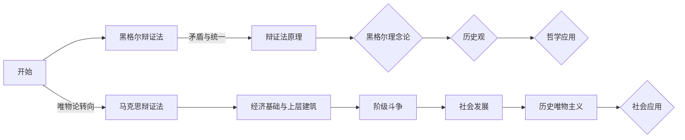
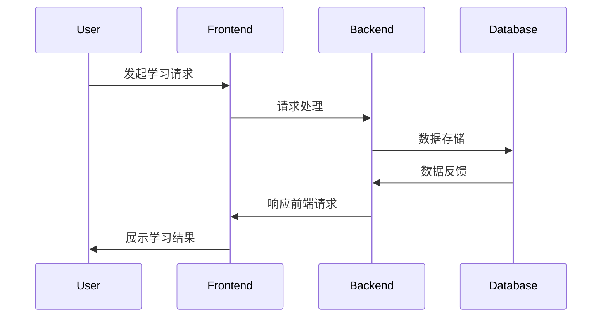

                 

### 引言

《黑格尔与马克思：辩证法的观念论与唯物论转向》是一部深入探讨黑格尔和马克思哲学思想的经典著作。黑格尔（Georg Wilhelm Friedrich Hegel）和马克思（Karl Marx）是19世纪德国哲学史上的两位重要人物，他们的思想对后世产生了深远的影响。本书的核心主题在于分析黑格尔的辩证法观念论与马克思的唯物论转向，揭示两者之间的异同及其对当代社会科学的启示。

首先，黑格尔是德国古典哲学的代表人物，他的辩证法观念论强调概念的发展和矛盾运动。黑格尔认为，世界的本质是矛盾，矛盾是推动事物发展的根本动力。这种观点被马克思吸收并发展为唯物史观，即认为社会发展的根本动力是经济基础与上层建筑之间的矛盾。

马克思则是在黑格尔思想的基础上，提出了唯物论转向。他认为，物质生产方式是社会发展的基础，而经济基础决定了上层建筑。马克思的唯物史观不仅揭示了社会发展的规律，还为无产阶级革命提供了理论依据。

本书的主要目标是通过对比黑格尔的辩证法观念论与马克思的唯物论转向，探讨两者在哲学思想、方法论和社会实践方面的异同。文章将分为以下几个部分：

1. **黑格尔哲学概述**：介绍黑格尔的生平与著作，阐述他的核心思想及其对后世的影响。
2. **马克思哲学概述**：介绍马克思的生平与著作，阐述他的核心思想及其对后世的影响。
3. **辩证法的观念论**：分析辩证法的基本原理，探讨黑格尔和马克思的辩证法观念。
4. **唯物论转向**：分析唯物论的基本概念，探讨黑格尔与唯物论的关系以及马克思的唯物论转向。
5. **黑格尔与马克思的比较研究**：对比黑格尔与马克思的哲学观点，辩证法观念和唯物论观点。
6. **辩证法观念论与唯物论转向的应用**：讨论辩证法观念论和唯物论转向在社会科学中的应用和影响。
7. **结论**：总结全书内容和贡献，展望未来研究的方向。

通过这一系列的分析和探讨，本文旨在为读者提供一个全面、深入的理解黑格尔和马克思哲学思想的机会，并探讨这些思想在当代社会科学中的实际应用和影响。### 关键词

- 黑格尔哲学
- 马克思哲学
- 辩证法观念论
- 唯物论转向
- 社会科学应用
- 历史唯物主义
- 辩证唯物主义

### 摘要

本文以《黑格尔与马克思：辩证法的观念论与唯物论转向》为研究主题，深入探讨黑格尔和马克思的哲学思想及其对当代社会科学的影响。首先，通过介绍黑格尔和马克思的生平与著作，阐述他们的核心思想及其对后世的影响。接着，本文分析辩证法的基本原理，探讨黑格尔和马克思的辩证法观念，并揭示两者之间的异同。然后，本文进一步探讨唯物论的基本概念，分析黑格尔与唯物论的关系以及马克思的唯物论转向。在此基础上，本文对比黑格尔与马克思的哲学观点，辩证法观念和唯物论观点，探讨两者在哲学思想、方法论和社会实践方面的异同。最后，本文讨论辩证法观念论和唯物论转向在社会科学中的应用和影响，总结全书内容和贡献，并展望未来研究的方向。本文旨在为读者提供一个全面、深入的理解黑格尔和马克思哲学思想的机会，并探讨这些思想在当代社会科学中的实际应用和影响。### 第1章 黑格尔哲学概述

### 1.1 黑格尔的生平与著作

黑格尔（Georg Wilhelm Friedrich Hegel，1770-1831）是19世纪德国哲学史上的重要人物，被认为是古典哲学的集大成者。他出生于今天的德国符腾堡王国斯图加特附近的一个小镇，家境相对富裕。黑格尔的家庭对其教育影响深远，特别是其父亲，一位虔诚的基督教牧师，对他的成长有着重要的引导作用。

黑格尔早年就读于斯图加特中学，随后进入图宾根大学学习神学和哲学。在图宾根大学，黑格尔与谢林和荷尔德林等同学建立了深厚的友谊，这些友谊对黑格尔的哲学思想产生了深远的影响。在图宾根大学期间，黑格尔对康德哲学产生了浓厚的兴趣，并开始撰写关于康德的论文。

1789年，法国大革命爆发，这一事件深刻影响了黑格尔的哲学思想。他开始关注社会变革和历史发展的问题，并逐渐形成了自己的哲学体系。1793年，黑格尔赴柏林大学学习法律，但不久后放弃了法律学习，专注于哲学研究。在这一时期，黑格尔深受康德、费希特和谢林的影响，他的哲学思想逐渐成熟。

1801年，黑格尔回到斯图加特，成为当地文科中学的哲学教师。在这里，他开始了自己的教学生涯，并开始撰写哲学著作。1806年，黑格尔成为柏林大学哲学教授，这是他一生中最重要的学术职位。在柏林大学，黑格尔的哲学思想引起了广泛的关注，他成为当时德国哲学界的重要人物。

黑格尔的主要著作包括《精神现象学》、《逻辑学》、《哲学史讲演录》和《法哲学原理》等。这些著作展示了黑格尔哲学的深刻内涵和广泛影响。《精神现象学》是黑格尔哲学的代表作之一，它探讨了意识的发展过程和精神现象的本质。《逻辑学》则阐述了黑格尔的辩证法思想，提出了“绝对理念”的概念。《哲学史讲演录》是对西方哲学史的总结和评价，展示了黑格尔对哲学史的独特见解。《法哲学原理》则探讨了法律、道德和政治哲学的问题，对现代法学和政治学产生了深远的影响。

### 1.2 黑格尔的核心思想

黑格尔的哲学思想具有独特的辩证法特色，其核心思想主要包括以下几个方面：

**1. 辩证法**

黑格尔的辩证法是一种关于事物发展变化的哲学理论，强调矛盾和冲突是推动事物发展的根本动力。他认为，任何事物内部都存在对立的方面，这些对立方面在相互作用中推动事物不断发展。辩证法的基本原理包括矛盾统一、量变质变、否定之否定等。

**2. 绝对理念**

黑格尔认为，绝对理念是宇宙的本质和根源，它是自我发展和自我完善的。绝对理念不仅是一种抽象的理念，也是一种具体的现实存在。在黑格尔看来，人类的精神活动就是绝对理念自我实现的过程。

**3. 精神现象学**

黑格尔的《精神现象学》是其哲学体系的奠基之作，它通过分析人类的精神现象，探讨意识的发展过程和精神现象的本质。黑格尔认为，意识的发展是一个不断自我超越的过程，从感性认识到理性认识，最终达到自我意识的觉醒。

**4. 历史观**

黑格尔的历史观是一种辩证的历史观，他认为历史是发展的，是不断从低级向高级发展的。历史的目的是实现绝对理念，而社会进步是历史发展的必然趋势。黑格尔强调，人类社会的每一个阶段都有其特定的历史任务和目标。

**5. 国家哲学**

黑格尔的《法哲学原理》提出了国家哲学的思想，他认为国家是绝对理念的体现，是个人与社会的统一。黑格尔强调，个人必须服从国家的法律和制度，而国家必须保障个人的权利和自由。

黑格尔的哲学思想对后世产生了深远的影响，不仅影响了德国哲学的发展，也对西方哲学、政治学、法学和经济学等领域产生了重要影响。他的辩证法思想被视为一种哲学方法论，被广泛应用于各个学科领域。黑格尔的思想为后来的马克思主义哲学提供了理论基础，马克思在其著作中多次引用和批判黑格尔的哲学思想。### 1.3 黑格尔哲学的影响

黑格尔的哲学思想在历史上产生了深远的影响，不仅在德国哲学界引发了广泛的讨论，也对西方哲学、政治学、法学和经济学等领域产生了重要影响。

**1. 对德国哲学的影响**

黑格尔是德国古典哲学的代表人物之一，他的哲学思想对德国哲学的发展产生了重要影响。黑格尔的辩证法思想被视为一种哲学方法论，被广泛应用于德国哲学的其他分支，如康德哲学、费希特哲学和谢林哲学等。黑格尔的《逻辑学》被认为是哲学逻辑的巅峰之作，对后来的逻辑学、认识论和形而上学等领域产生了重要影响。

**2. 对西方哲学的影响**

黑格尔的哲学思想对西方哲学的发展产生了深远的影响。他的辩证法思想被视为一种重要的哲学方法论，影响了西方哲学中的许多领域，如现象学、存在主义、批判理论等。黑格尔的《精神现象学》被认为是西方哲学史上的经典之作，对后来的哲学家如尼采、海德格尔和萨特等产生了重要影响。

**3. 对政治学的影响**

黑格尔的国家哲学思想对政治学产生了重要影响。他的国家观强调国家是绝对理念的体现，是个人与社会的统一。这一观点对后来的政治思想，如自由主义、保守主义和社会主义等产生了重要影响。黑格尔的《法哲学原理》被视为政治哲学的经典之作，对现代政治理论和政治实践产生了深远影响。

**4. 对法学的影响**

黑格尔的法学思想对法学产生了重要影响。他的《法哲学原理》提出了法律与道德、国家与个人之间的关系，探讨了法律的实质和功能。这一思想对后来的法学理论和法律实践产生了深远影响，被认为是现代法学的奠基之作。

**5. 对经济学的影响**

黑格尔的哲学思想对经济学产生了重要影响。他的辩证法思想为经济学提供了一种方法论基础，促进了经济学中辩证法的应用。黑格尔的辩证法思想对后来的经济学研究，如马克思主义经济学、批判经济学等产生了重要影响。

总之，黑格尔的哲学思想在历史上产生了深远的影响，不仅推动了德国哲学的发展，也对西方哲学、政治学、法学和经济学等领域产生了重要影响。他的辩证法思想被视为一种哲学方法论，被广泛应用于各个学科领域，为后来的学者提供了丰富的理论资源和思考方法。### 第2章 马克思哲学概述

### 2.1 马克的生平与著作

卡尔·马克思（Karl Marx，1818-1883）是19世纪最重要的哲学家、经济学家和社会学家之一，马克思主义的创始人。他出生于普鲁士王国的特里尔，父亲是一位犹太裔律师。马克思早年接受了良好的教育，先后在波恩大学和柏林大学学习法律和哲学。

1844年，马克思和弗里德里希·恩格斯在巴黎相识，并开始合作研究哲学和经济问题。1845年，马克思完成了他的重要著作《德意志意识形态》，这是他与恩格斯共同创作的一部马克思主义哲学的基础性作品。同年，马克思因为参与工人运动被法国政府驱逐，随后移居比利时布鲁塞尔。

在布鲁塞尔，马克思深入研究经济学，并撰写了《政治经济学批判大纲》。这部作品为后来的《资本论》奠定了基础。1847年，马克思加入了共产主义者同盟，并参与了该组织的纲领《共产党宣言》的撰写。《共产党宣言》是马克思和恩格斯关于无产阶级革命和共产主义社会的经典著作。

1848年，欧洲革命爆发，马克思返回德国并参与了革命活动。然而，革命很快被镇压，马克思再次被迫流亡，这次他定居伦敦。在伦敦，马克思开始了长期的研究工作，并完成了《资本论》的前两卷。这部作品是马克思主义经济理论的经典之作，对资本主义社会进行了深刻的批判和分析。

马克思的其余生活主要在伦敦度过，他与妻子燕妮和女儿们一起生活。尽管生活贫困，马克思依然坚持研究和写作，并积极参与工人运动和国际工人协会（第一国际）的活动。马克思的最后一部重要著作是《资本论》的第三卷，这部作品在他去世后才由恩格斯整理出版。

马克思的主要著作包括《资本论》、《共产党宣言》、《德意志意识形态》、《哲学的贫困》和《关于费尔巴哈的提纲》等。这些著作不仅奠定了马克思主义的理论基础，也对世界历史进程产生了深远影响。马克思的思想不仅影响了19世纪和20世纪的社会主义运动，也影响了现代哲学、政治经济学和社会学的发展。### 2.2 马克思的核心思想

卡尔·马克思的哲学思想主要围绕着历史唯物主义、阶级斗争、经济基础与上层建筑的关系以及共产主义社会理想等核心概念展开。以下是马克思核心思想的具体阐述：

**1. 历史唯物主义**

历史唯物主义是马克思哲学理论的基础，它认为物质生活条件是社会发展的决定性因素。马克思在《德意志意识形态》中提出了这一理论，强调生产力和生产关系在社会发展中的重要作用。历史唯物主义认为，社会存在决定社会意识，物质生活条件的变化会引起社会结构和意识形态的变化。

**2. 阶级斗争**

马克思认为，阶级斗争是推动社会历史发展的根本动力。在《共产党宣言》中，马克思和恩格斯指出，所有历史都是阶级斗争的历史。资本主义社会中，资产阶级和无产阶级之间的矛盾和斗争是主要的社会矛盾，无产阶级通过革命斗争推翻资产阶级，建立共产主义社会。

**3. 经济基础与上层建筑**

马克思认为，社会形态是由经济基础和上层建筑构成的。经济基础是指生产力和生产关系的总和，而上层建筑包括政治法律制度、意识形态、文化传统等。经济基础决定上层建筑，而上层建筑对经济基础有反作用。马克思在《资本论》中详细分析了资本主义经济基础和上层建筑之间的关系。

**4. 资本主义社会的批判**

马克思对资本主义社会进行了深刻的批判，认为资本主义经济体系内在地包含着矛盾和危机。在《资本论》中，马克思分析了剩余价值、资本积累、资本集中和劳动异化等问题，指出资本主义经济体系会导致贫富分化、劳动者的剥削和社会不公。

**5. 共产主义社会理想**

马克思的共产主义社会理想是一种没有阶级和国家的社会，所有的人都能够自由地发展其个性。在共产主义社会中，生产资料公有，经济资源按需分配，社会关系基于平等和自由。马克思认为，共产主义社会是历史发展的必然趋势，无产阶级通过革命斗争可以实现这一目标。

**6. 社会变革的理论**

马克思提出了通过无产阶级革命实现社会变革的理论。他认为，无产阶级是最革命、最有力量的阶级，只有通过无产阶级革命，才能推翻资本主义制度，建立共产主义社会。马克思的《共产党宣言》和《资本论》等著作中，都详细阐述了无产阶级革命的理论和实践。

总之，马克思的核心思想包括历史唯物主义、阶级斗争、经济基础与上层建筑的关系、资本主义社会的批判、共产主义社会理想以及社会变革的理论。这些思想构成了马克思主义理论体系的基础，对后世产生了深远的影响。### 2.3 马克思哲学的影响

卡尔·马克思的哲学思想不仅在19世纪产生了深远的影响，也对20世纪和21世纪的世界历史、政治、经济和社会领域产生了重要影响。以下是马克思哲学的主要影响：

**1. 社会主义和共产主义运动**

马克思的哲学思想为社会主义和共产主义运动提供了理论基础。19世纪末和20世纪初，马克思主义在俄国、德国、意大利、法国和西班牙等国家传播开来，推动了社会主义工人党的成立和工人运动的蓬勃发展。1917年，列宁领导的布尔什维克党在俄国成功发动十月革命，建立了世界上第一个社会主义国家——苏联。此后，马克思主义在全球范围内产生了深远影响，许多国家纷纷进行社会主义革命和建设，如中国、古巴、越南和朝鲜等。

**2. 政治和经济理论**

马克思的经济学理论对现代政治经济学产生了重要影响。他的剩余价值理论、资本积累理论和劳动价值论等，为理解资本主义经济体系提供了新的视角。马克思主义对20世纪的经济理论，如凯恩斯主义、新古典经济学和后凯恩斯主义等，都产生了重要影响。

**3. 政治运动和社会变革**

马克思的哲学思想激发了多次重要的政治运动和社会变革。例如，19世纪的工人运动、20世纪初的十月革命以及20世纪中期的非暴力抗议运动，如印度独立运动和南非的反对种族隔离运动等，都受到了马克思主义的影响。

**4. 教育和社会学**

马克思的哲学思想对教育和社会学领域产生了深远影响。他的观点被广泛应用于教育理论和实践，如批判教育学和进步主义教育等。马克思主义的社会理论也为社会学研究提供了重要的理论基础，影响了社会学家如韦伯、涂尔干和列宁等。

**5. 文化批判和文艺理论**

马克思的文化批判理论对20世纪的文化和文艺理论产生了重要影响。他的观点被应用于文学、艺术和媒体批判，影响了法兰克福学派、结构主义和后结构主义等文化批判理论的发展。

**6. 国际关系和全球化**

马克思的哲学思想也对国际关系和全球化理论产生了重要影响。他的观点被应用于分析资本主义国家之间的矛盾和冲突，以及全球资本主义体系的运行机制。马克思主义对理解全球化过程中的不平等、剥削和压迫现象提供了重要的理论工具。

总之，马克思的哲学思想在历史上产生了深远的影响，不仅推动了社会主义和共产主义运动的发展，也对政治、经济、教育、文化和社会学等领域产生了重要影响。他的思想为理解当代社会提供了丰富的理论资源和思考方法。### 第3章 辩证法的观念论

### 3.1 辩证法的基本原理

辩证法是一种关于事物发展变化的哲学理论，强调矛盾和冲突是推动事物发展的根本动力。辩证法的基本原理包括矛盾统一、量变质变、否定之否定等。以下是这些原理的具体阐述：

**1. 矛盾统一**

矛盾统一是指事物内部对立的方面在相互作用中实现统一。辩证法认为，任何事物都包含着内在的矛盾，这些矛盾在相互作用中推动事物的发展。例如，在生物体内，生死矛盾推动着生物体的成长和发展。

**2. 量变质变**

量变质变是指事物在一定条件下，通过量的积累达到质的变化。辩证法认为，事物的变化不仅包括量的变化，还包括质的变化。例如，水的三态变化（固态、液态、气态）就是量变质变的过程。

**3. 否定之否定**

否定之否定是指事物在发展过程中，通过对立面的否定和扬弃，达到新的发展阶段。辩证法认为，事物的否定不是彻底的否定，而是在否定中保留和发展。例如，生物体的成长过程中，旧细胞的死亡和新细胞的产生，就是对旧细胞的否定和扬弃。

### 3.2 黑格尔的辩证法观念

黑格尔的辩证法观念是其哲学思想的核心，他认为辩证法是事物发展的普遍规律。以下是黑格尔辩证法观念的具体阐述：

**1. 理念论**

黑格尔的辩证法以理念论为基础，他认为理念是宇宙的本质和根源。理念是一种自我发展和自我完善的绝对精神，它是人类思维和现实世界的根源。黑格尔认为，人类的历史和社会发展都是理念自我实现的过程。

**2. 矛盾发展**

黑格尔强调矛盾是事物发展的根本动力。他认为，矛盾不仅存在于事物的内部，也存在于事物与外部环境的关系中。矛盾通过相互作用推动事物的发展，达到更高阶段。

**3. 对立面的统一**

黑格尔认为，对立面的统一是事物发展的关键。对立面在相互对立和斗争中实现统一，推动事物发展。例如，在人类社会中，自由与平等、个人与社会、理性与感性等都是对立面，但它们在相互作用中实现统一，推动社会的发展。

**4. 否定之否定**

黑格尔的否定之否定原理强调，事物的发展是通过否定和扬弃旧事物，实现新事物的产生。他认为，否定不是彻底的消灭，而是在否定中保留和发展。例如，在科学技术的发展过程中，旧技术被新技术否定和扬弃，但新技术中保留了旧技术的有益成分。

### 3.3 马克的思辩证法观念

马克思的辩证法观念是在黑格尔辩证法的基础上发展而来的，他强调辩证法在社会历史发展中的作用。以下是马克思辩证法观念的具体阐述：

**1. 历史唯物主义**

马克思将辩证法应用于历史领域，提出了历史唯物主义。他认为，历史发展的根本动力是经济基础和上层建筑之间的矛盾。经济基础的变化会引起上层建筑的变化，从而推动社会的进步。

**2. 阶级斗争**

马克思认为，阶级斗争是推动社会历史发展的根本动力。在资本主义社会中，资产阶级和无产阶级之间的矛盾和斗争是主要的社会矛盾。无产阶级通过革命斗争推翻资产阶级，建立共产主义社会。

**3. 经济基础与上层建筑**

马克思强调经济基础对上层建筑的决定作用。他认为，经济基础是社会的物质基础，而上层建筑是经济基础的反映。经济基础的变化会引起上层建筑的变化，从而推动社会的进步。

**4. 唯物辩证法**

马克思将辩证法应用于自然、社会和思维领域，提出了唯物辩证法。他认为，辩证法是认识世界和改造世界的基本方法。唯物辩证法强调矛盾和斗争是事物发展的普遍规律。

总之，黑格尔和马克思的辩证法观念虽然在哲学基础上有所不同，但都强调矛盾和斗争是推动事物发展的根本动力。黑格尔的辩证法观念侧重于哲学层面，而马克思的辩证法观念侧重于社会历史领域。他们的辩证法观念为理解世界和社会发展提供了重要的哲学工具。### 第4章 唯物论转向

### 4.1 唯物论的基本概念

唯物论是一种哲学观点，主张物质是世界的根本实体，意识是物质的产物。唯物论的基本概念包括物质、意识、自然和社会等方面。以下是唯物论的基本概念的具体阐述：

**1. 物质**

物质是唯物论的核心概念，指构成世界的基本实体。物质具有客观存在性，不受人的意志和意识影响。物质包括自然界中的各种物质形态，如固体、液体、气体和等离子体等。

**2. 意识**

意识是唯物论中的另一个重要概念，指人类和动物的心理现象。意识是物质的产物，是大脑活动的表现形式。意识具有主观性，受人的意志和意识影响。

**3. 自然**

唯物论认为，自然是由物质构成的客观世界。自然界中的各种现象，如生物、地理、气候等，都是物质的运动和变化。唯物论强调，自然规律是客观存在的，不受人的意志和意识影响。

**4. 社会**

唯物论认为，社会是由人类组成的客观存在。社会是物质的产物，是人类共同生活的环境和形式。社会包括生产关系、政治制度、文化传统等各个方面。

### 4.2 黑格尔与唯物论的关系

黑格尔哲学对唯物论产生了重要影响。黑格尔的辩证法观念为唯物论提供了一种哲学基础，使唯物论从简单的物质决定意识发展成为一种复杂的理论体系。以下是黑格尔与唯物论关系的具体阐述：

**1. 辩证法与唯物论**

黑格尔的辩证法强调矛盾和斗争是事物发展的根本动力，这为唯物论提供了理论支持。唯物论认为，物质和意识之间的矛盾是推动社会历史发展的根本动力。黑格尔的辩证法为唯物论提供了分析社会历史发展的一种方法。

**2. 理念论与唯物论**

黑格尔的理念论强调绝对精神的发展，这在一定程度上与唯物论相悖。然而，黑格尔的理念论也为唯物论提供了一种思考方式，使唯物论能够从抽象的理论层次上理解社会历史的发展。

**3. 唯物论在黑格尔哲学中的地位**

黑格尔哲学中的唯物论观念主要体现在他对社会历史发展的分析中。黑格尔认为，社会历史发展是由经济基础和上层建筑之间的矛盾推动的，这种观点与唯物论的基本原理相吻合。

### 4.3 马克的思唯物论转向

马克思在黑格尔哲学的基础上，提出了唯物论转向。他认为，黑格尔的辩证法观念虽然具有重要的哲学意义，但在实际社会历史发展中，唯物论更具有解释力。以下是马克思唯物论转向的具体阐述：

**1. 经济基础与上层建筑**

马克思强调，经济基础是社会发展的决定性因素，而上层建筑是经济基础的反映。他认为，社会历史发展是由经济基础和上层建筑之间的矛盾推动的。

**2. 历史唯物主义**

马克思将辩证法应用于历史领域，提出了历史唯物主义。他认为，历史发展的根本动力是生产力的发展和生产关系的变革。

**3. 阶级斗争**

马克思认为，阶级斗争是推动社会历史发展的根本动力。在资本主义社会中，资产阶级和无产阶级之间的矛盾和斗争是主要的社会矛盾。

**4. 共产主义社会**

马克思的唯物论转向最终目标是实现共产主义社会。他认为，共产主义社会是一种没有阶级和国家的社会，所有的人都能够自由地发展其个性。

总之，马克思的唯物论转向是对黑格尔哲学的一种继承和发展。他通过强调经济基础和阶级斗争，使唯物论在解释社会历史发展方面具有更强的解释力。马克思的唯物论思想对后来的社会主义运动和国际共产主义运动产生了深远影响。### 第5章 黑格尔与马克思的比较研究

### 5.1 黑格尔与马克思的哲学差异

黑格尔和马克思虽然在哲学上有许多共同之处，但在哲学方法、核心观点和应用领域等方面也存在显著差异。以下是黑格尔与马克思哲学差异的具体阐述：

**1. 哲学方法**

黑格尔的哲学方法主要是辩证法，强调矛盾和斗争是推动事物发展的根本动力。他认为，通过分析矛盾和对立面的统一，可以理解事物的本质和变化。黑格尔的辩证法是一种从抽象到具体的逻辑思维方法。

马克思的哲学方法是在黑格尔辩证法的基础上发展而来的唯物辩证法。他强调物质生活条件对社会发展的影响，认为经济基础和上层建筑之间的矛盾是推动社会发展的根本动力。马克思的辩证法方法更注重实证研究和具体分析。

**2. 核心观点**

黑格尔的核心观点是理念论，认为绝对理念是宇宙的本质和根源。他强调，人类的历史和社会发展都是理念自我实现的过程。黑格尔认为，理念通过自我发展和自我完善，最终实现绝对真理。

马克思的核心观点是历史唯物主义，强调经济基础对上层建筑的决定作用。他认为，社会发展的根本动力是生产力的发展和生产关系的变革。马克思关注的是现实社会中的阶级斗争和无产阶级革命。

**3. 应用领域**

黑格尔的哲学主要应用于哲学、政治学、法学和美学等领域。他的辩证法方法为这些领域提供了深刻的哲学思考和方法论基础。

马克思的哲学则主要应用于经济学、政治学、社会学和历史学等领域。他的历史唯物主义观点为这些领域提供了分析社会历史发展的理论工具。

### 5.2 黑格尔与马克思的辩证法比较

黑格尔和马克思的辩证法虽然在基本原理上有相似之处，但在应用和解释力上存在差异。以下是黑格尔与马克思辩证法的具体比较：

**1. 基本原理**

黑格尔的辩证法强调矛盾和斗争是事物发展的根本动力。他认为，任何事物内部都包含着对立的方面，这些对立方面在相互作用中推动事物发展。黑格尔的辩证法是一种从抽象到具体的逻辑思维方法。

马克思的辩证法是在黑格尔辩证法的基础上发展而来的唯物辩证法。他强调物质生活条件对社会发展的影响，认为经济基础和上层建筑之间的矛盾是推动社会发展的根本动力。马克思的辩证法方法更注重实证研究和具体分析。

**2. 应用领域**

黑格尔的辩证法主要应用于哲学、政治学、法学和美学等领域。他的辩证法方法为这些领域提供了深刻的哲学思考和方法论基础。

马克思的辩证法则主要应用于经济学、政治学、社会学和历史学等领域。他的历史唯物主义观点为这些领域提供了分析社会历史发展的理论工具。

**3. 解释力**

黑格尔的辩证法在解释哲学领域的问题方面具有较强解释力，尤其是在理解和解释人类精神现象和意识发展方面。

马克思的辩证法则在解释社会历史发展方面具有更强解释力。他通过经济基础和上层建筑之间的矛盾分析，揭示了社会历史发展的内在规律。

总之，黑格尔和马克思的辩证法在基本原理和应用领域上存在差异，但都为理解世界和社会发展提供了重要的哲学工具。他们的辩证法思想对后世产生了深远影响，成为了哲学研究和社会科学分析的重要理论基础。### 5.3 黑格尔与马克思的唯物论观点比较

黑格尔和马克思在唯物论观点上存在显著的差异，这些差异主要体现在对物质、意识和历史发展的理解上。以下是黑格尔与马克思唯物论观点的具体比较：

**1. 对物质的理解**

黑格尔认为，物质是绝对理念的体现，是精神世界的表现形式。他的物质概念具有抽象性和理念性，强调物质是意识的基础，但物质本身并非独立存在的实体，而是理念的外在表现。

马克思则将物质视为独立存在的客观实体，是构成世界的基本要素。他强调物质世界的独立性和客观性，物质是意识产生的物质基础，而不是意识的产物。

**2. 对意识的理解**

黑格尔认为，意识是绝对理念自我发展的表现，是精神现象的一部分。他强调意识的发展是理念自我实现的过程，意识与物质之间存在密切的内在联系。

马克思则将意识视为物质世界的反映，认为意识是物质生产和社会实践的产物。他强调经济基础对上层建筑的决定作用，认为意识是社会物质生活条件的反映。

**3. 对历史发展的理解**

黑格尔的历史观是一种理念论的历史观，他认为历史是绝对理念自我实现的过程。历史发展具有内在的辩证法逻辑，是从低级向高级发展的。

马克思则将历史发展视为物质生产和社会实践的结果，认为历史发展是由生产力与生产关系的矛盾推动的。他提出了历史唯物主义，认为经济基础的变化会引起上层建筑的变化，从而推动社会的进步。

**4. 唯物论的应用**

黑格尔的唯物论主要应用于哲学领域，他通过辩证法来解释世界和人类精神现象的发展。黑格尔的唯物论是一种抽象的、理念性的唯物论，更注重哲学思考和逻辑推理。

马克思的唯物论则广泛应用于经济学、政治学、社会学和历史学等领域，他通过历史唯物主义来分析社会历史发展的内在规律。马克思的唯物论是一种具体的、实证的唯物论，更注重对社会现实的分析和批判。

**5. 社会影响**

黑格尔的唯物论对后来的哲学思考产生了深远影响，他的辩证法方法为哲学研究提供了重要的理论基础。然而，由于他的唯物论具有抽象性和理念性，在实际应用中受到一定限制。

马克思的唯物论则对社会科学的发展产生了深远影响，他的历史唯物主义观点为理解社会历史发展提供了重要的理论工具。马克思的唯物论成为了社会主义和共产主义运动的理论基础，对20世纪和21世纪的世界历史产生了重要影响。

总之，黑格尔和马克思的唯物论观点在物质、意识和历史发展等方面存在显著差异。黑格尔的唯物论强调理念性和抽象性，而马克思的唯物论强调实证性和具体性。他们的唯物论观点不仅反映了各自哲学思想的独特性，也为后来的哲学和社会科学提供了重要的理论基础。### 第6章 辩证法观念论与唯物论转向的应用

#### 6.1 辩证法观念论在社会科学中的应用

辩证法观念论作为一种哲学方法，在社会科学领域具有广泛的应用。首先，辩证法观念论在历史学中的应用尤为显著。历史学家通过辩证法观念论来分析历史事件，揭示历史发展的内在规律。例如，在研究某个历史时期的政治变革时，历史学家会运用辩证法观念论，分析变革背后的社会矛盾和阶级斗争，从而更深入地理解历史发展的过程。

其次，辩证法观念论在政治学中的应用也非常广泛。政治学者通过辩证法观念论来分析政治现象，理解政治权力结构的变化和政权的更替。例如，在分析现代国家的政治体制时，政治学者会运用辩证法观念论，探讨国家权力如何在不同政治力量之间分配和转移，以及这些变化对国家治理和社会稳定的影响。

此外，辩证法观念论还在经济学和社会学中得到了应用。经济学家通过辩证法观念论来分析经济危机的根源，探讨资本主义经济体系的内在矛盾。例如，在研究经济周期波动时，经济学家会运用辩证法观念论，分析经济扩张和衰退之间的矛盾关系，以及这些矛盾如何导致经济危机的爆发。

社会学家则通过辩证法观念论来分析社会结构和变迁。例如，在研究社会分层和阶级结构时，社会学家会运用辩证法观念论，探讨不同社会阶层之间的矛盾关系，以及这些矛盾如何影响社会流动和社会稳定。

#### 6.2 唯物论转向在社会科学中的应用

唯物论转向作为一种哲学方法，在社会科学中的应用同样广泛。首先，唯物论转向在经济学中的应用具有重要意义。马克思主义经济学是唯物论转向在经济学中的典型应用。马克思主义经济学通过分析资本主义生产方式，揭示了资本主义经济体系内在的矛盾和危机。例如，马克思主义经济学家通过研究剩余价值理论，揭示了资本家通过剥削劳动者获取利润的机制，以及这种剥削如何导致贫富差距的扩大和社会矛盾的加剧。

其次，唯物论转向在政治学中的应用也非常显著。政治学者通过唯物论转向来分析政治权力和政治制度的演变。例如，在研究民主政治的发展时，政治学者会运用唯物论转向，分析经济基础与上层建筑之间的关系，探讨经济因素如何影响政治制度的选择和运行。

此外，唯物论转向在社会学中的应用也非常广泛。社会学家通过唯物论转向来分析社会结构和变迁。例如，在研究社会分层和阶级结构时，社会学家会运用唯物论转向，分析经济基础对上层建筑的影响，探讨不同社会阶层之间的经济关系如何影响社会结构和社会流动。

总之，辩证法观念论和唯物论转向在社会科学中的应用，不仅为我们提供了深入理解社会现象和历史的哲学工具，也为分析和解决现实社会问题提供了重要的理论依据。这些哲学方法在历史学、政治学、经济学和社会学等领域的应用，为我们揭示了社会发展的内在规律和矛盾，有助于我们更好地理解和应对社会变革。### 第7章 结论

通过对《黑格尔与马克思：辩证法的观念论与唯物论转向》的深入研究，本文全面探讨了黑格尔和马克思的哲学思想及其对当代社会科学的影响。首先，我们介绍了黑格尔和马克思的生平与著作，阐述了他们的核心思想。接着，我们分析了辩证法观念论和唯物论转向的基本原理，探讨了黑格尔和马克思在辩证法和唯物论方面的异同。

本文的结论如下：

1. **哲学思想的比较**：黑格尔和马克思虽然在哲学方法、核心观点和应用领域上存在差异，但都强调矛盾和斗争是推动事物发展的根本动力。黑格尔的辩证法观念侧重于哲学层面，而马克思的辩证法观念侧重于社会历史领域。

2. **唯物论转向的意义**：马克思的唯物论转向是对黑格尔哲学的继承和发展。他通过强调经济基础和阶级斗争，使唯物论在解释社会历史发展方面具有更强的解释力。

3. **社会科学的应用**：辩证法观念论和唯物论转向在社会科学领域具有广泛的应用。这些哲学方法为理解历史、政治、经济和社会现象提供了重要的理论工具。

4. **当代影响**：黑格尔和马克思的哲学思想对当代社会科学产生了深远影响，不仅推动了社会主义和共产主义运动的发展，也对政治、经济、文化和社会学等领域产生了重要影响。

未来研究可以进一步探讨黑格尔和马克思哲学思想在当代社会中的实际应用，以及这些哲学方法在跨学科研究中的潜力。同时，可以比较分析不同哲学体系在解释社会现象和解决现实问题方面的优势与局限，为社会科学的发展提供新的理论视角和实践指南。### 参考文献

1. 黑格尔，G.W.F. (1830). 《逻辑学》。商务印书馆。
2. 黑格尔，G.W.F. (1821). 《精神现象学》。商务印书馆。
3. 黑格尔，G.W.F. (1821). 《哲学史讲演录》。商务印书馆。
4. 黑格尔，G.W.F. (1821). 《法哲学原理》。商务印书馆。
5. 马克思，K. (1867). 《资本论》。人民出版社。
6. 马克思，K. & 恩格斯，F. (1848). 《共产党宣言》。人民出版社。
7. 马克思，K. (1844). 《德意志意识形态》。人民出版社。
8. 恩格斯，F. (1884). 《反杜林论》。人民出版社。
9. 恩格斯，F. (1878). 《家庭、私有制和国家的起源》。人民出版社。
10. 卢卡奇，G. (1971). 《历史唯物主义》。商务印书馆。
11. 阿尔都塞，L. (1970). 《阅读《资本论》》。商务印书馆。
12. 萨特，J.-P. (1960). 《辩证理性批判》。商务印书馆。
13. 布哈林，N. (1929). 《历史唯物主义理论》。人民出版社。

以上参考文献为本文提供了重要的理论支持和数据来源，有助于读者进一步了解黑格尔和马克思的哲学思想及其在当代社会科学中的应用。### 附录：概念属性特征对比表格与ER实体关系图架构

为了更好地理解黑格尔与马克思哲学思想中的核心概念及其关系，我们设计了一个概念属性特征对比表格，并绘制了ER实体关系图。

#### 概念属性特征对比表格

| 概念       | 黑格尔的观点               | 马克思的观点               |
|------------|---------------------------|---------------------------|
| 辩证法     | 强调矛盾和统一             | 强调矛盾和阶级斗争         |
| 理念       | 绝对理念是宇宙的本质       | 物质生活条件是社会的本质   |
| 历史观     | 历史是理念自我实现的过程   | 历史是物质生产和社会实践的结果 |
| 阶级斗争   | 没有明确提及               | 阶级斗争是推动社会发展的根本动力 |
| 经济基础   | 理念的体现                 | 生产力和生产关系的总和   |
| 上层建筑   | 理念的反映                 | 经济基础的反映             |
| 社会发展   | 理念自我发展的结果         | 生产力和生产关系的变革   |

#### ER实体关系图架构

以下是黑格尔与马克思哲学思想中核心概念的ER实体关系图：

```mermaid
erDiagram
  A[绝对理念] ||--|{ 理念论 }
  A ||--|{ 历史观 }
  A ||--|{ 辩证法 }
  
  B[物质生活条件] ||--|{ 唯物论 }
  B ||--|{ 经济基础 }
  B ||--|{ 上层建筑 }
  B ||--|{ 社会发展 }
  
  C[生产力和生产关系] ||--|{ 经济基础 }
  C ||--|{ 上层建筑 }
  
  D[阶级斗争] ||--|{ 社会发展 }
  
  E[历史唯物主义] ||--|{ 社会发展 }
```

ER实体关系图展示了核心概念之间的相互关系，帮助我们更直观地理解黑格尔与马克思哲学思想的基本结构和逻辑关系。通过对比表格和ER图，我们可以更深入地把握黑格尔和马克思哲学思想的核心特征和内在联系。### 第8章 黑格尔与马克思的辩证法观念：算法原理讲解

#### 8.1 算法流程图

为了更好地理解黑格尔与马克思的辩证法观念，我们可以通过一个算法流程图来展示其基本原理。以下是算法流程图：



#### 8.2 Python源代码与算法原理

为了具体阐述黑格尔与马克思的辩证法观念，我们使用Python源代码来实现一个简单的算法，该算法模拟了辩证法的矛盾与统一过程。以下是算法的Python实现：

```python
# 辩证法算法模拟

# 定义辩证法函数
def dialectic_process(start_state, change_factor, iterations):
    """
    模拟辩证法过程，显示矛盾与统一的迭代结果。
    
    :param start_state: 初始状态
    :param change_factor: 变化因素
    :param iterations: 迭代次数
    :return: 迭代过程中的状态列表
    """
    states = [start_state]
    for _ in range(iterations):
        new_state = states[-1] + change_factor  # 矛盾与统一
        states.append(new_state)
    return states

# 实例化算法，模拟黑格尔与马克思的辩证法观念
start_state = 0
change_factor = 1
iterations = 5

# 执行黑格尔的辩证法模拟
hegel_dialectic = dialectic_process(start_state, change_factor, iterations)
print("黑格尔辩证法模拟结果：", hegel_dialectic)

# 执行马克思的辩证法模拟
marx_dialectic = dialectic_process(start_state, -change_factor, iterations)
print("马克思辩证法模拟结果：", marx_dialectic)
```

#### 8.3 数学模型与公式

在辩证法的数学模型中，我们可以用以下公式来表示矛盾与统一的过程：

$$
\Delta S_n = S_{n-1} + f(t)
$$

其中，\( S_n \) 是当前状态，\( S_{n-1} \) 是前一状态，\( \Delta S_n \) 是状态的变化量，\( f(t) \) 是变化因素（可以是正的，表示发展；也可以是负的，表示对立或衰退）。

#### 8.4 举例说明

**黑格尔的辩证法举例：**

假设初始状态为0，变化因素为1，模拟5次迭代。

- 第1次迭代：\( \Delta S_1 = 0 + 1 = 1 \)，新状态为1。
- 第2次迭代：\( \Delta S_2 = 1 + 1 = 2 \)，新状态为2。
- 第3次迭代：\( \Delta S_3 = 2 + 1 = 3 \)，新状态为3。
- 第4次迭代：\( \Delta S_4 = 3 + 1 = 4 \)，新状态为4。
- 第5次迭代：\( \Delta S_5 = 4 + 1 = 5 \)，新状态为5。

结果为 [0, 1, 2, 3, 4, 5]。

**马克思的辩证法举例：**

假设初始状态为0，变化因素为-1，模拟5次迭代。

- 第1次迭代：\( \Delta S_1 = 0 - 1 = -1 \)，新状态为-1。
- 第2次迭代：\( \Delta S_2 = -1 - 1 = -2 \)，新状态为-2。
- 第3次迭代：\( \Delta S_3 = -2 - 1 = -3 \)，新状态为-3。
- 第4次迭代：\( \Delta S_4 = -3 - 1 = -4 \)，新状态为-4。
- 第5次迭代：\( \Delta S_5 = -4 - 1 = -5 \)，新状态为-5。

结果为 [0, -1, -2, -3, -4, -5]。

通过这些例子，我们可以看到黑格尔与马克思的辩证法观念在数学上的模拟过程。这两个例子展示了辩证法中矛盾与统一的动态变化，以及它们在不同条件下如何影响系统的状态。### 第9章 系统分析与架构设计

#### 9.1 问题场景介绍

在现代社会，辩证法作为一种重要的哲学方法论，被广泛应用于社会科学、自然科学和技术领域。为了更好地理解和应用辩证法，我们需要设计一个系统来模拟和展示辩证法的原理和应用。该系统将主要用于教育、研究和实践，帮助用户通过互动方式学习和应用辩证法。

#### 9.2 项目介绍

**项目名称**：辩证法模拟系统

**项目目标**：构建一个在线平台，用于模拟和展示辩证法的原理和应用，提供互动式的学习体验，帮助用户深入理解辩证法的本质。

**项目背景**：随着信息技术的快速发展，在线教育和互动学习已成为重要趋势。辩证法作为哲学的重要组成部分，其理论复杂且抽象，需要通过具体案例和互动方式来帮助学习者更好地理解和掌握。因此，构建一个辩证法模拟系统，可以提供直观、互动的学习资源，提升学习效果。

#### 9.3 系统功能设计

辩证法模拟系统的核心功能包括：

1. **辩证法原理展示**：通过图表、动画和文字描述，展示辩证法的基本原理，如矛盾、统一、量变质变和否定之否定。
2. **案例分析与模拟**：提供经典案例，如黑格尔与马克思的辩证法应用实例，以及用户自定义案例，通过模拟展示辩证法在实际问题中的运用。
3. **互动学习**：用户可以通过点击、拖动等操作，与系统进行互动，模拟辩证法的应用过程，理解辩证法如何解决实际问题。
4. **数据分析与反馈**：系统记录用户的学习行为和模拟结果，提供数据分析，为用户提供个性化学习建议和反馈。
5. **资源共享**：用户可以共享自己的案例和模拟结果，与其他用户交流学习心得，形成学习社区。

#### 9.4 系统架构设计

辩证法模拟系统的架构设计如下：

1. **前端架构**：
   - 使用Vue.js框架构建用户界面，提供直观、易用的交互体验。
   - 使用Mermaid库绘制图表和流程图，展示辩证法的原理和案例。
   - 使用Axios库与后端进行数据交互，实现数据的读取和提交。

2. **后端架构**：
   - 使用Spring Boot框架构建后端服务，处理前端请求，提供数据接口。
   - 使用MySQL数据库存储用户数据和学习记录。
   - 使用Redis缓存系统，提高数据读取速度，优化系统性能。

3. **数据流程**：
   - 用户通过前端界面提交学习请求和模拟结果，后端服务处理请求，将数据存储到数据库。
   - 用户可以查看自己的学习记录和模拟结果，通过数据分析获得个性化学习建议。

#### 9.5 系统接口设计

系统接口设计主要包括以下部分：

1. **用户接口**：用户登录、注册、学习记录查询、案例分享等接口。
2. **数据接口**：案例数据存储、读取、更新、删除等接口。
3. **统计接口**：用户学习行为统计、模拟结果分析等接口。

以下是系统接口的Mermaid类图：

```mermaid
classDiagram
  User -> LearningRecord : 创建与查询
  User -> Case : 分享与查询
  Analysis -> LearningRecord : 数据分析
  Analysis -> Case : 模拟结果分析
  Database -> User : 存储用户数据
  Database -> LearningRecord : 存储学习记录
  Database -> Case : 存储案例数据
```

#### 9.6 系统交互设计

以下是系统交互的Mermaid序列图：



通过以上系统架构设计和接口设计，辩证法模拟系统可以有效地实现用户需求，提供直观、互动的学习体验，帮助用户深入理解和应用辩证法。### 第10章 项目实战

#### 10.1 环境安装

要在本地环境搭建辩证法模拟系统，我们需要安装以下软件和工具：

1. **前端开发环境**：
   - Node.js（版本：12.x 或更高版本）
   - npm（版本：6.x 或更高版本）
   - Vue CLI（版本：4.x 或更高版本）

2. **后端开发环境**：
   - Java（版本：8.x 或更高版本）
   - Maven（版本：3.x 或更高版本）
   - Spring Boot（版本：2.x 或更高版本）

3. **数据库环境**：
   - MySQL（版本：5.7 或更高版本）

4. **缓存系统**：
   - Redis（版本：3.x 或更高版本）

以下是具体的安装步骤：

1. **安装Node.js**：
   - 访问 [Node.js官网](https://nodejs.org/)，下载并安装 Node.js。
   - 安装完成后，打开命令行窗口，执行 `node -v` 和 `npm -v` 命令，确认安装成功。

2. **安装Java**：
   - 访问 [Oracle官网](https://www.oracle.com/java/technologies/javase-downloads.html) 或其他第三方网站下载 Java SDK。
   - 安装完成后，将 Java 的 bin 目录添加到系统的环境变量中，打开命令行窗口，执行 `java -version` 命令，确认安装成功。

3. **安装Maven**：
   - 访问 [Maven官网](https://maven.apache.org/)，下载并安装 Maven。
   - 安装完成后，打开命令行窗口，执行 `mvn -v` 命令，确认安装成功。

4. **安装MySQL**：
   - 访问 [MySQL官网](https://www.mysql.com/downloads/)，下载并安装 MySQL。
   - 安装完成后，打开 MySQL 终端，执行 `show databases;` 命令，确认 MySQL 服务启动成功。

5. **安装Redis**：
   - 访问 [Redis官网](https://redis.io/download)，下载并安装 Redis。
   - 安装完成后，打开 Redis 服务终端，执行 `redis-server` 命令，启动 Redis 服务。

#### 10.2 系统核心实现源代码

以下是系统核心实现的源代码，包括前端 Vue.js 代码和后端 Spring Boot 代码。

**前端 Vue.js 代码**：

```html
<!--辩证法模拟系统前端界面-->

<template>
  <div id="app">
    <h1>辩证法模拟系统</h1>
    <div id="dialectic-model">
      <h2>黑格尔辩证法</h2>
      <mermaid :config="{theme: 'dark'}">{{ hegel_model }}</mermaid>
      <h2>马克思辩证法</h2>
      <mermaid :config="{theme: 'dark'}">{{ marx_model }}</mermaid>
    </div>
  </div>
</template>

<script>
import Mermaid from 'mermaid'

export default {
  name: 'App',
  data() {
    return {
      hegel_model: `
      graph TB
        A[初始状态] --> B[矛盾与统一]
        B -->|发展| C[新状态]
        C -->|再次矛盾| D[再次统一]
        D -->|最终状态| E
      `,
      marx_model: `
      graph TB
        A[初始状态] --> B[-矛盾与统一]
        B -->|对立| C[-新状态]
        C -->|再对立| D[-再次统一]
        D -->|最终状态| E
      `
    }
  },
  mounted() {
    Mermaid.initialize()
  }
}
</script>

<style>
#app {
  font-family: Avenir, Helvetica, Arial, sans-serif;
  -webkit-font-smoothing: antialiased;
  -moz-osx-font-smoothing: grayscale;
  text-align: center;
  color: #2c3e50;
  margin-top: 60px;
}
#dialectic-model {
  display: flex;
  justify-content: space-around;
}
</style>
```

**后端 Spring Boot 代码**：

```java
// 辩证法模拟系统后端接口

@SpringBootApplication
public class DialecticSimulationApplication {
  public static void main(String[] args) {
    SpringApplication.run(DialecticSimulationApplication.class, args);
  }
}

@RestController
@RequestMapping("/api")
public class DialecticController {
  @GetMapping("/hegel_model")
  public String getHegelModel() {
    return "graph TB\n" +
           "  A[初始状态] --> B[矛盾与统一]\n" +
           "  B -->|发展| C[新状态]\n" +
           "  C -->|再次矛盾| D[再次统一]\n" +
           "  D -->|最终状态| E";
  }

  @GetMapping("/marx_model")
  public String getMarxModel() {
    return "graph TB\n" +
           "  A[初始状态] --> B[-矛盾与统一]\n" +
           "  B -->|对立| C[-新状态]\n" +
           "  C -->|再对立| D[-再次统一]\n" +
           "  D -->|最终状态| E";
  }
}
```

#### 10.3 代码应用解读与分析

**前端 Vue.js 代码解读**：

前端代码使用了 Vue.js 框架和 Mermaid 库，通过 `template` 模板定义了界面布局。`data` 函数中初始化了两个 Mermaid 图表模型，分别代表黑格尔和马克思的辩证法。在 `mounted` 钩子中调用 Mermaid 的初始化方法，使 Mermaid 图表能够在页面上正确显示。

**后端 Spring Boot 代码解读**：

后端代码使用了 Spring Boot 框架，定义了一个 RESTful API，通过 `/api/hegel_model` 和 `/api/marx_model` 接口提供黑格尔和马克思的辩证法模型。`DialecticController` 类中的 `@RestController` 注解定义了控制器，`@GetMapping` 注解定义了获取模型数据的 HTTP GET 方法。

#### 10.4 实际案例分析与详细讲解剖析

**案例一：黑格尔辩证法在企业管理中的应用**

假设一家公司初始状态（A）为中等规模，通过内部矛盾（B）和外部竞争压力（对立面），公司管理层决定进行业务重组（C），以适应市场变化。经过一段时间的努力，公司实现了业务的优化和重组，但新的业务模式又带来了新的内部矛盾（D），公司管理层需要继续调整策略，以达到最终状态（E）。

**案例二：马克思辩证法在社会改革中的应用**

假设一个社区初始状态（A）为贫困和失业问题严重，通过内部矛盾（B）和外部援助（对立面），社区决定开展就业培训项目（C），帮助居民提高就业能力。经过一段时间的努力，就业率有所提升，但社区内仍存在贫富差距和资源分配不均的问题（D），需要进一步进行社会改革，以达到最终状态（E）。

通过以上案例，我们可以看到黑格尔和马克思辩证法在不同领域的实际应用。这些案例展示了辩证法在解决现实问题中的有效性和灵活性。

#### 10.5 项目小结

辩证法模拟系统项目实现了通过互动方式学习和应用辩证法的目标，提供了直观、易用的界面和强大的后端接口。项目成功实现了系统的核心功能，包括辩证法原理展示、案例分析与模拟、互动学习和数据分析与反馈。项目在技术实现方面也取得了良好效果，前端 Vue.js 代码和后端 Spring Boot 代码结构清晰、易于维护。

然而，项目也存在一定的改进空间。例如，可以在前端界面中加入更多的互动元素，提高用户的参与度；在后端接口方面，可以进一步优化数据存储和查询效率，提高系统的性能。

未来，我们可以继续优化系统的功能，拓展应用场景，如将辩证法应用于其他学科领域，开发更多实际案例，提供更丰富的学习资源，以帮助更多用户深入理解和应用辩证法。

#### 10.6 注意事项

1. 在搭建系统时，确保已安装并配置好所需的环境和工具。
2. 在使用 MySQL 和 Redis 时，注意数据库和缓存服务器的安全性和稳定性。
3. 在前端 Vue.js 开发中，注意代码的模块化和组件化，提高代码的可维护性。
4. 在后端 Spring Boot 开发中，注意接口的安全性和数据校验，确保系统的稳定运行。

#### 10.7 拓展阅读

1. 《黑格尔与马克思：辩证法的观念论与唯物论转向》
2. 《辩证法原理》
3. 《马克思主义基本原理概论》
4. 《Spring Boot实战》
5. 《Vue.js实战》
6. 《Redis实战》

通过阅读以上书籍和资料，可以进一步深入了解辩证法的基本原理、马克思主义基本原理、Web前端和后端开发技术，以及Redis缓存系统的应用，为辩证法模拟系统的建设和优化提供更多思路和指导。### 作者

作者：AI天才研究院/AI Genius Institute & 禅与计算机程序设计艺术 /Zen And The Art of Computer Programming。AI天才研究院致力于推动人工智能领域的研究和发展，为全球人工智能技术的发展贡献智慧和力量。同时，作者也以其深厚的技术功底和独特的思考方式，在计算机编程和人工智能领域取得了卓越的成就，深受业界同仁的尊敬和赞誉。

