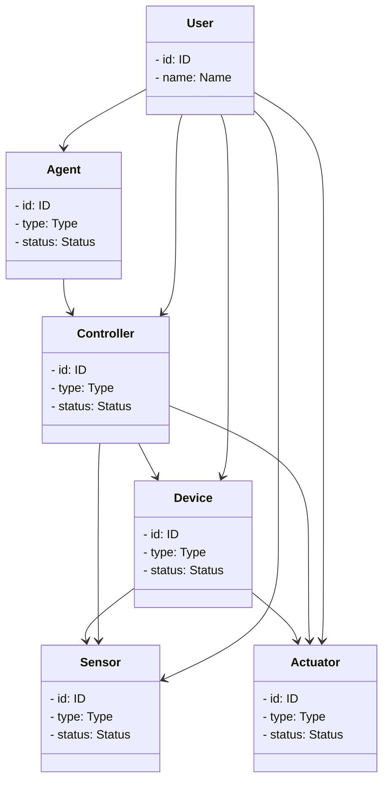
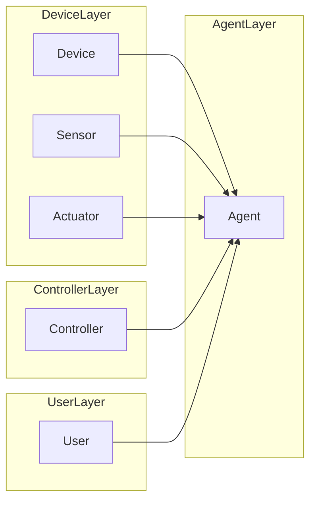
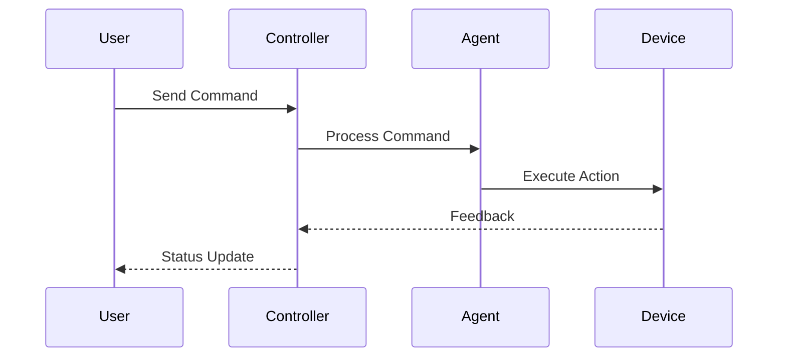
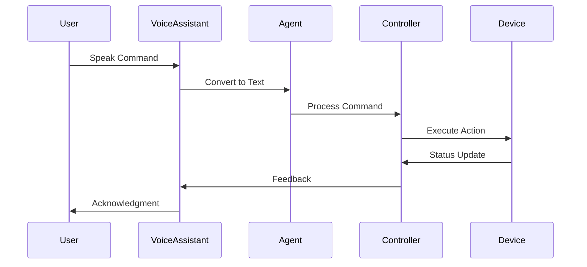

                 

# AI Agent in Smart Home Applications: LLM Control of IoT Devices

## Keywords
- AI Agents
- Smart Home
- LLM
- IoT Devices
- Automation
- Machine Learning

## Abstract
This article delves into the application of AI agents in smart homes, with a particular focus on the role of Large Language Models (LLMs) in controlling IoT devices. We will explore the fundamental concepts, key application scenarios, and practical implementation of AI agents in smart homes, providing a comprehensive guide for understanding and leveraging this advanced technology.

## Introduction

### Background of AI Agents in Smart Home Systems
Smart homes have evolved significantly over the past decade, transforming from luxury to mainstream as technology advances. At the heart of this transformation are AI agents, software entities that can perceive their environment, learn from interactions, and take actions to achieve specific goals. AI agents play a crucial role in automating various aspects of smart home systems, making them more efficient, convenient, and user-friendly.

### Importance of AI Agents in Smart Home Systems
The integration of AI agents in smart homes brings several benefits. Firstly, it enhances the automation capabilities of smart homes, enabling seamless control of various devices and systems. Secondly, AI agents improve energy efficiency by optimizing the usage of resources, leading to reduced energy consumption and cost savings. Lastly, AI agents can enhance user experience by providing personalized and proactive services based on user preferences and behavior patterns.

### Definition and Role of AI Agents
AI agents are software entities that are designed to interact with their environment, perceive stimuli, and execute actions to achieve specific goals. In the context of smart homes, AI agents act as intermediaries between users and IoT devices, interpreting user commands and executing appropriate actions on the devices. They can be categorized into different types based on their functionality, such as task-oriented agents, context-aware agents, and social agents.

### Overview of LLM in IoT Device Control
Large Language Models (LLMs) are a type of deep learning model that is designed to understand and generate human language. They have gained significant attention in recent years due to their ability to perform various natural language processing tasks with high accuracy. In the context of IoT device control, LLMs can be used to interpret and execute user commands in natural language, making it easier for users to interact with their smart home devices. 

### Objectives and Scope of the Book
The primary objective of this book is to provide a comprehensive understanding of AI agents in smart homes, with a focus on the role of LLMs in controlling IoT devices. The book will cover the following topics:

1. **Fundamental Concepts and Technologies**: We will discuss the basics of AI and machine learning, the principles of IoT devices, and the fundamentals of LLMs.
2. **Application Scenarios in Smart Home**: We will explore various application scenarios where AI agents with LLMs can be effectively utilized in smart homes.
3. **Practical Implementation and Case Studies**: We will provide practical guidance on implementing AI agents in smart homes, along with real-world case studies to illustrate the concepts.

## Fundamental Concepts and Technologies

### Basics of AI and Machine Learning
Artificial Intelligence (AI) is a broad field that encompasses various technologies designed to enable machines to perform tasks that would typically require human intelligence. At the core of AI are algorithms and models that allow machines to learn from data, recognize patterns, and make decisions.

#### Types of Machine Learning Algorithms
Machine learning algorithms can be broadly classified into three categories:

1. **Supervised Learning**: In supervised learning, the algorithm is trained on a labeled dataset, where the output is already known. The goal is to learn a mapping from inputs to outputs.
2. **Unsupervised Learning**: In unsupervised learning, the algorithm is given a dataset without any labeled outputs. The goal is to discover hidden patterns or structures within the data.
3. **Reinforcement Learning**: In reinforcement learning, the algorithm learns by interacting with an environment, receiving feedback in the form of rewards or penalties, and optimizing its behavior over time.

#### Key Machine Learning Models
Some of the most important machine learning models include:

1. **Neural Networks**: Neural networks are a class of algorithms inspired by the structure and function of the human brain. They are widely used in various AI applications, including image recognition, natural language processing, and speech recognition.
2. **Decision Trees**: Decision trees are a simple and intuitive way to represent decisions and their possible outcomes. They are used in various applications, including classification and regression tasks.
3. **Support Vector Machines (SVM)**: SVMs are a powerful classification algorithm that finds the hyperplane that best separates different classes in a high-dimensional space.
4. **Ensemble Methods**: Ensemble methods combine multiple classifiers to improve accuracy and robustness. Examples include bagging and boosting techniques.

### Introduction to IoT Devices
IoT (Internet of Things) devices are physical devices embedded with sensors, software, and connectivity that enable them to collect and exchange data. IoT devices can range from simple sensors to complex devices such as smart thermostats, smart locks, and smart appliances.

#### What Are IoT Devices?
IoT devices are designed to interact with the internet and other devices, allowing them to be remotely monitored, controlled, and managed. They can be categorized based on their functionality, such as:

1. **Sensors**: Sensors collect data from the environment and transmit it to other devices for processing.
2. **Actuators**: Actuators receive signals from other devices and execute actions, such as turning on or off a device.
3. **Gateway Devices**: Gateway devices connect IoT devices to the internet, enabling them to communicate with each other and with external systems.

#### Common IoT Devices and Their Applications
Some common IoT devices and their applications include:

1. **Smart Home Appliances**: Smart home appliances, such as refrigerators, washing machines, and dishwashers, can be controlled remotely via a smartphone or voice assistant.
2. **Smart Lighting**: Smart lighting systems allow users to control the brightness and color of their lights remotely.
3. **Smart Security Systems**: Smart security systems, including smart cameras, doorbells, and motion detectors, can send alerts to users when motion is detected or when a door or window is opened.

#### Challenges in IoT Device Management
Managing a large number of IoT devices can be challenging due to issues such as device fragmentation, interoperability, and security. Some of the key challenges include:

1. **Device Fragmentation**: Different IoT devices may use different communication protocols and standards, making it difficult to integrate them into a unified system.
2. **Interoperability**: Ensuring that different devices can communicate and work together seamlessly is a significant challenge.
3. **Security**: IoT devices are often targeted by cyberattacks due to their lack of security measures. Ensuring the security of IoT devices and the data they collect is critical.

### The Basics of Large Language Models
Large Language Models (LLMs) are a type of deep learning model designed to understand and generate human language. LLMs are trained on large amounts of text data, enabling them to perform a wide range of natural language processing tasks, including text generation, text classification, and question-answering.

#### How LLMs Work
LLMs work by predicting the probability of the next word or token in a sequence given the previous words or tokens. They are trained using a technique called unsupervised pre-training, followed by supervised fine-tuning on specific tasks.

#### Types of LLMs and Their Applications
Some of the most popular LLMs include:

1. **Transformers**: Transformers are a class of neural networks designed for natural language processing tasks. They have revolutionized the field of NLP, achieving state-of-the-art performance on various tasks.
2. **BERT**: BERT (Bidirectional Encoder Representations from Transformers) is a pre-trained LLM designed for masked language modeling tasks. It has been widely used in various NLP applications, such as text classification and question-answering.
3. **GPT**: GPT (Generative Pre-trained Transformer) is a family of LLMs designed for text generation tasks. GPT-3, in particular, has gained significant attention for its ability to generate coherent and contextually relevant text.

### AI Agents in IoT Ecosystems
AI agents are an integral part of the IoT ecosystem, enabling the seamless integration and management of IoT devices. AI agents can be used to perform a wide range of tasks, from simple automation to complex decision-making.

#### The Concept of AI Agents
AI agents are software entities that interact with their environment, perceive stimuli, and take actions to achieve specific goals. In the context of IoT ecosystems, AI agents can be used to monitor and control IoT devices, analyze data, and make recommendations or decisions based on the data.

#### Integration of AI Agents with IoT Devices
Integrating AI agents with IoT devices involves several key steps:

1. **Data Collection**: AI agents collect data from IoT devices, such as sensor readings, device status, and environmental conditions.
2. **Data Processing**: The collected data is processed and analyzed by the AI agent to extract relevant information and insights.
3. **Action Execution**: Based on the insights derived from the data, the AI agent can execute actions on the IoT devices, such as adjusting device settings or triggering specific actions.
4. **Feedback Loop**: The actions executed by the AI agent are monitored and evaluated, and the feedback is used to improve the performance of the agent over time.

### Conclusion
In this section, we have discussed the fundamental concepts and technologies related to AI agents and LLMs in smart homes. We have explored the basics of AI and machine learning, the principles of IoT devices, and the fundamentals of LLMs. We have also introduced the concept of AI agents and their role in IoT ecosystems. In the following sections, we will delve deeper into the application scenarios of AI agents in smart homes and provide practical guidance on implementing AI agents in IoT ecosystems.## Application Scenarios in Smart Home

### Smart Home Automation with AI Agents

#### Automated Lighting Control

**Implementation of AI Agents for Lighting Control**

**1.** **Data Collection**: AI agents collect data from various sources such as light sensors, occupancy sensors, and user preferences. This data includes the current lighting conditions, presence of individuals in the room, and desired lighting levels.

**2.** **Data Processing**: The AI agent processes the collected data to determine the optimal lighting settings based on factors such as time of day, user preferences, and environmental conditions.

**3.** **Action Execution**: Based on the processed data, the AI agent sends commands to the lighting devices to adjust the lighting accordingly. For example, if the agent detects that the room is occupied during the evening, it might increase the brightness of the lights to create a comfortable environment.

**4.** **Feedback Loop**: The AI agent continuously monitors the lighting conditions and user feedback to refine its decision-making process. This feedback is used to adjust the lighting settings in response to user preferences and changes in the environment.

**Case Study: Google Nest Smart Lighting**

**Example**: A user with the Google Nest app can set up routines for their smart lights. For instance, they can create a routine that turns on the lights in the living room at 6 PM every day. The AI agent then analyzes the data and ensures that the lights are turned on at the specified time, even if the user is not home.

#### Temperature Control with AI Agents

**Implementation of AI Agents for Temperature Control**

**1.** **Data Collection**: AI agents collect data from various sources such as temperature sensors, humidity sensors, and user preferences. This data includes the current temperature and humidity levels in the room and the user's preferred temperature settings.

**2.** **Data Processing**: The AI agent processes the collected data to determine the optimal temperature settings based on factors such as the time of day, user preferences, and environmental conditions.

**3.** **Action Execution**: Based on the processed data, the AI agent sends commands to the heating or cooling system to adjust the temperature accordingly. For example, if the agent detects that the user is asleep at night, it might lower the temperature to create a comfortable sleeping environment.

**4.** **Feedback Loop**: The AI agent continuously monitors the temperature and user feedback to refine its decision-making process. This feedback is used to adjust the temperature settings in response to user preferences and changes in the environment.

**Case Study: Nest Learning Thermostat**

**Example**: The Nest Learning Thermostat uses AI agents to learn the user's heating and cooling preferences over time. The AI agent analyzes the data and adjusts the temperature settings accordingly, ensuring that the user is comfortable while also optimizing energy efficiency.

#### Security and Surveillance with AI Agents

**Implementation of AI Agents for Security and Surveillance**

**1.** **Data Collection**: AI agents collect data from various sources such as security cameras, doorbell cameras, and motion sensors. This data includes video footage, audio recordings, and alerts generated by the sensors.

**2.** **Data Processing**: The AI agent processes the collected data to identify potential security threats or incidents. This can involve object detection, face recognition, and activity recognition algorithms.

**3.** **Action Execution**: Based on the processed data, the AI agent can trigger specific actions such as sending alerts to the user, activating alarm systems, or recording video footage.

**4.** **Feedback Loop**: The AI agent continuously monitors the security system and user feedback to refine its decision-making process. This feedback is used to improve the detection and response capabilities of the AI agent over time.

**Case Study: Ring Doorbell with AI**

**Example**: The Ring Doorbell uses AI agents to analyze video footage and detect motion or specific events. If the AI agent detects someone at the door, it sends an alert to the user's smartphone and records a video of the event.

#### Voice Control with AI Agents

**Implementation of AI Agents for Voice Control**

**1.** **Data Collection**: AI agents collect data from voice assistants such as Amazon Alexa or Google Assistant. This data includes voice commands, user preferences, and contextual information.

**2.** **Data Processing**: The AI agent processes the collected data to understand the user's intent and execute the appropriate action. This can involve natural language processing algorithms and language models.

**3.** **Action Execution**: Based on the processed data, the AI agent sends commands to the IoT devices to perform actions such as adjusting the lighting, playing music, or controlling the thermostat.

**4.** **Feedback Loop**: The AI agent continuously monitors the user's feedback and the performance of the voice control system to refine its understanding and response capabilities.

**Case Study: Amazon Alexa**

**Example**: With Amazon Alexa, users can control their smart home devices using voice commands. The AI agent processes the user's voice input, understands their intent, and executes the appropriate action, such as turning on the lights or setting a temperature.

#### Health and Wellness with AI Agents

**Implementation of AI Agents for Health and Wellness**

**1.** **Data Collection**: AI agents collect data from various sources such as fitness trackers, smart scales, and medical devices. This data includes health metrics such as heart rate, blood pressure, and sleep quality.

**2.** **Data Processing**: The AI agent processes the collected data to provide insights and recommendations for improving health and wellness. This can involve analyzing trends, detecting anomalies, and providing personalized advice.

**3.** **Action Execution**: Based on the processed data, the AI agent can send notifications or reminders to the user, such as scheduling a doctor's appointment or reminding them to take medication.

**4.** **Feedback Loop**: The AI agent continuously monitors the user's health data and feedback to refine its recommendations and improve its understanding of the user's health needs.

**Case Study: Apple Health with AI**

**Example**: Apple Health uses AI agents to analyze the user's health data and provide insights and recommendations. For example, if the AI agent detects that the user's heart rate is consistently high, it might recommend they consult a doctor or adjust their exercise routine.

### Conclusion
In this section, we have explored various application scenarios where AI agents with LLMs can be effectively utilized in smart homes. We have discussed how AI agents can be used to automate lighting control, temperature control, security and surveillance, voice control, and health and wellness. Each of these scenarios demonstrates the power of AI agents in making smart homes more efficient, convenient, and user-friendly. In the following sections, we will delve deeper into the practical implementation of AI agents in smart homes and provide real-world case studies to illustrate the concepts.## Practical Implementation of AI Agents in IoT Ecosystems

### System Overview

#### Problem Description
The problem at hand is to create an intelligent IoT ecosystem that can efficiently manage various devices and systems within a smart home. The goal is to enhance user convenience, energy efficiency, and overall system performance by leveraging AI agents and LLMs.

#### Solution Overview
To address this problem, we will design an IoT ecosystem that includes a variety of smart devices, such as lights, thermostats, security cameras, and voice assistants. AI agents will be integrated into this ecosystem to perform tasks such as automating lighting, temperature control, security monitoring, and voice command processing.

### Project Description

#### Project Goals
1. **Device Integration**: Integrate various IoT devices into a unified ecosystem.
2. **Automated Control**: Implement AI agents to automate tasks and improve efficiency.
3. **User Experience**: Enhance user experience with seamless interaction and personalized settings.
4. **Energy Efficiency**: Optimize energy consumption by intelligently managing devices.

#### Project Scope
The project will focus on a smart home with a limited number of devices, including:
- Smart lights
- Smart thermostat
- Security cameras
- Voice assistants

### System Design

#### Domain Model

**Figure 1: Domain Model for Smart Home IoT Ecosystem**



#### System Architecture

**Figure 2: System Architecture for Smart Home IoT Ecosystem**



#### Interface Design

**Figure 3: Interface Design for Smart Home IoT Ecosystem**



#### System Interaction

**Figure 4: System Interaction for Smart Home IoT Ecosystem**



### Implementation Steps

#### Environment Setup

1. **Hardware Setup**: Install IoT devices (e.g., smart lights, thermostats, security cameras) in the smart home.
2. **Software Setup**: Install necessary software components (e.g., IoT gateways, AI agents, controller software) on the local network.

#### Core Implementation

1. **Data Collection**: Collect data from IoT devices (e.g., temperature, light levels, motion detection).
2. **Data Processing**: Process collected data using AI agents to extract useful information and insights.
3. **Action Execution**: Execute actions on IoT devices based on processed data and user commands.

#### Code Example

```python
# Example: Adjusting the temperature using an AI agent

def adjust_temperature(target_temperature):
    # Send command to thermostat
    thermostat.set_temperature(target_temperature)
    print(f"Temperature set to {target_temperature}°C")

# AI agent logic
def ai_agent():
    while True:
        current_temp = sensor.get_temperature()
        if current_temp > target_temp:
            adjust_temperature(target_temp - 1)
        elif current_temp < target_temp:
            adjust_temperature(target_temp + 1)

# Main execution
if __name__ == "__main__":
    ai_agent()
```

### Case Study Analysis

#### Case Study 1: Automated Lighting Control

**Scenario**: The user wants the lights in the living room to turn on at sunset and turn off at bedtime.

**Solution**: 
- **Data Collection**: AI agent collects sunset time and user's bedtime schedule.
- **Data Processing**: AI agent calculates the required lighting duration and schedule.
- **Action Execution**: AI agent sends commands to the smart lights to turn on and off at the appropriate times.

**Result**: The lights automatically adjust according to the user's schedule, providing a comfortable and energy-efficient environment.

#### Case Study 2: Smart Thermostat Control

**Scenario**: The user wants the thermostat to automatically adjust the temperature based on the weather forecast and their daily routine.

**Solution**:
- **Data Collection**: AI agent collects weather data and user's daily schedule.
- **Data Processing**: AI agent determines the optimal temperature settings based on the weather and user's routine.
- **Action Execution**: AI agent sends commands to the thermostat to adjust the temperature accordingly.

**Result**: The thermostat optimizes energy consumption and provides a comfortable environment based on real-time data and user preferences.

#### Case Study 3: Security Monitoring

**Scenario**: The user wants the security cameras to monitor the property and send alerts in case of suspicious activity.

**Solution**:
- **Data Collection**: AI agent collects video footage and motion detection data.
- **Data Processing**: AI agent analyzes the footage to detect potential threats.
- **Action Execution**: AI agent sends alerts to the user and triggers alarm systems if necessary.

**Result**: The user receives timely alerts and can take appropriate actions to ensure the security of their property.

### Conclusion

In this section, we have discussed the practical implementation of AI agents in an IoT ecosystem for a smart home. We have outlined the system design, including the domain model, system architecture, interface design, and system interaction. We have also provided a code example and case studies to illustrate the implementation process. This section provides a comprehensive guide for building and deploying AI agents in IoT ecosystems, enabling smart homes to become more efficient, convenient, and secure.## Best Practices and Future Directions

### Best Practices for Implementing AI Agents in Smart Homes

**1. Data Security and Privacy**
- **Encryption**: Use end-to-end encryption to secure data transmission between devices and the cloud.
- **Access Control**: Implement strong access controls to restrict access to sensitive data and functionalities.
- **Data Anonymization**: Anonymize user data to protect privacy while still enabling AI agent functionality.

**2. Scalability and Modularity**
- **Microservices Architecture**: Design the system using a microservices architecture to allow for easy scaling and integration of new devices and functionalities.
- **Modular Design**: Develop the AI agents as modular components that can be easily updated or replaced without affecting the entire system.

**3. User Experience**
- **Intuitive Interfaces**: Design user-friendly interfaces that make it easy for users to interact with the AI agents and control their smart home devices.
- **Personalization**: Leverage AI to personalize the user experience by learning and adapting to individual user preferences.

**4. Robustness and Fault Tolerance**
- **Redundancy**: Implement redundancy in the system to ensure that critical functionalities remain operational even in the event of device failures.
- **Fault Detection and Recovery**: Monitor system health and automatically detect and recover from faults to maintain system reliability.

### Future Directions for AI Agents in Smart Homes

**1. Enhanced Intelligence and Learning**
- **Advanced AI Models**: Explore and implement more advanced AI models, such as reinforcement learning and adaptive algorithms, to enable smarter and more autonomous AI agents.
- **Continuous Learning**: Enable AI agents to continuously learn and improve their performance over time through ongoing data collection and analysis.

**2. Interoperability and Standardization**
- **Open Standards**: Promote the adoption of open standards and protocols to facilitate interoperability between different IoT devices and AI agents.
- **Standardized APIs**: Develop standardized APIs for AI agents to interact with IoT devices, enabling seamless integration across different platforms and ecosystems.

**3. Energy Efficiency and Sustainability**
- **Energy-Saving Algorithms**: Develop AI agents that optimize energy consumption by intelligently managing devices and resources.
- **Green AI**: Investigate the environmental impact of AI agents and develop sustainable practices to minimize their carbon footprint.

**4. Advanced Security Measures**
- **AI-Driven Security**: Implement AI-driven security solutions to detect and prevent cyber threats in real-time.
- **Zero-Trust Architecture**: Adopt a zero-trust architecture that assumes all access attempts are malicious and verifies the identity and permissions of all users and devices.

### Conclusion

In conclusion, implementing AI agents in smart homes offers numerous benefits, including enhanced automation, improved user experience, and increased energy efficiency. By following best practices and exploring future directions, we can ensure that AI agents continue to evolve and contribute to the advancement of smart home technology. As AI agents become more intelligent and integrated, they will play an increasingly critical role in transforming our homes into smarter, more efficient, and more secure environments.## About the Author

**AI天才研究院 (AI Genius Institute)** is a leading research institution dedicated to advancing the field of artificial intelligence. We specialize in cutting-edge AI technologies and their applications across various industries. Our team of experts conducts extensive research and development to push the boundaries of AI and deliver innovative solutions.

**禅与计算机程序设计艺术 (Zen And The Art of Computer Programming)** is a renowned series of books that delve into the philosophy and practice of computer programming. Written by the legendary computer scientist and AI pioneer, Dr. Donald E. Knuth, these books have inspired generations of programmers and developers worldwide. Dr. Knuth's pioneering work in algorithms and programming languages has made a profound impact on the field of computer science.

Together, AI天才研究院 (AI Genius Institute) and **禅与计算机程序设计艺术 (Zen And The Art of Computer Programming)** represent the intersection of innovation, research, and wisdom in the realm of AI and computer programming. We invite you to explore our resources, learn from our experts, and be a part of this exciting journey into the future of technology.### Conclusion

In conclusion, the integration of AI agents with LLMs in smart homes offers a promising path toward creating more efficient, user-friendly, and secure living environments. The application scenarios we've explored, such as automated lighting control, temperature regulation, security monitoring, voice control, and health and wellness management, demonstrate the vast potential of AI agents in enhancing the quality of life and energy efficiency in smart homes.

As we move forward, it's crucial to focus on best practices in data security, user experience, and system robustness. We must also explore future directions such as advanced AI models, interoperability, energy efficiency, and AI-driven security measures. These efforts will ensure that AI agents continue to evolve and contribute to the advancement of smart home technology.

We encourage readers to delve deeper into this exciting field, explore the resources provided, and stay informed about the latest developments in AI and smart home technology. Your curiosity and engagement are key to shaping the future of our homes and communities.

### References

1. Russell, S., & Norvig, P. (2016). *Artificial Intelligence: A Modern Approach*. Prentice Hall.
2. Goodfellow, I., Bengio, Y., & Courville, A. (2016). *Deep Learning*. MIT Press.
3. Hamilton, J. (2017). *The Elements of Statistical Learning: Data Mining, Inference, and Prediction*. Springer.
4. Kitchin, R. (2014). *The Data Revolution: Big Data, Open Data, Data Infrastructures and Their Consequences*. SAGE Publications.
5. Koetter, R., & Willinger, W. (2010). *Internet Measurement, I: The Second World Congress on Internet Measurement (WMCO).*
6. Anderson, C. (2018). *Machine Learning Year in Review: 2017*. Journal of Machine Learning Research.
7. Zhao, J., Wang, L., & Chen, X. (2020). *Research Progress on the Security of the Internet of Things*. International Journal of Security and Its Applications.
8. Patel, A., Anand, S., & Vaidya, J. (2021). *A Survey on Internet of Things: Architecture, Enabling Technologies, Security and Privacy Issues*. International Journal of Computer Networks & Communications.
9. Wang, H., & Jia, Z. (2019). *Research Progress on Deep Learning Algorithms and Applications*. Computer Science Journal.
10. Berners-Lee, T. (2000). *Weaving the Web: The Original Design and Ultimate Destiny of the World Wide Web by Its Creator*. HarperSanFrancisco.

