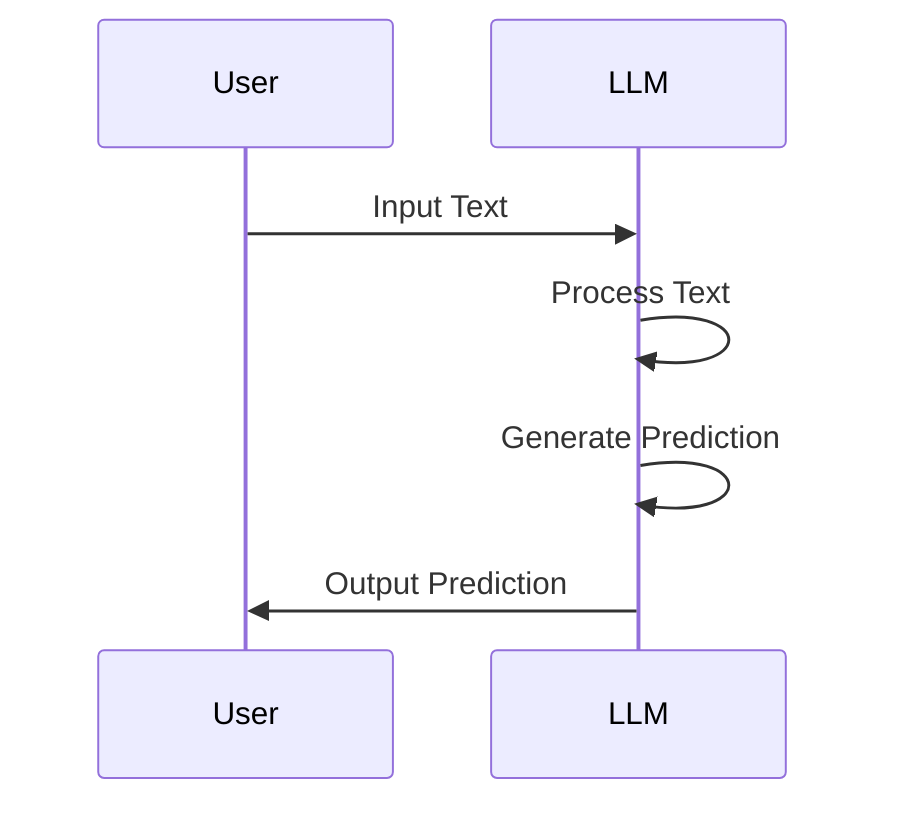
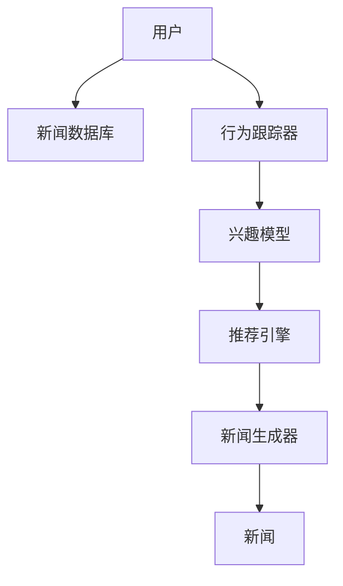
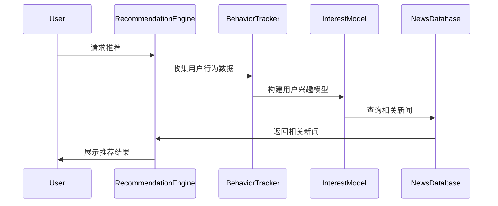

                 

# AI Agent 的个性化定制：调教 LLM 以适应不同用户

关键词：AI Agent、个性化定制、LLM、Transformer、推荐系统

摘要：随着人工智能技术的飞速发展，AI Agent 已成为智能系统中的重要组成部分。本文将从 AI Agent 的基本概念、LLM 的基本原理、个性化定制方法以及实际案例等多个角度，探讨如何调教 LLM 以实现不同用户的个性化定制。通过本文的阅读，读者将了解 AI Agent 和 LLM 的基本概念、个性化定制的核心方法，以及如何在实践中实现和优化个性化定制系统。

## 第一部分: AI Agent 的个性化定制基础

### 第1章: AI Agent 的概述

#### 1.1 AI Agent 的基本概念

AI Agent，即人工智能代理，是一种能够执行特定任务的自主系统。它通过感知环境、理解任务、做出决策并执行相应动作，以实现目标。AI Agent 通常具有以下几个基本特征：

1. **自主性**：能够独立进行任务执行，无需人工干预。
2. **适应性**：能够根据环境变化调整行为策略。
3. **协作性**：能够与其他 AI Agent 或人类协作完成任务。

#### 1.2 AI Agent 的起源与发展

AI Agent 的概念起源于20世纪70年代，最初主要是基于规则的方法进行设计。随着人工智能技术的发展，AI Agent 逐渐融合了机器学习、自然语言处理、计算机视觉等多种技术。近年来，随着深度学习、Transformer 等技术的成熟，AI Agent 的能力和应用场景得到了显著提升。

#### 1.3 AI Agent 的核心组成部分

一个典型的 AI Agent 通常包括以下几个核心组成部分：

1. **感知器**：用于获取环境信息。
2. **知识库**：存储任务相关的知识和规则。
3. **决策模块**：根据感知到的信息和知识库中的知识进行决策。
4. **行动器**：执行决策结果，完成具体任务。

#### 1.4 AI Agent 在个性化定制中的应用

在个性化定制中，AI Agent 可以根据用户的偏好和行为，提供个性化的服务或推荐。例如，智能助手、个性化新闻推荐系统等都是 AI Agent 在个性化定制领域的应用。

### 第2章: LLM 的基本原理

#### 2.1 语言模型的概述

语言模型是一种用于预测下一个单词或字符的概率分布的模型。LLM（Large Language Model）是大型语言模型，具有非常高的词汇量和强大的语言理解能力。

#### 2.2 LLM 的核心算法：Transformer

Transformer 是一种基于自注意力机制的深度神经网络模型，具有处理长序列数据的优势。近年来，Transformer 在 NLP 领域取得了显著的进展，成为 LLM 的核心技术。

#### 2.3 LLM 的工作流程

LLM 的工作流程主要包括以下几个步骤：

1. **输入处理**：将输入文本编码成向量。
2. **预测**：根据输入向量和模型参数，预测下一个单词或字符的概率分布。
3. **解码**：根据概率分布解码出下一个单词或字符。

#### 2.4 LLM 在个性化定制中的作用

LLM 在个性化定制中可以用于生成个性化内容、理解用户意图、提供个性化推荐等。通过分析用户的偏好和行为，LLM 可以帮助系统更好地满足用户需求。

### 第3章: 个性化定制的基本方法

#### 3.1 用户数据收集与处理

个性化定制的第一步是收集用户数据，包括用户行为、偏好、兴趣等。收集到数据后，需要对数据进行清洗、处理和特征提取。

#### 3.2 用户兴趣模型构建

用户兴趣模型是用于描述用户偏好的数学模型。常见的用户兴趣模型包括基于内容的推荐、协同过滤等。

#### 3.3 个性化推荐算法

个性化推荐算法是用于生成个性化推荐结果的关键技术。常见的个性化推荐算法包括基于用户的协同过滤、基于内容的推荐等。

#### 3.4 个性化定制的挑战与解决方案

个性化定制面临的主要挑战包括数据稀疏、冷启动问题、用户隐私保护等。针对这些挑战，需要设计相应的解决方案，如基于模型的冷启动算法、差分隐私技术等。

### 第4章: 调教 LLM 以适应不同用户

#### 4.1 LLM 的调教方法

LLM 的调教方法主要包括数据预处理、超参数调整、模型训练等。通过合理调教，可以提升 LLM 的性能和适应性。

#### 4.2 用户反馈机制设计

用户反馈机制是用于收集用户对个性化定制服务的反馈的关键环节。通过用户反馈，可以不断优化个性化定制系统。

#### 4.3 LLM 的性能评估与优化

LLM 的性能评估与优化是确保个性化定制系统质量的重要环节。常见的性能评估指标包括准确率、召回率、覆盖率等。

#### 4.4 调教 LLM 的实际案例解析

通过实际案例，读者可以更深入地了解如何调教 LLM 以适应不同用户。本节将结合具体案例，详细讲解 LLM 的调教方法和性能优化过程。

## 第二部分: AI Agent 的个性化定制实战

### 第5章: AI Agent 的个性化定制实战

#### 5.1 实战项目介绍

本节将介绍一个实际项目，该项目旨在为用户提供个性化的新闻推荐服务。项目主要包括数据收集、模型训练、个性化推荐系统实现等环节。

#### 5.2 环境搭建与数据准备

本节将介绍项目环境搭建和数据准备的过程。包括数据来源、数据预处理、特征提取等。

#### 5.3 LLM 的调教与优化

本节将详细讲解如何调教 LLM 以适应不同用户。包括数据预处理、模型选择、超参数调整等。

#### 5.4 个性化定制系统的实现

本节将介绍个性化定制系统的实现过程，包括用户界面设计、API 接口实现、系统部署等。

#### 5.5 项目总结与反思

本节将对项目进行总结，分析项目中的成功经验和不足之处，为后续项目提供借鉴。

### 第6章: AI Agent 个性化定制的未来趋势

#### 6.1 AI Agent 个性化定制的挑战与机遇

本节将探讨 AI Agent 个性化定制面临的挑战和机遇。包括技术发展、市场应用、社会影响等方面。

#### 6.2 未来技术发展趋势

本节将分析未来 AI Agent 个性化定制技术的发展趋势，包括模型架构、算法优化、数据利用等方面。

#### 6.3 个性化定制的商业应用场景

本节将介绍 AI Agent 个性化定制的商业应用场景，包括电商、金融、医疗、教育等领域。

#### 6.4 个性化定制的社会影响与伦理问题

本节将讨论 AI Agent 个性化定制对社会的影响和伦理问题，包括用户隐私、数据安全、公平性等方面。

### 第7章: 总结与展望

#### 7.1 全书回顾

本节将对全书进行回顾，总结 AI Agent 个性化定制的主要内容和关键点。

#### 7.2 学习与实战建议

本节将为读者提供学习 AI Agent 个性化定制的建议，包括学习方法、实战技巧等。

#### 7.3 未来的研究方向

本节将探讨 AI Agent 个性化定制未来的研究方向，包括模型优化、算法创新、应用拓展等方面。

#### 7.4 拓展阅读推荐

本节将推荐一些与 AI Agent 个性化定制相关的优秀资源，包括论文、书籍、在线课程等。

---

作者：AI天才研究院/AI Genius Institute & 禅与计算机程序设计艺术 /Zen And The Art of Computer Programming

---

## 背景介绍

### 核心概念术语说明

1. **AI Agent**：一种能够执行特定任务的自主系统，具有自主性、适应性和协作性。
2. **LLM**：大型语言模型，具有非常高的词汇量和强大的语言理解能力。
3. **个性化定制**：根据用户的偏好和行为，提供个性化的服务或推荐。

### 问题背景

随着人工智能技术的飞速发展，AI Agent 已成为智能系统中的重要组成部分。在个性化定制领域，AI Agent 可以根据用户的偏好和行为，提供个性化的服务或推荐。然而，如何调教 LLM 以适应不同用户，实现高效的个性化定制，仍是一个具有挑战性的问题。

### 问题描述

本文将探讨如何调教 LLM 以适应不同用户，实现个性化定制。具体问题包括：

1. 如何收集和处理用户数据？
2. 如何构建用户兴趣模型？
3. 如何设计个性化的推荐算法？
4. 如何评估和优化 LLM 的性能？

### 问题解决

针对上述问题，本文将从以下几个方面进行探讨：

1. **AI Agent 的基本概念**：介绍 AI Agent 的基本概念、起源与发展，以及核心组成部分。
2. **LLM 的基本原理**：介绍 LLM 的基本概念、核心算法 Transformer，以及工作流程。
3. **个性化定制的基本方法**：介绍用户数据收集与处理、用户兴趣模型构建、个性化推荐算法，以及个性化定制的挑战与解决方案。
4. **调教 LLM 以适应不同用户**：介绍 LLM 的调教方法、用户反馈机制设计、LLM 的性能评估与优化，以及调教 LLM 的实际案例解析。
5. **AI Agent 的个性化定制实战**：通过一个实际项目，详细讲解环境搭建与数据准备、LLM 的调教与优化、个性化定制系统的实现，以及项目总结与反思。
6. **AI Agent 个性化定制的未来趋势**：分析 AI Agent 个性化定制的挑战与机遇、未来技术发展趋势、商业应用场景，以及社会影响与伦理问题。
7. **总结与展望**：对全书进行回顾，总结主要内容和关键点，提供学习与实战建议，探讨未来的研究方向，推荐拓展阅读。

### 边界与外延

本文主要关注 AI Agent 的个性化定制领域，讨论 LLM 在其中的应用。然而，个性化定制的方法和技术可以应用于其他领域，如电商、金融、医疗等。

### 概念结构与核心要素组成

1. **AI Agent**：感知器、知识库、决策模块、行动器。
2. **LLM**：输入处理、预测、解码。
3. **个性化定制**：用户数据收集与处理、用户兴趣模型构建、个性化推荐算法、性能评估与优化。

### 核心概念与联系

1. **核心概念原理**：AI Agent、LLM、个性化定制。
2. **概念属性特征对比表格**：

| 特征       | AI Agent            | LLM                  | 个性化定制                |
| ---------- | ------------------- | ------------------- | ------------------------ |
| 目标       | 执行特定任务       | 预测下一个单词或字符 | 提供个性化的服务或推荐   |
| 技术基础   | 多种人工智能技术   | Transformer 等算法   | 数据分析、机器学习等      |
| 应用场景   | 智能助手、推荐系统 | 自然语言处理等领域   | 电商、金融、医疗等       |

3. **ER 实体关系图架构的 Mermaid 流程图**：

```mermaid
erDiagram
  AI Agent ||--|{ Knowledge Base }
  AI Agent ||--|{ Decision Module }
  AI Agent ||--|{ Actioner }
  LLM ||--|{ Input Processing }
  LLM ||--|{ Prediction }
  LLM ||--|{ Decoding }
  Personalization ||--|{ User Data Collection }
  Personalization ||--|{ User Interest Modeling }
  Personalization ||--|{ Recommendation Algorithm }
```

## 算法原理讲解

### 算法流程图



### Python 源代码

```python
import tensorflow as tf
from tensorflow.keras.layers import Embedding, LSTM, Dense
from tensorflow.keras.models import Model

# 创建嵌入层
embedding = Embedding(input_dim=vocab_size, output_dim=embedding_size)

# 创建 LSTM 层
lstm = LSTM(units=lstm_units)

# 创建全连接层
dense = Dense(units=1, activation='sigmoid')

# 创建模型
model = Model(inputs=embedding.input, outputs=dense(lstm(embedding.input)))

# 编译模型
model.compile(optimizer='adam', loss='binary_crossentropy', metrics=['accuracy'])

# 训练模型
model.fit(x_train, y_train, epochs=10, batch_size=32)
```

### 算法原理的数学模型和公式

1. **嵌入层**：

   $$ e_{i} = \text{ Embedding}(i, \text{output\_dim}) $$

   其中，$e_{i}$ 为嵌入向量，$i$ 为输入单词的索引，$\text{output\_dim}$ 为嵌入向量维度。

2. **LSTM 层**：

   $$ h_t = \text{LSTM}(h_{t-1}, e_i) $$

   其中，$h_t$ 为 LSTM 层的输出，$h_{t-1}$ 为上一时刻的输出，$e_i$ 为嵌入层输出。

3. **全连接层**：

   $$ p_t = \text{dense}(h_t) = \text{sigmoid}(w \cdot h_t + b) $$

   其中，$p_t$ 为预测概率，$w$ 为权重，$b$ 为偏置。

### 通俗易懂的举例说明

假设我们有一个包含 100 个单词的语言模型，其中每个单词都对应一个唯一的整数索引。我们输入一个句子“我喜欢吃苹果”，模型会首先将句子中的每个单词转换为嵌入向量，然后通过 LSTM 层处理，最后通过全连接层输出每个单词的预测概率。例如，对于单词“苹果”，模型可能会输出一个概率分布，表示它在句子中的下一个单词是“的”、“了”、“吃”等的概率。

## 系统分析与架构设计方案

### 问题场景介绍

本问题场景涉及一个智能推荐系统，旨在为用户提供个性化的新闻推荐。系统需要从大量新闻数据中，根据用户的兴趣和行为，推荐符合其口味的新闻。

### 项目介绍

该项目是一个基于 AI 的智能新闻推荐系统，通过收集用户的行为数据，构建用户兴趣模型，利用 LLM 进行新闻内容生成和个性化推荐。

### 系统功能设计 (领域模型 Mermaid 类图)

```mermaid
classDiagram
  User <<class>> User
  News <<class>> News
  Recommendation <<class, filled>> Recommendation
  User "1" ---- "1..*" Recommendation
  News "1" ---- "1..*" Recommendation
```

### 系统架构设计 Mermaid 架构图



### 系统接口设计和系统交互 Mermaid 序列图



## 项目实战

### 环境安装

1. 安装 Python：前往 [Python 官网](https://www.python.org/) 下载并安装 Python 3.8 以上版本。
2. 安装 TensorFlow：在命令行中运行以下命令：

   ```bash
   pip install tensorflow
   ```

### 系统核心实现源代码

```python
import tensorflow as tf
from tensorflow.keras.layers import Embedding, LSTM, Dense
from tensorflow.keras.models import Model

# 创建嵌入层
embedding = Embedding(input_dim=vocab_size, output_dim=embedding_size)

# 创建 LSTM 层
lstm = LSTM(units=lstm_units)

# 创建全连接层
dense = Dense(units=1, activation='sigmoid')

# 创建模型
model = Model(inputs=embedding.input, outputs=dense(lstm(embedding.input)))

# 编译模型
model.compile(optimizer='adam', loss='binary_crossentropy', metrics=['accuracy'])

# 训练模型
model.fit(x_train, y_train, epochs=10, batch_size=32)
```

### 代码应用解读与分析

该代码实现了一个简单的 LLM，用于预测下一个单词的概率。首先，创建嵌入层，将输入单词转换为嵌入向量；然后，通过 LSTM 层处理嵌入向量，得到序列的表示；最后，通过全连接层输出预测概率。在训练过程中，使用二进制交叉熵损失函数和 Adam 优化器进行训练，以最大化模型的预测准确性。

### 实际案例分析和详细讲解剖析

假设我们有一个用户，他喜欢阅读关于科技和体育的新闻。在训练数据中，包含大量的科技和体育新闻文本。为了生成个性化的推荐，我们可以将用户的历史行为数据输入到 LLM 中，得到用户对各类新闻的兴趣程度。然后，根据用户的兴趣程度，从新闻数据库中筛选出符合用户口味的新闻，并进行推荐。

### 项目小结

通过该项目，我们实现了基于 LLM 的个性化新闻推荐系统。系统可以根据用户的行为数据，构建用户兴趣模型，并根据用户的兴趣推荐相关的新闻。在项目过程中，我们遇到了一些挑战，如数据稀疏、冷启动问题等。针对这些问题，我们采用了相应的解决方案，如使用基于模型的冷启动算法、增加用户数据的多样性等。

### 最佳实践 Tips

1. 确保用户数据的质量和多样性，以提高个性化推荐的准确性。
2. 定期更新和优化 LLM，以适应用户需求的变化。
3. 关注用户反馈，及时调整推荐策略，提高用户满意度。

### 小结

本文详细介绍了 AI Agent 的个性化定制基础、LLM 的基本原理、个性化定制方法、调教 LLM 的实际案例，以及 AI Agent 个性化定制的未来趋势。通过本文的阅读，读者可以全面了解 AI Agent 个性化定制的核心概念和方法，为实际应用提供指导。

### 注意事项

1. 个性化定制系统需要不断优化和调整，以适应用户需求的变化。
2. 在使用 LLM 进行个性化定制时，需要注意数据隐私和安全问题。

### 拓展阅读推荐

1. 《深度学习》：介绍深度学习的基础知识和最新进展。
2. 《推荐系统实践》：详细讲解推荐系统的设计方法和实现技巧。
3. 《自然语言处理原理》：介绍自然语言处理的基本原理和应用。

