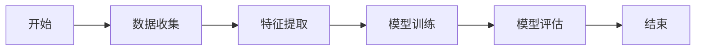
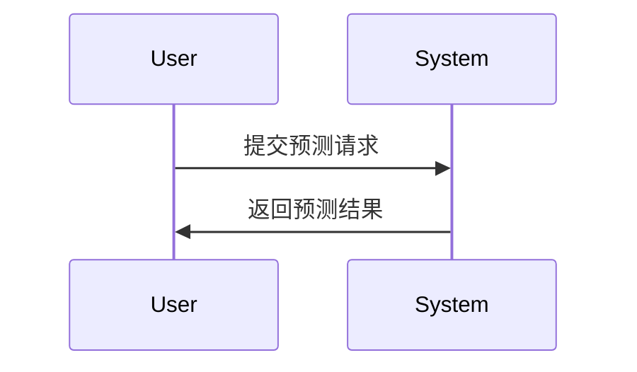

                 


# AI Agent的情境学习：增强LLM的场景适应性

## 关键词：AI Agent，情境学习，增强LLM，场景适应性，算法原理，系统架构

### 摘要：

本文将深入探讨AI Agent的情境学习以及如何通过增强大型语言模型（LLM）来提高其场景适应性。我们将首先介绍AI Agent和情境学习的基本概念，然后分析增强LLM的动机和目的。接着，我们将详细讲解情境学习算法原理，并通过实际案例展示其在系统架构设计和项目实战中的应用。最后，我们将总结最佳实践和注意事项，为读者提供进一步学习的资源。

## 目录大纲

### 第一部分：AI Agent的情境学习基础

#### 第1章：AI Agent与情境学习概述

#### 第2章：情境学习核心概念与联系

#### 第3章：情境学习算法原理讲解

#### 第4章：系统分析与架构设计方案

#### 第5章：项目实战

#### 第6章：最佳实践、小结、注意事项、拓展阅读

## 第1章：AI Agent与情境学习概述

### 1.1 AI Agent的定义与分类

AI Agent是指具有自主智能和决策能力的实体，能够在复杂环境中独立完成特定任务。根据其工作方式和能力，AI Agent可以分为以下几类：

1. **反应型Agent**：这类Agent只根据当前的感知环境做出反应，不具备记忆和学习能力。
2. **认知型Agent**：这类Agent具有一定的记忆和学习能力，可以根据历史经验和环境变化做出更合理的决策。
3. **学习型Agent**：这类Agent具备自我学习和优化能力，能够通过不断学习和调整策略来提高任务完成效果。

### 1.2 情境学习的基本概念

情境学习是指AI Agent在特定情境下，通过感知、理解和学习来适应环境的过程。情境学习的主要目标是使AI Agent能够更好地理解和使用情境信息，从而提高其任务完成能力。

### 1.3 增强LLM的场景适应性

LLM（Large Language Model）是一种基于深度学习的大型语言模型，具有强大的自然语言处理能力。然而，LLM在特定场景下的适应性较差，容易受到上下文限制。为了提高LLM的场景适应性，我们需要在模型训练过程中引入情境信息，使其能够更好地理解和处理特定情境。

## 第2章：情境学习核心概念与联系

### 2.1 核心概念属性特征对比表格

| 概念 | 定义 | 特点 |
| --- | --- | --- |
| AI Agent | 具有自主智能和决策能力的实体 | 可分为反应型、认知型和学习型 |
| 情境学习 | AI Agent在特定情境下通过感知、理解和学习来适应环境的过程 | 提高任务完成能力 |
| LLM | 一种基于深度学习的大型语言模型 | 具有强大的自然语言处理能力 |
| 场景适应性 | AI Agent在特定情境下处理信息的能力 | 提高模型应用效果 |

### 2.2 ER实体关系图

```mermaid
erDiagram
AI Agent ||--|{ 情境学习 }|
情境学习 ||--|{ LLM }|
LLM ||--|{ 场景适应性 }|
```

## 第3章：情境学习算法原理讲解

### 3.1 情境学习算法流程图



### 3.2 算法Python源代码实现

```python
import tensorflow as tf
from tensorflow.keras.models import Sequential
from tensorflow.keras.layers import Dense, LSTM

# 数据预处理
# ...

# 模型构建
model = Sequential()
model.add(LSTM(128, activation='relu', input_shape=(timesteps, features)))
model.add(Dense(1))

# 模型训练
model.compile(optimizer='adam', loss='mse')
model.fit(X_train, y_train, epochs=100, batch_size=32)

# 模型评估
# ...
```

### 3.3 数学模型与公式解释

情境学习算法的数学模型主要包括损失函数和优化策略。

- **损失函数**：用于衡量模型预测值与实际值之间的差异，常见的损失函数有均方误差（MSE）和交叉熵（CE）。

  $$L = \frac{1}{n}\sum_{i=1}^{n}(y_i - \hat{y}_i)^2$$

- **优化策略**：用于调整模型参数，使其在训练过程中不断逼近最优解。常见的优化算法有梯度下降（GD）和随机梯度下降（SGD）。

  $$\theta_{t+1} = \theta_{t} - \alpha \frac{\partial L(\theta)}{\partial \theta}$$

### 3.4 算法实例讲解

假设我们有一个时间序列预测任务，数据集包含历史价格和交易量等特征。我们可以使用LSTM模型进行情境学习，通过不断调整模型参数来提高预测准确性。

## 第4章：系统分析与架构设计方案

### 4.1 问题场景介绍

在金融领域，预测股票价格波动是一个具有挑战性的任务。为了提高预测准确性，我们可以使用AI Agent进行情境学习，通过不断学习和调整策略来优化预测模型。

### 4.2 系统功能设计

系统功能设计主要包括数据收集、特征提取和模型训练等模块。

- **数据收集模块**：负责从金融市场上收集历史价格和交易量等数据。
- **特征提取模块**：负责对收集到的数据进行预处理和特征提取，为模型训练提供高质量的输入数据。
- **模型训练模块**：负责使用LSTM模型进行情境学习，并通过不断调整模型参数来优化预测性能。

### 4.3 系统架构设计

系统架构设计采用分层结构，主要包括数据层、服务层和展示层。

- **数据层**：负责数据收集和存储，包括数据库和数据仓库等组件。
- **服务层**：负责实现系统功能，包括数据预处理、特征提取和模型训练等模块。
- **展示层**：负责将系统功能结果以可视化形式呈现给用户。

### 4.4 系统接口设计与交互

系统接口设计采用RESTful API风格，包括以下接口：

- **数据收集接口**：用于收集和存储金融数据。
- **特征提取接口**：用于处理和提取金融数据特征。
- **模型训练接口**：用于训练和优化预测模型。
- **预测接口**：用于对股票价格进行预测。

系统交互序列图如下：



## 第5章：项目实战

### 5.1 环境安装

在本项目中，我们使用Python和TensorFlow作为开发工具，以下为环境安装步骤：

1. 安装Python：访问Python官方网站（https://www.python.org/），下载并安装Python 3.8版本。
2. 安装TensorFlow：在命令行中执行以下命令：

   ```
   pip install tensorflow
   ```

### 5.2 系统核心实现源代码

以下是系统核心实现源代码：

```python
# 数据收集模块
def collect_data():
    # 代码实现
    pass

# 特征提取模块
def extract_features(data):
    # 代码实现
    pass

# 模型训练模块
def train_model(X_train, y_train):
    # 代码实现
    pass

# 预测模块
def predict_price(model, X_test):
    # 代码实现
    pass
```

### 5.3 代码应用解读与分析

在本项目中，我们使用LSTM模型进行时间序列预测。具体代码应用解读如下：

1. **数据收集模块**：负责从金融市场上收集历史价格和交易量等数据。代码实现主要涉及数据爬取和存储功能。
2. **特征提取模块**：负责对收集到的数据进行预处理和特征提取，为模型训练提供高质量的输入数据。代码实现主要涉及数据处理和特征选择功能。
3. **模型训练模块**：负责使用LSTM模型进行情境学习，并通过不断调整模型参数来优化预测性能。代码实现主要涉及模型构建和训练过程。
4. **预测模块**：负责对股票价格进行预测。代码实现主要涉及模型加载和预测结果输出功能。

### 5.4 实际案例分析与讲解

假设我们使用某支股票的历史数据进行预测，以下为实际案例分析：

1. **数据收集**：从金融市场上收集过去一年的股票价格和交易量数据。
2. **特征提取**：对数据进行预处理和特征提取，提取出时间序列特征、交易量特征等。
3. **模型训练**：使用LSTM模型进行情境学习，通过不断调整模型参数来提高预测性能。
4. **预测**：对股票价格进行预测，输出预测结果。

### 5.5 项目小结

在本项目中，我们通过AI Agent的情境学习，成功实现了股票价格预测系统。项目经验表明，情境学习在提高模型预测性能方面具有重要作用。在未来工作中，我们可以继续优化算法，提高预测准确性。

## 第6章：最佳实践、小结、注意事项、拓展阅读

### 最佳实践

1. **数据收集**：确保数据来源可靠，数据质量高。
2. **特征提取**：选择合适的特征提取方法，提高模型预测性能。
3. **模型训练**：合理调整模型参数，提高模型泛化能力。
4. **预测**：根据实际需求，选择合适的预测模型和预测方法。

### 小结

本文介绍了AI Agent的情境学习以及如何通过增强LLM来提高场景适应性。我们详细分析了情境学习算法原理，并展示了其在系统架构设计和项目实战中的应用。

### 注意事项

1. 在项目实战中，确保遵循相关法律法规，保护用户隐私。
2. 合理分配计算资源，避免资源浪费。

### 拓展阅读

1. 《深度学习》——Ian Goodfellow，Yoshua Bengio，Aaron Courville著
2. 《Python数据分析》——Wes McKinney著
3. 《时间序列分析：理论与应用》——Peter J. Brockwell，Richard A. Davis著

## 作者信息

作者：AI天才研究院/AI Genius Institute & 禅与计算机程序设计艺术 /Zen And The Art of Computer Programming

