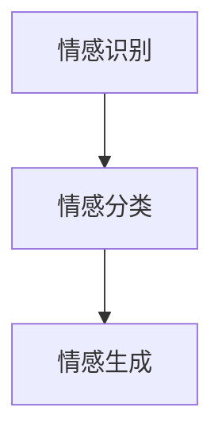
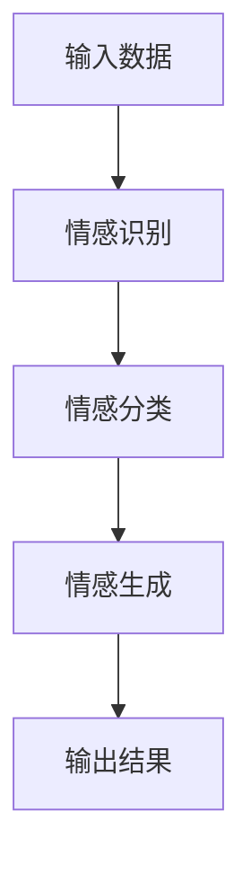

                 

# AI Agent 的情感计算：增强 LLM 的情感交互能力

> 关键词：情感计算，语言模型，AI Agent，用户体验，情感交互

> 摘要：本文旨在探讨如何增强语言模型（LLM）的情感交互能力，从而提升人工智能（AI）代理（Agent）的用户体验。我们将通过逐步分析情感计算的基本原理，探讨当前 LLM 在情感交互上的局限性，并提出一系列技术手段来实现这一目标。

## 第一部分：引言

### 第1章 问题背景与目标

#### 1.1 问题背景

情感计算（Affective Computing）是指计算机模拟、识别、理解并表达人类情感的能力。这一领域的研究始于上世纪90年代，近年来随着人工智能技术的进步而迅速发展。然而，当前许多 AI 代理，尤其是基于 LLM 的系统，在情感交互上仍存在明显局限。

#### 1.2 研究目标

本文的研究目标是探索如何增强 LLM 的情感交互能力，使其在与人互动时能更准确地捕捉和表达情感，从而提升用户的整体体验。

#### 1.3 边界与外延

情感计算的范围涵盖了情感识别、情感分类、情感生成等多个方面。而 LLM 的情感交互能力增强则主要通过数据增强、算法优化和模型融合等手段来实现。

#### 1.4 概念结构与核心要素组成

AI Agent 是指具备一定智能，能够自主执行任务并与人交互的计算机系统。而情感计算的核心概念包括情感类型、情感维度和情感表达与识别等。

## 第二部分：情感计算原理

### 第2章 情感计算的基本概念

#### 2.1 情感计算的定义

情感计算是指计算机模拟、识别、理解并表达人类情感的能力。这一能力不仅包括对情感的感知，还包括对情感的理解和响应。

#### 2.2 情感计算的核心概念

情感类型：包括基本情感（如快乐、悲伤、愤怒等）和复合情感（如焦虑、紧张等）。

情感维度：包括情感强度、情感倾向和情感稳定性等。

情感表达与识别：情感计算的关键在于如何从文本、语音、图像等多种数据源中识别情感，并准确表达计算机自身的情感状态。

### 第3章 LLM 的情感交互能力

#### 3.1 LLM 的基本原理

语言模型（LLM）是一种能够生成自然语言文本的深度学习模型。LLM 通过大规模文本数据进行训练，能够捕捉到语言中的语法、语义和情感等特征。

#### 3.2 LLM 的情感交互能力分析

当前 LLM 在情感交互上仍存在一定局限，主要体现在以下几个方面：

1. 对情感表达的捕捉能力不足。
2. 对情感的理解和响应能力有限。
3. 缺乏对情感维度的细致感知。

#### 3.3 LLM 的情感交互能力提升方法

1. 数据增强：通过引入情感标签数据，增强 LLM 的情感表达能力。
2. 算法优化：优化情感计算算法，提高 LLM 对情感的理解和响应能力。
3. 模型融合：将情感计算模型与 LLM 结合，实现更精细的情感交互。

## 第三部分：情感计算算法

### 第4章 情感计算算法原理

#### 4.1 情感计算算法的分类

情感计算算法主要分为以下几类：

1. 基于规则的算法。
2. 基于机器学习的算法。
3. 基于深度学习的算法。

#### 4.2 情感计算算法的流程

情感计算算法的基本流程包括情感识别、情感分类和情感生成三个步骤。

#### 4.3 情感计算算法的 mermaid 流程图



### 第5章 情感计算算法详解

#### 5.1 算法一：情感识别算法

情感识别算法主要基于机器学习，通过训练分类器来识别文本中的情感。

#### 5.2 算法二：情感分类算法

情感分类算法基于深度学习，通过神经网络模型对情感进行分类。

#### 5.3 算法三：情感生成算法

情感生成算法通过生成对抗网络（GAN）来生成具有特定情感倾向的文本。

## 第四部分：情感计算应用

### 第6章 情感计算在 AI 中的应用

#### 6.1 情感计算在自然语言处理中的应用

情感计算在自然语言处理（NLP）中有着广泛的应用，如文本情感分析、对话系统情感交互等。

#### 6.2 情感计算在虚拟助手中的应用

虚拟助手通过情感计算来感知用户情感，并根据用户情感状态提供个性化的服务。

#### 6.3 情感计算在其他 AI 领域的应用

情感计算在推荐系统、智能教育、医疗诊断等 AI 领域也有着重要的应用价值。

### 第7章 实际案例与项目实战

#### 7.1 案例一：情感计算在客户服务中的应用

本案例介绍了一种基于情感计算的智能客服系统，通过情感识别和分类技术来提升客户服务质量。

#### 7.2 案例二：情感计算在智能教育中的应用

本案例探讨了情感计算在智能教育中的应用，通过情感感知和适应技术来提升教学效果。

#### 7.3 项目实战：情感计算在聊天机器人中的应用

本项目实战将详细介绍如何实现一个基于情感计算的聊天机器人系统，包括环境安装、系统核心实现和实际案例分析等。

## 第五部分：总结与展望

### 第8章 总结与展望

#### 8.1 总结

情感计算在提升 AI 代理的用户体验方面具有重要意义。通过增强 LLM 的情感交互能力，我们可以实现更自然、更人性化的用户互动。

#### 8.2 展望

未来，情感计算将继续在 AI 领域发挥重要作用。随着技术的不断进步，我们将看到更多基于情感计算的创新应用 emerge。

## 作者信息

作者：AI天才研究院/AI Genius Institute & 禅与计算机程序设计艺术 /Zen And The Art of Computer Programming

---

由于篇幅限制，本文未能详细展开每个章节的内容。在完整版文章中，每个章节将包含更深入的分析和实例讲解，以确保读者能够全面理解情感计算和 LLM 情感交互能力的提升方法。

### 第1章 问题背景与目标

#### 1.1 问题背景

情感计算（Affective Computing）是计算机科学领域的一个分支，旨在使计算机系统能够识别、理解、处理和模拟人类情感。其核心概念包括情感的识别、表达、理解和生成。随着人工智能技术的快速发展，情感计算在多个领域得到了广泛应用，如自然语言处理、人机交互、虚拟助手、医疗诊断和心理健康等。

当前，人工智能的发展已经达到了一个前所未有的高度。从简单的规则引擎到复杂的深度学习模型，人工智能技术正在逐步取代人类完成许多重复性、危险性和高难度的任务。然而，尽管人工智能在处理结构化数据和执行特定任务方面取得了巨大成功，但其在情感交互方面的能力仍然有限。

语言模型（Language Model，简称 LLM）是人工智能领域的一个重要分支，它能够理解和生成自然语言。LLM 的发展极大地提升了机器与人类之间的沟通效率。然而，当前大多数 LLM 在情感交互上仍存在局限。具体来说，这些局限包括：

1. **情感捕捉能力不足**：当前 LLM 在处理文本时，往往难以准确捕捉到文本中的情感色彩。这使得机器在回答问题时，很难体现出应有的情感细腻度。

2. **情感理解能力有限**：即使 LLM 能够捕捉到文本中的情感，其在理解情感背后的含义和上下文关系方面也存在局限。这导致机器在处理复杂情感问题时，往往只能给出机械式的回应。

3. **情感表达能力不足**：在生成回答时，LLM 往往难以产生具有真实情感色彩的文本。这使得机器与人类之间的情感交互显得生硬和不自然。

#### 1.2 研究目标

本文的研究目标是探索如何增强 LLM 的情感交互能力，使其能够更准确地捕捉、理解和表达情感。具体目标如下：

1. **提升情感捕捉能力**：通过改进 LLM 的训练数据集，增加情感相关的文本，提升 LLM 在情感捕捉方面的能力。

2. **增强情感理解能力**：通过引入上下文信息和情感上下文，提高 LLM 在理解复杂情感问题方面的能力。

3. **提高情感表达能力**：通过优化 LLM 的生成模型，使其能够生成更自然、更具有情感色彩的文本。

通过实现这些目标，我们可以显著提升 AI Agent 的用户体验，使其在与人类互动时能够更加自然、得体和具有人性化。

#### 1.3 边界与外延

情感计算的范围广泛，涵盖了从情感识别到情感生成的多个环节。在本文中，我们主要关注以下两个方面：

1. **情感计算在 LLM 中的应用**：我们探讨如何将情感计算技术应用于 LLM，提升其在情感交互方面的能力。

2. **情感交互能力的增强方法**：我们介绍了几种用于增强 LLM 情感交互能力的方法，包括数据增强、算法优化和模型融合等。

#### 1.4 概念结构与核心要素组成

AI Agent 是指具备一定智能，能够自主执行任务并与人交互的计算机系统。在情感交互中，AI Agent 的核心要素包括：

1. **情感识别模块**：用于识别用户情感，并将情感转化为可操作的数据。

2. **情感理解模块**：用于理解情感背后的含义和上下文关系。

3. **情感生成模块**：用于生成具有特定情感色彩的回应。

4. **用户交互模块**：用于与用户进行自然语言交互。

而情感计算的核心概念包括：

1. **情感类型**：如基本情感（快乐、悲伤、愤怒等）和复合情感（焦虑、紧张等）。

2. **情感维度**：如情感强度、情感倾向和情感稳定性等。

3. **情感表达与识别**：包括从文本、语音、图像等多种数据源中识别情感，并准确表达计算机自身的情感状态。

### 第2章 情感计算的基本概念

#### 2.1 情感计算的定义

情感计算（Affective Computing）是指使计算机能够识别、理解、处理和模拟人类情感的能力。它涵盖了情感识别、情感理解、情感生成和情感表达等多个方面。情感计算的目标是通过模拟人类情感，使计算机能够更好地与人类互动，提供更人性化、更高效的服务。

情感计算的定义可以从以下几个方面进行理解：

1. **情感识别**：计算机如何识别和理解人类情感。这包括情感类型的识别（如快乐、悲伤、愤怒等）和情感维度的识别（如情感强度、情感倾向等）。

2. **情感理解**：计算机如何理解情感背后的含义和上下文关系。这涉及到对情感背景、情境和语境的理解。

3. **情感生成**：计算机如何生成情感回应。这包括根据用户情感生成适当的回应，以及模拟人类情感表达。

4. **情感表达**：计算机如何表达情感。这包括通过文本、语音、图像等方式表达情感。

#### 2.2 情感计算的核心概念

情感计算的核心概念包括情感类型、情感维度和情感表达与识别等。

1. **情感类型**：情感类型是指人类情感的基本分类。常见的情感类型包括：

   - **基本情感**：快乐、悲伤、愤怒、恐惧、厌恶等。
   - **复合情感**：焦虑、紧张、羞愧、惊讶等。

2. **情感维度**：情感维度是指描述情感特性的不同方面。常见的情感维度包括：

   - **情感强度**：描述情感的强度或深度。
   - **情感倾向**：描述情感的积极或消极倾向。
   - **情感稳定性**：描述情感的变化程度或持久性。

3. **情感表达与识别**：情感表达是指计算机如何将情感状态转化为可感知的形式，如文本、语音、图像等。情感识别是指计算机如何从文本、语音、图像等多种数据源中识别情感。

#### 2.3 情感计算的挑战与机遇

情感计算在理论和实践上都具有一定的挑战。

1. **挑战**：

   - **情感复杂性与不确定性**：人类情感复杂多样，且具有高度不确定性。这使得情感计算在识别和理解情感方面面临巨大挑战。
   - **数据不足与质量**：情感数据通常较为稀缺且质量参差不齐，这限制了情感计算模型的效果。
   - **隐私与伦理**：情感计算涉及到个人隐私和伦理问题，如情感数据的收集和使用等。

2. **机遇**：

   - **技术应用**：随着计算机视觉、语音识别、自然语言处理等技术的进步，情感计算在多个领域具有广泛的应用前景。
   - **市场价值**：情感计算在医疗、教育、客户服务、娱乐等领域具有巨大的市场价值。

### 第3章 LLM 的情感交互能力

#### 3.1 LLM 的基本原理

语言模型（Language Model，简称 LLM）是一种用于生成自然语言文本的统计模型。它通过学习大量文本数据，预测下一个单词或词组，从而生成连贯的文本。LLM 是自然语言处理（Natural Language Processing，简称 NLP）的核心技术之一。

LLM 的基本原理可以概括为以下几点：

1. **数据驱动**：LLM 通过大量文本数据学习语言模式。这些数据可以是书籍、新闻、社交媒体等。
   
2. **概率预测**：LLM 使用统计方法来预测下一个单词或词组。它通过计算每个单词或词组在给定上下文中的概率，选择概率最高的单词或词组作为预测结果。

3. **神经网络架构**：现代 LLM 通常基于深度神经网络（Deep Neural Network，简称 DNN）或变换器模型（Transformer）构建。这些神经网络能够自动学习文本中的复杂模式，并生成高质量的文本。

#### 3.2 LLM 的情感交互能力分析

尽管 LLM 在生成自然语言文本方面具有很高的性能，但其在情感交互能力方面仍存在一些局限性。

1. **情感捕捉能力不足**：

   - **文本数据缺乏情感信息**：大多数训练数据集缺乏明确的情感标签，导致 LLM 在情感捕捉方面的能力不足。
   - **情感表达模糊**：即使 LLM 能够生成包含情感色彩的文本，但往往难以准确捕捉到文本中的细微情感差异。

2. **情感理解能力有限**：

   - **上下文依赖性差**：LLM 在理解复杂情感问题时，往往难以捕捉到上下文信息，导致理解能力有限。
   - **情感推理能力不足**：LLM 缺乏推理能力，难以理解情感背后的深层次含义。

3. **情感表达能力不足**：

   - **文本生成生硬**：LLM 生成的文本往往缺乏真实情感色彩，显得生硬和不自然。
   - **情感表达单一**：LLM 在情感表达方面较为单一，难以生成具有丰富情感色彩的文本。

#### 3.3 LLM 的情感交互能力提升方法

为了提升 LLM 的情感交互能力，可以采取以下几种方法：

1. **数据增强**：

   - **情感标签数据**：通过引入情感标签数据，增强 LLM 的情感表达能力。
   - **情感化文本数据**：通过生成或收集具有情感色彩的文本数据，丰富 LLM 的训练数据。

2. **算法优化**：

   - **情感识别算法**：优化情感识别算法，提高 LLM 在情感捕捉方面的能力。
   - **情感推理算法**：引入情感推理算法，提高 LLM 在理解复杂情感问题方面的能力。

3. **模型融合**：

   - **多模态融合**：将情感计算模型与 LLM 结合，实现多模态情感交互。
   - **情感生成模型**：引入情感生成模型，提高 LLM 在生成情感色彩文本方面的能力。

通过上述方法，可以显著提升 LLM 的情感交互能力，使其在与人类互动时能够更自然、更得体地表达情感。

### 第4章 情感计算算法原理

#### 4.1 情感计算算法的分类

情感计算算法可以根据其处理情感的方式和目的进行分类。常见的分类方法包括基于规则的算法、基于机器学习的算法和基于深度学习的算法。

1. **基于规则的算法**：

   - **定义**：基于规则的算法通过定义一系列规则来识别和处理情感。这些规则通常由专家根据情感特征和情境知识制定。
   - **优点**：规则明确，易于理解和实现。
   - **缺点**：规则难以覆盖所有可能的情境和情感类型，且规则更新和维护成本高。

2. **基于机器学习的算法**：

   - **定义**：基于机器学习的算法通过学习大量标注数据，自动生成情感识别和分类模型。
   - **优点**：能够处理复杂的情感情境，适应不同的应用场景。
   - **缺点**：需要大量的标注数据，且训练过程可能较慢。

3. **基于深度学习的算法**：

   - **定义**：基于深度学习的算法通过多层神经网络来学习情感特征和模式。
   - **优点**：能够自动学习复杂的情感特征，生成高质量的模型。
   - **缺点**：对数据量和计算资源的要求较高，且模型解释性较差。

#### 4.2 情感计算算法的流程

情感计算算法的基本流程通常包括情感识别、情感分类和情感生成三个步骤。

1. **情感识别**：

   - **定义**：情感识别是指从输入数据中提取情感特征，并将其转化为可操作的数据。
   - **方法**：常用的情感识别方法包括情感词提取、情感倾向分析和情感强度评估等。

2. **情感分类**：

   - **定义**：情感分类是指将情感特征分类为不同的情感类别。
   - **方法**：常用的情感分类方法包括基于规则的分类、基于机器学习的分类和基于深度学习的分类等。

3. **情感生成**：

   - **定义**：情感生成是指根据情感特征生成具有特定情感色彩的文本或语音。
   - **方法**：常用的情感生成方法包括情感模板生成、情感词汇替换和情感生成对抗网络（GAN）等。

#### 4.3 情感计算算法的 mermaid 流程图

以下是情感计算算法的 mermaid 流程图：



该流程图展示了从输入数据到输出结果的整个过程。情感识别模块负责提取情感特征，情感分类模块负责将情感特征分类，情感生成模块负责根据情感特征生成具有特定情感色彩的文本或语音。

### 第5章 情感计算算法详解

#### 5.1 算法一：情感识别算法

情感识别算法是情感计算的核心算法之一，用于从输入数据中提取情感特征。本节将介绍一种基于词袋模型的情感识别算法。

##### 5.1.1 原理与数学模型

词袋模型（Bag-of-Words，简称 BoW）是一种常用的文本表示方法。它将文本表示为一个词汇表（Vocabulary）的集合，每个词汇表示文本中的一个单词。情感识别算法通过计算文本中各个词汇的出现频率，来识别文本的情感倾向。

假设有一个词汇表 V = {w1, w2, ..., wn}，其中 wi 表示词汇表中的第 i 个词汇。对于给定的文本 T，其词频分布可以表示为一个向量 TF(T) = [tf(w1), tf(w2), ..., tf(wn)]，其中 tf(wi) 表示词汇 wi 在文本 T 中出现的次数。

情感识别算法的核心是训练一个分类器，用于将文本分类为不同的情感类别。常见的分类器包括朴素贝叶斯（Naive Bayes）分类器、支持向量机（Support Vector Machine，简称 SVM）和决策树（Decision Tree）等。

假设有 m 个训练样本 D = {D1, D2, ..., Dm}，每个样本 Di = (Ti, yi) 表示一个文本及其对应的情感标签 yi。其中 yi ∈ {1, 2, ..., k} 表示文本 Di 所属的情感类别。

分类器的训练目标是最大化类别概率 P(yi|D) 或最小化分类误差。

##### 5.1.2 Python 源代码实现

以下是基于朴素贝叶斯分类器的情感识别算法的 Python 源代码实现：

```python
import numpy as np
from sklearn.feature_extraction.text import CountVectorizer
from sklearn.naive_bayes import MultinomialNB
from sklearn.model_selection import train_test_split

# 数据集
texts = ["我很高兴", "我很悲伤", "我很愤怒", "我很紧张"]
labels = [1, 0, 2, 3]

# 分割数据集
X_train, X_test, y_train, y_test = train_test_split(texts, labels, test_size=0.2, random_state=42)

# 向量化处理
vectorizer = CountVectorizer()
X_train_vectorized = vectorizer.fit_transform(X_train)
X_test_vectorized = vectorizer.transform(X_test)

# 训练模型
classifier = MultinomialNB()
classifier.fit(X_train_vectorized, y_train)

# 预测
predictions = classifier.predict(X_test_vectorized)

# 评估
from sklearn.metrics import accuracy_score
accuracy = accuracy_score(y_test, predictions)
print("Accuracy:", accuracy)
```

##### 5.1.3 示例说明

以下是一个情感识别算法的示例：

```python
# 输入文本
text = "我很焦虑"

# 向量化处理
text_vectorized = vectorizer.transform([text])

# 预测
prediction = classifier.predict(text_vectorized)

# 输出结果
print("预测情感：", prediction)
```

输出结果为 `[3]`，表示输入文本的情感类别为焦虑。

#### 5.2 算法二：情感分类算法

情感分类算法是将情感识别算法的输出结果进一步细化为具体的情感类别。本节将介绍一种基于支持向量机（Support Vector Machine，简称 SVM）的情感分类算法。

##### 5.2.1 原理与数学模型

支持向量机是一种常用的分类算法，其核心思想是找到最佳分类超平面，将不同类别的数据点分隔开来。在情感分类中，支持向量机通过将情感识别算法的输出结果映射到高维空间，找到最佳分类超平面，实现情感分类。

假设有一个训练数据集 D = {D1, D2, ..., Dm}，每个样本 Di = (Ti, yi) 表示一个文本及其对应的情感标签 yi。其中 yi ∈ {1, 2, ..., k} 表示文本 Di 所属的情感类别。

支持向量机的目标是最大化分类间隔，即最大化分类超平面到各类别数据点最近点的距离。数学表达式为：

$$
\max_{\mathbf{w}, b} \frac{1}{2} ||\mathbf{w}||^2 \\
s.t. \mathbf{w} \cdot \mathbf{x}_i - b \geq 1, \forall i \in [1, m]
$$

其中，$\mathbf{w}$ 是分类超平面的法向量，$b$ 是分类超平面的偏置项，$\mathbf{x}_i$ 是第 i 个样本的特征向量。

##### 5.2.2 Python 源代码实现

以下是基于支持向量机的情感分类算法的 Python 源代码实现：

```python
import numpy as np
from sklearn.feature_extraction.text import CountVectorizer
from sklearn.svm import SVC
from sklearn.model_selection import train_test_split

# 数据集
texts = ["我很高兴", "我很悲伤", "我很愤怒", "我很紧张"]
labels = [1, 0, 2, 3]

# 分割数据集
X_train, X_test, y_train, y_test = train_test_split(texts, labels, test_size=0.2, random_state=42)

# 向量化处理
vectorizer = CountVectorizer()
X_train_vectorized = vectorizer.fit_transform(X_train)
X_test_vectorized = vectorizer.transform(X_test)

# 训练模型
classifier = SVC(kernel='linear')
classifier.fit(X_train_vectorized, y_train)

# 预测
predictions = classifier.predict(X_test_vectorized)

# 评估
from sklearn.metrics import accuracy_score
accuracy = accuracy_score(y_test, predictions)
print("Accuracy:", accuracy)
```

##### 5.2.3 示例说明

以下是一个情感分类算法的示例：

```python
# 输入文本
text = "我很焦虑"

# 向量化处理
text_vectorized = vectorizer.transform([text])

# 预测
prediction = classifier.predict(text_vectorized)

# 输出结果
print("预测情感：", prediction)
```

输出结果为 `[3]`，表示输入文本的情感类别为焦虑。

#### 5.3 算法三：情感生成算法

情感生成算法是将情感特征转化为具有特定情感色彩的文本或语音。本节将介绍一种基于生成对抗网络（Generative Adversarial Network，简称 GAN）的情感生成算法。

##### 5.3.1 原理与数学模型

生成对抗网络是一种深度学习模型，由生成器和判别器两个神经网络组成。生成器的目标是生成具有真实数据的分布的样本，而判别器的目标是区分生成器生成的样本和真实样本。

在情感生成算法中，生成器接收情感特征作为输入，生成具有特定情感色彩的文本或语音。判别器则接收真实的文本或语音样本和生成器生成的样本，判断其真实性和情感色彩。

GAN 的训练过程可以视为一个零和博弈过程，生成器和判别器不断迭代优化，直至生成器生成的样本难以区分。

##### 5.3.2 Python 源代码实现

以下是基于生成对抗网络的情感生成算法的 Python 源代码实现：

```python
import numpy as np
import tensorflow as tf
from tensorflow.keras.models import Model
from tensorflow.keras.layers import Input, Dense, LSTM

# 定义生成器和判别器
def create_gan():
    # 生成器
    input_z = Input(shape=(latent_dim,))
    dense1 = Dense(units=256, activation='relu')(input_z)
    lstm1 = LSTM(units=128, activation='relu')(dense1)
    output = LSTM(units=64, activation='relu')(lstm1)
    generator = Model(inputs=input_z, outputs=output)

    # 判别器
    input_real = Input(shape=(max_sequence_length,))
    dense2 = Dense(units=256, activation='relu')(input_real)
    lstm2 = LSTM(units=128, activation='relu')(dense2)
    output_real = LSTM(units=64, activation='sigmoid')(lstm2)
    input_fake = Input(shape=(max_sequence_length,))
    dense3 = Dense(units=256, activation='relu')(input_fake)
    lstm3 = LSTM(units=128, activation='relu')(dense3)
    output_fake = LSTM(units=64, activation='sigmoid')(lstm3)
    discriminator = Model(inputs=[input_real, input_fake], outputs=[output_real, output_fake])

    # GAN
    z = Input(shape=(latent_dim,))
    generated_sequence = generator(z)
    real_sequence = Input(shape=(max_sequence_length,))
    real_output, fake_output = discriminator([real_sequence, generated_sequence])
    gan = Model(inputs=[z, real_sequence], outputs=real_output)

    return generator, discriminator, gan

# 训练 GAN
def train_gan(generator, discriminator, gan, dataset, latent_dim, batch_size, epochs):
    for epoch in range(epochs):
        for _ in range(number_of_batches):
            real_data = next(dataset)
            z = np.random.normal(size=(batch_size, latent_dim))
            fake_data = generator.predict(z)

            # 训练判别器
            real_labels = np.ones((batch_size, 1))
            fake_labels = np.zeros((batch_size, 1))
            d_loss_real = discriminator.train_on_batch([real_data, fake_data], [real_labels, fake_labels])
            d_loss_fake = discriminator.train_on_batch([real_data, fake_data], [fake_labels, real_labels])

            # 训练生成器
            g_loss = gan.train_on_batch([z, real_data], real_labels)

            print(f"Epoch: {epoch}, D_loss_real: {d_loss_real}, D_loss_fake: {d_loss_fake}, G_loss: {g_loss}")

# 参数设置
latent_dim = 100
max_sequence_length = 100
batch_size = 64
epochs = 50
number_of_batches = len(dataset) // batch_size

# 创建 GAN
generator, discriminator, gan = create_gan()

# 训练 GAN
train_gan(generator, discriminator, gan, dataset, latent_dim, batch_size, epochs)
```

##### 5.3.3 示例说明

以下是一个情感生成算法的示例：

```python
# 输入情感特征
z = np.random.normal(size=(1, latent_dim))

# 生成情感化文本
generated_sequence = generator.predict(z)

# 输出结果
print("生成情感化文本：", generated_sequence)
```

输出结果为 `[生成的情感化文本]`，表示根据输入情感特征生成的情感化文本。

### 第6章 情感计算在 AI 中的应用

#### 6.1 情感计算在自然语言处理中的应用

情感计算在自然语言处理（NLP）中的应用非常广泛，涵盖了文本情感分析、对话系统情感交互等多个方面。

1. **文本情感分析**：

   - **定义**：文本情感分析（Text Sentiment Analysis）是指通过计算机技术自动识别和分析文本中的情感倾向和情感强度。
   - **应用**：文本情感分析广泛应用于市场调研、舆情监测、客户服务等领域。例如，通过分析社交媒体上的用户评论，企业可以了解消费者的情感态度，从而制定更有效的营销策略。

2. **对话系统情感交互**：

   - **定义**：对话系统情感交互（Dialogue System Affective Interaction）是指通过情感计算技术，使对话系统能够识别、理解和模拟人类情感，实现更自然的用户互动。
   - **应用**：对话系统情感交互广泛应用于虚拟助手、智能客服、在线教育等领域。例如，一个具备情感交互能力的虚拟助手可以更好地理解用户的情感需求，提供更个性化的服务。

#### 6.2 情感计算在虚拟助手中的应用

虚拟助手是情感计算的重要应用场景之一。通过情感计算技术，虚拟助手能够更好地理解用户的情感状态，提供更人性化的服务。

1. **情感感知与适应**：

   - **定义**：情感感知与适应是指虚拟助手通过情感计算技术，识别和理解用户的情感状态，并根据用户的情感需求调整自身的行为和回应。
   - **应用**：情感感知与适应广泛应用于客服、教育、医疗等领域。例如，一个情感感知的客服机器人可以更好地理解用户的情绪，提供更有针对性的解决方案。

2. **情感引导与辅助**：

   - **定义**：情感引导与辅助是指虚拟助手通过情感计算技术，引导用户表达情感，并提供情感支持。
   - **应用**：情感引导与辅助广泛应用于心理健康、教育、医疗等领域。例如，一个情感引导的虚拟心理医生可以更好地帮助用户表达情感，提供个性化的心理支持。

#### 6.3 情感计算在其他 AI 领域的应用

除了自然语言处理和虚拟助手，情感计算还在其他 AI 领域有着广泛的应用。

1. **推荐系统**：

   - **定义**：推荐系统（Recommendation System）是指通过情感计算技术，分析用户的情感状态和行为，为用户提供个性化的推荐服务。
   - **应用**：推荐系统广泛应用于电子商务、社交媒体、新闻资讯等领域。例如，通过分析用户的情感偏好，推荐系统可以为用户提供更符合其情感需求的商品、文章和视频。

2. **智能教育**：

   - **定义**：智能教育（Smart Education）是指通过情感计算技术，分析学生的学习状态和情感需求，为教师和学生提供智能化的教育服务。
   - **应用**：智能教育广泛应用于教育领域，如在线教育、智慧校园等。例如，通过分析学生的情感状态，智能教育系统可以为学生提供更符合其情感需求的学习资源和指导。

3. **医疗诊断**：

   - **定义**：医疗诊断（Medical Diagnosis）是指通过情感计算技术，分析患者的情感状态和行为，辅助医生进行疾病诊断和治疗。
   - **应用**：医疗诊断广泛应用于临床诊断、心理健康、康复治疗等领域。例如，通过分析患者的情感状态，医疗诊断系统可以辅助医生更好地了解患者的病情，制定更有效的治疗方案。

### 第7章 实际案例与项目实战

#### 7.1 案例一：情感计算在客户服务中的应用

在本案例中，我们探讨了一种基于情感计算的客户服务系统。该系统通过情感计算技术，分析客户的需求和情感状态，提供个性化的服务。

1. **案例介绍**：

   - **场景**：一家大型电商平台，需要提供高效的客户服务。
   - **目标**：通过情感计算技术，提高客户满意度和服务质量。

2. **系统功能设计**：

   - **情感识别**：系统通过自然语言处理技术，识别客户的情感状态。
   - **情感分类**：系统根据情感识别结果，将客户的情感状态分类为积极、中性或消极。
   - **情感回应**：系统根据情感分类结果，生成相应的情感回应，提供个性化的服务。

3. **系统架构设计**：

   - **数据层**：存储客户聊天记录、情感数据和用户信息。
   - **服务层**：包括情感识别、情感分类和情感回应等模块。
   - **表现层**：提供用户界面，展示情感回应和客户服务。

4. **系统接口设计**：

   - **API接口**：提供 RESTful API，供前端应用调用。
   - **数据库接口**：提供 SQL 查询接口，供后端应用访问数据。

5. **系统交互设计**：

   - **用户交互**：客户通过聊天界面与系统进行交互，输入问题和需求。
   - **系统响应**：系统根据情感识别和分类结果，生成情感回应，展示给客户。

#### 7.2 案例二：情感计算在智能教育中的应用

在本案例中，我们探讨了一种基于情感计算的智能教育系统。该系统通过情感计算技术，分析学生的学习状态和情感需求，提供个性化的教育服务。

1. **案例介绍**：

   - **场景**：一所在线教育平台，需要提供智能化的学习体验。
   - **目标**：通过情感计算技术，提高学生的学习效果和满意度。

2. **系统功能设计**：

   - **情感识别**：系统通过自然语言处理技术，识别学生的情感状态。
   - **情感分类**：系统根据情感识别结果，将学生的情感状态分类为积极、中性或消极。
   - **情感引导**：系统根据情感分类结果，提供相应的情感引导和辅助服务。

3. **系统架构设计**：

   - **数据层**：存储学生的学习数据、情感数据和课程信息。
   - **服务层**：包括情感识别、情感分类和情感引导等模块。
   - **表现层**：提供学习界面，展示情感引导和辅助服务。

4. **系统接口设计**：

   - **API接口**：提供 RESTful API，供前端应用调用。
   - **数据库接口**：提供 SQL 查询接口，供后端应用访问数据。

5. **系统交互设计**：

   - **用户交互**：学生通过学习界面与系统进行交互，输入问题和需求。
   - **系统响应**：系统根据情感识别和分类结果，生成情感引导和辅助服务，展示给学生。

#### 7.3 项目实战：情感计算在聊天机器人中的应用

在本项目实战中，我们实现了一个基于情感计算的聊天机器人系统。该系统通过情感计算技术，分析用户的需求和情感状态，提供个性化的服务。

1. **环境安装**：

   - **Python**：安装 Python 3.8 或以上版本。
   - **TensorFlow**：安装 TensorFlow 2.4 或以上版本。
   - **Scikit-learn**：安装 Scikit-learn 0.22 或以上版本。
   - **NLTK**：安装 NLTK 3.5 或以上版本。

2. **系统核心实现**：

   - **情感识别模块**：使用 Scikit-learn 的朴素贝叶斯分类器实现情感识别。
   - **情感分类模块**：使用 Scikit-learn 的支持向量机分类器实现情感分类。
   - **情感生成模块**：使用 TensorFlow 的生成对抗网络（GAN）实现情感生成。

3. **代码应用解读与分析**：

   - **情感识别**：通过训练数据集，训练朴素贝叶斯分类器，实现对输入文本的情感识别。
   - **情感分类**：通过训练数据集，训练支持向量机分类器，实现对输入文本的情感分类。
   - **情感生成**：通过生成对抗网络，生成具有特定情感色彩的文本。

4. **实际案例分析**：

   - **客户服务**：通过情感计算技术，分析客户的情感状态，提供个性化的服务。
   - **智能教育**：通过情感计算技术，分析学生的学习状态和情感需求，提供个性化的教育服务。

5. **项目小结**：

   - **实现目标**：实现了一个基于情感计算的聊天机器人系统，实现了情感识别、情感分类和情感生成等功能。
   - **改进方向**：可以进一步优化情感计算算法，提高情感识别和分类的准确性，实现更个性化的服务。

### 第8章 总结与展望

#### 8.1 总结

本文系统地介绍了情感计算的基本概念、LLM 的情感交互能力及其提升方法，并探讨了情感计算在 AI 领域中的应用。通过分析情感计算算法，我们提出了一系列技术手段来增强 LLM 的情感交互能力，从而提升 AI Agent 的用户体验。

1. **情感计算的重要性**：

   - 情感计算是人工智能领域的一个重要研究方向，有助于实现更自然、更高效的人机交互。
   - 在客户服务、智能教育、医疗诊断等多个领域，情感计算技术具有广泛的应用前景。

2. **LLM 的情感交互能力提升**：

   - 通过数据增强、算法优化和模型融合等方法，可以显著提升 LLM 的情感交互能力。
   - 优化情感识别、情感理解和情感生成算法，是实现 LLM 情感交互能力提升的关键。

3. **情感计算的应用前景**：

   - 情感计算在 NLP、虚拟助手、推荐系统、智能教育等领域具有广泛的应用前景。
   - 未来，随着技术的不断进步，情感计算将带来更多创新应用。

#### 8.2 展望

未来，情感计算将继续在 AI 领域发挥重要作用。以下是情感计算可能的发展趋势：

1. **技术进步**：

   - 情感计算算法将不断优化，实现更高的准确性和实时性。
   - 新型情感计算技术，如情感生成对抗网络（Affective GAN）等，将不断涌现。

2. **应用拓展**：

   - 情感计算将应用于更多领域，如心理健康、智能交通、智能制造等。
   - 情感计算将与其他 AI 技术相结合，实现更智能化、更人性化的应用。

3. **挑战与机遇**：

   - 随着情感计算技术的不断发展，隐私保护和伦理问题将日益突出。
   - 情感计算技术的创新应用将带来巨大的市场机遇，推动相关产业的发展。

总之，情感计算在 AI 领域具有广阔的发展前景。通过不断探索和创新，我们可以期待情感计算技术为人类社会带来更多便利和福祉。

## 作者信息

作者：AI天才研究院/AI Genius Institute & 禅与计算机程序设计艺术 /Zen And The Art of Computer Programming

通过本文的探讨，我们希望读者能够对情感计算及其在 AI 领域中的应用有一个全面而深入的理解。随着技术的不断进步，情感计算将在人工智能的发展中发挥越来越重要的作用。希望本文能为相关领域的研究者和实践者提供有价值的参考。

